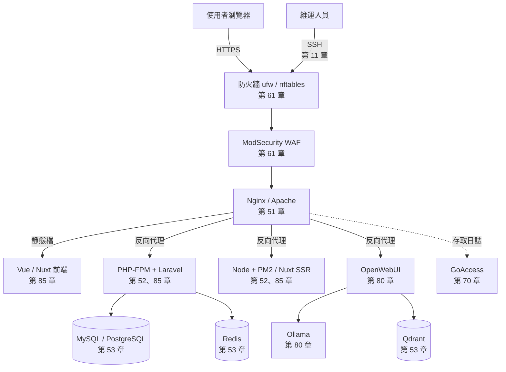

# 資訊設備維運教學手冊

> [!abstract] 這是什麼
> 一套**從完全零基礎一路寫到正式環境部署與資安強化**的資訊設備維運手冊。
> 涵蓋計算機概論、計算機網路、Linux、網路設備、機房、虛擬化、容器、
> Windows/AD、Web/DB/AI 服務、憑證 PKI、資訊安全、監控與維運制度。
>
> 主線環境為 **Ubuntu / Debian**，每篇附「Rocky / AlmaLinux（RHEL 系）對照」摺疊區塊。
> 每篇都包含觀念、可照做的範例、常見錯誤、安全性提醒、速查表、練習題與**小測驗**。

> [!tip] 第一次來？
> - **完全沒有資訊背景** → 從 [[00-計算機概論-索引]] 開始，一步一步來
> - **有基礎，想學 Linux** → 直接進 [[00-Linux基礎-索引]]
> - **不確定該從哪開始** → 看 [[01-學習路徑]]，依你的目標挑一條路線走
> - **想知道該考什麼證照** → [[05-國際證照地圖]]

---

## 章節總覽

全書依**十三個群組資料夾**編排，由淺入深。
每篇 frontmatter 的第一個標籤是 `群組/xxx`，左側標籤面板可直接依群組篩選。

| 群組 | 章節 | 內容 |
| --- | --- | --- |
| **① 基礎概論** `10-基礎概論/` | [[00-計算機概論-索引]] | **完全零基礎**：電腦、硬體、0與1、CPU、記憶體、作業系統、檔案、資料庫、用電、資安入門 |
| | [[00-計算機網路-索引]] | **完全零基礎**：分層模型、線材、MAC、IP、路由、NAT、TCP/UDP、DNS、DHCP、HTTP/HTTPS、Wi-Fi、VLAN |
| **② Linux** `20-Linux/` | [[00-Linux基礎-索引]] | 檔案系統、權限、程序、套件、systemd、日誌、Shell 腳本 |
| | [[00-Linux伺服器管理-索引]] | SSH、systemd 進階、排程實務、伺服器建置標準化 |
| **③ Windows** `25-Windows/` | [[00-Windows管理-索引]] | Windows Server、AD、GPO、WDS、故障排除 |
| **④ 網路與設備** `30-網路與網路設備/` | [[00-網路設備-索引]] | Cisco / Juniper 交換器、VLAN、Trunk、管理 IP |
| | [[00-機房與硬體-索引]] | 機房環境、空調、UPS、線路、伺服器硬體、汰換 |
| **⑤ 虛擬機與容器** `35-虛擬機與容器/` | [[00-虛擬化平台-索引]] | Proxmox VE、虛擬機、儲存、備份、高可用 |
| | [[00-容器化-索引]] | Docker、Docker Compose 與範例堆疊 |
| **⑥ 軟體與開發工具** `40-軟體與開發工具/` | **[[00-常用工具-索引]]** | **Git（含 git-flow）**、Vim/Nano、htop/btop、tcpdump、tmux、rsync |
| | **[[00-Web伺服器-索引]]** | **Nginx、Apache、MyGuard／Angie**，安裝到效能與安全 |
| | **[[00-應用執行環境-索引]]** | **PHP-FPM、Node.js 與 PM2**、Python 服務化 |
| | **[[00-資料庫-索引]]** | **MySQL**、PostgreSQL、Qdrant、Redis |
| **⑦ 系統及工具開發** `50-系統及工具開發/` | [[00-前端基礎-索引]] | HTML、CSS、JavaScript、TypeScript、開發者工具 |
| | [[00-Vue與Nuxt-索引]] | Vue 3、Pinia、Vue Router、Nuxt 3 |
| | [[00-PHP與Laravel-索引]] | PHP、Laravel、**Filament**、**Nova** |
| | [[00-Python開發-索引]] | Python、venv、**pandas**、報表、API 串接 |
| | [[00-Shell與PowerShell-索引]] | Bash、PowerShell、腳本安全與靜態檢查 |
| | [[00-自動化測試-索引]] | **Selenium**、**Playwright**、無頭執行與 CI |
| | [[00-n8n流程自動化-索引]] | **n8n** 自建、工作流程設計、維運自動化 |
| **⑧ 專案管理** `60-專案管理/` | [[00-專案管理基礎-索引]] | 生命週期、範疇時程、風險變更、機關採購 |
| | [[00-需求與規格管理-索引]] | 需求訪談、使用案例、規格、驗收準則 |
| | [[00-版本與發布管理-索引]] | 環境分離、**分支策略與 git-flow**、上線與回退 |
| | [[00-協作與知識管理-索引]] | 工單、知識庫、技術文件、團隊溝通 |
| **⑨ 資訊安全** `70-資訊安全/` | **[[00-憑證與PKI-索引]]** | **CSR 申請、自簽憑證鏈、SAN**、憑證派送 |
| | **[[00-資訊安全-索引]]** | 防火牆、**WAF／ModSecurity**、防護設備全覽、實踐規範、TWGCB |
| | [[00-Wazuh資安監控-索引]] | **Wazuh** SIEM/XDR、FIM、SCA、**TW-GCB 合規檢測** |
| **⑩ 系統維運** `80-系統維運/` | [[00-監控與日誌-索引]] | GoAccess、日誌輪替、監控告警、健康檢查 |
| | [[00-維運實務-索引]] | 每日／每月／每季維護、變更管理、盤點、交接 |
| **⑪ AI 人工智慧** `85-AI人工智慧/` | [[00-AI服務-索引]] | 地端 AI 架構、GPU/CUDA、RAG、效能與安全 |
| | [[00-Ollama-索引]] | 地端 LLM 執行引擎 |
| | [[00-OpenWebUI-索引]] | 對話介面、知識庫、工作區治理 |
| | [[00-ComfyUI-索引]] | 節點式影像生成與 API 串接 |
| **⑫ 雲端與架構** `90-雲端與架構/` | [[00-雲端與架構-索引]] | 服務模型、責任共擔、高可用、災難復原、混合雲 |
| **⑬ 實務案例** `95-實務案例/` | **[[00-部署實戰-索引]]** | **LXMP 全套整合**、Vue／Nuxt、Laravel Nova／Filament、**從 GitHub 專案部署** |
| 附錄 `98-附錄/` | [[00-附錄-索引]] | 發行版差異、錯誤訊息對照、實驗環境、**國際證照地圖** |

### 群組總覽頁

[[00-基礎概論-總覽-索引]] · [[00-Linux-總覽-索引]] · [[00-Windows-總覽-索引]] ·
[[00-網路與設備-總覽-索引]] · [[00-虛擬機與容器-總覽-索引]] · [[00-軟體與開發工具-總覽-索引]] ·
[[00-系統及工具開發-總覽-索引]] · [[00-專案管理-總覽-索引]] · [[00-資訊安全-總覽-索引]] ·
[[00-系統維運-總覽-索引]] · [[00-AI人工智慧-總覽-索引]] · [[00-雲端與架構-總覽-索引]] ·
[[00-實務案例-總覽-索引]]

---

## 速查頁

隨時可查、不需依序閱讀：

- [[02-指令速查表]] — 全書指令一頁式索引
- [[03-設定檔路徑速查]] — Ubuntu ⟷ RHEL 設定檔位置對照
- [[04-連接埠速查]] — 各服務預設埠與是否該對外開放
- [[05-名詞解釋]] — 技術名詞中英對照
- [[01-Ubuntu與RHEL差異總表]] — 兩系差異完整對照
- [[02-常見錯誤訊息對照]] — 錯誤訊息 → 原因 → 解法
- [[05-國際證照地圖]] — **每個章節可考取的國際證照，由低到高**
- [[15-資安證照與學習路徑]] — 資安領域的完整職涯地圖
- [[20-計概-資訊常見術語白話對照]] — 名詞白話速查（給新手）

---

## 整體架構

一台典型的正式環境伺服器，本書各章節的對應位置：

---

## 怎麼用這份筆記

> [!note] 閱讀方式
> - 每篇開頭的「這篇你會學到」就是該篇的驗收標準，讀完請自問是否都做得到。
> - `> [!info]-` 摺疊區塊是 RHEL 系對照，用 Ubuntu 的話可以直接略過。
> - 每篇最後的練習題請實際在練習機上做過一次，看懂不等於會做。
> - 需要練習機的話看 [[03-實驗環境搭建]]。

> [!tip] 找東西的三種方式
> 1. **依主題** — 從上面的章節總覽點進去。
> 2. **依關鍵字** — `Ctrl + Shift + F` 全域搜尋。
> 3. **依標籤** — 左側標籤面板，例如 `服務/nginx`、`安全/waf`、`部署/前後端分離`。

## 維護

- 新增筆記後執行 `python3 _工具/重建索引.py`，各章索引表格會自動更新。
- 執行 `python3 _工具/檢查連結.py` 檢查有沒有斷掉的 `[[連結]]`。
- 執行 `python3 _工具/進度統計.py` 查看各章撰寫進度。
- 還沒想好放哪的草稿先丟 [[00-收件匣]]。
