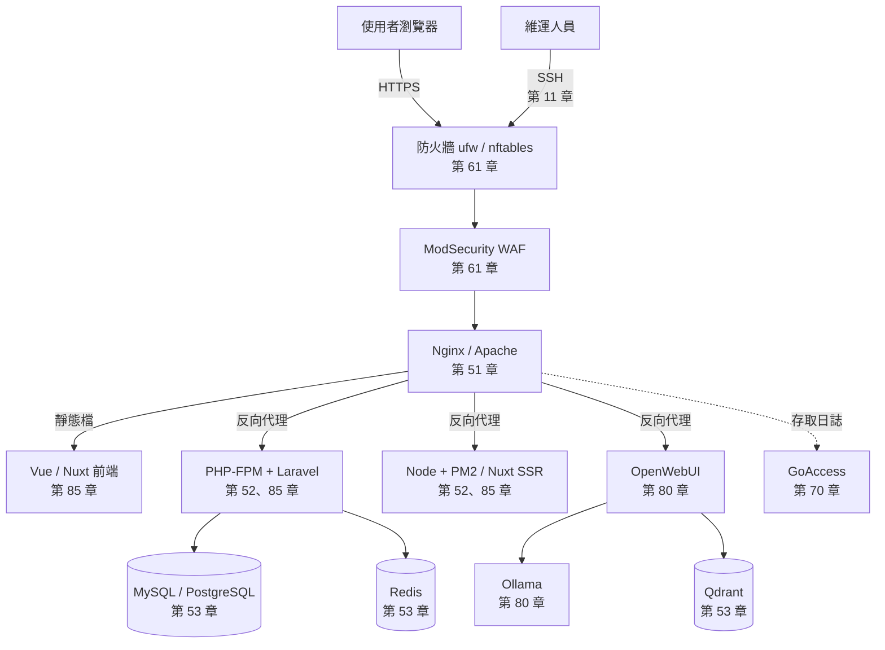

# 資訊設備維運教學手冊

> [!abstract] 這是什麼
> 一套**從完全零基礎一路寫到正式環境部署與資安強化**的資訊設備維運手冊。
> 涵蓋計算機概論、計算機網路、Linux、網路設備、機房、虛擬化、容器、
> Windows/AD、Web/DB/AI 服務、憑證 PKI、資訊安全、監控與維運制度。
>
> 主線環境為 **Ubuntu / Debian**，每篇附「Rocky / AlmaLinux（RHEL 系）對照」摺疊區塊。
> 每篇都包含觀念、可照做的範例、常見錯誤、安全性提醒、速查表、練習題與**小測驗**。

> [!tip] 第一次來？
> - **完全沒有資訊背景** → 從 [[010-01-00-idx-計算機概論]] 開始，一步一步來
> - **有基礎，想學 Linux** → 直接進 [[020-01-00-idx-Linux基礎]]
> - **不確定該從哪開始** → 看 [[000-01-idx-索引-學習路徑]]，依你的目標挑一條路線走
> - **想知道該考什麼證照** → [[980-05-ref-附錄-國際證照地圖]]

---

## 章節總覽

全書依**十三個群組資料夾**編排，由淺入深。
每篇 frontmatter 的第一個標籤是 `群組/xxx`，左側標籤面板可直接依群組篩選。

| 群組 | 章節 | 內容 |
| --- | --- | --- |
| **① 基礎概論** `10-基礎概論/` | [[010-01-00-idx-計算機概論]] | **完全零基礎**：電腦、硬體、0與1、CPU、記憶體、作業系統、檔案、資料庫、用電、資安入門 |
| | [[010-02-00-idx-計算機網路]] | **完全零基礎**：分層模型、線材、MAC、IP、路由、NAT、TCP/UDP、DNS、DHCP、HTTP/HTTPS、Wi-Fi、VLAN |
| **② Linux** `20-Linux/` | [[020-01-00-idx-Linux基礎]] | 檔案系統、權限、程序、套件、systemd、日誌、Shell 腳本 |
| | [[020-02-00-idx-Linux伺服器管理]] | SSH、systemd 進階、排程實務、伺服器建置標準化 |
| **③ Windows** `25-Windows/` | [[030-01-00-idx-Windows系統管理-Windows管理]] | Windows Server、AD、GPO、WDS、故障排除 |
| **④ 網路與設備** `30-網路與網路設備/` | [[040-01-00-idx-網路設備]] | Cisco / Juniper 交換器、VLAN、Trunk、管理 IP |
| | [[040-02-00-idx-機房與硬體]] | 機房環境、空調、UPS、線路、伺服器硬體、汰換 |
| **⑤ 虛擬機與容器** `35-虛擬機與容器/` | [[050-01-00-idx-虛擬化平台]] | Proxmox VE、虛擬機、儲存、備份、高可用 |
| | [[050-02-00-idx-容器化]] | Docker、Docker Compose 與範例堆疊 |
| **⑥ 軟體與開發工具** `40-軟體與開發工具/` | **[[060-01-00-idx-常用工具]]** | **Git（含 git-flow）**、Vim/Nano、htop/btop、tcpdump、tmux、rsync |
| | **[[060-02-00-idx-Web伺服器]]** | **Nginx、Apache、MyGuard／Angie**，安裝到效能與安全 |
| | **[[060-03-00-idx-應用執行環境]]** | **PHP-FPM、Node.js 與 PM2**、Python 服務化 |
| | **[[060-04-00-idx-資料庫]]** | **MySQL**、PostgreSQL、Qdrant、Redis |
| **⑦ 系統及工具開發** `50-系統及工具開發/` | [[070-01-00-idx-前端基礎]] | HTML、CSS、JavaScript、TypeScript、開發者工具 |
| | [[070-02-00-idx-Vue與Nuxt]] | Vue 3、Pinia、Vue Router、Nuxt 3 |
| | [[070-03-00-idx-Laravel-PHP與Laravel]] | PHP、Laravel、**Filament**、**Nova** |
| | [[070-04-00-idx-Python開發]] | Python、venv、**pandas**、報表、API 串接 |
| | [[070-05-00-idx-Shell與PowerShell]] | Bash、PowerShell、腳本安全與靜態檢查 |
| | [[070-06-00-idx-自動化測試]] | **Selenium**、**Playwright**、無頭執行與 CI |
| | [[070-07-00-idx-n8n流程自動化]] | **n8n** 自建、工作流程設計、維運自動化 |
| **⑧ 專案管理** `60-專案管理/` | [[080-01-00-idx-專案管理基礎]] | 生命週期、範疇時程、風險變更、機關採購 |
| | [[080-02-00-idx-需求與規格管理]] | 需求訪談、使用案例、規格、驗收準則 |
| | [[080-03-00-idx-發布-版本與發布管理]] | 環境分離、**分支策略與 git-flow**、上線與回退 |
| | [[080-04-00-idx-協作與知識管理]] | 工單、知識庫、技術文件、團隊溝通 |
| **⑨ 資訊安全** `70-資訊安全/` | **[[090-01-00-idx-PKI-憑證與PKI]]** | **CSR 申請、自簽憑證鏈、SAN**、憑證派送 |
| | **[[090-00-idx-資訊安全-總覽]]** | 防火牆、**WAF／ModSecurity**、防護設備全覽、實踐規範、TWGCB |
| | [[090-08-00-idx-Wazuh資安監控]] | **Wazuh** SIEM/XDR、FIM、SCA、**TW-GCB 合規檢測** |
| **⑩ 系統維運** `80-系統維運/` | [[100-01-00-idx-監控與日誌]] | GoAccess、日誌輪替、監控告警、健康檢查 |
| | [[100-02-00-idx-維運實務]] | 每日／每月／每季維護、變更管理、盤點、交接 |
| **⑪ AI 人工智慧** `85-AI人工智慧/` | [[110-01-00-idx-AI服務]] | 地端 AI 架構、GPU/CUDA、RAG、效能與安全 |
| | [[110-02-00-idx-Ollama]] | 地端 LLM 執行引擎 |
| | [[110-03-00-idx-OpenWebUI]] | 對話介面、知識庫、工作區治理 |
| | [[110-04-00-idx-ComfyUI]] | 節點式影像生成與 API 串接 |
| **⑫ 雲端與架構** `90-雲端與架構/` | [[120-01-00-idx-雲端與架構]] | 服務模型、責任共擔、高可用、災難復原、混合雲 |
| **⑬ 實務案例** `95-實務案例/` | **[[130-01-00-idx-部署實戰]]** | **LXMP 全套整合**、Vue／Nuxt、Laravel Nova／Filament、**從 GitHub 專案部署** |
| 附錄 `98-附錄/` | [[980-00-idx-附錄]] | 發行版差異、錯誤訊息對照、實驗環境、**國際證照地圖** |

### 群組總覽頁

[[010-00-idx-基礎概論-總覽]] · [[020-00-idx-Linux-總覽]] · [[030-00-idx-Windows-總覽]] ·
[[040-00-idx-網路與設備-總覽]] · [[050-00-idx-虛擬機與容器-總覽]] · [[060-00-idx-軟體與開發工具總覽]] ·
[[070-00-idx-系統及工具開發總覽]] · [[080-00-idx-專案管理-總覽]] · [[090-00-idx-資訊安全-總覽]] ·
[[100-00-idx-系統維運-總覽]] · [[110-00-idx-AI人工智慧總覽]] · [[120-00-idx-雲端與架構-總覽]] ·
[[130-00-idx-實務案例-總覽]]

---

## 速查頁

隨時可查、不需依序閱讀：

- [[000-02-ref-索引-指令速查表]] — 全書指令一頁式索引
- [[000-03-ref-索引-設定檔路徑速查]] — Ubuntu ⟷ RHEL 設定檔位置對照
- [[000-04-ref-索引-連接埠速查]] — 各服務預設埠與是否該對外開放
- [[000-05-ref-索引-名詞解釋]] — 技術名詞中英對照
- [[980-01-ref-附錄-Ubuntu與RHEL差異總表]] — 兩系差異完整對照
- [[980-02-guide-附錄-常見錯誤訊息對照]] — 錯誤訊息 → 原因 → 解法
- [[980-05-ref-附錄-國際證照地圖]] — **每個章節可考取的國際證照，由低到高**
- [[090-07-13-svc-資安實踐-資安證照與學習路徑]] — 資安領域的完整職涯地圖
- [[010-01-20-ref-計概-資訊常見術語白話對照]] — 名詞白話速查（給新手）

---

## 表單範本（Word 檔，可直接列印）

日常維運要留的紀錄，已做成 **22 份 .docx**，放在 vault 的 `_表單範本/` 資料夾，
在 Obsidian 檔案總管就能看到，右鍵「Show in system explorer」即可取出。

| 用途 | 表單 |
| --- | --- |
| 例行檢查 | 每日／每週／每月／每季／年度維護檢查表 |
| 維運制度 | 變更管理申請單、事件處理紀錄單、職務交接清單 |
| 機房管理 | 機房巡檢表、設備盤點表、進出機房登記表、線路標示紀錄 |
| 伺服器管理 | 新機建置驗收表、伺服器規格與用途登記表 |
| 專案管理 | 需求規格書範本、專案進度報告、驗收測試紀錄、風險登錄表 |
| 資訊安全 | 資安事件通報單、弱點修補追蹤表、權限申請與覆核表、TWGCB 例外申請單 |

每份表單最後一行都標了對應章節，想知道「這一欄為什麼要填」就回去看那一章。
內容要改就改 `_工具/表單定義.py`，再跑 `python3 _工具/產生表單.py` 重新產生。

---

## 整體架構

一台典型的正式環境伺服器，本書各章節的對應位置：

---

## 怎麼用這份筆記

> [!note] 閱讀方式
> - 每篇開頭的「這篇你會學到」就是該篇的驗收標準，讀完請自問是否都做得到。
> - `> [!info]-` 摺疊區塊是 RHEL 系對照，用 Ubuntu 的話可以直接略過。
> - 每篇最後的練習題請實際在練習機上做過一次，看懂不等於會做。
> - 文中的 ★ 是重要程度：★ 一般提示、★★★ 容易出錯、★★★★ 出錯會造成服務中斷或資安事件。
>   時間有限的話，**先確保 ★★★★ 以上的都弄懂**。
> - 需要練習機的話看 [[980-03-guide-附錄-實驗環境搭建]]。

> [!tip] 找東西的四種方式
> 1. **依主題** — 從上面的章節總覽點進去。
> 2. ★★★★ **出事了依症狀查** — 每章的 **98 常見故障排除手冊**，依「你看到什麼」而不是
>    「這屬於什麼技術」來找，每個情境都連回原文說明原理。
> 3. **依關鍵字** — `Ctrl + Shift + F` 全域搜尋。
> 4. **依標籤** — 左側標籤面板，例如 `服務/nginx`、`安全/waf`、`部署/前後端分離`。

> [!abstract] ★★★★ 每章結尾的兩份文件
> 每個章節資料夾的最後固定有兩份收尾文件，編號是保留的：
>
> | 編號 | 文件 | 什麼時候用 |
> | ---: | --- | --- |
> | **98** | **常見故障排除手冊** | **出事的時候** —— 依症狀查、有一頁式急救卡、連回原文看原理 |
> | **99** | **總結小考** | **讀完一章之後** —— 是非 50 題 + 選擇 50 題，每題詳解都指回原文 |
>
> 小考的答案放在預設摺疊的區塊裡，**請先自己作答再展開**。
> 錯的題目順著 `→ 詳見` 連結回去補，比重讀整章有效率。

## 維護

- 新增筆記後執行 `python3 _工具/重建索引.py`，各章索引表格會自動更新。
- 執行 `python3 _工具/檢查連結.py` 檢查有沒有斷掉的 `[[連結]]`。
- 執行 `python3 _工具/進度統計.py` 查看各章撰寫進度。
- 還沒想好放哪的草稿先丟 [[990-00-idx-收件匣]]。
