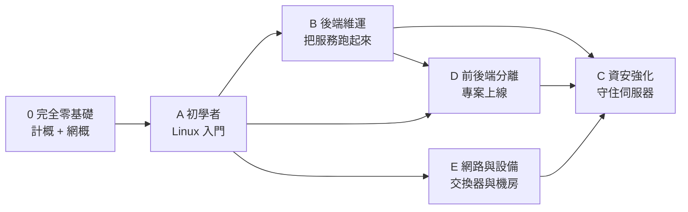

# 學習路徑

> [!abstract] 怎麼用這頁
> 這套手冊有三百多篇，**不要從頭讀到尾**。
> 先從下面的路線挑一條符合你目標的，依序走完，之後再依需要橫向補充。
> 每條路線都標了大致的時間投入，以每天一到兩小時、實際動手做為前提估算。

> [!tip] 完全沒有資訊背景？請先走「路線 0」
> 如果你連「記憶體」和「硬碟」的差別都還沒分清楚，
> **請不要直接跳進 Linux** —— 先走下面的 **路線 0**，
> 它是為完全外行的人寫的，用大量生活比喻從零開始。

---

## 路線總覽

**路線 0** 是給完全外行的人；有基本電腦概念的可以從 **A** 開始；
已有 Linux 基礎的可以直接跳到 B、D 或 E。

---

## 路線 0 — 完全零基礎：踏進資訊的世界

**適合**：完全沒有資訊背景的人。剛接手資訊業務的行政同仁、想轉職的人、
或任何覺得「技術文件看不懂」的人。
**目標**：建立完整的心智地圖，聽得懂技術討論，之後讀任何章節都不會卡在名詞上。
**時間**：約 4～6 週。

### 第一階段：一台電腦是怎麼回事（約 2 週）

1. [[01-計概-電腦到底是什麼]] — 用生活比喻拆解這台機器
2. [[02-計概-主機裡面有什麼]] — 打開機殼認識每個零件
3. [[03-計概-0與1和資料單位]] — 為什麼 1TB 硬碟只有 931GB
4. [[04-計概-數字系統與文字編碼]] — 二進位、十六進位與中文亂碼
5. [[05-計概-CPU如何工作]] → [[06-計概-記憶體與儲存階層]] ← **理解「電腦為什麼慢」的關鍵**
6. [[07-計概-磁碟格式化與RAID入門]] — 格式化、RAID、NAS
7. [[08-計概-作業系統是什麼]] → [[09-計概-檔案與檔案系統]]

### 第二階段：軟體與資料（約 1 週）

8. [[10-計概-軟體授權與程式怎麼跑起來]] — 開源、編譯、相依性
9. [[11-計概-程式程序與多工]] — 電腦卡頓到底卡在哪
10. [[12-計概-輸入輸出與週邊設備]] — 各種接頭與驅動程式
11. [[13-計概-圖片聲音與影片]] — 多媒體與壓縮
12. [[14-計概-資料庫是什麼]] — 從 Excel 升級到資料庫

### 第三階段：網路（約 2 週）

13. [[16-計概-網路初體驗]] — 先建立最基本的網路直覺
14. [[01-網概-網路是什麼]] → [[02-網概-ISP與上網方式]] → [[03-網概-網路分層模型]]
15. [[04-網概-線材與實體層]] → [[05-網概-MAC位址與交換器]]
16. [[06-網概-IP位址與子網路]] ← **一定要動手算過**
17. [[07-網概-路由與封包旅程]] → [[08-網概-NAT與私有位址]]
18. [[09-網概-TCP與UDP]] → [[10-網概-連接埠與應用層協定]]
19. [[11-網概-DNS網域名稱系統]] → [[12-網概-DHCP自動取得設定]]
20. [[13-網概-HTTP與HTTPS]] → [[14-網概-一個網頁請求的完整旅程]] ← **總複習**

### 第四階段：踏進實務（約 1 週）

21. [[15-計概-電力基礎與用電安全]] — 機房與 UPS 的基礎
22. [[17-計概-雲端虛擬化與容器]] — 白話理解雲端
23. [[18-計概-資訊安全初步]] → [[18-網概-網路安全基礎]]
24. [[17-網概-網路排錯入門]] ← **學會排錯，你就能開始接業務了**
25. [[19-計概-電腦規格與選購]] — 採購與升級判斷
26. [[20-計概-資訊常見術語白話對照]] — 當作字典留著查

> [!tip] 走完路線 0 之後
> 你應該能完整聽懂資訊室的對話，也能自己排查大部分的網路問題。
> **接著走 路線 A**（Linux 入門），或依你的工作內容挑 B / E。
>
> 想知道可以考什麼證照 → [[05-國際證照地圖]]

---

## 路線 A — 初學者：把 Linux 用起來

**適合**：完全沒碰過 Linux，或只會複製貼上指令但不知道在做什麼。
**目標**：能獨立在一台機器上安裝軟體、管理權限、排查基本問題。
**時間**：約 3～4 週。

1. [[03-實驗環境搭建]] — 先有一台可以隨便玩、玩壞了能還原的機器
2. [[01-Linux是什麼與發行版選擇]] → [[02-實驗環境準備與初次登入]] → [[03-終端機與Shell入門]]
3. [[04-檔案系統與目錄結構]] → [[05-路徑導覽與檔案操作]] → [[06-檢視檔案內容]] → [[07-尋找檔案與內容]]
4. [[08-檔案權限與擁有者]] → [[09-使用者與群組管理]] ← **最重要的兩篇，後面所有章節都會用到**
5. [[10-程序管理與訊號]] → [[11-輸入輸出重導向與管線]] → [[14-套件管理]]
6. [[17-systemd服務管理]] → [[19-日誌系統]] → [[23-Linux常見疑難排解]]
7. 工具補強：[[02-Vim-基礎操作]] 或 [[01-Nano-快速上手]]（擇一）、[[01-tmux-工作階段管理]]
8. 版本控制：[[01-Git-觀念與初次設定]] → [[02-Git-基本工作流程]] → [[03-Git-分支與合併]] → [[04-Git-遠端協作]]

> [!tip] 這條路線的驗收
> 能在一台新機器上：建立使用者、設好權限、裝好軟體、寫成 systemd 服務、從日誌查出它為什麼掛掉。

---

## 路線 B — 後端維運：把服務跑起來

**適合**：走完路線 A，要開始架設實際服務。
**目標**：能獨立架起 Web 伺服器、資料庫與應用執行環境，並讓它穩定運作。
**時間**：約 4～6 週。

1. **遠端管理**：[[01-SSH-原理與第一次連線]] → [[02-SSH-金鑰認證與ssh-agent]] → [[03-SSH-客戶端設定檔]] → [[04-sshd-伺服器端設定]]
2. **先做基本加固**：[[01-伺服器初始安全設定]] → [[02-防火牆-ufw基礎與實務]]（不要等到最後才做安全）
3. **Web 伺服器**：[[01-Web伺服器概論]] → Nginx 全套 [[00-Nginx-索引]]（重點：[[03-Nginx-location與rewrite]]、[[04-Nginx-反向代理與負載平衡]]、[[06-Nginx-HTTPS與Certbot]]）
4. **執行環境**（依專案擇一或兩者）：
   - PHP 路線：[[01-PHP-安裝與多版本管理]] → [[02-PHP-FPM設定與Pool調校]] → [[03-PHP-ini重要參數]] → [[04-Composer-套件管理]]
   - Node 路線：[[01-Node-安裝與版本管理]] → [[02-npm-pnpm-yarn套件管理]] → [[03-PM2-程序管理入門]] → [[04-PM2-進階設定與部署]]
5. **資料庫**（擇一深入）：[[00-MySQL-索引]] 或 [[00-PostgreSQL-索引]]，備份與還原那篇不可跳過
6. **容器化**：[[01-容器概念與Docker安裝]] → Docker 全套 → [[01-Compose-語法基礎]] → [[02-Compose-多服務編排實戰]]
7. **監控**：[[01-htop-操作與判讀]] → [[03-資源診斷工具集]] → [[00-GoAccess-索引]] → [[03-系統監控與告警]]
8. **排錯能力**：[[03-ss-netstat-與lsof]] → [[05-curl-與HTTP除錯]] → [[06-dig-與DNS排查]] → [[04-效能瓶頸排查方法論]]

> [!tip] 這條路線的驗收
> 能從一台空機器開始，架好 Nginx + 應用 + 資料庫，掛上 HTTPS，設好備份與監控。

---

## 路線 D — 前後端分離：把專案送上線

**適合**：手上有 Vue / Nuxt 前端加 Laravel 後端的專案要部署。
**目標**：完成一次端到端部署，並且知道每個環節出問題時該查哪裡。
**時間**：約 2～3 週（需先具備路線 B 的 Web 伺服器與執行環境基礎）。

1. **共通觀念**：[[01-部署共通觀念]] — 目錄佈局、權限模型、環境分離、回滾
2. **架構選型**：[[01-前後端分離架構選型]] ← **先讀這篇，它決定後面所有設定**
3. **後端**：[[01-Laravel-環境需求與安裝]] → [[02-Laravel-Nginx與PHP-FPM設定]] → [[02-Laravel-API後端部署]]
4. **接起來**：[[03-跨網域與CORS設定]] → [[04-認證串接-Sanctum與JWT]] → [[05-Nginx-前後端流量分流設定]]
5. **前端**（依專案擇一）：
   - Vue SPA：[[01-Vue-建置與Nginx靜態部署]] → [[02-Vue-SPA路由與API代理]] → 實戰 [[06-Vue-Laravel完整部署實戰]]
   - Nuxt SSR：[[01-Nuxt-渲染模式與部署選型]] → [[02-Nuxt-SSR與PM2部署]] → [[03-Nuxt-Nginx反向代理與快取]] → 實戰 [[07-Nuxt-Laravel-SSR完整部署實戰]]
6. **背景作業**：[[03-Laravel-佇列排程與Supervisor]] → [[04-Redis快取入門]]
7. **後台**（有用到再讀）：[[05-Laravel-Filament部署]] 或 [[06-Laravel-Nova部署]]
8. **環境與自動化**：[[08-前後端分離的環境變數與建置流程]] → [[04-Laravel-快取最佳化與部署流程]] → [[06-部署自動化]]
9. **上線前自檢**：[[07-Laravel-正式環境安全檢查表]]
10. **出問題時**：[[09-前後端分離常見問題排查]] ← 加入書籤，一定用得到

> [!tip] 這條路線的驗收
> 前端能登入、能打 API、重新整理不會 404、HTTPS 正常、佇列有在跑、部署腳本能一鍵上線也能回滾。

---

## 路線 C — 資安強化：守住伺服器

**適合**：服務已經上線，要把安全性補到可以放心的程度。
**目標**：把攻擊面降到最低，並在出事時有辦法追查與復原。
**時間**：約 2～3 週。

1. **基礎加固**：[[01-伺服器初始安全設定]] → [[07-SSH-安全強化]] → [[05-Fail2ban入侵防護]]
2. **網路層**：[[02-防火牆-ufw基礎與實務]] → [[03-防火牆-nftables與iptables]]（跑 Docker 的話必讀）→ [[06-遠端存取安全]]
3. **傳輸層**：[[01-TLS憑證與HTTPS實務]] → [[09-Nginx-安全設定]]
4. **應用層**：[[02-應用層安全]] → [[06-PHP-安全設定]] → [[03-跨網域與CORS設定]]
5. **WAF**：[[01-WAF概念與ModSecurity安裝]] → [[02-OWASP-CRS規則集]] → [[03-ModSecurity-規則調校與誤判處理]] → [[04-ModSecurity-日誌分析與監控]]
6. **資料層**：[[07-MySQL-安全強化]] 或 [[08-PostgreSQL-安全強化]]、[[06-Qdrant-安全與API金鑰]]
7. **容器**：[[08-Docker-安全實務]]
8. **機密與稽核**：[[03-機密管理與金鑰保護]] → [[08-系統強化與稽核]] → [[07-SELinux與AppArmor]]
9. **復原能力**：[[03-備份策略與還原演練]] → [[04-備份災難復原與入侵應變]]

> [!tip] 這條路線的驗收
> 掃描自己的機器只看得到該開的埠、WAF 在阻擋模式下正常運作、備份能真的還原回來。

---

## 橫向補充

不屬於任何單一路線，但長期會反覆用到：

- **效率**：[[03-Bash與Zsh效率設定]]、[[04-現代CLI工具集]]、[[03-Vim-進階與設定]]
- **深度排錯**：[[01-tcpdump-基礎抓包]]、[[02-tcpdump-進階過濾與實戰]]、[[22-Shell腳本進階]]
- **AI 服務**：[[00-AI服務-索引]] 全章（需先具備 Docker 或 Python 環境基礎）
- **團隊協作**：[[09-Git-團隊規範與實戰情境]]、[[05-Git-回復與重寫歷史]]

## 相關

- [[00-首頁]]
- [[03-實驗環境搭建]]
