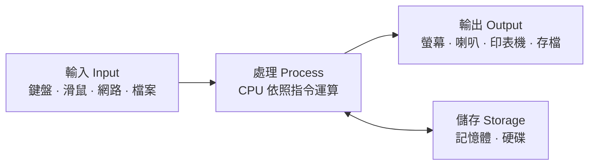
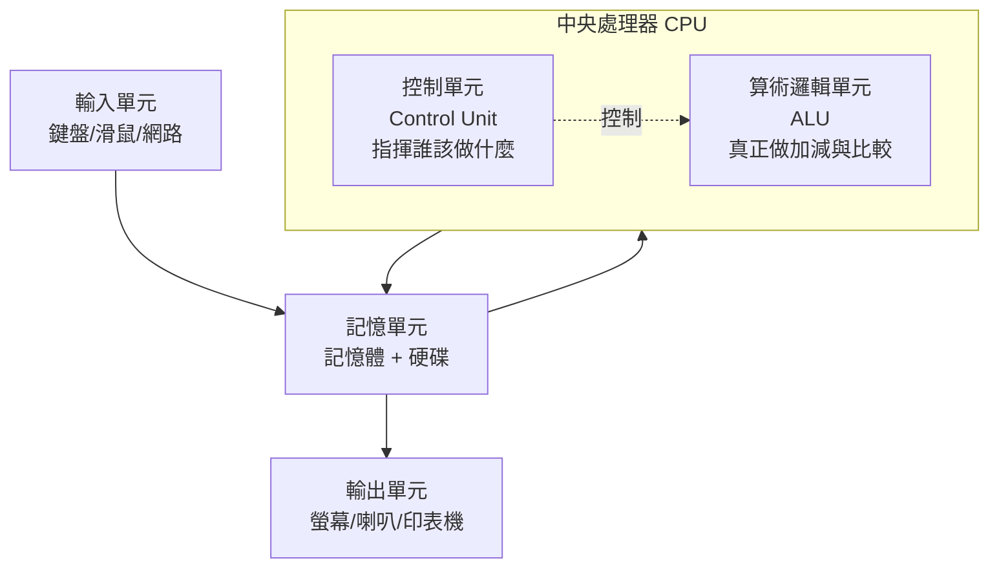

# 電腦到底是什麼

> [!abstract] 這篇你會學到
> - 用一句話說出電腦的本質，而且是**正確**的那句話
> - 分辨「硬體」與「軟體」，並知道為什麼這個分別很重要
> - 理解「輸入 → 處理 → 輸出」這個貫穿全書的循環
> - 知道為什麼電腦只認得 0 和 1，而不是直接認得中文
> - 看懂「開機」這件事實際上發生了什麼

## 前置知識

**完全不需要。** 這是整本手冊的第一篇，假設你只有「我會用手機、會開電腦上網」的經驗。

如果你看到任何一個詞不懂，先繼續往下讀 —— 這一篇會盡量在名詞第一次出現時就解釋它。

---

## 觀念說明

### 一句話：電腦是一台「照著指示，快速處理資料的機器」

就這樣。沒有更神秘的東西。

我們把這句話拆成三個部分：

| 關鍵詞 | 意思 | 生活對照 |
| --- | --- | --- |
| **照著指示** | 電腦自己不會想事情，它只會執行別人寫好的步驟 | 食譜。廚師照食譜做菜，食譜沒寫的就不會做 |
| **資料** | 數字、文字、圖片、聲音，任何可以被記錄的東西 | 食材 |
| **快速** | 現代 CPU 一秒可以執行數十億個步驟 | 一個一秒能切一億次菜的廚師 |

> [!note] 電腦「很笨但很快」
> 這是理解電腦最重要的一句話。
> 電腦不會判斷你要什麼，它只會**完全照字面**執行指令。
> 你叫它把整個硬碟刪掉，它不會問「你確定嗎」—— 除非有人事先寫了「要問一下」這個指令。
>
> 所以之後你遇到「電腦怎麼這麼笨」的時候，答案通常是：
> **某個人沒有把那個情況寫進指令裡**。

### 硬體與軟體：身體與思想

| | 硬體（Hardware） | 軟體（Software） |
| --- | --- | --- |
| 是什麼 | 摸得到的實體零件 | 摸不到的指令與資料 |
| 例子 | CPU、記憶體、硬碟、螢幕、鍵盤 | Windows、Chrome、Word、你存的照片 |
| 壞掉時 | 要換零件、要花錢 | 通常重裝就好 |
| 生活對照 | 唱片機 | 唱片上的音樂 |

> [!tip] 一個很好用的判斷法
> **能不能用槌子敲壞？** 能，就是硬體；不能，就是軟體。
>
> 這聽起來像玩笑，但實務上很有用。當使用者說「電腦壞了」，
> 你第一步要判斷的就是「這是硬體問題還是軟體問題」——
> 前者要叫維修，後者你自己就能修。

還有一個中間地帶叫做 **韌體（Firmware）**：
它是「燒在硬體裡面的軟體」，例如主機板上的 BIOS/UEFI、印表機裡控制列印的程式。
它是軟體（是指令），但住在硬體裡面，一般使用者不會去改它。

### 貫穿一切的循環：輸入 → 處理 → 輸出

不管電腦在做什麼，都逃不出這三個階段。



舉幾個例子，你會發現全部一樣：

| 你在做的事 | 輸入 | 處理 | 輸出 |
| --- | --- | --- | --- |
| 用小算盤算 3+5 | 你按下 3、+、5、= | CPU 執行加法 | 螢幕顯示 8 |
| 打一份文件 | 鍵盤敲進來的字 | 排版、拼字檢查 | 螢幕上的文件、存成檔案 |
| 看 YouTube | 從網路收到的影片資料 | 解碼壓縮過的影像 | 螢幕畫面 + 喇叭聲音 |
| 網頁伺服器回應請求 | 從網路收到「我要看首頁」 | 讀出網頁檔案 | 從網路把網頁送回去 |

> [!example] 為什麼這個循環很重要
> 之後你排查任何問題，都可以用這三個階段來定位：
>
> **使用者說「印表機印不出來」**
> - 輸入有問題嗎？（電腦有把資料送出去嗎？→ 看列印佇列）
> - 處理有問題嗎？（驅動程式對不對？）
> - 輸出有問題嗎？（印表機有紙有墨嗎？線有插好嗎？）
>
> 這比亂猜有效率得多。本手冊 [[17-網概-網路排錯入門]] 用的就是同一套思維。

### 為什麼電腦只懂 0 和 1

這是新手最常問、也最少被好好回答的問題。

答案出乎意料地務實：**因為「有電」和「沒電」是最容易分辨、最不會出錯的兩種狀態。**

想像你要用電線傳訊息。你可以選：

| 方案 | 怎麼做 | 問題 |
| --- | --- | --- |
| 用電壓高低分成 10 段 | 0V=0、0.5V=1、1V=2… | 電壓稍微飄一點就認錯了，抗雜訊能力極差 |
| 只分兩段 | 有電 = 1、沒電 = 0 | 電壓飄一點也不會認錯，**極度可靠** |

電腦選了第二種。這就是 **二進位（binary）**。

> [!note] 那中文怎麼辦？
> 用「編號」。
> 就像每個人有身分證字號一樣，每個文字也被分配一個號碼。
> 例如在 Unicode 這套編號系統中，「電」這個字的編號是 **0x96FB**。
>
> 電腦裡沒有「電」這個字，只有這個數字。
> 是螢幕上的字型檔案負責把這個數字**畫**成你看到的形狀。
>
> 所以當編號系統對不上時，就會出現**亂碼** —— 詳見 [[04-計概-數字系統與文字編碼]]。

### 電腦的五大單元（正式說法）

前面的比喻講完了，現在補上教科書的正式分類，讓你以後看技術文件不會卡住。



| 單元 | 白話 | 實際零件 |
| --- | --- | --- |
| **控制單元（CU）** | 工頭。決定下一步做什麼 | CPU 的一部分 |
| **算術邏輯單元（ALU）** | 計算機。真正做加減乘除與比大小 | CPU 的一部分 |
| **記憶單元** | 桌面 + 抽屜。放正在用的與長期存的資料 | 記憶體、硬碟 |
| **輸入單元** | 耳朵眼睛。接收外界的資訊 | 鍵盤、滑鼠、網卡、麥克風 |
| **輸出單元** | 嘴巴手。把結果送出去 | 螢幕、喇叭、印表機、網卡 |

> [!tip] 網卡同時是輸入也是輸出
> 這是新手常忽略的一點。網路卡既接收資料（輸入）也送出資料（輸出）。
> 硬碟也是 —— 讀檔案時是輸入，寫檔案時是輸出。

---

## 基礎操作：開機的那幾秒發生了什麼

你按下電源鍵，到看見桌面，大約 10～60 秒。這段時間裡發生的事情，
是理解「電腦怎麼運作」最好的教材。

### 第一步：通電與自我檢查（POST）

按下電源 → 電源供應器把市電（110V 交流）轉成主機板要的電（12V／5V／3.3V 直流）→
主機板上的一個小晶片（**UEFI**，舊稱 BIOS）醒過來。

它做的第一件事叫 **POST**（Power-On Self-Test，開機自我檢測）：

1. CPU 在嗎？
2. 記憶體在嗎？容量多少？
3. 顯示裝置在嗎？
4. 鍵盤在嗎？

> [!example] 嗶聲的意義
> 老一點的主機板在 POST 失敗時會用**嗶聲**告訴你哪裡壞了。
> 雖然各家定義不同，但一個通用的原則是：
>
> | 現象 | 常見原因 |
> | --- | --- |
> | 一短聲後正常開機 | 一切正常 |
> | 連續長嗶或反覆嗶叫 | **記憶體**沒插好或壞了（最常見） |
> | 一長兩短之類的組合 | **顯示卡**沒插好 |
> | 完全沒聲音、沒畫面、風扇也不轉 | **電源**問題 |
>
> 現代主機板多改用主機板上的 **Debug LED 燈號**（標示 CPU／DRAM／VGA／BOOT），
> 哪一顆燈卡住就是哪個部分有問題。這在 [[27-硬體資訊與裝置管理]] 有更完整的排查流程。

### 第二步：找到開機裝置

UEFI 依照設定好的順序去找「哪個裝置裡面有作業系統」：

```
第 1 順位：M.2 SSD      ← 找到了，就用它
第 2 順位：SATA 硬碟
第 3 順位：USB 隨身碟
第 4 順位：網路開機（PXE）
```

> [!tip] 這就是「重灌要調開機順序」的原因
> 你想用 USB 隨身碟重灌，就得把 USB 的順位調到硬碟前面，
> 否則電腦會直接從硬碟開機，根本不理你的隨身碟。
>
> 機關裡大量部署電腦用的 **WDS／PXE 網路開機**，
> 就是把「網路開機」調到第一順位 —— 詳見 `20-Windows系統管理` 的 WDS 章節。

### 第三步：載入作業系統

找到開機裝置後，UEFI 讀取上面的**開機載入程式（bootloader）**，
由它把作業系統的核心（kernel）從硬碟搬進記憶體，然後把控制權交出去。

從這一刻起，**主導權從 UEFI 轉移到作業系統**。

| 系統 | 開機載入程式 |
| --- | --- |
| Windows | Windows Boot Manager（`bootmgfw.efi`） |
| Linux | GRUB2（多數發行版）或 systemd-boot |
| macOS | boot.efi |

### 第四步：作業系統啟動服務、顯示登入畫面

核心接手後，開始：
- 認識所有硬體（載入驅動程式）
- 啟動背景服務（網路、印表機、防毒……）
- 顯示登入畫面

> [!note] 「開機好慢」通常慢在第四步
> POST 和載入核心通常只要幾秒。真正拖時間的是第四步的**一堆背景服務**。
> Windows 可以用「工作管理員 → 開機」分頁看誰拖累了開機；
> Linux 則用 `systemd-analyze blame`，這在 [[17-systemd服務管理]] 有詳細說明。

---

## 進階應用：一台電腦與一台伺服器的差別

你桌上的電腦和機房裡的伺服器，本質上是同一種東西，
差別在於**設計目標不同**。

| 面向 | 個人電腦 | 伺服器 |
| --- | --- | --- |
| 使用時間 | 每天 8 小時，週末關機 | **7×24 全年無休** |
| 使用者 | 一個人 | 同時服務數十到數萬人 |
| 壞掉的代價 | 你一個人不能工作 | 全單位不能工作 |
| 零件選擇 | 便宜、夠快就好 | **可靠度優先**（ECC 記憶體、備援電源、RAID 硬碟） |
| 有沒有螢幕 | 一定有 | 通常沒有，用網路遠端管理 |
| 外型 | 直立機殼 | 機架式（1U／2U），裝在機櫃裡 |

> [!tip] 「可靠度優先」具體是什麼意思
> - **ECC 記憶體**：能自動偵測並修正記憶體的隨機錯誤。個人電腦出現一次記憶體錯誤，
>   可能只是某個程式閃退；伺服器出現一次，可能整個資料庫寫入錯誤的數字。
> - **備援電源**：兩顆電源供應器，壞一顆還能繼續跑，而且可以**不關機更換**。
> - **RAID**：多顆硬碟組成一組，壞一顆資料還在。詳見 [[29-網路儲存與軟體RAID]]。
>
> 這些設計讓伺服器貴很多，但買的是**不中斷**。

### 那雲端呢？

「雲端」聽起來很虛無，但它的實體就是**別人家機房裡的伺服器**。

你租用 AWS 或 Google Cloud 的一台機器，實際上是某個資料中心裡的一台實體伺服器，
用虛擬化技術切出來的一小塊。詳見 [[17-計概-雲端虛擬化與容器]]。

---

## 完整實戰範例：認識你手邊的這台電腦

跟著做一遍，你會對「電腦是什麼」有實感。

### Windows

**步驟 1：看基本規格**

按 `Win` + `R`，輸入 `msinfo32`，按 Enter。

你會看到類似這樣的資訊：

```
作業系統名稱      Microsoft Windows 11 專業版
系統製造商        Dell Inc.
系統型號          OptiPlex 7010
處理器            13th Gen Intel(R) Core(TM) i5-13500 @ 2.50GHz, 14 個核心
已安裝實體記憶體  16.0 GB
BIOS 版本/日期    Dell Inc. 1.15.0, 2025/3/12
```

對照前面學的：
- **處理器** = CPU = 控制單元 + 算術邏輯單元
- **已安裝實體記憶體** = 記憶單元中「快但斷電就沒」的那部分
- **BIOS 版本** = 韌體，就是負責 POST 的那個程式

**步驟 2：看正在跑什麼**

按 `Ctrl` + `Shift` + `Esc` 打開工作管理員 → 「效能」分頁。

觀察 CPU 的曲線。什麼都不做的時候大約 1～5%，
開一個瀏覽器分頁播影片，數字會跳上去 —— 那就是「處理」正在發生。

**步驟 3：觀察輸入與輸出**

在工作管理員的「效能」分頁點「乙太網路」或「Wi-Fi」，
然後開一個網頁。你會看到**接收**的曲線跳起來 —— 那是輸入。

### Linux（WSL2、虛擬機或伺服器都可以）

```bash
# 看 CPU
$ lscpu | head -15
Architecture:            x86_64
  CPU op-mode(s):        32-bit, 64-bit
CPU(s):                  14
Model name:              13th Gen Intel(R) Core(TM) i5-13500

# 看記憶體（-h 表示用人看得懂的單位）
$ free -h
               total        used        free      shared  buff/cache   available
Mem:            15Gi       2.1Gi        11Gi        12Mi       2.4Gi        13Gi
Swap:          4.0Gi          0B       4.0Gi

# 看硬碟
$ lsblk
NAME   MAJ:MIN RM   SIZE RO TYPE MOUNTPOINTS
sda      8:0    0   256G  0 disk
├─sda1   8:1    0   512M  0 part /boot/efi
└─sda2   8:2    0 255.5G  0 part /

# 看開機花了多久
$ systemd-analyze
Startup finished in 3.821s (kernel) + 12.443s (userspace) = 16.264s
```

> [!note] 對照一下這幾個指令
> - `lscpu` 回答「處理單元長什麼樣」
> - `free -h` 回答「記憶單元有多大、用掉多少」
> - `lsblk` 回答「儲存裝置有哪些」
> - `systemd-analyze` 回答「開機的第四步花了多久」
>
> 這些指令在 [[27-硬體資訊與裝置管理]] 有完整說明，現在只要知道它們存在就好。

> [!info]- Windows 的對應指令（PowerShell）
> ```powershell
> # CPU
> Get-CimInstance Win32_Processor | Select-Object Name, NumberOfCores
>
> # 記憶體（換算成 GB）
> Get-CimInstance Win32_ComputerSystem |
>     Select-Object @{n='RAM(GB)';e={[math]::Round($_.TotalPhysicalMemory/1GB,1)}}
>
> # 硬碟
> Get-CimInstance Win32_DiskDrive | Select-Object Model, Size
> ```

---

## 常見錯誤與排錯

這一篇是觀念篇，所以這裡列的是**常見誤解**。

| 誤解 | 為什麼錯 | 正確的理解 |
| --- | --- | --- |
| 「記憶體」就是硬碟容量 | 兩者完全不同 | 記憶體（RAM）是**斷電就消失**的工作桌面；硬碟是**斷電還在**的抽屜。詳見 [[06-計概-記憶體與儲存階層]] |
| CPU 核心越多一定越快 | 要程式支援多核心才有用 | 有些程式只會用一顆核心，這時**單核效能**比核心數重要 |
| 電腦變慢 = CPU 不夠力 | 慢的原因很多 | 可能是記憶體不足（在瘋狂用硬碟當記憶體）、硬碟太慢、或某個程式在背景亂跑。詳見 [[11-計概-程式程序與多工]] |
| 關機就是「斷電」 | 現代系統的關機有一連串程序 | 直接拔電源可能造成檔案損毀，因為還有資料留在記憶體裡沒寫回硬碟 |
| 電腦裡真的有「中文」 | 沒有 | 只有代表中文的**編號**，加上把編號畫出來的字型 |
| 「電腦中毒」都是硬體問題 | 病毒是軟體 | 病毒改的是軟體與資料，硬體幾乎不會被病毒實際損壞 |
| 開機慢一定要換 SSD | 不一定 | 先看 `systemd-analyze blame` 或工作管理員的開機分頁，可能只是某個服務卡住 |

### 一台開不了機的電腦，怎麼分段判斷

用「開機四步驟」逐段排除，比亂拆機有效得多：

| 現象 | 卡在哪一步 | 先檢查 |
| --- | --- | --- |
| 完全沒反應，風扇不轉、燈不亮 | 第一步都沒到 | 電源線、插座、電源供應器開關、機殼前面板接線 |
| 風扇轉但螢幕全黑、沒有任何畫面 | 第一步 POST 失敗 | 記憶體重插、拔掉多餘的擴充卡、Debug LED 燈號 |
| 有廠商 Logo，但接著顯示 "No bootable device" | 第二步找不到開機裝置 | 硬碟排線、UEFI 裡看得到硬碟嗎、開機順序 |
| 廠商 Logo 後轉圈很久、藍白畫面 | 第三、四步 | 進安全模式；可能是驅動或更新出問題 |
| 進得了桌面但極慢 | 第四步 | 看開機自動啟動的程式、硬碟健康度 |

> [!tip] 排錯的第一原則：從最便宜的開始試
> 換一條電源線的成本是零，換一張主機板是幾千塊。
> 永遠從「重插」「換線」「拔掉不必要的東西」開始。

---

## 安全性注意事項

> [!warning] 拆機前一定要做的三件事
> 1. **完全斷電**：關機後把電源線拔掉，再按住電源鍵 5 秒放掉殘電。
>    現代主機板即使關機，只要插著電就仍有待機電（+5VSB），
>    帶電插拔零件可能燒掉主機板。
> 2. **消除靜電**：碰主機板前先摸一下沒上漆的金屬機殼，
>    或戴防靜電手環。人體靜電可以到數千伏特，足以打穿晶片。
> 3. **不要在地毯上、穿毛衣拆機**：這兩者是靜電產生器。

> [!danger] 電源供應器不要拆
> 電源供應器內部的大電容即使拔掉電源後，仍可能儲存**數百伏特**的電荷，
> 而且可以持續好幾分鐘甚至更久。
> 電源供應器壞了就整顆換掉，不要打開它。這是少數真的會致命的維修動作。

> [!warning] 資料安全的第一課
> 電腦報廢或轉手前，**格式化硬碟是不夠的**。
> 一般的「快速格式化」只是把目錄表清掉，資料本體還在，
> 用救援軟體幾分鐘就能還原。
>
> 正確做法：
> - **SSD**：用廠商工具執行 Secure Erase，或全碟加密後銷毀金鑰
> - **HDD**：多次覆寫（如 Linux 的 `shred`），或實體銷毀（消磁、破壞碟片）
> - **機關單位**：依資安規定，通常要求實體銷毀並留存紀錄
>
> 詳見 [[08-資料防護DLP與加密]] 與機房章節的設備汰換流程。

---

## 速查表

### 名詞對照

| 中文 | 英文 | 白話 |
| --- | --- | --- |
| 硬體 | Hardware | 摸得到的零件 |
| 軟體 | Software | 摸不到的指令與資料 |
| 韌體 | Firmware | 燒在硬體裡的軟體，如 BIOS/UEFI |
| 中央處理器 | CPU | 負責運算的大腦 |
| 記憶體 | RAM / Memory | 斷電就消失的工作桌面 |
| 儲存裝置 | Storage | 斷電還在的抽屜（硬碟、SSD） |
| 作業系統 | OS | 管理硬體、提供介面的軟體 |
| 開機自我檢測 | POST | 通電後檢查零件在不在 |
| 開機載入程式 | Bootloader | 把作業系統搬進記憶體的小程式 |

### 常用檢查指令

| 想知道 | Windows | Linux |
| --- | --- | --- |
| 整體系統資訊 | `msinfo32` | `hostnamectl`、`uname -a` |
| CPU 資訊 | 工作管理員 → 效能 | `lscpu` |
| 記憶體使用 | 工作管理員 → 效能 | `free -h` |
| 硬碟與分割 | 磁碟管理（`diskmgmt.msc`） | `lsblk`、`df -h` |
| 正在跑的程式 | 工作管理員 → 處理程序 | `top`、`htop`、`ps aux` |
| 開機耗時 | 工作管理員 → 開機 | `systemd-analyze blame` |
| 硬體裝置清單 | 裝置管理員（`devmgmt.msc`） | `lspci`、`lsusb` |

---

## 練習題

> [!question]- 練習 1：把一件日常操作拆成三階段
> 挑一件你今天做過的事（例如「用 LINE 傳一張照片給同事」），
> 寫出它的**輸入、處理、輸出**分別是什麼。
>
> 參考答案：
> - **輸入**：你點選相簿裡的照片（滑鼠／觸控輸入）、選擇收件人
> - **處理**：App 把照片壓縮、加密、包成網路封包
> - **輸出**：透過網卡送出去（對你是輸出，對同事的手機是輸入）；
>   同時螢幕顯示「傳送中」的狀態
>
> 注意這裡有兩層輸出：**送到網路**與**顯示在螢幕**。

> [!question]- 練習 2：判斷硬體還是軟體
> 下列問題，判斷比較可能是硬體還是軟體問題：
> 1. 電腦每次開到桌面就藍屏
> 2. 螢幕右下角有一條垂直的彩色線，怎麼重開機都在
> 3. Word 一開啟就沒有回應，但其他程式正常
> 4. 電腦運作時發出規律的喀喀聲，而且越來越常當機
> 5. 網頁全部打不開，但 LINE 可以正常傳訊息
>
> 參考答案：
> 1. **兩者都可能**。若是最近裝了新驅動 → 軟體；若同時伴隨異常關機 → 可能是記憶體或電源
> 2. **硬體**。固定位置的線條 = 面板或排線問題，與軟體無關
> 3. **軟體**。只影響單一程式，其他正常
> 4. **硬體**。規律的喀喀聲是傳統硬碟（HDD）磁頭異常的典型症狀，**立刻備份**
> 5. **軟體**。LINE 通得表示網路實體連線正常，問題在 DNS 或瀏覽器設定 —— 見 [[11-網概-DNS網域名稱系統]]

> [!question]- 練習 3：實地觀察
> 在你的電腦上：
> 1. 打開工作管理員（或 Linux 的 `htop`），記下閒置時的 CPU 使用率
> 2. 開啟一個 YouTube 影片，再記一次
> 3. 同時開 10 個分頁，再記一次記憶體使用量
>
> 你會發現：影片主要吃 CPU（要解碼），多分頁主要吃記憶體（每個分頁都要放資料）。
> 這個直覺會在 [[19-計概-電腦規格與選購]] 派上用場。

---

## 小測驗

Q1. 用一句話說出電腦的本質。這句話裡的「照著指示」暗示了電腦的什麼特性？

Q2. 判斷硬體與軟體有一個很簡單的方法，是什麼？「韌體」屬於哪一類？

Q3. 「輸入 → 處理 → 輸出」這個循環，對排查問題有什麼實際幫助？請舉一個例子。

Q4. 為什麼電腦要用二進位（只有 0 和 1），而不是用十進位？

Q5. 電腦裡面有沒有「中文字」這個東西？螢幕上的中文是怎麼來的？

Q6. 開機的四個步驟依序是什麼？「開機好慢」通常慢在哪一步？

Q7. 一台電腦按下電源後風扇會轉，但螢幕全黑、連廠商 Logo 都沒有。這卡在哪一步？最該先檢查什麼？

Q8. 伺服器和個人電腦最根本的設計差異是什麼？請舉出三個具體的硬體差異。

Q9. 為什麼「快速格式化」不足以安全銷毀資料？

Q10. 為什麼電源供應器壞了應該整顆換掉而不是打開修？

> [!question]- 測驗答案
> **Q1.** 電腦是一台「**照著指示，快速處理資料的機器**」。
> 「照著指示」暗示電腦**自己不會思考、不會判斷**，它完全照字面執行指令；
> 遇到指令沒寫到的情況就不會處理。這就是「電腦很笨但很快」的意思。
>
> **Q2.** **能不能用槌子敲壞** —— 能就是硬體，不能就是軟體。
> **韌體是軟體**（它是指令的集合），只是被燒錄在硬體晶片裡，例如 BIOS/UEFI。
>
> **Q3.** 可以把問題**分段定位**，逐段排除而不是亂猜。
> 例如「印表機印不出來」可拆成：電腦有把資料送出去嗎（輸入端）→
> 驅動程式對嗎（處理）→ 印表機有紙有墨、線插好嗎（輸出端）。
>
> **Q4.** 因為「有電／沒電」是最容易分辨、**最抗雜訊**的兩種狀態。
> 如果用十段電壓表示 0～9，電壓稍微飄動就會判讀錯誤；只分兩段則極度可靠。
>
> **Q5.** **沒有。** 電腦裡只有代表該字的**編號**（如 Unicode 中「電」是 0x96FB）。
> 螢幕上的中文是由**字型檔案**依照編號把字形「畫」出來的。
> 編號系統對不上時就會出現亂碼。
>
> **Q6.** ①通電與 POST 自我檢測 → ②依開機順序找到開機裝置 →
> ③載入開機載入程式與作業系統核心 → ④啟動背景服務、顯示登入畫面。
> 「開機好慢」通常慢在**第四步**（一堆背景服務），可用 `systemd-analyze blame`
> 或 Windows 工作管理員的「開機」分頁查看。
>
> **Q7.** 卡在**第一步 POST**（自我檢測失敗）。
> 最該先檢查**記憶體**（拔起來重插、只留一條試），這是最常見的原因；
> 其次是拔掉多餘擴充卡、觀察主機板的 Debug LED 燈號（CPU／DRAM／VGA／BOOT）。
>
> **Q8.** 根本差異是**設計目標**：伺服器要 7×24 不中斷，個人電腦不必。
> 三個具體硬體差異：①**ECC 記憶體**（可自動修正記憶體錯誤）；
> ②**備援電源供應器**（壞一顆仍可運轉，且可不關機更換）；
> ③**RAID 硬碟陣列**（壞一顆硬碟資料仍在）。
>
> **Q9.** 快速格式化只是清掉**目錄表**（檔案索引），資料本體仍留在磁碟上，
> 用救援軟體幾分鐘就能還原。
> 正確做法是 SSD 用 Secure Erase、HDD 用多次覆寫或實體銷毀。
>
> **Q10.** 因為電源供應器內部的**大電容**在拔掉電源後仍可能儲存**數百伏特**電荷，
> 且可持續數分鐘以上，打開觸碰有致命風險。這是少數真的會電死人的維修動作。

---

## 延伸閱讀

- [[02-計概-主機裡面有什麼]] — 打開機殼，一個一個認識零件
- [[03-計概-0與1和資料單位]] — 位元、位元組與單位換算
- [[08-計概-作業系統是什麼]] — 管理這一切的那一層
- [[16-計概-網路初體驗]] — 從一台電腦擴大到一整個網路
- [[00-計算機概論-索引]] — 回到本章目錄
- [[05-名詞解釋]] — 全手冊名詞速查
