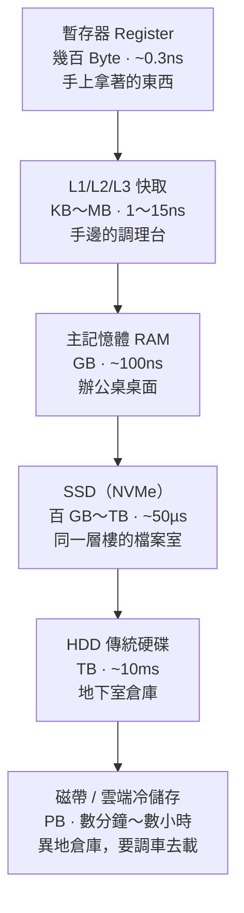

# 記憶體與儲存階層

> [!abstract] 這篇你會學到
> - 用**辦公桌與檔案櫃**的比喻，徹底分清楚記憶體與硬碟
> - 理解揮發性與非揮發性的差別，以及「為什麼要存檔」
> - 看懂完整的儲存金字塔：暫存器 → 快取 → 記憶體 → SSD → HDD → 磁帶／雲端
> - 知道**虛擬記憶體與 swap** 是什麼，以及電腦「爆記憶體」時發生什麼事
> - 分辨 DIMM 與 SO-DIMM、DDR 世代、ECC 記憶體
> - 判斷「該加記憶體還是換 SSD」

## 前置知識

- [[02-計概-主機裡面有什麼]] — 記憶體與硬碟在主機中的位置
- [[05-計概-CPU如何工作]] — 快取與速度階層的概念

---

## 觀念說明

### 核心比喻：辦公桌 vs 檔案櫃

這個比喻請務必記住，它能解釋九成的效能問題。

| | **記憶體 RAM** | **硬碟 SSD / HDD** |
| --- | --- | --- |
| 比喻 | **辦公桌桌面** | **檔案櫃** |
| 放什麼 | 現在正在處理的東西 | 所有長期保存的東西 |
| 大小 | 小（8～64 GB） | 大（500 GB～數十 TB） |
| 速度 | **極快**（伸手就拿到） | 慢（要起身走過去開櫃子） |
| 下班後 | **桌面全部清空** | 東西還在 |
| 價格 | 每 GB 貴很多 | 每 GB 便宜 |

> [!note] 「下班後桌面全部清空」就是揮發性
> **揮發性（volatile）** = 斷電後資料消失 → 記憶體
> **非揮發性（non-volatile）** = 斷電後資料還在 → 硬碟、SSD、隨身碟
>
> 你打了一小時的文件沒存檔就跳電 → 資料一直只在「桌面」上，
> 從來沒被放進「檔案櫃」，所以全沒了。
>
> **「存檔」這個動作的本質，就是把資料從記憶體寫進硬碟。**

### 為什麼不乾脆全部用記憶體就好？

好問題。答案是三個字：**貴、小、忘**。

| 原因 | 說明 |
| --- | --- |
| **貴** | 每 GB 的價格是 SSD 的十幾倍 |
| **小** | 主機板插槽有限，容量做不大 |
| **忘** | 斷電就全沒了，不能拿來長期保存 |

反過來，為什麼不全部用硬碟？因為**太慢**。
CPU 一秒要處理數十億道指令，如果每次都去硬碟拿資料，就像廚師每炒一道菜
都要開車去外縣市買菜。

**所以我們需要一個階梯。**

---

## 完整的儲存金字塔



| 層級 | 容量 | 存取時間 | 每 GB 成本 | 斷電後 |
| --- | --- | --- | --- | --- |
| 暫存器 | 數百 Byte | ~0.3 ns | 極高 | 消失 |
| L1 快取 | 32～64 KB | ~1 ns | 很高 | 消失 |
| L2 快取 | 256 KB～2 MB | ~4 ns | 高 | 消失 |
| L3 快取 | 8～64 MB | ~15 ns | 高 | 消失 |
| **主記憶體 RAM** | 8～512 GB | **~100 ns** | 中 | **消失** |
| **NVMe SSD** | 256 GB～8 TB | **~50 µs** | 低 | **保留** |
| SATA SSD | 256 GB～8 TB | ~100 µs | 低 | 保留 |
| HDD | 1～24 TB | ~10 ms | 很低 | 保留 |
| 磁帶 LTO | 18～45 TB／捲 | 數十秒～分鐘 | 極低 | 保留 |
| 雲端冷儲存 | 無上限 | 數分鐘～數小時 | 極低 | 保留 |

> [!warning] 注意單位！這是重點
> - **ns**（奈秒）= 十億分之一秒
> - **µs**（微秒）= 百萬分之一秒 = 1000 ns
> - **ms**（毫秒）= 千分之一秒 = 1000 µs
>
> 從 RAM（100 ns）到 HDD（10 ms）是 **十萬倍**的差距。
> 這不是「稍微慢一點」，這是「走三步」與「搭船去國外」的差別。

> [!tip] 為什麼越快的越小
> 因為又快又大的東西太貴。
> 這個金字塔的設計哲學是：**把最常用的一小部分放在最快的地方**。
>
> 統計上，程式有 **局部性原理（locality）**：
> - **時間局部性**：剛用過的資料，很快會再用（例如迴圈變數）
> - **空間局部性**：用了某個資料，附近的資料很快也會用（例如陣列）
>
> 所以只要把「最近用過的」「附近的」搬到快的地方，
> 就能用小容量達到接近大容量的效果。快取命中率 95% 以上就是這樣來的。

---

## 記憶體 RAM 詳解

### 兩種常見的實體形式

| | **DIMM** | **SO-DIMM** |
| --- | --- | --- |
| 全名 | Dual In-line Memory Module | Small Outline DIMM |
| 長度 | 約 13.3 cm | 約 6.7 cm（**大約一半**） |
| 用在 | 桌上型電腦、伺服器 | **筆記型電腦**、迷你主機、部分一體機 |
| 插槽 | 兩端有卡榫，垂直插入 | 斜插後壓下，兩側卡扣固定 |

> [!warning] 兩者完全不能互換
> 買記憶體前一定要確認機器要的是哪一種。
> 筆電只能用 SO-DIMM，桌機只能用 DIMM，形狀就插不進去。
>
> 現在很多輕薄筆電的記憶體是**焊死在主機板上**的，根本不能升級 ——
> 買的時候就要一次買足。

### DDR 世代

| 世代 | 常見速度 | 電壓 | 現況 |
| --- | --- | --- | --- |
| DDR3 | 1333～1866 MHz | 1.5V | 已淘汰（2010 年代機器） |
| DDR4 | 2133～3600 MHz | 1.2V | 仍大量在用 |
| DDR5 | 4800～8000+ MT/s | 1.1V | 現行新機標準 |

> [!danger] 世代之間完全不相容
> DDR4 的記憶體**插不進** DDR5 的插槽（缺口位置不同，這是刻意的防呆設計）。
> 主機板支援哪一代是固定的，不能混插。
>
> 買記憶體前先確認主機板規格，或用 `sudo dmidecode -t memory` 查現有的是哪一代。

### 雙通道：兩條比一條快

主機板通常支援**雙通道（Dual Channel）**，甚至四通道（伺服器）。

```
單通道：CPU ←──[一條 16GB]        頻寬 ×1
雙通道：CPU ←──[8GB]  ←──[8GB]    頻寬 ×2
```

> [!tip] 買 16GB 時，8GB × 2 比 16GB × 1 好
> 價格差不多，但頻寬加倍。
> 對**內顯**的影響尤其大（內顯要跟系統共用記憶體頻寬），
> 遊戲或影片播放的差距可以到 20～30%。
>
> 插槽通常標示 `DIMM_A1 / A2 / B1 / B2`，
> 雙通道要插在**不同通道**（A 和 B 各一條），
> 主機板說明書通常建議 **A2 + B2**（第 2 與第 4 個插槽）。

### ECC 記憶體：伺服器專用

**ECC**（Error-Correcting Code，錯誤更正碼）能偵測並自動修正記憶體中的隨機位元錯誤。

> [!note] 記憶體真的會出錯
> 宇宙射線、電磁干擾、電壓波動都可能讓記憶體中的某一個位元
> 從 0 變成 1（稱為 **bit flip**）。
> 大規模研究顯示，一台伺服器平均**每年會遇到數次**這種錯誤。
>
> | 場景 | 一次 bit flip 的後果 |
> | --- | --- |
> | 個人電腦 | 某個程式閃退，重開就好 |
> | **資料庫伺服器** | **寫入了一個錯誤的數字，而且沒人發現** |
> | 檔案伺服器 | 備份的檔案靜默損毀 |
>
> 這就是為什麼伺服器與 NAS 幾乎都用 ECC，
> 也是 ZFS 這類檔案系統強烈建議搭配 ECC 的原因（見 [[24-進階儲存-ZFS與Btrfs]]）。

> [!warning] ECC 要 CPU 與主機板都支援
> 一般消費級平台（Intel Core 家用系列、多數消費級主機板）不支援 ECC。
> 需要 Xeon / EPYC / Ryzen Pro 等級的 CPU 搭配支援的主機板。
> 買錯了，ECC 記憶體插上去只會當成普通記憶體用（如果認得的話）。

---

## 虛擬記憶體與 swap：桌面不夠用時

### 問題：桌面滿了怎麼辦？

你的桌面（8 GB 記憶體）已經攤滿文件，但主管又丟了一份新工作給你。
怎麼辦？

**方法**：把桌上最久沒碰的那疊文件，**暫時收回檔案櫃**，
空出位子放新的。等會兒需要那疊舊的，再去拿回來。

這就是 **虛擬記憶體（Virtual Memory）** 的核心概念，
而暫存到硬碟的那塊空間叫做：

| 系統 | 名稱 |
| --- | --- |
| Linux | **swap**（交換空間／置換空間） |
| Windows | **分頁檔**（pagefile.sys） |
| macOS | swapfile |


> [!warning] swap 讓程式不會當掉，但會讓電腦很慢
> 記憶體與硬碟的速度差距是**十萬倍**。
> 一旦系統開始頻繁地在記憶體與 swap 之間搬資料，
> 整台電腦就會慢到不像話 —— 這個現象叫做 **thrashing（顛簸）**。
>
> **症狀**：
> - 滑鼠會動但點什麼都沒反應
> - 硬碟指示燈狂閃（HDD 還會聽到一直在轉）
> - CPU 使用率不高，但系統完全卡住
>
> **正確的解法不是加大 swap，是加記憶體。**
> swap 是安全網，不是解決方案。

### swap 該設多大？

| 情境 | 建議 |
| --- | --- |
| 桌機／筆電，要休眠（hibernate） | **≥ 記憶體大小**（休眠要把整個記憶體寫進去） |
| 一般伺服器，記憶體 ≤ 8 GB | 記憶體的 1～2 倍 |
| 伺服器，記憶體 16～64 GB | 4～8 GB 就好 |
| 伺服器，記憶體 ≥ 64 GB | 4 GB，或視應用而定 |
| **Kubernetes 節點** | 通常**建議關閉**（K8s 預設要求關閉 swap） |
| 資料庫伺服器 | 設小一點，並調低 `swappiness` |

```bash
# 看目前的 swap 使用
$ free -h
               total        used        free      shared  buff/cache   available
Mem:            15Gi       8.2Gi       1.1Gi       234Mi       6.1Gi       6.5Gi
Swap:          4.0Gi       512Mi       3.5Gi

# 調整「多積極使用 swap」（0～100，預設 60）
$ cat /proc/sys/vm/swappiness
60
$ sudo sysctl vm.swappiness=10        # 暫時
$ echo 'vm.swappiness=10' | sudo tee /etc/sysctl.d/99-swap.conf   # 永久
```

> [!tip] swappiness 該設多少
> - **10～20**：伺服器、資料庫。盡量留在記憶體，只在真的不夠時才 swap
> - **60**（預設）：一般桌機
> - **1**：幾乎不用 swap，但仍保留緊急用
> - **0**：只有 OOM 時才用（不建議完全關閉，見下方警告）
>
> 詳細調校見 [[26-核心模組與sysctl調校]]。

> [!warning] 完全沒有 swap 的風險
> 記憶體真的用完時，Linux 會啟動 **OOM Killer**（Out-Of-Memory Killer），
> **強制殺掉**佔記憶體最多的程序 —— 通常就是你最重要的那個服務。
>
> ```bash
> # 查看是不是被 OOM Killer 殺掉的
> $ sudo dmesg | grep -i 'killed process'
> [12345.678] Out of memory: Killed process 4521 (mysqld) total-vm:8123456kB
> ```
>
> 有一點 swap 至少能爭取到「變慢但還活著」的時間，讓你有機會介入。

### 那個很重要的 `available` 欄位

```bash
$ free -h
               total        used        free      shared  buff/cache   available
Mem:            15Gi       8.2Gi       1.1Gi       234Mi       6.1Gi       6.5Gi
                                       ^^^^^                              ^^^^^
                                    只有 1.1G？                     其實還有 6.5G 可用
```

> [!warning] `free` 很小不代表記憶體不足
> 這是 Linux 新手最大的誤解。
>
> Linux 會把**暫時沒用到的記憶體拿去當磁碟快取**（`buff/cache`），
> 因為閒置的記憶體是浪費。當程式需要時，這些快取會立刻被釋放。
>
> **要看的是 `available`，不是 `free`。**
> `available` = 真正還能給新程式用的量（含可以立刻回收的快取）。
>
> 有句話說得很好：**"Free memory is wasted memory."**
> 看到 `free` 很低請不要緊張，那是 Linux 在做正事。

---

## 完整實戰範例：診斷記憶體問題

### 情境：使用者說「電腦超級慢」

```bash
# 步驟 1：看記憶體與 swap 的整體狀況
$ free -h
               total        used        free      shared  buff/cache   available
Mem:            7.7Gi       7.1Gi       120Mi        45Mi       480Mi       210Mi
Swap:          2.0Gi       1.9Gi        98Mi
```

**診斷**：`available` 只剩 210 MB，swap 也快滿了 → **記憶體嚴重不足**，正在 thrashing。

```bash
# 步驟 2：找出誰在吃記憶體（依 RSS 排序）
$ ps aux --sort=-%mem | head -6
USER   PID  %CPU %MEM    VSZ    RSS COMMAND
mysql 1234   2.1 45.2 8123456 3620000 /usr/sbin/mysqld
www   2341   0.5 18.3 2341234 1465000 php-fpm: pool www
www   2342   0.5 17.9 2298765 1432000 php-fpm: pool www
root   891   0.1  3.2  512345  256000 /usr/bin/dockerd
```

**診斷**：MySQL 佔了 45%，兩個 PHP-FPM 各佔 18% → 這三個是主嫌。

```bash
# 步驟 3：確認 swap 活動有多頻繁
$ vmstat 1 5
procs -----------memory---------- ---swap-- -----io---- -system-- ------cpu-----
 r  b   swpd   free   buff  cache   si   so    bi    bo   in   cs us sy id wa
 2  3 1943040 122880  20480 471040 2048 3072  4096  6144 1234 2345  5  8 25 62
                                    ^^^^ ^^^^                                ^^
                                  si/so 有數字 = 正在 swap        wa 62% = 一直在等 I/O
```

**診斷確認**：
- `si`（swap in）與 `so`（swap out）持續有數字 → 正在頻繁 swap
- `wa`（I/O wait）高達 62% → CPU 大部分時間在等磁碟

```bash
# 步驟 4：看是不是曾經被 OOM Killer 殺過
$ sudo dmesg -T | grep -i 'out of memory'
[Wed Aug 27 03:14:22 2026] Out of memory: Killed process 3312 (php-fpm)

# 步驟 5：看歷史趨勢（需安裝 sysstat）
$ sar -r 1 5
```

**結論與處置**：

| 選項 | 說明 |
| --- | --- |
| **加記憶體**（首選） | 最直接。8 GB → 16 GB |
| 調小 MySQL 的 `innodb_buffer_pool_size` | 讓它少佔一點，但會犧牲資料庫效能 |
| 調小 PHP-FPM 的 `pm.max_children` | 限制同時的 worker 數，見 [[02-PHP-FPM設定與Pool調校]] |
| 把服務拆到不同機器 | 資料庫與網頁分開 |
| 調低 `vm.swappiness` | 治標，減緩但不解決 |

> [!tip] 判斷「該加記憶體還是換 SSD」
> ```bash
> free -h        # available 長期偏低、swap 一直在用 → 加記憶體
> iostat -x 1    # %util 接近 100%、await 很高 → 換 SSD
> ```
> 兩個都有問題時，**先加記憶體**。
> 因為記憶體不足會導致大量磁碟 I/O，
> 解決記憶體問題後，磁碟壓力常常也跟著消失。

### Windows 上的對應診斷

```powershell
# 記憶體概況
Get-CimInstance Win32_OperatingSystem | Select-Object `
    @{n='總計GB';e={[math]::Round($_.TotalVisibleMemorySize/1MB,1)}},
    @{n='可用GB';e={[math]::Round($_.FreePhysicalMemory/1MB,1)}}

# 吃記憶體前 10 名
Get-Process | Sort-Object WS -Descending | Select-Object -First 10 `
    Name, Id, @{n='記憶體MB';e={[math]::Round($_.WS/1MB,1)}}

# 分頁檔設定
Get-CimInstance Win32_PageFileUsage | Select-Object Name, AllocatedBaseSize, CurrentUsage
```

也可以用**工作管理員 → 效能 → 記憶體**，看「使用中」「可用」「已認可」的數字，
或用**資源監視器**（`resmon`）看「Hard Faults/sec」——
這個數字持續大於 0 就代表在用分頁檔，等同 Linux 的 swap 活動。

---

## 常見錯誤與排錯

| 現象 | 原因 | 解法 |
| --- | --- | --- |
| `free -h` 顯示 free 很少 | Linux 把閒置記憶體拿去當磁碟快取 | **看 `available` 不是 `free`**，這是正常且良好的行為 |
| 電腦卡到滑鼠會動但點不動 | 記憶體不足在 thrashing | 加記憶體；緊急時 `kill` 掉吃最多的程序 |
| 服務半夜自己掛掉 | 被 OOM Killer 殺掉 | `dmesg \| grep -i 'killed process'` 確認；加記憶體或限制服務用量 |
| 加了記憶體但系統沒認到 | 沒插緊、規格不符、超過主機板上限 | 重插；查主機板支援的最大容量與世代 |
| 兩條記憶體只跑在較慢的速度 | 混插不同速度的記憶體，會統一降到最慢那條 | 買同品牌同型號；或整組換掉 |
| 插了兩條但沒有雙通道 | 插在同一個通道的兩個槽 | 查說明書，通常要插 A2 + B2 |
| 筆電買了記憶體插不進去 | 買成 DIMM，筆電要 SO-DIMM | 確認長度：SO-DIMM 約為 DIMM 的一半 |
| ECC 記憶體插上去沒有 ECC 功能 | CPU 或主機板不支援 | 需要 Xeon/EPYC/Ryzen Pro 等級平台 |
| 記憶體用量一直緩慢上升直到滿 | **記憶體洩漏（memory leak）** | 找出是哪個程序；重啟該服務；回報給軟體開發者 |
| 隨機藍屏、每次錯誤都不同 | 記憶體硬體故障 | 跑 MemTest86 完整一輪；逐條測試 |
| 資料庫寫入偶爾出現莫名錯誤 | 可能是非 ECC 記憶體的 bit flip | 伺服器改用 ECC 記憶體 |

> [!tip] 怎麼確認是不是記憶體洩漏
> 記憶體洩漏的特徵是「**只增不減**」：
> ```bash
> # 每 60 秒記錄一次某個程序的記憶體用量
> while true; do
>   date +%T >> /tmp/mem.log
>   ps -o rss= -p <PID> >> /tmp/mem.log
>   sleep 60
> done
> ```
> 觀察數小時。正常程式會上下起伏；洩漏的程式會像樓梯一樣一路往上，
> 直到被 OOM Killer 殺掉或系統崩潰。
>
> 短期解法是**定期重啟**該服務（systemd 的 `RuntimeMaxSec=`），
> 根本解法要修程式。

---

## 安全性注意事項

> [!warning] 記憶體裡有明文的機密資料
> 加密的檔案在**使用時**必須解密才能處理，所以：
> - 密碼、金鑰、Session Token 在使用當下都是**明文躺在記憶體裡**
> - 全碟加密的解密金鑰也在記憶體裡
>
> 這衍生兩種攻擊：
> - **記憶體傾印（memory dump）**：有 root/Administrator 權限的人可以把整個
>   記憶體 dump 出來翻找。Windows 的 mimikatz 就是靠這招抓網域憑證。
> - **冷開機攻擊（cold boot attack）**：記憶體斷電後內容不會立刻消失，
>   低溫可延長數分鐘。攻擊者可以快速斷電、把記憶體拔到另一台機器讀取。
>
> **對策**：
> - 限制誰能取得管理員權限（見 [[07-身分存取管理IAM與MFA]]）
> - 設定 BIOS/UEFI 密碼、關閉從 USB 開機
> - 開啟 Secure Boot 與記憶體加密（AMD SME、Intel TME）
> - 敏感伺服器不要放在無人管制的區域（見 [[15-實體與OT-IoT安全設備]]）

> [!warning] swap 也可能洩漏機密
> 被換出到 swap 的記憶體內容是**明文寫在硬碟上**的。
> 如果那塊記憶體裡剛好有密碼或金鑰，它就被永久寫進磁碟了 ——
> 就算程式結束、就算重開機，那些位元組仍留在磁碟上。
>
> **對策**：
> ```bash
> # 檢查 swap 是不是加密的
> $ lsblk -o NAME,TYPE,MOUNTPOINT,FSTYPE
>
> # Ubuntu 安裝時選「加密整個磁碟」會連 swap 一起加密（LUKS）
> # 或改用加密的 swap 檔案
> ```
> 高機密環境的做法：**使用加密的 swap，或乾脆不用 swap**。
> TWGCB 與 CIS 基準對此有對應要求，見 [[03-TWGCB-Linux項目分類詳解]]。

> [!tip] 記憶體用量本身也是資安訊號
> 記憶體用量突然異常飆高，可能代表：
> - 有人在跑挖礦程式
> - 遭到資源耗盡型攻擊（DoS）
> - 有程式在大量讀取資料準備外洩
>
> 所以**記憶體監控與告警**不只是可用性議題。
> 見 [[03-系統監控與告警]] 與 [[09-日誌集中與SIEM]]。

---

## 速查表

### 速度階層（背相對倍數）

| 層級 | 存取時間 | 相對倍數 | 比喻 |
| --- | --- | --- | --- |
| 暫存器 | 0.3 ns | 1× | 手上拿著 |
| L1 快取 | 1 ns | 3× | 伸手可及 |
| L3 快取 | 15 ns | 45× | 走到廚房後面 |
| **RAM** | 100 ns | **300×** | 走去倉庫 |
| NVMe SSD | 50 µs | 15 萬× | 開車去外縣市 |
| HDD | 10 ms | 3000 萬× | 搭船去國外 |

### 記憶體規格

| 名詞 | 意思 |
| --- | --- |
| DIMM | 桌機／伺服器用，約 13.3 cm |
| SO-DIMM | 筆電用，約 6.7 cm |
| DDR4 / DDR5 | 世代，**互不相容** |
| MT/s、MHz | 速度 |
| CL（CAS Latency） | 延遲，越小越好 |
| 雙通道 | 兩條同時工作，頻寬加倍 |
| ECC | 可自動修正位元錯誤，伺服器用 |
| Registered / RDIMM | 有暫存器的伺服器記憶體，容量可做更大 |

### 診斷指令

| 目的 | Linux | Windows |
| --- | --- | --- |
| 記憶體概況 | `free -h` | 工作管理員 → 效能 |
| **看真正可用量** | `free -h` 的 **available 欄** | 「可用」 |
| 誰在吃記憶體 | `ps aux --sort=-%mem \| head` | `Get-Process \| Sort WS -Desc` |
| swap 活動 | `vmstat 1` 的 si/so 欄 | `resmon` 的 Hard Faults/sec |
| 硬體規格（幾條、什麼速度） | `sudo dmidecode -t memory` | `Get-CimInstance Win32_PhysicalMemory` |
| 是否被 OOM 殺過 | `dmesg -T \| grep -i 'killed process'` | 事件檢視器 |
| 記憶體測試 | MemTest86 | `mdsched.exe` |
| 歷史趨勢 | `sar -r` | 效能監視器 |

### 該加記憶體還是換 SSD？

| 症狀 | 瓶頸 | 解法 |
| --- | --- | --- |
| `available` 長期偏低、swap 一直在動 | 記憶體 | **加記憶體** |
| `iostat` 的 `%util` 接近 100、`await` 高 | 磁碟 | 換 SSD |
| 開機慢、開軟體慢，但記憶體充足 | 磁碟 | 換 SSD |
| 開多個程式就卡，關掉就好 | 記憶體 | 加記憶體 |
| 兩者都符合 | 都是 | **先加記憶體** |

---

## 練習題

> [!question]- 練習 1：讀懂你的記憶體狀態
> 執行 `free -h`（Windows 看工作管理員），回答：
> 1. `total`、`used`、`free`、`buff/cache`、`available` 各是多少？
> 2. 為什麼 `free` 那麼小卻不用擔心？
> 3. swap 有沒有在用？用了多少？
> 4. 用 `ps aux --sort=-%mem | head -5` 找出前五名，它們合理嗎？

> [!question]- 練習 2：模擬記憶體壓力（在測試機上做）
> > [!danger] 不要在正式環境執行
> ```bash
> # 安裝壓力測試工具
> sudo apt install stress-ng
>
> # 開一個終端機持續觀察
> watch -n1 free -h
>
> # 另一個終端機：配置 2GB 記憶體並持續使用 60 秒
> stress-ng --vm 1 --vm-bytes 2G --timeout 60s
> ```
> 觀察 `available` 怎麼下降、`buff/cache` 怎麼被釋放。
> 如果把 `--vm-bytes` 調到超過實體記憶體，你會看到 swap 開始動作，
> 系統明顯變慢 —— 這就是 thrashing。

> [!question]- 練習 3：規劃一台伺服器的記憶體
> 一台網頁伺服器要跑：
> - MySQL（資料庫約 20 GB，希望熱資料都在記憶體）
> - Nginx + PHP-FPM（預估同時 30 個 worker，每個約 60 MB）
> - Redis 快取（預計 2 GB）
> - 作業系統與其他服務
>
> 估算需要多少記憶體，並說明你會怎麼分配。
>
> 參考答案：
> ```
> MySQL innodb_buffer_pool_size   12 GB（不必等於資料量，放熱資料即可）
> PHP-FPM  30 × 60 MB          =  1.8 GB
> Redis                            2 GB
> Nginx                            0.5 GB
> 作業系統 + 其他                   2 GB
> 磁碟快取（留給系統用）             4 GB
> ─────────────────────────────────────
> 小計                          ≈ 22.3 GB
> 建議配置：32 GB（留 30% 餘裕）
> ```
> 關鍵原則：**不要把記憶體配到剛剛好**，
> 要留空間給磁碟快取與突發流量，否則一有尖峰就 OOM。

---

## 小測驗

Q1. 用辦公桌與檔案櫃的比喻，說明記憶體與硬碟的四個主要差別。

Q2. 「揮發性」是什麼意思？「存檔」這個動作的本質是什麼？

Q3. 從記憶體讀資料要 100 ns，從 HDD 要 10 ms。這是幾倍的差距？

Q4. 為什麼不乾脆把所有資料都放在記憶體裡？請說出三個理由。

Q5. Linux 的 `free -h` 顯示 free 只剩 120 MB，該不該緊張？要看哪個欄位？為什麼會這樣？

Q6. swap（分頁檔）是什麼？為什麼說「swap 是安全網不是解決方案」？

Q7. 什麼是 thrashing？它的三個典型症狀是什麼？

Q8. DIMM 和 SO-DIMM 的差別是什麼？各用在哪裡？

Q9. ECC 記憶體解決什麼問題？為什麼個人電腦沒有 ECC 也沒關係，但資料庫伺服器一定要？

Q10. 為什麼「swap 內容可能洩漏機密」？該怎麼防範？

> [!question]- 測驗答案
> **Q1.** ①**大小**：桌面小（8～64 GB）、檔案櫃大（TB 級）；
> ②**速度**：桌面伸手就拿到、檔案櫃要起身走過去（差十萬倍）；
> ③**斷電後**：桌面下班全部清空（揮發性）、檔案櫃東西還在（非揮發性）；
> ④**價格**：記憶體每 GB 貴十幾倍。
>
> **Q2.** **揮發性（volatile）**＝斷電後資料消失。
> **「存檔」的本質，就是把資料從記憶體（桌面）寫進硬碟（檔案櫃）**。
> 沒存檔就跳電，資料從來沒進過檔案櫃，所以全沒了。
>
> **Q3.** 10 ms = 10,000,000 ns，除以 100 ns = **十萬倍**。
> 這不是「稍微慢一點」，是「走三步」與「搭船去國外」的差別。
>
> **Q4.** ①**貴**（每 GB 價格是 SSD 的十幾倍）；
> ②**小**（主機板插槽有限，容量做不大）；
> ③**忘**（揮發性，斷電就全沒了，無法長期保存）。
>
> **Q5.** **不該緊張，要看 `available` 欄位。**
> 因為 Linux 會把暫時沒用到的記憶體拿去當**磁碟快取**（`buff/cache`），
> 程式需要時會立刻釋放。閒置的記憶體是浪費 ——
> *"Free memory is wasted memory."*
>
> **Q6.** swap 是硬碟上的一塊空間，當實體記憶體不夠時，
> 作業系統把最久沒用的記憶體內容暫時搬到那裡，空出位子。
> 說它是安全網不是解決方案，是因為**硬碟比記憶體慢十萬倍** ——
> 它能讓程式不當掉，但整台機器會慢到不能用。
> **正確解法是加記憶體，不是加大 swap。**
>
> **Q7.** **Thrashing（顛簸）**是系統頻繁地在記憶體與 swap 之間搬資料，
> 大部分時間都花在搬運而非做事。三個典型症狀：
> ①滑鼠會動但點什麼都沒反應；
> ②硬碟指示燈狂閃；
> ③**CPU 使用率不高但系統完全卡住**（因為都在等 I/O）。
>
> **Q8.** **DIMM** 約 13.3 cm，用在**桌上型電腦與伺服器**；
> **SO-DIMM** 約 6.7 cm（大約一半長），用在**筆記型電腦**與迷你主機。
> 兩者形狀不同，完全不能互換。
>
> **Q9.** ECC 能**偵測並自動修正記憶體中的隨機位元錯誤（bit flip）**，
> 這類錯誤由宇宙射線、電磁干擾等造成，一台伺服器平均每年會遇到數次。
> 個人電腦遇到一次頂多某個程式閃退、重開就好；
> **資料庫伺服器遇到一次可能寫入一個錯誤的數字，而且沒有任何人會發現** ——
> 這種「靜默損毀」的代價遠高於當機。
>
> **Q10.** 因為被換出到 swap 的記憶體內容是**明文寫在硬碟上**的。
> 如果那塊記憶體剛好含有密碼、金鑰或 Session Token，
> 它就被永久寫進磁碟，即使程式結束、重開機，位元組仍留在那裡。
> **防範**：使用**加密的 swap**（如 LUKS 全碟加密），
> 或在高機密環境乾脆不啟用 swap。

---

## 延伸閱讀

- [[07-計概-磁碟格式化與RAID入門]] — 硬碟怎麼被格式化與組成陣列
- [[05-計概-CPU如何工作]] — 快取為什麼存在
- [[11-計概-程式程序與多工]] — 記憶體怎麼被分配給各個程序
- [[19-計概-電腦規格與選購]] — 該買多少記憶體
- [[26-核心模組與sysctl調校]] — Linux 記憶體參數調校（進階）
- [[15-磁碟分割與掛載]] — swap 分割區與 swap 檔的建立（進階）
- [[24-進階儲存-ZFS與Btrfs]] — ZFS 為什麼強烈建議搭配 ECC（進階）
