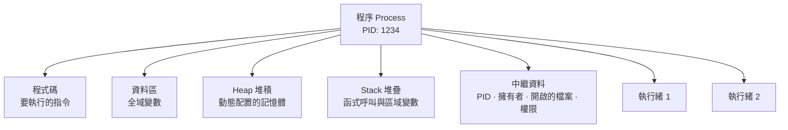
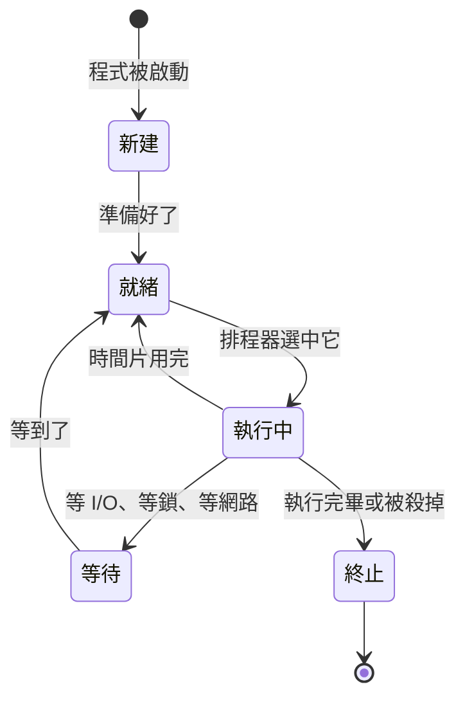
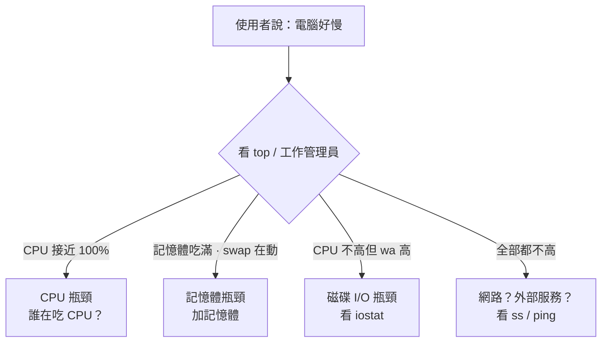

# 程式、程序與多工

> [!abstract] 這篇你會學到
> - 分辨**程式**與**程序**的差別（食譜 vs 正在做的那道菜）
> - 理解多工其實是「快速輪流」，以及作業系統怎麼決定誰先做
> - 看懂工作管理員／`top` 上的每一個數字
> - **精準判斷「電腦卡頓」是卡在 CPU、記憶體，還是磁碟**
> - 知道殭屍程序、孤兒程序、死結是什麼
> - 學會安全地結束一個沒有回應的程式

## 前置知識

- [[08-計概-作業系統是什麼]] — 作業系統的程序管理職責
- [[06-計概-記憶體與儲存階層]] — 記憶體不足的症狀
- [[05-計概-CPU如何工作]] — 核心與執行緒

---

## 觀念說明

### 程式 vs 程序：食譜 vs 正在做的菜

| | **程式（Program）** | **程序（Process）** |
| --- | --- | --- |
| 比喻 | **食譜**（躺在書架上） | **正在做的那道菜** |
| 在哪裡 | 硬碟上的一個檔案 | **記憶體**中，正在執行 |
| 狀態 | 靜態、不動的 | 動態、會變化 |
| 數量 | 一個檔案 | **同一個程式可以同時有很多個程序** |
| 例子 | `C:\Program Files\Chrome\chrome.exe` | 你開的 8 個 Chrome 分頁 = 8 個以上的程序 |

> [!example] 一份食譜，三位廚師同時做
> 廚房裡有一份「蛋炒飯」的食譜（**程式**），
> 三位廚師同時各做一份（**三個程序**）。
>
> 三份炒飯用的是同一份食譜，但：
> - 各自有自己的鍋子與食材（**各自的記憶體空間**）
> - 進度可能不同（一個在打蛋、一個在下鍋）
> - 一份燒焦了，不影響另外兩份（**程序互相隔離**）
>
> 這就是為什麼 Chrome 一個分頁當掉，其他分頁還活著 ——
> Chrome 刻意讓每個分頁跑在獨立的程序裡。

### 程序裡面有什麼



| 元素 | 說明 |
| --- | --- |
| **PID** | Process ID，程序的身分證號碼，系統唯一 |
| **擁有者** | 以哪個使用者的身分執行（決定它有什麼權限） |
| **記憶體空間** | 程式碼、資料、堆積、堆疊 |
| **開啟的檔案** | 這個程序目前開著哪些檔案與網路連線 |
| **執行緒** | 程序內的執行單位，一個程序可以有多個 |

### 程序 vs 執行緒

| | **程序（Process）** | **執行緒（Thread）** |
| --- | --- | --- |
| 比喻 | 一位廚師，有自己的整套廚具 | 這位廚師的**兩隻手** |
| 記憶體 | **各自獨立**，互相看不到 | **共用**同一個程序的記憶體 |
| 建立成本 | 高 | 低 |
| 一個掛掉 | 不影響其他程序 | **可能拖垮整個程序** |
| 溝通 | 麻煩（需要 IPC 機制） | 簡單（直接共用變數） |

> [!tip] 這解釋了兩種軟體設計
> - **Chrome 用多程序**：每個分頁獨立程序。
>   代價是記憶體吃很兇（每個程序要一整套）；
>   好處是一個分頁崩潰不會拖垮整個瀏覽器。
> - **多數伺服器程式用多執行緒**：省記憶體、切換快。
>   代價是一個執行緒出錯可能讓整個服務掛掉。
>
> Nginx 用的是「多程序 + 事件驅動」的混合模型，
> 兼顧穩定性與效能 —— 見 `51-Web伺服器` 章節。

---

## 多工：一個廚師怎麼同時炒十道菜

### 答案：他沒有同時，他只是切換得夠快

你的電腦可能同時跑著 300 個程序，但只有 14 個核心。
作業系統的做法是：

```
時間 →
核心1: [Chrome 5ms][Word 5ms][防毒 5ms][Chrome 5ms][系統服務 5ms]...
       ↑ 每次切換叫「context switch（上下文切換）」
```

每個程序執行一小段時間（**時間片，time slice**，通常幾毫秒）就換人。
一秒可以切換上千次，快到你完全感覺不出來。

> [!note] Context Switch 的成本
> 切換不是免費的。作業系統必須：
> 1. 把目前程序的狀態（暫存器、程式計數器）**存起來**
> 2. 載入下一個程序的狀態
> 3. 快取可能失效，要重新載入資料
>
> 這叫**上下文切換成本**。切換太頻繁反而會讓效能下降 ——
> 就像廚師一直換鍋子，光是換就花掉所有時間。
>
> ```bash
> # 看每秒的 context switch 次數（cs 欄）
> $ vmstat 1
> procs -----memory---- ---system-- ------cpu-----
>  r  b   swpd   free    in     cs us sy id wa
>  2  0      0 1234567  1234  4567  5  2 92  1
>                              ^^^^ 每秒切換次數
> ```
> 一般幾千次是正常的；**幾十萬次**就代表有問題
> （可能是執行緒開太多，或程式設計不良）。

### 程序的五種狀態



| 狀態 | Linux 代號 | 說明 |
| --- | --- | --- |
| **執行中** | `R` (Running) | 正在用 CPU，或準備好隨時可以用 |
| **可中斷睡眠** | `S` (Sleeping) | **等待中**（等鍵盤、等網路、等時間）。**大多數程序都在這個狀態** |
| **不可中斷睡眠** | `D` (Uninterruptible) | **等磁碟 I/O**，連 `kill -9` 都殺不掉 |
| **停止** | `T` (Stopped) | 被暫停（按了 Ctrl+Z 或收到 STOP 訊號） |
| **殭屍** | `Z` (Zombie) | 已結束但父程序還沒回收它 |

> [!warning] `D` 狀態是最麻煩的
> `D`（不可中斷睡眠）代表程序正在等待磁碟或網路檔案系統回應，
> **這時候連 `kill -9` 都沒用**。
>
> 常見原因：
> - 硬碟即將故障，讀取一直逾時
> - NFS 網路磁碟機斷線
> - 磁碟 I/O 嚴重壅塞
>
> ```bash
> # 找出卡在 D 狀態的程序
> $ ps -eo state,pid,cmd | awk '$1 ~ /D/ {print}'
> ```
> 大量 `D` 狀態的程序 = **磁碟或儲存系統有問題**，
> 這是伺服器「整台卡住但 CPU 使用率很低」的典型原因。

---

## 排程：誰先做？

作業系統的**排程器（scheduler）** 決定下一個換誰執行。它會考慮：

| 因素 | 說明 |
| --- | --- |
| **優先權（priority）** | 重要的先做 |
| **公平性** | 不能讓某個程序永遠等不到 |
| **互動性** | 使用者正在操作的程式優先，讓體驗流暢 |
| **已用時間** | 用得少的優先，避免飢餓 |

### Linux 的 nice 值

```
nice 值範圍：-20（最高優先）～ +19（最低優先）
預設：0
```

> [!example] nice 的意思是「對別人好一點」
> nice 值**越大**代表「我越客氣、越願意讓別人先」，所以**優先權越低**。
>
> ```bash
> # 用低優先權執行一個很吃資源的工作
> $ nice -n 19 tar -czf backup.tar.gz /data
>
> # 調整已在執行的程序（需要 root 才能調成負值）
> $ sudo renice -n -5 -p 1234
>
> # 看目前的 nice 值（NI 欄）
> $ ps -eo pid,ni,comm | head
> ```

> [!tip] 實務用法：讓備份不影響服務
> 半夜跑備份時，如果它把 CPU 和磁碟吃光，
> 早起的使用者就會覺得系統很慢。
>
> ```bash
> # CPU 優先權調低 + 磁碟 I/O 優先權也調低
> nice -n 19 ionice -c 3 tar -czf /backup/data.tar.gz /data
> #                  ^^^^^ ionice -c 3 = idle，只在磁碟空閒時才做
> ```
> 這一招在 `71-維運實務` 的排程維護章節會反覆用到。

### Windows 的優先權

Windows 用六個等級：**即時 > 高 > 高於一般 > 一般 > 低於一般 > 低**。

```powershell
# 調整程序優先權
Get-Process notepad | ForEach-Object { $_.PriorityClass = 'BelowNormal' }
```

> [!danger] 不要把程序設成「即時（Realtime）」
> Windows 的「即時」優先權**高於系統本身的關鍵執行緒**。
> 一個設成即時的程式如果進入忙碌迴圈，
> 可能讓滑鼠、鍵盤都沒有反應，只能強制斷電。

---

## 完整實戰範例：診斷「電腦好慢」

這是維運人員最常被問的問題。以下是系統化的判斷流程。

### 第一步：先分清楚是哪一種慢



### 第二步：`top` / `htop` 逐欄解讀

```bash
$ top
top - 14:23:01 up 47 days,  3:12,  2 users,  load average: 8.42, 6.15, 4.30
Tasks: 312 total,   3 running, 308 sleeping,   0 stopped,   1 zombie
%Cpu(s): 45.2 us,  8.1 sy,  0.0 ni, 12.3 id, 33.8 wa,  0.0 hi,  0.6 si
MiB Mem :  15884.0 total,   1102.5 free,   9821.3 used,   4960.2 buff/cache
MiB Swap:   4096.0 total,   2048.0 free,   2048.0 used.   4235.1 avail Mem

    PID USER      PR  NI    VIRT    RES  %CPU  %MEM     TIME+ COMMAND
   1234 mysql     20   0  8123456 3620000  42.3  22.8   4521:33 mysqld
   2341 www-data  20   0  2341234  465000  18.7   2.9    832:11 php-fpm
```

| 欄位 | 意思 | 怎麼判讀 |
| --- | --- | --- |
| **load average** | 1／5／15 分鐘平均負載 | **跟核心數比**。14 核的機器超過 14 就是有排隊 |
| **us** (user) | 使用者程式用掉的 CPU | 高 = 應用程式在算東西 |
| **sy** (system) | 核心用掉的 CPU | 高 = 大量系統呼叫、context switch |
| **id** (idle) | 閒置 | 這個數字大 = CPU 不忙 |
| **wa** (I/O wait) | **等待磁碟的時間** | **高 = 磁碟是瓶頸**（上例 33.8% 太高了） |
| **si/hi** | 軟體／硬體中斷 | 高 = 網路流量極大或驅動問題 |
| **RES** | 實際佔用的實體記憶體 | 這才是真正吃掉的記憶體 |
| **VIRT** | 虛擬記憶體位址空間 | **通常很大是正常的**，不代表真的用了那麼多 |

> [!warning] 不要看 VIRT 就緊張
> `VIRT` 是程序**要求**的位址空間，包含還沒實際使用的部分、
> 共用函式庫、記憶體映射的檔案。
> 一個 Java 程式 VIRT 顯示 20 GB 但 RES 只有 2 GB 是很正常的。
>
> **要看的是 `RES`（Resident Set Size）**。

**上例的診斷**：
- `wa = 33.8%` → **磁碟是主要瓶頸**
- `load average 8.42` 且遞增（8.42 > 6.15 > 4.30）→ **負載正在上升**
- MySQL 佔 22.8% 記憶體、42.3% CPU → 主要壓力來源
- swap 用了 2 GB → 記憶體也不太夠
- 有 1 個 zombie → 小問題，但要留意

### 第三步：確認磁碟瓶頸

```bash
$ iostat -x 1 3
Device   r/s     w/s   rkB/s   wkB/s  await  %util
nvme0n1  120.0  450.0  4800.0 18000.0  45.20  98.50
                                        ^^^^^  ^^^^^
                                     等待 45ms  幾乎滿載
```

| 欄位 | 健康值 | 說明 |
| --- | --- | --- |
| `%util` | < 80% | 接近 100% = 磁碟忙不過來 |
| `await` | SSD < 5ms、HDD < 20ms | 平均等待時間 |
| `r/s`、`w/s` | — | 每秒讀寫次數（IOPS） |

### 第四步：找出是誰在做 I/O

```bash
# 需要 root
$ sudo iotop -o
Total DISK READ: 4.80 M/s | Total DISK WRITE: 18.00 M/s
  TID  PRIO  USER   DISK READ  DISK WRITE  COMMAND
 1234  be/4  mysql    2.10 M/s   15.30 M/s  mysqld
 8891  be/4  root     2.70 M/s    0.00 B/s  backup.sh
```

**結論**：MySQL 在大量寫入，同時有個備份腳本在讀 —— 兩者搶磁碟。

**處置**：把備份改到離峰時段，並加上 `ionice -c 3`。

### 第五步：Windows 上的對應流程

```powershell
# 1. 整體狀況：工作管理員 → 效能
# 2. CPU 前 10 名
Get-Process | Sort-Object CPU -Descending | Select-Object -First 10 Name, CPU, WS

# 3. 記憶體前 10 名
Get-Process | Sort-Object WS -Descending | Select-Object -First 10 `
    Name, @{n='MB';e={[math]::Round($_.WS/1MB,1)}}

# 4. 磁碟活動：用「資源監視器」（resmon）→ 磁碟分頁
#    看「具有磁碟活動的處理程序」與「回應時間(毫秒)」
```

> [!tip] Windows 的關鍵指標
> 在**資源監視器（resmon）**中：
> - **記憶體分頁** → 「**硬錯誤/秒**」持續 > 0 = 正在用分頁檔（等同 Linux 的 swap）
> - **磁碟分頁** → 「**磁碟佇列長度**」持續 > 2 = 磁碟塞車
> - **CPU 分頁** → 看是誰在吃

---

## 結束一個沒有回應的程式

### Linux：訊號（Signal）

```bash
# 找出程序
$ ps aux | grep nginx
$ pgrep -a nginx

# 溫和地請它結束（SIGTERM，預設）
$ kill 1234
$ kill -15 1234

# 強制殺掉（SIGKILL，最後手段）
$ kill -9 1234

# 依名稱殺
$ pkill nginx
$ killall nginx
```

| 訊號 | 編號 | 意思 | 程式能不能攔截 |
| --- | --- | --- | --- |
| `SIGTERM` | 15 | 「請你結束」——**預設，最推薦** | ✅ 可以先存檔再退出 |
| `SIGINT` | 2 | Ctrl+C | ✅ |
| `SIGHUP` | 1 | 「重新載入設定」（服務常用） | ✅ |
| `SIGKILL` | **9** | **強制終止** | ❌ **無法攔截** |
| `SIGSTOP` | 19 | 暫停 | ❌ |

> [!danger] 不要動不動就 `kill -9`
> `kill -9` 讓程序**沒有機會做任何善後**：
> - 沒有把記憶體中的資料寫回磁碟 → **資料遺失**
> - 沒有關閉檔案 → 檔案可能損毀
> - 沒有清理鎖檔與暫存檔 → 下次啟動可能失敗
> - 資料庫可能需要漫長的復原程序
>
> **正確順序**：
> ```bash
> kill 1234           # 1. 先試 SIGTERM
> sleep 10            # 2. 給它十秒善後
> kill -0 1234 && kill -9 1234   # 3. 還在才強制殺
> ```
>
> 對服務請一律用 `systemctl stop 服務名` ——
> systemd 就是照上面這個順序做的，
> 而且會處理該服務衍生的所有子程序。

### Windows

```powershell
# 溫和關閉
Stop-Process -Name notepad

# 強制
Stop-Process -Id 1234 -Force

# 傳統指令
taskkill /IM notepad.exe
taskkill /PID 1234 /F
```

---

## 幾種特殊的程序狀況

### 殭屍程序（Zombie）

**已經結束、但父程序還沒來「收屍」的程序。**

> [!note] 為什麼會有殭屍
> 子程序結束時，系統要保留它的**結束狀態碼**，
> 等父程序用 `wait()` 來讀取。讀了才會完全清除。
>
> 如果父程序忘了讀（程式寫得不好），子程序就變成殭屍：
> **不佔 CPU、不佔記憶體，但佔用一個 PID**。
>
> 少數幾個殭屍無害。**大量殭屍**代表父程序有 bug，
> 而且可能耗盡系統的 PID 數量。
>
> ```bash
> # 找出殭屍
> $ ps aux | awk '$8 ~ /Z/ {print}'
>
> # 殭屍殺不掉（它已經死了），要處理它的父程序
> $ ps -o ppid= -p <殭屍的PID>     # 找出父程序
> ```
> **解法：重啟父程序**（或修好程式）。

### 孤兒程序（Orphan）

父程序先死了，子程序還活著。
Linux 會讓 **init/systemd（PID 1）** 認養它，
所以孤兒程序**不會變成殭屍**，是正常現象。

### 死結（Deadlock）

> [!example] 用兩個人搶筷子來比喻
> 甲拿了左筷子，等右筷子；乙拿了右筷子，等左筷子。
> **兩個人都不放手，永遠等下去。**
>
> 資料庫最常遇到這種情況：
> 交易 A 鎖了表 1 要鎖表 2；交易 B 鎖了表 2 要鎖表 1。
>
> ```sql
> -- MySQL 看最近的死結
> SHOW ENGINE INNODB STATUS\G
> ```
> 好消息是：現代資料庫會**自動偵測死結**，
> 選一個「犧牲者」回滾（rollback），另一個就能繼續。
> 應用程式要能處理這個錯誤並重試。
> 詳見 `53-資料庫與資料儲存` 的調校章節。

### 失控程序（Runaway）

一個程序無限迴圈或記憶體洩漏，把資源吃光。

```bash
# 限制單一程序的資源（systemd 服務）
[Service]
MemoryMax=2G
CPUQuota=50%
TasksMax=100
```

見 [[04-服務自動復原與看門狗]]。

---

## 常見錯誤與排錯

| 現象 | 原因 | 解法 |
| --- | --- | --- |
| CPU 100% 但操作起來還順 | 背景工作在跑（編譯、掃毒），前景程式有拿到 CPU | 正常。確認是誰在跑就好 |
| CPU 不高但整台卡住 | **磁碟 I/O 瓶頸**（`wa` 高）或大量 `D` 狀態程序 | `iostat -x 1`、`iotop`；檢查硬碟健康 |
| 記憶體吃滿、swap 一直動 | 記憶體不足 | 加記憶體；限制服務用量 |
| 一直有殭屍程序累積 | 父程序沒有回收子程序 | 重啟父程序；回報程式 bug |
| `kill -9` 也殺不掉 | 程序在 `D`（不可中斷睡眠）狀態 | 問題在磁碟或 NFS；解決 I/O 問題或重開機 |
| 服務被 `kill -9` 後啟動失敗 | 鎖檔或暫存檔沒清乾淨 | 刪除 PID 檔／鎖檔；改用 `systemctl stop` |
| 資料庫大量 Deadlock 錯誤 | 交易鎖定順序不一致 | 統一鎖定順序；縮短交易；應用層要重試 |
| context switch 每秒幾十萬次 | 執行緒開太多、鎖競爭嚴重 | 減少 worker/thread 數；檢查程式設計 |
| 服務半夜自動消失 | 被 OOM Killer 殺掉 | `dmesg \| grep -i 'killed process'`；加記憶體或設 `MemoryMax` |
| load average 很高但 CPU 閒置 | Linux 的 load 包含等 I/O 的程序 | 看 `wa` 與 `iostat`，瓶頸在磁碟 |
| 備份時使用者抱怨系統很慢 | 備份搶走 CPU 與磁碟 | `nice -n 19 ionice -c 3`；改到離峰時段 |

---

## 安全性注意事項

> [!warning] 程序清單是入侵調查的第一現場
> 懷疑主機被入侵時，程序是最先要看的地方：
> ```bash
> # 1. 完整程序樹（看父子關係，可疑程序的父親是誰？）
> $ ps auxf
>
> # 2. 有沒有奇怪的網路連線
> $ sudo ss -tulpn
>
> # 3. 有沒有從奇怪路徑執行的程序
> $ sudo ls -l /proc/*/exe 2>/dev/null | grep -E '/tmp|/dev/shm|deleted'
>
> # 4. 最近啟動的程序
> $ ps -eo pid,lstart,cmd --sort=start_time | tail -20
> ```
>
> **警訊**：
> - 程序的執行檔在 `/tmp`、`/dev/shm`、`/var/tmp`（正常軟體不會裝在這）
> - 執行檔標記為 `(deleted)`（攻擊者刪掉檔案但程序還在跑）
> - CPU 長期 100% 但沒有對應的正常業務（**挖礦程式**）
> - 名字很像系統程序但拼字微妙不同（`sshd` vs `sshd `、`kworkerd`）
> - 對外連到陌生 IP 的高位埠

> [!danger] 攻擊者會隱藏程序
> **Rootkit** 可以竄改 `ps`、`top` 等工具，讓惡意程序不顯示。
>
> 交叉驗證的方法：
> ```bash
> # 直接數 /proc 底下的程序目錄，跟 ps 的結果比對
> $ ls -d /proc/[0-9]* | wc -l
> $ ps aux | wc -l
> ```
> 兩者差距很大就要警覺。
> 更可靠的做法是用 **rkhunter**、**chkrootkit** 掃描，
> 或從**乾淨的 Live USB 開機**來檢查磁碟內容。
> 見 [[04-資安事件應變流程]]。

> [!tip] 用資源限制防止阻斷服務
> 一個失控或被攻擊的服務可能吃光所有資源，讓整台機器癱瘓。
> 用 systemd 的 cgroup 限制：
> ```ini
> [Service]
> MemoryMax=2G          # 超過就被 OOM Kill，不會拖垮全機
> CPUQuota=200%         # 最多用 2 個核心
> TasksMax=512          # 防止 fork bomb
> ```
> 這是縱深防禦的一環 —— 就算某個服務被攻破，
> 損害也被限制在它自己的資源配額內。

---

## 速查表

### 程序狀態（Linux）

| 代號 | 意思 | 要不要擔心 |
| --- | --- | --- |
| `R` | 執行中／可執行 | 正常 |
| `S` | 可中斷睡眠（等事件） | 正常，大多數程序在此 |
| `D` | **不可中斷睡眠（等 I/O）** | **大量出現＝磁碟有問題** |
| `T` | 已停止 | 通常是手動暫停 |
| `Z` | 殭屍 | 少量無害，大量代表程式 bug |

### top 關鍵欄位

| 欄位 | 高的時候代表 |
| --- | --- |
| `us` | 應用程式在算東西 |
| `sy` | 系統呼叫／切換太多 |
| `wa` | **磁碟是瓶頸** |
| `si` | 網路流量極大 |
| `RES` | 實際吃掉的記憶體（**看這個**） |
| `VIRT` | 位址空間（大是正常的，別緊張） |

### 常用指令

| 目的 | Linux | Windows |
| --- | --- | --- |
| 看程序 | `top`、`htop`、`ps aux` | 工作管理員、`Get-Process` |
| 程序樹 | `ps auxf`、`pstree -p` | Process Explorer |
| 找程序 | `pgrep -a 名稱` | `Get-Process 名稱` |
| 結束（溫和） | `kill PID` | `Stop-Process -Id` |
| 結束（強制） | `kill -9 PID` | `Stop-Process -Force` |
| 磁碟 I/O | `iostat -x 1`、`iotop -o` | `resmon` → 磁碟 |
| 誰開了哪些檔案 | `lsof -p PID` | Process Explorer |
| 網路連線 | `ss -tulpn` | `Get-NetTCPConnection` |
| 調優先權 | `nice`、`renice`、`ionice` | `$_.PriorityClass` |
| context switch | `vmstat 1` 的 `cs` 欄 | 效能監視器 |

### 常用訊號

| 訊號 | 編號 | 用途 |
| --- | --- | --- |
| SIGHUP | 1 | 重新載入設定 |
| SIGINT | 2 | Ctrl+C |
| **SIGTERM** | **15** | **請求結束（預設，優先用這個）** |
| SIGKILL | 9 | 強制終止（最後手段） |

---

## 練習題

> [!question]- 練習 1：程式與程序
> 1. 開三個記事本（或三個終端機視窗）
> 2. 用 `ps aux | grep 程式名`（或工作管理員）看有幾個程序
> 3. 記下它們的 PID，觀察是否都不同
>
> 回答：這三個程序用的是同一個**程式**檔案嗎？它們共用記憶體嗎？

> [!question]- 練習 2：診斷慢的原因
> 在測試機上製造三種不同的「慢」，並用 `top` 分辨：
> ```bash
> sudo apt install stress-ng sysstat iotop
>
> # A. CPU 瓶頸
> stress-ng --cpu 4 --timeout 30s
>
> # B. 記憶體瓶頸
> stress-ng --vm 2 --vm-bytes 80% --timeout 30s
>
> # C. 磁碟瓶頸
> stress-ng --hdd 2 --timeout 30s
> ```
> 每次都開另一個終端機跑 `top`，記下：
> - `us`、`sy`、`wa`、`id` 各是多少
> - load average 怎麼變化
>
> 你會發現 **C 的 `wa` 特別高**，這就是磁碟瓶頸的特徵。

> [!question]- 練習 3：安全地結束程序
> ```bash
> # 開一個會忽略 SIGTERM 的程序來實驗
> $ sleep 300 &
> $ jobs
> $ kill %1              # SIGTERM
> $ jobs                 # 結束了嗎？
>
> # 練習用 pgrep / pkill
> $ pgrep -a sleep
> $ pkill sleep
> ```
> 追問：為什麼服務應該用 `systemctl stop` 而不是 `kill`？
> （提示：子程序、逾時處理、cgroup 清理）

---

## 小測驗

Q1. 程式與程序的差別是什麼？用食譜的比喻說明，並解釋為什麼 Chrome 一個分頁當掉不會影響其他分頁。

Q2. 程序與執行緒的三個主要差別是什麼？

Q3. 一台 14 核心的電腦怎麼「同時」跑 300 個程序？這個機制的成本是什麼？

Q4. Linux 程序狀態中的 `D` 是什麼意思？為什麼它特別麻煩？大量出現代表什麼？

Q5. `top` 裡的 `wa` 欄位代表什麼？如果它是 35%，你的第一個判斷是什麼？

Q6. 為什麼看程序記憶體用量要看 `RES` 而不是 `VIRT`？

Q7. nice 值 -20 和 +19 哪個優先權高？為什麼叫「nice」？

Q8. `kill -15` 與 `kill -9` 的差別是什麼？為什麼不該動不動就用 `-9`？正確的結束順序是什麼？

Q9. 殭屍程序是什麼？為什麼殺不掉？該怎麼處理？

Q10. 懷疑主機被入侵時，檢查程序有哪四個警訊？為什麼 `ps` 的結果可能不可信？

> [!question]- 測驗答案
> **Q1.** **程式**是硬碟上靜態的檔案（**食譜**）；
> **程序**是正在記憶體中執行的實體（**正在做的那道菜**）。
> 同一個程式可以同時有很多個程序，各自有**獨立的記憶體空間**。
> Chrome 刻意讓每個分頁跑在**獨立的程序**裡，
> 程序之間互相隔離，所以一個分頁崩潰不會影響其他分頁。
>
> **Q2.** ①**記憶體**：程序各自獨立、互相看不到；執行緒共用同一程序的記憶體；
> ②**建立成本**：程序高、執行緒低；
> ③**崩潰影響**：一個程序掛掉不影響其他程序，
> 但一個執行緒出錯**可能拖垮整個程序**。
>
> **Q3.** 靠**快速輪流（分時多工）**：每個程序執行一個**時間片**（幾毫秒）就切換，
> 一秒切換上千次，快到人感覺不出來。
> **成本是「上下文切換（context switch）」** ——
> 要儲存目前程序狀態、載入下一個、快取可能失效。
> 切換太頻繁（每秒幾十萬次）反而會讓效能下降。
>
> **Q4.** `D` = **不可中斷睡眠**，程序正在等待磁碟或網路檔案系統回應。
> 麻煩的原因是**連 `kill -9` 都殺不掉**。
> 大量出現代表**磁碟或儲存系統有問題**（硬碟將故障、NFS 斷線、I/O 嚴重壅塞），
> 這是「整台卡住但 CPU 使用率很低」的典型原因。
>
> **Q5.** `wa` = **I/O wait**，CPU 花在**等待磁碟**上的時間比例。
> 35% 很高，第一個判斷是「**磁碟是瓶頸**」，
> 接著應該跑 `iostat -x 1` 看 `%util` 與 `await`，
> 再用 `iotop -o` 找出是哪個程序在做大量 I/O。
>
> **Q6.** 因為 `VIRT` 是程序**要求的虛擬位址空間**，
> 包含尚未實際使用的部分、共用函式庫與記憶體映射的檔案，
> 一個 Java 程式 VIRT 顯示 20 GB 但實際只用 2 GB 是正常的。
> **`RES`（Resident Set Size）才是真正佔用的實體記憶體。**
>
> **Q7.** **-20 優先權最高**，+19 最低。
> 叫「nice」是因為它的語意是「**對別人好一點**」——
> nice 值越大代表你越客氣、越願意讓別的程序先跑，所以自己的優先權越低。
>
> **Q8.** `kill -15`（SIGTERM）是**請求**結束，程式**可以攔截**，
> 有機會存檔、關閉檔案、清理鎖檔再退出；
> `kill -9`（SIGKILL）是**強制終止**，**無法攔截**，程序沒有任何善後機會。
> 不該動不動用 `-9` 是因為可能造成**資料遺失、檔案損毀、鎖檔殘留**，
> 資料庫還可能需要漫長的復原程序。
> **正確順序**：先 `kill`（TERM）→ 等十秒 → 還在才 `kill -9`。
> 服務請一律用 `systemctl stop`，它就是照這個順序做的。
>
> **Q9.** 殭屍是**已經結束、但父程序還沒用 `wait()` 讀取它結束狀態**的程序。
> 殺不掉是因為**它已經死了** —— 它不佔 CPU 與記憶體，只佔一個 PID。
> **處理方式**：找出它的父程序（`ps -o ppid= -p <PID>`）並**重啟父程序**；
> 根本解法是修正父程序的程式 bug。
>
> **Q10.** 四個警訊：
> ①程序的**執行檔位於 `/tmp`、`/dev/shm`、`/var/tmp`**（正常軟體不裝在那）；
> ②執行檔標記為 **`(deleted)`**（攻擊者刪檔但程序還在跑）；
> ③**CPU 長期 100% 卻沒有對應的正常業務**（挖礦程式）；
> ④**名稱與系統程序極為相似但拼字微妙不同**，或對外連到陌生 IP 的高位埠。
> **`ps` 可能不可信**是因為 **rootkit 會竄改 `ps`、`top` 等工具**讓惡意程序隱形；
> 應交叉比對 `ls -d /proc/[0-9]* | wc -l` 與 `ps aux | wc -l`，
> 或用 rkhunter/chkrootkit 掃描，或從乾淨的 Live USB 開機檢查。

---

## 延伸閱讀

- [[08-計概-作業系統是什麼]] — 程序管理是作業系統的核心職責
- [[06-計概-記憶體與儲存階層]] — 記憶體不足的完整診斷
- [[05-計概-CPU如何工作]] — 核心與執行緒
- [[10-程序管理與訊號]] — Linux 程序管理實戰（進階）
- [[17-systemd服務管理]] — 用 systemd 管理服務（進階）
- [[23-Linux常見疑難排解]] — 完整的效能排查流程（進階）
- [[04-資安事件應變流程]] — 入侵調查（進階）
