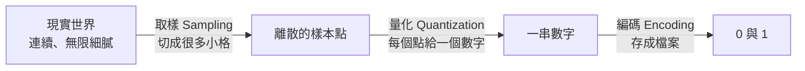
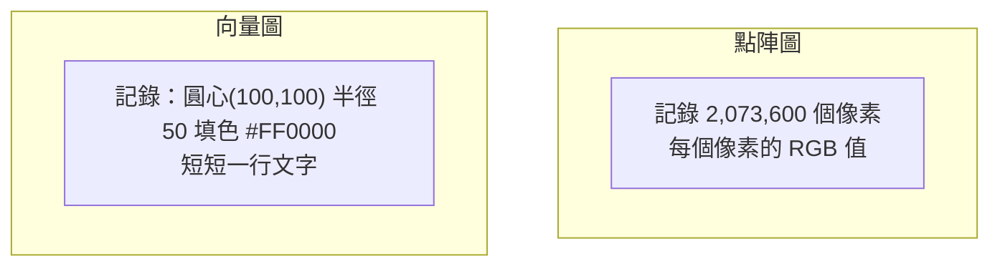

# 圖片、聲音與影片

> [!abstract] 這篇你會學到
> - 用**馬賽克磁磚**與**連續拍照**的比喻，理解「類比變數位」的過程
> - 看懂解析度、色深、取樣率、位元深度這四個關鍵數字
> - 分辨**有損壓縮**與**無損壓縮**，知道什麼時候用哪一種
> - 分辨**點陣圖**與**向量圖**，知道公文用的機關標誌該存成哪種
> - 自己估算圖片、音訊、影片的檔案大小與所需頻寬
> - 認識常見格式（JPG/PNG/GIF/SVG/WebP、WAV/MP3/FLAC、MP4/H.264）

## 前置知識

- [[03-計概-0與1和資料單位]] — 位元組與容量單位
- [[04-計概-數字系統與文字編碼]] — 十六進位（顏色碼會用到）

---

## 觀念說明

### 核心問題：怎麼把「連續的世界」變成「0 和 1」

現實世界是**連續**的：光線的亮度可以有無限多種，聲波是平滑的曲線。
但電腦只認得**離散**的數字。

解決方法只有一個：**切成很多小格，每格記一個數字。**



**格子切得越細、數字記得越精確，就越接近原貌 —— 但檔案也越大。**
整個多媒體領域，就是在這個取捨上做文章。

---

## 圖片：馬賽克磁磚

### 核心比喻

一張數位圖片，就像用**馬賽克磁磚拼出來的畫**。

| 馬賽克 | 數位圖片 |
| --- | --- |
| 一塊磁磚 | 一個**像素（pixel）** |
| 一共貼了幾塊 | **解析度（resolution）** |
| 每塊磁磚有幾種顏色可選 | **色深（color depth）** |

站遠一點看，你看到的是一幅畫；湊近看，就會看到一格一格的磁磚。
**放大圖片會「馬賽克」，就是因為磁磚被放大了。**

### 解析度：一共有幾塊磁磚

```
1920 × 1080 = 2,073,600 個像素（約 200 萬，俗稱 200 萬畫素）
3840 × 2160 = 8,294,400 個像素（4K，約 830 萬畫素）
```

| 常見解析度 | 尺寸 | 總像素 |
| --- | --- | --- |
| HD (720p) | 1280 × 720 | 92 萬 |
| **Full HD (1080p)** | 1920 × 1080 | 207 萬 |
| 2K / QHD | 2560 × 1440 | 369 萬 |
| **4K / UHD** | 3840 × 2160 | 830 萬 |
| 8K | 7680 × 4320 | 3318 萬 |

> [!note] PPI 與 DPI：磁磚的密度
> **PPI**（Pixels Per Inch）= 每英吋有幾個像素。
> 這決定的不是「有多少像素」，而是「**像素多密**」。
>
> - 5 PPI = 每英吋只有 5 個像素 → 看起來超粗糙
> - 300 PPI = 每英吋 300 個像素 → 印刷品質
>
> | 用途 | 建議 |
> | --- | --- |
> | 螢幕顯示 | 72～96 PPI（傳統）／視網膜螢幕 200+ |
> | **印刷** | **300 DPI** |
> | 大型看板（遠看） | 72～150 DPI 就夠 |
>
> **DPI**（Dots Per Inch）技術上是印表機的墨點密度，
> 但日常用語中兩者常混用。

> [!tip] 這解釋了「同樣的圖，網頁上很清楚，印出來很糊」
> 一張 800×600 的圖在螢幕上（96 PPI）大約是 8×6 英吋，看起來正常。
> 但要印成 8×6 英吋的照片需要 300 DPI，
> 也就是 **2400×1800 像素** —— 你手上的圖只有需求的 1/9。
>
> **放大不會增加資訊。** 把 800×600 拉成 2400×1800，
> 只是把每個像素變成 9 個一樣的像素，看起來就是糊的。

### 色深：每塊磁磚有幾種顏色

| 色深 | 顏色數 | 用在哪 |
| --- | --- | --- |
| 1 bit | 2 色（黑白） | 傳真、掃描的純文字 |
| 8 bit | 256 色 | 老遊戲、GIF |
| **24 bit（真彩色）** | **1677 萬色** | **絕大多數照片** |
| 32 bit | 1677 萬色 + 透明度 | 需要去背的圖 |
| 30/36 bit（HDR） | 更多層次 | 專業攝影、HDR 影片 |

**24 位元怎麼來的**：紅、綠、藍各 8 位元。

```
R = 8 bit = 256 階
G = 8 bit = 256 階
B = 8 bit = 256 階
────────────────
256 × 256 × 256 = 16,777,216 種顏色
```

這就是網頁顏色碼 `#FF5733` 的來源 ——
每兩個十六進位數字代表一個顏色通道的 0～255（見 [[04-計概-數字系統與文字編碼]]）。

> [!note] Alpha 通道：透明度
> 32 位元 = 24 位元顏色 + **8 位元 Alpha（透明度）**。
> Alpha = 0 完全透明，255 完全不透明。
>
> 這就是為什麼**去背圖要存成 PNG 而不是 JPG** ——
> **JPG 不支援透明度**。把去背的機關標誌存成 JPG，
> 透明的部分會變成白色或黑色。

### 算一張圖有多大

```
未壓縮大小 = 寬 × 高 × 每像素位元組數

一張 4000×3000（1200 萬畫素）的 24 位元照片：
4000 × 3000 × 3 Byte = 36,000,000 Byte ≈ 34 MiB
```

但你手機拍的照片只有 3～5 MB。**壓縮把它縮小了 10 倍。**

---

## 壓縮：有損 vs 無損

### 核心比喻

| | **無損壓縮** | **有損壓縮** |
| --- | --- | --- |
| 比喻 | **把衣服摺好放進行李箱**。攤開來一模一樣 | **把衣服真空壓縮，順便丟掉幾件很少穿的**。回不去了 |
| 還原後 | **與原檔完全相同**，一個位元都不差 | 與原檔**有差異**（但可能看不出來） |
| 壓縮率 | 較低（2～3 倍） | **很高（10～100 倍）** |
| 圖片格式 | PNG、GIF、BMP、TIFF | **JPEG**、WebP(有損模式) |
| 音訊格式 | FLAC、ALAC、WAV | **MP3**、AAC、Opus |
| 影片格式 | FFV1（罕用） | **H.264、H.265、AV1**（幾乎都是有損） |

### 有損壓縮丟掉了什麼

> [!example] JPEG 的聰明之處
> JPEG 利用**人眼的弱點**：
> 1. **人眼對亮度敏感，對顏色不敏感** → 色彩資訊可以存得比較粗（色度次取樣 4:2:0）
> 2. **人眼對細微的高頻變化不敏感** → 丟掉細微的紋理變化
> 3. 相鄰的像素通常很像 → 只記錄差異
>
> 所以 JPEG 丟掉的是「**你本來就看不太出來的資訊**」。
> 這就是它能壓到十分之一還看起來正常的原因。

> [!danger] 有損壓縮的世代損失
> **每存一次 JPEG，就再損失一次品質。**
>
> ```
> 原始照片 → 存成 JPG（品質 90）→ 打開修改 → 再存 JPG（品質 90）
>                                              ↑ 又損失一次
> 存十次之後 → 明顯的方塊狀雜訊
> ```
>
> 這叫 **generation loss（世代損失）**，就像影印的影印的影印。
>
> **正確做法**：
> - 編輯過程用**無損格式**（PNG、TIFF）或編輯軟體的原生格式（PSD、XCF）
> - **只在最後輸出時**才存成 JPG
> - 保留原始檔（RAW 或無損版本）

> [!tip] 那為什麼截圖建議用 PNG？
> 截圖裡有大量**文字與線條**，這正是 JPEG 最不擅長的東西 ——
> 銳利的邊緣經過有損壓縮會出現「鬼影」（ringing artifact）。
>
> | 內容類型 | 建議格式 |
> | --- | --- |
> | **照片**（自然、漸層豐富） | **JPEG** 或 WebP |
> | **截圖、文字、圖表、線條** | **PNG** |
> | **需要透明背景**（去背標誌） | **PNG** 或 SVG |
> | 需要動畫 | GIF（老）、WebP、APNG |
> | 標誌、圖示、可縮放的圖形 | **SVG**（向量） |

---

## 點陣圖 vs 向量圖

這是**機關文書工作最實用的一個觀念**。

| | **點陣圖（Bitmap／Raster）** | **向量圖（Vector）** |
| --- | --- | --- |
| 怎麼記錄 | 記錄**每一個像素的顏色** | 記錄**幾何指令**：「從 A 到 B 畫一條線，粗 2pt，藍色」 |
| 比喻 | **馬賽克拼貼** | **一份施工圖說** |
| **放大** | **會糊、會馬賽克** | **無限放大都清晰** |
| 檔案大小 | 跟解析度成正比 | 跟**圖形複雜度**有關，通常很小 |
| 適合 | **照片**、有豐富色彩層次的圖 | **標誌、圖示、圖表、字型、地圖** |
| 格式 | JPG、PNG、GIF、BMP、WebP | **SVG**、AI、EPS、PDF（部分） |



> [!example] 為什麼機關標誌一定要保留向量檔
> 你的機關標誌可能要用在：
> - 名片（小小的，1 公分）
> - 公文抬頭（3 公分）
> - 網站（螢幕解析度）
> - **會場布條（3 公尺）**
>
> 如果只有一張 500×500 的 PNG，放到布條上就是一團馬賽克。
> 但如果有 **SVG 或 AI 向量檔**，放多大都清晰，因為它記的是
> 「怎麼畫」而不是「畫好的樣子」。
>
> **實務建議**：向設計師要檔案時，
> **一定要同時索取向量原始檔（AI/EPS/SVG）**，不要只拿 PNG/JPG。
> 這是機關 IT 交接時最常出現的遺憾。

> [!tip] SVG 其實是文字檔
> ```svg
> <svg width="100" height="100" xmlns="http://www.w3.org/2000/svg">
>   <circle cx="50" cy="50" r="40" fill="#FF5733" />
>   <text x="50" y="55" text-anchor="middle" fill="white">A</text>
> </svg>
> ```
> 你可以用記事本打開編輯它。
> 這也代表它可以被 git 版本控管、可以用程式產生、可以被搜尋引擎讀取。
>
> **但也代表它有資安風險** —— SVG 可以內嵌 JavaScript，
> 見本篇「安全性注意事項」。

---

## 聲音：連續拍照

### 核心比喻

聲音是**空氣的振動**，畫出來是一條平滑的曲線。
要把它變成數字，方法是**每隔一小段時間量一次高度**。

```
真實聲波：  ～～～～～～～～～～  （平滑曲線）
取樣：      · · · · · · · · · ·  （每隔一段時間量一個點）
```

這就像**連續拍照**：拍得越密，越接近真實的動作。

### 兩個關鍵數字

| 參數 | 意思 | 比喻 |
| --- | --- | --- |
| **取樣率（Sample Rate）** | **每秒量幾次**，單位 Hz | 每秒拍幾張照片 |
| **位元深度（Bit Depth）** | **每次量得多精確** | 每張照片有幾種灰階 |

| 取樣率 | 用在哪 |
| --- | --- |
| 8 kHz | 電話語音 |
| **44.1 kHz** | **CD 音質**（音樂標準） |
| 48 kHz | **影片標準** |
| 96 / 192 kHz | 錄音室、高解析音訊 |

| 位元深度 | 動態範圍 | 用在哪 |
| --- | --- | --- |
| 8 bit | 256 階 | 老遊戲音效 |
| **16 bit** | 65,536 階 | **CD 音質** |
| 24 bit | 1677 萬階 | 專業錄音 |

> [!note] 為什麼是 44.1 kHz？
> 因為 **奈奎斯特定理（Nyquist theorem）**：
> 要完整還原一個頻率，取樣率必須是它的**兩倍以上**。
>
> 人耳能聽到的上限約 **20 kHz**，
> 所以取樣率至少要 40 kHz。44.1 kHz 是留了一點餘裕的工程選擇。
>
> 這也解釋了為什麼電話（8 kHz 取樣）聽起來悶悶的 ——
> 它只保留了 4 kHz 以下的頻率，高頻的清脆感全被丟掉了。

### 算音訊檔案大小

```
每秒位元組 = 取樣率 × 位元深度 ÷ 8 × 聲道數

CD 品質（44100 Hz、16 bit、立體聲）：
44100 × 16 ÷ 8 × 2 = 176,400 Byte/秒 ≈ 172 KiB/秒

一首 4 分鐘的歌（未壓縮 WAV）：
176,400 × 240 秒 = 42,336,000 Byte ≈ 40 MiB
```

但一首 MP3 只有 9 MB —— **MP3 壓掉了 78%**。

### 常見音訊格式

| 格式 | 壓縮 | 特點 |
| --- | --- | --- |
| **WAV** | 無壓縮 | 最大、最原始，適合編輯 |
| **FLAC** | **無損** | 約壓到一半，音質與 WAV 完全相同 |
| **MP3** | 有損 | 最通用，相容性最好 |
| **AAC** | 有損 | 同位元率下比 MP3 好，Apple 生態主流 |
| **Opus** | 有損 | 現代最有效率，適合語音與串流（WebRTC 用它） |
| **MIDI** | **不是聲音** | 記錄的是「演奏指令」而非聲波，檔案極小 |

> [!warning] MIDI 不是音訊檔
> MIDI 存的是「**第 3 秒用鋼琴彈 Do，力度 80，持續 0.5 秒**」這種指令，
> **不含任何實際的聲音**。播放時由音源合成出來。
>
> 這就像**樂譜 vs 錄音**：
> 樂譜檔案極小（幾 KB），但不同的演奏者（音源）彈出來完全不一樣。
>
> 所以同一個 MIDI 檔在不同裝置上播放，聽起來可能天差地別。

---

## 影片：一大堆照片加上聲音

### 影片 = 連續的圖片 + 音軌

| 參數 | 說明 |
| --- | --- |
| **解析度** | 每一張圖多大（1080p、4K） |
| **幀率（FPS）** | 每秒幾張圖 |
| **位元率（Bitrate）** | 每秒用多少資料量，**這才是決定畫質與檔案大小的關鍵** |
| **編碼（Codec）** | 用什麼演算法壓縮（H.264、H.265、AV1） |
| **容器（Container）** | 檔案外殼（MP4、MKV、AVI） |

| FPS | 感受 |
| --- | --- |
| 24 | 電影標準（有電影感） |
| 30 | 電視、一般影片 |
| 60 | 流暢，遊戲與運動賽事 |
| 120+ | 高刷新率螢幕、慢動作素材 |

> [!note] 容器 vs 編碼：便當盒與菜
> 這是最常被搞混的一組概念。
>
> - **容器（MP4、MKV、AVI）**＝**便當盒**。它只負責把影像軌、音軌、字幕裝在一起
> - **編碼（H.264、H.265、AV1）**＝**裡面的菜**。它才決定畫質與檔案大小
>
> 所以「MP4 檔」這句話**沒有告訴你任何關於畫質的資訊** ——
> 同樣是 MP4，裡面可能是老舊的 MPEG-4 Part 2，也可能是最新的 AV1。
>
> 這也解釋了「為什麼這個 MP4 我的電視播不出來」：
> 電視認得 MP4 這個盒子，但**不認得裡面那道菜**（不支援該編碼）。

### 影片編碼的演進

| 編碼 | 年代 | 相對效率 | 相容性 |
| --- | --- | --- | --- |
| H.264 / AVC | 2003 | 基準 | **最好，什麼都能播** |
| H.265 / HEVC | 2013 | 省 **50%** 頻寬 | 好，但有專利授權問題 |
| VP9 | 2013 | 類似 H.265 | Google 推，YouTube 在用 |
| **AV1** | 2018 | 比 H.265 再省 30% | **免權利金**，逐漸普及 |

> [!tip] 同樣畫質，新編碼省一半頻寬
> 這對監視系統影響巨大。
> 一支 4K 監視器用 H.264 每天產生 100 GB，
> 換成 H.265 只要 50 GB —— **儲存成本直接砍半**。
>
> 但要注意：新編碼**運算量更大**，
> 老舊的錄影主機或監控軟體可能不支援，或者播放時會很卡。

### 算影片檔案大小

```
檔案大小 ≈ 位元率（Mbps） ÷ 8 × 秒數

一小時 1080p 影片，位元率 8 Mbps：
8 ÷ 8 × 3600 = 3,600 MB ≈ 3.5 GiB
```

| 內容 | 建議位元率（H.264） |
| --- | --- |
| 1080p 30fps | 5～8 Mbps |
| 1080p 60fps | 8～12 Mbps |
| 4K 30fps | 35～45 Mbps |
| 4K 60fps | 53～68 Mbps |

> [!example] 監視系統的儲存規劃
> 機關要裝 **20 支 1080p 監視器，錄影保留 30 天**，需要多少空間？
>
> ```
> 單支 1080p H.265 監視器（4 Mbps）：
>   4 Mbps ÷ 8 = 0.5 MB/s
>   一天：0.5 × 86400 = 43,200 MB ≈ 42 GiB
>
> 20 支 × 30 天：
>   42 × 20 × 30 = 25,200 GiB ≈ 24.6 TiB
>
> 加 20% 緩衝 ≈ 30 TiB
> 換算採購容量：30 ÷ 0.93 ≈ 32 TB
> ```
>
> **建議**：8 顆 8TB 硬碟做 RAID 6（可用約 44 TB），
> 留有充足餘裕與未來擴充空間。
>
> **可以省空間的做法**：
> - 開啟**位移偵測錄影**（只在有動作時錄），可省 50～80%
> - 用 **H.265** 而非 H.264
> - 對不重要的區域降低幀率（如 15 fps）
>
> 見 [[07-計概-磁碟格式化與RAID入門]] 與 `31-機房與硬體管理`。

---

## 完整實戰範例

### 用 ImageMagick 處理圖片

```bash
$ sudo apt install imagemagick

# 看圖片資訊
$ identify photo.jpg
photo.jpg JPEG 4000x3000 4000x3000+0+0 8-bit sRGB 3.42MB

# 詳細資訊（含 EXIF）
$ identify -verbose photo.jpg | head -30

# 縮小到寬 1920（高度自動等比）
$ convert photo.jpg -resize 1920x photo_small.jpg

# 調整 JPEG 品質（85 是畫質與大小的甜蜜點）
$ convert photo.jpg -quality 85 photo_q85.jpg

# 批次處理整個資料夾
$ for f in *.jpg; do
    convert "$f" -resize 1920x -quality 85 "web_$f"
  done

# 轉成 WebP（通常比 JPEG 再小 25～35%）
$ convert photo.jpg -quality 82 photo.webp

# 移除 EXIF（重要！見下方資安段落）
$ convert photo.jpg -strip photo_clean.jpg
```

### 用 ffmpeg 處理影音

```bash
$ sudo apt install ffmpeg

# 看影片資訊
$ ffprobe -hide_banner video.mp4
Stream #0:0: Video: h264, yuv420p, 1920x1080, 8000 kb/s, 30 fps
Stream #0:1: Audio: aac, 48000 Hz, stereo, 128 kb/s

# 轉成 H.265 省空間（CRF 越小畫質越好，23～28 是常用範圍）
$ ffmpeg -i input.mp4 -c:v libx265 -crf 28 -c:a copy output.mp4

# 壓縮成 720p
$ ffmpeg -i input.mp4 -vf scale=-2:720 -c:v libx264 -crf 23 output_720p.mp4

# 只抽出音訊
$ ffmpeg -i video.mp4 -vn -c:a copy audio.aac

# 截取一段（從 1 分 30 秒開始，取 60 秒）
$ ffmpeg -ss 00:01:30 -i input.mp4 -t 60 -c copy clip.mp4

# 抽出一張縮圖
$ ffmpeg -ss 00:00:05 -i video.mp4 -vframes 1 thumb.jpg

# 轉換音訊格式
$ ffmpeg -i song.wav -c:a libmp3lame -b:a 192k song.mp3
```

> [!tip] `-c copy` 是快一百倍的祕訣
> `-c copy` 代表「**直接複製，不重新編碼**」。
> 剪片、換容器格式時用它，**幾秒鐘就完成**，而且**完全無損**。
>
> ```bash
> # 只換容器，不重新編碼（MKV → MP4）
> $ ffmpeg -i video.mkv -c copy video.mp4     # 幾秒
>
> # 重新編碼（真的要改畫質時）
> $ ffmpeg -i video.mkv -c:v libx264 video.mp4  # 可能要幾十分鐘
> ```

### 產生 Web 用的多尺寸圖片

```bash
# 為響應式網頁產生多種尺寸
for size in 400 800 1200 1920; do
  convert original.jpg -resize ${size}x -quality 85 -strip img_${size}.jpg
  convert original.jpg -resize ${size}x -quality 82 -strip img_${size}.webp
done
```

搭配 HTML：
```html
<picture>
  <source srcset="img_800.webp" type="image/webp">
  
</picture>
```

> [!tip] 這是網站效能最有效的優化
> 多數網站最大的檔案就是圖片。
> 把一張 3 MB 的原圖換成 150 KB 的最佳化版本，
> 載入速度的提升遠大於任何伺服器調校。
>
> 見 `51-Web伺服器` 的效能章節。

---

## 常見錯誤與排錯

| 現象 | 原因 | 解法 |
| --- | --- | --- |
| 去背的標誌存成 JPG 後背景變白 | **JPG 不支援透明度** | 改存 PNG 或 SVG |
| 圖片放大到布條就馬賽克 | 點陣圖沒有足夠的原始解析度 | 索取**向量原始檔**（AI/EPS/SVG） |
| 螢幕上清楚，印出來很糊 | 解析度不足（印刷需 300 DPI） | 用更高解析度的原圖；不要放大點陣圖 |
| 每次編輯存檔後畫質越來越差 | JPEG **世代損失** | 編輯用 PNG/TIFF/原生格式，最後才輸出 JPG |
| MP4 在某台電視播不出來 | 容器認得，但**編碼不支援** | 用 ffmpeg 轉成 H.264；`ffprobe` 先確認編碼 |
| 影片檔案超大 | 位元率太高或用了舊編碼 | 轉 H.265/AV1；調整 CRF |
| 剪片轉檔要跑好幾小時 | 重新編碼很慢 | 純剪接／換容器時加 `-c copy` |
| 網頁載入很慢 | 圖片沒最佳化，直接放原圖 | 縮小尺寸、`-quality 85`、轉 WebP、加 `loading="lazy"` |
| 上傳的照片洩漏了拍攝地點 | **EXIF 含 GPS 資訊** | 上傳前 `convert -strip`；或設定 CMS 自動移除 |
| 錄音聽起來悶悶的 | 取樣率太低（如 8 kHz） | 錄製時用 44.1 或 48 kHz |
| 監視器錄影空間不夠 | 沒估算或沒開位移偵測 | 用位元率公式重算；開啟位移偵測；改 H.265 |
| SVG 上傳後網站出現異常 | SVG 可內嵌 JavaScript | 上傳的 SVG 要清洗（sanitize）或禁止上傳 |

---

## 安全性注意事項

> [!danger] EXIF：照片裡藏著你不想公開的資訊
> 手機與相機拍的照片會嵌入 **EXIF** 中繼資料，可能包含：
>
> | 欄位 | 洩漏什麼 |
> | --- | --- |
> | **GPS 座標** | **拍攝的精確地點** |
> | 拍攝時間 | 你當時在哪裡 |
> | 相機型號與序號 | 可用來關聯不同照片是同一台相機拍的 |
> | 縮圖 | **有時保留了「編輯前」的原始畫面** |
> | 軟體資訊 | 用什麼軟體處理過 |
>
> 曾有多起案例：發布照片後被人從 EXIF 反推出住家地址。
> 對機關而言，公務照片可能洩漏機敏場所位置。
>
> ```bash
> # 看照片有哪些 EXIF
> $ exiftool photo.jpg
> $ identify -verbose photo.jpg | grep -i gps
>
> # 移除所有中繼資料
> $ exiftool -all= photo.jpg
> $ convert photo.jpg -strip clean.jpg
>
> # 批次清除整個目錄
> $ exiftool -all= -overwrite_original *.jpg
> ```
>
> **機關網站的做法**：在上傳流程中**自動移除 EXIF**，
> 不要依賴使用者自己處理。

> [!danger] SVG 可以執行 JavaScript
> SVG 是 XML，可以內嵌 `<script>`：
> ```svg
> <svg xmlns="http://www.w3.org/2000/svg">
>   <script>alert(document.cookie)</script>
> </svg>
> ```
> 如果網站允許使用者上傳 SVG 當頭像，並且**直接以原始檔案提供**，
> 這就是一個 **儲存型 XSS**（stored XSS）漏洞。
>
> **防護**：
> 1. **不要允許上傳 SVG**（最簡單）
> 2. 若必須支援，用 **DOMPurify** 之類的工具清洗
> 3. 用 `Content-Disposition: attachment` 強制下載而非顯示
> 4. 把使用者上傳的檔案放在**不同網域**（避免同源政策下的 cookie 存取）
>
> 見 [[09-應用層安全]]。

> [!warning] 惡意的多媒體檔案
> 影像與影音的解碼器（libjpeg、libpng、ffmpeg、ImageMagick）
> 歷史上有大量的記憶體損毀漏洞。
> 一張精心構造的圖片就可能在解碼時執行任意程式碼。
>
> **著名案例**：ImageMagick 的 **ImageTragick**（CVE-2016-3714）
> 讓攻擊者透過上傳圖片就能在伺服器上執行指令。
>
> **防護**：
> 1. **保持解碼函式庫更新**（這比什麼都重要）
> 2. ImageMagick 設定 `policy.xml` **停用危險的處理器**：
>    ```xml
>    <policy domain="coder" rights="none" pattern="MSL" />
>    <policy domain="coder" rights="none" pattern="MVG" />
>    <policy domain="coder" rights="none" pattern="EPHEMERAL" />
>    <policy domain="coder" rights="none" pattern="URL" />
>    <policy domain="coder" rights="none" pattern="HTTPS" />
>    ```
> 3. 圖片處理**在隔離環境中執行**（容器、低權限使用者）
> 4. **用魔術數字驗證真實類型**，不要只信副檔名
>    （見 [[09-計概-檔案與檔案系統]]）

> [!tip] 上傳圖片的完整防護清單
> 1. 驗證**魔術數字**而非副檔名
> 2. **重新編碼**（把圖片重新產生一次，順便去掉夾帶的內容）
> 3. **重新命名**檔案，不要用使用者提供的名稱
> 4. 存在**網站根目錄之外**，或該目錄**禁止執行**
> 5. 限制檔案大小與圖片尺寸（防止解壓縮炸彈）
> 6. **移除 EXIF**
> 7. 掃毒
>
> 見 [[09-應用層安全]] 與 [[04-Web應用防火牆WAF]]。

---

## 速查表

### 圖片格式選擇

| 內容 | 用什麼 | 為什麼 |
| --- | --- | --- |
| 照片 | **JPEG** / WebP | 有損壓縮效率高 |
| 截圖、文字、圖表 | **PNG** | 無損，銳利邊緣不失真 |
| 去背圖 | **PNG** / SVG | 支援透明度 |
| 標誌、圖示 | **SVG** | 向量，無限縮放 |
| 動畫 | WebP / APNG / GIF | |
| 網頁最佳化 | **WebP**（備援 JPEG/PNG） | 比 JPEG 小 25～35% |

### 關鍵參數

| 參數 | 影響 | 常見值 |
| --- | --- | --- |
| 解析度 | 圖片有多少像素 | 1920×1080、3840×2160 |
| 色深 | 有幾種顏色 | 24 bit（真彩色） |
| PPI/DPI | 像素密度 | 螢幕 96、**印刷 300** |
| 取樣率 | 每秒量幾次聲音 | **44.1 kHz**（CD）、48 kHz（影片） |
| 位元深度 | 每次量多精確 | **16 bit**（CD）、24 bit（專業） |
| FPS | 每秒幾張畫面 | 24（電影）、30、60 |
| 位元率 | 每秒多少資料 | 1080p 約 8 Mbps |

### 檔案大小估算

| 想算什麼 | 公式 |
| --- | --- |
| 未壓縮圖片 | 寬 × 高 × 3 Byte |
| 未壓縮音訊 | 取樣率 × 位元深度 ÷ 8 × 聲道 × 秒數 |
| 影片 | 位元率(Mbps) ÷ 8 × 秒數 = MB |
| 監視器一天 | 位元率(Mbps) ÷ 8 × 86400 ÷ 1024 = GiB |

### 常用指令

| 目的 | 指令 |
| --- | --- |
| 看圖片資訊 | `identify 圖.jpg` |
| 縮圖 | `convert 圖.jpg -resize 1920x 小.jpg` |
| 調品質 | `convert 圖.jpg -quality 85 out.jpg` |
| **移除 EXIF** | `convert 圖.jpg -strip out.jpg`、`exiftool -all= 圖.jpg` |
| 轉 WebP | `convert 圖.jpg -quality 82 圖.webp` |
| 看影片資訊 | `ffprobe -hide_banner 影片.mp4` |
| 轉編碼 | `ffmpeg -i in.mp4 -c:v libx265 -crf 28 out.mp4` |
| **快速剪接** | `ffmpeg -ss 開始 -i in.mp4 -t 長度 -c copy out.mp4` |
| 抽音訊 | `ffmpeg -i 影片.mp4 -vn -c:a copy 音訊.aac` |
| 產生縮圖 | `ffmpeg -ss 5 -i 影片.mp4 -vframes 1 縮圖.jpg` |

---

## 練習題

> [!question]- 練習 1：算檔案大小
> 1. 一張 6000×4000 的 24 位元照片，未壓縮多大？
> 2. 一首 5 分鐘的 CD 品質（44.1kHz/16bit/立體聲）WAV 檔多大？
> 3. 一部 2 小時的 1080p 影片，位元率 10 Mbps，多大？
> 4. 10 支 4K 監視器（H.265，8 Mbps）錄 60 天要多少空間？
>
> 參考答案：
> 1. 6000 × 4000 × 3 = 72,000,000 Byte ≈ **68.7 MiB**
> 2. 44100 × 16 ÷ 8 × 2 × 300 = 52,920,000 Byte ≈ **50.5 MiB**
> 3. 10 ÷ 8 × 7200 = 9,000 MB ≈ **8.8 GiB**
> 4. 8 ÷ 8 × 86400 = 86,400 MB ≈ 84 GiB／天／支
>    84 × 10 × 60 = 50,400 GiB ≈ **49 TiB**（加緩衝約需 60 TB 採購容量）

> [!question]- 練習 2：檢查照片的 EXIF
> ```bash
> sudo apt install libimage-exiftool-perl
>
> # 用手機拍一張照片傳到電腦，然後：
> exiftool photo.jpg | grep -iE 'gps|date|model|software'
> ```
> 看看它洩漏了什麼。如果有 GPS 座標，
> 貼到 Google Maps 看看它有多準確 —— 這通常會讓人有點驚訝。
>
> 然後移除它：`exiftool -all= photo.jpg` 再檢查一次。

> [!question]- 練習 3：比較壓縮效果
> ```bash
> # 拿一張照片，產生不同品質的版本
> for q in 100 90 85 75 60 40; do
>   convert photo.jpg -quality $q -strip q$q.jpg
> done
> ls -lh q*.jpg
> ```
> 觀察：
> 1. 品質 100 與 85 的檔案大小差多少？肉眼看得出差別嗎？
> 2. 品質降到 40 時，哪些地方最先出現破綻？（提示：看銳利的邊緣與大面積漸層）
> 3. 再拿一張**截圖**做同樣的實驗 —— 你會發現截圖的劣化明顯得多。
>
> 結論：**85 通常是照片的甜蜜點；截圖請用 PNG。**

---

## 小測驗

Q1. 用「馬賽克磁磚」的比喻說明像素、解析度與色深。為什麼放大圖片會馬賽克？

Q2. 24 位元真彩色的 1677 萬色是怎麼算出來的？跟網頁顏色碼 `#FF5733` 有什麼關係？

Q3. 為什麼去背的機關標誌不能存成 JPG？

Q4. 有損壓縮與無損壓縮的差別是什麼？用行李箱的比喻說明。各舉兩個圖片格式。

Q5. 什麼是「世代損失」？該怎麼避免？

Q6. 為什麼截圖建議用 PNG 而照片建議用 JPEG？

Q7. 點陣圖與向量圖的根本差別是什麼？為什麼機關標誌一定要保留向量原始檔？

Q8. 為什麼 CD 的取樣率是 44.1 kHz？電話語音為什麼聽起來悶悶的？

Q9. 「容器」與「編碼」的差別是什麼？這解釋了什麼常見問題？

Q10. EXIF 可能洩漏哪些敏感資訊？機關網站的正確處理方式是什麼？

> [!question]- 測驗答案
> **Q1.** 一張數位圖片像**用馬賽克磁磚拼出的畫**：
> 一塊磁磚 = 一個**像素**；一共貼了幾塊 = **解析度**；
> 每塊磁磚有幾種顏色可選 = **色深**。
> 放大會馬賽克是因為**磁磚本身被放大了** ——
> 放大不會產生新資訊，只是把每個像素變成好幾個一樣的像素。
>
> **Q2.** 紅、綠、藍各佔 **8 位元**（各 256 階），
> 256 × 256 × 256 = **16,777,216** 種顏色。
> 網頁顏色碼 `#FF5733` 就是這三個通道的**十六進位**表示：
> FF(255) 紅、57(87) 綠、33(51) 藍。
>
> **Q3.** 因為 **JPG 不支援透明度（Alpha 通道）**。
> 存成 JPG 後，原本透明的部分會被填成白色或黑色。
> 去背圖應該存成 **PNG**（32 位元 = 24 位元顏色 + 8 位元 Alpha）或 **SVG**。
>
> **Q4.** **無損壓縮**像「**把衣服摺好放進行李箱**」——
> 攤開來與原本一模一樣，一個位元都不差，但壓縮率較低（2～3 倍）；
> **有損壓縮**像「**真空壓縮，順便丟掉幾件很少穿的**」——
> 回不去了，但壓縮率很高（10～100 倍）。
> 無損圖片格式：**PNG、GIF、BMP、TIFF**；有損：**JPEG、WebP（有損模式）**。
>
> **Q5.** **世代損失（generation loss）**是指每次以有損格式重新存檔就再損失一次品質，
> 像「影印的影印的影印」，存十次後會出現明顯的方塊狀雜訊。
> **避免方法**：編輯過程使用**無損格式**（PNG、TIFF）或編輯軟體的原生格式（PSD、XCF），
> **只在最後輸出時**才存成 JPG，並保留原始檔。
>
> **Q6.** 因為截圖含有大量**文字與線條（銳利邊緣）**，
> 這正是 JPEG 最不擅長的 —— 有損壓縮會在邊緣產生「鬼影」（ringing artifact）。
> 照片則是自然、漸層豐富的內容，JPEG 能利用人眼弱點大幅壓縮而看不出來。
>
> **Q7.** **點陣圖記錄「每一個像素的顏色」**（像馬賽克拼貼）；
> **向量圖記錄「幾何指令」**——「圓心(100,100)、半徑 50、填色 #FF0000」（像施工圖說）。
> 因此向量圖**無限放大都清晰**。
> 機關標誌要保留向量檔，是因為它可能要用在從 1 公分的名片到
> **3 公尺的會場布條**；只有 PNG 的話，放大到布條就是一團馬賽克。
>
> **Q8.** 因為 **奈奎斯特定理**：要完整還原一個頻率，取樣率必須是它的**兩倍以上**。
> 人耳聽力上限約 **20 kHz**，所以取樣率至少要 40 kHz，44.1 kHz 是留了餘裕的工程選擇。
> 電話用 **8 kHz** 取樣，只能保留 4 kHz 以下的頻率，
> **高頻的清脆感全被丟掉**，所以聽起來悶悶的。
>
> **Q9.** **容器（MP4、MKV、AVI）是「便當盒」**，只負責把影像軌、音軌、字幕裝在一起；
> **編碼（H.264、H.265、AV1）是「裡面的菜」**，才決定畫質與檔案大小。
> 這解釋了「**為什麼這個 MP4 我的電視播不出來**」——
> 電視認得 MP4 這個盒子，但不支援裡面的那種編碼。
> 也解釋了為什麼「MP4 檔」這句話完全沒有告訴你畫質資訊。
>
> **Q10.** EXIF 可能包含：**GPS 精確座標（拍攝地點）**、拍攝時間、
> 相機型號與序號（可關聯不同照片）、**有時保留編輯前的原始縮圖**、軟體資訊。
> 曾有多起從 EXIF 反推出住家地址的案例；公務照片可能洩漏機敏場所位置。
> **機關網站的正確處理**：在**上傳流程中自動移除 EXIF**
> （`convert -strip` 或 `exiftool -all=`），**不要依賴使用者自己處理**。

---

## 延伸閱讀

- [[03-計概-0與1和資料單位]] — 檔案大小的單位換算
- [[04-計概-數字系統與文字編碼]] — 十六進位顏色碼
- [[09-計概-檔案與檔案系統]] — 副檔名與魔術數字
- [[07-計概-磁碟格式化與RAID入門]] — 監視錄影的儲存規劃
- [[09-應用層安全]] — 檔案上傳的安全防護（進階）
- [[04-Web應用防火牆WAF]] — 阻擋惡意上傳（進階）
