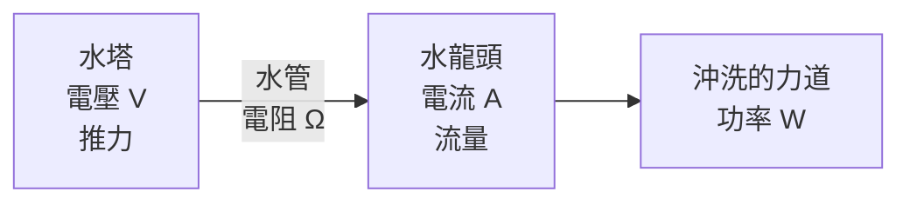

# 電力基礎與用電安全

> [!abstract] 這篇你會學到
> - 用**水管**的比喻理解電壓、電流、功率的關係
> - 記住 **P = V × I** 這個公式，並會實際計算
> - 算出一條 15A 迴路能承載多少設備，避免跳電與火災
> - 理解**接地**為什麼重要，以及為什麼機房要用三孔插座
> - 知道 UPS 該怎麼選、能撐多久
> - 認識安全電壓與觸電風險

## 前置知識

- [[02-計概-主機裡面有什麼]] — 電源供應器在做什麼

> [!note] 為什麼計算機概論要教電學？
> 因為**資訊設備維運人員一定會遇到用電問題**：
> - 機房電力規劃、UPS 選型、PDU 配置
> - 「為什麼插上去就跳電」
> - 「這台伺服器要配多大的 UPS」
> - 辦公室新增設備前，這條迴路吃不吃得下
>
> 這一篇是後面 `31-機房與硬體管理` 的基礎。

---

## 觀念說明

### 核心比喻：電就像水管裡的水

這是最經典也最好用的比喻。

| 電學 | 水管 | 單位 | 白話 |
| --- | --- | --- | --- |
| **電壓（Voltage）** | **水壓** | 伏特 **V** | 推力有多大 |
| **電流（Current）** | **水流量** | 安培 **A** | 每秒流過多少水 |
| **電阻（Resistance）** | **管子粗細** | 歐姆 **Ω** | 管子越細越難流 |
| **功率（Power）** | **實際做了多少功** | 瓦特 **W** | 沖走多少東西 |



> [!note] 三個關鍵直覺
> 1. **電壓是「有沒有推力」** —— 就算水管接好了，水塔沒水壓就不會流
> 2. **電流是「實際流了多少」** —— 這才是會讓電線發熱的東西
> 3. **功率是「做了多少事」** —— 電費是按這個算的

### 核心公式：P = V × I

```
功率（W）= 電壓（V）× 電流（A）
```

台灣的一般家用與辦公室插座是 **110V**，
所以只要知道設備的瓦數，就能算出它會拉多少電流：

```
電流（A）= 功率（W）÷ 電壓（V）
```

> [!example] 算一算常見設備
> | 設備 | 功率 | 在 110V 時的電流 |
> | --- | --- | --- |
> | LED 燈泡 | 10 W | 0.09 A |
> | 筆電充電器 | 65 W | 0.59 A |
> | 桌上型電腦 | 300 W | 2.7 A |
> | 24 吋螢幕 | 30 W | 0.27 A |
> | 雷射印表機（列印中） | 800 W | 7.3 A |
> | **微波爐** | **1200 W** | **10.9 A** |
> | **電熱水壺** | **1200 W** | **10.9 A** |
> | **吹風機** | **1200 W** | **10.9 A** |
> | **電暖器** | **1200 W** | **10.9 A** |
> | 冷氣（1 噸） | 900 W | 8.2 A |

### 一條迴路能吃多少？

台灣一般插座迴路的無熔絲開關（NFB）多為 **15A** 或 **20A**。

```
15A × 110V = 1650 W       ← 這就是那個常聽到的「1650 瓦」
20A × 110V = 2200 W
```

> [!danger] 但實際上不能用滿
> 電氣安全規範建議**持續負載不超過額定值的 80%**：
>
> ```
> 15A 迴路的安全持續負載 = 15 × 0.8 = 12A = 1320 W
> 20A 迴路的安全持續負載 = 20 × 0.8 = 16A = 1760 W
> ```
>
> 為什麼？因為：
> - 電線持續通大電流會**發熱**，長期會讓絕緣層劣化
> - 開關與插座接點會**老化**
> - 突波（設備啟動瞬間的湧浪電流）會超過穩定值
>
> **超過的後果**：輕則跳電，重則**電線起火**。

> [!example] 為什麼一個插座不能插兩台電暖器
> ```
> 電暖器 1200W ÷ 110V = 10.9 A
> 兩台        = 21.8 A
>
> 15A 迴路的上限 = 15 A     ← 已經超過！
> ```
> 而且辦公室的一條迴路通常**串了好幾個插座**，
> 上面可能還有電腦、螢幕、印表機。
>
> **如果 NFB 正常，會跳電**（這是好事，代表保護裝置在工作）。
> **如果有人把 NFB 換成更大的、或用了劣質延長線** ——
> 電線會在牆壁裡持續發熱，這就是電氣火災的成因。

> [!danger] 絕對不要「因為一直跳電就換大一號的無熔絲開關」
> NFB 的作用是**保護電線不要過熱起火**。
> 它的規格是依照**牆內電線的粗細**決定的。
>
> 把 15A 換成 30A，電線並沒有變粗 ——
> 你只是拿掉了那個會在電線起火前先跳掉的保護裝置。
>
> **一直跳電代表負載真的太重**，正確做法是：
> 1. 把高功率設備分散到不同迴路
> 2. 請合格電匠**增設專用迴路**（連電線一起換粗）

---

## 進階應用：機房與辦公室的用電規劃

### 計算一個機櫃需要多少電

> [!example] 一個標準機櫃的用電估算
> 機櫃內設備：
>
> | 設備 | 數量 | 單台功率 | 小計 |
> | --- | --- | --- | --- |
> | 1U 伺服器 | 6 台 | 350 W | 2100 W |
> | 2U 儲存伺服器 | 2 台 | 600 W | 1200 W |
> | 24 埠交換器 | 2 台 | 60 W | 120 W |
> | 防火牆 | 1 台 | 80 W | 80 W |
> | KVM | 1 台 | 20 W | 20 W |
> | **合計** | | | **3520 W** |
>
> **換算電流（220V 機房電源）**：
> ```
> 3520 W ÷ 220 V = 16 A
> ```
>
> **加上 80% 規則的餘裕**：
> ```
> 16 ÷ 0.8 = 20 A
> ```
>
> **結論**：這個機櫃至少需要一路 **20A/220V** 的電源。
>
> 但實務上還要考慮：
> - **雙路電源（A/B feed）**：伺服器有兩顆電源供應器，
>   應分接兩條獨立迴路，任一條斷了機器仍能運作
> - **每路都要能單獨承擔全部負載**（因為另一路可能故障）
> - 所以實際上要規劃 **2 × 20A**，各自能吃下全部 3520 W

> [!tip] 機房為什麼用 220V
> 同樣的功率，電壓越高，電流越小：
> ```
> 3520 W ÷ 110 V = 32 A     ← 需要很粗的電線
> 3520 W ÷ 220 V = 16 A     ← 電線可以細一半
> ```
> 電流小 → 電線細 → 成本低、發熱少、壓降小。
> 這就是為什麼機房、冷氣、大型設備都用 220V。

### 熱：用了多少電，就產生多少熱

> [!warning] 這是機房空調規劃的核心
> **幾乎所有電力最後都變成熱。**
> 一個 3520 W 的機櫃，就是一個 3520 W 的電暖器。
>
> 換算成冷氣噸數：
> ```
> 1 冷凍噸（RT）≈ 3517 W 的散熱能力
> 3520 W ≈ 1 RT
> ```
>
> **所以：一個滿載的機櫃，大約需要 1 噸的冷氣專門幫它散熱。**
>
> 而且冷氣本身也要耗電（大約是散熱量的 1/3），
> 所以總用電還要再往上加。
>
> 這個比例叫 **PUE**（Power Usage Effectiveness）：
> ```
> PUE = 資料中心總用電 ÷ IT 設備用電
> ```
> - PUE = 2.0：IT 用 1 度電，冷氣與其他設施也用 1 度（老舊機房）
> - PUE = 1.5：普通水準
> - PUE = 1.2：優良（現代化資料中心）
>
> 詳見 [[02-空調系統與溫溼度監控]]。

### UPS：不斷電系統

**UPS**（Uninterruptible Power Supply）在市電中斷時用電池供電，
爭取時間讓設備**正常關機**或等待發電機啟動。

> [!warning] UPS 不是為了「繼續工作」
> 常見誤解是「有 UPS 就能繼續用電腦」。
> 一般的 UPS 只能撐 **5～30 分鐘**。
>
> **它真正的目的是**：
> 1. 讓伺服器有時間**正常關機**，避免資料損毀
> 2. 撐過**短暫的停電與電壓波動**（多數停電只有幾秒）
> 3. 等待**柴油發電機**啟動（大型機房）

**UPS 的三種類型**：

| 類型 | 原理 | 切換時間 | 適合 |
| --- | --- | --- | --- |
| **離線式（Offline/Standby）** | 平時直接用市電，斷電才切到電池 | 5～10 ms | 家用、單機 |
| **在線互動式（Line-Interactive）** | 多了穩壓功能 | 2～5 ms | **辦公室、小型機房** |
| **在線式（Online/雙轉換）** | **市電永遠先轉直流再轉交流** | **0 ms** | **機房、關鍵設備** |

> [!tip] 在線式為什麼最好
> 在線式 UPS 的輸出**永遠來自 UPS 自己的變流器**，
> 市電只是拿來充電。所以：
> - 切換時間是 **0**（根本不需要切換）
> - 輸出電壓與頻率**永遠穩定**，不受市電品質影響
> - 能完全隔絕突波、諧波、頻率漂移
>
> 代價是效率較低（多一次轉換）、較貴、會發熱。

### 算 UPS 該買多大、能撐多久

> [!warning] UPS 標示的 VA 不等於 W
> UPS 通常標示兩個數字：**VA（伏安）** 與 **W（瓦特）**。
>
> ```
> W = VA × 功率因數（PF）
> ```
>
> 舊型 UPS 的 PF 約 0.6，現代多為 0.9 或 1.0。
>
> **一台標示 1000VA / 600W 的 UPS，實際只能帶 600W 的設備。**
> 買的時候**要看 W 不是 VA**。

> [!example] 完整的 UPS 選型計算
> **需求**：一台 350W 的伺服器 + 一台 60W 的交換器，
> 希望停電後能撐 15 分鐘讓系統正常關機。
>
> **步驟 1：算總負載**
> ```
> 350 + 60 = 410 W
> ```
>
> **步驟 2：加安全餘裕（建議負載不超過 UPS 額定的 70～80%）**
> ```
> 410 ÷ 0.75 ≈ 550 W
> ```
>
> **步驟 3：換算 VA（假設 PF = 0.9）**
> ```
> 550 ÷ 0.9 ≈ 610 VA
> ```
>
> **步驟 4：查廠商的放電曲線**
> 不能自己用「電池容量 ÷ 功率」硬算，因為：
> - 電池放電效率隨負載變化
> - 變流器本身有損耗
> - 電池會老化
>
> 廠商型錄會有「負載 X% 時可撐 Y 分鐘」的表格。
> 以常見的 1000VA/900W 機種為例，帶 410W（約 45% 負載）大約可撐 15～20 分鐘。
>
> **結論**：選一台 **1000VA / 900W** 以上的在線互動式或在線式 UPS。

> [!danger] UPS 電池是消耗品
> 鉛酸電池的壽命約 **3～5 年**，而且：
> - **會隨溫度縮短**（機房溫度每高 10°C，壽命大約減半）
> - 平常沒事看不出來，**停電時才發現撐不到一分鐘**
>
> **必做的維護**：
> 1. 記錄電池的**安裝日期**，滿 3 年開始評估更換
> 2. **每季做一次自我測試**（多數 UPS 有這功能）
> 3. **每半年到一年做一次實際放電演練**
>    （在維護時段，真的拔掉市電看能撐多久）
> 4. 用 NUT（Network UPS Tools）或廠商軟體**監控電池狀態並告警**
>
> 這應納入 `71-維運實務` 的定期維護清單。

```bash
# Linux 上用 NUT 監控 UPS
$ sudo apt install nut
$ upsc myups@localhost
battery.charge: 100
battery.runtime: 1080          ← 剩餘可撐 1080 秒
battery.voltage: 27.3
input.voltage: 110.5
ups.load: 42                   ← 目前負載 42%
ups.status: OL                 ← OL = On Line（市電正常）
```

> [!tip] UPS 一定要接訊號線
> 只把電源線接上是不夠的。
> UPS 應該用 **USB 或網路**連到伺服器，
> 這樣停電時 UPS 才能**通知伺服器「快關機」**。
>
> 沒接訊號線的話，UPS 會一路撐到電池耗盡，
> 然後**所有機器同時斷電** —— 跟沒有 UPS 一樣糟。

---

## 接地與安全

### 為什麼要接地

> [!example] 用「逃生通道」來理解接地
> 正常情況下，電從**火線**進來、從**中性線**回去。
>
> 但如果設備內部絕緣破損，電漏到金屬外殼上，
> 那麼**摸到外殼的人就變成電流回大地的通路** —— 這就是觸電。
>
> **接地線（第三根線）就是給漏電一條「更好走的路」**：
> 一條電阻極低、直通大地的通道。
>
> 漏電發生時：
> 1. 大量電流從接地線流走
> 2. 這個異常電流會讓**漏電斷路器（RCD/ELCB）跳脫**
> 3. 電源被切斷，人安全了

| 插座 | 說明 |
| --- | --- |
| **兩孔** | 只有火線與中性線，**沒有接地** |
| **三孔** | 多了接地。**所有資訊設備都應該用三孔** |

> [!danger] 不要用「三孔轉兩孔」轉接頭
> 那個小小的轉接頭把接地功能整個拿掉了。
> 用在電腦、伺服器上：
> - 失去漏電保護
> - 機殼可能帶靜電（摸起來有麻麻的感覺，那是真的在漏電）
> - **網路設備更嚴重**：接地不良會造成訊號干擾與莫名的斷線
>
> 老建築沒有接地時，正確做法是**請合格電匠增設接地**，
> 而不是用轉接頭繞過。

> [!warning] 機房接地是專業工程
> 機房的接地不只是插座有第三根線那麼簡單，還包括：
> - **等電位接地**：所有機櫃、金屬架、線槽都連到同一個接地系統，
>   避免不同設備之間有電位差
> - **獨立接地電阻**：一般要求 10Ω 以下，資訊機房常要求更低
> - **避雷與突波保護（SPD）**
>
> 這需要專業電氣技師設計與施工，並定期量測接地電阻。
> 見 [[01-機房環境需求]]。

### 安全電壓與觸電

| 電壓 | 說明 |
| --- | --- |
| **≤ 12V** | 一般認為絕對安全 |
| **≤ 24V**（乾燥環境） | 安全特低電壓（SELV） |
| 110V / 220V | **會致命** |

> [!danger] 真正危險的是電流，不是電壓
> | 通過人體的電流 | 影響 |
> | --- | --- |
> | 1 mA | 有感覺 |
> | 5 mA | 明顯疼痛 |
> | **10～20 mA** | **肌肉痙攣，手放不開**（這是最危險的） |
> | **30 mA** | 呼吸困難；**漏電斷路器的動作值** |
> | **50～100 mA** | **心室顫動，可能致命** |
>
> 注意：**心室顫動只需要約 50 毫安培**，
> 而一個 1200W 的吹風機拉的電流是 **10,900 毫安培** ——
> 兩百倍。
>
> 這就是為什麼**漏電斷路器設定在 30mA 就要跳**：
> 要在「手放不開」與「致命」之間就切斷電源。

> [!danger] 資訊人員最該記住的三條電氣鐵則
> 1. **電源供應器（PSU）永遠不要拆開。**
>    內部電容在斷電後仍可能儲存數百伏特，持續數分鐘。
> 2. **潮濕的手不要碰電器。** 水大幅降低人體電阻，同樣電壓下電流會大很多。
> 3. **維修前務必斷電並確認。** 不要相信「開關關了應該沒電」，
>    要拔插頭，並在配電盤上**掛牌上鎖（LOTO, Lockout/Tagout）**
>    避免別人誤送電。

---

## 完整實戰範例：辦公室新增設備的用電評估

> [!example] 情境
> 資訊室要在某辦公室新增一台伺服器（500W）與一台 UPS。
> 該辦公室原有：
> - 5 台電腦（每台 300W）+ 5 台螢幕（每台 30W）
> - 1 台雷射印表機（列印中 800W，待機 15W）
> - 1 台飲水機（1000W，間歇加熱）
> - 照明（200W）
>
> 這條迴路是 20A/110V。**吃得下嗎？**

**步驟 1：算最大同時負載**

```
電腦   5 × 300 = 1500 W
螢幕   5 ×  30 =  150 W
印表機（列印中）  800 W
飲水機（加熱中） 1000 W
照明             200 W
新增伺服器       500 W
────────────────────────
最大同時負載   = 4150 W
```

**步驟 2：換算電流**

```
4150 W ÷ 110 V = 37.7 A
```

**步驟 3：對照迴路容量**

```
20A 迴路的安全持續負載 = 20 × 0.8 = 16 A = 1760 W

37.7 A ≫ 16 A          ← 嚴重超載！
```

**結論與處置**：

| 做法 | 說明 |
| --- | --- |
| ❌ 直接插上去 | 一定跳電；若保護失效有火災風險 |
| ✅ **為伺服器增設專用迴路** | 最正確。請電匠拉一條 20A 專用線 |
| ✅ **把飲水機移到其他迴路** | 飲水機加熱時就吃掉 9A |
| ✅ **重新盤點分散負載** | 印表機、飲水機這類高功率設備分開 |
| ⚠️ 只在列印時才會超載 | 「大部分時間沒事」不是可接受的理由 |

> [!tip] 實務上的關鍵提醒
> **不要只算「平均用電」，要算「最壞情況的同時用電」。**
>
> 印表機與飲水機平常待機只有十幾瓦，
> 但它們**同時啟動**的那一瞬間就會超過迴路容量。
> 而電氣事故往往就發生在那一瞬間。

> [!warning] 伺服器一定要走專用迴路
> 理由不只是容量：
> - 同迴路上的**飲水機、冷氣啟動時會造成電壓瞬降**，
>   可能讓伺服器重開或電源供應器提早老化
> - 有人不小心讓其他設備跳電，伺服器會跟著斷電
> - 雷射印表機啟動時的湧浪電流很大
>
> **伺服器、網路設備、UPS 應該走獨立、專用、有接地的迴路。**

### 用電量與電費估算

```
度（kWh）= 功率（kW）× 時間（小時）
```

> [!example] 一台伺服器一年的電費
> ```
> 350 W = 0.35 kW
> 24 小時 × 365 天 = 8760 小時
>
> 年耗電 = 0.35 × 8760 = 3066 度
>
> 加上冷氣散熱（假設 PUE = 1.5）：
> 3066 × 1.5 = 4599 度
>
> 以每度 4 元計算：
> 4599 × 4 = 約 18,400 元／年
> ```
>
> **這台伺服器的電費，五年下來可能超過它的採購價。**
>
> 這就是為什麼虛擬化（把十台實體機併成一台）
> 與汰換老舊高耗電設備，在成本上非常划算 ——
> 見 `40-虛擬化平台`。

---

## 常見錯誤與排錯

| 現象 | 原因 | 解法 |
| --- | --- | --- |
| 插上某台設備就跳電 | 該迴路負載已達上限 | 算總功率；把高功率設備分散到不同迴路 |
| 一直跳電，有人想換大一號的 NFB | **這是危險的錯誤做法** | NFB 是依電線粗細決定的；正確做法是增設專用迴路 |
| 摸機殼有麻麻的感覺 | **漏電且接地不良** | 立即停用該設備；檢查接地；請電匠處理 |
| 用了三孔轉兩孔轉接頭 | 失去接地保護 | 移除轉接頭；請電匠增設接地 |
| 延長線發燙 | 超過延長線額定電流，或內部線徑太細 | 換用足夠額定的延長線；減少負載 |
| 延長線串接延長線 | **累積壓降與過載風險** | 絕對不要串接；用單一足夠長度的延長線 |
| UPS 買了 1000VA 卻帶不動 800W 設備 | **VA ≠ W**，PF 可能只有 0.6 | 看 **W 的標示**，不要看 VA |
| 停電時 UPS 只撐了 30 秒 | **電池老化**（超過 3～5 年） | 定期做放電測試；記錄安裝日期；到期更換 |
| 停電後伺服器沒有正常關機 | **沒接 UPS 訊號線**（USB/網路） | 接上訊號線並設定 NUT 或廠商軟體 |
| 機房越來越熱 | 設備增加但空調沒跟著擴充 | 用「1 機櫃 ≈ 1 冷凍噸」重新評估空調容量 |
| 網路設備莫名斷線、訊號品質差 | 接地不良造成干擾 | 量測接地電阻；檢查等電位接地 |
| 雷擊後多台設備損壞 | 沒有突波保護（SPD） | 加裝突波保護器；檢查避雷與接地系統 |

---

## 安全性注意事項

> [!danger] 三條絕對不要違反的規則
> 1. **不要拆電源供應器。** 內部電容儲存數百伏特，可致命。
> 2. **不要自行更改配電盤。** 這是需要合格電匠執照的工作，
>    而且在台灣，非電匠變更固定電氣設備可能違反相關法規。
> 3. **不要把無熔絲開關換大。** 它保護的是牆內的電線，不是你的方便。

> [!warning] 機房用電的資安面向
> 電力也是**可用性**的一環，而可用性是資安 CIA 三要素之一
> （見 [[01-資安基本原則與實踐]]）。
>
> | 風險 | 防護 |
> | --- | --- |
> | 單一電源故障 | **雙路電源（A/B feed）**，接不同的配電盤 |
> | 市電中斷 | UPS + 柴油發電機 |
> | 有人誤觸總開關 | 配電盤**上鎖**，重要開關加防護蓋 |
> | UPS 電池老化沒人發現 | **監控 + 告警 + 定期放電測試** |
> | 惡意斷電 | 機房門禁；配電室獨立管制 |
>
> 見 [[15-實體與OT-IoT安全設備]] 與 `31-機房與硬體管理`。

> [!tip] 維修時的 LOTO（掛牌上鎖）
> 要對設備斷電維修時：
> 1. 切斷該迴路的開關
> 2. **用鎖具鎖住開關**，讓別人無法合上
> 3. **掛上標示牌**：誰在維修、什麼時候、聯絡電話
> 4. 用電表**確認真的沒電**
> 5. 維修完成後，由**同一個人**解鎖
>
> 這在工業界是強制規定，在機房維護也應該落實 ——
> 「我以為沒人在修」造成的事故並不罕見。

---

## 速查表

### 核心公式

| 想算什麼 | 公式 |
| --- | --- |
| 功率 | **P (W) = V × I** |
| 電流 | **I (A) = P ÷ V** |
| 歐姆定律 | V = I × R |
| 用電度數 | kWh = kW × 小時 |
| 迴路安全負載 | 額定電流 × **0.8** |
| 冷氣需求 | 1 RT ≈ 3517 W 散熱 |

### 台灣常見規格

| 項目 | 數值 |
| --- | --- |
| 家用／辦公室插座電壓 | **110 V** |
| 冷氣／機房／大型設備 | 220 V |
| 一般插座迴路 NFB | 15 A 或 20 A |
| **15A 迴路上限** | 1650 W（**安全值 1320 W**） |
| **20A 迴路上限** | 2200 W（**安全值 1760 W**） |
| 漏電斷路器動作值 | 30 mA |
| 頻率 | 60 Hz |

### 常見設備功率

| 設備 | 功率 |
| --- | --- |
| LED 燈泡 | 10 W |
| 螢幕 | 30 W |
| 筆電（含充電） | 65 W |
| 交換器 | 30～100 W |
| 桌上型電腦 | 300 W |
| 1U 伺服器 | 300～500 W |
| 冷氣（1 噸） | 900 W |
| **雷射印表機／微波爐／吹風機／電暖器** | **1000～1500 W** |

### UPS 選型

| 步驟 | 做法 |
| --- | --- |
| 1 | 算總負載（W） |
| 2 | ÷ 0.75（留餘裕） |
| 3 | ÷ PF（0.9～1.0）換算 VA |
| 4 | **查廠商放電曲線**確認可撐時間 |
| 5 | **接訊號線**設定自動關機 |
| 6 | 記錄電池日期，3～5 年更換 |

---

## 練習題

> [!question]- 練習 1：算電流
> 台灣 110V 環境下，算出這些設備的電流：
> 1. 一台 65W 的筆電充電器
> 2. 一台 1200W 的電熱水壺
> 3. 三台 300W 的桌機同時運作
> 4. 一條 15A 迴路，接了 5 台電腦（300W）+ 5 台螢幕（30W），還能不能再接一台 800W 的印表機？
>
> 參考答案：
> 1. 65 ÷ 110 = **0.59 A**
> 2. 1200 ÷ 110 = **10.9 A**
> 3. 900 ÷ 110 = **8.2 A**
> 4. 現有：(5×300 + 5×30) = 1650 W → 15 A，**已達迴路上限**（安全值只有 12A）。
>    **不能再接。** 而且現況本身就已經超過 80% 安全值了，應該先分散負載。

> [!question]- 練習 2：規劃一個機櫃的電力與散熱
> 一個機櫃要放：
> - 4 台 1U 伺服器（每台 400W）
> - 1 台 2U NAS（500W）
> - 2 台交換器（每台 80W）
>
> 回答：
> 1. 總功率多少？
> 2. 用 220V 供電，需要多少電流？考慮 80% 規則後該配多大的迴路？
> 3. 這個機櫃產生多少熱？需要幾噸的冷氣？
> 4. 如果要做雙路電源，該怎麼規劃？
>
> 參考答案：
> 1. 4×400 + 500 + 2×80 = **2260 W**
> 2. 2260 ÷ 220 = 10.3 A；÷ 0.8 = 12.8 A → 配 **16A 或 20A** 迴路
> 3. 2260 W ÷ 3517 ≈ **0.64 冷凍噸**（實務上會抓 1 RT 留餘裕）
> 4. 規劃**兩條獨立迴路（A/B）**，各接不同配電盤，
>    **每條都要能單獨承擔全部 2260W**，因為另一條可能故障

> [!question]- 練習 3：檢查你的環境
> 1. 走到你的辦公室配電盤，看看無熔絲開關標示幾安培
> 2. 數一數這條迴路上接了哪些設備，加總功率
> 3. 算算看是不是超過安全值（額定 × 0.8 × 110V）
> 4. 檢查伺服器或重要設備用的是不是三孔插座
> 5. 如果有 UPS，查它的安裝日期與電池更換紀錄
>
> 第 5 題如果查不到紀錄，那就是一個該立刻改善的維運缺口。

---

## 小測驗

Q1. 用水管的比喻說明電壓、電流、電阻與功率。

Q2. 核心公式 P = V × I 是什麼意思？一台 1200W 的吹風機在 110V 下拉多少電流？

Q3. 「1650 瓦」這個數字是怎麼來的？為什麼實際上不該用滿？安全值是多少？

Q4. 為什麼「一直跳電就把無熔絲開關換大一號」是危險的錯誤？正確做法是什麼？

Q5. 接地線的作用是什麼？用「逃生通道」的比喻說明。為什麼不該用三孔轉兩孔轉接頭？

Q6. 觸電時，真正危險的是電壓還是電流？漏電斷路器為什麼設定在 30mA 動作？

Q7. 為什麼機房要用 220V 而不是 110V？

Q8. UPS 標示 1000VA / 600W，你能接多少瓦的設備？UPS 真正的目的是什麼（不是什麼）？

Q9. 一個 3520W 的機櫃需要多少冷氣？PUE 是什麼意思？

Q10. UPS 除了電源線，還必須接什麼？不接的後果是什麼？

> [!question]- 測驗答案
> **Q1.** **電壓 = 水壓**（推力有多大，單位伏特 V）；
> **電流 = 水流量**（每秒流過多少，單位安培 A）；
> **電阻 = 管子粗細**（越細越難流，單位歐姆 Ω）；
> **功率 = 實際沖走多少東西**（做了多少功，單位瓦特 W）。
>
> **Q2.** **功率（W）= 電壓（V）× 電流（A）**，
> 也就是「推力 × 流量 = 做了多少事」。
> 1200 W ÷ 110 V = **10.9 A**。
>
> **Q3.** 15 A × 110 V = **1650 W**，這是 15A 迴路的理論上限。
> 不該用滿是因為**電線持續通大電流會發熱**，長期會讓絕緣層劣化，
> 開關與插座接點也會老化，且設備啟動的湧浪電流會超過穩定值。
> **安全值 = 額定 × 0.8 = 15 × 0.8 = 12 A = 1320 W**。
>
> **Q4.** 因為 **NFB 的規格是依照牆內電線的粗細決定的**，
> 它的作用是**在電線過熱起火之前先跳掉**。
> 把 15A 換成 30A，電線並沒有變粗 ——
> 你只是**拿掉了那個保護裝置**，讓電線在牆壁裡持續發熱，這是電氣火災的成因。
> **正確做法**：把高功率設備分散到不同迴路，或請合格電匠**增設專用迴路**
> （連電線一起換粗）。
>
> **Q5.** 接地線是給漏電「**一條更好走的逃生通道**」——
> 一條電阻極低、直通大地的路徑。
> 設備絕緣破損漏電到外殼時，電流會從接地線大量流走，
> 觸發**漏電斷路器跳脫**，而不是讓摸到外殼的人成為電流通路。
> 不該用三孔轉兩孔轉接頭，是因為**它把接地功能整個拿掉了** ——
> 失去漏電保護、機殼可能帶電、網路設備還會因接地不良產生訊號干擾。
>
> **Q6.** **真正危險的是電流。**
> 10～20 mA 就會肌肉痙攣、手放不開；**50～100 mA 就可能造成心室顫動致命**。
> 漏電斷路器設在 **30 mA**，是要在「手放不開」與「致命」之間就切斷電源 ——
> 給人留下逃生的機會。
>
> **Q7.** 因為同樣的功率下，**電壓越高、電流越小**：
> 3520 W ÷ 110 V = 32 A，但 ÷ 220 V 只要 16 A。
> 電流小代表**電線可以細一半、成本較低、發熱較少、壓降較小**。
>
> **Q8.** 只能接 **600 W** —— **要看 W 不看 VA**
> （W = VA × 功率因數 PF，這台的 PF 是 0.6）。
> UPS 真正的目的**不是**「停電還能繼續工作」（一般只撐 5～30 分鐘），
> 而是：①讓伺服器有時間**正常關機**避免資料損毀；
> ②撐過**短暫的停電與電壓波動**；③等待**柴油發電機**啟動。
>
> **Q9.** 幾乎所有電力最後都變成熱，所以 3520 W 就是 3520 W 的熱。
> 1 冷凍噸（RT）≈ 3517 W 散熱能力，所以大約需要 **1 噸冷氣**。
> **PUE**（Power Usage Effectiveness）= 資料中心總用電 ÷ IT 設備用電，
> 用來衡量機房的能源效率。PUE 2.0 代表 IT 用 1 度、設施也用 1 度（老舊）；
> 1.2 是優良水準。
>
> **Q10.** 必須接 **USB 或網路訊號線**到伺服器。
> 不接的後果是：停電時 UPS **無法通知伺服器「快關機」**，
> 它會一路撐到電池耗盡，然後**所有機器同時斷電** ——
> 結果跟完全沒有 UPS 一樣糟，甚至更糟（因為你以為有保護）。

---

## 延伸閱讀

- [[02-計概-主機裡面有什麼]] — 電源供應器的規格
- [[12-計概-輸入輸出與週邊設備]] — USB 供電
- [[01-機房環境需求]] — 機房電力、接地與環境規劃（進階）
- [[02-空調系統與溫溼度監控]] — 散熱規劃（進階）
- [[15-實體與OT-IoT安全設備]] — 實體與環境安全（進階）
- [[00-機房與硬體-索引]] — 機房管理全章（進階）
