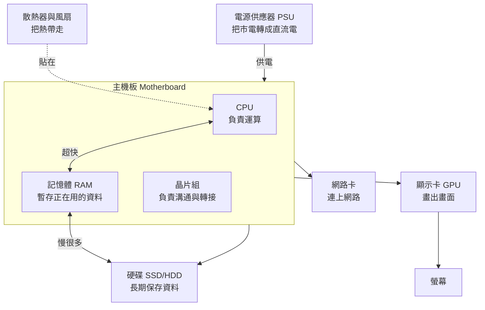

# 主機裡面有什麼

> [!abstract] 這篇你會學到
> - 打開機殼後，認得出裡面每一個零件 ★★
> - 說出每個零件負責什麼、**壞掉會有什麼症狀** ★★★
> - 理解零件之間怎麼合作，資料在它們之間怎麼流動 ★★
> - 看懂主機板上那些插槽與接頭的名稱 ★★
> - 知道哪些零件可以升級、哪些只能整台換 ★★
> - 記住**拆機前的斷電與防靜電程序**，以及為什麼電源供應器永遠不能自己拆開 ★★★★★

## 前置知識

- [[010-01-01-cmd-計概-電腦到底是什麼]] — 硬體／軟體的分別、五大單元的概念

---

## 觀念說明

### 一張圖看懂零件的關係



> [!note] ★★★ 一個關鍵直覺：越靠近 CPU 越快，也越貴、越小
> CPU ↔ 記憶體之間的傳輸速度，比記憶體 ↔ 硬碟快上**幾十到幾百倍**。
> 這個「速度階梯」是理解電腦效能的核心，[[010-01-06-guide-計概-記憶體與儲存階層]] 會完整說明。

### 用辦公室比喻整台電腦

這個比喻請記住，後面很多章節都會用到：

| 零件 | 辦公室裡的角色 | 重要度 |
| --- | --- | --- |
| **CPU** | 你自己（那個真正在做事的人） | ★★ |
| **記憶體 RAM** | 你的**辦公桌桌面**。攤開來正在處理的文件都放這 | ★★★ |
| **硬碟 SSD/HDD** | 旁邊的**檔案櫃**。收起來的資料放這，要用得先拿到桌上 | ★★★ |
| **主機板** | 整間辦公室的**地板與走道**，讓大家能互相走動 | ★★ |
| **電源供應器** | **電力公司的變電箱**，把外面的電變成辦公室能用的 | ★★ |
| **顯示卡** | **美工人員**，專門負責畫圖 | ★★ |
| **散熱器** | **冷氣**，人做事會發熱，不散熱就會累倒 | ★★ |
| **網路卡** | **總機與郵差**，負責跟外界通訊 | ★★ |

> [!tip] ★★★ 這個比喻解釋了「記憶體不夠」為什麼會很慢
> 桌面（RAM）太小，你就得一直把文件收回檔案櫃、再拿出來。
> 每一次來回都很花時間。這在電腦上叫 **swap**（置換），是電腦變超慢的頭號原因。

---

## 逐一認識：七大零件

### 一、CPU（中央處理器）★★★

**它做什麼**：所有的運算與判斷。加減乘除、比大小、決定下一步做什麼。

**長什麼樣**：一片約 4×4 公分的方形晶片，貼在主機板正中間，上面壓著一大塊散熱器。

**規格怎麼看**：

```
Intel Core i5-13500    2.5 GHz    14 核心 (6P + 8E)    24 MB 快取
      └─ 等級  └─ 型號  └─ 時脈    └─ 核心數           └─ 快取
```

| 規格 | 意思 | 白話 | 重要度 |
| --- | --- | --- | --- |
| **時脈（GHz）** | 一秒能執行幾十億個週期 | 這個人做事的**速度** | ★★ |
| **核心數（Cores）** | 有幾個獨立的運算單元 | 有**幾個人**在做事 | ★★★ |
| **執行緒（Threads）** | 每個核心能同時處理幾條工作 | 每個人能不能**一心二用** | ★★ |
| **快取（Cache）** | CPU 內部的超小超快記憶體 | 手邊的**便條紙** | ★★ |
| **TDP（瓦數）** | 設計功耗，也代表發熱量 | 這個人有多會流汗 | ★★★ 算電源與散熱時要用 |

> [!warning] ★★★ 核心數不是越多越好
> 很多程式（尤其是老舊的公務系統、單機軟體）**只會用到一顆核心**。
> 這時候一顆 5.0 GHz 的 6 核心 CPU，會比一顆 2.5 GHz 的 32 核心 CPU 快得多。
>
> - **一般辦公、公務系統** → 看**單核時脈**
> - **虛擬化、資料庫、編譯、影片轉檔** → 看**核心數**
>
> 詳見 [[010-01-19-guide-計概-電腦規格與選購]]。

> [!note] ★★ P-core 與 E-core
> 現代 Intel CPU 把核心分成兩種：
> - **P-core**（Performance，效能核心）：快、耗電，跑重要工作
> - **E-core**（Efficient，效率核心）：慢、省電，跑背景工作
>
> 就像辦公室裡有資深員工和工讀生，重要的事交給資深的。
> 作業系統負責分配誰做什麼，這叫 **thread director**。

**壞掉的症狀** ★★：CPU 極少壞。若真的壞了，症狀是完全開不了機（連 POST 都過不了）。
比較常見的是**散熱不良導致降頻**——電腦不會壞，但會變慢、風扇狂轉。
★★★ 使用者說「電腦越用越慢、風扇很吵」時，先想到散熱，不要急著建議換電腦。

### 二、記憶體（RAM，隨機存取記憶體）★★★

**它做什麼**：暫存**正在使用**的資料與程式。

**長什麼樣**：長條形電路板，約 13 公分長，插在 CPU 旁邊的長插槽裡，通常有 2～4 條。

**★★★★ 最重要的特性：斷電就消失**

這叫 **揮發性（volatile）**。你打了一小時的文件沒存檔，跳電就全部不見 ——
因為它一直只存在記憶體裡。

> [!tip] ★★ 這解釋了「記得存檔」為什麼是老生常談
> 「存檔」這個動作的本質，就是把資料從**記憶體**寫進**硬碟**。
> 現代軟體的自動儲存功能，就是定時幫你做這件事。

**規格怎麼看**：

```
DDR5-5600    32GB (16GB × 2)    CL40
  └─ 世代與速度  └─ 容量與條數    └─ 延遲（越小越好）
```

| 規格 | 說明 | 重要度 |
| --- | --- | --- |
| **DDR4 / DDR5** | 世代。**互不相容**，插槽形狀就不同，買錯插不進去 | ★★★ 整批採購買錯就是整批退貨 |
| **速度（MHz/MT/s）** | 傳輸速率，如 3200、5600 | ★★ |
| **容量（GB）** | 桌面有多大 | ★★ |
| **CL（CAS Latency）** | 延遲，數字越小反應越快 | ★ |
| **ECC** | 錯誤更正功能，伺服器用，一般主機板不支援 | ★★★ 伺服器要挑，桌機插不上 |

> [!tip] ★★★ 雙通道：兩條 8GB 比一條 16GB 快
> 主機板通常支援**雙通道**（Dual Channel），
> 兩條記憶體可以同時讀寫，頻寬加倍。
>
> 所以買 16GB 時，買 **8GB × 2** 比買 **16GB × 1** 效能好，價格差不多。
> 插槽通常標示 A1／A2／B1／B2，兩條要插在**同色**或說明書指定的位置（通常是 A2 + B2）。

**壞掉的症狀**：
- ★★★ 開機時完全沒畫面、主機板連續嗶叫或 DRAM 燈亮著
- ★★★ 隨機藍屏／當機，錯誤訊息每次都不一樣
- ★★★★ 大檔案複製後內容損毀 —— 這一項最陰險：**系統照跑，但寫進硬碟的資料已經是錯的**，
  而且錯誤會跟著備份一起被保存下來

> [!example] ★★ 怎麼確認記憶體壞了
> - ★★ **Windows**：`Win`+`R` 輸入 `mdsched.exe` → Windows 記憶體診斷
> - ★★★ **通用**：用 **MemTest86** 做成開機隨身碟，跑至少完整一輪（可能要數小時）。
>   跑不滿一輪就說「記憶體沒問題」是最常見的誤判 —— 很多壞區要幾輪才會被掃到
> - ★★ **土法煉鋼**：如果有兩條，一次只插一條開機，看哪一條會出問題

### 三、儲存裝置（SSD 與 HDD）★★★★

**它做什麼**：**長期**保存資料。斷電後資料還在，這叫 **非揮發性（non-volatile）**。

★★★★ 全機唯一「壞掉會直接失去資料」的零件就是它。其他零件壞了都只是停機，換掉就好；
硬碟壞了如果沒有備份，資料就是真的沒了。

| | HDD（傳統硬碟） | SSD（固態硬碟） | 重要度 |
| --- | --- | --- | --- |
| 原理 | 磁碟片高速旋轉，磁頭讀寫 | 快閃記憶體晶片，沒有機械結構 | ★★ |
| 速度 | 慢（約 100～200 MB/s） | 快（SATA 約 550 MB/s；NVMe 可達 7000 MB/s） | ★★ |
| 怕震動 | **非常怕**，運轉中碰撞會壞 | 不怕 | ★★★★ 運轉中搬動或碰撞，磁頭刮碟片＝資料當場報銷 |
| 有聲音 | 有（喀喀聲、嗡嗡聲） | 完全無聲 | ★★★ 異音是唯一的預警 |
| 壽命 | 機械磨損 | 寫入次數有上限，但一般使用可用十年以上 | ★★ |
| 每 GB 價格 | 便宜 | 較貴 | ★ |
| 適合 | 大容量備份、監視器錄影、冷資料 | 系統碟、資料庫、任何要快的地方 | ★★ |

**SSD 的三種介面**（速度差很多，別買錯）：

| 介面 | 外型 | 大約速度 | 重要度 |
| --- | --- | --- | --- |
| **SATA SSD** | 2.5 吋方塊，接排線 | ~550 MB/s | ★★ |
| **M.2 SATA** | 口香糖條狀，插在主機板上 | ~550 MB/s（**外型像 NVMe 但速度是 SATA**） | ★★★ 採購最常踩的坑 |
| **M.2 NVMe (PCIe)** | 口香糖條狀 | 2000～7000+ MB/s | ★★ |

> [!warning] ★★★ M.2 不等於 NVMe
> **M.2 只是「形狀」**，不代表速度。
> 有些便宜的 M.2 SSD 走的是 SATA 通道，速度只有 NVMe 的十分之一。
> 買之前看規格上寫的是 **NVMe / PCIe Gen3／Gen4／Gen5**，還是 **SATA**。

> [!tip] ★★★ 升級最有感的一件事
> 如果一台舊電腦還在用 HDD 當系統碟，**換成 SSD** 是所有升級中最有感的。
> 開機從 2 分鐘變 15 秒，開軟體從轉圈變瞬間。
> 效果遠大於加記憶體或換 CPU。

**壞掉的症狀**：
- ★★★★ **HDD**：規律的喀喀聲、嗡嗡聲異常、系統頻繁卡住、檔案讀取失敗
- ★★★★ **SSD**：突然變成唯讀、系統認不到、速度暴跌
  （SSD 壞得比 HDD **突然**得多，常常前一秒還正常，下一秒整顆消失，幾乎沒有預警期 ——
  所以 SSD 更不能只靠「聽聲音」，要靠 SMART 與備份）

> [!danger] ★★★★★ 硬碟發出異音時立刻備份
> 傳統硬碟的喀喀聲通常代表磁頭已經在刮碟片，
> **每多開機一次，救回資料的機會就少一分**。
> 立刻備份，不要「再試試看能不能修好」。
>
> 檢查健康度：Windows 用 CrystalDiskInfo，Linux 用 `smartctl -a /dev/sda`。
> 詳見 [[020-01-27-cmd-Linux-硬體資訊與裝置管理]]。

### 四、主機板（Motherboard）★★★

**它做什麼**：所有零件插在上面，負責讓它們互相溝通與供電。它是**平台**，不是運算單元。

**主機板上的重要部位**：

| 部位 | 用途 | 認法 | 重要度 |
| --- | --- | --- | --- |
| **CPU 插槽（Socket）** | 裝 CPU | 正中間偏上的方形座，有拉桿 | ★★★★ 針腳歪一根就整片主機板報廢 |
| **記憶體插槽（DIMM）** | 裝記憶體 | CPU 右邊 2～4 條長插槽，兩端有卡榫 | ★★ |
| **PCIe 插槽** | 裝顯示卡、擴充卡 | 下半部的長插槽，最長那條給顯示卡 | ★★ |
| **M.2 插槽** | 裝 M.2 SSD | 小小的橫向插槽，通常有散熱片蓋著 | ★★★ 部分槽位與 SATA 埠共用通道 |
| **SATA 埠** | 接 2.5/3.5 吋硬碟與光碟機 | 側邊一排小 L 形接頭 | ★★ |
| **24-pin 主電源** | 主機板供電 | 最大的那個接頭 | ★★ |
| **8-pin CPU 電源** | CPU 供電 | 靠近 CPU 上方 | ★★★ 忘了插＝風扇會轉但永遠不開機 |
| **前面板針腳（F_PANEL）** | 接機殼的電源鍵、重置鍵、硬碟燈 | 一堆細小針腳，最難插的地方 | ★★ |
| **CMOS 電池** | 保存 BIOS 設定與時間 | 一顆鈕扣電池（CR2032） | ★★ |

**規格怎麼看**：

```
ASUS PRIME B760M-A    Micro-ATX    LGA1700    DDR5
  └─ 品牌與型號        └─ 尺寸      └─ CPU 腳位  └─ 記憶體世代
```

| 尺寸 | 大小 | 特色 | 重要度 |
| --- | --- | --- | --- |
| **ATX** | 30.5 × 24.4 cm | 標準大板，插槽最多 | ★★ |
| **Micro-ATX** | 24.4 × 24.4 cm | 辦公電腦最常見 | ★★ 機關採購的主力尺寸 |
| **Mini-ITX** | 17 × 17 cm | 小型主機，通常只有一條 PCIe | ★★ |

> [!warning] ★★★ 買 CPU 前先確認腳位（Socket）與晶片組
> CPU 和主機板必須**腳位相符**才裝得上：
> - Intel 12/13/14 代 → **LGA1700**
> - AMD Ryzen 5000 → **AM4**；Ryzen 7000/9000 → **AM5**
>
> 即使腳位相符，還要主機板的 **BIOS 版本**支援那顆 CPU。
> 買新 CPU 配舊主機板時，常需要先更新 BIOS。

> [!tip] ★★ CMOS 電池沒電的典型症狀
> 每次開機時間都跑掉、BIOS 設定被重置、開機時出現
> "CMOS checksum error" 或要你按 F1 繼續。
> 換一顆 CR2032 電池（幾十塊錢）就好，不用換主機板。
> 這在老電腦上非常常見。

### 五、電源供應器（PSU）★★★★

**它做什麼**：把牆上的 110V 交流電（AC），轉成電腦零件要的 12V／5V／3.3V 直流電（DC）。

**規格怎麼看**：

```
650W    80 PLUS Gold    全模組化
 └─ 瓦數  └─ 轉換效率認證   └─ 線材可拆
```

| 規格 | 說明 | 重要度 |
| --- | --- | --- |
| **瓦數（W）** | 能提供的最大功率。辦公電腦 400～500W 綽綽有餘；有獨立顯卡要 650W 以上 | ★★★★ 算錯會在高負載時整台斷電，正在寫入的檔案跟著損毀 |
| **80 PLUS 認證** | 轉換效率。Bronze < Silver < Gold < Platinum < Titanium | ★★ |
| **模組化** | 線材可不可以拆下來。全模組化整線比較好看，但價格較高 | ★ |

> [!warning] ★★★★ 電源是最不該省的零件
> 劣質電源在輸出不穩時，可能**連帶燒掉主機板、硬碟、顯示卡**。
> 一顆 500 元的雜牌電源，可能讓你賠掉整台電腦。
>
> 選購原則：
> - ★★ 選有 **80 PLUS 認證**的知名品牌
> - ★★★★ 瓦數抓「所有零件功耗總和 × 1.3」左右
> - ★★ 注意**保固年限**，好電源通常有 5～10 年保固
> - ★★★ 電解電容會老化，用了 8～10 年的電源建議主動更換

**壞掉的症狀** ★★★：完全開不了機、隨機重開、高負載時當機、聞到燒焦味。

> [!danger] ★★★★★ 聞到燒焦味或看到冒煙，先切電源再說
> 順序是：**牆上插座斷電 → 拔電源線 → 才開始檢查**。
> 不要「再開一次看看是不是真的」—— 已經在燒的電源再通一次電，
> 可能把 12V 灌進主機板與硬碟，把原本只壞一顆的狀況變成整台連硬碟一起死。

> [!tip] ★★ 判斷是不是電源壞了
> 最快的方法是**換一顆確定好的電源試試**。
> 也可以用「回紋針測試」：拔掉所有接線，用迴紋針短接 24-pin 上的
> 綠線（PS_ON）與任一黑線（GND），看風扇會不會轉 ——
> 但這只能證明它會開機，不能證明它輸出穩定。

### 六、顯示卡（GPU）★★

**它做什麼**：處理畫面。從畫出視窗、播放影片，到 3D 遊戲與 AI 運算。

**兩種形式**：

| | 內顯（整合式顯示） | 獨顯（獨立顯示卡） | 重要度 |
| --- | --- | --- | --- |
| 在哪 | 內建在 CPU 裡 | 一張獨立的卡，插在 PCIe 插槽 | ★★ |
| 效能 | 夠用於文書、上網、影片 | 高很多 | ★★ |
| 記憶體 | 跟系統記憶體共用 | 自己有專屬的 VRAM | ★★ 內顯會吃掉一部分系統 RAM |
| 耗電發熱 | 低 | 高，需要額外供電 | ★★★★ 加獨顯必須重新算電源瓦數 |
| 適合 | **辦公電腦、伺服器** | 遊戲、繪圖、影片剪輯、**AI 運算** | ★★ |

> [!note] ★★★ 為什麼 AI 要用 GPU
> CPU 像少數幾個博士（每個都很聰明，能處理複雜工作）；
> GPU 像幾千個小學生（每個只會簡單算術，但可以同時算）。
>
> AI 的運算大量是**重複的簡單矩陣乘法**，正好適合幾千個小學生一起算。
> 這就是為什麼跑 Ollama 這類本地 LLM 時，有沒有 GPU 差別是天與地 ——
> 詳見 `80-AI服務` 章節。

> [!tip] ★★★ 伺服器通常不需要顯示卡
> 伺服器沒有人坐在前面看螢幕，管理都靠網路遠端。
> 主機板內建一顆很陽春的顯示晶片（通常是 ASPEED）能顯示文字介面就夠了。
> 例外是**跑 AI 或虛擬桌面（VDI）**的伺服器，那才需要專業運算卡。

### 七、散熱系統 ★★★

**它做什麼**：把 CPU、顯示卡產生的熱帶走。

| 類型 | 說明 | 重要度 |
| --- | --- | --- |
| **風冷** | 金屬鰭片 + 熱導管 + 風扇。可靠、便宜、好維護 | ★★ 機關環境的首選 |
| **水冷（AIO 一體式）** | 冷排 + 水泵 + 水管。散熱效率高，但水泵是消耗品，**有漏液風險** | ★★★★ 漏液會連主機板與顯示卡一起毀掉，無人值守的機器不建議 |
| **散熱膏** | CPU 與散熱器之間的介面材料，會乾掉，約 3～5 年應更換 | ★★★ |

> [!warning] ★★★ 灰塵是機關電腦的頭號殺手
> 辦公室電腦用個兩三年，散熱鰭片會被灰塵塞成一片毛毯，
> 熱帶不走 → CPU 降頻 → 使用者抱怨「電腦好慢」。
>
> ★★★ **定期清灰塵應該納入年度維護項目**。
> ★★★★ 用壓縮空氣罐或吹球，**不要用吸塵器** —— 吸塵器吸嘴摩擦會累積靜電，
> 一次放電就可能打穿主機板上的晶片，而且當下不一定看得出來。
> 詳見 `71-維運實務` 的定期維護章節。

> [!danger] ★★★★ 伺服器機房尤其要注意
> 機房的散熱是系統性問題，不只是單機的風扇。
> 冷熱通道規劃、機櫃盲板、溫溼度監控都會影響。
> 詳見 [[040-02-02-guide-機房-空調系統與溫溼度監控]]。

---

## 完整實戰範例：盤點一台電腦的所有零件

不用拆機，用軟體就能查出九成的資訊。

### ★★★ Windows：一次列出所有硬體

開啟 PowerShell（`Win`+`X` → 終端機），依序執行：

```powershell
# CPU ★★ 看 NumberOfCores（實體核心）與 NumberOfLogicalProcessors（含超執行緒）
Get-CimInstance Win32_Processor |
    Select-Object Name, NumberOfCores, NumberOfLogicalProcessors, MaxClockSpeed

# 記憶體（每一條）★★★ BankLabel 才知道要升級時哪個插槽是空的，不用拆機看
Get-CimInstance Win32_PhysicalMemory |
    Select-Object BankLabel, Manufacturer,
                  @{n='容量GB';e={$_.Capacity/1GB}}, Speed

# 硬碟 ★★ InterfaceType 顯示 SCSI 不代表是 SCSI，NVMe 常常被歸在這一類
Get-CimInstance Win32_DiskDrive |
    Select-Object Model, InterfaceType, @{n='容量GB';e={[math]::Round($_.Size/1GB)}}

# 主機板 ★★★ SerialNumber 就是財產盤點要填的序號，別再翻機殼貼紙
Get-CimInstance Win32_BaseBoard | Select-Object Manufacturer, Product, SerialNumber

# 顯示卡 ★★ AdapterRAM 在大容量顯卡上會溢位顯示錯誤，僅供參考
Get-CimInstance Win32_VideoController | Select-Object Name, AdapterRAM, DriverVersion

# BIOS ★★★ ReleaseDate 決定這台能不能吃新 CPU、有沒有補到韌體漏洞
Get-CimInstance Win32_BIOS | Select-Object Manufacturer, SMBIOSBIOSVersion, ReleaseDate
```

預期輸出（範例）：

```
Name                                     NumberOfCores NumberOfLogicalProcessors MaxClockSpeed
----                                     ------------- ------------------------- -------------
13th Gen Intel(R) Core(TM) i5-13500                 14                        20          2500

BankLabel  Manufacturer 容量GB Speed
---------  ------------ ------ -----
BANK 0     Samsung          16  5600
BANK 1     Samsung          16  5600
```

> [!tip] ★★★ 為什麼要做這件事
> 這正是**資訊設備盤點**的基礎動作。
> 機關要盤點幾百台電腦時，就是把這段指令包成腳本、批次執行、彙整成表。
> 詳見 [[040-01-18-guide-網路設備-網路設備盤點與文件化]] 與 `71-維運實務` 的資產盤點章節。

### ★★★ Linux：對應的指令

```bash
# 一次看完整硬體摘要（需要 root）★★ 盤點就從這一行開始
$ sudo lshw -short
H/W path       Device     Class      Description
=================================================
                          system     OptiPlex 7010
/0                        bus        0MGK50
/0/0                      memory     64KiB BIOS
/0/38                     processor  13th Gen Intel(R) Core(TM) i5-13500
/0/3a                     memory     32GiB System Memory
/0/100/1c.4/0  nvme0n1    disk       512GB Samsung SSD 980

# CPU 詳細
$ lscpu
Architecture:            x86_64
CPU(s):                  20
Model name:              13th Gen Intel(R) Core(TM) i5-13500
CPU max MHz:             4800.0000
L3 cache:                24 MiB

# 記憶體每一條的資訊 ★★★ Locator 告訴你插在哪一槽，升級前不必拆機
$ sudo dmidecode -t memory | grep -E 'Size|Speed|Locator' | head -12
        Size: 16384 MB
        Locator: DIMM_A2
        Speed: 5600 MT/s
        Size: 16384 MB
        Locator: DIMM_B2
        Speed: 5600 MT/s

# 硬碟與分割
$ lsblk -o NAME,SIZE,TYPE,MODEL,MOUNTPOINTS
NAME        SIZE TYPE MODEL                MOUNTPOINTS
nvme0n1   476.9G disk Samsung SSD 980 500GB
├─nvme0n1p1   1G part                      /boot/efi
└─nvme0n1p2 475.9G part                    /

# 硬碟健康度（SMART）★★★★ 這一行是唯一能提前發現硬碟要壞的手段
$ sudo smartctl -H /dev/nvme0n1
SMART overall-health self-assessment test result: PASSED   # ★★★★ 出現 FAILED 就是立刻備份，不要排時間

# PCIe 裝置（顯示卡、網卡都在這）
$ lspci | grep -Ei 'vga|ethernet|network'
00:02.0 VGA compatible controller: Intel Corporation UHD Graphics 770
00:1f.6 Ethernet controller: Intel Corporation Ethernet Connection I219-LM
```

> [!info]- 這幾個指令的分工
> | 指令 | 回答什麼 | 需要 root | 重要度 |
> | --- | --- | --- | --- |
> | `lshw -short` | 全部硬體的一覽表 | 是 | ★★★ |
> | `lscpu` | CPU 的詳細規格 | 否 | ★★ |
> | `free -h` | 記憶體用了多少 | 否 | ★★★ |
> | `dmidecode -t memory` | 每一條記憶體的品牌、容量、速度、插在哪 | 是 | ★★★ |
> | `lsblk` | 儲存裝置與分割 | 否 | ★★★★ 拔磁碟前一定要先看它 |
> | `smartctl -a` | 硬碟健康度與壽命 | 是 | ★★★ |
> | `lspci` / `lsusb` | PCIe 與 USB 裝置清單 | 否 | ★★ |
>
> 完整說明見 [[020-01-27-cmd-Linux-硬體資訊與裝置管理]]。

---

## 常見錯誤與排錯

| 現象 | 原因 | 解法 |
| --- | --- | --- |
| ★★★ 買了 M.2 SSD 但速度只有 500MB/s | 買到 **M.2 SATA** 而非 M.2 NVMe | 買之前確認規格寫 NVMe/PCIe；M.2 只是形狀 |
| ★★ 加了記憶體但沒變快 | 兩條規格不同（不同速度／世代），被降到低的那條 | 加購時買**同品牌同型號**；或直接整組換掉 |
| ★★ 記憶體插了兩條卻沒有雙通道 | 插在錯誤的插槽 | 查主機板說明書，通常是 **A2 + B2**（第 2 與第 4 槽） |
| ★★★ 新 CPU 裝上去不開機 | 主機板 BIOS 版本太舊，不認得這顆 CPU | 先用舊 CPU 更新 BIOS；部分主機板支援 BIOS Flashback（不裝 CPU 也能更新） |
| ★★★ 電腦用一用就當機，尤其在跑重的東西時 | 散熱不良或電源瓦數不足 | 清灰塵、換散熱膏；檢查電源瓦數是否足夠 |
| ★★ 開機時間永遠不對、BIOS 設定跑掉 | **CMOS 電池沒電** | 換一顆 CR2032（幾十元） |
| ★★★★★ 硬碟發出喀喀聲 | HDD 磁頭故障 | **立刻備份**，不要繼續使用 |
| ★★ 螢幕沒訊號但主機有在跑 | 螢幕線接到主機板而不是顯示卡（或反之） | 有獨立顯卡時，線要接**顯示卡**上的接頭 |
| ★★★ 主機完全沒反應 | 前面板電源線沒插好／電源開關沒開 | 檢查 PSU 背後的 O/I 開關、F_PANEL 針腳 |
| ★★★ 系統只認到一半的記憶體 | 某條記憶體沒插緊或已損壞 | 逐條測試；跑 MemTest86 |
| ★★★ 風扇會轉、燈會亮，但螢幕永遠沒訊號、也沒有嗶聲 | **8-pin CPU 輔助電源沒插**（只插了 24-pin） | 檢查 CPU 插槽上方那個 8-pin（或 4+4）接頭有沒有卡到底 |
| ★★★ 新裝的 M.2 SSD 在 BIOS 裡看不到 | 該 M.2 槽與某幾個 SATA 埠**共用通道**，插了 M.2 就會關掉 SATA（或反過來） | 查主機板手冊的通道共用表，換一個 M.2 槽，或改接原本閒置的 SATA 埠 |
| ★★★★ 加裝獨立顯示卡後，一跑重工作就整台斷電重開 | **電源瓦數不足**，瞬間功耗超過 PSU 上限而觸發保護 | 重算「所有零件功耗總和 × 1.3」再換電源；斷電當下正在寫入的檔案可能已損毀，要一併檢查 |
| ★★★★★ 換硬碟時**拔錯那一顆**，把還在服役的磁碟拔掉 | 只憑「插在第幾個位置」認磁碟，沒有比對序號 | 拔之前用 `lsblk -o NAME,SIZE,SERIAL,MODEL` 抄下序號，跟磁碟標籤上的序號**逐字比對**再動手 |
| ★★★★★ RAID 壞了一顆沒換，重建期間第二顆也壞，整個陣列救不回來 | 沒有監控告警，降級（degraded）狀態放著跑了好幾個月 | 把陣列狀態納入監控；備援磁碟先備好；**RAID 不是備份**，另外要有離線備份 |
| ★★★ 開機嗶一長兩短／主機板 VGA 燈恆亮 | 顯示相關：顯卡沒插到底、沒接 PCIe 供電、或插槽有灰 | 重插顯示卡並確認 6/8-pin 供電已接；先改用內顯開機確認主機板還活著 |
| ★★★ 機器搬完位置後就開不了機 | 運送震動導致記憶體、顯卡或排線鬆脫（HDD 也可能已受損） | 開蓋把記憶體、顯卡、排線逐一重插；HDD 機種另外跑一次 SMART |

### ★★★ 排查流程一：按下電源鍵，完全沒反應

這是最常接到的報修。依序做，不要跳步 —— 八成的案例會停在【1】或【2】。

**【1】確認電真的有進來** ★★★

> 檢查點：牆上插座（換一個確定會通電的插座試）、延長線的開關與跳脫保護、
> PSU 背後的 **O/I 開關**是否在 `I`、電源線兩端是否都插到底。
>
> 判讀：主機板上通常有一顆**待機指示燈**（絲印多為 `SB_PWR` 或 `PWR_LED`）。
> 插上電源、按下 PSU 開關後那顆燈會亮 —— **燈不亮就代表電根本沒進主機板**，
> 問題在插座、電源線或 PSU，不必再拆別的東西。

**【2】排除機殼電源鍵與 F_PANEL 接線** ★★★

> 機殼電源鍵是最便宜也最常壞的零件，接線鬆脫更常見。
>
> 驗證方法：把 F_PANEL 上 `PWR_SW` 那兩根針腳，用螺絲起子**輕碰一下短接**。
> - 短接後會開機 → 機殼電源鍵或它的接線壞了，跟主機板無關
> - 短接後仍沒反應 → 問題在 PSU 或主機板，繼續【3】

**【3】確認兩組電源接頭都插到底** ★★★

> 24-pin 主電源與 **8-pin CPU 電源**都要卡榫「喀」一聲扣上。
> ★★★ **只插 24-pin 忘了插 8-pin** 是自行組裝最常見的失誤：
> 風扇會轉、燈會亮，看起來像有電，但永遠不會有畫面。

**【4】用回紋針測試 PSU 會不會啟動** ★★★

> 拔掉 PSU 到主機板的所有接線，用迴紋針短接 24-pin 上的**綠線（PS_ON）**與任一**黑線（GND）**。
> - PSU 風扇會轉 → PSU 至少會啟動，但**不代表輸出穩定**，仍不能排除它
> - 風扇完全不轉 → PSU 幾乎確定壞了，直接換一顆
>
> ★★★ 這個測試要在**完全脫離主機板**的狀態下做，不要一邊接著主機板一邊短接。

**【5】清 CMOS，回到出廠設定** ★★★

> 拔掉電源線 → 取下 CR2032 電池等 5 分鐘（或用主機板上的 `CLR_CMOS` 針腳短接）→ 裝回開機。
> 超頻設定錯誤、記憶體 XMP 設過頭、BIOS 設定損毀都會導致完全不開機，清 CMOS 就會恢復。

**【6】降到最小系統** ★★★

> 只留 **主機板 + CPU + 散熱器 + 一條記憶體 + 電源**，其餘全部拔掉，
> 顯示器接**內顯**輸出（CPU 有內顯的話）。
> - 有畫面 → 一次裝回一個零件，裝到哪個掛掉就是哪個有問題
> - 沒畫面 → 兇手就在這四樣裡面，用替換法逐一換掉測試

**【7】看主機板的診斷燈與嗶聲** ★★★

> 現代主機板多半有四顆 **Q-LED**（`CPU` / `DRAM` / `VGA` / `BOOT`），
> 開機自檢卡在哪一段，對應那顆燈就會恆亮，直接指出方向：
>
> | 恆亮的燈 | 代表 | 先做什麼 | 重要度 |
> | --- | --- | --- | --- |
> | `CPU` | CPU 或 CPU 供電有問題 | 檢查 8-pin 供電、散熱器有沒有壓歪、CPU 針腳 | ★★★ |
> | `DRAM` | 記憶體沒被認出來 | 重插、只留一條、換插槽測試 | ★★★ |
> | `VGA` | 顯示裝置有問題 | 重插顯卡與 PCIe 供電，或先拔顯卡用內顯 | ★★ |
> | `BOOT` | 找不到可開機的裝置 | 進 BIOS 看硬碟有沒有被認到、開機順序對不對 | ★★ |

### ★★★★ 排查流程二：懷疑硬碟快壞了

★★★★ 這個流程的第一步永遠是**備份**，不是診斷。診斷可以晚點做，資料沒了就沒了。

**【1】先確認裝置名稱與序號，避免對錯磁碟下手** ★★★

```bash
$ lsblk -o NAME,SIZE,TYPE,MODEL,SERIAL,MOUNTPOINTS
NAME        SIZE TYPE MODEL                SERIAL          MOUNTPOINTS
sda       931.5G disk WDC WD10EZEX-08WN4A0 WD-WCC6Y1ZK5V8P
└─sda1    931.5G part                                      /data
nvme0n1   476.9G disk Samsung SSD 980 500GB S64ANL0T512345
├─nvme0n1p1   1G part                                      /boot/efi
└─nvme0n1p2 475.9G part                                    /
```

★★★★ **`SERIAL` 這一欄要抄下來**。等一下真的要拔磁碟時，靠的是序號跟磁碟標籤逐字比對，
不是「它應該是左邊數來第二顆」。拔錯一顆還在服役的磁碟，等於自己製造一次資料事故。

**【2】看 SMART 總評** ★★★

```bash
$ sudo smartctl -H /dev/sda
SMART overall-health self-assessment test result: PASSED
```

★★★★ 注意：**PASSED 不等於健康**。SMART 的總評只有在廠商設定的門檻被跨過時才會轉成 FAILED，
很多已經在掉磁區的硬碟總評仍是 PASSED。所以一定要繼續看【3】的個別屬性。

**【3】看關鍵屬性的原始值（HDD）** ★★★

```bash
$ sudo smartctl -A /dev/sda | grep -E 'Reallocated|Pending|Uncorrect|Power_On_Hours'
  5 Reallocated_Sector_Ct   0x0033   100   100   010    Pre-fail  Always  -  0
  9 Power_On_Hours          0x0032   089   089   000    Old_age   Always  -  49312
197 Current_Pending_Sector  0x0032   100   100   000    Old_age   Always  -  8
198 Offline_Uncorrectable   0x0030   100   100   000    Old_age   Offline -  8
```

| 屬性 | 意義 | 判讀 | 重要度 |
| --- | --- | --- | --- |
| `Reallocated_Sector_Ct` | 已被搬走的壞磁區數 | 從 0 開始長就是警訊，持續增加＝換 | ★★★ |
| `Current_Pending_Sector` | 讀不出來、等著被搬走的磁區 | **非 0 就開始安排更換** | ★★★★ |
| `Offline_Uncorrectable` | 完全救不回來的磁區 | 非 0 代表已經有資料讀不出來了 | ★★★★★ |
| `Power_On_Hours` | 累計通電時數 | 上例 49312 小時 ≈ 5.6 年，已屆退役年限 | ★★ |

★★★ 上面這顆的 `Current_Pending_Sector = 8`，總評卻是 **PASSED** ——
這正是「只看 `-H` 會漏掉」的典型例子。

**【4】SSD 改看壽命百分比** ★★★

```bash
$ sudo smartctl -A /dev/nvme0n1 | grep -Ei 'Percentage Used|Available Spare|Media and Data'
Available Spare:                    100%
Percentage Used:                    7%
Media and Data Integrity Errors:    0
```

★★★ `Available Spare` 掉到廠商門檻（多為 10%）或 `Media and Data Integrity Errors` 非 0，
就要準備換。`Percentage Used` 超過 100% 不代表立刻壞，但保固通常已經結束。

**【5】檢查核心有沒有記到 I/O 錯誤** ★★★

```bash
$ sudo dmesg -T | grep -iE 'I/O error|ata[0-9]|nvme.*(reset|timeout)' | tail -5
[Fri Aug 29 09:14:22 2026] blk_update_request: I/O error, dev sda, sector 1953520 op 0x0:(READ)
[Fri Aug 29 09:14:22 2026] ata1.00: failed command: READ FPDMA QUEUED
```

★★★★ 出現 `I/O error` 就代表**應用程式已經讀不到資料了**，不是「未來可能會壞」。
到這一步請停止一切非必要寫入，先把資料抄出來。

**【6】排定更換，並在拔之前點亮定位燈** ★★★

```bash
# 讓要換的那顆持續讀取，靠硬碟燈閃爍確認實體位置（伺服器可用背板定位燈）
$ sudo dd if=/dev/sda of=/dev/null bs=1M count=20000 status=progress
```

★★★ 序號比對 +（可行的話）定位燈亮起，兩個條件都成立才動手拔。

### ★★★ 排查流程三：使用者說「電腦好慢」

「好慢」不是一種故障，是三種故障的共同症狀。用三個指令把它拆開：

**【1】先看記憶體有沒有在 swap** ★★★

```bash
$ free -h
               total        used        free      shared  buff/cache   available
Mem:            15Gi        14Gi       201Mi       412Mi       1.2Gi       389Mi
Swap:          2.0Gi       1.7Gi       0.3Gi
```

★★★ `available` 剩不到總量的 10%、`Swap` 的 `used` 一直在長 ——
就是**記憶體不夠**（辦公桌太小），加記憶體是唯一有效解，換 CPU 沒用。

**【2】再看是不是 CPU 過熱降頻** ★★★

```bash
$ sensors | grep -E 'Package|Core 0'
Package id 0:  +97.0°C  (high = +100.0°C, crit = +100.0°C)

$ grep MHz /proc/cpuinfo | head -2
cpu MHz : 798.024
cpu MHz : 799.531
```

★★★ 溫度貼著 `crit`、時脈卻掉到 800 MHz 左右（標稱值的零頭），
就是**熱保護降頻**。解法是清灰塵、換散熱膏，不是換電腦。

**【3】最後看硬碟是不是瓶頸** ★★★

```bash
$ iostat -x 1 3 | grep -E 'Device|sda'
Device  r/s   w/s   rkB/s   wkB/s  r_await  w_await  %util
sda    12.0   3.0   480.0   120.0   842.31   615.44   99.8
```

★★★ `%util` 貼近 100% 而 `r_await` 高達數百毫秒，代表**硬碟已經吃不消**：
可能是還在用 HDD 當系統碟（換 SSD 最有感），也可能是這顆硬碟正在壞（回到流程二）。

> [!tip] ★★★ 硬體排錯的通用流程：最小系統法
> 遇到開不了機，把所有非必要的東西拔掉，只留：
> **主機板 + CPU + 散熱器 + 一條記憶體 + 電源**
>
> 能開機（有 POST 反應）→ 再一個一個裝回去，裝到哪個出問題，就是哪個有問題。
> 不能開機 → 問題就在這四樣裡面，逐一替換測試。
>
> 這比亂猜快很多，也是維修人員的標準做法。

---

## 安全性注意事項

> [!danger] ★★★★★ 拆機前的必要步驟
> 1. ★★★★ 關機 → **拔掉電源線** → 按住電源鍵 5 秒放電
>    （現代主機板即使關機仍有 5V 待機電，帶電插拔記憶體或顯示卡會當場燒毀插槽與零件）
> 2. ★★★★ 摸一下沒上漆的金屬機殼消除靜電（或戴防靜電手環）
> 3. ★★ 不要在地毯上、不要穿毛衣
> 4. ★★★★★ **電源供應器永遠不要打開** —— 內部電容可能儲存數百伏特，有致命風險

> [!warning] ★★★★ 靜電的可怕之處：你根本感覺不到，零件也不會當場死
> 人體要到約 3000V 才會感覺到「啪」一下，但主機板與記憶體上的晶片，
> **不到 100V 就足以打穿閘極絕緣層**。
>
> 後果通常不是當場不開機，而是變成**半死不活**：偶爾藍屏、偶爾認不到裝置、
> 換了三個零件都查不出原因。這種故障比直接燒掉還難處理，
> 因為你會一直懷疑錯的地方。防靜電手環幾十塊錢，省下的是好幾個小時的排查。

> [!warning] ★★★ 零件拿取的方式
> - ★★★★ **CPU**：拿邊緣，**絕對不要碰到底部的針腳或觸點**
>   （Intel 的針腳在主機板上，歪一根就是整片主機板報廢；AMD AM4 的針腳在 CPU 上，歪了就是 CPU 報廢。
>   兩種都不在保固範圍內，這是自付的損失）
> - ★★★ **記憶體**：拿兩側，不要碰金手指（金色接點）
> - ★★ **顯示卡**：拿散熱器外殼，不要拿電路板
> - ★★ **主機板**：拿邊緣，不要按壓背面
>
> 皮膚上的油脂與汗水會造成接觸不良與腐蝕。

> [!warning] ★★★★★ 資料安全：報廢時硬碟要單獨處理
> 電腦報廢時，**硬碟不能跟著整台送修或報廢**。
> 機關的標準做法是：拆下硬碟 → 資料銷毀（Secure Erase 或實體銷毀）→
> 留存銷毀紀錄 → 主機才報廢。
>
> ★★★★★ 具體後果：一顆沒清乾淨就流出去的硬碟，等於一次個資外洩事件 ——
> 要通報、要調查、要對外說明，而且**格式化不算銷毀**，
> 一般格式化只是清掉檔案索引，資料本體還在，用免費的救援工具就撈得回來。
>
> ★★★★ 送修也一樣：整台送原廠維修前，硬碟要先拆下來留在機關內。
> 「廠商說會保密」不能當成控制措施，稽核只認你留下的紀錄。
>
> 這是資安稽核必查項目，詳見 [[090-05-08-guide-資安設備-資料防護DLP與加密]]。

> [!warning] ★★★★ 伺服器的管理埠（BMC／iDRAC／iLO）絕對不能直接連上網際網路
> 伺服器主機板上除了一般網路孔，還有一個獨立的**管理埠**。
> 它有自己的處理器與韌體，**就算主機關機也還活著**，可以遠端開關機、掛載光碟、進 BIOS。
>
> ★★★★★ 把它接到能被網際網路掃到的網段，等於把整台伺服器的實體控制權交出去 ——
> 對方不需要任何作業系統上的帳號，就能重開機、改 BIOS、掛自己的映像檔開機。
> 這類管理韌體的歷史漏洞很多，而且更新頻率遠低於作業系統。
>
> 正確做法：管理埠放在**獨立的管理網段**，只從跳板機存取，
> 並且**一定要改掉出廠預設帳密**（許多機種的預設帳密在網路上查得到）。

> [!tip] ★★★ 保固的注意事項
> - ★★ 撕開「Warranty Void」貼紙可能導致保固失效（各廠政策不同）
> - ★★★ 企業採購的設備通常有**現場維修（onsite）**服務，
>   自行拆機反而可能違反服務條款 —— 一台還在保內的機器，你動手拆開省下的半小時，
>   可能換來後續整台失去保固的損失
> - ★★ 拆之前先確認：這台還在保固內嗎？合約是怎麼寫的？

---

## 速查表

### 零件功能一覽

| 零件 | 一句話 | 斷電後資料 | 常見故障症狀 | 壞掉的嚴重度 |
| --- | --- | --- | --- | --- |
| CPU | 做運算 | — | 完全不開機（罕見）；散熱不良會降頻變慢 | ★★ 停機，資料還在 |
| 記憶體 RAM | 暫存正在用的資料 | **消失** | 開機無畫面、隨機藍屏、DRAM 燈亮 | ★★★★ 可能靜默寫壞資料 |
| SSD/HDD | 長期保存資料 | 保留 | 認不到、變唯讀、異音、讀取失敗 | ★★★★★ 沒備份就是資料全失 |
| 主機板 | 讓大家互通 | — | 不開機、某些埠失效、CMOS 電池沒電 | ★★ 停機，資料還在 |
| 電源 PSU | 供電 | — | 不開機、隨機重開、燒焦味 | ★★★★ 可能連帶燒掉其他零件 |
| 顯示卡 GPU | 畫出畫面 | — | 無訊號、花屏、驅動當機 | ★★ 伺服器多半不影響服務 |
| 散熱器 | 帶走熱 | — | 溫度高、風扇狂轉、降頻、當機 | ★★★ 先變慢，長期會縮短壽命 |

### 規格關鍵字對照

| 你看到 | 意思 | 重要度 |
| --- | --- | --- |
| LGA1700 / AM5 | CPU 腳位，決定能配哪些主機板 | ★★★ 買錯配不起來 |
| DDR4 / DDR5 | 記憶體世代，**不相容** | ★★★ 買錯插不進去 |
| M.2 NVMe | 高速 SSD（2000～7000 MB/s） | ★★ |
| M.2 SATA | 外型像 NVMe 但速度只有 SATA（~550 MB/s） | ★★★ 採購最常踩的坑 |
| PCIe Gen4 x16 | 擴充插槽的速度與寬度，顯示卡用 x16 | ★★ |
| 80 PLUS Gold | 電源效率認證 | ★★ |
| ECC | 記憶體錯誤更正，伺服器專用 | ★★ |
| TDP 65W | 設計功耗，也代表發熱量 | ★★★ 算電源與散熱要用 |
| ATX / mATX / ITX | 主機板尺寸（大到小） | ★★ |

### 硬體查詢指令

| 想查 | Windows | Linux | 重要度 |
| --- | --- | --- | --- |
| 全部硬體 | `msinfo32` | `sudo lshw -short` | ★★★ |
| CPU | `Get-CimInstance Win32_Processor` | `lscpu` | ★★ |
| 記憶體 | `Get-CimInstance Win32_PhysicalMemory` | `sudo dmidecode -t memory` | ★★★ |
| 硬碟 | `Get-CimInstance Win32_DiskDrive` | `lsblk`、`sudo smartctl -a /dev/sdX` | ★★★★ 拔磁碟前先看序號 |
| 主機板 | `Get-CimInstance Win32_BaseBoard` | `sudo dmidecode -t baseboard` | ★★ 盤點抄序號用 |
| 顯示卡 | `dxdiag` | `lspci \| grep VGA` | ★★ |
| 溫度 | 需第三方（HWiNFO） | `sensors`（需裝 `lm-sensors`） | ★★★ 「電腦好慢」的第一嫌疑犯 |

---

## 練習題

> [!question]- ★★★ 練習 1：盤點你的電腦
> 用本篇「完整實戰範例」的指令，填出這張表：
>
> | 項目 | 你的電腦 |
> | --- | --- |
> | CPU 型號與核心數 | |
> | 記憶體總量、幾條、什麼速度 | |
> | 系統碟是 HDD 還是 SSD？哪種介面？ | |
> | 主機板型號 | |
> | 有沒有獨立顯示卡？ | |
>
> 填完後回答：如果要讓這台變快，你會先升級哪個零件？為什麼？

> [!question]- ★★★ 練習 2：判斷零件故障
> 對照下列症狀，說出最可能的零件與下一步該做什麼：
> 1. 開機風扇轉、無畫面、主機板 DRAM 燈恆亮
> 2. 用了三年的電腦，最近打開多個程式就變超慢，工作管理員顯示記憶體 95%
> 3. 電腦時間每次開機都變成 2010 年
> 4. 硬碟複製大檔案時系統整個卡住，事件檢視器出現 disk 錯誤
> 5. 玩遊戲十分鐘後自動關機，關機前風扇聲音很大
>
> 參考答案：
> 1. ★★★ **記憶體**。拔起來重插、只插一條測試、跑 MemTest86
> 2. ★★ **記憶體不足**（不是壞掉）。加記憶體，或減少同時開啟的程式
> 3. ★★ **CMOS 電池沒電**。換 CR2032
> 4. ★★★★★ **硬碟**。跑 `smartctl -a` 或 CrystalDiskInfo 看健康度，**先備份**
> 5. ★★★ **散熱不良**。清灰塵、換散熱膏；也可能是電源瓦數不足

> [!question]- ★★★ 練習 3：配一台辦公電腦
> 預算兩萬元，要給一位公務同仁做文書、上網、跑機關的網頁系統。
> 列出你的配置，並說明為什麼**不需要**獨立顯示卡、為什麼記憶體要 16GB 而不是 8GB。
>
> 提示：想想現代瀏覽器每個分頁都要吃記憶體，
> 而文書與網頁系統的畫面 CPU 內顯就綽綽有餘。
> 詳細的選購邏輯見 [[010-01-19-guide-計概-電腦規格與選購]]。

---

## 小測驗

Q1. 用辦公室比喻，記憶體（RAM）和硬碟分別對應到什麼？這個比喻怎麼解釋「記憶體不夠會很慢」？

Q2. 「M.2」代表什麼？為什麼買 M.2 SSD 時要特別看清楚規格？

Q3. 買 16GB 記憶體時，為什麼建議買 8GB × 2 而不是 16GB × 1？插槽該怎麼插？

Q4. 一台電腦時間每次開機都跑掉、BIOS 設定被重置，最可能是什麼問題？要怎麼修？

Q5. P-core 和 E-core 的差別是什麼？誰負責決定哪個工作交給哪種核心？

Q6. 為什麼說「電源供應器是最不該省的零件」？

Q7. 為什麼 AI 運算要用 GPU 而不是 CPU？用本篇的比喻說明。

Q8. 「最小系統法」是什麼？用在什麼情況？最小系統包含哪幾樣零件？

Q9. 傳統硬碟發出規律的喀喀聲時，正確的處理方式是什麼？為什麼不該「再開機試試看」？

Q10. 為什麼絕對不能打開電源供應器？

> [!question]- 測驗答案
> **Q1.** ★★★ 記憶體 = **辦公桌桌面**（攤開來正在處理的東西）；
> 硬碟 = **檔案櫃**（收起來長期保存的東西）。
> 桌面太小時，你必須不斷把文件收回檔案櫃再拿出來，每次來回都很花時間 ——
> 電腦上這個動作叫 **swap（置換）**，是變超慢的頭號原因。
>
> **Q2.** ★★★ M.2 只是 **SSD 的形狀／介面外型**，不代表速度。
> 有些 M.2 SSD 走 SATA 通道（~550 MB/s），有些走 PCIe/NVMe（2000～7000 MB/s），
> 外觀幾乎一樣但速度差十倍以上，所以要看規格寫的是 **NVMe/PCIe** 還是 **SATA**。
>
> **Q3.** ★★ 因為主機板支援**雙通道（Dual Channel）**，兩條記憶體可同時讀寫、頻寬加倍。
> 插槽要插在主機板指定的雙通道位置，通常是 **A2 + B2**（第 2 與第 4 槽），
> 確切位置查主機板說明書。
>
> **Q4.** ★★ **CMOS 電池沒電**。主機板用這顆鈕扣電池保存 BIOS 設定與系統時間。
> 換一顆 **CR2032** 即可，成本幾十元，不需要換主機板。
>
> **Q5.** ★★ **P-core**（Performance）快但耗電，跑重要／前景工作；
> **E-core**（Efficient）慢但省電，跑背景工作。
> 由**作業系統**（搭配 CPU 內的 thread director）決定工作分配給哪種核心。
>
> **Q6.** ★★★★ 因為劣質電源輸出不穩時，可能**連帶燒毀主機板、硬碟、顯示卡**，
> 省下的幾百元可能賠掉整台電腦。應選有 80 PLUS 認證的知名品牌，
> 並注意電解電容會老化，用滿 8～10 年建議主動更換。
>
> **Q7.** ★★ CPU 像**少數幾個博士**（每個很聰明，能處理複雜工作）；
> GPU 像**幾千個小學生**（每個只會簡單算術，但能同時算）。
> AI 運算大量是重複的簡單矩陣乘法，正好適合「幾千個人一起算」，所以 GPU 快得多。
>
> **Q8.** ★★★ 把所有非必要零件拔掉，只留 **主機板 + CPU + 散熱器 + 一條記憶體 + 電源**，
> 用在**開不了機**的排錯。能開機就一個一個裝回去找出兇手；不能開機就在這四樣裡逐一替換。
>
> **Q9.** ★★★★★ **立刻備份資料**，不要繼續使用。
> 因為喀喀聲通常代表磁頭已經在刮碰碟片，**每多開機一次，救回資料的機會就少一分**，
> 「再試試看」只會讓損壞擴大。
>
> **Q10.** ★★★★★ 因為電源供應器內部的**大電容**在拔掉電源後，
> 仍可能儲存**數百伏特**的電荷且持續數分鐘以上，觸碰有**致命**風險。
> 電源壞了應整顆更換。

---

## 延伸閱讀

- ★★ [[010-01-03-cmd-計概-0與1和資料單位]] — 為什麼 1TB 硬碟只顯示 931GB
- ★★★ [[010-01-05-guide-計概-CPU如何工作]] — CPU 執行一道指令的完整過程
- ★★★ [[010-01-06-guide-計概-記憶體與儲存階層]] — 速度與容量的取捨金字塔
- ★★ [[010-01-12-guide-計概-輸入輸出與週邊設備]] — 各種接頭與介面
- ★★★ [[010-01-19-guide-計概-電腦規格與選購]] — 依用途挑出不浪費錢的配置
- ★★★ [[020-01-27-cmd-Linux-硬體資訊與裝置管理]] — Linux 上的硬體查詢與管理（進階）
- ★★ [[040-02-00-idx-機房與硬體]] — 伺服器與機房設備（進階）
