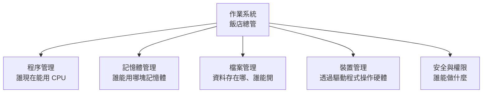
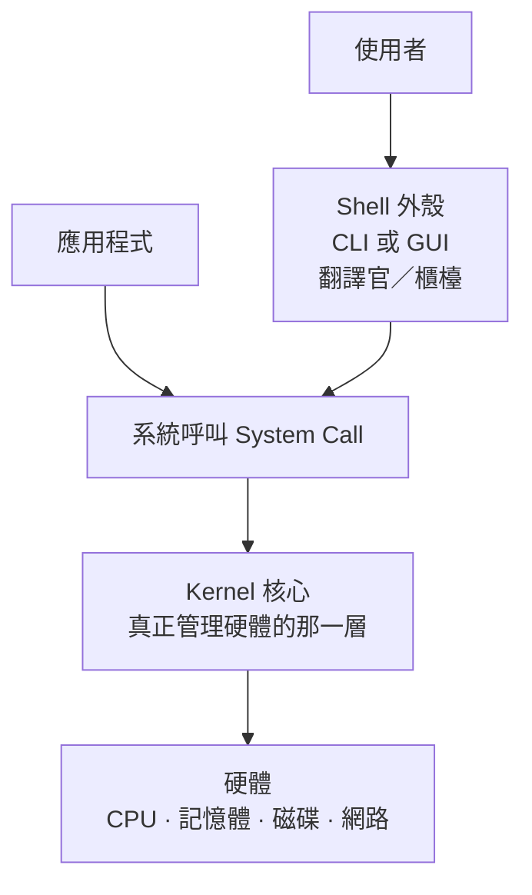

# 作業系統是什麼

> [!abstract] 這篇你會學到
> - 用**飯店總管**的比喻理解作業系統在做什麼 ★★
> - 說出作業系統的五大職責，以及沒有它會發生什麼事 ★★★
> - 分辨 **Kernel（核心）** 與 **Shell（外殼）**，知道你平常在跟誰講話 ★★★
> - 認識批次、交談、即時、分時多工、多處理器五種系統類型 ★★
> - 比較 Windows、macOS、Linux 三大陣營，理解**為什麼伺服器幾乎都用 Linux** ★★★
> - 知道 Linux「發行版」是什麼，以及該怎麼選（★★★★ 伺服器一律挑 LTS）

## 前置知識

- [[010-01-02-guide-計概-主機裡面有什麼]] — 有哪些硬體要被管理
- [[010-01-06-guide-計概-記憶體與儲存階層]] — 記憶體與儲存的差別

---

## 觀念說明

### ★★ 核心比喻：作業系統是飯店總管

想像一棟飯店：

| 飯店 | 電腦 |
| --- | --- |
| **建築、房間、電梯、廚房** | 硬體（CPU、記憶體、硬碟、螢幕） |
| **住客** | 應用程式（Word、Chrome、遊戲） |
| **總管** | **作業系統** |

住客想要什麼？「我要一間房」「我要用餐」「幫我叫車」。

住客**不需要**知道：房間怎麼分配、廚房怎麼排菜、電梯怎麼調度。
他只要跟總管說一聲，總管會處理。

> [!note] 沒有總管會怎樣？★★★
> 想像一棟沒有總管的飯店：
> - ★★★ 兩組客人同時搬進同一間房 → **程式互相覆蓋記憶體，當機**
> - ★★★ 有人霸佔電梯不放 → **一個程式獨佔 CPU，其他全部卡住**
> - ★★ 每個客人都要自己學怎麼開鍋爐 → **每個程式都要自己寫硬碟驅動程式**
> - ★★★★ 任何人都能進別人的房間 → **完全沒有安全性**
>
> 所以早期的電腦（沒有作業系統的年代）真的就是這樣 ——
> 一次只能跑一個程式，程式必須自己控制所有硬體。

### ★★★ 作業系統的五大職責



| 職責 | 做什麼 | 飯店比喻 |
| --- | --- | --- |
| ★★★ **程序管理** | 決定哪個程式現在能用 CPU、用多久 | 排電梯的順序 |
| ★★★ **記憶體管理** | 分配記憶體給程式，避免互相踩到 | 分配房間，不能兩組客人住同一間 |
| ★★★ **檔案管理** | 提供檔案與資料夾的抽象，管理讀寫 | 保管箱與行李寄存 |
| ★★ **裝置管理** | 用驅動程式操作各種硬體 | 跟廚房、洗衣房、車隊溝通 |
| ★★★★ **安全與權限** | 誰能存取什麼、隔離不同使用者 | 房卡只能開自己的房間 |

> [!tip] 為什麼「多工」很神奇 ★★
> 你的電腦只有 14 個核心，卻同時開了 300 個程序。怎麼辦到的？
>
> ★★★ **靠快速輪流。** 作業系統讓每個程式跑幾毫秒就切換到下一個，
> 一秒切換上千次。因為切換得夠快，你感覺它們是同時在跑的。
>
> 這就像一個服務生同時招呼十桌客人 —— 他其實一次只能服務一桌，
> 但因為在桌與桌之間跑得夠快，每桌客人都覺得「服務生一直在」。
>
> 詳見 [[010-01-11-guide-計概-程式程序與多工]]。

---

## Kernel 與 Shell：核心與外殼

這是理解作業系統架構最重要的一組概念。



### ★★★★ Kernel（核心）：真正做事的那一層

**Kernel** 是作業系統最核心的部分，負責：
- ★★★ 管理 CPU 排程
- ★★★ 管理記憶體與虛擬記憶體
- ★★★ 管理檔案系統
- ★★★★ 載入與呼叫驅動程式
- ★★★ 處理系統呼叫

★★★★ 它**直接跟硬體打交道**，執行在最高權限（**kernel mode**）。

> [!warning] ★★★★ 為什麼 kernel 出問題就是藍屏／kernel panic
> ★★ 一般程式跑在 **user mode**，出錯只會殺掉那一個程式。
> ★★★★ Kernel 跑在 **kernel mode**，有完整的硬體控制權 ——
> 它出錯就沒人能收拾，整個系統只能停下來。
>
> | 系統 | 崩潰時的畫面 |
> | --- | --- |
> | Windows | ★★★ 藍色畫面（BSOD, Blue Screen of Death） |
> | Linux | ★★★ **kernel panic** |
> | macOS | ★★ 「您的電腦因發生問題而重新啟動」 |
>
> ★★★★ **這也是為什麼驅動程式出問題最麻煩** ——
> 驅動程式跑在 kernel 裡，一個爛驅動就能拖垮整台機器。

### ★★★ Shell（外殼）：你跟系統講話的窗口

**Shell** 是包在 kernel 外面的一層，負責接收你的指令、翻譯給 kernel。

它有兩種形式：

| 形式 | 全名 | 長相 | 例子 |
| --- | --- | --- | --- |
| ★★★★ **CLI** | Command-Line Interface | 打字 | Bash、Zsh、PowerShell、CMD |
| ★★ **GUI** | Graphical User Interface | 點滑鼠 | Windows 桌面、GNOME、KDE、macOS Finder |

> [!note] GUI 也是一種 Shell ★★
> 這點常被忽略。Windows 檔案總管（`explorer.exe`）
> 在技術上就是 Windows 的 GUI shell —— 你可以把它關掉再換一個。
>
> 不管你是打 `del 檔案` 還是用滑鼠拖到資源回收筒，
> ★★★ **最後都是呼叫同一個 kernel 的同一個功能**。
> Shell 只是不同的入口。

> [!tip] ★★★ 為什麼伺服器管理員偏愛 CLI
> | 優點 | 說明 |
> | --- | --- |
> | ★★★★ **可自動化** | 打過的指令可以寫成腳本，重複執行一千次 |
> | ★★★★ **可記錄** | 完整記錄做了什麼，稽核與交接都方便 |
> | ★★★ **省資源** | 不用跑圖形介面，記憶體省下來給服務用 |
> | ★★★ **遠端友善** | SSH 走文字，網路再慢也能操作 |
> | ★★★ **精確** | 「點三下那個圖示」很難描述，`systemctl restart nginx` 不會誤解 |
>
> 本手冊 `10-Linux基礎` 從第 3 篇開始就在教 CLI，原因就在這裡。

### ★★ 常見的 Shell

| Shell | 平台 | 特色 |
| --- | --- | --- |
| ★★★★ **Bash** | Linux 預設 | 最通用，腳本相容性最好 |
| ★★ **Zsh** | macOS 預設 | 補全與提示強大，搭配 Oh My Zsh / Powerlevel10k 更好用 |
| **Fish** | 跨平台 | 開箱即用的友善體驗，但語法不相容 Bash |
| ★★★ **PowerShell** | Windows（跨平台） | 物件導向，處理的是**物件**而非純文字 |
| **CMD** | Windows | 舊的命令提示字元，功能有限 |

> [!note] PowerShell 跟 Bash 有一個根本差異 ★★★
> Bash 的管線傳的是**純文字**，你得用 `grep`、`awk` 去切字串。
> PowerShell 的管線傳的是**物件**，可以直接存取屬性。
>
> ```bash
> # ★★★ Bash：要用文字處理把欄位切出來
> ps aux | awk '{print $2, $11}' | head -5
> ```
> ```powershell
> # ★★★ PowerShell：直接取屬性
> Get-Process | Select-Object Id, Name -First 5
> ```
> 兩種哲學各有優劣，但都值得學。

### ★★★★ 系統呼叫（System Call）：程式跟 kernel 的唯一窗口

★★★★ 應用程式**不能直接碰硬體**。它想做任何事，都必須透過**系統呼叫**請求 kernel 代勞。

> [!example] 「儲存檔案」實際上發生什麼 ★★★
> 你在 Word 裡按下 Ctrl+S：
> 1. ★★ Word 呼叫 `open()` 系統呼叫 → kernel 打開檔案
> 2. ★★ Word 呼叫 `write()` → kernel 把資料寫入
> 3. ★★★ Word 呼叫 `close()` → kernel 關閉檔案，確保寫回磁碟
>
> ★★★ **Word 完全不知道你的硬碟是 NVMe SSD 還是網路磁碟機。**
> 它只知道要呼叫 `write()`，剩下的 kernel 處理。
>
> 這就是作業系統提供的**抽象（abstraction）**——
> 它把千奇百怪的硬體，包裝成統一的介面。

> [!tip] ★★★ 用 strace 親眼看系統呼叫
> ```bash
> $ strace -e trace=openat,write,close cat /etc/hostname
> openat(AT_FDCWD, "/etc/hostname", O_RDONLY) = 3   # ★★★ 回傳值 3 就是 fd
> write(1, "myserver\n", 9)                   = 9   # ★★ 寫到 fd 1（stdout）
> close(3)                                    = 0   # ★★ kernel 收回 fd
> ```
> 這就是 `cat` 這個簡單指令背後的真實動作。

---

## 作業系統的五種類型

這是計概課本的經典分類，理解它有助於選對工具。

### ★★ 一、批次系統（Batch System）

| 特性 | 說明 |
| --- | --- |
| 運作方式 | ★★ 一批工作排隊，依序執行，**中途不需要人操作** |
| 比喻 | 洗衣店：把衣服丟著，下班來拿 |
| 現代對應 | ★★★ 排程工作（cron）、大量資料處理、月結批次作業 |

> [!example] 你今天還會遇到批次 ★★
> 機關的「月底薪資結算」「每日對帳」「夜間備份」都是批次作業。
> Linux 上用 `cron` 或 `systemd timer` 實作 —— 見 [[020-01-18-guide-Linux-排程工作]]。

### ★★ 二、交談式系統（Interactive System）

| 特性 | 說明 |
| --- | --- |
| 運作方式 | ★★ 使用者下指令，系統**立刻回應** |
| 比喻 | 對話 |
| 現代對應 | ★★ 你現在用的電腦、SSH 連線 |

### ★★★ 三、即時系統（Real-Time System）

| 特性 | 說明 |
| --- | --- |
| 運作方式 | ★★★ 必須在**保證的時間內**回應 |
| 關鍵 | ★★★★ 重點不是「快」，是「**準時**」 |
| 用在哪 | ★★★★ 工業控制（PLC）、航空電子、醫療設備、汽車 ABS |

> [!warning] ★★★★ 「快」與「準時」不是同一件事
> 一般作業系統平均反應 1 毫秒，但偶爾會卡 200 毫秒 —— 這對桌機沒差。
> ★★★★★ 但汽車的煞車控制系統如果偶爾卡 200 毫秒，就會出人命。
>
> ★★★ 即時系統寧可**平均慢一點**，也要**保證最壞情況不超過某個上限**。
> 這叫 **deterministic（確定性）**。
>
> ★★★★ 這也是 OT（工控）環境不能隨便套用一般 IT 修補策略的原因之一 ——
> 見 [[090-05-15-guide-資安設備-實體與OT-IoT安全設備]]。

### ★★★ 四、分時與多工系統（Time-Sharing / Multitasking）

| 特性 | 說明 |
| --- | --- |
| 運作方式 | ★★★ 每個程式執行一小段時間（**時間片，time slice**）就換人 |
| 比喻 | 服務生輪流招呼十桌客人 |
| 現代對應 | ★★ **所有現代作業系統** |

兩種多工方式：

| | **合作式多工** | **搶佔式多工** |
| --- | --- | --- |
| ★★★ 誰決定何時換手 | **程式自己**主動讓出 CPU | **作業系統**強制收回 |
| ★★★★ 風險 | 一個程式當掉不放手 → **整台機器卡死** | 沒有這個問題 |
| ★★ 代表 | Windows 3.1、Mac OS 9（古早） | **所有現代系統** |

> [!note] 這解釋了為什麼舊系統那麼容易整台當掉 ★★
> Windows 95 之前是合作式多工。一個程式進入無窮迴圈不放開 CPU，
> 作業系統就拿它沒辦法，整台機器只能重開。
>
> ★★★ 現代系統是搶佔式：**時間到就強制收回**，
> 所以一個程式當掉，你還是能開工作管理員把它殺掉。

### ★★ 五、多處理器系統（Multiprocessor System）

| 特性 | 說明 |
| --- | --- |
| 運作方式 | ★★ 多個 CPU 核心**真正同時**執行不同工作 |
| 差別 | ★★★ 分時多工是「快速輪流」，多處理器是「**真的同時**」 |
| 現代對應 | 所有多核心電腦 |

> [!tip] 分時 vs 多處理器 ★★
> - **分時多工**：一個廚師快速輪流照顧四個鍋子 → **看起來**同時
> - **多處理器**：四個廚師各顧一個鍋 → **真的**同時
>
> 現代電腦兩者兼具：14 個核心真正同時跑 14 個工作，
> 而 300 個程序在這 14 個核心上快速輪流。

---

## 三大作業系統陣營

| | **Windows** | **macOS** | **Linux** |
| --- | --- | --- | --- |
| 開發者 | Microsoft | Apple | **開源社群** |
| 授權 | 商業，需購買 | 隨 Mac 硬體 | **免費，開放原始碼** |
| 核心 | Windows NT kernel | XNU（Unix 系） | **Linux kernel** |
| ★ 桌面市佔 | 最高 | 次之 | 少數 |
| ★★★★ **伺服器市佔** | 次之 | 幾乎沒有 | **壓倒性第一** |
| ★★★ 主要優勢 | 軟體相容性、AD 網域管理 | 設計與影音創作生態 | 穩定、免費、可客製、資源省 |
| ★★★ 主要限制 | 授權成本、資源需求高 | 只能跑在 Apple 硬體 | 桌面軟體生態較弱 |

### ★★★ 為什麼伺服器幾乎都用 Linux

| 原因 | 說明 |
| --- | --- |
| ★★★★ **免費** | 一百台伺服器就是省下一百套授權 |
| ★★★ **省資源** | 不跑圖形介面，一台 2 GB 記憶體的機器就能跑網站 |
| ★★★★ **穩定** | 連續運轉數年不重開是常態 |
| ★★★★ **可自動化** | 一切都是檔案與指令，天生適合腳本化 |
| ★★★ **透明** | 原始碼公開，出問題查得到根因，也能自己修 |
| ★★★ **社群與生態** | Nginx、MySQL、Docker、Kubernetes 都以 Linux 為首選平台 |
| ★★★★ **遠端管理** | SSH 走純文字，網路再差都能管 |

> [!note] Android 也是 Linux ★
> Android 用的就是 Linux kernel，只是上層換成 Google 自己的框架。
> 所以全世界跑最多的 Linux，其實在大家的口袋裡。

### ★★★ 什麼時候該用 Windows Server

不是所有情況都該用 Linux。以下情境 Windows Server 是正確選擇：

- ★★★★ 要建 **Active Directory 網域**（機關與企業的帳號集中管理標準）
- ★★★★ 要用**群組原則（GPO）**大量派送設定
- ★★★ 要跑只有 Windows 版本的商業軟體（很多公務系統是這種）
- ★★★ 要用 MS SQL Server、Exchange、SharePoint
- ★★ 要建 **WDS** 做網路大量部署

見 `20-Windows系統管理` 章節。

---

## Linux 發行版：同一個核心，很多種包裝

> [!note] ★★★ 「Linux」嚴格說只是核心
> Linux 本身只是 kernel。一個可以用的系統還需要：
> Shell、套件管理器、系統服務管理、桌面環境、預裝軟體……
>
> 把 kernel 加上這些東西打包好，就叫一個**發行版（distribution，distro）**。
>
> ★★★ **比喻**：Linux kernel 是引擎，發行版是整台車。
> Toyota 和 Lexus 可能用同一具引擎，但整車的定位、配備、售後服務完全不同。

### ★★★★ 兩大主要家族

| | **Debian 系** | **RHEL 系** |
| --- | --- | --- |
| ★★★ 代表 | **Debian、Ubuntu**、Linux Mint | **RHEL**、**Rocky Linux**、AlmaLinux、Fedora |
| ★★★ 套件格式 | `.deb` | `.rpm` |
| ★★★★ 套件管理 | `apt` | `dnf` / `yum` |
| ★★★★ 防火牆工具 | `ufw` / `nftables` | `firewalld` |
| ★★★★ 安全模組 | AppArmor | **SELinux** |
| ★★★ 網路設定 | netplan / NetworkManager | NetworkManager (`nmcli`) |
| ★★ 定位 | 社群導向、軟體新、桌面友善 | 企業導向、穩定、長期支援 |

> [!tip] 本手冊的做法 ★★
> 本手冊以 **Ubuntu / Debian 為主線**，
> 每篇附上摺疊的 `> [!info]- Rocky / AlmaLinux（RHEL 系）對照` 區塊。
>
> 這樣安排是因為：Ubuntu 資料多、新手容易上手；
> 但機關與企業的正式環境常用 RHEL 系，所以對照不能少。
> 完整差異見 [[980-01-ref-附錄-Ubuntu與RHEL差異總表]]。

### ★★★ 該選哪一個？

| 你的情況 | 建議 |
| --- | --- |
| ★★★ 剛開始學 Linux | **Ubuntu LTS**（資料最多、問題最好查） |
| ★★★★ 機關／企業正式伺服器，需要原廠支援 | **RHEL**（付費）或 **Rocky/AlmaLinux**（免費相容） |
| ★★★ 要跑 Docker、Kubernetes | Ubuntu LTS 或 Rocky Linux |
| ★★ 要做 NAS／儲存 | TrueNAS（FreeBSD 或 Linux 版）、Unraid |
| ★★★ 要做虛擬化 | **Proxmox VE**（Debian 基底） |
| ★★★ 要做防火牆／軟路由 | **OPNsense**、pfSense（FreeBSD 基底） |
| 樹莓派 | Raspberry Pi OS（Debian 基底） |

> [!warning] ★★★★ LTS 是什麼，為什麼重要
> **LTS**（Long-Term Support，長期支援版）承諾較長的安全更新期限。
>
> - ★★★ Ubuntu LTS：**5 年**標準支援（可延伸至 10 年）
> - ★★★ RHEL：**10 年**
> - ★★★★ Ubuntu 非 LTS 版本：只有 **9 個月**
>
> ★★★★ **伺服器一律用 LTS。** 用非 LTS 版本，代表你每 9 個月就要升級整個系統，
> 否則就會失去安全更新 —— 那是資安事故的溫床。
> 見 [[020-01-30-guide-Linux-原始碼安裝與系統升級]]。

---

## 完整實戰範例：認識你的作業系統

### ★★★ Linux

```bash
# ★★★ 發行版與版本：交機、盤點、報修單第一個要填的欄位
$ cat /etc/os-release
PRETTY_NAME="Ubuntu 24.04.1 LTS"          # ★★★★ 有沒有「LTS」決定它還有幾年安全更新
NAME="Ubuntu"
VERSION_ID="24.04"
VERSION_CODENAME=noble
ID=ubuntu
ID_LIKE=debian

# ★★★ 核心版本與架構
$ uname -a
Linux myserver 6.8.0-45-generic #45-Ubuntu SMP x86_64 GNU/Linux   # ★★★ 裝驅動、比對 CVE 都看這行
      ^^^^^^^^  ^^^^^^^^^^^^^^^                    ^^^^^^
      主機名      核心版本                          架構

# ★★ 系統整體資訊（一次看完主機名、OS、核心、架構）
$ hostnamectl
 Static hostname: myserver
       Icon name: computer-vm
         Chassis: vm                    # ★★ 實體機還是 VM，決定能不能熱插拔硬碟
Operating System: Ubuntu 24.04.1 LTS
          Kernel: Linux 6.8.0-45-generic
    Architecture: x86-64

# ★★★ 開機多久了
$ uptime
 10:23:45 up 47 days,  3:12,  2 users,  load average: 0.15, 0.22, 0.19
                      ^^^^^^^                          ^^^^^^^^^^^^^^^^
                    連續運轉 47 天                   1/5/15 分鐘的平均負載

# 目前用的 Shell
$ echo $SHELL
/bin/bash

# 系統上裝了哪些 shell
$ cat /etc/shells
/bin/sh
/bin/bash
/usr/bin/zsh
```

> [!tip] ★★★ `load average` 怎麼讀
> 三個數字分別是 **1 分鐘、5 分鐘、15 分鐘**的平均負載。
>
> 大致的判讀方式：**跟核心數比較**。
> - ★★★ 14 核心的機器，load 在 14 以下大致正常
> - ★★★ load 持續超過核心數 → 有工作在排隊等 CPU
> - ★★ 三個數字由左到右遞減 → 負載正在下降；遞增 → 正在上升
>
> ★★★★ 但要注意：Linux 的 load 也包含**等待 I/O 的程序**，
> 所以 load 高不一定是 CPU 忙，可能是磁碟慢。
> 要搭配 `top` 的 `wa`（I/O wait）一起看。

**看 kernel 與服務** ★★★：

```bash
# ★★★ 載入了哪些核心模組（驅動程式）—— 排查硬體怪毛病從這裡開始
$ lsmod | head -5
Module                  Size  Used by
nvme                   57344  3
e1000e                286720  0

# ★★★ 系統啟動了哪些服務（跑越多，攻擊面越大）
$ systemctl list-units --type=service --state=running | head -8

# ★★ 開機花了多久，誰最慢
$ systemd-analyze
Startup finished in 3.8s (kernel) + 12.4s (userspace) = 16.2s
$ systemd-analyze blame | head -5
   5.234s snapd.service
   2.891s NetworkManager-wait-online.service
```

### ★★ Windows

```powershell
# ★★★ 版本資訊
Get-ComputerInfo | Select-Object OsName, OsVersion, OsBuildNumber,
    WindowsProductName, CsSystemType

# ★★ 更簡短的方式
winver          # 圖形視窗
systeminfo      # 完整文字報告

# ★★ 開機多久
(Get-Date) - (Get-CimInstance Win32_OperatingSystem).LastBootUpTime

# ★★★ 執行中的服務
Get-Service | Where-Object Status -eq 'Running' | Select-Object -First 10

# ★★ 目前 PowerShell 版本（5.1 與 7.x 語法差很多）
$PSVersionTable.PSVersion
```

---

## 常見錯誤與排錯

| 現象 | 原因 | 解法 |
| --- | --- | --- |
| ★★★★ Windows 藍屏 / Linux kernel panic | Kernel 或驅動程式出錯、硬體故障 | 記下錯誤碼；回想最近裝了什麼驅動；跑記憶體測試 |
| ★★★ 系統開機後卡在某個服務 | 某服務啟動失敗或逾時 | Linux：`systemd-analyze blame`、`journalctl -b`；Windows：事件檢視器 |
| ★★★ 一個程式當掉導致整台卡死 | 通常不會（現代是搶佔式多工）；若真如此多半是 I/O 或記憶體問題 | 檢查 `iostat`、`free -h`；不是「多工壞掉」 |
| ★★ Linux 上找不到某個 Windows 軟體 | 生態不同 | 找對應的替代品；或用 Wine／虛擬機；或評估該不該用 Linux |
| ★★★★ 裝了非 LTS 版本，半年後沒有更新 | 非 LTS 只支援 9 個月 | **伺服器一律裝 LTS** |
| ★★ RHEL 系機器上 `apt` 指令找不到 | 發行版家族不同 | RHEL 系用 `dnf`；見 [[020-01-14-guide-Linux-套件管理]] |
| ★★★★ SELinux 擋住服務，日誌沒有明顯錯誤 | RHEL 系預設啟用 SELinux | `getenforce` 確認；看 `/var/log/audit/audit.log`；見 [[090-02-07-guide-防護-SELinux與AppArmor]] |
| ★★★ 改了設定但沒生效 | 沒有重新載入服務 | `systemctl reload/restart 服務名` |
| ★★★ 遠端伺服器裝了桌面環境，記憶體被吃光 | 伺服器不需要 GUI | 移除桌面套件，改用 SSH 管理 |
| ★★★ `uptime` 顯示 load 很高但 CPU 使用率不高 | load 包含等待 I/O 的程序 | 看 `top` 的 `wa` 欄位；問題可能在磁碟 |

---

## 安全性注意事項

> [!warning] ★★★★★ 作業系統是所有安全的地基
> 應用程式再安全，作業系統被攻破就全部失效。
> 攻擊者拿到 root / SYSTEM 權限後，可以：
> - ★★★★★ 讀取所有檔案（包含加密金鑰、資料庫密碼）
> - ★★★★★ 竄改或關閉日誌，湮滅痕跡
> - ★★★★★ 安裝 **rootkit**，讓自己在系統中隱形
> - ★★★★★ 把這台機器當跳板攻擊內網其他主機
>
> 所以本手冊的第一課永遠是 [[090-02-01-guide-防護-伺服器初始安全設定]]。

> [!tip] ★★★★ 作業系統層級的五個基本防護
> 1. ★★★★ **保持更新**：安全更新是免費的防護，卻最常被忽略。
>    Ubuntu 可用 `unattended-upgrades` 自動安裝安全更新。
> 2. ★★★ **最小安裝**：不需要的套件不要裝。裝越少，攻擊面越小。
>    伺服器不要裝桌面環境。
> 3. ★★★★ **最小權限**：不要用 root 日常操作，用一般帳號 + `sudo`。
>    見 [[020-01-09-cmd-Linux-使用者與群組管理]]。
> 4. ★★★★ **啟用強制存取控制**：SELinux（RHEL）或 AppArmor（Ubuntu）**不要關掉**。
>    很多教學叫你 `setenforce 0` 來「解決問題」，那是把門拆掉來解決鎖卡住。
>    正確做法是調整政策 —— 見 [[090-02-07-guide-防護-SELinux與AppArmor]]。
> 5. ★★★ **套用組態基準**：TWGCB（政府）或 CIS Benchmark（國際）。
>    見 `61-資訊安全/12-TWGCB政府組態基準`。

> [!danger] ★★★★★ 停止支援的作業系統絕對不能對外服務
> 系統一旦到達 **EOL**（End of Life），就**不再收到任何安全更新**。
> ★★★★★ 之後被發現的每一個漏洞，都會永遠留在那台機器上。
>
> 機關環境常見的困境：某個老舊公務系統只能跑在 Windows Server 2008 或 CentOS 7。
>
> **如果真的無法升級，必須做到**：
> 1. ★★★★★ **完全隔離**：獨立 VLAN，不能連網際網路，不能被隨意存取
> 2. ★★★★★ 只開放**必要**的連接埠給**必要**的來源
> 3. ★★★★ 前面加一層反向代理或 WAF
> 4. ★★★★ 加強監控與日誌，異常立刻告警
> 5. ★★★★ **在風險評估文件中明確記錄**，並排定汰換時程
>
> 見 [[090-07-03-guide-資安實踐-弱點與修補管理流程]] 與 [[010-02-16-guide-網概-VLAN與網路分段]]。

---

## 速查表

### ★★★ 核心名詞

| 名詞 | 意思 | 比喻 |
| --- | --- | --- |
| ★★★★ **Kernel** | 直接管理硬體的核心層 | 飯店的營運中樞 |
| ★★★★ **Shell** | 使用者與 kernel 之間的介面 | 櫃檯 |
| ★★★ **CLI** | 文字介面 | 打字點餐 |
| ★★ **GUI** | 圖形介面 | 看圖片菜單點餐 |
| ★★★★ **系統呼叫** | 程式請求 kernel 服務的唯一管道 | 按服務鈴 |
| ★★★★ **驅動程式** | 讓 kernel 認得特定硬體的模組 | 跟廚房溝通的翻譯 |
| ★★★ **User mode** | 一般程式執行的低權限模式 | 客人 |
| ★★★★ **Kernel mode** | kernel 執行的最高權限模式 | 總管 |
| ★★★★ **發行版** | kernel + 周邊軟體的完整打包 | 整台車（kernel 是引擎） |
| ★★★★ **LTS** | 長期支援版本 | 有長期保固的車款 |

### ★★ 系統類型

| 類型 | 一句話 | 現代例子 |
| --- | --- | --- |
| ★★ 批次 | 排隊執行，不需人操作 | cron 排程、月結作業 |
| ★★ 交談式 | 下指令立刻回應 | 你的電腦、SSH |
| ★★★★ 即時 | 保證在時限內回應 | PLC、汽車 ABS、醫療設備 |
| ★★★ 分時多工 | 快速輪流，看起來同時 | 所有現代系統 |
| ★★ 多處理器 | 多核心真正同時執行 | 所有多核電腦 |

### ★★★ 常用指令

| 目的 | Linux | Windows |
| --- | --- | --- |
| ★★★★ 發行版／版本 | `cat /etc/os-release` | `winver`、`systeminfo` |
| ★★★★ 核心版本 | `uname -r` | `[Environment]::OSVersion` |
| ★★★ 系統摘要 | `hostnamectl` | `Get-ComputerInfo` |
| ★★★ 開機多久 | `uptime` | `(Get-Date) - (Get-CimInstance Win32_OperatingSystem).LastBootUpTime` |
| ★★★ 執行中的服務 | `systemctl list-units --type=service --state=running` | `Get-Service` |
| ★★ 開機耗時分析 | `systemd-analyze blame` | 工作管理員 → 開機 |
| ★★ 目前 Shell | `echo $SHELL` | `$PSVersionTable` |
| ★★★ 核心模組 | `lsmod` | `Get-WindowsDriver -Online` |
| ★★★★ 系統日誌 | `journalctl -xe` | 事件檢視器 `eventvwr` |

---

## 練習題

> [!question]- 練習 1：認識你的系統 ★★★
> 執行對應指令，記下：
> 1. 作業系統名稱與版本（是不是 LTS？）
> 2. 核心版本
> 3. 連續運轉了多久
> 4. 目前跑了幾個服務
> 5. 開機花了多久，最慢的是哪個服務
>
> ★★★★ 追問：你的系統版本還在支援期限內嗎？到官網查一下 EOL 日期。

> [!question]- 練習 2：親眼看見系統呼叫 ★★
> ```bash
> # 安裝 strace
> sudo apt install strace
>
> # 看 ls 這個簡單指令背後做了什麼
> strace -c ls /tmp
> ```
> `-c` 會統計各種系統呼叫的次數。
> 你會發現一個「只是列出檔案」的動作，背後有數十次系統呼叫。
>
> 想想：如果沒有作業系統提供這些抽象，`ls` 這個程式要自己做多少事？

> [!question]- 練習 3：判斷該用哪個作業系統 ★★★
> 四個情境，各該選什麼？為什麼？
> 1. 機關要建帳號集中管理與群組原則派送
> 2. 要架一台網站伺服器跑 Nginx + PHP + MySQL
> 3. 要建虛擬化平台，一台實體機跑 10 台虛擬機
> 4. 要在工廠控制生產線機械手臂
>
> 參考答案：
> 1. ★★★★ **Windows Server + Active Directory**。這是 AD 的主場，Linux 做不到同等的整合
> 2. ★★★ **Ubuntu LTS 或 Rocky Linux**。省資源、免費、生態完整
> 3. ★★★ **Proxmox VE**（Debian 基底）或 VMware ESXi
> 4. ★★★★ **即時作業系統（RTOS）**或工業級 PLC。
>    一般 OS 無法保證最壞情況的反應時間

---

## 小測驗

Q1. 用飯店的比喻說明作業系統的角色。沒有作業系統會發生哪三種問題？

Q2. 作業系統的五大職責是什麼？

Q3. Kernel 與 Shell 的差別是什麼？GUI 算不算 Shell？

Q4. 為什麼 kernel 出錯會導致整台機器停止（藍屏／kernel panic），而一般程式出錯只會關掉那個程式？

Q5. 什麼是「系統呼叫」？為什麼應用程式不能直接操作硬體？

Q6. 合作式多工與搶佔式多工的差別是什麼？這解釋了什麼歷史現象？

Q7. 「即時系統」追求的是「快」還是「準時」？為什麼這個區別很重要？

Q8. 為什麼伺服器幾乎都用 Linux？請說出至少四個理由。什麼情況下反而該用 Windows Server？

Q9. 「Linux 發行版」是什麼？Ubuntu 和 Rocky Linux 分屬哪兩大家族？各用什麼套件管理工具與安全模組？

Q10. 為什麼伺服器一定要裝 LTS 版本？如果有個老舊系統無法升級、已經 EOL，必須做到哪五件事？

> [!question]- 測驗答案
> **Q1.** ★★★ 作業系統像**飯店總管**：住客（應用程式）只要提出需求，
> 不必知道房間怎麼分配、電梯怎麼調度。
> 沒有它會發生：①**兩個程式同時使用同一塊記憶體而互相覆蓋當機**；
> ②**一個程式獨佔 CPU，其他全部卡住**；
> ③**每個程式都要自己寫硬碟／顯示卡驅動**；
> ★★★★ ④完全沒有權限隔離，任何程式都能讀別人的資料。
> 參見〈觀念說明 → 核心比喻〉的「沒有總管會怎樣？」。
>
> **Q2.** ★★★ ①**程序管理**（誰能用 CPU、用多久）；②**記憶體管理**（分配並隔離記憶體）；
> ③**檔案管理**（檔案與資料夾的抽象、讀寫控制）；
> ④**裝置管理**（透過驅動程式操作硬體）；
> ★★★★ ⑤**安全與權限**（誰能存取什麼、隔離使用者）—— 五項裡唯一會直接變成資安事件的一項。
>
> **Q3.** ★★★ **Kernel** 是直接管理硬體的核心層，執行在最高權限（kernel mode）；
> **Shell** 是包在外面、接收使用者指令並翻譯給 kernel 的介面。
> ★★★ **GUI 算是 Shell** —— Windows 檔案總管（explorer.exe）技術上就是 Windows 的 GUI shell，
> 可以關掉再換一個。不管點滑鼠還是打指令，最後都呼叫同一個 kernel 功能。
>
> **Q4.** ★★★★ 因為一般程式跑在 **user mode**（低權限），
> 出錯時 kernel 可以把它殺掉、回收資源，其他程式不受影響；
> 而 **kernel 跑在 kernel mode**，擁有完整的硬體控制權，
> **它出錯時沒有更高層可以收拾**，只能整個系統停下來。
> ★★★★ 推論：**驅動程式也跑在 kernel 裡**，所以裝一個來路不明的驅動＝把整機穩定性交給它。
>
> **Q5.** ★★★★ **系統呼叫（system call）**是應用程式請求 kernel 代為執行操作的唯一管道
> （如 `open()`、`write()`、`close()`）。
> 應用程式不能直接操作硬體，是為了①★★★★ **安全**（否則任何程式都能讀寫任意磁碟區域）；
> ②**穩定**（避免程式互相干擾）；
> ③**抽象**（程式不必知道底層是 NVMe SSD 還是網路磁碟機）。
>
> **Q6.** ★★★ **合作式**由**程式自己**主動讓出 CPU；**搶佔式**由**作業系統**強制收回。
> 這解釋了為什麼 Windows 95 之前的系統**一個程式當掉就整台機器要重開** ——
> 程式進入無窮迴圈不放手，作業系統拿它沒辦法。
> 現代系統都是搶佔式，所以你還能開工作管理員把它殺掉。
>
> **Q7.** ★★★★ 追求的是「**準時**」而非「快」。
> 一般作業系統平均反應 1 毫秒但偶爾卡 200 毫秒，對桌機沒差；
> ★★★★★ 但汽車 ABS 或醫療設備偶爾延遲 200 毫秒會出人命。
> 即時系統寧可平均慢一點，也要**保證最壞情況不超過上限**（deterministic）。
> ★★★★ 這也是 OT／工控環境不能套用一般 IT 修補策略的原因之一（不能想 patch 就 patch）。
>
> **Q8.** ★★★ 任四個：①**免費**（大量部署省下龐大授權費）；②**省資源**（不跑 GUI）；
> ③**穩定**（連續運轉數年）；④**可自動化**（一切皆檔案與指令）；
> ⑤**透明**（原始碼公開，可查根因）；⑥**生態完整**（Nginx/Docker/K8s 首選平台）；
> ⑦**遠端友善**（SSH 純文字）。
> ★★★★ **該用 Windows Server 的情況**：要建 **Active Directory 網域**、
> 用**群組原則 GPO** 派送設定、跑只有 Windows 版的商業／公務軟體、
> 用 MS SQL Server／Exchange、建 WDS 網路部署。
>
> **Q9.** ★★★ **發行版**是 Linux kernel 加上 Shell、套件管理器、系統服務、
> 預裝軟體等打包成的完整可用系統（kernel 是引擎，發行版是整台車）。
> ★★★★ **Ubuntu 屬 Debian 系**：套件 `.deb`、管理工具 `apt`、安全模組 **AppArmor**；
> ★★★★ **Rocky Linux 屬 RHEL 系**：套件 `.rpm`、管理工具 `dnf`、安全模組 **SELinux**。
> 記混家族的代價：在 RHEL 上敲 `apt` 只是白工，但**沒意識到 SELinux 存在**會讓你花半天查一個「設定明明對卻不通」的服務。
>
> **Q10.** ★★★★ 因為非 LTS 版本通常只有 **9 個月**支援，過期後就沒有安全更新，
> 每 9 個月要升級整個系統，否則成為資安破口。
> ★★★★★ **無法升級的 EOL 系統必須做到**：
> ①**完全網路隔離**（獨立 VLAN、不連網際網路）；
> ②只開放必要連接埠給必要來源；
> ③前面加反向代理或 WAF；
> ④加強監控與日誌、異常立刻告警；
> ⑤**在風險評估文件中明確記錄，並排定汰換時程**。
> ★★★★★ 少做第①項的後果最直接：一台 EOL 主機掛在網際網路上，等同於把已公開的漏洞清單附上自家 IP。

---

## 延伸閱讀

- ★★★ [[010-01-09-guide-計概-檔案與檔案系統]] — 作業系統怎麼組織資料
- ★★ [[010-01-10-guide-計概-軟體授權與程式怎麼跑起來]] — 開源、自由軟體與授權
- ★★★ [[010-01-11-guide-計概-程式程序與多工]] — 程序排程的細節
- ★★★ [[010-01-17-guide-計概-雲端虛擬化與容器]] — 一台機器跑多個作業系統
- ★★★★ [[020-01-03-cmd-Linux-終端機與Shell入門]] — 開始實際使用 CLI（進階）
- ★★★★ [[020-01-17-cmd-Linux-systemd服務管理]] — Linux 的服務管理（進階）
- ★★★ [[980-01-ref-附錄-Ubuntu與RHEL差異總表]] — 兩大家族的完整對照（進階）
