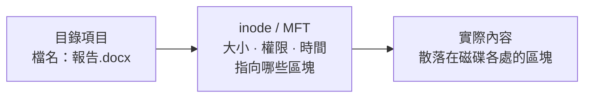

# 檔案與檔案系統

> [!abstract] 這篇你會學到
> - 用**圖書館**的比喻理解檔案、資料夾與目錄結構 ★
> - 看懂路徑寫法：絕對路徑 vs 相對路徑，Windows 與 Linux 的差別 ★★★
> - 知道**副檔名只是提示**，改副檔名不會改變檔案內容 ★★★
> - 理解權限的基本概念，以及「唯讀」到底唯什麼讀 ★★★
> - 明白**刪除檔案為什麼可以救回來**，以及該怎麼真正刪掉 ★★★★
> - 認識隱藏檔、捷徑／連結、檔案總管看不到的那些東西 ★★★

## 前置知識

- [[010-01-07-guide-計概-磁碟格式化與RAID入門]] — 檔案系統是什麼
- [[010-01-08-guide-計概-作業系統是什麼]] — 誰在管理檔案

---

## 觀念說明

### 核心比喻：一座圖書館

| 圖書館 | 電腦 |
| --- | --- |
| 一本書 | **檔案（file）** |
| 書架、樓層、分區 | **資料夾／目錄（folder / directory）** |
| 「三樓 → 文學區 → B 排 → 第 5 格」 | **路徑（path）** |
| 館藏目錄卡 | **檔案系統的中繼資料** |
| 書背上的標籤（小說／參考書） | **副檔名** |
| 借閱限制（僅館內閱覽） | **權限** |

### 檔案是什麼

**檔案 = 一串位元組 + 一個名字 + 一些描述資料。**

就這樣。不管是照片、影片、Word 文件、程式，
在磁碟上都只是**一串 0 和 1**。

| 檔案的組成 | 說明 |
| --- | --- |
| **內容（data）** | ★ 真正的那串位元組 |
| **檔名** | ★ 人類用來稱呼它的名字 |
| **中繼資料（metadata）** | ★★★ 大小、建立時間、修改時間、擁有者、權限 |
| **位置資訊** | ★★★ 內容存在磁碟的哪些區塊 |

★★★ 在 Linux 中，中繼資料存在一個叫 **inode** 的結構裡；
Windows 的 NTFS 則存在 **MFT**（Master File Table）中。



> [!note] ★★★ 「檔名」與「檔案內容」是分開存的
> 這是很重要的一點。目錄裡存的只是「檔名 → inode 編號」的對應，
> 真正的內容在別的地方。
>
> 這解釋了幾件事：
> - **改檔名很快**（不管檔案多大），因為只改了目錄裡的一行字 ★★
> - **同一份內容可以有多個名字**（硬連結，見後文） ★★
> - **刪除檔案很快**，因為只是把目錄項目拿掉，內容還躺在磁碟上 ★★★★

---

## 路徑：東西放在哪裡

### 絕對路徑 vs 相對路徑

| | **絕對路徑** | **相對路徑** |
| --- | --- | --- |
| 從哪開始算 | 從**根目錄**開始 | 從**目前所在位置**開始 |
| 比喻 | 完整地址：台北市信義區信義路五段 7 號 | 「隔壁那棟」「往前走兩個路口」 |
| 特點 ★★★ | 在任何地方用都指向同一個檔案 | 換個位置意思就變了 |

```
絕對路徑（Linux）：  /home/user/documents/報告.docx
絕對路徑（Windows）：C:\Users\user\Documents\報告.docx

相對路徑：           documents/報告.docx     （從 /home/user 出發）
                    ../photos/照片.jpg      （上一層，再進 photos）
                    ./script.sh            （目前這個資料夾）
```

| 符號 | 意思 |
| --- | --- |
| `.` | ★ **目前**這個資料夾 |
| `..` | ★★ **上一層**資料夾 |
| `~` | ★★ 使用者的**家目錄**（Linux/macOS） |
| `/` | ★★ 根目錄（Linux）／路徑分隔符 |
| `\` | ★★ 路徑分隔符（Windows） |

> [!warning] ★★★ Windows 與 Linux 的三個關鍵差異
> | | Windows | Linux |
> | --- | --- | --- |
> | 分隔符 ★★ | **反斜線 `\`** | **斜線 `/`** |
> | 起點 ★★★ | 每個磁碟一個根：`C:\`、`D:\` | **只有一個根 `/`**，其他磁碟「掛」在某個資料夾下 |
> | 大小寫 ★★★★ | **不分**（`Report.txt` = `report.txt`） | **區分**（是兩個不同的檔案） |
>
> 最後一點是跨平台開發的經典地雷：
> 在 Windows 上寫的程式引用 `Config.json`，
> 搬到 Linux 伺服器上檔案叫 `config.json` → **找不到檔案**。

> [!tip] ★★★ Linux 沒有 C 槽 D 槽，而是「掛載」
> Linux 的所有東西都在同一棵樹底下：
> ```
> /                    ← 根目錄，一切的起點
> ├── home/            ← 使用者的家目錄
> ├── etc/             ← 設定檔
> ├── var/log/         ← 日誌
> ├── mnt/backup/      ← 這裡「掛」了一顆備份硬碟
> └── media/usb/       ← 這裡「掛」了隨身碟
> ```
> 插入一顆新硬碟，你不會得到「E 槽」，
> 而是要決定**把它掛在哪個資料夾底下**（`mount`）。
>
> ★★★ 這個設計的好處：程式不必知道資料在哪顆實體硬碟上，
> 路徑永遠是 `/var/lib/mysql`，底層換硬碟不影響任何設定。
> 完整說明見 [[020-01-04-cmd-Linux-檔案系統與目錄結構]] 與 [[020-01-15-cmd-Linux-磁碟分割與掛載]]。

---

## 副檔名：只是一個提示

**副檔名（file extension）** 是檔名最後一個點之後的字元，
例如 `報告.docx` 的 `docx`。

> [!warning] ★★★ 副檔名不決定檔案的內容
> 這是新手最大的誤解。
>
> 副檔名只是**給作業系統的提示**，讓它知道「該用哪個程式開這個檔」。
> 你把 `照片.jpg` 改名成 `照片.txt`，**檔案內容一個位元組都沒變**，
> 只是 Windows 會改用記事本去開它（然後顯示一堆亂碼）。
>
> ★★★★ 反過來，把 `病毒.exe` 改名成 `發票.pdf`，它**仍然是一個執行檔**。

### ★★★ 真正決定檔案格式的是「魔術數字」

檔案的開頭幾個位元組通常有固定的特徵，叫做 **magic number（魔術數字）**
或 **file signature**。

| 檔案類型 | 開頭位元組 | 對應的 ASCII |
| --- | --- | --- |
| PNG ★ | `89 50 4E 47` | `.PNG` |
| JPEG ★ | `FF D8 FF` | — |
| PDF ★★ | `25 50 44 46` | `%PDF` |
| ZIP / docx / xlsx ★★★ | `50 4B 03 04` | `PK..` |
| GIF ★ | `47 49 46 38` | `GIF8` |
| Windows 執行檔 ★★★ | `4D 5A` | `MZ` |
| Linux 執行檔 (ELF) ★★★ | `7F 45 4C 46` | `.ELF` |

```bash
# ★★★ Linux 用 file 指令看真實格式（它讀魔術數字，不看副檔名）
$ file 可疑檔案.pdf
可疑檔案.pdf: PE32+ executable (GUI) x86-64, for MS Windows
                ^^^^^^^^^^^^^^^^^^ 這根本是 Windows 執行檔！ ★★★

$ hexdump -C -n 8 可疑檔案.pdf
00000000  4d 5a 90 00 03 00 00 00      |MZ......|
          ^^^^^ MZ = Windows 執行檔 ★★★
```

> [!danger] ★★★★ 這是釣魚郵件最常用的手法
> 攻擊者寄一個叫 `薪資明細.pdf.exe` 的檔案。
> Windows 預設**隱藏已知副檔名**，所以使用者只看到 `薪資明細.pdf`，
> 圖示又被改成 PDF 的樣子 —— 於是他點了下去。
>
> **防護做法**：
> 1. **關閉「隱藏已知檔案類型的副檔名」**（檔案總管 → 檢視 → 選項 → 取消勾選） ★★★★
> 2. 郵件閘道要用**魔術數字**檢查真實類型，不能只看副檔名 ★★★
> 3. 教育使用者：ZIP 裡的檔案、副檔名有兩層的檔案要特別警覺 ★★★
>
> 見 [[090-05-06-guide-資安設備-郵件與網頁閘道防護]] 與 [[090-07-12-guide-資安實踐-資安意識與社交工程防範]]。

> [!note] ★★★ 更狡猾的：RLO 攻擊
> Unicode 有一個「從右到左覆寫」控制字元（U+202E）。
> 把它插進檔名，`薪資exe.pdf` 可以顯示成 `薪資fdp.exe` 的反轉效果，
> 讓 `.exe` 看起來像 `.pdf`。
> 這也是為什麼郵件閘道要對檔名做正規化檢查。

---

## 權限：誰可以做什麼

### 三種基本權限

| 權限 | 對**檔案** | 對**資料夾** |
| --- | --- | --- |
| **讀（read, r）** ★★ | 可以看內容 | 可以列出裡面有什麼 |
| **寫（write, w）** ★★★ | 可以修改內容 | 可以在裡面新增／刪除檔案 |
| **執行（execute, x）** ★★★ | 可以當程式跑 | **可以進入這個資料夾** |

> [!warning] ★★★ 資料夾的「執行」權限最容易搞錯
> 資料夾的 `x` 不是「執行資料夾」，而是「**能不能穿過去**」。
>
> - 有 `r` 沒有 `x`：**看得到**裡面有哪些檔名，但**進不去**、打不開任何檔案 ★★★
> - 有 `x` 沒有 `r`：**進得去**、如果你**知道確切檔名**就能打開，但**列不出清單** ★★★
>
> 這個特性有實際用途：想讓別人能存取
> `/var/www/uploads/abc123.jpg` 但不能列出整個目錄有哪些檔案，
> 就給 `x` 不給 `r`。

### ★★★ Linux 的權限表示法

```
-rwxr-xr--  1  alice  staff  4096  Aug 27 10:00  script.sh
│└┬┘└┬┘└┬┘     └─┬─┘  └─┬─┘
│ │  │  │        │      └── 群組
│ │  │  │        └───────── 擁有者
│ │  │  └── 其他人：r--（只能讀）
│ │  └───── 群組：  r-x（讀+執行）
│ └──────── 擁有者：rwx（讀+寫+執行）
└────────── 類型：- 檔案、d 資料夾、l 連結
```

轉成數字（八進位，見 [[010-01-04-cmd-計概-數字系統與文字編碼]]）：

```
rwx r-x r--
111 101 100
 7   5   4     → chmod 754
```

常見的權限組合：

| 數字 | 意義 | 常用於 |
| --- | --- | --- |
| `644` | 擁有者可讀寫，其他人唯讀 | ★★ 一般文件、設定檔 |
| `600` | **只有擁有者能讀寫** | ★★★★ 密碼檔、私鑰、`.env` |
| `755` | 擁有者全權，其他人可讀可執行 | ★★ 程式、腳本、公開的資料夾 |
| `700` | 只有擁有者能進出 | ★★★ 私人資料夾、`~/.ssh` |
| `777` | **所有人都能讀寫執行** | ★★★★ ⚠️ **幾乎永遠是錯的** |

> [!danger] ★★★★ 不要用 `chmod 777` 解決問題
> 網路上很多教學說「權限錯誤？chmod 777 就好了」。
> 這等於**把家裡的門拆掉來解決鑰匙卡住的問題**。
>
> `777` 代表**系統上任何使用者、任何程式**都能修改這個檔案。
> 在共用主機或有網頁服務的機器上，這意味著：
> 攻擊者只要能執行任意程式碼，就能改寫你的網站檔案、植入後門。
>
> ★★★ **正確做法**：搞清楚是「哪個使用者」需要「什麼權限」，
> 然後只給那麼多。見 [[020-01-08-cmd-Linux-檔案權限與擁有者]]。

---

## 刪除檔案：為什麼救得回來

### ★★★ 刪除的三個層次


| 動作 | 實際發生什麼 | 救得回來嗎 |
| --- | --- | --- |
| 按 Delete ★ | 檔案**搬到資源回收筒**（另一個隱藏資料夾） | ✅ 直接還原 |
| 清空回收筒 / `rm` ★★★★ | **目錄項目被移除**，空間標記為可用，**內容還在** | ✅ 用救援軟體 |
| 空間被新資料覆蓋 ★★★ | 原本的位元組被蓋掉 | ❌ 幾乎不可能 |

> [!tip] ★★★ 誤刪檔案的正確反應
> ★★★★ **立刻停止使用那顆磁碟。**
>
> 每一次寫入（包括開機、瀏覽網頁產生的暫存檔、甚至安裝救援軟體本身）
> 都可能覆蓋掉你要救的資料。
>
> 正確步驟：
> 1. 立刻停止操作，**不要往那顆碟寫任何東西** ★★★★
> 2. 如果是系統碟，**關機**，把硬碟拆下來接到另一台電腦 ★★★
> 3. 用 TestDisk / PhotoRec / Recuva 等工具掃描 ★★
> 4. **把救回來的檔案存到另一顆磁碟** ★★★★

> [!warning] ★★★★ Linux 的 `rm` 沒有資源回收筒
> ```bash
> rm 檔案.txt        # ★★★★ 直接刪除，沒有回收筒
> ```
> 這是 Linux 新手最痛的一課。
>
> 防護建議：
> ```bash
> # ★★★ 在 ~/.bashrc 加上互動確認
> alias rm='rm -i'
>
> # 或安裝有回收筒功能的工具
> sudo apt install trash-cli
> trash-put 檔案.txt      # 可以救回來
> ```
>
> ★★★★ **但最重要的還是備份。** 見 [[090-05-14-guide-資安設備-備份與抗勒索防護]]。

> [!danger] ★★★★★ `rm -rf /` 與它的變體
> ```bash
> rm -rf /path/to/dir/     # ★ 正常
> rm -rf /path/to/dir /    # ★★★★★ 多了一個空格 → 刪掉整個系統！
> rm -rf $UNDEFINED_VAR/*  # ★★★★★ 變數是空的 → 變成 rm -rf /*
> ```
> 第三種是腳本裡的經典災難。
> ★★★★ **寫腳本時一定要用 `${VAR:?變數未設定}`** 讓變數為空時直接中止，
> 見 [[020-01-22-guide-Linux-Shell腳本進階]]。

### ★★★★ 真正刪除資料

| 情境 | 做法 |
| --- | --- |
| 單一檔案（HDD） | ★★★ `shred -vfzu 檔案`（多次覆寫後刪除） |
| 單一檔案（SSD） | ★★★★ **覆寫無效**（耗損平均），要靠全碟加密 |
| 整顆 HDD | ★★★★ `shred -vfz -n 3 /dev/sdX`，或消磁 |
| 整顆 SSD | ★★★ 廠商 Secure Erase、`nvme format --ses=1` |
| 最保險 | ★★★★ **實體銷毀**並留存紀錄 |

見 [[010-01-07-guide-計概-磁碟格式化與RAID入門]] 的安全性段落。

---

## 那些看不見的檔案

### 隱藏檔

| 系統 | 怎麼隱藏 |
| --- | --- |
| **Linux / macOS** | ★★★ 檔名以 **`.` 開頭**，如 `.bashrc`、`.ssh/`、`.env` |
| **Windows** | ★ 設定「隱藏」屬性 |

```bash
$ ls                # 看不到隱藏檔
Documents  Downloads

$ ls -a             # ★★★ -a = all，全部顯示
.  ..  .bashrc  .ssh  .config  Documents  Downloads
```

> [!tip] ★★★ 隱藏檔通常是重要的設定檔
> Linux 上你的個人設定幾乎都在家目錄的隱藏檔／隱藏資料夾裡：
> `.bashrc`（shell 設定）、`.ssh/`（SSH 金鑰）、
> `.config/`（各種程式設定）、`.gitconfig`（git 設定）。
>
> ★★★ **備份家目錄時千萬不要漏掉隱藏檔**，
> 否則還原後所有個人設定都不見了。
> `cp -a` 或 `rsync -a` 會一併複製。

> [!danger] ★★★★★ `.env` 檔案的資安風險
> 現代網頁應用常把資料庫密碼、API 金鑰放在 `.env` 檔案裡。
> 它是隱藏檔，所以開發者容易忘記它的存在，
> 結果**不小心把它 commit 進 git，或放在網站根目錄讓人下載得到**。
>
> 必做的三件事：
> 1. `.gitignore` 裡加上 `.env` ★★★★
> 2. 權限設為 `600`（只有擁有者能讀） ★★★
> 3. **放在網站根目錄之外**，或設定伺服器拒絕存取 ★★★★
> ```nginx
> location ~ /\.env { deny all; return 404; }
> ```
> 見 [[090-03-03-guide-應用安全-機密管理與金鑰保護]]。

### 捷徑與連結

| | Windows 捷徑 | Linux **軟連結** | Linux **硬連結** |
| --- | --- | --- | --- |
| 是什麼 ★★ | 一個 `.lnk` 檔案 | 指向路徑的指標 | **同一份內容的另一個名字** |
| 原檔刪掉 ★★★ | 捷徑失效 | 連結失效（斷鏈） | **檔案還在**（還有另一個名字指著它） |
| 能跨磁碟嗎 ★★★ | 可以 | 可以 | **不行**（必須同一個檔案系統） |
| 指令 ★★ | — | `ln -s 目標 連結名` | `ln 目標 連結名` |

> [!example] ★★★ 硬連結為什麼「刪不掉」
> ```bash
> $ echo "資料" > 原檔.txt
> $ ln 原檔.txt 別名.txt        # 硬連結
> $ ls -l
> -rw-r--r-- 2 user user 7 Aug 27 10:00 原檔.txt
> -rw-r--r-- 2 user user 7 Aug 27 10:00 別名.txt
>              ^ 這個 2 代表：有 2 個名字指向同一份內容 ★★★
>
> $ rm 原檔.txt
> $ cat 別名.txt
> 資料                          ← 內容還在！
> ```
> 檔案的內容要等到**所有名字都被刪掉**（連結數歸零）才會真正釋放。
>
> 這也解釋了一個實務現象：
> ★★★ **刪掉了大檔案但磁碟空間沒釋放** —— 因為還有程式開著它。
> 用 `lsof +L1` 可以找出這些「已刪除但仍被開啟」的檔案。

---

## 完整實戰範例

### Linux：檔案操作巡禮

```bash
# ★ 我在哪裡？
$ pwd
/home/user

# ★★★ 這裡有什麼？（-l 詳細、-a 含隱藏、-h 人類可讀大小）
$ ls -lah
total 48K
drwxr-xr-x 8 user user 4.0K Aug 27 10:00 .
drwxr-xr-x 3 root root 4.0K Aug 01 09:00 ..
-rw-r--r-- 1 user user 3.7K Aug 20 14:22 .bashrc
drwx------ 2 user user 4.0K Aug 15 11:03 .ssh          ← 700，只有自己能進 ★★★
drwxr-xr-x 2 user user 4.0K Aug 27 09:58 documents

# ★★★ 看檔案的真實類型（不看副檔名）
$ file documents/報告.docx
documents/報告.docx: Microsoft Word 2007+

# ★★ 看詳細的中繼資料
$ stat documents/報告.docx
  File: documents/報告.docx
  Size: 24576      Blocks: 48    IO Block: 4096   regular file
Device: 259,2  Inode: 1837291    Links: 1
Access: (0644/-rw-r--r--)  Uid: ( 1000/user)   Gid: ( 1000/user)
Access: 2026-08-27 09:58:12    ← 最後讀取時間 ★
Modify: 2026-08-27 09:57:44    ← 最後修改內容時間 ★★★
Change: 2026-08-27 09:57:44    ← 最後修改中繼資料時間 ★★★
```

> [!note] ★★★ 三個時間戳的差別
> | 縮寫 | 全名 | 什麼時候更新 |
> | --- | --- | --- |
> | **atime** ★ | Access | 讀取檔案內容時 |
> | **mtime** ★★★ | Modify | **修改檔案內容**時 |
> | **ctime** ★★★ | Change | 修改**中繼資料**時（權限、擁有者、改名） |
>
> 資安鑑識時這三個時間很重要 ——
> ★★★★ 攻擊者常會竄改 mtime 來掩飾入侵痕跡，但 **ctime 較難偽造**。
> 見 [[090-07-04-guide-資安實踐-資安事件應變流程]]。

```bash
# ★★ 找檔案
$ find /home/user -name "*.docx" -mtime -7    # 7 天內修改過的 docx ★★
$ find / -type f -size +1G 2>/dev/null        # 大於 1GB 的檔案 ★★★

# ★★★ 找出佔空間的目錄
$ du -sh */ | sort -rh | head -5
2.3G    videos/
850M    documents/

# ★★★ 磁碟空間與 inode
$ df -h /
$ df -i /            ← inode 也會用完！ ★★★

# ★★★ 找出已刪除但仍被佔用的檔案
$ sudo lsof +L1
COMMAND  PID USER   FD   TYPE DEVICE  SIZE/OFF NLINK NODE NAME
nginx   1234 www    5w   REG  259,2  2147483648   0  1837 /var/log/nginx/access.log (deleted)
                                                    ^ NLINK=0 表示已刪除 ★★★
```

> [!warning] ★★★★ 「磁碟滿了但找不到大檔案」的兩個常見原因
> 1. ★★★ **inode 用完**：檔案數量太多（如大量小檔的快取目錄）。
>    `df -i` 看 IUse% 是不是 100%。
> 2. ★★★ **已刪除但仍被開啟**：程式還握著檔案描述符，空間不會釋放。
>    用 `lsof +L1` 找出來，重啟該程序即可。
>    最典型的例子：有人用 `rm` 刪了 Nginx 的 log，但沒有 reload Nginx。

### Windows

```powershell
# ★★ 目前位置與列出檔案（含隱藏）
Get-Location
Get-ChildItem -Force

# ★★ 看檔案詳細資訊
Get-Item .\報告.docx | Format-List *

# ★★ 找檔案
Get-ChildItem C:\Users -Recurse -Filter *.docx -ErrorAction SilentlyContinue |
    Where-Object LastWriteTime -gt (Get-Date).AddDays(-7)

# ★★★ 找大檔案
Get-ChildItem C:\ -Recurse -File -ErrorAction SilentlyContinue |
    Sort-Object Length -Descending | Select-Object -First 10 FullName,
    @{n='MB';e={[math]::Round($_.Length/1MB,1)}}

# ★★★ 看權限（ACL）
Get-Acl .\報告.docx | Format-List
```

> [!tip] ★★★★ Windows 一定要關掉「隱藏已知副檔名」
> 檔案總管 → 檢視 → 選項 → 檢視分頁 →
> **取消勾選**「隱藏已知檔案類型的副檔名」
>
> ★★★ 這是**每一台機關電腦都應該做的資安設定**，
> 可以透過 GPO 大量派送 —— 見 `20-Windows系統管理` 的群組原則章節。

---

## 常見錯誤與排錯

| 現象 | 原因 | 解法 |
| --- | --- | --- |
| ★★★ Linux 上程式說「找不到檔案」但檔案明明在 | **大小寫不符** | Linux 區分大小寫，`Config.json` ≠ `config.json` |
| ★★ 改了副檔名，檔案還是打不開 | 副檔名只是提示，內容沒變 | 用 `file` 看真實格式；用正確的程式開 |
| ★★★★ 收到 `.pdf` 檔點開後中毒 | 實際是 `.pdf.exe`，Windows 隱藏了副檔名 | 關閉「隱藏已知副檔名」；郵件閘道檢查魔術數字 |
| ★★★★ 磁碟顯示滿了但找不到大檔案 | ①inode 用完 ②已刪除但被佔用 | `df -i`；`lsof +L1` 後重啟該程序 |
| ★★★★ 誤刪檔案 | — | **立刻停止使用該磁碟**，用 TestDisk/PhotoRec 救援 |
| ★★★★ `rm` 之後才發現刪錯 | Linux 沒有回收筒 | 設 `alias rm='rm -i'`；裝 `trash-cli`；**做好備份** |
| ★★★★ 網站可以被下載到 `.env` | 設定檔放在網站根目錄內 | 移到根目錄外；Nginx 加 `location ~ /\. { deny all; }` |
| ★★★ 備份還原後所有個人設定都沒了 | 漏了隱藏檔 | 用 `cp -a` 或 `rsync -a`；確認有含 `.` 開頭的檔案 |
| ★★★★ 給了 777 權限，網站被植入後門 | 任何程式都能寫入 | **不要用 777**；正確設定擁有者與群組 |
| ★★ 資料夾看得到檔名卻打不開任何檔案 | 有 `r` 沒有 `x` | 資料夾需要 `x` 才能進入 |
| ★★★ 刪掉 log 後空間沒有釋放 | 程式仍握著已刪除的檔案 | `lsof +L1` 找出來；**用 logrotate 正確輪替**而非直接 rm |
| ★★ Windows 複製檔案到 Linux 後程式壞掉 | 換行字元 CRLF vs LF | 用 `dos2unix` 轉換；Git 設定 `core.autocrlf` |

---

## 安全性注意事項

> [!warning] ★★★★ 最該檢查權限的五個地方
> | 路徑 | 應有權限 | 為什麼 |
> | --- | --- | --- |
> | `~/.ssh/` | `700` | ★★★ 目錄權限太鬆，SSH 會**拒絕使用金鑰** |
> | `~/.ssh/id_rsa`（私鑰） | `600` | ★★★★ 其他人讀得到就等於拿到你的身分 |
> | `.env`、設定檔 | `600` 或 `640` | ★★★★ 內含資料庫密碼與 API 金鑰 |
> | 網站上傳目錄 | **不可執行** | ★★★★★ 避免上傳的 `.php` 被當程式執行 |
> | 日誌目錄 | 服務可寫，其他人唯讀 | ★★★ 避免攻擊者竄改日誌湮滅證據 |

> [!danger] ★★★★★ 上傳目錄一定要禁止執行
> 網頁應用最經典的入侵路徑：
> 攻擊者上傳一個 `shell.php` 到 `/var/www/html/uploads/`，
> 然後瀏覽 `https://你的網站/uploads/shell.php` ——
> **伺服器就執行了他的程式碼**。
>
> 防護：
> ```nginx
> # ★★★★★ Nginx：上傳目錄禁止執行 PHP
> location ^~ /uploads/ {
>     location ~ \.php$ { deny all; }
> }
> ```
> ★★★ 再加上：檢查上傳檔案的**魔術數字**（不只副檔名）、
> 重新命名檔案、把上傳目錄放在網站根目錄之外。
> 見 [[090-03-02-guide-應用安全-應用層安全]]。

> [!tip] ★★★ 檔案完整性監控
> 重要的系統檔案不應該被改動。可以用工具建立基準值，
> 有變動就告警：
> ```bash
> # AIDE（Advanced Intrusion Detection Environment）
> sudo apt install aide
> sudo aideinit                  # ★★★ 建立基準資料庫
> sudo aide --check              # ★★★ 之後定期檢查
> ```
> 這是 TWGCB 與 CIS 基準的常見要求項目，
> 見 [[090-02-08-guide-防護-系統強化與稽核]] 與 [[090-06-03-guide-TWGCB-Linux項目分類詳解]]。

---

## 速查表

### 路徑符號

| 符號 | 意思 |
| --- | --- |
| `/` | ★★ Linux 根目錄／路徑分隔 |
| `\` | ★★ Windows 路徑分隔 |
| `.` | ★ 目前資料夾 |
| `..` | ★★ 上一層 |
| `~` | ★★ 家目錄（Linux/macOS） |
| `*` | ★★★ 萬用字元，符合任意字元 |
| `?` | ★★ 萬用字元，符合單一字元 |

### 權限速查

| 數字 | rwx | 用在 |
| --- | --- | --- |
| 600 | `rw-------` | ★★★★ 私鑰、`.env` |
| 640 | `rw-r-----` | ★★★ 群組需讀的設定檔 |
| 644 | `rw-r--r--` | ★★ 一般文件、網頁檔案 |
| 700 | `rwx------` | ★★★ `~/.ssh`、私人目錄 |
| 755 | `rwxr-xr-x` | ★★ 程式、公開目錄 |
| 777 | `rwxrwxrwx` | ★★★★ ⚠️ 幾乎永遠是錯的 |

### 常用指令對照

| 目的 | Linux | Windows |
| --- | --- | --- |
| 目前位置 ★ | `pwd` | `Get-Location` |
| 列出檔案 ★★ | `ls -lah` | `Get-ChildItem -Force` |
| 切換目錄 ★ | `cd` | `Set-Location` |
| 複製 ★★★ | `cp -a` | `Copy-Item` |
| 移動／改名 ★★ | `mv` | `Move-Item`、`Rename-Item` |
| 刪除 ★★★★ | `rm`（**無回收筒**） | `Remove-Item` |
| 建立資料夾 ★ | `mkdir -p` | `New-Item -ItemType Directory` |
| 找檔案 ★★ | `find` | `Get-ChildItem -Recurse` |
| **看真實檔案類型** ★★★ | `file 檔案` | — |
| 看中繼資料 ★★ | `stat 檔案` | `Get-Item \| Format-List *` |
| 目錄大小 ★★★ | `du -sh */` | `Get-ChildItem \| Measure-Object Length -Sum` |
| 磁碟空間 ★★★ | `df -h`、`df -i` | `Get-PSDrive` |
| 改權限 ★★★ | `chmod` | `icacls`、`Set-Acl` |
| 改擁有者 ★★★ | `chown` | `takeown` |
| 軟連結 ★★ | `ln -s 目標 名稱` | `New-Item -ItemType SymbolicLink` |
| 已刪除仍佔用 ★★★ | `lsof +L1` | `handle.exe`（Sysinternals） |

---

## 練習題

> [!question]- 練習 1：副檔名實驗 ★★★
> ```bash
> # 1. 找一張圖片，複製一份並改成 .txt
> cp 照片.jpg 測試.txt
>
> # 2. 用 file 看它的真實格式
> file 測試.txt
>
> # 3. 看它的前 8 個位元組
> hexdump -C -n 8 測試.txt
>
> # 4. 試著用看圖程式開 測試.txt（多數程式仍能開，因為它們讀魔術數字）
> ```
> ★★★ 結論：**副檔名沒有改變檔案的任何一個位元組**。

> [!question]- 練習 2：權限實驗 ★★★
> ```bash
> mkdir -p /tmp/test/inner
> echo "秘密" > /tmp/test/inner/secret.txt
>
> # 拿掉目錄的 x 權限
> chmod 644 /tmp/test/inner
> ls /tmp/test/inner              # 列得出來嗎？
> cat /tmp/test/inner/secret.txt  # 打得開嗎？
>
> # 換成只有 x 沒有 r
> chmod 711 /tmp/test/inner
> ls /tmp/test/inner              # 列得出來嗎？
> cat /tmp/test/inner/secret.txt  # 打得開嗎？
> ```
> 觀察結果，理解目錄的 `r` 與 `x` 各控制什麼。
> （提示：`r` 控制「能不能列清單」，`x` 控制「能不能穿過去」）

> [!question]- 練習 3：找出磁碟被誰吃掉 ★★★
> 在你的系統上：
> 1. `df -h` 找出用量最高的掛載點
> 2. `du -sh /* 2>/dev/null | sort -rh | head` 一層一層往下找
> 3. `df -i` 確認 inode 有沒有用完
> 4. `sudo lsof +L1` 看有沒有已刪除但被佔用的檔案
>
> ★★★ 這四步是伺服器「磁碟滿了」的標準排查流程，
> 完整版見 [[020-01-23-guide-Linux-Linux常見疑難排解]]。

---

## 小測驗

Q1. 一個檔案在磁碟上由哪幾個部分組成？為什麼「改檔名」不管檔案多大都很快？

Q2. 絕對路徑與相對路徑的差別是什麼？`.`、`..`、`~` 各代表什麼？

Q3. Windows 與 Linux 的路徑有哪三個關鍵差異？其中哪一個最容易造成跨平台的 bug？

Q4. Linux 沒有 C 槽 D 槽，那插入一顆新硬碟會怎麼處理？這個設計有什麼好處？

Q5. 把 `照片.jpg` 改名成 `照片.txt`，檔案內容會改變嗎？真正決定檔案格式的是什麼？

Q6. 為什麼 `薪資明細.pdf.exe` 這種釣魚檔案在 Windows 上特別危險？該怎麼防護？

Q7. 資料夾的「執行（x）」權限代表什麼？有 `r` 沒有 `x` 與有 `x` 沒有 `r` 分別會怎樣？

Q8. 為什麼絕對不該用 `chmod 777`？

Q9. 刪除檔案的三個層次是什麼？誤刪檔案後最重要的第一個動作是什麼？

Q10. 「磁碟顯示滿了但找不到大檔案」有哪兩個常見原因？各用什麼指令確認？

> [!question]- 測驗答案
> **Q1.** ★★★ 由①**內容**（實際的位元組）；②**檔名**；
> ③**中繼資料**（大小、時間、權限、擁有者，存在 inode 或 MFT）；
> ④**位置資訊**（內容存在哪些磁碟區塊）組成。
> 「改檔名」很快是因為**檔名與內容是分開存的** ——
> 目錄裡只存「檔名 → inode 編號」的對應，改名只是改了目錄裡的一行字，
> 完全沒有搬動實際內容。
>
> **Q2.** ★★ **絕對路徑**從根目錄開始算，在任何位置使用都指向同一個檔案（像完整地址）；
> **相對路徑**從目前所在位置開始算（像「隔壁那棟」）。
> `.` = 目前資料夾；`..` = 上一層；`~` = 使用者的家目錄。
>
> **Q3.** ★★★ ①**分隔符**：Windows 用 `\`、Linux 用 `/`；
> ②**起點**：Windows 每個磁碟一個根（`C:\`、`D:\`），Linux 只有一個根 `/`；
> ③**大小寫**：Windows 不分、**Linux 區分**。
> **第三點最容易造成跨平台 bug** —— 在 Windows 上寫的程式引用 `Config.json`，
> 搬到 Linux 上檔案叫 `config.json` 就找不到了。
>
> **Q4.** ★★★ Linux 用**掛載（mount）** —— 把新硬碟掛在某個資料夾底下
> （如 `/mnt/backup`），而不是給它一個磁碟機代號。
> **好處**：程式不必知道資料實際在哪顆硬碟上，
> 路徑永遠是 `/var/lib/mysql`，底層換硬碟或擴充容量都不影響任何設定。
>
> **Q5.** ★★★ **不會改變，一個位元組都不會變。**
> 副檔名只是給作業系統的提示（該用哪個程式開）。
> 真正決定檔案格式的是檔案開頭的**魔術數字（magic number）**，
> 例如 PNG 是 `89 50 4E 47`、PDF 是 `%PDF`、Windows 執行檔是 `MZ`。
> Linux 的 `file` 指令就是讀魔術數字而非副檔名。
>
> **Q6.** ★★★★ 因為 Windows **預設隱藏已知檔案類型的副檔名**，
> 使用者只會看到 `薪資明細.pdf`，加上圖示被改成 PDF 的樣子，就容易點下去執行。
> **防護**：①**關閉「隱藏已知檔案類型的副檔名」**（可用 GPO 大量派送）；
> ②郵件閘道以**魔術數字**檢查真實類型；③教育使用者對雙層副檔名保持警覺。
>
> **Q7.** ★★★ 資料夾的 `x` 是「**能不能穿過（進入）這個資料夾**」，不是「執行資料夾」。
> **有 `r` 沒有 `x`**：看得到裡面有哪些檔名，但**進不去**、打不開任何檔案；
> **有 `x` 沒有 `r`**：**進得去**，知道確切檔名就能開啟，但**列不出清單**。
>
> **Q8.** ★★★★ 因為 `777` 代表**系統上任何使用者、任何程式**都能讀寫並執行這個檔案。
> 在有網頁服務或多使用者的機器上，這意味著攻擊者只要能執行任意程式碼，
> 就能改寫你的檔案、植入後門。
> 這等於「把門拆掉來解決鑰匙卡住的問題」。
> 正確做法是釐清「哪個使用者需要什麼權限」，只給那麼多。
>
> **Q9.** ★★★★ ①**按 Delete** → 搬到資源回收筒（只是換個資料夾）；
> ②**清空回收筒／`rm`** → 目錄項目被移除、空間標記為可用，但**內容還在磁碟上**；
> ③**空間被新資料覆蓋** → 才真的沒了。
> 誤刪後最重要的第一個動作是：**立刻停止使用那顆磁碟**，
> 不要往它寫任何東西（包括開機、瀏覽網頁、安裝救援軟體）。
>
> **Q10.** ★★★ ①**inode 用完**（檔案數量太多，空間還有但沒有檔案表項目可用）
> → `df -i` 看 IUse%；
> ②**已刪除但仍被程序開啟的檔案**（空間沒有真正釋放）
> → `sudo lsof +L1` 找出來，重啟該程序即可釋放。
> 最典型的例子是有人用 `rm` 直接刪了 Nginx 的 log 卻沒有 reload Nginx。

---

## 延伸閱讀

- [[010-01-07-guide-計概-磁碟格式化與RAID入門]] — 檔案系統與磁碟的關係
- [[010-01-04-cmd-計概-數字系統與文字編碼]] — 八進位權限與檔名編碼
- [[010-01-10-guide-計概-軟體授權與程式怎麼跑起來]] — 執行檔是什麼
- [[020-01-04-cmd-Linux-檔案系統與目錄結構]] — Linux 目錄結構完整說明（進階）
- [[020-01-05-cmd-Linux-路徑導覽與檔案操作]] — 實際操作指令（進階）
- [[020-01-08-cmd-Linux-檔案權限與擁有者]] — 權限、ACL、setuid 完整說明（進階）
- [[020-01-07-cmd-Linux-尋找檔案與內容]] — find、grep 實戰（進階）
