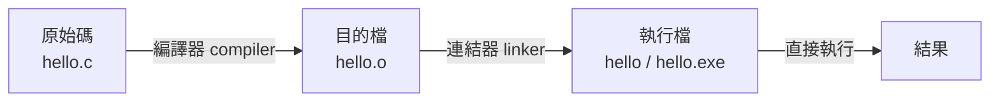
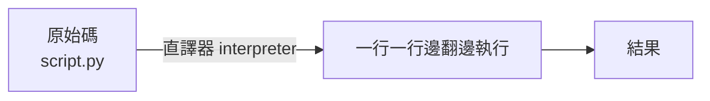
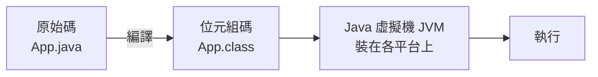

# 軟體授權與程式怎麼跑起來

> [!abstract] 這篇你會學到
> - 用**食譜與菜**的比喻理解原始碼、編譯與執行的關係
> - 分辨編譯式語言與直譯式語言，知道為什麼有些軟體要分平台
> - 理解「函式庫」與「相依性」，以及惡名昭彰的「相依性地獄」
> - **★★★★ 分清楚免費軟體、開源軟體、自由軟體 —— 這三個不是同一件事**
> - 看懂 MIT、Apache、GPL 幾種主要授權的差別與實際影響
>   （**★★★★ 授權挑錯，整套自製系統可能被迫開源**）
> - 知道機關採購與使用開源軟體時該注意什麼
> - **★★★★★ 修補了函式庫卻沒重啟服務 = 等於沒修補** —— 機關弱點掃描年年被退件的頭號原因

## 前置知識

- [[010-01-08-guide-計概-作業系統是什麼]] — 程式怎麼被作業系統執行
- [[010-01-04-cmd-計概-數字系統與文字編碼]] — 機器碼與二進位

---

## 觀念說明

### 核心比喻：食譜、廚師與菜

| 比喻 | 對應 |
| --- | --- |
| **食譜**（人看得懂的文字） | **原始碼（source code）** |
| **把食譜翻譯成「機器手臂指令」** | **編譯（compile）** |
| **機器手臂指令**（人看不懂） | **機器碼／執行檔** |
| **做出來的菜** | 程式執行的結果 |
| 廚師邊看食譜邊做 | **直譯（interpret）** |

### 原始碼：人寫的東西

程式設計師寫的是**原始碼**，那是人類看得懂的文字：

```python
# 這是 Python 原始碼，人看得懂
def 打招呼(名字):
    print(f"你好，{名字}！")

打招呼("小明")
```

但 **CPU 完全看不懂這個**。CPU 只認得**機器碼** ——
一串代表「把這個數字搬到那個暫存器」「把這兩個數字相加」的二進位指令。

所以中間必須有一個翻譯過程。

> ★★★ 這個「中間一定要有翻譯」的事實，是後面所有結論的根：
> 為什麼要分平台下載、為什麼跑 Python 要先裝 Python、
> 為什麼 `.php` 沒被正確處理就會外洩原始碼 —— 通通從這裡推出來。

---

## 兩種翻譯方式

### ★★★ 編譯（Compile）：事先全部翻好



| 特性 | 說明 |
| --- | --- |
| 比喻 | **先把整本食譜翻譯成機器手臂指令，印成一本操作手冊** |
| 何時翻譯 | **執行前**，一次翻完 |
| 執行速度 | **快**（CPU 直接跑，不用邊翻邊做） |
| 跨平台 | ★★★ ❌ **不行**。Windows 編的執行檔不能在 Linux 跑 |
| 代表語言 | **C、C++、Go、Rust**、Swift |

> [!note] 這解釋了為什麼下載軟體要分版本
> 官網上常看到：
> ```
> Download for Windows (x64)
> Download for macOS (Apple Silicon)
> Download for macOS (Intel)
> Download for Linux (x86_64)
> Download for Linux (ARM64)
> ```
> 因為**每個作業系統 + CPU 架構的組合，都需要各自編譯一次**。
>
> ★★★ 這也是 Docker 映像有 `linux/amd64` 與 `linux/arm64` 之分的原因 ——
> 見 [[010-01-05-guide-計概-CPU如何工作]] 的 RISC/CISC 段落。

### ★★★ 直譯（Interpret）：邊看邊做



| 特性 | 說明 |
| --- | --- |
| 比喻 | **廚師拿著原文食譜，邊看邊翻譯邊做菜** |
| 何時翻譯 | **執行時**，跑到哪翻到哪 |
| 執行速度 | 較慢（每次執行都要重新翻譯） |
| 跨平台 | ✅ **可以**，只要目標機器裝了直譯器 |
| 代表語言 | ★★ **Python、PHP、JavaScript、Ruby**、Bash |

> [!tip] 這解釋了兩件實務上的事
> 1. ★★ **為什麼跑 Python 程式前要先「裝 Python」**
>    —— 因為你需要那個「廚師」（直譯器）。
>    同理，跑 PHP 網站要裝 PHP、跑 Node.js 應用要裝 Node.js。
>    這正是本手冊 `52-應用執行環境` 整章在處理的事。
>
> 2. ★★★★★ **為什麼直譯式語言的原始碼會直接放在伺服器上**
>    —— PHP 網站的 `.php` 檔案就是原始碼本身。
>    這也是為什麼**設定伺服器時一定要確保 `.php` 被 PHP 處理而不是直接下載**，
>    否則你的資料庫密碼就會被人看光。

### 折衷方案：位元組碼 + 虛擬機



| 特性 | 說明 |
| --- | --- |
| 比喻 | 把食譜翻成一種**通用中間語言**，各國廚師都學過這種語言 |
| 代表 | **Java**（JVM）、C#/.NET（CLR） |
| 好處 | 兼顧速度與跨平台：*"Write once, run anywhere"* |
| 代價 | ★★ 目標機器要裝虛擬機（JRE / .NET Runtime） |

> [!note] 三種方式的比較
> （★ 下表「速度」欄的星號是**效能評分**，不是本手冊的重要度標記）
>
> | | 編譯式 | 直譯式 | 位元組碼 |
> | --- | --- | --- | --- |
> | 速度 | ★★★ | ★ | ★★ |
> | 跨平台 | ❌ | ✅ | ✅ |
> | 部署時要裝什麼 | 什麼都不用 | 直譯器 | 虛擬機 |
> | 原始碼要不要給對方 | 不用 | **要** | 不用（但容易反編譯） |
> | 適合 | 系統程式、高效能服務 | 網站、腳本、自動化 | 企業應用 |

---

## 函式庫與相依性

### 函式庫是什麼

沒有人會從零開始寫所有東西。
需要處理 JPEG 圖片？用現成的 `libjpeg`。需要連 MySQL？用現成的資料庫函式庫。

**函式庫（library）** = 別人寫好、可以直接拿來用的功能包。

> [!example] 用開餐廳比喻
> 你要開一家餐廳，不會自己種菜、自己養雞、自己磨麵粉。
> 你會跟**供應商**進貨。
>
> 函式庫就是供應商。而問題也跟供應商一樣：
> - ★★★ 供應商倒了怎麼辦？（函式庫停止維護）
> - ★★★★ 供應商的貨有問題怎麼辦？（函式庫有漏洞）
> - ★★★ 供應商換配方怎麼辦？（函式庫改版不相容）

### ★★★★ 相依性地獄

**相依性（dependency）** = 你的程式需要哪些函式庫才能跑。

```
你的網站
 └── 需要 Laravel 框架
      └── 需要 Symfony 元件
           └── 需要 PSR 標準函式庫
                └── 需要 PHP 8.2 以上      ← ★★★ 最底層的版本要求會往上綁死整條鏈
```

> [!warning] 「相依性地獄」是什麼
> 常見的災難情境：
>
> | 情境 | 問題 |
> | --- | --- |
> | ★★★ 程式 A 需要函式庫 X 的 1.0 版，程式 B 需要 X 的 2.0 版 | 同一台機器裝不了兩個版本 |
> | ★★★★ 更新了一個函式庫，結果十個程式都掛掉 | 相依關係複雜 |
> | ★★★★ 某個函式庫停止維護，但你的系統離不開它 | 有漏洞也沒人修 |
> | ★★★ 一個小工具竟然拉進 300 個相依套件 | 攻擊面暴增 |
>
> **這是現代軟體維運最大的痛點之一。**

**業界的解法**：

| 解法 | 說明 | 對應章節 |
| --- | --- | --- |
| ★★★ **套件管理器** | 自動處理相依關係與版本 | `apt`、`dnf`、`composer`、`npm`、`pip` |
| ★★★ **虛擬環境** | 每個專案有自己獨立的一套函式庫 | Python `venv`、Node `node_modules` |
| ★★★★ **容器** | 把程式與所有相依打包成一個映像 | **Docker**，見 `41-容器化` |
| ★★ **靜態連結** | 編譯時把函式庫直接打包進執行檔 | Go 的預設做法，部署超簡單 |

> [!tip] 容器為什麼這麼受歡迎
> 容器解決的正是這個問題：
> **「在我的電腦上明明可以跑啊」**
>
> 把程式和它需要的所有東西（函式庫、設定、執行環境）
> 一起打包成一個映像，搬到哪都一樣。
> ★★ 代價是「更新一個函式庫」變成「重建映像重新部署」，修補流程要跟著改。
> 詳見 [[010-01-17-guide-計概-雲端虛擬化與容器]]。

> [!danger] 相依性也是資安問題：供應鏈攻擊 ★★★★★
> 2021 年的 **Log4Shell**（CVE-2021-44228）是最好的例子。
> Log4j 是一個 Java 的日誌函式庫，被**數以萬計**的軟體使用。
> 一個漏洞爆發，全世界的資安人員連續加班好幾週 ——
> ★★★★★ 因為大家連「自己有沒有用到 Log4j」都不知道。
>
> **對策**：
> 1. ★★★★ 建立 **SBOM**（Software Bill of Materials，軟體物料清單），
>    知道自己用了哪些元件與版本
> 2. ★★★ 使用相依性掃描工具（`npm audit`、`composer audit`、Trivy、Dependabot）
> 3. ★★★ 定期更新，不要讓相依套件年久失修
>
> 見 [[090-07-11-guide-資安實踐-委外與供應鏈資安]] 與 [[090-07-03-guide-資安實踐-弱點與修補管理流程]]。

---

## 軟體授權：這一節比你想的重要

> [!warning] 三個常被混為一談的詞 ★★★★
> **免費 ≠ 開源 ≠ 自由**。這三個是完全不同的概念。
> ★★★★ 在採購文件或財產清冊上把三者混寫，事後很難補救 —— 稽核問的是「依據哪一份授權」。

| | **免費軟體 Freeware** | **開源軟體 Open Source** | **自由軟體 Free Software** |
| --- | --- | --- | --- |
| 不用錢 | ✅ | 通常是 | 通常是 |
| ★★★★ **看得到原始碼** | ❌ **通常看不到** | ✅ | ✅ |
| ★★★ 可以修改 | ❌ | ✅ | ✅ |
| ★★★ 可以重新散布 | 視授權而定 | ✅ | ✅ |
| 例子 | Adobe Reader、LINE、部分防毒 | 大部分開源專案 | Linux kernel、GNU 工具 |

> [!note] "Free" 的雙關
> 英文的 free 同時是「免費」與「自由」。
> 自由軟體運動有一句名言：
>
> > *"Free as in **freedom**, not free as in **beer**."*
> > （是「言論自由」的自由，不是「免費啤酒」的免費。）
>
> **自由軟體**強調的是使用者的四大自由：
> 0. 自由地**執行**程式，不限用途
> 1. 自由地**研究**程式如何運作並**修改**它（前提是能取得原始碼）
> 2. 自由地**重新散布**副本
> 3. 自由地**散布你修改後的版本**
>
> ★★ 開源（Open Source）則比較務實，強調的是開發模式與品質，
> 不那麼強調意識形態。實務上兩者涵蓋的軟體高度重疊。

### ★★★★ 主要授權條款比較

這是實務上最需要搞清楚的部分。

| 授權 | 類型 | 白話 | 代表專案 |
| --- | --- | --- | --- |
| ★★ **MIT** | 寬鬆 | 「隨便你用，**保留我的版權宣告**就好，出事別找我」 | React、jQuery、Rails |
| ★★ **BSD** | 寬鬆 | 跟 MIT 幾乎一樣 | FreeBSD、Nginx（2-clause） |
| ★★★ **Apache 2.0** | 寬鬆 | 像 MIT，但**額外處理專利授權**，對企業更友善 | Kubernetes、Android、Apache HTTP |
| ★★★ **LGPL** | 弱著作傳 | 你可以**連結**它而不必開源你的程式；但改了它本身要開源 | glibc、部分函式庫 |
| ★★★★ **GPL v2 / v3** | 強著作傳 | **你的程式用了它，你的程式也必須用 GPL 開源** | **Linux kernel**（v2）、GRUB、Bash |
| ★★★★ **AGPL v3** | 最強著作傳 | 連「**只提供網路服務**」也算散布，也要開源 | MongoDB（舊版）、Grafana（舊版） |

### Copyleft（著作傳）是什麼

> [!example] 用「病毒式」來比喻（這是業界常用的說法，但沒有貶意）
> **MIT / Apache（寬鬆型）**像是：
> 「這道食譜送你，你拿去開店賣、改配方、不公開改良版，都可以。
>  ★★ 只要在菜單角落註明食譜來源。」
>
> **GPL（著作傳）**像是：
> 「這道食譜送你，但如果你用它做出新菜色拿去賣，
>  ★★★★ **你的新食譜也必須公開給所有人**。」
>
> **AGPL** 更進一步：
> 「就算你不賣食譜、只開餐廳賣做好的菜，
>  ★★★★ 你的新食譜還是必須公開。」

> [!warning] GPL 的實際影響：一個真實的判斷情境 ★★★★
> 你的公司要開發一套內部系統，想用某個 GPL 授權的函式庫。
>
> | 情境 | 需不需要開源你的程式？ |
> | --- | --- |
> | ★★ 只在公司內部使用，不對外散布 | **不用**。GPL 只在「散布」時觸發 |
> | ★★★★ 把系統賣給客戶（安裝在客戶機器上） | **要**。這是散布，必須附上原始碼 |
> | ★★★ 做成 SaaS 讓客戶用瀏覽器連線（GPL） | **不用**。GPL 不涵蓋「僅提供服務」 |
> | ★★★★ 做成 SaaS（**AGPL**） | **要**。AGPL 就是為了堵這個漏洞 |
>
> **這不是法律建議。** 涉及商業產品時請諮詢法務。
> 但身為維運人員，你至少要知道「**這個問題是存在的**」，
> ★★★★ 在採購與技術選型時提出來 —— 系統上線後才發現，改架構的代價遠高於當初換一套函式庫。

> [!tip] 為什麼企業偏好 Apache 2.0 與 MIT ★★★
> 因為它們**不會傳染**。企業可以放心把它們用在閉源產品裡。
> Apache 2.0 又額外提供**明確的專利授權**，
> 降低了「用了之後被貢獻者拿專利告」的風險，所以大型專案特別愛用。

### 其他常見的授權形態

| 類型 | 說明 | 例子 |
| --- | --- | --- |
| ★★★ **雙授權（dual license）** | 開源版免費（通常 GPL），商業版付費 | MySQL、Qt |
| ★★ **開放核心（open core）** | 核心開源，企業功能閉源付費 | GitLab、Elastic |
| ★★★★ **SSPL / BSL** | 「來源可見」但**不是 OSI 認證的開源** | MongoDB（現行）、HashiCorp（現行） |
| ★★ **專有軟體** | 完全閉源，需購買授權 | Windows、Office、Oracle DB |

> [!warning] 「Source Available」不等於開源 ★★★★
> 近年有些公司把授權從 Apache 改成 SSPL 或 BSL，
> 理由是防止雲端業者「拿走開源成果去賣服務卻不回饋」。
>
> 這些授權**讓你看得到原始碼，但限制你的使用方式**
> （例如不能拿去提供競爭性的託管服務）。
> ★★★★ 它們**不符合 OSI 的開源定義**。
>
> 實務影響：如果你的機關規定「只能用開源軟體」，
> ★★★★ 這類軟體可能**不符合規定**，採購前要確認。
> 這也是 Terraform → OpenTofu、Elasticsearch → OpenSearch
> 這些分支（fork）出現的原因。

> [!danger] ★★★★ 授權會「改」，而且是對既有使用者生效的那種改
> 這是很多人沒想到的一點：**你當初選型時是 Apache 2.0，不代表三年後還是**。
> 授權變更通常只對**新版本**生效，舊版本仍留在舊授權下 —— 但這代表：
>
> | 後果 | 說明 |
> | --- | --- |
> | ★★★★ 你被卡在舊版本 | 想守住開源合規，就不能升級到變更後的新版 |
> | ★★★★ 卡在舊版本 = 收不到安全更新 | 舊版通常很快就停止提供 CVE 修補 |
> | ★★★ 被迫遷移到 fork | OpenTofu、OpenSearch、Valkey 都是這樣長出來的 |
>
> ★★★★ **實務做法**：把「授權條款」與「授權變更風險」寫進選型評估表，
> 而不是只在第一次採購時看一眼。

---

## 機關與企業使用開源軟體的注意事項

> [!tip] 導入開源軟體前的檢查清單
> | 檢查項目 | 為什麼 |
> | --- | --- |
> | ★★★★ **授權條款是什麼** | 會不會影響自家系統？符不符合採購規定？ |
> | ★★★★ **維護是否活躍** | 最近一次更新是什麼時候？有多少維護者？ |
> | ★★★★ **有沒有安全更新機制** | 漏洞公布後多久會修？有沒有安全公告管道？ |
> | ★★ **社群規模** | 遇到問題查得到答案嗎？ |
> | ★★★ **有沒有商業支援可買** | 出事時能不能找到人負責？ |
> | ★★★ **相依套件有多少** | 拉進來的每一個都是攻擊面 |
> | ★★★★ **是否有已知漏洞** | 查 CVE 資料庫；用掃描工具 |

> [!warning] 「免費」不等於「零成本」 ★★★
> 開源軟體省下的是**授權費**，但仍有：
> - ★★★ **人力成本**：要有人會裝、會設定、會排錯
> - ★★ **教育訓練成本**
> - ★★★ **維護成本**：更新、備份、監控都要人做
> - ★★★★ **風險成本**：出事沒有原廠可以究責
>
> 機關評估時應該用 **TCO**（總持有成本）比較，
> 而不是只看「授權費 0 元」。

> [!tip] 商業支援是可以買的 ★★★
> 很多開源軟體有商業支援選項：
> - **RHEL**：Red Hat 提供付費支援（Rocky/AlmaLinux 是免費相容版）
> - **Nginx**：有 NGINX Plus 商業版
> - **Proxmox VE**：軟體免費，可購買訂閱取得企業版套件庫與支援
> - **PostgreSQL**：多家廠商提供支援服務
>
> 對機關而言，**買支援**往往是「用開源但仍有人負責」的好方案，
> 也比較好向稽核與長官交代。

---

## 完整實戰範例

### 看一個程式是編譯的還是直譯的

```bash
# 編譯式：執行檔是二進位
$ file /usr/bin/ls
/usr/bin/ls: ELF 64-bit LSB pie executable, x86-64, dynamically linked
#            ^^^ ★★★ ELF = Linux 原生執行檔    ^^^^^^ ★★★ 架構寫在這裡

# 直譯式：其實是純文字
$ file /usr/bin/apt
/usr/bin/apt: Python script, ASCII text executable

$ head -1 /usr/bin/some-script.sh
#!/bin/bash          ← shebang，告訴系統用哪個直譯器
```

> [!note] `#!/bin/bash` 這一行叫 shebang
> 它告訴作業系統：「這個檔案要交給 `/bin/bash` 去執行」。
> 常見的有：
> ```
> #!/bin/bash          Bash 腳本
> #!/usr/bin/env python3   Python 腳本
> #!/usr/bin/env node      Node.js 腳本
> ```
> ★★★ 用 `env` 的寫法比較好，因為它會去 PATH 裡找，
> 不會寫死在某個路徑上。見 [[020-01-21-cmd-Linux-Shell腳本入門]]。

### 看一個執行檔需要哪些函式庫

```bash
$ ldd /usr/bin/nginx
        linux-vdso.so.1 (0x00007fff...)
        libcrypt.so.1 => /lib/x86_64-linux-gnu/libcrypt.so.1
        libpcre2-8.so.0 => /lib/x86_64-linux-gnu/libpcre2-8.so.0
        libssl.so.3 => /lib/x86_64-linux-gnu/libssl.so.3      # ★★★★ 這兩行就是 TLS 的心臟
        libcrypto.so.3 => /lib/x86_64-linux-gnu/libcrypto.so.3
        libz.so.1 => /lib/x86_64-linux-gnu/libz.so.1
```

這就是 Nginx 的**動態相依**。
★★★★ 如果 `libssl.so.3` 出了漏洞，Nginx 也會受影響 ——
所以更新 OpenSSL 之後**必須重啟 Nginx** 才會用到新版。

```bash
# 更新後，哪些服務還在用舊的（已刪除的）函式庫？
$ sudo lsof | grep 'DEL.*lib' | awk '{print $1}' | sort -u   # ★★★★ 有輸出就代表還沒修補完
nginx
mysqld

# Ubuntu 有現成工具
$ sudo apt install needrestart
$ sudo needrestart                                            # ★★★★ 納入每次修補的固定收尾動作
```

> [!danger] 這是最常見的「修補了但沒生效」★★★★★
> 很多人以為 `apt upgrade` 跑完就安全了。
> 但**正在執行的程序仍載入著舊版函式庫**，
> 直到重啟該服務（或重開機）才會用到修補後的版本。
>
> ★★★★★ 後果很具體：弱點掃描報告下個月照樣列出同一個 CVE，
> 而你已經在稽核回覆表上簽名寫了「已修補」——
> 這在機關是**不實陳報**，比漏未修補更難解釋。
>
> 把 `needrestart` 或 `checkrestart` 納入修補流程，
> 見 [[090-07-03-guide-資安實踐-弱點與修補管理流程]]。

### 查看軟體的授權

```bash
# Debian/Ubuntu：每個套件的授權都在這裡
$ cat /usr/share/doc/nginx/copyright | head -20

# 看套件資訊
$ apt show nginx | grep -i -E 'homepage|description'

# 掃描專案的相依套件漏洞
$ composer audit          # PHP
$ npm audit               # Node.js
$ pip-audit               # Python
$ trivy fs .              # ★★★ 通用，掃描檔案系統與容器映像
```

### ★★★★ 完整情境：接手一台沒有文件的網站主機

> 情境：前同事離職，留下一台跑著對外網站的 Ubuntu 主機，沒有任何交接文件。
> 上級要你在三天內回答兩個問題：**「它安不安全？」**與**「授權有沒有問題？」**
> 以下是可以照做的完整流程。

**【1】先確認網站是用什麼跑的（編譯式？直譯式？）**

```bash
$ sudo ss -tlnp | grep -E ':80|:443'
LISTEN 0 511 0.0.0.0:80   0.0.0.0:* users:(("nginx",pid=812,fd=6))
LISTEN 0 511 0.0.0.0:443  0.0.0.0:* users:(("nginx",pid=812,fd=7))
```

```bash
$ file /usr/sbin/nginx
/usr/sbin/nginx: ELF 64-bit LSB pie executable, x86-64, dynamically linked
```

★★★ 判讀：Nginx 本身是**編譯式**執行檔，代表「更新它 = 換掉這個檔案 + 重啟」。

**【2】找出網站根目錄，判斷應用是哪種語言**

```bash
$ grep -R "root " /etc/nginx/sites-enabled/ | head
/etc/nginx/sites-enabled/app.conf:    root /var/www/app/public;

$ ls /var/www/app
artisan  composer.json  composer.lock  public  vendor
```

★★★★ 看到 `artisan` 與 `composer.json` = **Laravel（PHP，直譯式）**。
直譯式代表**原始碼就躺在伺服器上**，這一點會直接決定第【5】步要檢查什麼。

**【3】確認直譯器版本，以及有沒有過保**

```bash
$ php -v
PHP 8.1.2 (cli) (built: ...)
```

預期判讀：

```text
PHP 8.1 → ★★★★ 已進入僅安全性修補或已終止支援的階段（動筆前請至 php.net/supported-versions 確認）
```

★★★★ 直譯器過保 = 應用程式本身再新也沒用，整台機器的 PHP 都不再收修補。

**【4】盤點相依套件與已知漏洞（這就是最小可用的 SBOM）**

```bash
$ cd /var/www/app && composer audit
Found 2 security vulnerability advisories affecting 2 packages:
  guzzlehttp/guzzle (7.4.1)   CVE-2022-31090   # ★★★★ 有 CVE 就要排修補
  league/flysystem  (2.4.0)   GHSA-9f46-...
```

```bash
# 沒有 composer audit 時的替代：直接把 lock 檔存下來當 SBOM 基線
$ cp composer.lock /var/backups/sbom-app-$(date +%F).lock   # ★★★ 有基線才能比對「這次多了什麼」
```

**【5】★★★★★ 檢查原始碼會不會被直接下載**

```bash
$ curl -s -o /dev/null -w '%{http_code}\n' https://example.gov.tw/index.php
200            # ★ 正常，PHP 有被執行（回傳的是 HTML 不是原始碼）

$ curl -s https://example.gov.tw/.env | head -3
```

預期輸出（**安全**的情況）：

```text
<html><head><title>404 Not Found</title>          # ★ 這才是對的
```

危險的情況：

```text
APP_KEY=base64:xxxx
DB_PASSWORD=P@ssw0rd                              # ★★★★★ 資料庫密碼已經外洩了
```

```bash
# 同時要試的還有這幾條
$ curl -s -o /dev/null -w '%{http_code} .git/config\n'   https://example.gov.tw/.git/config
$ curl -s -o /dev/null -w '%{http_code} composer.json\n' https://example.gov.tw/composer.json
```

★★★★★ 只要有任何一條回 `200`，視同**資安事件**，立刻依機關通報程序處理，
再回頭修 Nginx 設定；見 [[060-03-01-06-guide-PHP-安全設定]]。

**【6】盤點授權，回答「能不能用」**

```bash
# 系統套件的授權
$ for p in nginx mysql-server php8.1-fpm; do
    echo "== $p"; head -5 /usr/share/doc/$p/copyright 2>/dev/null
  done

# 應用相依套件的授權一覽（★★★ 這張表就是交給法務／採購的附件）
$ composer licenses --format=json | head -30
```

★★★★ 重點只有一個問題：**清單裡有沒有 GPL / AGPL**？
如果這套系統將來要「賣給別的機關」或「委外廠商拿去複製部署」，那就是**散布**，
GPL 條款會被觸發。內部自用則不會。

**【7】確認修補後有沒有真的生效**

```bash
$ sudo apt update && sudo apt upgrade -y
$ sudo needrestart -r l
Services to be restarted:
 systemctl restart nginx.service        # ★★★★ 沒做這一步，前面全白做
 systemctl restart php8.1-fpm.service
```

**【8】留下交接文件（下一個人不用再做一次【1】～【7】）**

| 要記錄的欄位 | 這台機器的答案 |
| --- | --- |
| ★★★ 對外服務與埠 | Nginx 80/443 |
| ★★★★ 應用語言與版本 | PHP 8.1（Laravel），★★★★ 已接近終止支援 |
| ★★★★ 相依基線 | `/var/backups/sbom-app-YYYY-MM-DD.lock` |
| ★★★★ 授權盤點結果 | 全數 MIT/BSD/Apache-2.0，無 GPL |
| ★★★★ 修補程序 | `apt upgrade` → `needrestart -r l` → 重啟服務 |
| ★★★ 已驗證的外洩路徑 | `.env`、`.git/config`、`composer.json` 皆為 404 |

> [!tip] ★★★ 這份表就是接手任何一台主機的最小交接單
> 它剛好對應本篇三個主軸：**怎麼跑起來**（【1】【3】）、
> **相依什麼**（【4】【7】）、**授權能不能用**（【6】）。

---

## 常見錯誤與排錯

| 現象 | 原因 | 解法 |
| --- | --- | --- |
| ★★ 下載的軟體「不是有效的應用程式」 | 下載了錯誤平台／架構的版本 | 確認是 Windows/Linux/macOS、x86_64/ARM |
| ★★★ Docker 映像 `exec format error` | 架構不符（amd64 vs arm64） | `docker pull --platform linux/amd64` |
| ★★★ 執行程式說 `error while loading shared libraries` | 缺少函式庫 | `ldd 執行檔` 找出缺哪個；用套件管理器安裝 |
| ★★★★ 裝了新版套件，另一個程式壞掉 | 相依性衝突 | 用虛擬環境或容器隔離；檢查版本相容性 |
| ★★★★★ 修補了 OpenSSL 但掃描仍報漏洞 | 服務仍載入舊版函式庫 | `needrestart` 或重啟相關服務 |
| ★★★★★ PHP 檔案被直接下載，密碼外洩 | 伺服器沒設定用 PHP 處理 `.php` | 檢查 Nginx/Apache 設定；見 [[060-03-01-06-guide-PHP-安全設定]] |
| ★★★★★ 網站原始碼中的 `.git` 目錄可被存取 | 部署時把整個 git 倉庫放上去 | 部署不要含 `.git`；伺服器阻擋 `location ~ /\.git` |
| ★★★★ 用了 GPL 函式庫，法務說不能出貨 | 著作傳條款 | 尋找 MIT/Apache 授權的替代品；或評估開源 |
| ★★★★ 機關規定只能用開源，但選的軟體是 SSPL | Source Available 不是開源 | 採購前確認是否為 OSI 認證授權；找 fork 版本 |
| ★★★ 專案拉進 500 個 npm 套件 | 相依鏈太深 | 檢視是否真的需要；用 `npm audit`；考慮更精簡的替代 |
| ★★★★ 腳本回 `bad interpreter: No such file or directory` | shebang 指到不存在的直譯器，或檔案是 CRLF 換行 | `head -1` 看 shebang；`file` 看是否 CRLF；改用 `#!/usr/bin/env` |
| ★★★★ 升級後應用直接白畫面，log 說 class not found | 直譯器大版本跳版，相依套件不相容 | 先在測試機驗版本；`composer.lock` / `package-lock.json` 一定要版控 |
| ★★★★★ 容器裡的漏洞掃了修不掉 | 修的是主機，映像裡的函式庫沒重建 | 重建映像並重新部署，不是進容器 `apt upgrade` |
| ★★★ `apt upgrade` 說套件被 held back | 相依關係無法一次滿足 | `apt-cache policy 套件` 看版本來源；必要時 `apt full-upgrade` |

### ★★★★ 排查一：`error while loading shared libraries`

**【1】先看到底缺哪一個 `.so`**

```bash
$ ldd /usr/local/bin/myapp | grep 'not found'
```

預期輸出：

```text
libssl.so.1.1 => not found        # ★★★★ 出現 not found，程式一定起不來
```

**【2】查是哪個套件提供這個檔案**

```bash
$ apt-file search libssl.so.1.1        # 需先 sudo apt install apt-file && sudo apt-file update
```

```text
libssl1.1: /usr/lib/x86_64-linux-gnu/libssl.so.1.1
```

**【3】判斷該不該裝**

★★★★ 如果它在**目前的發行版已經被移除**（例如 Ubuntu 24.04 沒有 `libssl1.1`），
**不要**去外部撈一個 `.deb` 硬裝 —— 那等於在新系統裡放一個沒人修補的舊 OpenSSL。
正確做法是換一個對應新版本的執行檔，或把它包進容器。

**【4】確認修好了**

```bash
$ ldd /usr/local/bin/myapp | grep -c 'not found'
0                                  # ★★★ 必須是 0
```

### ★★★★★ 排查二：修補了但掃描還在報同一個 CVE

**【1】確認磁碟上的版本真的更新了**

```bash
$ dpkg -l | grep -E '^ii\s+libssl3'
ii  libssl3:amd64  3.0.2-0ubuntu1.18  amd64  ...   # ★★★ 版本號要對得上公告
```

**【2】找出還抓著舊函式庫的程序**

```bash
$ sudo lsof +c 0 2>/dev/null | grep 'DEL.*lib' | awk '{print $1, $2}' | sort -u
```

預期輸出：

```text
nginx   812        # ★★★★ 有列出來 = 這個服務還在用舊版
mysqld  1043
```

**【3】用官方工具產生要重啟的清單**

```bash
$ sudo needrestart -r l
```

```text
Services to be restarted:
 systemctl restart nginx.service       # ★★★★ 照著這份清單重啟，不要憑印象
```

**【4】重啟並複驗**

```bash
$ sudo systemctl restart nginx
$ sudo lsof +c 0 2>/dev/null | grep -c 'DEL.*lib'
0                                      # ★★★★★ 這個 0 才是「已修補」的證據
```

★★★★ **把第【4】步的輸出截圖存證**，稽核要的就是這個，不是 `apt upgrade` 的畫面。

### ★★★ 排查三：`bad interpreter` 與 CRLF

**【1】看第一行**

```bash
$ head -1 deploy.sh | cat -A
#!/bin/bash^M$          # ★★★★ 結尾的 ^M 就是 Windows 換行，直譯器名字變成 "bash\r"
```

**【2】確認檔案格式**

```bash
$ file deploy.sh
deploy.sh: Bourne-Again shell script, ASCII text executable, with CRLF line terminators
```

**【3】轉回 LF**

```bash
$ sudo apt install dos2unix && dos2unix deploy.sh
dos2unix: converting file deploy.sh to Unix format...
```

**【4】驗證**

```bash
$ head -1 deploy.sh | cat -A
#!/bin/bash$            # ★★★ 只剩 $，沒有 ^M
```

★★★ 根治做法：在 repo 加 `.gitattributes` 寫 `*.sh text eol=lf`，
讓 Windows 上的同事 commit 時自動轉換。

### ★★★★ 排查四：Docker `exec format error`

**【1】看映像的架構**

```bash
$ docker image inspect myapp:1.0 --format '{{.Architecture}}/{{.Os}}'
arm64/linux              # ★★★★ 主機是 x86_64 就跑不動
```

**【2】看主機的架構**

```bash
$ uname -m
x86_64
```

**【3】拉對的架構**

```bash
$ docker pull --platform linux/amd64 myapp:1.0
```

**【4】建置時就指定，避免下次再犯**

```bash
$ docker buildx build --platform linux/amd64,linux/arm64 -t myapp:1.0 --push .
# ★★★ 一次建出多架構映像，M 系列 Mac 開發、x86 伺服器部署都能用
```

---

## 安全性注意事項

> [!danger] 不要從不明來源下載軟體 ★★★★★
> 這是惡意程式最主要的散布管道。
>
> **安全的取得方式**（由安全到不安全）：
> 1. ★★★★ **作業系統的官方套件庫**（`apt`、`dnf`、Microsoft Store）—— 有簽章驗證
> 2. ★★★ **軟體官方網站**，並**核對雜湊值或 GPG 簽章**
> 3. ★★★ 官方認可的第三方套件庫（如 `deb.myguard.nl`）—— 見 [[020-02-03-03-cmd-標準化-第三方APT套件庫實務]]
> 4. ★★★★★ ❌ 搜尋引擎廣告連結、下載站、破解版
>
> ★★★★★ 具體後果：從下載站取得的安裝程式常夾帶挖礦程式或遠端控制後門。
> 它以你執行安裝時的權限落地 —— 如果你是用系統管理員／`sudo` 裝的，
> 它拿到的就是**整台機器**，而不只是你的帳號。

> [!tip] 怎麼驗證下載的檔案 ★★★★
> ```bash
> # 1. 核對 SHA256（官網會公布正確的值）
> $ sha256sum ubuntu-24.04.iso
> a1b2c3d4...  ubuntu-24.04.iso
>
> # 2. ★★★★ 更好：驗證 GPG 簽章（能證明「確實是官方發布的」）
> $ gpg --verify SHA256SUMS.gpg SHA256SUMS
> gpg: Good signature from "Ubuntu CD Image Automatic Signing Key"
> ```
>
> ★★★★ **雜湊值只能證明「檔案沒有損毀」，簽章才能證明「來源是誰」。**
> 如果攻擊者能改下載檔，他通常也能改網頁上的雜湊值 ——
> 但他改不了官方的私鑰簽章。
>
> ★★★ 另一個常被忽略的細節：`gpg --verify` 說 Good signature，
> 不代表那把金鑰**是官方的**。第一次匯入金鑰時要從官方文件核對指紋，
> 否則等於「拿歹徒自己刻的印章驗歹徒自己的文件」。

> [!danger] 破解版軟體是機關資安的重大破口 ★★★★★
> 破解版（crack、KeyGen）幾乎必然夾帶惡意程式，
> ★★★★★ 而且因為使用者知道它「不合法」，中招後往往**不敢通報**。
>
> 除了資安風險，使用未授權軟體還涉及：
> - ★★★★ **著作權法**的民刑事責任
> - ★★★★ 機關與企業會被 BSA 等組織稽查
> - ★★★★ 資安事件時無法向原廠求助
>
> ★★★★ **後果不只是罰款**：一台裝了破解版繪圖軟體的行政電腦，
> 若同時連著檔案伺服器，勒索軟體加密的是**全處室的共用資料夾**，
> 而事發時間點往往離「當初裝軟體」已經好幾個月，追不回來也說不清。
>
> **正確做法**：編列預算購買授權，或改用開源替代品
> （LibreOffice、GIMP、Inkscape、7-Zip 等）。

> [!warning] 供應鏈攻擊的三種形態 ★★★★
> | 手法 | 說明 | 真實案例類型 |
> | --- | --- | --- |
> | ★★★★★ **上游被入侵** | 攻擊者入侵開源專案，在正常版本中植入後門 | XZ Utils 後門事件 |
> | ★★★★ **相依套件投毒** | 註冊名字很像的惡意套件（typosquatting） | npm/PyPI 上屢見不鮮 |
> | ★★★★★ **建置流程被入侵** | 攻擊者入侵 CI/CD，在編譯階段植入 | SolarWinds 事件 |
>
> **防護**：
> - ★★★★ 鎖定版本（lock file），不要無條件用最新版
> - ★★★★ 使用簽章驗證與 SBOM
> - ★★★ 相依套件掃描納入 CI 流程
> - ★★★ 內部建立套件鏡像／私有套件庫，見 [[020-02-03-04-svc-標準化-自建APT套件庫]]

> [!danger] ★★★★★ 直譯式應用的原始碼就是機密本身
> 這一條是本篇「直譯 vs 編譯」觀念最直接的資安後果，具體會外洩什麼：
>
> | 被下載到的檔案 | 攻擊者立刻得到什麼 |
> | --- | --- |
> | ★★★★★ `.env` | 資料庫帳密、`APP_KEY`、第三方 API 金鑰 |
> | ★★★★★ `.git/` 整包 | **完整開發歷史**，包含當初誤 commit 又刪掉的密碼 |
> | ★★★★ `config/*.php` | 內部主機名稱、內網 IP 網段、SMTP 帳密 |
> | ★★★ `composer.json` / `package.json` | 你用了哪些套件的哪個版本 → 直接對照 CVE 挑洞打 |
>
> ★★★★★ 注意第二列：**刪掉密碼再 commit 一次是沒用的**，舊 commit 還在。
> 一旦 `.git` 曾經對外可存取，唯一正確的處理是**把那些憑證全部換掉**。
>
> ★★★★ 最低限度的防線：Web 根目錄只放 `public/`，
> 應用程式本體與 `.env` 放在根目錄的**上一層**。

---

## 速查表

### 三種執行方式

| | 編譯式 | 直譯式 | 位元組碼 |
| --- | --- | --- | --- |
| 代表語言 | C、C++、Go、Rust | Python、PHP、JS、Bash | Java、C# |
| 速度 | 快 | 慢 | 中 |
| ★★★ 跨平台 | ❌ | ✅ | ✅ |
| ★★★ 部署要裝 | 無 | 直譯器 | 虛擬機 |
| ★★★★★ 原始碼會不會躺在伺服器上 | 不會 | **會** | 不會 |

### 主要授權速記

| 授權 | 一句話 | 用在閉源產品裡 |
| --- | --- | --- |
| ★★ **MIT / BSD** | 隨便用，保留版權宣告 | ✅ |
| ★★★ **Apache 2.0** | 同上，另有專利授權保護 | ✅ |
| ★★★ **LGPL** | 可連結；改函式庫本身要開源 | ✅（動態連結） |
| ★★★★ **GPL** | 用了它，你也要 GPL 開源 | ❌ |
| ★★★★ **AGPL** | 連提供網路服務也算散布 | ❌ |
| ★★★★ **SSPL / BSL** | 看得到原始碼但**不是開源** | 視條款 |

### 常用指令

| 目的 | 指令 |
| --- | --- |
| ★★ 看檔案類型 | `file 檔案` |
| ★★★ 看動態相依函式庫 | `ldd 執行檔` |
| ★★★★★ 找出要重啟的服務 | `sudo needrestart`、`checkrestart` |
| ★★★ 看套件授權（Debian） | `cat /usr/share/doc/套件名/copyright` |
| ★★★★ 掃描相依漏洞 | `npm audit`、`composer audit`、`pip-audit`、`trivy fs .` |
| ★★★ 驗證雜湊 | `sha256sum 檔案` |
| ★★★★ 驗證 GPG 簽章 | `gpg --verify 簽章檔 檔案` |
| ★★★★ 確認沒有程序抓著舊函式庫 | `sudo lsof \| grep 'DEL.*lib'` |
| ★★★★ 列出專案所有相依套件的授權 | `composer licenses`、`npx license-checker` |
| ★★★ 看 shebang 與換行格式 | `head -1 腳本 \| cat -A` |
| ★★★ 看容器映像架構 | `docker image inspect 映像 --format '{{.Architecture}}'` |

---

## 練習題

> [!question]- 練習 1：分辨編譯與直譯
> 在你的 Linux 系統上執行：
> ```bash
> file /usr/bin/ls /usr/bin/apt /bin/bash /usr/bin/python3
> ```
> 哪些是二進位執行檔（編譯式）？哪些是腳本（直譯式）？
> 那些腳本的第一行 shebang 寫的是什麼直譯器？

> [!question]- 練習 2：追蹤相依關係
> ```bash
> # 1. 看 nginx 需要哪些函式庫
> ldd $(which nginx)
>
> # 2. 挑一個函式庫，看是哪個套件提供的
> dpkg -S /lib/x86_64-linux-gnu/libssl.so.3
>
> # 3. 看還有誰用這個套件
> apt-cache rdepends libssl3 | head -20
> ```
> 想想：如果 OpenSSL 明天爆出重大漏洞，你的系統上有多少服務受影響？
> 你需要重啟哪些？

> [!question]- 練習 3：授權判斷
> 判斷以下情境需不需要開源你的程式碼：
> 1. 用了 MIT 授權的函式庫，做成商業軟體賣
> 2. 用了 GPL 授權的函式庫，只在公司內部使用
> 3. 用了 GPL 授權的函式庫，做成軟體賣給客戶安裝
> 4. 用了 AGPL 授權的資料庫，做成雲端服務給客戶用
> 5. 直接使用 Linux（GPL）跑你的閉源程式
>
> 參考答案：
> 1. **不用**。MIT 是寬鬆授權，只要保留版權宣告
> 2. **不用**。GPL 只在「散布」時觸發，內部使用不算
> 3. **要**。這是散布，必須提供原始碼
> 4. **要**。AGPL 就是為了涵蓋「僅提供網路服務」的情況
> 5. **不用**。在 GPL 系統上執行程式不算衍生作品，
>    Linux kernel 明確有這個例外聲明（syscall 邊界）
>
> ⚠️ 這是教學說明，涉及商業決策請諮詢法務。

---

## 小測驗

Q1. 用「食譜」的比喻說明原始碼、編譯與機器碼的關係。

Q2. 編譯式與直譯式語言的三個主要差別是什麼？各舉兩個代表語言。

Q3. 為什麼官網下載軟體要分 Windows/Linux/macOS 與 x86_64/ARM64 版本？

Q4. 為什麼跑 PHP 網站要先「裝 PHP」？這對伺服器安全設定有什麼含意？

Q5. 什麼是「相依性地獄」？業界有哪四種解法？

Q6. 免費軟體（Freeware）、開源軟體（Open Source）、自由軟體（Free Software）的差別是什麼？

Q7. `"Free as in freedom, not free as in beer"` 這句話在說什麼？

Q8. MIT 與 GPL 授權的根本差別是什麼？用餐廳食譜的比喻說明。

Q9. 「Source Available」（如 SSPL、BSL）為什麼不算開源？這對機關採購有什麼實際影響？

Q10. `apt upgrade` 更新了 OpenSSL 之後，為什麼漏洞掃描還是報同樣的問題？該怎麼處理？

> [!question]- 測驗答案
> **Q1.**（★★ 觀念基礎）**原始碼**是人看得懂的**食譜**；
> **編譯**是把整本食譜**事先翻譯成機器手臂指令**；
> **機器碼**是翻譯後那本人看不懂、但 CPU 直接能執行的指令手冊。
> CPU 完全看不懂原始碼，中間一定要有翻譯過程。
>
> **Q2.**（★★★ 影響部署方式）①**何時翻譯**：編譯是執行前一次翻完，直譯是執行時邊翻邊做；
> ②**速度**：編譯快、直譯慢；
> ③**跨平台**：編譯式不能跨平台（每個 OS+架構要各編一次），
> 直譯式可以（只要目標機器裝了直譯器）。
> 編譯式代表：**C、C++、Go、Rust**；直譯式代表：**Python、PHP、JavaScript、Bash**。
>
> **Q3.**（★★★ 下載錯版本會白忙一場）因為編譯式程式的執行檔是針對**特定作業系統 + 特定 CPU 架構**產生的機器碼，
> 每個組合都必須各自編譯一次。Windows 的 `.exe` 不能在 Linux 執行，
> x86_64 的執行檔也不能在 ARM64 的機器上跑。
> ★★★ 同一個道理讓 Docker 映像出現 `exec format error`。
>
> **Q4.**（★★★★★ 答錯會直接外洩資料庫密碼）因為 PHP 是**直譯式語言**，需要「廚師」（PHP 直譯器）才能執行原始碼。
> **安全含意**：`.php` 檔案本身就是**原始碼**，
> 如果伺服器沒有正確設定成「用 PHP 處理 .php」，
> 而是把它當一般檔案送出，訪客就會直接**下載到你的原始碼**，
> 裡面的資料庫密碼、API 金鑰就全部外洩了。
>
> **Q5.**（★★★★ 維運最大痛點）相依性地獄是指相依關係造成的各種困境：
> 兩個程式需要同一函式庫的不同版本、更新一個函式庫害十個程式掛掉、
> 函式庫停止維護卻離不開它、一個小工具拉進數百個相依套件。
> **四種解法**：①**套件管理器**（apt、composer、npm）；
> ②**虛擬環境**（Python venv、node_modules）；
> ③**容器**（Docker，把程式與所有相依打包）；
> ④**靜態連結**（如 Go，把函式庫編進執行檔）。
>
> **Q6.**（★★★★ 採購文件寫錯會被稽核退件）**免費軟體**只是不用錢，**通常看不到原始碼、不能修改**（如 Adobe Reader）；
> **開源軟體**原始碼公開、可修改、可重新散布；
> **自由軟體**在開源之上更強調使用者的**四大自由**（執行、研究修改、散布、散布修改版），
> 帶有明確的意識形態。實務上開源與自由涵蓋的軟體高度重疊。
>
> **Q7.**（★★ 名詞理解）英文 free 同時是「自由」與「免費」。
> 這句話在說：自由軟體強調的是「**言論自由**」意義上的自由
> （你有權研究、修改、散布它），**而不是「免費啤酒」意義上的不用錢**。
> 自由軟體是可以收費的，重點在於使用者取得的權利。
>
> **Q8.**（★★★★ 選型判斷的核心）**MIT** 是**寬鬆授權**：「食譜送你，拿去開店賣、改配方、不公開改良版都可以，
> 只要在菜單角落註明來源」——**不會傳染**，可以用在閉源產品裡。
> **GPL** 是**著作傳（copyleft）**：「食譜送你，但你用它做出新菜色拿去賣，
> **你的新食譜也必須公開給所有人**」——會傳染，用了就得一起開源。
>
> **Q9.**（★★★★ 直接影響能不能採購）因為 SSPL、BSL 這類授權雖然讓你**看得到原始碼**，
> 但**限制你的使用方式**（例如不能拿去提供競爭性的託管服務），
> 因此**不符合 OSI 的開源定義**。
> **對機關的影響**：若採購規定「只能用開源軟體」，這類軟體**可能不符合規定**，
> 採購前必須確認授權是否為 OSI 認證。
> 這也是 Terraform → OpenTofu、Elasticsearch → OpenSearch 這些分支出現的原因。
>
> **Q10.**（★★★★★ 漏掉這題等於整年修補都白做）因為**正在執行的程序仍然載入著舊版的函式庫**（在記憶體裡），
> 磁碟上的檔案雖然已更新，但服務不重啟就不會用到新版。
> **處理方式**：用 `sudo needrestart`（Ubuntu）或 `checkrestart` 找出
> 仍載入舊函式庫的服務，重啟它們；或直接重開機。
> ★★★★ 驗收標準是 `sudo lsof | grep -c 'DEL.*lib'` 回傳 `0`。
> 這一步應納入標準的修補流程。

---

## 延伸閱讀

- [[010-01-08-guide-計概-作業系統是什麼]] — 程式怎麼被執行
- [[010-01-11-guide-計概-程式程序與多工]] — 程式跑起來之後變成什麼
- [[010-01-17-guide-計概-雲端虛擬化與容器]] — 容器怎麼解決相依性問題
- [[020-01-14-guide-Linux-套件管理]] — apt 與 dnf 實戰（進階）
- [[020-01-30-guide-Linux-原始碼安裝與系統升級]] — 從原始碼編譯安裝（進階）
- [[020-02-03-03-cmd-標準化-第三方APT套件庫實務]] — 安全地加入第三方套件庫（進階）
- [[090-07-11-guide-資安實踐-委外與供應鏈資安]] — 供應鏈攻擊防護（進階）
