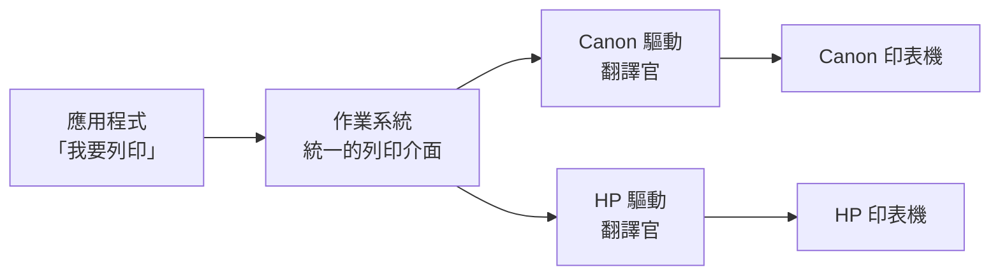

# 輸入輸出與週邊設備

> [!abstract] 這篇你會學到
> - 用**翻譯官**的比喻理解驅動程式在做什麼 ★★
> - 認得主機背後每一個接頭，知道各自能做什麼 ★★
> - 分辨 USB 各版本與 Type-C 的陷阱（**同樣的接頭，能力天差地別**）★★★
> - 看懂螢幕接頭 HDMI / DisplayPort / VGA / DVI 的差別 ★★
> - 理解**中斷、輪詢、DMA** 三種 I/O 方式 ★★
> - 排查「插上去沒反應」的裝置問題 ★★★
> - **★★★★ 認出三個會變成資安破口的週邊**：USB 孔、網路印表機、伺服器管理埠

## 前置知識

- [[010-01-02-guide-計概-主機裡面有什麼]] — 主機板上有哪些接頭
- [[010-01-08-guide-計概-作業系統是什麼]] — 作業系統的裝置管理職責

---

## 觀念說明

### ★★ 核心比喻：驅動程式是翻譯官

想像作業系統是一位**只會說中文的總管**，
而世界上有幾萬種週邊設備，每一種都說自己的方言：
Canon 印表機說 Canon 話、羅技滑鼠說羅技話。

總管不可能學會幾萬種方言。所以每一種設備自己帶一位**翻譯官** ——
那就是**驅動程式（driver）**。



> [!note] 這解釋了「抽象」的價值 ★★
> Word 說「列印」的時候，**它完全不知道你用的是哪一牌印表機**。
> 它只跟作業系統說「列印」，剩下的由驅動程式處理。
>
> 這就是作業系統提供的**抽象（abstraction）**。
> 沒有它，每一個軟體都要自己支援幾萬種印表機 —— 完全不可能。

> [!warning] ★★★★ 驅動程式跑在 kernel 裡，所以它出錯很嚴重
> 驅動程式需要直接操作硬體，所以多數跑在 **kernel mode**（最高權限）。
> 一個寫得不好的驅動程式可以：
> - 讓整台機器藍屏 / kernel panic
> - 成為攻擊者提權的入口
>
> **實務原則**：
> 1. ★★★★ 只從**官方或作業系統的套件庫**安裝驅動
> 2. ★★★★ 不要為了「舊裝置能用」而關閉驅動程式簽章驗證
> 3. ★★★ 定期更新驅動（尤其是網卡、顯示卡）
>
> 見本篇「安全性注意事項」。

---

## 三種 I/O 方式

CPU 怎麼跟週邊設備溝通？有三種方式，效率差很多。

### ★ 一、輪詢（Polling）：一直問「好了沒」

```
CPU: 好了嗎？ → 沒 → 好了嗎？ → 沒 → 好了嗎？ → 沒 → ...
```

| 特性 | 說明 |
| --- | --- |
| ★ 比喻 | 你等外送，**每三秒開門看一次** |
| ★ 優點 | 簡單、延遲低 |
| ★★ 缺點 | **極度浪費 CPU** |
| ★ 用在哪 | 極高速裝置（如高效能網卡的 DPDK）、即時系統 |

### ★★★ 二、中斷（Interrupt）：好了再叫我

```
CPU: 做別的事... → [設備：叮咚！我好了] → CPU 暫停手邊工作去處理
```

| 特性 | 說明 |
| --- | --- |
| ★ 比喻 | 你等外送，**外送員按門鈴**，你先去做別的事 |
| ★★ 優點 | **CPU 不用空等**，效率高 |
| ★★★ 缺點 | 每次中斷都有切換成本；中斷太多會拖垮系統 |
| ★★ 用在哪 | **絕大多數週邊設備**（鍵盤、滑鼠、網卡、磁碟） |

> [!example] 你按下一個鍵，發生了什麼 ★★
> 1. 鍵盤送出訊號 → 產生一個**硬體中斷**
> 2. CPU 暫停正在做的事，跳到**中斷處理常式**
> 3. 鍵盤驅動讀取按了哪個鍵
> 4. 把它放進緩衝區，通知作業系統
> 5. CPU 回到原本的工作
>
> 這整套流程在**幾微秒**內完成，一秒可以處理數千次。

```bash
# ★★ Linux 上看中斷次數：哪個裝置一直在打斷 CPU，看這裡
$ cat /proc/interrupts | head -8
           CPU0       CPU1
  1:          9          0   IO-APIC   1-edge      i8042    ← 鍵盤
 12:        156          0   IO-APIC  12-edge      i8042    ← 滑鼠
 16:     892341     883122   IO-APIC  16-fasteoi   nvme0q1  ← 硬碟
 24:   12938471   12847392   PCI-MSI  524288-edge  eth0     ← ★★★ 網卡，數字最大是正常的
```

> [!tip] 中斷數字異常高代表什麼 ★★★
> `si`（software interrupt）在 `top` 裡持續偏高，
> 通常代表**網路流量極大**（每個封包都會產生中斷）。
>
> 高流量伺服器會用兩種技術降低中斷負擔：
> - ★★ **中斷合併（interrupt coalescing）**：累積幾個封包才中斷一次
> - ★★★ **RSS / 多佇列**：把中斷分散到不同 CPU 核心
>   （★★★ 只有一顆核心在扛中斷時，那顆會先到 100%，整台機器看起來卻「還有 CPU」）
>
> 見 [[020-01-26-guide-Linux-核心模組與sysctl調校]]。

### ★★★ 三、DMA（直接記憶體存取）：不要經過我

```
沒有 DMA：磁碟 → CPU → 記憶體      （CPU 當搬運工，很累）
有  DMA：磁碟 ────────→ 記憶體      （CPU 只下指令，搬完再通知）
```

| 特性 | 說明 |
| --- | --- |
| ★ 比喻 | 你叫搬家公司**直接把箱子搬進房間**，你不用一箱一箱接手 |
| ★★ 優點 | **CPU 完全不用參與資料搬運** |
| ★★ 用在哪 | 硬碟、網卡、顯示卡等**大量資料傳輸**的裝置 |

> [!note] 沒有 DMA，現代電腦跑不動 ★★
> 一個 NVMe SSD 每秒可以傳 7 GB 的資料。
> 如果每個位元組都要 CPU 搬一次，CPU 就什麼別的都不用做了。
>
> DMA 讓 CPU 只需要說「把這段資料搬到那裡」，
> 然後就去做別的事，搬完再收到一個中斷通知。

> [!warning] ★★★★ DMA 也是資安風險
> 因為 DMA 裝置可以**繞過 CPU 直接讀寫記憶體**，
> 惡意的 DMA 裝置（如改裝過的 Thunderbolt 裝置、PCIe 卡）
> 可以直接讀取整個記憶體內容 —— 包括加密金鑰。
> 這類攻擊統稱 **DMA attack**。
>
> **防護**：★★★★ 現代系統用 **IOMMU**（Intel VT-d / AMD-Vi）
> 限制每個裝置只能存取被允許的記憶體範圍。
> ★★★★ 高安全環境還應在 BIOS 中**停用未使用的 Thunderbolt / PCIe 熱插拔**。

---

## 認識主機背後的每一個孔

### ★★★ USB：最通用的介面

> [!danger] ★★★ USB 最大的坑：接頭形狀 ≠ 能力
> **Type-C 只是形狀，不代表速度或功能。**
> 兩條長得一模一樣的 Type-C 線，能力可能差十倍。

| 世代名稱 | 速度 | 常見標示顏色 |
| --- | --- | --- |
| ★ USB 2.0 | 480 Mbps（60 MB/s） | 黑色或白色 |
| ★★★ USB 3.0 / 3.1 Gen1 / **3.2 Gen1** | 5 Gbps | **藍色** |
| ★★ USB 3.1 Gen2 / **3.2 Gen2** | 10 Gbps | 藍綠色（Teal） |
| ★ USB 3.2 Gen2x2 | 20 Gbps | — |
| ★★★ **USB4 / Thunderbolt 3/4** | 40 Gbps | 有閃電或 4 的標誌 |

> [!warning] USB 命名是業界公認的災難 ★★
> USB-IF 曾經多次把舊規格**重新命名**，
> 導致同一個速度有三、四個名字（如 5 Gbps 曾叫 USB 3.0、3.1 Gen1、3.2 Gen1）。
>
> ★★★ **買東西時只認速度數字（5Gbps / 10Gbps / 40Gbps），不要看世代名稱。**

**一條 Type-C 線可能支援也可能不支援**：

| 功能 | 說明 |
| --- | --- |
| ★★★ 資料傳輸 | 有些線**只能充電，完全不能傳資料** |
| ★★★ 供電瓦數 | 60W？100W？240W？（線材內的晶片決定；瓦數不足的線接 65W 筆電會邊用邊掉電） |
| ★★★ **DP Alt Mode** | 能不能接螢幕 |
| ★★ **Thunderbolt** | 能不能接外接顯卡、高速外接盒 |

> [!tip] ★★★ 「這條線接螢幕沒反應」的最常見原因
> 那條 Type-C 線**不支援 DP Alt Mode**，或者
> 你的筆電那個 Type-C 孔**不支援影像輸出**。
>
> 檢查方法：看**孔位旁邊的標誌**
> - ★★★ `D` 或 `DP` 字樣 → 支援影像
> - ★★★ 閃電符號 ⚡ → Thunderbolt（一定支援影像）
> - ★★★ 什麼都沒有 → 可能只能傳資料與充電
>
> 這是機關 IT 人員最常被問的問題之一。

### ★★ 螢幕接頭

| 接頭 | 訊號 | 音訊 | 最高支援（常見） | 現況 |
| --- | --- | --- | --- | --- |
| ★★ **VGA**（藍色梯形，15 針） | **類比** | ❌ | 1920×1080（畫質會衰減） | 老舊，逐步淘汰 |
| ★ **DVI**（白色，多針） | 數位 | ❌ | 1920×1200 / 2560×1600(DL) | 過渡期產物 |
| ★★★ **HDMI** | 數位 | ✅ | 4K@60（2.0）、8K（2.1） | **最普及** |
| ★★★ **DisplayPort** | 數位 | ✅ | 4K@120、8K | **電腦螢幕首選** |
| ★★★ **USB-C (DP Alt)** | 數位 | ✅ | 同 DP | 筆電常見 |

> [!tip] DisplayPort 有一個 HDMI 沒有的功能：菊鏈 ★★
> **MST（Multi-Stream Transport）** 讓你用**一條線串接多台螢幕**：
> ```
> 電腦 ──DP──> 螢幕1 ──DP out──> 螢幕2
> ```
> 適合需要多螢幕的工作站。HDMI 不支援這個。

> [!warning] ★★★ VGA 是類比訊號
> 這代表：
> - ★★★ **線材品質直接影響畫質**（長距離會模糊、有雜訊）
> - ★★ 解析度越高衰減越明顯
> - ★★ 需要數位↔類比轉換，可能有色偏
>
> 機關的舊投影機、舊螢幕還很多 VGA。
> ★★★ **HDMI 轉 VGA 需要主動式轉接器**（含轉換晶片），
> 被動式的轉接頭是不會動的 —— 因為要做數位轉類比。
>
> 反過來，**VGA 轉 HDMI 更麻煩**（類比轉數位），
> 轉接器更貴、畫質更差。能換設備就換設備。

### ★★★ 網路孔（RJ45）

| 標準 | 速度 | 需要的線材 |
| --- | --- | --- |
| ★ 10BASE-T | 10 Mbps | Cat3 以上 |
| ★★ 100BASE-TX | 100 Mbps | **Cat5** 以上 |
| ★★★★ **1000BASE-T** | **1 Gbps** | **Cat5e** 以上 |
| ★★ 2.5GBASE-T | 2.5 Gbps | Cat5e（短距離）／Cat6 |
| ★★★ 10GBASE-T | 10 Gbps | **Cat6a** 以上（Cat6 限 55m） |

> [!tip] ★★★ 「網路很慢」的一個常見原因：線材
> 一條老舊的 **Cat5**（不是 5e）網路線，
> 就算兩端都是 Gigabit 設備，也**只能跑到 100 Mbps**。
>
> ```bash
> # ★★★ Linux：看實際協商到的速度（不是看設定值，是看真的談成什麼）
> $ sudo ethtool eth0 | grep -E 'Speed|Duplex'
>         Speed: 100Mb/s          ← ★★★ 應該是 1000Mb/s！
>         Duplex: Full
> ```
> ```powershell
> # Windows
> Get-NetAdapter | Select-Object Name, LinkSpeed
> ```
>
> 看到 100Mb/s 就該檢查：線材規格、水晶頭壓接品質、交換器埠設定。
> 詳見 [[010-02-04-guide-網概-線材與實體層]]。

### ★★ 其他常見接頭

| 接頭 | 用途 |
| --- | --- |
| ★ **3.5mm 音源孔** | 綠=喇叭、粉紅=麥克風、藍=線路輸入 |
| ★ **PS/2**（紫/綠圓形） | 老式鍵盤滑鼠，仍見於工業電腦與伺服器 |
| ★★★ **RS-232 / DB9 序列埠** | **網路設備 Console、UPS、工控設備** |
| ★ **eSATA** | 外接 SATA 硬碟（已被 USB 取代） |
| ★★★★★ **IPMI / iDRAC / iLO 專用網路孔** | **伺服器的遠端管理埠**（接錯網段等於把整台機器交出去） |

> [!tip] ★★★ 序列埠（Console）對網管人員仍然重要
> 交換器、路由器、防火牆第一次設定時，**沒有網路可以連**，
> 只能用 Console 線接上去。
>
> 現代做法是用 **USB 轉 RS-232 轉接器**（常見晶片：FTDI、Prolific、CH340），
> 加上 Cisco 的 RJ45 Console 線。
>
> ```bash
> # ★★ Linux：接上後會出現這個裝置
> $ ls /dev/ttyUSB*
> /dev/ttyUSB0
>
> # ★★★ 用 screen 或 minicom 連線（9600-8-N-1 是標準設定，鮑率錯了畫面就是亂碼）
> $ sudo screen /dev/ttyUSB0 9600
> ```
> 詳見 [[040-01-04-guide-網路設備-交換器初次設定與連線方式]]。

> [!warning] ★★★★★ 伺服器的管理埠是資安重點
> IPMI／iDRAC／iLO 這類**帶外管理（out-of-band management）**介面
> 可以在作業系統關機的情況下開關機、掛載虛擬光碟、看螢幕畫面 ——
> **等於實體接觸這台機器的權限**。
>
> 它們必須：
> - ★★★★★ 放在**獨立的管理 VLAN**，絕不能連到網際網路
>   （管理埠被打下來 = 對方可以重開機、掛載映像、看你的主控台畫面，作業系統上的一切防護全部繞過）
> - ★★★★ 改掉預設密碼（很多廠商的預設帳密是公開的）
> - ★★★★ 韌體保持更新（這類韌體歷史上有多個嚴重漏洞）
>
> 見 [[010-02-16-guide-網概-VLAN與網路分段]] 與 `31-機房與硬體管理`。

---

## 完整實戰範例

### ★★★ Linux：列出所有裝置

```bash
# ★★★ PCIe 裝置（顯示卡、網卡、RAID 卡、音效卡）
$ lspci
00:02.0 VGA compatible controller: Intel Corporation UHD Graphics 770
00:1f.6 Ethernet controller: Intel Corporation Ethernet Connection I219-LM
01:00.0 Non-Volatile memory controller: Samsung NVMe SSD Controller

# ★★★★ 看某個裝置用了哪個驅動 —— 沒有 driver in use 就是驅動沒掛上
$ lspci -k -s 00:1f.6
00:1f.6 Ethernet controller: Intel Corporation Ethernet Connection I219-LM
        Subsystem: Dell Device 0a5d
        Kernel driver in use: e1000e        ← ★★★★ 正在用的驅動（這行不見＝裝置認得但不能用）
        Kernel modules: e1000e              ← ★★ 可用的驅動模組

# USB 裝置
$ lsusb
Bus 002 Device 003: ID 046d:c52b Logitech, Inc. Unifying Receiver
Bus 001 Device 004: ID 0781:5583 SanDisk Corp. Ultra Fit

# ★★★ USB 樹狀結構（看接在哪個 hub、什麼速度）
$ lsusb -t
/:  Bus 02.Port 1: Dev 1, Class=root_hub, Driver=xhci_hcd/4p, 10000M
    |__ Port 2: Dev 3, If 0, Class=Human Interface Device, Driver=usbhid, 12M
                                                                          ^^^
                                                              這個只跑 12M(USB1.1)

# 區塊裝置（磁碟）
$ lsblk

# 輸入裝置
$ cat /proc/bus/input/devices | grep -i name

# ★★ 所有硬體總覽
$ sudo lshw -short
```

### ★★★★ 排查「插上去沒反應」

```bash
# ★★★★ 步驟 1：系統有沒有偵測到？（插上裝置的當下執行）
$ sudo dmesg -w
# 插上 USB 隨身碟，應該會看到：
[12345.678] usb 2-2: new SuperSpeed USB device number 5 using xhci_hcd
[12345.689] usb-storage 2-2:1.0: USB Mass Storage device detected
[12345.712] sd 6:0:0:0: [sdb] 60063744 512-byte logical blocks: (30.8 GB)
```

| dmesg 顯示 | 診斷 |
| --- | --- |
| ★★★★ **完全沒有新訊息** | 硬體層面沒接上：線、孔、裝置本身有問題 |
| ★★★ 有偵測到但沒有 `sdb` 之類的裝置 | 驅動問題 |
| ★★★ 有裝置但掛不上 | 檔案系統問題（見 [[010-01-07-guide-計概-磁碟格式化與RAID入門]]） |
| ★★★★ `device descriptor read/64, error -71` | 供電不足或線材品質差 |

```bash
# ★★★ 步驟 2：確認裝置節點出現了
$ lsblk
$ ls /dev/sd*

# ★★★ 步驟 3：確認驅動載入了
$ lspci -k | grep -A3 該裝置
$ lsmod | grep 驅動名

# ★★ 步驟 4：手動載入驅動
$ sudo modprobe 驅動名
```

### ★★ Windows：裝置管理員

```powershell
# ★★★ 列出有問題的裝置（黃色驚嘆號）
Get-PnpDevice | Where-Object Status -ne 'OK' |
    Select-Object Status, Class, FriendlyName, InstanceId

# ★★★ 列出所有網路卡與速度
Get-NetAdapter | Select-Object Name, InterfaceDescription, Status, LinkSpeed

# 看驅動版本
Get-PnpDevice -Class Net | Get-PnpDeviceProperty -KeyName DEVPKEY_Device_DriverVersion

# 列出所有 USB 裝置
Get-PnpDevice -Class USB | Select-Object Status, FriendlyName
```

圖形介面：`devmgmt.msc`（裝置管理員）

> [!tip] 裝置管理員的黃色驚嘆號代表什麼 ★★★
> | 標記 | 意思 |
> | --- | --- |
> | ★★★ ⚠️ 黃色驚嘆號 | 驅動有問題或沒裝 |
> | ★★★ ❓ 其他裝置 | 系統認得有東西但不知道是什麼 → 缺驅動 |
> | ★★ ⬇️ 向下箭頭 | 裝置被停用 |
> | ★★★★ 完全沒出現 | 硬體沒接好，或已被 BIOS 停用 |

### ★★★★ 情境：新到的工作站，週邊一次驗收

機關採購一批工作站，交機當天要在幾分鐘內確認每一台的週邊都正常。
重點不是「開得起來」，而是抓出那些**現在勉強能用、一兩個月後才出包**的狀況：
USB 孔只協商到 2.0、網路卡只談到 100M、螢幕接在主機板而不是獨立顯示卡、
記憶卡讀卡機根本沒驅動。這些交機當下不抓，之後都會變成報修單。

把下面這支腳本放到 `/usr/local/bin/peripheral-check.sh`，每台跑一次、把報告留檔。

```bash
#!/usr/bin/env bash
# peripheral-check.sh —— 工作站週邊驗收（Ubuntu / Debian 主線）
# 用法：sudo peripheral-check.sh [報告輸出路徑]
set -euo pipefail

OUT="${1:-/tmp/peripheral-$(hostname -s)-$(date +%F).txt}"
FAIL=0

section() { printf '\n===== %s =====\n' "$1" | tee -a "$OUT"; }
ok()      { printf '  [OK]   %s\n'  "$1" | tee -a "$OUT"; }
bad()     { printf '  [FAIL] %s\n'  "$1" | tee -a "$OUT"; FAIL=1; }
# ★★★★ bad() 只記錄不中斷 —— 驗收要一次把所有問題抓完，不是遇到第一個就停

require_root() {
  # ★★★ lspci -k / ethtool / dmidecode 少了 root 會缺一半資訊，寧可早點失敗
  [[ ${EUID} -eq 0 ]] || { echo "請用 sudo 執行" >&2; exit 2; }
}

check_driver_gaps() {
  section "沒有掛上驅動的 PCIe 裝置"
  # ★★★★ 「認得到但沒有 Kernel driver in use」＝ 裝置在、驅動不在，最容易被漏掉
  local gaps
  gaps=$(lspci -k | awk '/^[0-9a-f]{2}:/{dev=$0; used=0}
                         /Kernel driver in use/{used=1}
                         /^$/{if(dev!=""&&used==0) print dev; dev=""}')
  if [[ -z "${gaps}" ]]; then
    ok "所有 PCIe 裝置都有對應驅動"
  else
    bad "以下裝置沒有載入驅動："
    printf '%s\n' "${gaps}" | tee -a "$OUT"
  fi
}

check_usb_speed() {
  section "USB 協商速度"
  # ★★★ lsusb -t 最右邊那欄是「這次實際協商到的速度」，不是接頭規格
  if lsusb -t | grep -qE '(5000M|10000M|20000M|40000M)'; then
    ok "有裝置協商到 USB 3.x 以上"
  else
    bad "沒有任何裝置跑在 USB 3.x —— 可能全插在黑色 2.0 孔，或線材只有 2.0"
  fi
  lsusb -t >> "$OUT"
}

check_nic_speed() {
  section "網卡協商速度"
  local nic speed
  nic=$(ip route | awk '/default/{print $5; exit}')
  [[ -n "${nic:-}" ]] || { bad "找不到預設路由的網卡"; return 0; }
  speed=$(ethtool "$nic" 2>/dev/null | awk -F': ' '/Speed:/{print $2}')
  case "$speed" in
    1000Mb/s|2500Mb/s|10000Mb/s) ok "$nic 協商到 $speed" ;;
    # ★★★★ 100Mb/s 在 Gigabit 環境幾乎一定是線材或水晶頭，不是網卡壞了
    100Mb/s) bad "$nic 只有 100Mb/s —— 先換 Cat5e 以上的線再說" ;;
    *)       bad "$nic 速度異常或未連線：${speed:-未知}" ;;
  esac
}

check_display() {
  section "螢幕輸出"
  # ★★★ connected 的數量要等於實際接上的螢幕數；接在內顯的機器這裡只會看到內顯的埠
  local n
  n=$(find /sys/class/drm -name 'status' -exec grep -l '^connected$' {} + 2>/dev/null | wc -l)
  if [[ "$n" -ge 1 ]]; then ok "偵測到 ${n} 個已連線的顯示輸出"
  else bad "沒有偵測到任何顯示輸出（遠端執行時屬正常，現場執行時要追查）"; fi
}

check_recent_errors() {
  section "開機以來的硬體錯誤訊息"
  # ★★★★ error -71 / reset high-speed 是供電或線材問題的招牌訊號
  if dmesg | grep -qiE 'error -71|error -32|reset .*device|I/O error'; then
    bad "dmesg 有硬體層錯誤，見報告檔"
    dmesg | grep -iE 'error -71|error -32|reset .*device|I/O error' | tail -20 >> "$OUT"
  else
    ok "dmesg 沒有硬體層錯誤"
  fi
}

main() {
  require_root
  : > "$OUT"
  printf '週邊驗收報告：%s  %s\n' "$(hostname -f)" "$(date '+%F %T')" | tee -a "$OUT"
  check_driver_gaps
  check_usb_speed
  check_nic_speed
  check_display
  check_recent_errors
  section "結果"
  if [[ "$FAIL" -eq 0 ]]; then
    ok "全部通過；報告：$OUT"
  else
    # ★★★★ 用 exit code 讓交機流程能自動擋下不合格的機器
    bad "有項目未通過，請勿簽收；報告：$OUT"
    exit 1
  fi
}

main "$@"
```

驗證與回滾：這支腳本**只讀不寫**（除了它自己的報告檔），沒有任何回滾需求；
要停用只要刪掉檔案即可。若要納入交機流程，用 `echo $?` 收 exit code：
`0` 代表可簽收、`1` 代表有問題、`2` 代表沒用 sudo 跑。

**驗收檢查表**

| 檢查項 | 指令 | 預期結果 |
| --- | --- | --- |
| ★★★★ 所有裝置都有驅動 | `sudo lspci -k \| grep -c 'driver in use'` | 數字接近 `lspci \| wc -l` |
| ★★★ USB 3.x 可用 | `lsusb -t \| grep 5000M` | 至少一列 |
| ★★★★ 網路是 Gigabit | `sudo ethtool <nic> \| grep Speed` | `Speed: 1000Mb/s` |
| ★★★ 螢幕數量正確 | `grep -l connected /sys/class/drm/*/status \| wc -l` | 等於實際接上的台數 |
| ★★★★ 無硬體錯誤 | `dmesg \| grep -icE 'error -71\|I/O error'` | `0` |
| ★★★ 音效輸出存在 | `aplay -l \| grep card` | 至少一張音效卡 |
| ★★★★ 報告已留檔 | `ls -l /tmp/peripheral-*.txt` | 檔案存在並附進交機文件 |

> [!tip] ★★★ 為什麼驗收要留報告檔
> 交機三個月後使用者說「USB 一直斷線」，你需要證明**交機當下是正常的**，
> 才分得清是設備瑕疵（找廠商）還是使用環境問題（換線、換 Hub）。
> 沒有交機當下的紀錄，這種爭議只能各說各話。

---

## 常見錯誤與排錯

| 現象 | 原因 | 解法 |
| --- | --- | --- |
| ★★★ Type-C 接螢幕沒畫面 | 線材或孔位不支援 **DP Alt Mode** | 看孔位標誌（DP/⚡）；換支援影像的線 |
| ★★ Type-C 線只能充電不能傳資料 | 買到充電專用線 | 確認規格寫「支援資料傳輸」與速度 |
| ★★ USB 3.0 隨身碟只有 USB 2.0 速度 | 插到黑色（USB 2.0）孔 | 插藍色孔；用 `lsusb -t` 確認協商速度 |
| ★★★ Gigabit 網路只跑 100Mbps | 線材是 Cat5 或水晶頭壓接不良 | 換 Cat5e/Cat6；`ethtool` 確認協商速度 |
| ★★ HDMI 轉 VGA 沒畫面 | 用了被動式轉接頭 | 需要**主動式**（含晶片）轉換器 |
| ★★★★ 外接硬碟時斷時續 | **USB 供電不足** | 用有外接電源的 USB Hub；換供電較足的孔 |
| ★★ 裝置管理員出現「其他裝置」 | 缺少驅動 | 到裝置製造商官網下載；或 Windows Update |
| ★★ 印表機列印亂碼或跑一堆白紙 | 驅動不符（如用了錯誤的 PCL/PS 驅動） | 安裝該型號的正確驅動 |
| ★★★★ 藍屏指向某個 `.sys` 檔案 | 該驅動程式有 bug 或不相容 | 回復到舊版驅動；或更新到新版 |
| ★★★ 交換器 Console 連不上 | 序列埠參數錯誤或缺 USB 轉序列驅動 | 確認 **9600-8-N-1**；安裝 FTDI/CH340 驅動 |
| ★★ Linux 上插隨身碟沒反應 | 檔案系統不支援或沒有自動掛載 | `dmesg -w` 看有沒有偵測到；手動 `mount` |
| ★★★ USB 裝置報 `error -71` | 供電不足、線太長、線材品質差 | 換短一點的優質線；用有電源的 Hub |
| ★ 兩台螢幕只能複製不能延伸 | 顯示輸出能力不足或設定問題 | 檢查顯示卡支援幾個輸出；調整顯示設定 |

### 排查步驟

週邊問題有一條固定的分流順序：**實體層 → 供電 → 驅動 → 裝置節點 → 應用層**。
順序顛倒（例如一開始就重灌驅動）是最常見的浪費時間方式。

**★★★★ 【1】先確定系統「看不看得到」這個裝置**

開一個終端機常駐監看，然後當場插拔一次：

```bash
sudo dmesg -w
```

```text
[12345.678] usb 2-2: new SuperSpeed USB device number 5 using xhci_hcd
[12345.689] usb-storage 2-2:1.0: USB Mass Storage device detected
```

- 有這兩行 → 實體層沒問題，跳到【3】
- ★★★★ **插拔完全沒有任何新訊息** → 問題在**實體層**（線、孔、裝置本身），
  往【2】走；此時去重裝驅動、重開機、換作業系統**都不會有幫助**
- 只有 `new ... device` 卻沒有後面的 `detected` → 驅動沒接手，跳到【3】

**★★★ 【2】把實體層拆成三個變因，一次只換一個**

```bash
lsusb -t
```

```text
/:  Bus 002.Port 1: Dev 1, Class=root_hub, Driver=xhci_hcd/4p, 10000M
    |__ Port 2: Dev 3, If 0, Class=Mass Storage, Driver=usb-storage, 480M
```

- 換**另一個孔**（優先換主機背面直接焊在主機板上的孔，不要用前面板或延長 Hub）
- 換**另一條線**（Type-C 尤其要換；充電專用線沒有資料腳位）
- 換**另一台電腦**試同一個裝置
- ★★★ 最後一欄 `480M` 表示只協商到 USB 2.0；插在藍色孔卻顯示 `480M`，
  九成是線材只有 2.0 的四芯

**★★★★ 【3】供電不足：時斷時續、大檔案複製到一半失敗**

```bash
dmesg | grep -iE 'error -71|error -32|over-current|reset high-speed'
```

```text
[  842.113] usb 1-3: device descriptor read/64, error -71
[  842.331] usb 1-3: reset high-speed USB device number 4 using xhci_hcd
```

- ★★★★ 看到 `error -71` 或反覆 `reset` → **供電或線材品質**，不是檔案系統壞掉。
  換有外接電源的 USB Hub、換短一點的線；2.5 吋外接硬碟用 Y 型雙頭線供電
- ★★★★ 這種狀況**不要繼續寫入資料** —— 傳到一半斷線會讓檔案系統進入不一致狀態
- 完全沒有這類訊息 → 供電正常，跳到【4】

**★★★ 【4】裝置在、驅動不在**

```bash
sudo lspci -k -s 01:00.0
```

```text
01:00.0 Network controller: Realtek Semiconductor Co., Ltd. RTL8852BE
        Subsystem: Lenovo Device 4852
        Kernel modules: rtw89_8852be
```

- ★★★★ **沒有 `Kernel driver in use:` 這一行** → 系統認得這個裝置，
  但**沒有任何驅動接手**，所以它在使用者眼中等於不存在
- 有 `Kernel modules:` 卻沒有 `driver in use` → 模組存在但沒載入：

```bash
sudo modprobe rtw89_8852be && lspci -k -s 01:00.0 | grep 'driver in use'
```

```text
        Kernel driver in use: rtw89_8852be
```

- 連 `Kernel modules:` 都沒有 → ★★★ 核心裡沒有這個驅動，要裝廠商套件或
  `linux-firmware`、`linux-modules-extra-$(uname -r)`（見
  [[020-01-26-guide-Linux-核心模組與sysctl調校]]）

**★★★ 【5】驅動有了，但裝置節點沒出現**

```bash
lsblk -o NAME,SIZE,TYPE,FSTYPE,MOUNTPOINT
```

```text
sdb           30.8G disk
└─sdb1        30.8G part exfat
```

- 有 `sdb` 沒有 `sdb1` → ★★★ 分割表是空的或壞的（見
  [[010-01-07-guide-計概-磁碟格式化與RAID入門]]）
- 有 `sdb1` 但 `FSTYPE` 空白 → ★★★ 檔案系統核心不認得（常見是 NTFS 缺 `ntfs-3g`、
  exFAT 缺 `exfatprogs`）
- 有 `FSTYPE` 但 `MOUNTPOINT` 空白 → 只是沒自動掛載，手動 `sudo mount /dev/sdb1 /mnt`

**★★★ 【6】影像與網路的專屬分流**

螢幕沒畫面：

```bash
for f in /sys/class/drm/*/status; do echo "$f: $(cat "$f")"; done
```

```text
/sys/class/drm/card0-DP-1/status: connected
/sys/class/drm/card0-HDMI-A-1/status: disconnected
```

- `disconnected` → ★★★ 訊號根本沒進來：線、孔、或 Type-C 不支援 DP Alt Mode
- `connected` 卻黑畫面 → ★★ 螢幕的**輸入源選錯**，或解析度／更新率超出螢幕能力

網路速度不對：

```bash
sudo ethtool "$(ip route | awk '/default/{print $5; exit}')" | grep -E 'Speed|Duplex|Auto-negotiation'
```

```text
        Speed: 100Mb/s
        Duplex: Full
        Auto-negotiation: on
```

- ★★★★ `Auto-negotiation: on` 卻只有 100Mb/s → **線材或水晶頭**，換 Cat5e 以上；
  換交換器前先換線，順序反了會白花一整天
- `Auto-negotiation: off` → ★★★ 交換器或本機被手動鎖速率，解掉鎖定重新協商
- `Duplex: Half` → ★★★★ 半雙工在 Gigabit 環境是異常，會伴隨大量碰撞與封包重傳

---

## 安全性注意事項

> [!danger] ★★★★ USB 是機關資安最大的物理破口
> **常見攻擊手法**：
>
> | 手法 | 說明 |
> | --- | --- |
> | ★★★★ **惡意隨身碟** | 故意丟在停車場，等人撿去插電腦。中招率高得驚人 |
> | ★★★★ **BadUSB** | 韌體被改過的隨身碟，插上去後**偽裝成鍵盤**，自動打指令 |
> | ★★★★ **USB Killer** | 瞬間放出高壓，**實體燒毀主機板**（機器直接報廢，資料一起陪葬） |
> | ★★★★★ **資料外洩** | 內部人員把機密資料複製走（機關個資外洩案最常見的一條路） |
>
> **防護做法**：
> 1. ★★★★ **群組原則（GPO）停用 USB 儲存裝置**，或設為唯讀
>    → 見 `20-Windows系統管理` 的群組原則章節
> 2. ★★★★ Linux 上用 `USBGuard` 建立白名單
> 3. ★★★★ **教育訓練**：撿到的隨身碟一律不插（見 [[090-07-12-guide-資安實踐-資安意識與社交工程防範]]）
> 4. ★★★ 需要交換檔案時，走**檔案伺服器或安全傳輸平台**，不用隨身碟
> 5. ★★ 高機密環境用**環氧樹脂封住 USB 孔**（真的有機關這樣做）

```bash
# ★★★★ Linux：用 USBGuard 建立白名單
$ sudo apt install usbguard
$ sudo usbguard generate-policy > /etc/usbguard/rules.conf   # ★★★★ 以目前接著的裝置為基準
                                                             #   遠端做這步前務必確認鍵盤已在清單內
$ sudo systemctl enable --now usbguard
$ sudo usbguard list-devices                                 # ★★★ 之後新插的裝置預設被擋
```

> [!warning] ★★★★ BadUSB 為什麼特別難防
> 一般的防毒只檢查**隨身碟裡的檔案**。
> BadUSB 改的是**隨身碟的韌體**，讓它對電腦宣稱自己是一個**鍵盤**。
>
> 電腦不會懷疑鍵盤 —— 於是那個「鍵盤」在你眼前用 0.5 秒
> 打開 PowerShell、下載惡意程式、執行、關閉視窗。
>
> ★★★★ **防毒軟體完全攔不到，因為沒有檔案被寫入。**
>
> 這就是為什麼防護必須在**裝置層級**（GPO 停用、USBGuard 白名單），
> 而不是檔案層級。

> [!warning] ★★★★ 印表機是被遺忘的攻擊面
> 現代網路印表機是一台**完整的 Linux 電腦**，有 CPU、記憶體、硬碟、網路。
> 但它常常：
> - ★★★★ 用預設密碼（甚至沒有密碼）
> - ★★★ 韌體從來沒更新過
> - ★★★ 直接接在辦公網段，沒有隔離
> - ★★★★★ **硬碟裡存著所有印過的文件**（人事令、健保資料、標案文件全在裡面）
>
> **必做**：
> 1. ★★★★ 改掉管理介面的預設密碼
> 2. ★★★ 關閉不需要的服務（Telnet、FTP、SNMP v1/v2c）
> 3. ★★★ 放進**獨立 VLAN**，只開放必要的列印埠
> 4. ★★★ 韌體納入定期更新
> 5. ★★★★★ **報廢前務必清除內建硬碟**（跟電腦硬碟一樣重要；財產報廢流程要把這步寫進去）

> [!tip] ★★★★ 驅動程式的安全原則
> 1. ★★★★ **只從官方來源安裝**。「驅動精靈」這類第三方工具常夾帶廣告軟體
> 2. ★★★★ **不要停用驅動程式簽章驗證**。Windows 的簽章要求是重要防線
> 3. ★★★ 舊裝置沒有新版驅動時，**評估汰換**，不要為它降低整台機器的安全性
> 4. ★★★ **韌體也要更新**：主機板 BIOS/UEFI、網卡、SSD 韌體都會有安全漏洞

---

## 速查表

### ★★★ USB 速度（認數字不認世代名）

| 速度 | 常見名稱 | 顏色 |
| --- | --- | --- |
| ★ 480 Mbps | USB 2.0 | 黑/白 |
| ★★★ **5 Gbps** | USB 3.0 / 3.1 Gen1 / 3.2 Gen1 | **藍** |
| ★★ **10 Gbps** | USB 3.1 Gen2 / 3.2 Gen2 | 藍綠 |
| ★ 20 Gbps | USB 3.2 Gen2x2 | — |
| ★★★ **40 Gbps** | USB4 / Thunderbolt 3/4 | ⚡ 或 4 |

### ★★ 螢幕接頭

| 接頭 | 數位/類比 | 帶音訊 | 建議 |
| --- | --- | --- | --- |
| ★★ VGA | 類比 | ❌ | 只在舊設備上用 |
| ★ DVI | 數位 | ❌ | 過渡產物 |
| ★★★ HDMI | 數位 | ✅ | 通用首選 |
| ★★★ **DisplayPort** | 數位 | ✅ | **電腦螢幕最佳**，支援菊鏈 |
| ★★★ USB-C (DP Alt) | 數位 | ✅ | 筆電；**注意孔位是否支援** |

### ★★★ 網路線與速度

| 速度 | 最低線材 |
| --- | --- |
| ★★ 100 Mbps | Cat5 |
| ★★★★ **1 Gbps** | **Cat5e** |
| ★★★ 10 Gbps | Cat6a（Cat6 限 55m） |

### ★★★ 常用指令

| 目的 | Linux | Windows |
| --- | --- | --- |
| ★★★ PCIe 裝置 | `lspci`、`lspci -k` | 裝置管理員 |
| ★★★ USB 裝置 | `lsusb`、`lsusb -t` | `Get-PnpDevice -Class USB` |
| ★★ 磁碟 | `lsblk` | `Get-Disk` |
| ★★ 全部硬體 | `sudo lshw -short` | `msinfo32` |
| ★★★★ **即時看插拔** | **`sudo dmesg -w`** | 事件檢視器 |
| ★★★ 有問題的裝置 | `dmesg \| grep -i error` | `Get-PnpDevice \| ? Status -ne OK` |
| ★★★ 網卡速度 | `sudo ethtool eth0` | `Get-NetAdapter` |
| ★★★ 載入驅動 | `sudo modprobe 模組名` | 裝置管理員 → 更新驅動程式 |
| ★★ 中斷統計 | `cat /proc/interrupts` | 效能監視器 |
| ★★★ 序列埠連線 | `sudo screen /dev/ttyUSB0 9600` | PuTTY（Serial 模式） |

### ★★★★ 判斷準則（看到什麼就往哪裡查）

| 看到的現象 | 直接往這裡查 |
| --- | --- |
| ★★★★ `dmesg -w` 插拔完全沒訊息 | 實體層：線、孔、裝置本身 —— 不要先查驅動 |
| ★★★★ `error -71` / `-32` / 反覆 reset | 供電或線材，換有外接電源的 Hub |
| ★★★ `lspci -k` 沒有 `Kernel driver in use` | 驅動沒掛上，`modprobe` 或裝廠商驅動 |
| ★★★ `lsusb -t` 顯示 `12M` / `480M` | 插到 USB 2.0 孔，或用到 USB 2.0 線 |
| ★★★ `ethtool` 顯示 `Speed: 100Mb/s` | 線材（Cat5）、水晶頭、交換器埠鎖速 |
| ★★ 螢幕「無訊號」但電源燈亮 | 螢幕輸入源選錯、或線不支援 DP Alt Mode |
| ★★★★ 藍屏／kernel panic 指向某驅動 | 回退驅動版本，不要先換硬體 |

---

## 練習題

> [!question]- ★★ 練習 1：認識你的接頭
> 走到你的電腦後面（或看筆電側面），列出所有接頭並回答：
> 1. 有幾個 USB 孔？分別是什麼顏色（速度）？
> 2. 有哪些螢幕輸出？HDMI 還是 DisplayPort？
> 3. 網路孔旁邊的燈號代表什麼？（通常綠燈=連線、橘燈閃=有流量）
> 4. 如果有 Type-C，孔位旁邊有沒有 DP 或閃電標誌？

> [!question]- ★★★ 練習 2：即時觀察裝置插拔
> ```bash
> # 開一個終端機持續監看
> sudo dmesg -w
> ```
> 然後：
> 1. 插入一個 USB 隨身碟 → 觀察出現哪些訊息
> 2. 拔掉它 → 觀察拔除訊息
> 3. 插入滑鼠 → 比較訊息有什麼不同
>
> 記下隨身碟被指派到哪個裝置節點（`/dev/sdb` 之類），
> 以及協商到什麼速度。

> [!question]- ★★★ 練習 3：檢查網路實際速度
> ```bash
> # Linux
> sudo ethtool $(ip route | awk '/default/ {print $5; exit}') | grep -E 'Speed|Duplex|Link'
> ```
> ```powershell
> # Windows
> Get-NetAdapter | Select-Object Name, LinkSpeed, Status
> ```
> 如果顯示 100Mb/s 而不是 1000Mb/s，可能是：
> 線材是 Cat5、水晶頭壓接不良、或交換器埠設定被鎖定。
> 這是機關網路「明明是 Gigabit 卻很慢」的頭號原因。

---

## 小測驗

Q1. 用「翻譯官」的比喻說明驅動程式的角色。為什麼作業系統需要它？

Q2. 為什麼一個寫得不好的驅動程式可以讓整台電腦藍屏，但一個寫得不好的 Word 不會？

Q3. 輪詢、中斷、DMA 三種 I/O 方式各有什麼特點？各用生活比喻說明。

Q4. 為什麼說「沒有 DMA，現代電腦跑不動」？

Q5. 「Type-C 就是 USB 3.0」這句話對不對？為什麼買 Type-C 線要特別小心？

Q6. 你把筆電的 Type-C 接到螢幕卻沒畫面。請說出兩個最可能的原因與檢查方法。

Q7. 一台 Gigabit 電腦接 Gigabit 交換器，`ethtool` 卻顯示 Speed: 100Mb/s。最可能是什麼問題？

Q8. HDMI 轉 VGA 為什麼需要「主動式」轉接器而不能用便宜的被動式轉接頭？

Q9. 什麼是 BadUSB？為什麼防毒軟體攔不住它？該用什麼層級的防護？

Q10. 為什麼網路印表機是「被遺忘的攻擊面」？請列出至少四項該做的防護。

> [!question]- 測驗答案
> **Q1.** ★★ 作業系統像**只會說中文的總管**，而幾萬種週邊設備各說各的方言。
> 總管不可能學會所有方言，所以每種設備自帶一位**翻譯官（驅動程式）**。
> 這讓應用程式（如 Word）**完全不必知道你用的是哪一牌印表機** ——
> 它只要跟作業系統說「列印」，剩下由驅動處理。這就是作業系統提供的**抽象**。
> （見「核心比喻：驅動程式是翻譯官」）
>
> **Q2.** ★★★★ 因為**驅動程式多數跑在 kernel mode**（最高權限，直接操作硬體），
> 它出錯時沒有更上層可以收拾，只能整個系統停下來；
> 而 Word 跑在 **user mode**（低權限），出錯時 kernel 可以直接把它殺掉、回收資源，
> 其他程式不受影響。
> ★★★★ 實務上的推論：**驅動與韌體只從官方來源裝**，一個爛驅動就能讓整台機器躺平。
> （見「安全性注意事項」的驅動程式安全原則）
>
> **Q3.** ★★ **輪詢**：CPU 一直問「好了沒」（**每三秒開門看外送到了沒**）——
> 簡單、延遲低，但極度浪費 CPU；
> **中斷**：設備好了才通知 CPU（**外送員按門鈴**）——
> CPU 不用空等，是絕大多數設備用的方式；
> **DMA**：設備直接與記憶體傳資料，CPU 不參與搬運
> （**叫搬家公司直接把箱子搬進房間**）—— 用於大量資料傳輸。
>
> **Q4.** ★★ 因為現代 NVMe SSD 每秒可傳 **7 GB** 的資料。
> 若每個位元組都要 CPU 親自搬運，CPU 就什麼別的事都做不了。
> DMA 讓 CPU 只需下達「把這段資料搬到那裡」的指令，
> 然後去做別的事，搬完再收到一個中斷通知。
>
> **Q5.** ★★★ **不對。Type-C 只是「接頭形狀」，不代表速度或功能。**
> 買線要小心是因為外觀一模一樣的 Type-C 線，能力可能天差地別：
> 有些**只能充電不能傳資料**；支援的供電瓦數不同（60W/100W/240W）；
> 是否支援 **DP Alt Mode**（接螢幕）與 **Thunderbolt** 也各不相同。
> **應該只認速度數字（5Gbps/10Gbps/40Gbps）與功能標示，不看世代名稱。**
> （見「USB：最通用的介面」；採購線材寫規格時這點最常被漏掉 ★★★）
>
> **Q6.** ★★★ ①**那條線不支援 DP Alt Mode**（只能充電/傳資料）；
> ②**筆電那個 Type-C 孔本身不支援影像輸出**。
> 檢查方法：看**孔位旁的標誌** —— 有 `D`／`DP` 字樣或**閃電符號 ⚡**
> 才支援影像；什麼都沒有就可能只能傳資料與充電。
> 同時確認線材規格是否標明支援影像輸出。
>
> **Q7.** ★★★ 最可能是**線材規格不足或壓接品質不良** ——
> 老舊的 **Cat5**（不是 Cat5e）線只能跑 100 Mbps，
> 即使兩端都是 Gigabit 設備。
> 其次可能是水晶頭壓接不良（只通了 2 對線）或交換器埠被手動鎖定速率。
> 換成 Cat5e/Cat6 並重新確認 `ethtool` 的協商速度。
> ★★★★ 注意順序：**先看協商速度再換設備** —— 換了交換器卻沒換線，問題原封不動。
> （見「網路孔（RJ45）」與 [[010-02-04-guide-網概-線材與實體層]]）
>
> **Q8.** ★★ 因為 **HDMI 是數位訊號、VGA 是類比訊號**，
> 中間必須有晶片做**數位轉類比（DAC）**的實際轉換，而這需要供電。
> 被動式轉接頭只是把針腳接通，沒有轉換能力，所以完全不會動。
> （早期某些顯示卡的 DVI 埠同時輸出類比訊號，DVI-I 轉 VGA 才能用被動式。）
>
> **Q9.** ★★★★ **BadUSB** 是韌體被竄改過的 USB 裝置，
> 插上電腦後**對系統宣稱自己是一個鍵盤**，然後在零點幾秒內
> 自動打指令開啟 PowerShell、下載並執行惡意程式。
> **防毒攔不住**是因為**沒有任何檔案被寫入磁碟**，防毒只檢查檔案。
> 所以防護必須在**裝置層級**：
> 用 GPO 停用 USB 儲存／限制裝置類型，Linux 用 **USBGuard 建立白名單**。
> ★★★★ 這也是為什麼「先掃毒再插」不是有效防護 —— 掃毒掃的是檔案，BadUSB 沒有檔案。
> （見「安全性注意事項」）
>
> **Q10.** ★★★★ 因為現代網路印表機其實是一台**完整的 Linux 電腦**
> （有 CPU、記憶體、硬碟、網路），但通常用預設密碼、韌體從未更新、
> 直接接在辦公網段，而且**硬碟裡存著所有印過的文件**。
> 四項防護：
> ①**改掉管理介面的預設密碼**；
> ②**關閉不需要的服務**（Telnet、FTP、SNMP v1/v2c）；
> ③放進**獨立 VLAN**，只開放必要的列印埠；
> ④**韌體納入定期更新**；
> ⑤**報廢前務必清除內建硬碟**。
> ★★★★★ 第⑤項最常被忽略：機關財產報廢流程若沒把印表機硬碟寫進去，
> 等於把所有印過的公文與個資一起送出大門。（見「安全性注意事項」）

---

## 延伸閱讀

- [[010-01-02-guide-計概-主機裡面有什麼]] — 主機板上的接頭位置
- [[010-01-08-guide-計概-作業系統是什麼]] — 裝置管理與驅動程式
- [[010-02-04-guide-網概-線材與實體層]] — 網路線與光纖的完整說明
- [[020-01-27-cmd-Linux-硬體資訊與裝置管理]] — Linux 硬體管理實戰（進階）
- [[020-01-26-guide-Linux-核心模組與sysctl調校]] — 驅動模組與中斷調校（進階）
- [[040-01-04-guide-網路設備-交換器初次設定與連線方式]] — Console 線實戰（進階）
- [[090-05-15-guide-資安設備-實體與OT-IoT安全設備]] — 實體層資安（進階）
