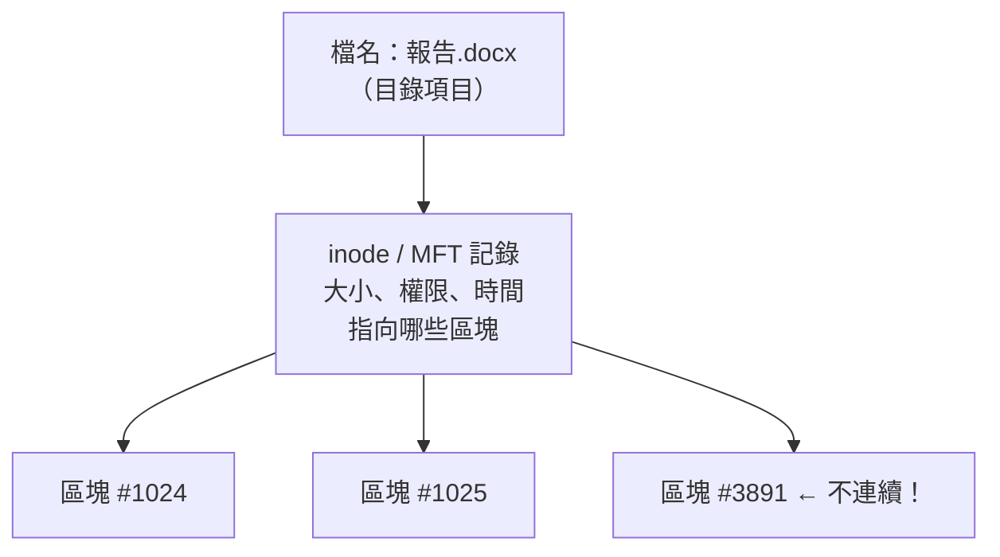

# 磁碟格式化、RAID 與 NAS 入門

> [!abstract] 這篇你會學到
> - 用**圖書館**的比喻理解「格式化」到底做了什麼
> - 分辨 FAT32 / NTFS / exFAT / ext4 的用途與限制，知道隨身碟該用哪個
> - **為什麼格式化過的硬碟，資料還救得回來**（以及這件事的資安意義）
> - 看懂 RAID 0 / 1 / 5 / 6 / 10 的容量、速度與容錯，會自己算
> - 理解「**RAID 不是備份**」這句話為什麼這麼重要
> - 知道 NAS 是什麼、跟外接硬碟差在哪、什麼時候該買

## 前置知識

- [[06-計概-記憶體與儲存階層]] — 硬碟在儲存階層中的位置
- [[03-計概-0與1和資料單位]] — 容量單位換算

---

## 觀念說明

### 核心比喻：硬碟是一座空的圖書館

想像你買了一棟空建築要當圖書館。裡面只有空蕩蕩的書架，什麼都沒有。

要讓它能用，你得做三件事：

| 步驟 | 圖書館 | 硬碟 |
| --- | --- | --- |
| 1 | 把建築劃分成幾個區域（一樓兒童區、二樓文學區） | **分割（partition）** |
| 2 | 決定用哪一套編目法（杜威十進位？中文圖書分類法？） | **格式化成某種檔案系統** |
| 3 | 開始放書 | 存檔案 |

> [!note] 分割與格式化是兩件事
> 這是新手常搞混的地方。
> - **分割**：把一顆實體硬碟切成好幾塊，每一塊在系統看起來像獨立的磁碟
>   （Windows 的 C:、D: 槽；Linux 的 `/dev/sda1`、`/dev/sda2`）
> - **格式化**：在某一塊分割上建立**檔案系統**，也就是那套「編目規則」
>
> 一顆硬碟可以切成三個分割，每個分割用不同的檔案系統。

### 格式化到底做了什麼

**格式化不是「把東西擦掉」，而是「重新建立一本目錄」。**

一個檔案系統至少要記錄：

| 記錄什麼 | 圖書館比喻 |
| --- | --- |
| 有哪些檔案、叫什麼名字 | 館藏目錄 |
| 每個檔案存在哪些位置 | 書放在幾樓第幾排第幾格 |
| 哪些空間還沒用 | 哪些書架還空著 |
| 檔案的權限、建立時間、大小 | 借閱限制、入館日期、頁數 |

**格式化 = 把這本目錄清空重寫。**

> [!danger] 這就是為什麼「格式化過的資料還救得回來」
> 快速格式化只是把**目錄**清掉，**書還在架上**。
>
> 系統以為書架是空的，所以會開始把新書放上去 ——
> 只要新書還沒蓋掉舊書的位置，用救援軟體（如 PhotoRec、TestDisk）
> 掃描整個書架，就能把舊書一本一本找回來。
>
> **資安意義：報廢或轉手電腦時，快速格式化完全不足以保護資料。**
> 正確做法見本篇「安全性注意事項」。

### 快速格式化 vs 完整格式化

| | 快速格式化 | 完整格式化 |
| --- | --- | --- |
| 做什麼 | 只重建目錄 | 重建目錄 + **逐一檢查每個磁區** |
| 時間 | 幾秒 | 數十分鐘到數小時 |
| 會不會清資料 | **不會**（原資料仍可救回） | Windows 會寫入 0，Linux 視工具而定 |
| 何時用 | 平常重整磁碟 | 懷疑硬碟有壞軌時 |

---

## 常見的檔案系統

### 比較表

| 檔案系統 | 主要用在 | 單一檔案上限 | 分割上限 | 權限支援 | 跨平台 |
| --- | --- | --- | --- | --- | --- |
| **FAT32** | 老隨身碟、相機記憶卡、UEFI 開機分割 | **4 GB** | 2 TB | ❌ | ✅ 全部都認 |
| **exFAT** | **大容量隨身碟、外接硬碟** | 幾乎無限 | 幾乎無限 | ❌ | ✅ Win/Mac/Linux |
| **NTFS** | **Windows 系統碟** | 幾乎無限 | 幾乎無限 | ✅ | Mac 唯讀、Linux 需套件 |
| **ext4** | **Linux 系統碟**（最主流） | 16 TB | 1 EB | ✅ | Windows 需第三方工具 |
| **XFS** | Linux 伺服器（RHEL 預設） | 8 EB | 8 EB | ✅ | 同上 |
| **Btrfs** | Linux，支援快照 | 16 EB | 16 EB | ✅ | 同上 |
| **ZFS** | NAS、儲存伺服器 | 極大 | 極大 | ✅ | 同上 |
| **APFS / HFS+** | macOS | 極大 | 極大 | ✅ | 僅 Mac |

> [!warning] FAT32 的 4GB 限制會咬人
> 這是實務上最常遇到的坑：
> **「我的隨身碟明明還有 20GB，為什麼複製這個 5GB 的檔案說空間不足？」**
>
> 因為隨身碟是 FAT32，**單一檔案不能超過 4 GB**。
> 一部電影、一個系統映像檔、一個大型資料庫備份都很容易超過。
>
> **解法**：格式化成 **exFAT**（記得先備份，格式化會清目錄）。

> [!tip] 隨身碟／外接硬碟該用哪個？
> | 用途 | 建議 |
> | --- | --- |
> | 要在 Windows/Mac/Linux 之間互通、會放大檔案 | **exFAT** ✅ |
> | 只在 Windows 用，需要權限與加密 | NTFS |
> | 老舊設備（車用音響、相機、電視） | FAT32（相容性最好） |
> | UEFI 開機分割（EFI System Partition） | **必須是 FAT32**（規範要求） |

> [!note] 為什麼 exFAT 沒有權限功能反而是優點
> 隨身碟在不同電腦間流動，每台電腦的使用者編號都不一樣。
> 如果檔案系統記錄了「這個檔案屬於使用者 1001」，
> 插到另一台電腦上就會變成「你沒有權限開啟」。
>
> exFAT 刻意不記錄權限，所以插到哪都能讀寫 —— 這正是它適合可攜裝置的原因。
> 但也代表它**不適合當系統碟**（系統需要權限來保護檔案）。

### 一個檔案在磁碟上長什麼樣



> [!note] 檔案不一定連續存放
> 系統把檔案切成固定大小的**區塊（block／cluster）**，通常 4 KB。
> 有空位就塞，不一定連在一起。這叫**碎片化（fragmentation）**。
>
> - **HDD**：碎片化會嚴重影響效能（磁頭要跳來跳去），所以需要「磁碟重組」
> - **SSD**：沒有磁頭，隨機存取跟循序一樣快，
>   **所以 SSD 不需要也不應該做磁碟重組**（會白白消耗寫入壽命）
>
> Windows 10/11 會自動辨識 SSD，對它執行的是 TRIM 而非重組。

---

## RAID：把多顆硬碟組成一組

### 為什麼需要 RAID

單顆硬碟有兩個問題：
1. **會壞**。硬碟是有壽命的消耗品，壞了資料就沒了
2. **不夠快 / 不夠大**

**RAID**（Redundant Array of Independent Disks，容錯式磁碟陣列）
用多顆硬碟組合來解決這兩件事。

### RAID 0：分工搬書（快，但危險）

```
檔案 ABCDEF
  ↓ 拆開
硬碟1: A C E
硬碟2: B D F
```

| 項目 | 說明 |
| --- | --- |
| 比喻 | 兩個人各搬一半的書，**速度加倍** |
| 最少幾顆 | 2 |
| 容量 | **1TB + 1TB = 2TB**（全部可用） |
| 速度 | **最快**（讀寫都接近 ×N） |
| 容錯 | **零**。壞一顆，**全部資料都沒了** |

> [!danger] RAID 0 是「反容錯」
> 名字裡有 R（Redundant，容錯），但 RAID 0 完全沒有容錯。
> 更糟的是：**故障機率比單顆還高**。
> 兩顆硬碟任一顆壞掉，整組資料就全毀 —— 風險是單顆的兩倍。
>
> **只在「資料可以隨時重建、且速度至上」的場合使用**，
> 例如影片剪輯的暫存空間。**絕對不要拿來放重要資料。**

### RAID 1：影印兩份（安全，但貴）

```
檔案 ABCDEF
硬碟1: A B C D E F
硬碟2: A B C D E F   ← 完全一樣的鏡像
```

| 項目 | 說明 |
| --- | --- |
| 比喻 | 每份文件影印兩份，分開放。一份燒了還有另一份 |
| 最少幾顆 | 2 |
| 容量 | **1TB + 1TB = 1TB**（只有一半可用） |
| 速度 | 讀取變快（可從兩顆同時讀），寫入不變 |
| 容錯 | 壞 1 顆仍可運作 |

> [!tip] RAID 1 最適合小型環境
> 兩顆硬碟做鏡像，設定簡單、重建快、風險低。
> 小型辦公室的檔案伺服器、單機的系統碟，用 RAID 1 就很夠。
>
> 缺點只有一個：**一半的容量拿去換保險**。

### RAID 5：記帳法（效率與安全的平衡）

```
硬碟1: A  D  P    ← P 是校驗（parity）
硬碟2: B  P  E
硬碟3: P  C  F    ← 校驗分散在各顆，不集中
```

RAID 5 用一種很聰明的方法：**校驗（parity）**。

> [!example] 校驗的原理，用小學數學就懂
> 假設你有三個數字要記：**3、5、?**
> 你另外記下一個「總和 = 12」。
>
> 現在第三個數字掉了。你能不能推回來？
> **12 − 3 − 5 = 4**。可以！
>
> RAID 5 就是這樣：N 顆硬碟中，用相當於 1 顆的空間存「校驗值」。
> 任何一顆壞掉，都能用其他硬碟的資料 + 校驗值把它算回來。
>
> （實際用的是 XOR 運算而非加法，但原理完全一樣。）

| 項目 | 說明 |
| --- | --- |
| 最少幾顆 | 3 |
| 容量 | **(N−1) 顆**。3 顆 1TB → **2TB** |
| 速度 | 讀取快；**寫入較慢**（每次寫都要重算校驗） |
| 容錯 | 壞 **1** 顆仍可運作 |

> [!danger] RAID 5 在大容量硬碟上的重建風險
> 這是現代儲存規劃的重要議題。
>
> 當一顆硬碟壞掉、換上新的之後，系統要讀取**其他所有硬碟的全部資料**
> 來重算內容，這個過程叫**重建（rebuild）**。
>
> 問題在於：
> 1. 用 8 TB 以上的硬碟，重建可能要**數十小時**
> 2. 重建期間所有硬碟都在滿載讀取，**壓力極大**
> 3. 陣列裡的硬碟通常同批採購、同時上線、老化程度相近
> 4. **重建期間再壞第二顆，整組資料全毀**
>
> 這不是理論，是機房裡真實會發生的事。
> **所以現在大容量硬碟建議用 RAID 6 而非 RAID 5。**

### RAID 6：記兩本帳（大容量硬碟的標準）

| 項目 | 說明 |
| --- | --- |
| 最少幾顆 | 4 |
| 容量 | **(N−2) 顆**。4 顆 1TB → **2TB** |
| 速度 | 寫入比 RAID 5 更慢（要算兩組校驗） |
| 容錯 | 壞 **2** 顆仍可運作 |

> [!tip] RAID 6 解決了重建風險
> 因為能容忍兩顆同時故障，重建期間再壞一顆也還撐得住。
> **4 TB 以上的硬碟、6 顆以上的陣列，一律建議 RAID 6。**

### RAID 10：又快又安全（但最貴）

RAID 10 = **先做 RAID 1 鏡像，再把多組鏡像做 RAID 0**。

```
組1: [硬碟1 ←鏡像→ 硬碟2]  ┐
                            ├─ 這兩組再做 RAID 0 分散
組2: [硬碟3 ←鏡像→ 硬碟4]  ┘
```

| 項目 | 說明 |
| --- | --- |
| 最少幾顆 | 4（且必須是偶數） |
| 容量 | **一半**。4 顆 1TB → 2TB |
| 速度 | **很快**（讀寫都好） |
| 容錯 | 每組鏡像各可壞 1 顆；重建**只需複製鏡像對象**，非常快 |

> [!tip] 資料庫伺服器的首選
> RAID 10 寫入效能好、重建快、風險低。
> 資料庫這種「寫入頻繁又不能掉資料」的應用，RAID 10 是標準答案。
> 代價是只有一半容量可用。

### 一張表決定要用哪個

| RAID | 最少 | 可用容量 | 可壞幾顆 | 讀 | 寫 | 適合 |
| --- | --- | --- | --- | --- | --- | --- |
| **0** | 2 | 全部 | **0** | ★★★ | ★★★ | 暫存、可重建的資料 |
| **1** | 2 | 一半 | 1 | ★★ | ★ | 小型檔案伺服器、系統碟 |
| **5** | 3 | N−1 | 1 | ★★★ | ★ | 中小型 NAS（≤4TB 硬碟） |
| **6** | 4 | N−2 | **2** | ★★★ | ☆ | **大容量儲存（首選）** |
| **10** | 4 | 一半 | 每組 1 | ★★★ | ★★★ | **資料庫、高效能需求** |

> [!example] 實際算一次
> 你有 **6 顆 8TB** 的硬碟，各種 RAID 的可用容量：
>
> | RAID | 計算 | 可用容量 | 可壞幾顆 |
> | --- | --- | --- | --- |
> | 0 | 6 × 8 | 48 TB | 0 |
> | 1（3 組鏡像） | 6 ÷ 2 × 8 | 24 TB | 每組 1 |
> | 5 | (6−1) × 8 | **40 TB** | 1 |
> | 6 | (6−2) × 8 | **32 TB** | **2** |
> | 10 | 6 ÷ 2 × 8 | 24 TB | 每組 1 |
>
> 別忘了還要乘上 0.93 的單位換算（見 [[03-計概-0與1和資料單位]]），
> RAID 6 的 32 TB 實際上系統會顯示約 **29 TiB**。

### 硬體 RAID vs 軟體 RAID

| | **硬體 RAID** | **軟體 RAID** |
| --- | --- | --- |
| 靠什麼 | 專用的 **RAID 卡**（有自己的處理器與快取） | 作業系統（Linux `mdadm`、ZFS、Windows 儲存空間） |
| 效能 | 好，不吃主機 CPU | 現代 CPU 夠快，差距已不大 |
| 成本 | 卡本身要錢，好的很貴 | **免費** |
| 風險 | **RAID 卡壞掉時，可能要找同型號的卡才能讀出資料** | 換到任何一台 Linux 都能掛起來 |
| 監控 | 需要廠商工具 | 系統原生指令 |

> [!warning] 硬體 RAID 卡的隱藏風險
> 硬體 RAID 把陣列的中繼資料寫成**專屬格式**。
> 如果卡壞了而市面上已買不到同型號、同韌體版本的卡，
> **整組硬碟可能都讀不出來** —— 就算硬碟本身完全正常。
>
> 這在設備使用 8～10 年的機關環境是真實風險。
> 所以：
> - 用硬體 RAID 就**多買一張同型號的卡當備品**
> - 或改用**軟體 RAID / ZFS**，換到任何一台 Linux 都救得回來
>
> 詳見 [[29-網路儲存與軟體RAID]]。

---

## 最重要的一節：RAID 不是備份

> [!danger] 請把這句話背起來
> # RAID 不是備份。
>
> RAID 只防一件事：**硬碟實體故障**。
>
> 它完全不防：

| 災難 | RAID 有用嗎 |
| --- | --- |
| 硬碟壞掉 | ✅ 這是它唯一擅長的 |
| **誤刪檔案** | ❌ 兩顆硬碟同步刪除 |
| **勒索軟體加密** | ❌ 兩顆硬碟同步被加密 |
| **檔案被改壞** | ❌ 同步覆蓋 |
| **RAID 卡故障** | ❌ 可能整組讀不出來 |
| **機房失火／淹水／被偷** | ❌ 所有硬碟都在同一台機器裡 |
| **設定錯誤把陣列砍掉** | ❌ |

> [!tip] 正確的資料保護策略：3-2-1 原則
> - **3** 份副本（正本 + 兩份備份）
> - **2** 種不同的儲存媒體
> - **1** 份在**異地**
>
> 現代勒索軟體時代還會加上：
> - **1** 份**離線或不可變**（offline / immutable，勒索軟體改不到）
> - **0** 個還原錯誤（**定期演練還原**，沒演練過的備份等於沒有）
>
> 完整說明見 [[14-備份與抗勒索防護]] 與 [[04-備份災難復原與入侵應變]]。

---

## NAS：一台專門放檔案的小電腦

### NAS 是什麼

**NAS**（Network Attached Storage，網路附加儲存）
就是一台**專門用來存檔案、透過網路分享給大家用**的小電腦。

它跟一般電腦一樣有：硬碟、CPU、記憶體、作業系統、網路孔。
差別在於它的作業系統是為「存檔案」而優化的。

### NAS vs 外接硬碟 vs 雲端

| | 外接硬碟 | **NAS** | 雲端（Google Drive 等） |
| --- | --- | --- | --- |
| 怎麼連 | USB 線，一次一台電腦 | **網路，全辦公室都能用** | 網際網路 |
| 多人同時用 | ❌ | ✅ | ✅ |
| 容錯（RAID） | ❌ | ✅ | ✅（由業者負責） |
| 權限管理 | ❌ | ✅ | ✅ |
| 自動備份 | 要自己設 | ✅ 內建 | ✅ |
| 資料在誰手上 | 你 | **你** | **業者** |
| 沒網路能不能用 | ✅ | ✅（區網內） | ❌ |
| 長期成本 | 一次買斷 | 一次買斷 + 電費 | **月費，永遠要付** |

> [!tip] 機關與中小企業什麼時候該買 NAS
> 出現以下任一情況，就該考慮了：
> - 部門檔案靠 USB 隨身碟傳來傳去，版本一團亂
> - 有人的電腦壞了，重要檔案跟著沒了
> - 需要控制「誰能看哪些資料夾」
> - 資料不能上雲（涉及個資、機密或法規限制）
> - 需要保存監視器錄影
>
> **選購重點**：
> 1. **幾個硬碟槽**：至少 4 槽才能做 RAID 5/6；2 槽只能做 RAID 1
> 2. **要不要 ECC 記憶體**：放重要資料的話要（見 [[06-計概-記憶體與儲存階層]]）
> 3. **網路速度**：2.5GbE 或 10GbE，千兆網路（1GbE）上限只有約 110 MB/s
> 4. **買 NAS 專用硬碟**：桌機硬碟的韌體不適合 24 小時運轉與 RAID 環境

> [!warning] NAS 也需要備份
> 很多人買了 NAS 就覺得高枕無憂 —— 這是最常見的錯誤。
> NAS 有 RAID，但 RAID 不是備份（見上一節）。
>
> **NAS 上的資料仍然需要**：
> - 定期備份到另一台 NAS 或外接硬碟（異地）
> - 開啟**快照（snapshot）**功能，誤刪能救回
> - 快照要設成**不可變**，否則勒索軟體會連快照一起刪
>
> 曾有大量 NAS 因為直接暴露在網際網路上而被勒索軟體攻破。
> **NAS 絕對不要開放公網存取**，要用就走 VPN。

---

## 完整實戰範例

### Linux：看磁碟、分割與檔案系統

```bash
# 看所有磁碟與分割
$ lsblk -f
NAME        FSTYPE FSVER LABEL  UUID                                 MOUNTPOINTS
sda
├─sda1      vfat   FAT32        A1B2-C3D4                            /boot/efi
└─sda2      ext4   1.0          8f3c...                              /
sdb
└─sdb1      exfat  1.0   USB隨身碟 5678-90AB                          /media/usb

# 看空間使用
$ df -hT
Filesystem     Type   Size  Used Avail Use% Mounted on
/dev/sda2      ext4   458G  120G  315G  28% /
/dev/sda1      vfat   511M  6.1M  505M   2% /boot/efi

# 看軟體 RAID 狀態
$ cat /proc/mdstat
Personalities : [raid6] [raid5]
md0 : active raid6 sdc[0] sdd[1] sde[2] sdf[3]
      15628052480 blocks super 1.2 level 6, 512k chunk, algorithm 2 [4/4] [UUUU]
                                                                    ^^^^^^^^^^^
                                                          4 顆中 4 顆正常。若顯示
                                                          [4/3] [UU_U] 代表壞了一顆

# 詳細資訊
$ sudo mdadm --detail /dev/md0
```

> [!tip] `[UUUU]` 是最該盯的一行
> 每個 `U` 代表一顆正常的硬碟，`_` 代表故障或缺席。
> 應該把這個檢查放進每日巡檢腳本並設定告警 ——
> **RAID 壞一顆通常沒有任何症狀**，如果沒有主動監控，
> 你會在壞第二顆、資料全毀的那天才發現第一顆早就壞了。
>
> ```bash
> # 簡易告警：發現非全 U 就寄信
> grep -q '_' /proc/mdstat && echo "RAID 異常" | mail -s "RAID Alert" admin@example.com
> ```
> 完整做法見 [[29-網路儲存與軟體RAID]] 與 [[03-系統監控與告警]]。

**檢查硬碟健康度（非常重要）**：

```bash
$ sudo smartctl -H /dev/sda
SMART overall-health self-assessment test result: PASSED

$ sudo smartctl -A /dev/sda | grep -Ei 'reallocated|pending|uncorrect'
  5 Reallocated_Sector_Ct   0x0033   100   100   010    -    0
197 Current_Pending_Sector  0x0032   100   100   000    -    0
198 Offline_Uncorrectable   0x0030   100   100   000    -    0
```

> [!warning] 這三個數字只要不是 0 就要注意
> - **Reallocated_Sector_Ct**：已經壞掉、被系統換掉的磁區數
> - **Current_Pending_Sector**：讀取失敗、等待處理的磁區
> - **Offline_Uncorrectable**：完全救不回來的磁區
>
> 這三個數字**開始增加**，就是換硬碟的訊號。
> 不要等到它完全壞掉 —— 那時可能來不及備份。

### Windows

```powershell
# 看所有磁碟
Get-Disk | Select-Object Number, FriendlyName, Size, PartitionStyle, HealthStatus

# 看分割與檔案系統
Get-Volume | Select-Object DriveLetter, FileSystemLabel, FileSystem,
    @{n='大小GB';e={[math]::Round($_.Size/1GB,1)}},
    @{n='剩餘GB';e={[math]::Round($_.SizeRemaining/1GB,1)}}, HealthStatus

# 看儲存空間（Windows 的軟體 RAID）
Get-StoragePool
Get-VirtualDisk | Select-Object FriendlyName, ResiliencySettingName, HealthStatus

# 硬碟健康度
Get-PhysicalDisk | Select-Object FriendlyName, MediaType, HealthStatus, OperationalStatus
```

圖形介面：`diskmgmt.msc`（磁碟管理）可以看分割、格式化、調整大小。

---

## 常見錯誤與排錯

| 現象 | 原因 | 解法 |
| --- | --- | --- |
| 隨身碟還有空間，但複製大檔說空間不足 | FAT32 單檔上限 4 GB | 備份後重新格式化成 **exFAT** |
| 新硬碟裝上去，系統看不到 | 還沒初始化與分割 | Windows：磁碟管理 → 初始化；Linux：`fdisk` / `parted` 建分割再格式化 |
| 外接硬碟在 Mac 上只能讀不能寫 | 是 NTFS，macOS 原生只讀 | 改用 exFAT；或裝第三方 NTFS 驅動 |
| 格式化後才發現資料還沒備份 | 快速格式化只清目錄 | **立刻停止使用該磁碟**，用 TestDisk / PhotoRec 救援。**每多寫一次就少一分機會** |
| RAID 5 重建到一半又壞一顆 → 全毀 | 大容量硬碟重建時間長、壓力大 | 大容量陣列改用 **RAID 6**；準備熱備援（hot spare）；定期更換老化硬碟 |
| 以為有 RAID 就不用備份，中勒索全毀 | RAID 不防邏輯性災難 | 落實 3-2-1-1-0；備份要有**離線或不可變**副本 |
| RAID 卡壞掉，硬碟都好卻讀不出來 | 硬體 RAID 用專屬格式 | 買同型號備品卡；或改用軟體 RAID / ZFS |
| RAID 壞一顆卻沒人發現 | 沒有監控告警 | 把 `/proc/mdstat` 或廠商工具納入每日巡檢與告警 |
| SSD 做了磁碟重組後壽命變短 | SSD 不需要重組 | 關閉排程重組；Windows 對 SSD 應執行 TRIM 而非重組 |
| NAS 被勒索軟體加密 | NAS 直接暴露在公網 | **關閉公網存取**，改走 VPN；停用預設帳號；開啟不可變快照 |
| 磁碟空間顯示比買的少 | 單位換算 + 檔案系統開銷 + 保留空間 | 正常。見 [[03-計概-0與1和資料單位]] |

---

## 安全性注意事項

> [!danger] 硬碟報廢前必須確實銷毀資料
> 快速格式化**完全無法保護資料**。正確做法：
>
> | 媒體 | 銷毀方式 |
> | --- | --- |
> | **HDD** | 多次覆寫（`shred -vfz -n 3 /dev/sdX`）；或消磁；或實體破壞碟片 |
> | **SSD** | 廠商工具的 **Secure Erase**／`nvme format --ses=1`；或全碟加密後銷毀金鑰 |
> | 任何媒體（最保險） | **實體銷毀**（碎裂、鑽孔），並留存銷毀紀錄與照片 |
>
> > [!warning] SSD 不能用覆寫法
> > SSD 有**耗損平均（wear leveling）**機制，
> > 你寫入的資料不一定會蓋掉原本的實體位置，
> > 覆寫十次也可能有舊資料留在保留區塊裡。
> > **SSD 必須用 Secure Erase 或全碟加密的方式處理。**
>
> 機關單位的標準流程：拆下硬碟 → 資料銷毀 → **留存銷毀紀錄** → 主機才報廢。
> 這是資安稽核必查項目，見 [[08-資料防護DLP與加密]]。

> [!tip] 最省事的做法：一開始就全碟加密
> 如果從安裝作業系統的第一天就啟用全碟加密
> （Windows **BitLocker**、Linux **LUKS**、macOS **FileVault**），
> 那麼報廢時只要**銷毀金鑰**，整顆碟上的資料立刻變成無意義的亂數。
>
> 這叫 **crypto-erase**，是最快也最徹底的銷毀方式。

> [!warning] NAS 與儲存設備的網路暴露風險
> 過去數年有大量 NAS 因為直接暴露在網際網路上而遭到勒索軟體攻擊，
> 受害者包含許多中小企業與個人。
>
> **必做的防護**：
> 1. **不要**把 NAS 的管理介面或檔案分享埠開放到公網
> 2. 要遠端存取就走 **VPN**（見 [[18-網概-網路安全基礎]]）
> 3. 停用或改名預設管理員帳號，設定強密碼與 **MFA**
> 4. 韌體保持更新（廠商修補漏洞的速度是關鍵）
> 5. 開啟**不可變快照**，並確認勒索軟體無法刪除它
> 6. 至少有一份**離線**備份

---

## 速查表

### 檔案系統選擇

| 用途 | 用什麼 |
| --- | --- |
| Windows 系統碟 | NTFS |
| Linux 系統碟 | ext4（通用）／XFS（RHEL 系）／Btrfs（要快照） |
| macOS 系統碟 | APFS |
| **跨平台隨身碟／外接硬碟** | **exFAT** |
| 老設備相容（車機、相機） | FAT32 |
| UEFI 開機分割 | FAT32（規範強制） |
| NAS／儲存伺服器 | ZFS／Btrfs |

### RAID 速查

| RAID | 最少 | 可用容量 | 可壞 | 一句話 |
| --- | --- | --- | --- | --- |
| 0 | 2 | 全部 | 0 | 快但沒保險，別放重要資料 |
| 1 | 2 | 一半 | 1 | 簡單可靠，小環境首選 |
| 5 | 3 | N−1 | 1 | 效率好，但大硬碟重建有風險 |
| 6 | 4 | N−2 | 2 | **大容量的標準答案** |
| 10 | 4 | 一半 | 每組 1 | **資料庫首選**，快又穩 |

### 常用指令

| 目的 | Linux | Windows |
| --- | --- | --- |
| 看磁碟與分割 | `lsblk -f` | `Get-Disk`、`diskmgmt.msc` |
| 看空間 | `df -hT` | `Get-Volume` |
| 分割 | `fdisk`、`parted` | 磁碟管理 |
| 格式化 | `mkfs.ext4 /dev/sdX1` | `Format-Volume` |
| 掛載 | `mount /dev/sdX1 /mnt` | 指派磁碟機代號 |
| RAID 狀態 | `cat /proc/mdstat` | `Get-VirtualDisk` |
| 硬碟健康 | `sudo smartctl -a /dev/sda` | CrystalDiskInfo |
| 資料救援 | `testdisk`、`photorec` | Recuva、R-Studio |
| 安全抹除 | `shred`（HDD）、`nvme format`（SSD） | `cipher /w:`、廠商工具 |

---

## 練習題

> [!question]- 練習 1：算 RAID 容量
> 你有 **8 顆 4TB** 的硬碟，分別算出各種 RAID 的可用容量與可容忍故障數：
> RAID 0、RAID 1、RAID 5、RAID 6、RAID 10。
>
> 參考答案：
> | RAID | 可用容量 | 可壞幾顆 |
> | --- | --- | --- |
> | 0 | 32 TB | 0 |
> | 1（4 組鏡像） | 16 TB | 每組 1 |
> | 5 | (8−1)×4 = **28 TB** | 1 |
> | 6 | (8−2)×4 = **24 TB** | 2 |
> | 10 | 16 TB | 每組 1 |
>
> 再乘 0.93 換算成系統顯示容量：RAID 6 的 24 TB ≈ **21.8 TiB**。
>
> 追問：8 顆 4TB 的陣列，你會選哪一種？為什麼？
> （提示：4TB 重建約需 8～15 小時，8 顆的陣列同時故障機率不低 → **RAID 6**）

> [!question]- 練習 2：檢查你手邊的儲存裝置
> 1. 用 `lsblk -f`（或 Windows 磁碟管理）列出所有磁碟與檔案系統
> 2. 找一個隨身碟，確認它是 FAT32 還是 exFAT
> 3. 用 `smartctl -A`（或 CrystalDiskInfo）看系統碟的
>    Reallocated_Sector_Ct、Current_Pending_Sector 是不是 0
> 4. 如果有 NAS，登入看它的 RAID 類型與硬碟健康狀態
>
> 第 3 題如果不是 0，請立刻安排備份與更換。

> [!question]- 練習 3：為一個部門設計儲存方案
> 情境：20 人的部門，共用檔案約 3 TB，每年成長 500 GB，
> 其中有個資資料不能上雲。預算 15 萬。
>
> 設計你的方案，要回答：
> 1. 買幾槽的 NAS？用什麼 RAID？買多大的硬碟？
> 2. 備份要怎麼做（對照 3-2-1-1-0）？
> 3. 遠端存取怎麼處理？
> 4. 如果中了勒索軟體，你的還原流程是什麼？
>
> 參考方向：
> ```
> 主儲存：4～6 槽 NAS，6 顆 8TB NAS 專用碟，RAID 6 → 可用約 29 TiB
>         （容量遠超需求，是為了未來擴充與快照空間）
> 副本1：NAS 內建快照，每日保留 30 天、每週保留 12 週，設為不可變
> 副本2：另一台 NAS 或大容量外接硬碟，放在不同建築，每週同步一次
> 遠端：不開公網，只走 VPN
> 演練：每季挑幾個檔案實際還原一次，並記錄結果
> ```

---

## 小測驗

Q1. 「分割」與「格式化」的差別是什麼？用圖書館的比喻說明。

Q2. 為什麼快速格式化過的硬碟，資料還救得回來？這件事有什麼資安意義？

Q3. 隨身碟明明還有 20GB，複製一個 5GB 的檔案卻說空間不足。為什麼？怎麼解決？

Q4. 為什麼 SSD 不應該做磁碟重組？

Q5. RAID 5 的校驗原理是什麼？請用「三個數字 + 總和」的例子說明。

Q6. 6 顆 8TB 的硬碟做 RAID 6，可用容量多少？可以壞幾顆？

Q7. 為什麼現在建議大容量硬碟用 RAID 6 而不是 RAID 5？

Q8. 「RAID 不是備份」—— 請列出至少四種 RAID 完全無法防護的災難。

Q9. 硬體 RAID 卡有什麼隱藏風險？在使用 8～10 年的機關環境為什麼要特別注意？

Q10. SSD 為什麼不能用「多次覆寫」的方式安全抹除資料？正確做法是什麼？

> [!question]- 測驗答案
> **Q1.** **分割**是把一棟建築劃分成幾個區域（一樓兒童區、二樓文學區），
> 讓一顆實體硬碟在系統看起來像好幾個獨立的磁碟；
> **格式化**是在某一塊分割上決定要用哪一套**編目法**（檔案系統），
> 也就是建立記錄「有哪些檔案、放在哪、還有多少空位」的目錄結構。
>
> **Q2.** 因為快速格式化只是**把目錄清空重寫**，實際的資料（書）**還在架上**。
> 只要新資料還沒覆蓋到原本的位置，救援軟體掃描整顆磁碟就能找回來。
> **資安意義**：報廢或轉手電腦時，快速格式化**完全不足以保護資料**，
> 必須用 Secure Erase、多次覆寫或實體銷毀。
>
> **Q3.** 因為隨身碟是 **FAT32**，**單一檔案不能超過 4 GB**，與剩餘空間無關。
> 解法是備份資料後重新格式化成 **exFAT**（跨平台又沒有單檔限制）。
>
> **Q4.** 因為磁碟重組的目的是把檔案排成連續的，減少 HDD 磁頭跳動。
> **SSD 沒有磁頭**，隨機存取與循序存取一樣快，重組帶不來任何好處，
> 卻會產生大量寫入、**白白消耗 SSD 的寫入壽命**。
> SSD 該做的是 TRIM 而不是重組。
>
> **Q5.** 假設要記三個數字 **3、5、4**，另外記下「總和 = 12」。
> 如果第三個數字掉了，用 **12 − 3 − 5 = 4** 就能推回來。
> RAID 5 就是用相當於一顆硬碟的空間存這種「校驗值」，
> 任一顆硬碟壞掉都能從其他硬碟 + 校驗值算回來。
> （實務上用 XOR 而非加法，原理相同。）
>
> **Q6.** 可用容量 = (6−2) × 8 = **32 TB**（系統顯示約 29 TiB）；
> 可以壞 **2 顆**。
>
> **Q7.** 因為大容量硬碟的**重建（rebuild）時間可能長達數十小時**，
> 重建期間所有硬碟滿載讀取、壓力極大，
> 而陣列中的硬碟通常同批採購、老化程度相近。
> RAID 5 只能容忍一顆故障，**重建期間再壞第二顆就全毀**；
> RAID 6 能容忍兩顆，重建期間仍有保護。
>
> **Q8.** 任四種即可：①**誤刪檔案**（兩顆同步刪除）；
> ②**勒索軟體加密**（同步被加密）；③**檔案被改壞**（同步覆蓋）；
> ④**RAID 卡故障**；⑤**機房失火／淹水／設備失竊**；
> ⑥**設定錯誤把陣列砍掉**。
> RAID 只防「硬碟實體故障」這一件事。
>
> **Q9.** 硬體 RAID 把陣列的中繼資料寫成**廠商專屬格式**。
> 若 RAID 卡壞掉而市面上已買不到同型號、同韌體版本的卡，
> **整組硬碟可能都讀不出來，即使硬碟本身完全正常**。
> 機關設備常使用 8～10 年，屆時原廠零件早已停產，風險很高。
> 對策是**多買一張同型號備品卡**，或改用軟體 RAID / ZFS。
>
> **Q10.** 因為 SSD 有**耗損平均（wear leveling）**機制，
> 你寫入的資料**不一定會蓋掉原本的實體位置**，
> 覆寫多次仍可能有舊資料殘留在保留區塊中。
> 正確做法是使用**廠商的 Secure Erase 功能**
> （或 `nvme format --ses=1`），
> 或從一開始就**全碟加密**、報廢時銷毀金鑰（crypto-erase）。

---

## 延伸閱讀

- [[06-計概-記憶體與儲存階層]] — 硬碟在整個儲存階層的位置
- [[09-計概-檔案與檔案系統]] — 檔案、路徑與副檔名
- [[03-計概-0與1和資料單位]] — 容量為什麼會「縮水」
- [[15-磁碟分割與掛載]] — Linux 上實際做分割、格式化與掛載（進階）
- [[29-網路儲存與軟體RAID]] — mdadm、NFS、iSCSI 實作（進階）
- [[24-進階儲存-ZFS與Btrfs]] — 快照與資料完整性校驗（進階）
- [[14-備份與抗勒索防護]] — 3-2-1-1-0 備份設計（進階）
