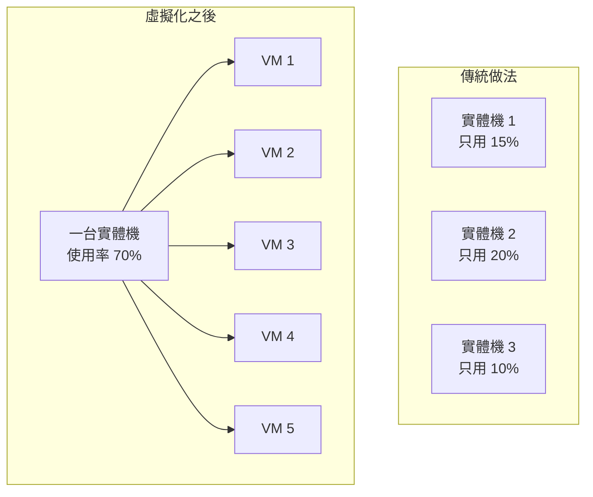
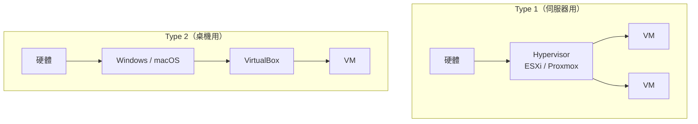
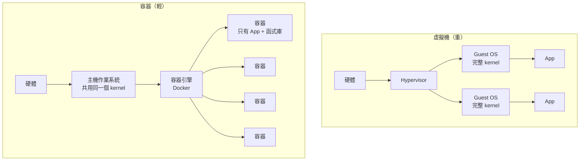
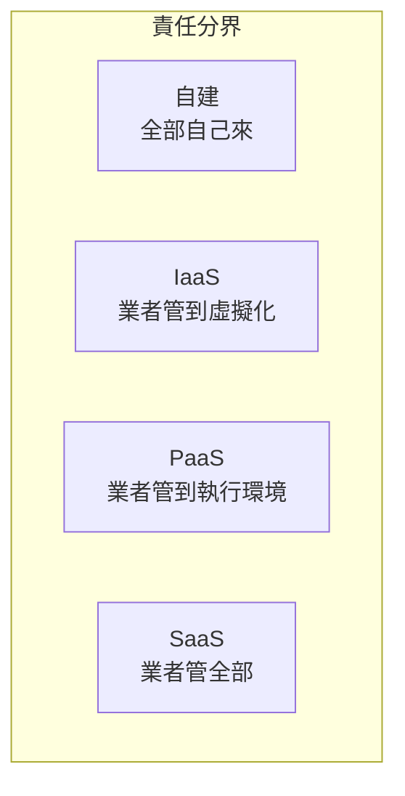

# 雲端、虛擬化與容器

> [!abstract] 這篇你會學到
> - 一句話說清楚「雲端」到底是什麼（沒有你想的那麼神祕）
> - 用**大樓分租**的比喻理解虛擬化：一台實體機怎麼變成十台
> - 分辨**實體機、虛擬機、容器**三者的差別與適用場合
> - 看懂 **IaaS / PaaS / SaaS**，知道哪些責任是誰的
> - 理解容器為什麼解決了「在我電腦上明明可以跑」的問題
> - 判斷什麼該上雲、什麼該留在自己機房

## 前置知識

- [[08-計概-作業系統是什麼]] — Kernel 與作業系統的職責
- [[10-計概-軟體授權與程式怎麼跑起來]] — 相依性地獄

---

## 觀念說明

### 雲端：就是「別人的電腦」

> [!note] 先破除神祕感
> **「雲端」不是漂浮在天上的東西，它是別人資料中心裡的實體伺服器。**
>
> 你把檔案存到 Google Drive，那些檔案就在 Google 某個資料中心的
> 某幾顆硬碟上。你租一台 AWS 主機，那就是某台實體伺服器上切出來的一塊。
>
> 「雲端」這個詞真正的意義是：
> **你不需要知道它在哪裡、不需要自己買、不需要自己維護。**

| | **自建（On-premises）** | **雲端** |
| --- | --- | --- |
| 比喻 | **買一棟房子** | **租房子** |
| 前期投入 | 高（採購、機房、電力） | 低（開帳號就能用） |
| 擴充 | 慢（採購流程要幾個月） | **快（幾分鐘）** |
| 縮減 | 幾乎不可能（設備已經買了） | **可以隨時關掉不付錢** |
| 長期成本 | 攤提後較低 | **持續付費，用越久越貴** |
| 資料在誰手上 | **你自己** | 業者 |
| 誰負責維護 | 你 | 業者（依服務層級） |

---

## 虛擬化：一棟大樓分租給很多戶

### 核心比喻

想像你有一棟**十層樓的大樓**（一台高規格的實體伺服器）。

| 做法 | 說明 |
| --- | --- |
| **不分租** | 整棟給一家公司用。但他們只用得到兩層，**八層空著浪費** |
| **分租** | 隔成十戶，各自有獨立的門、水電表、鎖。**十家公司都能用** |

**虛擬化就是「分租」。**



> [!tip] 虛擬化解決的是「浪費」
> 傳統做法是「一個服務一台機器」，
> 因為怕互相干擾、也怕一個掛了拖累另一個。
>
> 但實測下來，多數伺服器的 CPU 使用率只有 **5～20%**。
> 你買了十台機器、付了十台的電費與冷氣，卻只用到一台半的效能。
>
> 虛擬化把它們**併到一台高規機器上**，
> 使用率拉到 60～80%，同時省下：
> - 採購成本
> - **電費與空調**（見 [[15-計概-電力基礎與用電安全]]）
> - 機櫃空間
> - 維護人力

### Hypervisor：那位「大樓管理員」

**Hypervisor**（虛擬機管理程式）負責分配實體資源給各台虛擬機。

| 類型 | 說明 | 比喻 | 代表 |
| --- | --- | --- | --- |
| **Type 1（原生／裸機）** | **直接裝在硬體上**，沒有底層作業系統 | 專業的大樓管理公司 | **VMware ESXi、Proxmox VE、Hyper-V、KVM** |
| **Type 2（託管）** | 裝在既有的作業系統之上 | 房東自己順便管 | VirtualBox、VMware Workstation |



> [!note] 為什麼伺服器用 Type 1
> 因為它**少了一層**。Type 2 要先跑一個完整的作業系統，
> 那個作業系統本身就吃掉不少資源，而且多一層就多一分延遲與不穩定。
>
> Type 1 直接管理硬體，效能損失通常只有 **2～5%**。

> [!warning] 虛擬化需要 CPU 支援
> Intel 叫 **VT-x**，AMD 叫 **AMD-V**（或 SVM）。
> 這個功能在 BIOS/UEFI 裡可能**預設是關閉的**。
>
> 沒開啟的話：不能跑虛擬機、不能用 WSL2、不能用 Docker Desktop。
>
> 檢查方式：
> ```bash
> # Linux
> $ grep -E 'vmx|svm' /proc/cpuinfo | head -1   # 有輸出就是支援
> $ kvm-ok                                       # Ubuntu 上更直接
> ```
> Windows：工作管理員 → 效能 → CPU → 看「虛擬化：已啟用」。

---

## 容器：不用整棟大樓，只要一個房間

### 虛擬機的問題：太重

每一台虛擬機都要跑一個**完整的作業系統**：

```
VM 1: [完整的 Ubuntu（2GB 記憶體、10GB 磁碟）] + 你的應用程式（50MB）
VM 2: [完整的 Ubuntu（2GB 記憶體、10GB 磁碟）] + 你的應用程式（50MB）
VM 3: [完整的 Ubuntu（2GB 記憶體、10GB 磁碟）] + 你的應用程式（50MB）
       ↑ 三份幾乎一模一樣的作業系統，全是重複的
```

> [!example] 用「搬家」來比喻
> 你只是要換個地方寫程式，卻**把整間房子（含地基、水電、牆壁）一起搬過去**。
> 明明你需要的只是一張桌子和一台筆電。

### 容器：共用作業系統核心

**容器**不帶自己的作業系統核心，**直接共用主機的 kernel**，
只打包自己的應用程式與相依函式庫。



### 三者比較

| | **實體機** | **虛擬機（VM）** | **容器** |
| --- | --- | --- | --- |
| 比喻 | 獨棟透天 | **大樓裡的一戶**（有自己的水電） | **共享辦公室的一個座位** |
| 隔離強度 | 完全 | **很強**（各有 kernel） | 中（共用 kernel） |
| 啟動時間 | 數分鐘 | 數十秒 | **不到 1 秒** |
| 大小 | — | 數 GB～數十 GB | **數十 MB～數百 MB** |
| 一台機器能跑幾個 | 1 | 10～50 | **數百** |
| 能不能跑不同 OS | — | ✅ Linux 上可跑 Windows | ❌ **只能跑同一種 kernel** |
| 適合 | 極高效能需求、特殊硬體 | 完整系統、不同 OS、強隔離 | **微服務、快速部署、開發環境** |

> [!warning] 容器不能跑不同的作業系統
> 因為容器**共用主機的 kernel**。
>
> - Linux 主機上**只能跑 Linux 容器**
> - Windows 容器需要 Windows 主機
>
> 那 Windows 上的 Docker Desktop 怎麼跑 Linux 容器？
> **它偷偷幫你開了一台 Linux 虛擬機**（透過 WSL2 或 Hyper-V），
> 容器其實跑在那台 VM 裡面。
>
> 這也解釋了為什麼 Docker Desktop 在 Windows 上比較吃資源。

### 容器解決了什麼問題

> [!example] 「在我的電腦上明明可以跑啊」
> 這是軟體開發史上最著名的一句抱怨。
>
> 開發者的電腦：Ubuntu 24.04、PHP 8.3、某個函式庫 2.1 版
> 伺服器：       Ubuntu 22.04、PHP 8.1、某個函式庫 1.9 版
>
> → 部署上去就壞掉，而且很難查出是哪個差異造成的。
>
> **容器的解法**：
> 把「應用程式 + 它需要的所有東西（函式庫、設定、執行環境）」
> **一起打包成一個映像（image）**。
>
> 這個映像搬到哪裡跑都一模一樣 ——
> 因為它帶著自己的整個環境。
>
> 這就像**貨櫃（container）**的發明：
> 不管裡面裝什麼，貨櫃的規格是統一的，
> 所以船、火車、卡車都能用同一套方式搬運它。
> Docker 的名字與鯨魚載貨櫃的標誌就是這個典故。

### 映像（Image）與容器（Container）

這組概念跟「程式 vs 程序」完全平行（見 [[11-計概-程式程序與多工]]）：

| | **映像 Image** | **容器 Container** |
| --- | --- | --- |
| 比喻 | **食譜／模具** | **做出來的那道菜／成品** |
| 狀態 | 靜態、唯讀 | 執行中、可變 |
| 數量 | 一份 | 同一個映像可以開很多個容器 |

```bash
# 下載一個映像
$ docker pull nginx:1.27

# 用同一個映像開三個容器
$ docker run -d --name web1 -p 8081:80 nginx:1.27
$ docker run -d --name web2 -p 8082:80 nginx:1.27
$ docker run -d --name web3 -p 8083:80 nginx:1.27

$ docker ps
CONTAINER ID   IMAGE        STATUS         PORTS                  NAMES
a1b2c3d4e5f6   nginx:1.27   Up 5 seconds   0.0.0.0:8083->80/tcp   web3
b2c3d4e5f6a1   nginx:1.27   Up 8 seconds   0.0.0.0:8082->80/tcp   web2
c3d4e5f6a1b2   nginx:1.27   Up 12 seconds  0.0.0.0:8081->80/tcp   web1
```

> [!tip] 容器是「用完即丟」的
> 這是與虛擬機最大的思維差異。
>
> **虛擬機**像養寵物（pets）：你給它取名字、細心照顧、壞了想辦法救。
> **容器**像養牲口（cattle）：壞了就換一隻新的，不修。
>
> 所以容器的設計原則是：
> - **無狀態**：容器裡不存重要資料
> - **資料放在外面**：用 volume 掛載，或存在資料庫裡
> - **設定用環境變數傳入**，不寫死在映像裡
> - **要改東西就重新建映像、重新部署**，不要進去手動改
>
> 詳見 `41-容器化` 章節。

---

## 雲端服務的三個層次

> [!example] 用「吃披薩」來理解 IaaS / PaaS / SaaS
> 你想吃披薩，有四種方式：
>
> | 方式 | 你要做什麼 | 對應 |
> | --- | --- | --- |
> | **自己從頭做** | 買麵粉、揉麵、做醬、烤箱、餐桌 | **自建機房（On-premises）** |
> | **買冷凍披薩回家烤** | 你有烤箱、瓦斯、餐桌 | **IaaS** |
> | **叫外送** | 你只要有餐桌和飲料 | **PaaS** |
> | **去餐廳吃** | 什麼都不用準備 | **SaaS** |

| 層次 | 業者提供 | 你負責 | 例子 |
| --- | --- | --- | --- |
| **IaaS**（基礎設施即服務） | 硬體、網路、虛擬化 | **作業系統以上全部** | AWS EC2、Azure VM、GCP Compute Engine |
| **PaaS**（平台即服務） | 加上作業系統、執行環境 | **只有你的程式碼與資料** | Heroku、App Engine、Azure App Service |
| **SaaS**（軟體即服務） | 全部 | **只有資料與使用者管理** | Gmail、Microsoft 365、Salesforce |



> [!warning] 責任共擔模型（Shared Responsibility）
> **上雲不代表資安責任也交出去了。** 這是最常見的誤解。
>
> | 項目 | IaaS | PaaS | SaaS |
> | --- | --- | --- | --- |
> | 實體安全、硬體 | 業者 | 業者 | 業者 |
> | 虛擬化層 | 業者 | 業者 | 業者 |
> | **作業系統修補** | **你** | 業者 | 業者 |
> | **應用程式漏洞** | **你** | **你** | 業者 |
> | **設定是否正確** | **你** | **你** | **你** |
> | **帳號與權限管理** | **你** | **你** | **你** |
> | **你的資料** | **你** | **你** | **你** |
>
> **最常見的雲端資安事故不是業者被駭，而是使用者設定錯誤** ——
> 例如把儲存空間設成公開可讀，導致大量個資外洩。
>
> 見 [[12-零信任架構與微分段]] 與 [[08-產業規範與國際法遵]]。

---

## 什麼該上雲，什麼該留下

> [!tip] 機關與企業的判斷準則
> | 情況 | 建議 |
> | --- | --- |
> | 流量起伏很大（如報名系統、活動網站） | **上雲**（可彈性擴縮） |
> | 只用幾個月的專案 | **上雲**（不用買設備） |
> | 需要異地備援 | **上雲**（當作異地副本） |
> | 資料**不能出境**（個資、機密、法規限制） | **自建** |
> | 24 小時穩定運轉、負載固定 | **自建**（長期較便宜） |
> | 已經有機房與人力 | 自建或混合 |
> | 需要極低延遲（如工廠控制） | **自建**（地端） |

> [!warning] 上雲的三個常見痛點
> 1. **費用失控**：忘記關掉的測試環境、沒注意的流量費用。
>    雲端是**用多少付多少**，但也代表「忘記關就一直付」。
>    務必設定**預算警示**。
> 2. **資料傳出費（egress）**：把資料**存進去通常免費，拿出來要錢**。
>    這是「雲端鎖定」的一種形式 —— 搬走的成本很高。
> 3. **法規與資料主權**：機關的個資與機密資料可能受法規限制，
>    不得存放於境外。上雲前務必確認法規要求與資料存放位置。
>
> 見 [[07-台灣資安法規與個資法]]。

---

## 完整實戰範例

### 體驗容器：五分鐘架一個網站

```bash
# 安裝 Docker（Ubuntu）
$ sudo apt install docker.io
$ sudo usermod -aG docker $USER      # 讓自己不用 sudo（要重新登入）

# 跑一個 Nginx 網站
$ docker run -d --name mysite -p 8080:80 nginx:1.27

# 測試
$ curl -I http://localhost:8080
HTTP/1.1 200 OK
Server: nginx/1.27.0

# 看它跑起來了
$ docker ps
CONTAINER ID   IMAGE        STATUS        PORTS                  NAMES
a1b2c3d4e5f6   nginx:1.27   Up 5 seconds  0.0.0.0:8080->80/tcp   mysite
```

**整個過程不到一分鐘，而且沒有在主機上安裝任何 Nginx。**

```bash
# 把自己的網頁掛進去
$ mkdir -p ~/mysite && echo '<h1>你好</h1>' > ~/mysite/index.html
$ docker rm -f mysite
$ docker run -d --name mysite -p 8080:80 \
    -v ~/mysite:/usr/share/nginx/html:ro \
    nginx:1.27
$ curl http://localhost:8080
<h1>你好</h1>

# 清乾淨（容器是用完即丟的）
$ docker rm -f mysite
```

> [!tip] `-v ~/mysite:/usr/share/nginx/html:ro` 這一段
> 這叫 **volume 掛載**：把主機的目錄「掛」進容器裡。
>
> 這體現了容器的核心原則：**程式在容器裡，資料在容器外**。
> 容器刪掉重建，你的資料完全不受影響。
>
> 結尾的 `:ro` 是 **read-only**（唯讀），
> 讓容器不能修改你的檔案 —— 這是好的安全習慣。

### 比較資源用量

```bash
# 容器用了多少資源
$ docker stats --no-stream
CONTAINER   CPU %   MEM USAGE / LIMIT   MEM %
mysite      0.00%   3.5MiB / 15.5GiB    0.02%
                    ^^^^^^
                    只用 3.5 MB！
```

對比一台跑 Nginx 的虛擬機：至少要 **512 MB～1 GB** 記憶體。
**差了一百倍以上。**

### 檢查你的機器支不支援虛擬化

```bash
# Linux
$ grep -cE 'vmx|svm' /proc/cpuinfo     # 大於 0 就是支援
14

$ sudo apt install cpu-checker && kvm-ok
INFO: /dev/kvm exists
KVM acceleration can be used

# 看有沒有跑在虛擬機裡面
$ systemd-detect-virt
kvm                                     # 顯示 none 代表是實體機
```

```powershell
# Windows
Get-ComputerInfo -Property "HyperV*"
# 或工作管理員 → 效能 → CPU → 看「虛擬化」
```

---

## 常見錯誤與排錯

| 現象 | 原因 | 解法 |
| --- | --- | --- |
| 虛擬機無法啟動，說不支援虛擬化 | BIOS 沒開 VT-x / AMD-V | 進 BIOS/UEFI 啟用 Intel VT-x 或 AMD SVM |
| Docker Desktop 在 Windows 上很吃資源 | 它背後跑了一台 Linux VM | 正常。可調整 WSL2 的記憶體上限（`.wslconfig`） |
| 容器裡的資料重啟後不見了 | 沒有用 volume，資料寫在容器內 | **資料一律用 volume 掛載到主機**或存進資料庫 |
| `exec format error` | 映像架構不符（arm64 vs amd64） | `docker pull --platform linux/amd64` |
| 想在 Linux 容器裡跑 Windows 程式 | **容器共用 kernel，做不到** | 用虛擬機 |
| VM 效能很差 | 超賣（overcommit）太嚴重，或磁碟是瓶頸 | 檢查實體機的 CPU/記憶體/磁碟使用率 |
| 雲端帳單暴增 | 忘記關掉的資源、資料傳出費 | 設定**預算警示**；定期盤點資源；用標籤（tag）追蹤 |
| 上雲後想搬回來，發現搬不動 | 資料傳出費高、用了業者專屬服務 | 規劃時就考慮**可攜性**；盡量用開放標準 |
| 雲端儲存空間設成公開，個資外洩 | 設定錯誤（**最常見的雲端事故**） | 預設拒絕；定期用工具掃描公開資源 |
| 一台實體機掛了，上面十台 VM 全部停 | **把雞蛋放在同一個籃子** | 規劃**高可用叢集**（HA），VM 可自動遷移到其他節點 |

> [!danger] 虛擬化的集中風險
> 虛擬化把十台機器併成一台，好處是省錢，**壞處是風險也集中了**。
>
> 一台實體機故障，上面所有 VM 全部停擺。
> 所以正式環境的虛擬化平台應該：
> 1. **至少三個節點**組成叢集
> 2. 開啟 **HA（高可用）**，節點故障時 VM 自動在其他節點重啟
> 3. **共享儲存**（或分散式儲存如 Ceph）
> 4. 重要服務的 VM **分散在不同節點**（反親和性規則）
>
> 見 `40-虛擬化平台` 章節。

---

## 安全性注意事項

> [!warning] 容器的隔離比虛擬機弱
> 容器**共用主機的 kernel**，所以：
> - **kernel 的漏洞可能讓容器逃逸（container escape）**到主機
> - 一個容器可以影響主機的資源
>
> **必做的防護**：
> 1. **不要用 root 執行容器內的程式**（`USER` 指令指定非特權使用者）
> 2. **不要用 `--privileged`**，除非你完全知道自己在做什麼
> 3. 不要把 **Docker socket（`/var/run/docker.sock`）掛進容器** ——
>    這等於給了容器完整的主機控制權
> 4. 用**唯讀根檔案系統**（`--read-only`）
> 5. 限制資源（`--memory`、`--cpus`）
> 6. 考慮用 **rootless 模式**執行 Docker
>
> 需要**強隔離**時（如執行不信任的程式碼），**用虛擬機而不是容器**。

> [!danger] 容器映像的供應鏈風險
> 從 Docker Hub 隨便 `pull` 一個映像，等於在你的伺服器上執行陌生人的程式。
>
> **必做**：
> 1. **用官方或已驗證的映像**（Docker Official Images、Verified Publisher）
> 2. **鎖定版本標籤**，不要用 `latest`
>    （`nginx:1.27.0` 而非 `nginx:latest`）
> 3. **掃描映像漏洞**：
>    ```bash
>    $ trivy image nginx:1.27
>    ```
> 4. 建立**內部映像倉庫**，只使用審核過的映像
> 5. 定期重建映像以取得基礎映像的安全更新
>
> 見 [[11-委外與供應鏈資安]]。

> [!warning] 虛擬化平台本身是最高價值的目標
> 攻下 Hypervisor 等於攻下**上面所有虛擬機**。
>
> **防護重點**：
> 1. **管理介面放在獨立的管理網段**，絕不能連到網際網路
> 2. 啟用 **MFA**
> 3. 韌體與 Hypervisor **保持更新**（Meltdown/Spectre 這類漏洞影響 VM 隔離）
> 4. 最小權限：不同管理員給不同層級的權限
> 5. **備份 Hypervisor 的設定**，不只備份 VM
>
> 見 [[07-身分存取管理IAM與MFA]] 與 `40-虛擬化平台`。

> [!tip] 雲端的資安檢查清單
> 1. **開啟 MFA**（尤其是 root/管理員帳號）
> 2. **不要用 root 帳號日常操作**，建立有限權限的 IAM 使用者
> 3. **儲存空間預設為私有**，定期掃描有沒有誤設成公開的
> 4. **開啟稽核日誌**（AWS CloudTrail、Azure Activity Log）
> 5. **設定預算警示**（費用暴增可能是帳號被盜去挖礦）
> 6. **金鑰不要寫在程式碼裡**，更不要 commit 進 git
> 7. 定期用工具做**組態合規檢查**
>
> 見 [[03-機密管理與金鑰保護]] 與 [[09-資安稽核與符合性檢核]]。

---

## 速查表

### 三者比較

| | 實體機 | 虛擬機 | 容器 |
| --- | --- | --- | --- |
| 比喻 | 透天厝 | 大樓一戶 | 共享辦公室座位 |
| 啟動 | 數分鐘 | 數十秒 | **< 1 秒** |
| 大小 | — | GB 級 | **MB 級** |
| 隔離 | 完全 | 強 | 中 |
| 跨 OS | — | ✅ | ❌ |
| 一台能跑幾個 | 1 | 10～50 | **數百** |

### 雲端服務層次

| 層次 | 你管什麼 | 比喻 |
| --- | --- | --- |
| 自建 | 全部 | 自己做披薩 |
| **IaaS** | 作業系統以上 | 買冷凍披薩回家烤 |
| **PaaS** | 程式碼與資料 | 叫外送 |
| **SaaS** | 只有資料與帳號 | 去餐廳吃 |

### 常用指令

| 目的 | 指令 |
| --- | --- |
| 檢查 CPU 支援虛擬化 | `grep -cE 'vmx\|svm' /proc/cpuinfo`、`kvm-ok` |
| 我是不是跑在 VM 裡 | `systemd-detect-virt` |
| 下載映像 | `docker pull nginx:1.27` |
| 執行容器 | `docker run -d -p 8080:80 nginx:1.27` |
| 列出容器 | `docker ps`、`docker ps -a` |
| 看資源用量 | `docker stats` |
| 進入容器 | `docker exec -it 名稱 bash` |
| 看日誌 | `docker logs -f 名稱` |
| 刪除容器 | `docker rm -f 名稱` |
| **掃描映像漏洞** | `trivy image 映像名` |

---

## 練習題

> [!question]- 練習 1：確認你的環境
> 1. 你的 CPU 支援虛擬化嗎？BIOS 有開啟嗎？
> 2. 用 `systemd-detect-virt`（Linux）確認你現在是在實體機還是虛擬機上
> 3. 如果是 WSL2，想想它其實是什麼（提示：一台輕量虛擬機）

> [!question]- 練習 2：跑一個容器
> 照本篇的實戰範例，用 Docker 跑一個 Nginx，然後：
> 1. 用 `docker stats` 看它用了多少記憶體
> 2. 掛載自己的 HTML 檔案進去
> 3. 刪掉容器再重建一次，確認你的 HTML 還在（因為它在主機上）
> 4. 想想：如果沒有用 volume，重建後會怎樣？

> [!question]- 練習 3：決定該不該上雲
> 四個情境，判斷該自建還是上雲，並說明理由：
> 1. 機關的年度報名系統，只在報名期間（兩週）流量爆量
> 2. 存放全機關人事個資的資料庫
> 3. 官網（流量穩定，一天幾千人）
> 4. 異地備份
>
> 參考答案：
> 1. **上雲**。兩週的爆量不值得為它買設備，用完就關
> 2. **自建**。個資受法規限制，且資料主權考量重要
> 3. **看情況**。流量穩定的話自建長期較省；但若沒有 24 小時維運人力，
>    上雲可以把可用性責任交出去一部分
> 4. **上雲**。異地備份正是雲端的強項，成本低且天然異地

---

## 小測驗

Q1. 用一句話說明「雲端」是什麼。這個詞真正的意義是什麼？

Q2. 虛擬化用「大樓分租」來比喻的話，它解決了什麼浪費？一般伺服器的 CPU 使用率大約是多少？

Q3. Type 1 與 Type 2 Hypervisor 的差別是什麼？為什麼伺服器用 Type 1？

Q4. 虛擬機與容器最根本的差別是什麼？為什麼容器可以小一百倍、快幾十倍？

Q5. 為什麼 Linux 主機上不能跑 Windows 容器？那 Windows 上的 Docker Desktop 是怎麼跑 Linux 容器的？

Q6. 容器怎麼解決「在我的電腦上明明可以跑」這個問題？

Q7. 「映像（image）」與「容器（container）」的關係，跟哪一組概念完全平行？

Q8. 用「吃披薩」說明 IaaS、PaaS、SaaS 的差別。

Q9. 什麼是「責任共擔模型」？在 IaaS 中，作業系統的修補是誰的責任？最常見的雲端資安事故是什麼？

Q10. 為什麼說「容器的隔離比虛擬機弱」？有哪三項基本防護？需要強隔離時該用什麼？

> [!question]- 測驗答案
> **Q1.** 雲端就是「**別人的電腦**」—— 別人資料中心裡的實體伺服器。
> 這個詞真正的意義是：**你不需要知道它在哪裡、不需要自己買、不需要自己維護。**
>
> **Q2.** 傳統「一個服務一台機器」的做法造成大量浪費：
> 多數伺服器的 CPU 使用率只有 **5～20%**，你付了十台的採購費、
> 電費與冷氣費卻只用到一台半的效能。
> 虛擬化把它們併到一台高規機器上，使用率拉到 60～80%，
> 省下採購成本、**電費與空調**、機櫃空間與維護人力。
>
> **Q3.** **Type 1（裸機）直接裝在硬體上，沒有底層作業系統**
> （ESXi、Proxmox VE、Hyper-V、KVM）；
> **Type 2 裝在既有作業系統之上**（VirtualBox、VMware Workstation）。
> 伺服器用 Type 1 是因為它**少了一層** ——
> Type 2 底下那個完整作業系統本身就吃資源，且多一層多一分延遲與不穩定。
> Type 1 的效能損失通常只有 2～5%。
>
> **Q4.** 最根本的差別是：**虛擬機各自帶一個完整的作業系統核心（kernel）；
> 容器共用主機的 kernel**，只打包應用程式與相依函式庫。
> 因為省掉了那份重複的作業系統（數 GB），
> 容器可以只有數十 MB、啟動不到一秒。
>
> **Q5.** 因為容器**共用主機的 kernel**，Windows 程式需要 Windows kernel。
> Windows 上的 Docker Desktop 是**偷偷開了一台 Linux 虛擬機**
> （透過 WSL2 或 Hyper-V），Linux 容器其實跑在那台 VM 裡面 ——
> 這也是它在 Windows 上比較吃資源的原因。
>
> **Q6.** 因為容器把「**應用程式 + 它需要的所有東西**
> （函式庫、設定、執行環境）」一起打包成一個**映像**。
> 這個映像帶著自己的完整環境，搬到哪裡跑都一模一樣，
> 不再受主機上 PHP 版本、函式庫版本差異的影響。
> 就像**貨櫃**的發明：不管裡面裝什麼，規格統一，船火車卡車都能搬。
>
> **Q7.** 跟「**程式（program）vs 程序（process）**」完全平行。
> **映像**是靜態唯讀的**食譜／模具**；
> **容器**是執行中的**成品** —— 同一個映像可以開出很多個容器。
>
> **Q8.** **自建**＝自己從頭做披薩（買麵粉、揉麵、烤箱、餐桌全都自己來）；
> **IaaS**＝買冷凍披薩回家烤（業者給你半成品，你要有烤箱、瓦斯、餐桌）；
> **PaaS**＝叫外送（你只要有餐桌和飲料）；
> **SaaS**＝去餐廳吃（什麼都不用準備）。
>
> **Q9.** **責任共擔模型**指的是雲端的安全責任在業者與使用者之間有明確分界，
> **上雲不代表資安責任也交出去了**。
> 在 **IaaS 中，作業系統的修補是「你」的責任**（業者只管到虛擬化層）。
> **最常見的雲端資安事故不是業者被駭，而是使用者設定錯誤** ——
> 例如把儲存空間設成公開可讀，導致大量個資外洩。
>
> **Q10.** 因為容器**共用主機的 kernel**，
> **kernel 的漏洞可能讓容器逃逸（container escape）到主機**。
> 三項基本防護：
> ①**不要用 root 執行容器內的程式**；
> ②**不要用 `--privileged`**；
> ③**不要把 Docker socket 掛進容器**（等於給了完整的主機控制權）。
> （另可加：唯讀根檔案系統、限制資源、rootless 模式。）
> **需要強隔離時（如執行不信任的程式碼），應該用虛擬機而不是容器。**

---

## 延伸閱讀

- [[08-計概-作業系統是什麼]] — kernel 與作業系統
- [[10-計概-軟體授權與程式怎麼跑起來]] — 容器解決的相依性問題
- [[11-計概-程式程序與多工]] — 映像與容器的對應概念
- [[00-容器化-索引]] — Docker 與 Compose 完整教學（進階）
- [[00-虛擬化平台-索引]] — Proxmox VE 實戰（進階）
- [[11-委外與供應鏈資安]] — 映像供應鏈風險（進階）
