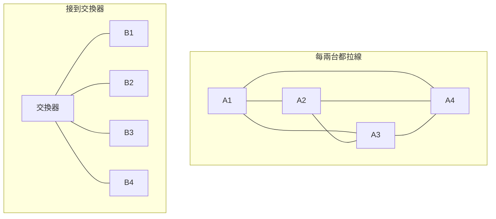
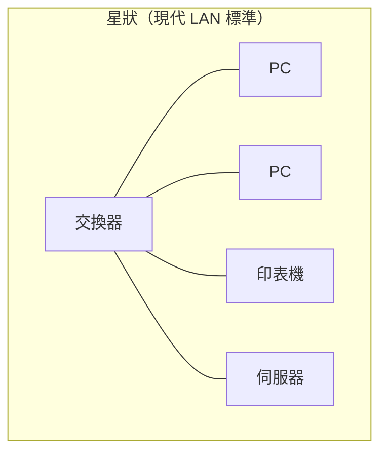
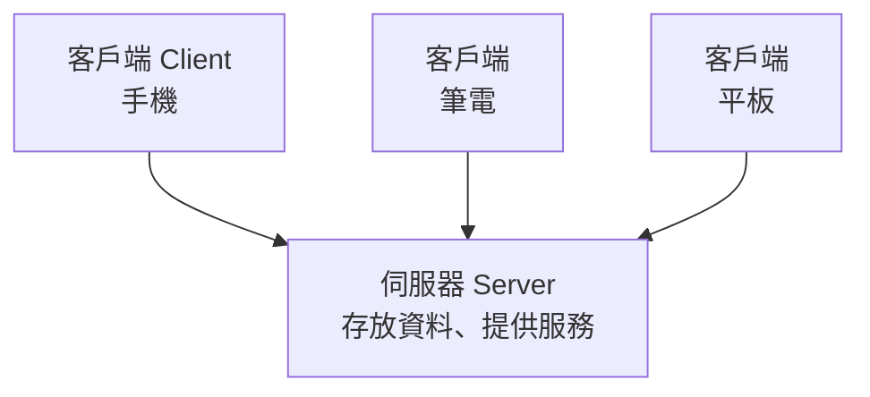

# 網路是什麼

> [!abstract] 這篇你會學到
> - 從「兩台電腦怎麼連起來」開始，理解網路的本質 ★★
> - 分辨 **LAN / MAN / WAN** 與網際網路的關係 ★★
> - 徹底理解 **封包交換 vs 電路交換**，以及為什麼網際網路選了前者 ★★★
> - 知道**通訊協定**是什麼，為什麼它是網路能運作的前提 ★★★
> - 認識常見的網路拓樸，以及各自的優缺點 ★★
> - 了解網際網路的由來（ARPANET → WWW），這解釋了它今天的很多設計 ★
> - ★★★★ 知道 TCP/IP 先天**沒有加密、也沒有身分驗證** —— 這是為什麼設備管理介面
>   還開著 Telnet／SNMP v2c 會直接害你的帳密以純文字流過整個網段
> - ★★★★ 網路不通時，能依「實體 → 自己的 IP → 閘道 → 外網 IP → DNS → 服務埠」
>   分層排查，而不是每次都重開機碰運氣

## 前置知識

- [[010-01-16-guide-計概-網路初體驗]] — 郵政系統的比喻與三種地址

---

## 觀念說明

### ★★ 從兩台電腦說起

**網路的本質，就是「讓兩台以上的機器交換資訊」。**

最簡單的網路：拿一條網路線把兩台電腦直接接起來。這樣就成了。

但只要多一台，問題就來了：

```
2 台 → 1 條線
3 台 → 3 條線
4 台 → 6 條線
10 台 → 45 條線
100 台 → 4950 條線     ← ★★★ 完全不可行（線數隨機器數呈平方成長）
```

> [!example] 用電話來想
> 如果每兩支電話之間都要拉一條專線，
> 一個城市有一百萬支電話，就要拉五千億條線。
>
> ★★★ **所以要有「交換中心」。**
> 每支電話只要拉一條線到交換中心，
> 需要通話時由交換中心幫你接通。
>
> ★★★ 網路裡的**交換器（switch）** 就是這個角色。



> [!note] 網路的兩個核心問題 ★★★
> 從這裡開始，整個計算機網路都在回答兩個問題：
> 1. **怎麼把資料送到正確的對象？**（定址與轉送）
> 2. **怎麼確保它完整、正確、有效率地送到？**（協定與控制）
>
> 後面每一篇都是這兩個問題的某個面向。

---

## 電路交換 vs 封包交換

這是理解網際網路最根本的一組概念。

### ★★ 電路交換：傳統電話的做法

```
你 ────[專屬線路，通話期間完全佔用]──── 對方
```

| 特性 | 說明 |
| --- | --- |
| ★★ 做法 | 通話開始時**建立一條專屬線路**，結束才釋放 |
| ★★ 比喻 | **包下整條高速公路只給你一台車開** |
| ★★ 優點 | 品質穩定、延遲固定 |
| ★★★ 缺點 | **極度浪費** —— 你沉默的時候線路也閒著沒人能用 |
| ★★★ 線路斷了 | **通話直接中斷** |

> [!example] 浪費有多嚴重
> 一通十分鐘的電話，實際說話的時間可能只有六分鐘，
> 剩下四分鐘是停頓、思考、聽對方講。
>
> 但那條線路**整整十分鐘都被你佔著**，其他人不能用。
> 資料傳輸更誇張 —— 你讀一篇網頁可能讀五分鐘，
> 但實際傳輸只花了 0.5 秒。

### ★★★ 封包交換：網際網路的做法

```
你的資料 → 切成小塊 → 每塊各自帶著地址 → 各走各的路 → 到目的地重組
```

| 特性 | 說明 |
| --- | --- |
| ★★★ 做法 | 資料切成**封包（packet）**，每個封包獨立傳送 |
| ★★ 比喻 | **大家都在同一條路上開車**，各自往目的地 |
| ★★★ 優點 | **效率極高**，一條線路可以同時服務很多人 |
| ★★★ 缺點 | 塞車時會變慢；封包可能亂序或遺失（要靠上層處理） |
| ★★★ 線路斷了 | **封包自動改走別條路** |

### ★★★ 封包長什麼樣

每個封包都由兩部分組成：

```
┌──────────────────────┬───────────────────────────────┐
│    Header（標頭）     │        Payload（酬載）         │
│  來源地址、目的地址、   │        實際要傳的資料           │
│  序號、長度、檢查碼…    │                               │
└──────────────────────┴───────────────────────────────┘
```

| 部分 | 比喻 | 內容 |
| --- | --- | --- |
| ★★★ **Header 標頭** | **信封上的資訊** | 從哪來、到哪去、這是第幾封、資料多長 |
| ★★ **Payload 酬載** | **信紙的內容** | 真正要傳的資料 |

> [!note] 為什麼封包大小有上限（通常 1500 位元組）★★★
> ★★★ 這個上限叫 **MTU**（Maximum Transmission Unit，最大傳輸單元）。
>
> 太大：一個封包出錯就要重傳一大塊，而且會長時間佔住線路
> 太小：標頭的比例太高，浪費頻寬（每個封包都要貼一次地址）
>
> 乙太網路的 1500 位元組是幾十年來的工程平衡點。
> 詳見 [[010-02-05-guide-網概-MAC位址與交換器]]。

> [!tip] 封包交換的三個好處 ★★★
> ★★ **一、效率高。**
> 線路在你「沒有在傳」的時候可以讓別人用。
>
> ★★★ **二、有韌性。**
> 每個封包都自己帶著完整地址，哪條路通就走哪條。
> 海底電纜斷了，你的封包會自動繞道 —— 你可能只感覺到變慢一點。
>
> ★★ **三、可以同時做很多事。**
> 你可以一邊下載檔案、一邊視訊、一邊瀏覽網頁，
> 因為它們的封包在同一條線上輪流走。

> [!warning] 代價：不保證順序與送達 ★★★
> 因為每個封包各走各的，可能：
> - **亂序抵達**（第 3 個比第 2 個先到）
> - **遺失**（中間某台設備太忙就丟掉）
> - **重複**（重傳機制造成）
>
> ★★★ **這些問題交給上層的 TCP 協定處理** ——
> 它會編號、確認、重傳、重新排序。
> 詳見 [[010-02-09-guide-網概-TCP與UDP]]。

---

## 通訊協定：大家講同一種話

> [!example] 沒有協定會怎樣 ★★
> 想像你寄一封信，但：
> - 你把地址寫在信封背面
> - 郵局習慣看正面
> - 收件人習慣看側面
>
> 結果就是誰也送不到。
>
> ★★★ **協定（Protocol）就是「大家事先約定好的規則」** ——
> 資料要怎麼包裝、地址寫在哪、遇到錯誤怎麼辦。

| 協定 | 用途 | 比喻 |
| --- | --- | --- |
| ★★★ **IP** | 定址與跨網路轉送 | 郵政地址系統 |
| ★★★ **TCP** | 可靠傳輸（保證送達、保證順序） | 掛號信 + 回執 |
| ★★★ **UDP** | 快速傳輸（不保證） | 平信 |
| ★★★ **HTTP/HTTPS** | 瀏覽網頁 | 借書的固定問答流程 |
| ★★★ **DNS** | 網址轉 IP | 查電話簿 |
| ★★ **DHCP** | 自動取得 IP 設定 | 飯店櫃檯發房卡 |
| ★ **SMTP/IMAP** | 郵件收發 | 郵局的收發規則 |
| ★★★ **SSH** | 加密的遠端登入 | 保全通道 |
| ★★ **FTP/SFTP** | 檔案傳輸 | 貨運 |

> [!note] 「TCP/IP」為什麼常常連在一起講 ★★★
> 因為它們是**網際網路的兩大支柱**：
> - **IP** 負責「送到哪裡」（定址與路由）
> - **TCP** 負責「確保送到」（可靠性）
>
> 兩者合稱 **TCP/IP 協定族（protocol suite）**，
> 是整個網際網路的共同語言。
> 詳見 [[010-02-03-guide-網概-網路分層模型]]。

---

## 網路的規模分類

| 類型 | 全名 | 範圍 | 例子 |
| --- | --- | --- | --- |
| ★ **PAN** | Personal Area Network | 幾公尺 | 藍牙耳機、智慧手錶 |
| ★★★ **LAN** | **Local Area Network**（區域網路） | 一棟建築、一個園區 | 辦公室網路、家用網路 |
| ★ **MAN** | Metropolitan Area Network（都會網路） | 一個城市 | 校際網路、市政網路 |
| ★★★ **WAN** | **Wide Area Network**（廣域網路） | 跨城市、跨國 | **網際網路**、企業跨點專線 |

> [!tip] 你最常打交道的是 LAN 與 WAN ★★★
> - **LAN**：你辦公室裡的所有電腦、印表機、伺服器，用交換器連起來
> - **WAN**：你的辦公室連到網際網路、或連到另一個分支機構
>
> ★★★ **交界處就是路由器（或防火牆）** ——
> 它一腳踩在 LAN、一腳踩在 WAN。

### ★ 藍牙與 PAN

| 特性 | 說明 |
| --- | --- |
| ★ 距離 | 一般約 10 公尺（Class 2） |
| ★ 用途 | 無線耳機、鍵盤滑鼠、檔案傳輸、IoT 感測器 |
| ★★ 頻段 | 2.4 GHz（與 Wi-Fi 重疊，可能互相干擾） |

> [!warning] 藍牙也是攻擊面 ★★★
> ★★★ 藍牙裝置若使用預設 PIN、或長期開著可被搜尋，
> 可能被鄰近的攻擊者連線。
>
> 機關環境建議：
> - 不用時關閉藍牙
> - 不要接受來路不明的配對要求
> - ★★★★ 韌體保持更新（藍牙協定歷史上有多個嚴重漏洞）

---

## 網路拓樸：機器怎麼連

**拓樸（topology）** 就是「連接的形狀」。

| 拓樸 | 長相 | 優點 | 缺點 |
| --- | --- | --- | --- |
| ★ **匯流排（Bus）** | 所有裝置接在同一條主幹線 | 便宜、線材少 | **主幹斷了全部不通**；會碰撞 |
| ★★★ **星狀（Star）** | 全部接到中央的交換器 | **好管理、單點故障只影響一台** | 交換器壞了全部不通 |
| ★ **環狀（Ring）** | 首尾相接成一個圈 | 有序、無碰撞 | 一個節點斷了可能全斷 |
| ★★ **網狀（Mesh）** | 多條路徑互連 | **韌性最強** | 昂貴、複雜 |
| ★★★ **樹狀／階層** | 星狀的多層堆疊 | **企業網路的實際做法** | 上層設備是瓶頸 |



> [!note] 現代 LAN 幾乎都是「星狀」★★★
> 因為交換器便宜又好用，而且：
> - 一台電腦的線壞了，**只影響那一台**
> - 好排錯（拔掉某條線就知道是不是它）
> - 好擴充（多加一台就多接一條線）
>
> ★★★★ 反過來說，**核心交換器與對外路由器就是整棟樓的單點故障（SPOF）** ——
> 這兩台停機等於全機關斷網，是最該做雙機冗餘與備援電源的位置。
>
> 大型網路則是**樹狀（階層式）**：
> ```
> 核心交換器（Core）
>     ├── 匯聚交換器（Distribution）── 各樓層
>     │       └── 接取交換器（Access）── 各辦公室的電腦
> ```
> 詳見 [[040-01-01-guide-網路設備-網路架構基礎]]。

---

## 網際網路的由來

> [!note] 理解歷史，就理解了很多設計 ★★
> ### ARPANET（1960 年代～1990）
>
> 美國國防部高等研究計畫署（ARPA）資助的學術研究網路。
>
> ★★★ **設計目標之一是：部分節點被摧毀後，剩下的仍能通訊。**
>
> 這個目標直接導致了封包交換與分散式路由的設計 ——
> 沒有中央控制點，每個節點都能自己決定封包往哪走。
>
> 1981 年連接超過 200 台電腦；1990 年正式退役，
> 但它建立的 TCP/IP 成為今天網際網路的基礎。
>
> ### 全球資訊網 WWW（1989）
>
> Tim Berners-Lee 在 CERN 提出，
> 用**超連結**把散落各處的文件連結起來。
>
> ★★★ **關鍵區別**：
> - **Internet（網際網路）** 是**基礎建設**（道路系統）
> - **WWW（全球資訊網）** 是**跑在上面的一種服務**（道路上的一種車）
>
> 你用 Email、看 YouTube、玩線上遊戲、用 LINE，
> 都是走網際網路，但**不見得是走 WWW**。
>
> ★★★ 所以「網際網路 = 網頁」是不正確的。

> [!tip] 這段歷史留下的三個特徵 ★★
> 1. **沒有中央管理者** —— 網際網路是「網路的網路」，
>    由成千上萬個獨立網路互連而成
> 2. **盡力而為（best-effort）** —— IP 不保證送達，
>    可靠性交給上層處理。這讓核心設備可以做得很簡單很快
> 3. **開放標準** —— 協定由 RFC 文件公開定義，任何人都能實作

---

## 主從式架構（Client-Server）

這是網路應用最基本的模型。



| 角色 | 做什麼 | 比喻 |
| --- | --- | --- |
| ★★★ **客戶端（Client）** | **發出請求**，顯示結果 | 客人點餐 |
| ★★★ **伺服器（Server）** | **等待請求**，回應資料 | 餐廳廚房 |

> [!note] 「伺服器」是角色，不是機器 ★★★
> 一台機器可以同時是伺服器與客戶端。
>
> 例如你的網站主機是「網頁伺服器」（對訪客而言），
> 但當它去查詢資料庫時，它就是「資料庫的客戶端」。
>
> ★★★ **判斷方式**：誰**主動發出請求**，誰就是 client。

**對照的另一種模型：對等式（P2P）**

| | 主從式 | **P2P（Peer-to-Peer）** |
| --- | --- | --- |
| ★★★ 結構 | 有明確的中心 | **每個節點既是客戶也是伺服器** |
| ★ 比喻 | 餐廳 | 大家帶菜的聚餐 |
| ★★ 例子 | 網站、Email、資料庫 | BitTorrent、部分區塊鏈、某些視訊軟體 |
| ★★ 優點 | 好管理、好控制 | 沒有單點故障、可擴展 |
| ★★★ 缺點 | 中心掛了全掛 | 難管理、難稽核 |

> [!warning] 機關網路要注意 P2P 流量 ★★★★
> P2P 軟體（BT 下載等）在機關網路上有三個問題：
> 1. ★★★ **佔用大量頻寬**，影響正常業務
> 2. ★★★★ **可能涉及侵權**，機關要負連帶責任
> 3. ★★★★ **是惡意程式的常見來源**
>
> 通常會在防火牆上阻擋，或用應用層辨識（NGFW）管制。
> 見 [[090-05-02-guide-資安設備-防火牆與次世代防火牆]]。

---

## 完整實戰範例：看見網路的存在

### ★★★ 看你連上了哪個網路

```bash
# ★★★ Linux：看網路介面與 IP
$ ip address show
1: lo: <LOOPBACK,UP,LOWER_UP> mtu 65536
    inet 127.0.0.1/8 scope host lo          ← ★★ 自己跟自己講話的介面
2: enp3s0: <BROADCAST,MULTICAST,UP,LOWER_UP> mtu 1500
    link/ether 00:1a:2b:3c:4d:5e            ← ★★★ MAC 位址
    inet 192.168.1.10/24 scope global       ← ★★★ IP 位址與網段（這行不見＝沒拿到 IP）
3: wlp2s0: <BROADCAST,MULTICAST> mtu 1500   ← ★★ 無線網卡（目前沒啟用，少了 UP）

# ★★★ 看預設閘道（往外的出口）
$ ip route show
default via 192.168.1.1 dev enp3s0          ← ★★★ 不知道怎麼走就交給它（這行不見＝出不了網段）
192.168.1.0/24 dev enp3s0 proto kernel scope link src 192.168.1.10
```

> [!tip] `mtu 1500` 就是前面說的封包大小上限 ★★
> `lo`（loopback）的 MTU 是 65536，因為它根本不用經過實體線路 ——
> 自己傳給自己，不需要切那麼小塊。

### ★★★ 看同一個 LAN 上有誰

```bash
# ★★★ 看 ARP 快取（最近跟誰通訊過）
$ ip neighbour show
192.168.1.1 dev enp3s0 lladdr 00:11:22:33:44:55 REACHABLE   ← ★★★ 閘道（查不到它就別想上網）
192.168.1.20 dev enp3s0 lladdr aa:bb:cc:dd:ee:ff STALE      ← ★★ 另一台機器（STALE 只是久沒聯絡）

# ★★★★★ 掃描整個網段（需安裝 nmap）—— 動手前先看下面那則 [!danger]
$ sudo nmap -sn 192.168.1.0/24
Nmap scan report for 192.168.1.1
Host is up (0.0012s latency).
Nmap scan report for 192.168.1.10
Host is up.
Nmap scan report for 192.168.1.20
Host is up (0.0034s latency).
```

> [!danger] 掃描網路要先取得授權 ★★★★★
> `nmap` 掃描在**自己管理的網路**上是正常的維運動作，
> 但 ★★★★★ **掃描別人的網路可能觸犯刑法妨害電腦使用罪**。
> 這是本篇唯一「按下 Enter 就可能吃上刑責」的指令。
>
> 機關環境中，即使是自己單位的網路，
> ★★★★ 大規模掃描前也應該**知會相關人員並留下紀錄** ——
> 否則資安監控系統會把你當成攻擊者。
>
> 見 [[090-07-13-svc-資安實踐-資安證照與學習路徑]] 的法律段落。

### ★★★ 觀察封包的存在

```bash
# ★★★ 用 tcpdump 看真實的封包（需要 root）
$ sudo tcpdump -i any -n -c 5 icmp
# 另一個終端機執行 ping 8.8.8.8，你會看到：
10:23:45.123 IP 192.168.1.10 > 8.8.8.8: ICMP echo request, id 1, seq 1, length 64
10:23:45.131 IP 8.8.8.8 > 192.168.1.10: ICMP echo reply, id 1, seq 1, length 64
             ^^^^^^^^^^^^   ^^^^^^^^^                              ^^^^^^^^^^
             來源 IP        目的 IP                                 封包大小
```

**這就是封包**。你看到的正是 Header 裡的來源、目的與類型資訊。

```bash
# ★★★★ 看封包的完整內容（-X 顯示十六進位與 ASCII）—— 明文協定的帳密會直接出現在這裡
$ sudo tcpdump -i any -n -c 1 -X port 80
```

> [!tip] tcpdump 是網路排錯的終極武器 ★★★
> 當所有設定看起來都對、但就是不通的時候，
> ★★★ **抓封包能告訴你「到底有沒有送出去」「有沒有回應」** ——
> 這一句就能把「我方沒送出去」和「對方沒回」這兩個完全不同的問題分開。
>
> 完整教學見 `50-常用工具` 的網路診斷章節。

---

## 常見錯誤與排錯

| 迷思／錯誤 | 為什麼錯 | 正確理解 |
| --- | --- | --- |
| ★★ 「網際網路 = 網頁」 | WWW 只是網際網路上的**一種服務** | Internet 是道路，WWW 是路上的一種車 |
| ★★ 「網路是連續的水流」 | 資料是**切成封包**傳送的 | 每個封包獨立、自帶地址 |
| ★★★ 「封包一定按順序到達」 | 各走各的路，可能亂序 | 由 TCP 負責重新排序 |
| ★★ 「有人管理整個網際網路」 | 它是「網路的網路」，**沒有中央控制者** | 由開放標準（RFC）與各自治網路構成 |
| ★★★ 「網路慢一定是頻寬不夠」 | 也可能是**延遲高**、掉封包、對方伺服器慢 | 用 ping 看延遲、看掉包率 |
| ★★★ 交換器與路由器混用 | 兩者職責不同 | 交換器管**同網段**、路由器管**跨網段** |
| ★★ 「星狀拓樸不好，交換器壞了全斷」 | 匯流排的主幹斷了也全斷，而且更難查 | 星狀好排錯、單點故障影響小；關鍵處做**冗餘** |
| ★★★ 「ping 得通就代表服務正常」 | ping 走 ICMP，只證明**主機活著**，不證明那個服務的埠有人在聽 | 服務通不通要測埠：`nc -zv 主機 443`，見下方排查步驟【6】 |
| ★★★ 「換一條網路線／重開機再說」 | 沒有分層定位，換到對的地方是運氣，換錯還會多製造一個變數 | 照排查步驟【1】→【6】走一次，每步都能排除一整層 |
| ★★★★ 把設備管理埠（Telnet／SNMP／iDRAC）接在對外網段 | 明文協定的帳密會直接暴露，等於把設備控制權公開 | 管理介面一律放**獨立管理網段**，只從跳板機進入 |
| ★★★★★ 在機關網路隨意用 nmap 掃描 | 會觸發資安告警，也可能有法律問題 | **先取得授權並知會**，留下紀錄 |
| ★★★★ 允許 P2P 軟體在機關網路運作 | 佔頻寬、侵權風險、惡意程式來源 | 防火牆阻擋；用 NGFW 做應用辨識 |

### 排查步驟

上面那張表是「觀念錯了」，這一節是「東西真的不通」。
★★★ **重點是分層**：每一步只回答一個問題，回答完就排除一整層，
不要跳著改設定 —— 每亂改一個地方就多一個變數。

**★★★ 【1】實體層：線接上了嗎、對方看得到你嗎**

```bash
ip -br link show
```

預期輸出：

```text
lo               UNKNOWN        00:00:00:00:00:00 <LOOPBACK,UP,LOWER_UP>
enp3s0           UP             00:1a:2b:3c:4d:5e <BROADCAST,MULTICAST,UP,LOWER_UP>
                 ^^                                                    ^^^^^^^^^^
                 ★★★ 介面狀態                                      ★★★ 實體有載波
```

- 有 `LOWER_UP` → ★★ 線是通的，跳到【2】
- 只有 `UP` 沒有 `LOWER_UP` → ★★★ **線沒插好、線壞了、或對面的交換器埠被關掉**，
  這一層不解決，後面每一步都會失敗
- 顯示 `DOWN` → ★★★ 介面本身沒啟用：`sudo ip link set enp3s0 up`

**★★★ 【2】自己有沒有 IP**

```bash
ip -br address show enp3s0
```

```text
enp3s0           UP             192.168.1.10/24        # ★★★ 有這行才算加入這個網段
```

- 有 `192.168.x.x/24` → 跳到【3】
- ★★★ 完全沒有 `inet` → **DHCP 沒拿到位址**。可能是 DHCP 服務掛了、
  位址池發完、或你被接在錯的 VLAN（見 [[010-02-12-guide-網概-DHCP自動取得設定]]）
- ★★★ 拿到 `169.254.x.x` → 這是 **APIPA／link-local**，意思是
  「我喊了 DHCP 但沒人回我」，等同於沒有 IP，症狀跟上一項一樣

**★★★ 【3】能不能到閘道（判斷問題在 LAN 內還是 LAN 外）**

```bash
ip route show default
ping -c 3 192.168.1.1
```

```text
default via 192.168.1.1 dev enp3s0        # ★★★ 沒有這行就出不了自己的網段
64 bytes from 192.168.1.1: icmp_seq=1 ttl=64 time=0.412 ms
--- 192.168.1.1 ping statistics ---
3 packets transmitted, 3 received, 0% packet loss     # ★★★ 0% 才算過關
```

- ★★★ ping 得到閘道 → **問題不在你這一段 LAN**，跳到【4】
- ★★★ ping 不到閘道 → 問題**就在 LAN 內**：交換器埠、VLAN 設錯、
  或你的 IP 跟閘道不同網段（`192.168.1.10/24` 配 `10.0.0.1` 的閘道是永遠不會通的）
- ★★★ `0% packet loss` 但 `time` 破百毫秒 → 線路品質有問題，不是不通而是會很慢

**★★★ 【4】能不能到外面（純 IP，先不牽扯 DNS）**

```bash
ping -c 3 1.1.1.1
```

```text
3 packets transmitted, 3 received, 0% packet loss      # ★★★ 對外路由正常
```

- 通 → ★★★ 路由與 NAT 都正常，**接下來的問題只可能是 DNS 或服務本身**，跳到【5】
- ★★★ 不通但【3】通 → 問題在閘道之外：對外線路斷、NAT 沒設好、
  或防火牆擋掉出向 ICMP（見 [[010-02-08-guide-網概-NAT與私有位址]]）
- ★★ 有些機關會刻意封鎖 ICMP，這時改用【6】的 `nc -zv 1.1.1.1 443` 判斷

**★★★ 【5】DNS：名字查不查得到**

```bash
dig +short www.gov.tw
cat /etc/resolv.conf
```

```text
203.66.xxx.xxx                    # ★★★ 有回 IP 就代表 DNS 正常
nameserver 192.168.1.1            # ★★★ 這台就是實際在幫你查的 DNS
```

- ★★★ 有回 IP、但瀏覽器仍打不開 → DNS 沒問題，是服務或憑證的問題，跳到【6】
- ★★★ `dig` 沒有輸出、而【4】的 ping IP 是通的 → **這是純 DNS 故障**。
  這是「網路不通」申告中最常見的一種，因為使用者看到的現象跟斷網一模一樣
  （見 [[010-02-11-guide-網概-DNS網域名稱系統]]）

**★★★ 【6】服務埠：那個服務真的有人在聽嗎**

```bash
nc -zv www.example.gov.tw 443
```

```text
Connection to www.example.gov.tw (203.66.xxx.xxx) 443 port [tcp/https] succeeded!
```

- ★★★ `succeeded!` → 網路全程沒問題，剩下的是應用層（憑證、設定、應用程式本身）
- ★★★ `Connection refused` → 封包**有到對方**，但那個埠**沒有程序在聽** ——
  服務沒啟動或聽在別的埠，這時候該去看伺服器而不是網路
- ★★★ 卡住到逾時 → 封包被中途靜默丟棄，**通常是防火牆或資安設備**，
  不是服務本身的問題

**★★★ 【7】前面都看不出來，就抓封包**

```bash
sudo tcpdump -i any -n host 203.66.xxx.xxx and port 443 -c 20
```

```text
10:31:02.114 IP 192.168.1.10.51422 > 203.66.xxx.xxx.443: Flags [S], seq 1043...
10:31:03.118 IP 192.168.1.10.51422 > 203.66.xxx.xxx.443: Flags [S], seq 1043...
             ★★★ 只看到自己一直重送 [S]、對方完全沒回 → 封包出得去、回不來
```

- ★★★ **只有出向封包沒有回應** → 問題在對方或中間設備，你這端是清白的
- ★★★ **連出向封包都看不到** → 問題在本機：路由選錯介面、本機防火牆擋住
- ★★ 這一步的價值不在修好，而在**把責任範圍講清楚** ——
  向機房或 ISP 申告時，附上這段輸出比講十句「就是不通」有用

> [!tip] 把這六步當成固定順序跑 ★★★
> 每一步都對應網路分層裡的一層：
> 【1】實體 →【2】/【3】同網段 →【4】跨網段路由 →【5】名稱解析 →【6】應用服務。
>
> ★★★ **不要從【6】開始猜**。從最底層往上走，
> 每一步的「通過」都讓你永久排除一整層，最多七步就能定位到正確的人去修。
> 完整方法論見 [[010-02-17-guide-網概-網路排錯入門]]。

---

## 安全性注意事項

> [!warning] 網路的開放設計本身就是風險來源 ★★★★
> 網際網路設計時的首要目標是**互通與韌性**，不是安全。
> 原始的 TCP/IP 沒有加密、沒有身分驗證 ——
> 因為當時的使用者都是彼此信任的研究機構。
>
> 這造成今天的許多問題：
> | 問題 | 說明 |
> | --- | --- |
> | ★★★★ **封包可被監聽** | 明文協定（HTTP、FTP、Telnet）的內容任何中間節點都看得到 |
> | ★★★★ **來源位址可偽造** | IP 標頭的來源欄位可以隨便填（IP spoofing） |
> | ★★★★ **沒有內建身分驗證** | 你無法從 IP 確認對方真的是誰 |
>
> ★★★ 所有的安全機制（TLS、VPN、防火牆、憑證）
> 都是**後來疊加上去**的。這就是為什麼資安這麼複雜。

> [!danger] 明文協定不要再用了 ★★★★★
> | 不安全（明文） | 該用的替代 | 差別 |
> | --- | --- | --- |
> | ★★★ HTTP | **HTTPS** | 內容加密 |
> | ★★★★ FTP | **SFTP / FTPS** | 傳輸加密 |
> | ★★★★★ Telnet | **SSH** | 完全加密 |
> | ★★★★ SNMP v1/v2c | **SNMP v3** | 有加密與驗證 |
> | ★★★★ 舊的 SMB v1 | **SMB v3** | 加密且無已知重大漏洞 |
>
> ★★★★★ 明文協定的密碼會**以純文字在網路上傳送**，
> 同一個網段的任何人用 tcpdump 就能看到。
> 具體後果是：交換器的 enable 密碼被側錄一次，攻擊者就能改 VLAN、開鏡射埠、
> 把整個機關的流量複製一份出去，而你在設備上看不到任何異常登入紀錄。
>
> 機關的網路設備管理尤其要注意 ——
> ★★★★★ 很多交換器與印表機預設還開著 Telnet 與 SNMP v2c。
> SNMP v2c 的 community string 常年是 `public`／`private`，
> 抓到 `private` 就等於拿到設備的寫入權限。

> [!tip] 網路分段是最基本也最有效的防護 ★★★★
> 把不同用途的設備放在**不同的網段**，中間用防火牆或 ACL 管制：
> ```
> 辦公網段 ── 使用者的電腦                      ★★
> 伺服器網段 ── 對內服務                        ★★★
> DMZ ── 對外服務（網站）                       ★★★★
> 管理網段 ── 交換器、iDRAC、UPS 的管理介面      ★★★★★ 絕不可從網際網路直接到達
> IoT 網段 ── 印表機、監視器、門禁                ★★★★ 這類設備幾乎不會更新韌體
> 訪客網段 ── 只能上網，碰不到內部資源            ★★★
> ```
>
> ★★★★ 這樣一台電腦中招，攻擊者**不能直接橫向移動**到伺服器。
> 見 [[010-02-16-guide-網概-VLAN與網路分段]] 與 [[090-05-12-guide-資安設備-零信任架構與微分段]]。

---

## 速查表

### ★★ 網路規模

| 縮寫 | 全名 | 範圍 |
| --- | --- | --- |
| ★ PAN | Personal Area Network | 幾公尺（藍牙） |
| ★★★ **LAN** | Local Area Network | 建築／園區 |
| ★ MAN | Metropolitan Area Network | 城市 |
| ★★★ **WAN** | Wide Area Network | 跨城市／跨國 |

### ★★★ 電路交換 vs 封包交換

| | 電路交換 | **封包交換** |
| --- | --- | --- |
| ★★ 代表 | 傳統電話 | **網際網路** |
| ★★★ 線路 | 專屬佔用 | 共用 |
| ★★ 效率 | 低 | **高** |
| ★★★ 斷線 | 通話中斷 | **自動繞道** |
| ★★★ 保證順序 | 是 | 否（靠 TCP） |

### ★★★ 封包結構

```
[ Header 標頭 ]  來源、目的、序號、長度、檢查碼
[ Payload 酬載 ]  實際資料
```

★★★ MTU（最大傳輸單元）通常是 **1500 位元組**。

### ★★★ 常見協定

| 協定 | 用途 |
| --- | --- |
| ★★★ IP | 定址與路由 |
| ★★★ TCP | 可靠傳輸 |
| ★★ UDP | 快速傳輸 |
| ★★★ HTTP/HTTPS | 網頁 |
| ★★★ DNS | 網址轉 IP |
| ★★ DHCP | 自動配 IP |
| ★★★ SSH | 加密遠端登入 |

### ★★★ 常用指令

| 目的 | Linux | Windows |
| --- | --- | --- |
| ★★★ 看 IP 與介面 | `ip a` | `ipconfig /all` |
| ★★★ 看路由表 | `ip route` | `route print` |
| ★★★ 看 ARP 表 | `ip neigh` | `arp -a` |
| ★★★★★ 掃描網段（先取得授權） | `sudo nmap -sn 網段` | `Test-Connection` |
| ★★★ **抓封包** | `sudo tcpdump -i any -n` | Wireshark |
| ★★★ 測連通 | `ping` | `ping` |
| ★★★ 測服務埠通不通 | `nc -zv 主機 埠` | `Test-NetConnection 主機 -Port 埠` |
| ★★★ 測 DNS 解析 | `dig +short 網域` | `Resolve-DnsName 網域` |

### ★★★ 分層排查的判斷準則

| 看到什麼 | 代表問題在哪一層 | 下一步 |
| --- | --- | --- |
| ★★★ `ip a` 沒有 `inet` | 拿不到 IP（實體斷線或 DHCP 沒回應） | 查網路線與燈號、查 DHCP |
| ★★★ `ip route` 沒有 `default` | 有 IP 但沒有出口 | 補預設閘道 |
| ★★★ ping 閘道不通 | 問題在自己這一段 LAN | 查線、查交換器埠、查 VLAN |
| ★★★ ping `1.1.1.1` 通、ping 網域不通 | 純 DNS 問題 | 查 `/etc/resolv.conf` |
| ★★★ ping 通但服務連不上 | 網路層正常，問題在服務或防火牆 | `nc -zv`、看對方服務狀態 |

---

## 練習題

> [!question]- 練習 1：算連線數 ★★
> 如果 20 台電腦每兩台之間都要拉一條專線，需要幾條？
> 公式是 `n × (n−1) ÷ 2`。
>
> 答案：20 × 19 ÷ 2 = **190 條**。
> 用一台交換器只要 **20 條**。
> ★★★ 這就是為什麼需要交換中心。

> [!question]- 練習 2：親眼看見封包 ★★★
> ```bash
> # 終端機 1：開始抓封包
> sudo tcpdump -i any -n icmp
>
> # 終端機 2：ping 一下
> ping -c 3 8.8.8.8
> ```
> 觀察：
> 1. 你看到幾個封包？（提示：request 與 reply 各三個）
> 2. 來源與目的 IP 分別是什麼？
> 3. 封包大小是多少？
>
> 進階：改抓 `port 53`，然後隨便開一個沒去過的網站，
> 你會看到 DNS 查詢的封包。

> [!question]- 練習 3：畫出你的網路拓樸 ★★★
> 畫出你辦公室或家裡的網路連接圖，標出：
> 1. 哪些是交換器、哪些是路由器
> 2. 哪一段是 LAN、哪一段是 WAN
> 3. 對外的出口在哪
> 4. 如果哪一台設備壞了，會影響多少人
>
> ★★★★ 第 4 題會讓你發現網路上的**單點故障（SPOF）**在哪裡 ——
> 那就是該做冗餘的地方。

---

## 小測驗

Q1. 20 台電腦如果兩兩直連需要幾條線？用交換器需要幾條？這說明了什麼？

Q2. 電路交換與封包交換的差別是什麼？各用一個生活比喻說明。

Q3. 網際網路為什麼選擇封包交換？請說出至少三個好處。

Q4. 封包由哪兩部分組成？各對應信件的什麼部分？

Q5. MTU 是什麼？為什麼不能設太大也不能設太小？

Q6. 封包交換的代價是什麼？這些問題由誰負責解決？

Q7. 「Internet」與「WWW」的差別是什麼？「網際網路 = 網頁」這句話錯在哪？

Q8. LAN 與 WAN 的分界點通常是哪個設備？

Q9. 主從式（Client-Server）與 P2P 的差別是什麼？為什麼機關網路通常要阻擋 P2P？

Q10. 為什麼說「網際網路的開放設計本身就是風險來源」？請舉出三個因此產生的安全問題，以及至少三組該淘汰的明文協定。

> [!question]- 測驗答案
> ★★ **Q1.** 兩兩直連需要 20 × 19 ÷ 2 = **190 條**；用交換器只要 **20 條**。
> 這說明了**交換中心的必要性** —— 每台設備只要拉一條線到中央，
> 需要通訊時由交換器負責轉送，否則線數會隨機器數量呈平方成長，完全不可行。
> ↳ ★★ 對應段落：〈從兩台電腦說起〉
>
> ★★★ **Q2.** **電路交換**在通話期間**建立一條專屬線路**，
> 像「**包下整條高速公路只給你一台車開**」——
> 品質穩定但極度浪費（你沉默時線路也閒著）。
> **封包交換**把資料切成小塊各自帶地址傳送，
> 像「**大家都在同一條路上開車**」—— 效率高但可能塞車。
> ↳ ★★★ 對應段落：〈電路交換 vs 封包交換〉
>
> ★★★ **Q3.** ①**效率高**（線路在你沒傳的時候可以讓別人用）；
> ②**有韌性**（每個封包自帶完整地址，哪條路通走哪條，海底電纜斷了會自動繞道）；
> ③**可以同時做很多事**（下載、視訊、瀏覽的封包在同一條線上輪流走）。
> 網際網路前身 ARPANET 的設計目標就是「部分節點被摧毀後仍能通訊」。
> ↳ ★★★ 對應段落：〈封包交換的三個好處〉與〈網際網路的由來〉
>
> ★★★ **Q4.** **Header（標頭）** 與 **Payload（酬載）**。
> Header 對應**信封上的資訊**（來源、目的、序號、長度、檢查碼）；
> Payload 對應**信紙的內容**（真正要傳的資料）。
> ↳ ★★★ 對應段落：〈封包長什麼樣〉
>
> ★★★ **Q5.** **MTU（Maximum Transmission Unit）是單一封包的大小上限**，
> 乙太網路通常是 **1500 位元組**。
> **太大**：一個封包出錯就要重傳一大塊，而且會長時間佔住線路；
> **太小**：標頭的比例太高，浪費頻寬（每個封包都要貼一次地址）。
> ↳ ★★★ 對應段落：〈為什麼封包大小有上限〉
>
> ★★★ **Q6.** 代價是**不保證順序、不保證送達、可能重複** ——
> 封包可能亂序抵達、被中途丟棄、或因重傳而重複。
> 這些問題由**上層的 TCP 協定**負責解決（編號、確認、重傳、重新排序）。
> ↳ ★★★ 對應段落：〈代價：不保證順序與送達〉
>
> ★★ **Q7.** **Internet（網際網路）是基礎建設**（道路系統）；
> **WWW（全球資訊網）是跑在上面的一種服務**（道路上的一種車）。
> 「網際網路 = 網頁」是錯的，因為 Email、線上遊戲、LINE、串流影音
> 都走網際網路，但**不見得走 WWW**。
> ↳ ★★ 對應段落：〈網際網路的由來〉
>
> ★★★ **Q8.** 通常是**路由器（或防火牆）** —— 它一腳踩在 LAN、一腳踩在 WAN，
> 負責在兩者之間轉送封包並做位址轉換（NAT）與存取控制。
> ↳ ★★★ 對應段落：〈網路的規模分類〉；也是排查步驟【3】要 ping 的那台
>
> ★★★★ **Q9.** **主從式**有明確的中心：客戶端主動發出請求、伺服器等待並回應（像餐廳）；
> **P2P** 中每個節點既是客戶也是伺服器（像大家帶菜的聚餐），沒有單點故障。
> 機關要阻擋 P2P 是因為：①**佔用大量頻寬**影響業務；
> ②**可能涉及侵權**，機關要負連帶責任；③**是惡意程式的常見來源**。
> ↳ ★★★★ 對應段落：〈主從式架構〉與〈機關網路要注意 P2P 流量〉
>
> ★★★★★ **Q10.** 因為網際網路設計時的首要目標是**互通與韌性，不是安全** ——
> 當時使用者都是彼此信任的研究機構，所以原始 TCP/IP
> 沒有加密、沒有身分驗證。
> **三個安全問題**：①**封包可被監聽**（明文協定的內容中間節點都看得到）；
> ②**來源位址可偽造**（IP spoofing）；③**沒有內建身分驗證**（無法從 IP 確認對方是誰）。
> **該淘汰的明文協定**：**HTTP → HTTPS**、**FTP → SFTP/FTPS**、
> **Telnet → SSH**、SNMP v1/v2c → SNMP v3、SMB v1 → SMB v3。
> ★★★★★ 其中最急的是 **Telnet 與 SNMP v2c** —— 它們通常開在網路設備上，
> 一次側錄就等於交出整個機關網路的控制權。
> ↳ ★★★★★ 對應段落：〈安全性注意事項〉

---

## 延伸閱讀

- ★★★ [[010-02-02-guide-網概-ISP與上網方式]] — 你的網路是怎麼連到世界的
- ★★★ [[010-02-03-guide-網概-網路分層模型]] — OSI 與 TCP/IP 的分層架構，本篇排查步驟的理論骨架
- ★★★ [[010-02-09-guide-網概-TCP與UDP]] — 誰負責保證封包送達
- ★★ [[010-01-16-guide-計概-網路初體驗]] — 郵政比喻與三種地址
- ★★★ [[040-01-01-guide-網路設備-網路架構基礎]] — 企業網路的階層設計（進階）
- ★★★ [[010-02-16-guide-網概-VLAN與網路分段]] — 網路分段的資安價值
- ★★★ [[010-02-17-guide-網概-網路排錯入門]] — 把本篇的六步排查展開成完整方法論
- ★★★ [[060-01-04-01-guide-tcpdump-基礎抓包]] — 真的要抓封包時看這篇

官方文件：

- RFC 索引（所有網際網路協定的原始定義）：<https://www.rfc-editor.org/>
- IANA 埠號與協定號註冊表：<https://www.iana.org/assignments/service-names-port-numbers/service-names-port-numbers.xhtml>
- 台灣網路資訊中心 TWNIC（IP／網域資源與台灣網路現況）：<https://www.twnic.tw/>
