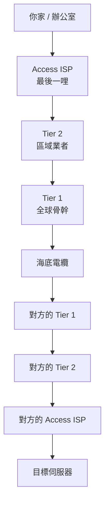
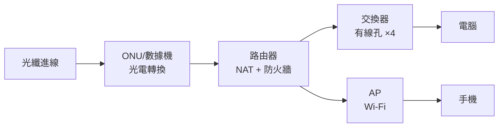

# ISP 與上網方式

> [!abstract] 這篇你會學到
> - 理解 ISP 的**三層結構**，知道你的封包出門後往哪爬
> - 分辨 ADSL、Cable、光纖（FTTx）、行動網路的原理與差別
> - 搞懂**數據機、路由器、分享器、AP** 到底誰是誰
> - 看懂上網合約裡的數字：對稱／非對稱、保證頻寬、固定 IP
> - 知道機關與企業該選什麼線路，以及為什麼要有第二條
> - 理解 **CGNAT** 為什麼讓你架不了伺服器

## 前置知識

- [[010-02-01-guide-網概-網路是什麼]] — 封包交換與 LAN/WAN
- [[010-01-16-guide-計概-網路初體驗]] — 上網會經過哪些設備

---

## 觀念說明

### 核心比喻：網際網路是一套公路系統

| 公路 | 網路 |
| --- | --- |
| **你家門前的巷子** | 最後一哩（你到機房的線路） |
| **市區道路** | Access ISP（接取業者） |
| **省道、快速道路** | Tier 2 區域業者 |
| **國道、跨國高速公路** | **Tier 1 骨幹業者** |
| 交流道 | 網路交換中心（IXP） |

你的封包從家裡出發，會**一路往上爬到骨幹，跨過海洋，再往下走到目的地**。



---

## ISP 的三層結構

**ISP**（Internet Service Provider）= 提供網際網路連線服務的業者。

| 層級 | 特徵 | 台灣的例子 |
| --- | --- | --- |
| **Tier 1** | **直連全球骨幹**，與其他 Tier 1 對等互連（peering），**不用付錢給任何人** | 中華電信（國際部分） |
| **Tier 2** | 區域性業者，向 Tier 1 **購買頻寬**（transit） | 台灣大哥大、遠傳 |
| **Access ISP** | **最後一哩**，直接服務家庭與企業 | 各家的接取服務 |

> [!note] 什麼是「對等互連（Peering）」
> 兩個網路彼此說：「**你的流量從我這走，我的流量從你那走，互不收費。**」
>
> 這對雙方都划算，因為省下了向上游購買頻寬的費用。
>
> 對等互連通常發生在 **IXP（網際網路交換中心）** ——
> 台灣有 TWIX 等交換中心，讓國內業者的流量不必繞到國外再回來。

> [!tip] 這解釋了一個實務現象
> 有時候「連國內網站很快，連某個特定網站很慢」，
> 原因可能是：**你的 ISP 跟那個網站的 ISP 之間沒有良好的互連**，
> 流量必須繞很遠的路。
>
> 用 `traceroute` 可以看到這件事：
> ```bash
> $ traceroute 那個很慢的網站
> ```
> 如果你看到封包從台灣繞到日本、再到美國、再繞回台灣 ——
> 那就是路由不佳，而不是你的網路壞了。

---

## 各種上網方式

### 一、ADSL（非對稱數位用戶迴路）

| 項目 | 說明 |
| --- | --- |
| **走什麼線** | **既有的電話銅線** |
| 原理 | 用電話線上高於語音的頻段傳資料，所以可以邊上網邊講電話 |
| 速度 | 下行 2～100 Mbps，**上行遠低於下行** |
| 距離限制 | **離機房越遠越慢**（銅線的訊號衰減） |
| 現況 | **逐步淘汰** |

> [!note] 「非對稱」就是名字裡的 A（Asymmetric）
> 設計者假設「一般人下載遠多於上傳」，
> 所以把大部分頻寬分給下行。
>
> 這在「看網頁、下載檔案」的年代很合理，
> 但在**視訊會議、雲端備份、遠端工作**的今天就很不夠用。

### 二、Cable（有線電視纜線）

| 項目 | 說明 |
| --- | --- |
| **走什麼線** | **有線電視的同軸電纜** |
| 速度 | 下行可到數百 Mbps，上行較低 |
| 特點 | **同一個社區的用戶共享頻寬** |
| 現況 | 部分地區仍在使用 |

> [!warning] Cable 的「共享」特性
> 同軸電纜是**匯流排架構** —— 一個社區的用戶共用同一段線路。
>
> 這代表**尖峰時段（晚上）速度會明顯下降**，
> 因為鄰居們都在用。
>
> 光纖（FTTH）則是每戶獨立線路，沒有這個問題。

### 三、光纖（FTTx）

**FTTx** = Fiber To The x，光纖拉到「哪裡」。

| 縮寫 | 全名 | 光纖拉到 |
| --- | --- | --- |
| **FTTH** | Fiber To The Home | **你家裡**（最好） |
| FTTB | Fiber To The Building | 大樓機房，樓內走銅線 |
| FTTC | Fiber To The Curb | 路邊的機箱，最後一段走銅線 |
| FTTN | Fiber To The Node | 更遠的節點 |

> [!tip] 為什麼要問「光纖拉到哪裡」
> 業者說「光纖上網」，但如果是 FTTC，
> **最後一段仍然是銅線**，速度與品質仍受銅線限制。
>
> **FTTH（光纖到府）**才是完整的光纖，
> 速度穩定、不受距離影響、上行也可以做得很高。

| 項目 | 光纖的優點 |
| --- | --- |
| 速度 | 可達 1 Gbps 甚至 10 Gbps |
| 距離 | **幾乎不受距離影響**（可傳數十公里） |
| 抗干擾 | **完全不受電磁干擾**（傳的是光不是電） |
| 上行 | 可以做到與下行對稱 |

### 四、行動網路（4G / 5G）

| 項目 | 說明 |
| --- | --- |
| 優點 | **不用拉線**，隨處可用，部署極快 |
| 缺點 | 受基地台距離、建築遮蔽、**同時使用人數**影響 |
| 用途 | 行動辦公、臨時據點、**備援線路** |

> [!tip] 行動網路很適合當「備援」
> 機關的主線路（光纖）如果被挖斷，
> 有一條 4G/5G 備援可以維持基本運作。
>
> 現代的**雙 WAN 路由器**可以設定：
> 主線路正常時走光纖，斷線時**自動切換**到行動網路。
> 這叫 **failover**。
>
> 見 `21-防火牆與軟路由` 相關章節。

### 五、專線

| 項目 | 說明 |
| --- | --- |
| 特點 | **保證頻寬**、對稱、有 SLA、固定 IP |
| 價格 | 貴很多（同樣速度可能是家用的十倍以上） |
| 用途 | **機關、企業的重要對外服務**、跨點連線 |

> [!note] 「保證頻寬」vs「最高速率」
> | 用語 | 意思 |
> | --- | --- |
> | 「**最高**可達 300M」 | 家用方案。**沒有保證**，尖峰時可能只有一半 |
> | 「**保證**頻寬 100M」 | 專線。業者**契約保證**這個速度，達不到要賠償 |
>
> 機關對外提供服務時，**保證頻寬比最高速率重要得多**。
> 採購時要看清楚合約寫的是哪一個。

---

## 誰是誰：數據機、路由器、分享器、AP

這四個名詞是新手最混亂的地方。

| 設備 | 做什麼 | 比喻 |
| --- | --- | --- |
| **數據機（Modem）** | **轉換訊號格式**（光訊號／電話訊號 ↔ 網路訊號） | **翻譯機** |
| **路由器（Router）** | 在**不同網路之間**轉送封包，做 NAT | **郵局轉運站** |
| **交換器（Switch）** | 在**同一網段內**轉送資料 | 社區郵差 |
| **無線基地台（AP）** | 把有線網路變成 **Wi-Fi** | 無線電廣播站 |

### 數據機：那隻「小烏龜」

**Modem** = **Mo**dulator + **Dem**odulator（調變器 + 解調變器）。

> [!example] 為什麼需要調變
> 電腦內部的資料是數位訊號（0 和 1 的方波）。
> 但傳輸媒介可能是：
> - 電話銅線（適合傳類比訊號）
> - 同軸電纜（有線電視的頻道訊號）
> - 光纖（光的脈衝）
>
> **數據機負責把數位訊號「翻譯」成該媒介能傳的形式，
> 到對面再翻譯回來。**
>
> - **調變（Modulation）**：數位 → 適合傳輸的訊號
> - **解調變（Demodulation）**：訊號 → 數位

> [!tip] 光纖的「數據機」正確名稱是 ONU/ONT
> 光纖進來的那個盒子，嚴格說是
> **ONU**（Optical Network Unit）或 **ONT**（Optical Network Terminal），
> 負責光電轉換。但大家還是習慣叫它「數據機」或「小烏龜」。

### 家用「分享器」其實是四合一



你家那台小盒子通常同時是：
- **路由器**（連接家用網路與網際網路，做 NAT）
- **交換器**（後面那 4 個網路孔）
- **無線基地台**（Wi-Fi）
- 有時還是**數據機**與**簡易防火牆**

> [!note] 企業與機關則是「分開的獨立設備」
> | 家用 | 企業 |
> | --- | --- |
> | 一台分享器搞定 | **路由器／防火牆**（獨立，功能強大） |
> | | **交換器**（24/48 埠，可管理，支援 VLAN） |
> | | **AP**（多台，由控制器統一管理） |
> | | 有時還有獨立的 **UTM/NGFW** |
>
> 分開的原因：每一項都需要更專業的功能與更高的效能，
> 而且**壞一個不會全部停擺**。
> 見 [[040-01-01-guide-網路設備-網路架構基礎]]。

---

## 看懂上網合約

### 對稱 vs 非對稱

```
300M/100M   ← 下行 300 Mbps、上行 100 Mbps（非對稱）
100M/100M   ← 上下行都是 100 Mbps（對稱）
```

> [!warning] 上行才是機關與企業的關鍵
> **下行**是「別人傳給你」（你在下載、瀏覽）。
> **上行**是「你傳給別人」。
>
> 需要高上行的情況：
> | 情境 | 為什麼吃上行 |
> | --- | --- |
> | **架設對外網站** | 每個訪客都是從你這裡下載 |
> | **VPN 讓同仁連進來** | 內部資料要傳出去 |
> | **視訊會議當主持端** | 你的畫面要傳給所有人 |
> | **雲端備份** | 大量資料往外送 |
> | **遠端桌面被連入** | 畫面持續往外傳 |
>
> **家用非對稱線路架伺服器，上行會立刻變成瓶頸。**

### 固定 IP vs 浮動 IP

| | **浮動 IP（動態）** | **固定 IP（靜態）** |
| --- | --- | --- |
| 特性 | 每次連線可能不同 | **永遠是同一個** |
| 家用方案 | 通常是這個 | 要加價 |
| 能不能架伺服器 | 困難（IP 會變） | ✅ |
| 比喻 | 每次租車拿到不同車牌 | 自己買車，固定車牌 |

> [!tip] 沒有固定 IP 但想架服務怎麼辦
> | 方法 | 說明 |
> | --- | --- |
> | **DDNS**（動態 DNS） | 用一個固定的網域名稱，IP 變了自動更新對應 |
> | 反向隧道 / 內網穿透 | Cloudflare Tunnel、ngrok、Tailscale 等 |
> | 租雲端主機 | 把服務放到有固定 IP 的地方 |
>
> **但機關對外服務應該申請固定 IP**，
> 因為要做防火牆白名單、憑證、DNS 記錄都需要穩定的 IP。

### CGNAT：為什麼你連 DDNS 都沒用

> [!danger] CGNAT 是現代家用網路的一個大坑
> **CGNAT**（Carrier-Grade NAT，電信級 NAT）是 ISP 為了節省
> IPv4 位址而做的：**讓好幾百個用戶共用同一個公有 IP**。
>
> ```
> 你的電腦 (192.168.1.10)
>     ↓ 你家分享器 NAT
> 你家對外 (100.64.x.x)   ← 這仍然是私有位址範圍！
>     ↓ ISP 的 CGNAT
> 真正的公有 IP (203.x.x.x)  ← 跟其他幾百戶共用
> ```
>
> **後果**：
> - **從外面完全連不進來**（連埠轉發都沒用，因為你不控制 ISP 的 NAT）
> - DDNS 也救不了（DDNS 只解決 IP 會變的問題，不解決 NAT）
> - 部分 P2P 應用、線上遊戲的主機功能失效
>
> **怎麼判斷你在 CGNAT 後面**：
> 1. 看分享器 WAN 口的 IP
> 2. 如果它是 `100.64.0.0 ～ 100.127.255.255` 範圍內，
>    或是 `10.x`、`172.16-31.x`、`192.168.x` → **你在 CGNAT 後面**
> 3. 對照 <https://whatismyip.com> 顯示的 IP，若與 WAN 口 IP 不同 → 也是
>
> **解法**：向 ISP **申請固定 IP** 或「真實 IP」（通常要加價）。

---

## 完整實戰範例

### 追蹤你的封包往哪走

```bash
# Linux / macOS
$ traceroute -n www.google.com

# Windows
> tracert www.google.com
```

**範例輸出解讀**：

```
 1  192.168.1.1        1.234 ms      ← 你家分享器
 2  100.64.12.1        8.512 ms      ← ISP 的 CGNAT 節點
 3  168.95.98.254     12.334 ms      ← 中華電信接取層
 4  220.128.x.x       13.001 ms      ← 中華電信骨幹
 5  203.75.x.x        14.223 ms      ← 國內交換中心
 6  72.14.x.x         45.882 ms      ← 進入 Google 網路（延遲跳升 = 跨海）
 7  142.250.x.x       46.115 ms      ← 目的地
```

> [!tip] 怎麼從 traceroute 判斷問題
> | 觀察 | 意義 |
> | --- | --- |
> | **第 1 跳就不通** | 你到分享器的問題（線、網卡、IP 設定） |
> | 第 2 跳不通 | 分享器到 ISP 的問題（打電話給 ISP） |
> | **某一跳延遲突然跳升 30ms 以上** | 通常是**跨海**（正常現象） |
> | 某一跳開始一直 `* * *` | 那台設備不回應（**可能是正常的，很多路由器不回 ICMP**） |
> | 最後幾跳來回跳很多次 | 路由不穩定或有負載平衡 |
> | **中間看到 `100.64.x.x`** | **你在 CGNAT 後面** |

### 確認你的真實對外 IP

```bash
# Linux
$ curl -s ifconfig.me
203.x.x.x

$ curl -s https://api.ipify.org
203.x.x.x

# 對照分享器 WAN 口的 IP
# 若兩者不同 → 你在 CGNAT 後面
```

```powershell
# Windows
(Invoke-RestMethod ifconfig.me)
```

### 測試實際速度

```bash
# 安裝測速工具
$ sudo apt install speedtest-cli
$ speedtest-cli
Testing download speed......
Download: 287.42 Mbit/s
Testing upload speed......
Upload: 96.31 Mbit/s
```

> [!warning] 測速結果比合約低是正常的
> 合約寫 300M/100M，實測 287/96 —— 這是**正常且良好**的。
>
> 損耗來自：
> - 封包標頭的額外開銷（約 5～10%）
> - 測速伺服器本身的負載
> - Wi-Fi 或線材品質
> - 你的電腦網卡與 CPU
>
> **只有落差超過 30% 才需要進一步排查。**

**排查順序**：

```bash
# 1. 確認網卡協商速度（不是 100Mb/s 才對）
$ sudo ethtool eth0 | grep Speed
        Speed: 1000Mb/s

# 2. 用有線而非 Wi-Fi 再測一次

# 3. 直接接在數據機上測（排除分享器的問題）

# 4. 換一台電腦測（排除單機問題）
```

### 檢查是不是在 CGNAT 後面

```bash
#!/usr/bin/env bash
# 檢查是否處於 CGNAT 之後
WAN_IP=$(ip route get 8.8.8.8 2>/dev/null | awk '{print $7; exit}')
REAL_IP=$(curl -s --max-time 5 ifconfig.me)

echo "本機對外介面 IP：$WAN_IP"
echo "網際網路看到的 IP：$REAL_IP"

case "$REAL_IP" in
  10.*|192.168.*|172.1[6-9].*|172.2[0-9].*|172.3[01].*|100.6[4-9].*|100.[7-9]*|100.1[01][0-9].*|100.12[0-7].*)
    echo "⚠ 你的對外 IP 仍是私有／CGNAT 範圍，無法從外部直接連入"
    ;;
  *)
    echo "✓ 你有真實的公有 IP"
    ;;
esac
```

---

## 機關與企業的線路規劃

> [!tip] 三個原則
> **一、對外服務一定要用「保證頻寬」與「對稱」線路。**
> 家用的「最高 300M」在尖峰時可能只剩一半，
> 而且上行不足會讓訪客覺得你的網站很慢。
>
> **二、要有第二條線路（不同業者、不同路徑）。**
> ```
> 主線：中華電信光纖專線
> 備援：另一家業者的線路，或 5G
> ```
> **重點是「不同業者」與「不同實體路徑」** ——
> 如果兩條線走同一條管道，怪手一挖就兩條都斷。
>
> **三、把「線路中斷」納入演練。**
> 拔掉主線，確認：
> - 是否真的自動切換到備援？
> - 切換要多久？
> - 切換後哪些服務會受影響？
> - VPN 連線會不會斷掉？
>
> 沒演練過的備援，等於沒有備援。

> [!warning] 頻寬與 SLA 要寫進合約
> 採購網路線路時，規格書應載明：
> | 項目 | 範例 |
> | --- | --- |
> | 頻寬類型 | **保證頻寬**（非「最高可達」） |
> | 對稱性 | 上下行皆 ≥ 100 Mbps |
> | 固定 IP | 提供 ≥ 8 個公有固定 IP |
> | 可用性 SLA | ≥ 99.9%，未達標的賠償方式 |
> | 障礙回應時間 | 4 小時內到場 |
> | 路徑 | 與現有線路走**不同實體路徑** |

---

## 常見錯誤與排錯

| 現象 | 原因 | 解法 |
| --- | --- | --- |
| 埠轉發設好了但外面連不進來 | **在 CGNAT 後面** | 向 ISP 申請固定／真實 IP |
| 實測速度只有合約的一半 | 尖峰時段、Wi-Fi、線材、共享頻寬 | 用有線直接接數據機測；確認 `ethtool` 協商速度 |
| 「1G 光纖」但只跑到 100M | **網路線是 Cat5** 或網卡只有 100M | 換 Cat5e/Cat6；檢查 `ethtool` |
| 上傳超慢 | 家用線路**非對稱** | 確認合約的上行速率；企業應選對稱 |
| 晚上特別慢 | Cable 共享頻寬，或 ISP 尖峰壅塞 | 換 FTTH；或改用專線 |
| 連某個網站特別慢，其他都正常 | **路由不佳**（ISP 之間互連不良） | `traceroute` 確認；向 ISP 反映 |
| DDNS 設好了還是連不進來 | DDNS 只解決 IP 會變，**不解決 CGNAT** | 申請真實 IP，或用內網穿透方案 |
| 主線斷了備援沒切過去 | 沒設定 failover，或設定錯誤 | 設定雙 WAN 自動切換並**實際演練** |
| 兩條線路一起斷 | 走同一條實體管道 | 採購時要求**不同實體路徑** |
| traceroute 中間出現 `* * *` | 該設備不回應 ICMP | **通常是正常的**，只要最後有到達就好 |
| 換了新分享器就上不了網 | 有些 ISP 綁定 MAC，或需要 PPPoE 帳密 | 複製舊設備的 MAC；重新輸入 PPPoE 帳密 |

---

## 安全性注意事項

> [!danger] 家用／小型分享器是常見的入侵點
> **必做的五件事**：
> 1. **改掉預設管理密碼**（`admin`/`admin` 是攻擊者的第一個嘗試）
> 2. **關閉 WAN 端遠端管理** —— 這等於把管理介面暴露在整個網際網路上
> 3. **定期更新韌體**
> 4. Wi-Fi 使用 **WPA3**（或至少 WPA2-AES），密碼 ≥ 16 字元
> 5. **關閉 WPS**（那個一鍵連線按鈕有已知的 PIN 暴力破解弱點）
>
> 被入侵的分享器可以：
> - **竄改 DNS 設定**，把你導向假的網銀網站
> - 監看所有未加密的流量
> - 成為殭屍網路的一員去攻擊別人

> [!warning] 檢查你的 DNS 有沒有被竄改
> 這是分享器被入侵最常見的症狀。
> ```bash
> # 看你實際在用哪台 DNS
> $ resolvectl status | grep 'DNS Servers'
> # 或
> $ cat /etc/resolv.conf
> ```
> ```powershell
> ipconfig /all | findstr "DNS Servers"
> ```
>
> **如果出現你不認識的 IP**（不是你的分享器、不是 ISP、不是 8.8.8.8 這類公用 DNS），
> 就要高度懷疑。
>
> 症狀：某些網站被導向奇怪的頁面、瀏覽器出現大量廣告、
> 網銀網站的憑證警告。

> [!warning] PPPoE 帳密的保管
> 很多 ISP 用 **PPPoE** 撥接驗證。
> 那組帳號密碼**等於你的網路服務身分**，
> 洩漏後別人可以冒用你的線路（並且所有行為記在你頭上）。
>
> 不要把它寫在便條紙貼在分享器上（這很常見），
> 也不要在分享器的管理介面開放給所有人看。

> [!tip] 機關對外連線的額外考量
> | 項目 | 說明 |
> | --- | --- |
> | **記錄保存** | 依《資通安全管理法》與相關規範，連線紀錄需保存一定期間 |
> | **對外服務放 DMZ** | 不要讓網站直接放在內網 |
> | **上下行流量監控** | 異常的大量上傳可能代表資料外洩 |
> | **DDoS 防護** | 對外服務應評估清洗服務或 CDN |
>
> 見 [[090-05-11-guide-資安設備-DDoS防護與CDN]] 與 [[090-07-07-guide-資安實踐-台灣資安法規與個資法]]。

---

## 速查表

### ISP 層級

| 層級 | 特徵 |
| --- | --- |
| **Tier 1** | 直連全球骨幹，彼此對等互連不收費 |
| Tier 2 | 區域業者，向 Tier 1 買頻寬 |
| Access ISP | 最後一哩，直接服務用戶 |

### 上網方式比較

| 方式 | 媒介 | 速度 | 對稱 | 現況 |
| --- | --- | --- | --- | --- |
| ADSL | 電話銅線 | 低 | ❌ | 淘汰中 |
| Cable | 同軸電纜 | 中 | ❌ | 部分地區 |
| **FTTH** | **光纖到府** | **高** | 可對稱 | **主流** |
| 4G/5G | 無線 | 中～高 | 視情況 | 行動／備援 |
| 專線 | 專屬 | 保證 | ✅ | 企業／機關 |

### 設備分工

| 設備 | 做什麼 |
| --- | --- |
| **數據機／ONU** | 訊號格式轉換 |
| **路由器** | 跨網路轉送 + NAT |
| **交換器** | 同網段轉送 |
| **AP** | 提供 Wi-Fi |

### 合約關鍵字

| 用語 | 意思 |
| --- | --- |
| 「最高可達 300M」 | 家用，**無保證** |
| 「保證頻寬 100M」 | 專線，**契約保證** |
| 300M/100M | 下行/上行（非對稱） |
| 100M/100M | **對稱** |
| 浮動 IP | 每次連線可能不同 |
| **固定 IP** | 永遠同一個（架服務必需） |
| **CGNAT** | 多戶共用公有 IP，**外面連不進來** |

### CGNAT 判斷

WAN 口 IP 若落在以下範圍，你在 CGNAT 後面：
```
100.64.0.0 ～ 100.127.255.255    ← CGNAT 專用範圍
10.x.x.x / 172.16-31.x.x / 192.168.x.x
```

### 常用指令

| 目的 | 指令 |
| --- | --- |
| 追蹤路徑 | `traceroute -n 目標` / `tracert 目標` |
| 查真實對外 IP | `curl -s ifconfig.me` |
| 測速 | `speedtest-cli` |
| 網卡協商速度 | `sudo ethtool eth0 \| grep Speed` |
| 看目前 DNS | `resolvectl status` / `ipconfig /all` |

---

## 練習題

> [!question]- 練習 1：追蹤你的封包
> ```bash
> traceroute -n 8.8.8.8
> traceroute -n www.gov.tw
> ```
> 回答：
> 1. 第一跳是誰？（應該是你的分享器）
> 2. 第二跳的 IP 在 `100.64.x.x` 範圍嗎？（判斷 CGNAT）
> 3. 哪一跳的延遲突然跳升？那大概是跨海的位置
> 4. 連國內網站與國外網站的跳數差多少？

> [!question]- 練習 2：檢查你是不是在 CGNAT 後面
> 1. 登入你的分享器，記下 **WAN 口的 IP**
> 2. 執行 `curl -s ifconfig.me`（或開 whatismyip.com）
> 3. 兩者相同嗎？
>
> **不同 → 你在 CGNAT 後面，架不了對外服務。**
> 相同且不在私有範圍 → 你有真實公有 IP。

> [!question]- 練習 3：規劃機關的線路
> 你的機關需要：
> - 100 位同仁上網
> - 對外提供一個網站（一天約 5000 人次）
> - 讓 20 位同仁能 VPN 連回來
> - 每晚備份 50 GB 到雲端
>
> 回答：
> 1. 需要多少下行？多少上行？
> 2. 該選對稱還是非對稱？保證頻寬還是最高速率？
> 3. 需要幾個固定 IP？
> 4. 備援線路怎麼規劃？
>
> 參考方向：
> ```
> 下行：100 人 × 2 Mbps = 200 Mbps
> 上行：網站 30M + VPN 20M + 夜間備份可錯開 = 至少 50～100 Mbps
> → 選「保證頻寬 200M/200M 對稱專線」
> → 固定 IP 至少 8 個（網站、VPN、郵件、備用）
> → 備援：另一家業者的 100M 線路，走不同實體路徑，設定自動 failover
> ```

---

## 小測驗

Q1. ISP 的三層結構是什麼？Tier 1 的特徵是什麼？

Q2. 什麼是「對等互連（Peering）」？它為什麼對雙方都划算？

Q3. FTTH 與 FTTC 的差別是什麼？為什麼要問「光纖拉到哪裡」？

Q4. Cable 網路為什麼晚上特別慢？光纖（FTTH）有這個問題嗎？

Q5. 數據機（Modem）的名字是怎麼來的？它在做什麼？

Q6. 家用「分享器」通常同時扮演哪四種角色？企業為什麼要把它們分開？

Q7. 「300M/100M」與「100M/100M」的差別是什麼？機關為什麼該選後者？

Q8. 「最高可達 300M」與「保證頻寬 100M」哪個對機關比較重要？為什麼？

Q9. 什麼是 CGNAT？它為什麼讓埠轉發與 DDNS 都失效？怎麼判斷自己是不是在 CGNAT 後面？

Q10. 機關規劃備援線路時，為什麼「不同業者」還不夠，還要「不同實體路徑」？

> [!question]- 測驗答案
> **Q1.** **Tier 1**（全球骨幹，彼此對等互連）、
> **Tier 2**（區域業者，向 Tier 1 購買頻寬）、
> **Access ISP**（最後一哩，直接服務家庭與企業）。
> **Tier 1 的特徵是直連全球骨幹、與其他 Tier 1 對等互連，
> 不需要向任何人購買 transit（不用付錢給任何上游）。**
>
> **Q2.** 對等互連是兩個網路約定：
> 「**你的流量從我這走，我的流量從你那走，互不收費**」。
> 划算是因為**雙方都省下了向上游購買頻寬（transit）的費用**。
> 通常在 IXP（網際網路交換中心）進行，
> 也讓國內流量不必繞到國外再回來。
>
> **Q3.** **FTTH（Fiber To The Home）光纖拉到你家裡**；
> **FTTC（Fiber To The Curb）只拉到路邊機箱，最後一段仍走銅線**。
> 要問「拉到哪裡」是因為業者都說「光纖上網」，
> 但如果最後一段是銅線，**速度與品質仍受銅線的距離衰減限制**，
> 只有 FTTH 才能完整發揮光纖的優勢。
>
> **Q4.** 因為 Cable 走**同軸電纜的匯流排架構** ——
> **同一個社區的用戶共享同一段線路的頻寬**，
> 晚上大家都在用，速度就明顯下降。
> **光纖 FTTH 是每戶獨立線路，沒有這個問題。**
>
> **Q5.** Modem = **Mo**dulator + **Dem**odulator（調變器 + 解調變器）。
> 它負責把電腦的**數位訊號翻譯成傳輸媒介能傳的形式**
> （電話線的類比訊號、同軸電纜的頻道訊號、光纖的光脈衝），
> 到對面再翻譯回數位。光纖的正確名稱是 ONU/ONT。
>
> **Q6.** ①**路由器**（連接家用網路與網際網路，做 NAT）；
> ②**交換器**（後面那幾個網路孔）；
> ③**無線基地台 AP**（Wi-Fi）；
> ④有時還是**數據機**與簡易防火牆。
> 企業分開是因為**每一項都需要更專業的功能與更高的效能**，
> 而且**壞一個不會全部停擺**。
>
> **Q7.** 「300M/100M」是**非對稱**（下行 300、上行 100）；
> 「100M/100M」是**對稱**（上下行相同）。
> 機關該選對稱，是因為**上行才是關鍵** ——
> 架設對外網站、VPN 讓同仁連入、視訊會議主持端、
> 雲端備份、遠端桌面被連入，全部吃上行頻寬。
>
> **Q8.** **「保證頻寬」比較重要。**
> 「最高可達 300M」是家用方案，**沒有任何保證**，
> 尖峰時段可能只剩一半；
> 「保證頻寬 100M」是專線，**業者以契約保證這個速度，達不到要賠償**。
> 機關對外提供服務時，穩定的保證值遠比漂亮的最高值有意義。
>
> **Q9.** **CGNAT（Carrier-Grade NAT）** 是 ISP 為節省 IPv4 位址，
> **讓好幾百個用戶共用同一個公有 IP**。
> 埠轉發失效是因為**你只控制得了自家分享器的 NAT，
> 控制不了 ISP 那一層的 NAT**；
> DDNS 也救不了，因為 DDNS 只解決「IP 會變」的問題，不解決 NAT。
> **判斷方式**：看分享器 WAN 口的 IP，
> 若落在 **`100.64.0.0～100.127.255.255`** 或其他私有範圍，
> 或與 `curl ifconfig.me` 查到的 IP 不同 → 你在 CGNAT 後面。
>
> **Q10.** 因為兩家業者的線路**可能共用同一條實體管道或同一個人孔** ——
> 一台怪手挖下去，兩條線會同時斷掉，備援完全失效。
> 所以規格書應明確要求備援線路走**不同的實體路徑**，
> 並且要**實際演練切換**（拔掉主線確認自動 failover 是否生效、要多久、
> 哪些服務會受影響）。

---

## 延伸閱讀

- [[010-02-01-guide-網概-網路是什麼]] — 封包交換與網路規模
- [[010-02-04-guide-網概-線材與實體層]] — 光纖與雙絞線的細節
- [[010-02-08-guide-網概-NAT與私有位址]] — NAT 與 CGNAT 的運作原理
- [[010-02-17-guide-網概-網路排錯入門]] — traceroute 與排錯方法
- [[010-02-18-guide-網概-網路安全基礎]] — 分享器的資安防護
- [[090-05-11-guide-資安設備-DDoS防護與CDN]] — 對外服務的流量防護（進階）
