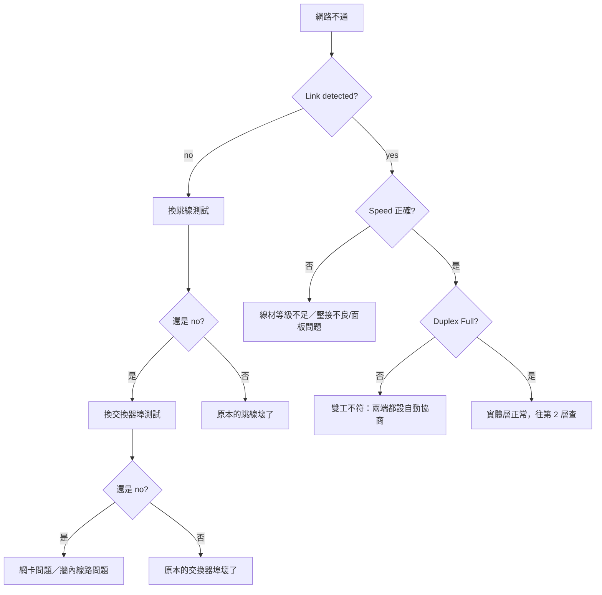

# 線材與實體層

> [!abstract] 這篇你會學到
> - 用**水管與喇叭**的比喻理解訊號怎麼在實體世界傳送
> - 分辨 Cat5 / Cat5e / Cat6 / Cat6a 的差別，以及**選錯線會怎樣**
> - 理解**雙絞線為什麼要「絞」**（這個設計很聰明）
> - 認識 UTP 與 STP，知道什麼時候需要遮蔽線
> - 看懂光纖的**單模 vs 多模**、SC/ST/LC 接頭、以及光纖為什麼不能折
> - 看懂 `10Base5`、`1000BASE-T` 這類乙太網路命名規則
> - 分辨**單工、半雙工、全雙工**
> - 學會實體層的排錯方法

## 前置知識

- [[010-02-03-guide-網概-網路分層模型]] — 實體層在整個模型中的位置
- [[010-01-12-guide-計概-輸入輸出與週邊設備]] — 網路孔與接頭

---

## 觀念說明

### 實體層在做什麼

**把 0 和 1 變成「真的能在世界上跑的東西」。**

| 媒介 | 0 和 1 變成什麼 |
| --- | --- |
| **銅線** | **電壓的高低變化** |
| **光纖** | **光的有無／強弱** |
| **無線** | **電磁波的調變** |

> [!example] 用手電筒傳訊息來理解
> 你和對面大樓的朋友約好：**亮 1 秒 = 1，暗 1 秒 = 0**。
> 這樣就能傳資料了。
>
> 實體層要解決的問題全部都在這個比喻裡：
> | 問題 | 對應 |
> | --- | --- |
> | 一秒能閃幾次？ | **傳輸速率** |
> | 太遠了看不清楚 | **訊號衰減、距離限制** |
> | 旁邊有路燈干擾 | **雜訊、電磁干擾** |
> | 怎麼知道一個位元開始與結束 | **編碼與時脈同步** |
> | 你在打訊號時對方也在打 | **半雙工 vs 全雙工** |

---

## 傳輸模式：單工、半雙工、全雙工

| 模式 | 說明 | 比喻 |
| --- | --- | --- |
| **單工（Simplex）** | **只能單向傳輸** | **廣播電台**（只能聽，不能回話） |
| **半雙工（Half-duplex）** | 雙向可傳，但**不能同時** | **對講機**（要說「Over」才換人） |
| **全雙工（Full-duplex）** | 雙向**可同時**傳輸 | **電話**（兩個人可以同時講話） |

| 實際例子 | 模式 |
| --- | --- |
| 電視廣播、鍵盤到電腦 | 單工 |
| 老式的**集線器（Hub）**、無線對講機 | **半雙工** |
| **現代交換器的每個埠** | **全雙工** |
| Wi-Fi | **半雙工**（同一頻道同時只能一方傳） |

> [!warning] Duplex Mismatch：一端全雙工、一端半雙工
> 這是實務上很陰險的問題：
> **網路仍然「會通」，但速度慢到不可思議**（可能只剩 1% 效能），
> 而且錯誤計數不斷增加。
>
> ```bash
> $ sudo ethtool eth0 | grep -E 'Speed|Duplex'
>         Speed: 100Mb/s
>         Duplex: Half              ← 應該是 Full！
>
> $ ip -s link show eth0
> RX: bytes  packets  errors  dropped
>            ...      1234    56     ← errors 一直增加
> ```
>
> **原因**：一端設成自動協商、另一端手動固定，
> 協商失敗時會退回半雙工。
>
> **解法**：**兩端都設自動協商**，或**兩端都手動設成相同的值**。
> 千萬不要一端自動、一端手動。

> [!note] Wi-Fi 為什麼是半雙工
> 無線電波是共享媒介 —— 同一個頻道上，
> **同一時間只能有一方在發射**，否則會互相干擾。
>
> 這就是為什麼 Wi-Fi 標示「速率 1200 Mbps」，
> 但實際吞吐量常常只有一半左右 ——
> 因為要在收與發之間輪流。
>
> 詳見 [[010-02-15-guide-網概-無線網路與WiFi]]。

---

## 雙絞線（Twisted Pair）

這是你辦公室裡最常見的網路線。

### 為什麼要「絞」

> [!example] 這是一個非常聰明的設計
> 兩條平行的電線經過馬達、日光燈、電源線旁邊時，
> 會**感應到干擾電流**（就像收音機靠近電腦會有雜音）。
>
> **如果兩條線互相纏繞**：
> ```
> 干擾源
>    ↓  ↓  ↓
> ──╳──╳──╳──   兩條線不斷交換位置
> ```
> 因為兩條線在每個位置都輪流靠近干擾源，
> **兩條線受到的干擾幾乎完全相同**。
>
> 而網路訊號是用「**兩條線的電壓差**」來表示的
> （這叫**差動訊號 differential signaling**），
> 所以只要兩條線受到的干擾一樣，**相減之後干擾就抵銷了**。
>
> **絞得越密，抗干擾能力越好** —— 這就是 Cat6 比 Cat5e 好的原因之一。

### UTP vs STP

| | **UTP**（無遮蔽） | **STP**（遮蔽） |
| --- | --- | --- |
| 全名 | Unshielded Twisted Pair | Shielded Twisted Pair |
| 差別 | 只有絞線 | **多了金屬網／鋁箔遮蔽層** |
| 抗干擾 | 一般 | **更好** |
| 價格 | 便宜 | 較貴 |
| 施工 | 簡單 | **必須正確接地才有效** |
| 用在哪 | **絕大多數辦公室** | 工廠、機房、強電磁干擾環境 |

> [!danger] STP 沒有正確接地反而更糟
> 遮蔽層必須**接地**才能把干擾導走。
>
> 如果沒接地，那層金屬會變成一根**天線**，
> **反而吸收更多干擾**，效果比 UTP 還差。
>
> 而且如果兩端都接地但接的是不同電位的地，
> 還會產生**地迴路電流（ground loop）**，造成訊號問題甚至設備損壞。
>
> **實務建議**：一般辦公室用 **UTP 就好**。
> 只有在確定有強干擾（工廠、變電室旁）且**能正確施工接地**時才用 STP。

### 線材等級（Category）

| 等級 | 最高速率 | 頻寬 | 距離 | 現況 |
| --- | --- | --- | --- | --- |
| Cat3 | 10 Mbps | 16 MHz | 100 m | 淘汰（電話線） |
| **Cat5** | **100 Mbps** | 100 MHz | 100 m | **淘汰，但辦公室還很多** |
| **Cat5e** | **1 Gbps** | 100 MHz | 100 m | **最低標準** |
| **Cat6** | **1 Gbps**（10G 限 55m） | 250 MHz | 100 m | **目前主流** |
| **Cat6a** | **10 Gbps** | 500 MHz | 100 m | 10G 佈線 |
| Cat7 / Cat8 | 10～40 Gbps | 600 MHz+ | 較短 | 資料中心 |

> [!danger] 這是機關網路最常見的隱形問題
> **「我們有 Gigabit 交換器和 Gigabit 網卡，為什麼只跑 100 Mbps？」**
>
> 因為**牆裡的線是 Cat5**（不是 5e）。
>
> 老建築的網路佈線可能是十幾年前做的，
> 當時 Cat5 是主流。**外觀完全看不出來**，
> 要看線身上印的字：
> ```
> CAT 5E UTP 4PR 24AWG ...      ← 看這裡
> ```
>
> **確認方法**：
> ```bash
> $ sudo ethtool eth0 | grep Speed
>         Speed: 100Mb/s        ← 應該是 1000Mb/s
> ```
> 如果換一條新的 Cat6 跳線就變成 1000Mb/s，
> 那問題就在牆內的線或面板。

> [!tip] 現在新佈線一律用 Cat6 或 Cat6a
> 價差不大，但：
> - **佈線的工錢遠高於線材本身**（開牆、走管、接面板、測試）
> - 一次佈線要用十幾年
> - Cat6a 可以支撐未來的 10G 需求
>
> **不要為了省一點線材錢，十年後要重新開牆。**

### RJ45 接頭與線序

**RJ45**（正式名稱 **8P8C**：8 Position 8 Contact）
就是俗稱的「水晶頭」。

雙絞線裡有 **4 對（8 條）** 不同顏色的線，兩兩纏繞。

**兩種標準線序**：

| 腳位 | **T568A** | **T568B**（台灣較常用） |
| --- | --- | --- |
| 1 | 白綠 | **白橙** |
| 2 | 綠 | **橙** |
| 3 | 白橙 | **白綠** |
| 4 | 藍 | 藍 |
| 5 | 白藍 | 白藍 |
| 6 | 橙 | **綠** |
| 7 | 白棕 | 白棕 |
| 8 | 棕 | 棕 |

> [!note] 直通線 vs 跳線（交叉線）
> | 類型 | 兩端線序 | 用途 |
> | --- | --- | --- |
> | **直通線（Straight-through）** | **兩端相同**（都 B 或都 A） | 電腦 ↔ 交換器（**99% 的情況**） |
> | **交叉線（Crossover）** | **一端 A、一端 B** | 電腦 ↔ 電腦（早期） |
>
> **現代設備幾乎都支援 Auto-MDIX**（自動偵測並調整），
> 所以**交叉線幾乎不再需要**。
> 但老舊設備或某些工控設備仍可能需要。

> [!warning] 壓接品質決定一切
> 自己壓水晶頭時最常見的三個錯誤：
> 1. **解絞太長** —— 為了好排列而把絞線拆開太多（超過 13mm），
>    這一段就失去抗干擾能力
> 2. **沒有壓到底** —— 金屬刀片沒有完全刺穿線芯的絕緣層
> 3. **外皮沒有被固定** —— 應該讓水晶頭的尾端夾住外皮，
>    否則一拉扯線芯就會鬆脫
>
> **症狀**：時通時不通、速度只協商到 100M、錯誤計數增加。
>
> **建議**：關鍵位置（伺服器、交換器之間）用**原廠成品跳線**，
> 不要自己壓。自己壓的線壓完一定要用**測線器**測。

---

## 光纖（Fiber Optic）

### 光纖的構造

```
┌─────────────────────────────────────┐
│  外皮（PVC 保護層）                    │
│  ┌───────────────────────────────┐  │
│  │  強化纖維（抗拉）                 │  │
│  │  ┌─────────────────────────┐  │  │
│  │  │  塗層 Cladding（折射率較低）│  │  │
│  │  │  ┌───────────────────┐  │  │  │
│  │  │  │  纖芯 Core（傳光）  │  │  │  │
│  │  │  └───────────────────┘  │  │  │
│  │  └─────────────────────────┘  │  │
│  └───────────────────────────────┘  │
└─────────────────────────────────────┘
```

> [!note] 光為什麼不會漏出去：全反射
> **塗層（Cladding）的折射率比纖芯低**，
> 所以光線以夠小的角度射入時會發生**全反射**，
> 一路在纖芯裡「彈」到終點，幾乎不會漏出去。
>
> 這就是塗層的作用 —— 它不是保護層，是**光學結構的一部分**，
> 負責「**防止光的損失，確保訊號穩定傳輸**」。

### 單模 vs 多模

| | **單模（Single-mode, SMF）** | **多模（Multi-mode, MMF）** |
| --- | --- | --- |
| 纖芯直徑 | **約 9 µm**（極細） | 50 或 62.5 µm |
| 光源 | **雷射** | LED 或 VCSEL |
| 光的路徑 | **只有一條**直線路徑 | **多條**不同角度的路徑 |
| 距離 | **數十～上百公里** | 較短（10G 約 300～400 m） |
| 成本 | 光纖便宜、**收發器貴** | 光纖較貴、收發器便宜 |
| 外皮顏色 | **黃色**（慣例） | **橘色／水藍色**（OM3/OM4） |
| 用在哪 | **長距離**、電信、跨大樓 | **機房內**、同棟大樓 |

> [!example] 為什麼多模傳不遠
> 想像一根較粗的管子，光可以用**不同角度**進去：
> ```
> 直直走的光 ─────────────────→  先到
> 斜著彈的光 ╱╲╱╲╱╲╱╲╱╲╱╲──→  後到
> ```
> 同一個訊號的光走了**不同長度的路徑**，
> 到達時就會「**散開**」（這叫**模態色散**）。
>
> 距離越遠散得越開，最後 1 和 0 就分不出來了。
>
> **單模的纖芯極細，光只能直直走**，所以沒有這個問題，
> 可以傳非常遠。

> [!warning] 顏色只是慣例，不能完全依賴
> 黃色 = 單模、橘色/水藍 = 多模 是常見慣例，
> 但**不同廠商可能不同**。
>
> **正確做法是看光纖外皮印的字**：
> ```
> OS1 / OS2          → 單模
> OM1 / OM2 / OM3 / OM4 / OM5  → 多模
> ```

### 光纖接頭

| 接頭 | 特徵 | 常用於 |
| --- | --- | --- |
| **SC** | **方形，推拉式**（Push-Pull） | 主要用於**單模**，電信、ODF |
| **ST** | **圓形，卡榫旋轉**（像 BNC） | 主要用於**多模**，較舊 |
| **LC** | **小型方形**，體積約 SC 的一半 | **現代主流**，單模多模都用；SFP 模組都是 LC |
| MPO/MTP | 多芯一次接（12/24 芯） | 資料中心高密度佈線 |

> [!tip] 現在幾乎都是 LC
> 因為交換器的 **SFP/SFP+ 模組**都用 LC 接頭，
> 而且體積小，同樣面板可以插更多。
>
> **SFP**（Small Form-factor Pluggable）是可插拔的光收發模組：
> ```
> SFP    → 1 Gbps
> SFP+   → 10 Gbps
> SFP28  → 25 Gbps
> QSFP+  → 40 Gbps
> QSFP28 → 100 Gbps
> ```
> 好處是**同一台交換器可以依需求換不同的模組**
> （短距離用多模、長距離用單模），不用換整台設備。

### 光纖施工的三大禁忌

> [!danger] 一、不能彎折
> **光纖收納時不能彎折，以免損壞纖芯造成訊號損失。**
>
> 每種光纖都有**最小彎曲半徑**（通常是外徑的 10～20 倍，
> 一般跳線約 3～5 公分）。
>
> 折到超過限制會：
> - **輕微**：光從彎折處漏出去，訊號衰減（可能還是通，但不穩）
> - **嚴重**：纖芯斷裂（**肉眼看不出來，外皮完好**）
>
> **這是機房最常見的光纖故障原因** ——
> 有人整線時把光纖跟網路線一起用束帶綁緊，或塞進轉角。

> [!danger] 二、不能用眼睛看
> **絕對不要直視光纖端面或收發器。**
>
> 單模光纖用的是**紅外線雷射**，**肉眼看不見但會傷害視網膜**，
> 而且因為看不見，你不會有反射性的閉眼保護。
>
> 要檢查通不通，用：
> - **光纖尋障筆（VFL）**：紅光雷射，從另一端看有沒有紅光
> - **光功率計**：測實際的光功率（dBm）
> - **OTDR**（光時域反射計）：專業設備，可測出斷點的距離

> [!danger] 三、端面必須乾淨
> 光纖端面上**一粒灰塵**就可能造成嚴重衰減 ——
> 因為纖芯只有 9 µm，一粒灰塵可能比它還大。
>
> **每次插拔前都應該用專用清潔工具**
> （無塵拭紙 + 光纖清潔液，或一鍵式清潔筆）。
>
> 不要用衛生紙、酒精棉片（會留下纖維與殘留）。

### 光纖排錯

```bash
# 1. 看交換器/網卡有沒有偵測到 Link
$ sudo ethtool eth0 | grep 'Link detected'
        Link detected: no

# 2. 看 SFP 模組的診斷資訊（DDM/DOM）
$ sudo ethtool -m eth0 | grep -iE 'temperature|voltage|power'
        Laser output power   : 0.4521 mW / -3.44 dBm    ← 發射功率
        Receiver signal power: 0.0002 mW / -37.00 dBm   ← 接收功率太低！
```

> [!tip] 接收功率是判斷光纖問題的關鍵
> | 接收功率 | 判斷 |
> | --- | --- |
> | −3 ～ −20 dBm | 正常（依模組規格） |
> | **低於 −25 dBm** | **訊號太弱**：端面髒、彎折、距離太長、接頭沒插好 |
> | 完全沒有讀數 | 對端沒開、光纖斷了、或收發不同波長 |
>
> **常見錯誤**：**TX 與 RX 接反了**。
> 光纖是一對（一收一發），如果兩端都接成「發對發」，
> 就會完全沒有訊號。把其中一端的兩芯對調即可。

---

## 乙太網路命名規則

看到 `10Base5`、`1000BASE-T` 這種寫法，它其實有固定格式：

```
1000  BASE  -  T
 │      │      └── 傳輸媒介／距離
 │      └───────── 傳輸方式
 └──────────────── 傳輸速率（Mbps）
```

| 部分 | 意思 |
| --- | --- |
| **數字** | **速率（Mbps）**。10 = 10Mbps、1000 = 1Gbps、10G = 10Gbps |
| **BASE** | **基頻（Baseband）** —— 整條線只傳一個訊號 |
| BROAD | 寬頻（Broadband）—— 多個訊號分頻共用（現已罕見） |
| **後綴** | 媒介類型或距離 |

**後綴代碼**：

| 代碼 | 意思 |
| --- | --- |
| **數字**（如 `5`） | 距離，單位 **100 公尺**。`10Base5` = 500 公尺 |
| **T** | **雙絞線（Twisted Pair）** |
| **S** | 短波多模光纖（Short，850nm） |
| **L** | 長波單模光纖（Long，1310nm） |
| **X** | 使用 8B/10B 編碼 |
| **LX** | 長波，可用多模或單模 |
| **LR** | 長距離單模（Long Reach） |
| **ER** | 超長距離（Extended Reach） |

> [!example] 實際例子
> | 名稱 | 意思 |
> | --- | --- |
> | `10Base5` | 10 Mbps、基頻、**500 公尺**（古早的粗同軸電纜） |
> | `10BASE-T` | 10 Mbps、基頻、雙絞線 |
> | `100BASE-TX` | 100 Mbps、雙絞線 |
> | **`1000BASE-T`** | **1 Gbps、雙絞線**（最常見） |
> | `1000BASE-SX` | 1 Gbps、短波多模光纖（約 550m） |
> | `1000BASE-LX` | 1 Gbps、長波（多模 550m／單模 5km） |
> | `10GBASE-T` | 10 Gbps、雙絞線（**需 Cat6a**） |
> | `10GBASE-SR` | 10 Gbps、多模光纖（300～400m） |
> | `10GBASE-LR` | 10 Gbps、單模光纖（10km） |

---

## 完整實戰範例：實體層排錯

### 情境：使用者說「網路不通」

```bash
# 步驟 1：有沒有實體連線？
$ sudo ethtool enp3s0
Settings for enp3s0:
        Supported link modes:   10baseT/Half 10baseT/Full
                                100baseT/Half 100baseT/Full
                                1000baseT/Full
        Advertised auto-negotiation: Yes
        Speed: 1000Mb/s              ← 協商速度
        Duplex: Full                 ← 雙工模式
        Auto-negotiation: on
        Link detected: yes           ← 關鍵：有沒有實體連線
```

| 結果 | 判斷 |
| --- | --- |
| `Link detected: no` | **第 1 層問題**：線、孔、對端設備 |
| `Speed: 100Mb/s`（應為 1000） | **線材等級不足**或壓接不良 |
| `Duplex: Half`（應為 Full） | **雙工不符** |

```bash
# 步驟 2：看錯誤計數
$ ip -s link show enp3s0
2: enp3s0: <BROADCAST,MULTICAST,UP,LOWER_UP> mtu 1500
    RX: bytes    packets  errors  dropped  overrun  mcast
        12345678  98765    0       0        0        123
    TX: bytes    packets  errors  dropped  carrier  collsns
        87654321  87654    0       0        0        0
                           ^^^^^^                    ^^^^^^^
                        持續增加 = 實體層問題      有值 = 半雙工碰撞
```

> [!warning] errors 或 collisions 一直增加代表什麼
> | 欄位 | 增加代表 |
> | --- | --- |
> | `RX errors` | 收到損毀的 Frame → **線材、干擾、接頭** |
> | `TX errors` | 送不出去 |
> | `carrier` | 載波偵測錯誤 → **線材或對端設備** |
> | `collisions` | 碰撞 → **半雙工**（全雙工不該有碰撞） |
> | `dropped` | 緩衝區滿了 → 流量太大或 CPU 忙不過來 |

```bash
# 步驟 3：換線測試（最快的驗證）
# 用一條確定沒問題的跳線接到確定沒問題的交換器埠

# 步驟 4：確認交換器那一端
# （Cisco）
switch> show interface GigabitEthernet0/5
GigabitEthernet0/5 is up, line protocol is up
  Full-duplex, 1000Mb/s, media type is 10/100/1000BaseTX
     0 input errors, 0 CRC, 0 frame, 0 overrun
     0 output errors, 0 collisions
```

### 標準排查流程（實體層）



> [!tip] 換線測試是最快的方法
> 不要花二十分鐘看設定，**先花兩分鐘換一條線試試**。
>
> 維修的通用原則：**從最快、最便宜的開始試**。
> 換線 = 兩分鐘 + 零成本；查設定 = 二十分鐘。

### 用測線器與工具

| 工具 | 用途 | 大概價位 |
| --- | --- | --- |
| **簡易測線器** | 確認 8 芯有沒有通、線序對不對 | 幾百元 |
| **尋線器（Toner）** | 從一堆線裡找出某一條 | 一千多元 |
| **網路認證測試儀** | 測 Cat6 是否符合規格（串音、衰減） | 數萬元起 |
| **光纖尋障筆（VFL）** | 紅光，看光纖有沒有斷 | 一千多元 |
| **光功率計** | 測光訊號強度（dBm） | 數千元 |
| **OTDR** | 測出斷點在幾公尺處 | 十萬元起 |

> [!tip] 機關資訊室至少該有的三樣
> 1. **簡易測線器**（判斷線序與通斷）
> 2. **尋線器**（機櫃裡一堆線找不到是哪條時的救星）
> 3. **幾條確定良好的成品跳線**（換線測試用）
>
> 這三樣加起來不到三千元，
> 但能解決你八成的實體層問題。

---

## 常見錯誤與排錯

| 現象 | 原因 | 解法 |
| --- | --- | --- |
| Gigabit 設備只跑 100Mbps | **線材是 Cat5**、壓接不良、或面板品質差 | 換 Cat5e/Cat6；用成品跳線測試 |
| 速度慢到不可思議、errors 一直增加 | **Duplex Mismatch** | 兩端都設自動協商 |
| 時通時不通 | 水晶頭壓接不良、接觸不良 | 重壓或換成品跳線；用測線器測 |
| 網路孔燈完全不亮 | 線斷、埠壞、對端沒開 | 依「換線→換埠」流程排查 |
| 光纖完全沒訊號 | **TX/RX 接反**、端面髒、彎折斷裂 | 對調一端的兩芯；清潔端面；用 VFL 檢查 |
| 光纖接收功率過低（< −25 dBm） | 端面髒、彎折、距離超限、接頭沒插到底 | `ethtool -m` 讀 DOM；清潔並重插 |
| STP 遮蔽線反而干擾更多 | **沒有正確接地** | 正確接地，或改用 UTP |
| 距離超過 100 公尺就不通 | 雙絞線的物理限制 | 中間加交換器；或改用光纖 |
| 自己壓的線用一陣子就壞 | 外皮沒被夾住，線芯鬆脫 | 壓接時確保外皮進入水晶頭尾端 |
| 新裝的 10G 網卡只跑 1G | **線材是 Cat6**（10G 限 55m）或 Cat5e | 換 **Cat6a**；或改用光纖 |
| 機櫃裡光纖被束帶綁緊後斷線 | **彎曲半徑不足** | 光纖要單獨走線，用魔鬼氈不要用束帶勒緊 |
| 找不到某一條線接到哪 | 沒有標籤 | 用尋線器；**日後所有線兩端都要貼標籤** |

> [!tip] 佈線的三個好習慣
> 1. **兩端都貼標籤**（寫明對端位置，如 `→ 3F-機房-SW1-Port12`）
> 2. **留適當長度**，不要拉太緊（溫度變化會熱脹冷縮）
> 3. **文件化**：畫出配線圖並更新
>
> 這三件事在施工時多花一小時，
> 未來十年可以省下無數個排錯的下午。
> 見 [[040-01-18-guide-網路設備-網路設備盤點與文件化]]。

---

## 安全性注意事項

> [!danger] 實體層是最容易被忽略的攻擊面
> **有實體接觸就有一切。**
>
> | 攻擊 | 說明 |
> | --- | --- |
> | **接上抓包設備** | 在線路中間串一個 network tap，複製所有流量 |
> | **接到閒置的網路孔** | 會議室、大廳的網路孔可能直通內網 |
> | **偷接交換器** | 把自己的設備接進機櫃 |
> | **剪線** | 最直接的阻斷服務 |
> | 光纖竊聽 | 微彎光纖讓部分光洩漏出來（**需要專業設備但確實可行**） |
>
> **防護**：
> 1. **機房與配線間門禁管制**
> 2. **停用未使用的交換器埠**（`shutdown`）
> 3. 啟用 **Port Security**（限制每個埠的 MAC 數量）
> 4. 導入 **802.1X**（接上線之前先驗證身分）—— 見 [[090-05-13-guide-資安設備-網路存取控制NAC與802.1X]]
> 5. 公共區域的網路孔放在**訪客 VLAN**
> 6. 線槽使用有鎖的密閉線槽

> [!warning] 未使用的網路孔要關掉
> 這是最便宜也最有效的實體層防護。
>
> ```cisco
> ! Cisco：關閉未使用的埠
> interface range GigabitEthernet0/20 - 24
>  description ** UNUSED - DISABLED **
>  shutdown
>  switchport access vlan 999    ! 丟到一個什麼都不通的 VLAN
> ```
>
> 沒有做這件事的話，任何人走進會議室插上網路線就進了你的內網。
> 見 [[040-01-13-guide-Cisco-埠設定與安全]]。

> [!tip] 光纖比銅線安全一點（但不是絕對）
> - 光纖**不會產生電磁輻射**，所以不能用電磁側錄
> - 但仍可以透過**微彎（micro-bending）**讓光洩漏，用感測器接收
> - 而且**剪斷光纖比剪銅線更容易造成長時間中斷**（接續需要熔接機）
>
> 高機密環境的做法是把光纖放在**加壓的密閉管道**中，
> 壓力變化即代表有人動了線路。

---

## 速查表

### 傳輸模式

| 模式 | 比喻 | 例子 |
| --- | --- | --- |
| 單工 | 廣播電台 | 電視、鍵盤 |
| **半雙工** | **對講機** | **Hub、Wi-Fi** |
| **全雙工** | **電話** | **交換器的埠** |

### 雙絞線等級

| 等級 | 速率 | 距離 | 備註 |
| --- | --- | --- | --- |
| Cat5 | 100M | 100m | **淘汰** |
| **Cat5e** | **1G** | 100m | 最低標準 |
| **Cat6** | 1G（10G 限 55m） | 100m | **主流** |
| **Cat6a** | **10G** | 100m | 10G 佈線 |

### T568B 線序（台灣常用）

```
1 白橙  2 橙  3 白綠  4 藍  5 白藍  6 綠  7 白棕  8 棕
```

### 光纖

| | 單模 SMF | 多模 MMF |
| --- | --- | --- |
| 纖芯 | 9 µm | 50/62.5 µm |
| 光源 | 雷射 | LED/VCSEL |
| 距離 | 數十公里 | 數百公尺 |
| 顏色慣例 | 黃 | 橘／水藍 |
| 標示 | OS1/OS2 | OM1～OM5 |

**接頭**：SC（方形推拉）、ST（圓形旋轉）、**LC（小型，現代主流）**

### 乙太網路命名

```
1000 BASE - T
 │     │     └ 媒介：T=雙絞線、S=短波多模、L=長波、R=長距離
 │     └────── BASE=基頻
 └──────────── 速率 Mbps
```

### 常用指令

| 目的 | 指令 |
| --- | --- |
| 看連線狀態與速度 | `sudo ethtool eth0` |
| 看錯誤計數 | `ip -s link show eth0` |
| 看 SFP 光模組資訊 | `sudo ethtool -m eth0` |
| 看介面 UP/DOWN | `ip link show` |
| Windows | `Get-NetAdapter \| Select Name,LinkSpeed,Status` |

### 排錯口訣

```
1. Link detected?  → no  → 換線、換埠
2. Speed 對嗎？    → 不對 → 線材等級／壓接
3. Duplex Full？   → 不是 → 兩端都設自動協商
4. errors 增加？   → 是   → 線材、干擾、接頭
```

---

## 練習題

> [!question]- 練習 1：檢查你的實體層
> ```bash
> IFACE=$(ip route | awk '/default/{print $5; exit}')
> sudo ethtool $IFACE | grep -E 'Speed|Duplex|Link detected'
> ip -s link show $IFACE
> ```
> 回答：
> 1. 協商到多少速度？是不是 1000Mb/s？
> 2. Duplex 是 Full 嗎？
> 3. errors 與 collisions 是 0 嗎？
>
> 如果速度只有 100Mb/s，去看看那條線身上印的是 Cat5 還是 Cat5e/6。

> [!question]- 練習 2：讀懂乙太網路名稱
> 說出下列各代表什麼：
> 1. `100BASE-TX`
> 2. `1000BASE-T`
> 3. `10GBASE-SR`
> 4. `1000BASE-LX`
> 5. `10Base5`
>
> 參考答案：
> 1. 100 Mbps、基頻、雙絞線
> 2. 1 Gbps、基頻、雙絞線（最常見的 Gigabit 網路）
> 3. 10 Gbps、**多模光纖短距離**（300～400m）
> 4. 1 Gbps、**長波光纖**（多模 550m／單模 5km）
> 5. 10 Mbps、基頻、**500 公尺**（古早的粗同軸電纜）

> [!question]- 練習 3：規劃一次佈線
> 你要為新辦公室規劃網路佈線：
> - 30 個座位，每個座位 2 個網路孔
> - 機房在 1 樓，辦公室在 3 樓（垂直距離約 15 公尺）
> - 未來三年可能需要 10G
>
> 回答：
> 1. 水平佈線用什麼等級的線？為什麼？
> 2. 1 樓到 3 樓的主幹用什麼？為什麼？
> 3. 每個網路孔要怎麼標示？
> 4. 需要準備哪些測試工具？
>
> 參考方向：
> ```
> 1. 水平佈線用 Cat6a（工錢遠高於線材，一次做到位；未來 10G 不用重拉）
> 2. 主幹用光纖（多模 OM4 或單模 OS2）——
>    垂直主幹的流量最大，且不受電磁干擾、可跨樓層
> 3. 標示格式：3F-A12-1（樓層-座位-孔號），機房端對應標示
> 4. 測線器、尋線器、光功率計；驗收時要求廠商提供
>    Cat6a 認證測試報告（Fluke 之類）
> ```

---

## 小測驗

Q1. 單工、半雙工、全雙工的差別是什麼？各舉一個生活比喻與一個實際設備。

Q2. Wi-Fi 是半雙工還是全雙工？為什麼？這造成什麼實際影響？

Q3. 什麼是 Duplex Mismatch？它的症狀為什麼特別「陰險」？該怎麼解決？

Q4. 雙絞線為什麼要「絞」？請說明它抗干擾的原理。

Q5. STP（遮蔽雙絞線）在什麼情況下反而比 UTP 更糟？

Q6. 「我們有 Gigabit 交換器和網卡，為什麼只跑 100 Mbps？」最可能的原因是什麼？怎麼確認？

Q7. 單模與多模光纖的差別是什麼？為什麼多模傳不遠？

Q8. 光纖施工的三大禁忌是什麼？

Q9. `10GBASE-SR` 這個名稱的每一部分代表什麼？

Q10. 為什麼「未使用的交換器埠要關掉」？除此之外還有哪三項實體層的防護？

> [!question]- 測驗答案
> **Q1.** **單工**只能單向傳輸（**廣播電台**；電視、鍵盤）；
> **半雙工**雙向可傳但不能同時（**對講機**；集線器 Hub、Wi-Fi）；
> **全雙工**雙向可同時傳輸（**電話**；現代交換器的每個埠）。
>
> **Q2.** **半雙工。** 因為無線電波是共享媒介，
> **同一個頻道上同一時間只能有一方在發射**，否則會互相干擾。
> 實際影響：Wi-Fi 標示「1200 Mbps」但**實際吞吐量常只有一半左右**，
> 因為要在收與發之間輪流。
>
> **Q3.** 一端設成全雙工、另一端設成半雙工。
> **陰險之處在於「網路仍然會通」** —— 不是完全斷線，
> 而是**速度慢到不可思議**（可能只剩 1% 效能），且錯誤計數持續增加，
> 很容易被誤判成「網路擁塞」或「伺服器慢」。
> **解法**：**兩端都設自動協商**，或兩端都手動設成相同的值；
> 絕對不要一端自動、一端手動。
>
> **Q4.** 網路訊號用「**兩條線的電壓差**」表示（差動訊號）。
> 兩條線互相纏繞後，**在每個位置都輪流靠近干擾源**，
> 因此**兩條線受到的干擾幾乎完全相同**，
> 相減之後**干擾就抵銷了**。
> 絞得越密抗干擾越好，這是 Cat6 優於 Cat5e 的原因之一。
>
> **Q5.** **當遮蔽層沒有正確接地時。**
> 遮蔽層必須接地才能把干擾導走；沒接地的話那層金屬會變成一根**天線**，
> **反而吸收更多干擾**，效果比 UTP 還差。
> 若兩端接到不同電位的地，還會產生**地迴路電流**，
> 造成訊號問題甚至設備損壞。
>
> **Q6.** 最可能是**牆內的線是 Cat5（不是 Cat5e）** ——
> Cat5 只支援 100 Mbps。老建築的佈線可能是十幾年前做的，
> **外觀完全看不出來**。
> **確認方法**：`sudo ethtool eth0 | grep Speed` 看協商速度；
> 換一條確定良好的 Cat6 成品跳線測試，若變成 1000Mb/s，
> 問題就在牆內的線或面板。也要看線身上印的字（`CAT 5E` / `CAT 6`）。
>
> **Q7.** **單模纖芯約 9 µm（極細），用雷射，光只有一條直線路徑**，
> 可傳數十到上百公里；
> **多模纖芯 50/62.5 µm（較粗），用 LED，光有多條不同角度的路徑**。
> 多模傳不遠是因為**同一個訊號的光走了不同長度的路徑**，
> 到達時會「散開」（**模態色散**），距離越遠散得越開，
> 最後 1 和 0 就分不出來了。
>
> **Q8.** ①**不能彎折**（超過最小彎曲半徑會讓光漏出或纖芯斷裂，
> 且**肉眼看不出來**）；
> ②**不能用眼睛直視**（單模用紅外線雷射，**看不見但會傷害視網膜**）；
> ③**端面必須乾淨**（纖芯只有 9 µm，一粒灰塵就可能造成嚴重衰減，
> 要用專用清潔工具，不可用衛生紙或酒精棉片）。
>
> **Q9.** **10G** = 速率 10 Gbps；
> **BASE** = 基頻（Baseband，整條線只傳一個訊號）；
> **S** = 短波（Short wavelength，850nm，**多模光纖**）；
> **R** = 使用 64B/66B 編碼的長距離規格系列。
> 整體代表：**10 Gbps、基頻、多模光纖短距離**（約 300～400 公尺）。
>
> **Q10.** 因為**沒有關掉的話，任何人走進會議室插上網路線就進了你的內網**。
> 這是最便宜也最有效的實體層防護。
> 另外三項防護：
> ①**機房與配線間門禁管制**；
> ②啟用 **Port Security**（限制每個埠的 MAC 數量）；
> ③導入 **802.1X**（接上線之前先驗證身分）；
> （另可加：公共區域網路孔放訪客 VLAN、使用有鎖的密閉線槽。）

---

## 延伸閱讀

- [[010-02-03-guide-網概-網路分層模型]] — 實體層在模型中的位置
- [[010-02-05-guide-網概-MAC位址與交換器]] — 第 2 層：訊框與交換
- [[010-02-15-guide-網概-無線網路與WiFi]] — 無線的實體層
- [[010-01-12-guide-計概-輸入輸出與週邊設備]] — 各種接頭
- [[010-02-17-guide-網概-網路排錯入門]] — 完整的排錯流程
- [[040-01-13-guide-Cisco-埠設定與安全]] — 交換器埠的安全設定（進階）
- [[040-01-18-guide-網路設備-網路設備盤點與文件化]] — 佈線文件化（進階）
