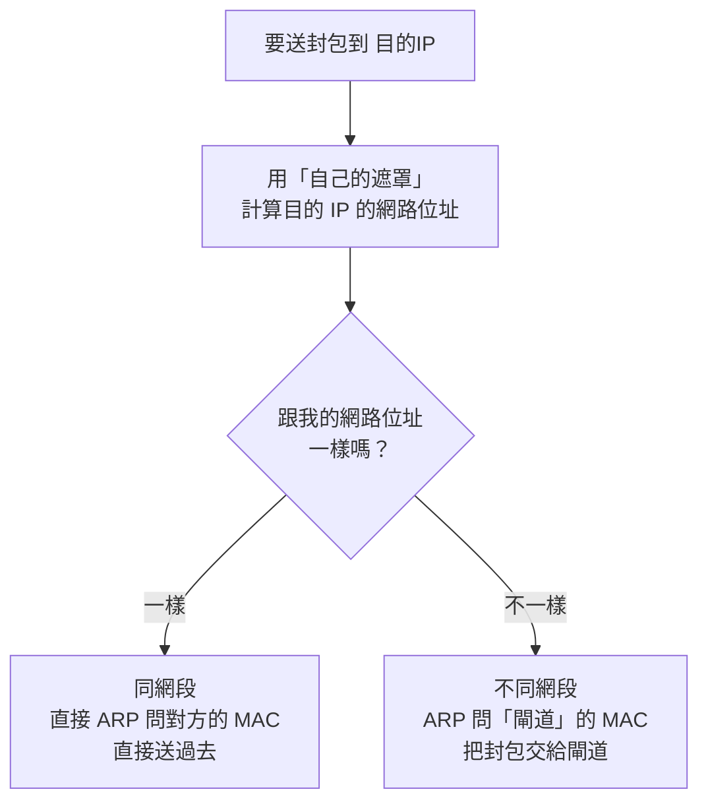
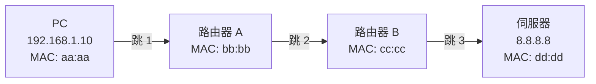

# 路由與封包旅程

> [!abstract] 這篇你會學到
> - 分辨 **Routing（決定路徑）** 與 **Forwarding（實際轉送）**
> - 讀懂**路由表**，理解「最長前綴匹配」的選擇規則
> - 徹底搞懂**預設閘道**在做什麼
> - **理解「MAC 每一跳都變、IP 從頭到尾不變」** —— 這是本篇的核心
> - 分辨靜態路由與動態路由，知道什麼時候用哪個
> - 認識 **ICMP** 與 **TTL**，理解 `ping` 與 `traceroute` 的原理
> - 分辨路由器與三層交換器

## 前置知識

- [[010-02-06-guide-網概-IP位址與子網路]] — 網段的判斷
- [[010-02-05-guide-網概-MAC位址與交換器]] — MAC 與 ARP

---

## 觀念說明

### 核心比喻：郵局的轉運系統

| 郵政 | 網路 |
| --- | --- |
| 社區郵差（同一個社區內送信） | **交換器**（同網段，用 MAC） |
| **郵局轉運站** | **路由器**（跨網段，用 IP） |
| 轉運站的「往哪個方向」清單 | **路由表** |
| 「不知道怎麼走就丟進總郵筒」 | **預設閘道／預設路由** |
| 每個轉運站看一眼地址決定往哪送 | **逐跳轉送（hop-by-hop）** |

> [!note] 一個關鍵事實：沒有人知道完整的路徑
> 你把信投進郵筒時，**郵局並不知道完整的送達路線**。
> 它只知道「往南部的信丟這一車」。
>
> 到了下一個轉運站，那裡的人再決定下一步。
>
> **網際網路完全一樣**：每一台路由器只做一個決定 ——
> 「**這個封包，下一跳該交給誰**」。
> 沒有任何一台路由器知道完整的路徑。
>
> 這種設計叫 **hop-by-hop forwarding**，
> 它讓網路能夠自我修復（某條路斷了，下一跳自動換人）。

---

## Routing vs Forwarding

這兩個詞常被混用，但它們是不同的動作。

| | **Routing（路由）** | **Forwarding（轉送）** |
| --- | --- | --- |
| 做什麼 | **決定**封包該走哪條路徑 | **實際把封包送出去**的動作 |
| 比喻 | **規劃路線**（看地圖） | **開車過去** |
| 何時做 | 事先（建立與維護路由表） | 每一個封包到達時 |
| 速度 | 較慢（控制平面 control plane） | **極快**（資料平面 data plane） |

> [!tip] 現代路由器把兩者分開，就是為了速度
> - **控制平面**：跑路由協定、計算最佳路徑、維護路由表（用 CPU）
> - **資料平面**：查表、轉送封包（用**專用晶片 ASIC**，每秒數億封包）
>
> 這就是為什麼一台幾萬元的交換器能有 TB 級的轉送能力 ——
> 真正的轉送不經過 CPU。

---

## 路由表：路由器的「往哪個方向」清單

### 讀懂路由表

```bash
$ ip route show
default via 192.168.1.1 dev eth0 proto dhcp metric 100
192.168.1.0/24 dev eth0 proto kernel scope link src 192.168.1.10 metric 100
10.8.0.0/24 via 192.168.1.254 dev eth0
```

| 欄位 | 意思 |
| --- | --- |
| `default` | **預設路由** —— 其他規則都不符合時走這裡 |
| `192.168.1.0/24` | **目的網段** |
| `via 192.168.1.1` | **下一跳（next hop）** —— 交給這個 IP |
| `dev eth0` | 從哪個介面送出去 |
| `scope link` | **直連網段**（不需要下一跳，直接送到） |
| `src 192.168.1.10` | 送出時使用的來源 IP |
| `metric 100` | 成本／優先序（**數字越小越優先**） |

**傳統寫法**（`route -n` 或 Windows 的 `route print`）：

```bash
$ route -n
Destination     Gateway         Genmask         Flags Metric Iface
0.0.0.0         192.168.1.1     0.0.0.0         UG    100    eth0
192.168.1.0     0.0.0.0         255.255.255.0   U     100    eth0
10.8.0.0        192.168.1.254   255.255.255.0   UG    0      eth0
^^^^^^^         ^^^^^^^^^^^     ^^^^^^^^^^^^^
目的網段        下一跳(0.0.0.0=直連)  遮罩
```

> [!note] `0.0.0.0/0` 就是 default
> `Destination 0.0.0.0` + `Genmask 0.0.0.0` = `0.0.0.0/0`，
> 代表「**符合所有位址**」——
> 這就是預設路由的技術寫法。

### 最長前綴匹配（Longest Prefix Match）

**當多條路由都符合時，選「最精確」的那一條。**

> [!example] 假設路由表有三條
> ```
> 0.0.0.0/0        via 192.168.1.1     ← 什麼都符合（最不精確）
> 10.0.0.0/8       via 192.168.1.254
> 10.1.2.0/24      via 192.168.1.253   ← 最精確
> ```
>
> 現在要送封包到 **`10.1.2.50`**，三條都符合：
> - `/0` 符合（什麼都符合）
> - `/8` 符合（10.x.x.x）
> - `/24` 符合（10.1.2.x）
>
> **選擇 `/24`**，因為它的前綴最長（最精確）。
>
> **比喻**：
> 你要寄到「台北市信義區信義路 7 號」，郵局的規則是：
> - 「其他地方」→ 走總線
> - 「台北市」→ 走 A 車
> - **「台北市信義區」→ 走 B 車**  ← 選這個，最精確

> [!tip] 這個規則解釋了很多事
> **為什麼 VPN 能只把特定流量導過去？**
> 因為 VPN 加了一條 `10.8.0.0/24 via VPN介面` 的路由，
> 比 default 精確，所以那個網段的流量走 VPN，
> 其他流量仍走原本的 default。
>
> 這叫 **split tunnel（分割通道）**。
>
> 相對地，**full tunnel** 是把 default 路由也改成走 VPN，
> **所有流量都經過公司** —— 機關通常要求這種，
> 因為要監控與過濾所有員工的網路行為。

---

## 預設閘道：不知道就交給它

> [!note] 預設閘道 = 「投進郵筒」
> 你的電腦只認得**自己所在的網段**。
> 對於其他所有目的地，它的策略很簡單：
>
> **「不是我這個網段的，全部交給預設閘道，他會處理。」**
>
> 就像你不需要知道怎麼把信送到巴黎 ——
> **投進郵筒就好。**

### 電腦怎麼決定「要不要交給閘道」



> [!example] 實際走一遍
> 我的設定：`192.168.1.10/24`，閘道 `192.168.1.1`
>
> **情況一：要送到 `192.168.1.20`**
> ```
> 192.168.1.20 AND 255.255.255.0 = 192.168.1.0
> 我的網路位址               = 192.168.1.0
> 相同 → 同網段
> → ARP 問「192.168.1.20 的 MAC 是多少」
> → 直接送
> ```
>
> **情況二：要送到 `8.8.8.8`**
> ```
> 8.8.8.8 AND 255.255.255.0 = 8.8.8.0
> 我的網路位址              = 192.168.1.0
> 不同 → 跨網段
> → 查路由表 → 走 default via 192.168.1.1
> → ARP 問「192.168.1.1（閘道）的 MAC 是多少」
> → 把封包交給閘道
> ```

---

## 本篇最重要的觀念：MAC 會變，IP 不會變

> [!warning] 請務必理解這一節
> 這是計算機網路最容易混淆、也最關鍵的一個觀念。



**每一跳的封包內容**：

| 跳 | 來源 MAC | 目的 MAC | 來源 IP | 目的 IP |
| --- | --- | --- | --- | --- |
| **1**（PC → 路由器A） | `aa:aa` | **`bb:bb`** | 192.168.1.10 | **8.8.8.8** |
| **2**（A → B） | `bb:bb` | **`cc:cc`** | 192.168.1.10 | **8.8.8.8** |
| **3**（B → 伺服器） | `cc:cc` | **`dd:dd`** | 192.168.1.10 | **8.8.8.8** |

> [!tip] 用「接力賽」來記住
> **IP 位址是「終點線」** —— 從頭到尾都一樣，
> 因為那是最終目的地。
>
> **MAC 位址是「下一棒是誰」** —— 每一段都不一樣，
> 因為每一段只跑到下一個人手上。
>
> 換句話說：
> - **第 3 層（IP）** 回答「**這個封包最終要去哪**」
> - **第 2 層（MAC）** 回答「**下一步要交給誰**」

> [!note] 例外：NAT 會改 IP
> 唯一會改變 IP 的是 **NAT**（見 [[010-02-08-guide-網概-NAT與私有位址]]）。
> 你家的路由器會把來源 IP 從 `192.168.1.10` 改成公有 IP。
>
> 但**目的 IP 仍然不變**（除非是目的地 NAT／埠轉發）。

> [!tip] 用 tcpdump 親眼驗證
> ```bash
> $ sudo tcpdump -i any -e -n -c 2 icmp
> # 另一個終端機：ping -c 1 8.8.8.8
>
> 00:1a:2b:3c:4d:5e > 00:11:22:33:44:55, ethertype IPv4,
>   192.168.1.10 > 8.8.8.8: ICMP echo request
> ^^^^^^^^^^^^^^^^^^^^^^^^^^^^^^^^^^^^^^^^^^
> 目的 MAC 是你家閘道，但目的 IP 是 8.8.8.8
> ```
> 這一行輸出就是最好的證明。

---

## 靜態路由 vs 動態路由

| | **靜態路由** | **動態路由** |
| --- | --- | --- |
| 怎麼來的 | **手動設定** | **路由器之間自動交換學習** |
| 比喻 | 手寫的路線表 | 即時路況導航 |
| 優點 | 簡單、可預測、不佔資源、安全 | **自動適應變化**、可擴展 |
| 缺點 | **拓樸一變就要手改**、規模大時難維護 | 較複雜、需要 CPU 與頻寬、需防護 |
| 適合 | **小型網路**、固定的分支連線、預設路由 | **大型網路**、多路徑、需要自動備援 |

### 常見的動態路由協定

| 協定 | 類型 | 用在哪 |
| --- | --- | --- |
| **RIP** | 距離向量（Distance Vector） | 極小型，已少用（最多 15 跳） |
| **OSPF** | 鏈路狀態（Link State） | **企業內部最常用** |
| EIGRP | 混合（Cisco 專有，後開放） | Cisco 環境 |
| IS-IS | 鏈路狀態 | 電信業者 |
| **BGP** | 路徑向量（Path Vector） | **網際網路骨幹之間**（AS 與 AS） |

> [!note] BGP 是「網際網路的路由協定」
> 網際網路由數萬個**自治系統（AS, Autonomous System）**組成
> —— 每個 ISP、大型企業、雲端業者都是一個 AS。
>
> **BGP 負責在這些 AS 之間交換「我這裡可以到達哪些網段」的資訊。**
>
> 這也是為什麼曾發生過「某國的 ISP 設定錯誤，
> 導致全球部分流量被錯誤導向」的事件 ——
> **BGP 建立在「信任對方宣告的路由」之上**，
> 一個錯誤宣告就可能造成大範圍影響。
>
> 防護機制：RPKI（Resource Public Key Infrastructure）與路由過濾。

> [!tip] 一般機關與企業該用什麼
> | 規模 | 建議 |
> | --- | --- |
> | 單一辦公室 | **靜態路由 + 預設路由**就夠了 |
> | 幾個分支機構 | 靜態路由，或簡單的 OSPF |
> | 多層級、多路徑的企業網路 | **OSPF** |
> | 有多家 ISP 需要自動切換 | BGP（需要自己的 AS 號碼與 IP 區段） |
>
> **不要為了「看起來專業」而在小網路上導入 OSPF** ——
> 靜態路由的可預測性在小網路是優點。

---

## ICMP 與 TTL

### ICMP：網路的「錯誤回報與診斷」協定

**ICMP**（Internet Control Message Protocol）
主要用於**網路診斷和錯誤報告**，由路由器或主機產生。

| 訊息類型 | 用途 |
| --- | --- |
| **Echo Request / Reply**（Type 8/0） | **`ping`** 用的 |
| **Time Exceeded**（Type 11） | **TTL 歸零** —— `traceroute` 靠它運作 |
| **Destination Unreachable**（Type 3） | 目的地不可達（網路/主機/埠不可達） |
| Redirect（Type 5） | 「你走錯了，應該走那條」 |
| Fragmentation Needed（Type 3 Code 4） | **封包太大且不可分片** —— MTU 探測用 |

> [!warning] 不要把 ICMP 全部擋掉
> 很多人為了「安全」在防火牆上封鎖所有 ICMP。這會造成問題：
>
> **`Fragmentation Needed`（Type 3 Code 4）被擋掉的話，
> Path MTU Discovery 會失效** ——
> 症狀是「**小封包通得過，大檔案傳輸卡住**」，
> 而且極難排查（俗稱 **PMTU 黑洞**）。
>
> **建議的做法**：
> ```bash
> # 允許必要的 ICMP 類型
> sudo ufw allow proto icmp   # ufw 較粗略
>
> # iptables 精確控制
> iptables -A INPUT -p icmp --icmp-type echo-request -m limit --limit 1/s -j ACCEPT
> iptables -A INPUT -p icmp --icmp-type destination-unreachable -j ACCEPT
> iptables -A INPUT -p icmp --icmp-type time-exceeded -j ACCEPT
> ```
> 至少要放行 **Type 3（Destination Unreachable）** 與 **Type 11（Time Exceeded）**。

### TTL：防止封包無限繞圈

**TTL**（Time To Live）是 IP 標頭裡的一個數字。

```
每經過一台路由器，TTL 就 −1
TTL 歸零時，該路由器丟棄封包，並回一個 ICMP Time Exceeded 給來源
```

> [!note] TTL 的用意
> 如果路由設定錯誤形成迴圈（A 說給 B、B 說給 A），
> 封包會**無限繞圈直到把頻寬吃光**。
>
> TTL 是保險絲：**繞了 64 次還沒到，就放棄。**

**常見的初始 TTL 值**：

| 系統 | 初始 TTL |
| --- | --- |
| Linux / macOS | **64** |
| Windows | **128** |
| 部分網路設備 | 255 |

> [!tip] 從 TTL 猜對方的作業系統
> ```bash
> $ ping -c 1 192.168.1.20
> 64 bytes from 192.168.1.20: icmp_seq=1 ttl=63 time=0.5 ms
>                                            ^^
> ```
> `ttl=63` → 初始應該是 64，**經過了 1 跳** → 對方可能是 **Linux**
> `ttl=126` → 初始 128，經過 2 跳 → 對方可能是 **Windows**
>
> 這是滲透測試與網路探查的基本技巧（也是防守方該注意的資訊洩漏）。

### traceroute 的原理

> [!example] traceroute 是一個很聰明的技巧
> 它**故意送出 TTL 很小的封包**：
>
> ```
> 第 1 次：送 TTL=1 的封包
>          → 第 1 台路由器把 TTL 減成 0 → 丟棄 → 回 ICMP Time Exceeded
>          → 我們就知道第 1 跳是誰
>
> 第 2 次：送 TTL=2
>          → 第 2 台路由器回報
>          → 知道第 2 跳
>
> 依此類推，直到到達目的地
> ```
>
> **所以 traceroute 是靠「故意讓封包死掉」來畫出路徑的。**

```bash
$ traceroute -n 8.8.8.8
 1  192.168.1.1     1.234 ms   1.100 ms   1.050 ms
 2  10.x.x.x        8.512 ms   8.400 ms   8.300 ms
 3  * * *                                          ← 這台不回應
 4  168.95.x.x     12.334 ms  12.200 ms  12.100 ms
 8  8.8.8.8        25.882 ms  25.700 ms  25.600 ms
```

> [!tip] `* * *` 不一定代表有問題
> 很多路由器**基於安全考量不回應 ICMP Time Exceeded**，
> 或對它做了嚴格限速。
>
> **判斷原則**：
> - 中間某幾跳 `* * *` 但**最後有到達目的地** → **正常**
> - 從某一跳開始**全部都是 `* * *` 直到結束** → 那裡真的斷了
>
> Windows 的 `tracert` 用 ICMP；
> Linux 的 `traceroute` **預設用 UDP**（可用 `-I` 改成 ICMP）。
> 這解釋了為什麼兩者結果有時不同 —— 防火牆對兩種協定的政策可能不同。

---

## 路由器 vs 三層交換器

| | **路由器（Router）** | **三層交換器（L3 Switch）** |
| --- | --- | --- |
| 主要用途 | **連接不同類型的網路**（LAN ↔ WAN） | **在 LAN 內部做 VLAN 間路由** |
| 埠數 | 少（2～8） | 多（24～48） |
| 埠類型 | 多樣（乙太、光纖、序列、4G） | 幾乎全是乙太網路 |
| 轉送速度 | 較慢（軟體為主） | **極快**（ASIC 硬體轉送） |
| 進階功能 | **NAT、VPN、防火牆、QoS、多種 WAN 協定** | 較少 |
| 典型位置 | 網路**邊界** | 網路**核心** |

> [!tip] 什麼時候用哪個
> ```
> 網際網路
>     │
> [ 防火牆 / 路由器 ]   ← 邊界：NAT、VPN、防火牆
>     │
> [ 三層交換器（核心） ] ← 內部：VLAN 之間高速路由
>     ├── 二層交換器（1F）
>     ├── 二層交換器（2F）
>     └── 二層交換器（3F）
> ```
>
> **內部 VLAN 之間的流量用三層交換器**（快、埠多）；
> **對外的流量用路由器/防火牆**（功能多、可管制）。

> [!note] 「單臂路由」（Router on a Stick）
> 小型網路的省錢做法：
> 用**一台路由器 + 一條 Trunk 線**接到交換器，
> 在路由器上建立多個子介面，每個對應一個 VLAN。
>
> ```
> 路由器 eth0.10 → VLAN 10 的閘道
>        eth0.20 → VLAN 20 的閘道
>            │（一條 Trunk）
>        交換器
> ```
>
> **缺點**：所有 VLAN 間流量都要**進出同一條線**，容易變成瓶頸。
> 設備多的話還是該用三層交換器。
> 見 [[010-02-16-guide-網概-VLAN與網路分段]]。

---

## 完整實戰範例

### 讀懂並操作路由表

```bash
# 看路由表
$ ip route show
default via 192.168.1.1 dev eth0 proto dhcp metric 100
192.168.1.0/24 dev eth0 proto kernel scope link src 192.168.1.10

# 查詢「某個目的地會怎麼走」（最實用的指令）
$ ip route get 8.8.8.8
8.8.8.8 via 192.168.1.1 dev eth0 src 192.168.1.10 uid 1000
        ^^^^^^^^^^^^^^^ ^^^^^^^^ ^^^^^^^^^^^^^^^^
        下一跳          從哪個介面  用哪個來源 IP

$ ip route get 192.168.1.20
192.168.1.20 dev eth0 src 192.168.1.10 uid 1000
             ^^^^^^^^ 沒有 via → 直連，不經過閘道
```

> [!tip] `ip route get` 是排錯的神器
> 當你不確定「封包到底會往哪走」時，
> 這一行就能直接告訴你答案 ——
> 比自己看路由表推敲快得多，而且不會算錯。

**新增與刪除路由**：

```bash
# 新增一條靜態路由（暫時，重開機失效）
$ sudo ip route add 10.8.0.0/24 via 192.168.1.254

# 刪除
$ sudo ip route del 10.8.0.0/24

# 改變預設閘道
$ sudo ip route replace default via 192.168.1.254

# 永久設定（Ubuntu netplan）
$ sudo nano /etc/netplan/01-netcfg.yaml
```
```yaml
network:
  version: 2
  ethernets:
    eth0:
      addresses: [192.168.1.10/24]
      routes:
        - to: default
          via: 192.168.1.1
        - to: 10.8.0.0/24
          via: 192.168.1.254
      nameservers:
        addresses: [8.8.8.8, 1.1.1.1]
```

### 讓 Linux 當路由器

```bash
# 1. 啟用 IP 轉送（預設是關閉的）
$ sudo sysctl -w net.ipv4.ip_forward=1

# 永久設定
$ echo 'net.ipv4.ip_forward=1' | sudo tee /etc/sysctl.d/99-router.conf
$ sudo sysctl --system

# 2. 確認
$ cat /proc/sys/net/ipv4/ip_forward
1
```

> [!note] `ip_forward` 是什麼
> 預設情況下，Linux **只處理送給自己的封包**，
> 收到「不是給我的」封包會直接丟棄。
>
> 開啟 `ip_forward` 後，它才會**依照路由表把封包轉送出去** ——
> 也就是變成一台路由器。
>
> 這是架設軟路由（OPNsense、pfSense）與 Docker 網路的基礎。

### 完整追蹤一次封包旅程

```bash
# 步驟 1：確認會走哪條路
$ ip route get 8.8.8.8
8.8.8.8 via 192.168.1.1 dev eth0 src 192.168.1.10

# 步驟 2：確認閘道的 MAC
$ ip neigh show 192.168.1.1
192.168.1.1 dev eth0 lladdr 00:11:22:33:44:55 REACHABLE

# 步驟 3：抓封包驗證「MAC 是閘道、IP 是目的地」
$ sudo tcpdump -i eth0 -e -n -c 1 'icmp and host 8.8.8.8'
# 另一個終端機：ping -c 1 8.8.8.8

00:1a:2b:3c:4d:5e > 00:11:22:33:44:55, ethertype IPv4 (0x0800), length 98:
                    ^^^^^^^^^^^^^^^^^ 閘道的 MAC
    192.168.1.10 > 8.8.8.8: ICMP echo request
                   ^^^^^^^ 最終目的 IP

# 步驟 4：看完整路徑
$ traceroute -n 8.8.8.8

# 步驟 5：看 TTL（推算經過幾跳）
$ ping -c 1 8.8.8.8
64 bytes from 8.8.8.8: icmp_seq=1 ttl=113 time=25.6 ms
                                      ^^^
                        初始 128 − 113 = 經過 15 跳
```

---

## 常見錯誤與排錯

| 現象 | 原因 | 解法 |
| --- | --- | --- |
| 同網段通、跨網段不通 | **沒有預設閘道**或閘道 IP 設錯 | `ip route` 確認有 `default via` 且 IP 正確 |
| 有閘道但還是不通 | 閘道本身有問題，或閘道沒開 IP 轉送 | `ping 閘道`；在閘道上確認 `ip_forward=1` |
| 只有某些網段不通 | 路由表缺少那條路由 | `ip route get 目標IP` 看它會怎麼走 |
| VPN 連上了但只有部分資源能存取 | **路由沒有推送完整**（split tunnel 設定不全） | 檢查 VPN 推送的路由；`ip route` 確認 |
| VPN 連上後**整個網路都斷了** | VPN 改了 default 路由但 DNS/閘道有問題 | 檢查 full tunnel 設定；確認 VPN 端的 NAT |
| 小封包通、大檔案卡住 | **PMTU 黑洞**（ICMP Type 3 Code 4 被擋） | 防火牆放行必要的 ICMP；或調小 MTU/MSS |
| traceroute 中間是 `* * *` | 該路由器不回應 ICMP | **通常正常**，只要最後有到達 |
| traceroute 從某跳開始全部 `* * *` | 那裡真的斷了 | 聯絡該段的管理者或 ISP |
| 封包繞圈、TTL exceeded | **路由迴圈**（兩台路由器互指） | 檢查兩端的路由表；用動態路由避免 |
| Linux 當路由器但封包不轉送 | **`ip_forward` 沒開** | `sysctl -w net.ipv4.ip_forward=1` |
| 新增的靜態路由重開機就沒了 | 用 `ip route add` 只是暫時的 | 寫進 netplan / NetworkManager / `/etc/network/interfaces` |
| 兩條路由都符合，走了不預期的那條 | **最長前綴匹配**或 metric | 更精確的前綴優先；同前綴時 metric 小的優先 |

> [!warning] 非對稱路由（Asymmetric Routing）
> 封包去程走 A 路徑、回程走 B 路徑。
>
> 在純路由環境**通常沒問題**，但如果路徑上有
> **狀態式防火牆（stateful firewall）**就會出事 ——
> 防火牆在 A 記錄了連線狀態，但回應從 B 回來，
> **B 上的防火牆沒有這筆記錄 → 直接丟棄**。
>
> **症狀**：連線建立不起來，或建立後莫名中斷。
>
> 常見於：多 WAN 環境、有多條路徑的複雜網路。
> 解法：路由策略（policy routing）確保來回走同一條路，
> 或讓防火牆之間同步狀態表。

---

## 安全性注意事項

> [!danger] 路由是可以被劫持的
> | 攻擊 | 說明 |
> | --- | --- |
> | **ICMP Redirect 攻擊** | 攻擊者送假的 Redirect 訊息，讓你的封包改走他那裡 |
> | **假 DHCP 伺服器** | 發放假的閘道位址，所有流量都經過攻擊者 |
> | **ARP 欺騙** | 冒充閘道的 MAC（見 [[010-02-05-guide-網概-MAC位址與交換器]]） |
> | **路由協定注入** | 沒有驗證的 OSPF/RIP 可被注入假路由 |
> | **BGP 劫持** | 錯誤或惡意宣告他人的 IP 區段 |
>
> **防護**：
> ```bash
> # 關閉接受 ICMP Redirect（一般主機不需要）
> $ sudo sysctl -w net.ipv4.conf.all.accept_redirects=0
> $ sudo sysctl -w net.ipv4.conf.all.secure_redirects=0
>
> # 關閉來源路由（source routing，幾乎沒有正當用途）
> $ sudo sysctl -w net.ipv4.conf.all.accept_source_route=0
>
> # 啟用反向路徑過濾（uRPF）—— 防止來源 IP 偽造
> $ sudo sysctl -w net.ipv4.conf.all.rp_filter=1
> ```
>
> 這些都是 TWGCB 與 CIS 基準的常見檢查項目，
> 見 [[090-06-03-guide-TWGCB-Linux項目分類詳解]] 與 [[020-01-26-guide-Linux-核心模組與sysctl調校]]。

> [!warning] 動態路由協定必須啟用驗證
> 沒有驗證的 OSPF/RIP，**任何人接上網路都能宣告路由**，
> 把流量導向自己或造成黑洞。

**JunOS：OSPF 啟用 MD5 驗證**

```junos
# key ID = 1，密碼 <強密碼>；相鄰兩端的 key ID 與密碼必須完全一致
set protocols ospf area 0.0.0.0 interface ge-0/0/1.0 authentication md5 1 key <強密碼>

# 套用前先看差異，套用時給自己一張保險
show | compare
commit confirmed 5     # 5 分鐘內沒有再下一次 commit 就自動 rollback
commit                 # 確認連線還在、鄰居有起來，才正式定案
```

> [!info]- Cisco IOS 對照
> ```cisco
> ! OSPF 啟用 MD5 驗證
> interface GigabitEthernet0/1
>  ip ospf message-digest-key 1 md5 <強密碼>
> router ospf 1
>  area 0 authentication message-digest
> ```
> **觀念差異**：
> - IOS 把驗證拆成兩段 —— 介面上放金鑰、再到 area 層級啟用 `message-digest`；
>   JunOS 是**一行寫在 area 底下的那個介面上**，不需要另外宣告 area 的驗證模式。
> - **IOS 打完指令即時生效，JunOS 要 `commit` 才生效**。改遠端設備時用
>   `commit confirmed`，萬一驗證設錯導致鄰居斷線、把自己鎖在外面，時間到會自動回滾。
> - 介面命名不同：JunOS 是 `ge-0/0/1.0`（槽/PIC/埠 再加**邏輯單元**），
>   對應 IOS 的 `GigabitEthernet0/1`。

同時應該在**面向使用者的介面**上設為 passive
（位址照樣被宣告進 OSPF，但該介面不收發 OSPF 訊息）：

```junos
# 只有對其他路由器的那個介面真的跑 OSPF
set protocols ospf area 0.0.0.0 interface ge-0/0/24.0

# 面向使用者的介面設成 passive —— 要逐一列出
set protocols ospf area 0.0.0.0 interface ge-0/0/1.0 passive
set protocols ospf area 0.0.0.0 interface ge-0/0/2.0 passive
```

> [!info]- Cisco IOS 對照
> ```cisco
> router ospf 1
>  passive-interface default
>  no passive-interface GigabitEthernet0/24   ! 只在對其他路由器的介面啟用
> ```
> **觀念差異**：IOS 有 `passive-interface default`，可以「**先全部關掉、再開特例**」；
> **JunOS 沒有這個一次性開關**，passive 必須逐一介面設定。
> JunOS 另有 `set protocols ospf area 0.0.0.0 interface all` 可一次涵蓋所有介面、
> 再對個別介面下更精確的設定去覆寫，但官方文件裡這種寫法的例子是搭配 `disable`
> （例如關掉管理介面 `fxp0.0`），**不是** `passive`；要這樣用之前請先在自己的設備上確認。

> [!warning] 未實機驗證
> 本段 JunOS 設定依官方文件撰寫，未在實機驗證。實作前請對照你手上設備的 Junos 版本。

> [!tip] 路由表本身就是敏感資訊
> 它揭露了你的**完整內部網路架構** ——
> 有哪些網段、彼此怎麼連、哪裡有分支機構。
>
> **不要**：
> - 讓路由器的管理介面暴露在網際網路上
> - 開放 SNMP v1/v2c（社群字串是明文，可讀取路由表）
> - 在對外文件與簡報中放未遮蔽的網路架構圖
>
> 見 [[040-01-07-guide-Juniper-管理IP與遠端存取]]
> （Cisco 環境見 [[040-01-12-guide-Cisco-管理IP與遠端存取]]）。

---

## 速查表

### 核心觀念

```
IP  = 終點線（從頭到尾不變，NAT 除外）
MAC = 下一棒（每一跳都換）
```

### 路由表欄位

| 欄位 | 意思 |
| --- | --- |
| `default` / `0.0.0.0/0` | 預設路由 |
| `via X` | 下一跳是 X |
| `dev eth0` | 從這個介面出去 |
| `scope link` | 直連，不需下一跳 |
| `metric` | 成本，**越小越優先** |

### 路由選擇規則

1. **最長前綴匹配**（`/24` 勝過 `/8` 勝過 `/0`）
2. 前綴相同時，**metric 小的優先**
3. 都沒有符合的 → 走 default
4. 連 default 都沒有 → **Network is unreachable**

### 常見初始 TTL

| 系統 | TTL |
| --- | --- |
| Linux / macOS | **64** |
| Windows | **128** |
| 網路設備 | 255 |

### 重要的 ICMP 類型

| Type | 名稱 | 用途 |
| --- | --- | --- |
| 0 / 8 | Echo Reply / Request | **ping** |
| **3** | Destination Unreachable | **不要全擋（PMTU）** |
| **11** | Time Exceeded | **traceroute** |
| 5 | Redirect | 應該關閉接受 |

### 動態路由協定

| 協定 | 用在哪 |
| --- | --- |
| **OSPF** | **企業內部最常用** |
| RIP | 極小型，已少用 |
| EIGRP | Cisco 環境 |
| **BGP** | **網際網路 AS 之間** |

### 常用指令

| 目的 | Linux | Windows |
| --- | --- | --- |
| 看路由表 | `ip route show` | `route print` |
| **查某目的地怎麼走** | **`ip route get 8.8.8.8`** | `Find-NetRoute -RemoteIPAddress 8.8.8.8` |
| 新增路由 | `sudo ip route add 網段 via 下一跳` | `route add` |
| 刪除路由 | `sudo ip route del 網段` | `route delete` |
| 追蹤路徑 | `traceroute -n 目標` | `tracert 目標` |
| 開啟轉送 | `sysctl -w net.ipv4.ip_forward=1` | — |
| 看 TTL | `ping` 輸出的 `ttl=` | 同 |

---

## 練習題

> [!question]- 練習 1：讀懂你的路由表
> ```bash
> ip route show
> ip route get 8.8.8.8
> ip route get 192.168.1.20      # 換成你同網段的一台機器
> ip route get 127.0.0.1
> ```
> 回答：
> 1. 你的預設閘道是誰？
> 2. `ip route get 8.8.8.8` 顯示 `via` 誰？
> 3. 同網段的那台有沒有 `via`？為什麼？
> 4. `127.0.0.1` 走哪個介面？

> [!question]- 練習 2：最長前綴匹配
> 假設路由表如下：
> ```
> 0.0.0.0/0      via 10.0.0.1
> 172.16.0.0/16  via 10.0.0.2
> 172.16.5.0/24  via 10.0.0.3
> 172.16.5.64/26 via 10.0.0.4
> ```
> 下列封包各會走哪一條？
> 1. 到 `8.8.8.8`
> 2. 到 `172.16.99.10`
> 3. 到 `172.16.5.200`
> 4. 到 `172.16.5.100`
>
> 參考答案：
> 1. **`via 10.0.0.1`**（只有 default 符合）
> 2. **`via 10.0.0.2`**（符合 /16）
> 3. **`via 10.0.0.3`**（符合 /24；`/26` 的範圍是 64-127，200 不在裡面）
> 4. **`via 10.0.0.4`**（符合 /26，範圍 64-127，最精確）

> [!question]- 練習 3：驗證「MAC 變、IP 不變」
> ```bash
> # 終端機 1
> sudo tcpdump -i any -e -n icmp
>
> # 終端機 2
> ping -c 1 8.8.8.8
> ip neigh show      # 找出閘道的 MAC
> ```
> 比對：
> 1. tcpdump 顯示的**目的 MAC** 是誰的？
> 2. tcpdump 顯示的**目的 IP** 是誰？
> 3. 這兩者為什麼不一致？
>
> 進階：`ping -c 1` 同網段的一台機器，
> 再比對一次 —— 這次目的 MAC 應該就是那台機器自己的。

---

## 小測驗

Q1. Routing 與 Forwarding 的差別是什麼？現代路由器為什麼要把兩者分開？

Q2. 「沒有任何一台路由器知道完整的路徑」是什麼意思？這種設計有什麼好處？

Q3. 什麼是「最長前綴匹配」？請用郵局分信的例子說明。

Q4. 你的電腦怎麼決定「這個封包要不要交給預設閘道」？

Q5. **本篇最核心的觀念**：封包經過多台路由器時，MAC 與 IP 分別怎麼變化？用接力賽比喻說明。

Q6. 靜態路由與動態路由各適合什麼場景？小型網路該用哪個？

Q7. TTL 是什麼？它要防止什麼問題？從 `ttl=113` 能推測出什麼？

Q8. traceroute 的原理是什麼？為什麼中間出現 `* * *` 通常不代表有問題？

Q9. 為什麼「不要把 ICMP 全部擋掉」？擋錯了會出現什麼難以排查的症狀？

Q10. Linux 要當路由器需要開啟什麼設定？為什麼預設是關閉的？另外請說出三個防止路由被劫持的 sysctl 設定。

> [!question]- 測驗答案
> **Q1.** **Routing 是「決定」封包該走哪條路徑**（規劃路線、看地圖），
> 事先建立與維護路由表；
> **Forwarding 是「實際把封包送出去」的動作**（開車過去），每個封包到達時執行。
> 分開是為了**速度**：Routing 在**控制平面**用 CPU 跑；
> Forwarding 在**資料平面**用**專用晶片 ASIC**，
> 每秒可處理數億封包而不經過 CPU。
>
> **Q2.** 每一台路由器只做一個決定 —— 「**這個封包，下一跳該交給誰**」，
> 就像郵局只知道「往南部的信丟這一車」，不知道完整路線。
> **好處是網路能自我修復** —— 某條路斷了，下一跳自動換人，
> 不需要重新規劃整條路徑。這叫 hop-by-hop forwarding。
>
> **Q3.** 當多條路由都符合目的地時，**選前綴最長（最精確）的那一條**。
> 郵局例子：規則有「其他地方→走總線」「台北市→走 A 車」
> 「**台北市信義區→走 B 車**」；
> 要寄到「台北市信義區信義路 7 號」時，三條都符合，
> 但**選最精確的「台北市信義區」**。
>
> **Q4.** 它用**自己的子網路遮罩**去計算目的 IP 的網路位址，
> 然後**與自己的網路位址比較**：
> **相同 → 同網段**，直接 ARP 問對方的 MAC 並送過去；
> **不同 → 跨網段**，查路由表走 default，ARP 問**閘道**的 MAC，把封包交給閘道。
>
> **Q5.** **IP 從頭到尾不變**（NAT 除外），因為那是**最終目的地**；
> **MAC 每一跳都換掉**，因為它代表**下一步要交給誰**。
> 接力賽比喻：**IP 是「終點線」**（全程一樣）；
> **MAC 是「下一棒是誰」**（每一段都不同）。
> 換句話說：第 3 層回答「最終要去哪」，第 2 層回答「下一步交給誰」。
>
> **Q6.** **靜態路由**手動設定，簡單、可預測、不佔資源、安全，
> 但拓樸一變就要手改，適合**小型網路、固定的分支連線、預設路由**；
> **動態路由**由路由器之間自動交換學習，能自動適應變化與擴展，
> 但較複雜、需要 CPU 與防護，適合**大型網路與需要自動備援**的環境。
> **小型網路（單一辦公室）用靜態路由 + 預設路由就夠了** ——
> 可預測性在小網路是優點，不要為了「看起來專業」而導入 OSPF。
>
> **Q7.** **TTL（Time To Live）**是 IP 標頭裡的數字，
> **每經過一台路由器就減 1**，歸零時該路由器丟棄封包並回 ICMP Time Exceeded。
> 它防止**路由迴圈造成封包無限繞圈把頻寬吃光**（像保險絲）。
> `ttl=113` → 初始值可能是 **128（Windows）**，
> 128 − 113 = **經過了 15 跳**，且對方可能是 Windows 系統。
>
> **Q8.** traceroute **故意送出 TTL 很小的封包**：
> TTL=1 讓第 1 台路由器丟棄並回報，就知道第 1 跳是誰；
> TTL=2 知道第 2 跳……依此類推，**靠「故意讓封包死掉」畫出路徑**。
> `* * *` 通常不代表問題，是因為**很多路由器基於安全考量不回應
> ICMP Time Exceeded，或對它嚴格限速**。
> 判斷原則：中間幾跳 `* * *` 但**最後有到達目的地就是正常**；
> 從某跳開始**全部**都是 `* * *` 直到結束才是真的斷了。
>
> **Q9.** 因為 **ICMP Type 3 Code 4（Fragmentation Needed）
> 被擋掉會讓 Path MTU Discovery 失效**。
> 症狀是「**小封包通得過（ping 正常），但大檔案傳輸卡住**」，
> 且極難排查，俗稱 **PMTU 黑洞**。
> 至少應放行 **Type 3（Destination Unreachable）**
> 與 **Type 11（Time Exceeded）**。
>
> **Q10.** 需要開啟 **`net.ipv4.ip_forward=1`**。
> 預設關閉是因為**一般主機只該處理送給自己的封包**，
> 收到「不是給我的」封包應直接丟棄 —— 開著會讓主機意外成為轉送節點。
> **三個防止路由劫持的設定**：
> ①`net.ipv4.conf.all.accept_redirects=0`（不接受 ICMP Redirect）；
> ②`net.ipv4.conf.all.accept_source_route=0`（關閉來源路由）；
> ③`net.ipv4.conf.all.rp_filter=1`（反向路徑過濾 uRPF，防來源 IP 偽造）。

---

## 延伸閱讀

- [[010-02-06-guide-網概-IP位址與子網路]] — 判斷同網段的依據
- [[010-02-05-guide-網概-MAC位址與交換器]] — MAC 與 ARP
- [[010-02-08-guide-網概-NAT與私有位址]] — 唯一會改 IP 的機制
- [[010-02-14-guide-網概-一個網頁請求的完整旅程]] — 把所有環節串起來
- [[010-02-17-guide-網概-網路排錯入門]] — traceroute 實戰
- [[020-01-26-guide-Linux-核心模組與sysctl調校]] — 路由相關的核心參數（進階）
- [[040-01-01-guide-網路設備-網路架構基礎]] — 企業網路的階層與路由設計（進階）
