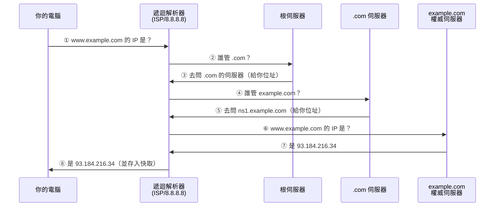

# DNS 網域名稱系統

> [!abstract] 這篇你會學到
> - 用**電話簿與總機**的比喻理解 DNS 在做什麼 ★★
> - 看懂網域名稱的**層級結構**：根域、TLD、SLD、主機名稱 —— **這是辨識釣魚網址的基本功** ★★★★
> - 完整走一遍 **DNS 查詢的八個步驟**，知道每一步壞掉會看到什麼症狀 ★★★
> - 認識常見的記錄類型：A、AAAA、CNAME、MX、TXT、NS、PTR ★★
> - 理解 **TTL 與快取**，知道為什麼改了 DNS 要等 ★★★★
> - 學會用 `dig`、`nslookup` 排查解析問題 ★★★
> - 認識 DNS 相關的資安議題：快取毒化、DoH/DoT、DNSSEC ★★★

## 前置知識

- [[010-02-10-guide-網概-連接埠與應用層協定]] — DNS 用 UDP/TCP 53
- [[010-02-06-guide-網概-IP位址與子網路]] — IP 位址

---

## 觀念說明

### 核心比喻：電話簿

> [!example] 你記得住幾個 IP 位址？
> 沒有 DNS 的世界：
> ```
> 想看 Google → 輸入 142.250.196.142
> 想看 Yahoo  → 輸入 106.10.248.150
> 想看政府網站 → 輸入 203.66.190.5
> ```
>
> **這根本不可能。**
>
> 而且 IP 還會變 —— 網站換伺服器、換機房、做負載平衡，
> IP 就變了。你怎麼知道？
>
> **DNS 就是網際網路的電話簿** ★★：
> 你只要記住「Google」這個名字，
> DNS 負責告訴你它現在的號碼是多少。

| 電話簿 | DNS |
| --- | --- |
| 人名「王小明」 | **網域名稱** `www.example.com` |
| 電話號碼 | **IP 位址** |
| ★★ 查號台 | **DNS 伺服器** |
| ★★★ 你抄在手機裡的常用號碼 | **DNS 快取** —— 排錯時最常被它騙 |
| ★★★ 號碼改了要更新通訊錄 | **TTL 過期後重新查詢** |

### DNS 的基本資料

| 特性 | 說明 |
| --- | --- |
| ★★ 定義 | 「網際網路的一項服務」，是**將網域名稱與 IP 位址相互對映的分散式資料庫** |
| ★★★ 協定 | **UDP + TCP**（兩個都要通，只開 UDP 會偶發失敗） |
| ★★ 埠號 | **53** |
| ★★ 架構 | **階層式、分散式**（沒有單一的中央資料庫） |

> [!note] 「分散式」是 DNS 最重要的設計 ★★★
> 全世界有數十億個網域名稱。
> 如果有一台中央伺服器管全部：
> - 它會被查詢淹沒
> - 它一掛，全世界的網際網路就停擺
> - 更新要全世界同步
>
> **DNS 的做法是「分層授權」** ★★★：
> 根域只知道「`.tw` 交給誰管」，
> `.tw` 只知道「`gov.tw` 交給誰管」，
> `gov.tw` 只知道「`moe.gov.tw` 交給誰管」……
>
> **每一層只管自己下一層**，責任分散、可獨立更新、沒有單點故障。★★

---

## 網域名稱的層級結構

### ★★★★ 從右往左讀

```
www . example . com .
 │      │        │   └── 根域（Root，通常省略）      ★
 │      │        └────── 頂級域 TLD (Top-Level Domain)   ★★
 │      └─────────────── 二級域 SLD (Second-Level Domain)  ★★★★ 真實網域看這裡
 └────────────────────── 主機名稱／子網域          ★★ 誰都能亂取
```

> [!warning] **網域名稱由右往左讀** —— 這是資安判斷的關鍵 ★★★★★
> ```
> mail.moe.gov.tw       → 真實網域是 gov.tw     ✅ 政府網站   ★
> mail-gov-verify.xyz   → 真實網域是 verify.xyz ❌ 釣魚       ★★★
> gov.tw.login-secure.com → 真實網域是 login-secure.com ❌ 最陰險 ★★★★★
> ```
>
> **`gov.tw` 出現在網址裡不代表它是政府網站** —— 要看它在不在**最後兩段**。★★★★★
>
> 見 [[010-01-18-guide-計概-資訊安全初步]]。

### 根域（Root）

> [!note] 每個網域名稱結尾其實都有一個「.」★★
> 完整的寫法是 `www.example.com.`（最後有一個點），
> 那個點代表**根域**。
>
> 日常我們省略它，但在 DNS 設定檔裡**這個點很重要** ★★★ ——
> 有點代表「絕對網域名稱（FQDN）」，
> 沒點可能會被自動加上網域後綴。
>
> ```
> www.example.com.    ← FQDN，就是這個                     ★★
> www                 ← 相對名稱，會被補成 www.example.com. ★★★
> ```
>
> **這是 DNS 設定檔最常見的錯誤來源之一。★★★★**

全世界有 **13 組根伺服器**（標示為 A 到 M），
但實際上透過 **anycast** 技術，全球有數百個實體節點。★★

### 頂級域（TLD）

| 類型 | 說明 | 例子 |
| --- | --- | --- |
| ★★ **gTLD**（一般性） | 通用頂級域，超過 700 個 | `.com`、`.org`、`.net`、`.edu`、`.gov`、`.app`、`.dev` |
| ★★ **ccTLD**（國別） | 國家或地區代碼，約 300 個 | **`.tw`**（台灣）、`.jp`、`.uk`、`.cn`、`.de` |
| ★★ 新 gTLD | 2012 年後開放申請 | `.xyz`、`.shop`、`.taipei` |

### 二級域（SLD）

由各國的網址註冊中心管理。

**台灣由 TWNIC（台灣網路資訊中心）管理**：

| 二級域 | 用途 |
| --- | --- |
| ★★ `.gov.tw` | **政府機關** |
| ★★ `.edu.tw` | 教育機構 |
| ★★ `.com.tw` | 營利事業 |
| ★ `.org.tw` | 非營利組織 |
| ★ `.net.tw` | 網路服務業 |
| ★ `.mil.tw` | 國防單位 |
| ★ `.idv.tw` | 個人 |

> [!tip] 這是判斷網站真偽的重要線索 ★★★★
> **`.gov.tw` 與 `.edu.tw` 有嚴格的申請資格審查** ★★★ ——
> 一般人與公司**申請不到**。
>
> 所以看到 `xxx.gov.tw` 基本上可以信任是政府單位；
> 但看到 `gov-tw.com`、`taiwan-gov.net` 就要高度警覺 ★★★ ——
> `.com` 和 `.net` 任何人都能申請。

### 主機名稱／子網域

`gov.tw` 下面的細分由各使用單位自行管理：

```
moe.gov.tw           教育部
  ├── www.moe.gov.tw
  ├── mail.moe.gov.tw
  └── vpn.moe.gov.tw
```

---

## DNS 查詢的完整流程

假設你第一次連 `www.example.com`。



### ★★★ 逐步說明

| 步驟 | 誰問誰 | 內容 |
| --- | --- | --- |
| ① ★ | 你 → 遞迴解析器 | 「`www.example.com` 的 IP？」 |
| ② ★★ | 解析器 → **根伺服器** | 「誰管 `.com`？」 |
| ③ ★★★ | 根 → 解析器 | 「去問 `.com` 的 NS」（**不會直接給答案**） |
| ④ ★★ | 解析器 → **TLD 伺服器** | 「誰管 `example.com`？」 |
| ⑤ ★★★ | TLD → 解析器 | 「去問 `ns1.example.com`」 |
| ⑥ ★★★ | 解析器 → **權威伺服器** | 「`www.example.com` 的 IP？」 |
| ⑦ ★★★ | 權威 → 解析器 | 「`93.184.216.34`」← **這才是最終答案** |
| ⑧ ★★★ | 解析器 → 你 | 回覆並**存入快取**（排錯時的頭號嫌疑犯） |

> [!note] 兩種查詢方式 ★★★
> | | **遞迴查詢（Recursive）** | **疊代查詢（Iterative）** |
> | --- | --- | --- |
> | ★★★ 誰做 | **你 → 遞迴解析器** | **解析器 → 各層 DNS 伺服器** |
> | ★★★ 特徵 | 「幫我查到底，給我最終答案」 | 「我只告訴你下一步該問誰」 |
> | 比喻 | **請秘書幫你查到答案** | **每個人都說「你去問他」** |
>
> 你的電腦只做一次遞迴查詢（丟給解析器）；
> 解析器則辛苦地做好幾次疊代查詢。

> [!tip] 為什麼第二次就很快 ★★★
> 因為**快取**。
>
> 快取存在很多層：
> ```
> 瀏覽器快取                  ★★★ 清了系統快取還是舊的，多半卡在這層
>   → 作業系統快取            ★★
>     → 路由器快取            ★★
>       → ISP 遞迴解析器快取  ★★★ 這層你清不掉，只能等 TTL
> ```
>
> 只要任何一層有，就直接回答，不用再走一次完整流程。
>
> 這也是為什麼**改了 DNS 設定要等一段時間才生效** ★★★ ——
> 各層的舊快取要先過期。

### ★★ 兩種 DNS 伺服器角色

| | **遞迴解析器（Recursive Resolver）** | **權威伺服器（Authoritative）** |
| --- | --- | --- |
| ★★ 做什麼 | **代替客戶端去查**，並快取結果 | **持有某個網域的真正資料** |
| ★★ 誰在跑 | ISP、Google (8.8.8.8)、Cloudflare (1.1.1.1)、你的路由器 | 網域擁有者或 DNS 託管商 |
| 比喻 | **查號台** | **戶政事務所**（資料的來源） |
| ★★ 你設定在哪 | 電腦的「DNS 伺服器」欄位 | 網域註冊商的 NS 設定 |

---

## 常見的記錄類型

| 類型 | 全名 | 用途 | 範例 |
| --- | --- | --- | --- |
| **A** ★★★ | Address | **網域 → IPv4** | `www.example.com → 93.184.216.34` |
| **AAAA** ★★ | — | **網域 → IPv6** | `www.example.com → 2606:2800:220:1::` |
| **CNAME** ★★★ | Canonical Name | **別名 → 另一個網域** | `blog.example.com → example.github.io` |
| **MX** ★★ | Mail Exchange | **郵件伺服器**（含優先序） | `example.com → 10 mail.example.com` |
| **NS** ★★★★ | Name Server | **誰管理這個網域**（設錯整個網域解析不了） | `example.com → ns1.example.com` |
| **TXT** ★★ | Text | 任意文字（**SPF、DKIM、網域驗證**） | `v=spf1 include:_spf.google.com ~all` |
| **PTR** ★★ | Pointer | **IP → 網域**（反解） | `34.216.184.93.in-addr.arpa → example.com` |
| **SOA** ★ | Start of Authority | 網域的權威資訊與序號 | — |
| **SRV** ★★ | Service | 服務位置（AD、SIP 用） | `_ldap._tcp.example.com` |
| **CAA** ★★ | Certification Authority Authorization | **限定誰能簽發此網域的憑證** | `0 issue "letsencrypt.org"` |

### ★★★ 幾個實務上很重要的記錄

> [!tip] CNAME 的限制 ★★★
> **CNAME 不能與其他記錄並存**，而且**根網域（zone apex）不能用 CNAME**。
>
> ```
> ❌ example.com.      CNAME  something.cdn.com.    ★★★ 設了就爆
>    example.com.      MX     10 mail.example.com.
>    ↑ 衝突！根網域必須有 SOA 與 NS，不能是 CNAME
>
> ✅ www.example.com.  CNAME  something.cdn.com.    ★ 子網域才可以
> ```
>
> 想在根網域指向 CDN？
> 各家 DNS 商提供 **ALIAS / ANAME / CNAME flattening** 之類的擴充功能。

> [!warning] TXT 記錄與郵件安全（即使不架郵件伺服器也要知道）★★★★
> 這三個 TXT 記錄決定「**別人會不會把你的網域當成垃圾郵件**」，
> 也決定「**別人能不能冒用你的網域寄信**」：
>
> | 記錄 | 作用 |
> | --- | --- |
> | **SPF** ★★★ | 宣告「**哪些伺服器可以用我的網域寄信**」 |
> | **DKIM** ★★ | 用數位簽章證明「這封信真的是我寄的、沒被竄改」 |
> | **DMARC** ★★★ | 告訴收信方「**SPF/DKIM 檢查失敗時該怎麼辦**」（放行／隔離／拒收） |
>
> ```
> example.com.        TXT  "v=spf1 include:_spf.google.com -all"
> _dmarc.example.com. TXT  "v=DMARC1; p=quarantine; rua=mailto:dmarc@example.com"
> ```
>
> **沒有設定這三項的網域，很容易被冒用來寄釣魚信** ★★★★ ——
> 攻擊者可以偽造 `寄件者: 資訊室 <it@你的機關.gov.tw>`。
>
> 機關即使郵件外包，**也應該確認這三個記錄有正確設定**。★★★
> 見 [[090-05-06-guide-資安設備-郵件與網頁閘道防護]]。

> [!note] PTR（反解）與郵件的關係 ★★
> **PTR 是「IP → 網域」**，與正解方向相反，由**IP 的擁有者（ISP）設定**。
>
> 很多郵件伺服器會檢查：
> 「你說你是 `mail.example.com`，那我反解你的 IP 看看是不是」——
> **反解不符的信件常被判定為垃圾郵件**。★★
>
> 這也是為什麼自架郵件伺服器很困難 ——
> 你需要向 ISP 申請設定 PTR。

---

## TTL 與快取

**TTL**（Time To Live）告訴查詢者：「**這個答案可以快取多久（秒）**」。

```
www.example.com.  3600  IN  A  93.184.216.34
                  ^^^^
                  TTL = 3600 秒 = 1 小時
```

| TTL 設定 | 效果 |
| --- | --- |
| ★★ **很短**（60～300 秒） | 改動**快速生效**，但**查詢量大**、對 DNS 伺服器壓力大 |
| ★★ **中等**（3600 秒 = 1 小時） | 平衡，**一般網站的常用值** |
| ★★★ **很長**（86400 秒 = 1 天） | 查詢少、快，但**改動要等很久才生效** |

> [!tip] 搬遷網站前的標準做法：先降低 TTL ★★★★
> 這是實務上非常重要的一個技巧。
>
> ```
> 搬遷前 3 天：把 TTL 從 86400 改成 300（5 分鐘）   ★★★ 漏了這步就沒得救
>              ↓ 等舊的 TTL（1 天）過期，讓大家都拿到新的短 TTL
> 搬遷當天：  修改 A 記錄指向新伺服器               ★★
>              ↓ 5 分鐘內全球生效
> 確認穩定後：把 TTL 改回 3600 或更長               ★★
> ```
>
> **如果沒有事先降 TTL** ★★★★，你改了 A 記錄後，
> **可能要等 24 小時**才會全世界都指到新伺服器 ——
> 這段期間有些人連舊的、有些人連新的，資料會不一致。

> [!warning] TTL 到期不代表立刻更新 ★★★
> 有些解析器（或惡意軟體、部分瀏覽器）**不完全遵守 TTL**。
> 而且路由器、作業系統、瀏覽器各有自己的快取策略。
>
> 所以**實際生效時間可能比 TTL 更長**。
> 重要的搬遷應該保留**兩邊都能服務**的過渡期。★★★

### 清除快取

```bash
# Linux（systemd-resolved）
$ sudo resolvectl flush-caches          # ★★★ 最常用的一招
$ resolvectl statistics       # 看快取命中率

# Linux（如果用 nscd）
$ sudo systemctl restart nscd

# Linux（如果用 dnsmasq）
$ sudo systemctl restart dnsmasq
```

```powershell
# Windows
ipconfig /flushdns            # ★★★ Windows 端排錯的第一動作
ipconfig /displaydns          # 看目前的快取內容
```

```bash
# macOS
$ sudo dscacheutil -flushcache
$ sudo killall -HUP mDNSResponder
```

**瀏覽器也有自己的快取**：
- Chrome：`chrome://net-internals/#dns` → Clear host cache ★★★ 清了系統快取還是舊的，就清這裡

---

## 完整實戰範例

### ★★★ `dig` — DNS 排錯的標準工具

```bash
$ sudo apt install dnsutils      # Debian/Ubuntu
$ sudo dnf install bind-utils    # RHEL 系
```

**基本查詢**：

```bash
$ dig example.com

; <<>> DiG 9.18.28 <<>> example.com
;; ->>HEADER<<- opcode: QUERY, status: NOERROR, id: 12345
;;                                     ^^^^^^^ 查詢狀態 ★★★ 先看這裡：NOERROR / NXDOMAIN / SERVFAIL

;; QUESTION SECTION:
;example.com.                   IN      A

;; ANSWER SECTION:
example.com.            3600    IN      A       93.184.216.34   # ★★★ 有 ANSWER SECTION 才算查到
                        ^^^^            ^       ^^^^^^^^^^^^^
                        TTL          類型          答案

;; Query time: 24 msec
;; SERVER: 192.168.1.1#53(192.168.1.1)     ← 用哪台 DNS 查的 ★★★ 排錯先確認問的是誰
```

**常用選項**：

```bash
# 只要答案（最常用）★★
$ dig +short example.com
93.184.216.34

# 查特定記錄類型 ★★
$ dig example.com MX +short
10 mail.example.com.

$ dig example.com TXT +short
"v=spf1 include:_spf.google.com -all"

$ dig example.com NS +short
ns1.example.com.
ns2.example.com.

# 指定用哪台 DNS 伺服器查（排除自家 DNS 的問題）★★★ 分辨「我的 DNS 壞」還是「記錄本身錯」
$ dig @8.8.8.8 example.com +short
$ dig @1.1.1.1 example.com +short

# 反解（IP → 網域）★★
$ dig -x 93.184.216.34 +short

# 看完整的查詢路徑（從根開始，非常有教學價值）★★
$ dig +trace example.com

# 直接問權威伺服器（繞過所有快取）★★★ 唯一能看到「真正設定值」的方法
$ dig @ns1.example.com example.com +norecurse
```

> [!tip] `dig +trace` 讓你親眼看到八個步驟 ★★★
> ```bash
> $ dig +trace www.example.com
>
> .            518400 IN NS a.root-servers.net.    ← ① 根伺服器清單 ★★
> ...
> com.         172800 IN NS a.gtld-servers.net.    ← ② .com 的 NS ★★
> ...
> example.com. 172800 IN NS ns1.example.com.       ← ③ example.com 的 NS ★★
> ...
> www.example.com. 3600 IN A 93.184.216.34         ← ④ 最終答案 ★★
> ```
>
> **這是理解 DNS 階層最好的教學工具。**
> 建議每個學網路的人都跑一次。

### ★★ `nslookup` — 跨平台的替代方案

```bash
$ nslookup example.com
Server:         192.168.1.1
Address:        192.168.1.1#53

Non-authoritative answer:      ← 「非權威」= 從快取來的 ★★★ 看到這行就要懷疑快取
Name:   example.com
Address: 93.184.216.34

# 指定 DNS 伺服器
$ nslookup example.com 8.8.8.8

# 查特定類型
$ nslookup -type=MX example.com
```

```powershell
# Windows PowerShell 的現代做法
Resolve-DnsName example.com
Resolve-DnsName example.com -Type MX
Resolve-DnsName example.com -Server 8.8.8.8
```

### ★★★ DNS 排錯的標準流程

```bash
#!/usr/bin/env bash
DOMAIN="${1:-example.com}"
echo "=== DNS 診斷：$DOMAIN ==="

echo -e "\n[1] 我目前用哪台 DNS？"
resolvectl status 2>/dev/null | grep -A2 'DNS Servers' || cat /etc/resolv.conf   # ★★★ 先確認自己在問誰

echo -e "\n[2] 用系統預設 DNS 查詢"
dig +short "$DOMAIN" A

echo -e "\n[3] 用公用 DNS 查詢（比對是否為自家 DNS 的問題）"
dig @8.8.8.8 +short "$DOMAIN" A     # ★★★ 與 [2] 的答案比對，就能切開「自家 DNS」與「記錄本身」
dig @1.1.1.1 +short "$DOMAIN" A

echo -e "\n[4] 誰是權威伺服器？"
dig +short "$DOMAIN" NS

echo -e "\n[5] 直接問權威（繞過所有快取）"
NS=$(dig +short "$DOMAIN" NS | head -1)
[ -n "$NS" ] && dig "@$NS" +short "$DOMAIN" A    # ★★★ 這個答案才是「真正設定的值」

echo -e "\n[6] 目前的 TTL"
dig "$DOMAIN" A | awk '/^'"$DOMAIN"'/ {print "TTL =", $2, "秒"}'
```

> [!tip] 診斷邏輯 ★★★
> | 情況 | 判斷 |
> | --- | --- |
> | ★★★ 系統 DNS 查不到，但 8.8.8.8 查得到 | **你的 DNS 伺服器有問題**（或快取了舊資料） |
> | ★★★ 兩者都查不到，但權威查得到 | **快取尚未更新**（等 TTL 過期） |
> | ★★★ 連權威都查不到 | **記錄根本沒設定**，或設錯了 |
> | ★★★ 權威與快取的答案不同 | **正在傳播中**，等 TTL |
> | ★★★★★ 完全沒有 NS 記錄 | **網域可能過期**或 NS 設定錯誤（全站連不上） |

### ★★ 檢查郵件相關記錄（機關常用）

```bash
DOMAIN="example.gov.tw"

echo "MX（郵件伺服器）："
dig +short "$DOMAIN" MX            # ★★

echo -e "\nSPF（誰可以用這個網域寄信）："
dig +short "$DOMAIN" TXT | grep -i spf   # ★★★★ 查不到就代表你的網域可以被任何人冒用

echo -e "\nDMARC（檢查失敗時怎麼辦）："
dig +short "_dmarc.$DOMAIN" TXT    # ★★

echo -e "\nDKIM（需要知道 selector，常見的有 default、google、s1）："
dig +short "default._domainkey.$DOMAIN" TXT   # ★★★ selector 猜錯會誤判為「沒設定」
```

> [!warning] 沒有 SPF/DMARC 的網域容易被冒用 ★★★★
> 如果查詢結果是空的，代表**任何人都可以偽造你的網域寄信**。★★
>
> 這對機關特別危險 ——
> 攻擊者可以用 `it@你的機關.gov.tw` 寄釣魚信給你的同仁，
> 而收信方的過濾機制**無法判斷它是假的**。

---

## 常見錯誤與排錯

| 現象 | 原因 | 解法 |
| --- | --- | --- |
| ★★★ **網頁打不開但 LINE 可以用** | **DNS 問題**（網路是通的） | `ping 8.8.8.8` 通 + `nslookup` 失敗 = 確定是 DNS |
| ★★★ 改了 A 記錄但沒生效 | **快取還沒過期** | 等 TTL；清本機快取；用 `dig @權威` 確認記錄本身正確 |
| ★★★ 有些人看到新網站有些人看到舊的 | **DNS 正在傳播中** | 搬遷前應先降低 TTL |
| ★★★ `NXDOMAIN` | **網域不存在**（打錯、過期、記錄沒設） | 檢查拼字；`dig NS` 看網域是否還有效 |
| ★★★ `SERVFAIL` | DNS 伺服器內部錯誤或 DNSSEC 驗證失敗 | 換一台 DNS 測試；檢查 DNSSEC 設定 |
| ★★ DNS 查詢很慢 | DNS 伺服器太遠或負載高 | 換用 `1.1.1.1` 或 `8.8.8.8` 測試比較 |
| ★★ 內部主機名稱解析不到 | 沒有內部 DNS，或 search domain 沒設 | 設定內部 DNS；或 `/etc/hosts` |
| ★★★★ DNS 有時通有時不通 | **只開了 UDP 53 沒開 TCP 53** | 防火牆兩個都要開放 |
| ★★★ 設定檔改了但 DNS 沒重新載入 | 忘了 reload | `sudo systemctl reload bind9`／`named-checkconf` 先驗證 |
| ★★★ CNAME 設在根網域出錯 | **zone apex 不能用 CNAME** | 用 ALIAS/ANAME；或改用 A 記錄 |
| ★★★ 郵件一直進垃圾桶 | **缺少 SPF/DKIM/DMARC** 或 PTR 不符 | 設定三個 TXT 記錄；向 ISP 申請 PTR |
| ★★★ 憑證申請失敗 | CAA 記錄限制了簽發者 | 檢查 `dig CAA`；加入該 CA |
| ★★★★★ 被導向奇怪的網站 | **DNS 被竄改**（路由器被入侵或惡意軟體） | 檢查 `/etc/resolv.conf` 與路由器 DNS 設定 |

---

## 安全性注意事項

> [!danger] DNS 快取毒化（Cache Poisoning）★★★★
> 攻擊者設法讓**遞迴解析器快取一筆錯誤的記錄**，
> 之後所有用這台解析器的人，
> **輸入正確的網址卻被導到攻擊者的伺服器**。★★★★★ 使用者完全看不出異狀
>
> **為什麼可能成功**：
> 傳統 DNS 用 UDP，**沒有加密也沒有驗證**。★★★
> 攻擊者只要在正確的回應之前，
> 送出一個偽造的回應（猜對查詢 ID 與來源埠），就能得逞。
>
> **防護**：
> | 機制 | 說明 |
> | --- | --- |
> | **來源埠隨機化** ★★ | 大幅增加猜測難度（現代解析器都有） |
> | **DNSSEC** ★★ | 用**數位簽章**驗證回應的真偽 |
> | **0x20 編碼** ★★ | 隨機大小寫查詢名稱，增加熵 |

> [!note] DNSSEC：幫 DNS 回應簽章 ★★★
> **DNSSEC** 用公鑰密碼學為 DNS 記錄簽章，
> 讓解析器能**驗證回應確實來自權威伺服器且未被竄改**。
>
> | 記錄 | 用途 |
> | --- | --- |
> | `RRSIG` ★★ | 記錄的數位簽章 |
> | `DNSKEY` ★★ | 用來驗證簽章的公鑰 |
> | `DS` ★★★★ | 放在上層網域，形成信任鏈（沒跟著更新，整個網域會 SERVFAIL） |
>
> ```bash
> # 檢查某網域有沒有啟用 DNSSEC
> $ dig +dnssec example.com | grep -E 'RRSIG|ad;'
>
> # 看回應是否通過驗證（flags 裡有 ad = Authenticated Data）
> $ dig @1.1.1.1 +dnssec example.com | grep 'flags:'
> ;; flags: qr rd ra ad; ...
> #                  ^^ 通過 DNSSEC 驗證
> ```
>
> **DNSSEC 只保證「沒被竄改」，不加密內容** ★★ ——
> 中間人仍然看得到你在查什麼。

> [!tip] DoH 與 DoT：加密 DNS 查詢 ★★
> | | **DoT**（DNS over TLS） | **DoH**（DNS over HTTPS） |
> | --- | --- | --- |
> | ★★ 埠 | **853** | **443**（混在一般 HTTPS 流量裡） |
> | 加密 | ✅ | ✅ |
> | ★★★ 可否被網管辨識 | ✅（獨立埠，可管制） | ❌ **難以區分**（跟一般網頁一樣） |
>
> **對個人**：保護隱私，防止 ISP 或中間人監看你查了什麼。
>
> **對機關網管**：**DoH 是個麻煩** ★★★★ ——
> 它繞過了組織的 DNS，讓你無法：
> - 阻擋惡意網域
> - 記錄查詢日誌（法遵要求）
> - 做內部名稱解析
>
> **機關的處理方式**：
> 1. 用 GPO 或設定管理**停用瀏覽器的 DoH** ★★
> 2. 防火牆**阻擋已知的 DoH 服務端點** ★★
> 3. 阻擋對外的 853 埠與非內部 DNS 的 53 埠 ★★
> 4. 提供**自己的加密 DNS**，兼顧隱私與管理 ★★
>
> 見 [[090-05-06-guide-資安設備-郵件與網頁閘道防護]]。

> [!danger] DNS 是重要的資安控制點 ★★★★
> 因為**幾乎所有連線都從 DNS 查詢開始**，
> DNS 是絕佳的偵測與阻擋位置：
>
> | 用途 | 說明 |
> | --- | --- |
> | **阻擋惡意網域** ★★★ | 惡意程式要連 C&C 伺服器，先要 DNS 查詢 → **在這裡擋掉** |
> | **偵測異常** ★★ | 查詢大量隨機網域 = **DGA（域名生成演算法）惡意程式**的特徵 |
> | **DNS 隧道偵測** ★★★ | 攻擊者用 DNS 查詢夾帶資料外洩，特徵是超長的子網域名稱 |
> | **內容過濾** ★★ | 阻擋不當網站 |
>
> **DNS 日誌是資安調查的黃金資料** ★★★ ——
> 它記錄了「每一台機器試圖連到哪裡」。
>
> **機關應該**：
> 1. 使用**內部 DNS 伺服器**（不要讓終端直接查外部 DNS）★★
> 2. **保留 DNS 查詢日誌**（依法規要求的期間）★★★★ 事後才想調，資料已經沒了
> 3. 導入**威脅情資的網域黑名單** ★★
> 4. 監控異常的查詢模式 ★★
>
> 見 [[090-05-09-guide-資安設備-日誌集中與SIEM]]。

> [!warning] 內外 DNS 應該分離（Split-Horizon DNS）★★★★
> 如果你的**內部主機名稱與私有 IP 可以被外面查到**，
> 那等於把內部網路架構公開給攻擊者。★★★★★
>
> **正確做法**：
> ```
> 內部 DNS：解析 internal.example.com → 10.10.20.5   ★★ 只給內網查得到
> 外部 DNS：只有 www、mail 等對外服務的記錄          ★★★ 多一筆內部記錄就是多一條線索
> ```
>
> 檢查方式：
> ```bash
> # 從外部（用公用 DNS）查詢內部名稱，應該要查不到
> $ dig @8.8.8.8 +short fileserver.example.com   # ★★★★ 有輸出＝內部架構已外洩
> # 應該沒有輸出
>
> # 嘗試區域轉送（應該被拒絕）
> $ dig @ns1.example.com example.com AXFR        # ★★★★★ 這個要是成功了，事情很大條
> ; Transfer failed.      ← 正確，應該要失敗
> ```
>
> **★★★★★ 開放區域轉送（AXFR）給任意來源，等於把整個網域的所有記錄送人。**

---

## 速查表

### ★★ 網域結構（由右往左）

```
www . example . com .
 │      │        │   └ 根域（省略）
 │      │        └──── TLD（gTLD/ccTLD）  ★★
 │      └───────────── SLD                ★★
 └──────────────────── 主機名稱
```

**判斷真偽：看最後兩段** ★★★★★

### ★★★ 台灣的二級域（TWNIC 管理）

| 二級域 | 用途 |
| --- | --- |
| ★★ `.gov.tw` | 政府（**有資格審查**） |
| ★★ `.edu.tw` | 教育（**有資格審查**） |
| ★★ `.com.tw` | 營利事業 |
| ★ `.org.tw` | 非營利 |
| ★ `.idv.tw` | 個人 |

### ★★ 記錄類型

| 類型 | 用途 |
| --- | --- |
| **A** ★★★ | → IPv4 |
| **AAAA** ★★ | → IPv6 |
| **CNAME** ★★★ | 別名（**根網域不能用**） |
| **MX** ★★★ | 郵件伺服器 |
| **NS** ★★★ | 誰管這個網域 |
| **TXT** ★★★ | SPF / DKIM / DMARC / 驗證 |
| **PTR** ★★ | IP → 網域（反解） |
| SOA ★ | 權威資訊 |
| CAA ★★ | 限定憑證簽發者 |

### ★★★ 查詢流程（八步）

```
你 → 遞迴解析器 → 根 → TLD → 權威 → 回答 → 快取 → 你   ★★
```

### ★★ 常用 dig 指令

| 目的 | 指令 |
| --- | --- |
| ★★★ 快速查 IP | `dig +short 網域` |
| ★★★ 查 MX | `dig 網域 MX +short` |
| ★★★ 查 TXT | `dig 網域 TXT +short` |
| ★★★ 查 NS | `dig 網域 NS +short` |
| ★★★ **指定 DNS 伺服器** | `dig @8.8.8.8 網域` |
| ★★ 反解 | `dig -x IP +short` |
| ★★★ **看完整查詢路徑** | **`dig +trace 網域`** |
| ★★★ 繞過快取問權威 | `dig @權威NS 網域 +norecurse` |
| ★★ 檢查 DNSSEC | `dig +dnssec 網域` |

### ★★★ 清除快取

| 系統 | 指令 |
| --- | --- |
| ★★★ Linux (systemd) | `sudo resolvectl flush-caches` |
| ★★★ Windows | `ipconfig /flushdns` |
| ★★ macOS | `sudo dscacheutil -flushcache` |
| ★★ Chrome | `chrome://net-internals/#dns` |

### ★★ TTL 建議

| 情境 | TTL |
| --- | --- |
| ★★ 一般網站 | 3600（1 小時） |
| ★★★★ **準備搬遷（前 3 天）** | **300（5 分鐘）** |
| ★★ 很少變動的記錄 | 86400（1 天） |

---

## 練習題

> [!question]- 練習 1：走一次完整的 DNS 查詢 ★★
> ```bash
> dig +trace www.gov.tw
> ```
> 觀察輸出，回答：
> 1. 第一段列出的是什麼伺服器？
> 2. 接著問了哪一層？
> 3. 總共經過幾層才拿到最終的 A 記錄？
> 4. 最後那個權威伺服器是誰？

> [!question]- 練習 2：DNS 排錯演練 ★★★
> ```bash
> DOMAIN=www.example.com
>
> # 1. 我用哪台 DNS？
> resolvectl status | grep -A2 'DNS Servers'
>
> # 2. 系統 DNS 的答案
> dig +short $DOMAIN
>
> # 3. 公用 DNS 的答案
> dig @8.8.8.8 +short $DOMAIN
>
> # 4. 權威的答案
> dig @$(dig +short $DOMAIN NS | head -1) +short $DOMAIN
>
> # 5. TTL 是多少？
> dig $DOMAIN | grep -E "^$DOMAIN"
> ```
> 三個答案一致嗎？如果不一致，代表什麼？

> [!question]- 練習 3：檢查一個網域的郵件安全設定 ★★★
> 挑一個你熟悉的網域（例如你機關的網域），檢查：
> ```bash
> DOMAIN=你的網域
> dig +short $DOMAIN MX
> dig +short $DOMAIN TXT | grep -i spf
> dig +short _dmarc.$DOMAIN TXT
> ```
> 回答：
> 1. 有沒有 SPF 記錄？結尾是 `-all`（嚴格）還是 `~all`（寬鬆）？
> 2. 有沒有 DMARC？policy 是 `none`、`quarantine` 還是 `reject`？
> 3. 如果都沒有，代表什麼風險？
>
> 提示：沒有這些記錄，**任何人都可以偽造你的網域寄釣魚信**。★★★★

---

## 小測驗

Q1. 用「電話簿」的比喻說明 DNS。為什麼 DNS 必須是「分散式」的？

Q2. 網域名稱要「由右往左」讀。`gov.tw.login-secure.com` 的真實網域是什麼？

Q3. `.gov.tw` 與 `.com` 在申請資格上有什麼差別？這對辨識釣魚網站有什麼幫助？

Q4. 請說出 DNS 查詢的完整流程（至少五個角色）。根伺服器會直接給你答案嗎？

Q5. 「遞迴查詢」與「疊代查詢」的差別是什麼？分別由誰執行？

Q6. A、CNAME、MX、TXT、PTR 記錄各是做什麼的？

Q7. 為什麼 CNAME 不能設在根網域（zone apex）？

Q8. 什麼是 TTL？搬遷網站前為什麼要「先降低 TTL」？正確的操作順序是什麼？

Q9. SPF、DKIM、DMARC 三者的作用分別是什麼？沒有設定會有什麼風險？

Q10. 為什麼「DNS 是重要的資安控制點」？機關為什麼要管制 DoH？

> [!question]- 測驗答案
> **Q1.** ★★ DNS 就像**網際網路的電話簿** ——
> 你只要記住「Google」這個名字，DNS 負責告訴你它現在的 IP 是多少
> （而且 IP 變了你也不用管）。
> 必須分散式，是因為全世界有數十億個網域名稱：
> 單一中央伺服器會**被查詢淹沒、一掛全世界停擺、更新難以同步**。
> DNS 用**分層授權**：每一層只管自己的下一層，
> 責任分散、可獨立更新、沒有單點故障。
>
> **Q2.** 真實網域是 **`login-secure.com`**。★★★★★
> 前面的 `gov.tw` 只是它的子網域名稱，是刻意用來混淆的。
> **關鍵是看最後兩段。★★★★★**
>
> **Q3.** ★★★ **`.gov.tw` 與 `.edu.tw` 有嚴格的申請資格審查**，
> 一般人與公司**申請不到**；而 **`.com`、`.net`、`.xyz` 任何人都能申請**。
> 所以看到 `xxx.gov.tw` 基本可信任是政府單位，
> 但看到 `gov-tw.com`、`taiwan-gov.net` 就要高度警覺。
>
> **Q4.** ★★ ①你的電腦 → ②**遞迴解析器**（ISP 或 8.8.8.8）→
> ③**根伺服器**（告訴你誰管 .com）→ ④**TLD 伺服器**（告訴你誰管 example.com）→
> ⑤**權威伺服器**（給出真正的 IP）→ 回傳並快取。
> **根伺服器不會直接給答案** ★★★ —— 它只告訴解析器「下一步該問誰」。
>
> **Q5.** ★★ **遞迴查詢**是「幫我查到底，給我最終答案」，
> 由**你的電腦向遞迴解析器**發出（像請秘書幫你查到答案）；
> **疊代查詢**是「我只告訴你下一步該問誰」，
> 由**遞迴解析器向根、TLD、權威伺服器**逐層發出（每個人都說「你去問他」）。
>
> **Q6.** ★★ **A** = 網域 → IPv4；
> **CNAME** = 別名，指向另一個網域；
> **MX** = 指定郵件伺服器（含優先序）；
> **TXT** = 任意文字，實務上用於 **SPF、DKIM、DMARC 與網域所有權驗證**；
> **PTR** = 反解，IP → 網域（由 IP 擁有者/ISP 設定）。
>
> **Q7.** ★★ 因為**根網域必須擁有 SOA 與 NS 記錄**，
> 而 **CNAME 不能與其他記錄並存** —— 兩者衝突。
> 想在根網域指向 CDN 時，要使用各家 DNS 商提供的
> **ALIAS / ANAME / CNAME flattening** 擴充功能。
>
> **Q8.** ★★★★ **TTL（Time To Live）**告訴查詢者「這個答案可以快取多久（秒）」。
> 搬遷前要先降低 TTL，是因為**如果 TTL 是 86400（1 天），
> 改了 A 記錄後可能要等 24 小時全世界才會指到新伺服器**，
> 這段期間有人連舊的、有人連新的，資料會不一致。
> **正確順序**：
> ①搬遷前 3 天把 TTL 從 86400 改成 300 →
> ②等舊 TTL 過期，讓大家都拿到短 TTL →
> ③搬遷當天改 A 記錄，**5 分鐘內生效** →
> ④確認穩定後把 TTL 改回較長的值。
>
> **Q9.** ★★★★ **SPF** 宣告「**哪些伺服器可以用我的網域寄信**」；
> **DKIM** 用**數位簽章**證明「這封信真的是我寄的、沒被竄改」；
> **DMARC** 告訴收信方「**SPF/DKIM 檢查失敗時該怎麼辦**」
> （放行 none／隔離 quarantine／拒收 reject）。
> **沒有設定的風險**：**任何人都可以偽造你的網域寄信** ——
> 攻擊者能用 `it@你的機關.gov.tw` 寄釣魚信給你的同仁，
> 而收信方無法判斷它是假的。
>
> **Q10.** ★★★ 因為**幾乎所有連線都從 DNS 查詢開始**，
> 所以 DNS 是絕佳的偵測與阻擋位置：
> **阻擋惡意網域**（惡意程式連 C&C 前要先查 DNS）、
> **偵測 DGA 惡意程式**（查詢大量隨機網域）、
> **偵測 DNS 隧道**（超長子網域名稱夾帶資料外洩）、內容過濾。
> **DNS 日誌記錄了「每一台機器試圖連到哪裡」，是資安調查的黃金資料。**
> 機關要管制 **DoH**，是因為它**混在一般 HTTPS(443) 流量裡難以辨識**，
> **繞過了組織的 DNS** —— 讓機關無法阻擋惡意網域、
> 無法保留查詢日誌（法遵要求）、也無法做內部名稱解析。

---

## 延伸閱讀

- [[010-02-10-guide-網概-連接埠與應用層協定]] — 為什麼 DNS 要開 TCP 與 UDP 53
- [[010-02-12-guide-網概-DHCP自動取得設定]] — DNS 伺服器位址怎麼取得
- [[010-02-13-guide-網概-HTTP與HTTPS]] — DNS 之後的下一步
- [[010-02-14-guide-網概-一個網頁請求的完整旅程]] — DNS 在整趟旅程中的位置
- [[010-02-17-guide-網概-網路排錯入門]] — DNS 排錯流程
- [[090-05-09-guide-資安設備-日誌集中與SIEM]] — DNS 日誌的資安價值（進階）
- [[090-05-06-guide-資安設備-郵件與網頁閘道防護]] — SPF/DKIM/DMARC 實作（進階）
