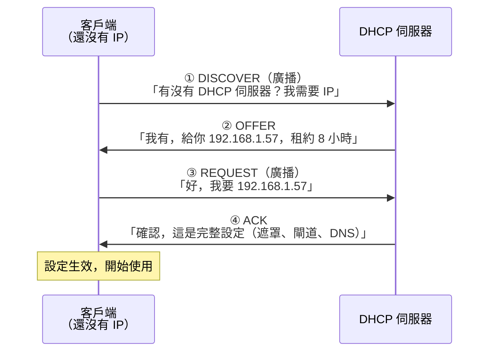
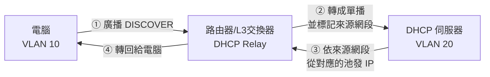

# DHCP 自動取得設定

> [!abstract] 這篇你會學到
> - 用**飯店櫃檯發房卡**的比喻理解 DHCP
> - 完整走一遍 **DORA 四步驟**，知道每一步在做什麼
> - 理解**租約（Lease）**與續約機制
> - 分辨固定 IP、DHCP 保留、動態配發，知道各自該用在哪
> - 認識 **DHCP Relay** —— 為什麼跨網段需要它
> - 學會排查「拿不到 IP」的問題
> - 知道**假 DHCP 伺服器**的危害與防護

## 前置知識

- [[010-02-06-guide-網概-IP位址與子網路]] — IP、遮罩、閘道
- [[010-02-11-guide-網概-DNS網域名稱系統]] — DHCP 也會發 DNS 設定

---

## 觀念說明

### 核心比喻：飯店櫃檯發房卡

> [!example] 沒有 DHCP 的世界
> 每一台新設備接上網路，你都要手動設定四樣東西：
> ```
> IP 位址：  192.168.1.57
> 子網路遮罩：255.255.255.0
> 預設閘道： 192.168.1.1
> DNS 伺服器：192.168.1.1, 8.8.8.8
> ```
>
> **而且要記得哪些 IP 已經被用掉了**，
> 用重複就會 IP 衝突。
>
> 200 台設備的辦公室？每次有新同仁報到都要來一次？
> 有人的筆電帶去分處用又要改一次？
>
> **完全不可行。**

**DHCP**（Dynamic Host Configuration Protocol）讓這一切自動化。

| 飯店 | DHCP |
| --- | --- |
| 你走進飯店大廳 | 電腦接上網路 |
| 「請問有空房嗎？」 | **DHCP Discover** |
| 櫃檯：「有，808 房，這是房卡」 | **DHCP Offer** |
| 「好，我要 808」 | **DHCP Request** |
| 櫃檯：「登記完成，房卡生效」 | **DHCP Ack** |
| **住宿期限（退房時間）** | **租約（Lease Time）** |
| 續住要再跟櫃檯說 | **租約續約** |
| 房卡（含門號、Wi-Fi 密碼、早餐券） | **IP + 遮罩 + 閘道 + DNS** |

---

## DORA：DHCP 的四個步驟

**記憶口訣：DORA**（Discover → Offer → Request → Ack）



### 逐步詳解

| 步驟 | 誰發 | 廣播/單播 | 內容 |
| --- | --- | --- | --- |
| **① DISCOVER** | 客戶端 | **廣播**（255.255.255.255） | 「我需要 IP！」（因為還不知道伺服器在哪） |
| **② OFFER** | 伺服器 | 廣播或單播 | 「我提供 192.168.1.57 給你」 |
| **③ REQUEST** | 客戶端 | **廣播** | 「我接受這個 IP」 |
| **④ ACK** | 伺服器 | 廣播或單播 | 「確認，附上完整設定」 |

> [!note] 為什麼第 ③ 步還要用「廣播」？
> 這是很好的問題。
>
> 因為**可能有多台 DHCP 伺服器同時回應 OFFER**。
> 客戶端選了其中一個，用廣播 REQUEST 是為了**同時告訴其他伺服器**：
> 「**我選了別人，你可以把保留的 IP 收回去了。**」
>
> 否則其他伺服器會一直保留著那些 IP，造成浪費。

> [!tip] DHCP 用的埠號
> ```
> 伺服器：UDP 67
> 客戶端：UDP 68
> ```
>
> **為什麼用 UDP 而不是 TCP？**
> 因為客戶端**還沒有 IP 位址**，根本無法建立 TCP 連線。
> UDP 可以直接用廣播送出去。

### DHCP 發放的不只是 IP

一次 DHCP 交握可以取得**幾十種設定**（DHCP Options）：

| Option | 內容 | 常用程度 |
| --- | --- | --- |
| — | **IP 位址** | 必備 |
| 1 | **子網路遮罩** | 必備 |
| 3 | **預設閘道（Router）** | 必備 |
| 6 | **DNS 伺服器** | 必備 |
| 15 | 網域名稱（Domain Name） | 常用 |
| 42 | **NTP 時間伺服器** | 常用 |
| 51 | **租約時間** | 必備 |
| 66/67 | **TFTP 伺服器與開機檔名**（PXE 網路開機用） | 部署時 |
| 43 / 138 | 廠商專屬（AP 控制器、IP 話機） | 特定設備 |
| 119 | DNS 搜尋清單 | 有時 |

> [!tip] Option 66/67 是網路大量部署的關鍵
> 機關要一次安裝 50 台電腦時，用 **PXE 網路開機**：
> 1. 電腦開機時從網路取得 IP（DHCP）
> 2. **DHCP 同時告訴它「開機映像檔在哪台伺服器」**（Option 66/67）
> 3. 電腦下載映像並開始自動安裝
>
> 這就是 Windows **WDS** 與 Linux **PXE 部署**的基礎。
> 見 `20-Windows系統管理` 的 WDS 章節。

---

## 租約（Lease）：IP 是「借」的不是「給」的

> [!note] 為什麼要有租約
> 如果 IP 一發出去就永久給那台機器，
> 那麼**訪客的筆電走了之後，那個 IP 就永遠浪費了**。
>
> **租約機制**：IP 只借你一段時間，到期要續約。
> 沒來續約（機器離開了）→ 系統收回，給下一個人用。

### 續約時機

```
租約 8 小時（480 分鐘）

T1 = 租約的 50%（4 小時）
     → 客戶端向「原本那台伺服器」單播 REQUEST 續約

T2 = 租約的 87.5%（7 小時）
     → 如果還沒續約成功，改用「廣播」向任何伺服器求救

100% 到期
     → 放棄 IP，重新走完整的 DORA 流程
```

> [!tip] 續約是「單播」而且只要兩步
> 續約時客戶端已經知道伺服器在哪，所以：
> ```
> REQUEST（單播）→ ACK
> ```
> **只要兩步，不用重來 DORA。**

### 租約時間該設多久

| 環境 | 建議租約 | 理由 |
| --- | --- | --- |
| **辦公室**（設備固定） | **8 小時 ～ 8 天** | 減少廣播流量 |
| **訪客 Wi-Fi** | **1 ～ 4 小時** | 人來人往，快速回收 |
| **會議室／公共區域** | 1 ～ 2 小時 | 同上 |
| 大型活動場地 | 30 分鐘 ～ 1 小時 | 位址池壓力大 |
| 伺服器 | **不用 DHCP**（用固定 IP） | 見下方 |

> [!warning] 租約太長會造成位址池耗盡
> 訪客 Wi-Fi 若設 8 天租約：
> 一個來開會 2 小時的訪客，**佔用那個 IP 八天**。
>
> 一天來 50 個訪客 × 8 天 = 400 個 IP 被佔著，
> 而一個 `/24` 只有 254 個 —— **位址池很快就滿了**。
>
> 症狀：新的人連不上 Wi-Fi、拿到 `169.254.x.x`。

---

## 三種 IP 指派方式

| 方式 | 說明 | 適合 |
| --- | --- | --- |
| **動態配發（Dynamic）** | 從位址池隨機給一個 | **一般使用者電腦、訪客** |
| **DHCP 保留（Reservation）** | **綁定 MAC，每次都給同一個 IP** | 印表機、AP、需要固定 IP 但想集中管理的設備 |
| **靜態／手動（Static）** | **在設備上手動設定**，不經過 DHCP | **伺服器、網路設備、閘道** |

> [!tip] DHCP 保留 vs 手動設定固定 IP
> 兩者結果都是「這台機器永遠是這個 IP」，但管理方式完全不同：
>
> | | **DHCP 保留** | **手動設定** |
> | --- | --- | --- |
> | 設定在哪 | **DHCP 伺服器上**（集中管理） | **每一台設備上**（分散） |
> | 要改網段時 | **改一個地方**，全部自動更新 | **每一台都要手動改** |
> | 設備搬走時 | 自動釋放 | 要記得清掉紀錄 |
> | DHCP 掛掉時 | **設備拿不到 IP** ⚠️ | **不受影響** ✅ |
> | 適合 | 印表機、AP、IP 話機、監視器 | **伺服器、交換器、防火牆** |
>
> **關鍵判斷**：
> **「DHCP 伺服器掛掉時，這台機器可以跟著不能用嗎？」**
> - 可以 → 用 DHCP 保留（管理方便）
> - **不可以** → 用手動固定 IP（伺服器、網路設備）

> [!warning] 手動設定 IP 一定要排除在 DHCP 池之外
> 這是最常見的 IP 衝突原因。
>
> ```
> ❌ 錯誤：
>    DHCP 池：192.168.1.1 ～ 192.168.1.254
>    伺服器手動設：192.168.1.50
>    → 某天 DHCP 把 .50 發給別人 → IP 衝突！
>
> ✅ 正確：
>    .1        閘道（手動）
>    .2 ～ .50 網路設備與伺服器（手動）  ← DHCP 池不含這段
>    .51 ～ .99 DHCP 保留（印表機等）
>    .100 ～ .250 DHCP 動態池
>    .251 ～ .254 保留備用
> ```

---

## DHCP Relay：跨網段的問題

> [!warning] DHCP DISCOVER 是「廣播」，而廣播不會跨過路由器
> 這造成一個問題：
>
> ```
> VLAN 10（使用者）  ← 沒有 DHCP 伺服器
>       │
>    路由器  ← 廣播到這裡就停了
>       │
> VLAN 20（伺服器）  ← DHCP 伺服器在這裡
> ```
>
> **VLAN 10 的電腦永遠拿不到 IP**，因為它的廣播到不了 DHCP 伺服器。

**兩種解法**：

| 方案 | 說明 | 優缺點 |
| --- | --- | --- |
| **每個網段都放一台 DHCP** | 每個 VLAN 各自有伺服器 | 分散管理，設備多時很麻煩 |
| **DHCP Relay（中繼）** ✅ | **路由器把廣播「轉成單播」轉發給中央 DHCP** | **集中管理，業界標準做法** |



> [!note] Relay 怎麼知道要從哪個池發 IP
> 路由器在轉發時，會**填入自己在該網段的介面 IP**
> （這個欄位叫 **giaddr**，Gateway IP Address）。
>
> DHCP 伺服器看到 `giaddr = 192.168.10.1`，
> 就知道「這個請求來自 192.168.10.0/24 網段」，
> **從對應的位址池發 IP**。

**JunOS 設定範例**（Juniper EX，ELS 語法）：

```junos
# ① VLAN 與它的三層介面（irb）
set vlans users vlan-id 10
set vlans users l3-interface irb.10
set interfaces irb unit 10 family inet address 192.168.10.1/24

set vlans printers vlan-id 30
set vlans printers l3-interface irb.30
set interfaces irb unit 30 family inet address 192.168.30.1/24

# ② 先定義「DHCP 伺服器群組」，再指定它為 active
set forwarding-options dhcp-relay server-group DHCP-SRV 192.168.20.5
set forwarding-options dhcp-relay active-server-group DHCP-SRV

# ③ 把要做 Relay 的介面收進同一個 group
#    （同一台 DHCP 服務多個 VLAN，就把多個 irb 都加進來）
set forwarding-options dhcp-relay group CAMPUS interface irb.10
set forwarding-options dhcp-relay group CAMPUS interface irb.30
```

設定完**一定要送出才會生效**：

```junos
## 設定模式（configure）
show | compare                 # 先看這次到底改了什麼
commit confirmed 5             # 5 分鐘內沒有再 commit 就自動回滾
commit                         # 確認一切正常，正式定案
rollback 1                     # 若改壞了，退回上一版設定

## 操作模式（在設定模式下要在前面加 run）
show configuration forwarding-options dhcp-relay | display set
show dhcp relay statistics
show dhcp relay binding
```

> [!warning] 未實機驗證
> 本段 JunOS 設定依官方文件撰寫，未在實機驗證。實作前請對照你手上設備的 Junos 版本。

> [!info]- Cisco IOS 對照
> ```cisco
> interface Vlan10
>  ip address 192.168.10.1 255.255.255.0
>  ip helper-address 192.168.20.5      ! DHCP 伺服器的位址
> !
> interface Vlan30
>  ip address 192.168.30.1 255.255.255.0
>  ip helper-address 192.168.20.5      ! 同一台 DHCP 服務多個 VLAN
> ```
> **觀念差異**：
> - Cisco 把 Relay 位址**寫在每個 SVI 介面上**（`ip helper-address` 一行一台伺服器）；
>   JunOS 是**先定義伺服器群組、再把介面收進 group**，
>   日後 DHCP 伺服器換位址時只要改 `server-group` 一處。
> - Cisco 打完指令**立刻生效**；JunOS 要 `commit` 才套用，
>   而且可以用 `commit confirmed`，改遠端設備時是保命符。
> - 三層介面命名也不同：Cisco 是 `Vlan10`，
>   JunOS（ELS）是 `irb.10`（舊版 EX 寫作 `vlan.10`）。

> [!tip] DHCP Relay 是排錯的常見檢查點
> **症狀**：某個 VLAN 的電腦拿不到 IP，其他 VLAN 正常。
>
> **檢查**：那個 VLAN 的 `irb` 介面有沒有被加進
> `forwarding-options dhcp-relay group`？
> （Cisco 則是看該 SVI 有沒有 `ip helper-address`。）
> 這是新增 VLAN 時最常忘記的一步。

---

## 完整實戰範例

### 觀察 DORA 四步驟

```bash
# 終端機 1：抓 DHCP 封包
$ sudo tcpdump -i eth0 -n port 67 or port 68

# 終端機 2：釋放並重新取得 IP
$ sudo dhclient -r eth0      # 釋放
$ sudo dhclient eth0         # 重新取得
```

**你會看到**：

```
10:23:45.100 IP 0.0.0.0.68 > 255.255.255.255.67: BOOTP/DHCP, Request from
             00:1a:2b:3c:4d:5e, length 300     ← ① DISCOVER（來源 IP 是 0.0.0.0！）
10:23:45.130 IP 192.168.1.1.67 > 255.255.255.255.68: BOOTP/DHCP, Reply,
             length 300                         ← ② OFFER
10:23:45.135 IP 0.0.0.0.68 > 255.255.255.255.67: BOOTP/DHCP, Request from
             00:1a:2b:3c:4d:5e, length 300     ← ③ REQUEST
10:23:45.160 IP 192.168.1.1.67 > 255.255.255.255.68: BOOTP/DHCP, Reply,
             length 300                         ← ④ ACK
```

> [!tip] 注意來源 IP 是 `0.0.0.0`
> 因為客戶端**還沒有 IP**，只能用 `0.0.0.0` 當來源、
> `255.255.255.255` 當目的（廣播）。
>
> 這也是為什麼 DHCP 必須用 UDP 而不能用 TCP。

### 客戶端操作

```bash
# ---- Linux（傳統 dhclient）----
$ sudo dhclient -r eth0        # 釋放（release）
$ sudo dhclient -v eth0        # 重新取得（verbose 會顯示 DORA 過程）

# ---- Linux（NetworkManager）----
$ nmcli device show eth0 | grep -E 'IP4|DHCP'
$ sudo nmcli connection down eth0 && sudo nmcli connection up eth0

# ---- Linux（systemd-networkd）----
$ sudo networkctl renew eth0
$ networkctl status eth0

# ---- 看目前的租約資訊 ----
$ cat /var/lib/dhcp/dhclient.leases       # Debian/Ubuntu
$ cat /var/lib/dhclient/dhclient.leases   # RHEL 系
lease {
  interface "eth0";
  fixed-address 192.168.1.57;
  option subnet-mask 255.255.255.0;
  option routers 192.168.1.1;
  option domain-name-servers 192.168.1.1,8.8.8.8;
  option dhcp-lease-time 28800;              ← 8 小時
  option dhcp-server-identifier 192.168.1.1; ← 哪台伺服器發的
  renew 3 2026/08/27 14:23:45;               ← T1 續約時間
  expire 3 2026/08/27 18:23:45;              ← 到期時間
}
```

```powershell
# ---- Windows ----
ipconfig /release
ipconfig /renew
ipconfig /all                  # 看租約時間與 DHCP 伺服器

# 輸出中要看：
#   DHCP 已啟用 . . . . . . . : 是
#   DHCP 伺服器 . . . . . . . : 192.168.1.1
#   取得租約的時間. . . . . . : 2026年8月27日 上午 10:23:45
#   租約到期時間. . . . . . . : 2026年8月27日 下午 06:23:45
```

### 在 Linux 上架設 DHCP 伺服器

```bash
$ sudo apt install isc-dhcp-server
$ sudo nano /etc/dhcp/dhcpd.conf
```

```
# 全域設定
default-lease-time 28800;        # 預設 8 小時
max-lease-time 86400;            # 最長 24 小時
authoritative;                   # 我是這個網段的權威 DHCP

option domain-name "example.local";
option domain-name-servers 192.168.1.1, 8.8.8.8;

# 位址池
subnet 192.168.1.0 netmask 255.255.255.0 {
    range 192.168.1.100 192.168.1.250;      # 只發這個範圍
    option routers 192.168.1.1;
    option broadcast-address 192.168.1.255;
    option ntp-servers 192.168.1.1;
}

# DHCP 保留（綁定 MAC）
host printer-3f {
    hardware ethernet 00:11:22:33:44:55;
    fixed-address 192.168.1.60;
}

host ap-lobby {
    hardware ethernet aa:bb:cc:dd:ee:ff;
    fixed-address 192.168.1.61;
}
```

```bash
# 檢查設定檔語法（一定要先做）
$ sudo dhcpd -t -cf /etc/dhcp/dhcpd.conf

# 啟動
$ sudo systemctl enable --now isc-dhcp-server
$ sudo systemctl status isc-dhcp-server

# 看目前發出去的租約
$ sudo cat /var/lib/dhcp/dhcpd.leases | grep -A5 'lease 192'

# 看日誌
$ sudo journalctl -u isc-dhcp-server -f
```

> [!warning] `authoritative;` 這一行很重要
> 有了它，當客戶端要求一個「不屬於這個網段」的 IP 時，
> DHCP 會回 **DHCPNAK**（拒絕），強制客戶端重新取得正確的 IP。
>
> 沒有它，客戶端可能一直用著錯誤的舊 IP。
>
> **但也要小心** —— 如果你在一個已經有 DHCP 的網路上
> 架了另一台並標記 authoritative，會造成衝突。

### 排查「拿不到 IP」

```bash
#!/usr/bin/env bash
IFACE="${1:-eth0}"
echo "=== DHCP 診斷：$IFACE ==="

echo -e "\n[1] 實體連線正常嗎？"
sudo ethtool "$IFACE" 2>/dev/null | grep -E 'Link detected|Speed'

echo -e "\n[2] 目前的 IP"
ip -4 addr show "$IFACE" | grep inet || echo "  沒有 IPv4 位址"

echo -e "\n[3] 是不是 APIPA（169.254.x.x = DHCP 失敗）？"
ip -4 addr show "$IFACE" | grep -q '169\.254\.' \
  && echo "  ⚠ 是 APIPA！DHCP 沒有回應" \
  || echo "  ✓ 不是 APIPA"

echo -e "\n[4] 有沒有預設閘道？"
ip route | grep default || echo "  ⚠ 沒有預設閘道"

echo -e "\n[5] 手動嘗試取得（會顯示 DORA 過程）"
sudo dhclient -v "$IFACE" 2>&1 | tail -10
```

**依症狀判斷**：

| 症狀 | 卡在哪 | 檢查什麼 |
| --- | --- | --- |
| **`169.254.x.x`（APIPA）** | 完全沒收到 OFFER | 見下表 |
| `dhclient` 一直 `DHCPDISCOVER` 沒有回應 | 廣播沒到達伺服器 | VLAN、Relay、伺服器狀態 |
| 收到 OFFER 但沒 ACK | 位址衝突或伺服器拒絕 | 伺服器日誌 |
| 拿到 IP 但網段不對 | **接到了錯誤的 VLAN** | 交換器埠的 VLAN 設定 |
| 拿到 IP 但上不了網 | 閘道或 DNS 設定錯誤 | DHCP 的 option 3 / 6 |

> [!tip] 看到 `169.254.x.x` 的五個可能原因
> **APIPA**（Automatic Private IP Addressing）是「拿不到 DHCP 就自己隨便挑一個」。
>
> | 原因 | 怎麼確認 |
> | --- | --- |
> | **網路線沒插好／埠沒開** | `ethtool` 看 `Link detected` |
> | **接到錯誤的 VLAN**（沒有 DHCP 的那個） | 檢查交換器埠的 VLAN 設定 |
> | **DHCP 伺服器掛了** | 在伺服器上 `systemctl status` |
> | **位址池用完了** | 看伺服器日誌 `no free leases` |
> | **跨網段但沒設 Relay** | `show configuration forwarding-options dhcp-relay`（Cisco：`ip helper-address`） |

---

## 常見錯誤與排錯

| 現象 | 原因 | 解法 |
| --- | --- | --- |
| **拿到 `169.254.x.x`** | DHCP 完全沒回應 | 依上表五個原因逐一排查 |
| 訪客 Wi-Fi 常常連不上 | **位址池耗盡**（租約太長） | 縮短租約至 1～2 小時；擴大位址池 |
| **IP 衝突** | 手動設的 IP 落在 DHCP 池內 | DHCP 池要**排除**靜態 IP 範圍 |
| 某個 VLAN 拿不到 IP，其他正常 | **忘了把該 VLAN 的 `irb` 介面加進 Relay group** | 補上 `set forwarding-options dhcp-relay group <名稱> interface irb.N`（Cisco：`ip helper-address`） |
| 拿到 IP 但網段不對 | 交換器埠設到錯誤的 VLAN | 檢查埠的 `interface-mode access` 與 `vlan members`（Cisco：`switchport access vlan`） |
| 拿到 IP 但上不了網 | **閘道（option 3）或 DNS（option 6）設錯** | 檢查 DHCP 設定；`ip route` 與 `resolv.conf` |
| 手機每次連 Wi-Fi 都拿到不同 IP | **MAC 隨機化** | 改用 802.1X 驗證；或請使用者關閉該裝置的隨機 MAC |
| DHCP 保留設了卻沒生效 | MAC 打錯、或該設備有多張網卡 | 用 `arp -a` 確認實際的 MAC |
| DHCP 伺服器掛了全網不能上網 | **單點故障** | 部署第二台 DHCP（分割位址池或用 failover） |
| 印表機 IP 一直變 | 用了動態配發 | 改用 **DHCP 保留** |
| 伺服器因 DHCP 掛掉而失去 IP | 伺服器不該用 DHCP | **伺服器用手動固定 IP** |
| 新設備接上就全網 IP 混亂 | **有人接了自己的分享器**（假 DHCP） | 見下方資安段落；啟用 DHCP Snooping |

> [!warning] DHCP 伺服器的高可用
> DHCP 掛掉時，**已經拿到 IP 的機器在租約內仍可正常運作**，
> 但**新接上的機器與租約到期的機器就完蛋了**。
>
> **兩種高可用做法**：
> ```
> 方案 A：分割位址池
>   DHCP-1: 192.168.1.100 ～ 192.168.1.175
>   DHCP-2: 192.168.1.176 ～ 192.168.1.250
>   （兩台都在跑，各發各的，簡單但位址利用率較低）
>
> 方案 B：DHCP Failover（ISC DHCP 支援）
>   兩台同步租約資料庫，一台掛了另一台完全接手
>   （複雜但完整）
> ```
>
> Windows Server 2012 以後支援 **DHCP Failover**，
> 是機關環境常見的做法。

---

## 安全性注意事項

> [!danger] 假 DHCP 伺服器（Rogue DHCP）
> **DHCP 協定完全沒有身分驗證** ——
> 客戶端會**接受第一個回應的 OFFER**。
>
> 所以任何人只要在網路上架一台 DHCP 伺服器，
> 就可以發放**惡意的網路設定**：
>
> | 惡意設定 | 後果 |
> | --- | --- |
> | **假的預設閘道** | **所有流量都經過攻擊者**（中間人攻擊） |
> | **假的 DNS 伺服器** | 把你導向釣魚網站 |
> | 錯誤的網段 | 網路直接不通（阻斷服務） |
>
> **最常見的情況其實不是惡意的** ——
> 而是**有同仁把自己的家用無線分享器接到辦公室網路**，
> 那台分享器預設就會發 DHCP，開始跟正牌伺服器搶著回應。
>
> **症狀**：部分同仁突然上不了網，或拿到 `192.168.0.x` 這種奇怪的網段。

**防護：DHCP Snooping**

```junos
# ① 在 VLAN 上啟用 DHCP 安全（設了 dhcp-security，snooping 就跟著啟用）
set vlans users forwarding-options dhcp-security

# ② 預設值：access 埠 untrust、trunk 埠 trust
#    若 DHCP 伺服器是接在「access 埠」上，要手動把它改成 trusted
set vlans users forwarding-options dhcp-security group DHCP-SERVER interface ge-0/0/23.0
set vlans users forwarding-options dhcp-security group DHCP-SERVER overrides trusted

# ③ 其他埠維持 untrust
#    → 從這些埠來的 DHCP OFFER/ACK 會被直接丟棄

# ④ 以 Snooping 綁定表為基礎，再開兩個防護
set vlans users forwarding-options dhcp-security arp-inspection    # 防 ARP 欺騙
set vlans users forwarding-options dhcp-security ip-source-guard   # 防 IP 偽造

commit confirmed 5
commit
```

查看綁定表：

```junos
show dhcp-security binding
show dhcp-security binding detail
```

> [!note] JunOS 沒有「每埠 DHCP 請求限速」這個指令
> Cisco 的 `ip dhcp snooping limit rate 10` 在 JunOS **沒有一對一的對應指令**。
> 要擋 DHCP 耗盡攻擊（見下方），JunOS 的做法是**限制每個埠能學到的 MAC 數量**：
>
> ```junos
> set switch-options interface ge-0/0/1 interface-mac-limit 5 packet-action drop
> ```
>
> 這就是 Cisco `switchport port-security maximum` 的角色。

> [!warning] 未實機驗證
> 本段 JunOS 設定依官方文件撰寫，未在實機驗證。實作前請對照你手上設備的 Junos 版本
> （`dhcp-security` 是 ELS 語法；較舊的非 ELS EX 是
> `ethernet-switching-options secure-access-port`，兩者不通用）。

> [!info]- Cisco IOS 對照
> ```cisco
> ! 全域啟用
> ip dhcp snooping
> ip dhcp snooping vlan 10,20,30
>
> ! 只有連到「合法 DHCP 伺服器」的埠設為 trust
> interface GigabitEthernet0/24
>  description ** 連到核心/DHCP伺服器 **
>  ip dhcp snooping trust
>
> ! 其他所有埠預設是 untrust
> ! → 從這些埠來的 DHCP OFFER/ACK 會被直接丟棄
>
> ! 限制每個埠每秒的 DHCP 請求數（防 DHCP 耗盡攻擊）
> interface range GigabitEthernet0/1 - 20
>  ip dhcp snooping limit rate 10
> ```
> **觀念差異**：
> - Cisco 是**全域開 + 逐 VLAN 開 + 逐埠標 trust**（三層設定）；
>   JunOS 把整組功能掛在 **VLAN 底下**（`vlans <名稱> forwarding-options dhcp-security`），
>   trust 也是先開 group、把介面放進去，再 `overrides trusted`。
> - 兩邊的**預設信任方向一致**：access 埠不信任、上行 trunk 信任。
> - Cisco 用 `interface range` 一次設一批埠；
>   JunOS 是把要套用同一組設定的介面**都放進同一個 group**
>   （或先用 `set interfaces interface-range <名稱> member-range ...` 定義一批介面）。
> - 查綁定表：Cisco 是 `show ip dhcp snooping binding`，
>   JunOS（ELS）是 `show dhcp-security binding`
>   （較舊版本為 `show dhcp snooping binding`）。

> [!tip] DHCP Snooping 的額外好處
> 它會建立一張 **DHCP Snooping Binding Table**：
> ```
> MAC 位址          IP 位址        租約   VLAN   介面
> 00:1a:2b:3c:4d:5e 192.168.10.57  28800  users  ge-0/0/5.0
> ```
>
> 這張表是其他資安功能的基礎：
> | 功能 | 用途 |
> | --- | --- |
> | **Dynamic ARP Inspection（DAI）** | 用這張表**驗證 ARP 封包**，防止 ARP 欺騙 |
> | **IP Source Guard** | 驗證封包的來源 IP 是否與綁定表相符，**防止 IP 偽造** |
>
> 所以 **DHCP Snooping 是第 2 層資安的基石**。
> 見 [[010-02-05-guide-網概-MAC位址與交換器]]、
> [[040-01-08-guide-Juniper-埠設定與安全]] 與 [[040-01-13-guide-Cisco-埠設定與安全]]。

> [!danger] DHCP 耗盡攻擊（DHCP Starvation）
> 攻擊者用**大量偽造的 MAC 位址**不斷請求 IP，
> **把整個位址池吃光**。
>
> 之後：
> 1. 正常使用者拿不到 IP（阻斷服務）
> 2. 攻擊者再架一台假 DHCP，**大家只能跟他拿** →
>    順利完成中間人攻擊
>
> **防護**：
> - **Port Security**（限制每埠的 MAC 數量）
>   JunOS：`set switch-options interface ge-0/0/1 interface-mac-limit 5 packet-action drop`
> - **DHCP Snooping**（Cisco 另有 `ip dhcp snooping limit rate` 可限速；JunOS 無對應指令）
> - 監控 DHCP 位址池使用率並告警

> [!warning] MAC 不是身分證明，DHCP 保留不是安全機制
> **MAC 位址可以任意偽造**：
> ```bash
> $ sudo ip link set eth0 address 00:11:22:33:44:55
> ```
>
> 所以：
> - **「MAC 白名單」擋不住有心人**（只能擋誤接的設備）
> - **DHCP 保留只是管理便利，不是存取控制**
>
> **真正的網路存取控制要用 802.1X** ——
> 接上網路線之前先用憑證或帳密驗證身分。
> 見 [[090-05-13-guide-資安設備-網路存取控制NAC與802.1X]]。

> [!tip] DHCP 日誌的資安價值
> DHCP 日誌記錄了「**什麼時間、哪個 MAC、拿到哪個 IP**」。
>
> 這在資安調查時極為關鍵：
> ```
> 「6 月 3 日下午 2 點，192.168.10.57 在攻擊我們的伺服器」
>   → 查 DHCP 日誌 → 那個時間該 IP 對應到 MAC 00:1a:...
>     → 查交換器 MAC 表 → 接在 3 樓 12 號埠
>       → 查埠描述 → 會計室王小姐的電腦
> ```
>
> **沒有 DHCP 日誌，你只有一個沒有意義的 IP。**
>
> 依《資通安全管理法》與相關規範，
> **這類連線紀錄需保存一定期間**。
> 見 [[090-05-09-guide-資安設備-日誌集中與SIEM]]。

---

## 速查表

### DORA 四步驟

| 步驟 | 誰發 | 方式 | 意思 |
| --- | --- | --- | --- |
| **D**iscover | 客戶端 | **廣播** | 「有 DHCP 嗎？」 |
| **O**ffer | 伺服器 | 廣播/單播 | 「給你這個 IP」 |
| **R**equest | 客戶端 | **廣播** | 「我要這個」 |
| **A**ck | 伺服器 | 廣播/單播 | 「確認，附設定」 |

**埠號**：伺服器 **UDP 67**、客戶端 **UDP 68**

### 續約時機

| 時間點 | 動作 |
| --- | --- |
| **T1 = 50%** | 向原伺服器**單播**續約 |
| T2 = 87.5% | 改用**廣播**求救 |
| 100% | 放棄，重走 DORA |

### 三種指派方式

| 方式 | 設定在哪 | 適合 |
| --- | --- | --- |
| **動態** | DHCP 池 | 使用者電腦、訪客 |
| **DHCP 保留** | DHCP 伺服器（綁 MAC） | 印表機、AP、IP 話機 |
| **手動固定** | **設備本身** | **伺服器、網路設備** |

**判斷準則**：「DHCP 掛掉時這台可以跟著不能用嗎？」
不可以 → **手動固定 IP**

### 租約時間建議

| 環境 | 租約 |
| --- | --- |
| 辦公室 | 8 小時 ～ 8 天 |
| **訪客 Wi-Fi** | **1 ～ 4 小時** |
| 大型活動 | 30 分鐘 ～ 1 小時 |

### 重要的 DHCP Options

| Option | 內容 |
| --- | --- |
| 1 | 子網路遮罩 |
| **3** | **預設閘道** |
| **6** | **DNS 伺服器** |
| 15 | 網域名稱 |
| 42 | NTP 伺服器 |
| 51 | 租約時間 |
| **66/67** | **PXE 開機伺服器與檔名** |

### 常用指令

| 目的 | Linux | Windows |
| --- | --- | --- |
| 釋放 IP | `sudo dhclient -r eth0` | `ipconfig /release` |
| 重新取得 | `sudo dhclient -v eth0` | `ipconfig /renew` |
| 看租約資訊 | `cat /var/lib/dhcp/dhclient.leases` | `ipconfig /all` |
| 抓 DHCP 封包 | `sudo tcpdump -n port 67 or port 68` | Wireshark |
| 檢查設定檔 | `sudo dhcpd -t -cf /etc/dhcp/dhcpd.conf` | — |
| 看發出的租約 | `cat /var/lib/dhcp/dhcpd.leases` | DHCP 主控台 |

### JunOS DHCP 相關

```junos
# DHCP Relay
set forwarding-options dhcp-relay server-group DHCP-SRV 192.168.20.5
set forwarding-options dhcp-relay active-server-group DHCP-SRV
set forwarding-options dhcp-relay group CAMPUS interface irb.10

# DHCP Snooping 與延伸防護（掛在 VLAN 底下）
set vlans users forwarding-options dhcp-security
set vlans users forwarding-options dhcp-security group DHCP-SERVER interface ge-0/0/23.0
set vlans users forwarding-options dhcp-security group DHCP-SERVER overrides trusted
set vlans users forwarding-options dhcp-security arp-inspection
set vlans users forwarding-options dhcp-security ip-source-guard

# 每埠 MAC 數量上限（DHCP 耗盡攻擊的防線）
set switch-options interface ge-0/0/1 interface-mac-limit 5 packet-action drop

# 送出（設定模式）
commit confirmed 5
commit

# 檢查（操作模式）
show dhcp relay statistics
show dhcp-security binding
```

> [!warning] 未實機驗證
> 本段 JunOS 設定依官方文件撰寫，未在實機驗證。實作前請對照你手上設備的 Junos 版本。

> [!info]- Cisco IOS 對照
> ```cisco
> ip helper-address 192.168.20.5      ! DHCP Relay
> ip dhcp snooping                    ! 啟用 Snooping
> ip dhcp snooping trust              ! 標記合法 DHCP 的埠
> ip dhcp snooping limit rate 10      ! 限速
> ```
> Cisco 是**逐介面／逐 VLAN 各設一行且立即生效**，
> JunOS 是**先定群組再套介面，且必須 `commit`**；
> 最後那條「限速」JunOS 沒有對應指令，改用 `interface-mac-limit`。

---

## 練習題

> [!question]- 練習 1：觀察 DORA
> ```bash
> # 終端機 1
> sudo tcpdump -i any -n 'port 67 or port 68'
>
> # 終端機 2
> sudo dhclient -r
> sudo dhclient -v
> ```
> 找出：
> 1. 四個封包（Discover / Offer / Request / Ack）
> 2. **Discover 的來源 IP 是什麼**？為什麼？
> 3. 目的 IP 是什麼？
> 4. DHCP 伺服器的 IP 是誰？

> [!question]- 練習 2：檢查你的租約
> ```bash
> # Linux
> cat /var/lib/dhcp/dhclient.leases | tail -20
> # Windows
> ipconfig /all
> ```
> 回答：
> 1. 租約時間是多久？
> 2. 什麼時候會續約（T1）？
> 3. DHCP 伺服器是哪一台？
> 4. 它發給你哪些 DNS 伺服器？

> [!question]- 練習 3：規劃一個網段的 IP 配置
> 為一個 `192.168.10.0/24` 的辦公網段規劃：
> - 1 台閘道
> - 3 台交換器 + 5 台 AP（需要固定 IP 管理）
> - 5 台伺服器
> - 8 台印表機
> - 100 台使用者電腦（會成長）
> - 訪客區
>
> 寫出你的 IP 區段規劃，並說明：
> 1. 哪些用手動固定？哪些用 DHCP 保留？哪些用動態？
> 2. DHCP 池的範圍是什麼？
> 3. 為什麼要保留備用區段？
>
> 參考方向：
> ```
> .1          閘道                     手動
> .2 ～ .20   交換器、AP、防火牆         手動（DHCP 掛了還要能管）
> .21 ～ .40  伺服器                    手動（不能依賴 DHCP）
> .41 ～ .70  印表機、IP 話機            DHCP 保留（集中管理方便）
> .100 ～ .240 使用者電腦（動態池）        動態
> .241 ～ .254 保留備用                  —
>
> 訪客建議放另一個 VLAN（如 192.168.99.0/24），完全隔離
> ```

---

## 小測驗

Q1. 用「飯店櫃檯發房卡」的比喻說明 DHCP。房卡對應到哪些網路設定？

Q2. DORA 是哪四個步驟？各自是廣播還是單播？

Q3. **為什麼第三步 REQUEST 還要用廣播**？

Q4. DHCP 為什麼用 UDP 而不是 TCP？客戶端與伺服器各用哪個埠？

Q5. 租約的 T1 與 T2 分別在什麼時候？各做什麼？

Q6. 「DHCP 保留」與「手動設定固定 IP」有什麼不同？判斷該用哪一種的關鍵問題是什麼？

Q7. 為什麼手動設定的 IP 一定要排除在 DHCP 池之外？

Q8. 為什麼跨網段需要 DHCP Relay？路由器怎麼讓 DHCP 伺服器知道該從哪個池發 IP？

Q9. 看到 `169.254.x.x` 代表什麼？請說出五個可能原因。

Q10. 「假 DHCP 伺服器」為什麼危險？最常見的情況是什麼？該用什麼機制防護？這個機制還有什麼額外的資安價值？

> [!question]- 測驗答案
> **Q1.** 你走進飯店大廳（電腦接上網路）→ 問「有空房嗎」（Discover）→
> 櫃檯說「有，808 房」（Offer）→ 你說「我要 808」（Request）→
> 櫃檯登記完成（Ack）。
> **房卡**對應到 **IP 位址 + 子網路遮罩 + 預設閘道 + DNS 伺服器**
> （還可能包含 NTP 伺服器、網域名稱等）；
> **住宿期限**對應到**租約時間**。
>
> **Q2.** **D**iscover（客戶端，**廣播**）→ **O**ffer（伺服器，廣播或單播）→
> **R**equest（客戶端，**廣播**）→ **A**ck（伺服器，廣播或單播）。
>
> **Q3.** 因為**可能有多台 DHCP 伺服器同時回應 OFFER**。
> 客戶端選了其中一台後用廣播 REQUEST，是為了**同時告訴其他伺服器**
> 「**我選了別人，你可以把保留的 IP 收回去了**」，
> 否則其他伺服器會一直保留著那些 IP 造成浪費。
>
> **Q4.** 因為客戶端在 Discover 時**還沒有 IP 位址**，
> 根本無法建立 TCP 連線；UDP 可以直接用廣播
> （來源 `0.0.0.0`、目的 `255.255.255.255`）送出去。
> **伺服器用 UDP 67，客戶端用 UDP 68。**
>
> **Q5.** **T1 = 租約的 50%** —— 客戶端向**原本那台伺服器單播** REQUEST 續約
> （只要兩步：REQUEST → ACK，不用重走 DORA）；
> **T2 = 租約的 87.5%** —— 若還沒續約成功，**改用廣播**向任何伺服器求救；
> 100% 到期則放棄 IP、重走完整的 DORA。
>
> **Q6.** **DHCP 保留**設定在 **DHCP 伺服器上**（綁定 MAC），集中管理、
> 改網段時只要改一個地方，但 **DHCP 掛掉該設備就拿不到 IP**；
> **手動固定 IP** 設定在**每一台設備上**，分散管理但**不受 DHCP 影響**。
> **關鍵問題**：「**DHCP 伺服器掛掉時，這台機器可以跟著不能用嗎？**」
> 可以 → DHCP 保留；**不可以（伺服器、網路設備）→ 手動固定 IP**。
>
> **Q7.** 因為若手動設定的 IP 落在 DHCP 池的範圍內，
> **DHCP 某天可能把同一個 IP 發給別的機器 → 造成 IP 衝突**，
> 兩台機器都會出問題且很難排查。
> 正確做法是把靜態區段（如 .1～.50）排除在 DHCP 池之外。
>
> **Q8.** 因為 **DHCP Discover 是廣播，而廣播不會跨過路由器** ——
> 沒有 Relay 的話，其他網段的電腦永遠拿不到 IP。
> 路由器在轉發時會**填入自己在該網段的介面 IP**（欄位叫 **giaddr**），
> DHCP 伺服器看到 `giaddr = 192.168.10.1` 就知道
> 「這個請求來自 192.168.10.0/24」，從對應的位址池發 IP。
> **JunOS** 上用 `forwarding-options dhcp-relay` 設定
> （`server-group` 指定伺服器、`active-server-group` 啟用、`group ... interface irb.N` 指定介面，
> 改完要 `commit`）；**Cisco** 則是在該 SVI 上加 `ip helper-address`。
>
> **Q9.** 代表 **APIPA** —— DHCP 完全沒有回應，電腦自己隨便挑了一個。
> **五個可能原因**：
> ①**網路線沒插好或交換器埠沒開**；
> ②**接到了錯誤的 VLAN**（那個 VLAN 沒有 DHCP）；
> ③**DHCP 伺服器掛了**；
> ④**位址池用完了**（日誌會有 `no free leases`）；
> ⑤**跨網段但沒設 DHCP Relay**
> （JunOS：`forwarding-options dhcp-relay`；Cisco：`ip helper-address`）。
>
> **Q10.** 危險是因為 **DHCP 協定完全沒有身分驗證**，
> 客戶端會**接受第一個回應的 OFFER**。
> 攻擊者可以發放**假的預設閘道**（所有流量經過他，中間人攻擊）
> 或**假的 DNS**（導向釣魚網站）。
> **最常見的情況其實不是惡意的** ——
> 而是**有同仁把自己的家用無線分享器接到辦公室網路**，
> 那台分享器預設就會發 DHCP。
> **防護用 DHCP Snooping**：只把連到合法 DHCP 伺服器的埠設為信任，
> 其他埠來的 OFFER/ACK 一律丟棄。
> JunOS 是 `set vlans <VLAN> forwarding-options dhcp-security`，
> 再用 `group <名稱> overrides trusted` 標出合法伺服器所在的埠
> （Cisco 對應 `ip dhcp snooping` 與介面上的 `ip dhcp snooping trust`）。
> **額外價值**：它建立的 **Snooping Binding Table**（MAC-IP-埠對應）
> 是 **Dynamic ARP Inspection（防 ARP 欺騙）**
> 與 **IP Source Guard（防 IP 偽造）**的基礎，
> 是第 2 層資安的基石
> （JunOS 只要在同一個 VLAN 底下加 `arp-inspection` 與 `ip-source-guard` 兩行）。

---

## 延伸閱讀

- [[010-02-06-guide-網概-IP位址與子網路]] — IP 規劃與池的切分
- [[010-02-05-guide-網概-MAC位址與交換器]] — DHCP Snooping 與 ARP 防護
- [[010-02-11-guide-網概-DNS網域名稱系統]] — DHCP 也負責發 DNS 設定
- [[010-02-16-guide-網概-VLAN與網路分段]] — 跨 VLAN 的 DHCP Relay
- [[010-02-17-guide-網概-網路排錯入門]] — 拿不到 IP 的排錯
- [[040-01-08-guide-Juniper-埠設定與安全]] — DHCP Snooping 實作，JunOS 主線（進階）
- [[040-01-13-guide-Cisco-埠設定與安全]] — 同上的 Cisco IOS 版本（進階）
- [[040-01-15-cmd-網路設備-Juniper與Cisco指令對照]] — 兩家語法逐條對照
- [[090-05-13-guide-資安設備-網路存取控制NAC與802.1X]] — 真正的存取控制（進階）
