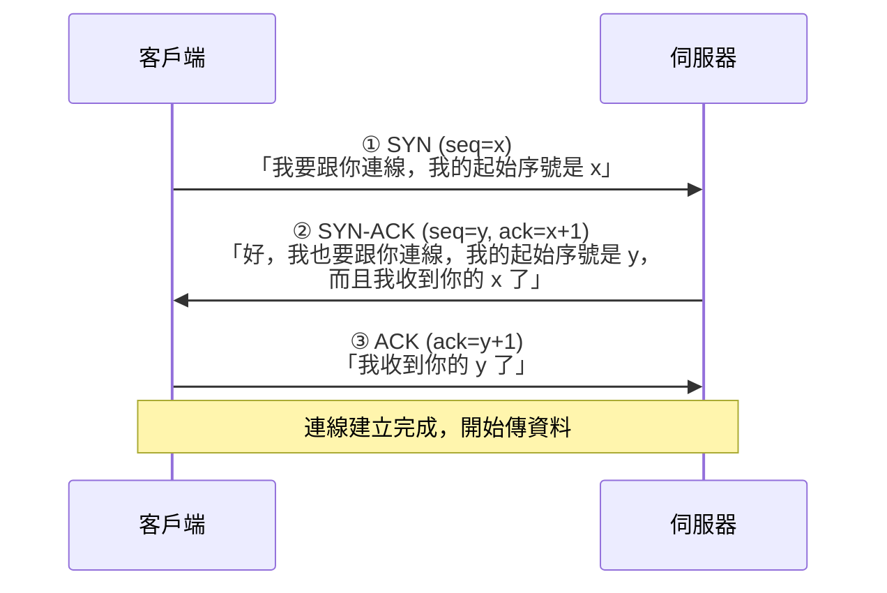
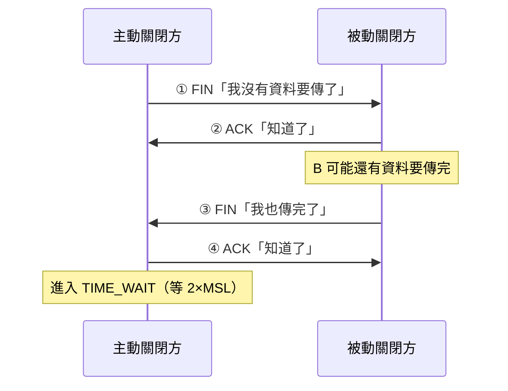

# TCP 與 UDP

> [!abstract] 這篇你會學到
> - 用**掛號信 vs 平信**的比喻分清楚 TCP 與 UDP
> - 完整理解 **三向交握（Three-Way Handshake）** 的每一步在做什麼
> - 知道 TCP 用哪四招保證可靠：序號、確認、重傳、排序
> - 分辨**流量控制**與**壅塞控制**
> - 看懂 TCP 連線狀態（`ESTABLISHED`、`TIME_WAIT`、`CLOSE_WAIT`）
> - 理解 **SYN Flood** 攻擊與 SYN Cookie 防護
> - 判斷什麼應用該用 TCP、什麼該用 UDP

## 前置知識

- [[03-網概-網路分層模型]] — 傳輸層在第 4 層
- [[07-網概-路由與封包旅程]] — IP 是「盡力而為」的

---

## 觀念說明

### 為什麼需要傳輸層

> [!note] IP 層是「盡力而為（best-effort）」的
> 第 3 層的 IP **只負責把封包丟出去**，它不保證：
> - ❌ 一定會到（可能被中途丟棄）
> - ❌ 按順序到（各走各的路）
> - ❌ 只到一次（重傳可能造成重複）
> - ❌ 內容沒錯（雖然有簡單的檢查碼）
>
> **這是刻意的設計** —— 讓核心路由器可以做得很簡單很快。
>
> 但應用程式需要可靠性。所以：
> **「保證送達」這件事被推到端點（你的電腦與伺服器）去做** ——
> 這就是 **TCP** 的工作。

### 核心比喻：掛號信 vs 平信

| | **TCP** | **UDP** |
| --- | --- | --- |
| 比喻 | **掛號信 + 回執** | **平信／明信片** |
| 全名 | Transmission Control Protocol | User Datagram Protocol |
| 連線 | **需要先建立連線**（面向連線） | **不需要**（無連線） |
| 保證送達 | ✅ 沒收到會**重傳** | ❌ 丟了就丟了 |
| 保證順序 | ✅ **會重新排序** | ❌ 亂序就亂序 |
| 速度 | 較慢（有交握與確認的開銷） | **快** |
| 標頭大小 | 20 位元組（至少） | **8 位元組** |
| 流量控制 | ✅ | ❌ |
| 壅塞控制 | ✅ | ❌ |
| 適合 | **檔案傳輸、網頁、郵件、資料庫** | **語音、視訊、遊戲、DNS** |

> [!tip] 一句話記住
> **TCP：「我要確定你收到了。」**
> **UDP：「我丟出去了，剩下的隨緣。」**

---

## TCP：可靠傳輸的四大機制

### 一、三向交握（Three-Way Handshake）

TCP 傳資料之前，必須先「打招呼」建立連線。



> [!example] 用打電話來理解
> ```
> ① 你：「喂？」                          （SYN，我想講話）
> ② 對方：「喂，我聽得到，你聽得到嗎？」    （SYN-ACK，我聽得到你 + 我也想講）
> ③ 你：「聽得到。」                      （ACK，我確認）
> ── 現在雙方確認彼此都聽得見，開始講正事 ──
> ```

> [!note] 為什麼要「三次」不是兩次？
> 這是經典的考題。答案是：**要確認「雙向」都通**。
>
> | 交握 | 證明了什麼 |
> | --- | --- |
> | ① 客戶端送 SYN | — |
> | ② 伺服器回 SYN-ACK | 證明「**客戶端 → 伺服器**」這個方向通 |
> | ③ 客戶端回 ACK | 證明「**伺服器 → 客戶端**」這個方向也通 |
>
> **少了第三次**，伺服器就不知道自己的回應對方有沒有收到 ——
> 可能對方根本聽不見你，你卻開始講正事了。
>
> 用電話比喻：如果只有兩步（「喂？」「喂，聽得到」），
> **那第二句話對方有沒有聽到？不知道。**

### 二、序號與確認（Sequence & Acknowledgement）

```
傳送方：把資料切成段，每一段編號
        [seq=1000, 500 bytes][seq=1500, 500 bytes][seq=2000, 500 bytes]

接收方：收到後回 ACK
        「ACK=1500」 = 「我已經收到 1500 之前的全部，請從 1500 開始送」
```

> [!tip] ACK 的數字是「我期待的下一個」
> 這是很多人會搞錯的地方。
>
> `ACK=1500` **不是**「我收到 1500 這一段」，
> 而是「**1500 之前的我都收到了，請給我 1500**」。
>
> 這叫**累積確認（cumulative ACK）** ——
> 一個 ACK 可以確認前面所有的資料。

### 三、重傳（Retransmission）

```
傳送方：送出 seq=1500
        ...等待...
        逾時了還沒收到 ACK=2000
        → 重送 seq=1500
```

**兩種觸發重傳的方式**：

| 機制 | 說明 |
| --- | --- |
| **逾時重傳（RTO）** | 等太久沒收到 ACK 就重送 |
| **快速重傳（Fast Retransmit）** | 連續收到 **3 個重複的 ACK** → 不等逾時，立刻重送 |

> [!note] 快速重傳為什麼有效
> ```
> 接收方收到：1000 ✅、1500 ❌（掉了）、2000 ✅、2500 ✅、3000 ✅
> 它會回：ACK=1500、ACK=1500、ACK=1500、ACK=1500
>         「我還是要 1500！」重複四次
> ```
> 傳送方看到 3 個重複的 ACK，就知道 1500 掉了，
> **立刻重送，不用等逾時**（逾時可能要等好幾百毫秒）。

### 四、排序（Reordering）

封包各走各的路，可能亂序到達。
TCP 依序號**在接收端重新排好**再交給應用程式。

**所以應用程式看到的永遠是正確順序的資料流。**

---

## 流量控制 vs 壅塞控制

這兩個常被搞混，但解決的是**不同的問題**。

| | **流量控制（Flow Control）** | **壅塞控制（Congestion Control）** |
| --- | --- | --- |
| 解決什麼 | **接收方處理不過來** | **網路塞車** |
| 比喻 | 「**你倒太快，我的杯子要滿了**」 | 「**路上塞車，大家都開慢一點**」 |
| 誰在乎 | 接收端 | 整個網路 |
| 機制 | **滑動視窗（Sliding Window）** | 慢啟動、壅塞避免、快速恢復 |
| 靠什麼判斷 | 接收方通告的**視窗大小** | **掉封包**或延遲上升 |

### 流量控制：滑動視窗

```
接收方在每個 ACK 裡告訴傳送方：「我還能收 N 位元組」（Window Size）

傳送方：最多只能送出 N 位元組而不等 ACK
```

> [!example] 用倒水來比喻
> 你在幫別人倒水。對方會說：
> 「我的杯子還能裝 200cc」→ 你就倒不超過 200cc
> 「我的杯子滿了（Window=0）」→ **你就要停下來**
>
> 這防止**快的傳送方壓垮慢的接收方**。

> [!warning] Window = 0 造成的卡頓
> 如果接收端的應用程式處理太慢（例如寫入磁碟很慢），
> 緩衝區會滿，它就會通告 `Window=0` 讓傳送方停下。
>
> **症狀**：傳輸速度時快時慢、突然停頓。
>
> ```bash
> # 用 tcpdump 找 zero window
> $ sudo tcpdump -i any 'tcp[tcpflags] & tcp-ack != 0 and tcp[14:2] = 0'
> ```
> 這通常代表**接收端的應用程式或磁碟是瓶頸**，不是網路的問題。

### 壅塞控制：不要把網路塞爆

> [!note] 為什麼需要壅塞控制
> 如果每個人都拚命傳，網路上的路由器緩衝區會滿，
> 開始大量丟封包 → 大家都重傳 → **更塞** → 惡性循環。
>
> 這叫**壅塞崩潰（congestion collapse）**，
> 1986 年真的發生過，網際網路的吞吐量掉到千分之一。
>
> **TCP 的壅塞控制就是為了防止這件事。**

**基本流程**：

```
1. 慢啟動（Slow Start）
   一開始只送一點點，每收到一個 ACK 就加倍
   （指數成長：1 → 2 → 4 → 8 → 16 ...）

2. 壅塞避免（Congestion Avoidance）
   到達門檻後改成線性成長（每次 +1）

3. 偵測到掉包
   → 認為網路塞了 → 大幅降低傳送速率 → 重新開始成長
```

> [!tip] 這解釋了「為什麼下載一開始比較慢」
> 慢啟動階段，TCP 在**探測網路能承受多少**。
> 幾百毫秒後才會達到全速。
>
> 這也是為什麼**很多小連線比一個大連線效率差** ——
> 每條連線都要重新慢啟動。
> HTTP/2 與 HTTP/3 的多工設計就是為了解決這個問題。

**常見的壅塞控制演算法**：

| 演算法 | 特點 |
| --- | --- |
| **Reno / NewReno** | 經典，靠掉包判斷 |
| **CUBIC** | **Linux 預設**，適合高頻寬長距離 |
| **BBR** | Google 開發，**靠測量頻寬與延遲**而非掉包，長距離效果好 |

```bash
# 看目前用哪個演算法
$ sysctl net.ipv4.tcp_congestion_control
net.ipv4.tcp_congestion_control = cubic

# 看可用的
$ sysctl net.ipv4.tcp_available_congestion_control
net.ipv4.tcp_available_congestion_control = reno cubic bbr

# 改成 BBR（跨國連線或高延遲環境常有明顯改善）
$ echo 'net.ipv4.tcp_congestion_control=bbr' | sudo tee /etc/sysctl.d/99-bbr.conf
$ sudo sysctl --system
```

---

## TCP 連線的結束與狀態

### 四向揮手（Four-Way Handshake）



> [!note] 為什麼關閉要四步而建立只要三步
> 因為 TCP 是**全雙工**的 —— 兩個方向是**獨立**的。
>
> A 說「我講完了」，不代表 B 也講完了。
> **B 可能還有資料要傳**，所以它先回 ACK，
> 等自己也傳完了才送 FIN。
>
> （建立時之所以能三步，是因為伺服器的 SYN 與 ACK
> 可以**合併在同一個封包**裡送。）

### 常見的連線狀態

```bash
$ ss -tan
State       Recv-Q Send-Q  Local Address:Port    Peer Address:Port
LISTEN      0      128     0.0.0.0:22            0.0.0.0:*
ESTAB       0      0       192.168.1.10:22       192.168.1.50:54321
TIME-WAIT   0      0       192.168.1.10:443      93.184.216.34:61000
CLOSE-WAIT  1      0       192.168.1.10:8080     10.0.0.5:33445
```

| 狀態 | 意義 | 該不該擔心 |
| --- | --- | --- |
| **LISTEN** | 服務在等待連線 | 正常 |
| **SYN-SENT** | 送了 SYN 在等回應 | 大量出現 = 對方沒回應 |
| **SYN-RECV** | 收到 SYN，等第三次 ACK | **大量出現 = SYN Flood 攻擊** |
| **ESTABLISHED** | **連線已建立** | 正常 |
| **FIN-WAIT-1/2** | 正在關閉中 | 正常 |
| **TIME-WAIT** | **主動關閉方等待中**（2×MSL，通常 60 秒） | **大量出現通常是正常的** |
| **CLOSE-WAIT** | **收到對方的 FIN，但自己還沒關** | **大量出現 = 程式有 bug！** |
| CLOSED | 已關閉 | — |

> [!warning] `TIME_WAIT` 很多通常不是問題
> 這是最常被誤解的狀態。
>
> **為什麼要有 TIME_WAIT**：
> 1. 確保最後那個 ACK 有送到（若對方沒收到會重送 FIN）
> 2. 讓網路上「迷路的舊封包」自然消失，
>    避免干擾之後用同一組 IP:埠 的新連線
>
> 一台繁忙的網頁伺服器有**數萬個 TIME_WAIT 是正常的**。
>
> 若真的耗盡了本地埠，正確的處理是：
> ```bash
> # 允許重用 TIME_WAIT 的埠給新的外連（安全）
> $ sudo sysctl -w net.ipv4.tcp_tw_reuse=1
>
> # 加大本地埠範圍
> $ sudo sysctl -w net.ipv4.ip_local_port_range="10000 65535"
> ```
>
> **不要用 `tcp_tw_recycle`** —— 它在 NAT 環境會造成連線失敗，
> 而且已經從新版核心中移除。

> [!danger] `CLOSE_WAIT` 很多才是真的有問題
> `CLOSE_WAIT` 代表：**對方已經說「我關了」，但你的程式沒有呼叫 `close()`**。
>
> 這**幾乎一定是應用程式的 bug** —— 忘記關閉 socket。
>
> **後果**：檔案描述符（fd）持續累積，最後
> ```
> Too many open files
> ```
> 服務就掛了。
>
> ```bash
> # 統計各狀態的數量
> $ ss -tan | awk 'NR>1 {print $1}' | sort | uniq -c | sort -rn
>    8234 ESTAB
>    1203 TIME-WAIT
>     892 CLOSE-WAIT      ← 這個數字如果持續成長，就是 bug
>
> # 找出是哪個程序
> $ ss -tanp state close-wait
> ```

---

## UDP：簡單就是它的優點

### UDP 標頭只有 8 位元組

```
┌──────────┬──────────┬────────┬─────────┐
│ 來源埠 2B │ 目的埠 2B │ 長度 2B │ 檢查碼2B│
└──────────┴──────────┴────────┴─────────┘
```

對比 TCP 的 20 位元組（含選項可到 60）。
**UDP 沒有序號、沒有 ACK、沒有視窗** —— 因為它什麼都不保證。

### 什麼時候該用 UDP

| 情境 | 為什麼用 UDP |
| --- | --- |
| **語音、視訊通話** | **遲到的封包不如不要** —— 重傳一個 0.5 秒前的聲音沒有意義 |
| **線上遊戲** | 同上，寧可掉一幀也不要延遲 |
| **DNS 查詢** | 一問一答就結束，**建立連線的成本比查詢本身還高** |
| **DHCP** | 還沒有 IP，無法建立 TCP 連線 |
| **SNMP、Syslog** | 大量小訊息，掉幾筆可接受 |
| **NTP** | 對時，延遲比可靠性重要 |
| **串流（部分）** | 即時性優先 |

> [!example] 為什麼視訊通話用 UDP
> 想像視訊時掉了一個封包（一小塊畫面）。
>
> **如果用 TCP**：
> 它會停下來重傳那一小塊，**後面的畫面全部卡住等它** ——
> 結果是畫面凍結兩秒，然後快轉。
>
> **用 UDP**：
> 掉了就掉了，畫面出現一瞬間的模糊或雜訊，
> **但影像持續流暢**。
>
> **對即時通訊而言，流暢度比完美更重要。**

> [!note] DNS 為什麼用 UDP（但也用 TCP）
> DNS 查詢通常很小（幾十位元組），一問一答就結束。
>
> **用 TCP 的話**：三向交握 3 個封包 + 查詢 2 個 + 關閉 4 個 = **9 個封包**
> **用 UDP**：**2 個封包**（問 + 答）
>
> 對每秒要處理數十萬次查詢的 DNS 伺服器，差別巨大。
>
> **但 DNS 也會用 TCP**：
> - 回應太大（超過 512 位元組，或啟用 EDNS 後超過協商的大小）
> - **區域轉送（AXFR/IXFR）**
> - DNS over TLS (DoT)
>
> 所以 DNS 伺服器的防火牆**要同時開放 UDP 53 與 TCP 53**。

### QUIC：UDP 上的可靠傳輸

> [!tip] HTTP/3 用的是 UDP
> 這聽起來很奇怪 —— 網頁不是需要可靠傳輸嗎？
>
> **QUIC** 協定在 UDP 之上**自己實作了可靠性、加密與多工**。
>
> 為什麼不直接用 TCP？
> | 問題 | QUIC 的解法 |
> | --- | --- |
> | TCP 的**隊頭阻塞**（一個封包掉了，後面全部等） | 每個串流獨立，互不影響 |
> | TCP + TLS 要**兩次交握**（慢） | **一次交握**完成連線與加密（0-RTT 甚至可以不用） |
> | TCP 在**作業系統核心裡**，改進很慢 | 在**使用者空間**，可以快速迭代 |
> | 換網路（Wi-Fi → 4G）**連線就斷** | 用 Connection ID，**換 IP 也不斷線** |
>
> 最後一點對手機使用者特別有感。

---

## 完整實戰範例

### 觀察三向交握

```bash
# 終端機 1：抓封包
$ sudo tcpdump -i any -n 'tcp port 443 and host example.com'

# 終端機 2：發起連線
$ curl -sI https://example.com > /dev/null
```

**你會看到**：

```
10:23:45.100 IP 192.168.1.10.54321 > 93.184.216.34.443: Flags [S], seq 1234567890
10:23:45.130 IP 93.184.216.34.443 > 192.168.1.10.54321: Flags [S.], seq 987654321, ack 1234567891
10:23:45.131 IP 192.168.1.10.54321 > 93.184.216.34.443: Flags [.], ack 987654322
                                                              ^^^
             [S] = SYN    [S.] = SYN+ACK    [.] = ACK
```

**這就是完整的三向交握。**

繼續看下去會看到：
```
Flags [P.] = PSH+ACK  資料傳輸
Flags [F.] = FIN+ACK  開始關閉
Flags [R]  = RST      強制重置（異常）
```

### TCP Flags 速查

| 縮寫 | tcpdump 顯示 | 意義 |
| --- | --- | --- |
| SYN | `[S]` | 建立連線 |
| SYN-ACK | `[S.]` | 同意建立 |
| ACK | `[.]` | 確認 |
| PSH | `[P]` | 立刻交給應用程式 |
| FIN | `[F]` | 正常關閉 |
| **RST** | **`[R]`** | **強制重置**（異常，見下方排錯） |

> [!warning] 看到 `RST` 代表什麼
> **RST（Reset）是「連線被強制中斷」**，常見原因：
>
> | 情況 | 說明 |
> | --- | --- |
> | **連到沒有服務在聽的埠** | 系統回 RST 表示「這裡沒人」 |
> | **防火牆用 reject 而非 drop** | 主動告訴你「被拒絕」 |
> | 應用程式異常結束 | 未正常關閉 socket |
> | 連線閒置太久被中間設備清掉 | NAT/防火牆的 idle timeout |
>
> **`drop` vs `reject` 的差別**：
> - **drop**：直接丟棄，**對方會一直等到逾時**（掃描者不知道有沒有東西）
> - **reject**：回 RST，**對方立刻知道被拒絕**（比較有禮貌但洩漏資訊）
>
> 對外的防火牆通常用 **drop**（讓掃描者浪費時間）；
> 內部服務用 **reject**（讓使用者快速得到明確錯誤）。

### 檢查連線狀態

```bash
# 統計各狀態數量（排錯必備）
$ ss -tan | awk 'NR>1 {print $1}' | sort | uniq -c | sort -rn
   5231 ESTAB
   1842 TIME-WAIT
     23 LISTEN
      5 SYN-RECV
      2 CLOSE-WAIT

# 看某個埠的所有連線
$ ss -tan '( dport = :443 or sport = :443 )'

# 看哪個程序開了哪些連線
$ sudo ss -tanp

# 只看 CLOSE_WAIT（找程式 bug）
$ sudo ss -tanp state close-wait

# 看連線最多的來源 IP（找異常來源）
$ ss -tan | awk 'NR>1 {print $5}' | cut -d: -f1 | sort | uniq -c | sort -rn | head
```

### 測試某個埠通不通

```bash
# nc（netcat）—— 最通用
$ nc -zv example.com 443
Connection to example.com 443 port [tcp/https] succeeded!

# 測 UDP（注意：UDP 沒回應不代表不通）
$ nc -zvu 8.8.8.8 53

# curl 測 HTTP 服務
$ curl -sI --max-time 5 https://example.com | head -1

# 沒有 nc 時，用 bash 內建
$ timeout 3 bash -c '</dev/tcp/example.com/443' && echo OPEN || echo CLOSED
```

```powershell
# Windows
Test-NetConnection example.com -Port 443
```

> [!tip] UDP 「測不通」不代表真的不通
> TCP 有交握，所以可以明確知道通不通。
>
> **UDP 沒有交握** —— 你送了一個封包出去，
> 對方**可能回應、可能不回應、可能根本不理你**。
>
> 所以 `nc -zu` 對 UDP 的結果**不可靠**。
> 正確的測法是**用該服務的實際協定測試**：
> ```bash
> # 測 DNS（UDP 53）
> $ dig @8.8.8.8 example.com +short
>
> # 測 NTP（UDP 123）
> $ ntpdate -q pool.ntp.org
> ```

### 測量網路品質

```bash
# 安裝 iperf3（兩端都要）
$ sudo apt install iperf3

# 伺服器端
$ iperf3 -s

# 客戶端測 TCP 吞吐量
$ iperf3 -c 伺服器IP
[ ID] Interval        Transfer     Bitrate         Retr
[  5] 0.00-10.00 sec  1.09 GBytes  938 Mbits/sec   0    sender
                                                   ^^^
                                            重傳次數，0 最好

# 測 UDP（可指定頻寬，看掉包率）
$ iperf3 -c 伺服器IP -u -b 100M
[ ID] Interval       Transfer   Bitrate      Jitter    Lost/Total
[  5] 0.00-10.00 sec 119 MBytes 100 Mbits/s  0.045 ms  0/86540 (0%)
                                             ^^^^^^^^  ^^^^^^^^^^
                                             抖動       掉包率
```

> [!tip] `Retr`（重傳次數）是網路品質的關鍵指標
> - **0** → 網路品質良好
> - 少量 → 正常
> - **大量** → 線路有問題、壅塞、或雙工不符
>
> 對 UDP 則看 **Jitter（抖動）** 與 **Lost（掉包率）** ——
> 語音品質對抖動特別敏感（一般要求 < 30ms）。

---

## 常見錯誤與排錯

| 現象 | 原因 | 解法 |
| --- | --- | --- |
| ping 得到但服務連不上 | 第 4 層問題：防火牆、服務沒啟動、只聽 127.0.0.1 | `ss -tulpn` 看監聽位址；`nc -zv` 測埠 |
| 連線立刻被拒絕（RST） | 那個埠沒有服務在聽，或防火牆用 reject | `ss -tulpn \| grep 埠號` |
| 連線一直等到逾時 | 防火牆用 **drop**（不回應） | 確認防火牆規則；檢查路由 |
| `CLOSE_WAIT` 持續累積 | **應用程式沒有呼叫 `close()`**（bug） | `ss -tanp state close-wait` 找出程序；回報開發者；短期靠重啟 |
| `TIME_WAIT` 很多 | **通常正常** | 需要時開 `tcp_tw_reuse`、加大本地埠範圍 |
| `Too many open files` | fd 耗盡（常因 CLOSE_WAIT 累積） | 加大 `ulimit -n`；**根本解法是修好程式** |
| 大量 `SYN_RECV` | **SYN Flood 攻擊** | 啟用 SYN Cookie；上游過濾 |
| 傳輸速度時快時慢、突然停頓 | 對端 **Zero Window**（接收端處理不過來） | 檢查接收端的 CPU/磁碟；不是網路問題 |
| 跨國連線速度很慢 | 高延遲下 CUBIC 表現不佳 | 改用 **BBR** 壅塞控制 |
| UDP 服務測不通但其實是通的 | UDP 沒有交握，`nc -zu` 不可靠 | 用該服務的實際協定測（`dig`、`ntpdate`） |
| 視訊通話很卡但下載很快 | 抖動或掉包高（UDP 對此敏感） | `iperf3 -u` 測抖動與掉包；檢查 QoS |
| 大檔案傳不過去、小檔案可以 | **MTU/MSS 問題**（PMTU 黑洞） | 放行 ICMP Type 3 Code 4；或調小 MSS |
| 換 Wi-Fi 到 4G 連線就斷 | TCP 連線綁定 IP | 這是 TCP 的先天限制；QUIC/HTTP3 有解 |

---

## 安全性注意事項

> [!danger] SYN Flood 攻擊
> **原理**：攻擊者送出大量 SYN 但**故意不回第三次 ACK**。
>
> ```
> 攻擊者 → SYN → 伺服器（配置資源，進入 SYN_RECV，等 ACK）
> 攻擊者 → SYN → 伺服器（再配置一份...）
> 攻擊者 → SYN → 伺服器（...）
> ...重複數萬次
> ```
>
> 伺服器的**半開連線佇列（SYN backlog）被塞滿**，
> **正常使用者的連線請求就被拒絕了** —— 這是阻斷服務（DoS）。
>
> 而且攻擊者通常**偽造來源 IP**，讓你無法封鎖。
>
> **防護**：
> ```bash
> # 啟用 SYN Cookie（最重要）
> $ sudo sysctl -w net.ipv4.tcp_syncookies=1
>
> # 加大半開連線佇列
> $ sudo sysctl -w net.ipv4.tcp_max_syn_backlog=8192
>
> # 減少 SYN-ACK 重試次數（更快釋放資源）
> $ sudo sysctl -w net.ipv4.tcp_synack_retries=2
>
> # 永久化
> $ cat <<'EOF' | sudo tee /etc/sysctl.d/99-syn.conf
> net.ipv4.tcp_syncookies=1
> net.ipv4.tcp_max_syn_backlog=8192
> net.ipv4.tcp_synack_retries=2
> EOF
> $ sudo sysctl --system
> ```
>
> **SYN Cookie 的原理**很聰明：
> 伺服器**不配置任何資源**，而是把連線資訊用密碼學方式編碼進
> SYN-ACK 的序號裡。
> 只有當對方回了正確的 ACK（帶著那個序號+1），
> 伺服器才驗證並真正建立連線。
> **攻擊者送 SYN 卻不回 ACK，伺服器完全不受影響。**

> [!warning] UDP 反射放大攻擊
> **UDP 沒有交握，所以來源 IP 極易偽造。**
>
> 攻擊者用**受害者的 IP** 當來源，
> 向大量開放的 DNS/NTP/Memcached 伺服器發查詢，
> **回應全部湧向受害者**。
>
> **放大倍率**（回應大小 ÷ 查詢大小）：
> | 協定 | 放大倍率 |
> | --- | --- |
> | DNS | 28～54× |
> | NTP（monlist） | 高達 500× |
> | Memcached | 可達數萬× |
> | SSDP | 30× |
>
> **你的責任**：
> 1. **不要讓自己的伺服器成為放大器**
>    - DNS 伺服器**不要開放遞迴查詢給任意來源**
>    - NTP **關閉 monlist**（`disable monitor`）
>    - **Memcached 絕對不要對外開放**（11211）
> 2. 實作**出口過濾（BCP 38）**，不讓偽造來源的封包離開你的網路
> 3. 對 UDP 服務**限速**
>
> 見 [[11-DDoS防護與CDN]]。

> [!tip] 埠掃描的偵測
> 攻擊者會用不同的掃描技巧探測你的服務：
>
> | 掃描類型 | 手法 | 特徵 |
> | --- | --- | --- |
> | **TCP Connect** | 完整三向交握 | 最明顯，日誌會有記錄 |
> | **SYN Scan（半開）** | 送 SYN，收到 SYN-ACK 後送 RST | 不完成連線，**應用程式看不到** |
> | FIN/NULL/Xmas Scan | 送異常的 flag 組合 | 用來規避簡單的過濾規則 |
> | **UDP Scan** | 送 UDP 封包看有沒有 ICMP unreachable | 很慢但有效 |
>
> **偵測與防護**：
> - 防火牆記錄被拒絕的連線
> - 用 **Fail2ban** 自動封鎖短時間內大量嘗試的來源
> - IDS/IPS 偵測掃描特徵
> - **限速**（rate limiting）
>
> 見 [[05-Fail2ban入侵防護]] 與 [[03-入侵偵測與防禦IDS-IPS]]。

---

## 速查表

### TCP vs UDP

| | TCP | UDP |
| --- | --- | --- |
| 連線 | 需要（三向交握） | 不需要 |
| 可靠 | ✅ 重傳 | ❌ |
| 順序 | ✅ 重排 | ❌ |
| 速度 | 較慢 | **快** |
| 標頭 | 20+ B | **8 B** |
| 流量／壅塞控制 | ✅ | ❌ |
| 用於 | 網頁、檔案、郵件、DB、SSH | **DNS、DHCP、語音、視訊、遊戲、NTP、SNMP** |

### 三向交握

```
① SYN      「我要連線」
② SYN-ACK  「好，我也要連線，而且收到你的了」
③ ACK      「收到」
```
**為什麼三次**：確認**雙向**都通。

### TCP 連線狀態

| 狀態 | 意義 | 大量出現代表 |
| --- | --- | --- |
| LISTEN | 等待連線 | 正常 |
| ESTABLISHED | 已建立 | 正常 |
| **TIME-WAIT** | 主動關閉方等待 | **通常正常** |
| **CLOSE-WAIT** | 沒呼叫 close() | **程式 bug！** |
| **SYN-RECV** | 等第三次 ACK | **SYN Flood 攻擊** |

### tcpdump Flags

| 顯示 | 意義 |
| --- | --- |
| `[S]` | SYN |
| `[S.]` | SYN-ACK |
| `[.]` | ACK |
| `[P.]` | PSH-ACK（資料） |
| `[F.]` | FIN-ACK（關閉） |
| **`[R]`** | **RST（重置／異常）** |

### 流量控制 vs 壅塞控制

| | 解決什麼 | 比喻 |
| --- | --- | --- |
| 流量控制 | **接收方**處理不過來 | 「我的杯子要滿了」 |
| 壅塞控制 | **網路**塞車 | 「路上塞車，開慢點」 |

### 常用指令

| 目的 | 指令 |
| --- | --- |
| 看連線與監聽 | `ss -tulpn` |
| 統計連線狀態 | `ss -tan \| awk 'NR>1{print $1}' \| sort \| uniq -c \| sort -rn` |
| 找 CLOSE_WAIT | `sudo ss -tanp state close-wait` |
| 測 TCP 埠 | `nc -zv 主機 埠` |
| 測 UDP 服務 | 用該協定的工具（`dig`、`ntpdate`） |
| 抓交握封包 | `sudo tcpdump -n 'tcp[tcpflags] & (tcp-syn\|tcp-fin) != 0'` |
| 測吞吐量 | `iperf3 -c 伺服器` |
| 測 UDP 抖動掉包 | `iperf3 -c 伺服器 -u -b 100M` |
| 看壅塞演算法 | `sysctl net.ipv4.tcp_congestion_control` |
| 啟用 SYN Cookie | `sysctl -w net.ipv4.tcp_syncookies=1` |

---

## 練習題

> [!question]- 練習 1：觀察三向交握
> ```bash
> # 終端機 1
> sudo tcpdump -i any -n 'tcp port 443' | head -20
>
> # 終端機 2
> curl -sI https://example.com > /dev/null
> ```
> 找出：
> 1. `[S]`、`[S.]`、`[.]` 三個封包
> 2. 每一步的 seq 與 ack 數字關係
> 3. 之後的 `[P.]`（資料）與 `[F.]`（關閉）

> [!question]- 練習 2：檢查連線健康度
> ```bash
> ss -tan | awk 'NR>1 {print $1}' | sort | uniq -c | sort -rn
> ```
> 回答：
> 1. ESTABLISHED 有幾條？
> 2. TIME-WAIT 有幾條？（通常很多是正常的）
> 3. **CLOSE-WAIT 有幾條？**
>
> 如果 CLOSE-WAIT 超過幾十條且持續成長，
> 用 `sudo ss -tanp state close-wait` 找出是哪個程式有 bug。

> [!question]- 練習 3：判斷該用 TCP 還是 UDP
> 六個情境，各該用哪個？為什麼？
> 1. 上傳一份公文到系統
> 2. 視訊會議
> 3. 查詢網域名稱
> 4. 遠端桌面
> 5. 機房的溫度感測器每 10 秒回報一次數值
> 6. 資料庫查詢
>
> 參考答案：
> 1. **TCP** —— 檔案不能少一個位元組
> 2. **UDP** —— 遲到的畫面不如不要，流暢比完美重要
> 3. **UDP**（回應太大時退回 TCP）—— 一問一答，建立連線的成本太高
> 4. **TCP** —— 操作指令不能遺失或亂序
> 5. **UDP** —— 掉一兩筆無所謂，下次就有新的了
> 6. **TCP** —— 查詢結果必須完整正確

---

## 小測驗

Q1. 用「掛號信 vs 平信」說明 TCP 與 UDP 的差別。

Q2. 為什麼 IP 層不保證送達？這個「盡力而為」的設計把責任推給了誰？

Q3. 三向交握的三個步驟分別是什麼？**為什麼需要三次而不是兩次**？

Q4. TCP 的 `ACK=1500` 是什麼意思？（注意：不是「我收到 1500」）

Q5. 「快速重傳」是怎麼觸發的？它比逾時重傳好在哪？

Q6. 流量控制與壅塞控制解決的問題有什麼不同？各用一個比喻說明。

Q7. 為什麼「下載一開始比較慢」？這跟哪個機制有關？

Q8. `TIME_WAIT` 很多要不要擔心？`CLOSE_WAIT` 很多呢？為什麼？

Q9. SYN Flood 攻擊的原理是什麼？SYN Cookie 為什麼能防住它？

Q10. 為什麼視訊通話用 UDP 而不用 TCP？QUIC（HTTP/3）為什麼建在 UDP 上？

> [!question]- 測驗答案
> **Q1.** **TCP 像掛號信 + 回執**：需要先建立連線、**保證送達**（沒收到會重傳）、
> **保證順序**、有流量與壅塞控制，但較慢；
> **UDP 像平信／明信片**：不需建立連線、**不保證送達也不保證順序**，
> 但標頭小（8 位元組 vs 20）、速度快。
> 一句話：**TCP「我要確定你收到了」；UDP「我丟出去了，剩下的隨緣」**。
>
> **Q2.** 因為這是**刻意的設計** —— 讓核心路由器可以做得很簡單很快，
> 不需要為每條連線維護狀態。
> 「保證送達」這件事被推到**端點（你的電腦與伺服器）**去做，
> 也就是由 **TCP** 負責。這叫端對端原則（end-to-end principle）。
>
> **Q3.** ①客戶端送 **SYN**（我要連線，起始序號 x）；
> ②伺服器回 **SYN-ACK**（我也要連線，序號 y，而且收到你的 x）；
> ③客戶端回 **ACK**（收到你的 y）。
> **需要三次是為了確認「雙向」都通**：
> 第②步證明「客戶端→伺服器」通；第③步證明「伺服器→客戶端」也通。
> 少了第三次，**伺服器不知道自己的回應對方有沒有收到**。
>
> **Q4.** `ACK=1500` 的意思是「**1500 之前的資料我全部都收到了，
> 請從 1500 開始送**」，也就是「**我期待的下一個序號**」，
> 而不是「我收到了 1500 這一段」。
> 這叫**累積確認（cumulative ACK）** —— 一個 ACK 可以確認前面所有資料。
>
> **Q5.** 當傳送方**連續收到 3 個重複的 ACK** 時觸發
> （接收方一直說「我還是要 1500」）。
> 它比逾時重傳好在**不用等逾時**（逾時可能要等好幾百毫秒），
> **立刻重送**，大幅降低延遲。
>
> **Q6.** **流量控制**解決「**接收方處理不過來**」——
> 比喻是「**你倒太快，我的杯子要滿了**」，用**滑動視窗**機制，
> 接收方在 ACK 裡通告還能收多少。
> **壅塞控制**解決「**網路塞車**」——
> 比喻是「**路上塞車，大家都開慢一點**」，用慢啟動、壅塞避免等演算法，
> 靠掉包或延遲上升來判斷。
>
> **Q7.** 因為 TCP 的**慢啟動（Slow Start）**機制 ——
> 連線一開始只送一點點，每收到一個 ACK 就加倍（指數成長），
> **在探測網路能承受多少**，要幾百毫秒才會達到全速。
> 這也是為什麼**很多小連線比一個大連線效率差**（每條都要重新慢啟動），
> HTTP/2 與 HTTP/3 的多工設計就是為了解決這個問題。
>
> **Q8.** **`TIME_WAIT` 很多通常不用擔心** ——
> 它是主動關閉方的正常等待（2×MSL，約 60 秒），
> 目的是確保最後的 ACK 送達、並讓迷路的舊封包消失。
> 繁忙的網頁伺服器有數萬個是正常的。
> **`CLOSE_WAIT` 很多才是真的有問題** ——
> 它代表「**對方已經說我關了，但你的程式沒有呼叫 `close()`**」，
> **幾乎一定是應用程式的 bug**，會導致檔案描述符持續累積，
> 最後出現 `Too many open files` 而服務掛掉。
>
> **Q9.** **原理**：攻擊者送出大量 SYN 但**故意不回第三次 ACK**，
> 伺服器為每個半開連線配置資源並進入 `SYN_RECV` 等待，
> **半開連線佇列被塞滿後，正常使用者就連不進來**（DoS）。
> 而且來源 IP 通常是偽造的，無法封鎖。
> **SYN Cookie 能防住**是因為伺服器**完全不配置資源** ——
> 它把連線資訊用密碼學方式編碼進 SYN-ACK 的序號裡，
> 只有當對方回了正確的 ACK 時才驗證並真正建立連線。
> **攻擊者送 SYN 卻不回 ACK，伺服器完全不受影響。**
>
> **Q10.** **視訊用 UDP**，因為**遲到的封包不如不要** ——
> 若用 TCP，掉了一小塊畫面會停下來重傳，
> **後面的畫面全部卡住等它**，結果是凍結兩秒然後快轉；
> 用 UDP 則只是一瞬間的模糊，**影像持續流暢**。
> **QUIC 建在 UDP 上**，是為了在使用者空間自行實作可靠性與加密，
> 藉此解決 TCP 的四個問題：
> ①**隊頭阻塞**（QUIC 每個串流獨立）；
> ②TCP+TLS 要兩次交握（QUIC 一次，甚至 0-RTT）；
> ③TCP 在核心裡改進很慢（QUIC 在使用者空間可快速迭代）；
> ④**換網路就斷線**（QUIC 用 Connection ID，換 IP 也不斷）。

---

## 延伸閱讀

- [[10-網概-連接埠與應用層協定]] — 埠號怎麼對應到服務
- [[03-網概-網路分層模型]] — 傳輸層的位置
- [[13-網概-HTTP與HTTPS]] — 建立在 TCP 之上的網頁協定
- [[14-網概-一個網頁請求的完整旅程]] — 把交握放進完整流程
- [[17-網概-網路排錯入門]] — 第 4 層的排錯
- [[26-核心模組與sysctl調校]] — TCP 參數調校（進階）
- [[11-DDoS防護與CDN]] — SYN Flood 與放大攻擊防護（進階）
