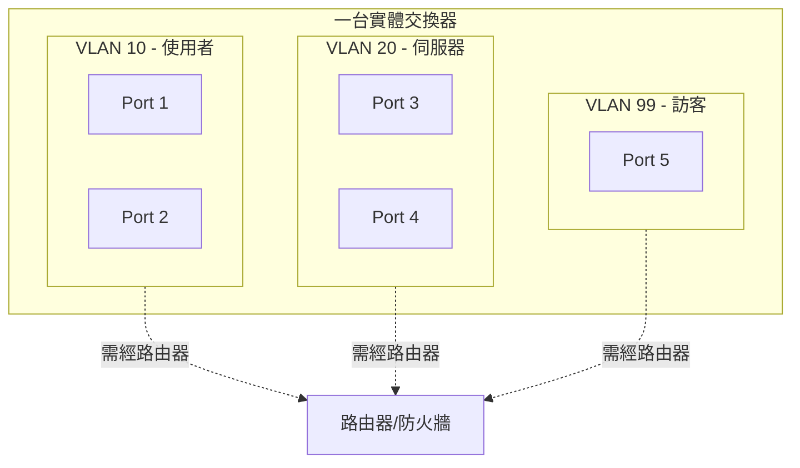
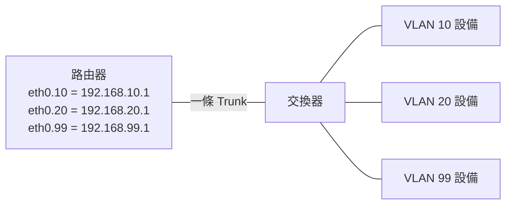
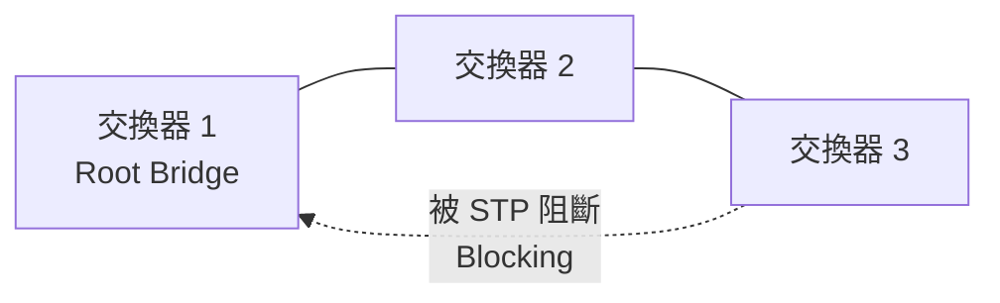

# VLAN 與網路分段

> [!abstract] 這篇你會學到
> - 用**辦公大樓隔間**的比喻理解 VLAN 要解決什麼問題
> - 分辨 **Access 埠**與 **Trunk 埠**，看懂 802.1Q 標籤
> - 知道 **VLAN 間通訊需要什麼**（單臂路由 vs 三層交換器）
> - 理解 **STP 生成樹協定**要防止的「廣播風暴」有多可怕
> - 認識網路分段的**資安價值**，以及怎麼規劃
> - 學會 VLAN 相關的排錯

## 前置知識

- [[05-網概-MAC位址與交換器]] — 廣播網域的概念
- [[06-網概-IP位址與子網路]] — 網段規劃

---

## 觀念說明

### 問題：一台交換器就是一個廣播網域

回顧 [[05-網概-MAC位址與交換器]]：
**交換器切開了碰撞網域，但廣播網域仍然是同一個。**

```
一台 48 埠交換器，接了 48 台設備
→ 全部在同一個廣播網域
→ 任何一次 ARP 廣播，48 台都要處理
```

**這造成三個問題**：

| 問題 | 說明 |
| --- | --- |
| **廣播流量** | 設備越多，廣播越多，浪費頻寬與 CPU |
| **資安** | **一台中毒可以直接攻擊其他 47 台**（同網段不經過路由器，防火牆管不到） |
| **管理** | 印表機、監視器、伺服器、使用者電腦全混在一起 |

### 傳統解法：買更多台交換器（很貴）

```
使用者部門 → 交換器 A（獨立）
伺服器     → 交換器 B（獨立）
訪客       → 交換器 C（獨立）
```

**問題**：
- 每個網段都要**買一台實體交換器**
- 3 樓的使用者與 5 樓的使用者要在同一個網段？**要拉專線**
- 某個網段只有 3 台設備，卻要用掉一台 24 埠交換器 —— **浪費**

### VLAN：用軟體做隔間

**VLAN**（Virtual LAN，虛擬區域網路）
讓你在**一台實體交換器上，邏輯地切出多個獨立的網路**。

> [!example] 核心比喻：辦公大樓的隔間
> **沒有 VLAN**：一個大通鋪，所有部門擠在一起，
> 一個人講話全部的人都聽得到。
>
> **有 VLAN**：用隔板把同一層樓隔成好幾間辦公室。
> - 每間辦公室裡的人可以自由交談
> - **不同辦公室之間聽不到彼此**
> - 要跨辦公室溝通，**必須走走廊（路由器）**，
>   而走廊上可以設警衛（防火牆）
>
> **關鍵**：這些隔板是**軟體設定的，隨時可以改**，
> 不用真的去砌一道牆。



> [!note] VLAN 的三個效果
> 1. **切開廣播網域** —— 每個 VLAN 是獨立的廣播網域
> 2. **邏輯隔離** —— 不同 VLAN 的設備**無法直接通訊**
> 3. **不受實體位置限制** —— 3 樓與 5 樓的設備可以在同一個 VLAN

---

## Access 埠與 Trunk 埠

這是 VLAN 最核心的兩個概念。

| | **Access 埠** | **Trunk 埠** |
| --- | --- | --- |
| 接什麼 | **終端設備**（電腦、印表機、AP） | **交換器 ↔ 交換器**、交換器 ↔ 路由器 |
| 屬於幾個 VLAN | **只有一個** | **多個（甚至全部）** |
| 封包有標籤嗎 | **沒有**（終端設備不懂 VLAN） | **有 802.1Q 標籤** |
| 比喻 | **辦公室的門**（你只能進自己那間） | **走廊**（所有部門的人都在上面走，但身上掛著識別證） |

### Access 埠：終端設備接的地方

```cisco
interface GigabitEthernet0/5
 description ** 3F-A12-會計室王小姐 **
 switchport mode access
 switchport access vlan 10        ! 這個埠屬於 VLAN 10
 spanning-tree portfast           ! 快速啟用（終端設備用）
 spanning-tree bpduguard enable   ! 防止有人接交換器進來
```

> [!tip] 終端設備完全不知道 VLAN 的存在
> 你的電腦送出一個普通的乙太網路 Frame（**沒有 VLAN 標籤**），
> 交換器收到後，**依照那個埠的設定**，
> 在內部把它標記為「這是 VLAN 10 的流量」。
>
> 送出去給電腦時，交換器會**把標籤拿掉**再送。
>
> **所以電腦完全不用做任何設定** —— 這是 VLAN 好用的原因。

### Trunk 埠：交換器之間的通道

**問題**：兩台交換器之間只有一條線，
但兩邊都有 VLAN 10、20、99 的設備。
**這條線上的封包，怎麼知道自己屬於哪個 VLAN？**

**答案：802.1Q 標籤（VLAN Tag）**。

```
原本的 Frame:
┌─────────┬─────────┬──────┬──────────┬─────┐
│ 目的MAC  │ 來源MAC  │ 類型 │ Payload  │ FCS │
└─────────┴─────────┴──────┴──────────┴─────┘

加上 802.1Q 標籤（4 位元組）:
┌─────────┬─────────┬═══════════┬──────┬──────────┬─────┐
│ 目的MAC  │ 來源MAC  │ 802.1Q 標籤 │ 類型 │ Payload  │ FCS │
└─────────┴─────────┴═══════════┴──────┴──────────┴─────┘
                      └ VLAN ID (12 bit)
                        + 優先序 (3 bit, CoS)
```

| 欄位 | 說明 |
| --- | --- |
| **VLAN ID** | **12 位元 → 1～4094**（0 與 4095 保留） |
| **PCP / CoS** | 3 位元，**服務品質優先序**（0～7，語音通常用 5） |
| TPID | 標示「這是 802.1Q 標籤」（`0x8100`） |

```cisco
interface GigabitEthernet0/24
 description ** Trunk to Core Switch **
 switchport mode trunk
 switchport trunk allowed vlan 10,20,30,99     ! 只允許這些 VLAN 通過
 switchport trunk native vlan 999              ! 見下方警告
```

> [!warning] Native VLAN：Trunk 上唯一「不打標籤」的 VLAN
> 802.1Q 規定 Trunk 上有一個 **Native VLAN**，
> 它的流量**不加標籤**就送出去（為了相容不懂 VLAN 的舊設備）。
>
> **預設是 VLAN 1** —— **這是資安問題**。
>
> **VLAN Hopping 攻擊**：
> 攻擊者送出**已經帶有 VLAN 標籤**的封包，
> 如果他所在的 VLAN 剛好是 Native VLAN（沒標籤），
> 交換器會把他的封包當成 Trunk 流量，
> **讓他跳到另一個 VLAN**。
>
> **防護（三個都要做）**：
> ```cisco
> ! 1. Native VLAN 改成一個沒有任何設備的閒置 VLAN
> switchport trunk native vlan 999
>
> ! 2. 明確限制 Trunk 允許的 VLAN
> switchport trunk allowed vlan 10,20,30
>
> ! 3. 所有 Access 埠明確設為 access 模式，關閉自動協商
> interface range Gi0/1 - 20
>  switchport mode access
>  switchport nonegotiate          ! 關閉 DTP，防止被誘導成 Trunk
> ```

> [!danger] 一定要關閉 DTP（動態 Trunk 協定）
> Cisco 的埠預設是 `dynamic auto` 或 `dynamic desirable`，
> **會自動協商要不要變成 Trunk**。
>
> 攻擊者只要送出 DTP 封包，
> **就能讓自己接的那個埠變成 Trunk，看到所有 VLAN 的流量**。
>
> **所有接終端設備的埠都應該明確設定**：
> ```cisco
> switchport mode access
> switchport nonegotiate
> ```

---

## VLAN 間通訊

> [!note] VLAN 之間預設「完全不通」
> 這是重點也是價值所在。
>
> VLAN 10 的電腦要連 VLAN 20 的伺服器，
> **必須經過一個第 3 層的設備（路由器或三層交換器）**。
>
> **而這正是資安控制點** —— 你可以在那裡放防火牆規則。

### 方案一：單臂路由（Router on a Stick）

用**一台路由器 + 一條 Trunk 線**，
在路由器上建立多個**子介面**，每個對應一個 VLAN。



```cisco
! 路由器上
interface GigabitEthernet0/0.10
 encapsulation dot1Q 10
 ip address 192.168.10.1 255.255.255.0
!
interface GigabitEthernet0/0.20
 encapsulation dot1Q 20
 ip address 192.168.20.1 255.255.255.0
```

| 優點 | 缺點 |
| --- | --- |
| **便宜**（只要一台路由器） | **所有 VLAN 間流量都擠在同一條線上** |
| 設定簡單 | 那條線容易成為瓶頸 |
| 適合小型網路 | 路由器的轉送速度較慢（軟體） |

### 方案二：三層交換器（SVI）

在交換器上直接建立 **SVI**（Switched Virtual Interface，VLAN 介面），
由交換器**用硬體 ASIC 做路由**。

```cisco
! 三層交換器上
ip routing                          ! 啟用路由功能（很多人忘記這行！）
!
interface Vlan10
 ip address 192.168.10.1 255.255.255.0
!
interface Vlan20
 ip address 192.168.20.1 255.255.255.0
```

| 優點 | 缺點 |
| --- | --- |
| **極快**（硬體轉送，線速） | 較貴 |
| 埠數多 | 進階功能（NAT、VPN）較少 |
| **企業網路的標準做法** | |

> [!tip] 典型的企業架構
> ```
> 網際網路
>     │
> [防火牆]  ← 對外的 NAT、VPN、進階過濾
>     │
> [三層核心交換器]  ← 內部 VLAN 間高速路由 + ACL
>     ├── 二層交換器（1F）
>     ├── 二層交換器（2F）
>     └── 二層交換器（3F）
> ```
>
> **內部 VLAN 間走三層交換器**（快、埠多）；
> **對外走防火牆**（功能多、可深度檢查）。
>
> 見 [[01-網路架構基礎]]。

---

## STP：防止廣播風暴

### 問題：迴圈會讓網路瞬間癱瘓


> [!danger] 為什麼迴圈這麼可怕
> **一個廣播封包（例如一次 ARP 查詢）進入迴圈後**：
>
> 1. 交換器 1 收到 → 從所有其他埠送出
> 2. 交換器 2 與 3 收到 → 各自再從所有埠送出
> 3. 交換器 1 又收到（兩份）→ 再送出
> 4. **封包數量呈指數成長**
>
> **而且第 2 層的 Frame 沒有 TTL** ——
> 不像 IP 封包會遞減後死掉，**Frame 會永遠循環下去**。
>
> **結果（幾秒內發生）**：
> - 頻寬瞬間被 100% 佔滿
> - 交換器 CPU 100%，**完全失去回應**
> - **MAC 表不斷震盪**（同一個 MAC 一直從不同埠出現）
> - **整個網路完全癱瘓**
>
> 這叫 **廣播風暴（Broadcast Storm）**。

> [!warning] 最常見的成因不是設計錯誤，而是「有人接錯線」
> **真實案例的典型情境**：
> - 同仁想「多一個網路孔」，把一條網路線的兩端插進牆上兩個網路孔
> - 有人把小型交換器的兩個埠接在一起
> - 整理機櫃時不小心接錯
>
> **症狀**：所有交換器的**指示燈同步狂閃**，整層樓網路癱瘓。

### STP 的解法：邏輯上「切斷」一條路

**STP**（Spanning Tree Protocol，生成樹協定）是
「**OSI 第 2 層的協定，一般在交換器上執行**」，
目的是「**防止在網路拓樸中出現迴圈進而產生廣播風暴**」。



**運作原理**：

| 步驟 | 說明 |
| --- | --- |
| 1 | 交換器之間交換 **BPDU** 訊息 |
| 2 | 選出一台 **Root Bridge**（根橋，優先序最小的） |
| 3 | 每台交換器算出到 Root 的最短路徑 |
| 4 | **把會造成迴圈的埠設為 Blocking（阻斷）** |
| 5 | 主線路斷掉時，**自動把備用埠改為 Forwarding** |

> [!tip] STP 的價值不只是防迴圈，還有「自動備援」
> 你可以**刻意接兩條線**做冗餘：
> - 平常 STP 會阻斷其中一條
> - **主線斷了，STP 自動啟用備用線路**
>
> 「確保網路的拓樸被重新計算，如此一來就不會讓部分的問題影響整個網路的連通。」

### STP 的版本

| 版本 | 標準 | 收斂時間 | 說明 |
| --- | --- | --- | --- |
| STP | 802.1D | **30～50 秒** | 原始版本，太慢 |
| **RSTP** | **802.1w** | **1～6 秒** | **快速生成樹，現代標準** |
| MSTP | 802.1s | 快 | 多個 VLAN 共用一棵樹，節省資源 |
| PVST+ / Rapid-PVST+ | Cisco | 快 | **每個 VLAN 一棵樹**，可做流量負載分擔 |

> [!warning] 傳統 STP 的 30～50 秒收斂太慢
> 主線斷掉後，要等 30～50 秒 STP 才會啟用備用路徑 ——
> 這段時間網路是**完全不通**的。
>
> **現代網路應該使用 RSTP（802.1w）或 Rapid-PVST+**。

### 必做的 STP 保護設定

```cisco
! 1. 使用快速版本
spanning-tree mode rapid-pvst

! 2. 明確指定 Root Bridge（不要讓它隨機選）
spanning-tree vlan 10,20,30 root primary      ! 在核心交換器上

! 3. 接使用者的埠：PortFast + BPDU Guard
interface range GigabitEthernet0/1 - 20
 switchport mode access
 spanning-tree portfast
 spanning-tree bpduguard enable       ! 收到 BPDU 就關閉該埠

! 4. 廣播風暴抑制
interface range GigabitEthernet0/1 - 20
 storm-control broadcast level 5.00   ! 廣播超過 5% 頻寬就抑制
 storm-control action shutdown        ! 或直接關埠
```

> [!tip] BPDU Guard 是防止「有人接錯線」的關鍵
> **PortFast** 讓終端設備的埠跳過 STP 的等待，插上就能用（省 30 秒）。
>
> 但這也帶來風險：如果有人在那個埠接了一台交換器，就可能形成迴圈。
>
> **BPDU Guard 的邏輯很簡單**：
> 「這個埠應該接終端設備，**終端設備不會發 BPDU**。
> 所以**如果收到 BPDU，代表有人接了交換器 → 立刻關閉這個埠**。」
>
> **PortFast + BPDU Guard 應該一起設定在所有使用者埠上。**
> 這一組設定能防止絕大多數的意外迴圈事故。

---

## 網路分段的資安價值

> [!note] 這是 VLAN 最重要的用途
> 分段的核心價值是**限制「橫向移動（Lateral Movement）」**。
>
> **沒有分段**：
> ```
> 一台電腦中了勒索軟體
>   → 同網段的 200 台機器全部可以直接連到
>   → 幾小時內全部被加密
> ```
>
> **有分段**：
> ```
> 一台電腦中了勒索軟體
>   → 只能影響同 VLAN 的 50 台
>   → 要跨到伺服器 VLAN 必須經過防火牆
>   → 防火牆只開放 443，勒索軟體用的 445 被擋
>   → 損害被控制住
> ```

### 典型的分段規劃

| VLAN | 用途 | 可以連到哪裡 |
| --- | --- | --- |
| **10** | 使用者電腦 | 網際網路、伺服器的特定埠 |
| **20** | 伺服器 | 網際網路（受限）、資料庫 VLAN |
| **30** | 資料庫 | **只接受伺服器 VLAN 的連線**，不能主動對外 |
| **40** | 印表機／IoT | **只能連印表機伺服器**，不能上網 |
| **50** | 監視系統 | 只能連 NVR |
| **60** | VoIP 電話 | 只能連話務伺服器（並設 QoS 優先序） |
| **99** | 訪客 | **只能上網，完全不能碰內部** |
| **100** | **網路設備管理** | **最嚴格** —— 只允許特定跳板機存取 |
| **999** | 未使用（Native VLAN / 黑洞） | 什麼都不通 |

> [!danger] 管理 VLAN 是最高價值的目標
> **VLAN 100（網路設備管理）**包含：
> 交換器、防火牆、AP 控制器、**伺服器的 iDRAC/iLO/IPMI**、UPS 管理卡。
>
> 攻下這裡等於**完全控制整個網路與所有伺服器**
> （IPMI 可以在作業系統關機時開關機、掛載虛擬光碟）。
>
> **必做**：
> 1. **絕對不能連到網際網路**
> 2. **只允許從特定的跳板機（Bastion）存取**
> 3. 所有管理介面**改掉預設密碼**、啟用 MFA
> 4. **完整的存取日誌**
> 5. 韌體定期更新
>
> 見 [[12-Cisco-管理IP與遠端存取]] 與 [[12-零信任架構與微分段]]。

> [!warning] 「切了 VLAN」不等於「有資安」
> 這是最常見的誤區。
>
> 如果你切了 5 個 VLAN，
> 但**三層交換器上完全沒有 ACL，所有 VLAN 之間互通** ——
> 那你只是把一個大廣播網域切成五個小的，
> **資安效果幾乎是零**。
>
> **真正的分段 = VLAN + 明確的存取控制規則**。
>
> ```cisco
> ! 範例：訪客 VLAN 只能上網，不能碰內部
> ip access-list extended GUEST-OUT
>  deny   ip 192.168.99.0 0.0.0.255 10.0.0.0 0.255.255.255
>  deny   ip 192.168.99.0 0.0.0.255 192.168.0.0 0.0.255.255
>  permit ip 192.168.99.0 0.0.0.255 any
> !
> interface Vlan99
>  ip access-group GUEST-OUT in
> ```

---

## 完整實戰範例

### 在 Linux 上使用 VLAN

Linux 主機也可以直接處理 802.1Q 標籤（常用於虛擬化主機）。

```bash
# 載入 8021q 模組
$ sudo modprobe 8021q

# 在 eth0 上建立 VLAN 10 的子介面
$ sudo ip link add link eth0 name eth0.10 type vlan id 10
$ sudo ip addr add 192.168.10.50/24 dev eth0.10
$ sudo ip link set eth0.10 up

# 建立 VLAN 20
$ sudo ip link add link eth0 name eth0.20 type vlan id 20
$ sudo ip addr add 192.168.20.50/24 dev eth0.20
$ sudo ip link set eth0.20 up

# 查看
$ ip -d link show eth0.10
5: eth0.10@eth0: <BROADCAST,MULTICAST,UP,LOWER_UP> mtu 1500
    vlan protocol 802.1Q id 10 <REORDER_HDR>
                            ^^ VLAN ID

$ ip addr show | grep -A2 'eth0\.'
```

**永久設定（netplan）**：

```yaml
network:
  version: 2
  ethernets:
    eth0:
      dhcp4: no
  vlans:
    eth0.10:
      id: 10
      link: eth0
      addresses: [192.168.10.50/24]
      routes:
        - to: default
          via: 192.168.10.1
    eth0.20:
      id: 20
      link: eth0
      addresses: [192.168.20.50/24]
```

> [!tip] 這在虛擬化主機上很常用
> Proxmox VE 或 VMware 主機接一條 **Trunk 線**，
> 然後把不同的 VM 指派到不同的 VLAN ——
> 一條實體線就能服務所有 VLAN。
>
> 見 `40-虛擬化平台` 章節。

### 抓帶 VLAN 標籤的封包

```bash
# 抓所有帶 VLAN 標籤的封包
$ sudo tcpdump -i eth0 -e -n vlan

10:23:45.123 00:1a:2b:3c:4d:5e > 00:11:22:33:44:55,
  ethertype 802.1Q (0x8100), length 102: vlan 10, p 0,
                                          ^^^^^^^ VLAN ID = 10
  ethertype IPv4 (0x0800), 192.168.10.50 > 192.168.10.1: ICMP echo request

# 只抓特定 VLAN
$ sudo tcpdump -i eth0 -n vlan 20
```

> [!tip] 這是驗證 Trunk 設定的最佳方法
> 在 Trunk 線上抓封包，你應該看到**多個不同 VLAN ID** 的流量。
>
> 如果只看到一個 VLAN，代表：
> - `switchport trunk allowed vlan` 設得太窄
> - 或那個埠根本不是 Trunk

### Cisco 上的完整設定範例

```cisco
! ===== 建立 VLAN =====
vlan 10
 name USERS
vlan 20
 name SERVERS
vlan 99
 name GUEST
vlan 999
 name BLACKHOLE

! ===== 使用者埠（Access）=====
interface range GigabitEthernet0/1 - 20
 description ** User Access Ports **
 switchport mode access
 switchport access vlan 10
 switchport nonegotiate                  ! 關閉 DTP
 spanning-tree portfast
 spanning-tree bpduguard enable
 storm-control broadcast level 5.00
 switchport port-security
 switchport port-security maximum 2
 switchport port-security violation restrict

! ===== 未使用的埠 =====
interface range GigabitEthernet0/21 - 22
 description ** UNUSED **
 switchport access vlan 999
 shutdown

! ===== Trunk 埠 =====
interface GigabitEthernet0/24
 description ** Trunk to Core **
 switchport mode trunk
 switchport trunk allowed vlan 10,20,99
 switchport trunk native vlan 999        ! 不要用預設的 VLAN 1
 switchport nonegotiate

! ===== STP =====
spanning-tree mode rapid-pvst
spanning-tree vlan 10,20,99 priority 4096   ! 若這是核心交換器
```

### 驗證指令

```cisco
! 看 VLAN 與埠的對應
switch# show vlan brief
VLAN Name       Status    Ports
---- ---------- --------- -------------------------------
10   USERS      active    Gi0/1, Gi0/2, Gi0/3, ...
20   SERVERS    active    Gi0/11, Gi0/12
99   GUEST      active    Gi0/18
999  BLACKHOLE  active    Gi0/21, Gi0/22

! 看 Trunk 狀態
switch# show interfaces trunk
Port      Mode  Encapsulation  Status    Native vlan
Gi0/24    on    802.1q         trunking  999
Port      Vlans allowed on trunk
Gi0/24    10,20,99

! 看 STP 狀態
switch# show spanning-tree vlan 10
VLAN0010
  Root ID    Priority 4106
             Address  0011.2233.4455
             This bridge is the root          ← 我是 Root
Interface     Role Sts Cost  Prio.Nbr Type
Gi0/24        Desg FWD 4     128.24   P2p
Gi0/23        Altn BLK 4     128.23   P2p    ← 被阻斷（防迴圈）
                   ^^^

! 看某個埠的詳細設定
switch# show interfaces GigabitEthernet0/5 switchport
```

---

## 常見錯誤與排錯

| 現象 | 原因 | 解法 |
| --- | --- | --- |
| 電腦拿不到 IP（`169.254.x.x`） | **接到錯誤的 VLAN**（沒有 DHCP） | `show interfaces Gi0/x switchport` 檢查 VLAN |
| 同 VLAN 內通，跨 VLAN 不通 | **沒有第 3 層設備**做路由 | 設定 SVI 或單臂路由；**檢查 `ip routing` 有沒有開** |
| 三層交換器設了 SVI 但還是不通 | **忘了 `ip routing`** | `ip routing`（這是最常見的疏漏） |
| 某個 VLAN 跨不到另一台交換器 | **Trunk 沒有允許那個 VLAN** | `switchport trunk allowed vlan add 30` |
| Trunk 兩端 Native VLAN 不一致 | 設定不對稱 | 兩端都設相同的 Native VLAN；CDP 會告警 |
| **整層樓網路癱瘓、燈狂閃** | **廣播風暴（迴圈）** | 立刻找出重複接線；啟用 STP + BPDU Guard |
| 主線斷了要等 30 秒才恢復 | 用了傳統 STP | 改用 **rapid-pvst** 或 MSTP |
| 插上電腦要等 30 秒才能用 | 沒設 PortFast | `spanning-tree portfast` |
| 有人接了分享器造成迴圈 | 沒有 BPDU Guard | `spanning-tree bpduguard enable` |
| 訪客可以存取內部伺服器 | **只切 VLAN 沒設 ACL** | 在 SVI 上套用 ACL |
| 攻擊者跳到別的 VLAN | **VLAN Hopping**（Native VLAN 或 DTP） | 改 Native VLAN、`switchport nonegotiate` |
| VM 拿不到正確 VLAN 的 IP | 虛擬交換器的 VLAN 設定錯 | 檢查 hypervisor 的 port group VLAN ID |

> [!tip] VLAN 排錯的四步驟
> ```
> 1. 這個埠是 Access 還是 Trunk？屬於哪個 VLAN？
>    → show interfaces Gi0/x switchport
>
> 2. 這個 VLAN 存在嗎？狀態是 active 嗎？
>    → show vlan brief
>
> 3. Trunk 有允許這個 VLAN 通過嗎？
>    → show interfaces trunk
>
> 4. 有第 3 層介面（SVI）嗎？ip routing 開了嗎？
>    → show ip interface brief | include Vlan
>    → show running-config | include ip routing
> ```

---

## 安全性注意事項

> [!danger] VLAN Hopping 的兩種手法
> **一、Switch Spoofing（利用 DTP）**
> 攻擊者送出 DTP 封包，誘導交換器把他的埠變成 Trunk，
> **然後就看得到所有 VLAN 的流量**。
>
> **防護**：所有 Access 埠設 `switchport mode access` + `switchport nonegotiate`
>
> **二、Double Tagging（利用 Native VLAN）**
> 攻擊者送出**帶兩層 VLAN 標籤**的封包：
> ```
> [外層標籤 = Native VLAN][內層標籤 = 目標 VLAN][資料]
> ```
> 第一台交換器**剝掉外層**（因為是 Native VLAN，不打標籤），
> 送到 Trunk 上；第二台交換器看到**內層標籤**，
> 就把它送進目標 VLAN。
>
> **防護**：Native VLAN 改成**沒有任何設備的閒置 VLAN**（如 999）

> [!warning] 未使用的埠一定要處理
> ```cisco
> interface range GigabitEthernet0/21 - 24
>  description ** UNUSED - DISABLED **
>  switchport access vlan 999      ! 丟到黑洞 VLAN
>  shutdown                         ! 並且關閉
> ```
>
> 沒有做這件事的話，**任何人走進會議室插上網路線，
> 就直接進了你的辦公 VLAN**。
>
> 這是**成本為零、效果極大**的防護。

> [!tip] VLAN 不是萬能的：VLAN 的隔離不是「安全邊界」
> 這一點需要正確認識。
>
> VLAN 提供的是**邏輯隔離**，它依賴交換器正確運作。
> 如果交換器本身被攻破、或設定錯誤，隔離就失效了。
>
> **高安全需求的環境**（如處理機密資料的網段）
> 應該考慮：
> | 做法 | 說明 |
> | --- | --- |
> | **實體隔離** | 完全獨立的交換器與線路（air gap） |
> | **獨立防火牆** | 不只是 ACL，而是有狀態檢查的防火牆 |
> | **微分段** | 連同一個 VLAN 內的機器之間也要驗證 |
> | **零信任** | 不預設信任任何網路位置 |
>
> 見 [[12-零信任架構與微分段]]。

> [!warning] 語音 VLAN 的特殊考量
> IP 話機通常這樣接：
> ```
> 交換器 ──→ IP 話機 ──→ 電腦
> ```
> 話機內建一個小型交換器，同一條線同時傳語音（VLAN 60）與資料（VLAN 10）。
>
> ```cisco
> interface GigabitEthernet0/5
>  switchport mode access
>  switchport access vlan 10        ! 電腦的資料 VLAN（不打標籤）
>  switchport voice vlan 60         ! 話機的語音 VLAN（打標籤）
>  spanning-tree portfast
> ```
>
> **資安考量**：這個埠實際上同時屬於兩個 VLAN，
> 攻擊者若拔掉話機直接接電腦，
> **可能可以偽造語音 VLAN 的標籤**。
> 高安全環境應考慮用 802.1X 驗證話機身分。

---

## 速查表

### Access vs Trunk

| | Access | Trunk |
| --- | --- | --- |
| 接什麼 | 終端設備 | 交換器/路由器之間 |
| VLAN 數 | **1 個** | **多個** |
| 標籤 | **無** | **802.1Q** |
| 比喻 | 辦公室的門 | 走廊 |

### 802.1Q 標籤

```
4 位元組，包含：
  VLAN ID: 12 bit → 1～4094
  PCP/CoS: 3 bit  → 優先序 0～7
```

### VLAN 間通訊方案

| 方案 | 說明 | 適合 |
| --- | --- | --- |
| **單臂路由** | 一台路由器 + Trunk + 子介面 | 小型網路 |
| **三層交換器（SVI）** | 交換器硬體路由 | **企業標準** |

**別忘了 `ip routing`！**

### STP 版本

| 版本 | 收斂時間 |
| --- | --- |
| STP (802.1D) | 30～50 秒 ❌ |
| **RSTP (802.1w)** | **1～6 秒** ✅ |
| Rapid-PVST+ | 快，每 VLAN 一棵樹 |

### 必做的埠設定

**使用者埠（Access）**：
```cisco
switchport mode access
switchport access vlan 10
switchport nonegotiate            ! 防 VLAN Hopping
spanning-tree portfast
spanning-tree bpduguard enable    ! 防迴圈
storm-control broadcast level 5
switchport port-security
```

**Trunk 埠**：
```cisco
switchport mode trunk
switchport trunk allowed vlan 10,20,99    ! 明確限制
switchport trunk native vlan 999          ! 不用 VLAN 1
switchport nonegotiate
```

**未使用的埠**：
```cisco
switchport access vlan 999
shutdown
```

### 驗證指令

| 目的 | 指令 |
| --- | --- |
| VLAN 與埠對應 | `show vlan brief` |
| Trunk 狀態 | `show interfaces trunk` |
| 單一埠設定 | `show interfaces Gi0/x switchport` |
| STP 狀態 | `show spanning-tree vlan 10` |
| SVI 介面 | `show ip interface brief \| include Vlan` |
| Linux 建 VLAN | `ip link add link eth0 name eth0.10 type vlan id 10` |
| 抓 VLAN 封包 | `sudo tcpdump -e -n vlan` |

---

## 練習題

> [!question]- 練習 1：在 Linux 上實作 VLAN
> ```bash
> sudo modprobe 8021q
> sudo ip link add link eth0 name eth0.10 type vlan id 10
> sudo ip addr add 192.168.10.50/24 dev eth0.10
> sudo ip link set eth0.10 up
> ip -d link show eth0.10
> ```
> 然後在另一個終端機抓封包：
> ```bash
> sudo tcpdump -i eth0 -e -n vlan
> ```
> 從 `eth0.10` ping 一個位址，觀察封包裡的 `vlan 10` 標籤。

> [!question]- 練習 2：規劃機關的 VLAN
> 為一個 150 人的機關規劃 VLAN，包含：
> 使用者電腦、伺服器、資料庫、印表機、監視系統、IP 話機、訪客、網路設備管理。
>
> 回答：
> 1. 各給哪個 VLAN ID 與網段？
> 2. **哪些 VLAN 之間需要通？哪些必須完全隔離？**
> 3. 管理 VLAN 該有哪些額外的保護？
> 4. Native VLAN 該設什麼？
>
> 參考方向見本篇「典型的分段規劃」表格。
> 重點：**訪客與 IoT 完全不能碰內部；管理 VLAN 只允許跳板機**。

> [!question]- 練習 3：診斷 VLAN 問題
> 情境：3 樓某個使用者的電腦拿到 `169.254.x.x`，其他人都正常。
>
> 寫出你的排查步驟（至少五步）。
>
> 參考答案：
> ```
> 1. 實體層：ethtool 看有沒有 Link（線、埠）
> 2. 找出他接在交換器的哪個埠（MAC → show mac address-table，
>    或看埠描述）
> 3. show interfaces Gi0/x switchport
>    → 這個埠是 access 嗎？屬於哪個 VLAN？是不是被設錯了？
> 4. show vlan brief → 那個 VLAN 存在且 active 嗎？
> 5. 那個 VLAN 有 DHCP 嗎？
>    → SVI 上有沒有 ip helper-address？
> 6. 檢查 port-security 有沒有把埠 err-disabled
>    → show interfaces status err-disabled
> ```

---

## 小測驗

Q1. 用「辦公大樓隔間」的比喻說明 VLAN。它帶來哪三個效果？

Q2. Access 埠與 Trunk 埠的差別是什麼？各接什麼設備？

Q3. 802.1Q 標籤有幾位元組？VLAN ID 佔幾位元、範圍是多少？

Q4. 什麼是 Native VLAN？為什麼預設的 VLAN 1 是資安問題？

Q5. VLAN Hopping 有哪兩種手法？各該怎麼防護？

Q6. VLAN 之間要通訊需要什麼？單臂路由與三層交換器各有什麼優缺點？

Q7. **為什麼第 2 層的迴圈比第 3 層的路由迴圈更可怕**？

Q8. STP 除了防迴圈，還有什麼價值？為什麼要用 RSTP 而不是傳統 STP？

Q9. PortFast 與 BPDU Guard 為什麼要一起設定？BPDU Guard 的判斷邏輯是什麼？

Q10. 「切了 VLAN 就有資安」這句話錯在哪裡？管理 VLAN 為什麼是最高價值的目標？

> [!question]- 測驗答案
> **Q1.** VLAN 就像**用隔板把一層樓隔成好幾間辦公室**：
> 每間裡面的人可以自由交談，**不同辦公室之間聽不到彼此**，
> 要跨辦公室溝通**必須走走廊（路由器）**，而走廊上可以設警衛（防火牆）。
> 關鍵是這些隔板是**軟體設定的，隨時可以改**。
> **三個效果**：①**切開廣播網域**；②**邏輯隔離**（不同 VLAN 無法直接通訊）；
> ③**不受實體位置限制**（3 樓與 5 樓可在同一 VLAN）。
>
> **Q2.** **Access 埠**接**終端設備**（電腦、印表機、AP），
> **只屬於一個 VLAN**，封包**沒有標籤**（終端設備不懂 VLAN）；
> **Trunk 埠**接**交換器之間或交換器與路由器**，
> **可承載多個 VLAN**，封包帶有 **802.1Q 標籤**。
> 比喻：Access 是「辦公室的門」，Trunk 是「走廊」。
>
> **Q3.** 802.1Q 標籤是 **4 位元組**。
> **VLAN ID 佔 12 位元**，範圍 **1～4094**（0 與 4095 保留）。
> 另外有 3 位元的 **PCP/CoS**（服務品質優先序 0～7）與 TPID。
>
> **Q4.** **Native VLAN 是 Trunk 上唯一「不打標籤」的 VLAN**
> （為了相容不懂 VLAN 的舊設備）。
> 預設是 VLAN 1，這是資安問題，因為它讓 **Double Tagging 的
> VLAN Hopping 攻擊**成為可能 ——
> 攻擊者送出帶兩層標籤的封包，第一台交換器剝掉外層（Native，不打標籤），
> 第二台看到內層標籤就把它送進目標 VLAN。
> 應改成**沒有任何設備的閒置 VLAN**（如 999）。
>
> **Q5.** ①**Switch Spoofing（利用 DTP）** ——
> 攻擊者送 DTP 封包誘導交換器把他的埠變成 Trunk，
> 就能看到所有 VLAN 的流量。
> **防護**：所有 Access 埠明確設 `switchport mode access` + `switchport nonegotiate`。
> ②**Double Tagging（利用 Native VLAN）** —— 見 Q4。
> **防護**：Native VLAN 改成閒置的 VLAN（如 999）。
>
> **Q6.** VLAN 之間要通訊必須經過**第 3 層設備**（路由器或三層交換器）。
> **單臂路由**：一台路由器 + 一條 Trunk + 多個子介面 ——
> **便宜、設定簡單**，但**所有 VLAN 間流量都擠在同一條線上**，容易成為瓶頸；
> **三層交換器（SVI）**：交換器用**硬體 ASIC 做路由** ——
> **極快、埠多，是企業標準做法**，但較貴且進階功能（NAT、VPN）較少。
> **別忘了在三層交換器上啟用 `ip routing`。**
>
> **Q7.** 因為**第 2 層的 Frame 沒有 TTL** ——
> 不像 IP 封包會遞減後死掉，**Frame 會永遠循環下去**。
> 一個廣播封包進入迴圈後會**呈指數成長**，
> 幾秒內就讓頻寬 100% 佔滿、交換器 CPU 100% 失去回應、
> MAC 表不斷震盪，**整個網路完全癱瘓**（廣播風暴）。
> 而且最常見的成因不是設計錯誤，而是**有人不小心把一條線的兩端插進兩個網路孔**。
>
> **Q8.** 除了防迴圈，STP 還提供**自動備援** ——
> 你可以刻意接兩條線做冗餘，平常 STP 阻斷其中一條，
> **主線斷了就自動啟用備用線路**。
> 要用 RSTP 是因為**傳統 STP 的收斂時間長達 30～50 秒**，
> 主線斷掉後這段時間網路完全不通；
> **RSTP（802.1w）只要 1～6 秒**。
>
> **Q9.** **PortFast** 讓終端設備的埠跳過 STP 等待，插上就能用（省 30 秒），
> 但也帶來風險 —— 如果有人在那個埠接了交換器就可能形成迴圈。
> **BPDU Guard 的邏輯**：「這個埠應該接終端設備，
> **終端設備不會發 BPDU**；所以**如果收到 BPDU，
> 代表有人接了交換器 → 立刻關閉這個埠**。」
> 兩者一起設定能防止絕大多數的意外迴圈事故。
>
> **Q10.** 錯在**「切了 VLAN」不等於「有存取控制」**。
> 如果三層交換器上完全沒有 ACL、所有 VLAN 之間互通，
> 那只是把一個大廣播網域切成幾個小的，**資安效果幾乎是零**。
> **真正的分段 = VLAN + 明確的存取控制規則。**
> **管理 VLAN 是最高價值目標**，因為它包含交換器、防火牆、AP 控制器、
> **伺服器的 iDRAC/iLO/IPMI**、UPS 管理卡 ——
> 攻下它等於**完全控制整個網路與所有伺服器**
> （IPMI 可在作業系統關機時開關機、掛載虛擬光碟）。
> 必做：絕不連網際網路、只允許特定跳板機存取、改預設密碼、啟用 MFA、完整日誌。

---

## 延伸閱讀

- [[05-網概-MAC位址與交換器]] — 廣播網域與交換器基礎
- [[06-網概-IP位址與子網路]] — 每個 VLAN 對應一個網段
- [[07-網概-路由與封包旅程]] — VLAN 間路由
- [[12-網概-DHCP自動取得設定]] — 跨 VLAN 的 DHCP Relay
- [[18-網概-網路安全基礎]] — 網路分段的資安價值
- [[03-VLAN概念與規劃]] — 企業 VLAN 規劃實戰（進階）
- [[13-Cisco-埠設定與安全]] — 埠安全完整設定（進階）
- [[12-零信任架構與微分段]] — 比 VLAN 更細緻的隔離（進階）
