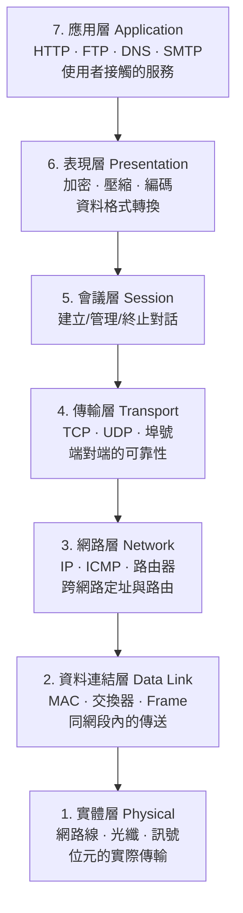
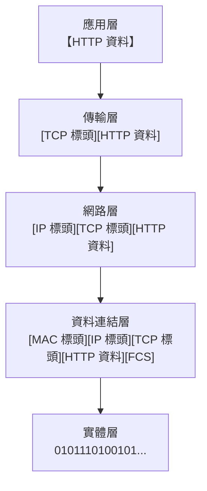
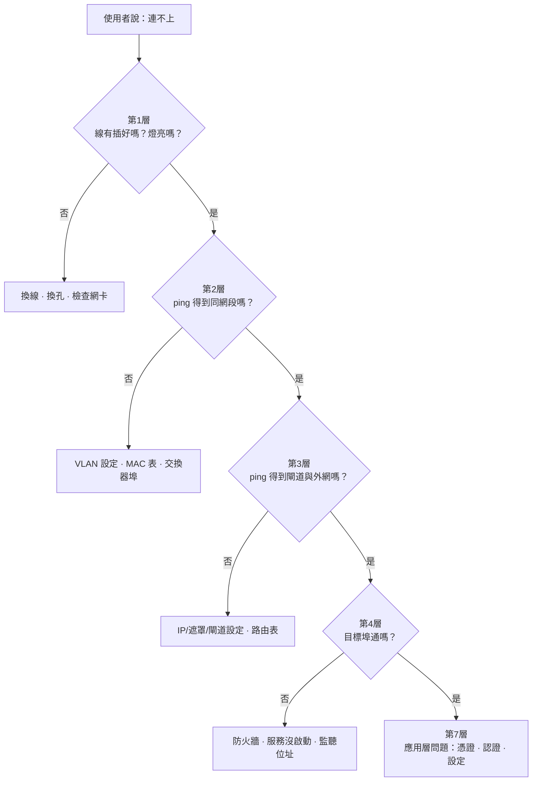

# 網路分層模型

> [!abstract] 這篇你會學到
> - 為什麼要「分層」，以及分層帶來的三個好處
> - **OSI 七層**與 **TCP/IP 四／五層**的對應關係
> - 用**寄一封國際信件**的完整比喻，理解每一層在做什麼
> - 看懂**封裝（encapsulation）與解封裝**的過程
> - **用分層思維定位網路故障** —— 這是本篇最實用的部分
> - 把常見的協定與設備對應到正確的層次

## 前置知識

- [[01-網概-網路是什麼]] — 封包、協定與網路的本質

---

## 觀念說明

### 為什麼要分層

> [!example] 想像沒有分層的世界
> 如果 Chrome 瀏覽器要自己處理所有事情：
> - 怎麼把電訊號變成 0 和 1
> - 網路線用的是哪種編碼
> - 封包遺失了怎麼重傳
> - 對方的 MAC 位址是多少
> - 走 Wi-Fi 還是有線的差別
>
> 那麼**每換一種網路線，Chrome 就要改一次程式**。
> 而且 Firefox、Edge、Outlook、每一個程式都要各自實作一遍。
>
> **這完全不可行。**

**分層的做法**：把整件事切成好幾層，每一層只負責自己的工作，
並且**只跟上下相鄰的層溝通**。

> [!tip] 分層的三個好處
> **一、各層可以獨立更換。**
> 你從有線換成 Wi-Fi，只有最底下兩層變了，
> 上面的 HTTP、TCP 完全不用改 —— 瀏覽器根本不知道你換了。
>
> **二、分工明確，好開發。**
> 寫瀏覽器的人不必懂電磁波，做網路線的人不必懂 HTTP。
>
> **三、好排錯。**
> 這是對維運人員最重要的一點 ——
> **可以一層一層往上排查，快速縮小問題範圍**。

### 核心比喻：寄一封國際信件

這個比喻請記住，它能對應每一層。

| 層 | 寄信的對應動作 |
| --- | --- |
| **應用層** | 你**寫信的內容**（用中文還是英文？商業信函還是私人信件？） |
| **表現層** | 決定用什麼**字體、編碼、要不要加密** |
| **會議層** | 這是「一來一往的通信」還是「單向通知」；管理這段對話 |
| **傳輸層** | 決定用**掛號信（要回執）**還是**平信**；信太厚就拆成幾封並編號 |
| **網路層** | 寫上**收件地址**（台北市 → 東京都），郵局據此決定路線 |
| **資料連結層** | 當地郵差看**門牌與收件人姓名**，送到正確那一戶 |
| **實體層** | **卡車、飛機、船** —— 真正把東西載過去 |

---

## OSI 七層模型

**OSI**（Open Systems Interconnection）由 **ISO** 於 1984 年制定，
是「精密周延」的理論參考模型。



### 逐層說明

| 層 | 名稱 | 一句話 | 資料單位 | 代表協定／設備 |
| --- | --- | --- | --- | --- |
| **7** | 應用層 | 使用者實際用到的服務 | Data | HTTP、DNS、SMTP、SSH、FTP |
| **6** | 表現層 | 格式轉換、加密、壓縮 | Data | TLS/SSL、JPEG、UTF-8 |
| **5** | 會議層 | 建立、管理、結束對話 | Data | NetBIOS、RPC、部分 TLS 功能 |
| **4** | **傳輸層** | **端對端可靠性、埠號** | **Segment** | **TCP、UDP** |
| **3** | **網路層** | **跨網路定址與路由** | **Packet** | **IP、ICMP、路由器** |
| **2** | **資料連結層** | **同網段內的傳送** | **Frame** | **乙太網路、MAC、交換器** |
| **1** | 實體層 | 位元變成訊號 | **Bit** | 網路線、光纖、集線器 |

> [!tip] 記憶口訣
> 由上而下：**應表會傳網資實**
>
> 英文：**A**ll **P**eople **S**eem **T**o **N**eed **D**ata **P**rocessing
> （Application, Presentation, Session, Transport, Network, Data Link, Physical）

> [!warning] 資料單位的名稱不要搞混
> 這是考試與技術文件常出現的：
> ```
> 第 4 層：Segment（TCP）／Datagram（UDP）
> 第 3 層：Packet（封包）
> 第 2 層：Frame（訊框）
> 第 1 層：Bit（位元）
> ```
> 口語上大家常常都講「封包」，但精確的技術討論會分清楚。

---

## TCP/IP 模型

**OSI 是理論，TCP/IP 是實際在用的。**

TCP/IP 模型源自美國國防部（DoD）的研究，
所以也叫 **DoD 模型**、**DARPA 模型**、**ARPANET 模型**。

它的分工較粗，但**簡單、有效率**，成為實務標準。

### 四層版本 vs 五層版本

| OSI 七層 | **TCP/IP 四層**（原始） | **五層版本**（教學常用） |
| --- | --- | --- |
| 7 應用層 | | |
| 6 表現層 | **應用層** | **應用層** |
| 5 會議層 | | |
| 4 傳輸層 | **傳輸層** | **傳輸層** |
| 3 網路層 | **網際網路層** | **網路層** |
| 2 資料連結層 | **網路存取層** | **資料連結層** |
| 1 實體層 | （合併在網路存取層） | **實體層** |

> [!note] 為什麼有兩種版本
> 原始的 TCP/IP 把最底下兩層合併成「網路存取層」，
> 因為它認為「怎麼把位元送出去」不是 TCP/IP 該管的事。
>
> 但教學上把它們分開比較清楚
> （因為交換器與網路線是兩種完全不同的東西），
> 所以有了**五層版本**。
>
> **本手冊採用五層版本**，因為它最貼近實務排錯的思維。

> [!tip] OSI 與 TCP/IP 該用哪個？
> - **講理論、談概念、面試** → 用 **OSI 七層**（大家的共同語言）
> - **實際排錯、看協定** → 用 **TCP/IP 五層**
>
> 但實務上大家會混著講，例如：
> 「這是**七層**的問題」（意思是應用層）
> 「這台是**三層交換器**」（意思是它會做 IP 路由）
> 「**四層**負載平衡」（依 IP + 埠號分流）
> 「**七層**負載平衡」（看得懂 HTTP 內容再分流）

---

## 封裝與解封裝

這是分層模型最核心的機制。

### 傳送方：一層一層加上信封



> [!example] 用「套娃娃」或「包裹層層包裝」來想
> 你要寄一份文件：
> 1. **文件本身**（應用層資料）
> 2. 放進一個信封，寫上「第 3 封，共 5 封，請回執」（**TCP 標頭**）
> 3. 再放進更大的信封，寫上「台北市 → 東京都」（**IP 標頭**）
> 4. 交給郵差時貼上「下一站：桃園轉運站」（**MAC 標頭**）
> 5. 裝上卡車運走（**實體層**）
>
> **每一層都在原本的資料前面加上自己的標頭（header）**，
> 這個動作叫 **封裝（encapsulation）**。

### 接收方：一層一層拆信封

接收方做完全相反的事 —— **解封裝（decapsulation）**：

```
實體層     收到位元流 → 組成 Frame
資料連結層 檢查目的 MAC 是不是我 → 是 → 拆掉 MAC 標頭 → 交給上層
網路層     檢查目的 IP 是不是我 → 是 → 拆掉 IP 標頭 → 交給上層
傳輸層     看埠號決定給哪個程式 → 拆掉 TCP 標頭 → 排序、確認
應用層     拿到原始的 HTTP 資料
```

> [!note] 關鍵原則：每一層只看自己的標頭
> **交換器不會去看 IP 標頭，路由器不會去看 HTTP 內容。**
>
> 每一層只讀自己那一層的標頭，做完自己的工作，
> 剩下的原封不動交給上（下）一層。
>
> 這叫 **關注點分離（separation of concerns）**，
> 是整個分層設計能運作的原因。

> [!warning] 每一層的標頭都要佔空間
> ```
> 乙太網路 Frame 最大 1518 位元組
>   − 乙太網路標頭 14 + FCS 4  = 1500（MTU）
>   − IP 標頭 20               = 1480
>   − TCP 標頭 20              = 1460  ← 真正能裝資料的空間
> ```
>
> 所以一個 1500 位元組的封包，**實際只能傳 1460 位元組的資料**，
> 約 **3% 的開銷**。這就是為什麼實際網速永遠達不到理論值。
>
> 如果再加上 VPN 封裝（再包一層），開銷會更大 ——
> 這也是 VPN 通常比較慢的原因之一。

---

## 每一層在做什麼（含實務對應）

### 第 1 層：實體層（Physical）

| 項目 | 內容 |
| --- | --- |
| 負責 | 把 0 和 1 變成**實際的訊號**（電壓、光、電磁波） |
| 關心 | 接頭形狀、電壓準位、傳輸速率、線材長度限制 |
| 設備 | 網路線、光纖、集線器（Hub）、中繼器、收發器（SFP） |
| **故障症狀** | **網路孔燈不亮**、`ethtool` 顯示 `Link detected: no` |

### 第 2 層：資料連結層（Data Link）

| 項目 | 內容 |
| --- | --- |
| 負責 | **同一個區域網路內**把 Frame 送到正確的機器 |
| 定址方式 | **MAC 位址** |
| 關心 | 誰在同一個廣播網域、有沒有碰撞、Frame 有沒有損毀（FCS） |
| 協定／設備 | 乙太網路（IEEE 802.3）、Wi-Fi（802.11）、**交換器**、VLAN、ARP*、STP |
| **故障症狀** | 燈亮但 ping 不到同網段的機器、VLAN 設錯、MAC 表異常 |

\* ARP 嚴格說跨在第 2 與第 3 層之間（它用 IP 去問 MAC）。

### 第 3 層：網路層（Network）

| 項目 | 內容 |
| --- | --- |
| 負責 | **跨網路**把封包送到目的地 |
| 定址方式 | **IP 位址** |
| 關心 | 路由選擇、封包分割、TTL |
| 協定／設備 | **IP、ICMP**、路由器、三層交換器 |
| **故障症狀** | 同網段通、**跨網段不通**；閘道設錯；路由表錯誤 |

### 第 4 層：傳輸層（Transport）

| 項目 | 內容 |
| --- | --- |
| 負責 | **端對端**的資料傳送，決定交給哪個應用程式 |
| 定址方式 | **埠號（Port）** |
| 關心 | 可靠性、順序、流量控制、壅塞控制 |
| 協定 | **TCP**（可靠）、**UDP**（快速） |
| **故障症狀** | ping 得到但**服務連不上**（防火牆擋埠、服務沒啟動） |

### 第 5～7 層：應用層（Application）

| 項目 | 內容 |
| --- | --- |
| 負責 | 提供使用者真正要用的服務 |
| 關心 | 資料格式、加密、對話狀態 |
| 協定 | HTTP/HTTPS、DNS、SMTP、SSH、FTP、SMB |
| **故障症狀** | 連得上但回應錯誤（HTTP 500、憑證錯誤、認證失敗） |

---

## 最實用的一節：用分層思維排錯

> [!tip] 這是本篇最有價值的內容
> **從第 1 層往上排查，一層一層確認。**
> 這能讓你在幾分鐘內把問題範圍縮到很小，
> 而不是漫無目的地「重開機試試看」。



### 每一層的檢查指令

**第 1 層：實體**

```bash
# 有沒有實體連線？
$ sudo ethtool eth0 | grep -E 'Link detected|Speed|Duplex'
        Speed: 1000Mb/s
        Duplex: Full
        Link detected: yes        ← no 就是第一層問題

# 介面是不是 UP
$ ip link show eth0
2: eth0: <BROADCAST,MULTICAST,UP,LOWER_UP> ...
                                  ^^^^^^^^^^ LOWER_UP = 實體連線正常
```

**第 2 層：資料連結**

```bash
# 有沒有 MAC 位址、看得到同網段的鄰居嗎
$ ip neighbour show
192.168.1.1 dev eth0 lladdr 00:11:22:33:44:55 REACHABLE

# ping 同網段的另一台機器
$ ping -c 3 192.168.1.20
```

**第 3 層：網路**

```bash
# IP 設定對嗎
$ ip address show eth0
$ ip route show
default via 192.168.1.1 dev eth0      ← 有沒有預設閘道

# ping 閘道
$ ping -c 3 192.168.1.1
# ping 外部（用 IP，排除 DNS）
$ ping -c 3 8.8.8.8
# 看封包走到哪裡斷掉
$ traceroute -n 8.8.8.8
```

**第 4 層：傳輸**

```bash
# 目標的某個埠通不通
$ nc -zv 192.168.1.50 443
Connection to 192.168.1.50 443 port [tcp/https] succeeded!

# 本機有哪些服務在監聽
$ ss -tulpn
State   Local Address:Port    Process
LISTEN  0.0.0.0:22            sshd
LISTEN  127.0.0.1:3306        mysqld     ← 只聽本機！外面連不到
LISTEN  *:443                 nginx
```

> [!warning] `127.0.0.1` vs `0.0.0.0` 是超常見的第 4 層問題
> 服務啟動了、防火牆也開了，但外面就是連不上 ——
> 原因常常是**服務只監聽 `127.0.0.1`（只接受本機連線）**。
>
> | 監聽位址 | 意思 |
> | --- | --- |
> | `127.0.0.1:3306` | **只有本機**連得到 |
> | `0.0.0.0:3306` 或 `*:3306` | **所有介面**都接受連線 |
> | `192.168.1.10:3306` | 只有這個介面接受 |
>
> 改設定檔的 `bind-address` 或 `listen` 參數即可。
>
> （不過對資料庫而言，**只監聽 127.0.0.1 通常是正確且安全的做法** ——
> 見 [[14-計概-資料庫是什麼]]。）

**第 7 層：應用**

```bash
# 看 HTTP 回應（-I 只看標頭，-v 看完整過程）
$ curl -I https://example.com
HTTP/2 200

$ curl -v https://example.com 2>&1 | head -20
# 會顯示 TLS 交握過程、憑證資訊、HTTP 標頭

# 檢查憑證
$ openssl s_client -connect example.com:443 -servername example.com < /dev/null | \
    openssl x509 -noout -dates -subject

# DNS 解析
$ dig +short example.com
```

### 一張對照表：症狀 → 層次 → 檢查什麼

| 症狀 | 最可能的層 | 先檢查 |
| --- | --- | --- |
| 網路孔燈不亮 | **1** | 線材、網卡、交換器埠 |
| 有燈但沒有 IP（`169.254.x.x`） | 2/3 | DHCP、VLAN 設定 |
| 同網段通、跨網段不通 | **3** | 預設閘道、路由表、防火牆 |
| ping 得到但服務連不上 | **4** | 防火牆規則、服務有沒有啟動、監聽位址 |
| 只有特定網站打不開 | 7（DNS） | `dig`、`nslookup` |
| 連得上但憑證警告 | 7 | 憑證過期、網域不符、根憑證信任 |
| 連得上但回 HTTP 500 | 7 | 應用程式錯誤，看應用日誌 |
| 時通時不通 | 1/2 | 線材接觸不良、IP 衝突、STP 迴圈 |
| 速度很慢但通 | 1/2 | 協商到 100M、雙工不符（duplex mismatch） |

---

## 完整實戰範例：親眼看見每一層

```bash
# 抓一個 HTTP 封包並顯示所有層的標頭
$ sudo tcpdump -i any -n -c 1 -vvv -X 'tcp port 80'
```

**輸出解讀**：

```
10:23:45.123456 IP (tos 0x0, ttl 64, id 12345, proto TCP (6), length 60)
                ^^                ^^^^^^                ^^^^^^^^^^^^^^^^
                第3層 IP 標頭：TTL、協定編號、總長度

    192.168.1.10.54321 > 93.184.216.34.80: Flags [S], seq 1234567890
    ^^^^^^^^^^^^ ^^^^^   ^^^^^^^^^^^^^^ ^^         ^^^
    來源IP      來源埠    目的IP       目的埠   第4層 TCP 標頭

        0x0000:  4500 003c 3039 4000 4006 ...
                 ^^                        ^^
                 4=IPv4, 5=標頭長度         06=TCP
```

> [!tip] 用 Wireshark 看更清楚
> 圖形介面的 **Wireshark** 會把每一層攤開成樹狀：
> ```
> ▶ Frame 1: 74 bytes on wire                    ← 第 1 層
> ▶ Ethernet II, Src: 00:1a:2b..., Dst: 00:11:22...  ← 第 2 層
> ▶ Internet Protocol Version 4, Src: 192.168.1.10   ← 第 3 層
> ▶ Transmission Control Protocol, Src Port: 54321   ← 第 4 層
> ▶ Hypertext Transfer Protocol                      ← 第 7 層
> ```
>
> **這是理解分層模型最直觀的方式** ——
> 你會實際看到那些「一層層的信封」。
>
> 完整教學見 `12-常用工具` 的網路診斷章節。

### 觀察一次完整的網頁請求

```bash
# 用 curl 的詳細模式，看到各層的時間分配
$ curl -w "
DNS 查詢:      %{time_namelookup}s
TCP 連線建立:  %{time_connect}s
TLS 交握完成:  %{time_appconnect}s
開始收到回應:  %{time_starttransfer}s
總計:          %{time_total}s
" -o /dev/null -s https://example.com

DNS 查詢:      0.024s      ← 第 7 層（DNS）
TCP 連線建立:  0.041s      ← 第 4 層（三向交握）
TLS 交握完成:  0.089s      ← 第 6/7 層（加密協商）
開始收到回應:  0.112s      ← 伺服器處理時間
總計:          0.115s
```

> [!tip] 這個技巧非常實用
> 當使用者說「網站好慢」，
> 這一行指令就能告訴你**慢在哪一段**：
>
> | 哪一段慢 | 問題在 |
> | --- | --- |
> | `time_namelookup` 很大 | **DNS** 有問題 |
> | `time_connect` 很大 | **網路延遲**或伺服器忙 |
> | `time_appconnect` 很大 | **TLS 交握**慢（憑證鏈、OCSP 查詢） |
> | `time_starttransfer` 很大 | **應用程式**慢（資料庫查詢、後端處理） |
> | `time_total` 與前面差很多 | **傳輸量大**或頻寬不足 |

---

## 常見錯誤與排錯

| 迷思／錯誤 | 為什麼錯 | 正確理解 |
| --- | --- | --- |
| 把 OSI 七層背起來就懂網路了 | 分層是**思考框架**不是知識點 | 重點是**用它來排查與定位** |
| 「交換器是三層設備」 | 一般交換器是**第 2 層** | 三層交換器才會做 IP 路由 |
| 路由器會看網頁內容 | 路由器**只看到第 3 層** | 要看內容需要第 7 層設備（WAF、NGFW、Proxy） |
| ping 通就代表服務正常 | ping 是**第 3 層**（ICMP） | 服務在**第 4/7 層**，要用 `nc` 或 `curl` 測 |
| 服務起來了外面就連得到 | 可能只監聽 `127.0.0.1` | 用 `ss -tulpn` 確認監聽位址 |
| 網路慢一定是頻寬不夠 | 也可能是**雙工不符**、協商到 100M | `ethtool` 確認 Speed 與 Duplex |
| VPN 為什麼比較慢 | **多包一層標頭**，MTU 變小 | 正常現象；可調整 MSS/MTU |
| 一有問題就從第 7 層開始查 | 上層依賴下層 | **從第 1 層往上**，效率高得多 |

> [!warning] Duplex Mismatch（雙工不符）是隱形殺手
> 一端設成全雙工、另一端設成半雙工時，
> **網路仍然會通，但速度會慢到不可思議**（可能只有 1% 的效能），
> 而且錯誤計數會不斷增加。
>
> ```bash
> $ sudo ethtool eth0 | grep Duplex
>         Duplex: Half              ← 應該是 Full
>
> $ ip -s link show eth0            # 看錯誤計數
> RX: bytes packets errors dropped
>     ...     ...    1234    56      ← errors 一直增加就有問題
> ```
>
> **解法**：兩端都設成 **auto-negotiation（自動協商）**，
> 或兩端都手動設成相同的值。**不要一端自動、一端手動。**

---

## 安全性注意事項

> [!tip] 資安防護也是分層的
> 每一層都有對應的攻擊與防護：
>
> | 層 | 攻擊手法 | 防護 |
> | --- | --- | --- |
> | **1 實體** | 剪線、接上抓包設備、USB 攻擊 | 機房門禁、線槽保護、埠實體封鎖 |
> | **2 資料連結** | **ARP 欺騙**、MAC 洪泛、VLAN 跳躍 | Port Security、DHCP Snooping、動態 ARP 檢查 |
> | **3 網路** | **IP 偽造**、ICMP 濫用、路由劫持 | uRPF、ACL、路由驗證 |
> | **4 傳輸** | SYN Flood、埠掃描 | **防火牆**、SYN Cookie、限速 |
> | **7 應用** | **SQL Injection、XSS、釣魚** | **WAF**、輸入驗證、使用者教育 |
>
> **縱深防禦就是在每一層都設防**，
> 因為攻擊者可能從任何一層下手。
> 見 [[01-資安全景圖與縱深防禦]]。

> [!danger] 越低層的攻擊越難偵測
> 例如 **ARP 欺騙**（第 2 層）：
> 攻擊者在同一個區網內謊稱「我是閘道」，
> 讓所有流量都先經過他 —— 這叫**中間人攻擊（MITM）**。
>
> 上層的 HTTPS 加密仍然保護內容，
> 但攻擊者可以看到**你連了哪些網站**，
> 也可能嘗試降級攻擊或偽造憑證。
>
> **防護必須在第 2 層做**：
> 交換器的 **Dynamic ARP Inspection**、**DHCP Snooping**、
> **Port Security**（限制每個埠的 MAC 數量）。
> 見 [[08-Cisco-埠設定與安全]]。

> [!warning] 「加密」發生在哪一層很重要
> | 加密方式 | 在哪一層 | 保護什麼 |
> | --- | --- | --- |
> | **HTTPS/TLS** | 第 6/7 層 | **應用資料的內容**（但看得到你連哪個 IP） |
> | **IPsec VPN** | 第 3 層 | **整個 IP 封包**（包含目的 IP） |
> | **WPA3（Wi-Fi）** | 第 2 層 | 無線傳輸段落 |
> | MACsec | 第 2 層 | 有線的每一段 |
>
> 這解釋了為什麼「用了 HTTPS 還需要 VPN」——
> HTTPS 保護內容，但**你連了哪些網站仍然是可見的**（透過 IP 與 SNI）。
> VPN 把整個封包再包一層，連目的地都藏起來。

---

## 速查表

### OSI 七層

| # | 名稱 | 資料單位 | 代表 |
| --- | --- | --- | --- |
| 7 | 應用層 | Data | HTTP、DNS、SSH |
| 6 | 表現層 | Data | TLS、編碼、壓縮 |
| 5 | 會議層 | Data | 對話管理 |
| **4** | **傳輸層** | **Segment** | **TCP、UDP、埠號** |
| **3** | **網路層** | **Packet** | **IP、路由器** |
| **2** | **資料連結層** | **Frame** | **MAC、交換器** |
| 1 | 實體層 | Bit | 線材、訊號 |

**口訣**：應表會傳網資實

### 設備在哪一層

| 設備 | 層 |
| --- | --- |
| 網路線、光纖、Hub | **1** |
| 交換器、橋接器、AP | **2** |
| 路由器、三層交換器 | **3** |
| 傳統防火牆、L4 負載平衡 | **4** |
| WAF、NGFW、Proxy、L7 負載平衡 | **7** |

### 排錯順序（由下而上）

| 層 | 檢查什麼 | 指令 |
| --- | --- | --- |
| 1 | 燈亮嗎、協商速度 | `ethtool eth0`、`ip link` |
| 2 | 同網段通嗎 | `ip neigh`、`ping 同網段IP` |
| 3 | IP/閘道/路由 | `ip a`、`ip route`、`ping 閘道`、`traceroute` |
| 4 | 埠通嗎、有在聽嗎 | `nc -zv 主機 埠`、`ss -tulpn` |
| 7 | 應用回應正常嗎 | `curl -v`、`dig`、看應用日誌 |

### 封裝開銷

```
1518 Frame − 18(乙太) = 1500 MTU
1500 − 20(IP) − 20(TCP) = 1460 實際資料
                          ↑ 約 3% 開銷
```

---

## 練習題

> [!question]- 練習 1：對應到層次
> 判斷下列各屬於哪一層：
> 1. 網路線
> 2. MAC 位址
> 3. IP 位址
> 4. 埠號 443
> 5. 交換器
> 6. 路由器
> 7. HTTPS
> 8. ARP
> 9. WAF
> 10. Wi-Fi 的 WPA3 加密
>
> 參考答案：
> 1. **第 1 層** 2. **第 2 層** 3. **第 3 層** 4. **第 4 層**
> 5. **第 2 層** 6. **第 3 層** 7. **第 6/7 層**
> 8. **第 2/3 層之間**（用 IP 問 MAC）9. **第 7 層** 10. **第 2 層**

> [!question]- 練習 2：分層排錯演練
> 用五個指令依序確認你的網路，每一步都記下結果：
> ```bash
> sudo ethtool $(ip route | awk '/default/{print $5;exit}') | grep -E 'Speed|Link'  # L1
> ip neigh show                                                    # L2
> ip route show && ping -c2 $(ip route|awk '/default/{print $3;exit}')  # L3
> nc -zv 8.8.8.8 53                                                # L4
> curl -sI https://example.com | head -1                           # L7
> ```
> 全部成功的話，你的網路每一層都正常。
> 如果某一步失敗，**問題就在那一層**。

> [!question]- 練習 3：親眼看見封裝
> ```bash
> # 抓一個封包並顯示每一層
> sudo tcpdump -i any -n -c 1 -vvv 'tcp port 443'
> ```
> 找出輸出中：
> 1. 第 3 層的來源 IP、目的 IP、TTL
> 2. 第 4 層的來源埠、目的埠
> 3. 封包總長度
>
> 進階：裝 Wireshark，抓同一個封包，
> 把左邊的樹狀結構一層一層展開對照 —— 那就是「層層信封」的實體。

---

## 小測驗

Q1. 分層有哪三個好處？其中對維運人員最重要的是哪一個？

Q2. 請由上而下說出 OSI 七層的名稱。有什麼記憶口訣？

Q3. 第 2、3、4 層的資料單位分別叫什麼？

Q4. TCP/IP 四層模型與五層版本的差別在哪？本手冊採用哪一種？為什麼？

Q5. 什麼是「封裝」？用寄信的比喻說明。

Q6. 一個 1500 位元組的 MTU，實際能傳多少資料？為什麼？這解釋了什麼現象？

Q7. 「每一層只看自己的標頭」是什麼意思？為什麼路由器看不到網頁內容？

Q8. 分層排錯應該從哪一層開始？請說出五層各自的檢查指令。

Q9. 「ping 得到但服務連不上」通常是哪一層的問題？兩個最常見的原因是什麼？

Q10. 為什麼「用了 HTTPS 還需要 VPN」？兩者的加密分別發生在哪一層、保護什麼？

> [!question]- 測驗答案
> **Q1.** ①**各層可獨立更換**（換成 Wi-Fi 只有底兩層變，HTTP/TCP 不用改）；
> ②**分工明確好開發**（寫瀏覽器的人不必懂電磁波）；
> ③**好排錯**。
> **對維運人員最重要的是第三個** —— 可以一層一層往上排查，
> 快速把問題範圍縮小。
>
> **Q2.** 由上而下：**應用層、表現層、會議層、傳輸層、網路層、資料連結層、實體層**。
> 口訣：**應表會傳網資實**；
> 英文 **A**ll **P**eople **S**eem **T**o **N**eed **D**ata **P**rocessing。
>
> **Q3.** 第 4 層 = **Segment**（TCP）／Datagram（UDP）；
> 第 3 層 = **Packet**（封包）；
> 第 2 層 = **Frame**（訊框）；
> （第 1 層 = Bit）。
>
> **Q4.** 原始 TCP/IP 四層把**實體層與資料連結層合併**成「網路存取層」，
> 因為它認為「怎麼把位元送出去」不是 TCP/IP 該管的。
> 五層版本把它們分開。
> **本手冊採用五層版本**，因為交換器與網路線是兩種完全不同的東西，
> 分開最貼近**實務排錯**的思維。
>
> **Q5.** **封裝**是每一層在原本的資料前面加上自己的標頭。
> 寄信的比喻：文件本身（應用層）→ 放進信封寫上
> 「第 3 封共 5 封，請回執」（TCP 標頭）→ 再放進更大的信封寫上
> 「台北市 → 東京都」（IP 標頭）→ 交給郵差時貼上
> 「下一站：桃園轉運站」（MAC 標頭）→ 裝上卡車（實體層）。
>
> **Q6.** 實際只能傳 **1460 位元組**。
> 因為 1500 的 MTU 要扣掉 **IP 標頭 20 位元組**與 **TCP 標頭 20 位元組**。
> 這約 3% 的開銷解釋了**為什麼實際網速永遠達不到理論值**；
> 也解釋了 VPN 為什麼比較慢（**再多包一層標頭，可用空間更小**）。
>
> **Q7.** 意思是每一層**只讀取並處理自己那一層的標頭**，
> 做完自己的工作後，剩下的原封不動交給上（下）一層 ——
> 這叫**關注點分離**。
> 路由器工作在**第 3 層**，它只解析到 IP 標頭就決定往哪送，
> **不會（也不需要）拆開 TCP 與 HTTP 的內容**。
> 要看網頁內容需要第 7 層的設備（WAF、NGFW、Proxy）。
>
> **Q8.** 應該**從第 1 層開始往上**，因為上層依賴下層。
> ①L1：`ethtool eth0`（Link detected、Speed）；
> ②L2：`ip neigh`、ping 同網段 IP；
> ③L3：`ip a`、`ip route`、ping 閘道、`traceroute`；
> ④L4：`nc -zv 主機 埠`、`ss -tulpn`；
> ⑤L7：`curl -v`、`dig`、看應用日誌。
>
> **Q9.** 通常是**第 4 層（傳輸層）**的問題。
> 兩個最常見的原因：
> ①**防火牆擋掉了那個埠**；
> ②**服務只監聽 `127.0.0.1`**（只接受本機連線），
> 應改成 `0.0.0.0` 或指定的介面 —— 用 `ss -tulpn` 就能看出來。
> （第三個常見原因是服務根本沒啟動。）
>
> **Q10.** **HTTPS/TLS 在第 6/7 層**，保護的是**應用資料的內容**；
> **IPsec VPN 在第 3 層**，保護的是**整個 IP 封包（包含目的 IP）**。
> 用了 HTTPS 仍需 VPN，是因為 HTTPS 雖然加密了內容，
> 但**你連了哪些網站仍然可見**（透過目的 IP 與 SNI）；
> VPN 把整個封包再包一層，連目的地都藏起來。

---

## 延伸閱讀

- [[04-網概-線材與實體層]] — 第 1 層的完整說明
- [[05-網概-MAC位址與交換器]] — 第 2 層
- [[06-網概-IP位址與子網路]] — 第 3 層的定址
- [[07-網概-路由與封包旅程]] — 第 3 層的轉送
- [[09-網概-TCP與UDP]] — 第 4 層
- [[13-網概-HTTP與HTTPS]] — 第 7 層
- [[17-網概-網路排錯入門]] — 分層排錯的完整流程
- [[01-資安全景圖與縱深防禦]] — 每一層的防護（進階）
