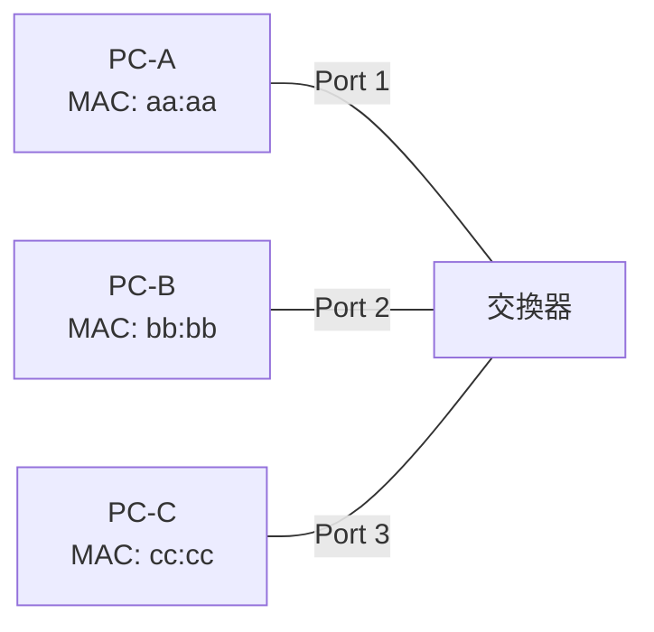
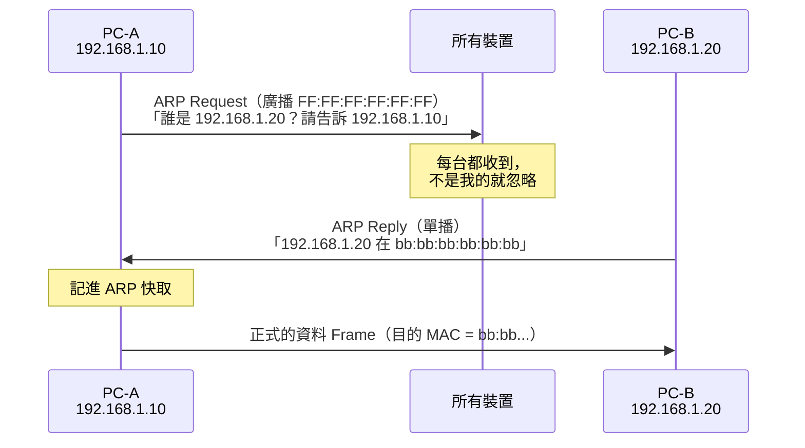

# MAC 位址與交換器

> [!abstract] 這篇你會學到
> - 理解 **MAC 位址**的格式與作用，以及 OUI 怎麼查廠商
> - 看懂**乙太網路 Frame** 的結構與 MTU
> - 明白 **CSMA/CD** 要解決什麼問題，以及為什麼現在用不到了
> - 分辨**中繼器、集線器、交換器**的演進，理解交換器的三大能力
> - 理解 **ARP** 如何用 IP 問出 MAC —— 這是最容易卡住的一環
> - 認識**單播、群播、廣播**與**廣播網域**
> - 知道 **ARP 欺騙**為什麼危險，以及該怎麼防

## 前置知識

- [[03-網概-網路分層模型]] — 第 2 層在做什麼
- [[04-網概-線材與實體層]] — 訊號怎麼傳

---

## 觀念說明

### 核心比喻：社區的郵差

上一篇講的是「馬路和卡車」（實體層）。
這一篇講的是「**同一個社區裡，郵差怎麼把信送到正確那一戶**」。

| 社區 | 網路 |
| --- | --- |
| 一個社區 | 一個**區域網路（廣播網域）** |
| 每一戶的**門牌** | **MAC 位址** |
| 社區的**郵差** | **交換器** |
| 郵差手上的**住戶名冊** | **MAC 位址表** |
| 一封投遞的信 | **Frame（訊框）** |
| 「有人認識王先生嗎？」大聲喊 | **ARP 廣播** |

---

## MAC 位址

**MAC**（Media Access Control）位址是網卡的**硬體識別碼**。

```
00:1A:2B:3C:4D:5E
└──┬───┘ └──┬───┘
  OUI      NIC
廠商編號   廠商自訂的序號
```

| 特性 | 說明 |
| --- | --- |
| **長度** | **6 位元組（48 位元）** |
| 表示法 | 12 個十六進位數字，用 `:` 或 `-` 分隔 |
| 在哪一層 | **第 2 層（資料連結層）** |
| 誰指派 | **網卡製造商**（燒在韌體裡） |
| 用途 | **在同一個區域網路內唯一識別每個裝置** |
| 會不會變 | 理論上不變，但**軟體可以修改（MAC spoofing）** |

### OUI：前 3 個位元組是廠商編號

**OUI**（Organizationally Unique Identifier）由 IEEE 分配給各家廠商。

| OUI 開頭 | 廠商（範例） |
| --- | --- |
| `00:1A:2B` | 依 IEEE 登記而定 |
| `00:50:56` | VMware |
| `08:00:27` | VirtualBox |
| `52:54:00` | QEMU/KVM |
| `00:0C:29` | VMware |

> [!tip] 從 MAC 就能看出這是不是虛擬機
> 看到 `00:50:56` 或 `00:0C:29` → **VMware 虛擬機**
> 看到 `08:00:27` → **VirtualBox**
> 看到 `52:54:00` → **KVM/QEMU**
>
> 這在網路盤點與資安調查時很有用 ——
> 「這台不明設備是什麼？」看 OUI 就有線索。
>
> 線上查詢：<https://maclookup.app>

```bash
# 查自己的 MAC
$ ip link show
2: enp3s0: <BROADCAST,MULTICAST,UP,LOWER_UP> mtu 1500
    link/ether 00:1a:2b:3c:4d:5e brd ff:ff:ff:ff:ff:ff
               ^^^^^^^^^^^^^^^^^     ^^^^^^^^^^^^^^^^^
               我的 MAC              廣播位址
```

### 特殊的 MAC 位址

| 位址 | 意義 |
| --- | --- |
| **`FF:FF:FF:FF:FF:FF`** | **廣播位址** —— 送給這個網段上的所有裝置 |
| `01:00:5E:xx:xx:xx` | IPv4 群播 |
| `33:33:xx:xx:xx:xx` | IPv6 群播 |
| 第一個位元組的最低位 = 1 | 群播 Frame |
| 第一個位元組的第 2 低位 = 1 | 本地管理位址（軟體設定的，非原廠） |

> [!note] MAC 隨機化
> 現代手機與筆電為了保護隱私，
> 連接不同 Wi-Fi 時會**使用隨機產生的 MAC 位址**。
>
> 這造成機關網路管理的困擾：
> - 用 MAC 綁定 IP 的機制失效
> - 用 MAC 白名單控制存取失效
> - 設備盤點對不起來
>
> **解法**：改用 **802.1X** 做身分驗證，
> 而不是依賴 MAC（MAC 本來就可以偽造，不是安全機制）。
> 見 [[13-網路存取控制NAC與802.1X]]。

---

## 乙太網路與 Frame

### 乙太網路（Ethernet, IEEE 802.3）

**乙太網路**是目前有線區域網路的絕對標準。

它的資料單位叫 **Frame（訊框）**：

```
┌────────┬─────────┬─────────┬──────┬──────────────┬───────┐
│ 前導碼  │ 目的MAC  │ 來源MAC  │ 類型 │   Payload    │  FCS  │
│  8 B   │   6 B   │   6 B   │ 2 B  │  46～1500 B  │  4 B  │
└────────┴─────────┴─────────┴──────┴──────────────┴───────┘
         └──────────── 14 B 標頭 ────────┘              └ 檢查碼
```

| 欄位 | 作用 |
| --- | --- |
| **前導碼（Preamble）** | 讓接收方同步時脈，知道 Frame 開始了 |
| **目的 MAC** | 要送給誰 |
| **來源 MAC** | 誰送的 |
| **類型（EtherType）** | 裡面裝的是什麼（`0x0800`=IPv4、`0x0806`=ARP、`0x86DD`=IPv6） |
| **Payload** | 上層的資料（通常是 IP 封包） |
| **FCS** | **Frame Check Sequence**，檢查有沒有傳錯 |

> [!note] Payload 的大小限制：46 ～ 1500
> **上限 1500** 就是 **MTU（最大傳輸單元）**。
>
> **下限 46** 是為什麼？
> 這是早期 CSMA/CD 的遺留 —— Frame 太短的話，
> 傳送方可能在偵測到碰撞之前就傳完了，
> 導致它不知道發生碰撞。所以規定最小長度。
>
> 資料不足 46 位元組時會**填充（padding）**補到 46。

> [!tip] Jumbo Frame（巨型訊框）
> 有些環境會把 MTU 調到 **9000 位元組**，稱為 Jumbo Frame。
>
> **好處**：標頭開銷比例降低，CPU 中斷次數減少 →
> 適合**儲存網路（iSCSI、NFS）**與備份流量。
>
> **注意**：**路徑上的每一台設備都必須支援並設定相同的 MTU**，
> 否則會造成分片或封包被丟棄。
> 這是很常見的坑 —— 只改了伺服器沒改交換器，結果大檔案傳不過去。

### CSMA/CD：一個已經退休的機制

**CSMA/CD**（Carrier Sense Multiple Access with Collision Detection）

> [!example] 用「一群人在會議室講話」來理解
> 早期的乙太網路用**同軸電纜**，所有人共用一條線（匯流排），
> 就像大家在同一個會議室講話。
>
> 規則是：
> 1. **Carrier Sense（載波偵測）**：
>    「**先聽一下，確定沒有人在講話**」
> 2. **Multiple Access（多重存取）**：大家共用同一個媒介
> 3. **Collision Detection（碰撞偵測）**：
>    如果不巧兩個人同時開口 → **偵測到碰撞** →
>    **兩個人都停下來，各自等一段隨機的時間再重講**
>
> 那個「隨機等待」叫 **backoff**，
> 而且每次碰撞後等待範圍會加倍（指數退避），
> 避免又同時開口。

> [!note] 為什麼現在用不到了
> 因為現代網路用**交換器 + 全雙工**：
> - 每個埠是**獨立的碰撞網域**（只有交換器和那一台設備）
> - **全雙工**代表收與發用不同的線對，可以同時進行
>
> **根本不會發生碰撞，所以 CSMA/CD 被關閉了。**
>
> 但它仍然存在於：
> - **Wi-Fi 的 CSMA/CA**（Collision **Avoidance**，因為無線無法偵測碰撞，只能盡量避免）
> - 考試與教科書
> - 老舊的 Hub 環境

---

## 從 Hub 到 Switch 的演進

### 中繼器（Repeater）

最原始的設備：**把衰減的訊號放大再送出去**，延長傳輸距離。

只有兩個埠，純粹是「訊號放大器」。

### 集線器（Hub）

**Hub 就是「多埠的中繼器」**。

| 特性 | 說明 |
| --- | --- |
| **工作方式** | 收到 Frame 後，**從所有其他埠送出去**（廣播） |
| **誰決定要不要收** | **每台設備自己比對目的 MAC**，不是給我的就丟掉 |
| **雙工** | **半雙工** —— 同時只能收或發 |
| **頻寬** | **共享** —— 10 台設備接一台 100M Hub，平均每台只有 10M |
| **碰撞** | 所有埠在**同一個碰撞網域**，設備越多碰撞越嚴重 |
| 在哪一層 | **第 1 層** |

> [!danger] Hub 的三個致命問題
> **一、頻寬共享。** 接的設備越多，每台分到的越少。
>
> **二、碰撞嚴重。** 設備多到一定程度，
> 大部分時間都在處理碰撞與重傳，效能急遽下降。
>
> **三、資安災難。**
> **每一台設備都收得到所有人的流量。**
> 只要有人把網卡設成**混雜模式（promiscuous mode）**，
> 就能監聽整個網段的通訊。
>
> **這就是為什麼 Hub 已經完全被淘汰。**
> 如果你在機關的角落發現一台 Hub，請立刻換掉。

> [!note] 混雜模式（Promiscuous Mode）
> 正常情況下，網卡收到 Frame 會先**比對目的 MAC 是不是自己**，
> 不是就直接丟掉，連 CPU 都不驚動。
>
> **混雜模式**就是「**略過這個比對，全部收下來交給軟體**」。
>
> 用途：
> - **合法**：用 tcpdump/Wireshark **抓封包做網路分析**
> - **合法**：虛擬化主機讓 VM 收到自己 MAC 以外的流量
> - **惡意**：在共享媒介上**監聽別人的通訊**
>
> ```bash
> # 開啟混雜模式（tcpdump 會自動做這件事）
> $ sudo ip link set eth0 promisc on
> $ ip link show eth0 | grep -o PROMISC
> PROMISC
> ```

### 交換器（Switch）

**交換器解決了 Hub 的所有問題。**

| 特性 | 說明 |
| --- | --- |
| **工作方式** | 看目的 MAC，**只從對應的那個埠送出去** |
| **雙工** | **全雙工** —— 可同時收發 |
| **頻寬** | **每個埠獨立** —— 24 埠的 1G 交換器，每個埠都有 1G |
| **碰撞** | **每個埠是獨立的碰撞網域**，基本上不會碰撞 |
| 在哪一層 | **第 2 層** |

#### 交換器的三大能力

**一、學習（Learning）**

交換器會**自己建立一張「MAC 位址表」**（也叫 CAM 表）。



**學習過程**：

| 步驟 | 發生什麼 |
| --- | --- |
| 1 | 剛開機時，MAC 表是**空的** |
| 2 | PC-A 送出一個 Frame。交換器看**來源 MAC** → **記下「aa:aa 在 Port 1」** |
| 3 | 目的 MAC 是 bb:bb，但表裡沒有 → **從所有其他埠送出去（洪泛 flooding）** |
| 4 | PC-B 回應。交換器看來源 → **記下「bb:bb 在 Port 2」** |
| 5 | 之後 A↔B 的通訊，**只會走 Port 1 與 Port 2**，其他埠完全看不到 |

> [!note] 關鍵：交換器學的是「來源 MAC」
> 這一點很多人搞錯。
> 交換器**從封包的來源欄位學習**（「原來 aa:aa 在這個埠」），
> **用目的欄位查表決定要送去哪**。
>
> MAC 表的項目有**老化時間（aging time）**，預設通常 300 秒，
> 超過沒有再看到就刪掉。

**二、轉送與過濾（Forwarding / Filtering）**

| 情況 | 交換器的動作 |
| --- | --- |
| 目的 MAC **在表裡** | **只從那個埠送出去**（unicast forwarding） |
| 目的 MAC **不在表裡** | **從所有其他埠送出去**（unknown unicast flooding） |
| 目的 MAC 是**廣播** | **從所有其他埠送出去** |
| 目的 MAC 就在**來源那個埠** | **丟棄**（filtering，不需要送） |

**三、避免迴圈（Loop Avoidance）**

見 [[16-網概-VLAN與網路分段]] 的 **STP（生成樹協定）**。

> [!tip] 交換器對主機是「透明」的
> 主機與路由器**完全不知道有交換器存在**。
>
> 它們只是把 Frame 定址到某個 MAC，
> 交換器默默地把它送到對的地方 ——
> **它不修改 Frame 的內容，也不擁有 IP 位址**（管理介面除外）。
>
> 這就是為什麼交換器叫「透明橋接（transparent bridging）」。

```bash
# 在 Cisco 交換器上看 MAC 表
switch# show mac address-table
Vlan    Mac Address       Type        Ports
----    -----------       --------    -----
   1    00aa.bbcc.ddee    DYNAMIC     Gi0/1
   1    0011.2233.4455    DYNAMIC     Gi0/2
   1    52:54:00:12:34:56 DYNAMIC     Gi0/24
```

---

## 傳輸方式：單播、群播、廣播

| 方式 | 送給誰 | 目的 MAC | 比喻 |
| --- | --- | --- | --- |
| **單播（Unicast）** | **一台特定的機器** | 該機器的 MAC | 寄給某個人的信 |
| **群播（Multicast）** | **一個特定群組** | `01:00:5E:...` | 社區公告給訂閱的住戶 |
| **廣播（Broadcast）** | **這個網段上的所有機器** | `FF:FF:FF:FF:FF:FF` | 社區廣播 |

> [!example] 群播的實際用途
> - **IPTV／串流**：一個影像串流送給很多人，比送 N 份省頻寬
> - **路由協定**：OSPF 用 `224.0.0.5` 找鄰居
> - **服務探索**：mDNS/Bonjour（印表機、AirPlay）用 `224.0.0.251`

### 廣播網域（Broadcast Domain）

> [!note] 這是理解 VLAN 的關鍵前提
> **廣播網域** = 一個廣播封包能傳到的範圍。
>
> | 設備 | 對廣播網域的影響 |
> | --- | --- |
> | **集線器 Hub** | 全部在**同一個**廣播網域，也在同一個碰撞網域 |
> | **交換器 Switch** | **切開碰撞網域**（每埠一個），但**廣播網域仍是同一個** |
> | **路由器 Router** | **切開廣播網域** —— 廣播不會跨過路由器 |
> | **VLAN** | 在交換器上**邏輯地切開廣播網域** |

> [!warning] 廣播網域太大的後果
> 一個廣播網域裡有 500 台設備時：
> - 每一次 ARP 廣播，**500 台機器都要處理**（即使不關它的事）
> - 廣播流量佔用頻寬與 CPU
> - **一台中毒的機器可以直接攻擊這 500 台**（同網段無需經過路由器）
> - 出現**廣播風暴**時整個網段癱瘓
>
> **實務建議**：一個廣播網域（VLAN）**不超過 254 台**（一個 /24），
> 大型網路應該按部門、樓層、用途分割。
> 見 [[16-網概-VLAN與網路分段]]。

---

## ARP：用 IP 問出 MAC

這是新手最容易卡住的地方，但理解了就通了。

### 問題：我知道 IP，但 Frame 需要 MAC

你要傳資料給 `192.168.1.20`。
但第 2 層的 Frame 需要填**目的 MAC**，你不知道它的 MAC 是什麼。

**ARP**（Address Resolution Protocol）就是來解決這件事的。



> [!example] 用「在社區大喊」來理解
> 你要找王先生，但只知道他住 20 號，不知道他長什麼樣。
>
> 你在社區中庭**大喊**（廣播）：
> 「**20 號的王先生是哪一位？我是 10 號的張先生！**」
>
> 所有住戶都聽到了，但只有王先生會回應（單播）：
> 「**我是 20 號，我長這樣。**」
>
> 你記下來（ARP 快取），之後就可以直接找他，不用再喊。

```bash
# 看 ARP 快取
$ ip neighbour show
192.168.1.1  dev eth0 lladdr 00:11:22:33:44:55 REACHABLE
192.168.1.20 dev eth0 lladdr aa:bb:cc:dd:ee:ff STALE

# 傳統指令
$ arp -a
? (192.168.1.1) at 00:11:22:33:44:55 [ether] on eth0

# 清除某一筆
$ sudo ip neigh del 192.168.1.20 dev eth0

# 清除全部
$ sudo ip -s -s neigh flush all
```

```powershell
# Windows
arp -a
arp -d *          # 清除快取（需系統管理員）
```

### 跨網段時：ARP 問的是「閘道」的 MAC

> [!warning] 這是最重要的一個觀念
> **ARP 只能在同一個廣播網域內運作** —— 廣播不會跨過路由器。
>
> 所以當你要連 `8.8.8.8`（不在同一網段）時：
> 1. 你的電腦比對子網路遮罩，發現**目的地不在同網段**
> 2. 決定「要交給**預設閘道**」
> 3. **ARP 問的是「閘道的 MAC」，不是 8.8.8.8 的 MAC**
> 4. Frame 的目的 MAC = 閘道的 MAC，但**IP 封包裡的目的 IP 仍然是 8.8.8.8**
>
> ```
> Frame:  [目的MAC=閘道][來源MAC=我]
> IP:     [目的IP=8.8.8.8][來源IP=192.168.1.10]
>          ^^^^^^^^^^^^^^ 這一層不變
> ```
>
> **每經過一台路由器，MAC 位址就會被換掉（換成下一跳的），
> 但 IP 位址從頭到尾不變。**
>
> 這是 [[07-網概-路由與封包旅程]] 的核心觀念，先在這裡建立印象。

---

## 完整實戰範例

### 觀察 ARP 的完整過程

```bash
# 終端機 1：開始抓 ARP 封包
$ sudo tcpdump -i eth0 -n arp

# 終端機 2：清除快取後 ping 同網段的一台機器
$ sudo ip neigh flush all
$ ping -c 1 192.168.1.20
```

**你會在終端機 1 看到**：

```
10:23:45.123 ARP, Request who-has 192.168.1.20 tell 192.168.1.10, length 28
10:23:45.124 ARP, Reply 192.168.1.20 is-at aa:bb:cc:dd:ee:ff, length 46
             ^^^^^^^^^^^^^^^^^^^^^^^^^^^^^^^^^^^^^^^^^^^^^^^^^
             這就是完整的 ARP 一問一答
```

### 看 Frame 的第 2 層資訊

```bash
$ sudo tcpdump -i eth0 -e -n -c 3 icmp
                      ^^ -e 顯示第 2 層（乙太網路）標頭

10:24:01.111 00:1a:2b:3c:4d:5e > 00:11:22:33:44:55, ethertype IPv4 (0x0800),
             length 98: 192.168.1.10 > 8.8.8.8: ICMP echo request
             ^^^^^^^^^^^^^^^^^^^^^^^^^^^^^^^^
             來源 MAC        目的 MAC（注意：這是閘道的 MAC！）
```

> [!tip] 這一行輸出證明了前面說的觀念
> 目的 **IP** 是 `8.8.8.8`（在美國），
> 但目的 **MAC** 是 `00:11:22:33:44:55`（你家的閘道）。
>
> **MAC 是「下一跳」，IP 是「最終目的地」。**

### 掃描同網段有哪些設備

```bash
# 方法 1：arp-scan（最快，直接發 ARP）
$ sudo apt install arp-scan
$ sudo arp-scan --localnet
192.168.1.1     00:11:22:33:44:55   TP-LINK TECHNOLOGIES CO.,LTD.
192.168.1.10    00:1a:2b:3c:4d:5e   (Unknown)
192.168.1.20    aa:bb:cc:dd:ee:ff   Hewlett Packard
192.168.1.50    52:54:00:12:34:56   QEMU virtual NIC        ← 虛擬機

# 方法 2：nmap
$ sudo nmap -sn 192.168.1.0/24
```

> [!danger] 掃描前務必確認授權
> 在**自己管理的網路**上掃描是正常的維運動作，
> 但仍應知會相關人員（否則會觸發資安告警）。
>
> **在別人的網路上掃描可能觸犯刑法妨害電腦使用罪。**

### 找出「哪台機器接在交換器的哪個埠」

這是機關網路常見的需求：**「這個 IP 的機器實體上在哪裡？」**

```bash
# 步驟 1：從 IP 查出 MAC
$ ping -c 1 192.168.1.20 > /dev/null
$ ip neigh show 192.168.1.20
192.168.1.20 dev eth0 lladdr aa:bb:cc:dd:ee:ff REACHABLE
```

```cisco
! 步驟 2：在交換器上查這個 MAC 在哪個埠
switch# show mac address-table address aabb.ccdd.eeff
Vlan    Mac Address       Type        Ports
----    -----------       --------    -----
  10    aabb.ccdd.eeff    DYNAMIC     Gi0/12

! 步驟 3：看那個埠的描述（如果有好好寫的話）
switch# show interface Gi0/12 description
Interface  Status  Protocol  Description
Gi0/12     up      up        3F-A12-會計室王小姐
```

> [!tip] 這就是為什麼「埠描述」要好好寫
> 有寫描述：**30 秒找到那台機器在哪**。
> 沒寫描述：拿著尋線器一條一條找，可能要一小時。
>
> 見 [[18-網路設備盤點與文件化]]。

---

## 常見錯誤與排錯

| 現象 | 原因 | 解法 |
| --- | --- | --- |
| 同網段 ping 不到 | ARP 沒解析成功、VLAN 不同、防火牆擋 ICMP | `ip neigh` 看有沒有解析到；`tcpdump -n arp` 看有沒有回應 |
| ARP 表裡的 MAC 是 `<incomplete>` | 對方沒回應（關機、不在同網段、被防火牆擋） | 確認對方在線；確認遮罩設定正確 |
| 兩台機器 IP 相同 | **IP 衝突** | 系統會有警告；`arp -a` 會看到同 IP 對應多個 MAC |
| MAC 表裡同一個 MAC 出現在多個埠 | **網路迴圈**或 MAC 偽造 | 檢查 STP；找出重複接線 |
| 網路突然全部很慢、交換器燈狂閃 | **廣播風暴**（通常是迴圈造成） | 立刻找出迴圈；啟用 STP 與 BPDU Guard |
| 新設備接上網路後全網癱瘓 | 有人把兩個網路孔用一條線接在一起 | 啟用 **BPDU Guard** 與 **Loop Guard** |
| 用 MAC 綁定 IP 但手機一直拿不到 | **手機的 MAC 隨機化** | 改用 802.1X；或請使用者關閉該裝置的隨機 MAC |
| 大檔案傳不過去但小檔案可以 | **MTU 不一致**（Jumbo Frame 設定不全） | 路徑上所有設備都要設相同 MTU；用 `ping -M do -s 大小` 測試 |
| tcpdump 抓不到別人的封包 | **交換器只把封包送給目標埠**（這是正常且好的） | 要抓別人的流量需設定 **Port Mirroring / SPAN** |
| 交換器 MAC 表爆滿 | **MAC 洪泛攻擊**，或真的設備太多 | 啟用 Port Security 限制每埠 MAC 數 |

> [!warning] 廣播風暴是網路的心臟病
> 症狀：**整個網段瞬間癱瘓，所有交換器的燈同步狂閃**。
>
> 成因通常是**有人把兩個網路孔用一條線接起來**，
> 形成迴圈 —— 廣播封包會在迴圈裡無限循環並不斷倍增。
>
> **預防**：
> ```cisco
> ! 在所有接使用者的埠啟用
> interface range Gi0/1 - 24
>  spanning-tree portfast
>  spanning-tree bpduguard enable    ! 收到 BPDU 就關閉該埠
>  storm-control broadcast level 5   ! 廣播超過 5% 頻寬就抑制
> ```
> 見 [[16-網概-VLAN與網路分段]] 與 [[08-Cisco-埠設定與安全]]。

---

## 安全性注意事項

> [!danger] ARP 欺騙（ARP Spoofing／Poisoning）
> **這是同一個區網內最經典也最有效的攻擊。**
>
> **原理**：ARP 協定**完全沒有身分驗證** ——
> 任何人都可以宣稱「我是閘道」，而且大家都會相信。
>
> ```
> 正常：  PC ──→ 閘道 ──→ 網際網路
>
> 攻擊後：PC ──→ 攻擊者 ──→ 閘道 ──→ 網際網路
>                  ↑
>            所有流量都經過他
> ```
>
> **攻擊者能做什麼**：
> - **看到你所有未加密的流量**（HTTP、FTP、Telnet 的密碼）
> - 看到你連了哪些網站（即使是 HTTPS）
> - 竄改未加密的內容
> - 嘗試 SSL 剝離（把 HTTPS 降級成 HTTP）
> - 直接阻斷你的連線
>
> **這叫中間人攻擊（MITM）。**

**怎麼發現**：

```bash
# 看 ARP 表有沒有異常
$ ip neigh show
192.168.1.1  dev eth0 lladdr aa:bb:cc:dd:ee:ff REACHABLE
192.168.1.20 dev eth0 lladdr aa:bb:cc:dd:ee:ff REACHABLE
                              ^^^^^^^^^^^^^^^^^
                     兩個不同的 IP 對應同一個 MAC → 高度可疑！
```

> [!tip] 正常情況下，一個 MAC 對一個 IP
> 例外：
> - 路由器可能有多個 IP（正常）
> - 使用 VRRP/HSRP 的虛擬 IP（正常）
>
> 但**一般使用者的機器出現這種情況，就要警覺**。

**怎麼防護**：

| 層級 | 做法 |
| --- | --- |
| **交換器（最有效）** | **Dynamic ARP Inspection（DAI）** —— 驗證 ARP 封包的合法性 |
| 交換器 | **DHCP Snooping** —— 建立「IP-MAC-埠」的可信綁定表 |
| 交換器 | **Port Security** —— 限制每個埠允許的 MAC 數量 |
| 主機 | **靜態 ARP** 綁定閘道（管理成本高，只適合關鍵主機） |
| 應用層 | **全面使用 HTTPS/TLS** —— 即使被攔截也看不到內容 |
| 網路架構 | **VLAN 分段** —— 縮小攻擊者能影響的範圍 |

```cisco
! Cisco：啟用 DHCP Snooping 與 DAI
ip dhcp snooping
ip dhcp snooping vlan 10
interface GigabitEthernet0/24
 description ** 連到路由器 **
 ip dhcp snooping trust        ! 只有這個埠可以發 DHCP 回應

ip arp inspection vlan 10
interface GigabitEthernet0/24
 ip arp inspection trust
```

> [!danger] MAC 洪泛攻擊（MAC Flooding）
> 攻擊者送出**大量偽造來源 MAC 的 Frame**，
> 把交換器的 MAC 表（CAM 表）塞爆。
>
> 表滿了之後，交換器**無法再學習**，
> 只能對所有未知的目的 MAC 進行**洪泛（flooding）**——
> **等於退化成 Hub，攻擊者就能監聽整個網段。**
>
> **防護**：**Port Security**
> ```cisco
> interface range GigabitEthernet0/1 - 20
>  switchport port-security
>  switchport port-security maximum 2        ! 每埠最多 2 個 MAC
>  switchport port-security violation restrict
>  switchport port-security aging time 5
> ```

> [!warning] MAC 位址不是安全機制
> **MAC 可以被軟體任意修改**：
> ```bash
> $ sudo ip link set eth0 down
> $ sudo ip link set eth0 address 00:11:22:33:44:55
> $ sudo ip link set eth0 up
> ```
>
> 所以：
> - **MAC 白名單擋不住有心人**（只能擋住誤接的設備）
> - **MAC 綁定 IP 不是資安控制**（只是管理便利）
>
> **真正的身分驗證要用 802.1X**（憑證或帳號密碼），
> 見 [[13-網路存取控制NAC與802.1X]]。

---

## 速查表

### MAC 位址

```
00:1A:2B : 3C:4D:5E
└─ OUI ─┘ └─ NIC ─┘
 廠商編號   序號
```
- 長度：**6 位元組（48 位元）**
- 廣播：**`FF:FF:FF:FF:FF:FF`**
- 查廠商：<https://maclookup.app>

### 常見虛擬化的 OUI

| OUI | 平台 |
| --- | --- |
| `00:50:56`、`00:0C:29` | VMware |
| `08:00:27` | VirtualBox |
| `52:54:00` | KVM/QEMU |

### Frame 結構

```
[前導碼 8][目的MAC 6][來源MAC 6][類型 2][Payload 46-1500][FCS 4]
```
- **MTU = 1500**（Jumbo Frame = 9000）
- EtherType：`0x0800`=IPv4、`0x0806`=ARP、`0x86DD`=IPv6

### Hub vs Switch

| | Hub | **Switch** |
| --- | --- | --- |
| 層 | 1 | **2** |
| 轉送 | 全部埠廣播 | **只送對應的埠** |
| 雙工 | 半雙工 | **全雙工** |
| 頻寬 | 共享 | **每埠獨立** |
| 碰撞網域 | 全部共用一個 | **每埠一個** |
| 廣播網域 | 一個 | **仍是一個**（要用 VLAN 切） |

### 交換器三大能力

1. **學習** —— 從**來源 MAC** 建立 MAC 表
2. **轉送／過濾** —— 用**目的 MAC** 查表決定去哪
3. **避免迴圈** —— STP

### 傳輸方式

| 方式 | 目的 MAC |
| --- | --- |
| 單播 | 對方的 MAC |
| 群播 | `01:00:5E:...` |
| 廣播 | `FF:FF:FF:FF:FF:FF` |

### 常用指令

| 目的 | Linux | Windows | Cisco |
| --- | --- | --- | --- |
| 看自己的 MAC | `ip link show` | `ipconfig /all` | — |
| 看 ARP 表 | `ip neigh show` | `arp -a` | `show arp` |
| 清 ARP 快取 | `sudo ip -s -s neigh flush all` | `arp -d *` | `clear arp` |
| 抓 ARP 封包 | `sudo tcpdump -n arp` | Wireshark | — |
| 看第 2 層標頭 | `sudo tcpdump -e` | Wireshark | — |
| 掃描同網段 | `sudo arp-scan --localnet` | — | — |
| 看 MAC 表 | — | — | `show mac address-table` |

---

## 練習題

> [!question]- 練習 1：觀察 ARP
> ```bash
> # 終端機 1
> sudo tcpdump -i any -n arp
>
> # 終端機 2
> sudo ip -s -s neigh flush all
> ping -c 1 <同網段的另一台機器 IP>
> ip neigh show
> ```
> 回答：
> 1. 你看到幾個 ARP 封包？
> 2. Request 的目的 MAC 是什麼？（提示：廣播）
> 3. Reply 是廣播還是單播？
> 4. 執行後 `ip neigh` 多了什麼？

> [!question]- 練習 2：驗證「MAC 是下一跳」
> ```bash
> sudo tcpdump -i any -e -n -c 2 icmp
> # 另一個終端機
> ping -c 1 8.8.8.8
> ```
> 觀察輸出中的目的 MAC。
>
> 然後用 `ip neigh show` 查你的閘道 MAC，比對看看。
>
> **你會發現：目的 IP 是 8.8.8.8，但目的 MAC 是你家閘道的。**
> 想想為什麼。

> [!question]- 練習 3：從 MAC 反查設備
> ```bash
> sudo arp-scan --localnet
> ```
> 從結果中：
> 1. 找出哪些是虛擬機（看 OUI）
> 2. 有沒有你不認識的設備？
> 3. 挑一個 MAC 到 <https://maclookup.app> 查廠商
>
> 這正是**網路盤點**的基本動作。
> 找到不認識的設備時，下一步就是到交換器上查它接在哪個埠。

---

## 小測驗

Q1. MAC 位址有幾個位元組？前 3 個位元組叫什麼？有什麼用途？

Q2. 廣播的 MAC 位址是什麼？看到 `52:54:00` 開頭的 MAC 代表什麼？

Q3. 乙太網路 Frame 的 Payload 為什麼有 46 位元組的**下限**？

Q4. CSMA/CD 要解決什麼問題？用「會議室」的比喻說明。為什麼現代網路用不到它了？

Q5. Hub 有哪三個致命問題？其中哪一個是資安問題？

Q6. 什麼是「混雜模式」？它有哪些合法用途？

Q7. 交換器的三大能力是什麼？它學習的是「來源 MAC」還是「目的 MAC」？

Q8. 交換器與路由器對「碰撞網域」與「廣播網域」的影響有什麼不同？

Q9. 你要連 `8.8.8.8`，ARP 問的是誰的 MAC？為什麼？Frame 與 IP 封包的目的位址有什麼不同？

Q10. ARP 欺騙為什麼有效？攻擊者能做什麼？請說出至少三種防護方式。

> [!question]- 測驗答案
> **Q1.** **6 個位元組（48 位元）**。
> 前 3 個位元組叫 **OUI（Organizationally Unique Identifier）**，
> 由 IEEE 分配給各家廠商，**可以用來識別網卡的製造商**
> （也因此可以看出是不是虛擬機）。後 3 個位元組是廠商自訂的序號（NIC）。
>
> **Q2.** 廣播 MAC 是 **`FF:FF:FF:FF:FF:FF`**。
> `52:54:00` 開頭代表 **KVM/QEMU 虛擬機**的虛擬網卡。
> （`00:50:56`/`00:0C:29` 是 VMware，`08:00:27` 是 VirtualBox。）
>
> **Q3.** 這是早期 **CSMA/CD** 的遺留設計：
> Frame 太短的話，**傳送方可能在偵測到碰撞之前就已經傳完了**，
> 導致它不知道發生過碰撞、不會重傳。
> 所以規定最小長度 46 位元組，資料不足時會用**填充（padding）**補足。
>
> **Q4.** CSMA/CD 解決「**大家共用一條線時，同時開口造成碰撞**」的問題。
> 會議室比喻：①**先聽一下確定沒人在講話**（Carrier Sense）；
> ②大家共用同一個空間（Multiple Access）；
> ③如果不巧同時開口就**偵測到碰撞，兩人都停下來，各自等一段隨機時間再重講**
> （Collision Detection + backoff）。
> 現代用不到，是因為**交換器讓每個埠成為獨立的碰撞網域，
> 而且是全雙工（收發用不同線對）**，根本不會發生碰撞。
>
> **Q5.** ①**頻寬共享**（接越多每台分到越少）；
> ②**碰撞嚴重**（設備一多效能急遽下降）；
> ③**資安災難** —— 這是資安問題：
> **每一台設備都收得到所有人的流量**，
> 只要有人把網卡設成混雜模式就能監聽整個網段。
>
> **Q6.** 混雜模式是讓網卡**略過「目的 MAC 是不是自己」的比對，
> 把收到的所有 Frame 全部收下交給軟體**。
> **合法用途**：①用 tcpdump/Wireshark **抓封包做網路分析與排錯**；
> ②虛擬化主機讓 VM 能收到自己 MAC 以外的流量。
>
> **Q7.** 三大能力：①**學習（Learning）**；②**轉送與過濾（Forwarding/Filtering）**；
> ③**避免迴圈（Loop Avoidance，STP）**。
> 它學習的是「**來源 MAC**」——
> 從封包的來源欄位記下「原來這個 MAC 在這個埠」；
> 而用「目的 MAC」查表決定要送去哪。
>
> **Q8.** **交換器切開碰撞網域**（每個埠一個），
> **但廣播網域仍然是同一個**（廣播會送到所有埠）；
> **路由器切開廣播網域** —— **廣播不會跨過路由器**。
> （VLAN 則是在交換器上「邏輯地」切開廣播網域。）
>
> **Q9.** ARP 問的是「**預設閘道的 MAC**」，不是 8.8.8.8 的 MAC。
> 因為 **ARP 廣播不會跨過路由器**，只能在同一個廣播網域內運作；
> 你的電腦比對子網路遮罩後發現目的地不在同網段，就決定交給閘道。
> **Frame 的目的 MAC = 閘道的 MAC（下一跳）；
> IP 封包的目的 IP 仍然是 8.8.8.8（最終目的地）。**
> 每經過一台路由器 MAC 會被換掉，但 IP 從頭到尾不變。
>
> **Q10.** 有效是因為 **ARP 協定完全沒有身分驗證** ——
> 任何人都可以宣稱「我是閘道」，而且大家都會相信。
> **攻擊者能做**：看到所有未加密的流量（HTTP/FTP/Telnet 的密碼）、
> 知道你連了哪些網站、竄改未加密內容、嘗試 SSL 剝離、直接阻斷連線
> （中間人攻擊 MITM）。
> **三種防護**：
> ①交換器啟用 **Dynamic ARP Inspection（DAI）**與 **DHCP Snooping**；
> ②啟用 **Port Security** 限制每埠的 MAC 數量；
> ③**全面使用 HTTPS/TLS**（即使被攔截也看不到內容）；
> （另可加：關鍵主機用靜態 ARP 綁定閘道、用 VLAN 分段縮小攻擊範圍。）

---

## 延伸閱讀

- [[04-網概-線材與實體層]] — 第 1 層
- [[06-網概-IP位址與子網路]] — 第 3 層的定址
- [[07-網概-路由與封包旅程]] — MAC 為什麼每一跳都會變
- [[16-網概-VLAN與網路分段]] — 切開廣播網域與 STP
- [[18-網概-網路安全基礎]] — 中間人攻擊與防護
- [[08-Cisco-埠設定與安全]] — Port Security 實作（進階）
- [[13-網路存取控制NAC與802.1X]] — 真正的身分驗證（進階）
