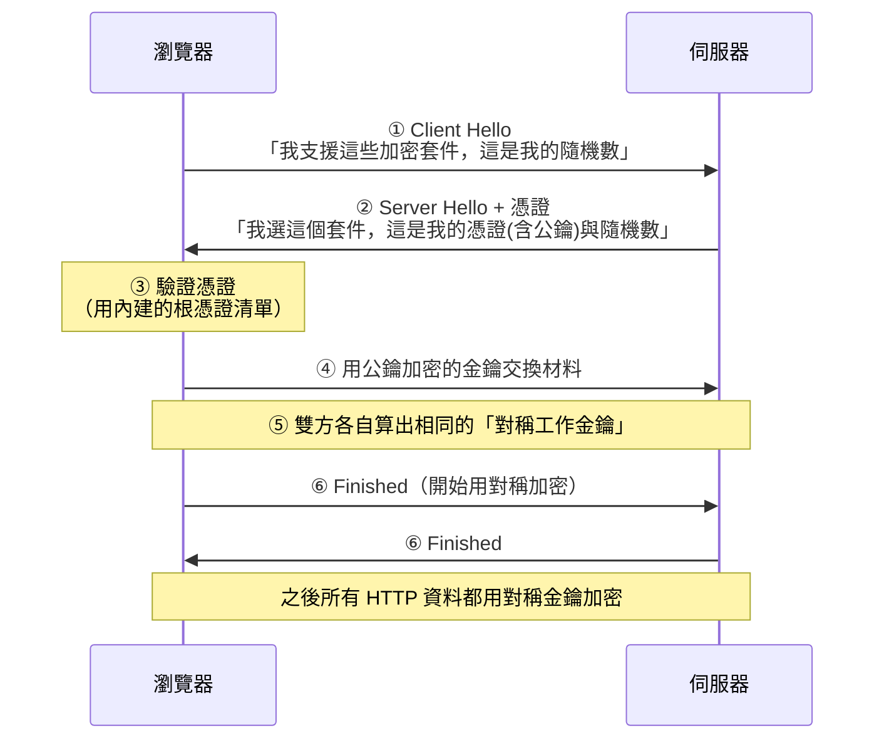
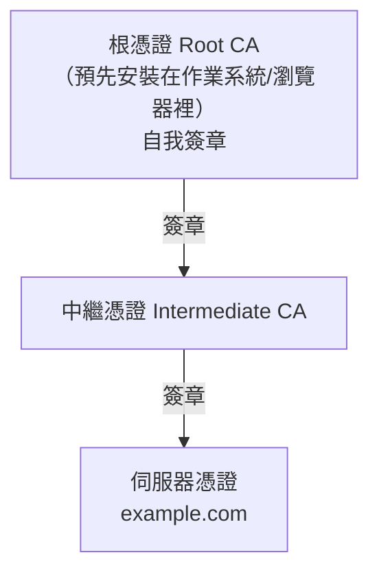

# HTTP 與 HTTPS

> [!abstract] 這篇你會學到
> - 拆解 **URL 的每一個部分**，知道 `?` 與 `#` 後面是什麼
> - 理解 HTTP 的**請求-回應模型**與請求方法（GET / POST / PUT / DELETE）
> - 看懂**狀態碼**：2xx / 3xx / 4xx / 5xx 各代表什麼
> - 分辨**對稱加密**與**非對稱加密**，理解 HTTPS 為什麼**兩種都用**
> - 完整理解 **TLS 交握**與**憑證信任鏈**
> - 知道「有鎖頭 ≠ 安全網站」的原因
> - 認識 HTTP/1.1、HTTP/2、HTTP/3 的演進

## 前置知識

- [[09-網概-TCP與UDP]] — HTTP 建立在 TCP 之上
- [[11-網概-DNS網域名稱系統]] — 先有 DNS 才知道連去哪

---

## 觀念說明

### 核心比喻：到圖書館借書

| 圖書館 | HTTP |
| --- | --- |
| 你走到櫃檯 | 建立 TCP 連線 |
| 「我要借《計算機概論》」 | **HTTP Request** |
| 館員：「好，這是書」 | **HTTP Response（200）** |
| 「那本書被借走了」 | **404 / 其他狀態碼** |
| 借書單上的固定欄位 | **HTTP Headers** |
| 書本身 | **Body（網頁內容）** |
| **每次借書都要重新說一次你是誰** | **HTTP 是無狀態的（stateless）** |

> [!note] HTTP 是「無狀態」的
> 這是 HTTP 最重要的特性之一：
> **伺服器不會記得你上一次來過**。
>
> 每一個請求都是**獨立的**，伺服器處理完就忘了。
>
> 那為什麼網站記得我登入了？
> 因為每次請求你都**自己帶著證明**（Cookie／Token）——
> 就像每次借書都要出示借書證。
>
> 這個設計讓伺服器可以輕鬆地水平擴充
> （任何一台伺服器都能處理你的請求，不用記得你）。

---

## URL：網址的完整結構

```
https://www.example.com:443/products/list?category=book&page=2#section3
└─┬─┘   └──────┬───────┘└┬┘└─────┬─────┘└──────────┬────────┘└───┬──┘
協定        網域名稱      埠      資源路徑            查詢參數        錨點
```

| 部分 | 說明 | 備註 |
| --- | --- | --- |
| **協定（Scheme）** | `http` / `https` / `ftp` / `mailto` | **https 是加密版本** |
| **網域名稱（Host）** | `www.example.com` | 或直接寫 IP |
| **埠（Port）** | `:443` | **預設埠會被省略**（http=80、https=443） |
| **資源路徑（Path）** | `/products/list` | 檔案在伺服器上的位置 |
| **查詢參數（Query）** | `?category=book&page=2` | **接在 `?` 後面，多個用 `&` 分隔** |
| **錨點（Fragment）** | `#section3` | **導向網頁內的特定位置** |

> [!tip] 錨點（`#` 後面）不會送到伺服器
> 這是很多人不知道的一點。
>
> `#section3` **只在瀏覽器內處理** —— 它負責捲動到頁面的某個位置，
> **完全不會出現在送給伺服器的請求裡**。
>
> 這也是為什麼單頁應用（SPA）曾經用 `#` 來做路由 ——
> 改變 `#` 後面的內容不會觸發頁面重新載入。

> [!warning] 查詢參數會出現在日誌裡
> `?password=1234` 這種寫法非常危險，因為 URL 會被記錄在：
> - **伺服器的存取日誌**（`access.log`）
> - 瀏覽器歷史紀錄
> - 代理伺服器與 CDN 的日誌
> - **Referer 標頭**（連到其他網站時會帶過去）
>
> **敏感資料一律用 POST 放在 body，不要放在 URL 裡。**
>
> 即使是 HTTPS 也一樣 —— HTTPS 保護的是**傳輸過程**，
> **但伺服器端的日誌仍然是明文記錄的**。

---

## HTTP 請求與回應

### 一個完整的請求

```http
GET /products/list?page=2 HTTP/1.1
Host: www.example.com
User-Agent: Mozilla/5.0 (Windows NT 10.0; Win64; x64)
Accept: text/html,application/xhtml+xml
Accept-Language: zh-TW,zh;q=0.9
Cookie: session_id=abc123xyz
Connection: keep-alive

（GET 通常沒有 body）
```

| 部分 | 說明 |
| --- | --- |
| **請求行** | 方法 + 路徑 + HTTP 版本 |
| **標頭（Headers）** | 各種附加資訊 |
| **空行** | 分隔標頭與 body |
| **Body** | 要送出的資料（POST/PUT 才有） |

### 一個完整的回應

```http
HTTP/1.1 200 OK
Date: Wed, 27 Aug 2026 10:23:45 GMT
Server: nginx/1.24.0
Content-Type: text/html; charset=utf-8
Content-Length: 1234
Set-Cookie: session_id=abc123xyz; HttpOnly; Secure; SameSite=Lax
Cache-Control: max-age=3600

<!DOCTYPE html>
<html>...</html>
```

### 常見的請求方法

| 方法 | 用途 | 有 body 嗎 | 安全* | 冪等** |
| --- | --- | --- | --- | --- |
| **GET** | **取得資源** | ❌ | ✅ | ✅ |
| **POST** | **新增／送出資料** | ✅ | ❌ | ❌ |
| **PUT** | 完整更新資源 | ✅ | ❌ | ✅ |
| PATCH | 部分更新 | ✅ | ❌ | ❌ |
| **DELETE** | 刪除資源 | 通常無 | ❌ | ✅ |
| **HEAD** | 只要標頭不要內容 | ❌ | ✅ | ✅ |
| OPTIONS | 詢問支援哪些方法（CORS 用） | ❌ | ✅ | ✅ |

\* **安全（Safe）**：不會改變伺服器狀態
\*\* **冪等（Idempotent）**：執行一次與執行多次結果相同

> [!tip] GET 與 POST 的實務差別
> | | GET | POST |
> | --- | --- | --- |
> | 資料放哪 | **URL 的查詢參數** | **Body** |
> | 會被記錄 | ✅ 日誌、歷史、書籤 | ❌ 較不會 |
> | 長度限制 | 有（瀏覽器/伺服器各有上限） | 幾乎無 |
> | 可以加書籤 | ✅ | ❌ |
> | 重新整理 | 直接重送 | **瀏覽器會警告「要重新送出嗎」** |
> | 適合 | **查詢、搜尋、瀏覽** | **登入、送出表單、上傳** |
>
> **原則：會改變狀態的操作一律用 POST（或 PUT/DELETE）。**
>
> 用 GET 做刪除是很危險的 ——
> 因為爬蟲、預先載入、瀏覽器預抓都可能意外觸發它。

---

## HTTP 狀態碼

### 五個大類

| 類別 | 意義 | 記法 |
| --- | --- | --- |
| **1xx** | 資訊性回應 | 「等一下，還在處理」 |
| **2xx** | **成功** | 「好，拿去」 |
| **3xx** | **重新導向** | 「東西搬到別的地方了」 |
| **4xx** | **客戶端錯誤** | 「**是你的問題**」 |
| **5xx** | **伺服器錯誤** | 「**是我的問題**」 |

> [!tip] 4xx 與 5xx 的區別最重要
> **4xx = 客戶端錯誤**（你請求的東西不對、沒權限、格式錯）
> **5xx = 伺服器錯誤**（伺服器自己出問題了）
>
> **排錯時這個區分能立刻縮小範圍**：
> - 看到 404 → 檢查網址、路由設定
> - 看到 **500** → **去看伺服器的錯誤日誌**

### 必須記住的狀態碼

| 碼 | 名稱 | 意義 |
| --- | --- | --- |
| **200** | OK | **成功** |
| 201 | Created | 建立成功（POST 後） |
| 204 | No Content | 成功但沒有內容 |
| **301** | Moved Permanently | **永久搬移**（瀏覽器會記住） |
| **302** | Found | **暫時搬移** |
| **304** | Not Modified | **沒有變更，用你的快取就好** |
| **400** | Bad Request | 請求格式錯誤 |
| **401** | Unauthorized | **需要登入**（其實是「未驗證」） |
| **403** | Forbidden | **已登入但沒有權限** |
| **404** | Not Found | **找不到** |
| 405 | Method Not Allowed | 不支援這個方法 |
| **429** | Too Many Requests | **被限流了** |
| **500** | Internal Server Error | **伺服器內部錯誤** |
| **502** | Bad Gateway | **反向代理連不到後端** |
| **503** | Service Unavailable | 服務暫時不可用（過載、維護中） |
| **504** | Gateway Timeout | **反向代理等後端逾時** |

> [!warning] 401 與 403 的差別
> | | **401 Unauthorized** | **403 Forbidden** |
> | --- | --- | --- |
> | 意思 | **你還沒證明你是誰** | **我知道你是誰，但你不能碰這個** |
> | 該怎麼辦 | **去登入** | 登入也沒用，你就是沒權限 |
>
> 命名很不直觀（401 叫 Unauthorized 但實際是「未驗證」），
> 這是 HTTP 的歷史遺留。

> [!tip] 502 / 504 是維運人員最常遇到的
> 這兩個幾乎都出現在**反向代理（Nginx）+ 後端應用**的架構：
>
> ```
> 使用者 → Nginx（反向代理）→ PHP-FPM / Node.js / Java
> ```
>
> | 狀態碼 | 意思 | 檢查什麼 |
> | --- | --- | --- |
> | **502 Bad Gateway** | **Nginx 連不到後端** | 後端**掛了**？socket 路徑錯？埠錯？權限？ |
> | **504 Gateway Timeout** | **後端太久沒回應** | 後端**慢**（資料庫慢查詢、外部 API 逾時）；調整 timeout |
> | 503 | 服務不可用 | 後端過載、worker 用完、維護模式 |
>
> ```bash
> # 502 的排查
> $ sudo systemctl status php8.3-fpm    # 後端活著嗎
> $ sudo ss -tulpn | grep php           # 有在聽嗎
> $ sudo tail -f /var/log/nginx/error.log
> # connect() to unix:/run/php/php8.3-fpm.sock failed (2: No such file or directory)
> #                                                    ^^^ socket 路徑錯或服務沒起來
> ```
> 見 `51-Web伺服器` 章節。

---

## 從 HTTP 到 HTTPS：加密

### 為什麼 HTTP 不安全

**HTTP 是完全明文的**。

```bash
# 在同一網段上抓 HTTP 封包
$ sudo tcpdump -i any -A 'tcp port 80' | grep -iE 'POST|password|Cookie'
POST /login HTTP/1.1
username=admin&password=MySecret123        ← 全部看得到
Cookie: session_id=abc123xyz               ← 連 session 都能偷
```

| 風險 | 說明 |
| --- | --- |
| **竊聽（Eavesdropping）** | 中間任何人都看得到內容 |
| **竄改（Tampering）** | 中間人可以修改內容（插入廣告、植入惡意程式） |
| **偽冒（Impersonation）** | 你無法確認連到的真的是那個網站 |

**HTTPS = HTTP + TLS**，解決這三個問題：
**加密（機密性）+ 完整性檢查 + 身分驗證**。

### 兩種加密方式

| | **對稱加密（Symmetric）** | **非對稱加密（Asymmetric）** |
| --- | --- | --- |
| 金鑰 | **加密與解密用同一把** | **公鑰加密、私鑰解密**（一對） |
| 比喻 | **一把鑰匙的保險箱** | **投遞箱**：任何人能投入（公鑰），只有你能打開（私鑰） |
| 速度 | **快**（適合大量資料） | **慢**（約慢 100～1000 倍） |
| 問題 | **怎麼把金鑰安全地交給對方？** | 太慢，不適合傳大量資料 |
| 代表演算法 | AES、ChaCha20 | RSA、ECDSA、ECDHE |

> [!tip] HTTPS 聰明地「兩種都用」
> **這是 HTTPS 設計的精髓**：
>
> ```
> ① 先用「非對稱加密」安全地交換一把「對稱金鑰」
>    （慢，但只做一次，而且解決了金鑰交換的問題）
>
> ② 之後所有實際的資料傳輸都用那把「對稱金鑰」
>    （快，適合大量資料）
> ```
>
> **比喻**：
> 用一個**堅固但很慢的投遞箱（非對稱）**送一把**普通鑰匙（對稱）**過去，
> 之後就用那把普通鑰匙開關門 —— 快又安全。

### TLS 交握的流程



> [!note] TLS 1.3 更快
> | 版本 | 交握所需往返 | 狀態 |
> | --- | --- | --- |
> | TLS 1.0 / 1.1 | 2-RTT | **已淘汰，必須停用** |
> | **TLS 1.2** | 2-RTT | 廣泛支援 |
> | **TLS 1.3** | **1-RTT**（重連可 0-RTT） | **建議** |
>
> TLS 1.3 移除了所有不安全的舊演算法，
> 而且交握少一次往返 —— **跨國連線可以省下上百毫秒**。
>
> ```nginx
> # Nginx：只啟用安全的版本
> ssl_protocols TLSv1.2 TLSv1.3;
> ssl_prefer_server_ciphers off;
> ```

---

## 憑證與信任鏈

### 憑證在證明什麼

> [!example] 憑證像「有公證的身分證」
> 光有公鑰是不夠的 —— **你怎麼知道這把公鑰真的屬於 example.com？**
>
> 攻擊者也可以生一對金鑰，宣稱自己是 example.com。
>
> **解法：找一個大家都信任的第三方來背書。**
>
> 這個第三方叫 **CA（Certificate Authority，憑證授權機構）**。
> 它用自己的私鑰**簽章**你的憑證，證明「我確認這把公鑰屬於 example.com」。

### 信任鏈（Chain of Trust）



**瀏覽器的驗證過程**：

| 檢查 | 說明 |
| --- | --- |
| 1. **簽章有效嗎** | 用上層的公鑰驗證簽章，一路驗到根 |
| 2. **根憑證在信任清單裡嗎** | 作業系統/瀏覽器**內建**了數百個根憑證 |
| 3. **網域符合嗎** | 憑證的 CN／**SAN** 要包含你連的網域 |
| 4. **在有效期內嗎** | 沒過期、也還沒到生效日 |
| 5. **有沒有被撤銷** | 透過 CRL 或 **OCSP** 查詢 |

> [!warning] 現代瀏覽器只看 SAN，不看 CN
> **SAN**（Subject Alternative Name）是憑證中列出「這張憑證適用哪些網域」的欄位。
>
> ```bash
> $ openssl s_client -connect example.com:443 -servername example.com </dev/null 2>/dev/null | \
>   openssl x509 -noout -text | grep -A1 'Subject Alternative Name'
>     X509v3 Subject Alternative Name:
>         DNS:example.com, DNS:www.example.com
> ```
>
> **舊的 CN（Common Name）欄位已經被現代瀏覽器忽略。**
>
> 自簽憑證時如果只設了 CN 沒設 SAN，
> **Chrome 與 Firefox 會直接報錯**（`ERR_CERT_COMMON_NAME_INVALID`）。
>
> 這是自建憑證最常踩的坑，詳見 `60-憑證與PKI` 章節。

### 憑證的三種驗證等級

| 等級 | 驗證什麼 | 簽發速度 | 顯示 |
| --- | --- | --- | --- |
| **DV**（Domain Validation） | **只驗證你控制這個網域** | 幾分鐘（可自動化） | 鎖頭 |
| **OV**（Organization Validation） | 驗證組織的真實存在 | 幾天 | 鎖頭（憑證內有組織名） |
| **EV**（Extended Validation） | 最嚴格的組織驗證 | 一到兩週 | 鎖頭（**現代瀏覽器已不再特別標示**） |

> [!danger] **DV 憑證任何人都能免費申請** —— 這就是「鎖頭 ≠ 安全」的原因
> Let's Encrypt 提供免費的 DV 憑證，**幾分鐘就能拿到**。
>
> 所以攻擊者可以：
> 1. 註冊 `gov-tw-login.xyz`
> 2. 申請一張免費的 DV 憑證
> 3. **網址列就有完美的鎖頭**
>
> **鎖頭只證明兩件事**：
> - ✅ 你與這個網站之間的**連線是加密的**
> - ✅ 你連到的**確實是網址列上那個網域**
>
> **它完全不證明**：
> - ❌ 這個網站是善良的
> - ❌ 這個網站屬於它宣稱的組織（DV 憑證沒有驗證組織）
>
> **關鍵永遠是看網域名稱本身**（由右往左讀最後兩段），
> 而不是只看那把鎖。
> 見 [[11-網概-DNS網域名稱系統]] 與 [[18-計概-資訊安全初步]]。

---

## HTTP 版本演進

| 版本 | 年代 | 傳輸層 | 關鍵特性 |
| --- | --- | --- | --- |
| HTTP/1.0 | 1996 | TCP | 每個請求開一條連線 |
| **HTTP/1.1** | 1997 | TCP | **持久連線（keep-alive）**、Host 標頭、分塊傳輸 |
| **HTTP/2** | 2015 | TCP | **多工**、標頭壓縮、伺服器推送、二進位格式 |
| **HTTP/3** | 2022 | **UDP（QUIC）** | **解決 TCP 隊頭阻塞**、更快的交握、換網路不斷線 |

> [!note] HTTP/2 解決的問題：隊頭阻塞（HTTP 層）
> **HTTP/1.1** 一條連線一次只能處理一個請求，
> 所以瀏覽器要開 6～8 條連線才能平行載入。
>
> **HTTP/2** 在一條連線上用「串流（stream）」多工，
> **可以同時傳送幾十個請求**。
>
> 這也讓「把 CSS/JS 合併成一個大檔」這種舊的優化技巧變得不必要
> （甚至反效果，因為破壞了快取粒度）。

> [!tip] HTTP/3 為什麼要用 UDP
> HTTP/2 解決了 HTTP 層的隊頭阻塞，
> 但**TCP 層的隊頭阻塞還在** ——
> 一個 TCP 封包掉了，**整條連線上的所有串流都要等它重傳**。
>
> **QUIC（HTTP/3 的基礎）建在 UDP 上，自己實作可靠性**，
> 每個串流獨立處理掉包，互不影響。
>
> 加上：
> - **交握只要 1 次**（TLS 內建在 QUIC 裡，不用先 TCP 再 TLS）
> - **Connection ID** —— 從 Wi-Fi 切到 4G **連線不會斷**
>
> ```nginx
> # Nginx 啟用 HTTP/3（需 1.25.0+ 且編譯時支援）
> listen 443 quic reuseport;
> listen 443 ssl;
> http3 on;
> add_header Alt-Svc 'h3=":443"; ma=86400';   # 告訴瀏覽器支援 h3
> ```

---

## HTML：網頁的內容格式

> [!note] HTTP 傳的是什麼？
> **HTTP 是「傳輸協定」，HTML 是「內容格式」。**
>
> **HTML**（HyperText Markup Language，超文本標記語言）
> 是「**由一系列標籤組成的標記語言**」，
> 用來描述網頁的**結構與內容**。
>
> ```html
> <!DOCTYPE html>
> <html lang="zh-TW">
> <head>
>     <meta charset="utf-8">          ← 一定要！否則中文亂碼
>     <title>網頁標題</title>
> </head>
> <body>
>     <h1>大標題</h1>
>     <p>一段文字，包含<a href="/other">一個連結</a>。</p>
> </body>
> </html>
> ```
>
> 瀏覽器**解析 HTML 並呈現成可視化的網頁**。
>
> 一個網頁通常還會引用：
> - **CSS**（外觀樣式）
> - **JavaScript**（互動行為）
> - 圖片、字型、影片
>
> **每一個都是一次獨立的 HTTP 請求** ——
> 這就是為什麼一個網頁可能要發出 50～200 個請求。

---

## 完整實戰範例

### 用 curl 觀察 HTTP

```bash
# 只看回應標頭
$ curl -I https://example.com
HTTP/2 200
content-type: text/html; charset=UTF-8
server: nginx
cache-control: max-age=604800

# 看完整過程（含 TLS 交握）
$ curl -v https://example.com 2>&1 | head -30
* Connected to example.com (93.184.216.34) port 443
* ALPN: server accepted h2                    ← 協商用 HTTP/2
* SSL connection using TLSv1.3 / TLS_AES_256_GCM_SHA384
* Server certificate:
*  subject: CN=example.com
*  start date: Jan  1 00:00:00 2026 GMT
*  expire date: Apr  1 00:00:00 2026 GMT
*  issuer: C=US; O=Let's Encrypt; CN=R3
*  SSL certificate verify ok.                 ← 憑證驗證通過

# 測量各階段耗時（排錯神器）
$ curl -w "
DNS 查詢:       %{time_namelookup}s
TCP 連線:       %{time_connect}s
TLS 交握:       %{time_appconnect}s
開始收到回應:   %{time_starttransfer}s
總計:           %{time_total}s
HTTP 版本:      %{http_version}
狀態碼:         %{http_code}
" -o /dev/null -s https://example.com

# 追蹤重新導向
$ curl -IL http://example.com
HTTP/1.1 301 Moved Permanently
Location: https://example.com/          ← 導到 HTTPS
HTTP/2 200

# 送 POST
$ curl -X POST -d 'name=test&value=123' https://example.com/api

# 送 JSON
$ curl -X POST -H 'Content-Type: application/json' \
       -d '{"name":"test"}' https://example.com/api
```

### 檢查憑證

```bash
# 看憑證的關鍵資訊
$ openssl s_client -connect example.com:443 -servername example.com </dev/null 2>/dev/null | \
  openssl x509 -noout -subject -issuer -dates -ext subjectAltName

subject=CN = example.com
issuer=C = US, O = Let's Encrypt, CN = R3
notBefore=Jan  1 00:00:00 2026 GMT
notAfter=Apr  1 00:00:00 2026 GMT          ← 到期日
X509v3 Subject Alternative Name:
    DNS:example.com, DNS:www.example.com   ← SAN

# 看完整的憑證鏈
$ openssl s_client -connect example.com:443 -servername example.com -showcerts </dev/null

# 檢查憑證還有幾天到期（可放進監控腳本）
$ echo | openssl s_client -connect example.com:443 -servername example.com 2>/dev/null | \
  openssl x509 -noout -checkend $((30*86400)) && echo "30天內不會過期" || echo "⚠ 30天內會過期！"
```

> [!tip] 憑證到期監控腳本
> **憑證過期是最常見也最丟臉的網站事故** ——
> 全站顯示紅色警告，使用者以為被駭。
>
> ```bash
> #!/usr/bin/env bash
> # 檢查多個網域的憑證到期日
> DOMAINS="example.com www.example.gov.tw mail.example.gov.tw"
> DAYS=30
>
> for d in $DOMAINS; do
>   END=$(echo | openssl s_client -connect "$d:443" -servername "$d" 2>/dev/null | \
>         openssl x509 -noout -enddate 2>/dev/null | cut -d= -f2)
>   if [ -z "$END" ]; then
>     echo "❌ $d 無法取得憑證"
>     continue
>   fi
>   END_TS=$(date -d "$END" +%s)
>   NOW_TS=$(date +%s)
>   LEFT=$(( (END_TS - NOW_TS) / 86400 ))
>   if [ "$LEFT" -lt "$DAYS" ]; then
>     echo "⚠ $d 還有 $LEFT 天到期（$END）"
>   else
>     echo "✓ $d 還有 $LEFT 天"
>   fi
> done
> ```
> **把它放進每日 cron 並設定告警。**
> 見 [[18-排程工作]] 與 `60-憑證與PKI`。

### 重要的安全標頭

```bash
$ curl -I https://example.com | grep -iE 'strict-transport|content-security|x-frame|x-content'
```

| 標頭 | 作用 |
| --- | --- |
| **`Strict-Transport-Security`（HSTS）** | **強制瀏覽器只用 HTTPS**，防降級攻擊 |
| **`Content-Security-Policy`（CSP）** | **限制可載入的資源來源**，防 XSS |
| **`X-Frame-Options`** | 防止被嵌入 iframe（**點擊劫持**） |
| `X-Content-Type-Options: nosniff` | 禁止瀏覽器猜測檔案類型 |
| `Referrer-Policy` | 控制 Referer 標頭洩漏多少資訊 |

```nginx
# Nginx 安全標頭範例
add_header Strict-Transport-Security "max-age=31536000; includeSubDomains" always;
add_header X-Frame-Options "SAMEORIGIN" always;
add_header X-Content-Type-Options "nosniff" always;
add_header Referrer-Policy "strict-origin-when-cross-origin" always;
```

見 [[09-應用層安全]]。

---

## 常見錯誤與排錯

| 現象 | 原因 | 解法 |
| --- | --- | --- |
| **502 Bad Gateway** | **反向代理連不到後端** | 檢查後端服務狀態、socket 路徑、埠、權限 |
| **504 Gateway Timeout** | **後端太慢** | 看後端日誌找慢查詢；調整 `proxy_read_timeout` |
| 503 Service Unavailable | 後端過載或維護中 | 檢查 worker 數、資源用量 |
| 500 Internal Server Error | 應用程式錯誤 | **看應用程式的錯誤日誌**（不是 Nginx 的） |
| 404 但檔案明明存在 | 路徑大小寫、rewrite 規則、root 設錯 | 檢查 Nginx `root`/`alias`；Linux 區分大小寫 |
| **憑證錯誤 `NET::ERR_CERT_DATE_INVALID`** | **憑證過期** | 更新憑證；**設定自動續期與監控** |
| `ERR_CERT_COMMON_NAME_INVALID` | **憑證的 SAN 不含這個網域** | 重簽含正確 SAN 的憑證 |
| `ERR_CERT_AUTHORITY_INVALID` | 自簽憑證或缺中繼憑證 | 安裝完整憑證鏈（fullchain） |
| 部分裝置憑證錯誤但電腦正常 | **缺中繼憑證**（電腦有快取，手機沒有） | 用 `fullchain.pem` 而非 `cert.pem` |
| 中文顯示亂碼 | 沒有 `charset=utf-8` | HTML 加 `<meta charset="utf-8">`；HTTP 標頭也要設 |
| 混合內容警告（Mixed Content） | HTTPS 頁面載入 HTTP 資源 | 全部改用 HTTPS 或相對路徑 |
| 改了程式但瀏覽器還是舊的 | **快取** | Ctrl+F5 強制重整；用檔名雜湊做版本控制 |
| 表單重新整理跳出警告 | 用了 POST | 正常；用 **PRG 模式**（POST → Redirect → GET） |
| CORS 錯誤 | 跨來源請求被瀏覽器擋 | 伺服器設定 `Access-Control-Allow-Origin` |
| **URL 裡的密碼出現在日誌** | 用 GET 傳敏感資料 | **一律用 POST 放 body** |

---

## 安全性注意事項

> [!danger] HTTP 明文的三大風險
> | 風險 | 實際後果 |
> | --- | --- |
> | **竊聽** | 帳號密碼、Session Cookie、個資全部外洩 |
> | **竄改** | ISP 或中間人可插入廣告、植入惡意 JavaScript |
> | **偽冒** | 你無法確認連到的真的是那個網站 |
>
> **現代網站應該 100% 使用 HTTPS**，包含內部系統。
>
> ```nginx
> # 全面導向 HTTPS
> server {
>     listen 80;
>     server_name example.com www.example.com;
>     return 301 https://$host$request_uri;
> }
> ```

> [!tip] HSTS：防止「降級攻擊」
> 即使你設了 301 導向，**第一次連線仍然是 HTTP** ——
> 中間人可以在那一瞬間攔截並阻止導向（SSL Stripping）。
>
> **HSTS** 告訴瀏覽器：「**以後對這個網域一律直接用 HTTPS，
> 連 HTTP 都不要試**」。
>
> ```nginx
> add_header Strict-Transport-Security "max-age=31536000; includeSubDomains" always;
> ```
>
> > [!warning] HSTS 一旦設定就很難收回
> > 瀏覽器會記住 `max-age` 指定的秒數（一年）。
> > 如果你之後憑證出問題，**使用者會完全無法存取**，
> > 而且沒有「繼續前往」的選項。
> >
> > **先用短的 max-age（如 300）測試，確認穩定後再加長。**

> [!danger] 為什麼「有鎖頭不代表安全」
> 再強調一次，因為這是最重要的資安觀念之一：
>
> **DV 憑證任何人都能在幾分鐘內免費申請**。
>
> ```
> https://gov-tw-login.xyz         ← 有完美的鎖頭，但是釣魚網站
> https://www.moe.gov.tw           ← 真的政府網站
> ```
>
> **鎖頭保證「連線加密」與「網域相符」，
> 但完全不保證「網站是善良的」。**
>
> **正確的判斷方式**：
> 1. **看網域名稱本身**（由右往左，最後兩段）
> 2. 政府是 `.gov.tw`、學校是 `.edu.tw`（有資格審查）
> 3. 不確定就**自己開瀏覽器打網址**，不要點信裡的連結

> [!warning] TLS 設定的三個必做項目
> ```bash
> # 用 SSL Labs 檢測（免費，非常詳細）
> https://www.ssllabs.com/ssltest/
>
> # 或用命令列工具
> $ sudo apt install testssl.sh
> $ testssl.sh example.com
> ```
>
> **必做**：
> 1. **停用 TLS 1.0 / 1.1 與 SSLv3**（有已知漏洞）
> 2. **停用弱加密套件**（RC4、3DES、export 等級）
> 3. **提供完整的憑證鏈**（fullchain，含中繼憑證）
>
> **建議**：
> 4. 啟用 **HSTS**
> 5. 設定 **CAA 記錄**（限定誰能簽發你的憑證）
> 6. **憑證自動續期**（certbot）**與到期監控**
>
> 見 `60-憑證與PKI` 與 [[05-TLS憑證與HTTPS實務]]。

> [!tip] Cookie 的安全屬性
> ```
> Set-Cookie: session=abc123; HttpOnly; Secure; SameSite=Lax
> ```
>
> | 屬性 | 作用 |
> | --- | --- |
> | **`HttpOnly`** | **JavaScript 讀不到** —— 防止 XSS 偷走 Session |
> | **`Secure`** | **只在 HTTPS 傳送** —— 防止明文洩漏 |
> | **`SameSite`** | 限制跨站送出 —— 防止 **CSRF** |
>
> **Session Cookie 一定要設 `HttpOnly` 與 `Secure`。**
> 沒設 `HttpOnly` 的話，一個 XSS 漏洞就等於帳號被接管。

---

## 速查表

### URL 結構

```
https://host:port/path?query#fragment
  │      │    │    │     │      └ 錨點（不送到伺服器）
  │      │    │    │     └──────── 查詢參數（? 與 &）
  │      │    │    └────────────── 資源路徑
  │      │    └─────────────────── 埠（預設省略）
  │      └──────────────────────── 網域
  └─────────────────────────────── 協定
```

### 常用方法

| 方法 | 用途 | 資料在哪 |
| --- | --- | --- |
| **GET** | 取得 | URL |
| **POST** | 送出／新增 | **Body** |
| PUT | 完整更新 | Body |
| PATCH | 部分更新 | Body |
| DELETE | 刪除 | — |

### 狀態碼

| 類別 | 意義 |
| --- | --- |
| 2xx | **成功** |
| 3xx | 重新導向 |
| **4xx** | **客戶端錯誤（你的問題）** |
| **5xx** | **伺服器錯誤（我的問題）** |

**必記**：200、301、302、304、400、**401**、**403**、**404**、429、
**500**、**502**、503、**504**

### 401 vs 403

| 401 | 403 |
| --- | --- |
| 你還沒證明你是誰 → **去登入** | 我知道你是誰，但**你沒權限** |

### 502 vs 504

| 502 Bad Gateway | 504 Gateway Timeout |
| --- | --- |
| **後端掛了／連不到** | **後端太慢** |

### 對稱 vs 非對稱

| | 對稱 | 非對稱 |
| --- | --- | --- |
| 金鑰 | 同一把 | 公鑰/私鑰一對 |
| 速度 | **快** | 慢 |
| 問題 | 金鑰怎麼交換 | 太慢 |
| HTTPS 用在 | **資料傳輸** | **交換對稱金鑰** |

### 憑證驗證五要點

1. 簽章有效（一路驗到根）
2. 根憑證在信任清單裡
3. **網域符合 SAN**
4. 在有效期內
5. 未被撤銷

### HTTP 版本

| 版本 | 傳輸層 | 特色 |
| --- | --- | --- |
| 1.1 | TCP | keep-alive |
| **2** | TCP | **多工、標頭壓縮** |
| **3** | **UDP(QUIC)** | **無隊頭阻塞、換網路不斷線** |

### 安全標頭

| 標頭 | 防什麼 |
| --- | --- |
| HSTS | 降級攻擊 |
| CSP | XSS |
| X-Frame-Options | 點擊劫持 |
| Cookie: HttpOnly | XSS 偷 Session |
| Cookie: Secure | 明文洩漏 |
| Cookie: SameSite | CSRF |

### 常用指令

| 目的 | 指令 |
| --- | --- |
| 看標頭 | `curl -I https://網址` |
| 看完整過程 | `curl -v https://網址` |
| **測各階段耗時** | `curl -w "%{time_namelookup} %{time_connect} %{time_appconnect} %{time_total}" -o /dev/null -s 網址` |
| 追蹤導向 | `curl -IL 網址` |
| 看憑證 | `openssl s_client -connect 網域:443 -servername 網域 </dev/null \| openssl x509 -noout -text` |
| 檢查到期 | `openssl x509 -noout -checkend $((30*86400))` |
| 完整 TLS 檢測 | `testssl.sh 網域` 或 SSL Labs |

---

## 練習題

> [!question]- 練習 1：拆解 URL
> 拆解這個網址的每一個部分：
> ```
> https://search.example.gov.tw:8443/api/v2/query?keyword=公文&page=3&sort=date#results
> ```
> 參考答案：
> - 協定：`https`
> - 網域：`search.example.gov.tw`（真實網域 `gov.tw` → **政府網站**）
> - 埠：`8443`（非預設，所以有顯示）
> - 路徑：`/api/v2/query`
> - 查詢參數：`keyword=公文`、`page=3`、`sort=date`
> - 錨點：`results`（**不會送到伺服器**）

> [!question]- 練習 2：測量網站各階段耗時
> ```bash
> curl -w "
> DNS:      %{time_namelookup}s
> TCP:      %{time_connect}s
> TLS:      %{time_appconnect}s
> 首位元組: %{time_starttransfer}s
> 總計:     %{time_total}s
> HTTP版本: %{http_version}
> " -o /dev/null -s https://www.gov.tw
> ```
> 回答：
> 1. 哪一段花最久？
> 2. TLS 交握花了多少時間？
> 3. 用的是 HTTP/1.1、2 還是 3？
> 4. 換一個國外網站再測一次，比較差異

> [!question]- 練習 3：檢查憑證
> ```bash
> DOMAIN=www.gov.tw
> echo | openssl s_client -connect $DOMAIN:443 -servername $DOMAIN 2>/dev/null | \
>   openssl x509 -noout -subject -issuer -dates -ext subjectAltName
> ```
> 回答：
> 1. 簽發者（issuer）是哪一家 CA？
> 2. 有效期到什麼時候？還有幾天？
> 3. SAN 包含哪些網域？
> 4. 這是 DV、OV 還是 EV 憑證？（提示：看 subject 有沒有組織資訊）

---

## 小測驗

Q1. HTTP 是「無狀態」的是什麼意思？那網站怎麼記得你已經登入？

Q2. URL 中 `#` 後面的部分叫什麼？它有什麼特別之處？

Q3. 為什麼「敏感資料不要放在 URL 的查詢參數裡」？HTTPS 能解決這個問題嗎？

Q4. 4xx 與 5xx 狀態碼的根本差別是什麼？這對排錯有什麼幫助？

Q5. 401 與 403 的差別是什麼？

Q6. 502 與 504 分別代表什麼？各該檢查什麼？

Q7. 對稱加密與非對稱加密各有什麼優缺點？**HTTPS 為什麼兩種都用**？

Q8. 憑證的信任鏈是怎麼運作的？瀏覽器驗證憑證時檢查哪五件事？

Q9. **為什麼「網址列有鎖頭」不代表這是安全的網站**？正確的判斷方式是什麼？

Q10. HTTP/3 為什麼建在 UDP 上？它解決了 HTTP/2 的什麼問題？

> [!question]- 測驗答案
> **Q1.** 「無狀態」指**伺服器不會記得你上一次來過**，
> 每個請求都是獨立的，處理完就忘了。
> 網站記得你登入，是因為**每次請求你都自己帶著證明**
> （**Cookie 或 Token**）—— 就像每次借書都要出示借書證。
> 這個設計讓伺服器可以輕鬆水平擴充（任何一台都能處理你的請求）。
>
> **Q2.** 叫**錨點（Fragment）**。
> 特別之處是它**完全不會送到伺服器** ——
> 只在瀏覽器內處理，負責捲動到頁面的特定位置。
> 這也是為什麼單頁應用曾用 `#` 做路由（改變它不會重新載入頁面）。
>
> **Q3.** 因為 **URL 會被記錄在很多地方**：
> 伺服器的存取日誌、瀏覽器歷史紀錄、代理與 CDN 的日誌、
> 以及連到其他網站時帶過去的 **Referer 標頭**。
> **HTTPS 不能解決這個問題** —— 它保護的是**傳輸過程**，
> 但**伺服器端的日誌仍然是明文記錄**。
> 敏感資料應一律用 **POST 放在 body**。
>
> **Q4.** **4xx = 客戶端錯誤（是你的問題）**：請求的東西不對、沒權限、格式錯；
> **5xx = 伺服器錯誤（是我的問題）**：伺服器自己出問題了。
> **對排錯的幫助**：能立刻縮小範圍 ——
> 看到 404 就檢查網址與路由設定；**看到 500 就直接去看伺服器的錯誤日誌**。
>
> **Q5.** **401 Unauthorized = 「你還沒證明你是誰」**（其實是未驗證），
> 該去登入；
> **403 Forbidden = 「我知道你是誰，但你不能碰這個」**，
> 登入也沒用，就是沒權限。
>
> **Q6.** **502 Bad Gateway = 反向代理（如 Nginx）連不到後端** ——
> 檢查後端服務是否**掛了**、socket 路徑或埠是否正確、權限問題；
> **504 Gateway Timeout = 後端太久沒回應** ——
> 檢查後端是否**很慢**（資料庫慢查詢、外部 API 逾時），
> 並考慮調整 `proxy_read_timeout`。
>
> **Q7.** **對稱加密**加解密用同一把鑰匙，**速度快**適合大量資料，
> 但問題是「**怎麼把金鑰安全地交給對方**」；
> **非對稱加密**用公鑰/私鑰一對，**解決了金鑰交換問題**，
> 但**慢 100～1000 倍**不適合傳大量資料。
> **HTTPS 兩種都用**：
> ①先用**非對稱**安全地交換一把**對稱金鑰**（慢，但只做一次）；
> ②之後所有資料傳輸都用那把**對稱金鑰**（快）。
> 比喻：用堅固但慢的投遞箱送一把普通鑰匙過去，之後就用普通鑰匙開關門。
>
> **Q8.** 信任鏈是：**根憑證（預裝在作業系統/瀏覽器）→ 簽章中繼憑證
> → 簽章伺服器憑證**，形成一條可驗證的鏈。
> **瀏覽器檢查五件事**：
> ①**簽章有效嗎**（用上層公鑰一路驗到根）；
> ②**根憑證在信任清單裡嗎**；
> ③**網域是否符合憑證的 SAN**；
> ④**在有效期內嗎**；
> ⑤**有沒有被撤銷**（CRL / OCSP）。
>
> **Q9.** 因為 **DV 憑證任何人都能在幾分鐘內免費申請**（如 Let's Encrypt）。
> 攻擊者可以註冊 `gov-tw-login.xyz` 並申請憑證，
> **網址列就會有完美的鎖頭**。
> **鎖頭只保證**：①連線是加密的；②你連到的確實是網址列上那個網域。
> **它完全不保證**這個網站是善良的、也不保證它屬於它宣稱的組織
> （DV 憑證沒有驗證組織）。
> **正確判斷方式**：**看網域名稱本身，由右往左讀最後兩段**；
> 政府是 `.gov.tw`、學校是 `.edu.tw`（有資格審查）；
> 不確定就自己開瀏覽器打網址，不要點信裡的連結。
>
> **Q10.** HTTP/2 解決了 **HTTP 層**的隊頭阻塞，
> 但 **TCP 層的隊頭阻塞還在** ——
> 一個 TCP 封包掉了，**整條連線上的所有串流都要等它重傳**。
> **QUIC 建在 UDP 上自己實作可靠性**，每個串流獨立處理掉包、互不影響。
> 另外還有兩個好處：
> ①**交握只要一次**（TLS 內建在 QUIC 裡，不用先 TCP 再 TLS）；
> ②**Connection ID** 讓你從 Wi-Fi 切到 4G **連線不會斷**。

---

## 延伸閱讀

- [[14-網概-一個網頁請求的完整旅程]] — **把 DNS、TCP、TLS、HTTP 全部串起來**
- [[11-網概-DNS網域名稱系統]] — 請求之前的第一步
- [[09-網概-TCP與UDP]] — HTTP 底下的傳輸層
- [[10-網概-連接埠與應用層協定]] — 80 與 443
- [[18-網概-網路安全基礎]] — 中間人攻擊與加密
- [[00-憑證與PKI-索引]] — 憑證申請、自簽、SAN 完整教學（進階）
- [[09-應用層安全]] — 安全標頭與 OWASP（進階）
