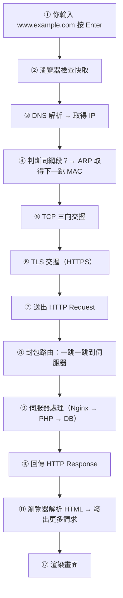
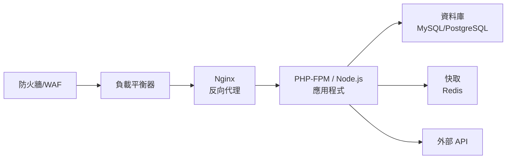

# 一個網頁請求的完整旅程

> [!abstract] 這篇你會學到
> - **把前面 13 篇的所有觀念串成一條完整的線**
> - 依序說出從按下 Enter 到畫面出現的**十二個階段**
> - **指出每個階段可能的故障點**，以及對應的排錯工具
> - 理解每個階段大約花多少時間，知道效能瓶頸在哪
> - 建立一張可以隨時調用的**網路全景圖**

> [!tip] 這是本章的總複習
> 如果你能完整說出這一篇的流程，
> **代表你已經掌握了計算機網路的核心。**
>
> 讀的時候遇到不熟的部分，就回頭補那一篇。

## 前置知識

- [[13-網概-HTTP與HTTPS]]、[[11-網概-DNS網域名稱系統]]、
  [[09-網概-TCP與UDP]]、[[07-網概-路由與封包旅程]]

---

## 全景圖



---

## 逐階段詳解

### ① 你輸入網址並按下 Enter

瀏覽器先做幾件事：

| 動作 | 說明 |
| --- | --- |
| 判斷這是網址還是搜尋 | 沒有 `.` 或有空白 → 丟給搜尋引擎 |
| 補上協定 | 現代瀏覽器**預設嘗試 `https://`** |
| **檢查 HSTS 清單** | 若這個網域在 HSTS 清單裡，**強制用 HTTPS**，連 HTTP 都不試 |
| 正規化 URL | 處理大小寫、編碼 |

> [!note] 為什麼現在打網址預設走 HTTPS
> 過去瀏覽器預設 `http://`，靠伺服器回 301 導向 HTTPS ——
> 但**第一次連線是明文的**，中間人可以攔截（SSL Stripping）。
>
> 現代瀏覽器改為**預設嘗試 HTTPS**，
> 加上 **HSTS preload 清單**（內建的強制 HTTPS 網域清單），
> 徹底解決了這個空窗。

---

### ② 瀏覽器檢查快取

在真的發出請求之前，瀏覽器會逐層檢查：

| 快取層 | 檢查什麼 |
| --- | --- |
| **瀏覽器 HTTP 快取** | 這個資源之前抓過嗎？還在有效期內嗎（`Cache-Control`）？ |
| **Service Worker** | PWA 應用可能完全離線回應 |
| **瀏覽器 DNS 快取** | 這個網域的 IP 之前查過嗎？ |
| **作業系統 DNS 快取** | 同上 |
| **`/etc/hosts`（或 Windows 的 hosts）** | 有沒有手動指定？ |

> [!tip] `hosts` 檔案優先於 DNS
> 這是排錯與測試的好工具，但**也是惡意程式常見的手法**。
>
> ```bash
> # Linux/macOS
> $ cat /etc/hosts
> 127.0.0.1   localhost
> 192.168.1.50 test.example.com     ← 手動指定，優先於 DNS
> ```
> ```
> # Windows
> C:\Windows\System32\drivers\etc\hosts
> ```
>
> **測試用途**：網站搬遷前，先在自己電腦的 hosts 指到新伺服器測試，
> 確認沒問題再改 DNS。
>
> **資安風險**：惡意程式會竄改 hosts 把網銀導向假網站。
> 排查可疑行為時**一定要檢查這個檔案**。

**如果快取全部沒有命中 → 進入 ③**

---

### ③ DNS 解析

```
瀏覽器 → 作業系統 → 遞迴解析器 → 根 → TLD → 權威 → 得到 IP
```

| 階段 | 說明 |
| --- | --- |
| 查詢遞迴解析器 | 通常是路由器或 ISP 的 DNS |
| 解析器有快取 → 直接回答 | **通常幾毫秒** |
| 沒快取 → 走完整流程 | 根 → `.com` → `example.com` 權威伺服器 |
| 拿到 A 記錄（IPv4）或 AAAA（IPv6） | |

**耗時**：快取命中 **< 5 ms**；完整查詢 **20～200 ms**

> [!warning] 這一階段的故障
> | 症狀 | 原因 | 排錯 |
> | --- | --- | --- |
> | `DNS_PROBE_FINISHED_NXDOMAIN` | 網域不存在／打錯 | `dig +short 網域` |
> | 解析很慢 | DNS 伺服器太遠或負載高 | 換 `8.8.8.8` / `1.1.1.1` 比較 |
> | 解析到錯誤的 IP | 快取未更新、DNS 被竄改 | `dig @權威NS` 比對；檢查 hosts |
> | **網頁不通但 LINE 可以** | **DNS 問題** | `ping 8.8.8.8` 通 + `nslookup` 失敗 |
>
> 詳見 [[11-網概-DNS網域名稱系統]]。

> [!note] Happy Eyeballs：IPv4 與 IPv6 同時試
> 如果網域同時有 A 與 AAAA 記錄，
> 現代瀏覽器會**同時發起 IPv4 與 IPv6 連線**，
> **誰先成功就用誰**（RFC 8305）。
>
> 這避免了「IPv6 設定不良導致網頁載入很慢」的問題。

---

### ④ 判斷同網段，取得下一跳的 MAC

拿到 IP `93.184.216.34` 之後，你的電腦要決定怎麼送出去：

```
用自己的遮罩計算：
  93.184.216.34 AND 255.255.255.0 = 93.184.216.0
  我的網路位址                     = 192.168.1.0
  不同 → 跨網段 → 交給預設閘道
```

然後 **ARP** 問「閘道的 MAC 是多少」（若快取沒有的話）。

> [!warning] 這裡最容易搞混
> **ARP 問的是「閘道」的 MAC，不是 `93.184.216.34` 的 MAC！**
>
> 因為 ARP 廣播不會跨過路由器。
>
> 最後送出的封包長這樣：
> ```
> [目的 MAC = 閘道的 MAC][來源 MAC = 我的]
> [目的 IP = 93.184.216.34][來源 IP = 192.168.1.10]
>            ^^^^^^^^^^^^^ IP 是最終目的地
> ```
>
> 詳見 [[05-網概-MAC位址與交換器]] 與 [[07-網概-路由與封包旅程]]。

**耗時**：ARP 快取命中 **< 1 ms**；需要 ARP **1～5 ms**

---

### ⑤ TCP 三向交握

```
① SYN     →  「我要連線」
② SYN-ACK ←  「好，我也要」
③ ACK     →  「確認」
```

**耗時**：約 **1 個 RTT**（往返時間）
- 國內：**5～20 ms**
- 跨國（美西）：**120～180 ms**

> [!tip] 這是「延遲」而非「頻寬」的問題
> 三向交握需要一個完整的往返。
> **不管你的網路多快，光速就是那麼快。**
>
> 台灣到美國西岸單程約 60～90 ms，
> 所以光是建立 TCP 連線就要 120～180 ms ——
> **這是頻寬無法解決的物理限制**。
>
> 這也是 **CDN 存在的理由**：把內容放到離使用者近的地方，
> 大幅縮短 RTT。

> [!warning] 這一階段的故障
> | 症狀 | 原因 |
> | --- | --- |
> | `Connection refused`（收到 RST） | **那個埠沒有服務在聽** |
> | `Connection timed out` | 防火牆 **drop**、路由不通、主機關機 |
> | 連線很慢建立 | 高延遲、封包遺失導致 SYN 重傳 |
>
> ```bash
> $ nc -zv example.com 443
> $ sudo tcpdump -n 'tcp port 443 and host example.com'
> ```

---

### ⑥ TLS 交握（HTTPS）

```
① Client Hello（我支援這些加密套件）
② Server Hello + 憑證
③ 瀏覽器驗證憑證（信任鏈、SAN、有效期、撤銷狀態）
④ 交換金鑰材料
⑤ 雙方算出對稱工作金鑰
⑥ Finished
```

**耗時**：
- TLS 1.2：**2 個 RTT**
- **TLS 1.3：1 個 RTT**（重連可 0-RTT）
- 加上憑證驗證（可能要查 OCSP）

> [!warning] 這一階段的故障
> | 症狀 | 原因 | 排錯 |
> | --- | --- | --- |
> | `ERR_CERT_DATE_INVALID` | **憑證過期** | `openssl x509 -noout -dates` |
> | `ERR_CERT_COMMON_NAME_INVALID` | **SAN 不含這個網域** | 檢查 `-ext subjectAltName` |
> | `ERR_CERT_AUTHORITY_INVALID` | 自簽或**缺中繼憑證** | 用 `fullchain.pem` |
> | `ERR_SSL_VERSION_OR_CIPHER_MISMATCH` | 協定版本或加密套件不相容 | 檢查 `ssl_protocols` |
> | TLS 交握特別慢 | **OCSP 查詢慢** | 啟用 **OCSP Stapling** |
>
> ```bash
> $ openssl s_client -connect example.com:443 -servername example.com </dev/null
> $ curl -w "TLS: %{time_appconnect}s\n" -o /dev/null -s https://example.com
> ```

> [!tip] OCSP Stapling 可以省下一次額外查詢
> 沒有 stapling 時，瀏覽器要**另外連到 CA 去查憑證有沒有被撤銷** ——
> 這是額外的 DNS + TCP + TLS，可能增加 100～300 ms。
>
> **OCSP Stapling** 讓伺服器**預先取得撤銷狀態並附在交握裡**，
> 瀏覽器不用自己去查。
>
> ```nginx
> ssl_stapling on;
> ssl_stapling_verify on;
> resolver 1.1.1.1 8.8.8.8 valid=300s;
> ```

---

### ⑦ 送出 HTTP Request

```http
GET / HTTP/2
Host: www.example.com
User-Agent: Mozilla/5.0 ...
Accept: text/html,...
Cookie: session=abc123
```

**耗時**：幾乎瞬間（資料量很小）

---

### ⑧ 封包路由：一跳一跳到伺服器

```
你的電腦 → 家用路由器（NAT）→ ISP 接取 → ISP 骨幹
        → 國際骨幹／海底電纜 → 對方 ISP → 目標伺服器
```

**每一跳**：
- 路由器查路由表，決定下一跳
- **TTL 減 1**
- **改寫 MAC**（IP 不變）
- 第一跳的家用路由器還會做 **NAT**（改寫來源 IP 與埠）

**耗時**：國內 **5～20 ms**；跨國 **100～250 ms**

> [!warning] 這一階段的故障
> ```bash
> $ traceroute -n 93.184.216.34
> ```
> | 觀察 | 意義 |
> | --- | --- |
> | 第 1 跳就不通 | 你到路由器的問題 |
> | 第 2 跳不通 | 路由器到 ISP 的問題 |
> | 某跳延遲突然 +100ms | **跨海**（正常） |
> | 從某跳開始全是 `* * *` | **那裡真的斷了** |
> | 中間幾跳 `* * *` 但有到達 | **正常**（那些設備不回 ICMP） |

---

### ⑨ 伺服器處理

這是**最容易成為瓶頸**的一段。



| 環節 | 可能的問題 |
| --- | --- |
| WAF | 誤判擋掉正常請求（403） |
| Nginx | 設定錯誤（404）、連不到後端（**502**）、後端太慢（**504**） |
| **應用程式** | **程式錯誤（500）**、worker 用完（503） |
| **資料庫** | **慢查詢**、鎖等待、連線池耗盡 |
| 外部 API | 逾時、限流（429） |

**耗時**：從 **5 ms**（有快取的靜態頁）到 **數秒**（複雜查詢）

> [!tip] 用 `time_starttransfer` 判斷是不是伺服器慢
> ```bash
> $ curl -w "
> 連線建立: %{time_connect}s
> TLS完成:  %{time_appconnect}s
> 首位元組: %{time_starttransfer}s     ← 減掉 TLS 就是伺服器處理時間
> 總計:     %{time_total}s
> " -o /dev/null -s https://example.com
> ```
>
> **`time_starttransfer` − `time_appconnect` = 伺服器處理時間**
>
> 這個數字大 → 問題在伺服器端（應用程式、資料庫），不是網路。

---

### ⑩ 回傳 HTTP Response

```http
HTTP/2 200
content-type: text/html; charset=utf-8
content-encoding: gzip
cache-control: max-age=3600
content-length: 8234

<!DOCTYPE html>...
```

回應沿著**相反的路徑**回來：
- 每一跳同樣改寫 MAC
- 家用路由器查 **NAT 表**，還原成內部 IP
- TCP 確認、排序、重組
- TLS 解密

---

### ⑪ 瀏覽器解析 HTML，發出更多請求

> [!warning] 這裡是關鍵：**一個網頁不是一個請求**
> 瀏覽器拿到 HTML 後開始解析，
> 每遇到一個外部資源就**再發一次完整的請求**：
>
> ```html
> <link rel="stylesheet" href="/style.css">      ← 請求 2
> <script src="/app.js"></script>                ← 請求 3
>                           ← 請求 4
>       ← 請求 5（要再做一次 DNS+TCP+TLS！）
> ```
>
> **一個現代網頁常常要發出 50～200 個請求。**
>
> 而且每個**不同網域**的資源都要重新走
> DNS → TCP → TLS 的完整流程。

> [!tip] 這解釋了很多效能優化技巧
> | 技巧 | 為什麼有效 |
> | --- | --- |
> | **減少請求數** | 每個請求都有固定成本 |
> | **使用 CDN** | 縮短 RTT |
> | **HTTP/2 多工** | 一條連線同時傳多個資源 |
> | `preconnect` / `dns-prefetch` | **預先完成 DNS 與交握** |
> | **圖片最佳化** | 圖片通常佔總大小的 60～80% |
> | `loading="lazy"` | 畫面外的圖片延後載入 |
> | **啟用快取** | 第二次不用再抓 |
> | 壓縮（gzip / brotli） | 減少傳輸量 |
>
> ```html
> <!-- 預先連線到會用到的網域 -->
> <link rel="preconnect" href="https://cdn.example.com">
> <link rel="dns-prefetch" href="https://api.example.com">
> ```

---

### ⑫ 渲染畫面

| 階段 | 說明 |
| --- | --- |
| 解析 HTML → **DOM 樹** | 文件結構 |
| 解析 CSS → **CSSOM** | 樣式規則 |
| 合併成 **Render Tree** | 要畫什麼、長什麼樣 |
| **Layout（排版）** | 算出每個元素的位置與大小 |
| **Paint（繪製）** | 畫出像素 |
| **Composite（合成）** | 圖層疊合 |

> [!warning] JavaScript 會阻塞解析
> 遇到 `<script>` 時，**瀏覽器會停下 HTML 解析**去下載並執行它。
>
> ```html
> <script src="app.js"></script>          ← 阻塞
> <script src="app.js" defer></script>    ← 下載不阻塞，DOM 完成後才執行
> <script src="app.js" async></script>    ← 下載不阻塞，下載完立刻執行
> ```
>
> **把 `<script>` 放在 `</body>` 前，或加上 `defer`**，
> 是最基本的前端效能優化。

---

## 完整實戰範例：親手追蹤一次請求

### 一行指令看完所有階段的耗時

```bash
$ curl -w "
────────────────────────────────
DNS 查詢:      %{time_namelookup}s
TCP 連線:      %{time_connect}s
TLS 交握:      %{time_appconnect}s
送出請求:      %{time_pretransfer}s
首位元組(TTFB): %{time_starttransfer}s
總計:          %{time_total}s
────────────────────────────────
狀態碼:        %{http_code}
HTTP 版本:     %{http_version}
下載大小:      %{size_download} bytes
平均速度:      %{speed_download} bytes/s
遠端 IP:       %{remote_ip}
────────────────────────────────
" -o /dev/null -s https://www.gov.tw
```

**判讀方式**：

| 哪一段大 | 問題在 | 怎麼改善 |
| --- | --- | --- |
| `time_namelookup` | **DNS** | 換 DNS 伺服器；降低 TTL 不是解法 |
| `time_connect` − `namelookup` | **網路延遲** | CDN、更近的機房 |
| `time_appconnect` − `connect` | **TLS 交握** | TLS 1.3、OCSP Stapling、Session Resumption |
| **`time_starttransfer` − `appconnect`** | **伺服器處理（TTFB）** | **應用程式與資料庫調校** |
| `time_total` − `starttransfer` | **傳輸量／頻寬** | 壓縮、圖片最佳化 |

### 用瀏覽器開發者工具

按 **F12** → **Network** 分頁 → 重新整理

| 欄位 | 對應本篇的階段 |
| --- | --- |
| **Queueing** | 瀏覽器排隊 |
| **Stalled** | 等待連線可用 |
| **DNS Lookup** | ③ |
| **Initial connection** | ⑤ TCP 交握 |
| **SSL** | ⑥ TLS 交握 |
| **Request sent** | ⑦ |
| **Waiting (TTFB)** | ⑧⑨⑩ **伺服器處理 + 網路往返** |
| **Content Download** | 傳輸內容 |

> [!tip] Waterfall 圖是效能分析的核心
> 開發者工具的瀑布圖能一眼看出：
> - 哪個資源花最久
> - 有沒有請求被阻塞
> - 有沒有不必要的重新導向
> - 總共發了幾個請求、多大

### 分層抓封包驗證

```bash
# 開始抓（另一個終端機執行 curl）
$ sudo tcpdump -i any -n -e 'host example.com or port 53' -w /tmp/trace.pcap

# 執行請求
$ curl -sI https://example.com > /dev/null

# 停止抓封包（Ctrl+C），然後分析
$ tcpdump -r /tmp/trace.pcap -n | head -20
```

**你會依序看到**：
```
① DNS 查詢與回應（port 53）
② TCP SYN / SYN-ACK / ACK（三向交握）
③ TLS Client Hello / Server Hello / ...（交握）
④ 加密的應用資料
⑤ FIN / ACK（關閉）
```

> [!tip] 用 Wireshark 看更清楚
> 把 `/tmp/trace.pcap` 用 Wireshark 開啟，
> 它會用不同顏色標示每個協定，
> 而且可以**點開任一封包看到完整的層層封裝**。
>
> 這是理解整個旅程最直觀的方式。

---

## 各階段故障速查表

> [!tip] 把這張表記起來，你就會排錯了

| 階段 | 症狀 | 檢查指令 | 常見原因 |
| --- | --- | --- | --- |
| **② 快取／hosts** | 連到錯誤的伺服器 | `cat /etc/hosts` | hosts 被竄改或忘了改回來 |
| **③ DNS** | `NXDOMAIN`、解析錯誤 | `dig +short 網域`、`dig @8.8.8.8` | 網域錯、DNS 掛、快取舊、DNS 被劫持 |
| **④ ARP／路由** | 完全不通 | `ip route`、`ip neigh` | 沒閘道、遮罩錯、ARP 欺騙 |
| **⑤ TCP** | `Connection refused` | `nc -zv 主機 埠` | **服務沒起來**、埠錯 |
| **⑤ TCP** | `Connection timed out` | `traceroute`、`nc` | **防火牆 drop**、路由不通 |
| **⑥ TLS** | 憑證錯誤 | `openssl s_client` | **過期**、SAN 不符、缺中繼憑證 |
| **⑧ 路由** | 中間斷掉 | `traceroute -n` | ISP 問題、路由設定錯 |
| **⑨ 伺服器** | **502** | `systemctl status 後端` | **後端掛了**、socket 路徑錯 |
| **⑨ 伺服器** | **504** | 看後端日誌 | **後端太慢**（DB 慢查詢） |
| **⑨ 伺服器** | **500** | 看**應用程式**日誌 | 程式錯誤 |
| **⑨ 伺服器** | 404 | 看 Nginx 設定 | 路徑錯、rewrite 錯、大小寫 |
| **⑨ 伺服器** | 403 | Nginx／WAF 日誌 | 權限、WAF 誤判 |
| **⑪ 資源載入** | 部分內容沒出來 | F12 Console | CORS、混合內容、CDN 掛了 |
| **⑫ 渲染** | 畫面破版／很慢 | F12 Performance | CSS/JS 問題、圖片太大 |

### 由下而上的排錯口訣

```bash
# 一鍵完整診斷
DOMAIN=www.example.com

echo "[L1-2] 實體與鏈路"
sudo ethtool $(ip route|awk '/default/{print $5;exit}') 2>/dev/null | grep -E 'Link|Speed'
ip neigh show | head -3

echo -e "\n[L3] 網路層"
ip route show | head -3
ping -c 2 -W 2 $(ip route|awk '/default/{print $3;exit}')   # 閘道
ping -c 2 -W 2 8.8.8.8                                       # 外網

echo -e "\n[L7-DNS] 名稱解析"
dig +short "$DOMAIN"
dig @8.8.8.8 +short "$DOMAIN"

echo -e "\n[L4] 傳輸層"
nc -zv -w3 "$DOMAIN" 443

echo -e "\n[L6-TLS] 憑證"
echo | openssl s_client -connect "$DOMAIN:443" -servername "$DOMAIN" 2>/dev/null | \
  openssl x509 -noout -subject -dates 2>/dev/null

echo -e "\n[L7-HTTP] 應用層"
curl -sI --max-time 10 "https://$DOMAIN" | head -3

echo -e "\n[效能] 各階段耗時"
curl -w "DNS:%{time_namelookup} TCP:%{time_connect} TLS:%{time_appconnect} TTFB:%{time_starttransfer} 總計:%{time_total}\n" \
  -o /dev/null -s "https://$DOMAIN"
```

---

## 耗時參考值

> [!example] 一個典型的國內網站首次載入
> ```
> DNS 查詢          20 ms
> TCP 交握          15 ms
> TLS 交握          30 ms   （TLS 1.3，1-RTT）
> 伺服器處理       120 ms   ← 通常是最大的一塊
> 內容下載          40 ms
> ─────────────────────────
> 首頁 HTML        225 ms
>
> + 後續 60 個資源（CSS/JS/圖片，HTTP/2 多工）
>                  800 ms
> ─────────────────────────
> 完整載入      約 1 秒
> ```

| 指標 | 良好 | 可接受 | 需改善 |
| --- | --- | --- | --- |
| DNS 查詢 | < 20 ms | < 100 ms | > 200 ms |
| TCP 交握（國內） | < 20 ms | < 50 ms | > 100 ms |
| TLS 交握 | < 50 ms | < 150 ms | > 300 ms |
| **TTFB（伺服器處理）** | **< 200 ms** | < 500 ms | **> 1 s** |
| 完整載入 | < 2 s | < 4 s | > 5 s |

> [!tip] TTFB 是最值得盯的指標
> **TTFB（Time To First Byte）** 反映的是
> 「**從送出請求到收到第一個位元組**」的時間，
> 涵蓋了網路往返 + 伺服器處理。
>
> TTFB 長通常代表：
> - 資料庫**慢查詢**
> - 應用程式邏輯太複雜
> - 沒有使用快取
> - 後端在等外部 API
>
> 這是**伺服器端的問題，不是網路的問題** ——
> 換更快的線路完全沒用。

---

## 常見錯誤與排錯

| 迷思／錯誤 | 為什麼錯 | 正確理解 |
| --- | --- | --- |
| 「網站慢一定是頻寬不夠」 | 多數瓶頸在延遲與伺服器處理 | 用 `curl -w` 看是哪一段慢 |
| 「一個網頁 = 一個請求」 | 一個現代網頁常有 50～200 個請求 | 每個資源都是獨立請求 |
| ping 通就代表網站正常 | ping 是第 3 層 | 服務在第 4/7 層，要用 `curl` 測 |
| 憑證錯誤就按「繼續前往」 | 可能真的是中間人攻擊 | **先查清楚原因**再決定 |
| 從一堆日誌裡亂找 | 沒有分層概念 | **依 ①～⑫ 順序定位** |
| 「改 DNS 立刻生效」 | 各層都有快取 | 依 TTL；搬遷前先降 TTL |
| 網頁不通就重開機 | 沒有診斷 | 跑一次分層診斷腳本 |
| 只看 Nginx 日誌找 500 的原因 | 500 是應用程式的錯誤 | **去看應用程式的錯誤日誌** |

---

## 安全性注意事項

> [!danger] 每一個階段都有對應的攻擊
> | 階段 | 攻擊 | 防護 |
> | --- | --- | --- |
> | ② hosts | **竄改 hosts 導向假網站** | 端點防護；定期檢查該檔案 |
> | ③ DNS | **DNS 劫持／快取毒化** | DNSSEC、DoH/DoT、內部 DNS |
> | ④ ARP | **ARP 欺騙（中間人）** | DHCP Snooping + DAI |
> | ⑤ TCP | **SYN Flood** | SYN Cookie |
> | ⑥ TLS | **SSL Stripping、假憑證** | **HSTS**、憑證釘選、CAA |
> | ⑧ 路由 | **BGP 劫持** | RPKI（由 ISP 負責） |
> | ⑨ 伺服器 | **SQLi、XSS、RCE** | **WAF**、輸入驗證、更新 |
> | ⑪ 資源 | **供應鏈攻擊**（第三方 JS 被竄改） | **SRI**、CSP |
>
> **縱深防禦就是在每一層都設防。**
> 見 [[01-資安全景圖與縱深防禦]]。

> [!warning] 第三方 JavaScript 是被忽略的風險
> 你的網站載入 `https://cdn.other.com/lib.js` 時，
> **那段程式碼擁有和你的網站完全相同的權限** ——
> 它可以讀取你的 DOM、Cookie（若沒設 HttpOnly）、送出表單資料。
>
> **如果那個 CDN 被入侵，你的網站就等於被入侵了。**
>
> **防護：SRI（Subresource Integrity）**
> ```html
> <script src="https://cdn.example.com/lib.js"
>         integrity="sha384-abc123..."
>         crossorigin="anonymous"></script>
> ```
> 瀏覽器會**驗證檔案的雜湊值**，被竄改就拒絕執行。
>
> 加上 **CSP** 限制只能從指定來源載入腳本：
> ```
> Content-Security-Policy: script-src 'self' https://cdn.example.com
> ```
>
> 見 [[09-應用層安全]]。

> [!tip] 用這個流程來理解資安事件
> 資安調查時，同樣的分層思維很有用：
>
> ```
> 「使用者說他連到假的網銀」
>   → ② hosts 被竄改嗎？
>   → ③ DNS 設定被改了嗎？（檢查 resolv.conf 與路由器）
>   → ④ 有 ARP 欺騙嗎？（一個 MAC 對多個 IP）
>   → ⑥ 憑證是誰簽的？（真的網銀 vs 攻擊者的）
> ```
>
> **每一層都問一次，就能找出攻擊發生在哪裡。**

---

## 速查表

### 十二個階段

| # | 階段 | 主要協定/技術 | 典型耗時 |
| --- | --- | --- | --- |
| ① | 輸入網址 | HSTS 檢查 | — |
| ② | 檢查快取 | HTTP 快取、hosts | < 1 ms |
| ③ | **DNS 解析** | DNS (UDP/TCP 53) | 5～200 ms |
| ④ | 判斷網段 + ARP | ARP、路由表 | < 5 ms |
| ⑤ | **TCP 三向交握** | TCP | 1 RTT |
| ⑥ | **TLS 交握** | TLS 1.2/1.3 | 1～2 RTT |
| ⑦ | 送出 Request | HTTP | 瞬間 |
| ⑧ | 路由轉送 | IP、NAT | 5～250 ms |
| ⑨ | **伺服器處理** | Nginx/App/DB | **5 ms～數秒** |
| ⑩ | 回傳 Response | HTTP | — |
| ⑪ | 解析並載入資源 | HTML/CSS/JS | 數百 ms |
| ⑫ | 渲染 | DOM/CSSOM/Layout/Paint | 數十～數百 ms |

### 一行診斷指令

```bash
curl -w "DNS:%{time_namelookup} TCP:%{time_connect} TLS:%{time_appconnect} TTFB:%{time_starttransfer} 總計:%{time_total} 碼:%{http_code}\n" -o /dev/null -s https://網址
```

### 症狀 → 階段

| 症狀 | 階段 |
| --- | --- |
| `NXDOMAIN` | ③ DNS |
| `Connection refused` | ⑤ 服務沒起來 |
| `Connection timed out` | ⑤ 防火牆／路由 |
| 憑證錯誤 | ⑥ TLS |
| **502** | ⑨ 後端掛了 |
| **504** | ⑨ 後端太慢 |
| **500** | ⑨ 應用程式錯誤 |
| 404 | ⑨ 路徑／設定 |
| **TTFB 很長** | ⑨ **資料庫／應用程式** |
| 畫面破版 | ⑫ 前端資源 |

### 效能指標門檻

| 指標 | 良好 |
| --- | --- |
| DNS | < 20 ms |
| TCP（國內） | < 20 ms |
| TLS | < 50 ms |
| **TTFB** | **< 200 ms** |
| 完整載入 | < 2 s |

---

## 練習題

> [!question]- 練習 1：完整追蹤一次請求
> ```bash
> DOMAIN=www.gov.tw
>
> # 1. DNS
> dig +short $DOMAIN
>
> # 2. 路由
> traceroute -n $(dig +short $DOMAIN | head -1) | head -10
>
> # 3. TCP + TLS + HTTP 各階段耗時
> curl -w "
> DNS:  %{time_namelookup}s
> TCP:  %{time_connect}s
> TLS:  %{time_appconnect}s
> TTFB: %{time_starttransfer}s
> 總計: %{time_total}s
> " -o /dev/null -s https://$DOMAIN
>
> # 4. 憑證
> echo | openssl s_client -connect $DOMAIN:443 -servername $DOMAIN 2>/dev/null | \
>   openssl x509 -noout -subject -issuer -dates
> ```
> 回答：**哪一個階段花最久？** 如果要改善，該從哪裡下手？

> [!question]- 練習 2：用開發者工具分析
> 開一個你常用的網站，按 F12 → Network → 重新整理（Ctrl+F5 停用快取）。
>
> 回答：
> 1. 總共發出幾個請求？總傳輸量多少？
> 2. 最慢的三個資源是什麼？
> 3. 第一個 HTML 的 TTFB 是多少？
> 4. 有沒有 404 或其他錯誤？
> 5. 有沒有不必要的重新導向（301/302）？

> [!question]- 練習 3：模擬故障並診斷
> 在測試環境中，依序製造下列故障，
> **每次都跑一遍分層診斷，觀察是哪一步先失敗**：
>
> 1. 把 DNS 改成一個不存在的位址 → 應該卡在 ③
> 2. 在 `/etc/hosts` 加一筆錯誤的對應 → 應該卡在 ②（連到錯的地方）
> 3. 防火牆擋掉 443 埠 → 應該卡在 ⑤
> 4. 把預設閘道刪掉（`sudo ip route del default`）→ 應該卡在 ④
>
> 每次做完記得復原。
> **這個練習會讓「分層排錯」變成你的直覺。**

---

## 小測驗

Q1. 請依序說出從按下 Enter 到畫面出現的十二個階段。

Q2. 為什麼現代瀏覽器打網址時預設嘗試 HTTPS 而不是 HTTP？

Q3. `/etc/hosts`（或 Windows 的 hosts）在整個流程中的位置是什麼？它有什麼測試用途與資安風險？

Q4. 拿到 IP 之後，ARP 問的是「目標伺服器的 MAC」還是「閘道的 MAC」？為什麼？

Q5. TCP 三向交握需要幾個 RTT？為什麼「頻寬再大也無法縮短它」？這解釋了什麼技術的存在？

Q6. `time_starttransfer` 減去 `time_appconnect` 代表什麼？這個數字很大代表問題在哪裡？

Q7. 為什麼說「一個網頁不是一個請求」？這解釋了哪些效能優化技巧？

Q8. 502、504、500 分別代表什麼？各該去看哪裡的日誌？

Q9. TTFB 是什麼？它的良好門檻是多少？TTFB 很長時，換更快的網路線路有用嗎？

Q10. 第三方 JavaScript 為什麼是被忽略的資安風險？有哪兩種防護機制？

> [!question]- 測驗答案
> **Q1.** ①輸入網址（含 HSTS 檢查）→ ②**檢查快取**（HTTP 快取、DNS 快取、hosts）→
> ③**DNS 解析**取得 IP → ④**判斷同網段並 ARP 取得下一跳 MAC** →
> ⑤**TCP 三向交握** → ⑥**TLS 交握**（HTTPS）→ ⑦送出 HTTP Request →
> ⑧**封包路由**一跳一跳到伺服器 → ⑨**伺服器處理**（Nginx→App→DB）→
> ⑩回傳 Response → ⑪**解析 HTML 並發出更多請求** → ⑫**渲染畫面**。
>
> **Q2.** 因為過去預設 `http://`，靠伺服器回 301 導向 HTTPS，
> 但**第一次連線是明文的**，中間人可以在那一瞬間攔截並阻止導向
> （**SSL Stripping 攻擊**）。
> 現代瀏覽器預設嘗試 HTTPS，加上 **HSTS preload 清單**，
> 徹底解決了這個空窗。
>
> **Q3.** 它在**第 ② 階段（檢查快取）**，**優先於 DNS 查詢**。
> **測試用途**：網站搬遷前，先在自己電腦的 hosts 指到新伺服器測試，
> 確認沒問題再改 DNS。
> **資安風險**：惡意程式會**竄改 hosts 把網銀導向假網站**，
> 排查可疑行為時一定要檢查這個檔案。
>
> **Q4.** 問的是「**閘道的 MAC**」。
> 因為**ARP 廣播不會跨過路由器** ——
> 目標伺服器在別的網段，你的 ARP 廣播根本到不了它。
> 電腦用遮罩判斷目的地不在同網段後，就決定交給預設閘道，
> 所以 ARP 問的是閘道。
> 最終封包是：**目的 MAC = 閘道**、**目的 IP = 目標伺服器**。
>
> **Q5.** 需要 **1 個 RTT**（往返時間）。
> 頻寬無法縮短它，是因為 **RTT 由物理距離與光速決定** ——
> 台灣到美西單程約 60～90 ms，來回就是 120～180 ms，
> 這是**物理限制，不是頻寬問題**。
> 這解釋了 **CDN 的存在理由**：把內容放到離使用者近的節點，
> 大幅縮短 RTT。
>
> **Q6.** 代表**伺服器的處理時間**
> （從 TLS 完成、送出請求，到收到第一個位元組）。
> 這個數字很大代表**問題在伺服器端** ——
> 資料庫慢查詢、應用程式邏輯太複雜、沒有使用快取、在等外部 API。
> **不是網路的問題。**
>
> **Q7.** 因為瀏覽器拿到 HTML 後開始解析，
> **每遇到一個外部資源（CSS、JS、圖片、字型）就再發一次完整的請求**，
> 一個現代網頁常有 **50～200 個請求**；
> 而且**不同網域**的資源還要重新做 DNS + TCP + TLS。
> **解釋的優化技巧**：減少請求數、**使用 CDN**（縮短 RTT）、
> **HTTP/2 多工**、`preconnect`/`dns-prefetch`（預先完成交握）、
> 圖片最佳化、`loading="lazy"`、啟用快取、壓縮。
>
> **Q8.** **502 Bad Gateway = 反向代理連不到後端**
> → 看 **Nginx 的 error.log**，並檢查後端服務狀態；
> **504 Gateway Timeout = 後端太慢**
> → 看**後端應用與資料庫的日誌**找慢查詢；
> **500 Internal Server Error = 應用程式本身出錯**
> → **去看應用程式的錯誤日誌**（不是 Nginx 的）。
>
> **Q9.** **TTFB（Time To First Byte）**是「從送出請求到收到第一個位元組」的時間，
> 涵蓋網路往返 + 伺服器處理。
> **良好門檻是 < 200 ms**（< 500 ms 可接受，> 1 s 需改善）。
> TTFB 很長時，**換更快的網路線路完全沒用** ——
> 因為瓶頸在伺服器端（資料庫慢查詢、應用程式邏輯、缺少快取），
> 該做的是應用程式與資料庫調校。
>
> **Q10.** 因為載入的第三方 JavaScript **擁有和你的網站完全相同的權限** ——
> 它可以讀取 DOM、Cookie（若沒設 HttpOnly）、送出表單資料。
> **如果那個 CDN 被入侵，你的網站就等於被入侵了**（供應鏈攻擊）。
> **兩種防護**：
> ①**SRI（Subresource Integrity）** —— 在 `<script>` 標籤加上 `integrity` 雜湊值，
> 瀏覽器會驗證檔案未被竄改，不符就拒絕執行；
> ②**CSP（Content-Security-Policy）** —— 限制只能從指定來源載入腳本。

---

## 延伸閱讀

- [[11-網概-DNS網域名稱系統]] — 階段 ③
- [[05-網概-MAC位址與交換器]] — 階段 ④
- [[09-網概-TCP與UDP]] — 階段 ⑤
- [[13-網概-HTTP與HTTPS]] — 階段 ⑥⑦⑩
- [[07-網概-路由與封包旅程]] — 階段 ⑧
- [[17-網概-網路排錯入門]] — 完整的排錯方法論
- [[01-資安全景圖與縱深防禦]] — 每一階段的防護（進階）
- [[00-Web伺服器-索引]] — 階段 ⑨ 的完整教學（進階）
