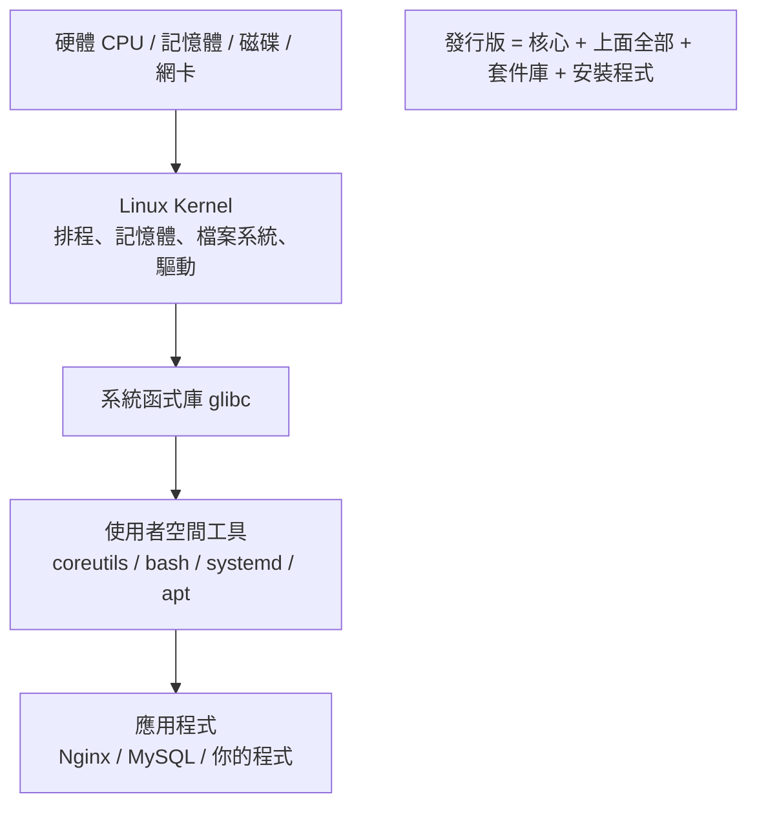
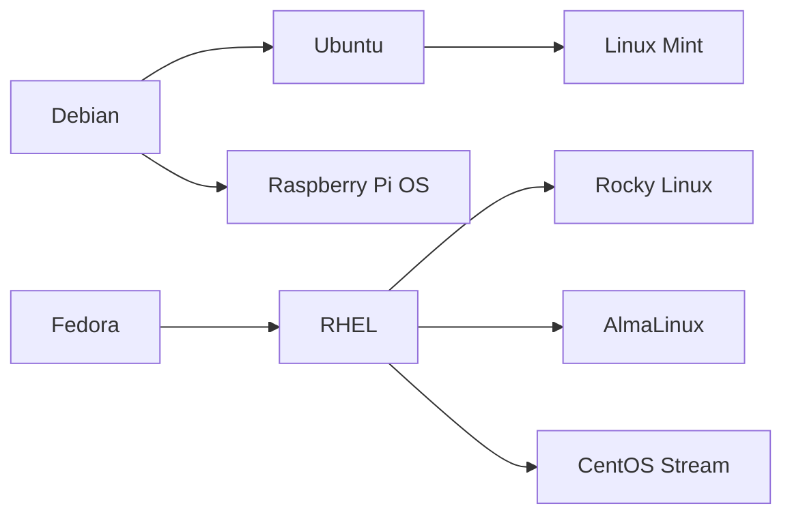

# Linux 是什麼與發行版選擇

> [!abstract] 這篇你會學到
> - 說清楚 kernel、GNU 工具、發行版三者的關係，不再把「Linux」當成一個模糊的東西 ★★
> - 比較 Debian 系與 RHEL 系的定位、版本策略與支援年限 ★★★
> - 用一套明確的判斷準則，替自己的情境選出發行版 ★★★
> - 查出手上任何一台機器的發行版、版本與剩餘支援期限 ★★★★
> - **★★★★★ 認出「已經沒有安全更新」的機器** —— 一台 EOL 的對外主機是最常見的入侵入口

## 前置知識

無。這是全書的第一篇。

---

## 觀念說明

### ★★ Linux 到底是什麼

嚴格講，**Linux 只是一個核心（kernel）**。核心負責的事情很有限但很關鍵：

- 管理 CPU 時間分配給哪個程序（排程）
- 管理記憶體怎麼配置與回收
- 提供檔案系統的讀寫介面
- 驅動硬體（網卡、磁碟、USB）
- 提供程序之間溝通的機制

核心本身不提供你在終端機打的任何一個指令。`ls`、`cp`、`grep` 這些來自
**GNU coreutils** 等專案；`bash` 是 GNU 的 shell；套件管理、開機流程、
系統服務管理（systemd）又是另外的專案。

把「核心 + 一整套使用者空間工具 + 套件管理 + 安裝程式 + 預設設定」
包裝成一個可以安裝使用的成品，就是**發行版（distribution，簡稱 distro）**。



> [!tip] 為什麼要在意這個區別 ★★★
> 因為排錯的時候你必須知道問題出在哪一層。
> 「核心版本」和「發行版版本」是兩件事：Ubuntu 24.04 可能跑 6.8 核心，
> 也可能升級成 6.11 核心；RHEL 9 用的核心版本號看起來很舊（5.14），
> 但廠商把新功能回移（backport）進去了。**用核心版本號判斷有沒有某個功能，經常會判斷錯。**

### ★★ 為什麼會有這麼多發行版

因為「該裝哪些軟體、預設怎麼設定、多久發一次版、支援多久」這些問題
沒有標準答案，不同的人有不同的取捨：

| 取捨 | 一端 | 另一端 |
| --- | --- | --- |
| ★★★ 套件新舊 | 追最新版（Arch、Fedora） | 凍結版本重視穩定（Debian stable、RHEL） |
| ★★ 發版節奏 | 滾動更新，沒有版本號 | 固定週期發版 |
| ★★★★ 支援年限 | 半年到一年 | 5～10 年 |
| ★★★ 商業支援 | 社群為主 | 有原廠合約與 SLA |
| ★★ 預設安裝 | 極簡，自己裝 | 開箱即用，什麼都有 |

### ★★★★ 兩大主流家族

實務上，伺服器環境九成以上落在這兩個家族：



**Debian 系**（套件格式 `.deb`，套件管理 `apt`）

| 發行版 | 定位 | 支援年限 | 正式環境 |
| --- | --- | --- | --- |
| Debian stable | 極度重視穩定，套件偏舊 | 約 5 年（含 LTS） | ★★★ 可以 |
| **Ubuntu LTS** | 伺服器最常見的選擇 | 5 年標準 + Ubuntu Pro 可延長至 10～12 年 | ★★★★ 首選 |
| Ubuntu 非 LTS | 每半年一版，追新功能 | 9 個月 | ★★★★ 不要用 |

**RHEL 系**（套件格式 `.rpm`，套件管理 `dnf`）

| 發行版 | 定位 | 支援年限 | 正式環境 |
| --- | --- | --- | --- |
| RHEL | 商業版，有原廠支援與認證 | 10 年 | ★★★★ 有預算就選它 |
| **Rocky Linux / AlmaLinux** | RHEL 的免費相容重build | 跟隨 RHEL，約 10 年 | ★★★★ 免費首選 |
| CentOS Stream | RHEL 的**上游**滾動預覽版 | 5 年 | ★★★★ 不建議當正式機 |
| Fedora | RHEL 的實驗場，套件很新 | 約 13 個月 | ★★★★ 不要用 |

> [!danger] CentOS Linux 已經不存在了 ★★★★★
> CentOS Linux 7 於 2024-06-30 終止支援，CentOS Linux 8 更早（2021-12-31）就結束。
> 現在的 **CentOS Stream 是 RHEL 的上游測試版本，不是 RHEL 的下游複製品**，
> 定位完全相反。如果你還在維護 CentOS 7 的機器，那是一台沒有安全更新的機器。
> ★★★★★ 正式環境要免費的 RHEL 相容系統，請選 **Rocky Linux** 或 **AlmaLinux**。
> ★★★★ 把 CentOS Stream 當成 CentOS Linux 的接班人裝上正式機，是實務上最常見的誤判 ——
> 它是「RHEL 明年的樣子」，會先收到還沒進 RHEL 的變更。

### ★★★ Ubuntu 的版本號規則

Ubuntu 版本號是 `YY.MM`，就是發布的年月：

- `24.04` = 2024 年 4 月
- `25.10` = 2025 年 10 月
- **★★★★ 偶數年的 4 月版本才是 LTS**（Long Term Support）：20.04、22.04、24.04、26.04
- ★★★ 每個版本還有一個代號（codename），如 `noble`（24.04）、`jammy`（22.04）

代號很重要，因為**加第三方套件庫時要填的就是代號**，不是版本號：

```text
deb [signed-by=...] https://example.com/apt noble main
                                            ^^^^^ ★★★★ 代號，不是 24.04
```

> [!tip] 正式環境請用 LTS ★★★★
> 非 LTS 版本只有 9 個月支援，等於每 9 個月就要被迫做一次大版本升級。
> 伺服器用 LTS，工作站或想玩新功能才考慮非 LTS。

---

## 逐步說明：查出手上這台機器是什麼

### ★★★★ 最可靠的方式：`/etc/os-release`

這個檔案是跨發行版的標準（systemd 定義），**任何現代 Linux 都有**：

```bash
cat /etc/os-release
```

```
PRETTY_NAME="Ubuntu 26.04.1 LTS"
NAME="Ubuntu"
VERSION_ID="26.04"
VERSION="26.04.1 LTS (Resolute Raccoon)"
VERSION_CODENAME=resolute        # ★★★★ 加第三方 APT 套件庫填的就是這個
ID=ubuntu                        # ★★★ 這台「是誰」
ID_LIKE=debian                   # ★★★★ 這台「屬於哪個家族」，腳本要判這欄
HOME_URL="https://www.ubuntu.com/"
SUPPORT_URL="https://help.ubuntu.com/"
```

在腳本裡要取值時不要用 `grep` 加 `cut` 慢慢切，直接 source 它：

```bash
. /etc/os-release
echo "$ID $VERSION_ID ($VERSION_CODENAME)"
```

```
ubuntu 26.04 (resolute)
```

> [!tip] `ID_LIKE` 是寫跨發行版腳本的關鍵 ★★★★
> `ID_LIKE=debian` 代表「我雖然不是 Debian，但我跟 Debian 相容」。
> 寫安裝腳本時可以這樣判斷家族：
>
> ```bash
> . /etc/os-release
> case "$ID $ID_LIKE" in
>   *debian*) PKG="apt-get install -y" ;;          # ★★★ 涵蓋 Ubuntu、Mint、Raspberry Pi OS
>   *rhel*|*fedora*) PKG="dnf install -y" ;;       # ★★★ 涵蓋 Rocky、Alma、CentOS Stream
>   *) echo "不支援的發行版：$ID" >&2; exit 1 ;;    # ★★★★ 一定要有這條，不要預設當 Debian
> esac
> ```

### ★★★ 其他查法與它們的問題

```bash
hostnamectl
```

```
 Static hostname: web01
       Icon name: computer-vm
         Chassis: vm
Operating System: Ubuntu 26.04.1 LTS
          Kernel: Linux 6.6.87.2-microsoft-standard-WSL2
    Architecture: x86-64
```

`hostnamectl` 一次給你發行版、核心版本與架構，資訊最完整，但**需要 systemd**
（容器裡經常沒有）。

```bash
lsb_release -a
```

```
Distributor ID: Ubuntu
Description:    Ubuntu 26.04.1 LTS
Release:        26.04
Codename:       resolute
```

`lsb_release` 好讀，但**最小安裝的系統經常沒有裝**（Ubuntu 需要 `lsb-release` 套件）。
寫腳本不要依賴它。

```bash
uname -r    # 只給核心版本
uname -a    # 核心版本 + 架構 + 編譯時間
```

```
6.6.87.2-microsoft-standard-WSL2
```

> [!warning] `uname` 不會告訴你發行版 ★★★
> `uname` 是核心提供的資訊，跟發行版無關。在 Ubuntu 上跑 `uname` 不會出現 "Ubuntu" 字樣。
> 想知道發行版永遠先看 `/etc/os-release`。

> [!info]- Rocky / AlmaLinux（RHEL 系）對照
> `/etc/os-release` 一樣有，內容像這樣：
>
> ```
> NAME="Rocky Linux"
> VERSION="9.4 (Blue Onyx)"
> ID="rocky"
> ID_LIKE="rhel centos fedora"
> PLATFORM_ID="platform:el9"
> ```
>
> RHEL 系另外有一個傳統檔案 `/etc/redhat-release`：
>
> ```bash
> cat /etc/redhat-release
> ```
>
> ```
> Rocky Linux release 9.4 (Blue Onyx)
> ```
>
> ★★★★ 注意 `PLATFORM_ID="platform:el9"` 裡的 **el9**（Enterprise Linux 9）——
> 下載第三方 rpm 時經常要對應這個代號，等同 Ubuntu 的 codename 角色。
>
> RHEL 系沒有「代號」的概念，第三方套件庫用的是大版本號（`el8`、`el9`）。

### ★★★★ 查支援期限

```bash
# Ubuntu 內建工具（需要 ubuntu-advantage-tools / ubuntu-pro-client）
pro status
```

不確定或不是 Ubuntu 時，最快的是查 <https://endoflife.date>：

```bash
curl -s https://endoflife.date/api/ubuntu.json | head -30
```

> [!tip] 把 EOL 檢查排進維護作業 ★★★★
> 「這台機器還有多久支援」是每季維護該檢查的項目。
> ★★★★★ 一台過保的伺服器不會壞，但它不會再收到安全更新，這比壞掉更危險 ——
> 壞掉你當天就會知道，沒有安全更新你可能一年後才從資安通報知道。

---

## 完整實戰範例：寫一個跨發行版的環境偵測腳本

這個腳本在後面很多章節都用得上，先寫起來放。

```bash
#!/usr/bin/env bash
# detect-os.sh — 偵測發行版家族並輸出對應的套件管理指令
set -euo pipefail

# ★★★★ 先確認判斷依據存在，不存在就明確失敗，不要「猜一個預設值」繼續跑
if [ ! -r /etc/os-release ]; then
    echo "找不到 /etc/os-release，無法判斷發行版" >&2
    exit 1
fi

# shellcheck source=/dev/null
. /etc/os-release

case "${ID:-} ${ID_LIKE:-}" in
    *debian*|*ubuntu*)
        FAMILY="debian"
        PKG_UPDATE="apt-get update"
        PKG_INSTALL="apt-get install -y"
        WEB_USER="www-data"                       # ★★★ Debian 系的 Web 執行帳號
        NGINX_SITES="/etc/nginx/sites-available"  # ★★★ Debian 系才有 sites-available
        ;;
    *rhel*|*fedora*|*centos*)
        FAMILY="rhel"
        PKG_UPDATE="dnf makecache"
        PKG_INSTALL="dnf install -y"
        WEB_USER="nginx"                          # ★★★ RHEL 系沒有 www-data 這個帳號
        NGINX_SITES="/etc/nginx/conf.d"           # ★★★ RHEL 系只吃 conf.d
        ;;
    *)
        # ★★★★★ 認不出來就停，不要 fallback 成 apt —— 在 RHEL 機器上亂跑會裝出一堆錯東西
        echo "不支援的發行版：${ID:-unknown}" >&2
        exit 1
        ;;
esac

cat <<INFO
發行版      : ${PRETTY_NAME:-$ID $VERSION_ID}
家族        : $FAMILY
代號        : ${VERSION_CODENAME:-無（RHEL 系不使用代號）}
核心        : $(uname -r)
架構        : $(uname -m)
安裝指令    : sudo $PKG_INSTALL <套件名>
Web 執行帳號: $WEB_USER
Nginx 站台  : $NGINX_SITES
INFO
```

執行：

```bash
chmod +x detect-os.sh
./detect-os.sh
```

```
發行版      : Ubuntu 26.04.1 LTS
家族        : debian
代號        : resolute
核心        : 6.6.87.2-microsoft-standard-WSL2
架構        : x86-64
安裝指令    : sudo apt-get install -y <套件名>
Web 執行帳號: www-data
Nginx 站台  : /etc/nginx/sites-available
```

> [!tip] 為什麼用 `apt-get` 不用 `apt` ★★★★
> `apt` 是給人用的（輸出漂亮、有進度條），**它的輸出格式沒有穩定性保證**，
> 在腳本裡跑還會警告 `WARNING: apt does not have a stable CLI interface`。
> 腳本裡一律用 `apt-get` / `apt-cache`。

### ★★★ 驗收檢查表

腳本寫完不是跑得動就算數，逐項確認下面五件事：

| 檢查項 | 指令 | 預期結果 |
| --- | --- | --- |
| ★★★ 在 Debian 系判對家族 | `./detect-os.sh` | `家族 : debian`、安裝指令是 `apt-get` |
| ★★★ 在 Rocky 判對家族 | `./detect-os.sh` | `家族 : rhel`、`Web 執行帳號: nginx` |
| ★★★★ 代號取得正確 | `./detect-os.sh \| grep 代號` | Ubuntu 顯示 `noble` 之類的字串，不是版本號 |
| ★★★★ 認不得的系統會停 | `ID=arch ./detect-os.sh` | 印出「不支援的發行版」並回傳非 0 |
| ★★ 缺檔時的行為 | 在極簡容器內執行 | 印出「找不到 /etc/os-release」並回傳 1 |

驗證回傳碼（腳本被 CI 或其他腳本呼叫時，回傳碼才是真正被判讀的東西）：

```bash
./detect-os.sh > /dev/null; echo "exit=$?"
```

```text
exit=0            # ★★★ 非 0 代表判斷失敗，呼叫端要據此停止後續安裝
```

### ★★★★ 情境延伸：一次盤點十台機器的發行版與 EOL 風險

單機查完了，真正的維運問題是「**我管的這幾十台，哪幾台已經沒有安全更新**」。
把上面的判斷包成可以跑遍全機房的版本：

```bash
#!/usr/bin/env bash
# fleet-os-report.sh — 逐台取回發行版資訊，輸出 CSV 供盤點表使用
# 用法：./fleet-os-report.sh hosts.txt
set -euo pipefail

HOSTS_FILE="${1:?請指定主機清單檔（每行一個 user@host）}"
OUT="os-inventory-$(date +%F).csv"

echo "host,id,version,codename,kernel,arch,eol_risk" > "$OUT"

while read -r H; do
    # ★★★ 跳過空行與 # 註解行，盤點清單通常都有註解
    [ -z "$H" ] && continue
    case "$H" in \#*) continue ;; esac

    # ★★★★ BatchMode=yes：不能問密碼，否則整批會卡在某一台等人輸入
    # ★★★ ConnectTimeout：關機或防火牆擋住的機器不要拖住整份報表
    INFO=$(ssh -o BatchMode=yes -o ConnectTimeout=5 "$H" \
             '. /etc/os-release; echo "$ID|$VERSION_ID|${VERSION_CODENAME:-none}|$(uname -r)|$(uname -m)"' \
           2>/dev/null) || { echo "$H,UNREACHABLE,,,,," >> "$OUT"; continue; }

    IFS='|' read -r ID VER CODE KERN ARCH <<< "$INFO"

    # ★★★★★ 這張對照表要跟著官方 EOL 日期維護，寫死之後每年至少校對一次
    RISK="check"
    case "$ID $VER" in
        "ubuntu 16.04"|"ubuntu 18.04"|"centos 7"|"centos 8") RISK="EOL-立即處理" ;;
        "ubuntu 20.04")                                      RISK="標準支援已結束-需ESM" ;;
        "ubuntu 22.04"|"ubuntu 24.04"|"ubuntu 26.04")        RISK="LTS-支援中" ;;
        "rocky 8"|"almalinux 8")                             RISK="維護支援期-規劃升級" ;;
        "rocky 9"|"almalinux 9")                             RISK="支援中" ;;
    esac

    echo "$H,$ID,$VER,$CODE,$KERN,$ARCH,$RISK" >> "$OUT"
done < "$HOSTS_FILE"

echo "已輸出 $OUT"
column -s, -t "$OUT"
```

執行：

```bash
cat > hosts.txt <<'EOF'
# 前台 Web
ops@192.168.20.31
ops@192.168.20.32
# 資料庫
ops@192.168.20.51
EOF

chmod +x fleet-os-report.sh
./fleet-os-report.sh hosts.txt
```

```text
已輸出 os-inventory-2026-08-29.csv
host                id        version  codename  kernel              arch     eol_risk
ops@192.168.20.31   ubuntu    24.04    noble     6.8.0-45-generic    x86_64   LTS-支援中
ops@192.168.20.32   ubuntu    18.04    bionic    4.15.0-213-generic  x86_64   EOL-立即處理    # ★★★★★ 先處理這台
ops@192.168.20.51   rocky     9.4      none      5.14.0-427.el9      x86_64   支援中
```

判讀原則：

| 欄位出現 | 意義 | 該做什麼 |
| --- | --- | --- |
| ★★★★★ `EOL-立即處理` | 官方已停止發修補 | 排入本季汰換；先確認有沒有對外開放 |
| ★★★★ `標準支援已結束-需ESM` | 只有買 Pro／ESM 才有更新 | `pro status` 確認訂閱狀態 |
| ★★★ `UNREACHABLE` | SSH 連不上 | 可能已下線、可能防火牆改了，也可能是**沒人知道還在跑的機器** |
| ★★★ `codename` 是 `none` | RHEL 系沒有代號 | 第三方套件庫改用 `el8` / `el9` |
| ★★ `arch` 不是 `x86_64` | ARM 機器 | 下載第三方套件要抓 `arm64` / `aarch64` 版 |

> [!warning] 這支腳本會用你的 SSH 金鑰連進每一台機器 ★★★★
> 因此它必須跟其他維運腳本一樣被管控：放在受控主機、用專屬的唯讀盤點帳號、
> 輸出的 CSV **內含全機房的版本與核心資訊**，等於一份現成的攻擊目標清單，
> 不要丟在公用網芳或個人筆電上。

**回滾方式**：這支腳本只讀不寫，沒有回滾問題；但若你把它擴充成「順便下 `apt-get upgrade`」，
★★★★★ 就必須改成分批執行並保留每台的 `dpkg` 狀態備份 —— 全機房同時升級是最容易一次炸掉服務的做法。

---

## 常見錯誤與排錯

| 現象 | 原因 | 解法 |
| --- | --- | --- |
| ★★ `lsb_release: command not found` | 最小安裝沒裝 `lsb-release` | 改讀 `/etc/os-release`；真要用就 `apt install lsb-release` |
| ★★★ 照著網路教學裝套件卻找不到 | 教學是 RHEL 系（`dnf`），你的機器是 Debian 系 | 先確認發行版家族，再找對應教學 |
| ★★★★ 第三方套件庫加了但 `apt update` 說沒有 Release 檔 | codename 填錯（例如填了 `24.04` 而不是 `noble`） | 用 `. /etc/os-release; echo $VERSION_CODENAME` 取得正確代號 |
| ★★★ 明明是新系統，套件版本卻很舊 | Debian stable / RHEL 的版本凍結政策 | 這是正常的；需要新版就加官方上游套件庫，見 [[020-01-14-guide-Linux-套件管理]] |
| ★★★★★ CentOS 7 機器 `yum update` 找不到套件庫 | CentOS 7 已 EOL，官方鏡像下架 | 這台機器該遷移了；臨時可改用 vault 鏡像，但沒有安全更新 |
| ★★ 容器裡 `hostnamectl` 沒反應 | 容器內通常沒有 systemd | 用 `cat /etc/os-release` |
| ★★★★ `apt update` 出現 `NO_PUBKEY` 或 `Repository is not signed` | 套件庫的簽章金鑰沒放對位置，或 `signed-by=` 路徑寫錯 | 把金鑰放到 `/etc/apt/keyrings/` 並在 `.sources` 的 `signed-by` 指到它；**不要**用 `[trusted=yes]` 繞過 |
| ★★★★ 部署腳本在 Rocky 上失敗：`chown: invalid user: 'www-data'` | 帳號名稱是發行版差異，RHEL 系叫 `nginx` | 用 `WEB_USER` 變數依 `ID_LIKE` 決定，見上面的 `detect-os.sh` |
| ★★★ 同一個軟體在兩系的套件名不同（`apache2` vs `httpd`） | 套件命名是各家自訂的，不跟上游 | 家族判斷後對照套件名表；`apt-cache search` / `dnf search` 先查 |
| ★★★ `. /etc/os-release` 之後腳本裡的 `$NAME`、`$VERSION` 被改掉 | `source` 會把十幾個變數灌進當前 shell | 在子 shell 取值：`ID=$(. /etc/os-release; echo "$ID")`，或避開同名變數 |
| ★★★ `lsb_release -i` 在 Linux Mint / Raspberry Pi OS 上顯示的不是 Ubuntu 或 Debian | 衍生版會回報自己的名字 | 只判 `ID` 會漏掉衍生版，改判 `ID_LIKE` |
| ★★★ 下載的 `.deb` / `.rpm` 裝不起來，說架構不符 | 機器是 `aarch64`（ARM），抓成 `amd64` 版 | `uname -m` 先確認；ARM 主機要抓 `arm64` / `aarch64` 檔 |
| ★★★★ 跨兩個大版本 `do-release-upgrade` 之後開不了機 | Ubuntu 只支援逐版升級（22.04 → 24.04），不能跳版 | 逐版升級並每版驗證；正式機建議改用新機遷移，見 [[020-01-30-guide-Linux-原始碼安裝與系統升級]] |

### 排查步驟

接手一台不認識的機器時，用下面六步在三分鐘內問清楚三件事：
**它是誰、該用哪套指令、還能撐多久。**

**【1】先讀 `/etc/os-release`，不要先猜** ★★★★

```bash
cat /etc/os-release
```

```text
PRETTY_NAME="Ubuntu 24.04.2 LTS"
ID=ubuntu
ID_LIKE=debian
VERSION_ID="24.04"
VERSION_CODENAME=noble
```

- 看到 `ID_LIKE=debian` → 這台走 `apt` / `.deb` / `www-data` / `sites-available`
- 看到 `ID_LIKE="rhel centos fedora"` → 走 `dnf` / `.rpm` / `nginx` / `conf.d`
- ★★★ **檔案不存在** → 跳到【6】，這是很老的系統或極簡容器

**【2】用 `ID_LIKE` 判家族，不要只用 `ID`** ★★★★

```bash
. /etc/os-release
echo "ID=$ID  ID_LIKE=${ID_LIKE:-（無）}"
```

```text
ID=linuxmint  ID_LIKE="ubuntu debian"    # ★★★★ 只判 ID 會判成「不支援」，判 ID_LIKE 才對
```

只有 Debian 本尊與 RHEL 本尊沒有 `ID_LIKE`（因為它們就是源頭），
所以判斷式要寫成 `case "$ID $ID_LIKE"`，兩個一起比對。

**【3】確認是不是 LTS、還剩多久支援** ★★★★★

```bash
. /etc/os-release
echo "$PRETTY_NAME"
```

```text
Ubuntu 18.04.6 LTS        # ★★★★★ 標準支援 2023-05 就結束了
```

Ubuntu 判斷法：**偶數年 4 月**才是 LTS。接著確認有沒有付費延長支援：

```bash
pro status
```

```text
SERVICE          ENTITLED  STATUS    DESCRIPTION
esm-infra        yes       enabled   Expanded Security Maintenance for Infrastructure
```

- `enabled` → 還在收安全更新，但仍應排入汰換
- `disabled` / 指令不存在 → ★★★★★ **這台從支援結束那天起就沒有再收到任何修補**

> [!info]- Rocky / AlmaLinux（RHEL 系）對照
> RHEL 系沒有 `pro`，改看大版本：
>
> ```bash
> cat /etc/redhat-release
> ```
>
> ```text
> Rocky Linux release 9.4 (Blue Onyx)
> ```
>
> ★★★ 對照 <https://endoflife.date/rocky-linux> 查該大版本的結束日期。

**【4】確認套件庫來源正不正常** ★★★★

發行版對了不代表套件來源對了。一台被前人加過奇怪套件庫的機器，
更新時會裝到不該裝的東西：

```bash
apt-cache policy | head -20
```

```text
 500 http://tw.archive.ubuntu.com/ubuntu noble-updates/main amd64 Packages
     release v=24.04,o=Ubuntu,a=noble-updates,n=noble,l=Ubuntu,c=main,b=amd64
 500 https://deb.example-vendor.com/apt noble/main amd64 Packages    # ★★★★ 第三方，要問清楚
```

- 只有 `archive.ubuntu.com` / 內網鏡像 → 單純
- 出現不認識的網域 → ★★★★ 先查是誰加的、裝了什麼；未知來源的套件庫等於把 root 交給對方
- ★★★ `n=noble` 這欄要和你的 codename 一致，混到別版的套件庫會引發相依性地獄

> [!info]- Rocky / AlmaLinux（RHEL 系）對照
> ```bash
> dnf repolist --enabled
> ```
>
> ★★★ 看有沒有 EPEL 以外的第三方庫；`dnf repolist -v` 會顯示每個庫的 baseurl。

**【5】確認架構，再去下載任何東西** ★★★

```bash
uname -m
```

```text
x86_64          # 一般 x86 伺服器
aarch64         # ★★★ ARM（樹莓派、Ampere、Apple 虛擬機），套件要抓 arm64 版
```

架構抓錯的典型症狀是 `.deb` 裝下去說「package architecture does not match system」。

**【6】`/etc/os-release` 不存在時的退路** ★★

```bash
ls /etc/*-release /etc/*_version 2>/dev/null
cat /etc/debian_version 2>/dev/null
cat /etc/redhat-release 2>/dev/null
```

```text
/etc/debian_version
12.5            # ★★ 這是 Debian 版本；Ubuntu 上顯示的是它對應的 Debian 版本，不是 Ubuntu 版本
```

- 只有 `/etc/debian_version` → 很舊的 Debian 系，或極簡容器
- 兩個都沒有 → ★★★ 極可能是自組系統或非 Linux（先 `uname -s` 確認是不是 Linux）

---

## 安全性注意事項

> [!danger] 用過保的發行版等於裸奔 ★★★★★
> 支援期限結束後，即使爆出重大漏洞（如 OpenSSL、glibc 等級的），
> 官方也不會再發修補套件。一台 EOL 的伺服器上跑著對外服務，
> 是資安稽核第一個會被打槍的項目，也是實際入侵最常見的入口。
>
> 具體會發生什麼：
> - ★★★★★ 弱點掃描報告上整頁「無可用修補」，稽核時**無法提出改善期程**，只能寫汰換計畫
> - ★★★★ 漏洞公告一發布，攻擊腳本通常幾天內就出現；EOL 系統是掃描器最先鎖定的目標
> - ★★★★ 出事後的事故調查會直接認定「已知風險未處置」，責任落在維運單位

> [!danger] 不要用 `[trusted=yes]` 或 `apt-key` 繞過套件庫簽章 ★★★★★
> 這兩種做法常出現在網路上的教學裡，用來讓 `apt update` 的警告消失。後果是具體的：
> - ★★★★★ `[trusted=yes]` 等於宣告「這個來源不用驗簽章」——
>   中間人或被入侵的鏡像可以推任何套件給你，而**套件的安裝腳本是以 root 執行的**
> - ★★★★ `apt-key` 加入的金鑰對**所有**套件庫都有效，某個小工具的金鑰可以拿來冒充系統套件
> - 正解：金鑰放 `/etc/apt/keyrings/<名稱>.gpg`，在來源檔用 `signed-by=` 綁定該金鑰，
>   一把金鑰只對一個庫有效。完整做法見 [[020-01-14-guide-Linux-套件管理]]

> [!warning] 不要在正式環境用非 LTS 或滾動更新發行版 ★★★★
> 9 個月的支援期意味著你每年要做一到兩次大版本升級，
> 每次升級都是一次停機風險。正式環境選 LTS，把升級週期拉到 2～5 年一次。

> [!tip] 混用發行版的代價 ★★★
> 一個機房裡同時有 Ubuntu、Rocky、Debian，代表你的每一份維運腳本、
> 每一份文件都要寫兩到三套。除非有明確理由（例如某軟體只支援 RHEL），
> **標準化成單一發行版家族是最划算的決定**。
>
> ★★★★ 更實際的風險是**漏更新**：緊急漏洞通報下來時，兩套系統要用兩套指令、
> 對兩份公告，人手不足時一定有一邊被拖到後面。

> [!warning] 機關環境：發行版選型直接牽動組態基準的適用性 ★★★★
> TWGCB 政府組態基準是**版本對應**的 —— 每個 OS 版本各有專屬文件
> （如 Ubuntu 22.04 對應 TWGCB-01-014）。選了一個沒有對應基準的版本或發行版，
> 稽核時會拿不出可對照的依據，只能自行說明差異。
> ★★★ 選型時就先確認 <https://www.nccst.nat.gov.tw/GCB> 有沒有對應的基準文件。

---

## 速查表

| 指令 | 說明 | 備註 |
| --- | --- | --- |
| ★★★★ `cat /etc/os-release` | 查發行版與版本 | **最可靠**，跨發行版標準 |
| ★★★ `. /etc/os-release; echo $ID` | 在腳本中取發行版 ID | `ubuntu` / `debian` / `rocky` / `rhel` |
| ★★★★ `. /etc/os-release; echo $VERSION_CODENAME` | 取代號 | 加第三方 apt 套件庫時要填這個 |
| ★★★★ `. /etc/os-release; echo $ID_LIKE` | 取家族 | 判斷 debian 系或 rhel 系 |
| ★★★ `hostnamectl` | 發行版 + 核心 + 架構 | 需要 systemd |
| ★★ `lsb_release -a` | 發行版資訊 | 可能沒安裝，腳本勿依賴 |
| ★★★ `uname -r` | 核心版本 | **不含發行版資訊** |
| ★★★ `uname -m` | CPU 架構 | `x86_64` / `aarch64` |
| ★★ `cat /etc/redhat-release` | RHEL 系版本 | 僅 RHEL 系 |
| ★★ `cat /etc/debian_version` | Debian 版本 | Ubuntu 上顯示的是對應的 Debian 版本 |
| ★★★★ `pro status` | Ubuntu 的 ESM／延長支援狀態 | 判斷 EOL 機器還有沒有安全更新 |
| ★★★ `apt-cache policy` | 實際生效的套件庫清單 | 檢查有沒有來路不明的第三方庫 |

### ★★★★ 選型判斷準則

| 情境 | 選什麼 | 為什麼 |
| --- | --- | --- |
| ★★★★ 一般對外／對內伺服器 | Ubuntu LTS 或 Rocky / AlmaLinux | 5～10 年支援，升級週期拉長到 2～5 年一次 |
| ★★★★ 軟體原廠只認證 RHEL | Rocky / AlmaLinux（或買 RHEL） | 相容 RHEL，出事時原廠文件可直接對照 |
| ★★★★ 需要原廠 SLA 與責任歸屬 | RHEL 或 Ubuntu Pro | 機關採購常要求「有支援合約」 |
| ★★★ 已有一套維運腳本與文件 | **跟現有機房一致** | 標準化的價值大於單一發行版的優劣 |
| ★★ 開發測試機、想試新套件 | Fedora / Ubuntu 非 LTS | 只在**不上線**的機器上用 |
| ★★★★★ 任何情況 | **不要選已 EOL 的版本** | 從第一天就沒有安全更新，無法補救 |

### ★★★ 家族速查

| | Debian 系 | RHEL 系 |
| --- | --- | --- |
| ★★★ 套件格式 | `.deb` | `.rpm` |
| ★★★ 套件管理 | `apt` / `apt-get` | `dnf`（舊版 `yum`） |
| ★★★ 代表發行版 | Ubuntu LTS、Debian | Rocky、AlmaLinux、RHEL |
| ★★★★ 第三方庫識別 | codename（`noble`） | 大版本（`el9`） |
| ★★★★ Web 預設帳號 | `www-data` | `nginx` / `apache` |
| ★★★ 防火牆前端 | `ufw` | `firewalld` |
| ★★★★ 強制存取控制 | AppArmor | SELinux |
| ★★★ Nginx 站台設定 | `sites-available` + `sites-enabled` | 只有 `conf.d` |

---

## 練習題

> [!question]- 練習 1：查出你的練習機資訊 ★★★
> 用**兩種以上**方式查出你的發行版、版本、代號與核心版本，
> 並說明為什麼腳本裡應該優先用其中哪一種。
>
> **解答**
>
> ```bash
> cat /etc/os-release          # 方式一：跨發行版標準，一定存在
> hostnamectl                  # 方式二：資訊最完整，但需要 systemd
> lsb_release -a               # 方式三：好讀，但可能沒安裝
> uname -r                     # 核心版本（與發行版無關）
> ```
>
> 腳本裡優先用 `/etc/os-release`，因為它是 systemd 定義的跨發行版標準檔案，
> 最小安裝與容器環境都有，而 `lsb_release` 是額外套件、`hostnamectl` 需要 systemd。

> [!question]- 練習 2：判斷這台機器該不該升級 ★★★★★
> 假設你接手一台機器，`cat /etc/os-release` 顯示 `Ubuntu 18.04.6 LTS`。
> 今天是 2026 年。這台機器的狀態如何？該怎麼處理？
>
> **解答**
>
> Ubuntu 18.04 LTS 的標準支援在 2023 年 5 月結束。到 2026 年，
> 這台機器**只有在購買 Ubuntu Pro（ESM）的情況下才還有安全更新**，
> 否則已經超過三年沒有收到修補。
>
> 處理順序：
> 1. ★★★★★ 先確認 `pro status` 是否有啟用 ESM——有的話還算有更新，但仍應排入汰換。
> 2. 盤點這台機器上跑什麼服務、有沒有對外開放（見 [[020-01-16-cmd-Linux-網路基礎指令]]）。
> 3. ★★★★ 規劃遷移到現行 LTS，而不是原地做跨兩個大版本的升級（風險高且經常失敗）。
> 4. ★★★★★ 遷移前先做完整備份與**還原演練** —— 沒還原過的備份不算備份。

> [!question]- 練習 3：修正一段有問題的腳本 ★★★★
> 下面這段腳本想判斷是不是 Ubuntu，但有兩個問題，找出來並修正：
>
> ```bash
> if [ "$(lsb_release -i | cut -f2)" = "Ubuntu" ]; then
>     apt install nginx
> fi
> ```
>
> **解答**
>
> 問題一：依賴 `lsb_release`，最小安裝的系統上不存在，腳本會直接失敗。
> 問題二：用 `apt` 而不是 `apt-get`，在腳本中會噴不穩定介面警告；
> 而且少了 `-y`，非互動環境會卡住等使用者輸入。
>
> 另外只判斷 `Ubuntu` 會漏掉 Debian 與其他衍生版。修正版：
>
> ```bash
> . /etc/os-release
> case "${ID} ${ID_LIKE:-}" in
>     *debian*|*ubuntu*)
>         apt-get update
>         apt-get install -y nginx
>         ;;
>     *)
>         echo "此腳本僅支援 Debian 系" >&2
>         exit 1
>         ;;
> esac
> ```

---

## 小測驗

Q1. 「Linux」嚴格來說指的是什麼？`ls`、`bash`、`apt` 各來自哪裡？
Q2. 是非：Ubuntu 24.04 的核心版本號比 RHEL 9 新，所以 Ubuntu 一定有較多核心功能。
Q3. 寫腳本判斷發行版家族時，該讀哪個檔案的哪個欄位？為什麼不用 `lsb_release`？
Q4. 加第三方 APT 套件庫時要填的是版本號（24.04）還是代號（noble）？在哪裡查？
Q5. CentOS Stream 與 CentOS Linux 的定位差在哪？正式環境要免費 RHEL 相容系統該選什麼？
Q6. Ubuntu 非 LTS 版本支援幾個月？為什麼正式環境不建議？
Q7. 腳本裡該用 `apt` 還是 `apt-get`？原因？
Q8. `uname -r` 顯示 `6.6.87-microsoft-standard-WSL2`，能從這行知道發行版是什麼嗎？
Q9. RHEL 系第三方套件庫用什麼識別對應版本？（Ubuntu 用 codename）
Q10. 一台 Ubuntu 18.04 的機器在 2026 年還安全嗎？該怎麼判斷與處理？

> [!question]- 測驗答案
> **Q1.** ★★ Linux 只是核心；`ls` 來自 GNU coreutils、`bash` 是 GNU shell、`apt` 是 Debian 的套件管理。核心＋使用者空間工具＋套件管理打包成的成品才是「發行版」（見「Linux 到底是什麼」）。分清楚這三層的用處在排錯：問題出在核心、出在工具、還是出在發行版的預設設定，三者的處理方式完全不同。
> **Q2.** ★★★ 否。RHEL 會把新功能回移到舊版號核心，用版本號判斷功能經常判斷錯。要確認某個功能在不在，該查的是該功能的實際跡象（例如 `/proc`、`/sys` 下的節點或模組是否載入），不是比對版本號大小。
> **Q3.** ★★★★ `/etc/os-release` 的 `ID` 與 `ID_LIKE`；它是跨發行版標準且最小安裝一定有，`lsb_release` 是額外套件可能不存在。判斷式要寫成 `case "$ID $ID_LIKE"` 兩欄一起比，只判 `ID` 會漏掉 Linux Mint、Raspberry Pi OS 這類衍生版（見「排查步驟【2】」）。
> **Q4.** ★★★★ 代號。`. /etc/os-release; echo $VERSION_CODENAME`。填版本號會得到「沒有 Release 檔」。這是加第三方套件庫最常見的失敗原因；RHEL 系沒有代號，改用 `el8` / `el9`。
> **Q5.** ★★★★★ CentOS Stream 是 RHEL 的「上游」預覽版，CentOS Linux（已終止）曾是「下游」複製品。正式環境選 Rocky Linux 或 AlmaLinux。把 Stream 當成 CentOS Linux 的接班人放上正式機，等於讓正式服務去測試還沒進 RHEL 的變更。
> **Q6.** ★★★★ 9 個月；等於每年被迫做一到兩次大版本升級，每次都是停機風險。伺服器用 LTS，把升級週期拉到 2～5 年一次（見「Ubuntu 的版本號規則」）。
> **Q7.** ★★★★ `apt-get`。`apt` 的輸出格式無穩定性保證，腳本中會出現 stable CLI 警告。另外腳本裡一定要加 `-y`，否則非互動環境會停在等待確認而不是報錯。
> **Q8.** ★★★ 不能。`uname` 是核心資訊，與發行版無關；要看 `/etc/os-release`。同一個核心版本可能出現在完全不同的發行版上，WSL 上的 `microsoft-standard` 更是與發行版毫無關係。
> **Q9.** ★★★★ 大版本代號 `el8` / `el9`（`PLATFORM_ID`），沒有 codename 概念。下載第三方 rpm 時抓錯 el 版本，通常會在安裝時卡在相依性衝突。
> **Q10.** ★★★★★ 標準支援 2023 年結束；先 `pro status` 看有無 ESM，沒有就等於三年沒安全更新，應規劃遷移到現行 LTS 而非原地跨版升級。處理順序是：確認 ESM 狀態 → 盤點這台跑什麼服務、有沒有對外 → 規劃遷移 → 遷移前做備份與**還原演練**。

---

## 延伸閱讀

- [[020-01-02-guide-Linux-實驗環境準備與初次登入]] — 動手建一台可以隨便玩的練習機
- [[020-01-14-guide-Linux-套件管理]] — `apt` 與 `dnf` 的完整用法與第三方套件庫
- [[980-01-ref-附錄-Ubuntu與RHEL差異總表]] — 兩系差異的完整對照
- [[980-03-guide-附錄-實驗環境搭建]] — WSL2 / VM / VPS 四種練習環境
- 官方支援期限：<https://endoflife.date>
