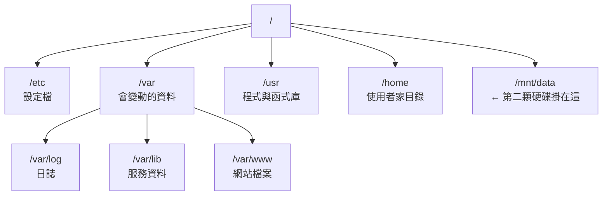

# 檔案系統與目錄結構

> [!abstract] 這篇你會學到
> - 理解 Linux「單一目錄樹」的設計，和 Windows 磁碟機代號的根本差異 ★★
> - 說得出 `/etc`、`/var`、`/usr`、`/opt`、`/srv` 各自的角色與界線 ★★★
> - **★★★★ 遇到任何服務都知道設定檔、資料、日誌分別去哪裡找** —— 這是排錯速度的分水嶺
> - **★★★★ 自己部署程式時知道該放哪個目錄**，而不是隨便丟在家目錄
> - 分清楚絕對路徑與相對路徑，以及 `.` `..` `~` `-` 四個特殊符號 ★★★

## 前置知識

- [[020-01-03-cmd-Linux-終端機與Shell入門]]

---

## 觀念說明

### ★★★ 一棵樹，不是很多顆磁碟機

Windows 是 `C:\`、`D:\`、`E:\` 各自獨立。Linux **只有一棵樹**，
根目錄是 `/`，所有磁碟、USB、網路磁碟都「掛載」到這棵樹的某個目錄上。



用 `df -h` 就能看到哪些目錄其實是不同的磁碟：

```bash
df -h
```

```
Filesystem      Size  Used Avail Use% Mounted on
/dev/sda2        50G   12G   36G  25% /
/dev/sda1       512M  6.2M  506M   2% /boot/efi          # ★★★ /boot 常因舊核心塞滿
/dev/sdb1       500G   89G  386G  19% /var/lib/mysql     # ★★★★ 獨立磁碟，/ 沒滿不代表它沒滿
tmpfs           1.9G     0  1.9G   0% /dev/shm
```

上面這台機器把資料庫資料放在獨立的 500G 磁碟，掛在 `/var/lib/mysql`。
對使用者來說完全無感——`cd /var/lib/mysql` 就進去了，
但實際上跨越了兩個實體磁碟。

> [!tip] 「磁碟滿了」不一定是同一顆磁碟滿了 ★★★★
> 看到 `No space left on device` 時，第一件事是 `df -h` 看**是哪個掛載點**滿了。★★★★
> `/` 滿和 `/var/lib/mysql` 滿，處理方式完全不同。

### ★★ 一切皆檔案

Linux 把幾乎所有東西都表現成檔案：硬碟是 `/dev/sda`、
記憶體資訊在 `/proc/meminfo`、CPU 溫度在 `/sys/class/thermal/...`。

```bash
cat /proc/meminfo | head -3
cat /proc/cpuinfo | grep "model name" | head -1
```

```
MemTotal:        1998764 kB
MemFree:         1421344 kB
MemAvailable:    1656892 kB
model name      : Intel(R) Core(TM) i7-1165G7 @ 2.80GHz
```

這個設計的好處是：**你只需要學會操作檔案的工具，就能操作整個系統**。
`cat`、`grep`、重導向這些工具可以用在任何地方。

`ls -l` 第一個字元就標示了檔案類型：

| 字元 | 類型 | 例子 |
| --- | --- | --- |
| `-` | ★ 一般檔案 | `/etc/passwd` |
| `d` | ★ 目錄 | `/etc` |
| `l` | ★★★ 符號連結（跟丟了就會找錯真實檔案） | `/bin -> usr/bin` |
| `c` | ★★ 字元裝置 | `/dev/tty`、`/dev/null` |
| `b` | ★★★★ 區塊裝置（**整顆磁碟本身**，寫錯目標等於毀資料） | `/dev/sda` |
| `s` | ★★★ socket（Nginx 502 常卡在這個檔案的權限） | `/run/php/php8.3-fpm.sock` |
| `p` | ★ 具名管線 | 少見 |

```bash
ls -l /dev/sda /dev/null /etc/passwd /etc /run/php/*.sock 2>/dev/null
```

```
brw-rw----  1 root disk    8,  0  8月 27 09:12 /dev/sda
crw-rw-rw-  1 root root    1,  3  8月 27 09:12 /dev/null
-rw-r--r--  1 root root      2891  8月 27 09:14 /etc/passwd
drwxr-xr-x  1 root root      4096  8月 27 09:14 /etc
srw-rw----  1 www-data www-data  0  8月 27 09:15 /run/php/php8.3-fpm.sock
```

> [!tip] 看到 `s` 開頭就知道是 Unix socket ★★★
> PHP-FPM、MySQL、Docker 都用 socket 檔案通訊。
> ★★★★ 排查「Nginx 連不到 PHP」時，先確認 socket 檔案存在且權限正確——
> 這是 502 錯誤最常見的原因之一，見 [[060-03-01-02-guide-PHP-FPM設定與Pool調校]]。

---

## 逐步說明：走一遍根目錄

```bash
ls -F /
```

```
bin@  boot/  dev/  etc/  home/  lib@  media/  mnt/  opt/  proc/
root/  run/  sbin@  srv/  sys/  tmp/  usr/  var/
```

`-F` 會在目錄後加 `/`、符號連結後加 `@`，一眼看出型態。★★

### ★★★★ 核心三大目錄

這三個是維運人員每天都會碰的：

#### ★★★★ `/etc` — 設定檔

**★★★★ 規則：這裡只放設定檔，不放資料、不放執行檔。**

```
/etc/
├── passwd, shadow, group      使用者與群組          ★★★★ shadow 外洩＝密碼雜湊外流
├── hosts, resolv.conf         主機名稱與 DNS        ★★★
├── fstab                      開機掛載表            ★★★★★ 寫錯會開不了機
├── crontab, cron.d/           系統排程              ★★
├── ssh/sshd_config            SSH 伺服器設定        ★★★★ 改壞會把自己鎖在門外
├── nginx/                     Nginx 設定            ★★★
├── systemd/system/            自訂 systemd 服務     ★★★
├── apt/sources.list.d/        套件庫來源            ★★★
└── ssl/certs/                 系統信任的憑證        ★★★★
```

> [!tip] `/etc` 應該納入版本控制 ★★★
> 這裡的每一個檔案都是「你對這台機器做過的決定」。
> 用 `etckeeper` 或手動 git init，改壞了可以立刻 diff 出來：
>
> ```bash
> sudo apt install -y etckeeper     # 自動把 /etc 納入 git
> cd /etc && sudo git log --oneline
> ```
>
> ★★★ 這在事後追查「誰改了什麼」時價值極高，機關稽核也用得上。

#### ★★★★ `/var` — 會變動的資料

**★★★ 規則：程式執行過程中會長大的東西都在這。**

| 目錄 | 內容 | 為什麼重要 |
| --- | --- | --- |
| `/var/log` | **系統與服務日誌** | ★★★★ 排錯第一站；也是最常塞爆磁碟的地方 |
| `/var/lib` | 服務的持久資料 | ★★★★★ MySQL 資料庫、Docker 映像、APT 套件狀態，**誤刪＝資料沒了** |
| `/var/www` | 網站檔案（Debian 系慣例） | ★★★ 網站根目錄預設位置 |
| `/var/cache` | 快取，刪掉可重建 | ★★ 空間不足時第一個可以清的地方 |
| `/var/spool` | 佇列（郵件、列印、cron） | ★ |
| `/var/tmp` | 暫存檔，**重開機保留** | ★★★ 和 `/tmp` 的差別在這 |
| `/var/backups` | 系統自動備份的設定檔 | ★★ Debian 系會自動備份 `/etc` 部分檔案 |

```bash
sudo du -sh /var/* 2>/dev/null | sort -rh | head -6
```

```
8.2G    /var/lib      # ★★★★ 服務資料，不可亂刪
3.1G    /var/log      # ★★★ 破 GB 就該檢查日誌輪替有沒有生效
890M    /var/cache    # ★★ 空間告急時第一個清這裡
124M    /var/www
12M     /var/backups
4.0K    /var/spool
```

> [!warning] `/var/log` 是最常見的「磁碟滿了」元凶 ★★★★
> 一個沒設定日誌輪替的服務可以在幾週內產生數十 GB 日誌。
> 每次遇到磁碟滿，先跑：
> ```bash
> sudo du -sh /var/log/* | sort -rh | head -10
> ```
> 輪替設定見 [[020-01-19-guide-Linux-日誌系統]]。

#### ★★★ `/usr` — 程式與函式庫

**★★★★ 規則：`/usr` 底下的東西由套件管理員管理，你不該手動改。**

| 目錄 | 內容 |
| --- | --- |
| `/usr/bin` | ★★ 一般使用者指令（`ls`、`grep`、`python3`） |
| `/usr/sbin` | ★★ 系統管理指令（`nginx`、`sshd`） |
| `/usr/lib` | ★★★ 函式庫與套件的輔助檔案（動到會拖垮一整批程式） |
| `/usr/share` | ★ 與架構無關的資料：文件、man 手冊、圖示 |
| `/usr/local` | ★★★★ **你自己編譯安裝的東西**，套件管理員不會碰 |
| `/usr/include` | ★ C 語言標頭檔（開發用） |

> [!tip] `/usr/local` 是你的地盤 ★★★
> 從原始碼編譯的軟體預設裝到 `/usr/local`，這是刻意的設計——
> 讓「套件管理員裝的」和「你手動裝的」分開，升級系統時不會互相打架。
>
> 自己寫的維運腳本放 `/usr/local/bin`，它預設就在 `$PATH` 裡：
> ```bash
> sudo install -m 755 backup.sh /usr/local/bin/backup   # ★★★ 755，不是 777
> backup    # ★★ 直接就能執行（/usr/local/bin 預設在 PATH）
> ```

### ★★ 已合併的 `/bin` `/sbin` `/lib`

在現代發行版上這三個都是符號連結：

```bash
ls -l /bin /sbin /lib
```

```
lrwxrwxrwx 1 root root 7 ... /bin -> usr/bin
lrwxrwxrwx 1 root root 8 ... /sbin -> usr/sbin
lrwxrwxrwx 1 root root 7 ... /lib -> usr/lib
```

這叫 **usr-merge**，Ubuntu 從 19.04、RHEL 從 7 就開始了。
歷史上 `/bin` 放開機必需的指令、`/usr/bin` 放其他，
現在因為 initramfs 的存在這個區分已無必要。

> [!tip] 這解釋了一個常見疑問 ★★
> 「為什麼 `/bin/ls` 和 `/usr/bin/ls` 是同一個檔案？」
> 因為 `/bin` 就是 `/usr/bin` 的連結。
> 腳本的 shebang 寫 `#!/bin/bash` 或 `#!/usr/bin/bash` 在現代系統上等價，
> ★★★ 但**寫 `#!/bin/bash` 相容性較好**（舊系統與其他 Unix）。
> 更好的寫法是 `#!/usr/bin/env bash`。

### ★★★ 使用者與服務資料

| 目錄 | 用途 | 注意 |
| --- | --- | --- |
| `/home/使用者` | 一般使用者家目錄 | ★★★ 大量使用者時常掛獨立磁碟 |
| `/root` | **root 的家目錄**（不在 `/home`） | ★★★★ 這樣單獨掛載 `/home` 時 root 仍能登入 |
| `/srv` | 「本機提供對外服務的資料」 | ★★ FHS 定義，但**實務上很多人用 `/var/www`** |
| `/opt` | 第三方大型軟體，自成一包 | ★★ 例如 `/opt/google/chrome` |

> [!tip] 部署網站該放 `/var/www` 還是 `/srv` 還是 `/opt`？ ★★★★
> 三者都合法，重點是**整個環境要一致**。實務建議：
>
> | 情境 | 建議位置 |
> | --- | --- |
> | Debian/Ubuntu + Nginx/Apache | ★★★★ `/var/www/<網域>`（跟隨發行版慣例） |
> | 自成一包的商業軟體 | ★★★ `/opt/<廠商>/<產品>` |
> | 從原始碼編譯的工具 | ★★★ `/usr/local` |
> | 多個獨立專案、想跟系統目錄分開 | ★★ `/srv/<專案>` |
>
> **★★★★★ 最糟的做法是放在 `/home/使用者/`**——
> 家目錄權限通常是 `750`，Nginx 的 `www-data` 讀不到，
> 然後你就會為了讓它能讀而把家目錄改成 `755`，等於把所有個人檔案攤開給整台機器上的每個帳號。

### ★★ 記憶體中的虛擬檔案系統

這些目錄**不在磁碟上**，是核心即時產生的：

| 目錄 | 內容 | 重開機後 |
| --- | --- | --- |
| `/proc` | ★★★ 程序與核心資訊 | 消失重建 |
| `/sys` | ★★ 硬體與核心參數 | 消失重建 |
| `/dev` | ★★★ 裝置檔案 | 消失重建 |
| `/run` | ★★★ 執行期資料（PID 檔、socket） | 清空 |
| `/tmp` | ★★★★ 暫存檔 | **通常會被清空** |

```bash
# ★★ 每個執行中的程序在 /proc 底下都有一個以 PID 命名的目錄
ls /proc/1/
cat /proc/1/comm          # ★★ PID 1 是什麼程式
cat /proc/uptime          # ★ 開機多久了（秒）
cat /proc/loadavg         # ★★★ 系統負載，前三個數字是 1/5/15 分鐘平均
```

```
systemd
125634.21 498212.55
0.52 0.48 0.44 2/312 8891
```

> [!warning] `/tmp` 和 `/var/tmp` 的差別很重要 ★★★★
> - ★★★★ `/tmp` — 重開機會清空，有些系統設成記憶體檔案系統（tmpfs），**大檔案會吃記憶體**
> - ★★★ `/var/tmp` — 重開機**保留**，適合放需要跨重啟的暫存資料
>
> ★★★★ 備份腳本把 20GB 的暫存檔寫進 `/tmp`，在 tmpfs 系統上會直接吃光記憶體。
> 用 `df -h /tmp` 確認它是不是 tmpfs。

> [!info]- Rocky / AlmaLinux（RHEL 系）對照 ★★★★
> 目錄結構大致相同，主要差異在**服務相關的慣例位置**：
>
> | 用途 | Debian / Ubuntu | RHEL 系 |
> | --- | --- | --- |
> | 網站根目錄 | `/var/www/html` | `/var/www/html`（相同） ★ |
> | Nginx 站台設定 | `/etc/nginx/sites-available/` + `sites-enabled/` | `/etc/nginx/conf.d/*.conf`（**沒有 sites-* 機制**） ★★★★ |
> | Apache 設定 | `/etc/apache2/`（`apache2.conf`） | `/etc/httpd/`（`httpd.conf`） ★★★ |
> | Apache 站台 | `/etc/apache2/sites-available/` | `/etc/httpd/conf.d/*.conf` ★★★ |
> | Web 執行帳號 | `www-data` | `nginx` 或 `apache` ★★★★ 權限設錯就 403 |
> | 服務名稱 | `apache2` | `httpd` ★★★ 照抄指令會 Unit not found |
> | 防火牆設定 | `/etc/ufw/` | `/etc/firewalld/` ★★★ |
> | 網路設定 | `/etc/netplan/` | `/etc/NetworkManager/` ★★★ |
>
> **★★★★ `sites-available` / `sites-enabled` 是 Debian 特有的設計**，
> RHEL 系直接把設定檔丟進 `conf.d/`，靠改副檔名或搬走來停用。
> 完整對照見 [[000-03-ref-索引-設定檔路徑速查]] 與 [[980-01-ref-附錄-Ubuntu與RHEL差異總表]]。

---

## 進階用法：路徑的寫法

### ★★★ 絕對路徑 vs 相對路徑

```bash
cd /var/log/nginx        # ★★★★ 絕對路徑：從 / 開始，在哪執行結果都一樣（腳本、cron 一律用這種）
cd nginx                 # ★★ 相對路徑：從目前目錄開始
```

四個特殊符號：

| 符號 | 意義 | 例子 |
| --- | --- | --- |
| `.` | ★★★ 目前目錄 | `./script.sh` |
| `..` | ★★ 上層目錄 | `cd ../..` |
| `~` | ★★★ **自己的**家目錄（**用 sudo 跑時是 root 的家**） | `cd ~/projects` |
| `~mike` | ★★ mike 的家目錄 | `ls ~mike` |
| `-` | ★★ **上一個所在目錄** | `cd -` |

```bash
cd /var/log
cd /etc/nginx
cd -              # ★★ 回到 /var/log
cd -              # ★★ 又回到 /etc/nginx
```

> [!tip] `cd -` 在兩個目錄間來回時超好用 ★★
> 改設定檔（`/etc/nginx`）和看日誌（`/var/log/nginx`）之間切換，
> `cd -` 一鍵來回，不用重打路徑。

> [!warning] 為什麼執行腳本要寫 `./script.sh` ★★★★
> ★★★★ 因為 `.`（目前目錄）**不在 `$PATH` 裡**，這是刻意的安全設計。
>
> 想像有人在 `/tmp` 放了一個叫 `ls` 的惡意腳本，
> 如果 `.` 在 `$PATH` 開頭，你 `cd /tmp && ls` 就中招了。
> 所以執行目前目錄的程式必須明確寫 `./`。
>
> **★★★★★ 永遠不要把 `.` 加進 `$PATH`。**

### ★★ 用 `readlink -f` 解出真實路徑

```bash
readlink -f /bin/sh
readlink -f ~/../mike/./projects
```

```
/usr/bin/dash
/home/mike/projects
```

> [!tip] 腳本中取得「腳本自己所在的目錄」 ★★★★
> 這是寫維運腳本時最常見的需求：
> ```bash
> SCRIPT_DIR="$(cd "$(dirname "${BASH_SOURCE[0]}")" && pwd)"   # ★★★★ 這行請整段照抄
> source "$SCRIPT_DIR/config.sh"
> ```
> ★★★★ 這樣不管從哪裡執行腳本（含 cron），它都能正確找到旁邊的設定檔。

### ★★ 拆解路徑

```bash
path=/var/log/nginx/access.log

dirname  "$path"      # ★★ /var/log/nginx
basename "$path"      # ★★ access.log
basename "$path" .log # ★★★ access —— 第二個參數是要砍掉的字尾
```

---

## 完整實戰範例：面對一個陌生服務，去哪裡找東西

假設你接手一台機器，上面跑著 Nginx，但你完全不知道它怎麼設定的。
用這個固定流程，五分鐘內就能摸清楚：

```bash
# ★★★ 1. 服務在跑嗎？主程式在哪？
systemctl status nginx
command -v nginx
```

```
● nginx.service - A high performance web server
     Loaded: loaded (/usr/lib/systemd/system/nginx.service; enabled)   # ★★★ enabled 才會開機自啟
     Active: active (running) since Wed 2026-08-27 09:12:03 CST
/usr/sbin/nginx
```

```bash
# ★★★★ 2. 設定檔在哪？（多數服務都支援 -t 或 -V 顯示設定路徑）
nginx -t
nginx -V 2>&1 | tr ' ' '\n' | grep -- --conf-path
```

```
nginx: configuration file /etc/nginx/nginx.conf test is successful   # ★★★★ 沒過就別 reload
--conf-path=/etc/nginx/nginx.conf
```

```bash
# ★★★ 3. 這個套件到底裝了哪些檔案？
dpkg -L nginx-core | grep -E '^/etc|^/var|^/usr/sbin'
```

```
/etc/nginx
/etc/nginx/nginx.conf
/etc/nginx/sites-available
/etc/logrotate.d/nginx
/usr/sbin/nginx
/var/log/nginx
```

```bash
# ★★★★ 4. 日誌在哪？
sudo ls -lh /var/log/nginx/
```

```
-rw-r----- 1 www-data adm  12M  8月 27 09:20 access.log   # ★★ 存取紀錄，長最快
-rw-r----- 1 www-data adm 245K  8月 27 09:18 error.log    # ★★★★ 排錯先看這支
```

```bash
# ★★★★ 5. 資料（網站檔案）在哪？從設定檔裡找 root
grep -rn "root " /etc/nginx/sites-enabled/
```

```
/etc/nginx/sites-enabled/example.com:12:    root /var/www/example.com/public;
```

```bash
# ★★★★ 6. 它開了哪些埠、用什麼身分跑？
sudo ss -tlnp | grep nginx
ps -eo user,comm | grep nginx
```

```
LISTEN 0 511 0.0.0.0:80   0.0.0.0:* users:(("nginx",pid=891,fd=6))   # ★★★★ 0.0.0.0 = 每張網卡都聽
LISTEN 0 511 0.0.0.0:443  0.0.0.0:* users:(("nginx",pid=891,fd=7))
root     nginx      # ★★★ master 用 root（才能綁 1024 以下的埠）
www-data nginx      # ★★★★ worker 用低權限帳號，檔案權限要對這個帳號設
```

> [!tip] 這個流程適用於任何服務 ★★★★
> **程式 → 設定 → 資料 → 日誌 → 埠與身分**，這五個問題問完，
> 你就掌握了一個服務。把它變成肌肉記憶。
>
> | 問題 | 工具 |
> | --- | --- |
> | 程式在哪 | ★★★ `command -v`、`systemctl status` |
> | 設定在哪 | ★★★★ `<程式> -t` / `-V`、`/etc/<服務名>/` |
> | 套件裝了什麼 | ★★★ `dpkg -L`（RHEL：`rpm -ql`） |
> | 資料在哪 | ★★★★ `/var/lib/<服務>`、設定檔裡的路徑 |
> | 日誌在哪 | ★★★★ `/var/log/<服務>/`、`journalctl -u <服務>` |
> | 埠與身分 | ★★★★ `ss -tlnp`、`ps -eo user,comm` |

> [!info]- Rocky / AlmaLinux（RHEL 系）對照
> ★★★ 第 3 步的套件查詢改用 `rpm`：
> ```bash
> rpm -ql nginx | grep -E '^/etc|^/var|^/usr/sbin'
> rpm -qf /etc/nginx/nginx.conf     # ★★★ 反查：這個檔案屬於哪個套件
> ```
> Debian 系的反查是 `dpkg -S /etc/nginx/nginx.conf`。

---

## 常見錯誤與排錯

| 現象 | 原因 | 解法 |
| --- | --- | --- |
| ★★★★ `No space left on device` 但 `du` 算起來沒滿 | 檔案被刪但程序仍持有，或 inode 用光 | `df -i` 查 inode；`sudo lsof +L1` 找被刪但仍開啟的檔案 |
| ★★★★ 清了 `/var/log` 空間卻沒釋放 | 日誌檔被服務開著，刪了但空間未回收 | 用 `truncate -s 0 檔案` 而不是 `rm`；或重啟服務 |
| ★★★★★ Nginx 讀不到家目錄下的網站檔案 | 家目錄權限 `750`，`www-data` 無權進入 | 把網站搬到 `/var/www`，不要放寬家目錄權限 |
| ★★★ 跟著教學找不到 `sites-available` | 那是 Debian 系特有，你在 RHEL 系 | RHEL 用 `/etc/nginx/conf.d/*.conf` |
| ★★ 腳本 `./script.sh` 說找不到 | 沒有執行權限，或不在目前目錄 | `chmod +x script.sh`；確認 `pwd` |
| ★★★ `command not found` 但檔案明明存在 | 該目錄不在 `$PATH` | 用完整路徑，或放到 `/usr/local/bin` |
| ★★★ 重開機後 `/tmp` 的檔案不見了 | 設計如此 | 需保留請用 `/var/tmp` |
| ★★★★ 系統升級後自己改的檔案被覆蓋 | 手動改了 `/usr` 底下的檔案 | 自訂內容放 `/usr/local` 或 `/etc` |

---

## 安全性注意事項

> [!danger] `/tmp` 是共用可寫目錄，有 sticky bit 保護 ★★★★★
> ```bash
> ls -ld /tmp
> drwxrwxrwt 15 root root 4096  8月 27 09:30 /tmp
> #        ^ ★★★★ 這個 t 就是 sticky bit，不見了代表任何人都能刪別人的檔
> ```
> `rwxrwxrwt` 代表**所有人都能寫**，但 `t`（sticky bit）限制
> **★★★★ 只有檔案擁有者才能刪除自己的檔案**。沒有這個 bit，任何人都能刪別人的暫存檔。
>
> ★★★★★ 腳本在 `/tmp` 建暫存檔時，**永遠用 `mktemp`** 而不是固定檔名：
> ```bash
> tmpfile=$(mktemp)                    # ★★★★★ 隨機檔名，權限 600
> trap 'rm -f "$tmpfile"' EXIT         # ★★★★ 離開時自動清理，異常中斷也會執行
> ```
> ★★★★★ 用固定檔名（如 `/tmp/mydata.tmp`）會有符號連結攻擊風險：
> 攻擊者事先建立 `/tmp/mydata.tmp -> /etc/passwd`，你的腳本就幫他覆寫系統檔案了。

> [!warning] 不要為了方便就 `chmod 777` ★★★★★
> 「權限有問題就 777」是最常見的壞習慣。`777` 代表**任何使用者都能讀寫執行**，
> ★★★★★ 在多人或有 Web 服務的機器上等於門戶大開 —— 任何被入侵的服務帳號都能改寫你的程式碼。
> 正確做法是搞清楚哪個帳號需要什麼權限，見 [[020-01-08-cmd-Linux-檔案權限與擁有者]]。

> [!tip] 幾個值得知道的敏感位置 ★★★★
> | 路徑 | 為什麼敏感 |
> | --- | --- |
> | `/etc/shadow` | ★★★★★ 密碼雜湊，權限應為 `640 root:shadow` |
> | `/root/.ssh/` | ★★★★★ root 的 SSH 金鑰 |
> | `/var/log/auth.log` | ★★★★ 登入紀錄（RHEL 為 `/var/log/secure`），是稽核軌跡 |
> | `/etc/sudoers` `/etc/sudoers.d/` | ★★★★★ 提權規則，改壞會鎖住所有人（一律用 `visudo`） |
> | `~/.bash_history` | ★★★ 可能包含誤打的密碼 |

---

## 速查表

### ★★★★ 主要目錄

| 目錄 | 用途 | 記憶點 |
| --- | --- | --- |
| `/etc` | ★★★★ 設定檔 | **只放設定** |
| `/var/log` | ★★★★ 日誌 | 排錯第一站 |
| `/var/lib` | ★★★★★ 服務持久資料 | 資料庫、Docker 都在這，**誤刪不可逆** |
| `/var/www` | ★★★ 網站檔案 | Debian 系慣例 |
| `/usr/bin` `/usr/sbin` | ★★★ 套件安裝的程式 | 別手動改 |
| `/usr/local` | ★★★★ **你手動裝的東西** | 自己的腳本放 `/usr/local/bin` |
| `/opt` | ★★ 第三方大型軟體 | 自成一包 |
| `/srv` | ★★ 對外服務資料 | FHS 定義，實務較少用 |
| `/home` `/root` | ★★★ 家目錄 | root 不在 `/home` |
| `/tmp` | ★★★★ 暫存，重開機清空 | 可能是 tmpfs |
| `/var/tmp` | ★★★ 暫存，**重開機保留** | 大檔案放這 |
| `/proc` `/sys` | ★★★ 核心與硬體資訊 | 虛擬，不佔磁碟 |
| `/dev` | ★★★★ 裝置檔案 | `/dev/null` `/dev/sda`，指錯目標會蓋掉整顆磁碟 |
| `/run` | ★★★ 執行期 PID 與 socket | 重開機清空 |
| `/boot` | ★★★★ 核心與開機載入器 | **空間常不足**，舊核心要清 |

### ★★★ 路徑符號

| 符號 | 意義 |
| --- | --- |
| `/` | ★★★★ 根目錄 |
| `.` | ★★★ 目前目錄（**不在 `$PATH` 裡**） |
| `..` | ★★ 上層目錄 |
| `~` | ★★★ 自己的家目錄（`sudo` 時是 root 的家） |
| `~user` | ★★ 某使用者的家目錄 |
| `-` | ★★ 上一個所在目錄（`cd -`） |

### ★★★★ 探索指令

| 指令 | 用途 |
| --- | --- |
| `ls -F /` | ★★ 列出根目錄，標示型態 |
| `df -h` | ★★★★ 各掛載點空間（磁碟滿了的第一支指令） |
| `df -i` | ★★★★ inode 使用量（空間還有但寫不進去時查這個） |
| `du -sh /var/*` | ★★★★ 各子目錄佔用大小 |
| `readlink -f <路徑>` | ★★★ 解出真實絕對路徑 |
| `dirname` / `basename` | ★★ 拆解路徑 |
| `dpkg -L <套件>` | ★★★ 套件裝了哪些檔案（RHEL：`rpm -ql`） |
| `dpkg -S <檔案>` | ★★★ 檔案屬於哪個套件（RHEL：`rpm -qf`） |

---

## 練習題

> [!question]- 練習 1：找出五個最佔空間的目錄
> 找出你機器上 `/` 底下最佔空間的五個目錄，並判斷哪些是可以安全清理的。
>
> **解答**
>
> ```bash
> sudo du -h --max-depth=1 / 2>/dev/null | sort -rh | head -6
> ```
>
> ```
> 12G     /
> 6.8G    /var    # ★★★★ 幾乎都是 /var，往下鑽就對了
> 3.2G    /usr
> 1.1G    /home
> 512M    /boot
> 89M     /etc
> ```
>
> 再往下鑽：
> ```bash
> sudo du -h --max-depth=1 /var | sort -rh | head -5
> ```
>
> **可以安全清理的**：
> - ★★ `/var/cache/apt` — `sudo apt clean`
> - ★★★ `/var/log` 的舊輪替檔 — `sudo journalctl --vacuum-time=7d`
> - ★★★ `/boot` 的舊核心 — `sudo apt autoremove --purge`（★★★★ 別把「正在用」的核心刪掉）
>
> **★★★★★ 不能亂刪的**：`/var/lib`（服務資料，刪了資料庫就沒了）、`/usr`（系統程式）。
>
> ★★ `2>/dev/null` 是為了濾掉 `/proc` 等目錄的權限錯誤訊息，見 [[020-01-11-cmd-Linux-輸入輸出重導向與管線]]。

> [!question]- 練習 2：把陌生服務摸清楚
> 在你的機器上挑一個已安裝的服務（`ssh`、`cron` 都可以），
> 用「程式 → 設定 → 資料 → 日誌 → 埠與身分」五步驟把它摸清楚。
>
> **解答（以 ssh 為例）**
>
> ```bash
> # ★★★ 程式
> command -v sshd                    # /usr/sbin/sshd
> systemctl status ssh
>
> # ★★★★ 設定
> ls /etc/ssh/                       # sshd_config, ssh_config, 主機金鑰
> sudo sshd -T | head                # ★★★★ 印出「實際生效」的完整設定
>
> # ★★★★★ 資料（私鑰在這，權限 600）
> ls -la ~/.ssh/                     # 使用者的金鑰與 known_hosts
>
> # ★★★★ 日誌
> sudo journalctl -u ssh --since today
> sudo tail /var/log/auth.log        # RHEL: /var/log/secure
>
> # 埠與身分
> sudo ss -tlnp | grep sshd
> ```
>
> ★★★★ `sshd -T` 特別值得記住：它印出**所有生效中的設定值**（含未寫在設定檔的預設值），
> 排查「我明明設了但沒生效」時最有用。

> [!question]- 練習 3：判斷該把東西放哪
> 下列各種東西，依 FHS 慣例應該放在哪個目錄？說明理由。
>
> 1. 你自己寫的每日備份腳本
> 2. 公司內部網站 `intranet.example.com` 的程式碼
> 3. 從原始碼編譯安裝的 `htop`
> 4. 廠商給的一包商業監控軟體（含自己的 bin、lib、conf）
> 5. Nginx 的 server block 設定
> 6. 一個 30GB 的資料庫還原用暫存檔
>
> **解答**
>
> | 東西 | 位置 | 理由 |
> | --- | --- | --- |
> | 1. 備份腳本 | `/usr/local/bin/backup` | ★★★ 預設在 `$PATH`，且不會被套件升級覆蓋 |
> | 2. 網站程式碼 | `/var/www/intranet.example.com` | ★★★★★ Debian 系網站慣例；**絕不要放家目錄** |
> | 3. 編譯的 htop | `/usr/local`（`./configure --prefix=/usr/local`） | ★★★ 與套件管理員裝的分開，避免衝突 |
> | 4. 商業軟體 | `/opt/<廠商>/<產品>` | ★★ 自成一包的第三方軟體的標準位置 |
> | 5. Nginx 設定 | `/etc/nginx/sites-available/`（RHEL：`/etc/nginx/conf.d/`） | ★★★ 設定檔一律在 `/etc` |
> | 6. 30GB 暫存檔 | `/var/tmp` 或專門的資料磁碟 | ★★★★ **不能用 `/tmp`**，可能是 tmpfs 會吃光記憶體；也要先 `df -h` 確認空間夠 |

---

## 小測驗

Q1. Linux 與 Windows 在磁碟組織上的根本差異是什麼？`df -h` 怎麼看出哪些目錄是不同磁碟？
Q2. `/etc`、`/var`、`/usr` 各放什麼？哪一個「不該手動改」？
Q3. `/tmp` 與 `/var/tmp` 的差別？30GB 暫存檔該放哪、為什麼？
Q4. 自己編譯的軟體、自己寫的維運腳本、廠商的商業軟體包各該放哪？
Q5. 為什麼網站程式碼不該放在 `/home/使用者/` 底下？
Q6. `/bin -> usr/bin` 這個符號連結叫什麼？對 shebang 的寫法有何影響？
Q7. 為什麼執行目前目錄的腳本要寫 `./script.sh`？把 `.` 加進 PATH 有什麼風險？
Q8. 「摸清陌生服務」的五個問題分別用什麼工具回答？
Q9. `ls -ld /tmp` 顯示 `drwxrwxrwt`，最後的 `t` 是什麼、防什麼？
Q10. 腳本在 `/tmp` 建暫存檔為什麼要用 `mktemp` 而不是固定檔名？

> [!question]- 測驗答案
> **Q1.** ★★★ Linux 只有一棵以 `/` 為根的目錄樹，磁碟是「掛載」上去的；`df -h` 的 `Mounted on` 欄位顯示每個掛載點對應的裝置（見「一棵樹，不是很多顆磁碟機」）。
> **Q2.** ★★★★ `/etc` 設定檔、`/var` 會變動的資料（日誌、資料庫、網站）、`/usr` 套件安裝的程式與函式庫；`/usr` 由套件管理員管理，手動改會在升級時被覆蓋。
> **Q3.** ★★★★ `/tmp` 重開機清空且可能是 tmpfs（吃記憶體）；`/var/tmp` 重開機保留。大檔放 `/var/tmp` 或專用資料磁碟 —— 寫進 tmpfs 的 30GB 會直接吃光記憶體，服務跟著被 OOM killer 砍掉。
> **Q4.** ★★★ `/usr/local`（`--prefix`）、`/usr/local/bin`、`/opt/<廠商>/<產品>`。
> **Q5.** ★★★★★ 家目錄通常 `750`，`www-data` 讀不到；為了讓它讀而改成 `755` 等於攤開所有個人檔案。
> **Q6.** ★★ usr-merge；`#!/bin/bash` 與 `#!/usr/bin/bash` 在現代系統等價，但 `#!/usr/bin/env bash` 相容性最好。
> **Q7.** ★★★★★ 因為 `.` 不在 PATH，這是刻意設計；若加入，攻擊者在 `/tmp` 放同名惡意程式（如 `ls`）你就會執行到它。
> **Q8.** ★★★★ 程式→`command -v`/`systemctl status`；設定→`<程式> -t`/`-V`；套件內容→`dpkg -L`/`rpm -ql`；日誌→`/var/log/`、`journalctl -u`；埠與身分→`ss -tlnp`、`ps -eo user,comm`。
> **Q9.** ★★★★ sticky bit；目錄所有人可寫時，限制只有檔案擁有者能刪除自己的檔案。
> **Q10.** ★★★★★ 固定檔名有符號連結攻擊風險：攻擊者先建 `/tmp/x -> /etc/passwd`，你的腳本就覆寫了系統檔。`mktemp` 產生隨機名稱且權限 600。

---

## 延伸閱讀

- ★★★★ [[020-01-05-cmd-Linux-路徑導覽與檔案操作]] — 學會在這棵樹上自由移動與整理檔案
- ★★★★ [[020-01-08-cmd-Linux-檔案權限與擁有者]] — 每個目錄的權限為什麼是那樣設計的
- ★★★★ [[020-01-15-cmd-Linux-磁碟分割與掛載]] — 掛載點、`fstab` 與新增磁碟
- ★★★ [[020-01-19-guide-Linux-日誌系統]] — `/var/log` 的輪替與管理
- ★★★ [[000-03-ref-索引-設定檔路徑速查]] — Ubuntu ⟷ RHEL 服務路徑對照
- ★★ `man 7 hier` — 系統內建的目錄結構說明，最權威的參考
