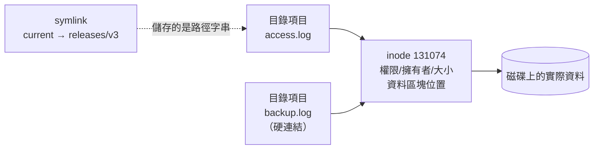

# 路徑導覽與檔案操作

> [!abstract] 這篇你會學到
> - ★★★ 逐欄讀懂 `ls -l` 的輸出，這是排錯時最常看的一行字
> - ★★★ 掌握 `cp` 與 `mv` 的**尾斜線陷阱**——這個坑幾乎每個人都踩過
> - **★★★★ 用 `rm -I`、`--dry-run`、先 `ls` 後 `rm` 三個習慣避開不可逆的災難** —— 本篇最會出事的一點
> - ★★★ 分清楚硬連結與符號連結，並學會用 `ln -sfn` 做**零停機部署切換**
> - ★ 學會幾個能省下大量打字的小技巧（大括號展開、`cd -`、`ls -ltr`）

## 前置知識

- [[020-01-04-cmd-Linux-檔案系統與目錄結構]]

---

## 觀念說明

### ★★★ 檔案不是「檔名」，而是 inode

Linux 的檔案系統裡，真正代表一個檔案的是 **inode**（索引節點），
它記錄了權限、擁有者、大小、時間戳記與資料在磁碟上的位置。
**檔名只是目錄裡的一筆「名字 → inode 編號」對照**。

```bash
ls -li /etc/hostname
```

```
131074 -rw-r--r-- 1 root root 6  8月 27 09:12 /etc/hostname
└──┬─┘
 inode 編號   ★★★ 這才是檔案的真身，檔名只是指向它的一張標籤
```

理解這件事，下面三個常見疑惑就通了：

| 疑惑 | 解答 |
| --- | --- |
| ★★ 為什麼 `mv` 在同一磁碟上是瞬間完成？ | 只改了目錄裡的名字對照，資料完全沒動 |
| ★★★★ 為什麼刪掉日誌檔空間沒釋放？ | inode 還被程序開著，`link count` 沒歸零 |
| ★★ 硬連結是什麼？ | 兩個檔名指向**同一個 inode** |



---

## 基礎操作

### ★ `pwd` 與 `cd`：我在哪、我要去哪

```bash
pwd                 # 目前目錄
cd /var/log         # 絕對路徑
cd nginx            # 相對路徑
cd ..               # ★ 上一層
cd                  # 回家目錄（等同 cd ~）
cd -                # ★★ 回到「上一個」目錄，改設定與看日誌來回跳最省事
cd ~mike            # 到 mike 的家目錄
```

> [!tip] `cd -` 是最被低估的指令 ★★
> 在「改設定」和「看日誌」之間來回時：
> ```bash
> cd /etc/nginx/sites-available
> cd /var/log/nginx
> cd -    # 回 /etc/nginx/sites-available
> cd -    # 又回 /var/log/nginx
> ```
> 兩個目錄之間切換完全不用重打路徑。

> [!tip] `pushd` / `popd`：多層目錄堆疊 ★
> 需要在三個以上目錄間跳時，用目錄堆疊：
> ```bash
> pushd /etc/nginx      # 進去，並把原目錄推入堆疊
> pushd /var/www        # 再進去
> dirs -v               # 看堆疊
> popd                  # 回到上一個
> ```

### ★★★ `ls`：逐欄讀懂輸出

```bash
ls -lh /var/log/nginx/
```

```
total 13M
-rw-r----- 1 www-data adm   12M  8月 27 09:20 access.log
-rw-r----- 1 www-data adm  245K  8月 27 09:18 error.log
drwxr-xr-x 2 root     root 4.0K  8月 20 03:15 archive
lrwxrwxrwx 1 root     root   11  8月 27 09:00 latest -> access.log
```

拆解第一行：

```
-rw-r----- 1 www-data adm 12M 8月 27 09:20 access.log
│└──┬───┘  │ └───┬──┘ └┬┘ └┬┘ └────┬────┘ └────┬────┘
│   │      │     │     │   │       │           └─ 檔名
│   │      │     │     │   │       └───────────── 最後修改時間
│   │      │     │     │   └───────────────────── 大小（-h 後為易讀格式）
│   │      │     │     └───────────────────────── 所屬群組
│   │      │     └─────────────────────────────── 擁有者
│   │      └───────────────────────────────────── 硬連結數（目錄為子目錄數+2）
│   └──────────────────────────────────────────── 權限（見 08 篇）  ★★★ 排錯第一眼先看這一欄
└──────────────────────────────────────────────── 檔案類型
```

**最常用的選項組合**：

| 指令 | 用途 |
| --- | --- |
| `ls -lh` | ★★ 長格式 + 易讀大小 |
| `ls -la` | ★★ 含隱藏檔（`.env`、`.htaccess` 這類只有 `-a` 才看得到） |
| `ls -ltr` | ★★★ **依時間排序，最新的在最下面** ← 看日誌目錄必用 |
| `ls -lSr` | ★★ 依大小排序，最大的在最下面 |
| `ls -ld <目錄>` | ★★★ 看**目錄本身**的權限，不是列出內容 |
| `ls -li` | ★★ 顯示 inode 編號 |
| `ls -d */` | ★ **只列出目錄** |
| `ls -lR` | ★ 遞迴列出 |

```bash
# ★★★ 找出最近被改動的檔案（排查「是誰動了什麼」時很有用）
ls -ltr /etc/nginx/sites-available/
```

```
-rw-r--r-- 1 root root  1.2K  8月 10 14:22 default
-rw-r--r-- 1 root root  2.4K  8月 25 16:41 example.com
-rw-r--r-- 1 root root  2.5K  8月 27 09:33 api.example.com    ← 最新
```

> [!tip] `ls -ld` 和 `ls -l` 的差別很重要 ★★★
> ```bash
> ls -l /var/www      # ★ 列出 /var/www 裡面有什麼
> ls -ld /var/www     # ★★★ 看 /var/www 這個目錄本身的權限
> ```
> ★★★ 排查「Nginx 讀不到檔案」時，要看的是**路徑上每一層目錄**的權限，
> 這時 `-d` 是必須的：
> ```bash
> ls -ld / /var /var/www /var/www/example.com
> ```

> [!warning] 不要 parse `ls` 的輸出 ★★★
> 腳本裡寫 `for f in $(ls)` 遇到含空白的檔名就會爆掉。
> 用 glob 或 `find`：
> ```bash
> for f in *.log; do ... done              # ✓ ★★ glob 不會被空白拆開
> find . -name '*.log' -print0 | xargs -0  # ✓ ★★★ 處理特殊字元最安全
> ```

### ★★ `mkdir`：建立目錄

```bash
mkdir logs                          # 建一層
mkdir -p /var/www/example.com/public  # ★★★ -p 一次建多層，已存在也不報錯
mkdir -m 750 secure                 # ★★★ 建立時就指定權限，避免先 777 再補救的空窗
```

> [!tip] `-p` 的兩個好處 ★★★
> 1. 一次建立整條路徑，不用一層一層建
> 2. **目錄已存在時不會報錯**——這讓腳本可以重複執行而不失敗（冪等性）
>
> ```bash
> mkdir -p "$BACKUP_DIR"    # ★★★ 腳本裡永遠這樣寫
> ```

搭配大括號展開，一行建好整個專案結構：

```bash
mkdir -p myapp/{src,tests,docs,config/{dev,prod}}
tree myapp
```

```
myapp
├── config
│   ├── dev
│   └── prod
├── docs
├── src
└── tests
```

> [!tip] 沒有 `tree` 就裝一個 ★
> ```bash
> sudo apt install -y tree
> tree -L 2 /etc/nginx      # 只看兩層
> tree -d /var/www          # 只看目錄
> ```

### ★ `touch`：建立空檔案與修改時間戳記

```bash
touch newfile.txt              # ★★ 不存在就建立空檔，存在則更新時間為現在
touch -t 202601011200 old.txt  # 指定時間戳記
touch -r ref.txt target.txt    # 把 target 的時間設成和 ref 一樣
```

> [!tip] `touch` 常見的兩個實務用途 ★★
> 1. **建立旗標檔**：`touch /var/run/myapp.lock` 表示某件事已完成
> 2. **強制重新建置**：Makefile 或建置系統依時間判斷是否要重編，
>    `touch` 一下就能強制觸發

### ★★★ `cp`：複製

```bash
cp file.txt backup.txt              # 複製檔案
cp file.txt /tmp/                   # 複製到目錄
cp -r src/ dest/                    # -r 遞迴複製目錄
cp -a src/ dest/                    # ★★★ -a 保留所有屬性（備份一律用這個）
cp -i file.txt dest.txt             # 覆蓋前確認
cp -n file.txt dest.txt             # ★★ 目標存在就不覆蓋
cp -u src.txt dest.txt              # 只在來源較新時才複製
cp -v file.txt dest.txt             # 顯示做了什麼
```

★★★★ **`-a` 是備份時的正確選擇**，它等於 `-dR --preserve=all`：
保留權限、擁有者、時間戳記、符號連結、ACL、SELinux 標籤。

```bash
# ✗ ★★★★ 權限與擁有者都變成執行者的，時間戳記變成現在（還原後服務起不來就是這樣來的）
cp -r /var/www /backup/www

# ✓ ★★★ 完整保留
sudo cp -a /var/www /backup/www
```

> [!danger] 尾斜線陷阱：`src` 和 `src/` 不一樣 ★★★
> 這是最常踩的坑，`cp` 和 `rsync` 的行為還不一樣：
>
> ```bash
> # 假設 dest/ 已存在
> cp -a src  dest/     # → 產生 dest/src/...   （把 src 這個目錄放進去）
> cp -a src/ dest/     # → 產生 dest/src/...   （cp 的行為相同）
>
> rsync -a src  dest/  # → 產生 dest/src/...
> rsync -a src/ dest/  # → 產生 dest/...       （★★★ 只把「內容」放進去！）
> ```
>
> ★★★ **`rsync` 的尾斜線代表「只要裡面的內容」**，`cp` 則沒有這個區別。
> 混用兩個工具時特別容易搞錯，見 [[060-01-06-02-guide-rsync-同步與備份]]。
>
> ★★★ 保險做法：執行前先加 `--dry-run`（rsync）或先用 `echo` 看清楚。

> [!tip] 改設定檔前先備份的最短寫法 ★★★
> ```bash
> sudo cp -a /etc/nginx/nginx.conf{,.bak-$(date +%F)}
> ```
> 大括號展開會變成：
> ```bash
> sudo cp -a /etc/nginx/nginx.conf /etc/nginx/nginx.conf.bak-2026-08-27
> ```
> ★★★ 這個 `{,.bak}` 寫法值得記起來，改設定檔前打一次，省下無數麻煩。

### ★★★ `mv`：移動與改名

`mv` 同時是「移動」和「改名」——因為對系統來說它們是同一件事
（改變目錄裡的名字對照）。

```bash
mv old.txt new.txt                  # 改名
mv file.txt /var/tmp/               # 移動
mv -i file.txt dest.txt             # ★★★ 覆蓋前確認
mv -n file.txt dest.txt             # 不覆蓋
mv *.log archive/                   # 批次移動
```

> [!warning] ★★★★ `mv` 預設會直接覆蓋，沒有任何提示
> ```bash
> mv a.txt b.txt      # ★★★★ 如果 b.txt 存在，它就沒了，不會問你
> ```
> 建議在 `~/.bashrc` 設 `alias mv='mv -i'`，
> 但記住 ★★★★ **別名不會在腳本與 sudo 中生效**，所以別名只是方便、不是安全機制（見 [[020-01-03-cmd-Linux-終端機與Shell入門]]）。

> [!tip] 同磁碟瞬間完成，跨磁碟則是複製後刪除 ★★★
> ```bash
> mv /var/log/big.log /var/log/archive/    # 同一檔案系統 → 瞬間
> mv /var/log/big.log /mnt/backup/         # ★★★ 跨檔案系統 → 實際複製，很慢
> ```
> 這解釋了為什麼有時 `mv` 一個 50GB 檔案要跑好幾分鐘，
> ★★★ 而且中途中斷會留下不完整的檔案。跨磁碟搬大檔建議用 `rsync` 並加 `--remove-source-files`，
> 至少能續傳。

### ★★★★ `rm`：刪除（不可逆）

```bash
rm file.txt                # 刪檔案
rm -r dir/                 # ★★★★ 遞迴刪目錄，打錯路徑就是災難
rm -f file.txt             # ★★★ 強制，不存在也不報錯（連同確認一起關掉）
rm -I *.log                # ★★★ 超過 3 個檔案時確認一次（比 -i 實用）
rm -v file.txt             # 顯示刪了什麼
rm -- -weird-name          # 刪除以 - 開頭的檔名
```

> [!danger] ★★★★★ Linux 沒有資源回收筒
> `rm` 就是刪掉。沒有 Ctrl+Z、沒有還原、沒有「你確定嗎」（除非你加 `-i`）。
>
> ★★★★★ **三個保命習慣**：
>
> 1. ★★★★ **先 `ls` 再 `rm`**：把要刪的條件先用 `ls` 跑一次，確認清單正確
>    ```bash
>    ls  /var/log/*.gz          # ★★★ 先看
>    rm  /var/log/*.gz          # 確認無誤才刪
>    ```
>
> 2. ★★★★ **`find` 刪除前先 `-print`**
>    ```bash
>    find /tmp -mtime +30 -type f -print       # ★★★ 先看會刪什麼
>    find /tmp -mtime +30 -type f -delete      # 確認後才加 -delete
>    ```
>
> 3. ★★★★★ **變數路徑一定要防呆**
>    ```bash
>    rm -rf "$DIR"/*        # ✗ ★★★★★ 若 $DIR 未定義 → rm -rf /*
>    rm -rf "${DIR:?DIR 未設定}"/*   # ✓ ★★★★★ 未定義就報錯中止
>    ```
>    `${VAR:?訊息}` 是 Shell 內建的防呆語法，見 [[020-01-22-guide-Linux-Shell腳本進階]]。

> [!warning] ★★★★ `rm` 刪不掉空間沒釋放的情況
> 如果一個檔案正被程序開著，`rm` 只會移除目錄裡的名字，
> ★★★★ **磁碟空間要等程序關閉檔案才會釋放** —— 磁碟繼續滿著，服務照樣寫不進去。
>
> 這在清理大日誌時很常見。正確做法是清空而不是刪除：
> ```bash
> sudo truncate -s 0 /var/log/nginx/access.log    # ✓ ★★★ 立即釋放空間
> # 而不是
> sudo rm /var/log/nginx/access.log               # ✗ ★★★ 空間不會釋放，還會讓服務寫入失敗
> ```
> 找出這種檔案：`sudo lsof +L1`

> [!tip] 想要「資源回收筒」的話 ★
> ```bash
> sudo apt install -y trash-cli
> trash-put file.txt      # 丟到回收筒
> trash-list              # 看回收筒
> trash-restore           # 還原
> ```
> 個人工作站可以考慮 `alias rm='trash-put'`，
> 但 ★★★ **伺服器上不建議**——會讓你養成依賴，而在沒有 trash-cli 的機器上出事。

### ★★★ `ln`：連結

```bash
ln target link_name          # 硬連結
ln -s target link_name       # 符號連結（軟連結）
ln -sf target link_name      # 強制覆蓋既有連結
ln -sfn target link_dir      # ★★★★ 覆蓋指向目錄的連結（-n 很重要，見下方）
```

| | 硬連結 | 符號連結 |
| --- | --- | --- |
| ★★★ 本質 | 同一個 inode 的另一個名字 | 一個存著「路徑字串」的特殊檔案 |
| ★★★ 跨檔案系統 | ❌ 不行 | ✅ 可以 |
| ★★★ 連結目錄 | ❌ 不行 | ✅ 可以 |
| ★★★ 原檔刪除後 | 仍可用（inode 還在） | **失效**（dangling link） |
| ★★ `ls -l` 顯示 | 看不出來（只有連結數 >1） | `link -> target` |

```bash
echo "hello" > original.txt
ln original.txt hard.txt
ln -s original.txt soft.txt
ls -li
```

```
131080 -rw-r--r-- 2 mike mike 6  8月 27 10:02 hard.txt
131080 -rw-r--r-- 2 mike mike 6  8月 27 10:02 original.txt
131081 lrwxrwxrwx 1 mike mike 12 8月 27 10:02 soft.txt -> original.txt
```

★★★ 注意 `hard.txt` 和 `original.txt` 的 **inode 相同（131080）**，連結數是 **2**。

```bash
rm original.txt
cat hard.txt      # ✓ ★★★ 還讀得到（inode 沒被回收）
cat soft.txt      # ✗ ★★★ No such file or directory（dangling link）
```

> [!warning] ★★★ 符號連結的相對路徑是相對於「連結所在的位置」
> ```bash
> cd /var/www
> ln -s ../data/uploads uploads     # 指向 /var/data/uploads
> ```
> 這是相對於 `/var/www`，不是相對於你執行指令時的目錄。
> 搬動連結檔案時相對連結會跟著改變意義。
>
> ★★★ **不確定的時候用絕對路徑**：
> ```bash
> ln -s /var/data/uploads /var/www/uploads
> ```
> ★★★ 用 `readlink -f` 確認連結最終指向哪：
> ```bash
> readlink -f /var/www/uploads
> ```

---

## 完整實戰範例：用符號連結做零停機部署

這是符號連結最有價值的實務用法，Laravel、Capistrano、Deployer
等部署工具的核心機制都是這個。

### ★★ 目錄結構

```
/var/www/example.com/
├── releases/
│   ├── 2026-08-20-141203/
│   ├── 2026-08-25-093311/
│   └── 2026-08-27-101542/     ← 新版本
├── shared/                     ← 跨版本共用（上傳檔、.env、日誌）
│   ├── storage/
│   └── .env
└── current -> releases/2026-08-27-101542    ← ★★★ Nginx 指向這裡，整個切換就靠這條連結
```

Nginx 設定永遠指向 `current`：

```nginx
root /var/www/example.com/current/public;
```

### ★★★ 部署腳本

```bash
#!/usr/bin/env bash
set -euo pipefail

APP_DIR="/var/www/example.com"
RELEASE="$APP_DIR/releases/$(date +%Y-%m-%d-%H%M%S)"
KEEP=5      # ★★★ 保留最近 5 個版本，太少會沒得回滾

echo "==> 建立新版本目錄：$RELEASE"
mkdir -p "$RELEASE"

echo "==> 取得程式碼"
git clone --depth 1 git@github.com:example/app.git "$RELEASE"

echo "==> 連結共用資源"
rm -rf "$RELEASE/storage"
ln -s "$APP_DIR/shared/storage" "$RELEASE/storage"
ln -s "$APP_DIR/shared/.env"    "$RELEASE/.env"

echo "==> 安裝相依套件與建置"
cd "$RELEASE"
composer install --no-dev --optimize-autoloader --no-interaction

echo "==> 切換 current（★★★★ 這一步是原子操作，也是唯一會影響線上的一步）"
ln -sfn "$RELEASE" "$APP_DIR/current"

echo "==> 重載服務"
sudo systemctl reload php8.3-fpm
sudo systemctl reload nginx

echo "==> 清理舊版本，只保留最近 $KEEP 個"
cd "$APP_DIR/releases"
ls -1dt */ | tail -n "+$((KEEP+1))" | xargs -r rm -rf   # ★★★★ 這行會 rm -rf，改動前先把 xargs 前面截掉跑一次看清單

echo "==> 完成：$(readlink -f "$APP_DIR/current")"
```

★★★ 回滾只要把連結指回去（這就是保留舊版本的意義）：

```bash
ln -sfn /var/www/example.com/releases/2026-08-25-093311 /var/www/example.com/current
sudo systemctl reload php8.3-fpm
```

> [!tip] ★★★★ `ln -sfn` 的 `-n` 為什麼不能少
> 這是這個技巧的關鍵細節。當 `current` **已經是一個指向目錄的符號連結**時：
>
> ```bash
> ln -sf  new_release current    # ✗ ★★★ 會在 current/ 裡面建一個叫 new_release 的連結！
> ln -sfn new_release current    # ✓ ★★★ 正確覆蓋 current 本身
> ```
>
> `-n`（`--no-dereference`）告訴 `ln`：把 `current` 當成一個檔案來覆蓋，
> 不要順著它進到目錄裡。少了 `-n`，你的部署會產生
> `current/releases/2026-08-27-101542` 這種莫名其妙的結構。
>
> ★★★★ **這個坑非常隱蔽**，因為第一次部署（`current` 還不存在）時是正常的，
> 第二次才會出錯。

> [!tip] 為什麼說切換是「原子操作」★★★
> `ln -sfn` 底層用 `rename()` 系統呼叫替換連結，
> 對正在讀取的程序來說，★★★ **要嘛看到舊的、要嘛看到新的，不會看到中間狀態**。
> 相較之下「先刪除舊連結再建新的」中間有幾毫秒的空窗，
> 那期間進來的請求會看到 404。

---

## 常見錯誤與排錯

| 現象 | 原因 | 解法 |
| --- | --- | --- |
| ★★ `rm: cannot remove 'x': Is a directory` | 刪目錄要加 `-r` | `rm -r x`（先 `ls -R x` 確認內容） |
| ★★ `cp: omitting directory 'src'` | 複製目錄要加 `-r` | `cp -a src dest` |
| ★★★★ `mv` 之後檔案不見了 | 目標已存在被直接覆蓋 | 用 `-i` 或 `-n`；重要操作先備份 |
| ★★★ `rsync` 複製結果多了一層目錄 | 來源少了尾斜線 | `rsync -a src/ dest/`（注意 `src/`） |
| ★★★★ 部署後出現 `current/releases/...` 怪結構 | `ln -sf` 少了 `-n` | 一律用 `ln -sfn` |
| ★★★ 符號連結顯示紅色、`cat` 說找不到 | dangling link，目標已刪或路徑錯 | `readlink -f` 看它指向哪；用絕對路徑重建 |
| ★★★★ 刪了大日誌但 `df` 沒變 | 檔案仍被程序開著 | `truncate -s 0` 而非 `rm`；`lsof +L1` 找出來 |
| ★★★★ `cp` 後權限與擁有者跑掉 | 沒用 `-a` | 備份一律 `cp -a` |
| ★★★ 檔名含空白，指令只處理到一半 | 沒加引號 | `"$file"`；`find -print0 \| xargs -0` |
| ★★ `ls` 出現 `?????` 或亂碼檔名 | 編碼問題或含控制字元 | `ls -b` 顯示跳脫字元；用 inode 刪：`find . -inum <編號> -delete` |
| ★ 無法刪除以 `-` 開頭的檔案 | 被當成選項 | `rm -- -filename` 或 `rm ./-filename` |

---

## 安全性注意事項

> [!danger] ★★★★★ 三個真的會出事的指令
> ```bash
> rm -rf /              # ★★★ 現代 rm 有 --preserve-root 保護，但別試
> rm -rf $UNDEFINED/*   # ★★★★★ 變數未定義 → rm -rf /*  ← 這個沒有保護
> chmod -R 777 /        # ★★★★★ 系統直接壞掉，sudo/sshd 會拒絕啟動，且很難修回來
> ```
> ★★★★★ 第二個是實務上真正發生過的災難來源。防護方式：
> 腳本開頭寫 `set -u`，路徑用 `"${VAR:?}"`。

> [!warning] ★★★★★ 複製時注意權限與擁有者的洩漏
> ```bash
> sudo cp -a /home/mike/.ssh /backup/     # ★★★★★ 私鑰跟著複製到別處，等於多一份外洩風險
> ```
> ★★★★★ 備份包含私鑰、`.env`、憑證的目錄時，要確認**備份目的地的權限也是嚴格的**，
> 否則等於把機密複製到一個大家都讀得到的地方。見 [[090-03-03-guide-應用安全-機密管理與金鑰保護]]。

> [!warning] ★★★★ 符號連結攻擊
> 在共用可寫目錄（如 `/tmp`）中，攻擊者可以預先建立
> `/tmp/yourapp.tmp -> /etc/passwd`。你的腳本如果用固定檔名寫入，
> ★★★ 就會以你的權限覆寫系統檔案（腳本用 root 跑時就是提權）。
>
> ★★★ 永遠用 `mktemp`：
> ```bash
> tmp=$(mktemp)
> trap 'rm -f "$tmp"' EXIT
> ```

---

## 速查表

### 導覽

| 指令 | 說明 |
| --- | --- |
| ★ `pwd` | 目前目錄 |
| ★★ `cd <路徑>` / `cd` / `cd -` | 切換 / 回家 / 回上一個目錄 |
| ★ `pushd` / `popd` / `dirs -v` | 目錄堆疊 |

### 檢視

| 指令 | 說明 |
| --- | --- |
| ★★ `ls -lh` | 長格式 + 易讀大小 |
| ★★ `ls -la` | 含隱藏檔 |
| ★★★ `ls -ltr` | **依時間排序，最新在最下** |
| ★★★ `ls -ld <目錄>` | 目錄**本身**的資訊 |
| ★★ `ls -li` | 顯示 inode |
| ★ `ls -d */` | 只列目錄 |
| ★ `tree -L 2` | 樹狀顯示兩層 |

### 建立

| 指令 | 說明 |
| --- | --- |
| ★★★ `mkdir -p a/b/c` | 建立多層，已存在不報錯 |
| ★★★ `mkdir -m 750 x` | 建立時指定權限 |
| ★★ `mkdir -p app/{src,docs}` | 大括號展開 |
| ★ `touch f` | 建空檔 / 更新時間 |

### 複製移動刪除

| 指令 | 說明 |
| --- | --- |
| ★★★ `cp -a src dest` | **保留所有屬性**（備份用） |
| ★★★ `cp -r` / `-i` / `-n` / `-u` / `-v` | 遞迴 / 確認 / 不覆蓋 / 較新才複製 / 顯示 |
| ★★★ `cp file{,.bak}` | **快速備份**（大括號展開） |
| ★★★ `mv src dest` | 移動或改名（預設直接覆蓋，不會問） |
| ★★★★ `rm -I *.log` | 超過 3 個才確認（比 `-i` 實用） |
| ★ `rm -- -file` | 刪除 `-` 開頭的檔名 |
| ★★★★ `truncate -s 0 f` | **清空**檔案（釋放空間，不刪 inode） |

### 連結

| 指令 | 說明 |
| --- | --- |
| ★★ `ln t l` | 硬連結（同 inode） |
| ★★★ `ln -s t l` | 符號連結 |
| ★★★★ `ln -sfn t d` | **覆蓋目錄連結**（部署切換必用 `-n`） |
| ★★★ `readlink -f l` | 解出最終真實路徑 |
| ★★★ `lsof +L1` | 找出已刪除但仍被開啟的檔案 |

---

## 練習題

> [!question]- 練習 1：尾斜線的差別
> 準備測試環境：
> ```bash
> mkdir -p /tmp/lab/{src,dest}
> touch /tmp/lab/src/{a,b}.txt
> ```
> 分別執行下面四個指令（每次先清空 `dest`），觀察結果差異：
> ```bash
> cp -a    /tmp/lab/src  /tmp/lab/dest/
> cp -a    /tmp/lab/src/ /tmp/lab/dest/
> rsync -a /tmp/lab/src  /tmp/lab/dest/
> rsync -a /tmp/lab/src/ /tmp/lab/dest/
> ```
>
> **解答**
>
> ```
> cp -a src  dest/    → dest/src/a.txt  dest/src/b.txt
> cp -a src/ dest/    → dest/src/a.txt  dest/src/b.txt    （cp 兩者相同）
> rsync -a src  dest/ → dest/src/a.txt  dest/src/b.txt
> rsync -a src/ dest/ → dest/a.txt      dest/b.txt        （★ 只有內容！）
> ```
>
> ★★★ **只有 `rsync` 的尾斜線有意義**。這是備份腳本最常見的 bug 來源——
> 少一個斜線，備份就多包了一層目錄，還原時路徑全錯。
>
> ★★★ 保險做法：`rsync` 一律先加 `--dry-run` 跑一次確認。

> [!question]- 練習 2：模擬「刪了日誌但空間沒釋放」
> ```bash
> # 終端機 A：模擬一個持續寫入日誌的服務
> cd /tmp && yes "log line" > big.log &
> sleep 3 && kill %1 2>/dev/null   # 讓它長到幾百 MB 就好
> tail -f /tmp/big.log             # 保持開著，模擬服務持有檔案
>
> # 終端機 B
> df -h /tmp
> rm /tmp/big.log
> df -h /tmp        # 空間有釋放嗎？
> sudo lsof +L1 | grep big.log
> ```
>
> **解答**
>
> `rm` 之後 `df` 顯示的可用空間**不會增加**，因為 `tail -f` 還開著這個檔案。
> `lsof +L1` 會列出它（`L1` 代表 link count 小於 1，也就是已被刪除）：
>
> ```
> tail  8912  mike  3r  REG  8,2  524288000  131099 /tmp/big.log (deleted)
> ```
>
> ★★★ 關掉 `tail`（`Ctrl+C`）後空間才釋放 —— 在正式機上，這代表磁碟會一直滿著。
>
> ★★★★ **實務教訓**：清理服務日誌時不要 `rm`，要用
> ```bash
> sudo truncate -s 0 /var/log/nginx/access.log
> ```
> 或者透過 `logrotate` 處理（見 [[020-01-19-guide-Linux-日誌系統]]），
> 因為 `logrotate` 會通知服務重新開啟日誌檔案。

> [!question]- 練習 3：實作零停機切換
> 建立下面的結構，寫一個 `deploy.sh` 切換到新版本，
> 再寫一個 `rollback.sh` 回到上一版。
> ```bash
> mkdir -p /tmp/app/releases/{v1,v2}
> echo "version 1" > /tmp/app/releases/v1/index.html
> echo "version 2" > /tmp/app/releases/v2/index.html
> ln -s /tmp/app/releases/v1 /tmp/app/current
> ```
>
> **解答**
>
> ```bash
> # 切換到 v2
> ln -sfn /tmp/app/releases/v2 /tmp/app/current
> cat /tmp/app/current/index.html      # version 2
>
> # 回滾到 v1
> ln -sfn /tmp/app/releases/v1 /tmp/app/current
> cat /tmp/app/current/index.html      # version 1
> ```
>
> ★★★★ **驗證 `-n` 的重要性**——故意漏掉試試：
> ```bash
> ln -sf /tmp/app/releases/v2 /tmp/app/current
> ls -l /tmp/app/current/
> ```
> 你會看到 `current` 目錄裡多了一個 `v2` 連結，
> 而 `current` 本身還指著 `v1`。★★★★ 這就是少了 `-n` 的後果：你以為上線了，其實線上還是舊版。
>
> 更完整的部署流程見 [[130-01-04-04-guide-Laravel-快取最佳化與部署流程]] 與 [[130-01-06-guide-部署-部署自動化]]。

---

## 小測驗

Q1. 什麼是 inode？為什麼同磁碟 `mv` 是瞬間完成、跨磁碟卻很慢？
Q2. `ls -l` 第二欄的數字對檔案和對目錄各代表什麼？
Q3. `ls -l /var/www` 與 `ls -ld /var/www` 的差別？排查「Nginx 讀不到」時該用哪個？
Q4. `cp -a src dest/` 與 `rsync -a src/ dest/`（注意斜線）產生的結構有何不同？
Q5. `cp -r` 備份會遺失什麼？備份該用哪個選項？
Q6. `cp /etc/nginx/nginx.conf{,.bak}` 展開後是什麼？
Q7. 刪了 6GB 日誌 `df` 卻沒變，原因與正確做法？
Q8. 硬連結與符號連結各自在原檔刪除後會怎樣？哪一種能跨檔案系統？
Q9. 部署切換 `ln -sf new current` 少了 `-n` 會產生什麼結構？為什麼第一次部署看不出問題？
Q10. `rm -I` 與 `rm -i` 的差別？為什麼 `-I` 更實用？別名能當安全機制嗎？

> [!question]- 測驗答案
> **Q1.** ★★★ inode 是真正代表檔案的結構（權限、大小、資料位置），檔名只是目錄裡的對照。同磁碟 `mv` 只改目錄項目；跨磁碟必須複製資料再刪除（見「檔案不是檔名，而是 inode」）。
> **Q2.** ★★ 檔案：硬連結數；目錄：子目錄數加 2。
> **Q3.** ★★★ 前者列出內容，後者看目錄本身的權限。排查權限要看路徑上每一層目錄本身，所以用 `-d`（或 `namei -l`）。
> **Q4.** ★★★ `cp` 兩者都產生 `dest/src/...`；`rsync` 加尾斜線只複製「內容」成 `dest/...`。只有 rsync 的尾斜線有意義。
> **Q5.** ★★★ 權限、擁有者、時間戳記、ACL 都會變成執行者的／現在的；備份用 `cp -a`。
> **Q6.** ★★ `cp /etc/nginx/nginx.conf /etc/nginx/nginx.conf.bak`（大括號展開）。
> **Q7.** ★★★★ 檔案仍被程序開著，inode 未釋放；用 `truncate -s 0` 清空或通知服務重開日誌，`lsof +L1` 可找出這類檔案。
> **Q8.** ★★★ 硬連結仍可讀（同 inode）；符號連結失效（dangling）。符號連結可跨檔案系統與連結目錄，硬連結都不行。
> **Q9.** ★★★★ 會在 `current/` 裡面建一個叫 `new` 的連結（`current/releases/...`）。第一次 `current` 不存在所以正常，第二次才出錯。
> **Q10.** ★★★★ `-i` 每個檔案問一次，`-I` 只在超過 3 個或遞迴時問一次，不煩人所以不會養成 `-f` 習慣。別名不會在腳本與 sudo 中生效，不能當安全機制。

---

## 延伸閱讀

- [[020-01-06-cmd-Linux-檢視檔案內容]] — 檔案找到了，接著要看裡面有什麼
- [[020-01-08-cmd-Linux-檔案權限與擁有者]] — `ls -l` 第一欄的完整解讀
- [[020-01-07-cmd-Linux-尋找檔案與內容]] — 用 `find` 精準定位檔案
- [[020-01-13-cmd-Linux-壓縮與封存]] — `tar` 打包與備份
- [[060-01-06-02-guide-rsync-同步與備份]] — 比 `cp` 更適合備份的工具
- [[020-01-15-cmd-Linux-磁碟分割與掛載]] — inode 用盡與磁碟空間問題
