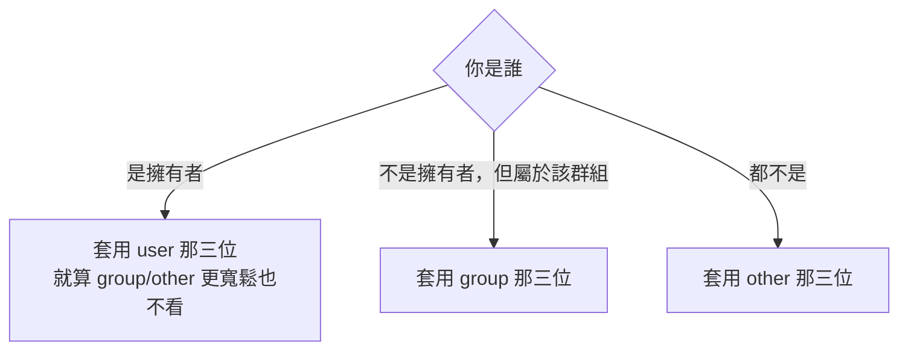

# 檔案權限與擁有者

> [!abstract] 這篇你會學到
> - 逐位元讀懂 `ls -l` 的權限欄位，並知道 `x` 對**目錄**的意義和對檔案完全不同
> - 用數字與符號兩種方式設定權限，以及 `chmod -R` 時**大寫 `X` 這個救命技巧**
> - 理解 `umask` 為什麼讓新檔案是 644、新目錄是 755
> - 掌握 setuid / setgid / sticky 三個特殊權限，特別是**目錄 setgid 做團隊共用**
> - 用 ACL 處理「這個目錄要給第三個群組讀」這類 rwx 做不到的需求
> - 建立一套 Web 服務的正確權限模型，不再遇到問題就 `chmod 777`

## 前置知識

- [[020-01-05-cmd-Linux-路徑導覽與檔案操作]]

---

## 觀念說明

### 三組對象、三種權限

Linux 把「誰」分成三組，每組各有三個權限位元：

```
-rwxr-xr--  1 mike devs  4096  8月 27 12:01 deploy.sh
│└┬┘└┬┘└┬┘     └─┬┘ └┬─┘
│ │  │  │        │   └──── 所屬群組（group）
│ │  │  │        └──────── 擁有者（user / owner）
│ │  │  └───────────────── others：其他所有人   → r--  唯讀
│ │  └──────────────────── group：devs 群組成員 → r-x  讀+執行
│ └─────────────────────── user：mike           → rwx  讀+寫+執行
└───────────────────────── 檔案類型
```

判斷順序是**由左到右、命中即停**：



> [!warning] 命中即停會產生反直覺的結果
> ```bash
> -r--rw-r--  1 mike devs  file.txt
> ```
> mike 是擁有者，套用 `r--` → **mike 不能寫**，
> 即使他也在 `devs` 群組（`rw-`）也一樣。
>
> 這偶爾被用來「刻意讓擁有者唯讀」，但更常見的是設定錯誤。

### `rwx` 對檔案和對目錄意義完全不同

**這是新手最大的盲點。**

| 位元 | 對**檔案** | 對**目錄** |
| --- | --- | --- |
| `r` | 讀取內容 | **列出裡面有什麼**（`ls`） |
| `w` | 修改內容 | **在裡面新增/刪除/改名檔案** |
| `x` | 執行它 | **進入這個目錄 / 存取裡面的檔案**（traverse） |

幾個推論，每一個都很重要：

> [!danger] 目錄的 `w` 決定你能不能刪除裡面的檔案，跟檔案本身的權限無關
> ```bash
> mkdir /tmp/demo && cd /tmp/demo
> sudo touch important.txt
> sudo chmod 444 important.txt     # 檔案唯讀，連 root 都標成唯讀
> ls -ld . ; ls -l important.txt
> ```
> ```
> drwxrwxr-x 2 mike mike 4096  8月 27 12:05 .
> -r--r--r-- 1 root root    0  8月 27 12:05 important.txt
> ```
> ```bash
> rm important.txt
> ```
> ```
> rm: remove write-protected regular file 'important.txt'? y
> ```
> **刪掉了。** 因為刪除檔案是「修改目錄」的行為，
> 你對 `/tmp/demo` 有 `w`，所以你可以刪掉裡面任何檔案。
>
> 這就是為什麼 `/tmp` 需要 sticky bit（見下方）。

> [!danger] 沒有 `x` 就進不去，路徑上**每一層**都要有
> ```bash
> ls -ld /var /var/www /var/www/example.com
> ```
> ```
> drwxr-xr-x 14 root root     4096 ... /var
> drwxr-xr-x  3 root root     4096 ... /var/www
> drwxr-x---  5 mike www-data 4096 ... /var/www/example.com
> ```
> `www-data` 要讀 `/var/www/example.com/index.html`，
> 必須對 `/`、`/var`、`/var/www` 都有 `x`，
> 對 `/var/www/example.com` 有 `x`（進入）與 `r`（如果需要列出）。
>
> **「Nginx 讀不到檔案」十次有八次是路徑上某一層少了 `x`。**
> 一次檢查整條路徑：
> ```bash
> namei -l /var/www/example.com/public/index.html
> ```
> ```
> f: /var/www/example.com/public/index.html
> drwxr-xr-x root     root     /
> drwxr-xr-x root     root     var
> drwxr-xr-x root     root     www
> drwxr-x--- mike     www-data example.com
> drwxr-x--- mike     www-data public
> -rw-r----- mike     www-data index.html
> ```
> `namei -l` 是排查權限問題最好用的指令，**請記起來**。

> [!tip] 只給 `x` 不給 `r` 的目錄：可穿越但不可窺探
> ```bash
> chmod 711 /home/mike
> ```
> 別人可以存取 `/home/mike/public/file.txt`（如果知道完整路徑），
> 但 `ls /home/mike` 會被拒絕。
> 這是家目錄常見的設定，讓 Web 伺服器能取用特定子目錄但看不到其他內容。

---

## 基礎操作

### 數字表示法

每個權限對應一個數字，把三個加起來：

| 權限 | 數字 |
| --- | --- |
| `r` 讀 | **4** |
| `w` 寫 | **2** |
| `x` 執行 | **1** |

```
rwx = 4+2+1 = 7        r-x = 4+0+1 = 5
rw- = 4+2+0 = 6        r-- = 4+0+0 = 4
--- = 0
```

常見組合與用途：

| 數字 | 符號 | 典型用途 |
| --- | --- | --- |
| `755` | `rwxr-xr-x` | **可執行檔、公開目錄** |
| `644` | `rw-r--r--` | **一般檔案** |
| `750` | `rwxr-x---` | 只給擁有者與群組的目錄 |
| `640` | `rw-r-----` | 只給擁有者與群組讀的檔案 |
| `700` | `rwx------` | 私人目錄（如 `~/.ssh`） |
| `600` | `rw-------` | **私鑰、`.env`** |
| `777` | `rwxrwxrwx` | **幾乎永遠是錯的** |

```bash
chmod 644 file.txt
chmod 755 script.sh
chmod 600 ~/.ssh/id_ed25519
```

### 符號表示法

```
chmod [對象][操作][權限] 檔案
       u g o a   + - =   r w x X s t
```

| 對象 | | 操作 | | 權限 |
| --- | --- | --- | --- | --- |
| `u` user | | `+` 加上 | | `r` `w` `x` |
| `g` group | | `-` 移除 | | `X` 見下方 |
| `o` other | | `=` 設為 | | `s` setuid/setgid |
| `a` all | | | | `t` sticky |

```bash
chmod u+x script.sh          # 給擁有者執行權
chmod go-w file.txt          # 拿掉群組與其他人的寫入權
chmod a+r file.txt           # 所有人可讀
chmod u=rw,go=r file.txt     # 明確設定（等同 644）
chmod g+s /srv/shared        # 目錄 setgid
chmod +t /tmp                # sticky bit
```

> [!tip] 什麼時候用數字、什麼時候用符號
> - **數字**：你要「完全確定」最終權限是什麼 → 設定檔、私鑰、部署腳本
> - **符號**：你只想改一個位元、保留其他不動 → `chmod +x`、`chmod go-w`
>
> 數字是覆蓋式的，符號是增量式的。

### `chmod -R` 的陷阱與大寫 `X`

```bash
chmod -R 755 /var/www/example.com     # ✗ 危險
```

這會把**所有檔案也變成可執行**（`755`）。網站目錄裡的
`config.php`、`.env`、圖片全部變成 `rwxr-xr-x`，這是很糟的做法：

- 增加攻擊面（可執行的上傳檔案）
- 資安稽核會被列為缺失
- 讓 `ls` 輸出全是綠色，看不出哪個才是真的腳本

**正解是大寫 `X`：只對「目錄」或「原本就可執行的檔案」加上 `x`**：

```bash
chmod -R u=rwX,g=rX,o= /var/www/example.com
```

結果：

```
drwxr-x--- mike www-data  public/          ← 目錄有 x
-rw-r----- mike www-data  index.php        ← 檔案沒有 x ✓
-rwxr-x--- mike www-data  build.sh         ← 原本就有 x 的保留 ✓
```

> [!tip] 記住這個公式，它會救你很多次
> ```bash
> chmod -R u=rwX,g=rX,o= <目錄>
> ```
> **小寫 `x`** = 無條件加上執行權。
> **大寫 `X`** = 只在「是目錄」或「已經有任一 `x`」時才加。

另一種寫法是分開處理：

```bash
find /var/www/example.com -type d -exec chmod 750 {} +
find /var/www/example.com -type f -exec chmod 640 {} +
```

### `chown` 與 `chgrp`：改擁有者

```bash
sudo chown mike file.txt              # 改擁有者
sudo chown mike:devs file.txt         # 同時改擁有者與群組
sudo chown :devs file.txt             # 只改群組
sudo chgrp devs file.txt              # 同上
sudo chown -R mike:www-data /var/www/example.com
sudo chown --reference=a.txt b.txt    # 複製 a 的擁有者設定給 b
```

> [!warning] 只有 root 能把檔案「送給」別人
> 一般使用者不能 `chown` 給其他人（避免用配額塞爆別人的空間），
> 但可以 `chgrp` 到自己所屬的群組。

> [!tip] `--reference` 在修復權限時很好用
> 不小心改壞了某個檔案的擁有者，找一個同目錄的正常檔案當範本：
> ```bash
> sudo chown --reference=/etc/nginx/nginx.conf /etc/nginx/mysite.conf
> sudo chmod --reference=/etc/nginx/nginx.conf /etc/nginx/mysite.conf
> ```

### `umask`：新檔案的預設權限

新建檔案的權限是「基準權限**減去** umask」：

| | 基準 | 預設 umask | 結果 |
| --- | --- | --- | --- |
| 檔案 | `666`（`rw-rw-rw-`） | `022` | **`644`** |
| 目錄 | `777`（`rwxrwxrwx`） | `022` | **`755`** |

檔案的基準是 `666` 而不是 `777`——**系統不會自動給新檔案執行權**，
這是刻意的安全設計。

```bash
umask                # 查看目前值（數字）
umask -S             # 查看目前值（符號）
umask 027            # 設定：group 去掉 w，other 全部去掉
```

```
$ umask
0022
$ umask -S
u=rwx,g=rx,o=rx
```

驗證：

```bash
umask 027
touch f && mkdir d && ls -l
```

```
-rw-r-----  1 mike mike    0  8月 27 12:30 f      ← 640
drwxr-x---  2 mike mike 4096  8月 27 12:30 d      ← 750
```

> [!tip] 伺服器建議 umask 027，敏感環境用 077
> | umask | 檔案 | 目錄 | 適用 |
> | --- | --- | --- | --- |
> | `022` | 644 | 755 | 預設，其他人可讀 |
> | **`027`** | 640 | 750 | **伺服器建議**，其他人完全不可存取 |
> | `077` | 600 | 700 | 高度敏感，只有自己 |
>
> 設定位置：
> - 個人：`~/.bashrc` 或 `~/.profile`
> - 全系統：`/etc/profile` 或 `/etc/login.defs` 的 `UMASK`
> - **systemd 服務**：unit 檔的 `UMask=0027`（不吃 shell 設定！）
>
> 最後一點常被忽略：`/etc/profile` 的 umask **不會**套用到 systemd 啟動的服務，
> 服務產生的檔案權限要在 unit 檔裡設定。見 [[020-01-17-cmd-Linux-systemd服務管理]]。

---

## 進階用法：特殊權限

除了 rwx，還有三個特殊位元，寫在數字權限的**第四位**。

| 位元 | 數字 | 對檔案 | 對目錄 |
| --- | --- | --- | --- |
| **setuid** | 4000 | 執行時以**檔案擁有者**身分執行 | 無作用 |
| **setgid** | 2000 | 執行時以**檔案群組**身分執行 | **新建檔案繼承目錄的群組** |
| **sticky** | 1000 | 無作用 | **只有擁有者能刪除自己的檔案** |

### setuid：`passwd` 為什麼能改 `/etc/shadow`

```bash
ls -l /usr/bin/passwd
```

```
-rwsr-xr-x 1 root root 68248  3月 22  2026 /usr/bin/passwd
   ↑
   s 在 user 的 x 位置 = setuid
```

一般使用者執行 `passwd` 時，程序會以 **root 身分**執行，
才有辦法寫入 `/etc/shadow`（權限 `640 root:shadow`）。

```bash
sudo chmod u+s myprog       # 加上 setuid
sudo chmod 4755 myprog      # 數字寫法
```

> [!danger] setuid 是提權漏洞的溫床
> 一個有 bug 的 setuid root 程式 = 任何人都能拿到 root。
> **除非你完全清楚在做什麼，否則永遠不要自己設 setuid。**
>
> 定期稽核（見 [[020-01-07-cmd-Linux-尋找檔案與內容]]）：
> ```bash
> sudo find / -xdev -type f -perm -4000 -exec ls -l {} + 2>/dev/null
> ```
> 正常系統上只該有 `sudo`、`su`、`passwd`、`mount`、`umount`、
> `ping`、`chsh`、`newgrp` 等十幾個。多出來的要調查。
>
> 另外，**setuid 對 shell 腳本無效**（Linux 核心刻意忽略），
> 這是為了防止腳本的競態條件漏洞。

### 目錄 setgid：團隊共用目錄的標準做法

這是最實用的特殊權限，解決「多人協作時檔案群組亂掉」的問題。

**沒有 setgid 的情況**：

```bash
sudo mkdir /srv/shared
sudo chgrp devs /srv/shared
sudo chmod 770 /srv/shared

# mike（主要群組是 mike）在裡面建檔案
touch /srv/shared/mike-file.txt
ls -l /srv/shared/
```

```
-rw-r--r-- 1 mike mike 0  8月 27 12:45 mike-file.txt
                  ^^^^ 群組是 mike，不是 devs！
```

同群組的 alice **讀不到**這個檔案（other 只有 `r--`，如果 umask 是 077 就完全讀不到）。

**加上 setgid**：

```bash
sudo chmod g+s /srv/shared          # 或 chmod 2770
ls -ld /srv/shared
```

```
drwxrws--- 2 root devs 4096  8月 27 12:46 /srv/shared
      ↑
      s 在 group 的 x 位置
```

```bash
touch /srv/shared/mike-file2.txt
ls -l /srv/shared/
```

```
-rw-r--r-- 1 mike mike 0  8月 27 12:45 mike-file.txt
-rw-rw-r-- 1 mike devs 0  8月 27 12:47 mike-file2.txt
                  ^^^^ 自動繼承 devs ✓
```

> [!tip] 團隊共用目錄的完整配方
> ```bash
> sudo groupadd devs
> sudo usermod -aG devs mike
> sudo usermod -aG devs alice
>
> sudo mkdir -p /srv/shared
> sudo chgrp devs /srv/shared
> sudo chmod 2770 /srv/shared        # 2=setgid, 770=群組可讀寫執行
> ```
> 再加上讓新檔案自動是 `rw-rw----`，需要調整 umask 或用 ACL（見下方）。
>
> 加群組後**使用者要重新登入**才生效。

### sticky bit：`/tmp` 的守門員

```bash
ls -ld /tmp
```

```
drwxrwxrwt 15 root root 4096  8月 27 12:50 /tmp
         ↑
         t = sticky bit
```

`/tmp` 是 `777`（所有人可寫），沒有 sticky bit 的話任何人都能刪除別人的檔案。
sticky bit 限制**只有檔案擁有者（或目錄擁有者、root）才能刪除或改名**。

```bash
sudo chmod +t /shared/dropbox
sudo chmod 1777 /shared/dropbox
```

> [!tip] 「上傳專用」目錄的組合技
> 想做一個「大家都能丟檔案進來，但不能刪別人的」目錄：
> ```bash
> sudo chmod 1770 /srv/dropbox     # sticky + 群組可寫
> sudo chgrp devs /srv/dropbox
> ```

### ACL：rwx 不夠用的時候

三組對象（user/group/other）有時候不夠。
例如：`/var/www/app` 屬於 `mike:www-data`，但你還想讓 `backup` 使用者能讀。

用 rwx 只能把 `backup` 加進 `www-data` 群組（權限過大），或改 `other`（權限更大）。
**ACL 讓你針對特定使用者或群組另外授權**。

```bash
# 檢查檔案系統是否支援（ext4/xfs 現代預設都支援）
sudo apt install -y acl

getfacl /var/www/app                        # 查看 ACL
sudo setfacl -m u:backup:rx /var/www/app    # 給 backup 使用者 r-x
sudo setfacl -m g:auditors:r /var/www/app   # 給 auditors 群組 r
sudo setfacl -x u:backup /var/www/app       # 移除
sudo setfacl -b /var/www/app                # 清除所有 ACL
```

```bash
getfacl /var/www/app
```

```
# file: var/www/app
# owner: mike
# group: www-data
user::rwx
user:backup:r-x          ← 額外授權
group::r-x
mask::r-x
other::---
```

有 ACL 的檔案在 `ls -l` 會多一個 `+`：

```
drwxr-x---+ 5 mike www-data 4096  8月 27 13:02 app
          ↑
```

**預設 ACL（default ACL）**讓新建的檔案自動繼承：

```bash
# -d 設定 default ACL，-R 套用到現有內容
sudo setfacl -R -m d:u:backup:rx,u:backup:rx /var/www/app
```

之後在 `/var/www/app` 底下新建的檔案都會自動帶上 `backup` 的權限。

> [!tip] 團隊共用目錄的「完全體」
> setgid 解決群組繼承，default ACL 解決權限繼承：
> ```bash
> sudo mkdir -p /srv/shared
> sudo chgrp devs /srv/shared
> sudo chmod 2770 /srv/shared
> sudo setfacl -R -m d:g:devs:rwx,g:devs:rwx /srv/shared
> ```
> 這樣不管誰在裡面建檔案，`devs` 群組都能讀寫，不用管每個人的 umask。

> [!warning] ACL 的 `mask` 會限制實際權限
> `mask::r-x` 是所有具名使用者/群組權限的**上限**。
> 設了 `u:backup:rwx` 但 `mask` 是 `r-x`，實際生效的是 `r-x`。
> `getfacl` 會用 `#effective:` 註記提醒你：
> ```
> user:backup:rwx          #effective:r-x
> ```
> 修正：`setfacl -m m::rwx <路徑>`

> [!warning] `cp` 和 `tar` 預設不保留 ACL
> ```bash
> cp -a src dst              # -a 有含 ACL
> cp --preserve=all src dst  # 明確保留
> tar --acls -cf x.tar dir   # tar 需要 --acls
> rsync -A ...               # rsync 需要 -A
> ```
> 備份含 ACL 的目錄時要特別注意，否則還原後權限全跑掉。

> [!info]- Rocky / AlmaLinux（RHEL 系）對照
> 權限模型完全相同，`chmod`、`chown`、`umask`、ACL 用法一致。差異：
>
> | 項目 | Debian / Ubuntu | RHEL 系 |
> | --- | --- | --- |
> | 提權群組 | `sudo` | `wheel` |
> | Web 執行帳號 | `www-data` | `nginx` / `apache` |
> | acl 套件 | `apt install acl` | `dnf install acl`（通常已內建） |
> | **強制存取控制** | AppArmor | **SELinux** |
>
> **RHEL 系最大的差別是 SELinux**。即使 rwx 權限完全正確，
> SELinux 標籤不對一樣會被拒絕存取：
>
> ```bash
> ls -Z /var/www/html/index.html
> ```
> ```
> unconfined_u:object_r:httpd_sys_content_t:s0 index.html
> ```
>
> 從別的地方複製檔案進 `/var/www` 時標籤會不對，要修復：
> ```bash
> sudo restorecon -Rv /var/www/html          # 還原成預設標籤
> sudo semanage fcontext -a -t httpd_sys_content_t "/srv/web(/.*)?"
> sudo restorecon -Rv /srv/web
> ```
>
> **排查順序**：權限正確但仍被拒絕 → 先看 `/var/log/audit/audit.log`
> 有沒有 `avc: denied`，那就是 SELinux。詳見 [[090-02-07-guide-防護-SELinux與AppArmor]]。

---

## 完整實戰範例：Web 服務的正確權限模型

這是實務上最常需要決定的權限配置。

### 原則

1. **網站檔案的擁有者不是 Web 伺服器帳號**——避免程式碼被自己改寫
2. Web 伺服器帳號透過**群組**取得讀取權
3. 只有需要寫入的目錄（上傳、快取、日誌）才給 Web 帳號寫權
4. `other` 一律拿掉

### 配置

```bash
APP=/var/www/example.com
DEPLOY_USER=deploy        # 部署用的帳號
WEB_USER=www-data         # RHEL 系為 nginx

# 1. 擁有者是部署帳號，群組是 Web 帳號
sudo chown -R "$DEPLOY_USER:$WEB_USER" "$APP"

# 2. 目錄 750、檔案 640，other 完全沒有權限
sudo chmod -R u=rwX,g=rX,o= "$APP"

# 3. 只有需要寫入的目錄放寬給群組
sudo chmod -R g+w "$APP/storage" "$APP/bootstrap/cache"

# 4. 新建檔案自動繼承群組（重要！）
sudo find "$APP/storage" -type d -exec chmod g+s {} +

# 5. 機密檔案只有擁有者能讀
sudo chmod 600 "$APP/.env"
sudo chown "$DEPLOY_USER:$DEPLOY_USER" "$APP/.env"
```

> [!warning] `.env` 給誰讀？
> 上面把 `.env` 設成 `600 deploy:deploy`，但 **PHP-FPM 以 `www-data` 執行，會讀不到**。
> 兩種正確做法：
>
> **做法 A**：讓 Web 帳號能讀，但其他人不行
> ```bash
> sudo chown deploy:www-data "$APP/.env"
> sudo chmod 640 "$APP/.env"
> ```
>
> **做法 B（更好）**：機密不放檔案，改用 systemd 的 `EnvironmentFile`
> 或 PHP-FPM pool 的 `env[]` 指令，見 [[090-03-03-guide-應用安全-機密管理與金鑰保護]]。
>
> **絕對不要做的**：`chmod 644 .env`——那等於任何登入這台機器的人都讀得到資料庫密碼。

### 驗證

```bash
# 用 Web 帳號的身分實測能不能讀
sudo -u www-data cat "$APP/public/index.php" > /dev/null && echo "讀取 OK"
sudo -u www-data test -w "$APP/storage" && echo "storage 可寫 OK"
sudo -u www-data test -w "$APP/public" && echo "⚠ public 不該可寫！"

# 檢查整條路徑
namei -l "$APP/public/index.php"

# 找出不該存在的寬鬆權限
sudo find "$APP" -perm -o+r -o -perm -o+w | head
```

> [!tip] `sudo -u www-data` 是驗證權限的最佳方式
> 不要用「看起來應該可以」來判斷，**直接用那個帳號的身分試一次**。
> 這一招在排查 502、403、上傳失敗時都能立刻給出答案。
>
> 如果 `www-data` 的 shell 是 `/usr/sbin/nologin`，用 `-s /bin/bash` 繞過：
> ```bash
> sudo -u www-data -s /bin/bash -c 'cat /var/www/example.com/.env'
> ```

### 常見場景的權限速查

| 路徑 | 建議權限 | 擁有者:群組 |
| --- | --- | --- |
| 網站程式碼目錄 | `750` | `deploy:www-data` |
| 網站程式碼檔案 | `640` | `deploy:www-data` |
| 上傳/快取目錄 | `2770` | `deploy:www-data` |
| `.env` / 設定檔含機密 | `640` | `deploy:www-data` |
| SSH 私鑰 | `600` | `user:user` |
| `~/.ssh` 目錄 | `700` | `user:user` |
| `~/.ssh/authorized_keys` | `600` | `user:user` |
| TLS 私鑰 | `600` | `root:root` |
| TLS 憑證（公開部分） | `644` | `root:root` |
| 系統設定檔 | `644` | `root:root` |
| 含密碼的設定檔 | `640` | `root:<服務群組>` |
| 可執行腳本 | `755` 或 `750` | `root:root` |

---

## 常見錯誤與排錯

| 現象 | 原因 | 解法 |
| --- | --- | --- |
| Nginx 回 403，但檔案權限看起來正確 | 路徑上某一層目錄少了 `x` | `namei -l <完整路徑>` 逐層檢查 |
| `chmod -R 755` 之後所有檔案都變綠色可執行 | 小寫 `x` 無條件套用 | 改用 `chmod -R u=rwX,g=rX,o=` |
| 團隊共用目錄檔案群組總是不對 | 目錄沒設 setgid | `chmod g+s <目錄>` |
| 加了群組但權限沒生效 | 群組變更需要重新登入 | 登出再登入，或 `newgrp <群組>` |
| SSH 金鑰登入失敗 | `~/.ssh` 或 `authorized_keys` 權限太寬 | `chmod 700 ~/.ssh; chmod 600 ~/.ssh/authorized_keys` |
| `sudo -u www-data` 說 `This account is currently not available` | 該帳號 shell 是 `nologin` | 加 `-s /bin/bash` |
| 檔案唯讀卻被刪掉了 | 刪除看的是**目錄**的 `w` | 需要保護就用 `chattr +i` 或收回目錄寫權 |
| RHEL 上權限全對但仍 403 | SELinux 標籤不對 | `restorecon -Rv <路徑>`；查 `audit.log` |
| `ls -l` 權限後面有個 `+` | 有 ACL | `getfacl <檔案>` 查看 |
| ACL 設了 rwx 但只生效 r-x | `mask` 限制 | `setfacl -m m::rwx <路徑>` |
| 備份還原後 ACL 不見了 | `cp`/`tar` 預設不保留 | `cp -a`、`tar --acls`、`rsync -A` |
| systemd 服務產生的檔案權限不對 | shell umask 不影響 systemd | 在 unit 檔設 `UMask=0027` |
| 一般使用者無法 `chown` 給別人 | 設計如此 | 用 `sudo`，或改用 `chgrp` |

---

## 安全性注意事項

> [!danger] `chmod 777` 幾乎永遠是錯的
> 「權限有問題就 777」是最常見也最危險的壞習慣。它代表：
> - 這台機器上**任何**使用者都能讀、改、刪這些檔案
> - Web 應用被入侵後，攻擊者能直接改寫你的程式碼植入後門
> - 任何資安稽核都會直接列為高風險缺失
>
> **正確流程**：用 `sudo -u <帳號>` 找出「哪個帳號」需要「什麼權限」，
> 然後精確授權。花五分鐘想清楚，勝過留一個永久的洞。
>
> 稽核現有的 777：
> ```bash
> sudo find /var/www /srv /opt -perm -o+w -exec ls -ld {} + 2>/dev/null
> ```

> [!danger] 網站可寫目錄絕不能同時可執行
> 如果 `uploads/` 既可寫又能被 PHP 執行，攻擊者上傳一個 `.php` 就拿到 webshell。
>
> Nginx 的防護：
> ```nginx
> location ^~ /uploads/ {
>     location ~ \.php$ { deny all; }
> }
> ```
> 見 [[060-02-02-09-guide-Nginx-安全設定]] 與 [[090-03-02-guide-應用安全-應用層安全]]。

> [!warning] 私鑰權限錯誤，SSH 會直接拒絕
> ```
> Permissions 0644 for '/home/mike/.ssh/id_ed25519' are too open.
> It is required that your private key files are NOT accessible by others.
> ```
> 這是 OpenSSH 刻意的保護。修復：
> ```bash
> chmod 700 ~/.ssh
> chmod 600 ~/.ssh/id_ed25519
> chmod 644 ~/.ssh/id_ed25519.pub
> chmod 600 ~/.ssh/authorized_keys
> chmod 644 ~/.ssh/known_hosts
> ```
> 見 [[020-02-01-02-cmd-SSH-金鑰認證與ssh-agent]]。

> [!tip] `chattr +i`：連 root 都改不了
> 想絕對防止某個檔案被改（例如已定案的稽核設定）：
> ```bash
> sudo chattr +i /etc/critical.conf     # 設為不可變更
> sudo lsattr /etc/critical.conf
> sudo chattr -i /etc/critical.conf     # 解除
> ```
> 注意：入侵者也會用這招讓惡意檔案刪不掉。
> 排查時如果 `rm` 說 `Operation not permitted` 但你是 root，用 `lsattr` 檢查。

---

## 速查表

### 數字對照

| 數字 | 符號 | 用途 |
| --- | --- | --- |
| `755` | `rwxr-xr-x` | 可執行檔、公開目錄 |
| `750` | `rwxr-x---` | 目錄（伺服器建議） |
| `644` | `rw-r--r--` | 一般檔案 |
| `640` | `rw-r-----` | 檔案（伺服器建議） |
| `700` | `rwx------` | `~/.ssh` |
| `600` | `rw-------` | 私鑰、機密 |
| `2770` | `rwxrws---` | 團隊共用目錄（setgid） |
| `1777` | `rwxrwxrwt` | 公開暫存（sticky，如 `/tmp`） |

### 指令

| 指令 | 說明 |
| --- | --- |
| `chmod 644 f` | 數字設定 |
| `chmod u+x f` | 符號設定 |
| `chmod -R u=rwX,g=rX,o= d` | **遞迴：目錄可進入、檔案不變可執行** |
| `chmod g+s d` | 目錄 setgid（群組繼承） |
| `chmod +t d` | sticky bit |
| `chown u:g f` / `chgrp g f` | 改擁有者 / 群組 |
| `chown --reference=a b` | 複製 a 的擁有者設定 |
| `umask` / `umask 027` | 查看 / 設定預設權限遮罩 |
| `namei -l <路徑>` | **逐層顯示路徑上每一層的權限** |
| `sudo -u <帳號> <指令>` | **用指定帳號實測權限** |
| `getfacl f` / `setfacl -m u:x:rx f` | 查看 / 設定 ACL |
| `setfacl -R -m d:g:devs:rwx d` | 設定 default ACL（新檔繼承） |
| `lsattr f` / `chattr +i f` | 檔案屬性 / 設為不可變更 |

### 稽核

| 指令 | 找什麼 |
| --- | --- |
| `find / -xdev -perm -4000` | setuid 檔案 |
| `find / -xdev -perm -2000` | setgid 檔案 |
| `find / -xdev -type f -perm -o+w` | 任何人可寫的檔案 |
| `find / -xdev -type d -perm -o+w ! -perm -1000` | 可寫但無 sticky 的目錄 |
| `find / -xdev -nouser -o -nogroup` | 孤兒檔案 |

---

## 練習題

> [!question]- 練習 1：目錄的 `x` 到底管什麼
> 建立以下結構並實驗：
> ```bash
> sudo mkdir -p /srv/test/inner
> echo "secret" | sudo tee /srv/test/inner/data.txt
> sudo chmod 644 /srv/test/inner/data.txt
> sudo chmod 644 /srv/test/inner        # 注意：目錄只有 r，沒有 x
> ```
> 以一般使用者身分執行 `ls /srv/test/inner` 和 `cat /srv/test/inner/data.txt`，
> 各自會怎樣？為什麼？
>
> **解答**
>
> ```bash
> ls /srv/test/inner
> ```
> ```
> data.txt
> ```
> **可以列出檔名**（目錄有 `r`），但如果加 `-l` 會失敗：
> ```bash
> ls -l /srv/test/inner
> ```
> ```
> ls: cannot access '/srv/test/inner/data.txt': Permission denied
> total 0
> -????????? ? ? ? ?            ? data.txt
> ```
> 因為 `ls -l` 需要讀取每個檔案的 inode，那需要對目錄有 `x`。
>
> ```bash
> cat /srv/test/inner/data.txt
> ```
> ```
> cat: /srv/test/inner/data.txt: Permission denied
> ```
> **讀不到**，即使檔案本身是 `644`。因為存取目錄內的檔案需要目錄的 `x`。
>
> 修復：
> ```bash
> sudo chmod 755 /srv/test/inner
> ```
>
> **結論**：目錄的 `r` = 能看到有什麼檔名；`x` = 能實際存取檔案。
> 兩者是獨立的，這就是 `chmod -R` 用小寫 `x` 會出事、
> 大寫 `X` 才正確的原因。

> [!question]- 練習 2：建立團隊共用目錄
> 建立 `/srv/team`，要求：
> 1. `devs` 群組的成員都能讀寫
> 2. 任何人在裡面建立的檔案，群組自動是 `devs`
> 3. 成員只能刪除自己建立的檔案
> 4. 其他人完全無法存取
>
> **解答**
>
> ```bash
> sudo groupadd -f devs
> sudo usermod -aG devs mike
> sudo usermod -aG devs alice
>
> sudo mkdir -p /srv/team
> sudo chgrp devs /srv/team
> sudo chmod 3770 /srv/team     # 3 = setgid(2) + sticky(1)
> ```
>
> 驗證：
> ```bash
> ls -ld /srv/team
> ```
> ```
> drwxrws--T 2 root devs 4096  8月 27 13:30 /srv/team
>       ^  ^
>       |  └── T = sticky（大寫 T 代表 other 沒有 x）
>       └───── s = setgid
> ```
>
> 還缺一步：新檔案的**權限**仍受各人 umask 影響，
> alice 可能建出 `rw-r--r--` 讓 mike 不能寫。用 default ACL 補上：
> ```bash
> sudo setfacl -R -m d:g:devs:rwx,g:devs:rwx /srv/team
> ```
>
> 記得成員要**重新登入**群組才生效。

> [!question]- 練習 3：修復一個壞掉的網站權限
> 有人執行了 `sudo chmod -R 777 /var/www/example.com`。
> 寫出修復指令，讓它回到安全的權限模型
> （擁有者 `deploy`、群組 `www-data`、`storage` 可寫、`.env` 保密）。
>
> **解答**
>
> ```bash
> APP=/var/www/example.com
>
> # 1. 擁有者與群組
> sudo chown -R deploy:www-data "$APP"
>
> # 2. 目錄 750 / 檔案 640，other 清空
> #    關鍵：大寫 X，不要讓所有檔案變可執行
> sudo chmod -R u=rwX,g=rX,o= "$APP"
>
> # 3. 需要寫入的目錄放寬
> sudo chmod -R g+w "$APP/storage" "$APP/bootstrap/cache"
> sudo find "$APP/storage" "$APP/bootstrap/cache" -type d -exec chmod g+s {} +
>
> # 4. 機密檔案
> sudo chmod 640 "$APP/.env"
>
> # 5. 部署腳本恢復執行權（如果有）
> sudo chmod 750 "$APP"/deploy.sh 2>/dev/null || true
> ```
>
> 驗證：
> ```bash
> sudo -u www-data cat "$APP/public/index.php" >/dev/null && echo "讀取 OK"
> sudo -u www-data test -w "$APP/storage" && echo "storage 可寫 OK"
> sudo -u www-data test -w "$APP/public" && echo "⚠ public 竟然可寫" || echo "public 唯讀 OK"
> sudo find "$APP" -perm -o+r | head          # 應該沒有輸出
> namei -l "$APP/public/index.php"
> ```
>
> **注意第 5 步**：`chmod -R u=rwX` 會保留原本就有 `x` 的檔案，
> 但因為原本是 777（全都有 x），所以這一步其實**保留了所有檔案的執行權**。
> 從 777 修復時，正確做法是先全部清掉再挑選性加回：
> ```bash
> sudo find "$APP" -type f -exec chmod 640 {} +
> sudo find "$APP" -type d -exec chmod 750 {} +
> sudo chmod 750 "$APP"/deploy.sh          # 再手動加回需要的
> ```
> 這是 `X` 技巧的邊界條件——**它保留既有的 x，所以從 777 修復時不適用**。

---

## 小測驗

Q1. 權限判斷是「命中即停」：`-r--rw-r-- mike devs`，mike 也在 devs 群組，他能寫嗎？
Q2. `r`、`w`、`x` 對「目錄」各代表什麼？
Q3. 檔案是 `444` 唯讀，為什麼一般使用者還是能 `rm` 它？
Q4. Nginx 回 403 但檔案是 `644`，最可能的原因與一行排查指令？
Q5. `chmod -R 755 /var/www` 有什麼問題？正確寫法用哪個字母？
Q6. umask `027` 下新建檔案與目錄的權限各是多少？為什麼檔案不會有執行權？
Q7. 目錄 setgid（`chmod g+s`）解決團隊共用目錄的什麼問題？
Q8. `getfacl` 顯示 `user:backup:rwx #effective:r-x`，為什麼實際只有 `r-x`？
Q9. `cp -r` 與 `tar -cf` 預設會保留 ACL 嗎？各要加什麼？
Q10. 用 `sudo -u www-data cat file` 驗證權限時遇到 `This account is currently not available`，怎麼辦？

> [!question]- 測驗答案
> **Q1.** 不能。他是擁有者，套用 user 的 `r--` 就停了，不看 group（見「三組對象、三種權限」）。
> **Q2.** `r` 列出內容、`w` 新增／刪除／改名裡面的檔案、`x` 進入與存取裡面的檔案（traverse）。
> **Q3.** 刪除是「修改目錄」的行為，看的是目錄的 `w`，與檔案本身權限無關。這就是 `/tmp` 需要 sticky bit 的原因。
> **Q4.** 路徑上某一層目錄少了 `x`；`namei -l /完整/路徑`。
> **Q5.** 所有檔案都變可執行。用大寫 `X`：`chmod -R u=rwX,g=rX,o=`——只對目錄或原本就可執行的檔案加 `x`。
> **Q6.** 檔案 `640`、目錄 `750`；檔案基準是 `666` 而非 `777`，系統刻意不給新檔案執行權。
> **Q7.** 新建檔案的群組自動繼承目錄的群組，而不是建立者的主要群組，同組成員才讀得到。
> **Q8.** `mask` 是具名使用者/群組權限的上限；`setfacl -m m::rwx` 修正。
> **Q9.** 都不會。`cp -a`（或 `--preserve=all`）、`tar --acls`、`rsync -A`。
> **Q10.** 該帳號 shell 是 `nologin`；加 `-s /bin/bash`：`sudo -u www-data -s /bin/bash -c 'cat file'`。

---

## 延伸閱讀

- [[020-01-09-cmd-Linux-使用者與群組管理]] — 使用者、群組與 sudo 的完整說明
- [[020-01-07-cmd-Linux-尋找檔案與內容]] — `find -perm` 稽核權限
- [[090-02-07-guide-防護-SELinux與AppArmor]] — 權限對了卻仍被拒絕時
- [[130-01-04-02-guide-Laravel-Nginx與PHP-FPM設定]] — Web 應用權限的完整實作
- [[090-03-03-guide-應用安全-機密管理與金鑰保護]] — `.env` 與私鑰的正確處理
- [[090-02-08-guide-防護-系統強化與稽核]] — 把權限稽核制度化
- `man 1 chmod` / `man 5 acl` / `man 1 namei`
