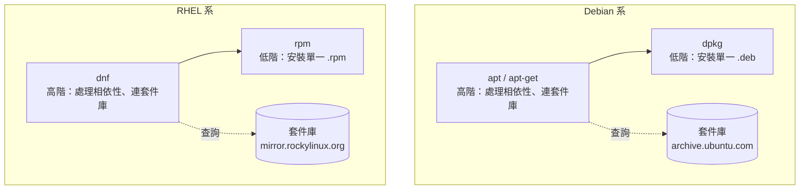

# 套件管理 apt 與 dnf

> [!abstract] 這篇你會學到
> - ★★ 分清楚 `apt`、`apt-get`、`dpkg` 三層工具的分工，知道**腳本裡該用哪個**
> - ★★★ 安全地安裝、升級、移除套件，並理解 `remove` 與 `purge` 的差別
> - ★★★★ 用**現代做法**（`signed-by` + `/etc/apt/keyrings`）加入第三方套件庫，
>   不要再用已棄用的 `apt-key`
> - ★★★ 用版本鎖定（pinning / versionlock）避免關鍵套件被意外升級
> - ★★★ 排除 `dpkg` 鎖死、相依性斷裂、`.dpkg-dist` 未合併等常見問題
> - ★★★ `dnf history undo` — RHEL 系獨有的「一鍵回復上次安裝」

## 前置知識

- [[020-01-03-cmd-Linux-終端機與Shell入門]]

---

## 觀念說明

### 套件管理解決什麼問題

沒有套件管理的年代，安裝軟體要自己下載原始碼、找齊相依函式庫、編譯、
記住裝到哪、升級時再來一次。套件管理系統幫你處理：

| 問題 | 套件管理怎麼做 |
| --- | --- |
| 相依性 | 自動計算並安裝需要的其他套件 |
| 來源可信 ★★★★ | **GPG 簽章驗證**，確認套件沒被竄改 |
| 檔案歸屬 | 記錄每個檔案屬於哪個套件 |
| 升級 | 一個指令更新全部 |
| 乾淨移除 | 知道要刪哪些檔案 |
| 設定檔保護 ★★★ | 你改過的設定檔升級時不會被蓋掉 |

### 三層架構



| 層 | Debian 系 | RHEL 系 | 特性 |
| --- | --- | --- | --- |
| 高階 | `apt` / `apt-get` | `dnf` | **會自動處理相依性** |
| 低階 ★★★ | `dpkg` | `rpm` | ★★★ 只裝單一檔案，相依性不足會失敗 |

> [!warning] 直接用 `dpkg -i` 或 `rpm -i` 裝下載來的套件會出事 ★★★
> ```bash
> sudo dpkg -i package.deb        # ✗ ★★★ 相依性不足會留下「半安裝」狀態
> sudo apt install ./package.deb  # ✓ 會自動補齊相依套件
>
> sudo rpm -i package.rpm         # ✗ ★★★ 同樣問題
> sudo dnf install ./package.rpm  # ✓
> ```
> ★★★ 注意 `./` 不能省——沒有 `./` 的話 `apt` 會以為那是套件名稱去套件庫找。

---

## Debian / Ubuntu：`apt`

### `apt` 與 `apt-get` 該用哪個

| | `apt` | `apt-get` / `apt-cache` |
| --- | --- | --- |
| 定位 | **給人用的**：彩色、進度條、整合搜尋 | **給腳本用的**：輸出穩定 |
| CLI 穩定性 ★★★ | **無保證**（會警告） | 有保證 |
| 適用 ★★★ | 手動操作 | **腳本、Dockerfile、Ansible** |

```bash
# 腳本裡這樣寫會噴警告
apt install -y nginx
```

```
WARNING: apt does not have a stable CLI interface. Use with caution in scripts.
```

> [!tip] 一句話原則 ★★★
> **★★★ 手打用 `apt`，腳本用 `apt-get` / `apt-cache`。**

### 日常操作

```bash
sudo apt update                    # ★★★ 更新套件清單（不會升級任何東西）
sudo apt upgrade                   # ★★★ 升級已安裝套件（不移除、不新增）
sudo apt full-upgrade              # ★★★★ 升級，必要時允許移除套件
sudo apt install nginx             # 安裝
sudo apt install nginx=1.24.0-2    # 安裝指定版本
sudo apt remove nginx              # ★★★ 移除程式，保留設定檔
sudo apt purge nginx               # ★★★ 移除程式「與設定檔」
sudo apt autoremove                # 移除不再被需要的相依套件
sudo apt autoremove --purge        # 連同它們的設定檔一起移除
```

> [!warning] `update` 和 `upgrade` 是兩件不同的事 ★★★
> - **`update`** — 只是去套件庫**下載最新的清單**，告訴你「有什麼可以更新」
> - **`upgrade`** — 才是真的**下載並安裝**新版
>
> 所以標準流程一定是：
> ```bash
> sudo apt update && sudo apt upgrade -y
> ```
> ★★★ 只跑 `upgrade` 不跑 `update`，會拿舊清單去比對，等於什麼都沒更新。

> [!danger] `remove` 與 `purge` 的差別會咬人 ★★★
> ```bash
> sudo apt remove nginx      # ★★★ /etc/nginx 還在
> sudo apt purge nginx       # ★★★★ /etc/nginx 被刪掉
> ```
> ★★★ **`remove` 之後重裝，會沿用你舊的設定檔**——
> 這常造成「我明明重裝了怎麼還是壞的」。
>
> 想真正乾淨重來：
> ```bash
> sudo apt purge nginx nginx-common
> sudo apt autoremove --purge
> sudo rm -rf /etc/nginx        # ★★★★ purge 有時仍會留下你自己新增的檔案
> sudo apt install nginx
> ```
>
> ★★★ 反過來說，**只是要暫時移除、之後要裝回來時用 `remove`**，設定才留得住。

> [!warning] `full-upgrade` 會移除套件，正式環境要看清楚 ★★★★
> `upgrade` 遇到「必須移除某個套件才能升級」時會**跳過該套件**。
> ★★★ `full-upgrade`（舊稱 `dist-upgrade`）則會照做。
>
> 正式環境跑 `full-upgrade` 前一定要看清楚要移除什麼：
> ```bash
> sudo apt full-upgrade -s        # ★★★ -s = 模擬，不實際執行
> ```

### 查詢

```bash
apt search nginx                   # 搜尋（名稱與描述）
apt show nginx                     # 詳細資訊
apt list --installed               # 已安裝的
apt list --upgradable              # ★★★ 可升級的
apt list --installed | grep php    # 找已安裝的 php 相關套件
apt policy nginx                   # ★★★ 版本與來源（非常有用）
apt depends nginx                  # 相依於誰
apt rdepends nginx                 # 誰相依於它
apt-cache madison nginx            # 所有可用版本與來源
```

```bash
apt policy nginx
```

```
nginx:
  Installed: 1.24.0-2ubuntu7
  Candidate: 1.27.0-1~noble
  Version table:
     1.27.0-1~noble 500
        500 https://deb.myguard.nl/apt/dists/noble noble/main amd64 Packages
 *** 1.24.0-2ubuntu7 500
        500 http://archive.ubuntu.com/ubuntu noble/main amd64 Packages
        100 /var/lib/dpkg/status
```

> [!tip] `apt policy` 是排查「為什麼裝到這個版本」的第一工具 ★★★
> 它告訴你：目前裝的版本、將會裝的版本（Candidate）、
> ★★★ **每個版本來自哪個套件庫、優先度是多少**。
>
> 上面的例子顯示第三方庫（deb.myguard.nl）提供了更新的 1.27.0，
> 所以 `apt install nginx` 會裝那個版本而不是官方的 1.24.0。

### `dpkg`：低階查詢

```bash
dpkg -l                            # 列出所有套件
dpkg -l | grep nginx               # 找套件
dpkg -L nginx-core                 # ★★★ **這個套件裝了哪些檔案**
dpkg -S /etc/nginx/nginx.conf      # ★★★ **這個檔案屬於哪個套件**
dpkg -s nginx                      # 套件狀態
dpkg --get-selections | grep hold  # ★★★ 被鎖定的套件
sudo dpkg-reconfigure tzdata       # 重跑套件的設定精靈
```

```bash
dpkg -S /usr/sbin/nginx
```

```
nginx-core: /usr/sbin/nginx
```

```bash
dpkg -l | head -6
```

```
Desired=Unknown/Install/Remove/Purge/Hold
| Status=Not/Inst/Conf-files/Unpacked/halF-conf/Half-inst/trig-aWait/Trig-pend
|/ Err?=(none)/Reinst-required (Status,Err: uppercase=bad)
||/ Name           Version        Architecture Description
+++-==============-==============-============-=================================
ii  nginx-core     1.24.0-2ubuntu7 amd64       nginx web server
rc  apache2        2.4.58-1        amd64       Apache HTTP Server
```

前兩個字元是狀態碼：

| 碼 | 意義 |
| --- | --- |
| `ii` | 已安裝且設定完成（正常） |
| **`rc`** ★★★ | **已移除但設定檔還在**（`remove` 但沒 `purge`） |
| `iU` / `iF` ★★★ | **半安裝／設定失敗** ← 要處理 |
| `hi` ★★★ | 已安裝且被 hold（鎖定版本） |

```bash
# 找出所有「已移除但殘留設定檔」的套件並徹底清除
# ★★★★ 這是批次 purge，執行前先單獨跑前半段確認清單
dpkg -l | awk '/^rc/ {print $2}' | xargs -r sudo apt purge -y
```

### 版本鎖定（hold）

正式環境常需要「不要自動升級這個套件」：

```bash
sudo apt-mark hold nginx           # ★★★ 鎖定
sudo apt-mark unhold nginx         # 解除
apt-mark showhold                  # ★★★ 查看鎖定清單
```

> [!tip] 什麼時候該 hold ★★★
> - 應用只相容特定 PHP / MySQL 版本
> - 核心升級需要重開機，要排在維護窗口
> - 廠商套件有相容性限制
>
> ★★★ **hold 要記錄在文件裡**，否則半年後沒人知道為什麼這台機器版本卡住。
> 每月維護檢查一次：
> ```bash
> apt-mark showhold
> ```

### 套件庫設定

套件庫來源在兩個地方：

```
/etc/apt/sources.list              # 主檔（Ubuntu 24.04+ 改到下面）
/etc/apt/sources.list.d/*.list     # 傳統單行格式
/etc/apt/sources.list.d/*.sources  # ★★★ deb822 格式（新，Ubuntu 24.04+ 預設）
```

**傳統單行格式**：

```
deb [arch=amd64 signed-by=/etc/apt/keyrings/example.gpg] https://deb.example.com/apt noble main
└┬┘ └──────────────────┬─────────────────────────────┘ └──────────┬──────────┘ └─┬─┘ └─┬┘
類型             選項（架構與驗證金鑰）                        套件庫網址        發行版  元件
```

**deb822 格式**（`.sources`，較新且較好讀）：

```
Types: deb
URIs: https://deb.example.com/apt
Suites: noble
Components: main
Architectures: amd64
Signed-By: /etc/apt/keyrings/example.gpg
```

> [!warning] `Suites` 填的是**代號**不是版本號 ★★★
> ```bash
> . /etc/os-release; echo "$VERSION_CODENAME"
> ```
> ```
> noble
> ```
> ★★★ 填 `24.04` 會得到 `The repository does not have a Release file`。
> 見 [[020-01-01-guide-Linux-Linux是什麼與發行版選擇]]。

### 加入第三方套件庫：現代做法

> [!danger] `apt-key` 已經棄用，不要再用 ★★★★
> 你會在很多舊教學看到：
> ```bash
> curl -s https://example.com/key.gpg | sudo apt-key add -    # ✗ ★★★★ 已棄用
> ```
> ★★★★ 問題在於 `apt-key` 加入的金鑰對**所有套件庫都有效**——
> 一個第三方庫的金鑰外洩，攻擊者就能偽造任何套件庫的內容。
>
> Debian 11 / Ubuntu 22.04 起會警告，未來版本將完全移除。

**★★★ 現代做法：每個套件庫用自己的金鑰檔，並用 `signed-by` 綁定**

```bash
# 1. ★★ 建立金鑰目錄
sudo install -d -m 0755 /etc/apt/keyrings

# 2. ★★★ 下載該套件庫的 GPG 金鑰
curl -fsSL https://deb.example.com/example.gpg \
  | sudo tee /etc/apt/keyrings/example.gpg > /dev/null

# 若對方提供的是 ASCII armored（.asc）格式，要轉成二進位：
# curl -fsSL https://deb.example.com/key.asc \
#   | sudo gpg --dearmor -o /etc/apt/keyrings/example.gpg

# 3. ★★★★★ 確認金鑰指紋（跟官方文件比對！）
gpg --show-keys --with-fingerprint /etc/apt/keyrings/example.gpg

# 4. ★★★ 寫入來源（用 deb822 格式）
. /etc/os-release
sudo tee /etc/apt/sources.list.d/example.sources > /dev/null <<SOURCES
Types: deb
URIs: https://deb.example.com/apt
Suites: ${VERSION_CODENAME}
Components: main
Architectures: amd64
Signed-By: /etc/apt/keyrings/example.gpg
SOURCES

# 5. ★★★ 更新並確認來源生效
sudo apt update
apt policy nginx
```

> [!warning] 第 3 步的指紋比對不能跳過 ★★★★
> ★★★★★ 你正在授權一個外部來源**用 root 權限在你的機器上安裝任意軟體**。
> 一定要到該專案的官方文件確認指紋一致，
> ★★★ 而且下載金鑰的網址必須是 HTTPS。

移除套件庫：

```bash
sudo rm /etc/apt/sources.list.d/example.sources   # ★★★ 先移來源
sudo rm /etc/apt/keyrings/example.gpg
sudo apt update
```

移除後已裝的套件不會消失。要回到官方版本：

```bash
apt policy nginx                              # 確認官方版本號
sudo apt install --allow-downgrades nginx=<官方版本號>   # ★★★★ 降級操作，正式機先做快照
```

### PPA（Ubuntu 專用）

```bash
sudo add-apt-repository ppa:ondrej/php        # ★★★ 加入
sudo add-apt-repository --remove ppa:ondrej/php
sudo apt update
```

`add-apt-repository` 會自動處理金鑰與來源檔。

> [!warning] PPA 是個人套件庫，風險自負 ★★★
> ★★★★ PPA（Personal Package Archive）由個人維護，**沒有 Ubuntu 官方審查**。
> 常用且可信的少數幾個（如 `ondrej/php`、`ondrej/nginx`）之外，
> 加入前務必評估維護者與更新狀況。
>
> ★★★ 正式環境的原則：**能用官方套件就用官方，第三方庫要有明確理由並記錄在文件裡。**

### 版本優先度（pinning）

想「用第三方庫但只裝其中特定套件」時：

```bash
sudo tee /etc/apt/preferences.d/99-example <<'PREF'
# ★★★ 預設把該套件庫的優先度降到很低（不會被自動選中）
Package: *
Pin: origin deb.example.com
Pin-Priority: 100

# 只有 nginx 相關套件優先從它安裝
Package: nginx nginx-* libnginx-*
Pin: origin deb.example.com
Pin-Priority: 700
PREF

sudo apt update
apt policy nginx
```

優先度規則：

| 優先度 | 意義 |
| --- | --- |
| `< 0` | 永不安裝 |
| `100` ★★★ | 只在未安裝時考慮 |
| `500` ★★★ | **預設值** |
| `> 500` ★★★ | 優先於預設來源 |
| `> 1000` ★★★ | 允許降級 |

> [!tip] pinning 是「有限度信任第三方庫」的正確工具 ★★★
> 只讓它提供你真正需要的那幾個套件，其他一律走官方。
> ★★★★ 這樣就算該庫被入侵，影響範圍也有限。

### 自動安全更新

```bash
sudo apt install -y unattended-upgrades
sudo dpkg-reconfigure -plow unattended-upgrades
```

設定檔 `/etc/apt/apt.conf.d/50unattended-upgrades`：

```
Unattended-Upgrade::Allowed-Origins {
    "${distro_id}:${distro_codename}-security";
};
Unattended-Upgrade::Automatic-Reboot "false";
Unattended-Upgrade::Automatic-Reboot-Time "03:00";
Unattended-Upgrade::Mail "ops@example.com";
Unattended-Upgrade::Remove-Unused-Kernel-Packages "true";
```

驗證：

```bash
sudo unattended-upgrade --dry-run --debug        # ★★★ 先模擬，看它打算裝什麼
systemctl status unattended-upgrades
cat /var/log/unattended-upgrades/unattended-upgrades.log
```

> [!tip] 只自動裝「安全更新」，不要自動裝全部 ★★★★
> `Allowed-Origins` 只留 `-security` 的原因：
> 安全更新變動小、風險低；一般更新可能引入行為變化，
> ★★★ 應該在維護窗口人工處理。見 [[090-02-08-guide-防護-系統強化與稽核]]。

### 清理磁碟空間

```bash
sudo apt clean                     # 刪除所有下載的 .deb 快取
sudo apt autoclean                 # 只刪已無法下載的舊版本快取
sudo apt autoremove --purge        # ★★★ 移除孤兒相依套件
sudo journalctl --vacuum-time=14d  # 清日誌（不是 apt，但常一起做）

# 舊核心（/boot 常因此爆滿）
dpkg -l 'linux-image-*' | awk '/^ii/ {print $2}'
uname -r                           # ★★★★★ 目前用的，千萬別刪
sudo apt autoremove --purge        # ★★★ 會保留目前與前一個核心
```

```bash
du -sh /var/cache/apt/archives      # 看快取佔多少
```

> [!warning] `/boot` 空間不足是升級失敗的常見原因 ★★★★
> ```
> gzip: stdout: No space left on device
> E: mkinitramfs failure
> ```
> `/boot` 通常只有 512MB～1GB，每個核心佔約 100MB。
> ```bash
> df -h /boot
> sudo apt autoremove --purge
> ```
> ★★★★★ **千萬不要手動 `rm /boot/vmlinuz-*`**——用 `apt autoremove` 讓套件系統處理。

---

## RHEL 系：`dnf`

### 日常操作

```bash
sudo dnf check-update               # 檢查有無更新（等同 apt update + list --upgradable）
sudo dnf upgrade                    # ★★★ 升級全部（dnf update 是同義詞）
sudo dnf install nginx              # 安裝
sudo dnf install nginx-1.26.1       # 指定版本
sudo dnf remove nginx               # ★★★ 移除
sudo dnf autoremove                 # ★★★★ 移除孤兒相依（先看清單再按 y）
sudo dnf reinstall nginx            # 重裝
sudo dnf downgrade nginx            # 降級
```

> [!tip] `dnf` 沒有「先 update 再 upgrade」兩步驟 ★★★
> `dnf` 每次操作前會自動檢查套件庫中繼資料（有快取時間），
> 不像 `apt` 需要先 `update`。
>
> 強制重新抓取清單：
> ```bash
> sudo dnf clean expire-cache && sudo dnf makecache
> ```

### 查詢

```bash
dnf search nginx                    # 搜尋
dnf info nginx                      # 詳細資訊
dnf list installed                  # 已安裝
dnf list available | grep php       # 可安裝
dnf provides /usr/sbin/nginx        # ★★★ **哪個套件提供這個檔案**
dnf repoquery -l nginx              # 這個套件含哪些檔案
dnf repolist                        # ★★★ 已啟用的套件庫
dnf repolist --all                  # 含停用的
```

```bash
dnf provides '*/nginx.conf'
```

```
nginx-1.26.1-1.el9.x86_64 : A high performance web server
Repo        : appstream
Matched from:
Filename    : /etc/nginx/nginx.conf
```

> [!tip] `dnf provides` 解決「我需要這個指令，但不知道要裝什麼」 ★★★
> ```bash
> dnf provides ss          # → iproute
> dnf provides netstat     # → net-tools
> dnf provides dig         # → bind-utils
> ```
> Debian 系的對應工具是 `apt-file`（需另外安裝）：
> ```bash
> sudo apt install -y apt-file && sudo apt-file update
> apt-file search bin/dig
> ```

### `dnf history`：RHEL 系的殺手級功能

```bash
dnf history                         # 列出所有交易紀錄
dnf history info 42                 # 看第 42 筆做了什麼
sudo dnf history undo 42            # ★★★★ **復原第 42 筆交易**
sudo dnf history redo 42            # 重做
sudo dnf history rollback 40        # ★★★★ 回到第 40 筆的狀態
```

```bash
dnf history
```

```
ID     | Command line             | Date and time    | Action(s)      | Altered
-------------------------------------------------------------------------------
    43 | install nginx            | 2026-08-27 14:02 | Install        |   12
    42 | upgrade                  | 2026-08-26 03:00 | Upgrade        |   87
    41 | install postgresql-server| 2026-08-20 11:15 | Install        |   23
```

```bash
sudo dnf history undo 43        # ★★★ 一鍵移除 nginx 與那次裝的 12 個相依套件
```

> [!tip] 這是 `apt` 沒有的能力，非常值得知道 ★★★
> 裝了一堆東西發現不對，`dnf history undo` 一行就能完整回復，
> 包含當時安裝的所有相依套件。
>
> Debian 系只能靠 `/var/log/apt/history.log` 人工比對：
> ```bash
> grep -A3 "Commandline" /var/log/apt/history.log | tail -20
> zcat /var/log/apt/history.log.*.gz | grep -B1 -A3 "install nginx"
> ```

### `rpm`：低階查詢

```bash
rpm -qa                             # 所有已安裝套件
rpm -qa | grep nginx
rpm -ql nginx                       # ★★★ 這個套件裝了哪些檔案
rpm -qf /etc/nginx/nginx.conf       # ★★★ 這個檔案屬於哪個套件
rpm -qi nginx                       # 詳細資訊
rpm -qc nginx                       # 只列設定檔
rpm -qd nginx                       # 只列文件
rpm -V nginx                        # ★★★★ **驗證檔案是否被竄改**
rpm -qa --last | head               # 最近安裝的套件
```

```bash
rpm -V nginx
```

```
S.5....T.  c /etc/nginx/nginx.conf
```

每個字元代表一種差異：

| 位置 | 意義 |
| --- | --- |
| `S` | 檔案大小不同 |
| `M` ★★★ | 權限或類型不同 |
| **`5`** ★★★★ | **MD5 雜湊不同（內容被改過）** |
| `U` / `G` | 擁有者 / 群組不同 |
| `T` | 修改時間不同 |
| `c` | 這是設定檔（被改是正常的） |

> [!tip] `rpm -Va` 是入侵檢查的實用工具 ★★★
> ```bash
> sudo rpm -Va | grep -v '^\.\{8\}\s*c'    # 排除正常被改的設定檔
> ```
> ★★★★★ **系統二進位檔（非 `c` 標記）出現 `5`（內容被改）就要警覺**——
> 可能是被替換成惡意版本。見 [[090-03-04-guide-應用安全-備份災難復原與入侵應變]]。
>
> Debian 系的對應工具：
> ```bash
> sudo apt install -y debsums
> sudo debsums -c        # 列出內容被改過的檔案
> ```

### 套件庫設定

```
/etc/yum.repos.d/*.repo
```

```ini
[example]
name=Example Repository
baseurl=https://rpm.example.com/el$releasever/$basearch/
enabled=1
# ★★★★★ gpgcheck 必須是 1，且 gpgkey 要指到正確的金鑰
# ★★★ .repo 檔不吃「同一行後面的註解」，註解要自己一行
gpgcheck=1
gpgkey=https://rpm.example.com/RPM-GPG-KEY-example
priority=10
```

```bash
sudo dnf config-manager --add-repo https://rpm.example.com/example.repo
sudo dnf config-manager --set-enabled  example
sudo dnf config-manager --set-disabled example
sudo rpm --import https://rpm.example.com/RPM-GPG-KEY-example   # ★★★ 匯入金鑰

# ★★★ 只在這次操作啟用某個套件庫（比長期 enabled=1 影響範圍小）
sudo dnf --enablerepo=epel install htop
```

**EPEL**（Extra Packages for Enterprise Linux）是最常需要的額外套件庫：

```bash
sudo dnf install -y epel-release      # ★★★ 先加 EPEL
sudo dnf install -y htop iotop ncdu
```

> [!danger] `gpgcheck=0` 絕對不要用 ★★★★★
> 有些教學為了省事叫你關掉簽章檢查。
> ★★★★★ 這等於**接受任何人偽造的套件**，是嚴重的資安缺口，
> 也會被 TWGCB / CIS 稽核直接列為缺失。
>
> ★★★★ 簽章驗證失敗時正確的做法是匯入正確的金鑰，而不是關掉檢查。

### 版本鎖定

```bash
sudo dnf install -y python3-dnf-plugin-versionlock
sudo dnf versionlock add nginx      # ★★★ 鎖定
sudo dnf versionlock list           # ★★★ 每月維護要看一次
sudo dnf versionlock delete nginx
```

### 模組（AppStream Modules）

RHEL 8/9 用「模組」提供同一套件的多個主要版本：

```bash
dnf module list php                 # 有哪些版本流
sudo dnf module enable php:8.2      # ★★★ 啟用 8.2 流
sudo dnf module install php:8.2/common
sudo dnf module reset php           # ★★★ 重設（換版本前要做）
```

> [!warning] 換 PHP 版本要先 `module reset` ★★★
> ★★★ 直接 `dnf module enable php:8.3` 會失敗，因為已經啟用了 8.2。
> ```bash
> sudo dnf module reset php
> sudo dnf module enable php:8.3
> sudo dnf distro-sync
> ```
> 見 [[060-03-01-01-guide-PHP-安裝與多版本管理]]。

### 清理

```bash
sudo dnf clean all                  # 清除所有快取
sudo dnf clean packages             # 只清下載的 rpm
sudo dnf autoremove                 # ★★★★ 會連帶移除「沒人依賴」的套件，先看清單
sudo dnf remove --oldinstallonly    # ★★★ 移除舊核心（保留最新幾個）

# 設定保留幾個核心
grep installonly_limit /etc/dnf/dnf.conf     # ★★★ 預設 3
```

---

## 完整實戰範例

### 情境一：跨發行版的套件安裝腳本

```bash
#!/usr/bin/env bash
# install-tools.sh — 在 Debian 系或 RHEL 系安裝同一組工具
set -euo pipefail          # ★★★ 任何一步失敗就停，不要帶著半成品往下跑

. /etc/os-release

# ★★★ 各發行版的套件名稱不同，用對照表處理
case "${ID} ${ID_LIKE:-}" in
    *debian*|*ubuntu*)
        FAMILY=debian
        PKGS=(htop iotop ncdu tree jq curl wget git vim tmux
              net-tools iproute2 dnsutils bash-completion unzip)
        UPDATE=(apt-get update -qq)
        INSTALL=(apt-get install -y --no-install-recommends)
        ;;
    *rhel*|*fedora*|*centos*)
        FAMILY=rhel
        PKGS=(htop iotop ncdu tree jq curl wget git vim tmux
              net-tools iproute bind-utils bash-completion unzip)
        UPDATE=(dnf makecache -q)
        INSTALL=(dnf install -y)
        # ★★★ htop / iotop / ncdu 在 EPEL，不在官方庫
        sudo dnf install -y epel-release
        ;;
    *)
        echo "不支援的發行版：${ID}" >&2; exit 1 ;;
esac

echo "→ 偵測到 $FAMILY 系（${PRETTY_NAME}）"
sudo "${UPDATE[@]}"
sudo "${INSTALL[@]}" "${PKGS[@]}"

echo "→ 驗證"
for c in htop jq curl git vim tmux; do
    printf '  %-8s %s\n' "$c" "$(command -v "$c" || echo '❌ 未安裝')"
done
```

> [!tip] 注意套件名稱的差異 ★★★
> | 用途 | Debian 系 | RHEL 系 |
> | --- | --- | --- |
> | `dig` / `nslookup` ★★★ | `dnsutils` | **`bind-utils`** |
> | `ip` / `ss` ★★★ | `iproute2` | **`iproute`** |
> | `ifconfig` / `netstat` | `net-tools` | `net-tools` |
> | Apache ★★★ | `apache2` | **`httpd`** |
> | MySQL 客戶端 | `mysql-client` | `mysql` |
> | 開發工具 | `build-essential` | `@"Development Tools"` |
>
> ★★★ `--no-install-recommends` 讓 Debian 系只裝必要相依，
> 伺服器上能明顯減少不必要的套件。

### 情境二：加入第三方套件庫並限制其影響範圍

以強化版 NGINX 套件庫為例（見 [[060-02-00-idx-Web伺服器]]）：

```bash
#!/usr/bin/env bash
set -euo pipefail
. /etc/os-release

REPO_HOST=deb.myguard.nl
KEYRING=/etc/apt/keyrings/${REPO_HOST}.gpg

# 1. ★★★ 金鑰
sudo install -d -m 0755 /etc/apt/keyrings
curl -fsSL "https://${REPO_HOST}/${REPO_HOST}.gpg" | sudo tee "$KEYRING" > /dev/null

# 2. ★★★★★ 確認指紋（務必與官方文件比對）
echo "── 請與官方文件比對以下指紋 ──"
gpg --show-keys --with-fingerprint "$KEYRING"
read -rp "指紋正確嗎？(yes/no) " ans
[ "$ans" = "yes" ] || { echo "已中止"; sudo rm -f "$KEYRING"; exit 1; }   # ★★★★ 指紋不對就把金鑰刪掉

# 3. ★★★ 來源
sudo tee "/etc/apt/sources.list.d/${REPO_HOST}.sources" > /dev/null <<SOURCES
Types: deb
URIs: https://${REPO_HOST}/apt/dists/${VERSION_CODENAME}
Suites: ${VERSION_CODENAME}
Components: main
Architectures: amd64
Signed-By: ${KEYRING}
SOURCES

# 4. ★★★ pinning：只讓它提供 nginx 相關套件
sudo tee /etc/apt/preferences.d/99-${REPO_HOST} > /dev/null <<PREF
Package: *
Pin: origin ${REPO_HOST}
Pin-Priority: 100

Package: nginx nginx-* libnginx-* angie angie-*
Pin: origin ${REPO_HOST}
Pin-Priority: 700
PREF

# 5. ★★★ 驗證
sudo apt-get update
echo "── nginx 來源與版本 ──"
apt policy nginx
echo "── 確認其他套件仍走官方（優先度應為 100）──"
apt policy bash | head -8
```

> [!tip] 第 4 步的 pinning 是關鍵 ★★★
> ★★★★ 沒有它，第三方庫會提供的**所有**套件都可能取代官方版本。
> 有了 pinning，你精確地只信任它提供 nginx，其他一律走官方。
>
> 這個「有限度信任」的模式適用於所有第三方套件庫。

### 情境三：升級後的設定檔合併檢查

套件升級時，如果你改過設定檔，套件管理系統會保留兩份：

```bash
# ★★★ Debian 系
sudo find /etc -name "*.dpkg-dist" -o -name "*.dpkg-old" -o -name "*.dpkg-new" 2>/dev/null

# ★★★ RHEL 系
sudo find /etc -name "*.rpmnew" -o -name "*.rpmsave" 2>/dev/null
```

```
/etc/ssh/sshd_config.dpkg-dist
/etc/nginx/nginx.conf.dpkg-dist
```

逐一比對決定要不要合併：

```bash
sudo diff -u /etc/ssh/sshd_config /etc/ssh/sshd_config.dpkg-dist
```

| 副檔名 | 意義（Debian） | 意義（RHEL） |
| --- | --- | --- |
| `.dpkg-dist` ★★★ | **新版**被存起來（你的版本仍生效） | — |
| `.dpkg-old` ★★★ | 舊版被存起來（新版已生效） | — |
| `.rpmnew` ★★★ | — | **新版**被存起來（你的版本仍生效） |
| `.rpmsave` ★★★★ | — | 舊版被存起來（新版已生效） |

> [!danger] 這是最常被忽略的升級後檢查 ★★★★
> `.dpkg-dist` / `.rpmnew` 通常含**新版本才有的重要設定項**，
> 有時是安全相關的預設值變更。放著不管等於沒有得到那次升級的好處。
>
> ★★★★★ 反過來 `.rpmsave` 更危險——**你的設定已經被新版覆蓋了**，
> 服務可能已經在用預設值跑。升級後一定要檢查。
>
> 把這個檢查排進每月維護（見 [[100-02-04-guide-維運-每月維護作業]]）。

---

## 常見錯誤與排錯

| 現象 | 原因 | 解法 |
| --- | --- | --- |
| ★★★ `Could not get lock /var/lib/dpkg/lock-frontend` | 另一個 apt 正在執行 | 等它結束；確認沒有再 `sudo rm /var/lib/dpkg/lock*` 並 `sudo dpkg --configure -a` |
| ★★★★ `dpkg was interrupted, you must manually run dpkg --configure -a` | 上次安裝中斷 | `sudo dpkg --configure -a` |
| ★★★ `E: Unmet dependencies` | 相依性斷裂 | `sudo apt --fix-broken install` |
| ★★ `Repository does not have a Release file` | codename 填錯或該庫不支援此版本 | 用 `$VERSION_CODENAME`；確認該庫有支援 |
| ★★★ `NO_PUBKEY XXXXXXXX` | 缺少套件庫金鑰 | 依官方文件匯入金鑰到 `/etc/apt/keyrings` |
| ★★★ `apt-key is deprecated` 警告 | 用了舊做法 | 改用 `signed-by` + `/etc/apt/keyrings` |
| ★★★ 裝到的版本不是預期的 | 多個來源提供同一套件 | `apt policy <套件>` 看優先度；用 pinning |
| ★★★ `apt upgrade` 說「已保留」某些套件 | 升級需要移除其他套件 | 看清楚後用 `sudo apt full-upgrade` |
| ★★★ 重裝後問題還在 | `remove` 保留了設定檔 | 用 `purge` |
| ★★★★ `/boot` 空間不足導致升級失敗 | 舊核心堆積 | `sudo apt autoremove --purge`；**不要手動刪** |
| ★★★ 磁碟被 `/var/cache/apt` 佔滿 | 下載快取累積 | `sudo apt clean` |
| ★★ RHEL 找不到 `htop` / `ncdu` | 在 EPEL 而非官方庫 | `sudo dnf install -y epel-release` |
| ★★ `dnf module` 換版本失敗 | 已啟用其他版本流 | `sudo dnf module reset <名稱>` 後再 enable |
| ★★★★★ `dnf` 說 GPG check FAILED | 金鑰不對或套件被竄改 | 匯入正確金鑰；**不要設 `gpgcheck=0`** |
| ★★★★ 升級後設定沒生效 | 新設定在 `.dpkg-dist` / `.rpmnew` | `find /etc -name "*.dpkg-dist" -o -name "*.rpmnew"` 後合併 |
| ★★ 套件明明裝了但指令找不到 | 執行檔不在 `$PATH`，或裝的是函式庫套件 | `dpkg -L <套件>` / `rpm -ql <套件>` 看實際檔案 |

> [!tip] `dpkg` 鎖死時的正確處理順序 ★★★
> ```bash
> # 1. ★★★ 先確認真的沒有 apt 在跑
> ps aux | grep -E 'apt|dpkg' | grep -v grep
> sudo fuser -v /var/lib/dpkg/lock-frontend
>
> # 2. ★★★ 如果是 unattended-upgrades 在跑，等它結束（可能要幾分鐘）
> systemctl status unattended-upgrades
>
> # 3. ★★★★★ 確認沒有任何程序後，才移除鎖檔
> sudo rm -f /var/lib/dpkg/lock-frontend /var/lib/dpkg/lock /var/cache/apt/archives/lock
> sudo dpkg --configure -a
> sudo apt --fix-broken install
> ```
> ★★★★★ **第 1、2 步不能跳過**——在 apt 執行中刪鎖檔會造成套件資料庫損壞。

---

## 安全性注意事項

> [!danger] 絕對不要關閉簽章驗證 ★★★★★
> ```bash
> apt-get install --allow-unauthenticated ...      # ✗ ★★★★★
> dnf install --nogpgcheck ...                     # ✗ ★★★★★
> gpgcheck=0                                       # ✗ ★★★★★
> ```
> ★★★★★ 簽章驗證是套件管理最重要的安全機制。關掉它等於接受
> 「任何能攔截你網路流量的人」在你機器上以 root 執行任意程式碼。

> [!danger] `curl | sudo bash` 型的安裝腳本 ★★★★
> ```bash
> curl -fsSL https://get.example.com | sudo bash    # ✗ ★★★★ 高風險
> ```
> 很多軟體官網提供這種一行安裝。它的問題：
> - ★★★ 你沒看過那段程式碼就用 root 執行
> - ★★★ 沒有簽章驗證
> - ★★★ 裝了什麼、裝到哪，套件管理系統完全不知道，之後無法乾淨移除
>
> ★★★★ **優先順序**：官方套件庫 > 第三方套件庫（含簽章）> 手動下載並驗證 > 安裝腳本。
>
> 真的只能用腳本時，至少先下載檢視：
> ```bash
> curl -fsSL https://get.example.com -o install.sh
> less install.sh
> sha256sum install.sh        # ★★★ 與官方公布的比對
> sudo bash install.sh
> ```

> [!warning] 定期檢查有沒有可用的安全更新 ★★★
> ```bash
> # Debian 系
> apt list --upgradable 2>/dev/null | grep -i security
> sudo apt install -y debian-goodies && sudo checkrestart   # ★★★ 哪些服務需要重啟
>
> # RHEL 系
> dnf updateinfo list security
> dnf updateinfo summary
> sudo dnf needs-restarting -r     # ★★★ 需要重開機嗎
> ```
> ★★★★ `needs-restarting` / `checkrestart` 很重要——
> **更新了函式庫但沒重啟服務，等於沒有修補**。

> [!tip] 記錄你裝了什麼、為什麼 ★★★
> 半年後沒人記得為什麼這台機器裝了某個奇怪的套件。
> ```bash
> # ★★★ 匯出目前的套件清單（納入版本控制）
> dpkg-query -W -f='${Package}\t${Version}\n' | sort > packages-$(hostname)-$(date +%F).txt
> rpm -qa --qf '%{NAME}\t%{VERSION}-%{RELEASE}\n' | sort > packages-$(hostname)-$(date +%F).txt
>
> # 只看「手動安裝」的（過濾掉相依套件）
> apt-mark showmanual | sort
> dnf history userinstalled
> ```
> ★★★ `apt-mark showmanual` / `dnf history userinstalled` 特別有價值——
> 它們列出**你主動裝的**東西，是重建機器時最重要的清單。

---

## 速查表

### apt（Debian / Ubuntu）

| 指令 | 說明 |
| --- | --- |
| `sudo apt update` ★★★ | 更新套件清單（**不升級**） |
| `sudo apt upgrade` ★★★ | 升級（不移除套件） |
| `sudo apt full-upgrade` ★★★★ | 升級（允許移除；先用 `-s` 模擬） |
| `sudo apt install <套件>` ★ | 安裝 |
| `sudo apt install ./x.deb` ★★★ | **安裝本地 deb 並補相依** |
| `sudo apt remove` / `purge` ★★★ | 移除 / **連設定檔移除** |
| `sudo apt autoremove --purge` ★★★ | 移除孤兒相依 |
| `apt search` / `show` ★ | 搜尋 / 詳細資訊 |
| **`apt policy <套件>`** ★★★ | **版本、來源與優先度** |
| `apt list --upgradable` ★★★ | 可升級清單 |
| `apt-mark hold` / `unhold` / `showhold` ★★★ | 鎖定版本 |
| `apt-mark showmanual` ★★★ | **手動安裝的套件清單** |
| `sudo apt clean` ★★ | 清快取 |
| `sudo apt --fix-broken install` ★★★ | 修復相依 |
| `sudo dpkg --configure -a` ★★★★ | 修復中斷的安裝 |

### dpkg

| 指令 | 說明 |
| --- | --- |
| `dpkg -l` ★★ | 列出套件與狀態 |
| `dpkg -L <套件>` ★★★ | **裝了哪些檔案** |
| `dpkg -S <檔案>` ★★★ | **檔案屬於哪個套件** |
| `dpkg -s <套件>` ★★ | 套件狀態 |
| `sudo dpkg-reconfigure <套件>` ★★ | 重跑設定精靈 |

### dnf（RHEL 系）

| 指令 | 說明 |
| --- | --- |
| `sudo dnf check-update` ★★ | 檢查更新 |
| `sudo dnf upgrade` ★★★ | 升級 |
| `sudo dnf install` / `remove` / `autoremove` ★★★★ | 安裝 / 移除 / 清孤兒 |
| `dnf search` / `info` / `list installed` ★ | 搜尋 / 資訊 / 已安裝 |
| **`dnf provides <檔案>`** ★★★ | **哪個套件提供這個檔案** |
| **`dnf history`** ★★★ | **交易紀錄** |
| **`sudo dnf history undo <ID>`** ★★★ | **一鍵復原某次操作** |
| `dnf repolist` ★★ | 套件庫清單 |
| `sudo dnf config-manager --set-enabled <repo>` ★★★ | 啟用套件庫 |
| `dnf module list` / `reset` / `enable` ★★★ | 模組（多版本） |
| `sudo dnf versionlock add` ★★★ | 鎖定版本 |
| `dnf history userinstalled` ★★★ | **手動安裝的套件清單** |
| `sudo dnf needs-restarting -r` ★★★★ | 需要重開機嗎 |

### rpm

| 指令 | 說明 |
| --- | --- |
| `rpm -qa` ★ | 所有套件 |
| `rpm -ql <套件>` ★★★ | 裝了哪些檔案 |
| `rpm -qf <檔案>` ★★★ | 檔案屬於哪個套件 |
| `rpm -qc <套件>` ★★ | 只列設定檔 |
| **`rpm -Va`** ★★★★ | **驗證所有檔案是否被竄改** |

### 套件庫

| 項目 | Debian 系 | RHEL 系 |
| --- | --- | --- |
| 來源設定 ★★★ | `/etc/apt/sources.list.d/*.sources` | `/etc/yum.repos.d/*.repo` |
| GPG 金鑰 ★★★ | `/etc/apt/keyrings/*.gpg` | `rpm --import` |
| 綁定金鑰 ★★★★ | `Signed-By:` | `gpgkey=` |
| 優先度 ★★★ | `/etc/apt/preferences.d/` | `priority=` |
| 額外套件庫 ★★ | PPA | **EPEL** |
| 升級保留檔 ★★★★ | `.dpkg-dist` / `.dpkg-old` | `.rpmnew` / `.rpmsave` |

---

## 練習題

> [!question]- 練習 1：找出這個檔案是誰裝的 ★★★
> 用兩個發行版的方式，查出 `/usr/sbin/nginx` 屬於哪個套件，
> 以及該套件還裝了哪些設定檔。
>
> **解答**
>
> ```bash
> # Debian 系
> dpkg -S /usr/sbin/nginx
> ```
> ```
> nginx-core: /usr/sbin/nginx
> ```
> ```bash
> dpkg -L nginx-core | grep '^/etc'
> ```
> ```
> /etc/nginx
> /etc/nginx/nginx.conf
> /etc/logrotate.d/nginx
> ```
>
> ```bash
> # RHEL 系
> rpm -qf /usr/sbin/nginx
> rpm -qc nginx              # -qc 直接只列設定檔
> ```
>
> ★★★ **實務價值**：接手陌生機器時，看到一個不認識的檔案，
> 這兩個指令能立刻告訴你它是哪個套件裝的、還是手動放進去的
> ★★★（查不到就代表不是套件管理裝的，要特別注意）。

> [!question]- 練習 2：安全地加入第三方套件庫 ★★★
> 加入一個第三方套件庫，但**只允許它提供 nginx**，
> 其他套件仍走官方。加完後驗證設定確實生效。
>
> **解答**
>
> 完整步驟見上方「情境二」。驗證的關鍵在最後：
>
> ```bash
> apt policy nginx
> ```
> ```
> nginx:
>   Candidate: 1.27.0-1~noble
>   Version table:
>      1.27.0-1~noble 700          ← 第三方庫，優先度 700
>         700 https://deb.myguard.nl/apt/dists/noble noble/main amd64 Packages
>      1.24.0-2ubuntu7 500
>         500 http://archive.ubuntu.com/ubuntu noble/main amd64 Packages
> ```
>
> ```bash
> apt policy bash
> ```
> ```
> bash:
>   Version table:
>  *** 5.2.21-2ubuntu4 500
>         500 http://archive.ubuntu.com/ubuntu noble/main amd64 Packages
> ```
>
> ★★★ **判讀**：`nginx` 的第三方版本優先度 700 > 官方 500，會被選中；
> `bash` 只有官方來源。如果第三方庫也提供 `bash`，
> pinning 會把它壓到 100（不會被自動選中）。
>
> 沒有 pinning 的話，第三方庫提供的所有套件都是 500，
> ★★★★ 只要版本號較新就會取代官方版本——**這是很多人加了第三方庫之後
> 系統套件莫名被替換的原因**。

> [!question]- 練習 3：模擬並修復中斷的安裝 ★★★
> 製造一個「dpkg 被中斷」的情況並修復它。
>
> **解答**
>
> ```bash
> # ⚠ ★★★★ 在練習機上做，先有快照
>
> # 模擬：安裝到一半強制中斷
> sudo apt-get install -y --download-only nginx
> sudo timeout -s KILL 1 dpkg -i /var/cache/apt/archives/nginx-core_*.deb 2>/dev/null || true
>
> # 檢查狀態
> dpkg -l | awk '$1 !~ /^ii$/ && NR>5 {print}'
> ```
> ```
> iU  nginx-core  1.24.0-2ubuntu7  amd64  nginx web server
> ^^ 狀態不是 ii，代表未設定完成
> ```
>
> 修復三步驟：
> ```bash
> # 1. ★★★ 完成未完成的設定
> sudo dpkg --configure -a
>
> # 2. ★★★ 修復相依性
> sudo apt-get --fix-broken install
>
> # 3. ★★★ 驗證
> dpkg -l | awk 'NR>5 && $1 !~ /^(ii|rc)$/ {print "⚠", $0}'
> sudo apt-get check
> ```
>
> **如果遇到鎖死**（`Could not get lock`），
> 依上方「常見錯誤與排錯」的三步驟處理，
> ★★★★★ **關鍵是先確認真的沒有 apt 程序在跑才刪鎖檔**。

---

## 小測驗

Q1. `apt update` 與 `apt upgrade` 各做什麼？只跑後者會怎樣？
Q2. `apt remove nginx` 後重裝，為什麼問題還在？
Q3. `sudo dpkg -i x.deb` 與 `sudo apt install ./x.deb` 差在哪？`./` 能省嗎？
Q4. `apt policy nginx` 告訴你什麼？什麼情況該先跑它？
Q5. `dpkg -l` 狀態碼 `rc`、`iU` 各代表什麼？
Q6. 為什麼 `apt-key add` 已棄用？現代做法的三個要素？
Q7. sources 檔的 `Suites:` 該填什麼？
Q8. 加了第三方庫後系統套件莫名被替換，原因與解法？
Q9. `dnf history undo 43` 做什麼？Debian 系有等價指令嗎？
Q10. `gpgcheck=0` 或 `--allow-unauthenticated` 的實際風險？

> [!question]- 測驗答案
> **Q1.** ★★★ `update` 只下載套件清單，`upgrade` 才安裝新版；只跑 `upgrade` 是拿舊清單比對，等於沒更新（見「日常操作」）。
> **Q2.** ★★★ `remove` 保留設定檔，重裝沿用舊設定；要 `purge`。
> **Q3.** ★★★ `dpkg -i` 不處理相依，會留下半安裝狀態；`apt install ./x.deb` 會補齊相依。`./` 不能省，否則被當成套件庫裡的名稱。
> **Q4.** ★★★ 已裝版本、候選版本、每個版本來自哪個庫與優先度；排查「為什麼裝到這個版本」時第一個跑。
> **Q5.** ★★★ `rc` 已移除但設定檔殘留；`iU` 半安裝／未設定完成，要 `dpkg --configure -a`。
> **Q6.** ★★★★ 它加的金鑰對所有套件庫有效，一庫外洩可偽造全部。現代做法：金鑰放 `/etc/apt/keyrings/`、sources 用 `Signed-By:` 綁定、比對指紋。
> **Q7.** ★★ 代號（`$VERSION_CODENAME`），不是版本號。
> **Q8.** ★★★★ 第三方庫提供的所有套件優先度同為 500，版本較新就取代；用 `preferences.d` pinning 只放行需要的套件。
> **Q9.** ★★★ 一鍵復原第 43 筆交易含其相依；Debian 沒有，只能看 `/var/log/apt/history.log` 手動處理。
> **Q10.** ★★★★★ 接受任何能攔截流量的人偽造的套件，以 root 執行；也是 TWGCB/CIS 直接列缺失的項目。

---

## 延伸閱讀

- [[020-01-01-guide-Linux-Linux是什麼與發行版選擇]] — codename 與發行版家族
- [[980-01-ref-附錄-Ubuntu與RHEL差異總表]] — 套件名稱完整對照
- [[090-02-08-guide-防護-系統強化與稽核]] — 自動安全更新與更新政策
- [[100-02-04-guide-維運-每月維護作業]] — 把更新與 `.dpkg-dist` 檢查排進維護
- [[060-03-01-01-guide-PHP-安裝與多版本管理]] — 用第三方庫安裝多版本 PHP
- [[060-02-02-00-idx-Nginx]] — 強化版 NGINX 套件庫的實際應用
- `man 8 apt` / `man 5 sources.list` / `man 5 apt_preferences` / `man 8 dnf`
