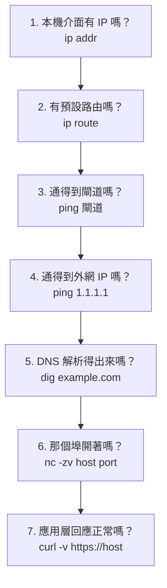
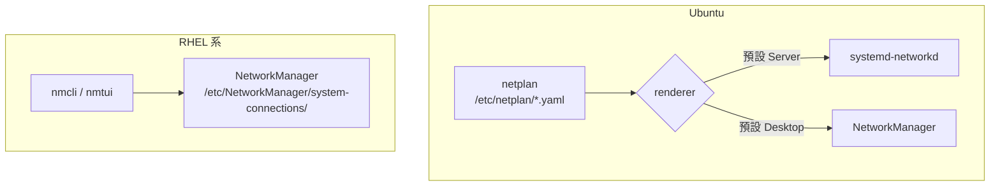

# 網路基礎指令

> [!abstract] 這篇你會學到
> - 用 `ip` 指令族取代早已過時的 `ifconfig` / `route` / `netstat` ★★
> - 用 **`nmcli`**（RHEL 系與 Ubuntu 桌面）與 **`netplan`**（Ubuntu Server）設定網路 ★★★
> - 建立一套**分層排查「連不上」**的固定流程，不再瞎猜 ★★★
> - 熟練 **`curl`** 與 **`wget`**，知道什麼時候該用哪一個 ★★
> - 搞懂 DNS 解析路徑：`/etc/hosts`、`systemd-resolved`、`/etc/resolv.conf` ★★

## 前置知識

- [[020-01-03-cmd-Linux-終端機與Shell入門]]

---

## 觀念說明

### 「連不上」要分層排查 ★★★★

九成的網路問題可以用這個順序快速定位：



> [!tip] ★★★ 這個順序的價值在於「每一步都排除一整層」
> - 第 3 步不通 → 問題在本機設定或實體/虛擬網路，不用再看 DNS ★★
> - 第 4 步不通但第 3 步通 → 路由或上游問題 ★★
> - 第 5 步不通但第 4 步通 → **純 DNS 問題** ★★
> - 第 6 步不通但第 5 步通 → 防火牆或服務沒啟動 ★★
> - 第 7 步異常但第 6 步通 → 應用層問題
>
> ★★★★ **不要跳步驟。** 從第 7 步開始猜是最沒效率的做法。

### 舊指令與新指令對照 ★★

`ifconfig`、`route`、`netstat` 屬於 `net-tools`，**已停止維護超過十年**，
許多現代功能（多 IP、策略路由、VLAN、namespace）它們顯示不出來。

| 舊（net-tools） | 新（iproute2） | 說明 |
| --- | --- | --- |
| `ifconfig` | **`ip addr`** | ★★★ 查看 IP |
| `ifconfig eth0 up/down` | `ip link set eth0 up/down` | 啟用/停用介面 |
| `ifconfig eth0 192.0.2.1/24` | `ip addr add 192.0.2.1/24 dev eth0` | 設定 IP |
| `route -n` | **`ip route`** | ★★ 路由表 |
| `route add default gw X` | `ip route add default via X` | 新增路由 |
| `arp -a` | `ip neigh` | ARP 表 |
| `netstat -tlnp` | **`ss -tlnp`** | ★★★ 監聽中的埠 |
| `netstat -i` | `ip -s link` | 介面統計 |

> [!warning] ★★ `ifconfig` 在最小安裝的系統上根本不存在
> ```
> bash: ifconfig: command not found
> ```
> Ubuntu Server 與 RHEL 最小安裝預設**不裝 `net-tools`**。
> 與其去 `apt install net-tools`，不如直接學 `ip`——
> ★★ 它一定存在，而且功能完整得多。

---

## 基礎操作

### `ip addr`：查看與設定 IP ★★★

```bash
ip addr                    # 完整輸出（可簡寫 ip a）
ip -br addr                # ★★★ ✓ 簡潔格式，最實用
ip -4 addr                 # 只看 IPv4
ip -6 addr                 # 只看 IPv6
ip addr show eth0          # 指定介面
ip -c addr                 # 彩色輸出
ip -j addr                 # JSON 格式（給腳本用）
```

```bash
ip -br -c addr
```

```
lo               UNKNOWN        127.0.0.1/8 ::1/128
eth0             UP             192.168.1.50/24 fe80::215:5dff:fe01:2/64
docker0          DOWN           172.17.0.1/16
```

`-br`（brief）三欄：**介面名稱｜狀態｜IP 位址**。

完整輸出的解讀：

```bash
ip addr show eth0
```

```
2: eth0: <BROADCAST,MULTICAST,UP,LOWER_UP> mtu 1500 qdisc fq_codel state UP group default qlen 1000
    link/ether 00:15:5d:01:00:02 brd ff:ff:ff:ff:ff:ff
    inet 192.168.1.50/24 brd 192.168.1.255 scope global dynamic eth0
       valid_lft 84532sec preferred_lft 84532sec
    inet6 fe80::215:5dff:fe01:2/64 scope link
```

| 欄位 | 意義 |
| --- | --- |
| `<...UP,LOWER_UP>` | ★★★ **`UP`** = 管理上啟用；**`LOWER_UP`** = 實體層有訊號 |
| `mtu 1500` | ★★ 最大封包大小 |
| `state UP` | 目前狀態 |
| `link/ether` | MAC 位址 |
| `inet .../24` | IPv4 位址與遮罩 |
| `dynamic` | ★★★ **由 DHCP 取得**（沒這個字就是靜態） |
| `valid_lft` | DHCP 租約剩餘秒數 |
| `scope global` | ★★ 可對外；`scope link` 只在本網段 |

> [!tip] ★★★ `UP` 但沒有 `LOWER_UP` = 網路線沒插或對端沒開
> ```
> 2: eth0: <BROADCAST,MULTICAST,UP> mtu 1500 ... state DOWN
> ```
> 少了 `LOWER_UP` 且 `state DOWN`，代表**實體層沒有連線**。
> 在實體機上通常是網路線鬆脫或交換器埠被關；
> 在虛擬機上是虛擬網卡沒接到網路。
>
> 檢查實體連線狀態：
> ```bash
> sudo ethtool eth0 | grep -E 'Link detected|Speed|Duplex'
> ```
> ```
>         Speed: 1000Mb/s
>         Duplex: Full
>         Link detected: yes
> ```
> ★★ **`Speed` 不是預期值**（例如接在 Gb 交換器上卻只有 100Mb/s）
> 通常是線材品質或協商問題，見 [[040-02-08-guide-機房-結構化佈線與標籤規範]]。

**臨時設定 IP**（重開機後消失，適合救援與測試）：

```bash
sudo ip addr add 192.168.1.99/24 dev eth0    # ★★★ 臨時加 IP，救援時很好用
sudo ip addr del 192.168.1.99/24 dev eth0
sudo ip link set eth0 up
sudo ip link set eth0 down                   # ★★★★ 遠端下這行會立刻斷線
sudo ip link set eth0 mtu 9000               # ★★ 兩端與交換器要一致
```

> [!warning] ★★★★ `ip addr` 的設定不會持久化
> 重開機或 NetworkManager 重載就沒了。
> **永久設定要寫進 netplan 或 nmcli**（見下方）。
>
> ★★ 但這正是它的價值——**救援時的臨時手段**：
> 設定檔寫錯導致沒有網路時，用 `ip addr add` 先恢復連線，
> 再慢慢修設定檔。

### `ip route`：路由表 ★★★

```bash
ip route                          # ★★ 路由表（可簡寫 ip r）
ip -br route
ip route get 8.8.8.8              # ★★★ ✓ 查「連到這個 IP 會走哪條路」
ip route show table all           # 所有路由表（含策略路由）
```

```bash
ip route
```

```
default via 192.168.1.1 dev eth0 proto dhcp src 192.168.1.50 metric 100
172.17.0.0/16 dev docker0 proto kernel scope link src 172.17.0.1 linkdown
192.168.1.0/24 dev eth0 proto kernel scope link src 192.168.1.50 metric 100
```

- **`default via 192.168.1.1`** — 預設閘道，找不到其他路由就走這裡 ★★★
- `192.168.1.0/24 dev eth0` — 本網段直接送
- `metric` — 多條路由時**數字小的優先** ★★

```bash
ip route get 8.8.8.8
```

```
8.8.8.8 via 192.168.1.1 dev eth0 src 192.168.1.50 uid 1000
```

> [!tip] ★★★ `ip route get` 是排查路由問題的最快指令
> 它直接告訴你「這個目的地會走哪個介面、哪個閘道、用哪個來源 IP」。
> 多網卡、VPN、Docker 環境下特別有用——
> 一行就知道流量是不是走到了預期的路徑。

**臨時新增路由**：

```bash
sudo ip route add default via 192.168.1.1 dev eth0
sudo ip route add 10.0.0.0/8 via 192.168.1.254 dev eth0
sudo ip route del 10.0.0.0/8
```

### 其他 `ip` 子指令 ★★

```bash
ip link                    # 介面清單（含未設 IP 的）
ip -br link
ip -s link show eth0       # ★★★ 收發封包統計與錯誤計數
ip neigh                   # ARP / NDP 表
ip -br neigh
```

```bash
ip -s link show eth0
```

```
2: eth0: <BROADCAST,MULTICAST,UP,LOWER_UP> mtu 1500 ...
    RX: bytes  packets  errors  dropped missed  mcast
    892134521  1204832  0       12      0       4821
    TX: bytes  packets  errors  dropped carrier collsns
    412093822  982103   0       0       0       0
```

> [!tip] ★★★★ `errors` 或 `dropped` 持續增加代表實體層有問題
> 正常情況這兩個數字應該接近 0 且不成長。
> 持續增加的話檢查：網路線、光模組、交換器埠錯誤計數、MTU 不一致。
>
> ```bash
> # 觀察是否持續增加
> watch -n 2 'ip -s link show eth0 | grep -A1 RX'
> ```

### `ss`：查看連線與監聽埠 ★★★

```bash
ss -tlnp                   # ★★★ ✓ 最常用：TCP、監聽中、數字、程序
ss -ulnp                   # UDP
ss -tulnp                  # ★★ 兩者都要
ss -tn state established   # ★★ 已建立的 TCP 連線
ss -s                      # 統計摘要
ss -tnp dst 203.0.113.5    # 連到特定對象的連線
ss -tlnp 'sport = :443'    # 特定埠
```

```bash
sudo ss -tlnp
```

```
State  Recv-Q Send-Q Local Address:Port  Peer Address:Port Process
LISTEN 0      511          0.0.0.0:80         0.0.0.0:*     users:(("nginx",pid=891,fd=6))
LISTEN 0      511          0.0.0.0:443        0.0.0.0:*     users:(("nginx",pid=891,fd=7))
LISTEN 0      70         127.0.0.1:33060      0.0.0.0:*     users:(("mysqld",pid=1533,fd=21))
LISTEN 0      151        127.0.0.1:3306       0.0.0.0:*     users:(("mysqld",pid=1533,fd=23))
```

> [!danger] ★★★★★ 注意 `0.0.0.0` 與 `127.0.0.1` 的差別
> - **`0.0.0.0:80`** — 監聽**所有介面**，任何人都連得到（含公網）★★★★
> - **`127.0.0.1:3306`** — 只監聽本機，外面連不到 ★★★
>
> 上面的例子中 MySQL 只綁 `127.0.0.1`（正確），Nginx 綁全部（正常，它就是要對外）。
>
> ★★★★★ **資料庫、快取、管理介面出現 `0.0.0.0` 就是資安問題**：
> ```bash
> sudo ss -tlnp | awk '$4 ~ /^(0\.0\.0\.0|\[::\]):/ {print}'
> ```
> 這一行列出所有對外監聽的服務，逐一確認是否應該對外。
> 見 [[060-04-01-07-svc-MySQL-安全強化]]、[[000-04-ref-索引-連接埠速查]]。

### `ping` 與 `traceroute` ★★

```bash
ping -c 4 192.168.1.1              # ★★ 送 4 個封包就停
ping -c 4 -W 1 8.8.8.8             # ★★ 每個封包等 1 秒逾時
ping -I eth0 8.8.8.8               # ★ 指定介面
ping -s 1472 -M do 8.8.8.8         # ★★★ 測試 MTU（不分片）
ping6 -c 4 2001:4860:4860::8888
```

```bash
traceroute 8.8.8.8
mtr 8.8.8.8                        # ★★★ ✓ 持續追蹤，比 traceroute 好用
mtr -r -c 10 8.8.8.8               # 報表模式，跑 10 輪後輸出
```

> [!warning] ★★★ `ping` 不通不代表主機掛了
> 很多防火牆會擋 ICMP。用 `nc` 測特定埠比較準：
> ```bash
> nc -zv example.com 443
> ```
> ```
> Connection to example.com (93.184.216.34) 443 port [tcp/https] succeeded!
> ```
> 沒有 `nc` 的話用 bash 內建：
> ```bash
> timeout 3 bash -c '</dev/tcp/example.com/443' && echo "通" || echo "不通"
> ```

> [!tip] ★★★★ 用 `ping -s -M do` 找出 MTU 問題
> ★★★ 症狀：小的請求正常，大的檔案傳輸卡住或很慢（常見於 VPN、PPPoE）。
> ```bash
> ping -c 2 -s 1472 -M do 8.8.8.8     # 1472 + 28 = 1500
> ```
> ```
> ping: local error: message too long, mtu=1420
> ```
> 代表路徑上的 MTU 只有 1420，要調整介面 MTU：
> ```bash
> sudo ip link set eth0 mtu 1420
> ```

### DNS 查詢 ★★

```bash
dig example.com                    # 完整查詢
dig +short example.com             # ★★★ ✓ 只要答案
dig example.com MX                 # ★★ 指定紀錄類型
dig @8.8.8.8 example.com           # ★★★ 指定 DNS 伺服器
dig +trace example.com             # ★★ 從根伺服器開始追蹤
dig -x 93.184.216.34               # 反解
host example.com                   # 簡單查詢
resolvectl query example.com       # systemd-resolved 的查詢（Ubuntu）
resolvectl status                  # ★★★ 目前用哪些 DNS
```

```bash
dig +short example.com
```

```
93.184.216.34
```

> [!tip] ★★★ 比較「本機解析」與「權威解析」找出快取問題
> ```bash
> dig +short example.com              # 用你目前的 DNS
> dig +short @8.8.8.8 example.com     # 用公共 DNS
> dig +short @ns1.example.com example.com   # 直接問權威伺服器
> ```
> ★★★ 三者不一致 = **有一層還在用快取**。
> 這是換 IP 後「有些人看得到新站有些人看到舊站」的原因。
> 詳見 [[060-01-04-06-guide-dig-與DNS排查]]。

### `/etc/hosts` 與解析順序 ★★

```bash
cat /etc/hosts
```

```
127.0.0.1       localhost
127.0.1.1       lab01
192.168.1.100   db-internal.example.com db-internal
```

```bash
cat /etc/nsswitch.conf | grep hosts
```

```
hosts:          files mdns4_minimal [NOTFOUND=return] dns
```

★★★ `files` 在 `dns` 之前 → **`/etc/hosts` 優先於 DNS**。

> [!tip] ★★ `/etc/hosts` 是測試新伺服器的好工具
> 網站要搬家，想在改 DNS 前先測試新機器：
> ```bash
> # 在你自己的電腦加一行
> 203.0.113.99  example.com www.example.com
> ```
> 這樣只有你會連到新機器，其他人還是舊的。測試完拿掉。
>
> ★★★ **但要記得拿掉**——忘記移除會造成「只有我連不到正確的機器」，
> 而且很難想到原因。

### `/etc/resolv.conf` 的陷阱 ★★

```bash
cat /etc/resolv.conf
```

```
# This file is managed by man:systemd-resolved(8). Do not edit.
nameserver 127.0.0.53
options edns0 trust-ad
search example.com
```

> [!danger] ★★★★ 直接改 `/etc/resolv.conf` 通常無效
> 現代 Ubuntu 上它是**指向 systemd-resolved 的符號連結**，
> 你改了會被覆蓋，而且 `127.0.0.53` 只是本機的 stub 解析器。
>
> ```bash
> ls -l /etc/resolv.conf
> ```
> ```
> lrwxrwxrwx 1 root root 39 ... /etc/resolv.conf -> ../run/systemd/resolve/stub-resolv.conf
> ```
>
> **看真正的上游 DNS**：
> ```bash
> resolvectl status | grep -A3 'Link.*eth0'
> ```
> ```
> Link 2 (eth0)
>     Current Scopes: DNS
>          Protocols: +DefaultRoute
> Current DNS Server: 192.168.1.1
>        DNS Servers: 192.168.1.1 8.8.8.8
> ```
>
> ★★★ **要改 DNS 就改 netplan 或 nmcli**（見下方），不要改 `resolv.conf`。

---

## 網路設定：`netplan` 與 `nmcli`

### 哪個系統用哪個 ★★

| 系統 | 主要工具 | 設定檔位置 |
| --- | --- | --- |
| **Ubuntu Server** | **`netplan`** | ★★★ `/etc/netplan/*.yaml` |
| Ubuntu Desktop | netplan → NetworkManager | 同上，`renderer: NetworkManager` |
| **RHEL / Rocky / Alma** | **`nmcli`**（NetworkManager） | ★★★ `/etc/NetworkManager/system-connections/` |
| Debian（傳統） | `/etc/network/interfaces` | 同左 |



### `netplan`（Ubuntu Server）★★★

```bash
ls /etc/netplan/
sudo cat /etc/netplan/50-cloud-init.yaml
```

★★★ **靜態 IP 設定範例**：

```bash
sudo tee /etc/netplan/99-static.yaml > /dev/null <<'NETPLAN'
network:
  version: 2
  renderer: networkd
  ethernets:
    eth0:
      dhcp4: false
      addresses:
        - 192.168.1.50/24
      routes:
        - to: default
          via: 192.168.1.1
      nameservers:
        addresses: [192.168.1.1, 1.1.1.1]
        search: [example.com]
NETPLAN

sudo chmod 600 /etc/netplan/99-static.yaml
```

套用：

```bash
sudo netplan generate         # ★★★ 產生後端設定，檢查語法
sudo netplan try              # ★★★★ ✓ 套用，120 秒內沒確認就自動還原
sudo netplan apply            # ★★★★ 直接套用（有風險）
```

> [!danger] ★★★★★ **遠端操作一定要用 `netplan try`，不要用 `apply`**
> `netplan try` 套用新設定後會倒數 120 秒，
> 你必須按 Enter 確認才會保留；**沒確認就自動還原**。
>
> 這樣即使設定錯誤導致連線中斷，兩分鐘後網路就會自己恢復。
> ★★★★ 用 `apply` 設錯就直接失聯，只能去機房或用主控台。
>
> ```
> Do you want to keep these settings?
> Press ENTER before the timeout to accept the new configuration
> Changes will revert in 118 seconds
> ```

> [!warning] ★★★ netplan 的 YAML 對縮排極度敏感
> ★★★★ 必須用**空白**（不能用 Tab），縮排錯誤會導致設定完全不生效
> 而且不一定報錯。
> ```bash
> sudo netplan generate        # 先驗證語法
> sudo netplan --debug apply   # 看它實際做了什麼
> ```

> [!warning] ★★★ 檔案權限要 600
> netplan 檔案可能含 WiFi 密碼。權限太寬會警告：
> ```
> Permissions for /etc/netplan/99-static.yaml are too open.
> ```
> ```bash
> sudo chmod 600 /etc/netplan/*.yaml
> ```

**多個 netplan 檔案的合併規則**：依檔名數字順序讀取，
**後面的覆蓋前面的**。所以自訂設定用 `99-` 開頭。★★

### `nmcli`（RHEL 系與 Ubuntu 桌面）★★★

`nmcli` 是 NetworkManager 的指令列介面，**設定立即生效且自動持久化**。★★★

**查看**：

```bash
nmcli                             # 完整狀態總覽
nmcli device status               # ★★★ ✓ 介面與連線狀態
nmcli device show eth0            # 某介面的詳細資訊
nmcli connection show             # ★★ 所有連線設定檔
nmcli connection show "有線連線 1" # 某個設定檔的完整內容
nmcli general status
nmcli -f IP4 device show eth0     # 只看 IPv4 相關欄位
```

```bash
nmcli device status
```

```
DEVICE  TYPE      STATE      CONNECTION
eth0    ethernet  connected  System eth0
lo      loopback  unmanaged  --
```

```bash
nmcli connection show
```

```
NAME         UUID                                  TYPE      DEVICE
System eth0  5fb06bd0-0bb0-7ffb-45f1-d6edd65f3e03  ethernet  eth0
```

> [!tip] ★★★ 「device」與「connection」是兩個不同概念
> - **device**（裝置）= 實體或虛擬網卡，如 `eth0`
> - **connection**（連線設定檔）= 一組設定，可以套用到裝置上
>
> 一張網卡可以有多個設定檔（辦公室、家裡、機房），隨時切換。
> `nmcli con up <名稱>` 就是「套用這組設定」。

**設定靜態 IP**：

```bash
CON="System eth0"

sudo nmcli connection modify "$CON" \
    ipv4.method manual \
    ipv4.addresses 192.168.1.50/24 \
    ipv4.gateway 192.168.1.1 \
    ipv4.dns "192.168.1.1 1.1.1.1" \
    ipv4.dns-search "example.com" \
    connection.autoconnect yes

# ★★★ 套用（會短暫斷線）
sudo nmcli connection up "$CON"
```

**改回 DHCP**：

```bash
sudo nmcli connection modify "$CON" \
    ipv4.method auto \
    ipv4.addresses "" ipv4.gateway "" ipv4.dns ""
sudo nmcli connection up "$CON"
```

**建立新連線設定檔**：

```bash
sudo nmcli connection add \
    type ethernet \
    con-name "static-lan" \
    ifname eth0 \
    ipv4.method manual \
    ipv4.addresses 192.168.1.50/24 \
    ipv4.gateway 192.168.1.1 \
    ipv4.dns "1.1.1.1,8.8.8.8"

sudo nmcli connection up static-lan
```

**其他常用操作**：

```bash
sudo nmcli connection reload            # ★★ 重新讀取設定檔
sudo nmcli device reapply eth0          # ★★★ 套用變更但不斷線（可能）
sudo nmcli device disconnect eth0       # ★★★★ 遠端下這行會斷線
sudo nmcli device connect eth0
sudo nmcli connection delete static-lan
sudo nmcli networking off / on          # ★★★ 全部關閉/開啟
nmcli connection export "System eth0"   # 匯出設定
```

> [!tip] ★★ `nmtui` 是文字介面版，遠端改設定較安全
> ```bash
> sudo nmtui
> ```
> 選單式操作，不容易打錯參數。適合不熟 `nmcli` 語法時使用。
>
> 更保險的做法是先設定 autoconnect 與一個「已知可用」的備援設定檔，
> 設錯時可以透過主控台快速切回去。

> [!danger] ★★★★ 遠端執行 `nmcli connection up` 會斷線
> 修改自己正在使用的連線並 `up` 之後，SSH 會斷。
> 如果新設定有誤，你就連不回來了。
>
> ★★★★ **安全做法**：用 `at` 排一個「五分鐘後還原」的保險：
> ```bash
> # 先安排保險（五分鐘後切回 DHCP）
> echo 'nmcli con mod "System eth0" ipv4.method auto ipv4.addresses "" ipv4.gateway ""; nmcli con up "System eth0"' \
>   | sudo at now + 5 minutes
>
> # 再套用新設定
> sudo nmcli connection up "System eth0"
>
> # 連得回來就取消保險
> sudo atq                 # 看工作編號
> sudo atrm <編號>
> ```
> 這是 `netplan try` 的手動版本。見 [[020-01-18-guide-Linux-排程工作]]。

### `/etc/hosts` 與主機名稱 ★★

```bash
hostnamectl                                   # 查看
sudo hostnamectl set-hostname web01           # ★★ 設定
sudo hostnamectl set-hostname "Web 伺服器 01" --pretty
```

---

## `curl` 與 `wget`

### 該用哪一個 ★★

| | `curl` | `wget` |
| --- | --- | --- |
| ★★★ 定位 | **傳輸資料**（送與收） | **下載檔案** |
| ★★★ 預設輸出 | **stdout**（螢幕） | **檔案** |
| 遞迴下載整站 | ❌ | ✅ `-r` |
| 續傳 | `-C -` | `-c` |
| 支援協定 | 極多（HTTP/FTP/SFTP/SMTP/…） | HTTP/HTTPS/FTP |
| ★★ 送 POST / 自訂標頭 | ✅ **強項** | 有限 |
| 預設安裝 | 多數系統有 | 多數系統有 |

> [!tip] ★★★ 一句話原則
> **測試 API、除錯 HTTP → `curl`。單純把檔案抓下來 → `wget`。**

### `curl` 常用 ★★★

```bash
curl https://example.com                    # 輸出到螢幕
curl -o page.html https://example.com       # 存成指定檔名
curl -O https://example.com/file.tar.gz     # 用遠端檔名存檔
curl -L https://example.com                 # ★★★ ✓ 跟隨重導向
curl -s https://example.com                 # 安靜模式（腳本用）
curl -sS https://example.com                # ★★★ 安靜但仍顯示錯誤 ← 腳本建議
curl -f https://example.com                 # ★★★★ HTTP 錯誤時回傳非 0 退出碼
curl -I https://example.com                 # 只要標頭（HEAD）
curl -v https://example.com                 # ★★ ✓ 顯示完整請求與回應
curl -k https://self-signed.local           # ★★★★ 略過憑證驗證（僅測試用！）
curl --max-time 10 https://example.com      # 總逾時
curl --connect-timeout 3 https://example.com # 連線逾時
```

★★★ **腳本裡的標準組合**：

```bash
curl -fsSL https://example.com/api/status
```

| 選項 | 作用 |
| --- | --- |
| `-f` | ★★★★ HTTP 4xx/5xx 時**回傳失敗退出碼**（沒有它 curl 會回 0！） |
| `-s` | 不顯示進度條 |
| `-S` | ★★ 但仍顯示錯誤訊息 |
| `-L` | ★★★ 跟隨重導向 |

> [!danger] ★★★★ 沒有 `-f`，`curl` 收到 404 也會回傳成功
> ```bash
> curl -s https://example.com/notfound > out.html
> echo $?
> ```
> ```
> 0        ← 明明是 404！out.html 存的是錯誤頁面
> ```
> ```bash
> curl -fsS https://example.com/notfound > out.html
> echo $?
> ```
> ```
> curl: (22) The requested URL returned error: 404
> 22       ← ✓ 正確反映失敗
> ```
> ★★★ **腳本裡下載東西一定要加 `-f`**，否則會把錯誤頁面當成正確檔案存下來。

**API 測試**：

```bash
# ★★ POST JSON
curl -sS -X POST https://api.example.com/users \
     -H "Content-Type: application/json" \
     -H "Authorization: Bearer $TOKEN" \
     -d '{"name":"Alice","email":"alice@example.com"}'

# 從檔案送出 body
curl -sS -X POST https://api.example.com/users \
     -H "Content-Type: application/json" \
     -d @payload.json

# 表單
curl -sS -X POST https://example.com/login \
     -d "user=admin" -d "pass=secret"

# ★ 上傳檔案
curl -sS -F "file=@report.pdf" -F "title=月報" https://example.com/upload

# 保持 cookie
curl -c cookies.txt -d "user=x&pass=y" https://example.com/login
curl -b cookies.txt https://example.com/dashboard
```

**除錯與量測**：

```bash
curl -v https://example.com 2>&1 | head -30
```

```
* Connected to example.com (93.184.216.34) port 443
* ALPN: server accepted h2
* SSL certificate verify ok.
* using HTTP/2
> GET / HTTP/2
> Host: example.com
> User-Agent: curl/8.5.0
>
< HTTP/2 200
< content-type: text/html; charset=UTF-8
< server: nginx
```

★★ `>` 是你送出的，`<` 是伺服器回的。

```bash
# ★★★ 量測各階段耗時（找出瓶頸在 DNS、連線還是伺服器）
curl -sS -o /dev/null -w '
DNS 解析    : %{time_namelookup}s
TCP 連線    : %{time_connect}s
TLS 握手    : %{time_appconnect}s
首位元組    : %{time_starttransfer}s
總計        : %{time_total}s
HTTP 狀態   : %{http_code}
下載大小    : %{size_download} bytes
' https://example.com
```

```
DNS 解析    : 0.004521s
TCP 連線    : 0.021043s
TLS 握手    : 0.089122s
首位元組    : 0.312884s
總計        : 0.318201s
HTTP 狀態   : 200
下載大小    : 1256 bytes
```

> [!tip] ★★★ 這個量測是判斷「網站慢在哪」的利器
> | 哪一段特別長 | 問題在 |
> | --- | --- |
> | `time_namelookup` | ★★ DNS 伺服器慢 |
> | `time_connect` | ★★ 網路延遲或封包遺失 |
> | `time_appconnect` | ★★ TLS 握手慢（憑證鏈太長、OCSP） |
> | **`time_starttransfer`** | ★★★ **後端處理慢**（PHP、資料庫） |
> | `time_total` 減 `time_starttransfer` | 內容傳輸慢（頻寬、檔案大） |
>
> 見 [[060-01-04-05-guide-curl-與HTTP除錯]] 與 [[060-01-03-04-guide-監控-效能瓶頸排查方法論]]。

```bash
# ★★★ 強制走特定 IP（測試新伺服器，不用改 /etc/hosts）
curl -sS --resolve example.com:443:203.0.113.99 https://example.com

# ★ 檢視憑證
curl -vI https://example.com 2>&1 | grep -E 'subject|issuer|expire'

# 指定 HTTP 版本
curl --http1.1 https://example.com
curl --http3 https://example.com
```

> [!tip] ★★ `--resolve` 比改 `/etc/hosts` 好
> 測試新伺服器時不用改系統設定、不會忘記還原、
> 而且只影響這一次的請求。

### `wget` 常用 ★★

```bash
wget https://example.com/file.tar.gz             # 下載
wget -O custom.tar.gz https://example.com/f.gz   # 指定檔名
wget -c https://example.com/big.iso              # ★★★ ✓ 續傳
wget -q https://example.com/f                    # 安靜
wget -b https://example.com/big.iso              # 背景下載
wget --limit-rate=1m https://example.com/big.iso # ★★ 限速
wget -t 5 -T 30 https://example.com/f            # ★★ 重試 5 次、逾時 30 秒
wget --spider https://example.com                # 只檢查存在，不下載
wget -i urls.txt                                 # 從檔案讀取多個網址
```

**遞迴下載（`curl` 做不到）**：

```bash
wget -r -np -k -p -E https://docs.example.com/manual/
```

| 選項 | 作用 |
| --- | --- |
| `-r` | 遞迴 |
| `-np` | ★★★ **不往上層目錄爬** |
| `-k` | 把連結改成本機路徑（可離線瀏覽） |
| `-p` | 一併下載圖片、CSS 等頁面元素 |
| `-E` | 動態頁面存成 `.html` |
| `-l N` | 遞迴深度 |
| `-w 1` | ★★★ 每次請求間隔 1 秒（**禮貌，避免被擋**） |

> [!warning] ★★★★ 遞迴下載別人的網站要節制
> 沒有 `-w` 的話 `wget -r` 會用最快速度瘋狂請求，
> ★★★ 對方可能視為 DoS 攻擊而封鎖你的 IP。
> 至少加 `-w 1 --random-wait`，並遵守 `robots.txt`。

**驗證下載完整性**：

```bash
wget https://example.com/app.tar.gz
wget https://example.com/app.tar.gz.sha256
sha256sum -c app.tar.gz.sha256
```

```
app.tar.gz: OK
```

> [!danger] ★★★★ 下載後一定要驗證
> ★★★ 網路傳輸可能不完整，映像站可能被入侵。
> 官方有提供 checksum 或 GPG 簽章就一定要驗：
> ```bash
> # GPG 簽章驗證（更強）
> wget https://example.com/app.tar.gz{,.asc}
> gpg --verify app.tar.gz.asc app.tar.gz
> ```
> 見 [[020-01-14-guide-Linux-套件管理]]。

> [!info]- Rocky / AlmaLinux（RHEL 系）對照
>
> | 項目 | Debian / Ubuntu | RHEL 系 |
> | --- | --- | --- |
> | **網路設定工具** | **netplan**（`/etc/netplan/*.yaml`） | ★★★ **nmcli**（NetworkManager） |
> | 設定檔位置 | `/etc/netplan/` | `/etc/NetworkManager/system-connections/` |
> | 安全套用 | `netplan try`（自動還原） | ★★★★ `nmcli`（需自己安排保險） |
> | `dig` 套件 | `dnsutils` | ★★ **`bind-utils`** |
> | `ip` / `ss` 套件 | `iproute2` | **`iproute`** |
> | `ifconfig` / `netstat` | `net-tools` | `net-tools` |
> | `mtr` | `mtr-tiny` / `mtr` | `mtr` |
> | DNS 解析器 | systemd-resolved（`127.0.0.53`） | ★★ 直接寫 `/etc/resolv.conf`（由 NM 管理） |
> | 防火牆 | `ufw` | ★★★ **`firewalld`** |
>
> ★★★ RHEL 系**沒有 netplan**。舊版的 `/etc/sysconfig/network-scripts/ifcfg-*`
> 在 RHEL 9 已被移除，一律用 `nmcli` 或直接編輯
> `/etc/NetworkManager/system-connections/*.nmconnection`（權限需 600）。
>
> ★★★ 另外 RHEL 系預設啟用 firewalld，**服務起來了但連不到，先檢查防火牆**：
> ```bash
> sudo firewall-cmd --list-all
> sudo firewall-cmd --add-service=http --permanent
> sudo firewall-cmd --reload
> ```
> 見 [[090-02-04-guide-防火牆-firewalld]]。

---

## 完整實戰範例：「網站連不上」的完整排查

```bash
#!/usr/bin/env bash
# netcheck.sh — 分層排查網路連線問題
set -uo pipefail    # ★★ 刻意不用 -e：七層要全部跑完才看得出斷在哪

TARGET="${1:-example.com}"
PORT="${2:-443}"

pass() { printf '  ✅ %s\n' "$1"; }
fail() { printf '  ❌ %s\n' "$1"; }

echo "════ 第 1 層：本機介面 ════"
ip -br -c addr | grep -v '^lo'
if ip -br addr | grep -qv '^lo.*' && ip -4 addr | grep -q 'inet .* scope global'; then
    pass "有 global 範圍的 IPv4 位址"
else
    fail "沒有可用的 IPv4 位址 → 檢查 netplan / nmcli 設定與 DHCP"
    exit 1
fi

echo
echo "════ 第 2 層：路由 ════"
ip route
GW=$(ip route | awk '/^default/ {print $3; exit}')   # ★★★ 沒有這行輸出就是沒預設路由
if [ -n "$GW" ]; then pass "預設閘道：$GW"; else fail "沒有預設路由"; exit 1; fi

echo
echo "════ 第 3 層：閘道連通性 ════"
if ping -c 2 -W 2 "$GW" > /dev/null 2>&1; then
    pass "閘道 $GW 可達"
else
    fail "閘道不可達 → 檢查實體連線、VLAN、交換器埠"
    ip -s link | grep -A2 'eth\|ens'
fi

echo
echo "════ 第 4 層：外網連通性 ════"
if ping -c 2 -W 2 1.1.1.1 > /dev/null 2>&1; then
    pass "外網 IP 可達（1.1.1.1）"
else
    fail "外網不可達 → 檢查上游路由、防火牆、NAT"
fi

echo
echo "════ 第 5 層：DNS 解析 ════"
resolvectl status 2>/dev/null | grep -E 'Current DNS Server|DNS Servers' | head -3
IP=$(dig +short "$TARGET" A | head -1)
if [ -n "$IP" ]; then
    pass "$TARGET → $IP"
    PUB=$(dig +short @1.1.1.1 "$TARGET" A | head -1)
    [ "$IP" = "$PUB" ] && pass "與公共 DNS 結果一致" \
                       || fail "與公共 DNS 不一致（$PUB）→ 可能有快取或本機覆寫"
    grep -q "$TARGET" /etc/hosts 2>/dev/null && fail "⚠ /etc/hosts 有這個網域的覆寫！"   # ★★★ 最常被漏掉的一條
else
    fail "DNS 解析失敗 → 檢查 DNS 伺服器設定"
    exit 1
fi

echo
echo "════ 第 6 層：埠連通性 ════"
if timeout 5 bash -c "</dev/tcp/$TARGET/$PORT" 2>/dev/null; then
    pass "$TARGET:$PORT 可連線"
else
    fail "$TARGET:$PORT 不通 → 檢查防火牆、服務是否啟動"
    echo "     本機監聽狀況："
    sudo ss -tlnp 2>/dev/null | grep ":$PORT " || echo "     （本機沒有監聽 $PORT）"   # ★★ 分辨「沒開服務」與「被防火牆擋」
fi

echo
echo "════ 第 7 層：應用層回應 ════"
curl -sS -o /dev/null -w '  HTTP %{http_code}｜DNS %{time_namelookup}s｜連線 %{time_connect}s｜TLS %{time_appconnect}s｜首位元組 %{time_starttransfer}s｜總計 %{time_total}s\n' \
     --max-time 15 "https://$TARGET" || fail "HTTP 請求失敗"

echo
echo "════ 憑證資訊 ════"
echo | timeout 5 openssl s_client -connect "$TARGET:$PORT" -servername "$TARGET" 2>/dev/null \
  | openssl x509 -noout -subject -issuer -dates 2>/dev/null || echo "  （無法取得憑證）"
```

執行：

```bash
./netcheck.sh example.com 443
```

```
════ 第 1 層：本機介面 ════
eth0             UP             192.168.1.50/24
  ✅ 有 global 範圍的 IPv4 位址

════ 第 2 層：路由 ════
default via 192.168.1.1 dev eth0 proto dhcp metric 100
  ✅ 預設閘道：192.168.1.1

════ 第 5 層：DNS 解析 ════
  ✅ example.com → 93.184.216.34
  ✅ 與公共 DNS 結果一致

════ 第 7 層：應用層回應 ════
  HTTP 200｜DNS 0.004s｜連線 0.021s｜TLS 0.089s｜首位元組 0.312s｜總計 0.318s

════ 憑證資訊 ════
subject=CN = example.com
issuer=C = US, O = Let's Encrypt, CN = R3
notBefore=Jul 15 00:00:00 2026 GMT
notAfter=Oct 13 23:59:59 2026 GMT
```

> [!tip] ★★ 把這個腳本放進 `/usr/local/bin`
> 每次有人回報「連不上」，跑一次就知道問題在哪一層，
> 不用從頭問「你 ping 得到嗎」。

---

## 常見錯誤與排錯

| 現象 | 原因 | 解法 |
| --- | --- | --- |
| ★★ `ifconfig: command not found` | 最小安裝沒有 net-tools | 改用 `ip addr`（更好）或 `apt install net-tools` |
| ★★★★ `ip addr add` 設的 IP 重開機後消失 | `ip` 指令不持久化 | 寫進 netplan 或 nmcli |
| ★★★ 改了 `/etc/resolv.conf` 沒作用 | 它由 systemd-resolved 管理且會被覆寫 | 改 netplan 的 `nameservers` 或 `nmcli ipv4.dns` |
| ★★★★★ `netplan apply` 之後失聯 | 設定錯誤 | **一律用 `netplan try`**；已失聯只能用主控台 |
| ★★★ netplan 設定完全沒生效 | YAML 縮排錯誤（用了 Tab） | `netplan generate` 驗證；只用空白縮排 |
| ★★★★ `nmcli con up` 之後 SSH 斷線 | 修改了正在使用的連線 | 事前用 `at` 排保險還原 |
| ★★★ `ping` 不通但服務其實正常 | 防火牆擋 ICMP | 用 `nc -zv host port` 測 |
| ★★★ DNS 有時對有時錯 | 多個 DNS 伺服器回答不一致 | `dig @每個伺服器` 逐一比對 |
| ★★★ 只有我連到舊 IP | `/etc/hosts` 有殘留覆寫 | `grep 網域 /etc/hosts` |
| ★★★★ 小請求正常、大檔傳輸卡住 | MTU 不一致 | `ping -s 1472 -M do` 測；調整 `ip link set mtu` |
| ★★★★ `curl` 下載到錯誤頁面卻回報成功 | 沒加 `-f` | 腳本一律用 `curl -fsSL` |
| ★★ `curl` 重導向後沒拿到內容 | 沒加 `-L` | 加 `-L` |
| ★★★★ `curl: (60) SSL certificate problem` | 憑證鏈不完整或系統 CA 過期 | 檢查伺服器憑證鏈；`update-ca-certificates`；**不要用 `-k` 打發** |
| ★★★★★ `ss` 顯示服務綁 `0.0.0.0` | 監聽所有介面 | 資料庫等內部服務應綁 `127.0.0.1` |
| ★★★ RHEL 上服務起來了卻連不到 | firewalld 沒開埠 | `firewall-cmd --add-service=http --permanent && --reload` |
| ★★★★ `ip -s link` 的 errors 持續增加 | 實體層問題 | 檢查線材、光模組、交換器埠、MTU |

---

## 安全性注意事項

> [!danger] ★★★★ `curl -k` / `wget --no-check-certificate` 等於關閉 TLS 保護
> ```bash
> curl -k https://internal.example.com          # ✗
> wget --no-check-certificate https://x         # ✗
> ```
> ★★★★ 這會讓中間人攻擊完全生效。
>
> ★★★★ **正確做法是把內部 CA 加入系統信任**：
> ```bash
> # Debian 系
> sudo cp internal-ca.crt /usr/local/share/ca-certificates/
> sudo update-ca-certificates
>
> # RHEL 系
> sudo cp internal-ca.crt /etc/pki/ca-trust/source/anchors/
> sudo update-ca-trust
> ```
> 見 [[090-01-09-guide-PKI-根憑證派送與信任]]。

> [!danger] ★★★★ 不要把密碼或 token 放在指令列
> ```bash
> curl -H "Authorization: Bearer eyJhbGc..." https://api.example.com   # ✗ ps 看得到
> ```
> 改用檔案或環境變數：
> ```bash
> curl -H @auth-header.txt https://api.example.com
> curl --netrc-file ~/.netrc https://api.example.com
> curl -H "Authorization: Bearer $TOKEN" https://api.example.com   # 較好但仍非完美
> ```
> 見 [[020-01-10-cmd-Linux-程序管理與訊號]] 與 [[090-03-03-guide-應用安全-機密管理與金鑰保護]]。

> [!warning] ★★★★ 定期稽核對外監聽的埠
> ```bash
> sudo ss -tlnp | awk 'NR==1 || $4 ~ /^(0\.0\.0\.0|\[::\]):/'
> ```
> ★★★★★ 每一個綁在 `0.0.0.0` 的服務都是攻擊面。
> 問自己：**這個服務真的需要對外嗎？**
>
> 常見應該只綁 `127.0.0.1` 的服務：
> MySQL(3306)、PostgreSQL(5432)、Redis(6379)、Memcached(11211)、
> Elasticsearch(9200)、Qdrant(6333)、各種管理介面。
>
> 見 [[000-04-ref-索引-連接埠速查]]、[[090-02-02-guide-防火牆-ufw基礎與實務]]。

> [!warning] ★★★★ `curl | bash` 的風險
> ```bash
> curl -fsSL https://get.example.com | sudo bash    # ✗
> ```
> 見 [[020-01-14-guide-Linux-套件管理]] 的完整說明。

---

## 速查表

### 查看

| 指令 | 說明 |
| --- | --- |
| **`ip -br -c addr`** | ★★★ **IP 位址（簡潔彩色）** |
| `ip addr show eth0` | ★★ 指定介面詳細資訊 |
| **`ip route`** | ★★★ **路由表** |
| **`ip route get <IP>`** | ★★★ **查會走哪條路** |
| `ip -br link` | ★★ 介面清單 |
| `ip -s link show eth0` | ★★ 收發統計與錯誤計數 |
| `ip neigh` | ★★ ARP 表 |
| **`ss -tlnp`** | ★★★ **監聽中的埠與程序** |
| `ss -tn state established` | ★★ 已建立連線 |
| `ethtool eth0` | ★ 實體連線速率與狀態 |

### 設定

| 指令 | 說明 |
| --- | --- |
| `sudo ip addr add 1.2.3.4/24 dev eth0` | ★★★ 臨時加 IP（**不持久**） |
| `sudo ip link set eth0 up/down` | ★★★★ 啟用/停用 |
| **`sudo netplan try`** | ★★★★ **Ubuntu：套用且自動還原** |
| `sudo netplan generate` | ★★★ 驗證 YAML 語法 |
| `nmcli device status` | ★★ RHEL：裝置狀態 |
| `nmcli connection show` | ★★ 連線設定檔清單 |
| `sudo nmcli con mod <名稱> ipv4.method manual ipv4.addresses ...` | ★★★ 設定靜態 IP |
| `sudo nmcli con up <名稱>` | ★★★★ 套用（**會斷線**） |
| `sudo nmtui` | ★★ 文字介面設定 |
| `sudo hostnamectl set-hostname X` | ★★ 主機名稱 |

### 診斷

| 指令 | 說明 |
| --- | --- |
| `ping -c 4 <目標>` | ★★ 連通性 |
| `ping -s 1472 -M do <目標>` | ★★★ **測 MTU** |
| `mtr -r -c 10 <目標>` | ★ 路徑追蹤報表 |
| `dig +short <網域>` | ★★★ DNS 查詢 |
| `dig @8.8.8.8 <網域>` | ★★ 指定 DNS 伺服器 |
| `resolvectl status` | ★ 目前使用的 DNS |
| `nc -zv <主機> <埠>` | ★★★ 測試埠是否可連 |
| `timeout 3 bash -c '</dev/tcp/host/port'` | ★★ 不用 nc 測埠 |

### curl

| 指令 | 說明 |
| --- | --- |
| **`curl -fsSL <網址>`** | ★★★★ **腳本標準組合** |
| `curl -O <網址>` | ★★ 用遠端檔名存檔 |
| `curl -I <網址>` | ★★ 只要標頭 |
| `curl -v <網址>` | ★★ **完整請求與回應** |
| `curl -X POST -H "..." -d '...'` | ★★ API 測試 |
| `curl -w '%{time_total}'` | ★★★ **量測各階段耗時** |
| `curl --resolve host:443:IP` | ★★ **強制走特定 IP** |

### wget

| 指令 | 說明 |
| --- | --- |
| `wget <網址>` | ★★ 下載 |
| `wget -c <網址>` | ★★ **續傳** |
| `wget -r -np -k -p -w 1 <網址>` | ★★★ 遞迴下載整站 |
| `wget --spider <網址>` | ★★ 只檢查存在 |
| `sha256sum -c file.sha256` | ★★★★ **驗證完整性** |

---

## 練習題

> [!question]- ★★ 練習 1：讀懂你機器的網路狀態
> 用 `ip` 指令回答：本機有幾個介面、各自的 IP、預設閘道是誰、
> 連到 `8.8.8.8` 會走哪個介面。不要用 `ifconfig`。
>
> **解答**
>
> ```bash
> ip -br -c addr            # 介面與 IP
> ip route                  # 路由表
> ip route get 8.8.8.8      # 這個目的地會走哪
> ```
> ```
> lo    UNKNOWN  127.0.0.1/8 ::1/128
> eth0  UP       192.168.1.50/24
> docker0 DOWN   172.17.0.1/16
>
> default via 192.168.1.1 dev eth0 proto dhcp metric 100
> 192.168.1.0/24 dev eth0 proto kernel scope link src 192.168.1.50
>
> 8.8.8.8 via 192.168.1.1 dev eth0 src 192.168.1.50
> ```
>
> **判讀**：三個介面（`lo` 迴路、`eth0` 主要、`docker0` 未使用）；
> `eth0` 的 IP 由 DHCP 取得（路由標了 `proto dhcp`）；
> 對外流量走 `eth0`，經閘道 `192.168.1.1`，來源 IP 是 `192.168.1.50`。
>
> ★★ `ip route get` 的價值在**多網卡或有 VPN 時**——
> 它直接告訴你流量的實際路徑，不用自己推算路由優先度。

> [!question]- ★★★★ 練習 2：安全地把 DHCP 改成靜態 IP
> 在遠端機器上把網路從 DHCP 改成靜態 IP，
> 要求**設錯時能自動恢復**，不會把自己鎖在外面。
>
> **解答**
>
> **Ubuntu（netplan）**：
> ```bash
> # 1. 先備份現有設定
> sudo cp -a /etc/netplan /etc/netplan.bak-$(date +%F)
>
> # 2. 記下目前的 IP 與閘道
> ip -br addr; ip route | grep default
>
> # 3. 寫新設定
> sudo tee /etc/netplan/99-static.yaml > /dev/null <<'NETPLAN'
> network:
>   version: 2
>   renderer: networkd
>   ethernets:
>     eth0:
>       dhcp4: false
>       addresses: [192.168.1.50/24]
>       routes:
>         - to: default
>           via: 192.168.1.1
>       nameservers:
>         addresses: [192.168.1.1, 1.1.1.1]
> NETPLAN
> sudo chmod 600 /etc/netplan/99-static.yaml
>
> # 4. 驗證語法
> sudo netplan generate
>
> # ★★★★ 5. 用 try 套用（120 秒內沒確認就自動還原）
> sudo netplan try
> ```
>
> **RHEL（nmcli）**——沒有 `try`，要自己做保險：
> ```bash
> CON="System eth0"
>
> # ★★★ 先排一個 5 分鐘後還原成 DHCP 的保險
> echo "nmcli con mod '$CON' ipv4.method auto ipv4.addresses '' ipv4.gateway ''; nmcli con up '$CON'" \
>   | sudo at now + 5 minutes
>
> sudo nmcli con mod "$CON" ipv4.method manual \
>      ipv4.addresses 192.168.1.50/24 ipv4.gateway 192.168.1.1 \
>      ipv4.dns "192.168.1.1 1.1.1.1"
> sudo nmcli con up "$CON"
>
> # 重新 SSH 連上後，取消保險
> sudo atq && sudo atrm <編號>
> ```
>
> ★★★★ **核心觀念**：任何會影響遠端存取的變更，
> 都要事先安排「失敗時自動回復」的機制。
> 見 [[020-01-02-guide-Linux-實驗環境準備與初次登入]]。

> [!question]- ★★★ 練習 3：用 curl 找出網站慢在哪
> 對一個網站量測各階段耗時，判斷瓶頸在 DNS、網路、TLS 還是後端。
>
> **解答**
>
> ```bash
> cat > /tmp/curl-format.txt <<'FMT'
> DNS 解析      : %{time_namelookup}s
> TCP 連線      : %{time_connect}s
> TLS 握手      : %{time_appconnect}s
> 開始傳輸      : %{time_starttransfer}s
> 總計          : %{time_total}s
> HTTP 狀態     : %{http_code}
> FMT
>
> curl -sS -o /dev/null -w "@/tmp/curl-format.txt" https://example.com
> ```
>
> **判讀方式**（每個數字都是「從開始到該階段完成」的累計時間）：
>
> ```
> DNS 解析      : 0.004s     ← 正常（>0.1s 就要換 DNS）
> TCP 連線      : 0.021s     ← 0.021 - 0.004 = 17ms 網路延遲，正常
> TLS 握手      : 0.089s     ← 0.089 - 0.021 = 68ms，正常
> 開始傳輸      : 1.812s     ← 1.812 - 0.089 = 1.72 秒！後端很慢 ⚠
> 總計          : 1.845s     ← 內容傳輸只花 33ms
> ```
>
> ★★★ **結論**：瓶頸在後端處理（PHP/資料庫），不是網路也不是 TLS。
> 下一步應該去看 [[060-02-02-07-guide-Nginx-日誌與除錯]] 的 `upstream_response_time`、
> PHP-FPM 慢日誌、資料庫慢查詢，而不是去調網路參數。
>
> 反覆測試取平均：
> ```bash
> for i in $(seq 5); do
>   curl -sS -o /dev/null -w '%{time_starttransfer}\n' https://example.com
> done | awk '{s+=$1} END {printf "平均首位元組時間 %.3fs\n", s/NR}'
> ```

---

## 小測驗

Q1. 「連不上」的七層排查順序？第 3 步通、第 4 步不通代表什麼？
Q2. `ifconfig` 為什麼不該再用？對應的 `ip` 指令？
Q3. `ip addr` 顯示 `UP` 但沒有 `LOWER_UP`，代表什麼？
Q4. `ip route get 8.8.8.8` 回答什麼問題？
Q5. `ss -tlnp` 中 `0.0.0.0:3306` 與 `127.0.0.1:3306` 的資安差別？
Q6. 遠端改 netplan 為什麼要用 `try` 而不是 `apply`？RHEL 沒有 try 怎麼辦？
Q7. 直接改 `/etc/resolv.conf` 為什麼沒用？該改哪裡、怎麼看真正的上游 DNS？
Q8. `curl -s url > f` 收到 404 時退出碼是多少？腳本該加什麼？
Q9. `curl -w` 的哪個時間特別長代表後端慢？
Q10. `curl -k` 與 `wget --no-check-certificate` 的風險？正確做法？

> [!question]- 測驗答案
> **Q1.** ★★★★ 介面 IP→預設路由→ping 閘道→ping 外網 IP→DNS→埠→應用層；閘道通外網不通是路由或上游問題（見「連不上要分層排查」）。
> **Q2.** ★★ net-tools 停止維護十多年且顯示不出多 IP/VLAN/namespace；`ip addr`、`ip route`、`ip neigh`、`ss`。
> **Q3.** ★★★ 實體層沒訊號——網路線鬆脫、交換器埠關閉、VM 網卡沒接網路。
> **Q4.** ★★ 到這個目的地會走哪個介面、哪個閘道、用哪個來源 IP。
> **Q5.** ★★★★★ 前者監聽所有介面含公網，後者只有本機；資料庫、快取、管理介面出現 `0.0.0.0` 就是資安問題。
> **Q6.** ★★★★★ `try` 120 秒未確認自動還原，設錯不會失聯；RHEL 用 `at now + 5 minutes` 排一個還原 DHCP 的保險。
> **Q7.** ★★★ 它是 systemd-resolved 的符號連結會被覆寫，`127.0.0.53` 只是本機 stub；改 netplan `nameservers` 或 `nmcli ipv4.dns`，用 `resolvectl status` 看上游。
> **Q8.** ★★★★ `0`——錯誤頁面被當正確內容存下；加 `-f`（`curl -fsSL`）。
> **Q9.** ★★★ `time_starttransfer` 減 `time_appconnect` 特別大——後端處理慢，不是網路或 TLS。
> **Q10.** ★★★★ 關閉 TLS 驗證，中間人攻擊完全生效；把內部 CA 加入系統信任（`update-ca-certificates` / `update-ca-trust`）。

---

## 延伸閱讀

- [[060-01-04-03-guide-ss-netstat-與lsof]] — 連線與埠的深入排查
- [[060-01-04-05-guide-curl-與HTTP除錯]] — `curl` 的完整進階用法
- [[060-01-04-06-guide-dig-與DNS排查]] — DNS 問題的系統化排查
- [[060-01-04-01-guide-tcpdump-基礎抓包]] — 上述工具都查不出來時的下一步
- [[090-02-02-guide-防火牆-ufw基礎與實務]] — 防火牆設定
- [[000-04-ref-索引-連接埠速查]] — 各服務預設埠與是否該對外
- [[040-01-01-guide-網路設備-網路架構基礎]] — VLAN、子網切分與企業網路分層
- `man 8 ip` / `man 8 ss` / `man 1 curl` / `man 5 netplan` / `man 1 nmcli`
