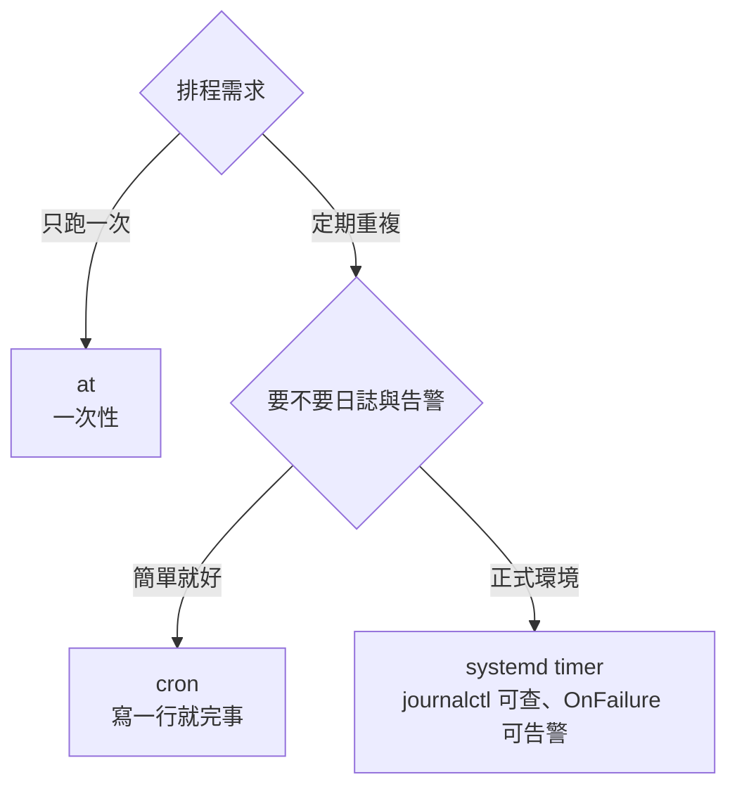

# 排程工作 cron 與 systemd timer

> [!abstract] 這篇你會學到
> - ★★★ 寫出正確的 cron 時間欄位，並用工具驗證而不是憑感覺
> - ★★★★ 搞懂**「手動跑正常、排程跑就失敗」**的四大原因（`PATH`、環境變數、相對路徑、時區）
> - ★★★ 用 `flock` 避免上一次還沒跑完就啟動下一次
> - ★★★ 用 systemd timer 取得 cron 給不了的能力：日誌、失敗告警、隨機延遲、開機補跑
> - ★★★★ 排查「排程明明設了卻沒跑」的固定流程

## 前置知識

- [[020-01-17-cmd-Linux-systemd服務管理]]

---

## 觀念說明

### ★★★ 三種排程機制

| 機制 | 特點 | 適合 |
| --- | --- | --- |
| ★★ **cron** | 簡單、通用、每台機器都有 | 一般定期工作 |
| ★★★ **systemd timer** | 有日誌、可告警、可隨機延遲、開機補跑 | **正式環境建議** |
| ★★ **at** | 一次性、指定時間執行 | 臨時任務、變更保險 |



> [!tip] 什麼時候該用 systemd timer 而不是 cron
> cron 的三個先天限制：
> 1. ★★★ **沒有日誌**——工作的輸出去哪了？靠你自己導向
> 2. ★★★★ **失敗不會通知**——除非設定 `MAILTO` 且機器能寄信
> 3. ★★★ **機器關機時錯過就錯過了**——沒有補跑機制
>
> systemd timer 三個都解決了。★★★★ **正式環境的重要工作（備份、憑證續期、
> 稽核）建議用 timer**，日常小工作用 cron 就好。

---

## cron

### ★★★ 時間欄位

```
┌───────────── 分 (0-59)
│ ┌─────────── 時 (0-23)
│ │ ┌───────── 日 (1-31)
│ │ │ ┌─────── 月 (1-12)
│ │ │ │ ┌───── 星期 (0-7，0 和 7 都是週日)
│ │ │ │ │
* * * * *  指令
```

| 符號 | 意義 | 例子 |
| --- | --- | --- |
| `*` | 每一個 | `* * * * *` 每分鐘 |
| `,` | 列舉 | `0 8,12,18 * * *` 每天 8、12、18 點 |
| `-` | 範圍 | `0 9-17 * * *` 9 到 17 點每小時 |
| `/` | 間隔 | `*/15 * * * *` 每 15 分鐘 |
| 組合 | | `0 2 * * 1-5` 週一到週五凌晨 2 點 |

常用範例：

```cron
*/5 * * * *      每 5 分鐘
0 * * * *        每小時整點
30 3 * * *       每天 03:30
0 2 * * 0        每週日 02:00
0 4 1 * *        每月 1 號 04:00
0 0 1 1 *        每年 1 月 1 日
@reboot          開機時執行一次
@daily           等同 0 0 * * *
@hourly          等同 0 * * * *
@weekly / @monthly / @yearly
```

> [!danger] ★★★★ 「日」與「星期」同時指定時是 **OR** 不是 AND
> ```cron
> 0 0 13 * 5      # 每月 13 號 **或** 每個週五，都會執行！
> ```
> ★★★★ 直覺會以為是「13 號星期五」，實際上是兩者聯集。cron 不會報錯，只會多跑。
>
> ★★★ 只有其中一個是 `*` 時才是你以為的意思：
> ```cron
> 0 0 13 * *      # 每月 13 號
> 0 0 * * 5       # 每個週五
> ```
>
> 真的要「13 號星期五」只能在指令裡判斷：
> ```cron
> 0 0 13 * * [ "$(date +\%u)" = "5" ] && /path/to/script.sh
> ```

> [!tip] 不要用猜的，用工具驗證
> ```bash
> # systemd 內建（也能解析 cron 風格的 OnCalendar）
> systemd-analyze calendar "Mon *-*-* 03:30:00"
> ```
> ```
>   Original form: Mon *-*-* 03:30:00
> Normalized form: Mon *-*-* 03:30:00
>     Next elapse: Mon 2026-09-01 03:30:00 CST
>        From now: 4 days left
> ```
>
> ★★★ cron 語法可以用線上工具 <https://crontab.guru> 驗證，
> 或用 `ncal`/`date` 手動推算。★★★ **寫完一定要驗證，
> 一個欄位錯位就會變成完全不同的時間。**

### ★★★ 使用者 crontab

```bash
crontab -e                    # 編輯自己的
crontab -l                    # 列出
crontab -r                    # ★★★★★ ⚠ 刪除全部（沒有確認！）
sudo crontab -u mike -l       # ★★★ 查看別人的
sudo crontab -u mike -e       # 編輯別人的
```

> [!danger] ★★★★★ `crontab -r` 沒有確認提示，一按就全沒了
> ★★★★★ `-r` 和 `-e` 在鍵盤上只差一個鍵。刪掉之後**無法復原**。
>
> 保命做法：
> ```bash
> # ★★★ 1. 用別名擋掉
> alias crontab='crontab -i'        # -i 會要求確認
>
> # ★★★ 2. 定期備份
> crontab -l > ~/crontab-backup-$(date +%F).txt
>
> # ★★★ 3. 更好的做法：不要用 crontab -e，改用 /etc/cron.d/ 檔案
> ```

### ★★★ 系統 crontab（推薦用這個）

```
/etc/crontab               主檔                              ★★
/etc/cron.d/*              ✓ 每個用途一個檔案（推薦）        ★★★★
/etc/cron.hourly/          每小時執行（腳本，不是 crontab）  ★★★
/etc/cron.daily/           每天
/etc/cron.weekly/          每週
/etc/cron.monthly/         每月
```

★★★★ **系統 crontab 多一個「使用者」欄位**：少寫這一欄，cron 會把指令名當成使用者名稱而整行不執行。

```cron
# /etc/cron.d/backup
# 分 時 日 月 週  使用者   指令
   30  3  *  *  *   root    /usr/local/bin/backup.sh
    0  4  *  *  0   www-data /usr/local/bin/weekly-report.sh
```

```bash
sudo tee /etc/cron.d/myapp-backup > /dev/null <<'CRONFILE'
# ★★★ 這三行要寫在最前面：cron 不會幫你載入任何 profile
SHELL=/bin/bash
PATH=/usr/local/sbin:/usr/local/bin:/usr/sbin:/usr/bin:/sbin:/bin
MAILTO=ops@example.com

# ★★★ 第六欄的 root 是「用誰的身分跑」，使用者 crontab 沒有這一欄
30 3 * * * root /usr/local/bin/backup.sh >> /var/log/backup.log 2>&1
CRONFILE
sudo chmod 644 /etc/cron.d/myapp-backup    # ★★★ 權限過寬或不屬 root，cron 會拒絕執行
```

> [!tip] 為什麼推薦 `/etc/cron.d/` 而不是 `crontab -e`
> | | `crontab -e` | `/etc/cron.d/` |
> | --- | --- | --- |
> | ★★★ 納入版本控制 | 困難 | **可以（就是普通檔案）** |
> | ★★★ 組態管理工具派送 | 麻煩 | **容易** |
> | ★★★★ 誤刪風險 | `crontab -r` 全沒 | 一個檔案一個用途 |
> | ★★★ 備份還原 | 要另外處理 | 跟著 `/etc` 一起 |
> | ★★★ 看得出誰在跑 | 要逐一 `crontab -u X -l` | **一目了然** |

> [!warning] ★★★★ `/etc/cron.d/` 的檔名不能有 `.`
> 跟 `sudoers.d` 一樣的規則：
> ```
> /etc/cron.d/backup.cron     # ✗ 會被忽略
> /etc/cron.d/backup          # ✓
> ```
> ★★★★ 檔名只能是字母、數字、底線、減號。權限要 `644` 且屬於 `root`。
> 命名踩雷時 cron 不會有任何錯誤訊息，排程就是安靜地永遠不跑。

### ★★★★ 四大失敗原因

> [!danger] ★★★★ 原因一：`PATH` 不一樣
> cron 的 `PATH` 預設極短：
> ```
> PATH=/usr/bin:/bin
> ```
> 你的 shell 有 `/usr/local/bin`、`~/.local/bin`、nvm 的路徑，
> ★★★ **cron 通通沒有**。
>
> ```cron
> * * * * * node /opt/app/job.js       # ✗ node: command not found
> ```
>
> 三種解法：
> ```cron
> # ★★★ 1. 用絕對路徑（最可靠）
> * * * * * /usr/local/bin/node /opt/app/job.js
>
> # ★★★ 2. 在 crontab 開頭設定 PATH
> PATH=/usr/local/sbin:/usr/local/bin:/usr/sbin:/usr/bin:/sbin:/bin
> * * * * * node /opt/app/job.js
>
> # ★★★ 3. 在腳本裡自己設定（推薦：腳本自我完備）
> ```
> ```bash
> #!/usr/bin/env bash
> export PATH=/usr/local/bin:/usr/bin:/bin
> ```

> [!danger] ★★★ 原因二：沒有登入 shell 的環境
> ★★★ cron **不會**讀取 `~/.bashrc`、`~/.profile`、`/etc/profile`。
> 所以這些都不存在：
> - `nvm` / `pyenv` / `rbenv` 設定的版本
> - 自訂的 `alias`
> - `JAVA_HOME`、`GOPATH` 等環境變數
> - 語系設定（`LANG`、`LC_ALL`）
>
> ```bash
> # 腳本裡明確設定需要的環境
> export NVM_DIR="/home/deploy/.nvm"
> [ -s "$NVM_DIR/nvm.sh" ] && . "$NVM_DIR/nvm.sh"
> nvm use 20 > /dev/null
> ```
>
> ★★★ 診斷方法——**印出 cron 實際的環境**：
> ```cron
> * * * * * env > /tmp/cron-env.txt 2>&1
> ```
> ```bash
> diff <(env | sort) <(sort /tmp/cron-env.txt)
> ```
> ★★★ 這一招能立刻看出差在哪，比對著猜快得多。

> [!danger] ★★★ 原因三：工作目錄不是你以為的
> ★★★ cron 的工作目錄是**使用者的家目錄**，不是腳本所在的目錄。
> ```bash
> ./config.yaml       # ✗ 找不到
> ```
> ★★★ 腳本開頭固定寫：
> ```bash
> cd "$(dirname "$(readlink -f "$0")")" || exit 1
> # 或
> SCRIPT_DIR="$(cd "$(dirname "${BASH_SOURCE[0]}")" && pwd)"
> ```

> [!danger] ★★★★ 原因四：`%` 需要跳脫
> 在 crontab 裡，`%` 是**特殊字元**（代表換行 / 分隔 stdin）：
> ```cron
> 0 3 * * * tar czf /backup/$(date +%F).tar.gz /data     # ✗ 在 % 就斷了
> 0 3 * * * tar czf /backup/$(date +\%F).tar.gz /data    # ✓ 跳脫
> ```
> ★★★★ **這是最隱蔽的 cron 陷阱之一**——語法檢查不會報錯，
> 它就是安靜地執行了一半的指令。
>
> ★★★★ **最佳做法：crontab 只呼叫腳本，複雜邏輯全部寫在腳本裡。**
> ```cron
> 0 3 * * * root /usr/local/bin/backup.sh
> ```

### ★★★ 輸出與告警

```cron
MAILTO=ops@example.com
0 3 * * * root /usr/local/bin/backup.sh
```

cron 會把工作的**任何輸出**（stdout 與 stderr）寄給 `MAILTO`。
★★★ 沒有輸出就不寄信——這就是所謂的「安靜是好消息」。

> [!warning] ★★★★ 大多數伺服器沒有設定郵件系統，`MAILTO` 是無效的
> 訊息會堆在 `/var/mail/root` 或直接消失。
> ★★★★ **不要以為設了 `MAILTO` 就有告警。**
>
> 實務上比較可靠的做法：
> ```cron
> # 正常輸出丟掉，錯誤寫進日誌並觸發告警
> 0 3 * * * root /usr/local/bin/backup.sh >> /var/log/backup.log 2>&1 || \
>           /usr/local/bin/alert.sh "備份失敗"
> ```
> ★★★ 或者改用 systemd timer 的 `OnFailure=`（見下方），那個是真的可靠。

> [!danger] ★★★★★ `> /dev/null 2>&1` 會讓你永遠不知道失敗
> ```cron
> 0 3 * * * /usr/local/bin/backup.sh > /dev/null 2>&1     # ✗
> ```
> 這是網路上最常見的寫法，也是最糟的寫法。
> ★★★★★ 備份腳本失敗三個月你都不會知道，直到需要還原的那一天。
>
> ★★★ 至少改成：
> ```cron
> 0 3 * * * /usr/local/bin/backup.sh >> /var/log/backup.log 2>&1
> ```

### ★★★ 避免重疊執行

如果工作跑超過排程間隔，會有多份同時執行：

```cron
*/5 * * * * /usr/local/bin/sync.sh      # 若 sync 跑 8 分鐘，就會重疊
```

用 `flock` 解決：

```cron
*/5 * * * * root /usr/bin/flock -n /var/lock/sync.lock /usr/local/bin/sync.sh
```

| 選項 | 行為 |
| --- | --- |
| ★★★ `-n` | **拿不到鎖就直接放棄**（推薦） |
| ★★ `-w 60` | 等最多 60 秒 |
| ★★★ （不加） | 一直等（可能累積大量等待中的程序） |

也可以寫在腳本裡（更自我完備）：

```bash
#!/usr/bin/env bash
set -euo pipefail

# ★★★ 用自己當鎖檔，拿不到就退出（鎖綁在 fd 上，程序死掉自動釋放）
exec 200>"/var/lock/$(basename "$0").lock"
flock -n 200 || { echo "已有另一個實例在執行，跳過"; exit 0; }

# ……實際工作……
```

### ★★★ cron 的時區

```bash
# cron 用系統時區
timedatectl | grep "Time zone"
```

```
Time zone: Asia/Taipei (CST, +0800)
```

> [!warning] ★★★ 日光節約時間會造成工作被跳過或重複
> 台灣沒有日光節約時間，但如果你的機器設 UTC 或其他時區要注意。
> ★★★ 排在凌晨 2 到 3 點的工作在時區切換當天可能不執行或執行兩次。
>
> Debian 系的 cron 支援指定時區：
> ```cron
> CRON_TZ=Asia/Taipei
> 0 3 * * * root /usr/local/bin/backup.sh
> ```
> ★★★ 但**跨時區環境的最佳做法是全部用 UTC**，見 [[020-01-02-guide-Linux-實驗環境準備與初次登入]]。

### ★★★ `cron.daily` 與 `anacron`

★★★ `/etc/cron.daily/` 底下放的是**可執行腳本**（不是 crontab 格式）：把五欄時間運算式寫進去只會得到一個錯誤。

```bash
sudo tee /etc/cron.daily/cleanup-tmp > /dev/null <<'SCRIPT'
#!/bin/sh
find /var/tmp -type f -mtime +30 -delete
SCRIPT
sudo chmod 755 /etc/cron.daily/cleanup-tmp

# ★★★ 測試（run-parts 會執行目錄下所有腳本）
sudo run-parts --test /etc/cron.daily
```

> [!warning] ★★★★ `cron.daily` 的腳本檔名同樣不能有 `.`
> ```bash
> /etc/cron.daily/cleanup.sh      # ✗ run-parts 會忽略
> /etc/cron.daily/cleanup         # ✓
> ```
> ★★★ 用 `run-parts --test` 確認你的腳本有被列出來。沒列出來就是不會跑。

★★★ `anacron` 負責「機器關機時錯過的工作在開機後補跑」，
筆電與非 24 小時運轉的機器需要它。伺服器通常直接用 cron 或 timer。

---

## systemd timer

### ★★★ 基本結構：一個 timer + 一個 service

```bash
# ★★★ 1. 定義「做什麼」
sudo tee /etc/systemd/system/backup.service > /dev/null <<'UNIT'
[Unit]
Description=Nightly Backup
Wants=network-online.target
After=network-online.target

[Service]
Type=oneshot
User=root
ExecStart=/usr/local/bin/backup.sh
# ★★★★ 失敗時觸發告警服務
OnFailure=alert@%n.service
# ★★★ 資源限制，避免備份拖垮系統
Nice=19
IOSchedulingClass=idle
MemoryMax=1G
UNIT

# ★★★ 2. 定義「什麼時候做」
sudo tee /etc/systemd/system/backup.timer > /dev/null <<'UNIT'
[Unit]
Description=Run backup nightly at 03:30

[Timer]
OnCalendar=*-*-* 03:30:00
Persistent=true
RandomizedDelaySec=300
AccuracySec=1s
Unit=backup.service

[Install]
WantedBy=timers.target
UNIT

sudo systemctl daemon-reload
sudo systemctl enable --now backup.timer      # ★★★★ enable 的是 .timer，不是 .service
```

> [!warning] ★★★★ 要 `enable` 的是 **timer** 不是 service
> ```bash
> sudo systemctl enable --now backup.timer      # ✓
> sudo systemctl enable --now backup.service    # ✗ 會立刻執行一次並嘗試常駐
> ```
> ★★★★ service 只是「工作內容」，由 timer 觸發。enable 錯邊的結果是：現在立刻跑一次，之後再也不會跑。

### ★★★ `OnCalendar` 語法

```
DayOfWeek Year-Month-Day Hour:Minute:Second
```

```ini
OnCalendar=*-*-* 03:30:00              # 每天 03:30
OnCalendar=Mon..Fri *-*-* 09:00:00     # 週一到週五 09:00
OnCalendar=*-*-01 04:00:00             # 每月 1 號 04:00
OnCalendar=*-*-* *:0/15                # 每 15 分鐘
OnCalendar=*-*-* *:00:00               # 每小時整點
OnCalendar=Sat *-*-* 02:00:00          # 每週六 02:00
OnCalendar=daily                       # 等同 *-*-* 00:00:00
OnCalendar=hourly / weekly / monthly
OnCalendar=2026-12-25 00:00:00         # 特定日期
```

★★★ **一定要驗證**：時間運算式寫錯時 systemd 只會讓 timer 進 failed，不會提醒你。

```bash
systemd-analyze calendar "Mon..Fri *-*-* 09:00:00" --iterations=5
```

```
  Original form: Mon..Fri *-*-* 09:00:00
Normalized form: Mon..Fri *-*-* 09:00:00
    Next elapse: Thu 2026-08-28 09:00:00 CST
       From now: 17h left
       Iter. #2: Fri 2026-08-29 09:00:00 CST
       Iter. #3: Mon 2026-09-01 09:00:00 CST
```

### ★★ 其他觸發方式

```ini
[Timer]
OnBootSec=5min              # 開機後 5 分鐘
OnStartupSec=10min          # systemd 啟動後 10 分鐘
OnUnitActiveSec=1h          # ★★★ 上次執行完成後 1 小時（相對排程）
OnUnitInactiveSec=30min     # 上次停止後 30 分鐘
OnActiveSec=15min           # timer 啟用後 15 分鐘
```

> [!tip] ★★★ `OnUnitActiveSec` 解決了 cron 的重疊問題
> ```ini
> OnBootSec=10min
> OnUnitActiveSec=1h
> ```
> 意思是「開機 10 分鐘後跑第一次，之後**每次跑完隔 1 小時再跑**」。
> ★★★ 工作跑多久都不會重疊——因為是從「上次完成」開始算。
>
> cron 的 `0 * * * *` 則是不管上次跑完沒都準時觸發。

### ★★★ timer 獨有的三個能力

```ini
[Timer]
Persistent=true             # ★★★★ ① 錯過的工作在開機後補跑
RandomizedDelaySec=300      # ★★★ ② 隨機延遲 0～300 秒
AccuracySec=1s              # ③ 精確度（預設 1min，會集中喚醒省電）
```

> [!tip] ★★★★ `Persistent=true` — cron 完全沒有的能力
> 機器在排程時間點是關機的（或 VM 暫停），
> `Persistent=true` 會在下次開機時**立刻補跑**。
>
> ★★★★ 對備份、憑證續期這類「不能漏掉」的工作非常重要。憑證續期漏一次就是全站憑證過期。
> systemd 把上次執行時間記在 `/var/lib/systemd/timers/`。

> [!tip] ★★★ `RandomizedDelaySec` — 避免「驚群效應」
> ★★★★ 50 台伺服器都設定 03:00 執行備份，會同時打爆備份伺服器與網路。
> ```ini
> OnCalendar=*-*-* 03:00:00
> RandomizedDelaySec=1800        # 隨機分散在 03:00～03:30
> ```
> 每台機器的延遲是固定的（依 machine-id 決定），
> 所以同一台每次都在差不多的時間，但不同機器彼此錯開。

### ★★★ 失敗告警

```bash
# ★★★ 通用的告警服務範本（%i 是被觸發的 unit 名稱）
sudo tee /etc/systemd/system/alert@.service > /dev/null <<'UNIT'
[Unit]
Description=Alert for %i failure

[Service]
Type=oneshot
ExecStart=/usr/local/bin/send-alert.sh "%i"
UNIT
```

```bash
sudo tee /usr/local/bin/send-alert.sh > /dev/null <<'SCRIPT'
#!/usr/bin/env bash
UNIT="$1"
HOST=$(hostname -f)
LOG=$(journalctl -u "$UNIT" -n 30 --no-pager)

# ★★★ 依實際環境改成 Slack / Teams / 郵件 / 簡訊
curl -sS -X POST "$WEBHOOK_URL" \
     -H 'Content-Type: application/json' \
     -d "$(jq -n --arg t "❌ [$HOST] $UNIT 執行失敗" --arg l "$LOG" \
              '{text: ($t + "\n```" + $l + "```")}')"
SCRIPT
sudo chmod 750 /usr/local/bin/send-alert.sh    # ★★★ 告警腳本會碰到 webhook 位址，不給一般使用者讀
```

在工作的 service 裡加上：

```ini
[Service]
OnFailure=alert@%n.service
```

> [!tip] ★★★ 這是 timer 相對 cron 最大的價值
> cron 的失敗告警靠 `MAILTO` + 可用的郵件系統，實務上經常是壞的。
> ★★★★ `OnFailure=` 由 systemd 直接觸發，**只要 systemd 活著就一定會執行**。

### ★★★ 查看與除錯

```bash
systemctl list-timers --all                # ★★★ 所有 timer 與下次執行時間
systemctl list-timers backup.timer         # ★★★
systemctl status backup.timer              # ★★★ timer 本身有沒有 active
systemctl status backup.service            # ★★★ 上一次執行的結果
sudo journalctl -u backup.service -n 50    # ★★★ 工作的完整輸出都在這
sudo journalctl -u backup.service --since "3 days ago"
sudo systemctl start backup.service        # ★★★ 手動立刻執行一次（測試用）
```

```bash
systemctl list-timers
```

```
NEXT                        LEFT       LAST                        PASSED     UNIT            ACTIVATES
Thu 2026-08-28 03:32:14 CST 10h left   Wed 2026-08-27 03:31:02 CST 13h ago    backup.timer    backup.service
Thu 2026-08-28 06:12:00 CST 13h left   Wed 2026-08-27 06:12:00 CST 11h ago    logrotate.timer logrotate.service
```

> [!tip] ★★★ 工作的輸出自動進 journal，這是 timer 的另一個大優點
> cron 要自己 `>> /var/log/xxx.log 2>&1`，還要自己設輪替。
> ★★★ timer 的 service 輸出**自動進 journald**，有時間戳記、可依服務過濾、
> 自動輪替、可設保留期限。見 [[020-01-19-guide-Linux-日誌系統]]。

### ★★★ cron 與 timer 對照

| 需求 | cron | systemd timer |
| --- | --- | --- |
| 每天 03:30 | `30 3 * * *` | `OnCalendar=*-*-* 03:30:00` |
| 每 15 分鐘 | `*/15 * * * *` | `OnCalendar=*-*-* *:0/15` |
| 開機時 | `@reboot` | `OnBootSec=1min` |
| ★★★ 上次跑完後 1 小時 | ❌ 做不到 | `OnUnitActiveSec=1h` |
| ★★★★ 錯過補跑 | ❌（需 anacron） | `Persistent=true` |
| ★★★ 隨機延遲 | ❌（要自己 sleep） | `RandomizedDelaySec=` |
| ★★★ 日誌 | 自己導向 | **自動進 journal** |
| ★★★★ 失敗告警 | `MAILTO`（不可靠） | **`OnFailure=`** |
| ★★★ 資源限制 | ❌（要自己 nice/ionice） | **`MemoryMax=` `Nice=` `IOSchedulingClass=`** |
| ★★★ 避免重疊 | 需 `flock` | **內建**（service 還在跑就不會重觸發） |
| 設定複雜度 | **一行** | 兩個檔案 |

---

## `at`：一次性排程

```bash
sudo apt install -y at
sudo systemctl enable --now atd      # ★★★ atd 沒啟動，at 會收下工作卻永遠不執行

echo "/usr/local/bin/restart-service.sh" | at now + 30 minutes
echo "/sbin/reboot" | at 03:00 tomorrow      # ★★★★ 排 reboot 前先確認沒人在用這台
at -l                          # ★★★ 列出待執行的工作（等同 atq）
at -c 3                        # ★★★ 看第 3 號工作的內容
atrm 3                         # ★★★ 取消
```

> [!tip] ★★★★ `at` 最有價值的用途：變更保險
> 要改可能斷線的設定（防火牆、SSH、網路）時，
> ★★★ **先排一個「N 分鐘後自動還原」的保險**：
>
> ```bash
> # ★★★★ 先安排保險（順序不能顛倒：先保險，再動手）
> echo 'cp /etc/ssh/sshd_config.bak /etc/ssh/sshd_config && systemctl reload ssh' \
>   | sudo at now + 10 minutes
> sudo atq                       # 記下工作編號
>
> # 再進行變更
> sudo vim /etc/ssh/sshd_config
> sudo systemctl reload ssh
>
> # ★★★ 用新的終端機測試連線成功後，取消保險
> sudo atrm <編號>
> ```
>
> ★★★ 連不回來的話，10 分鐘後設定自動還原，你就能重新連上。
> 這是 `netplan try` 的通用版本，見 [[020-01-16-cmd-Linux-網路基礎指令]]。

> [!info]- Rocky / AlmaLinux（RHEL 系）對照
>
> | 項目 | Debian / Ubuntu | RHEL 系 |
> | --- | --- | --- |
> | cron 套件 | `cron` | **`cronie`** |
> | ★★★ 服務名稱 | `cron` | **`crond`** |
> | ★★★ cron 日誌 | `/var/log/syslog` | `/var/log/cron` |
> | `at` 套件 | `at` | `at` |
> | `run-parts` | `debianutils` | `crontabs` |
> | anacron | 預設安裝 | `cronie-anacron` |
>
> ```bash
> # RHEL 系
> sudo dnf install -y cronie at
> sudo systemctl enable --now crond atd
> sudo journalctl -u crond -f
> ```
>
> ★★★ systemd timer 兩系完全相同。

---

## 完整實戰範例：把備份從 cron 升級成 timer

### ★★★ 原本的 cron 版本（有多個問題）

```cron
0 3 * * * root /usr/local/bin/backup.sh > /dev/null 2>&1
```

問題清單：
1. ★★★★★ 輸出全部丟掉，失敗永遠不知道
2. ★★★ 沒有資源限制，備份時系統很卡
3. ★★★ 機器當天沒開機就整個跳過
4. ★★★ 沒有防重疊
5. ★★★★ 50 台機器同時在 03:00 打爆備份伺服器

### ★★★ 升級後的 timer 版本

```bash
# ── 1. 工作定義 ──────────────────────────────────────
sudo tee /etc/systemd/system/backup.service > /dev/null <<'UNIT'
[Unit]
Description=Nightly Backup
Documentation=file:///usr/local/share/doc/backup.md
Wants=network-online.target
After=network-online.target

[Service]
Type=oneshot
User=root
ExecStart=/usr/local/bin/backup.sh

# ★★★★ 失敗時告警
OnFailure=alert@%n.service

# ★★★ 不要拖垮線上服務
Nice=19
IOSchedulingClass=idle
CPUQuota=50%
MemoryMax=2G

# ★★★ 最長執行 4 小時，超過視為失敗（卡住的備份會被收掉，不會擋住下一次）
TimeoutStartSec=4h

# ★★★ 安全強化：ProtectSystem/ProtectHome 收掉寫入權，ReadWritePaths 是例外清單
ProtectSystem=full
ProtectHome=read-only
ReadWritePaths=/backup /var/log
PrivateTmp=true
NoNewPrivileges=true

StandardOutput=journal
StandardError=journal
SyslogIdentifier=backup
UNIT

# ── 2. 排程定義 ──────────────────────────────────────
sudo tee /etc/systemd/system/backup.timer > /dev/null <<'UNIT'
[Unit]
Description=Nightly backup at 03:00 (+random up to 30min)

[Timer]
OnCalendar=*-*-* 03:00:00
Persistent=true               # ★★★★ 錯過就在開機後補跑
RandomizedDelaySec=1800       # ★★★ 分散在 03:00～03:30
AccuracySec=1min
Unit=backup.service

[Install]
WantedBy=timers.target
UNIT

# ── 3. 啟用 ──────────────────────────────────────────
sudo systemctl daemon-reload
sudo systemctl enable --now backup.timer

# ── 4. 驗證 ──────────────────────────────────────────
systemd-analyze calendar "*-*-* 03:00:00" --iterations=3   # ★★★ 先確認時間算出來是對的
systemctl list-timers backup.timer                        # ★★★ NEXT 欄有值才算真的排上
systemctl status backup.timer                             # ★★★

# ── 5. 手動測試一次 ──────────────────────────────────
sudo systemctl start backup.service    # ★★★★ 上線前一定要手動整跑一次
sudo journalctl -u backup.service -f
```

驗證輸出：

```
NEXT                        LEFT     LAST                        PASSED  UNIT         ACTIVATES
Thu 2026-08-28 03:14:22 CST 10h left n/a                         n/a     backup.timer backup.service
```

> [!tip] 五個問題全部解決
> | 原問題 | 解法 |
> | --- | --- |
> | ★★★★★ 失敗不知道 | `OnFailure=alert@%n.service` + 輸出進 journal |
> | ★★★ 系統很卡 | `Nice=19` `IOSchedulingClass=idle` `CPUQuota=50%` |
> | ★★★ 錯過就跳過 | `Persistent=true` |
> | ★★★ 可能重疊 | systemd 內建（service 還在跑就不重觸發） |
> | ★★★ 驚群效應 | `RandomizedDelaySec=1800` |
>
> 多寫的兩個檔案換來這些，很划算。

### ★★★★ 除錯：排程沒跑的固定流程

```bash
# ── cron ──
systemctl status cron                       # ★★★ 1. cron 服務有在跑嗎？（RHEL: crond）
sudo grep CRON /var/log/syslog | tail -20   # ★★★ 2. 有觸發紀錄嗎？（RHEL: /var/log/cron）
sudo crontab -u root -l                     # ★★★ 3. 設定真的存在嗎？
ls -l /etc/cron.d/                          # ★★★ 4. 檔名有 . 嗎？權限對嗎？
sudo run-parts --test /etc/cron.daily       # ★★★ 5. daily 腳本有被列出嗎？
sudo -u root env -i /bin/sh -c 'PATH=/usr/bin:/bin; /usr/local/bin/backup.sh'
                                            # ★★★★★ 6. 用 cron 的最小環境手動跑

# ── systemd timer ──
systemctl list-timers --all | grep backup   # ★★★ 1. timer 有 enable 嗎？下次何時？
systemctl status backup.timer               # ★★★ 2. timer 狀態
systemctl status backup.service             # ★★★ 3. 上次執行結果
sudo journalctl -u backup.service -n 50     # ★★★ 4. 完整輸出
systemd-analyze calendar "$(systemctl show backup.timer -p TimersCalendar --value | grep -oP '(?<=OnCalendar=).*')"
                                            # ★★★ 5. 時間運算式對嗎？
```

---

## 常見錯誤與排錯

| 現象 | 原因 | 解法 |
| --- | --- | --- |
| ★★★★ 手動跑正常，cron 跑失敗 | `PATH` 不同 | 用絕對路徑；或在腳本裡 `export PATH` |
| ★★★ `command not found` | cron 沒有 `/usr/local/bin` | 絕對路徑或設 crontab 的 `PATH` |
| ★★★ 找不到設定檔 | 工作目錄是家目錄 | 腳本開頭 `cd "$(dirname "$(readlink -f "$0")")"` |
| ★★★★ 指令只執行了一半 | crontab 裡的 `%` 沒跳脫 | 改成 `\%`；或把邏輯移進腳本 |
| ★★★★ `/etc/cron.d/x.conf` 沒作用 | **檔名含 `.`** | 改成不含點的檔名 |
| ★★★ `cron.daily/backup.sh` 沒執行 | 同上，`run-parts` 忽略含點的檔名 | 改名為 `backup` |
| ★★★ nvm / pyenv 的版本不對 | cron 不讀 `.bashrc` | 在腳本裡 source 對應的初始化 |
| ★★★ 工作重疊執行 | 上次還沒跑完 | `flock -n`；或改用 timer 的 `OnUnitActiveSec` |
| ★★★★★ 沒有任何日誌 | 輸出被丟到 `/dev/null` | 導向日誌檔；或改用 timer |
| ★★★★ `MAILTO` 設了卻沒收到信 | 機器沒有可用的 MTA | 改用 `OnFailure=` 或 webhook 告警 |
| ★★★★ timer 沒觸發 | **enable 了 service 而不是 timer** | `systemctl enable --now X.timer` |
| ★★★ `OnCalendar` 語法錯 | 格式不對 | `systemd-analyze calendar "..."` 驗證 |
| ★★★ timer 觸發但工作沒跑 | service 本身失敗 | `journalctl -u X.service` |
| ★★★ 每次都在同一秒觸發造成尖峰 | 沒有隨機延遲 | `RandomizedDelaySec=` |
| ★★★★ 錯過的工作沒補跑 | 沒設 `Persistent=true` | 加上該選項 |
| ★★★★★ `crontab -r` 誤刪 | `-r` 與 `-e` 相鄰 | 改用 `/etc/cron.d/` 檔案 + 版本控制 |

---

## 安全性注意事項

> [!danger] ★★★★ 排程工作的權限應該最小化
> ```cron
> 0 3 * * * root /usr/local/bin/cleanup.sh      # ✗ 真的需要 root 嗎？
> 0 3 * * * backup /usr/local/bin/cleanup.sh    # ✓ 用專屬帳號
> ```
> ★★★★★ 排程腳本被竄改 = 攻擊者取得該帳號的權限。用 root 跑就是整台機器。

> [!danger] ★★★★★ 排程腳本的權限與擁有者
> ```bash
> ls -l /usr/local/bin/backup.sh
> ```
> ```
> -rwxr-xr-x 1 root root 2841 ... /usr/local/bin/backup.sh
> ```
> ★★★★★ **絕對不能讓非 root 使用者可寫**——那等於給他 root 權限
> （因為腳本會以 root 執行）。
>
> ★★★ 稽核：
> ```bash
> # ★★★★ 找出所有以 root 執行但檔案可被他人寫入的排程腳本
> sudo awk '!/^#|^$|^[A-Z_]+=/ {for(i=6;i<=NF;i++) if($i ~ /^\//) {print $i; break}}' \
>      /etc/cron.d/* /etc/crontab 2>/dev/null | sort -u | \
>   while read -r f; do
>     [ -f "$f" ] && [ -w "$f" ] && ! [ -O "$f" ] && echo "⚠ $f 可被非擁有者寫入"
>     [ -f "$f" ] && ls -l "$f"
>   done
> ```

> [!warning] ★★★ 限制誰可以使用 cron
> ```bash
> # ★★★ 只允許清單內的使用者（優先於 deny）
> echo "root" | sudo tee /etc/cron.allow
> echo "backup" | sudo tee -a /etc/cron.allow
> sudo chmod 600 /etc/cron.allow
>
> # at 同理
> echo "root" | sudo tee /etc/at.allow
> sudo chmod 600 /etc/at.allow
> ```
> ★★★ 這是 TWGCB 與 CIS 的檢查項目。有 `cron.allow` 時 `cron.deny` 會被忽略。

> [!tip] ★★★ 排程稽核清單
> ```bash
> echo "── 系統排程 ──"
> cat /etc/crontab
> ls -la /etc/cron.d/ /etc/cron.{hourly,daily,weekly,monthly}/
>
> echo "── 各使用者的 crontab ──"
> for u in $(cut -d: -f1 /etc/passwd); do
>   c=$(sudo crontab -u "$u" -l 2>/dev/null) && [ -n "$c" ] && echo "【$u】" && echo "$c"
> done
>
> echo "── systemd timer ──"
> systemctl list-timers --all --no-pager
>
> echo "── at 佇列 ──"
> sudo atq
> ```
> ★★★★ **每月維護跑一次並與上次比對，新增的項目都要能解釋來源。**
> ★★★★★ 排程是入侵者建立持續性存取的常見手段。
> 見 [[100-02-04-guide-維運-每月維護作業]] 與 [[090-02-08-guide-防護-系統強化與稽核]]。

---

## 速查表

### cron

| 項目 | 內容 |
| --- | --- |
| ★★★ 欄位順序 | `分 時 日 月 週` |
| ★★★★ 系統 crontab | 多一個**使用者**欄位 |
| ★★ `crontab -e/-l` | 編輯 / 列出自己的 |
| ★★★★★ `crontab -r` | **⚠ 刪除全部，無確認** |
| ★★★ `sudo crontab -u X -l` | 查看指定使用者的 |
| ★★★★ `/etc/cron.d/名稱` | **推薦：一個用途一個檔（檔名不可含 `.`）** |
| ★★★ `PATH=` / `MAILTO=` / `SHELL=` | crontab 開頭可設定 |
| ★★★★ `\%` | **`%` 必須跳脫** |
| ★★★ `flock -n /var/lock/x.lock cmd` | 避免重疊 |
| ★★ `@reboot` `@daily` `@hourly` | 特殊字串 |
| ★★★ `run-parts --test /etc/cron.daily` | 測試目錄腳本 |

### systemd timer

| 項目 | 內容 |
| --- | --- |
| ★★★ 檔案 | `X.timer` + `X.service` 各一個 |
| ★★★★ **`systemctl enable --now X.timer`** | **要 enable timer 不是 service** |
| ★★★ `OnCalendar=*-*-* 03:30:00` | 絕對時間 |
| ★★★ `OnBootSec=` / `OnUnitActiveSec=` | 相對時間 |
| ★★★★ **`Persistent=true`** | **錯過補跑** |
| ★★★ **`RandomizedDelaySec=`** | **避免驚群** |
| ★★★★ **`OnFailure=alert@%n.service`** | **失敗告警** |
| ★★★ `Nice=` `IOSchedulingClass=idle` `MemoryMax=` | 資源限制 |
| ★★★ **`systemctl list-timers --all`** | **所有 timer 與下次時間** |
| ★★★ **`systemd-analyze calendar "..."`** | **驗證時間運算式** |
| ★★★ `journalctl -u X.service` | 工作輸出 |
| ★★★ `systemctl start X.service` | 手動立刻執行 |

### at

| 指令 | 說明 |
| --- | --- |
| ★★★ `echo cmd \| at now + 10 minutes` | 一次性排程 |
| ★★ `atq` / `at -l` | 列出待執行 |
| ★★ `at -c <編號>` | 看內容 |
| ★★ `atrm <編號>` | 取消 |

---

## 練習題

> [!question]- ★★★ 練習 1：親身體驗 cron 的環境陷阱
> 寫一個在 shell 裡正常、在 cron 裡失敗的腳本，找出原因並修正。
>
> **解答**
>
> ```bash
> # 建立一個依賴 PATH 與工作目錄的腳本
> mkdir -p ~/crontest && cd ~/crontest
> echo "設定內容" > config.txt
>
> cat > test.sh <<'SCRIPT'
> #!/bin/bash
> echo "=== $(date) ==="
> echo "PATH=$PATH"
> echo "PWD=$PWD"
> echo "USER=$USER HOME=$HOME"
> cat config.txt          # 相對路徑
> node --version 2>&1 || echo "找不到 node"
> SCRIPT
> chmod +x test.sh
>
> ./test.sh               # 手動跑：正常
> ```
>
> ```bash
> # 加入 cron，每分鐘跑一次，輸出存檔
> (crontab -l 2>/dev/null; echo "* * * * * $HOME/crontest/test.sh >> /tmp/crontest.log 2>&1") | crontab -
> sleep 65
> cat /tmp/crontest.log
> ```
> ```
> === Wed Aug 27 18:31:01 CST 2026 ===
> PATH=/usr/bin:/bin                       ← 少了 /usr/local/bin
> PWD=/home/mike                           ← 不是腳本所在目錄！
> USER= HOME=/home/mike                    ← USER 是空的
> cat: config.txt: No such file or directory
> 找不到 node
> ```
>
> ★★★ **三個問題全部暴露**。修正版：
> ```bash
> cat > test.sh <<'SCRIPT'
> #!/usr/bin/env bash
> set -euo pipefail
>
> # ★★★ 1. 明確設定 PATH
> export PATH=/usr/local/sbin:/usr/local/bin:/usr/sbin:/usr/bin:/sbin:/bin
>
> # ★★★ 2. 切到腳本所在目錄
> cd "$(dirname "$(readlink -f "$0")")" || exit 1
>
> # ★★★ 3. 需要的環境自己載入
> [ -s "$HOME/.nvm/nvm.sh" ] && . "$HOME/.nvm/nvm.sh"
>
> echo "=== $(date) ==="
> cat config.txt
> command -v node >/dev/null && node --version || echo "（本機無 node）"
> SCRIPT
> ```
>
> 清理：
> ```bash
> crontab -l | grep -v crontest | crontab -
> rm -rf ~/crontest /tmp/crontest.log
> ```

> [!question]- ★★★ 練習 2：驗證 flock 防重疊
> 建立一個跑很久的排程，證明 `flock` 能避免重疊。
>
> **解答**
>
> ```bash
> sudo tee /usr/local/bin/slowjob.sh > /dev/null <<'SCRIPT'
> #!/usr/bin/env bash
> echo "$(date +%T) [PID $$] 開始"
> sleep 120                    # 故意跑 2 分鐘
> echo "$(date +%T) [PID $$] 結束"
> SCRIPT
> sudo chmod 755 /usr/local/bin/slowjob.sh
>
> # 每分鐘觸發一次，但工作要跑 2 分鐘
> sudo tee /etc/cron.d/slowjob > /dev/null <<'CRON'
> * * * * * root /usr/local/bin/slowjob.sh >> /tmp/slowjob.log 2>&1
> CRON
>
> sleep 190
> cat /tmp/slowjob.log
> ```
> ```
> 18:40:01 [PID 7821] 開始
> 18:41:01 [PID 7903] 開始       ← 重疊了！
> 18:42:01 [PID 7988] 開始       ← 又一個
> 18:42:01 [PID 7821] 結束
> ```
>
> 加上 flock：
> ```bash
> sudo tee /etc/cron.d/slowjob > /dev/null <<'CRON'
> * * * * * root /usr/bin/flock -n /var/lock/slowjob.lock /usr/local/bin/slowjob.sh >> /tmp/slowjob.log 2>&1
> CRON
> sudo truncate -s 0 /tmp/slowjob.log
> sleep 190
> cat /tmp/slowjob.log
> ```
> ```
> 18:45:01 [PID 8102] 開始
> 18:47:01 [PID 8102] 結束
> 18:47:01 [PID 8290] 開始       ← 前一個結束後才啟動新的
> ```
>
> ★★★ **`-n` 讓拿不到鎖的那次直接放棄**（不會累積等待的程序）。
>
> ★★★ systemd timer 用 `OnUnitActiveSec=` 天生就沒有這個問題。
>
> 清理：
> ```bash
> sudo rm -f /etc/cron.d/slowjob /usr/local/bin/slowjob.sh /tmp/slowjob.log
> ```

> [!question]- ★★★ 練習 3：把 cron 改寫成 timer 並驗證失敗告警
> 建立一個會失敗的工作，確認 `OnFailure=` 真的被觸發。
>
> **解答**
>
> ```bash
> # 1. 告警服務（這裡只寫日誌，實務上改成 webhook）
> sudo tee /etc/systemd/system/alert@.service > /dev/null <<'UNIT'
> [Unit]
> Description=Alert for %i
>
> [Service]
> Type=oneshot
> ExecStart=/bin/bash -c 'logger -t ALERT "❌ %i 執行失敗，最近日誌：$(journalctl -u %i -n 5 --no-pager -o cat | tr "\n" " ")"'
> UNIT
>
> # 2. 會失敗的工作
> sudo tee /etc/systemd/system/failjob.service > /dev/null <<'UNIT'
> [Unit]
> Description=A job that fails
> OnFailure=alert@%n.service
>
> [Service]
> Type=oneshot
> ExecStart=/bin/bash -c 'echo "開始處理"; exit 1'
> UNIT
>
> sudo tee /etc/systemd/system/failjob.timer > /dev/null <<'UNIT'
> [Unit]
> Description=Run failjob every 2 minutes
>
> [Timer]
> OnBootSec=1min
> OnUnitActiveSec=2min
> Unit=failjob.service
>
> [Install]
> WantedBy=timers.target
> UNIT
>
> sudo systemctl daemon-reload
> sudo systemctl start failjob.service      # 手動觸發一次
> ```
>
> 驗證：
> ```bash
> systemctl status failjob.service
> ```
> ```
> Active: failed (Result: exit-code)
> Process: 8412 ExecStart=/bin/bash -c echo "開始處理"; exit 1 (code=exited, status=1)
> ```
>
> ```bash
> sudo journalctl -t ALERT -n 5
> ```
> ```
> Aug 27 18:52:10 lab01 ALERT[8420]: ❌ failjob.service 執行失敗，最近日誌：開始處理
> ```
>
> ★★★ **告警確實被觸發了。** 這在 cron 裡需要自己在腳本每個失敗點加判斷，
> 而且很容易漏掉（例如腳本被 OOM 殺掉時根本執行不到告警那行）。
> ★★★★ systemd 的 `OnFailure=` 是由 systemd 監督的，**不管工作怎麼死都會觸發**。
>
> 清理：
> ```bash
> sudo systemctl disable --now failjob.timer 2>/dev/null || true
> sudo rm -f /etc/systemd/system/{failjob.service,failjob.timer,alert@.service}
> sudo systemctl daemon-reload && sudo systemctl reset-failed
> ```

---

## 小測驗

Q1. `0 0 13 * 5` 會在什麼時候執行？為什麼不是「13 號星期五」？
Q2. `crontab -r` 有什麼風險？為什麼推薦改用 `/etc/cron.d/`？
Q3. `/etc/cron.d/backup.cron` 為什麼沒執行？
Q4. 「手動跑正常、cron 跑失敗」的四大原因？
Q5. crontab 裡 `date +%F` 為什麼只執行了一半？
Q6. `> /dev/null 2>&1` 對備份排程的實際後果？至少該怎麼改？
Q7. `flock -n` 與不加 `-n` 的差別？為什麼不用 PID 檔當鎖？
Q8. `systemctl enable --now backup.service` 為什麼錯？該 enable 什麼？
Q9. timer 的 `Persistent=true`、`RandomizedDelaySec`、`OnFailure=` 各解決 cron 的什麼弱點？
Q10. `OnUnitActiveSec=1h` 與 cron 的 `0 * * * *` 在工作跑很久時行為差在哪？

> [!question]- 測驗答案
> **Q1.** ★★★★ 每月 13 號「或」每個週五都跑——日與星期同時指定時是 OR（見「時間欄位」）。
> **Q2.** ★★★★★ 無確認直接刪光且無法復原，`-r` 與 `-e` 相鄰；`cron.d` 是普通檔案，可版本控制、一用途一檔、誤刪風險低。
> **Q3.** ★★★★ 檔名含 `.` 會被忽略；改成 `backup`。
> **Q4.** ★★★★ `PATH` 極短、不讀 `.bashrc` 等登入環境、工作目錄是家目錄、`%` 未跳脫。
> **Q5.** ★★★★ `%` 在 crontab 是特殊字元（換行）；寫 `\%` 或把邏輯移進腳本。
> **Q6.** ★★★★★ 失敗永遠不會被發現；至少 `>> /var/log/backup.log 2>&1`，更好是改 timer 用 `OnFailure=`。
> **Q7.** ★★★ `-n` 拿不到鎖立刻放棄，不加會一直等而累積程序；PID 檔在 `kill -9` 後殘留導致永遠不跑，`flock` 綁 fd 程序死就釋放。
> **Q8.** ★★★★ 會立刻執行並嘗試常駐；要 enable 的是 `backup.timer`。
> **Q9.** ★★★★ 錯過補跑（cron 錯過就沒了）、分散尖峰避免驚群、可靠的失敗告警（`MAILTO` 需要可用 MTA）。
> **Q10.** ★★★ 前者從上次「完成」算起不會重疊；cron 準時觸發不管上次跑完沒，會重疊。

---

## 延伸閱讀

- [[020-01-17-cmd-Linux-systemd服務管理]] — unit 檔的完整語法與安全強化
- [[020-01-19-guide-Linux-日誌系統]] — `journalctl` 與日誌輪替
- [[020-01-22-guide-Linux-Shell腳本進階]] — 排程腳本的錯誤處理與鎖檔
- [[060-01-06-03-guide-傳輸-備份策略與還原演練]] — 備份排程的完整設計
- [[100-02-04-guide-維運-每月維護作業]] — 排程稽核
- [[090-02-08-guide-防護-系統強化與稽核]] — `cron.allow` 與排程安全
- `man 5 crontab` / `man 8 cron` / `man 5 systemd.timer` / `man 7 systemd.time`
