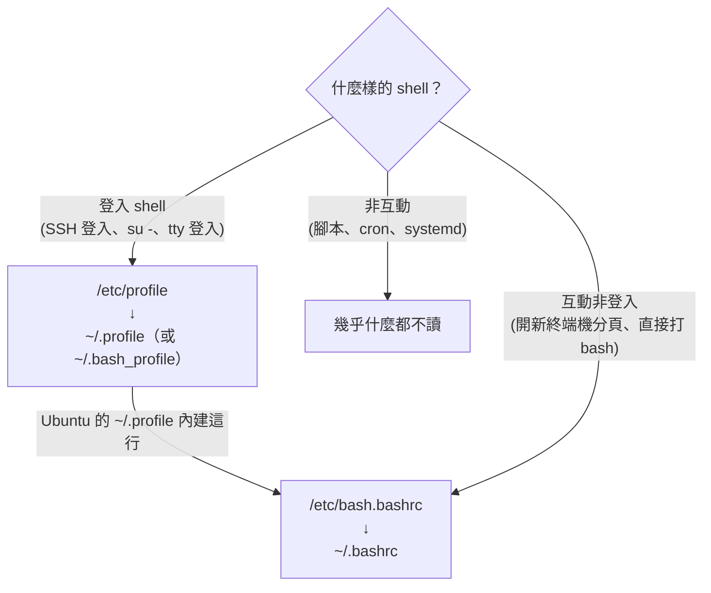

# 環境變數與設定檔

> [!abstract] 這篇你會學到
> - 分清楚 **shell 變數**與**環境變數**——`export` 到底做了什麼
> - 徹底搞懂 `.bashrc` / `.profile` / `/etc/profile` 的**載入順序**，
>   不再「改了設定卻沒生效」
> - 解釋三個經典謎題：**為什麼 sudo 找不到指令、為什麼 cron 環境不同、
>   為什麼 systemd 服務讀不到我的變數**
> - 正確管理 `PATH`，避免重複堆疊與安全問題
> - 知道機密該放哪（以及絕對不該放哪）

## 前置知識

- [[020-01-03-cmd-Linux-終端機與Shell入門]]

---

## 觀念說明

### shell 變數 vs 環境變數

```bash
MYVAR="hello"          # shell 變數：只有目前這個 shell 看得到
export MYVAR           # 變成環境變數：之後啟動的「子程序」也看得到
export MYVAR="hello"   # 一行完成
```

差別用一個實驗就懂：

```bash
LOCAL="我是 shell 變數"
export EXPORTED="我是環境變數"

bash -c 'echo "LOCAL=[$LOCAL] EXPORTED=[$EXPORTED]"'
```

```
LOCAL=[] EXPORTED=[我是環境變數]
```

子程序（`bash -c`）**只繼承環境變數**，shell 變數不會傳下去。


> [!danger] 環境變數只往下傳，永遠不會往上傳
> ```bash
> ./script.sh        # 腳本裡 export 了 FOO
> echo $FOO          # 空的！
> ```
> 腳本在**子程序**裡執行，它的變數在結束時跟著消失。
> 想讓變數留在目前的 shell，必須用 `source`（讓腳本在**目前的** shell 執行）：
> ```bash
> source ./script.sh     # 或 . ./script.sh
> echo $FOO              # 有了
> ```
> 這就是為什麼改完 `.bashrc` 要 `source ~/.bashrc`，
> 也是為什麼 `nvm`、`venv` 的啟用腳本都要求用 `source` 執行。

### 查看

```bash
echo "$PATH"               # 單一變數
printenv PATH              # 同上
printenv                   # 所有「環境變數」
env                        # 同上
set | head -30             # 所有變數（含 shell 變數與函式）——多很多
declare -p MYVAR           # 這個變數的宣告方式（看得出有沒有 export）
```

```bash
declare -p LOCAL EXPORTED
```

```
declare -- LOCAL="我是 shell 變數"
declare -x EXPORTED="我是環境變數"
          ↑ -x = 已 export
```

```bash
# 看「某個執行中程序」的環境（排錯利器）
sudo tr '\0' '\n' < /proc/1234/environ
```

### 常見的重要環境變數

| 變數 | 用途 |
| --- | --- |
| **`PATH`** | 指令搜尋路徑（冒號分隔，**由左到右找，找到就停**） |
| `HOME` | 家目錄（`~` 的來源） |
| `USER` / `LOGNAME` | 使用者名稱 |
| `SHELL` | 預設登入 shell（**不是**目前的 shell） |
| `PWD` / `OLDPWD` | 目前 / 上一個目錄（`cd -` 的來源） |
| `LANG` / `LC_*` | 語系（影響排序、日期格式、錯誤訊息語言） |
| `EDITOR` / `VISUAL` | 預設編輯器（`crontab -e`、`git commit` 用） |
| `TERM` | 終端機類型 |
| `TZ` | 時區覆寫 |
| `http_proxy` / `https_proxy` / `no_proxy` | 代理伺服器 |
| `LD_LIBRARY_PATH` | 動態函式庫搜尋路徑（**有安全風險，少用**） |

```bash
# 實用範例
export EDITOR=vim                       # crontab -e 不再開 nano
TZ=UTC date                             # 臨時用另一個時區看時間
LANG=C ls -l                            # 用英文訊息（貼錯誤訊息求助時好用）
LC_ALL=C sort file                      # 用位元組排序（穩定且快）
```

> [!tip] `LANG=C` 是求助與寫腳本的好朋友
> - 錯誤訊息變英文，網路搜尋找得到答案
> - `sort`、`grep` 的行為變成可預期的位元組序
> - 腳本裡處理指令輸出時，加 `LC_ALL=C` 避免因語系不同而解析失敗

---

## 載入順序：改哪個檔案才會生效

**這是本篇最重要的一節。** bash 依「登入與否、互動與否」讀不同的檔案：



| shell 類型 | 什麼時候遇到 | 讀什麼 |
| --- | --- | --- |
| **登入 + 互動** | SSH 連入、`su - user` | `/etc/profile` → `~/.profile` |
| **非登入 + 互動** | 桌面開終端機、打 `bash` | `/etc/bash.bashrc` → `~/.bashrc` |
| **非互動** | 腳本、cron、systemd | 幾乎不讀（只看 `$BASH_ENV`） |

> [!tip] 判斷目前是哪種 shell
> ```bash
> shopt -q login_shell && echo "登入 shell" || echo "非登入 shell"
> [[ $- == *i* ]] && echo "互動" || echo "非互動"
> ```

Ubuntu 的巧思讓大家少踩很多坑——**`~/.profile` 預設會去載入 `~/.bashrc`**：

```bash
grep -A3 'bashrc' ~/.profile
```

```
if [ -n "$BASH_VERSION" ]; then
    if [ -f "$HOME/.bashrc" ]; then
        . "$HOME/.bashrc"
    fi
fi
```

所以在 Ubuntu 上，**東西放 `~/.bashrc` 兩種互動情境都會生效**。

> [!warning] 建立 `~/.bash_profile` 會讓 `~/.profile` 失效
> bash 找登入設定檔的順序是：
> `~/.bash_profile` → `~/.bash_login` → `~/.profile`，**找到第一個就停**。
>
> 你（或某個安裝程式）建立了 `~/.bash_profile` 之後，
> `~/.profile` 就再也不會被讀——連帶 `.bashrc` 也不載入了，
> 症狀是「SSH 登入後 alias 和 PATH 全部消失」。
>
> 檢查與修復：
> ```bash
> ls -la ~/.bash_profile ~/.bash_login ~/.profile 2>/dev/null
> # 若有 .bash_profile，確保它也載入 .bashrc：
> cat >> ~/.bash_profile <<'EOF'
> [ -f ~/.bashrc ] && . ~/.bashrc
> EOF
> ```

### 該把設定放哪裡

| 內容 | 放哪 | 理由 |
| --- | --- | --- |
| alias、提示字元、shell 選項 | **`~/.bashrc`** | 只有互動 shell 需要 |
| 環境變數（`PATH`、`EDITOR`） | **`~/.profile`**（或 `.bashrc` 開頭） | 登入時設一次，子程序都繼承 |
| 全機所有使用者的環境變數 | `/etc/profile.d/*.sh` | 不要直接改 `/etc/profile` |
| 全機 alias | `/etc/bash.bashrc` | |
| **服務的環境變數** | **systemd 的 `EnvironmentFile=`** | shell 設定檔對服務無效！ |
| **排程的環境變數** | **crontab 開頭或腳本內** | cron 不讀 shell 設定檔！ |

```bash
# 全機環境變數的正確做法：/etc/profile.d/ 放一個獨立檔案
sudo tee /etc/profile.d/company.sh > /dev/null <<'PROF'
export EDITOR=vim
export HISTTIMEFORMAT='%F %T '
PROF
```

> [!danger] 三個經典謎題的統一解答
> 它們的根源都是同一件事：**那個環境根本不讀你的 shell 設定檔**。
>
> | 謎題 | 原因 | 解法 |
> | --- | --- | --- |
> | `sudo` 之後找不到指令 | sudo 重設 `PATH` 為 `secure_path` | 完整路徑；或改 sudoers 的 `secure_path` |
> | cron 裡指令失敗 | cron 只有極簡環境（見 [[020-01-18-guide-Linux-排程工作]]） | 腳本自帶 `export PATH=...` |
> | systemd 服務讀不到變數 | systemd 不經過 shell | `EnvironmentFile=`（見 [[020-01-17-cmd-Linux-systemd服務管理]]） |
>
> 換句話說：**`.bashrc` 只服務「人打開的互動 shell」**，
> 自動化的東西（cron、systemd、CI）都要自備環境。

---

## PATH 管理

### 運作原理

```bash
echo "$PATH" | tr ':' '\n'
```

```
/usr/local/sbin
/usr/local/bin
/usr/sbin
/usr/bin
/sbin
/bin
```

輸入指令時，shell **由左到右**在每個目錄找，**找到第一個就執行**。

```bash
type -a python3         # 列出所有同名的（第一個才是會執行的）
command -v python3      # 只顯示會執行的那個
hash -r                 # 清掉 shell 的指令位置快取（裝新程式後找不到時用）
```

> [!tip] 「裝了新版卻還是跑到舊版」的排查
> ```bash
> type -a node
> ```
> ```
> node is /usr/bin/node               ← PATH 較前面，被選中（舊版）
> node is /usr/local/bin/node         ← 你剛裝的（新版）
> ```
> 解法：調整 PATH 順序，或 `hash -r` 清快取，或直接用完整路徑。
> 另外 bash 會快取指令位置——剛安裝的程式若說找不到，先 `hash -r`。

### 正確地加 PATH

```bash
# ~/.profile 或 ~/.bashrc
export PATH="$HOME/.local/bin:$PATH"        # 加在前面（優先）
export PATH="$PATH:/opt/tools/bin"          # 加在後面（備選）
```

> [!warning] 兩個常見錯誤
> **錯誤一：覆蓋而不是附加**
> ```bash
> export PATH="/opt/tools/bin"        # ✗ 其他指令全部找不到了！
> export PATH="/opt/tools/bin:$PATH"  # ✓
> ```
>
> **錯誤二：在 `.bashrc` 無條件附加，導致重複堆疊**
> `.bashrc` 每開一個子 shell 就執行一次，`tmux`、`screen` 裡
> PATH 會越長越長。防重複寫法：
> ```bash
> case ":$PATH:" in
>     *":$HOME/.local/bin:"*) ;;
>     *) export PATH="$HOME/.local/bin:$PATH" ;;
> esac
> ```

> [!danger] 永遠不要把 `.`（目前目錄）加進 PATH
> ```bash
> export PATH=".:$PATH"      # ✗ 絕對不要
> ```
> 攻擊者在 `/tmp` 放一個叫 `ls` 的惡意腳本，
> 你 `cd /tmp && ls` 就中招了。這也是 TWGCB / CIS 的檢查項目：
> ```bash
> echo ":$PATH:" | grep -qE ':(\.)?:' && echo "⚠ PATH 含目前目錄" || echo "✓ 安全"
> ```

### 系統層級的 PATH

| 位置 | 影響範圍 |
| --- | --- |
| `/etc/environment` | **PAM 層級，所有登入**（不是 shell 腳本，只能寫 `KEY=value`） |
| `/etc/profile.d/*.sh` | 所有登入 shell |
| sudoers 的 `secure_path` | `sudo` 執行時 |
| systemd unit 的 `Environment=` | 該服務 |

```bash
cat /etc/environment
```

```
PATH="/usr/local/sbin:/usr/local/bin:/usr/sbin:/usr/bin:/sbin:/bin"
```

> [!warning] `/etc/environment` 不是腳本
> 它由 PAM 解析，**不支援** `$PATH` 展開、`export`、指令替換：
> ```
> PATH="$PATH:/opt/bin"        # ✗ 會變成字面上的 "$PATH:/opt/bin"
> PATH="/usr/local/bin:/usr/bin:/bin:/opt/bin"   # ✓ 只能寫完整值
> ```

---

## 實用技巧

### 單次覆寫

```bash
TZ=UTC date                          # 只影響這一個指令
LANG=C ls --help
http_proxy=http://proxy:3128 curl https://example.com
env -i /bin/bash --noprofile --norc  # 開一個「乾淨環境」的 shell（模擬 cron）
env -u http_proxy curl https://example.com   # 拿掉某個變數執行
```

> [!tip] `env -i` 是重現 cron / systemd 問題的神器
> 「手動跑正常、排程跑失敗」時：
> ```bash
> env -i HOME=/root PATH=/usr/bin:/bin /bin/sh -c '/usr/local/bin/backup.sh'
> ```
> 用近似 cron 的極簡環境執行一次，問題通常當場重現。
> 見 [[020-01-18-guide-Linux-排程工作]]。

### 預設值與防呆展開

```bash
echo "${NAME:-預設值}"        # NAME 未設或為空 → 用預設值（不改變 NAME）
echo "${NAME:=預設值}"        # 同上，但會把預設值存進 NAME
echo "${NAME:?未設定 NAME}"   # 未設定就報錯退出（腳本防呆）
echo "${NAME:+已設定}"        # 有設定才輸出這個
```

```bash
# 腳本裡的典型用法
BACKUP_DIR="${BACKUP_DIR:-/backup}"          # 允許外部覆寫，有預設值
DB_PASS="${DB_PASS:?請先設定 DB_PASS}"       # 必要變數，沒有就死
rm -rf "${WORK_DIR:?}"/*                     # 防止未定義變成 rm -rf /*
```

最後一行在 [[020-01-05-cmd-Linux-路徑導覽與檔案操作]] 提過——**這是保命語法**。

### 讀取 `.env` 檔案

應用程式常用 `.env` 存設定（見 [[130-01-05-08-guide-前後端-前後端分離的環境變數與建置流程]]）：

```bash
# .env 內容：KEY=value 格式
set -a          # 之後定義的變數自動 export
source .env
set +a
```

> [!warning] `source .env` 的前提：內容可信
> `.env` 是被當成 shell 腳本執行的——裡面若有 `$(惡意指令)` 就會被執行。
> 只 source 自己管理的檔案；處理外部來源的 env 檔要逐行解析而不是 source。

---

## 完整實戰範例：三個環境謎題一次排查

一個部署腳本手動跑正常，放進 cron 與 systemd 都失敗。完整排查：

```bash
# ── 1. 建立環境快照，三個環境各拍一張 ──
# 互動 shell
env | sort > /tmp/env-interactive.txt

# cron 環境
( crontab -l 2>/dev/null; echo "* * * * * env | sort > /tmp/env-cron.txt" ) | crontab -
sleep 65
crontab -l | grep -v env-cron | crontab -

# systemd 環境
sudo systemd-run --unit=envdump --property=Type=oneshot \
     /bin/sh -c 'env | sort > /tmp/env-systemd.txt'
sleep 2

# ── 2. 比對 ──
echo "═══ 互動 vs cron ═══";    diff /tmp/env-interactive.txt /tmp/env-cron.txt    | head -20
echo "═══ 互動 vs systemd ═══"; diff /tmp/env-interactive.txt /tmp/env-systemd.txt | head -20
```

```
═══ 互動 vs cron ═══
< PATH=/usr/local/sbin:/usr/local/bin:/usr/sbin:/usr/bin:/sbin:/bin
< NVM_DIR=/home/deploy/.nvm
< EDITOR=vim
> PATH=/usr/bin:/bin
（cron 少了一大串）
```

```bash
# ── 3. 讓腳本自我完備（不依賴呼叫環境）──
sudo tee /usr/local/bin/deploy.sh > /dev/null <<'SCRIPT'
#!/usr/bin/env bash
set -euo pipefail

# 環境自備：不管誰呼叫我都一樣
export PATH=/usr/local/sbin:/usr/local/bin:/usr/sbin:/usr/bin:/sbin:/bin
export LANG=C.UTF-8
cd "$(dirname "$(readlink -f "$0")")"

# 需要的工具逐一確認，缺了就明確報錯
for cmd in git node rsync; do
    command -v "$cmd" >/dev/null || { echo "缺少指令：$cmd" >&2; exit 1; }
done

# 機密從固定位置讀，不假設環境裡有
ENV_FILE=/etc/myapp/env
[ -r "$ENV_FILE" ] || { echo "讀不到 $ENV_FILE" >&2; exit 1; }
set -a; . "$ENV_FILE"; set +a

: "${DEPLOY_TARGET:?ENV_FILE 裡缺少 DEPLOY_TARGET}"

echo "環境 OK，開始部署到 $DEPLOY_TARGET"
SCRIPT
sudo chmod 755 /usr/local/bin/deploy.sh

# ── 4. 用 cron 的環境驗證 ──
env -i /bin/sh -c /usr/local/bin/deploy.sh
```

> [!tip] 「自我完備」是自動化腳本的黃金原則
> 好的維運腳本**不假設任何環境**：自己設 PATH、自己 cd、
> 自己檢查工具存在、自己載入設定。
> 這樣它在互動 shell、cron、systemd、CI 裡的行為完全一致。

---

## 常見錯誤與排錯

| 現象 | 原因 | 解法 |
| --- | --- | --- |
| 改了 `.bashrc` 沒生效 | 沒 `source`，或當前是登入 shell 沒經過 `.bashrc` | `source ~/.bashrc`；檢查 `.profile` 有沒有載入 `.bashrc` |
| SSH 登入後 alias 全消失 | `~/.bash_profile` 存在，攔截了 `.profile` | 在 `.bash_profile` 加 `[ -f ~/.bashrc ] && . ~/.bashrc` |
| 腳本裡 export 的變數外面看不到 | 子程序變數不會往上傳 | 用 `source` 執行腳本 |
| `sudo` 找不到指令 | `secure_path` 取代了 PATH | 完整路徑或 `sudo env "PATH=$PATH"` |
| cron 裡環境不同 | cron 不讀 shell 設定檔 | 腳本自備環境；`env -i` 重現 |
| systemd 服務缺變數 | 不經過 shell | `EnvironmentFile=` |
| PATH 越來越長 | `.bashrc` 重複附加 | 加防重複判斷 |
| 裝了新程式卻說 command not found | bash 快取了舊位置 | `hash -r` |
| 跑到舊版本的程式 | PATH 順序 | `type -a` 檢查；調整順序 |
| `/etc/environment` 寫 `$PATH` 沒展開 | 它不是 shell 腳本 | 寫完整值 |
| 中文檔名顯示亂碼／排序怪 | `LANG` / `LC_*` 未設或不一致 | `locale`；`sudo update-locale LANG=C.UTF-8` |
| 變數有值但程式讀不到 | 忘了 `export` | `declare -p VAR` 確認有 `-x` |

---

## 安全性注意事項

> [!danger] 機密不要放這幾個地方
> | 位置 | 為什麼危險 |
> | --- | --- |
> | 指令列參數 | `ps aux` 所有人可見（見 [[020-01-10-cmd-Linux-程序管理與訊號]]） |
> | `.bashrc` 裡 export | 憑證進了 dotfiles，容易隨 git 外洩；同使用者程序可讀 |
> | systemd 的 `Environment=` | `systemctl show` 任何人可見 |
> | `/etc/environment` | 全機所有使用者的程序都繼承 |
>
> 較安全的做法（依序）：
> 1. **`EnvironmentFile=` + 檔案權限 `640`**（服務）
> 2. `~/.config/` 下的 `600` 權限檔案，用時才讀（個人工具）
> 3. 專門的秘密管理（見 [[090-03-03-guide-應用安全-機密管理與金鑰保護]]）
>
> 環境變數仍可被**同使用者**透過 `/proc/PID/environ` 讀到——
> 它比指令列好，但不是保險箱。

> [!warning] `LD_PRELOAD` / `LD_LIBRARY_PATH` 是提權攻擊面
> 這兩個變數能讓程式載入指定的函式庫。
> 好在 setuid 程式與 sudo 預設會清除它們（`env_reset`），
> **不要**在 sudoers 用 `env_keep` 放行它們。

> [!tip] 稽核殼層啟動檔的寫入權限
> `.bashrc` 可被寫入 = 該使用者下次登入就執行攻擊者的程式碼。
> ```bash
> find /home -maxdepth 2 -name ".bashrc" -o -name ".profile" 2>/dev/null \
>   | xargs -r ls -l | awk '$1 ~ /w.$|w..$/ {print "⚠", $0}'
> ls -l /etc/profile /etc/bash.bashrc /etc/profile.d/
> ```
> 全域啟動檔應為 `644 root:root`。這是 [[090-02-08-guide-防護-系統強化與稽核]] 的項目之一。

---

## 速查表

### 變數操作

| 指令 | 說明 |
| --- | --- |
| `VAR=x` / `export VAR=x` | shell 變數 / 環境變數 |
| `declare -p VAR` | 看宣告（`-x` = 已 export） |
| `printenv` / `env` / `set` | 環境變數 / 同左 / 全部含函式 |
| `unset VAR` | 刪除 |
| `source file` | **在目前 shell 執行**（設定才留得住） |
| `VAR=x cmd` | 單次覆寫 |
| `env -i cmd` | **乾淨環境執行（模擬 cron）** |
| `env -u VAR cmd` | 拿掉某變數執行 |
| `tr '\0' '\n' < /proc/PID/environ` | 看執行中程序的環境 |

### 展開防呆

| 語法 | 意義 |
| --- | --- |
| `${V:-def}` | 未設→用預設 |
| `${V:=def}` | 未設→設成預設 |
| **`${V:?msg}`** | **未設→報錯退出** |
| `${V:+alt}` | 有設→輸出 alt |

### 設定檔選擇

| 要設什麼 | 放哪 |
| --- | --- |
| alias、提示字元 | `~/.bashrc` |
| 個人環境變數 | `~/.profile` |
| 全機環境變數 | `/etc/profile.d/*.sh` |
| PAM 層級 PATH | `/etc/environment`（僅 KEY=value） |
| 服務 | systemd `EnvironmentFile=` |
| 排程 | crontab 開頭 / 腳本內 |

### PATH

| 指令 | 說明 |
| --- | --- |
| `echo "$PATH" \| tr ':' '\n'` | 逐行檢視 |
| `type -a cmd` | **所有同名指令（第一個生效）** |
| `hash -r` | 清指令位置快取 |
| `export PATH="新:$PATH"` | 前置（優先） |
| 防重複 `case ":$PATH:" in` | `.bashrc` 必備寫法 |

---

## 練習題

> [!question]- 練習 1：追蹤載入順序
> 在四個啟動檔各加一行 echo，分別用 SSH 登入、開子 shell、
> `bash -c` 執行指令，觀察哪些檔案被讀了。
>
> **解答**
>
> ```bash
> echo 'echo "[讀取] /etc/profile"'    | sudo tee -a /etc/profile >/dev/null
> echo 'echo "[讀取] ~/.profile"'      >> ~/.profile
> echo 'echo "[讀取] ~/.bashrc"'       >> ~/.bashrc
> ```
> ```bash
> ssh localhost          # 登入 shell
> ```
> ```
> [讀取] /etc/profile
> [讀取] ~/.profile
> [讀取] ~/.bashrc        ← 因為 Ubuntu 的 .profile 會載入 .bashrc
> ```
> ```bash
> bash                   # 互動非登入
> ```
> ```
> [讀取] ~/.bashrc        ← 只有這個
> ```
> ```bash
> bash -c 'echo done'    # 非互動
> ```
> ```
> done                    ← 什麼設定檔都沒讀！
> ```
> 最後一個就是 cron 與腳本的世界。實驗完記得把三行 echo 刪掉。

> [!question]- 練習 2：修好一台「sudo 找不到指令」的機器
> 自己編譯的工具裝在 `/opt/tools/bin/mytool`，
> 一般執行正常，`sudo mytool` 卻 command not found。
> 給出三種解法並說明各自適用時機。
>
> **解答**
>
> ```bash
> # 重現
> mkdir -p /tmp/opt-tools && printf '#!/bin/sh\necho ok\n' > /tmp/opt-tools/mytool
> chmod +x /tmp/opt-tools/mytool
> export PATH="/tmp/opt-tools:$PATH"
> mytool          # ok
> sudo mytool     # command not found
> ```
> 原因：sudo 用 sudoers 的 `secure_path`，不是你的 PATH：
> ```bash
> sudo grep secure_path /etc/sudoers
> ```
>
> **解法一：完整路徑**（一次性、最安全）
> ```bash
> sudo /tmp/opt-tools/mytool
> ```
> **解法二：保留使用者 PATH**（臨時）
> ```bash
> sudo env "PATH=$PATH" mytool
> ```
> **解法三：把目錄加進 `secure_path`**（永久、全機生效）
> ```bash
> sudo visudo -f /etc/sudoers.d/10-securepath
> ```
> ```sudoers
> Defaults secure_path="/usr/local/sbin:/usr/local/bin:/usr/sbin:/usr/bin:/sbin:/bin:/opt/tools/bin"
> ```
> 適用時機：一與二用於臨時；**要長期用的工具，更好的做法其實是
> 放進（或連結到）`/usr/local/bin`**——它本來就在 secure_path 裡：
> ```bash
> sudo ln -s /opt/tools/bin/mytool /usr/local/bin/mytool
> ```
> **不要**為了方便而放寬 `env_keep`——那會弱化 sudo 的環境隔離。

> [!question]- 練習 3：找出 PATH 重複堆疊的原因並修復
> 在 `.bashrc` 放一行無條件的 `export PATH="$HOME/bin:$PATH"`，
> 證明它會堆疊，然後改成防重複版本。
>
> **解答**
>
> ```bash
> echo 'export PATH="$HOME/bin:$PATH"' >> ~/.bashrc
> bash          # 開子 shell
> bash          # 再開一層
> echo "$PATH" | tr ':' '\n' | grep -c "$HOME/bin"
> ```
> ```
> 3             ← 疊了三次
> ```
> 無害但會越來越長，也讓 `type -a` 的判讀變困難。修復：
> ```bash
> # 把那行改成：
> case ":$PATH:" in
>     *":$HOME/bin:"*) ;;
>     *) export PATH="$HOME/bin:$PATH" ;;
> esac
> ```
> 驗證：
> ```bash
> exec bash -l
> bash; bash
> echo "$PATH" | tr ':' '\n' | grep -c "$HOME/bin"      # 1
> ```
> 補充：更根本的做法是把「設 PATH」放 `~/.profile`（登入時只跑一次），
> `.bashrc` 只放 alias 與互動設定——照本篇「該放哪」的表格分工就不會堆疊。

---

## 小測驗

Q1. shell 變數與環境變數的差別？`export` 做了什麼？
Q2. 腳本裡 `export FOO=1`，執行完外面 `echo $FOO` 為什麼是空的？怎麼讓它留下？
Q3. SSH 登入、開新終端機分頁、執行腳本，各讀哪些設定檔？
Q4. 建了 `~/.bash_profile` 之後 SSH 登入 alias 全消失，為什麼？
Q5. alias、個人 PATH、服務的環境變數、排程的環境變數各該放哪？
Q6. `sudo mytool` 找不到指令的根本原因？三種解法中哪種最好？
Q7. `export PATH="/opt/bin"` 會發生什麼？
Q8. `.bashrc` 裡無條件 `export PATH="$HOME/bin:$PATH"` 有什麼問題？怎麼寫？
Q9. `/etc/environment` 裡寫 `PATH="$PATH:/opt/bin"` 為什麼不行？
Q10. `env -i` 用來做什麼？

> [!question]- 測驗答案
> **Q1.** shell 變數只有目前 shell 看得到，環境變數會被子程序繼承；`export` 把 shell 變數標記為環境變數（見「shell 變數 vs 環境變數」）。
> **Q2.** 腳本在子程序執行，變數隨它結束消失，只往下不往上傳；用 `source` 在目前 shell 執行。
> **Q3.** 登入 shell 讀 `/etc/profile`→`~/.profile`（Ubuntu 的 .profile 再載入 .bashrc）；互動非登入讀 `~/.bashrc`；非互動幾乎不讀。
> **Q4.** bash 依序找 `.bash_profile`→`.bash_login`→`.profile`，找到第一個就停，`.profile`（與它載入的 `.bashrc`）不再被讀。
> **Q5.** `~/.bashrc`、`~/.profile`、systemd `EnvironmentFile=`、crontab 開頭或腳本內。
> **Q6.** sudo 用 sudoers 的 `secure_path` 取代 PATH；長期最好把工具放進或連結到 `/usr/local/bin`（本來就在 secure_path）。
> **Q7.** 覆蓋而非附加，其他指令全部找不到。
> **Q8.** 每開子 shell 疊加一次（tmux 裡越來越長）；用 `case ":$PATH:" in *":$HOME/bin:"*) ;; *) export ...;; esac`，或把 PATH 設定放 `.profile`。
> **Q9.** 它由 PAM 解析不是 shell 腳本，不展開變數；只能寫完整值。
> **Q10.** 用乾淨環境執行指令，重現 cron/systemd 的極簡環境問題。

---

## 延伸閱讀

- [[020-01-03-cmd-Linux-終端機與Shell入門]] — shell 的基本概念
- [[020-01-18-guide-Linux-排程工作]] — cron 的環境問題完整說明
- [[020-01-17-cmd-Linux-systemd服務管理]] — `EnvironmentFile=` 用法
- [[020-01-21-cmd-Linux-Shell腳本入門]] — 在腳本中使用變數
- [[090-03-03-guide-應用安全-機密管理與金鑰保護]] — 機密的正確存放
- [[060-01-05-03-guide-終端機-Bash與Zsh效率設定]] — dotfiles 的組織與同步
- `man 1 bash`（INVOCATION 章節）/ `man 8 pam_env`
