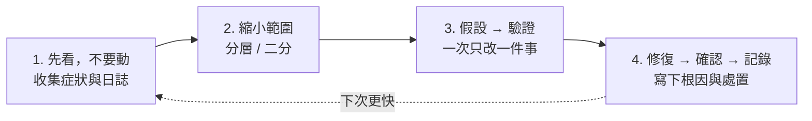

# Linux 常見疑難排解

> [!abstract] 這篇你會學到
> - ★★★ 建立一套**由外而內、先觀察後動手**的排查順序，不再憑感覺亂改
> - ★★★ 用「**黃金 60 秒**」清單在一分鐘內掌握一台機器的整體狀況
> - ★★ 十類最常見故障的**症狀 → 判斷 → 處置**流程，每一類都給出可直接執行的指令
> - ★★★★ 知道什麼時候該停手、該重開機、該求援——以及重開機前要先保全什麼證據
> - ★★ 把本章前 22 篇的工具串成一套完整的排錯能力

## 前置知識

- [[020-01-19-guide-Linux-日誌系統]]
- 本章其他各篇（本篇是總整理）

---

## 觀念說明

### 排錯的四個原則



| 原則 | 為什麼 |
| --- | --- |
| ★★★★ **先看再動** | 亂改會破壞證據，而且可能把單一問題變成兩個 |
| ★★★ **一次只改一件事** | 同時改三處，好了也不知道是哪個修好的，下次還是不會 |
| ★★★ **由外而內、由大到小** | 整機（負載、磁碟、記憶體）→ 服務 → 設定 → 程式碼 |
| ★★ **記錄** | 同樣的問題三個月後會再來；沒記錄就等於重新排查一次 |

> [!danger] ★★★★ 動手前先問：這台機器現在還在提供服務嗎？
> 「服務還活著但變慢」與「服務已經死了」的處理優先序完全不同。
> 前者要**避免讓它變成後者**（不要隨便 restart）；
> 後者要**先恢復服務再找根因**（必要時先重啟，事後查）。
>
> ★★★★ 而且重啟前要先保全證據——見本篇最後的「重開機前清單」。
> 重開機是**不可逆**的：程序清單、開啟中的已刪除檔案、記憶體狀態、
> 未持久化的 journal 全部歸零，之後再怎麼查都查不回來。

### 黃金 60 秒：整機狀況一分鐘掌握

登入任何一台「出問題」的機器，先跑這一組（不需要記，做成腳本）：

```bash
uptime                                    # ★★ 負載、開機多久
free -h                                   # ★★ 記憶體、swap
df -h; df -i | awk '$5+0 > 80'            # ★★★★ 磁碟空間、inode（滿了會讓一堆不相干的服務同時死）
top -bn1 | head -15                       # ★★★ CPU 分布（看 wa）、前幾名程序
systemctl --failed                        # ★★★ 失敗的服務
sudo journalctl -p err --since "1 hour ago" --no-pager | tail -20   # ★★★ 最近一小時的錯誤
sudo dmesg -T | tail -20                  # ★★★ 硬體、OOM、核心錯誤
ss -tlnp | head -20                       # ★★ 監聽埠
last -n 5; sudo lastb -n 5 2>/dev/null    # ★★★★ 誰登入過、有沒有被爆破（排錯查到一半發現是入侵，就要換流程）
```

> [!tip] ★★★ 把它做成 `/usr/local/bin/sos`
> ```bash
> sudo tee /usr/local/bin/sos > /dev/null <<'S'
> #!/usr/bin/env bash
> h() { printf '\n\033[1;36m══ %s ══\033[0m\n' "$*"; }
> h "負載與時間"; uptime; timedatectl 2>/dev/null | grep -E 'Local|synchronized'
> h "記憶體"; free -h
> h "磁碟（>80% 標紅）"; df -hP -x tmpfs -x devtmpfs | awk 'NR==1 || $5+0 > 80 {print}'; df -iP -x tmpfs | awk '$5+0 > 80'
> h "CPU 與 I/O 等待"; top -bn1 | sed -n '3p'
> h "前 5 名程序（CPU / 記憶體）"; ps -eo pid,user,%cpu,%mem,stat,cmd --sort=-%cpu | head -6; ps -eo pid,user,%cpu,%mem,stat,cmd --sort=-%mem | head -6
> h "D 狀態（I/O 卡住）"; ps -eo pid,stat,wchan:20,cmd | awk '$2 ~ /D/' || true
> h "失敗的服務"; systemctl --failed --no-legend
> h "最近一小時錯誤"; journalctl -p err --since "1 hour ago" --no-pager -q | tail -15
> h "核心訊息"; dmesg -T 2>/dev/null | tail -10
> h "OOM"; journalctl -k --since "1 day ago" -q | grep -i -E "out of memory|oom-kill" | tail -3 || echo "無"
> h "監聽埠"; ss -tlnp | awk 'NR>1 {print $4, $6}' | sort -u | head -20
> h "最近登入"; last -n 5 | head -5
> S
> sudo chmod 755 /usr/local/bin/sos
> sudo sos
> ```
> ★★★ 30 秒的輸出，八成的問題會在這裡露出線索。
> 它的價值不在單一數字，而在**把所有線索並列**——「磁碟 98%」與「php-fpm failed」
> 擺在一起，因果鏈就自己浮出來了。

---

## 十大故障類型

### 1. ★★★★ 磁碟滿了

**症狀**：`No space left on device`、服務寫日誌失敗、資料庫拒絕寫入、`apt` 失敗

```bash
df -h                                     # ★★ 哪個掛載點
df -i                                     # ★★★ 還是 inode 滿？（df -h 有空間卻寫不進去就是它）
sudo du -hx --max-depth=1 / | sort -rh | head       # 逐層找
sudo find / -xdev -size +500M -exec ls -lh {} + 2>/dev/null | sort -k5 -rh | head
sudo lsof +L1 | head                      # ★★★ 已刪除但仍佔空間的檔案（du 找不到、df 卻是滿的）
```

| 判斷 | 處置 |
| --- | --- |
| ★★★ `/var/log` 最大 | `journalctl --vacuum-size=500M`；`truncate -s 0` 大日誌（**不要 rm**）；修 logrotate |
| ★★★ `du` 加總遠小於 `df` | `lsof +L1` 找到程序 → `systemctl reload` 或 `truncate -s 0 /proc/PID/fd/N` |
| ★★★ `df -i` 100% | 找海量小檔目錄（PHP session、mail queue）清理 |
| ★★★★ `/boot` 滿 | `apt autoremove --purge`（**不要手刪 vmlinuz**） |
| ★ `/var/cache/apt` 大 | `apt clean` |
| ★★ Docker 吃光 | `docker system df`；`docker system prune` |

完整說明見 [[020-01-15-cmd-Linux-磁碟分割與掛載]]。

### 2. ★★★ 記憶體不足 / OOM

**症狀**：服務無故消失、`Killed`、系統極慢、swap 狂用

```bash
free -h
sudo dmesg -T | grep -i -E "out of memory|oom-kill" | tail
sudo journalctl -k --since yesterday | grep -i oom
ps -eo pid,user,rss,cmd --sort=-rss | head -10
vmstat 2 5                                # ★★★ si/so 持續非 0 = 記憶體真的不夠
systemd-cgtop -1 --order=memory | head    # ★★ 各服務用量
```

| 判斷 | 處置 |
| --- | --- |
| ★★★ 有 OOM 紀錄 | 找出被殺的程序與當時最大的程序；短期加 swap，長期加記憶體或限制服務 `MemoryMax=` |
| ★★★ 單一程序 RSS 持續成長 | 記憶體洩漏 → 定期重啟（treat symptom）+ 回報開發（treat cause） |
| ★★ swap 一直在用 | 記憶體不足 → 加記憶體；`vm.swappiness=10` |
| ★★★ ZFS 機器 | ARC 沒限制 → `zfs_arc_max` |

見 [[020-01-10-cmd-Linux-程序管理與訊號]]、[[020-01-17-cmd-Linux-systemd服務管理]]。

### 3. ★★★ CPU / 負載飆高

**症狀**：`load average` 遠超核心數、回應變慢

```bash
uptime; nproc
top -bn1 | sed -n '3p'                    # ★★★ us / sy / wa 各多少
ps -eo pid,user,%cpu,stat,cmd --sort=-%cpu | head
ps -eo pid,stat,wchan:20,cmd | awk '$2 ~ /D/'   # ★★★ 卡 I/O 的程序（D 狀態 kill 不掉）
sudo iotop -oPa -n 3 2>/dev/null          # ★★ 誰在做 I/O
```

| `top` 第三行 | 意義 | 下一步 |
| --- | --- | --- |
| ★★ `us` 高 | 應用程式在算 | 看是哪個程序、是否正常負載、能否優化或加核心 |
| ★★ `sy` 高 | 大量系統呼叫 | `strace -c -p PID`；可能是程式 bug 或 I/O 風暴 |
| ★★★ **`wa` 高** | **等磁碟** | `iotop`；磁碟健康 `smartctl`；是不是備份／`updatedb` 在跑 |
| ★★★ `id` 高但 load 高 | 一堆 `D` 狀態 | 磁碟或 NFS 卡住 |
| ★★ `st` 高（VM） | 宿主機搶走 CPU | 找雲端／PVE 管理者 |

見 [[060-01-03-04-guide-監控-效能瓶頸排查方法論]]。

### 4. ★★★ 服務起不來

**症狀**：`systemctl status` 顯示 `failed`、`activating` 不斷重啟

```bash
systemctl status svc
sudo journalctl -xeu svc                  # ★★★ 八成答案在這，先看完再動手
systemctl cat svc                         # ★★★ 看實際的 unit（含 drop-in）
sudo -u <服務帳號> <ExecStart 的指令>       # ★★★ 用服務身分手動跑，錯誤訊息通常比 journal 完整
namei -l /path/to/needed/file             # ★★★ 路徑每一層權限
ss -tlnp | grep :<埠>                     # ★★ 埠被誰佔了
```

| `status=` | 意義 | 處置 |
| --- | --- | --- |
| ★★★ `203/EXEC` | 執行檔不存在或無執行權限 | 確認 `ExecStart` 絕對路徑與 `chmod +x` |
| ★★ `200/CHDIR` | `WorkingDirectory` 不存在 | 建目錄 |
| ★★ `217/USER` | `User=` 不存在 | 建帳號 |
| ★★★ `1/FAILURE` + 日誌說 `Address already in use` | 埠被佔 | `ss -tlnp` 找出並處理 |
| ★★★ `1/FAILURE` + `Permission denied` | 權限或沙箱選項 | `namei -l`；`ReadWritePaths=`；RHEL 查 SELinux |
| ★★★ `Start request repeated too quickly` | 反覆失敗達上限 | 修好後 `systemctl reset-failed` |
| ★★★ 程式在跑但 systemd 說 failed | `Type=` 選錯 | 見 [[020-01-17-cmd-Linux-systemd服務管理]] |
| ★★★★ 設定檔語法錯 | 幾乎所有服務都有 `-t` | `nginx -t`、`sshd -t`、`apachectl configtest` |

### 5. ★★★ 網路不通

**症狀**：連不上、DNS 解析失敗、只有某些目的地不通

```bash
ip -br addr; ip route                     # ★★★ 有 IP？有預設路由？
ping -c2 <閘道>; ping -c2 1.1.1.1         # ★★★ 二層通？三層通？
dig +short example.com; resolvectl status # DNS
nc -zv host 443                           # ★★ 埠通？
sudo ss -tlnp                             # ★★★ 本機服務有在聽？綁對介面？（綁 127.0.0.1 是最常見的死因）
sudo ufw status verbose                   # ★★★ 防火牆（RHEL: firewall-cmd --list-all）
sudo ip -s link show eth0 | grep -A1 RX   # ★★ 實體層錯誤計數
```

依 [[020-01-16-cmd-Linux-網路基礎指令]] 的七層順序逐層排除；只有 DNS 不通看 [[060-01-04-06-guide-dig-與DNS排查]]；
本機服務綁 `127.0.0.1` 所以外面連不到是最常見的原因之一。

### 6. ★★ 權限錯誤

**症狀**：`Permission denied`、403、服務讀不到檔案

```bash
namei -l /完整/路徑/到/檔案                # ★★★ 每一層都要有 x，缺一層就整條路都走不進去
sudo -u www-data cat /path/file           # ★★★ 用該身分實測，不要用 root 測
ls -la /path; getfacl /path               # ★★ 權限與 ACL
id www-data                               # ★★ 它在哪些群組
sudo ausearch -m avc -ts recent 2>/dev/null | tail   # ★★★ RHEL: SELinux 拒絕
sudo dmesg | grep -i apparmor | tail      # ★★★ Ubuntu: AppArmor 拒絕
```

| 判斷 | 處置 |
| --- | --- |
| ★★★ 路徑某層缺 `x` | `chmod o+x` 或把服務帳號加進群組（**不要 777**） |
| ★★ 擁有者不對 | `chown -R user:group`（見 [[020-01-08-cmd-Linux-檔案權限與擁有者]] 的 Web 權限模型） |
| ★★★ 權限全對仍拒絕 | SELinux（`restorecon -Rv`）或 AppArmor（見 [[090-02-07-guide-防護-SELinux與AppArmor]]） |
| ★★★ systemd 沙箱 | `ProtectSystem=` 擋住 → `ReadWritePaths=` |
| ★★ 掛載 `noexec` | 該分割區禁止執行 → 換位置或調整掛載選項 |

### 7. ★★★★ 開不了機 / Emergency Mode

**症狀**：卡在 `emergency mode`、`Give root password for maintenance`、GRUB 找不到核心

```bash
# 在 emergency shell 內
journalctl -xb                            # ★★★ 本次開機的完整日誌，找第一個 [FAILED]
systemctl --failed
cat /etc/fstab; findmnt --verify          # ★★★★ 八成是 fstab
mount -o remount,rw /                     # ★★★ 根目錄常是唯讀，先改可寫
```

| 判斷 | 處置 |
| --- | --- |
| ★★★★ fstab 有掛不上的裝置 | 註解掉或加 `nofail`；改用 UUID（見 [[020-01-15-cmd-Linux-磁碟分割與掛載]]） |
| ★★★★★ 根檔案系統損壞 | `fsck -y /dev/sdaX`（**必須未掛載或唯讀**） |
| ★★★ `/boot` 滿導致核心不完整 | 從 GRUB 選舊核心開機 → `apt autoremove` → `update-initramfs -u` |
| ★★★★ 改壞 `/etc/sudoers` / `/etc/passwd` | recovery mode 修復；以後用 `visudo`、`vipw` |
| ★★★★ GRUB 壞掉 | Live USB → `chroot` → `grub-install` + `update-grub` |
| ★★★ 磁碟裝置名改變 | UUID |

> [!tip] ★★★ GRUB 選單進入救援
> 開機時按住 `Shift`（BIOS）或 `Esc`（UEFI）叫出 GRUB →
> 選 **Advanced options → recovery mode**，
> 或在核心行尾加 `systemd.unit=rescue.target`（單人模式）。
> VPS 用主控台的 rescue 模式。**這就是 [[020-01-02-guide-Linux-實驗環境準備與初次登入]] 要你先確認 Console 會用的原因。**

### 8. ★★★ SSH 連不上

**症狀**：`Connection refused`、`Connection timed out`、`Permission denied (publickey)`

| 訊息 | 意義 | 處置 |
| --- | --- | --- |
| ★★★ `Connection timed out` | 封包到不了（網路、防火牆、埠錯） | `nc -zv host 22`；防火牆；`ss -tlnp` 確認 sshd 埠 |
| ★★★ `Connection refused` | 到了但沒人聽 | `systemctl status ssh`；埠是否改了 |
| ★★★ `Permission denied (publickey)` | 金鑰不被接受 | `ssh -vvv`；伺服器端 `~/.ssh` 權限（700/600）；`journalctl -u ssh` |
| ★★★★ `REMOTE HOST IDENTIFICATION HAS CHANGED` | 主機金鑰變了 | 確認是預期的（重灌）才 `ssh-keygen -R host` |
| ★★ 連上後立刻斷 | shell 壞了、`.bashrc` 有 `exit`、磁碟滿 | 用 `ssh host /bin/sh` 繞過 |
| ★★★★ 改了 sshd 設定後失聯 | 設定錯誤 | Console 進去改；以後保留一條 session + `sshd -t` |

伺服器端排查（透過 Console）：

```bash
sudo sshd -t                              # ★★★★ 語法，reload 前一定要跑
sudo sshd -T | grep -iE 'port|permitroot|passwordauth|allowusers'
sudo journalctl -u ssh -n 30
ls -la ~/.ssh                             # ★★★ 700 / authorized_keys 600，權限太鬆金鑰會被忽略
```

見 [[020-02-01-07-svc-SSH-安全強化]]。

### 9. ★★ 時間不對

**症狀**：憑證驗證失敗（`certificate is not yet valid`）、Kerberos/AD 認證失敗、日誌時間錯亂、cron 時間錯

```bash
timedatectl                               # ★★★ 時區、NTP 同步狀態
date; date -u
sudo systemctl status systemd-timesyncd chronyd 2>/dev/null
chronyc tracking 2>/dev/null; chronyc sources 2>/dev/null
```

| 判斷 | 處置 |
| --- | --- |
| ★★★ `System clock synchronized: no` | 啟用 NTP：`timedatectl set-ntp true`；防火牆放行 UDP 123 |
| ★★ 時區錯 | `timedatectl set-timezone Asia/Taipei` |
| ★★ VM 時間漂移 | 安裝 guest agent（`qemu-guest-agent`）；宿主機 NTP |
| ★★★ 與 AD 差超過 5 分鐘 | Kerberos 會直接拒絕 → 先修時間再查認證 |

> [!tip] ★★★ 時間問題經常偽裝成別的問題
> 「憑證無效」「登入失敗」「排程在奇怪的時間跑」——
> 遇到解釋不通的認證或憑證問題，**先看 `timedatectl`**，十秒鐘排除一大類原因。

### 10. ★★ 設定改了沒生效

**症狀**：明明改了設定，行為沒變

```bash
# 1. 改對檔案了嗎？
nginx -T | grep -n <設定項>               # ★★★ 展開所有 include 的實際生效值
sshd -T | grep -i <設定項>
php -i | grep <設定項>                    # ★★★ 注意 CLI 與 FPM 是不同的 php.ini！
systemctl cat svc                         # ★★★ unit 含 drop-in

# 2. 重載了嗎？語法對嗎？
nginx -t && systemctl reload nginx
systemctl daemon-reload                   # ★★★ unit 檔改了要這個

# 3. 是不是被更後面的設定覆蓋？
grep -rn <設定項> /etc/nginx/             # ★★★ 多處定義取最後／最具體者
ls /etc/nginx/sites-enabled/              # ★★★ 是 sites-enabled 不是 sites-available
ls /etc/php/*/fpm/conf.d/                 # ★★ conf.d 覆蓋主檔

# 4. 快取？
# 瀏覽器、CDN、OPcache（php-fpm reload）、DNS TTL、apt 清單（apt update）

# 5. 檔案本身
cat -A file | head                        # ★★ CRLF？行尾空白？
```

| 常見原因 | 處置 |
| --- | --- |
| ★★★ 改了 `sites-available` 沒連到 `sites-enabled` | `ln -s` 並 reload |
| ★★★ 改了 CLI 的 `php.ini` 但服務用 FPM 的 | 改 `/etc/php/X/fpm/php.ini` 並 reload php-fpm |
| ★★★ unit 檔改了沒 `daemon-reload` | `systemctl daemon-reload` |
| ★★ 環境變數放 `.bashrc` 但服務不讀 | `EnvironmentFile=`（見 [[020-01-20-guide-Linux-環境變數與設定檔]]） |
| ★★ `.dpkg-dist` 新版沒合併 | `diff` 後合併（見 [[020-01-14-guide-Linux-套件管理]]） |
| ★★ Windows 編輯過的 CRLF | `dos2unix`（見 [[020-01-06-cmd-Linux-檢視檔案內容]]） |
| ★★ 被 OPcache 快取 | `systemctl reload php8.3-fpm` |

> [!info]- Rocky / AlmaLinux（RHEL 系）對照
> 排查流程相同，工具與路徑差異整理：
>
> | 項目 | Debian / Ubuntu | RHEL 系 |
> | --- | --- | --- |
> | 綜合日誌 | `/var/log/syslog` | `/var/log/messages` |
> | ★★★ 認證日誌 | `/var/log/auth.log` | `/var/log/secure` |
> | 防火牆 | `ufw status` | `firewall-cmd --list-all` |
> | ★★★ 強制存取控制 | AppArmor（`dmesg \| grep apparmor`） | **SELinux**（`ausearch -m avc`；`setenforce 0` 測試後記得 `1`） |
> | SSH 服務名 | `ssh` | `sshd` |
> | NTP | `systemd-timesyncd` | `chronyd` |
> | 舊核心清理 | `apt autoremove` | `dnf remove --oldinstallonly` |
> | ★★★ 救援模式 | GRUB recovery | GRUB 核心行加 `rd.break` 或 `systemd.unit=rescue.target` |
> | 套件檔案驗證 | `debsums` | `rpm -Va` |
>
> **RHEL 上「權限全對卻被拒絕」先懷疑 SELinux**：
> ```bash
> sudo getenforce
> sudo ausearch -m avc -ts recent | audit2why
> ```

---

## 重開機前清單

重開機常常能「修好」問題，但也會**銷毀所有證據**。★★★★ 重開之前這三分鐘的工作，
決定了你事後有沒有辦法交代根因——機關的事故報告要的正是這些：

```bash
# ── 1. ★★★★★ 保全揮發性證據（重開後就永遠拿不到了）──
sudo mkdir -p /root/incident-$(date +%F-%H%M) && cd "$_"
uptime > uptime.txt; free -h > mem.txt; df -h > disk.txt
ps auxf > ps.txt; ss -tanp > net.txt; sudo lsof +L1 > deleted-files.txt 2>/dev/null
sudo dmesg -T > dmesg.txt; sudo journalctl -b --no-pager > journal-thisboot.txt
top -bn1 > top.txt; sudo iotop -boPn 2 > iotop.txt 2>/dev/null || true

# ── 2. ★★★★ 確認重開機後起得來（不然就從「壞掉」變成「開不了機」）──
sudo findmnt --verify                     # ★★★ fstab 寫錯 = 開機直接進 emergency mode
df -h /boot                               # ★★★ /boot 有空間，否則核心更新可能不完整
systemctl list-unit-files --state=enabled --type=service | head   # ★★★ 該起的服務都 enabled
ls /boot/vmlinuz-* | tail -2              # ★★★ 核心檔案存在

# ── 3. ★★★★ 確認有退路 ──
# → Console / IPMI / VPS 主控台會用嗎？
# → 有快照嗎？

# ── 4. ★★★ 通知 ──
# → 相關人員知道嗎？在維護窗口嗎？（見 [[100-02-08-guide-維運-變更管理流程]]）
```

> [!danger] ★★★★ journal 沒持久化的話，重開機後 `journalctl -b -1` 是空的
> 這是 [[020-01-19-guide-Linux-日誌系統]] 強調要開持久化的原因。
> 沒開的話，上面第 1 步的 `journal-thisboot.txt` 就是你唯一的紀錄。

---

## 什麼時候該停手

| 訊號 | 該做的事 |
| --- | --- |
| ★★★ 已經改了三處以上還沒好 | **停**。還原到已知狀態（快照／備份），重新從觀察開始 |
| ★★★ 每次「修」完出現新的症狀 | 你在製造問題。停手，記錄，求援 |
| ★★★★★ 涉及資料完整性（資料庫損壞、檔案系統錯誤） | **先備份磁碟映像再動**（`dd` 或快照），不要直接 `fsck -y` |
| ★★★★★ 懷疑被入侵 | **不要清理、不要重開**——先隔離網路、保全證據，見 [[090-03-04-guide-應用安全-備份災難復原與入侵應變]] |
| ★★★ 超過事件處理時限 | 依 [[100-02-09-svc-維運-事件處理與升級流程]] 升級，不要一個人扛 |
| ★★★★ 不確定指令會做什麼 | `man` 查、加 `--dry-run`、在練習機試 |

> [!tip] ★★★ 求援時給對方需要的資訊
> 不要說「壞了」。給：
> 1. **症狀**：確切的錯誤訊息（複製，不要轉述）
> 2. **時間**：什麼時候開始的、之前有沒有改過什麼
> 3. **已做**：你試過什麼、結果如何
> 4. **證據**：`sos` 輸出、相關日誌片段
>
> 這四項準備好，對方十分鐘就能幫上忙；沒準備，一小時都在問問題。

---

## 完整實戰範例：一次真實的排查

**回報**：「網站打不開，顯示 502。」

```bash
# ── 0. 先確認症狀 ──
curl -sS -o /dev/null -w '%{http_code}\n' https://example.com      # ★★★ 502，先確認症狀是真的
curl -sS -o /dev/null -w '%{http_code}\n' http://127.0.0.1/         # ★★★ 本機也 502 → 排除網路／CDN，問題在這台機器上

# ── 1. 黃金 60 秒 ──
sudo sos
# 發現：df 顯示 / 98%；systemctl --failed 有 php8.3-fpm；journal 有
# "php-fpm: unable to write to /var/log/php8.3-fpm.log: No space left"

# ── 2. 縮小範圍：磁碟滿 → php-fpm 起不來 → nginx 502 ──
sudo du -hx --max-depth=1 /var | sort -rh | head -3
# /var/log 7.8G → /var/log/nginx/access.log 7.2G

# ── 3. 假設：某來源大量請求塞爆日誌。驗證：──
sudo tail -n 100000 /var/log/nginx/access.log | awk '{print $1}' | sort | uniq -c | sort -rn | head -3
#  94812 203.0.113.99      ← 單一 IP 佔九成

# ── 4. 先恢復服務（止血）──
sudo truncate -s 0 /var/log/nginx/access.log       # ★★★ 不 rm（nginx 還開著它，rm 不會還空間），見 15 篇
sudo systemctl start php8.3-fpm
curl -sS -o /dev/null -w '%{http_code}\n' http://127.0.0.1/         # ★★★ 200 ✓ 一定要驗證，不要假設好了

# ── 5. 處理根因 ──
sudo ufw deny from 203.0.113.99                    # ★★★ 短期擋掉（止血，不是根治）
# 長期：Fail2ban 對 Nginx 加規則（見 03-Fail2ban入侵防護）
#       logrotate 加 maxsize 500M（見 19-日誌系統）
#       磁碟告警門檻 80%（見 03-系統監控與告警）

# ── 6. 記錄 ──
cat >> /var/log/ops/incidents.md <<'REC'
## 2026-08-27 網站 502
- 症狀：全站 502，本機 curl 亦 502
- 根因：203.0.113.99 大量請求 → access.log 7.2G → / 滿 → php-fpm 寫日誌失敗而停止
- 處置：truncate 日誌、重啟 php-fpm、ufw 封鎖來源
- 預防：logrotate maxsize、Fail2ban nginx jail、磁碟 80% 告警
- 耗時：18 分鐘
REC
```

> [!tip] ★★★ 這個案例的教訓
> 症狀（502）與根因（磁碟滿）隔了兩層。
> 直接 `systemctl restart nginx` 不會有用，反覆重啟只是浪費時間。
> **`sos` 一跑，`df 98%` + `php-fpm failed` 兩個線索並列，
> 因果鏈立刻清楚。** 這就是「先看再動」的價值。

---

## 常見錯誤與排錯（排錯本身的錯誤）

| 錯誤做法 | 為什麼糟 | 改成 |
| --- | --- | --- |
| ★★★★ 一上來就 `restart` | 銷毀證據；可能從「慢」變「死」 | 先 `status` + `journalctl`，再決定 |
| ★★★★ `chmod 777` 解權限問題 | 開大洞 | `namei -l` + `sudo -u` 精確授權 |
| ★★★ `rm` 大日誌 | 空間不釋放 | `truncate -s 0` |
| ★★★ `kill -9` 當第一選擇 | 不清理、殘留鎖檔 | 先 `kill`（TERM），等，再 `-9` |
| ★★★★ `setenforce 0` 然後忘了開回來 | 關掉整個 SELinux | 找出具體拒絕並修標籤 |
| ★★★★★ 直接 `fsck -y` 損壞的磁碟 | 可能加劇損壞 | 先 `dd` 映像 |
| ★★★ 同時改多個設定 | 不知道哪個有效 | 一次一個，每次驗證 |
| ★★ 沒記錄就結案 | 下次重來 | 五行紀錄：症狀／根因／處置／預防／耗時 |
| ★★★★★ 懷疑入侵還繼續操作 | 破壞鑑識、驚動攻擊者 | 隔離、保全、依應變流程 |

### 排查步驟

上面那張表講「不要做什麼」，這裡是「照著做什麼」。任何症狀進來都從【1】開始，
★★★ **不要跳步** —— 跳步的代價是你在錯的那一層花掉半小時，而真正的原因一直躺在第一層。

**【1】確認症狀是真的，而且你重現得出來**

```bash
curl -sS -o /dev/null -w '%{http_code} %{time_total}s\n' https://example.com/
systemctl is-active nginx php8.3-fpm mysql
```

預期輸出（一切正常時）：

```text
200 0.184s
active
active
active
```

- 三個都 `active`、`curl` 也 200 → 問題**不在這台**：往用戶端、DNS、CDN、中間的防火牆查（第 5 類）
- `curl` 回 5xx 或逾時 → 症狀成立，往【2】
- `curl` 通但**很慢**（`time_total` > 2s）→ 是效能問題不是故障，走第 3 類的 `wa` 判讀

★★★ 「使用者說不能用」和「你這裡重現得出來」是兩件事。重現不出來就先問清楚
**時間、來源 IP、確切網址、錯誤畫面截圖**，不要憑一句「壞了」開始改設定。

**【2】確定影響範圍：一個人、一個服務、還是整台機器**

```bash
uptime
systemctl --failed --no-legend
df -hP | awk 'NR==1 || $5+0 > 90'
```

預期輸出（整機層級出事時長這樣）：

```text
 14:22:31 up 41 days,  3:07,  1 user,  load average: 18.42, 12.05, 6.71
  php8.3-fpm.service loaded failed failed The PHP 8.3 FastCGI Process Manager
Filesystem      Size  Used Avail Use% Mounted on
/dev/sda2        49G   48G     0 100% /
```

| 看到什麼 | 問題在哪一層 | 跳到 |
| --- | --- | --- |
| ★★★★ 任何檔案系統 ≥ 90% | 整機資源 | 第 1 類（**先修它**，其他症狀多半是它的下游） |
| ★★★ `load average` 遠高於 `nproc` | 整機資源 | 第 3 類 |
| ★★★ 只有一兩個服務 `failed`、資源正常 | 服務層 | 第 4 類 |
| ★★ 全部正常但功能不對 | 設定或應用層 | 往【3】 |

**【3】問「最近改了什麼」——大多數故障是人改出來的，不是自己壞的**

```bash
sudo journalctl --since "3 hours ago" -p warning --no-pager | head -30
ls -lt /etc | head -10                    # ★★★ 幾小時內被改過的設定檔會排在最上面
sudo grep -E "install |upgrade " /var/log/dpkg.log | tail -10
last -n 10                                # ★★★ 誰在故障前登入過
```

判讀：`/etc` 有剛被改的檔案、`dpkg.log` 有剛裝上的套件、`last` 顯示同事在事發前登入過 ——
**先去問那個變更**，不要自己猜。★★★ 沒有變更紀錄的環境只能靠 `ls -lt` 事後推測，
這正是 [[100-02-08-guide-維運-變更管理流程]] 要求留紀錄的理由。

**【4】分層定位：由外而內，每次砍掉一半**

用「二分」而不是「逐個試」。以 Web 服務為例，四條指令就能把範圍縮到一層：

```bash
curl -sS -o /dev/null -w '%{http_code}\n' https://example.com/   # 外部（含 DNS / CDN / 防火牆）
curl -sS -o /dev/null -w '%{http_code}\n' http://127.0.0.1/      # 本機 Web 伺服器
sudo -u www-data php /var/www/app/artisan --version              # 應用本身（用服務身分跑）
mysql -e "SELECT 1" 2>&1 | tail -1                               # 依賴的資料庫
```

| 觀察 | 問題在 | 下一步 |
| --- | --- | --- |
| ★★★ 外部失敗、本機 200 | 這台機器外面 | 第 5 類：DNS、路由、防火牆、CDN |
| ★★★ 本機也失敗、Nginx 卻是 active | 後端（PHP-FPM／應用／DB） | 第 4 類，看 `journalctl -xeu php8.3-fpm` |
| ★★★ 應用指令直接噴例外 | 應用或其設定 | 看應用日誌與 `.env`，第 10 類 |
| ★★★ `SELECT 1` 連不上 | 依賴服務掛了 | 先修 DB，Web 的 5xx 只是症狀 |

**【5】看「實際生效值」，不是看你改的那個檔案**

```bash
sudo nginx -T | grep -n "server_name\|root " | head
sudo sshd -T | grep -i passwordauth
```

預期輸出：

```text
42:    server_name example.com;
45:    root /var/www/app/public;      # ★★★ 這才是真正生效的路徑
passwordauthentication no
```

★★★ 改對檔案 **不等於** 設定生效：可能改到 `sites-available` 沒連過去、
可能被 `conf.d` 蓋掉、可能忘了 reload。第 10 類整段講的就是這件事。

**【6】修復 → 驗證 → 記錄，而且一次只改一件事**

```bash
sudo nginx -t && sudo systemctl reload nginx      # ★★★★ 先 -t 再 reload，順序反了就是全站中斷
curl -sS -o /dev/null -w '%{http_code}\n' https://example.com/
journalctl -u nginx --since "2 min ago" -p err --no-pager
```

★★★ 要看到 `200` **而且**最後一行沒有新錯誤才算結案。
沒有驗證步驟的修復不叫修復，叫「希望」；而沒有寫下紀錄的結案，
等於保證同一件事下個月還會再發生一次。

---

## 安全性注意事項

> [!danger] ★★★★ 排錯時最容易留下的三個洞
> 1. ★★★★★ **`setenforce 0` / `ufw disable` / `PasswordAuthentication yes`** 這類「先關掉試試」——
>    測完**立刻**開回來，最好先排一個 `at` 自動還原（見 [[020-01-18-guide-Linux-排程工作]]）。
>    實際後果：`ufw disable` 之後那台機器的資料庫埠、Redis 埠、管理介面全部直接暴露；
>    排錯排到一半下班，週末就被掃到並植入挖礦程式——這是機關最常見的失守方式之一。
> 2. ★★★★ **`chmod 777`、`chmod -R 755` 大範圍放寬**——用 `namei -l` 找出真正缺的那一層。
>    實際後果：`chmod -R 777 /var/www` 之後，任何本機帳號（含被入侵的 PHP 程序）
>    都能改寫網站程式碼植入後門；而且 `.env` 也一起變成人人可讀，資料庫密碼等於公開。
> 3. ★★★★★ **臨時開的 debug 埠、debug 模式**——`APP_DEBUG=true` 上正式環境，
>    一個錯誤頁就會把資料庫帳密、API 金鑰、完整檔案路徑印在畫面上給任何訪客看；
>    搜尋引擎還會收錄。這在機關屬於**個資外洩事件**，要通報，不是改回去就沒事。

> [!warning] ★★★★ 分辨「故障」與「入侵」
> 這些症狀要往入侵方向想，而不是往故障：
> - ★★★★ 不認識的程序、監聽埠、cron、使用者、setuid 檔
> - ★★★★★ `auth.log` 有來自陌生 IP 的 `Accepted`（不是 Failed，是成功登入）
> - ★★★★ 系統二進位檔 `debsums -c` / `rpm -Va` 顯示被改
> - ★★★★ CPU 100% 但找不到合理的業務原因（挖礦）
> - ★★★★ 日誌有空窗或被清空（攻擊者在滅證）
>
> 一旦懷疑，**切換到 [[090-03-04-guide-應用安全-備份災難復原與入侵應變]] 的流程**，不要當一般故障處理。

---

## 速查表

### 黃金 60 秒

| 看什麼 | 指令 |
| --- | --- |
| ★★ 負載 | `uptime` / `nproc` |
| ★★ 記憶體 | `free -h` / `vmstat 2 5` |
| ★★★★ 磁碟 | `df -h` / `df -i` / `lsof +L1` |
| ★★★ CPU 分布 | `top -bn1 \| sed -n 3p`（看 `wa`） |
| ★★ 程序 | `ps -eo pid,user,%cpu,%mem,stat,cmd --sort=-%cpu \| head` |
| ★★★ 卡 I/O | `ps -eo pid,stat,wchan:20,cmd \| awk '$2 ~ /D/'` |
| ★★★ 失敗服務 | `systemctl --failed` |
| ★★★ 錯誤日誌 | `journalctl -p err --since "1 hour ago"` |
| ★★★ 核心 | `dmesg -T \| tail` |
| ★★★ OOM | `journalctl -k \| grep -i oom` |
| ★★ 埠 | `ss -tlnp` |
| ★★★ 登入 | `last -n 5` / `lastb -n 5` |

### 各類問題的第一個指令

| 問題 | 先跑 |
| --- | --- |
| ★★★ 磁碟滿 | `df -h; df -i; lsof +L1` |
| ★★★ OOM | `dmesg -T \| grep -i oom` |
| ★★★ 負載高 | `top -bn1 \| sed -n 3p`（`wa`？） |
| ★★★ 服務起不來 | `journalctl -xeu svc` |
| ★★★ 網路 | `ip -br addr; ip route; ping 閘道` |
| ★★ 權限 | `namei -l 路徑; sudo -u 帳號 cat 檔案` |
| ★★★★ 開不了機 | `journalctl -xb; findmnt --verify` |
| ★★★ SSH | `ssh -vvv`；伺服器端 `sshd -t; journalctl -u ssh` |
| ★★ 時間 | `timedatectl` |
| ★★ 設定沒生效 | `<服務> -T`；`systemctl daemon-reload` |

### 各服務的「印出實際設定」

| 服務 | 指令 |
| --- | --- |
| ★★★ Nginx | `nginx -T` |
| ★★★ Apache | `apachectl -S` / `apachectl -t -D DUMP_CONFIG` |
| ★★★ SSH | `sshd -T` |
| ★★★ PHP | `php -i` / `php-fpm8.3 -tt`（CLI 與 FPM 讀不同的 ini） |
| ★★ MySQL | `mysqld --verbose --help` / `SHOW VARIABLES` |
| ★★ PostgreSQL | `SHOW ALL` / `pg_settings` |
| ★★★ systemd | `systemctl cat svc` / `systemctl show svc` |
| ★★ sysctl | `sysctl -a` |

### 救援

| 情況 | 進入方式 |
| --- | --- |
| ★★★ Ubuntu 開機救援 | GRUB → Advanced → recovery mode |
| ★★★ RHEL 開機救援 | GRUB 核心行加 `rd.break` |
| ★★★ 單人模式 | 核心行加 `systemd.unit=rescue.target` |
| ★★★ VPS | 主控台 rescue / VNC |
| ★★★ 根目錄唯讀 | `mount -o remount,rw /` |

---

## 練習題

> [!question]- 練習 1：建立並使用 `sos`
> 安裝上文的 `sos` 腳本，在練習機上製造三種狀況（磁碟塞滿、
> 一個服務失敗、一個吃 CPU 的程序），各跑一次 `sos`，
> 說明從輸出的哪一段看出問題。
>
> **解答**
>
> ```bash
> # 狀況一：塞滿一個小的測試檔案系統（不要塞真的根目錄）
> sudo fallocate -l 200M /tmp/fs.img; sudo mkfs.ext4 -q /tmp/fs.img
> sudo mkdir -p /mnt/full; sudo mount -o loop /tmp/fs.img /mnt/full
> sudo dd if=/dev/zero of=/mnt/full/big bs=1M 2>/dev/null || true
> sudo sos | sed -n '/磁碟/,/CPU/p'         # 磁碟段會列出 /mnt/full 100%
>
> # 狀況二：讓一個服務失敗
> sudo systemctl start nonexistent-service 2>/dev/null || true
> sudo systemd-run --unit=willfail /bin/false; sleep 1
> sudo sos | sed -n '/失敗的服務/,/最近/p'   # 列出 willfail.service
>
> # 狀況三：吃 CPU
> ( timeout 30 sh -c 'while :; do :; done' & )
> sleep 2; sudo sos | sed -n '/前 5 名/,/D 狀態/p'   # sh 在 CPU 榜首
>
> # 清理
> sudo umount /mnt/full; sudo rm -f /tmp/fs.img; sudo systemctl reset-failed
> ```
> ★★★ **重點**：`sos` 不會告訴你「根因」，它給你**線索的並列**。
> 排錯的功夫在於把「磁碟 100%」和「服務失敗」連起來。

> [!question]- 練習 2：從 emergency mode 救回來
> 在**有快照的練習機**上，故意在 fstab 加一行錯誤的掛載（不加 `nofail`），
> 重開機進入 emergency mode，然後修復。
>
> **解答**
>
> ```bash
> sudo cp -a /etc/fstab /etc/fstab.bak
> echo 'UUID=00000000-0000-0000-0000-000000000000 /mnt/ghost ext4 defaults 0 2' | sudo tee -a /etc/fstab
> sudo reboot
> ```
> 開機卡在：
> ```
> You are in emergency mode. ...
> Give root password for maintenance (or press Control-D to continue):
> ```
> 在 emergency shell（Ubuntu 若 root 沒密碼，改用 GRUB recovery mode 的 root shell）：
> ```bash
> journalctl -xb | grep -iE 'fail|ghost' | head      # 看到 mnt-ghost.mount failed
> mount -o remount,rw /                              # 根目錄可能是唯讀
> findmnt --verify                                   # 指出那一行
> sed -i '/ghost/d' /etc/fstab                       # 或 vi 註解掉
> findmnt --verify                                   # 確認乾淨
> systemctl default                                  # 或 reboot
> ```
> ★★★ **學到的**：`journalctl -xb` 與 `findmnt --verify` 是 emergency mode 的兩把鑰匙；
> 以及為什麼 [[020-01-15-cmd-Linux-磁碟分割與掛載]] 堅持非根分割區要 `nofail`。
> 復原：`sudo cp -a /etc/fstab.bak /etc/fstab`。

> [!question]- 練習 3：寫一份事故紀錄
> 回顧你最近一次排錯（或用本篇的 502 案例），用「症狀／根因／處置／預防／耗時」
> 五段寫一份紀錄，並說明「預防」那一段為什麼最重要。
>
> **解答**
>
> 格式範例見上文「完整實戰範例」第 6 步。五段的意義：
>
> | 段 | 回答的問題 | 給誰看 |
> | --- | --- | --- |
> | 症狀 | 使用者看到什麼？怎麼確認的？ | 下次遇到相同症狀的人（可能是你自己） |
> | 根因 | 真正的原因是什麼（不是表面的）？ | 判斷這是個案還是系統性問題 |
> | 處置 | 做了什麼讓它恢復？ | 同樣狀況的快速恢復 SOP |
> | ★★★ **預防** | **怎麼讓它不再發生？** | **主管、下一季的改善計畫** |
> | 耗時 | 花了多久？ | 評估影響、改善流程 |
>
> 「預防」最重要，因為**沒有它，同樣的事故一定會再來**——
> 502 案例若只做 truncate 而不加 logrotate maxsize 與告警，下週日誌又滿。
> 排錯的終點不是「好了」，是「不會再壞」。
> 這些紀錄累積起來就是 [[100-02-11-guide-維運-維運文件與知識庫]]，也是
> [[100-02-09-svc-維運-事件處理與升級流程]] 事後檢討的素材。

---

## 小測驗

Q1. 排錯四原則？「先看再動」實際上防什麼？
Q2. 「服務還活著但變慢」與「已經死了」的處理優先序有何不同？
Q3. `top` 第三行 `us` 高、`wa` 高、`st` 高各指向什麼？
Q4. `systemctl status` 的 `203/EXEC`、`200/CHDIR`、`217/USER` 各代表什麼？
Q5. 「權限全對仍被拒絕」在 RHEL 與 Ubuntu 各先懷疑什麼？各用什麼指令查？
Q6. 開機進 emergency mode，兩個第一時間該跑的指令？
Q7. 憑證驗證失敗與 AD 登入失敗可能有什麼共同根因？先查什麼？
Q8. 重開機前為什麼要保全證據？至少收集哪些？
Q9. 出現哪些跡象該從「故障」切換成「入侵」處理？
Q10. 事故紀錄五段中哪一段最重要？為什麼？

> [!question]- 測驗答案
> **Q1.** ★★★ 先看再動、一次只改一件事、由外而內、記錄；防止破壞證據與把一個問題變兩個（見「排錯的四個原則」）。
> **Q2.** ★★★ 前者避免讓它變成後者（不隨便 restart）；後者先恢復服務再找根因（必要時先重啟，但先保全證據）。
> **Q3.** ★★★ 應用在算（看程序、優化或加核心）；磁碟 I/O 瓶頸（`iotop`、磁碟健康）；宿主機搶 CPU（找 PVE/雲端管理者）。
> **Q4.** ★★★ 執行檔不存在或無執行權限、`WorkingDirectory` 不存在、`User=` 不存在。
> **Q5.** ★★★ RHEL 先懷疑 SELinux（`ausearch -m avc -ts recent`）；Ubuntu 看 AppArmor（`dmesg | grep apparmor`），另外檢查 systemd 沙箱與 `noexec` 掛載。
> **Q6.** ★★★ `journalctl -xb` 找第一個 FAILED、`findmnt --verify` 查 fstab（八成是它）。
> **Q7.** ★★★ 時間不對；`timedatectl` 看同步狀態，十秒鐘排除一大類原因。
> **Q8.** ★★★★ 重開機銷毀揮發性狀態，journal 未持久化時連日誌都沒了；`ps auxf`、`ss -tanp`、`lsof +L1`、`dmesg`、`journalctl -b`、`free`、`df`。
> **Q9.** ★★★★ 不認識的程序/埠/cron/使用者/setuid、陌生 IP 的 `Accepted`、`debsums`/`rpm -Va` 顯示二進位被改、無業務原因的 CPU 100%、日誌空窗。
> **Q10.** ★★★ 預防——沒有它同樣的事故一定再來；排錯的終點是「不會再壞」而不是「好了」。

---

## 延伸閱讀

本篇是 `10-Linux基礎` 的總整理，各類問題的細節在對應篇章：

- 磁碟 → [[020-01-15-cmd-Linux-磁碟分割與掛載]]、[[020-01-24-guide-進階儲存-ZFS與Btrfs]]
- 程序與記憶體 → [[020-01-10-cmd-Linux-程序管理與訊號]]
- 服務 → [[020-01-17-cmd-Linux-systemd服務管理]]、[[020-01-19-guide-Linux-日誌系統]]
- 網路 → [[020-01-16-cmd-Linux-網路基礎指令]]
- 權限 → [[020-01-08-cmd-Linux-檔案權限與擁有者]]、[[020-01-09-cmd-Linux-使用者與群組管理]]
- 排程與環境 → [[020-01-18-guide-Linux-排程工作]]、[[020-01-20-guide-Linux-環境變數與設定檔]]
- 方法論與制度 → [[100-02-10-guide-維運-故障排除方法論]]、[[100-02-09-svc-維運-事件處理與升級流程]]、[[060-01-03-04-guide-監控-效能瓶頸排查方法論]]
- 入侵應變 → [[090-03-04-guide-應用安全-備份災難復原與入侵應變]]
- 錯誤訊息對照 → [[980-02-guide-附錄-常見錯誤訊息對照]]
