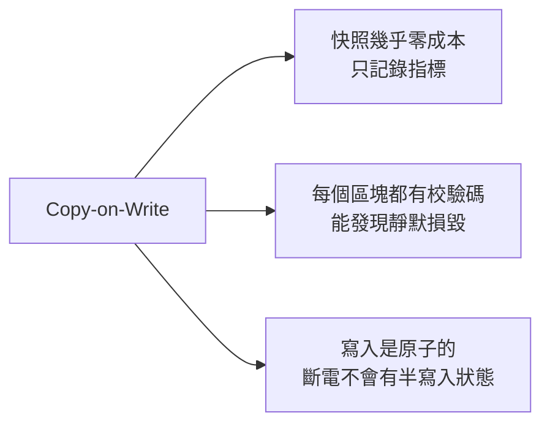
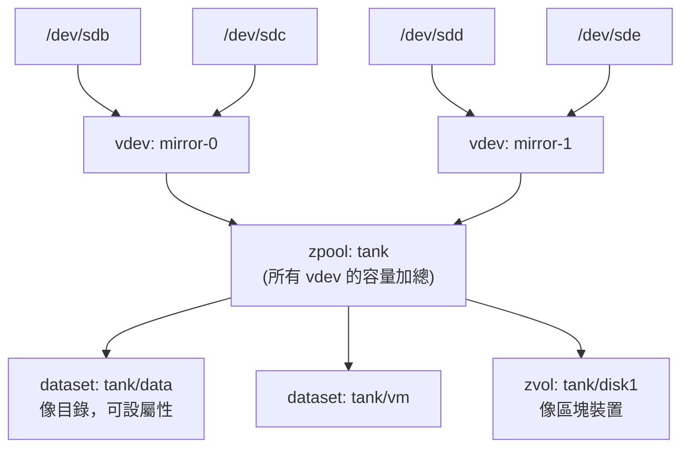

# 進階儲存 ZFS 與 Btrfs

> [!abstract] 這篇你會學到
> - 理解 ZFS 的 **pool / vdev / dataset** 三層模型，以及為什麼「vdev 一旦建立就不能改」
> - 選對 RAIDZ 等級，避開**「RAIDZ 無法線上擴充」**這個最常見的規劃錯誤
> - 用 `zfs send/recv` 做**增量、可驗證、可跨機的備份**——這是 ZFS 最有價值的功能
> - 用 Btrfs 子卷佈局做「升級前快照、出事一分鐘回滾」
> - 知道 ZFS 與 Btrfs **各自不該用在什麼場景**

## 前置知識

- [[020-01-15-cmd-Linux-磁碟分割與掛載]]

---

## 觀念說明

### 為什麼需要這兩個

傳統做法（`分割區 → LVM → ext4/xfs`）有三個先天缺口：

| 缺口 | 後果 |
| --- | --- |
| **不校驗資料本身** | 磁碟靜默損毀（bit rot）你不會知道，備份把壞資料一起備走 |
| **快照有效能代價** | LVM 快照是「寫入時複製到快照區」，寫入效能明顯下降，且快照區滿了就失效 |
| **層與層之間不溝通** | RAID 層不知道哪些區塊有資料，重建時得複製整顆磁碟 |

ZFS 與 Btrfs 都採用 **CoW（Copy-on-Write）**：資料永遠寫到新位置，
再原子性地更新指標。這帶來三個直接好處：



### ZFS 的三層模型

**這是理解 ZFS 的關鍵，也是新手最常搞錯的地方。**



| 層 | 是什麼 | 關鍵限制 |
| --- | --- | --- |
| **vdev** | 一組磁碟的冗餘單位（mirror、raidz…） | **建立後結構不可改** |
| **zpool** | 一個或多個 vdev 組成的儲存池 | 容量 = 所有 vdev 加總；**任一 vdev 全毀 = 整個 pool 毀** |
| **dataset** | pool 內的檔案系統，可獨立設屬性 | 共用 pool 空間，可設 quota |
| **zvol** | pool 內的區塊裝置 | 給 VM 或 iSCSI 用 |

> [!danger] 最常見的規劃錯誤：以為 RAIDZ 可以之後加磁碟
> ```bash
> sudo zpool create tank raidz1 /dev/sdb /dev/sdc /dev/sdd     # 3 顆 RAIDZ1
> # 半年後想加第 4 顆……
> sudo zpool add tank /dev/sde
> ```
> ```
> invalid vdev specification
> use '-f' to override the following errors:
> mismatched replication level: pool uses raidz and new vdev is disk
> ```
>
> **RAIDZ vdev 的磁碟數量在建立時就固定了。**
> 你只能：
> 1. **再加一個完整的 vdev**（例如再來 3 顆組成第二個 raidz1）
> 2. 換更大的磁碟（一顆一顆 `replace`，全換完後容量才增加）
> 3. 備份、砍掉 pool、重建（停機）
>
> （較新的 OpenZFS 有 RAIDZ expansion 功能，但仍有限制且不是所有版本都支援。
> **規劃時請以「不能擴充」為前提**。）
>
> **需要彈性擴充就用 mirror**：mirror vdev 可以隨時再加一組 mirror 進 pool。

> [!danger] 一個 vdev 掛掉，整個 pool 就沒了
> ```bash
> sudo zpool create tank /dev/sdb /dev/sdc      # ⚠ 這是兩個「單磁碟 vdev」！
> ```
> 這不是 RAID0 的「效能配置」，而是**兩個沒有冗餘的 vdev**。
> 任何一顆磁碟壞掉，**整個 pool 的資料全部消失**（包含另一顆上的）。
>
> 正確寫法要明確指定冗餘型式：
> ```bash
> sudo zpool create tank mirror /dev/sdb /dev/sdc          # 鏡像
> sudo zpool create tank raidz1 /dev/sdb /dev/sdc /dev/sdd # RAIDZ1
> ```

### RAIDZ 等級選擇

| 型式 | 可容忍故障 | 容量效率 | 最少磁碟 | 重建風險 |
| --- | --- | --- | --- | --- |
| `mirror`（2 顆） | 1 顆 | 50% | 2 | 低 |
| `mirror`（3 顆） | 2 顆 | 33% | 3 | 極低 |
| `raidz1` | **1 顆** | (n-1)/n | 3 | **重建期間再壞一顆就全毀** |
| `raidz2` | **2 顆** | (n-2)/n | 4 | 中 |
| `raidz3` | 3 顆 | (n-3)/n | 5 | 低 |

> [!warning] 大容量磁碟不要用 RAIDZ1
> 現代 16TB 磁碟重建（resilver）要跑一到數天，期間所有磁碟高負載讀取——
> 這正是第二顆磁碟最容易跟著壞的時候。
>
> **經驗法則**：
> - 磁碟 ≥ 4TB → 至少 **raidz2**
> - 需要最高效能與最短重建時間 → **多組 mirror**（VM 儲存常見）
> - 冷資料歸檔、磁碟數多 → raidz2 / raidz3

---

## ZFS 操作

### 安裝

```bash
# Ubuntu / Debian
sudo apt install -y zfsutils-linux
modinfo zfs | head -3
```

> [!info]- Rocky / AlmaLinux（RHEL 系）對照
> ZFS 因授權（CDDL 與 GPL 不相容）不在 RHEL 官方套件庫，需用 OpenZFS 的庫：
> ```bash
> sudo dnf install -y https://zfsonlinux.org/epel/zfs-release-2-3$(rpm --eval "%{dist}").noarch.rpm
> sudo dnf install -y epel-release
> sudo dnf install -y kernel-devel zfs
> sudo modprobe zfs
> echo zfs | sudo tee /etc/modules-load.d/zfs.conf
> ```
>
> **重要**：RHEL 系用 DKMS 編譯模組，**每次核心更新後模組要重編**。
> 更新核心前先確認 OpenZFS 有支援該核心版本，否則重開機後 pool 掛不起來。
> 這是 RHEL 上跑 ZFS 最大的維運負擔。
>
> Ubuntu 用預編譯模組，這個問題輕微得多——**要跑 ZFS 建議選 Ubuntu**。

### 建立 pool

```bash
# ⚠ 用穩定的裝置識別，不要用 /dev/sdX
ls -l /dev/disk/by-id/ | grep -v part

sudo zpool create -o ashift=12 -O compression=zstd -O atime=off \
     tank mirror \
     /dev/disk/by-id/ata-WDC_WD40EFRX_WD-WCC4E0123456 \
     /dev/disk/by-id/ata-WDC_WD40EFRX_WD-WCC4E0654321
```

> [!danger] 一定要用 `/dev/disk/by-id/`，不要用 `/dev/sdb`
> 裝置名稱在重開機後可能改變（見 [[020-01-15-cmd-Linux-磁碟分割與掛載]]）。
> ZFS 有自己的標籤機制通常能自動找到，
> 但**用 by-id 建立的 pool，`zpool status` 會顯示磁碟序號**，
> 這在「哪一顆壞了、要去機房拔哪一顆」時是決定性的資訊：
>
> ```
>   NAME                                   STATE
>   tank                                   DEGRADED
>     mirror-0                             DEGRADED
>       ata-WDC_WD40EFRX_WD-WCC4E0123456   ONLINE
>       ata-WDC_WD40EFRX_WD-WCC4E0654321   FAULTED   ← 直接看到序號
> ```

> [!warning] `ashift=12` 必須在建立時指定，之後無法更改
> `ashift` 是磁區大小的 2 次冪：`12` = 4096 bytes。
> 現代磁碟（含號稱 512e 的）幾乎都是 4K 實體磁區。
>
> 設錯（用了預設的 9 = 512B）會造成**永久性的效能損失**，
> 而且**只能重建整個 pool 才能修正**。
>
> **建立時一律加 `-o ashift=12`。** SSD 有些用 8K，可查：
> ```bash
> sudo smartctl -a /dev/sdb | grep -i 'sector size'
> ```

### 檢視

```bash
zpool list                          # pool 概況
zpool status                        # ✓ 健康狀態與 vdev 結構
zpool status -v                     # 含錯誤檔案清單
zpool iostat -v 2                   # 即時 I/O 統計
zpool history tank                  # ✓ 這個 pool 的所有操作歷史
zfs list                            # dataset 清單
zfs list -t snapshot                # 快照清單
zfs list -o name,used,avail,refer,compressratio,mountpoint
```

```bash
zpool status
```

```
  pool: tank
 state: ONLINE
  scan: scrub repaired 0B in 02:14:31 with 0 errors on Sun Aug 24 04:14:32 2026
config:

        NAME                                   STATE     READ WRITE CKSUM
        tank                                   ONLINE       0     0     0
          mirror-0                             ONLINE       0     0     0
            ata-WDC_WD40EFRX_WD-WCC4E0123456   ONLINE       0     0     0
            ata-WDC_WD40EFRX_WD-WCC4E0654321   ONLINE       0     0     0

errors: No known data errors
```

> [!tip] `CKSUM` 欄位是 ZFS 獨有的價值
> `READ` / `WRITE` 是 I/O 錯誤（傳統 RAID 也看得到），
> **`CKSUM` 是「資料校驗不符」**——也就是靜默損毀。
>
> 傳統 RAID 完全偵測不到這種錯誤，會把壞資料原封不動交給應用程式。
> ZFS 在有冗餘時**會自動用正確的副本修復並記錄**。
>
> `CKSUM` 持續增加代表該磁碟開始劣化，即使 SMART 還顯示 PASSED，
> **也該準備更換**。

> [!tip] `zpool history` 是稽核與事故調查的利器
> 它記錄了這個 pool 從建立以來的**每一個操作**，包含時間與指令：
> ```
> 2026-03-01.09:12:03 zpool create -o ashift=12 tank mirror ...
> 2026-05-14.14:22:41 zfs set compression=zstd tank/data
> 2026-08-27.10:03:12 zfs destroy tank/data@old-snapshot
> ```
> 「誰刪掉了那個快照」這種問題，一行就有答案。

### Dataset 與屬性

```bash
sudo zfs create tank/data
sudo zfs create -o mountpoint=/srv/web tank/web
sudo zfs create -o recordsize=16K -o primarycache=metadata tank/mysql

sudo zfs set compression=zstd tank/data
sudo zfs set atime=off tank/data
sudo zfs set quota=500G tank/data
sudo zfs set reservation=100G tank/data
sudo zfs set snapdir=visible tank/data      # 讓 .zfs/snapshot 目錄可見

zfs get all tank/data                       # 所有屬性
zfs get compression,compressratio,used,quota tank/data
zfs get -r used tank                        # 遞迴
```

```bash
zfs get compressratio tank/data
```

```
NAME       PROPERTY       VALUE  SOURCE
tank/data  compressratio  2.41x  -
```

**重要屬性**：

| 屬性 | 建議值 | 說明 |
| --- | --- | --- |
| `compression` | **`zstd`** 或 `lz4` | 幾乎沒有 CPU 代價，通常還更快（少讀寫） |
| `atime` | **`off`** | 減少不必要的寫入 |
| `recordsize` | 預設 `128K`；**資料庫用 `16K`** | 對應應用的 I/O 大小 |
| `xattr` | `sa` | 擴充屬性存在 inode 裡，較快 |
| `quota` / `refquota` | 依需求 | 含 / 不含子 dataset 與快照 |
| `reservation` | 依需求 | 保證最少可用空間 |
| `sync` | `standard` | **不要為了效能設 `disabled`** |
| `dedup` | **`off`** | 除非你真的知道自己在做什麼 |

> [!danger] `sync=disabled` 會在斷電時遺失資料
> 有些效能教學建議設這個，速度確實會飛快，
> 但它讓 ZFS **忽略應用程式的 fsync 要求**——
> 資料庫以為已經落盤了，實際還在記憶體。斷電就是交易遺失。
>
> 需要同步寫入效能請加 **SLOG 裝置**（獨立的高速 SSD），
> 而不是關掉 sync。

> [!danger] `dedup=on` 幾乎永遠是錯的決定
> 去重表必須常駐記憶體，**每 TB 資料約需 5GB RAM**。
> 記憶體不足時去重表被換到磁碟，效能會**災難性地崩潰**，
> 而且**關掉 dedup 也救不回來**（已寫入的資料仍在去重表裡）。
>
> 現代做法：用 `compression=zstd` 就好。壓縮的效益穩定、成本可預測，
> 而且對大多數資料的空間節省不輸去重。

> [!tip] `recordsize` 對資料庫效能影響巨大
> ZFS 預設 `recordsize=128K`。MySQL InnoDB 的頁面是 16K，
> 每次改一個 16K 頁面，ZFS 要讀寫整個 128K record——**寫入放大 8 倍**。
>
> ```bash
> sudo zfs create -o recordsize=16K tank/mysql     # InnoDB
> sudo zfs create -o recordsize=8K  tank/postgres  # PostgreSQL 預設 8K
> ```
> **`recordsize` 只影響設定之後新寫入的資料**，
> 要對既有資料生效必須重寫（例如 dump & restore）。

### 快照與回滾

```bash
sudo zfs snapshot tank/data@before-upgrade
sudo zfs snapshot -r tank@daily-$(date +%F)         # -r 遞迴所有子 dataset

zfs list -t snapshot -o name,used,refer,creation

sudo zfs rollback tank/data@before-upgrade          # 回滾（會丟掉之後的變更）
sudo zfs rollback -r tank/data@before-upgrade       # -r 連中間的快照一起刪

sudo zfs destroy tank/data@before-upgrade
sudo zfs destroy tank/data@snap1%snap5              # 刪除範圍
```

**不用回滾就能取用快照裡的檔案**：

```bash
ls /tank/data/.zfs/snapshot/
cp /tank/data/.zfs/snapshot/daily-2026-08-20/important.conf /tank/data/
```

> [!tip] `.zfs/snapshot/` 是誤刪救援的第一選擇
> 使用者說「我不小心刪了檔案」，不需要動用備份，
> 直接從快照目錄複製回來，**幾秒鐘的事**。
>
> 讓它可見（預設隱藏）：
> ```bash
> sudo zfs set snapdir=visible tank/data
> ```
> 配合 Samba 的 `shadow_copy2` 模組，Windows 使用者甚至可以用
> 檔案總管的「先前版本」自助還原。

> [!warning] 快照不是備份
> 快照與資料在**同一個 pool**。pool 毀了（機器燒了、控制器壞了、
> 誤下 `zpool destroy`）快照一起沒。
>
> **快照 + `zfs send` 到另一台機器**才是備份。見下方。

### `zfs send/recv`：ZFS 最有價值的功能

```bash
# ── 完整備份到另一台機器 ──
sudo zfs snapshot tank/data@base
sudo zfs send tank/data@base | ssh backup-host "sudo zfs recv backup/data"

# ── 增量備份（只傳差異）──
sudo zfs snapshot tank/data@2026-08-28
sudo zfs send -i tank/data@base tank/data@2026-08-28 \
  | ssh backup-host "sudo zfs recv backup/data"

# ── 遞迴 + 壓縮傳輸 + 進度顯示 ──
sudo zfs send -R -c tank@daily-2026-08-28 \
  | pv | ssh backup-host "sudo zfs recv -F backup/tank"

# ── 存成檔案 ──
sudo zfs send tank/data@base | zstd -T0 > /backup/data-base.zfs.zst
```

| 選項 | 作用 |
| --- | --- |
| `-i snap1` | 增量（從 snap1 到指定快照） |
| `-I snap1` | 增量並保留中間所有快照 |
| `-R` | 遞迴，含所有子 dataset 與屬性 |
| `-c` | **傳送已壓縮的資料**（不解壓再壓，快很多） |
| `-w` | raw（加密的 dataset 不解密就傳） |
| `recv -F` | 強制覆蓋目標 |

> [!tip] 為什麼 `zfs send` 比 rsync 好
> | | `rsync` | `zfs send -i` |
> | --- | --- | --- |
> | 找出差異 | **掃描整棵目錄樹比對** | **直接從中繼資料得知**（瞬間） |
> | 一億個檔案 | 掃描要好幾小時 | 一樣是瞬間 |
> | 傳輸內容 | 檔案 | 區塊層差異 |
> | 保留權限/ACL/xattr | 要記得加參數 | **天生就有** |
> | 保留快照 | ❌ | ✅ |
> | 一致性 | 傳輸期間檔案可能變動 | **快照是凍結的時間點** |
>
> 對大量小檔的環境（郵件、圖片、程式碼倉庫），
> 差異是「幾小時」與「幾秒」的等級。

**自動化增量備份腳本**：

```bash
#!/usr/bin/env bash
# zfs-backup.sh — 增量備份到遠端
set -euo pipefail

SRC=tank/data
DST=backup/data
HOST=backup-host
TAG=$(date +%Y%m%d-%H%M)

# 1. 建立新快照
sudo zfs snapshot "${SRC}@${TAG}"

# 2. 找出遠端最新的共同快照
LAST=$(ssh "$HOST" "zfs list -H -o name -t snapshot -s creation -d 1 ${DST}" 2>/dev/null \
       | tail -1 | cut -d@ -f2 || true)

if [ -n "$LAST" ] && sudo zfs list -H "${SRC}@${LAST}" >/dev/null 2>&1; then
    echo "→ 增量傳送 ${LAST} → ${TAG}"
    sudo zfs send -c -i "${SRC}@${LAST}" "${SRC}@${TAG}" \
      | ssh "$HOST" "sudo zfs recv -F ${DST}"
else
    echo "→ 完整傳送 ${TAG}"
    sudo zfs send -c "${SRC}@${TAG}" | ssh "$HOST" "sudo zfs recv -F ${DST}"
fi

# 3. 驗證遠端確實收到
ssh "$HOST" "zfs list -H -o name -t snapshot ${DST}@${TAG}" \
  || { echo "❌ 遠端沒有這個快照" >&2; exit 1; }

# 4. 本地保留 7 天、遠端保留 90 天
sudo zfs list -H -o name -t snapshot -s creation -d 1 "$SRC" \
  | head -n -7 | xargs -r -n1 sudo zfs destroy
ssh "$HOST" "zfs list -H -o name -t snapshot -s creation -d 1 ${DST} | head -n -90 | xargs -r -n1 sudo zfs destroy"

echo "✅ 完成 ${TAG}"
```

> [!tip] 專用工具能省下維護這種腳本的力氣
> `sanoid` / `syncoid` 把「快照排程 + 保留策略 + 增量同步」整包做好：
> ```bash
> sudo apt install -y sanoid
> ```
> `/etc/sanoid/sanoid.conf`：
> ```ini
> [tank/data]
>         use_template = production
>
> [template_production]
>         hourly = 36
>         daily = 30
>         monthly = 12
>         yearly = 0
>         autosnap = yes
>         autoprune = yes
> ```
> ```bash
> syncoid tank/data backup-host:backup/data     # 一行完成增量同步
> ```

### 磁碟更換與維護

```bash
# ── 定期校驗（重要！）──
sudo zpool scrub tank
zpool status tank                    # 看進度
sudo zpool scrub -s tank             # 停止

# ── 更換故障磁碟 ──
zpool status -v                                  # 先確認是哪一顆（看序號）
sudo zpool offline tank <舊磁碟 by-id>
# （實體換掉磁碟）
sudo zpool replace tank <舊磁碟 by-id> <新磁碟 by-id>
zpool status                                     # 觀察 resilver 進度

# ── 擴充 ──
sudo zpool add tank mirror /dev/disk/by-id/xxx /dev/disk/by-id/yyy   # 加一組新 vdev
sudo zpool set autoexpand=on tank                # 換大磁碟後自動擴容
sudo zpool online -e tank <磁碟>                 # 手動擴容

# ── 匯出匯入（搬機器）──
sudo zpool export tank
sudo zpool import                                # 掃描可匯入的 pool
sudo zpool import tank
sudo zpool import -d /dev/disk/by-id tank        # 指定搜尋路徑
```

> [!tip] `scrub` 必須排程，這是 ZFS 保護資料的核心機制
> 沒有 scrub，靜默損毀會累積到「兩份副本都壞了」才被發現。
>
> ```bash
> # Ubuntu 的 zfsutils-linux 已內建每月 scrub 的 systemd timer
> systemctl list-timers | grep zfs
> ```
> 沒有的話自己加（見 [[020-01-18-guide-Linux-排程工作]]）：
> ```ini
> # /etc/systemd/system/zfs-scrub@.timer
> [Timer]
> OnCalendar=Sun *-*-01..07 04:00:00      # 每月第一個週日
> RandomizedDelaySec=3600
> Persistent=true
> ```
>
> 頻率建議：**企業級磁碟每月一次，消費級磁碟每兩週一次**。

### ARC 記憶體調校

```bash
# 目前 ARC 使用量
arc_summary | head -30
cat /proc/spl/kstat/zfs/arcstats | grep -E '^(size|c_max|c_min|hits|misses) '
```

```bash
# 限制 ARC 最大 4GB（在記憶體吃緊的機器上必做）
echo 'options zfs zfs_arc_max=4294967296' | sudo tee /etc/modprobe.d/zfs.conf
sudo update-initramfs -u        # Ubuntu
sudo reboot
```

> [!danger] 沒有限制 ARC 會讓應用程式被 OOM 殺掉
> ZFS 預設 ARC 上限是**實體記憶體的 50%**。
> 在跑資料庫或 Java 應用的機器上，ZFS 與應用會互相搶記憶體。
>
> ARC 理論上會在記憶體壓力下釋放，但**釋放速度不一定跟得上**，
> 結果就是 OOM Killer 砍掉你的資料庫（見 [[020-01-10-cmd-Linux-程序管理與訊號]]）。
>
> **明確設定 `zfs_arc_max`**，留足夠給應用程式。

---

## Btrfs 深入

### 推薦的子卷佈局

**不要直接把整個檔案系統當根目錄用**，先建子卷：

```bash
sudo mkfs.btrfs -L system /dev/sdb1
sudo mount /dev/sdb1 /mnt

sudo btrfs subvolume create /mnt/@              # 根
sudo btrfs subvolume create /mnt/@home          # 家目錄
sudo btrfs subvolume create /mnt/@var-log       # 日誌（不希望被快照）
sudo btrfs subvolume create /mnt/@snapshots     # 存放快照

sudo umount /mnt
```

`/etc/fstab`：

```
UUID=xxx /          btrfs subvol=@,compress=zstd:3,noatime,ssd        0 0
UUID=xxx /home      btrfs subvol=@home,compress=zstd:3,noatime,ssd    0 0
UUID=xxx /var/log   btrfs subvol=@var-log,compress=zstd:3,noatime     0 0
UUID=xxx /.snapshots btrfs subvol=@snapshots,noatime                  0 0
```

> [!tip] 為什麼要分子卷
> **快照的單位是子卷**。把 `/` 和 `/home` 分開之後：
> - 系統升級壞了 → 只回滾 `@`，使用者資料完全不受影響
> - `/var/log` 獨立 → 快照裡不會包含大量會變動的日誌，省空間
>
> 這個佈局是 openSUSE、Fedora 的標準做法。

### 快照工作流

```bash
# 升級前
sudo btrfs subvolume snapshot -r / /.snapshots/root-$(date +%F-%H%M)
sudo apt full-upgrade

# 出事了 —— 回滾
sudo mount /dev/sdb1 /mnt
sudo mv /mnt/@ /mnt/@broken-$(date +%F)
sudo btrfs subvolume snapshot /mnt/@snapshots/root-2026-08-27-0900 /mnt/@
sudo reboot
```

> [!warning] Btrfs 沒有「原地回滾」指令
> 不像 ZFS 有 `zfs rollback`，Btrfs 的回滾是
> **「把舊快照複製成新的子卷，然後改掛載目標」**。
>
> 根檔案系統的回滾必須從另一個環境（救援模式或 live USB）操作，
> 或者用 `snapper` + `grub-btrfs` 讓你在開機選單直接選快照開機。

**用 `snapper` 自動化**：

```bash
sudo apt install -y snapper
sudo snapper -c root create-config /
sudo snapper -c root list
sudo snapper -c root create -d "升級前"
sudo snapper -c root status 1..2          # 比較兩個快照的差異
sudo snapper -c root undochange 1..2      # 復原指定變更
```

### 維護：balance 與 scrub

```bash
sudo btrfs scrub start -B /data           # -B 前景執行，看得到結果
sudo btrfs scrub status /data
sudo btrfs balance start -dusage=50 -musage=50 /data    # 重新平衡
sudo btrfs balance status /data
sudo btrfs filesystem defragment -r -czstd /data        # 重組並壓縮
```

> [!warning] Btrfs 特有的「空間用完但 df 說還有」
> Btrfs 把空間分成「已配置的區塊群組」與「未配置」。
> 大量刪除後可能有很多**半空的區塊群組**佔著配置，
> 導致新資料無處可寫，即使 `df` 顯示還有空間。
>
> ```bash
> sudo btrfs filesystem usage /data
> ```
> ```
> Device allocated:            500.00GiB     ← 全部配置光了
> Used:                        120.00GiB     ← 實際只用這麼多
> Free (estimated):              0.00GiB     ← 寫不進去了
> ```
>
> 解法是 balance：
> ```bash
> sudo btrfs balance start -dusage=50 /data      # 合併使用率 <50% 的區塊群組
> ```
> **balance 是 I/O 密集操作**，在離峰時段做，並用 `-dusage` 限制範圍
> （不要無條件 `balance start`，那會重寫整個檔案系統）。

### Btrfs 的多裝置與降級掛載

```bash
sudo btrfs filesystem show
sudo btrfs device add /dev/sdc /data
sudo btrfs balance start -dconvert=raid1 -mconvert=raid1 /data   # 轉成 RAID1

# 磁碟壞掉時降級掛載
sudo mount -o degraded /dev/sdb1 /data
sudo btrfs replace start /dev/sdb1 /dev/sdd1 /data
sudo btrfs replace status /data
```

> [!danger] Btrfs RAID5/6 不要用在正式環境
> 官方 wiki 至今仍標示 RAID5/6 有 **write hole** 與
> **scrub/replace 邏輯缺陷**。實際案例中有資料遺失的報告。
>
> 安全的 profile：`single`、`dup`、`raid1`、`raid1c3`、`raid1c4`、`raid10`。
> 需要 RAID5/6 的空間效率請用 **ZFS RAIDZ** 或 **mdadm + ext4/xfs**。

---

## ZFS 與 Btrfs 怎麼選

| 面向 | ZFS | Btrfs |
| --- | --- | --- |
| 成熟度 | **極高**（Solaris 時代至今） | 高，但 RAID5/6 不可用 |
| 核心整合 | ❌ 需另裝模組、RHEL 上要 DKMS | **✅ 核心內建** |
| 記憶體需求 | **高**（ARC，建議 8GB+） | 中 |
| 縮小容量 | ❌ | **✅** |
| 擴充彈性 | RAIDZ 不可擴充；mirror 可加 vdev | **✅ 隨時加減磁碟** |
| RAID5/6 等級 | **✅ RAIDZ1/2/3 穩定** | ❌ 不可用 |
| 遠端增量備份 | **✅ `send/recv` 極強** | `btrfs send/receive`（較陽春） |
| 快照回滾 | **✅ `zfs rollback` 一行** | 需搬移子卷或用 snapper |
| 授權 | CDDL（不能進核心） | GPL |
| 適合 | **儲存伺服器、NAS、備份主機、VM 儲存** | **根檔案系統快照、單機、彈性擴充** |

> [!tip] 實務建議
> - **需要資料完整性保證與跨機備份的儲存系統** → ZFS（記憶體要夠）
> - **想要「升級前快照、出事秒回滾」的一般伺服器** → Btrfs
> - **不確定、記憶體有限、只想要穩** → **ext4 或 xfs + LVM**（見 [[020-01-15-cmd-Linux-磁碟分割與掛載]]）
>
> 這兩個都是「功能換複雜度」的選擇。
> 一台只跑 Nginx + MySQL 的機器用 ext4 完全沒問題，
> **不要為了新技術而增加維運負擔**。

---

## 完整實戰範例：建一台 ZFS 備份伺服器

```bash
#!/usr/bin/env bash
set -euo pipefail

# ── 1. 確認磁碟（用序號，不用 sdX）──────────────────
ls -l /dev/disk/by-id/ | grep -E 'ata-|nvme-' | grep -v part
lsblk -o NAME,SIZE,MODEL,SERIAL

DISKS=(
  /dev/disk/by-id/ata-WDC_WD40EFRX_WD-WCC4E0000001
  /dev/disk/by-id/ata-WDC_WD40EFRX_WD-WCC4E0000002
  /dev/disk/by-id/ata-WDC_WD40EFRX_WD-WCC4E0000003
  /dev/disk/by-id/ata-WDC_WD40EFRX_WD-WCC4E0000004
)

# ── 2. 建立 pool（4 顆 4TB 用 raidz2，容忍 2 顆故障）──
sudo zpool create -f \
  -o ashift=12 \
  -o autoexpand=on \
  -o autotrim=on \
  -O compression=zstd \
  -O atime=off \
  -O xattr=sa \
  -O acltype=posixacl \
  -O canmount=off \
  -O mountpoint=none \
  backup raidz2 "${DISKS[@]}"

# ── 3. 建立 dataset ─────────────────────────────────
sudo zfs create -o mountpoint=/backup            backup/data
sudo zfs create -o recordsize=1M                 backup/data/archives   # 大檔
sudo zfs create -o recordsize=16K                backup/data/db         # 資料庫備份
sudo zfs create -o quota=2T                      backup/data/clients

# ── 4. 驗證 ────────────────────────────────────────
zpool status
zpool list
zfs list -o name,used,avail,compressratio,mountpoint

# ── 5. 排定每月 scrub ──────────────────────────────
sudo tee /etc/systemd/system/zfs-scrub-backup.service > /dev/null <<'UNIT'
[Unit]
Description=ZFS scrub for pool backup
[Service]
Type=oneshot
ExecStart=/usr/sbin/zpool scrub -w backup
ExecStartPost=/bin/bash -c 'zpool status backup | grep -q "errors: No known data errors" || (logger -t ZFS "❌ backup pool scrub 發現錯誤"; exit 1)'
OnFailure=alert@%n.service
UNIT

sudo tee /etc/systemd/system/zfs-scrub-backup.timer > /dev/null <<'UNIT'
[Unit]
Description=Monthly ZFS scrub
[Timer]
OnCalendar=Sun *-*-01..07 04:00:00
RandomizedDelaySec=3600
Persistent=true
[Install]
WantedBy=timers.target
UNIT

sudo systemctl daemon-reload
sudo systemctl enable --now zfs-scrub-backup.timer

# ── 6. 設定健康監控告警 ─────────────────────────────
sudo tee /usr/local/bin/zfs-health-check.sh > /dev/null <<'SCRIPT'
#!/usr/bin/env bash
set -uo pipefail
FAIL=0
for pool in $(zpool list -H -o name); do
    STATE=$(zpool list -H -o health "$pool")
    if [ "$STATE" != "ONLINE" ]; then
        logger -t ZFS "❌ pool $pool 狀態異常：$STATE"
        FAIL=1
    fi
    # 任何 READ/WRITE/CKSUM 錯誤都要注意
    if zpool status "$pool" | awk 'NR>5 && NF>=5 {if ($3+$4+$5 > 0) exit 1}'; then :; else
        logger -t ZFS "⚠ pool $pool 有 I/O 或校驗錯誤"
        FAIL=1
    fi
done
exit "$FAIL"
SCRIPT
sudo chmod 755 /usr/local/bin/zfs-health-check.sh

echo "✅ 完成。每日健康檢查請加入每日維護作業。"
```

> [!tip] 這個設定裡的關鍵決策
> | 設定 | 理由 |
> | --- | --- |
> | `raidz2` | 4TB 磁碟重建慢，raidz1 風險太高 |
> | `ashift=12` | **建立後無法更改**，一定要在這裡設對 |
> | `compression=zstd` | 幾乎免費的空間節省 |
> | `atime=off` | 備份伺服器不需要存取時間 |
> | `xattr=sa` + `acltype=posixacl` | 保留來源的 ACL（見 [[020-01-08-cmd-Linux-檔案權限與擁有者]]） |
> | `canmount=off` + `mountpoint=none`（pool 層） | 只讓 dataset 掛載，pool 本身不掛 |
> | `recordsize` 分開設 | 大檔用 1M、資料庫備份用 16K |
> | 每月 scrub + 告警 | **沒有 scrub 的 ZFS 等於放棄了它最大的價值** |

---

## 常見錯誤與排錯

| 現象 | 原因 | 解法 |
| --- | --- | --- |
| `zpool add` 說 mismatched replication level | 想加單磁碟到 raidz pool | 加完整的 vdev，或用 `-f`（**不建議**） |
| RAIDZ 想加磁碟卻不行 | vdev 結構建立後固定 | 加新 vdev、換大磁碟、或重建 pool |
| 一顆磁碟壞了整個 pool 沒了 | 建立時沒指定 mirror/raidz | 重建時務必寫明冗餘型式 |
| 效能很差且無法改善 | `ashift` 設錯（512 vs 4K） | **只能重建 pool** |
| 應用程式被 OOM 殺掉 | ARC 吃太多記憶體 | 設 `zfs_arc_max` |
| 資料庫在 ZFS 上很慢 | `recordsize` 與應用 I/O 不符 | 資料庫 dataset 設 16K / 8K |
| 重開機後 pool 不見 | 模組沒載入或 DKMS 編譯失敗 | `modprobe zfs`；RHEL 檢查核心與 OpenZFS 相容性 |
| RHEL 更新核心後 ZFS 掛了 | DKMS 模組未重編 | 更新前先確認相容；`dkms status` |
| `zpool import` 找不到 pool | 裝置路徑變了 | `zpool import -d /dev/disk/by-id` |
| Btrfs 空間滿但 `df` 說有 | 區塊群組配置光了 | `btrfs balance start -dusage=50` |
| Btrfs `df` 數字不可信 | CoW 與共用區塊 | 用 `btrfs filesystem usage` |
| Btrfs 上資料庫效能崩潰 | CoW 造成碎片 | 目錄先 `chattr +C` 再放資料 |
| Btrfs RAID5 資料遺失 | 已知缺陷 | **不要用**，改 raid1 或 ZFS |
| 快照佔用大量空間 | 舊資料被快照保留住 | `zfs list -t snapshot -o name,used` 找出並清理 |
| 刪了檔案空間沒釋放 | 被快照引用著 | 刪掉相關快照 |

---

## 安全性注意事項

> [!danger] `zpool destroy` 與 `zfs destroy -r` 沒有確認提示
> ```bash
> sudo zpool destroy tank          # 整個 pool 立刻消失
> sudo zfs destroy -r tank/data    # 遞迴刪除，含所有快照
> ```
> 先用 `-n`（dry-run）確認：
> ```bash
> sudo zfs destroy -nrv tank/data
> ```
> ```
> would destroy tank/data@daily-2026-08-20
> would destroy tank/data@daily-2026-08-21
> would destroy tank/data
> ```

> [!tip] 用 `readonly` 與 hold 保護重要快照
> ```bash
> sudo zfs hold keep tank/data@monthly-2026-08      # 標記為不可刪除
> sudo zfs holds tank/data@monthly-2026-08
> sudo zfs release keep tank/data@monthly-2026-08   # 解除
> ```
> 被 hold 的快照即使下 `destroy` 也刪不掉，
> 能防止自動清理腳本誤刪重要備份。

> [!tip] ZFS 原生加密保護靜態資料
> ```bash
> sudo zfs create -o encryption=aes-256-gcm -o keyformat=passphrase tank/secure
> sudo zfs load-key tank/secure         # 開機後要載入金鑰才能掛載
> sudo zfs mount tank/secure
> ```
> 加密的 dataset 可以用 `zfs send -w` **不解密就傳到備份主機**——
> 備份主機看不到明文，這在異地備份時很有價值。
> 見 [[090-03-03-guide-應用安全-機密管理與金鑰保護]]。

> [!warning] 備份主機的快照要防止被來源端刪除
> 勒索軟體的典型手法是「加密資料 + 刪除備份」。
> 如果備份主機讓來源端有完整權限，備份會一起被毀。
>
> 防護做法：
> - 備份用 **pull 模式**（備份主機主動去拉），來源端沒有備份主機的權限
> - 備份主機的快照設 `hold`
> - 備份 dataset 設 `readonly=on`

---

## 速查表

### ZFS

| 指令 | 說明 |
| --- | --- |
| `zpool create -o ashift=12 tank mirror <d1> <d2>` | **建立 pool（ashift 不可改）** |
| `zpool status` / `-v` | **健康狀態 / 含錯誤檔案** |
| `zpool list` / `zpool iostat -v 2` | 容量 / I/O |
| **`zpool history`** | **所有操作歷史** |
| `zpool scrub tank` | **全盤校驗（必須排程）** |
| `zpool replace tank <舊> <新>` | 更換磁碟 |
| `zpool export` / `import` | 搬機器 |
| `zfs create tank/data` | 建 dataset |
| `zfs set compression=zstd tank/data` | 設屬性 |
| `zfs get all tank/data` | 看所有屬性 |
| `zfs snapshot tank/data@名稱` | 快照 |
| `zfs rollback tank/data@名稱` | **一行回滾** |
| **`zfs send -i s1 tank/d@s2 \| ssh h "zfs recv p/d"`** | **增量備份** |
| `zfs destroy -nrv` | **先 dry-run 再刪** |
| `zfs hold keep <快照>` | 保護不被刪 |
| `arc_summary` | ARC 使用狀況 |
| `zfs_arc_max` | **限制 ARC 記憶體** |

### Btrfs

| 指令 | 說明 |
| --- | --- |
| `mkfs.btrfs -d raid1 -m raid1 <d1> <d2>` | 建立（**避免 raid5/6**） |
| `btrfs subvolume create /path` | 建子卷 |
| `btrfs subvolume snapshot [-r] <來源> <目標>` | 快照（`-r` 唯讀） |
| `btrfs subvolume list /path` | 列出 |
| **`btrfs filesystem usage /path`** | **真實空間（`df` 不可信）** |
| `btrfs filesystem show` | 所有 btrfs 檔案系統 |
| **`btrfs scrub start -B /path`** | **全盤校驗** |
| **`btrfs balance start -dusage=50 /path`** | **解決「配置光了」** |
| `btrfs device add/remove` | 線上加減磁碟 |
| `btrfs filesystem resize -10G /path` | **可縮小** |
| `chattr +C <空目錄>` | **關閉 CoW（資料庫必做）** |
| `mount -o degraded` | 降級掛載 |

### 選型速記

| 需求 | 選擇 |
| --- | --- |
| 最穩、最省心 | ext4 / xfs（見 [[020-01-15-cmd-Linux-磁碟分割與掛載]]） |
| 線上調整容量 | LVM |
| 根檔案系統快照回滾 | **Btrfs** |
| 資料完整性 + 跨機增量備份 | **ZFS** |
| RAID5/6 等級 | **ZFS RAIDZ**（Btrfs 不可用） |
| 記憶體 < 8GB | 不要用 ZFS |

---

## 練習題

> [!question]- 練習 1：用檔案模擬 ZFS pool 並驗證自我修復
> 不用真的磁碟，用檔案建立 pool，故意損毀資料，觀察 ZFS 如何偵測並修復。
>
> **解答**
>
> ```bash
> # 1. 用四個檔案模擬磁碟
> sudo mkdir -p /zfstest
> for i in 1 2 3 4; do sudo truncate -s 1G /zfstest/disk$i.img; done
>
> sudo zpool create -o ashift=12 -O compression=zstd \
>      testpool raidz1 /zfstest/disk1.img /zfstest/disk2.img /zfstest/disk3.img
> zpool status testpool
>
> # 2. 寫入資料並記下校驗碼
> sudo dd if=/dev/urandom of=/testpool/data.bin bs=1M count=200 2>/dev/null
> sudo sha256sum /testpool/data.bin | sudo tee /tmp/original.sha
>
> # 3. 故意破壞其中一顆「磁碟」
> sudo zpool export testpool
> sudo dd if=/dev/urandom of=/zfstest/disk2.img bs=1M seek=100 count=50 conv=notrunc 2>/dev/null
> sudo zpool import -d /zfstest testpool
>
> # 4. scrub 偵測並修復
> sudo zpool scrub testpool
> sleep 20
> zpool status -v testpool
> ```
> ```
>         NAME                     STATE     READ WRITE CKSUM
>         testpool                 ONLINE       0     0     0
>           raidz1-0               ONLINE       0     0     0
>             /zfstest/disk1.img   ONLINE       0     0     0
>             /zfstest/disk2.img   ONLINE       0     0   412   ← 偵測到 412 個校驗錯誤
>             /zfstest/disk3.img   ONLINE       0     0     0
>
> errors: No known data errors                                   ← 但資料完好！
> ```
>
> ```bash
> # 5. 驗證資料真的沒壞
> sudo sha256sum -c /tmp/original.sha
> ```
> ```
> /testpool/data.bin: OK
> ```
>
> **這就是 ZFS 的核心價值**：偵測到 412 個損毀區塊，
> 用其他磁碟的同位資料**自動修復**，應用程式完全無感。
>
> 傳統 RAID 在同樣情況下會把壞資料原封不動交給你，
> 而且**你永遠不會知道**。
>
> 清理：
> ```bash
> sudo zpool destroy testpool && sudo rm -rf /zfstest /tmp/original.sha
> ```

> [!question]- 練習 2：Btrfs 快照回滾
> 建立 Btrfs 子卷、快照、破壞資料、還原。
>
> **解答**
>
> ```bash
> sudo truncate -s 2G /tmp/btrfs.img
> sudo mkfs.btrfs -q /tmp/btrfs.img
> sudo mkdir -p /mnt/btest && sudo mount -o loop,compress=zstd /tmp/btrfs.img /mnt/btest
>
> # 建子卷並放資料
> sudo btrfs subvolume create /mnt/btest/@app
> echo "重要設定 v1" | sudo tee /mnt/btest/@app/config.txt
> sudo mkdir -p /mnt/btest/@snapshots
>
> # 快照（記下這個時間點）
> sudo btrfs subvolume snapshot -r /mnt/btest/@app /mnt/btest/@snapshots/app-good
> sudo btrfs subvolume list /mnt/btest
>
> # 破壞
> echo "被改壞的設定" | sudo tee /mnt/btest/@app/config.txt
> sudo rm -f /mnt/btest/@app/config.txt
> ls /mnt/btest/@app/
> ```
>
> **方法一：只還原單一檔案**（最常用）
> ```bash
> sudo cp /mnt/btest/@snapshots/app-good/config.txt /mnt/btest/@app/
> cat /mnt/btest/@app/config.txt        # 重要設定 v1
> ```
>
> **方法二：整個子卷回滾**
> ```bash
> sudo mv /mnt/btest/@app /mnt/btest/@app-broken
> sudo btrfs subvolume snapshot /mnt/btest/@snapshots/app-good /mnt/btest/@app
> cat /mnt/btest/@app/config.txt        # 重要設定 v1
> sudo btrfs subvolume delete /mnt/btest/@app-broken
> ```
>
> **注意方法二的細節**：從**唯讀**快照建立的新快照預設是**可寫**的，
> 所以可以直接當作新的工作子卷。這就是 Btrfs 的「回滾」方式——
> 它沒有 ZFS 那樣的 `rollback` 指令。
>
> 清理：
> ```bash
> sudo umount /mnt/btest && sudo rm -f /tmp/btrfs.img && sudo rmdir /mnt/btest
> ```

> [!question]- 練習 3：判斷該用哪個方案
> 下列情境各該選什麼？說明理由。
>
> 1. 4GB 記憶體的 VPS，跑 Nginx + MySQL + PHP
> 2. 8 顆 16TB 磁碟的檔案伺服器，資料不能有任何損毀
> 3. 開發用工作站，想要「更新前快照、出事回滾」
> 4. 資料庫伺服器，需要在不停機的情況下把 500G 擴到 1T
> 5. 需要每天把 2000 萬個小檔增量備份到異地
>
> **解答**
>
> | # | 選擇 | 理由 |
> | --- | --- | --- |
> | 1 | **ext4**（或 xfs） | 4GB 記憶體跑 ZFS 會被 ARC 吃掉一半，直接排擠 MySQL。Btrfs 也不需要——這台機器沒有需要快照的場景，加複雜度只是增加故障點 |
> | 2 | **ZFS，raidz2 × 2 組 vdev** | 資料完整性是硬需求，只有 ZFS/Btrfs 有全資料校驗；16TB 磁碟重建慢，必須 raidz2；Btrfs 的 RAID5/6 不可用，所以只剩 ZFS。8 顆分成兩組 4 顆 raidz2 比單一 8 顆 raidz2 重建快 |
> | 3 | **Btrfs**（配 snapper + grub-btrfs） | 核心內建不用額外模組；子卷佈局讓 `/` 與 `/home` 分開快照；可從開機選單直接選快照開機。ZFS 也能做但工作站沒必要付出記憶體與模組維護成本 |
> | 4 | **LVM + xfs** | LVM 可線上擴充；xfs 可線上 `xfs_growfs`；全程不停機。（ZFS 也可以，但為了擴容而導入 ZFS 不划算） |
> | 5 | **ZFS `send/recv`** | rsync 要掃描 2000 萬個檔案比對，每天要跑好幾小時；`zfs send -i` 直接從中繼資料取得差異，**幾秒內就開始傳輸**。這是 ZFS 相對其他方案壓倒性的優勢場景 |
>
> **共同原則**：不要為了技術而技術。
> 第 1 題選 ext4 不是保守，是**正確**——複雜度本身就是風險。

---

## 小測驗

Q1. ZFS 的 pool / vdev / dataset 各是什麼？「任一 vdev 全毀」會怎樣？
Q2. `zpool create tank /dev/sdb /dev/sdc` 建出來的是什麼？一顆壞了會怎樣？
Q3. 3 顆 raidz1 半年後想加第 4 顆，`zpool add tank /dev/sde` 為什麼失敗？三個選項？
Q4. `ashift` 為什麼要在建立時就設對？設錯的後果？
Q5. 建 pool 為什麼用 `/dev/disk/by-id/` 而不是 `/dev/sdb`？
Q6. `zpool status` 的 `CKSUM` 欄位持續增加代表什麼？為什麼傳統 RAID 看不到這種問題？
Q7. `sync=disabled` 與 `dedup=on` 各有什麼風險？
Q8. `zfs send -i` 比 rsync 快在哪？對 2000 萬小檔的差異等級？
Q9. Btrfs 上 `df` 為什麼不可信？該用什麼？「配置光了但 Used 很少」怎麼解？
Q10. Btrfs 哪些 RAID profile 不該用於正式環境？需要 RAID5/6 等級該選什麼？

> [!question]- 測驗答案
> **Q1.** vdev 是磁碟的冗餘單位、pool 是 vdev 的集合、dataset 是 pool 內的檔案系統；任一 vdev 全毀整個 pool 資料全失（見「ZFS 的三層模型」）。
> **Q2.** 兩個沒有冗餘的單磁碟 vdev（不是 RAID0 效能配置）；任一顆壞掉整個 pool 消失含另一顆的資料。
> **Q3.** RAIDZ vdev 的磁碟數建立時固定；再加一整組 vdev、逐顆換大磁碟、或備份重建。要彈性擴充用 mirror。
> **Q4.** 建立後無法更改；設成 512B 在 4K 磁碟上是永久效能損失，只能重建 pool。
> **Q5.** 裝置名稱重開機可能變；by-id 讓 `zpool status` 直接顯示序號，壞了知道拔哪一顆。
> **Q6.** 該磁碟資料校驗不符（靜默損毀），即使 SMART 仍 PASSED 也該準備換；傳統 RAID 只校驗中繼資料，會把壞資料原封不動交出。
> **Q7.** 前者讓 ZFS 忽略 fsync，斷電遺失交易（要效能加 SLOG）；後者去重表每 TB 約 5GB RAM，不足時效能崩潰且關掉救不回。
> **Q8.** 直接從中繼資料得知差異不用掃描目錄樹；rsync 掃幾小時 vs zfs 幾秒。
> **Q9.** CoW 與快照共用區塊讓 `df` 失真；用 `btrfs filesystem usage`；`btrfs balance start -dusage=50` 合併半空區塊群組。
> **Q10.** raid5/raid6（write hole 未解）；用 ZFS RAIDZ 或 mdadm。

---

## 延伸閱讀

- [[020-01-15-cmd-Linux-磁碟分割與掛載]] — ext4、xfs、LVM 與掛載選項
- [[060-01-06-03-guide-傳輸-備份策略與還原演練]] — 3-2-1 原則與還原演練
- [[020-01-10-cmd-Linux-程序管理與訊號]] — OOM Killer 與 ARC 的記憶體競爭
- [[020-01-18-guide-Linux-排程工作]] — 用 systemd timer 排定 scrub 與備份
- [[090-03-03-guide-應用安全-機密管理與金鑰保護]] — ZFS 原生加密
- [[050-01-03-guide-PVE-儲存設定]] — Proxmox VE 上的 ZFS 實務
- [[090-03-04-guide-應用安全-備份災難復原與入侵應變]] — 防止備份被勒索軟體刪除
- OpenZFS 文件：<https://openzfs.github.io/openzfs-docs/>
- Btrfs wiki 的狀態頁（RAID5/6 現況）：<https://btrfs.readthedocs.io/en/latest/Status.html>
