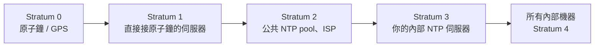
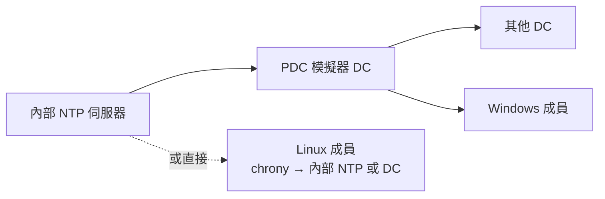

# 時間同步 NTP 與 chrony

> [!abstract] 這篇你會學到
> - 為什麼時間錯會偽裝成**憑證、認證、排程、日誌、資料庫複寫**五種不同的故障 ★★★★
> - `systemd-timesyncd` 與 `chrony` 怎麼選，以及為什麼伺服器多半該用 chrony ★★★
> - 設定一台**內部 NTP 伺服器**，讓全機房（含交換器、UPS、AD）對同一個時間源 ★★★
> - 讀懂 `chronyc tracking` / `sources` 的每個欄位，判斷同步品質 ★★★
> - VM 時間漂移的根因與 PVE / VMware 的正確做法 ★★★
> - AD 網域中 Kerberos 的 5 分鐘容忍與 Linux 加入網域時的時間設定 ★★★★

## 前置知識

- [[020-01-17-cmd-Linux-systemd服務管理]]
- [[020-01-16-cmd-Linux-網路基礎指令]]

---

## 觀念說明

### 時間錯會變成什麼症狀

| 症狀 | 真正原因 |
| --- | --- |
| `certificate is not yet valid` / `has expired`（其實憑證沒問題） | 本機時間落後或超前 ★★★★ 全站 HTTPS 會一起掛 |
| Kerberos `Clock skew too great`、AD 登入失敗 | 與 DC 差超過 5 分鐘 ★★★★ 全網域無法登入 |
| TOTP（Google Authenticator）驗證碼一直錯 | 時間差超過 30 秒 ★★★ 管理員自己被鎖在外面 |
| 日誌時間對不上、事故時間線兜不攏 | 各機器時間不一致 ★★★★ 資安事件無法鑑識 |
| cron 在奇怪的時間跑 | 時區或時間錯 ★★★ 備份可能整批沒跑到 |
| MySQL/PostgreSQL 複寫延遲數值異常、`make` 說 clock skew | 主從時間不一致 ★★★ |
| TLS 握手隨機失敗 | 時間差大到超過憑證的有效區間 ★★★ |
| 備份「未來的檔案」、rsync 反覆重傳 | 兩端時間差 ★★ |

> [!tip] ★★★★ 看到解釋不通的認證或憑證錯誤，先 `timedatectl`
> 十秒鐘排除一整類原因。這是 [[020-01-23-guide-Linux-Linux常見疑難排解]] 的第 9 類。

### 三個名詞

| 名詞 | 意義 |
| --- | --- |
| **RTC**（硬體時鐘） | 主機板上的電池時鐘，關機時繼續走，精度差（每天可漂移數秒） ★★★ 電池沒電時開機時間會整個歪掉 |
| **系統時鐘** | 核心維護的時間，開機時從 RTC 讀入，之後由 NTP 校正 ★★★ |
| **NTP**（Network Time Protocol） | 透過網路與時間源比對並持續微調系統時鐘的協定，UDP 123 ★★★★ 是 UDP 不是 TCP，防火牆常開錯 |



Stratum 是「離原子鐘幾層」，數字越小越準；`16` 代表未同步。★★★★ 看到 `16` 就等於「這台完全沒在對時」。

### 步進（step）與微調（slew）

NTP 校正時間有兩種方式：

| 方式 | 做法 | 風險 |
| --- | --- | --- |
| **slew** | 讓時鐘走快或走慢一點點，慢慢追上 | 安全，但差距大時要很久 ★★ |
| **step** | 直接跳到正確時間 | **時間倒退**會讓資料庫、日誌、cron 混亂 ★★★★★ 已寫入的資料無法回溯修正 |

chrony 預設：開機前三次校正允許 step（差距 > 1 秒），之後只 slew。
`ntpd` 舊版預設差距超過 1000 秒就拒絕同步（「panic threshold」）。

> [!danger] ★★★★★ 執行中的伺服器不要讓時間「往回跳」
> 時間倒退會讓：資料庫交易時間戳倒置、`make` 混亂、cron 重跑或跳過、
> 日誌無法排序、某些應用直接崩潰。
> 大幅偏差的機器（例如 RTC 電池沒電開機差了一年）應該**在服務啟動前**校正，
> chrony 的 `makestep 1.0 3` 就是為此設計（開機前三次允許 step）。
> ★★★★★ 在跑著資料庫的機器上手動 `date -s` 往回調，是本篇唯一「做了就救不回來」的動作。

---

## 基礎操作

### 查看狀態

```bash
timedatectl
```

```
               Local time: 三 2026-08-27 21:14:22 CST
           Universal time: 三 2026-08-27 13:14:22 UTC
                 RTC time: 三 2026-08-27 13:14:22
                Time zone: Asia/Taipei (CST, +0800)
System clock synchronized: yes          ← ★★★★ 這行最重要，no 就代表現在的時間不可信
              NTP service: active       ← ★★★ inactive = 根本沒有客戶端在跑
          RTC in local TZ: no           ← ★★★ 應該是 no
```

| 欄位 | 判讀 |
| --- | --- |
| `System clock synchronized: no` | **沒有同步**，往下查 NTP 服務 ★★★★ |
| `NTP service: inactive` | 沒有任何 NTP 客戶端在跑 ★★★★ |
| `RTC in local TZ: yes` | RTC 存本地時間（Windows 雙系統才會這樣），**伺服器應為 no** ★★★ |

```bash
date; date -u                            # ★★ 本地與 UTC，兩者差 8 小時才是對的
hwclock --show                           # ★★★ RTC（需 root），與系統時間差很多代表 rtcsync 沒作用
timedatectl list-timezones | grep -i taipei
sudo timedatectl set-timezone Asia/Taipei   # ★★★ 全機房時區要一致，日誌才對得起來
```

### 兩種客戶端

| | `systemd-timesyncd` | **`chrony`** |
| --- | --- | --- |
| 定位 | 極簡 SNTP 客戶端 | 完整 NTP 實作 |
| 對內提供時間 ★★★ | ❌ | ✅ |
| 多時間源加權、離群偵測 ★★★★ | ❌（只用一個） | ✅ |
| 斷網後補償漂移 ★★★ | 弱 | ✅（記錄 drift） |
| VM／筆電（常暫停）適應 ★★★ | 一般 | ✅ 專門優化 |
| 診斷工具 ★★★ | `timedatectl timesync-status` | `chronyc tracking/sources` 豐富 |
| Ubuntu 預設 | ✅ | 需安裝 |
| RHEL 預設 | | ✅ |

> [!tip] 怎麼選
> - **桌面、單純的客戶端** → timesyncd 夠用
> - **伺服器、VM、要對內提供時間、要查同步品質** → **chrony**
>
> ★★★★ 兩者不能同時跑（都會動系統時鐘）。裝 chrony 時 Ubuntu 會自動停用 timesyncd。

### timesyncd（Ubuntu 預設）

```bash
timedatectl timesync-status
```

```
       Server: 91.189.89.199 (ntp.ubuntu.com)
Poll interval: 34min 8s (min: 32s; max 34min 8s)
         Leap: normal
      Version: 4
      Stratum: 2
    Precision: 1us (-24)
Root distance: 20.371ms (max: 5s)
       Offset: -1.243ms                  ← ★★★ 與時間源的差，區網內應在數毫秒內
        Delay: 12.184ms
```

設定：

```bash
sudo mkdir -p /etc/systemd/timesyncd.conf.d
sudo tee /etc/systemd/timesyncd.conf.d/local.conf > /dev/null <<'C'
[Time]
NTP=ntp1.example.internal ntp2.example.internal          # ★★★ 主要來源
FallbackNTP=time.stdtime.gov.tw tw.pool.ntp.org          # ★★ 主要來源全掛才用
C
sudo systemctl restart systemd-timesyncd
```

> [!tip] 台灣的公共時間源
> `time.stdtime.gov.tw`（國家時間與頻率標準實驗室）、`tw.pool.ntp.org`、`time.google.com`。
> ★★★★ 但**內部機器應該對內部 NTP 伺服器**，不要每台都自己連外（防火牆單點放行、時間一致、審計）。

### chrony（伺服器建議）

```bash
sudo apt install -y chrony              # ★★★ 會自動停用 timesyncd
systemctl status chrony                  # ★★★ RHEL 的服務名是 chronyd，不是 chrony
```

**設定檔**：`/etc/chrony/chrony.conf`（RHEL：`/etc/chrony.conf`）

```
# ── 時間源 ─────────────────────────────────────
# pool：一個名稱背後多台，iburst 開機時快速同步
pool ntp1.example.internal iburst
pool ntp2.example.internal iburst
# 或公共源
# pool tw.pool.ntp.org iburst maxsources 4
# server time.stdtime.gov.tw iburst

# ── 校正行為 ───────────────────────────────────
driftfile /var/lib/chrony/chrony.drift   # ★★★ 記錄時鐘漂移率，斷網也能補償
makestep 1.0 3                            # ★★★★ 前 3 次校正若差 >1 秒允許直接跳；數字改大等於允許執行中 step
rtcsync                                   # ★★★ 定期把系統時間寫回 RTC，重開機才不會又歪掉
leapsectz right/UTC                       # ★★ 閏秒處理

# ── 安全 ──────────────────────────────────────
# ★★★★ 預設不對外提供時間（沒有 allow 就不服務）；要提供見下一節
logdir /var/log/chrony
```

```bash
sudo systemctl restart chrony
chronyc tracking
chronyc sources -v
```

### 讀懂 `chronyc tracking`

```
Reference ID    : C0A80101 (ntp1.example.internal)
Stratum         : 3
Ref time (UTC)  : Wed Aug 27 13:10:41 2026
System time     : 0.000214 seconds fast of NTP time     ← ★★★★ 目前偏差，第一個看的數字
Last offset     : +0.000103 seconds
RMS offset      : 0.000318 seconds                       ← ★★★ 近期偏差的均方根
Frequency       : 12.847 ppm slow                        ← ★★★ 本機時鐘天生漂移率
Residual freq   : +0.002 ppm
Skew            : 0.041 ppm                              ← ★★ 頻率估計的不確定度
Root delay      : 0.001832 seconds
Root dispersion : 0.000412 seconds
Update interval : 1032.5 seconds
Leap status     : Normal                                 ← ★★★★ 不是 Not synchronised 就好
```

| 欄位 | 健康值 | 有問題時 |
| --- | --- | --- |
| `Stratum` ★★★★ | 2～4 | `16` 或 `0` = 未同步 |
| `System time` ★★★★ | 幾毫秒內 | 秒級 = 剛開機或網路不通 |
| `RMS offset` ★★★ | < 10 ms（區網 < 1 ms） | 持續 > 100 ms = 時間源差或網路抖動 |
| `Frequency` ★★★ | 穩定的數值 | 劇烈變動 = VM 暫停/遷移、CPU 頻率問題 |
| `Leap status` ★★★★ | `Normal` | `Not synchronised` |

### 讀懂 `chronyc sources -v`

```
  .-- Source mode  '^' = server, '=' = peer, '#' = local clock.
 / .- Source state '*' = current best, '+' = combined, '-' = not combined,
| /             'x' = may be in error, '~' = too variable, '?' = unusable.
||                                                 .- xxxx [ yyyy ] +/- zzzz
||      Reachability register (octal) -.           |  xxxx = adjusted offset,
||      Log2(Polling interval) --.      |          |  yyyy = measured offset,
||                                \     |          |  zzzz = estimated error.
||                                 |    |           \
MS Name/IP address         Stratum Poll Reach LastRx Last sample
===============================================================================
^* ntp1.example.internal         2   10   377    41   +214us[ +317us] +/-  1832us
^+ ntp2.example.internal         2   10   377   112   -108us[  -12us] +/-  2104us
^? time.stdtime.gov.tw           0    6     0     -     +0ns[   +0ns] +/-    0ns
```

| 符號 | 意義 |
| --- | --- |
| `^*` | **目前使用的**時間源 ★★★★ 全表沒有任何 `^*` 就是沒在同步 |
| `^+` | 可用、參與合併 ★★ |
| `^-` | 可用但未被採用（離群） ★★ |
| **`^?`** | **無法連線**（防火牆、DNS、對方沒開） ★★★★ |
| `^x` | 判定為錯誤（falseticker） ★★★ 對方時間是錯的，不是網路問題 |
| `Reach 377` | 八進位，最近 8 次全部成功；`0` = 全失敗 ★★★★ 這是判斷「網路層 vs 時間層」的分水嶺 |

> [!tip] 兩個最常見的判讀
> - ★★★★ **所有來源都 `^?` 且 `Reach 0`** → UDP 123 被防火牆擋、DNS 解析失敗、或來源名稱打錯
> - ★★★ **只有一個來源 `^*` 其他 `^?`** → 能動，但沒有備援；至少要 3～4 個來源才能投票排除壞的

```bash
chronyc sourcestats -v                   # ★★ 各來源的統計品質
chronyc activity                         # ★★ 幾個來源在線
sudo chronyc makestep                    # ★★★★★ 手動立刻校正（會 step！只在服務啟動前或確認安全時用）
sudo chronyc burst 4/4                   # ★★ 快速多次取樣
chronyc ntpdata ntp1.example.internal    # ★★★ 詳細封包資訊，能看出對方到底有沒有回應
```

> [!info]- Rocky / AlmaLinux（RHEL 系）對照
> RHEL 預設就是 chrony：
>
> | 項目 | Ubuntu | RHEL | 重要度 |
> | --- | --- | --- | --- |
> | 預設客戶端 | `systemd-timesyncd` | **`chronyd`** | ★★★ |
> | 服務名 | `chrony` | **`chronyd`** | ★★★★ 抄 Ubuntu 指令到 RHEL 會找不到服務 |
> | 設定檔 | `/etc/chrony/chrony.conf` | **`/etc/chrony.conf`** | ★★★★ 改錯檔案會「怎麼改都沒反應」 |
> | 預設來源 | `ntp.ubuntu.com` | `2.rhel.pool.ntp.org`（會被 DHCP 提供的覆蓋） | ★★★ |
> | 防火牆放行 | `ufw allow 123/udp` | `firewall-cmd --add-service=ntp --permanent` | ★★★ |
> | 日誌 | `/var/log/chrony/` | `/var/log/chrony/` | ★ |
>
> RHEL 的 NetworkManager 會把 DHCP 給的 NTP 伺服器寫進 chrony
> （`/var/run/chrony-dhcp/`）。想固定時間源時把 `sourcedir /run/chrony-dhcp` 那行註解掉。

---

## 進階用法

### ★★★★ 架設內部 NTP 伺服器

一台（最好兩台）對外同步，其餘機器對它同步。

```
# /etc/chrony/chrony.conf（NTP 伺服器）
pool time.stdtime.gov.tw iburst
pool tw.pool.ntp.org iburst maxsources 3
server time.google.com iburst

driftfile /var/lib/chrony/chrony.drift
makestep 1.0 3
rtcsync

# ── 對內提供服務 ──
allow 192.168.0.0/16                      # ★★★★★ 只允許內部網段；寫成 allow all 等於把自己變成 DDoS 放大器
allow 10.0.0.0/8
# ★★★★ 即使上游全斷，也繼續以本機時鐘提供服務（stratum 10，避免內部機器完全失去同步）
local stratum 10 orphan

# 若兩台 NTP 伺服器互為備援
# peer ntp2.example.internal
```

```bash
sudo systemctl restart chrony
sudo ufw allow from 192.168.0.0/16 to any port 123 proto udp   # ★★★★ 一定要帶 from，不要整個 allow 123/udp
chronyc clients                          # ★★★ 誰在對我同步（需 root）；出現陌生外部 IP 就是被當放大器了
chronyc serverstats
```

> [!tip] ★★★★ `local stratum 10 orphan` 的意義
> 上游斷線時，沒有這行的 NTP 伺服器會拒絕提供時間（因為它自己也不確定），
> 內部所有機器跟著失去同步。有這行它會降級為 stratum 10 繼續提供，
> ★★★★ **內部時間至少保持一致**——這比「正確但不一致」重要。
> `orphan` 讓兩台互為 peer 的伺服器在都失去上游時能協調出一個主。

> [!tip] 哪些設備該指向內部 NTP
> - 所有 Linux/Windows 主機 ★★★
> - ★★★★ **AD 網域控制站**（PDC 模擬器對內部 NTP，其他 DC 與成員自動跟 PDC）
> - ★★★★ 交換器、防火牆（[[040-01-12-guide-Cisco-管理IP與遠端存取]]、OPNsense）——日誌時間才對得上
> - ★★★ UPS 網路卡、IPMI/BMC、監視器 NVR
> - ★★★ PVE 宿主機（VM 通常跟宿主機）
>
> 這樣防火牆只需要放行 NTP 伺服器對外的 UDP 123。

### VM 的時間

VM 暫停、遷移、宿主機負載高都會讓 guest 時鐘跳動。

| 平台 | 正確做法 |
| --- | --- |
| **PVE / KVM** ★★★★ | guest 裝 `qemu-guest-agent`；guest 用 chrony（`makestep 1.0 -1` 允許隨時 step）；**不要**依賴宿主機同步 |
| VMware ★★★★ | 裝 open-vm-tools；VMware Tools 的時間同步與 chrony 擇一，不要兩者都開 |
| Hyper-V ★★★ | 內建的時間整合服務與 chrony 擇一 |
| 容器 ★★★ | 共用宿主機時鐘，**容器內不跑 NTP** |

```
# VM 的 chrony 建議
makestep 1.0 -1          # ★★★★ -1 = 任何時候差 >1 秒都允許 step（VM 恢復後快速追上）；資料庫 VM 要衡量 step 風險
```

> [!warning] ★★★★ 兩個時間同步機制同時跑會互相拉扯
> VMware Tools 同步 + chrony 同時開，時間會來回跳。選一個。
> PVE 的 KVM 沒有內建 guest 時間同步，所以 guest 內一定要有 chrony。

### ★★★★ AD 網域與 Kerberos

★★★★ Kerberos 預設容忍 **5 分鐘**時間差，超過就是 `Clock skew too great`——整個網域的登入會一起失敗。



Linux 加入 AD 時（[[090-06-05-guide-TWGCB-Linux網域導入]]），chrony 指向 DC 或同一個內部 NTP：

```
server dc1.example.internal iburst        # ★★★★ 與 DC 對同一個時間，比「對得準」更重要
server dc2.example.internal iburst
```

Windows 端 PDC 的設定見 [[030-01-02-02-svc-AD-網域控制站建置]]（`w32tm /config /manualpeerlist:...`）。

```bash
# ★★★★ Linux 側檢查與 DC 的時間差（加入網域前一定要先做這一步）
ntpdate -q dc1.example.internal 2>/dev/null || chronyc ntpdata dc1.example.internal | grep -i offset
```

### ★★★ NTS：加密的 NTP

★★★★ 傳統 NTP 沒有認證，中間人可以餵假時間（讓憑證檢查失效、TOTP 失效）。
chrony 4+ 支援 NTS（Network Time Security）：

```
server time.cloudflare.com iburst nts
server nts.netnod.se iburst nts
```

```bash
chronyc -N authdata                      # ★★★ 確認 NTS 狀態，KeyID 為 0 代表其實沒走 NTS
```

> [!tip] ★★★ 對外時間源用 NTS，對內用防火牆限制來源
> 內部 NTP 伺服器對外用 NTS 確保拿到的是真時間；
> 內部機器對內部伺服器用 `allow` 網段限制 + 防火牆，不需要 NTS。

---

## 完整實戰範例：全機房時間架構

```bash
# ═══ 1. 兩台內部 NTP 伺服器（ntp1、ntp2）═══
sudo apt install -y chrony
sudo tee /etc/chrony/chrony.conf > /dev/null <<'CONF'
server time.stdtime.gov.tw iburst
server time.cloudflare.com iburst nts
pool tw.pool.ntp.org iburst maxsources 3
peer ntp2.example.internal                # ★★★ ntp2 上寫 ntp1（互為備援，兩邊都要改）
driftfile /var/lib/chrony/chrony.drift
makestep 1.0 3
rtcsync
leapsectz right/UTC
allow 192.168.0.0/16                      # ★★★★★ 只開內網，這一行寫錯就是對外開放的 NTP 放大器
allow 10.0.0.0/8
local stratum 10 orphan                   # ★★★★ 上游全斷時仍讓內部保持一致
logdir /var/log/chrony
log tracking measurements statistics      # ★★★ 有這行才查得到「昨天半夜到底偏了多少」
CONF
sudo systemctl restart chrony
sudo ufw allow from 192.168.0.0/16 to any port 123 proto udp
sleep 30; chronyc tracking; chronyc sources -v   # ★★★★ 這一步沒看到 ^* 就不要往下做

# ═══ 2. 所有 Linux 主機 ═══
sudo apt install -y chrony
sudo tee /etc/chrony/chrony.conf > /dev/null <<'CONF'
server ntp1.example.internal iburst
server ntp2.example.internal iburst
driftfile /var/lib/chrony/chrony.drift
makestep 1.0 3
rtcsync
CONF
sudo systemctl restart chrony
sudo timedatectl set-timezone Asia/Taipei   # ★★★ 時區也要一致

# ═══ 3. VM 額外 ═══
# ★★★★ makestep 1.0 -1；裝 qemu-guest-agent；不要開平台的時間同步（兩套一起跑會互相拉扯）

# ═══ 4. 監控：偏差超過 100ms 告警 ═══
sudo tee /usr/local/bin/check-ntp.sh > /dev/null <<'S'
#!/usr/bin/env bash
set -uo pipefail
if ! timedatectl show -p NTPSynchronized --value | grep -q yes; then   # ★★★★ 先問「有沒有同步」再問「差多少」
    echo "CRITICAL: 未同步"; exit 2
fi
off=$(chronyc -c tracking 2>/dev/null | cut -d, -f5)      # 秒
abs=$(awk -v o="$off" 'BEGIN{print (o<0?-o:o)}')
if awk -v a="$abs" 'BEGIN{exit !(a>0.1)}'; then
    echo "WARNING: 偏差 ${off}s"; exit 1
fi
echo "OK: 偏差 ${off}s"
S
sudo chmod 755 /usr/local/bin/check-ntp.sh
/usr/local/bin/check-ntp.sh
# 接進 systemd timer + OnFailure 或監控系統，見 18-排程工作 與 03-系統監控與告警

# ═══ 5. 其他設備 ═══
# ★★★★ Cisco:   ntp server 192.168.1.10 / ntp server 192.168.1.11 / clock timezone CST 8
# OPNsense: System → Settings → General → Timeservers
# Windows PDC: w32tm /config /manualpeerlist:"ntp1.example.internal,0x8 ntp2.example.internal,0x8" /syncfromflags:manual /reliable:yes /update
# IPMI / UPS 網路卡：管理介面的 NTP 欄位
```

> [!tip] 驗收：全部機器時間差在 10ms 內
> ```bash
> for h in web01 web02 db01 ntp1 ntp2; do
>   printf '%-8s ' "$h"; ssh "$h" 'chronyc -c tracking | cut -d, -f5'
> done
> ```
> 每季維護跑一次並記錄，見 [[100-02-05-guide-維運-每季維護作業]]。

### ★★★★ 上線前驗收：六項全過才算做完

一台機器「裝了 chrony」不等於「時間是對的」。逐項確認，任何一項不過就回到對應章節。

| # | 檢查什麼 | 指令 | 通過標準 | 重要度 |
| --- | --- | --- | --- | --- |
| 1 | 只有一個時間守護程序 | `systemctl is-active chrony systemd-timesyncd` | 一個 `active`、一個 `inactive` | ★★★★ |
| 2 | 真的同步上了 | `timedatectl show -p NTPSynchronized --value` | `yes` | ★★★★ |
| 3 | 有實際採用的來源 | `chronyc sources -v \| grep '^\^\*'` | 有一行 `^*` | ★★★★ |
| 4 | 偏差在容許範圍 | `chronyc tracking \| grep 'System time'` | 區網內 < 10 ms | ★★★ |
| 5 | RTC 用 UTC 且會被寫回 | `timedatectl \| grep 'RTC in local TZ'` | `no` | ★★★ |
| 6 | 時區正確 | `timedatectl show -p Timezone --value` | `Asia/Taipei` | ★★★ |

一次跑完六項：

```bash
printf '%-22s %s\n' \
  "守護程序"  "$(systemctl is-active chrony) / $(systemctl is-active systemd-timesyncd)" \
  "已同步"    "$(timedatectl show -p NTPSynchronized --value)" \
  "採用來源"  "$(chronyc sources -v 2>/dev/null | awk '/^\^\*/{print $2}')" \
  "目前偏差"  "$(chronyc tracking 2>/dev/null | awk -F': ' '/System time/{print $2}')" \
  "RTC 本地時" "$(timedatectl show -p LocalRTC --value)" \
  "時區"      "$(timedatectl show -p Timezone --value)"
```

預期輸出：

```text
守護程序               active / inactive        # ★★★★ 第二個是 active 就有兩套在搶時鐘
已同步                 yes                      # ★★★★
採用來源               ntp1.example.internal    # ★★★★ 空白代表沒有任何來源被採用
目前偏差               0.000214 seconds fast of NTP time
RTC 本地時             no                       # ★★★
時區                   Asia/Taipei              # ★★★
```

> [!warning] ★★★★ 驗收要在「重開機之後」再跑一次
> 很多環境是手動 `chronyc makestep` 調好的，服務沒設 `enable`、`rtcsync` 沒開，
> 下次重開機時間又歪回去，而且通常是在停機維護後、大家最忙的時候才發現。
> `systemctl is-enabled chrony` 必須是 `enabled`。

---

## 常見錯誤與排錯

| 現象 | 原因 | 解法 |
| --- | --- | --- |
| ★★★★ `System clock synchronized: no` | NTP 服務沒跑或連不到來源 | `systemctl status chrony`；`chronyc sources` 看是否全 `^?` |
| ★★★★ `chronyc sources` 全部 `^?` `Reach 0` | UDP 123 被擋、DNS 失敗、來源打錯 | `nc -uzv ntp1 123`；`dig ntp1.example.internal`；`ufw status` |
| ★★★ 只有一個來源可用 | 缺備援 | 至少 3～4 個來源 |
| ★★ `Leap status: Not synchronised` 但來源正常 | 剛啟動還在取樣 | 等 1～2 分鐘；`chronyc burst 4/4` |
| ★★★ 時間差好幾分鐘一直追不上 | chrony 只 slew 不 step | 服務啟動前 `chronyc makestep`；或設 `makestep 1.0 -1` |
| ★★★★ VM 時間跳動、`Frequency` 劇變 | 暫停/遷移、雙重同步 | 只留 chrony；`makestep 1.0 -1`；裝 guest agent |
| ★★★★★ 執行中時間往回跳造成應用異常 | step 發生在服務啟動後 | 限制 `makestep` 次數；用內部 NTP 避免大偏差 |
| ★★★★ AD 登入 `Clock skew too great` | 與 DC 差 >5 分鐘 | 指向與 DC 相同的時間源；先 `makestep` |
| ★★★ TOTP 一直錯 | 差 >30 秒 | 同上 |
| ★★★★ 憑證明明有效卻說 not yet valid | 本機時間落後 | 同步時間 |
| ★★★ 重開機後時間錯，同步後又正確 | RTC 電池沒電或 `rtcsync` 沒開 | 換 CR2032；chrony 加 `rtcsync` |
| ★★ Windows 雙系統時間差 8 小時 | RTC 存本地時間 | Linux `timedatectl set-local-rtc 0`，Windows 改登錄 `RealTimeIsUniversal` |
| ★★★★ timesyncd 與 chrony 都在跑 | 兩者衝突 | 只留一個：`systemctl disable --now systemd-timesyncd` |
| ★★★ RHEL 固定的來源被換掉 | DHCP 提供的 NTP 覆蓋 | 註解 `sourcedir /run/chrony-dhcp` |
| ★★★★ 內部 NTP 上游斷線後全部失去同步 | 沒有 `local stratum 10 orphan` | 加上它 |
| ★★★★ 交換器／防火牆日誌時間對不上 | 沒設 NTP 或時區 | 指向內部 NTP 並設時區 |
| ★★★★ 內部 NTP 的 `chronyc clients` 出現不認識的外部 IP | `allow` 網段寫太寬或防火牆整個放行 | 收斂 `allow`；`ufw` 改成 `from <內網> to any port 123` |
| ★★★ `chronyc` 回 `506 Cannot talk to daemon` | chronyd 沒跑，或命令埠 323 被綁在其他位址 | `systemctl status chronyd`；檢查 `bindcmdaddress` / `cmdport` |

### ★★★★ 排查一：`System clock synchronized: no`

不要一看到 no 就重裝 chrony。四步走完就知道卡在「服務層／網路層／時間源層」哪一層。

**【1】確認只有一個守護程序在動系統時鐘**

```bash
systemctl is-active chrony systemd-timesyncd
```

```text
active            # ★★★★ chrony
inactive          # ★★★★ timesyncd 必須是 inactive；兩個都 active 時時間會來回被拉
```

**【2】問 chrony 自己「同步了沒」**

```bash
chronyc tracking | grep -E 'Stratum|Leap status|System time'
```

```text
Stratum         : 16                                  # ★★★★ 16 = 完全沒同步，往【3】走
Leap status     : Not synchronised
System time     : 3.412857 seconds slow of NTP time   # ★★★ 秒級偏差
```

Stratum 是 2～4、`Leap status: Normal`，卻仍顯示 `synchronized: no`，多半是剛啟動不到一分鐘，
等 `chronyc sources` 的 `Reach` 從 `0` 長到 `17`、`37` 即可。

**【3】分清楚是「沒收到回應」還是「對方時間有問題」**

```bash
chronyc sources -v | tail -5
```

```text
^? ntp1.example.internal         0    6     0     -     +0ns[   +0ns] +/-    0ns   # ★★★★ Reach 0 = 網路層，跳【4】
^x ntp2.example.internal         2   10   377    23  +8942ms[+8942ms] +/-   12ms   # ★★★ 有回應但時間離譜 = 對方壞掉
```

`Reach 0` 是**一封回應都沒收到**，問題在 DNS 或 UDP 123；
`Reach 377` 但標 `^x`／`^-`，代表封包有通、是對方的時間被 chrony 判定為錯誤，這時要去修時間源那一台。

**【4】確認服務啟動後有沒有被權限或設定擋掉**

```bash
sudo journalctl -u chrony -n 20 --no-pager
```

```text
chronyd[812]: Could not open /var/lib/chrony/chrony.drift : Permission denied  # ★★★ drift 檔權限
chronyd[812]: Frequency -3.271 ppm read from /var/lib/chrony/chrony.drift      # 正常長這樣
```

### ★★★★ 排查二：所有來源 `^?` `Reach 0`（分層確認 UDP 123）

**【1】名稱解析**

```bash
getent hosts ntp1.example.internal
```

```text
192.168.1.10    ntp1.example.internal      # ★★★ 沒有輸出就是 DNS 問題，先改用 IP 驗證
```

**【2】UDP 123 通不通**（UDP 沒有連線概念，`nc -uzv` 只能當粗篩，實測要看有沒有回應）

```bash
sudo timeout 5 tcpdump -ni any udp port 123 &
sudo chronyc burst 4/4; sleep 6; chronyc sources -v | head -3
```

```text
IP 192.168.1.50.35412 > 192.168.1.10.123: NTPv4, Client   # ★★★★ 只有 Client 沒有 Server = 對方沒回
IP 192.168.1.10.123 > 192.168.1.50.35412: NTPv4, Server   # ★★★★ 看到這行才代表雙向通
```

**【3】本機防火牆**（NTP 客戶端是對外連出，`ufw` 預設允許 outgoing，被擋通常在中間的網路設備）

```bash
sudo ufw status verbose | head -5
```

**【4】對方有沒有把我列入 `allow`**

到 NTP 伺服器上：

```bash
sudo chronyc clients | head -5
```

```text
Hostname                      NTP   Drop Int IntL Last     Cmd   Drop Int  Last
=====================================================================
192.168.1.50                   12      0   6   -    23       0      0   -     -   # ★★★★ 沒有這一行 = allow 網段沒涵蓋我
```

`chronyc clients` 看得到我、但 `Drop` 一直增加，就是 `allow` 沒放行、封包收到後被丟棄。

### ★★★★ 排查三：偏差很大卻一直追不上

```bash
chronyc tracking | grep -E 'System time|Update interval'
```

```text
System time     : 412.883921 seconds slow of NTP time   # ★★★★ 幾百秒，靠 slew 要追好幾天
Update interval : 1032.5 seconds
```

chrony 的 `makestep 1.0 3` 只在**啟動後前三次**校正允許跳，之後一律 slew，每秒最多修正 1/12 秒。

【1】先判斷這台能不能承受時間跳動：跑資料庫、訊息佇列、憑證簽發的機器要**先停服務**。
【2】停掉服務後手動跳：

```bash
sudo systemctl stop <你的服務>
sudo chronyc makestep          # ★★★★★ 會讓時間瞬間跳動，執行中的應用可能出現時間戳倒置
chronyc tracking | grep 'System time'
sudo systemctl start <你的服務>
```

【3】VM 反覆發生的話，加 `makestep 1.0 -1` 讓它隨時可跳，並確認宿主機的時間同步只留一套。

### ★★★ 排查四：重開機後時間就錯

【1】比對系統時間與 RTC：

```bash
sudo hwclock --show; date
```

```text
2026-08-29 06:14:11.482913+08:00      # ★★★ 兩者差很多 = rtcsync 沒作用或 RTC 電池沒電
2026-08-29 14:14:11 CST
```

【2】確認 `rtcsync` 有寫進設定並重啟過；必要時手動寫回一次：

```bash
grep -r '^rtcsync' /etc/chrony*
sudo hwclock --systohc          # ★★★ 把已同步的系統時間寫回 RTC
```

【3】關機一段時間後開機又差了好幾小時 → 主機板電池（CR2032）沒電，**換電池才是根治**。
【4】只差整整 8 小時 → 是 `RTC in local TZ` 的問題，不是電池：`sudo timedatectl set-local-rtc 0`。

---

## 安全性注意事項

> [!danger] ★★★★★ 假時間是攻擊手段
> 中間人餵假時間可以：讓過期／撤銷的憑證重新「有效」、讓 TOTP 可預測、
> 讓日誌時間線無法鑑識、觸發憑證過期造成服務中斷。
> 對外時間源用 **NTS**，內部 NTP 伺服器用 `allow` 限制網段並配防火牆。

> [!warning] ★★★★★ NTP 伺服器不要對公網開放
> 舊版 NTP 的 `monlist` 曾被用於大規模放大攻擊。
> chrony 預設不回應查詢指令、預設不對外服務（要 `allow` 才開），保持這樣；
> `ufw`/`firewalld` 只放行內部網段的 UDP 123。

**★★★★★ 具體後果**：一台 `allow all` 又對公網開放的 NTP 伺服器，攻擊者可以偽造來源 IP 送一個
小請求、讓它把幾十倍大的回應打到受害者身上（放大攻擊）。實務上會發生三件事：受害者被打掛、
你的對外頻寬被吃光造成自家服務中斷、上游 ISP 依濫用通報**直接關掉你的線路**。
機關單位還會因此成為資安事件的通報對象。

**★★★★ 自己驗證有沒有對外開放**（從機房外部或另一個網段測，不要在本機測）：

```bash
# 【1】外部能不能拿到時間（拿得到就是對外開放）
chronyc -h <你的NTP對外IP> tracking 2>&1 | head -2
ntpdate -q <你的NTP對外IP> 2>&1 | head -2
```

```text
506 Cannot talk to daemon          # ★★★★ 這是「安全」的結果：命令埠沒對外
no server suitable for synchronization found   # ★★★★ 這也是安全的結果：非允許網段拿不到時間
```

【2】確認守護程序只監聽該監聽的位址：

```bash
sudo ss -lunp | grep -E '123|323'
```

```text
UNCONN 0 0    0.0.0.0:123   0.0.0.0:*  users:(("chronyd",pid=812,fd=6))   # ★★★ NTP 服務埠，靠 allow + 防火牆收斂
UNCONN 0 0  127.0.0.1:323   0.0.0.0:*  users:(("chronyd",pid=812,fd=5))   # ★★★★ 命令埠 323 必須只在 127.0.0.1
```

【3】命令埠（323）若出現 `0.0.0.0:323`，代表 `bindcmdaddress` 被改過。純客戶端可直接關掉：

```
cmdport 0                 # ★★★★ 客戶端不需要命令埠；關掉就沒有這個攻擊面（關了 chronyc 也不能用）
bindcmdaddress 127.0.0.1  # ★★★★ 保留 chronyc 但只允許本機
bindcmdaddress ::1
```

> [!danger] ★★★★ 時間源本身就是信任邊界
> 機器對誰同步，誰就有能力讓你的憑證驗證失效、讓你的 TOTP 失效、讓你的日誌時間線失真。
> 所以「內部機器只對內部 NTP、內部 NTP 只對少數已知上游」不只是管理方便——
> 它把「可以改變全公司時間的角色」從幾百台縮到兩台。
> 這兩台的 SSH 與設定檔權限要比照其他核心設備管理。

> [!warning] ★★★ 不要在生產機用 `date -s` 手動改時間
> `date -s` 直接 step 且完全不通知 chrony，chrony 下一輪還會再把它改回去，
> 中間這段時間應用看到的是兩次跳動。要立刻校正就用 `chronyc makestep`，
> 要停用同步再手動控制就先 `systemctl stop chrony`，兩者不要混用。

> [!tip] ★★★★ 時間是稽核與鑑識的基礎
> TWGCB 與多數資安規範要求所有設備時間同步且時區一致。
> ★★★★ 事故調查時第一件事就是對齊時間線——時間不一致的日誌等於沒有日誌。
> 入侵調查時若各設備時間差到分鐘級，就無法證明「防火牆這筆連線」對應「主機那筆登入」，
> 報告會停在「無法建立事件關聯」。
> 把 `check-ntp.sh` 接進監控，把「全設備時間差」列入 [[100-02-05-guide-維運-每季維護作業]]。

---

## 速查表

| 指令 | 說明 |
| --- | --- |
| **`timedatectl`** | **同步狀態、時區、RTC**（第一個查的） ★★★★ |
| `timedatectl set-timezone Asia/Taipei` | 設時區 ★★★ |
| `timedatectl set-ntp true` | 啟用 timesyncd ★★ |
| `timedatectl timesync-status` | timesyncd 詳細狀態 ★★ |
| `timedatectl set-local-rtc 0` | RTC 用 UTC（伺服器應如此） ★★★ |
| **`chronyc tracking`** | **目前偏差、stratum、頻率** ★★★★ |
| **`chronyc sources -v`** | **各來源狀態（`^*` 使用中、`^?` 不通）** ★★★★ |
| `chronyc sourcestats -v` | 來源品質統計 ★★ |
| `chronyc activity` | 在線來源數 ★★ |
| `chronyc makestep` | 立刻校正（會 step，慎用） ★★★★★ |
| `chronyc burst 4/4` | 快速取樣 ★★ |
| `chronyc clients` | 誰在對我同步（伺服器端） ★★★★ |
| `chronyc -N authdata` | NTS 狀態 ★★ |
| `hwclock --show` / `hwclock -w` | 讀 RTC / 系統時間寫入 RTC ★★★ |
| `date -u` | UTC ★★ |

### chrony.conf 關鍵

| 設定 | 說明 |
| --- | --- |
| `pool X iburst` / `server X iburst` | 時間源（`iburst` 開機快速同步） ★★★★ |
| `server X iburst nts` | 加密 NTP ★★★ |
| `driftfile` | 記錄漂移率，必設 ★★★ |
| `makestep 1.0 3` | 前 3 次差 >1s 允許 step；VM 用 `-1` ★★★★ |
| `rtcsync` | 定期寫回 RTC ★★★ |
| `allow 網段` | **對內提供服務** ★★★★★ 寫太寬等於對公網開放 |
| `local stratum 10 orphan` | 上游斷線仍提供一致時間 ★★★★ |
| `peer X` | 兩台伺服器互為備援 ★★★ |
| `cmdport 0` / `bindcmdaddress 127.0.0.1` | 關閉或收斂命令埠 323 ★★★★ |

---

## 練習題

> [!question]- 練習 1：故意把時間弄錯，觀察症狀與復原
> 在練習機上把時間調快一年，試 `curl https://` 與 `apt update`，再讓 chrony 修回來。
>
> **解答**
>
> ```bash
> sudo systemctl stop chrony
> sudo date -s "$(date -d '+1 year' '+%F %T')"
> curl -sS https://example.com -o /dev/null      # certificate has expired 或類似
> sudo apt update 2>&1 | tail -3                 # Release file ... is not valid yet / 簽章問題
> sudo systemctl start chrony
> sleep 5; chronyc tracking | grep -E 'System time|Leap'
> ```
> 因為差距 > 1 秒且在前三次校正內，chrony 會 step 回正確時間（`makestep 1.0 3`）。
> 若已超過三次，`sudo chronyc makestep` 手動。
> ★★★★ **學到**：憑證與套件簽章都依賴正確時間；以及為什麼執行中不能亂 step。

> [!question]- 練習 2：架一台內部 NTP 並讓另一台對它同步
> 用兩台練習機（或 VM），A 對外同步並提供服務，B 只對 A 同步。驗證 B 的 `sources` 與 A 的 `clients`。
>
> **解答**
>
> A：依「架設內部 NTP 伺服器」設定，`allow` B 的網段，開防火牆 UDP 123。
> B：`server A的IP iburst`，重啟 chrony。
> ```bash
> # B
> chronyc sources -v          # 應看到 ^* A的IP
> # A
> sudo chronyc clients        # 應列出 B
> ```
> 再把 A 的網路對外斷掉（模擬上游失效），B 應仍顯示 A 為來源但 stratum 變 10（`local stratum 10 orphan`）。
> ★★★★ 沒有那行的話 B 會變成 `^?`——這就是機房停電、上游斷線那天全機房一起失去同步的原因。

> [!question]- 練習 3：判讀一份異常的 chronyc 輸出
> 給定：`Stratum 16`、`Leap status: Not synchronised`、`sources` 三個來源都 `^? ... Reach 0`。
> 列出排查順序。
>
> **解答**
>
> 1. `systemctl status chrony`——服務有在跑嗎
> 2. `dig ntp1.example.internal`——名稱解析得出來嗎（`^?` 且名稱顯示原文常是 DNS 問題）
> 3. `nc -uzv ntp1.example.internal 123` 或 `chronyc ntpdata`——UDP 123 通嗎（本機 ufw、對方 allow、中間防火牆）
> 4. 對方 `chronyc clients` 有沒有看到我
> 5. 都通仍 `Reach 0` → 對方 chrony 沒 `allow` 我的網段
>
> ★★★★ `Reach 0` 是「最近 8 次全失敗」，代表**根本沒收到回應**，問題在網路層而非時間本身；
> ★★★ 若 `Reach 377` 但 `^x`，才是對方時間有問題。

---

## 小測驗

Q1. 列出三種「其實是時間錯」但看起來像別的問題的症狀。
Q2. slew 與 step 的差別？為什麼執行中的伺服器不能隨便 step？
Q3. `makestep 1.0 3` 的意思？VM 為什麼常改成 `-1`？
Q4. timesyncd 與 chrony 怎麼選？能同時跑嗎？
Q5. `chronyc sources` 中 `^*`、`^?`、`Reach 0` 各代表什麼？
Q6. 內部 NTP 伺服器為什麼要 `local stratum 10 orphan`？
Q7. Kerberos 容忍多少時間差？Linux 加入 AD 時 chrony 該指向哪？
Q8. VMware VM 上 VMware Tools 時間同步與 chrony 該怎麼取捨？PVE 呢？
Q9. `RTC in local TZ: yes` 在伺服器上為什麼不對？怎麼改？
Q10. NTS 解決什麼問題？內部機器需要嗎？

> [!question]- 測驗答案
> **Q1.** ★★★★ 憑證 not yet valid/expired、Kerberos clock skew、TOTP 失敗、日誌時間線對不上、cron 時間錯、複寫延遲異常（任三）（見「時間錯會變成什麼症狀」）。
> **Q2.** ★★★★★ slew 微調時鐘速率慢慢追，step 直接跳；step 可能讓時間倒退，造成資料庫時間戳倒置、cron 重跑、日誌無法排序。
> **Q3.** ★★★★ 開機後前 3 次校正若偏差 >1 秒允許 step，之後只 slew；VM 暫停／遷移後偏差可能很大且隨時發生，`-1` 允許任何時候 step。
> **Q4.** ★★★★ 桌面／單純客戶端用 timesyncd，伺服器、VM、要對內服務或要診斷品質用 chrony；不能同時跑，兩者都會動系統時鐘。
> **Q5.** ★★★★ `^*` 目前採用的來源；`^?` 無法連線；`Reach 0` 最近 8 次全失敗（網路層問題）。
> **Q6.** ★★★★ 上游斷線時不拒絕服務，降為 stratum 10 繼續提供，讓內部時間至少一致；`orphan` 讓互為 peer 的兩台能協調。
> **Q7.** ★★★★ 5 分鐘；指向 DC 或與 DC 相同的內部 NTP。
> **Q8.** ★★★★ 擇一，不要兩者都開否則互相拉扯；PVE/KVM 沒有內建 guest 同步，guest 內一定要跑 chrony 並裝 qemu-guest-agent。
> **Q9.** ★★★ RTC 應存 UTC，存本地時間是 Windows 雙系統相容做法，會造成時區切換與日光節約問題；`timedatectl set-local-rtc 0`。
> **Q10.** ★★★ NTP 無認證可被中間人餵假時間；NTS 加密驗證來源。對外時間源用 NTS，內部靠 `allow` 與防火牆即可。

---

## 延伸閱讀

- [[020-01-16-cmd-Linux-網路基礎指令]] — UDP 埠測試與防火牆
- [[020-01-17-cmd-Linux-systemd服務管理]] — timesyncd 與 chrony 服務管理
- [[020-01-18-guide-Linux-排程工作]] — 把時間檢查排進 timer
- [[020-01-23-guide-Linux-Linux常見疑難排解]] — 第 9 類「時間不對」
- [[030-01-02-02-svc-AD-網域控制站建置]] — Windows PDC 的時間設定
- [[090-06-05-guide-TWGCB-Linux網域導入]] — Linux 加入 AD 的時間要求
- [[040-01-12-guide-Cisco-管理IP與遠端存取]] — 交換器 NTP 設定
- [[100-01-03-guide-日誌-系統監控與告警]] — 時間偏差告警
- `man 8 chronyd` / `man 5 chrony.conf` / `man 1 chronyc` / `man 1 timedatectl`
