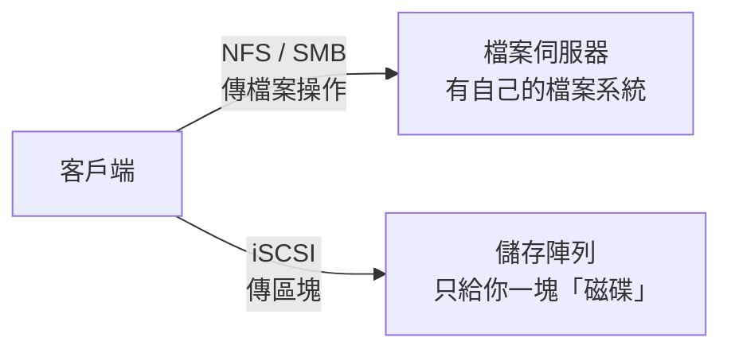

# 網路儲存與軟體 RAID

> [!abstract] 這篇你會學到
> - ★★★★ 掛載 NFS 與 SMB 共享，並**正確處理 fstab 裡的網路掛載**（開機順序、`_netdev`、`nofail`）
> - ★★★ 用 autofs 做「用到才掛、閒置自動卸」，解決 NFS 伺服器不在時開機卡死的問題
> - ★★★★ 架一台最小的 NFS 伺服器，理解 `root_squash` 與 UID 對應的陷阱
> - ★★★★★ 用 mdadm 建 RAID 1/5/10，**監控、換碟、重建**——以及為什麼 RAID 不是備份
> - ★★ 設定使用者與群組的磁碟配額

## 前置知識

- [[020-01-15-cmd-Linux-磁碟分割與掛載]]
- [[020-01-16-cmd-Linux-網路基礎指令]]

---

## 觀念說明

### ★★★ 三種「不在本機的儲存」

| | NFS | SMB / CIFS | iSCSI |
| --- | --- | --- | --- |
| 層級 ★★★ | **檔案** | **檔案** | **區塊**（像一顆本機磁碟） |
| 來源 | Unix 世界 | Windows 世界（Samba 是 Linux 實作） | SAN |
| 權限模型 ★★★★ | UID/GID（**兩端要一致**） | 使用者名稱／密碼、ACL | 由掛載端的檔案系統決定 |
| 適用 | Linux 之間共享、家目錄、Web 內容 | 與 Windows 互通、使用者共享資料夾 | 虛擬機磁碟、資料庫（需獨占） |
| 多台同時掛 ★★★★ | ✅ | ✅ | **❌ 除非叢集檔案系統** |
| 效能 | 好 | 中 | 最好 |



> [!warning] 網路掛載的三個共通問題
> 1. ★★★★ **開機時網路還沒好** → fstab 掛載失敗 → 沒 `nofail` 就進 emergency mode
> 2. ★★★★ **伺服器不在時** → 存取該目錄的程序卡在 `D` 狀態，連 `ls` 都會凍住
> 3. ★★★ **UID 不一致**（NFS）→ 檔案擁有者在兩端顯示成不同的人
>
> 三者的解法分別是 `_netdev,nofail`、`soft`/autofs、統一 UID 或 LDAP/AD。本篇都會講。

---

## NFS

### ★★★ 客戶端：掛載

```bash
sudo apt install -y nfs-common
showmount -e nfs.example.internal          # ★★★ 看對方分享了什麼
```

```
Export list for nfs.example.internal:
/srv/share  192.168.0.0/16
/srv/home   192.168.1.0/24
```

```bash
sudo mkdir -p /mnt/share
sudo mount -t nfs nfs.example.internal:/srv/share /mnt/share
df -h /mnt/share
findmnt /mnt/share                         # ★★★ 確認實際協商到的 vers 與 hard/soft
```

```
TARGET      SOURCE                            FSTYPE OPTIONS
/mnt/share  nfs.example.internal:/srv/share   nfs4   rw,relatime,vers=4.2,rsize=1048576,wsize=1048576,hard,proto=tcp,...
```

### ★★★★ fstab 寫法（重點）

```
nfs.example.internal:/srv/share  /mnt/share  nfs  defaults,_netdev,nofail,x-systemd.automount,x-systemd.idle-timeout=600,soft,timeo=100,retrans=3  0  0
```

| 選項 | 作用 | 為什麼重要 |
| --- | --- | --- |
| **`_netdev`** | 標記為網路裝置，**等網路好了才掛** | ★★★ 沒有它開機時可能在網路就緒前嘗試而失敗 |
| **`nofail`** | 掛不上不影響開機 | ★★★★ 少了它掛不上就進 emergency，見 [[020-01-15-cmd-Linux-磁碟分割與掛載]] |
| **`x-systemd.automount`** | 開機不掛，**第一次存取時才掛** | ★★★★ 伺服器不在時開機不會卡 |
| `x-systemd.idle-timeout=600` | 閒置 10 分鐘自動卸載 | ★★ 減少「伺服器消失時卡住」的機會 |
| `hard`（預設） | 伺服器不回應就**無限等待** | ★★★ 資料不會遺失但程序會卡死 |
| `soft` | 逾時後回傳錯誤 | ★★★★ 程序不卡但**寫入可能遺失** |
| `timeo=100` | 逾時 10 秒（單位 0.1 秒） | ★★ 配 `soft` 用 |
| `vers=4.2` | 指定 NFS 版本 | ★★★ 避免退回 v3 |
| `noatime` | 不更新存取時間 | ★ 減少網路往返 |

> [!danger] ★★★★ `hard` 與 `soft` 的取捨
> - ★★★ **`hard`**：伺服器離線時所有存取卡在 `D` 狀態，`kill -9` 也殺不掉，直到伺服器回來。
>   但**保證資料完整**。資料庫、要寫入重要資料的掛載用 `hard` 加 `intr`（新核心已預設可中斷）。
> - ★★★★ **`soft`**：逾時後回錯誤，程序不卡。但**寫入中途逾時會靜默遺失資料**。
>   只用在唯讀或不重要的掛載（軟體庫、ISO、日誌歸檔）。
>
> ★★★★ 最好的組合通常是 **`hard` + `x-systemd.automount`**：資料安全，
> 而且伺服器不在時只有真的去碰那個目錄的程序會卡，開機與其他服務不受影響。

```bash
sudo systemctl daemon-reload               # ★★★ 改完 fstab 必跑
sudo mount -a                              # 有 automount 時這裡不會真的掛
ls /mnt/share                              # 第一次存取觸發掛載
systemctl list-units --type=automount      # 看 automount 單元
```

### ★★★★ 伺服器端：最小 NFS 伺服器

```bash
sudo apt install -y nfs-kernel-server
sudo mkdir -p /srv/share
sudo chown nobody:nogroup /srv/share       # 或特定群組
sudo tee /etc/exports > /dev/null <<'EXP'
# 目錄          允許誰(選項)
/srv/share      192.168.1.0/24(rw,sync,no_subtree_check,root_squash)
/srv/backup     192.168.1.50(rw,sync,no_subtree_check,no_root_squash)
/srv/iso        192.168.0.0/16(ro,sync,no_subtree_check,all_squash,anonuid=65534,anongid=65534)
EXP
sudo exportfs -ra                          # ★★★★ 重新讀取（不跑＝設定沒生效）
sudo exportfs -v                           # 確認
sudo systemctl enable --now nfs-kernel-server
sudo ufw allow from 192.168.1.0/24 to any port 2049 proto tcp   # ★★★★★ 只開給內網網段
```

| 選項 | 意義 |
| --- | --- |
| `rw` / `ro` | ★★ 讀寫 / 唯讀 |
| **`sync`** | ★★★★ 寫入落盤才回應（**安全**；`async` 快但斷電遺失） |
| `no_subtree_check` | ★★ 不檢查子目錄（效能與穩定性，建議加） |
| **`root_squash`**（預設） | ★★★★ 客戶端的 root 映射成 `nobody`——**防止對方 root 變你的 root** |
| `no_root_squash` | ★★★★★ 客戶端 root 就是 root（**只給備份伺服器這類信任主機**） |
| `all_squash` | ★★ 所有使用者都映射成匿名 | 
| `anonuid=` / `anongid=` | ★ 匿名映射到哪個 UID/GID |

> [!danger] ★★★★★ `no_root_squash` 等於把伺服器的 root 送給對方
> 對方機器上的 root 可以在你的 NFS 目錄建 setuid root 的檔案，
> 你這邊只要有人執行就提權。只對**完全信任且網段受控**的主機開放，
> 並在該匯出加 `nosuid`（客戶端掛載時）。
>
> NFSv3 的認證只是「相信客戶端聲稱的 UID」（`AUTH_SYS`），
> ★★★★★ 任何能連到 2049 的機器都能偽造 UID。**防火牆限制來源網段是必要的**，
> 高安全需求用 NFSv4 + Kerberos（`sec=krb5p`）。

### ★★★★ UID 對應問題

★★★★ NFS 傳的是**數字 UID/GID**，不是名稱。

```
伺服器：/srv/share/report.txt  擁有者 UID 1001 (alice)
客戶端：ls -l 顯示             擁有者 UID 1001 (bob)    ← ★★★★ 客戶端的 1001 是 bob！
```

| 解法 | 適用 |
| --- | --- |
| 兩端手動統一 UID（`useradd -u`） | ★★ 小環境 |
| **集中帳號**：LDAP / AD（SSSD） | ★★★★ 正規做法，見 [[090-06-05-guide-TWGCB-Linux網域導入]] |
| NFSv4 `idmapd` 名稱對應 | ★★★ 兩端 domain 設定一致時，v4 可用名稱對應 |
| `all_squash` 全部匿名 | ★★ 公共唯讀分享 |

```bash
# ★★★★ NFSv4 名稱對應：兩端都設同一個 Domain（只改一端無效）
sudo sed -i 's/^#\?Domain = .*/Domain = example.internal/' /etc/idmapd.conf
sudo systemctl restart nfs-idmapd 2>/dev/null || sudo systemctl restart nfs-kernel-server
```

### ★★★ 效能與排錯

```bash
nfsstat -c                                 # 客戶端統計
nfsstat -s                                 # 伺服器端
sudo nfsiostat 2                           # 每個掛載的 I/O
cat /proc/mounts | grep nfs                # ★★★ 實際協商出的參數（rsize/wsize/vers）
sudo umount -f -l /mnt/share               # ★★★★ 伺服器消失時強制卸載（-l lazy）
```

> [!tip] ★★★★ 伺服器消失、`ls` 卡住時
> ```bash
> sudo umount -f /mnt/share          # 先試強制
> sudo umount -l /mnt/share          # ★★★★ 不行就 lazy：從目錄樹脫離，等程序結束才真正卸
> ```
> 卡在 `D` 的程序要等 lazy umount 之後才會收到錯誤而結束。
> ★★★ 這就是為什麼要用 automount + idle-timeout——閒置時已經卸載，伺服器消失不影響。

---

## SMB / CIFS

### ★★★ 客戶端

```bash
sudo apt install -y cifs-utils
smbclient -L //fileserver.example.internal -U alice     # 列出分享
```

★★★★★ **憑證檔**（不要把密碼寫在 fstab）：

```bash
sudo tee /root/.smbcredentials > /dev/null <<'C'
username=alice
password=S3cret!
domain=EXAMPLE
C
sudo chmod 600 /root/.smbcredentials       # ★★★★★ 少了這行等於把密碼公開
```

```bash
sudo mkdir -p /mnt/fileserver
sudo mount -t cifs //fileserver.example.internal/share /mnt/fileserver \
     -o credentials=/root/.smbcredentials,uid=1000,gid=1000,file_mode=0664,dir_mode=0775,vers=3.1.1,iocharset=utf8
```

fstab：

```
//fileserver.example.internal/share  /mnt/fileserver  cifs  credentials=/root/.smbcredentials,uid=1000,gid=1000,file_mode=0664,dir_mode=0775,vers=3.1.1,iocharset=utf8,_netdev,nofail,x-systemd.automount,x-systemd.idle-timeout=600  0  0
```

| 選項 | 意義 |
| --- | --- |
| `credentials=` | ★★★★ 帳密檔（權限 600） |
| `uid=` / `gid=` | ★★ 掛載後檔案在本機顯示為誰（SMB 沒有 UID 概念） |
| `file_mode=` / `dir_mode=` | ★★ 本機顯示的權限 |
| **`vers=3.1.1`** | ★★★★ SMB 版本；**不要用 1.0**（WannaCry 就是打 SMBv1） |
| `iocharset=utf8` | ★★ 中文檔名 |
| `sec=ntlmssp` / `sec=krb5` | ★★★ 認證方式；AD 環境可用 Kerberos |
| `cache=none` | ★★★ 多台同時寫入同一檔案時避免不一致 |

> [!danger] ★★★★★ 密碼絕對不要寫在 fstab
> ★★★★★ `/etc/fstab` 是 `644`，所有人可讀。`username=alice,password=xxx` 寫進去等於公開。
> 用 `credentials=` 指向 600 的檔案，或 AD 環境用 Kerberos 票證。

> [!warning] ★★★★ SMBv1 已經死了
> `vers=1.0` 有已知的遠端執行漏洞（EternalBlue）。Windows 10/Server 2016+ 預設已停用。
> ★★★★ 掛載失敗時不要用降級到 1.0 來「解決」，去查對方為什麼不支援 2.0+。

### ★★★ 伺服器端：Samba 最小分享

```bash
sudo apt install -y samba
sudo tee -a /etc/samba/smb.conf > /dev/null <<'C'

[share]
   path = /srv/samba/share
   browseable = yes
   read only = no
   valid users = @smbusers
   create mask = 0664
   directory mask = 0775
   force group = smbusers
C
sudo groupadd -f smbusers
sudo mkdir -p /srv/samba/share && sudo chown root:smbusers /srv/samba/share && sudo chmod 2775 /srv/samba/share
sudo usermod -aG smbusers alice
sudo smbpasswd -a alice                    # ★★★★ Samba 有自己的密碼庫
testparm                                   # ★★★ 檢查設定，有錯不要 restart
sudo systemctl enable --now smbd
sudo ufw allow from 192.168.1.0/24 to any port 445 proto tcp    # ★★★★★ 445 絕不對外
```

> [!tip] ★★★ Samba 帳號與 Linux 帳號是兩套密碼
> `smbpasswd -a` 為**已存在的 Linux 使用者**建立 SMB 密碼。
> AD 環境下用 `winbind`/SSSD 讓 Samba 直接用網域帳號，見 [[030-01-02-04-guide-AD-電腦加入網域與管理]]。
> ★★★★ `smb.conf` 的全域段建議加 `server min protocol = SMB3` 拒絕舊協定。

---

## autofs：用到才掛

比 `x-systemd.automount` 更彈性，特別適合「家目錄」與「很多分享」的情況。

```bash
sudo apt install -y autofs
```

```
# /etc/auto.master
/mnt/nfs    /etc/auto.nfs    --timeout=300
/home       /etc/auto.home   --timeout=600
```

```
# ★★★ /etc/auto.nfs：直接對應
share   -fstype=nfs4,rw,soft   nfs.example.internal:/srv/share
iso     -fstype=nfs4,ro        nfs.example.internal:/srv/iso

# ★★★★ /etc/auto.home：萬用字元——每個使用者的家目錄自動對應
*       -fstype=nfs4,rw,hard   nfs.example.internal:/srv/home/&
```

```bash
sudo systemctl enable --now autofs
ls /mnt/nfs/share                          # 觸發掛載
findmnt | grep autofs
```

> [!tip] ★★★★ `*` 與 `&` 是家目錄伺服器的標準配方
> 使用者 `alice` 登入 → 存取 `/home/alice` → autofs 自動掛
> `nfs:/srv/home/alice` → 閒置 10 分鐘卸載。
> ★★★★ 幾百個使用者不用寫幾百行 fstab，而且伺服器不在時只影響正在用的人。

---

## mdadm 軟體 RAID

### ★★ 什麼時候用軟體 RAID

| | 軟體 RAID（mdadm） | 硬體 RAID 卡 | ZFS |
| --- | --- | --- | --- |
| 成本 | 免費 | 卡要錢，好卡很貴 | 免費 |
| 可攜性 ★★★★ | **任何 Linux 都能讀** | 綁卡型號，卡壞要找同型號 | 任何有 ZFS 的系統 |
| 效能 | 吃一點 CPU，現代 CPU 無感 | 有快取與電池 | 好 |
| 資料校驗 ★★★ | ❌ | ❌ | ✅ |
| 監控 ★★★★ | `mdadm --monitor` | 廠商工具（`megacli`、`ssacli`） | `zpool status` |
| 適合 | 小型伺服器、根分割區鏡像 | 有預算的正式環境 | 儲存伺服器 |

> [!danger] ★★★★★ RAID 不是備份
> ★★★★★ RAID 保護的是「**一顆磁碟壞掉**」這一種故障。它**不保護**：
> 誤刪（立刻同步到所有磁碟）、勒索軟體、檔案系統損壞、控制器故障、
> 火災水災、同批磁碟同時壞。備份是另一件事，見 [[060-01-06-03-guide-傳輸-備份策略與還原演練]]。

### ★★★ RAID 等級

| 等級 | 最少磁碟 | 容量 | 容錯 | 適用 |
| --- | --- | --- | --- | --- |
| **RAID 1** | 2 | 1 顆 | 1 顆 | ★★★ **系統碟鏡像**，最簡單可靠 |
| RAID 5 | 3 | n-1 | 1 顆 | ★★★★ 大容量讀多寫少；**大磁碟重建風險高** |
| RAID 6 | 4 | n-2 | 2 顆 | ★★★ 大容量、要撐過重建期 |
| **RAID 10** | 4 | n/2 | 每組 mirror 1 顆 | ★★★ **資料庫、VM**：效能最好、重建快 |
| RAID 0 | 2 | n | **0** | ★★★★ 純效能、資料可丟（暫存） |

> [!warning] ★★★★ 4TB 以上不要用 RAID 5
> 重建一顆 8TB 要十幾小時，期間其他磁碟高負載讀取，
> ★★★★ 第二顆壞掉的機率不低——那就全毀。用 RAID 6 或 RAID 10。
> （與 [[020-01-24-guide-進階儲存-ZFS與Btrfs]] 的 RAIDZ1 警告是同一件事。）

### ★★★★ 建立

```bash
sudo apt install -y mdadm
lsblk -o NAME,SIZE,MODEL,SERIAL             # ★★★★★ 三重確認磁碟

# ★★★★★ 清掉舊的 metadata（曾用過的磁碟）——裝置選錯就是資料直接沒了
sudo wipefs -a /dev/sdb /dev/sdc

# RAID 1
sudo mdadm --create /dev/md0 --level=1 --raid-devices=2 /dev/sdb /dev/sdc
# RAID 10
sudo mdadm --create /dev/md1 --level=10 --raid-devices=4 /dev/sd[d-g]
# RAID 6，加一顆熱備援
sudo mdadm --create /dev/md2 --level=6 --raid-devices=5 --spare-devices=1 /dev/sd[h-m]

cat /proc/mdstat                            # ★★★★ 看同步進度
sudo mdadm --detail /dev/md0
```

```
md0 : active raid1 sdc[1] sdb[0]
      3906886464 blocks super 1.2 [2/2] [UU]
      [=====>...............]  resync = 27.3% (1067432832/3906886464) finish=312.4min speed=151234K/sec
```

★★★★ `[UU]` 兩顆都正常；`[U_]` 一顆掉了。

> [!tip] ★★★ 建立時可以直接用，同步在背景跑
> 初次 resync 只是把兩顆對齊，期間已可格式化與掛載。
> ★★★★ 但同步完成前**沒有冗餘**，重要資料等 `[UU]` 再放。
> 調整同步速度：`echo 200000 | sudo tee /proc/sys/dev/raid/speed_limit_min`。

### ★★★★★ 持久化（重要）

```bash
# ★★★★★ 把陣列定義寫進設定檔，否則重開機後可能變成 md127
sudo mdadm --detail --scan | sudo tee -a /etc/mdadm/mdadm.conf
sudo update-initramfs -u                    # ★★★★★ RHEL: dracut -f；根在 RAID 上時必做

# ★★★★ 格式化與掛載（用 UUID，不要用 /dev/md0）
sudo mkfs.ext4 -L data /dev/md0
sudo blkid /dev/md0
echo 'UUID=xxxx /data ext4 defaults,noatime,nofail 0 2' | sudo tee -a /etc/fstab
sudo findmnt --verify                       # ★★★★ 重開機前先驗 fstab
```

> [!warning] ★★★★★ 沒寫 `mdadm.conf` 的兩個後果
> 1. ★★★★ 重開機後裝置名變成 `/dev/md127`——fstab 若用 `/dev/md0` 就掛不上（**所以要用 UUID**）
> 2. ★★★★★ 根檔案系統在 RAID 上時，initramfs 找不到陣列定義 → 開不了機
>
> `--detail --scan` 加 `update-initramfs -u` 兩步都不能省。

### ★★★★★ 監控與告警

```bash
cat /proc/mdstat
sudo mdadm --detail /dev/md0 | grep -E 'State|Failed|Active|Working'
sudo mdadm --monitor --scan --test --oneshot        # ★★★★ 測試通知（沒收到＝等於沒監控）
```

```
# ★★★★★ /etc/mdadm/mdadm.conf
MAILADDR ops@example.com
# 或用程式通知
PROGRAM /usr/local/bin/mdadm-alert.sh
```

```bash
sudo systemctl enable --now mdmonitor       # ★★★★★ Ubuntu 叫 mdmonitor；RHEL 相同
```

> [!danger] ★★★★★ 沒有監控的 RAID 等於沒有 RAID
> ★★★★★ 一顆壞了你不知道，繼續跑幾個月，第二顆壞了才發現——這是最常見的 RAID 資料遺失劇本。
> `mdmonitor` + 郵件或 webhook，或把 `/proc/mdstat` 接進監控系統
> （[[100-01-03-guide-日誌-系統監控與告警]]）。加上每月 SMART 檢查（[[020-01-15-cmd-Linux-磁碟分割與掛載]]）。

### ★★★★★ 換磁碟與重建

```bash
# ★★★★★ 1. 確認哪顆壞了（看序號！）
cat /proc/mdstat                            # [U_]
sudo mdadm --detail /dev/md0 | grep -E 'faulty|removed'
lsblk -o NAME,SERIAL                        # ★★★★★ 裝置名會變，序號不會

# 2. 標記故障並移除（若已自動標記則跳過 --fail）
sudo mdadm /dev/md0 --fail /dev/sdc
sudo mdadm /dev/md0 --remove /dev/sdc

# ★★★★★ 3. 實體更換（熱插拔可直接換；否則關機換）
#    新磁碟容量 >= 原磁碟

# ★★★★ 4. 加入新磁碟，自動重建
sudo wipefs -a /dev/sdc                     # ★★★★ 舊 metadata 會讓 --add 失敗
sudo mdadm /dev/md0 --add /dev/sdc
watch cat /proc/mdstat                      # ★★★★★ 重建期間再壞一顆就全毀，盯著它
```

> [!tip] ★★★★★ 換碟前用序號確認，換錯就是第二顆「壞掉」
> ★★★★★ RAID 1 拔錯那顆 = 兩顆都沒了。`mdadm --detail` 的裝置名對照 `lsblk -o NAME,SERIAL`，
> 到機櫃前抄下序號。有熱插拔背板的伺服器可用 `ledctl locate=/dev/sdc` 讓槽位燈亮。

### ★★★ 定期一致性檢查

```bash
# Ubuntu 預設有每月第一個週日的 checkarray（/etc/cron.d/mdadm）
cat /etc/cron.d/mdadm
sudo /usr/share/mdadm/checkarray --all       # 手動觸發
cat /sys/block/md0/md/mismatch_cnt           # ★★★ 不一致區塊數，應為 0
```

> [!tip] ★★★ `mismatch_cnt` 非 0 代表兩顆磁碟內容不同
> mdadm 沒有校驗碼，**不知道哪一份是對的**（這是 ZFS 的優勢）。
> ★★★ 少量不一致在 swap 或某些檔案系統是正常的；持續增加要查磁碟健康。

### ★★★ 擴充

```bash
# RAID 1 換更大的磁碟：逐顆換，全換完後
sudo mdadm --grow /dev/md0 --size=max
sudo resize2fs /dev/md0                      # ★★★ 或 xfs_growfs，先擴陣列再擴檔案系統

# RAID 5/6 加一顆
sudo mdadm --add /dev/md2 /dev/sdn
sudo mdadm --grow /dev/md2 --raid-devices=6   # ★★★★★ 會重排，很久，期間有風險，先備份
```

> [!info]- Rocky / AlmaLinux（RHEL 系）對照
>
> | 項目 | Debian / Ubuntu | RHEL 系 |
> | --- | --- | --- |
> | NFS 客戶端 | `nfs-common` | `nfs-utils` |
> | NFS 伺服器 | `nfs-kernel-server` | `nfs-utils`（服務 `nfs-server`） |
> | CIFS | `cifs-utils` | `cifs-utils` |
> | Samba | `samba` | `samba` |
> | mdadm 設定 ★★★★ | `/etc/mdadm/mdadm.conf` | **`/etc/mdadm.conf`** |
> | initramfs ★★★★ | `update-initramfs -u` | **`dracut -f`** |
> | RAID 檢查排程 | `/etc/cron.d/mdadm` | `raid-check.timer`（`/etc/sysconfig/raid-check`） |
> | 防火牆 ★★★ | `ufw allow 2049` | `firewall-cmd --add-service=nfs --permanent`（NFSv3 還要 `mountd`、`rpc-bind`） |
> | SELinux ★★★★ | 無 | NFS/Samba 匯出目錄要正確標籤：`setsebool -P samba_export_all_rw 1`、`nfs_export_all_rw` |
>
> ★★★★ RHEL 系 Samba 分享失敗八成是 SELinux：
> ```bash
> sudo setsebool -P samba_export_all_rw on
> sudo semanage fcontext -a -t samba_share_t "/srv/samba(/.*)?"
> sudo restorecon -Rv /srv/samba
> ```

---

## 磁碟配額

限制使用者或群組能用多少空間（家目錄伺服器、多租戶）。

```bash
sudo apt install -y quota
# ★★★★ fstab 加 usrquota,grpquota（ext4）；xfs 用 uquota,gquota
UUID=xxx /home ext4 defaults,usrquota,grpquota 0 2
sudo mount -o remount /home
sudo quotacheck -cugm /home                  # ★★★ ext4 建立配額檔（xfs 不需要）
sudo quotaon -v /home                        # ★★★ 沒開＝設了也不生效
```

```bash
# 設定：軟限制 5G、硬限制 6G，寬限期 7 天
sudo setquota -u alice 5G 6G 0 0 /home
sudo setquota -t 604800 604800 /home         # 寬限期（秒）
sudo edquota -u alice                        # 互動式

# 查看
quota -u alice
sudo repquota -a                             # 全部報表
sudo xfs_quota -x -c 'report -h' /home       # xfs
```

| | 軟限制 | 硬限制 |
| --- | --- | --- |
| 超過時 ★★★★ | 警告，寬限期內可繼續 | **立刻拒絕寫入** |
| 寬限期過 ★★★ | 變成硬限制 | — |

> [!tip] ★★ 配額與 ZFS/Btrfs 的比較
> ZFS 的 `zfs set quota=5G tank/home/alice` 與 Btrfs 的 qgroup 比傳統配額簡單得多，
> 而且不用 remount。新建家目錄伺服器考慮直接用 ZFS，見 [[020-01-24-guide-進階儲存-ZFS與Btrfs]]。

---

## 完整實戰範例：小型檔案伺服器

一台機器：系統碟 RAID 1、資料碟 RAID 10，對 Linux 提供 NFS、對 Windows 提供 SMB，家目錄配額。

```bash
# ═══ 1. RAID ★★★★ ═══
sudo mdadm --create /dev/md1 --level=10 --raid-devices=4 /dev/sd[c-f]
sudo mdadm --detail --scan | sudo tee -a /etc/mdadm/mdadm.conf   # ★★★★★ 持久化
sudo update-initramfs -u                          # ★★★★★ 漏了會開不了機
sudo mkfs.xfs -L data /dev/md1
UUID=$(sudo blkid -s UUID -o value /dev/md1)
echo "UUID=$UUID /srv xfs defaults,noatime,nofail,uquota,gquota 0 2" | sudo tee -a /etc/fstab
sudo findmnt --verify && sudo mount -a            # ★★★★ 先驗證再掛，避免下次開機掛掉

# ═══ 2. 監控 ★★★★★ ═══
echo "MAILADDR ops@example.com" | sudo tee -a /etc/mdadm/mdadm.conf
sudo systemctl enable --now mdmonitor
sudo mdadm --monitor --scan --test --oneshot      # ★★★★★ 應收到測試信

# ═══ 3. 目錄與群組 ★★★ ═══
sudo groupadd -f staff
sudo mkdir -p /srv/{share,home,iso}
sudo chown root:staff /srv/share && sudo chmod 2775 /srv/share
sudo setfacl -R -m d:g:staff:rwx /srv/share        # 見 08 篇

# ═══ 4. NFS（給 Linux）★★★★ ═══
sudo apt install -y nfs-kernel-server
sudo tee /etc/exports > /dev/null <<'E'
/srv/share  192.168.1.0/24(rw,sync,no_subtree_check,root_squash)
/srv/home   192.168.1.0/24(rw,sync,no_subtree_check,root_squash)
/srv/iso    192.168.0.0/16(ro,sync,no_subtree_check,all_squash)
E
sudo sed -i 's/^#\?Domain = .*/Domain = example.internal/' /etc/idmapd.conf
sudo exportfs -ra && sudo systemctl enable --now nfs-kernel-server
sudo ufw allow from 192.168.0.0/16 to any port 2049 proto tcp   # ★★★★★ 限來源網段

# ═══ 5. Samba（給 Windows）★★★★ ═══
sudo apt install -y samba
sudo tee -a /etc/samba/smb.conf > /dev/null <<'S'
[global]
   server min protocol = SMB3
   map to guest = never
[share]
   path = /srv/share
   read only = no
   valid users = @staff
   force group = staff
   create mask = 0664
   directory mask = 2775
S
testparm -s >/dev/null && sudo systemctl enable --now smbd
sudo ufw allow from 192.168.1.0/24 to any port 445 proto tcp    # ★★★★★ 445 只給內網

# ═══ 6. 配額 ★★ ═══
sudo xfs_quota -x -c 'limit -u bsoft=5g bhard=6g alice' /srv
sudo xfs_quota -x -c 'report -h' /srv

# ═══ 7. 客戶端（Linux）★★★ ═══
# fstab:
# fs.example.internal:/srv/share /mnt/share nfs defaults,_netdev,nofail,x-systemd.automount,x-systemd.idle-timeout=600,hard 0 0
```

> [!tip] 這套設計的取捨
> | 決定 | 理由 |
> | --- | --- |
> | 資料碟 RAID 10 而非 5 | ★★★★ 4 顆大磁碟，重建快、寫入效能好 |
> | xfs + 配額 | ★★ 動態 inode、配額不用 quotacheck |
> | NFS `root_squash` + 網段限制 | ★★★★★ v3 認證薄弱，靠網路層守 |
> | Samba `SMB3` 最低協定 | ★★★★ 拒絕 v1/v2 |
> | 客戶端 `hard` + automount | ★★★ 資料安全且不卡開機 |
> | setgid + default ACL | ★★★ 團隊共用目錄權限一致，見 [[020-01-08-cmd-Linux-檔案權限與擁有者]] |

---

## 常見錯誤與排錯

| 現象 | 原因 | 解法 |
| --- | --- | --- |
| ★★★★ 開機卡在 NFS 掛載或進 emergency | fstab 缺 `_netdev`/`nofail` | 加上；最好用 `x-systemd.automount` |
| ★★★ NFS 伺服器消失後 `ls` 凍住 | `hard` 掛載 | `umount -f -l`；改 automount + idle-timeout |
| ★★★ `mount.nfs: access denied by server` | 不在 `exports` 允許網段或沒 `exportfs -ra` | 檢查 `exportfs -v`、客戶端 IP |
| ★★★ NFS 檔案擁有者顯示成別人 | UID 不一致 | 統一 UID、LDAP/AD、或 idmapd Domain |
| ★★ 客戶端 root 寫入變 `nobody` | `root_squash`（設計如此） | 正常；備份主機才用 `no_root_squash` |
| ★★★ `mount error(13): Permission denied`（CIFS） | 帳密錯、`vers` 不合、憑證檔權限 | `smbclient -L` 測；指定 `vers=3.1.1`；檔案 600 |
| ★★★ `mount error(112): Host is down`（CIFS） | 對方只支援 SMB1 或被防火牆擋 | 不要降到 1.0；查對方協定與 445 |
| ★★ CIFS 中文檔名亂碼 | 缺 `iocharset=utf8` | 加上 |
| ★★★★ 重開機後 RAID 變成 `/dev/md127` | 沒寫 `mdadm.conf` | `--detail --scan >> mdadm.conf`；fstab 用 UUID |
| ★★★★★ 根在 RAID 上開不了機 | initramfs 沒陣列定義 | Live 環境 chroot 後寫 conf 並 `update-initramfs -u` |
| ★★★★★ `[U_]` 但沒收到通知 | `mdmonitor` 沒啟用或沒 `MAILADDR` | 啟用並 `--test` |
| ★★★ 新磁碟 `--add` 後不重建 | 舊 metadata 或容量較小 | `wipefs -a`；確認容量 |
| ★★★ `mismatch_cnt` 非 0 | 兩顆內容不一致 | 少量常見；持續增加查 SMART |
| ★★ `quotacheck` 說 not mounted with quota | fstab 沒加選項或沒 remount | 加 `usrquota` 後 `mount -o remount` |
| ★★★ RHEL Samba 分享 Permission denied | SELinux | `setsebool -P samba_export_all_rw on`；`restorecon` |

---

## 安全性注意事項

> [!danger] ★★★★★ NFSv3 沒有真正的認證
> 它相信客戶端聲稱的 UID。能連到 2049 的任何機器都能偽裝任何使用者。
> ★★★★★ **防火牆限制來源網段不是選配**。敏感資料用 NFSv4 + Kerberos（`sec=krb5p` 加密），
> 或改用 SMB 帳密／AD 認證。

> [!danger] ★★★★★ `no_root_squash` 與 setuid
> 開了 `no_root_squash` 的匯出，客戶端 root 建的 setuid 檔案在伺服器上就是 root 的。
> ★★★★ 除非必要不要開；開了就在客戶端掛載加 `nosuid,nodev`。

> [!warning] ★★★★ SMB 密碼與協定
> 憑證檔 600、不寫 fstab、`server min protocol = SMB3`、`map to guest = never`。
> ★★★★★ 對外絕不開 445——它是勒索軟體橫向移動的主要通道，見 [[030-01-03-03-guide-GPO-常用電腦與使用者原則]] 的防火牆原則。

> [!tip] ★★★★ RAID 與備份與監控是三件事
> RAID 防單顆磁碟壞、備份防其他所有事、監控讓你知道 RAID 已經在保護你。
> 三者缺一，另外兩者的價值都會打折。

---

## 速查表

### NFS

| 指令 / 設定 | 說明 |
| --- | --- |
| `showmount -e host` | ★★ 看對方匯出 |
| `mount -t nfs host:/path /mnt` | ★★★ 掛載 |
| fstab `_netdev,nofail,x-systemd.automount,x-systemd.idle-timeout=600` | ★★★★ **網路掛載標配** |
| `hard` / `soft,timeo=100` | ★★★★ 卡住不丟資料 / 逾時可能丟 |
| `/etc/exports` + `exportfs -ra` | ★★★★ 伺服器端 |
| `root_squash`（預設）/ `no_root_squash` | ★★★★ 客戶端 root 降權 / 不降 |
| `sync` | ★★★ 落盤才回應 |
| `umount -f -l` | ★★★ 伺服器消失時卸載 |
| `nfsstat` / `nfsiostat` | ★★ 統計 |

### CIFS / Samba

| 指令 / 設定 | 說明 |
| --- | --- |
| `smbclient -L //host -U user` | ★★ 列分享 |
| `mount -t cifs //host/share /mnt -o credentials=/root/.smbcredentials,uid=,gid=,vers=3.1.1,iocharset=utf8` | ★★★ 掛載 |
| `credentials=` 檔案 600 | ★★★★★ **密碼不寫 fstab** |
| `vers=3.1.1` | ★★★★ 不用 1.0 |
| `smb.conf` + `testparm` | ★★★ 伺服器端設定與檢查 |
| `smbpasswd -a user` | ★★★ SMB 密碼 |
| `server min protocol = SMB3` | ★★★★ 拒絕舊協定 |

### autofs

| 檔案 | 說明 |
| --- | --- |
| `/etc/auto.master` | ★★ `掛載點 對應檔 --timeout=` |
| `/etc/auto.xxx` | ★★★ `子目錄 -fstype=nfs4,選項 host:/path` |
| `* ... host:/srv/home/&` | ★★★ 家目錄萬用字元 |

### mdadm

| 指令 | 說明 |
| --- | --- |
| `mdadm --create /dev/md0 --level=1 --raid-devices=2 /dev/sdb /dev/sdc` | ★★★ 建立 |
| **`cat /proc/mdstat`** | ★★★★ **狀態與進度（`[UU]`）** |
| `mdadm --detail /dev/md0` | ★★★ 詳細 |
| **`mdadm --detail --scan >> /etc/mdadm/mdadm.conf` + `update-initramfs -u`** | ★★★★★ **持久化，必做** |
| `mdadm /dev/md0 --fail X --remove X` | ★★★★ 標記故障、移除 |
| `mdadm /dev/md0 --add X` | ★★★★ 加入新碟（自動重建） |
| `systemctl enable --now mdmonitor` + `MAILADDR` | ★★★★★ **監控，必做** |
| `mdadm --monitor --scan --test --oneshot` | ★★★★ 測試通知 |
| `checkarray --all` / `mismatch_cnt` | ★★★ 一致性檢查 |
| `mdadm --grow --size=max` | ★★★ 換大碟後擴容 |
| `wipefs -a /dev/X` | ★★★★ 清舊 metadata |

### 配額

| 指令 | 說明 |
| --- | --- |
| fstab `usrquota,grpquota`（ext4）/ `uquota,gquota`（xfs） | ★★★ 啟用 |
| `quotacheck -cugm` + `quotaon`（ext4） | ★★★ 初始化 |
| `setquota -u user 5G 6G 0 0 /mnt` | ★★ 設限制 |
| `repquota -a` / `xfs_quota -x -c 'report -h'` | ★★ 報表 |

---

## 練習題

> [!question]- ★★★★ 練習 1：體驗 hard 掛載卡住與 automount 的差別
> 用兩台練習機（或本機 NFS 對自己），先用 `hard` 掛載後關掉 NFS 伺服器，觀察 `ls` 行為；
> 再改成 `x-systemd.automount,x-systemd.idle-timeout=60`，重複實驗。
>
> **解答**
>
> `hard` 且伺服器停掉後：`ls /mnt/share` 凍住，`ps -o stat` 顯示 `D`，`Ctrl+C` 無效。
> 恢復：`sudo umount -f -l /mnt/share` 或把伺服器開回來。
> automount 版：閒置 60 秒後 `findmnt` 看不到掛載；此時停伺服器再 `ls`，
> 會在 automount 嘗試掛載時逾時回錯誤（而非永久卡住），其他目錄完全不受影響。
> ★★★★ **結論**：`hard` 保資料、automount 保可用性，兩者合用。

> [!question]- ★★★★★ 練習 2：用檔案模擬 RAID 1，拔一顆再重建
> 不用真磁碟，用 loop 裝置建 RAID 1，模擬故障、換碟、重建、監控通知。
>
> **解答**
>
> ```bash
> for i in 1 2 3; do sudo truncate -s 500M /tmp/d$i.img; done
> L1=$(sudo losetup -f --show /tmp/d1.img); L2=$(sudo losetup -f --show /tmp/d2.img); L3=$(sudo losetup -f --show /tmp/d3.img)
> sudo mdadm --create /dev/md9 --level=1 --raid-devices=2 "$L1" "$L2"
> cat /proc/mdstat                              # [UU]
> sudo mdadm /dev/md9 --fail "$L2"; cat /proc/mdstat     # [U_]
> sudo mdadm /dev/md9 --remove "$L2"
> sudo mdadm /dev/md9 --add "$L3"; watch -n1 cat /proc/mdstat    # recovery → [UU]
> sudo mdadm --monitor --scan --test --oneshot  # 有設 MAILADDR 會收信
> # 清理
> sudo mdadm --stop /dev/md9; sudo mdadm --zero-superblock "$L1" "$L3"
> sudo losetup -d "$L1" "$L2" "$L3"; sudo rm /tmp/d?.img
> ```
> ★★★★★ 重點觀察：`--fail` 後陣列仍可讀寫（degraded）；`--add` 後自動 recovery；
> 以及 `--detail` 裡的裝置名要對照序號才知道實體是哪顆。

> [!question]- ★★★ 練習 3：找出 NFS 的 UID 錯位並修正
> 伺服器上 alice 是 UID 1001，客戶端 alice 是 1002。掛載後觀察檔案擁有者，用兩種方法修正。
>
> **解答**
>
> 客戶端 `ls -l /mnt/share` 顯示 UID 1001 對應的**客戶端**名稱（可能是別人或數字）。
> 方法一：客戶端 `usermod -u 1001 alice` 並 `find / -uid 1002 -exec chown alice {} +`（小環境）。
> 方法二：兩端 `/etc/idmapd.conf` 設同一 `Domain`，用 NFSv4 名稱對應（`nfsidmap -c` 清快取後重掛）。
> ★★★★ 正規解法是集中帳號（LDAP/AD + SSSD），讓所有機器的 UID 天生一致——見 [[090-06-05-guide-TWGCB-Linux網域導入]]。

---

## 小測驗

Q1. NFS、SMB、iSCSI 的層級差別？哪一個不能多台同時掛載？
Q2. fstab 裡網路掛載為什麼要 `_netdev` 與 `nofail`？`x-systemd.automount` 解決什麼？
Q3. NFS `hard` 與 `soft` 的取捨？資料庫該用哪個？
Q4. `root_squash` 做什麼？`no_root_squash` 的風險？
Q5. NFS 檔案擁有者在兩端顯示不同人，根因與正規解法？
Q6. CIFS 密碼該放哪？`vers=1.0` 為什麼不能用？
Q7. RAID 不能保護哪些情況？
Q8. mdadm 建好陣列後「持久化」的兩個步驟？漏掉各有什麼後果？
Q9. 為什麼說「沒有監控的 RAID 等於沒有 RAID」？怎麼設？
Q10. `mismatch_cnt` 非 0 代表什麼？mdadm 為什麼不知道哪份是對的？

> [!question]- 測驗答案
> **Q1.** ★★★ NFS/SMB 是檔案層，iSCSI 是區塊層（像本機磁碟）；iSCSI 不能多台同時掛（除非叢集檔案系統）（見「三種不在本機的儲存」）。
> **Q2.** ★★★★ `_netdev` 等網路就緒才掛、`nofail` 掛不上不影響開機；automount 讓開機不掛、第一次存取才掛，伺服器不在時開機不卡。
> **Q3.** ★★★★ `hard` 伺服器離線時卡住但不丟資料，`soft` 逾時回錯但寫入可能靜默遺失；資料庫用 `hard`（配 automount）。
> **Q4.** ★★★★★ 把客戶端 root 映射成 nobody；`no_root_squash` 讓對方 root 能建 setuid root 檔案等於送出伺服器 root。
> **Q5.** ★★★ NFS 傳數字 UID 不傳名稱，兩端 UID 對應到不同人；正規解法是 LDAP/AD 集中帳號（或 NFSv4 idmapd 同 Domain）。
> **Q6.** ★★★★★ `credentials=` 指向 600 的檔案，不寫 fstab（644 所有人可讀）；SMBv1 有 EternalBlue 遠端執行漏洞。
> **Q7.** ★★★★★ 誤刪、勒索軟體、檔案系統損壞、控制器故障、災害、同批磁碟同時壞——它只防單顆磁碟故障。
> **Q8.** ★★★★★ `mdadm --detail --scan >> mdadm.conf` 與 `update-initramfs -u`；漏第一步重開機變 md127（fstab 用 /dev/md0 就掛不上），根在 RAID 上漏第二步開不了機。
> **Q9.** ★★★★★ 一顆壞了不知道，繼續跑到第二顆壞才發現全毀；`mdmonitor` + `MAILADDR`/`PROGRAM`，並用 `--test` 驗證。
> **Q10.** ★★★ 兩顆磁碟內容不一致；mdadm 沒有校驗碼無法判斷哪份正確（ZFS 有，這是它的優勢）。

---

## 延伸閱讀

- [[020-01-15-cmd-Linux-磁碟分割與掛載]] — fstab、UUID、SMART
- [[020-01-24-guide-進階儲存-ZFS與Btrfs]] — 有校驗的替代方案
- [[020-01-08-cmd-Linux-檔案權限與擁有者]] — 共享目錄的 setgid 與 ACL
- [[020-01-09-cmd-Linux-使用者與群組管理]] — UID 規劃
- [[090-06-05-guide-TWGCB-Linux網域導入]] — 集中帳號解決 UID 問題
- [[060-01-06-03-guide-傳輸-備份策略與還原演練]] — RAID 之外的保護
- [[100-01-03-guide-日誌-系統監控與告警]] — 把 mdstat 接進監控
- [[050-01-03-02-guide-PVE-儲存設定]] — PVE 上的 NFS/iSCSI 儲存
- `man 5 nfs` / `man 5 exports` / `man 8 mount.cifs` / `man 8 mdadm` / `man 5 autofs`
