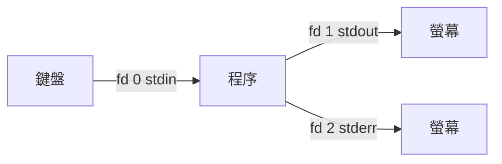

# 輸入輸出重導向與管線

> [!abstract] 這篇你會學到
> - 理解 stdin / stdout / stderr 三個檔案描述符，以及它們為什麼是「檔案」
> - 正確寫出 `> file 2>&1`，並知道**為什麼 `2>&1 > file` 是錯的**
> - 用管線把小工具串成解決問題的一行指令
> - 用 `tee` 同時看畫面與存檔、用 `set -o pipefail` 讓管線的錯誤不被吞掉
> - 用 here-document 產生設定檔，用行程替換做「假檔案」

## 前置知識

- [[03-終端機與Shell入門]]

---

## 觀念說明

### 三個標準檔案描述符

每個程序啟動時，核心都會給它三個已開啟的「檔案」：

| 編號 | 名稱 | 預設連到 | 用途 |
| --- | --- | --- | --- |
| **0** | `stdin` | 鍵盤 | 輸入 |
| **1** | `stdout` | 螢幕 | **正常輸出** |
| **2** | `stderr` | 螢幕 | **錯誤訊息** |



**stdout 與 stderr 分開是刻意的設計**——這樣你可以把正常結果存檔，
同時讓錯誤訊息留在螢幕上；或反過來只記錄錯誤。

```bash
ls /etc /notexist
```

```
ls: cannot access '/notexist': No such file or directory     ← stderr
/etc:                                                        ← stdout
adduser.conf
alsa
```

兩者混在螢幕上看不出差別，導向之後就分開了：

```bash
ls /etc /notexist > out.txt
```

```
ls: cannot access '/notexist': No such file or directory     ← 只有 stderr 留在螢幕
```

```bash
cat out.txt      # 只有 /etc 的內容
```

> [!tip] 這解釋了「為什麼錯誤訊息不會被 `> file` 導走」
> `>` 只導 stdout（fd 1）。錯誤訊息走 stderr（fd 2），需要另外處理。
>
> 也解釋了為什麼 `find / -name x 2>/dev/null` 能濾掉權限錯誤——
> 把 fd 2 丟進黑洞，正常結果照樣出現。

### 檢查程序實際開了哪些描述符

```bash
ls -l /proc/self/fd
```

```
lrwx------ 1 mike mike 64  8月 27 16:20 0 -> /dev/pts/0
lrwx------ 1 mike mike 64  8月 27 16:20 1 -> /dev/pts/0
lrwx------ 1 mike mike 64  8月 27 16:20 2 -> /dev/pts/0
```

三個都指向同一個終端機。導向之後就會不同：

```bash
bash -c 'ls -l /proc/self/fd' > /tmp/fd.txt 2>/tmp/err.txt; cat /tmp/fd.txt
```

```
l-wx------ 1 mike mike 64 ... 1 -> /tmp/fd.txt
l-wx------ 1 mike mike 64 ... 2 -> /tmp/err.txt
```

---

## 基礎操作

### 輸出重導向

```bash
cmd > file          # stdout 寫入 file（覆蓋）
cmd >> file         # stdout 附加到 file
cmd 2> file         # stderr 寫入 file
cmd 2>> file        # stderr 附加
cmd > out 2> err    # 分別導向不同檔案
cmd > file 2>&1     # stdout 與 stderr 都到 file  ← 最常用
cmd &> file         # 同上（bash 簡寫）
cmd &>> file        # 都附加（bash 簡寫）
cmd > /dev/null     # 丟掉 stdout
cmd 2> /dev/null    # 丟掉 stderr
cmd > /dev/null 2>&1  # 全部丟掉
```

> [!danger] `2>&1` 的位置決定一切
> ```bash
> cmd > file 2>&1     # ✓ 兩者都進 file
> cmd 2>&1 > file     # ✗ stderr 仍在螢幕，只有 stdout 進 file
> ```
>
> 因為**重導向是由左到右依序執行的**：
>
> 第一種：
> 1. `> file` → fd 1 指向 file
> 2. `2>&1` → fd 2 指向「fd 1 現在指的地方」= file ✓
>
> 第二種：
> 1. `2>&1` → fd 2 指向「fd 1 現在指的地方」= 螢幕
> 2. `> file` → fd 1 改指向 file，**但 fd 2 還指著螢幕** ✗
>
> `2>&1` 是「複製 fd 1 目前的目的地」，不是「跟著 fd 1 一起變」。
> 記法：**先決定 1 去哪，再叫 2 跟著。**

### 輸入重導向

```bash
cmd < file              # 從檔案讀取 stdin
cmd << 分隔字串         # here-document（多行文字）
cmd <<< "字串"          # here-string（單行）
```

用 here-document 產生設定檔（下面用 `NGINXCONF` 當分隔字串）：

```bash
sudo tee /etc/nginx/conf.d/upstream.conf > /dev/null <<'NGINXCONF'
upstream backend {
    server 127.0.0.1:8001;
    server 127.0.0.1:8002;
}
NGINXCONF
```

> [!tip] 分隔字串加不加引號差很多
> ```bash
> NAME=mike
>
> cat << MARK1          # 不加引號：變數會展開 → Hello mike
> Hello $NAME
> MARK1
>
> cat << 'MARK2'        # 加單引號：完全照字面 → Hello $NAME
> Hello $NAME
> MARK2
> ```
> **寫設定檔或腳本內容時一律給分隔字串加單引號**，
> 否則裡面的 `$variable`、`$(...)` 會被 Shell 先吃掉。
>
> 這是產生 Nginx 設定（含 `$host`、`$remote_addr`）時最常見的坑。

> [!warning] 分隔字串不要用 `EOF`，如果內容裡也有 here-doc
> 寫「產生腳本的腳本」時，外層與內層都用 `EOF` 會讓外層提前結束。
> 用有意義的名稱區分：`NGINXCONF`、`SYSTEMDUNIT`、`SCRIPT_BODY`。

```bash
# <<- 允許用 Tab 縮排（只能是 Tab，不能是空白）
if true; then
	cat <<- INDENTED
		縮排的內容
		會被去掉開頭的 Tab
	INDENTED
fi
```

```bash
# here-string：省掉 echo
grep "root" <<< "$(getent passwd)"
bc <<< "3 * 7"
```

### 管線

```bash
cmd1 | cmd2       # cmd1 的 stdout 接到 cmd2 的 stdin
cmd1 |& cmd2      # stdout + stderr 都接過去（bash 4+，等同 2>&1 |）
```

```bash
ps aux | grep nginx | grep -v grep | awk '{print $2}'
```

管線是 Unix 哲學的核心：**每個工具做好一件事，用管線組合出複雜功能**。


> [!warning] 管線只接 stdout，錯誤訊息會漏出來
> ```bash
> find / -name "*.conf" | wc -l
> ```
> ```
> find: '/root': Permission denied          ← 這行跑到螢幕上
> find: '/proc/1/task': Permission denied
> 1247
> ```
> 錯誤訊息不會進管線（所以不影響 `wc -l` 的計數），但會弄亂畫面。
> ```bash
> find / -name "*.conf" 2>/dev/null | wc -l     # ✓
> ```

### `tee`：同時看畫面與存檔

```bash
cmd | tee file              # 顯示在螢幕，同時寫入 file
cmd | tee -a file           # 附加
cmd | tee file1 file2       # 寫入多個檔案
cmd 2>&1 | tee file         # 連錯誤一起
```

```bash
# 部署過程既要看到又要留紀錄
./deploy.sh 2>&1 | tee "/var/log/deploy-$(date +%F-%H%M).log"
```

> [!tip] `sudo tee` 是「用 root 權限寫檔案」的正確寫法
> ```bash
> sudo echo "text" > /etc/file        # ✗ 失敗！
> ```
> 為什麼失敗：**重導向由 Shell 執行，而 Shell 是以你的身分跑的**，
> `sudo` 只提升了 `echo` 的權限，寫檔的動作沒有。
>
> ```bash
> echo "text" | sudo tee /etc/file            # ✓ 覆蓋
> echo "text" | sudo tee -a /etc/file         # ✓ 附加
> echo "text" | sudo tee /etc/file > /dev/null   # ✓ 不想看到回顯
> ```
> `tee` 本身是 root 執行的，所以有權限寫。
>
> 這是**每個維運人員都會用到的技巧**，請記起來。

### `set -o pipefail`：不要讓錯誤被吞掉

管線的退出碼**預設是最後一個指令的退出碼**：

```bash
false | true
echo $?
```

```
0        ← 明明前面失敗了，卻回報成功！
```

```bash
set -o pipefail
false | true
echo $?
```

```
1        ← ✓ 正確反映失敗
```

> [!danger] 這是備份腳本靜默失敗的頭號原因
> ```bash
> mysqldump mydb | gzip > backup.sql.gz
> if [ $? -eq 0 ]; then echo "備份成功"; fi
> ```
> 就算 `mysqldump` 失敗（資料庫掛了、密碼錯了），
> `gzip` 仍會成功地產生一個**內容為空的壓縮檔**，
> 退出碼是 0，腳本回報「備份成功」。
>
> 你要等到真的需要還原的那天，才會發現備份全是空的。
>
> **所有腳本開頭都該有這一行**：
> ```bash
> set -euo pipefail
> ```
> 見 [[22-Shell腳本進階]]。

檢查管線中每一段的退出碼：

```bash
mysqldump mydb | gzip > backup.sql.gz
echo "${PIPESTATUS[@]}"
```

```
1 0      ← 第一個失敗，第二個成功
```

### 行程替換：把指令輸出當成檔案

```bash
cmd <(other_cmd)      # 把 other_cmd 的輸出當成一個檔案傳給 cmd
cmd >(other_cmd)      # 反向
```

```bash
# 比較設定檔的「有效內容」
diff <(grep -vE '^\s*(#|$)' nginx.conf.old) \
     <(grep -vE '^\s*(#|$)' nginx.conf.new)

# 同時寫入檔案並做即時處理
./deploy.sh > >(tee deploy.log) 2> >(tee deploy.err >&2)
```

> [!tip] `diff <(...) <(...)` 是維運超好用的一招
> 「這兩台機器有什麼不一樣」「改設定前後差在哪」
> 都可以用這個模式一行解決，不用建暫存檔。
>
> 它實際上是建立了臨時的檔案描述符：
> ```bash
> echo <(ls)
> ```
> ```
> /dev/fd/63
> ```

### 緩衝問題

```bash
tail -F /var/log/nginx/access.log | grep " 500 "
```

沒有立即輸出，因為 `grep` 在偵測到輸出不是終端機時會用 4KB 區塊緩衝。

```bash
tail -F access.log | grep --line-buffered " 500 "        # grep
tail -F access.log | awk '/500/ {print; fflush()}'       # awk
tail -F access.log | sed -u -n '/500/p'                  # sed
tail -F access.log | stdbuf -oL grep " 500 "             # 通用解法
```

> [!tip] `stdbuf` 是通用的緩衝控制工具
> ```bash
> stdbuf -oL cmd      # 行緩衝（每一行就輸出）
> stdbuf -o0 cmd      # 完全不緩衝
> ```
> 對於沒有自己的 `--line-buffered` 選項的程式，用 `stdbuf` 包起來。
> 注意它對某些自己管理緩衝的程式無效，Python 要用 `python3 -u`。

> [!info]- Rocky / AlmaLinux（RHEL 系）對照
> 重導向與管線是 bash 的功能，兩系完全相同。
> `tee`、`stdbuf` 都在 `coreutils`，預設安裝。
>
> 唯一要注意的是部分容器映像用 `sh`（dash / busybox），
> 那些環境**不支援** `&>`、`|&`、`<<<`、`<(...)` 這些 bash 擴充語法。
>
> 需要相容 POSIX sh 時：
> ```sh
> cmd > file 2>&1        # 取代 cmd &> file
> cmd 2>&1 | cmd2        # 取代 cmd |& cmd2
> echo "字串" | cmd      # 取代 cmd <<< "字串"
> ```

---

## 完整實戰範例

### 情境一：一行統計日誌

```bash
awk '{print $1}' /var/log/nginx/access.log | sort | uniq -c | sort -rn | head -10
```

拆解每一段在做什麼：

| 段 | 輸入 | 輸出 |
| --- | --- | --- |
| `awk '{print $1}'` | 整行日誌 | 只留 IP |
| `sort` | 亂序 IP | 排序後的 IP（`uniq` 要求相同的相鄰） |
| `uniq -c` | 排序的 IP | `次數 IP` |
| `sort -rn` | `次數 IP` | 依次數由大到小 |
| `head -10` | 全部 | 前 10 筆 |

```
   4821 203.0.113.77
   1092 198.51.100.4
    877 203.0.113.5
```

> [!warning] `uniq` 前面一定要 `sort`
> `uniq` 只會合併**相鄰的**重複行。沒排序的話：
> ```bash
> printf 'a\nb\na\n' | uniq -c
> ```
> ```
>       1 a
>       1 b
>       1 a      ← 兩個 a 沒被合併
> ```
> 這是初學者最常犯的錯之一。

### 情境二：可靠的備份腳本

```bash
#!/usr/bin/env bash
set -euo pipefail        # ← 關鍵：pipefail 讓管線失敗不被吞掉

BACKUP_DIR=/backup/mysql
DATE=$(date +%F-%H%M)
LOG="/var/log/backup-$DATE.log"
DB=production

mkdir -p "$BACKUP_DIR"

# 所有輸出同時進畫面與日誌
exec > >(tee -a "$LOG") 2>&1

echo "=== 備份開始 $(date) ==="

# 備份並壓縮（密碼放 ~/.my.cnf，不寫在指令列）
mysqldump --single-transaction --quick "$DB" | gzip -9 > "$BACKUP_DIR/$DB-$DATE.sql.gz"

# 檢查管線每一段的退出碼
echo "各段退出碼：${PIPESTATUS[*]}"

# 驗證產出（空的 gzip 大約 20 bytes）
SIZE=$(stat -c %s "$BACKUP_DIR/$DB-$DATE.sql.gz")
if [ "$SIZE" -lt 1024 ]; then
    echo "❌ 備份檔只有 $SIZE bytes，明顯異常" >&2
    exit 1
fi

# 驗證壓縮檔完整性與內容
gzip -t "$BACKUP_DIR/$DB-$DATE.sql.gz"
if ! zcat "$BACKUP_DIR/$DB-$DATE.sql.gz" | head -20 | grep -q "MySQL dump"; then
    echo "❌ 備份檔內容不像 mysqldump 輸出" >&2
    exit 1
fi

echo "✅ 備份完成：$(du -h "$BACKUP_DIR/$DB-$DATE.sql.gz" | cut -f1)"

# 清理 14 天前的備份
find "$BACKUP_DIR" -name "$DB-*.sql.gz" -mtime +14 -print -delete

echo "=== 備份結束 $(date) ==="
```

> [!tip] `exec > >(tee -a "$LOG") 2>&1` 這一行很值得學
> 它把**整個腳本從這行之後的所有輸出**同時導向畫面與日誌檔，
> 不用在每個 `echo` 後面加 `| tee -a`。
>
> `exec` 不接指令時的作用是「改變目前 shell 的檔案描述符」。

### 情境三：即時監看並過濾

```bash
# 即時看 5xx 錯誤，同時存檔備查
sudo tail -F /var/log/nginx/access.log \
  | grep --line-buffered -E ' 5[0-9]{2} ' \
  | tee -a /var/log/nginx/5xx-watch.log
```

```bash
# 同時看多個服務的日誌
sudo journalctl -f -u nginx -u php8.3-fpm -u mysql
```

---

## 常見錯誤與排錯

| 現象 | 原因 | 解法 |
| --- | --- | --- |
| `sudo echo x > /etc/file` 說 Permission denied | 重導向由你的 shell 執行，不是 sudo | `echo x \| sudo tee /etc/file` |
| `cmd 2>&1 > file` 錯誤訊息還在螢幕 | 順序錯 | 改成 `cmd > file 2>&1` |
| 管線失敗但腳本回報成功 | 管線退出碼只看最後一段 | `set -o pipefail`；檢查 `${PIPESTATUS[@]}` |
| `tail -F \| grep` 沒有即時輸出 | grep 輸出緩衝 | `--line-buffered` 或 `stdbuf -oL` |
| `uniq -c` 沒有正確合併 | 沒先排序 | `sort \| uniq -c` |
| here-doc 裡的 `$var` 被展開了 | 分隔字串沒加單引號 | 用 `<< '分隔字串'` |
| here-doc 提前結束 | 內容裡有一行剛好等於分隔字串 | 換一個不會衝突的分隔字串 |
| `<<-` 縮排沒作用 | `<<-` 只吃 Tab，不吃空白 | 確認縮排是真的 Tab |
| `cmd > file` 之後 file 是空的 | 輸出走 stderr | 用 `2>` 或 `&>` |
| `> file` 把原本的內容清光了 | `>` 是覆蓋 | 用 `>>` 附加；重要檔案先備份 |
| 腳本在 cron 裡沒有輸出 | cron 的 stdout 會寄信而非寫檔 | 明確導向：`cmd >> /var/log/x.log 2>&1` |
| `sort file > file` 把檔案清空 | Shell 先清空檔案才執行指令 | `sort -o file file` 或先寫暫存再 `mv` |

> [!danger] `cmd file > file` 會先清空 file
> ```bash
> sort data.txt > data.txt        # ✗ data.txt 變成空的！
> ```
> Shell **先**處理重導向（清空 `data.txt`），**才**執行 `sort`，
> 這時 `sort` 讀到的已經是空檔案了。
>
> 正解：
> ```bash
> sort -o data.txt data.txt              # sort 有內建的安全寫法
> sort data.txt > tmp && mv tmp data.txt # 通用做法
> sed -i 's/x/y/' data.txt               # sed -i 也是安全的
> ```

---

## 安全性注意事項

> [!warning] `> /dev/null 2>&1` 會把錯誤也吞掉
> 在 cron 裡常看到：
> ```
> 0 3 * * * /usr/local/bin/backup.sh > /dev/null 2>&1
> ```
> 這樣**備份失敗你永遠不會知道**。
>
> 較好的寫法是只丟掉正常輸出，保留錯誤：
> ```
> 0 3 * * * /usr/local/bin/backup.sh > /dev/null
> ```
> 或者導向日誌並設定告警。見 [[18-排程工作]]。

> [!warning] 日誌檔的權限
> ```bash
> cmd > /var/log/myapp.log       # 用你的 umask 建立，可能是 644
> ```
> 如果輸出含敏感資訊（連線字串、token），`644` 代表所有人可讀。
> 先建好檔案並設定權限：
> ```bash
> sudo install -m 640 -o root -g adm /dev/null /var/log/myapp.log
> ```

> [!tip] 用 `script` 保留維運操作紀錄
> 重大操作（升級、遷移、TWGCB 套用）建議全程記錄：
> ```bash
> script -q "/var/log/ops/$(date +%F-%H%M)-upgrade.log"
> # ……進行操作……
> exit
> ```
> `script` 會錄下整個終端機 session（含互動輸入）。
> 這在事後檢討與稽核時非常有價值。

---

## 速查表

### 重導向

| 寫法 | 作用 |
| --- | --- |
| `> file` / `>> file` | stdout 覆蓋 / 附加 |
| `2> file` / `2>> file` | stderr 覆蓋 / 附加 |
| **`> file 2>&1`** | **兩者都到 file（順序不可反）** |
| `&> file` / `&>> file` | 同上（bash 簡寫） |
| `> /dev/null` / `2> /dev/null` | 丟掉 stdout / stderr |
| `< file` | 從檔案讀 stdin |
| `<< 分隔字串` | here-doc（變數會展開） |
| `<< '分隔字串'` | here-doc（**不展開，寫設定檔用這個**） |
| `<<< "字串"` | here-string |

### 管線

| 寫法 | 作用 |
| --- | --- |
| `a \| b` | a 的 stdout 接 b 的 stdin |
| `a \|& b` | stdout + stderr 都接過去 |
| `cmd \| tee f` | 同時顯示與存檔 |
| `cmd \| sudo tee f` | **用 root 權限寫檔** |
| `set -o pipefail` | **管線任一段失敗即視為失敗** |
| `${PIPESTATUS[@]}` | 管線各段的退出碼 |
| `<(cmd)` / `>(cmd)` | 行程替換（把輸出當檔案） |
| `diff <(a) <(b)` | **比較兩個指令的輸出** |

### 緩衝

| 寫法 | 作用 |
| --- | --- |
| `grep --line-buffered` | grep 逐行輸出 |
| `sed -u` | sed 不緩衝 |
| `awk '{...; fflush()}'` | awk 強制輸出 |
| `stdbuf -oL cmd` | **通用行緩衝** |

---

## 練習題

> [!question]- 練習 1：驗證 `2>&1` 的順序
> 建立一個同時輸出到 stdout 與 stderr 的指令，分別測試兩種順序。
>
> **解答**
>
> ```bash
> printf '%s\n' '#!/usr/bin/env bash' \
>   'echo "這是正常輸出"' \
>   'echo "這是錯誤輸出" >&2' > /tmp/both.sh
> chmod +x /tmp/both.sh
> ```
>
> ```bash
> /tmp/both.sh > /tmp/out.txt 2>&1
> echo "--- 螢幕上什麼都沒有 ---"
> cat /tmp/out.txt
> ```
> ```
> --- 螢幕上什麼都沒有 ---
> 這是正常輸出
> 這是錯誤輸出
> ```
>
> ```bash
> /tmp/both.sh 2>&1 > /tmp/out2.txt
> ```
> ```
> 這是錯誤輸出          ← 跑到螢幕上了！
> ```
> ```bash
> cat /tmp/out2.txt
> ```
> ```
> 這是正常輸出          ← 只有 stdout 進檔案
> ```
>
> **結論**：`2>&1` 複製的是「fd 1 **當下**指向的地方」。
> 必須先讓 fd 1 指向檔案，fd 2 才會跟著進檔案。

> [!question]- 練習 2：找出被靜默吞掉的失敗
> 下面這個備份腳本有什麼問題？寫出修正版並驗證。
> ```bash
> #!/bin/bash
> mysqldump --user=root --password=wrong mydb | gzip > /backup/db.sql.gz
> if [ $? -eq 0 ]; then
>     echo "備份成功"
> fi
> ```
>
> **解答**
>
> **問題一**：沒有 `set -o pipefail`，`$?` 只反映 `gzip` 的結果。
> `mysqldump` 因密碼錯誤失敗，但 `gzip` 成功壓縮了「空輸入」，
> 產生一個約 20 bytes 的合法但無內容的 `.gz`，腳本回報「備份成功」。
>
> **問題二**：密碼寫在指令列，`ps aux` 看得到（見 [[10-程序管理與訊號]]）。
>
> **問題三**：沒有驗證產出。
>
> 驗證問題確實存在：
> ```bash
> false | gzip > /tmp/empty.gz
> echo "退出碼：$?"          # 0
> ls -l /tmp/empty.gz        # 約 20 bytes
> zcat /tmp/empty.gz | wc -c # 0
> ```
>
> 修正版見上方「情境二：可靠的備份腳本」。
>
> **教訓**：備份腳本的價值不在「有跑」，而在「產出真的可以還原」。
> 見 [[03-備份策略與還原演練]]。

> [!question]- 練習 3：比較兩台機器的設定差異
> 用行程替換，一行比較兩台機器的 Nginx 有效設定（去掉註解與空行）。
>
> **解答**
>
> ```bash
> diff <(ssh web01 'sudo nginx -T 2>/dev/null | grep -vE "^\s*(#|$)"') \
>      <(ssh web02 'sudo nginx -T 2>/dev/null | grep -vE "^\s*(#|$)"')
> ```
>
> 用 `nginx -T` 而不是 `cat nginx.conf` 的理由：
> **`-T` 會展開所有 `include` 並印出實際生效的完整設定**，
> 直接讀單一檔案會漏掉 `sites-enabled/` 底下的內容。
>
> 同樣的模式可以用在任何「兩邊有什麼不同」的問題：
> ```bash
> diff <(ssh a 'dpkg -l') <(ssh b 'dpkg -l')                       # 套件差異
> diff <(ssh a 'sudo sshd -T | sort') <(ssh b 'sudo sshd -T | sort') # SSH 設定差異
> ```

---

## 小測驗

Q1. fd 0、1、2 各是什麼？為什麼 stdout 與 stderr 要分開？
Q2. `cmd 2>&1 > file` 與 `cmd > file 2>&1` 結果差在哪？原因？
Q3. `sudo echo x > /etc/file` 為什麼 Permission denied？正確寫法？
Q4. `false | true; echo $?` 印什麼？加了什麼之後會變？
Q5. 備份腳本 `mysqldump db | gzip > f.gz` 在密碼錯誤時為什麼仍回報成功？產出是什麼？
Q6. here-doc 分隔字串加單引號與不加的差別？寫 Nginx 設定該用哪種？
Q7. here-doc 內容裡剛好有一行等於分隔字串會怎樣？
Q8. `sort file > file` 會發生什麼？三種安全寫法？
Q9. `diff <(cmd1) <(cmd2)` 的 `<( )` 叫什麼？實際建立了什麼？
Q10. `tail -F log | grep x` 沒有即時輸出的通用解法（不限 grep）？

> [!question]- 測驗答案
> **Q1.** stdin、stdout、stderr；分開才能把正常結果存檔而錯誤留在螢幕，或反過來（見「三個標準檔案描述符」）。
> **Q2.** 前者 stderr 仍在螢幕、只有 stdout 進檔；重導向由左到右執行，`2>&1` 複製的是「fd 1 當下指向的地方」。
> **Q3.** 重導向由你的 shell 執行，sudo 只提升了 `echo`；`echo x | sudo tee /etc/file`。
> **Q4.** `0`——管線退出碼預設是最後一段；`set -o pipefail` 後變 `1`。
> **Q5.** `gzip` 成功壓縮了空輸入，退出碼 0；產出約 20 bytes 的合法但空的 `.gz`。要 `pipefail` 加產出驗證。
> **Q6.** 單引號完全照字面，不加引號會展開 `$var`；Nginx 設定含 `$host` 等，必須用單引號。
> **Q7.** here-doc 在那一行提前結束，後面內容變成指令執行。換不會衝突的分隔字串。
> **Q8.** 檔案先被清空再讀，變成空檔。`sort -o file file`、`sort file > tmp && mv tmp file`、`sed -i`。
> **Q9.** 行程替換；建立 `/dev/fd/63` 這類臨時檔案描述符讓指令當檔案讀。
> **Q10.** `stdbuf -oL cmd`（行緩衝）；Python 例外要用 `python3 -u`。

---

## 延伸閱讀

- [[12-文字處理三劍客]] — 管線裡最常用的 `grep`/`sed`/`awk`
- [[21-Shell腳本入門]] — 把管線寫進腳本
- [[22-Shell腳本進階]] — `set -euo pipefail` 與錯誤處理
- [[06-檢視檔案內容]] — `tail -F` 與緩衝問題
- [[18-排程工作]] — cron 中的輸出處理
- `man 1 bash`（REDIRECTION 章節）
