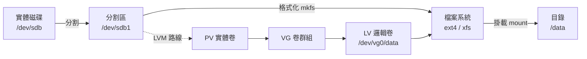
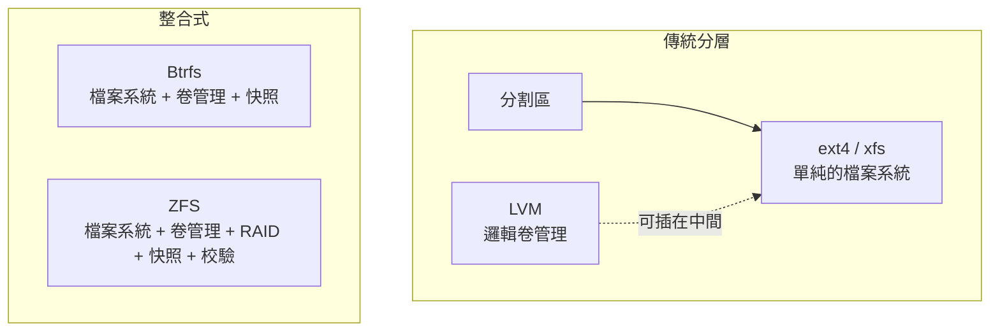
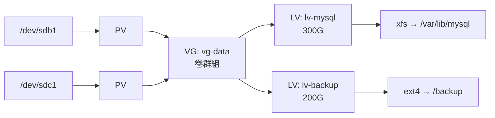

# 磁碟分割與掛載

> [!abstract] 這篇你會學到
> - 用固定流程查出「磁碟到底被什麼吃滿」，包含 **inode 用盡**與**幽靈檔案**兩種怪狀況
> - 正確地把新磁碟分割、格式化、掛載，並寫進 `fstab` 讓它重開機後還在
> - **用 UUID 而不是 `/dev/sdb1` 寫 fstab**——這個習慣能避免一次開不了機
> - 用 `noexec` / `nosuid` / `nodev` 強化掛載安全（TWGCB 與 CIS 必檢項）
> - LVM 的基本操作：線上擴充容量而不用停機
> - 為小記憶體機器加上 swap，避免服務被 OOM Killer 砍掉

## 前置知識

- [[04-檔案系統與目錄結構]]

---

## 觀念說明

### 從實體磁碟到可用目錄的路徑



每一層都可能出問題，排查時要知道自己在看哪一層：

| 層 | 查看指令 | 常見問題 |
| --- | --- | --- |
| 實體磁碟 | `lsblk`、`smartctl` | 磁碟故障、沒被偵測到 |
| 分割區 | `lsblk`、`fdisk -l` | 分割表損壞、空間沒分完 |
| 檔案系統 | `blkid`、`fsck` | 檔案系統損壞、inode 用盡 |
| 掛載 | `findmnt`、`mount` | 沒掛上、掛錯位置、選項不對 |

### 兩個常見誤解

> [!warning] 誤解一：「磁碟滿了」不一定是空間滿了
> 有三種完全不同的「滿」：
>
> | 症狀 | 原因 | 查法 |
> | --- | --- | --- |
> | `df` 顯示 100% | **空間**用完 | `du` 找大檔 |
> | `df` 有空間卻寫不進去 | **inode** 用完（小檔太多） | `df -i` |
> | `du` 加總遠小於 `df` | 檔案被刪但程序仍持有 | `lsof +L1` |
>
> 三種的處理方式完全不同，**一定要先分辨**。

> [!warning] 誤解二：掛載會「蓋住」原本目錄裡的東西
> ```bash
> ls /data          # 原本有 10GB 的舊資料
> sudo mount /dev/sdb1 /data
> ls /data          # 空的！
> ```
> 原本的檔案**沒有消失**，只是被新掛載的檔案系統「遮住」了。
> 卸載後就會回來：
> ```bash
> sudo umount /data
> ls /data          # 舊資料又出現了
> ```
>
> 危險的是：那 10GB 舊資料仍佔用著根分割區的空間，
> 但你 `du /data` 看不到它。查法：
> ```bash
> sudo mkdir -p /mnt/tmp && sudo mount --bind / /mnt/tmp
> sudo du -sh /mnt/tmp/data        # 看到被遮住的內容
> sudo umount /mnt/tmp
> ```
>
> **掛載前務必確認掛載點是空的**：
> ```bash
> ls -A /data || echo "目錄是空的，可以掛載"
> ```

---

## 基礎操作

### 查看：`lsblk`、`df`、`findmnt`

```bash
lsblk                              # ✓ 區塊裝置樹狀圖（最直覺）
lsblk -f                           # 加上檔案系統與 UUID
lsblk -o NAME,SIZE,FSTYPE,MOUNTPOINT,UUID
```

```bash
lsblk -f
```

```
NAME        FSTYPE FSVER LABEL UUID                                 FSAVAIL FSUSE% MOUNTPOINTS
sda
├─sda1      vfat   FAT32       A1B2-C3D4                             505.9M     1% /boot/efi
└─sda2      ext4   1.0         3f8a2b1c-9d4e-4a7b-8c2d-1e5f6a7b8c9d   35.2G    25% /
sdb
└─sdb1      xfs                7a1b2c3d-4e5f-6a7b-8c9d-0e1f2a3b4c5d  386.4G    19% /var/lib/mysql
```

```bash
df -h                              # 各掛載點空間
df -hT                             # 加上檔案系統類型
df -i                              # ✓ inode 使用量
df -h /var/log                     # 特定路徑屬於哪個掛載點
findmnt                            # 掛載樹狀圖
findmnt /var/lib/mysql             # 這個路徑的掛載資訊與選項
findmnt --verify                   # 驗證 fstab 語法
```

```bash
findmnt /var/lib/mysql
```

```
TARGET           SOURCE    FSTYPE OPTIONS
/var/lib/mysql   /dev/sdb1 xfs    rw,relatime,attr2,inode64,noquota
```

> [!tip] `findmnt` 比 `mount` 好用
> `mount` 不帶參數會印出一大堆雜訊（含各種虛擬檔案系統）。
> `findmnt` 是樹狀的、可以查單一路徑、還能驗證 fstab：
> ```bash
> findmnt --verify --verbose      # 寫完 fstab 一定要跑這個
> ```

### 找出誰吃了空間

```bash
# 1. 哪個掛載點滿了
df -h
```

```
Filesystem      Size  Used Avail Use% Mounted on
/dev/sda2        50G   48G  1.2G  98% /
/dev/sdb1       500G   89G  386G  19% /var/lib/mysql
```

```bash
# 2. 逐層往下鑽（-x 不跨檔案系統，避免算到其他磁碟）
sudo du -hx --max-depth=1 / 2>/dev/null | sort -rh | head -8
sudo du -hx --max-depth=1 /var 2>/dev/null | sort -rh | head -8
```

```bash
# 3. 直接找大檔
sudo find / -xdev -type f -size +500M -exec ls -lh {} + 2>/dev/null \
  | sort -k5 -rh | head -10
```

```bash
# 4. 如果 du 加總遠小於 df —— 幽靈檔案
sudo lsof +L1 2>/dev/null | head
```

```
COMMAND  PID  USER   FD   TYPE DEVICE    SIZE/OFF NLINK NODE NAME
nginx    891  www-d   6w   REG  253,0  6291456000     0 4213 /var/log/nginx/access.log (deleted)
```

`NLINK` 為 0 且標記 `(deleted)`——檔案已刪但 Nginx 還開著，**空間不會釋放**。

```bash
# 解法一：重啟或通知服務重開日誌（推薦）
sudo systemctl reload nginx

# 解法二：直接清空該檔案描述符（不重啟服務）
sudo truncate -s 0 /proc/891/fd/6
```

```bash
# 5. inode 用盡
df -i
```

```
Filesystem      Inodes  IUsed IFree IUse% Mounted on
/dev/sda2      3276800 3276800     0  100% /        ← inode 用完了！
```

```bash
# 找出檔案數最多的目錄
sudo find / -xdev -type d -exec bash -c 'echo "$(ls -U "$1" 2>/dev/null | wc -l) $1"' _ {} \; 2>/dev/null \
  | sort -rn | head -10
```

> [!tip] inode 用盡的典型元凶
> - PHP session 檔案（`/var/lib/php/sessions`）沒被清理
> - 郵件佇列（`/var/spool/`）堆積
> - 沒設輪替的小日誌檔
> - Docker 的 overlay2 層
> - `find` 找不到是因為它們是**海量小檔**，不是大檔
>
> ```bash
> sudo find /var/lib/php/sessions -type f -mtime +1 -delete
> ```
>
> **ext4 的 inode 數量在格式化時就固定了**，用完只能重建檔案系統。
> XFS 是動態配置的，不會有這個問題——這是選 XFS 的理由之一。

### 磁碟健康檢查

```bash
sudo apt install -y smartmontools
sudo smartctl -H /dev/sda                  # 整體健康狀態
sudo smartctl -a /dev/sda                  # 完整 SMART 資訊
sudo smartctl -t short /dev/sda            # 執行短測試（約 2 分鐘）
sudo smartctl -l selftest /dev/sda         # 看測試結果
```

```bash
sudo smartctl -H /dev/sda
```

```
SMART overall-health self-assessment test result: PASSED
```

> [!warning] 幾個要盯的 SMART 屬性
> ```bash
> sudo smartctl -A /dev/sda | grep -E 'Reallocated|Pending|Uncorrectable|Wear_Leveling|Power_On_Hours'
> ```
> | 屬性 | 意義 |
> | --- | --- |
> | `Reallocated_Sector_Ct` | **重新配置的壞軌數，>0 就要開始準備換** |
> | `Current_Pending_Sector` | **待處理的可疑扇區，>0 是明確警訊** |
> | `Offline_Uncorrectable` | 無法修正的扇區 |
> | `Wear_Leveling_Count` | SSD 壽命消耗 |
>
> `PASSED` 不代表健康——SMART 只在快掛掉時才回報 FAILED。
> **要看個別屬性的趨勢**，並排進每季維護。

### 分割新磁碟

```bash
lsblk                              # 確認新磁碟裝置名稱（假設是 /dev/sdb）
sudo parted /dev/sdb print         # 看現有分割表
```

> [!danger] 動手前務必再三確認裝置名稱
> `/dev/sda` 和 `/dev/sdb` 差一個字母，後果是**整顆磁碟的資料消失**。
> 確認方式：
> ```bash
> lsblk -o NAME,SIZE,MODEL,SERIAL,MOUNTPOINTS
> ```
> 用**容量、型號、序號**三重確認，不要只看裝置名稱。
> 而且裝置名稱在重開機後**可能改變**（這也是要用 UUID 的原因）。

**用 `parted` 建立 GPT 分割**（現代做法，支援 >2TB）：

```bash
sudo parted -s /dev/sdb mklabel gpt
sudo parted -s -a optimal /dev/sdb mkpart primary 0% 100%
sudo parted /dev/sdb print
lsblk /dev/sdb
```

```
Number  Start   End    Size   File system  Name     Flags
 1      1049kB  500GB  500GB               primary
```

| 分割表 | 上限 | 分割數 | 適用 |
| --- | --- | --- | --- |
| MBR | 2TB | 4 主分割 | 舊系統、BIOS 開機 |
| **GPT** | 極大 | 128+ | **現代預設** |

### 檔案系統選型

Linux 上有五個值得認識的儲存方案，**它們解決的問題層次不同**：



| | **ext4** | **xfs** | **btrfs** | **ZFS** | **LVM** |
| --- | --- | --- | --- | --- | --- |
| 定位 | 檔案系統 | 檔案系統 | 檔案系統+卷管理 | 完整儲存堆疊 | **卷管理層**（不是檔案系統） |
| 成熟度 | 極高 | 極高 | 高 | 極高 | 極高 |
| 可**擴大** | ✅ 線上 | ✅ 線上 | ✅ 線上 | ✅ 線上 | ✅ 線上 |
| 可**縮小** | ✅ 需卸載 | ❌ **不行** | ✅ 線上 | ❌ 不行 | ✅ |
| inode | **格式化時固定** | 動態 | 動態 | 動態 | 不適用 |
| 快照 | ❌ | ❌ | ✅ 秒級 | ✅ 秒級 | ✅（有效能代價） |
| 內建 RAID | ❌ | ❌ | ✅（RAID5/6 不穩） | ✅ RAIDZ | ✅（mirror/stripe） |
| 資料校驗 | 只有中繼資料 | 只有中繼資料 | ✅ 全資料 | ✅ **全資料 + 自動修復** | ❌ |
| 透明壓縮 | ❌ | ❌ | ✅ | ✅ | ❌ |
| 去重 | ❌ | ❌ | 離線 | ✅（吃記憶體） | ❌ |
| 記憶體需求 | 低 | 低 | 中 | **高（ARC）** | 低 |
| 核心內建 | ✅ | ✅ | ✅ | ❌ **需另裝模組** | ✅ |
| Ubuntu 預設 | ✅ 根分割區 | | | | |
| RHEL 預設 | | ✅ | | | ✅ 根分割區 |

> [!tip] 一句話選型
> | 情境 | 選擇 |
> | --- | --- |
> | 一般伺服器根分割區 | **ext4**（Ubuntu）或 **xfs + LVM**（RHEL），跟隨發行版預設 |
> | 資料庫、大檔案、大量小檔 | **xfs**（不會 inode 用盡，大檔效能好） |
> | 需要線上調整容量、跨多顆磁碟 | **LVM**（配 ext4 或 xfs） |
> | 需要頻繁快照、單機備份 | **btrfs** 或 **ZFS** |
> | 儲存伺服器、資料完整性至上、多顆磁碟 | **ZFS** |
> | 容器主機 | ext4 或 xfs（overlay2 在這兩者上最成熟） |
>
> **不確定就用發行版預設。** ext4 與 xfs 在 99% 的伺服器場景都夠用，
> 而且是最不會出意外的選擇。

### 格式化與各檔案系統的重點

```bash
sudo mkfs.ext4 -L data /dev/sdb1
sudo mkfs.xfs  -f -L data /dev/sdb1        # -f 強制覆蓋既有檔案系統
sudo mkfs.btrfs -L data /dev/sdb1
```

#### ext4

**最成熟通用的選擇**，Ubuntu 的預設。

```bash
# 建立時的重要參數
sudo mkfs.ext4 -L data      -m 1 \                        # 保留給 root 的比例（預設 5%，大磁碟上太浪費）
     -N 2000000 \                  # 手動指定 inode 數量（放海量小檔時）
     -O ^has_journal \             # 關閉日誌（極端效能場景，會失去崩潰保護）
     /dev/sdb1
```

> [!warning] ext4 的 inode 數量在格式化時就固定了
> ```bash
> sudo tune2fs -l /dev/sdb1 | grep -E 'Inode count|Block count|Inode size'
> ```
> ```
> Inode count:              32768000
> Block count:              131072000
> Inode size:               256
> ```
> 預設是每 16KB 一個 inode。放**海量小檔**（郵件佇列、session、
> 圖片縮圖、Maildir）時很容易 inode 先用完而空間還剩很多。
>
> **用完只能備份、重建檔案系統、還原**——沒有線上擴充 inode 的方法。
> 預期會有大量小檔就在格式化時用 `-N` 或 `-i` 指定：
> ```bash
> sudo mkfs.ext4 -i 4096 /dev/sdb1      # 每 4KB 一個 inode（四倍密度）
> ```
> 或者**直接選 xfs**——它的 inode 是動態配置的。

**調整既有的 ext4**：

```bash
sudo tune2fs -l /dev/sdb1                  # 看所有參數
sudo tune2fs -m 1 /dev/sdb1                # 把保留比例改成 1%
sudo tune2fs -L newlabel /dev/sdb1         # 改標籤
sudo tune2fs -c 30 -i 30d /dev/sdb1        # 每 30 次掛載或 30 天強制 fsck
sudo tune2fs -c -1 -i 0 /dev/sdb1          # 關閉自動 fsck（伺服器常見設定）
```

> [!tip] `-m 1` 在大磁碟上能省下可觀空間
> ext4 預設保留 **5%** 給 root（避免磁碟滿時 root 也無法登入處理）。
> 在 4TB 的資料磁碟上，5% 是 **200GB** 白白浪費。
>
> 根分割區保持 5%（它真的需要），**純資料磁碟改成 1% 或 0**：
> ```bash
> sudo tune2fs -m 1 /dev/sdb1
> df -h /data       # 可用空間立刻增加
> ```

**檢查與修復**：

```bash
sudo umount /data                          # ⚠ fsck 前一定要卸載
sudo fsck.ext4 -n /dev/sdb1                # -n 唯讀檢查，不修改
sudo fsck.ext4 -f -y /dev/sdb1             # -f 強制檢查、-y 全部回答 yes
sudo e2fsck -f -p /dev/sdb1                # -p 自動修復安全的問題
```

> [!danger] 絕對不要對「已掛載」的檔案系統執行 fsck
> ```
> WARNING!!! The filesystem is mounted. If you continue you WILL cause SEVERE
> filesystem damage.
> ```
> 這不是恐嚇——會真的毀掉檔案系統。
> 根分割區要檢查的話，用救援模式或在 `/forcefcsk` 標記後重開機：
> ```bash
> sudo touch /forcefsck && sudo reboot
> ```

**調整大小**：

```bash
# 擴大（可線上進行）
sudo resize2fs /dev/vg0/lv-data

# 縮小（必須先卸載，且順序不能錯）
sudo umount /data
sudo e2fsck -f /dev/vg0/lv-data            # 1. 先檢查
sudo resize2fs /dev/vg0/lv-data 200G       # 2. 縮檔案系統
sudo lvreduce -L 200G /dev/vg0/lv-data     # 3. 才縮邏輯卷
sudo mount /data
```

#### xfs

**RHEL 系的預設**，大檔案與高並行效能優異。

```bash
sudo mkfs.xfs -f -L data      -d agcount=8 \                # 分配群組數（影響並行度）
     -l size=128m \                # 日誌大小
     /dev/sdb1

sudo xfs_info /data                # 看檔案系統參數
```

```bash
sudo xfs_info /data
```

```
meta-data=/dev/sdb1              isize=512    agcount=4, agsize=32768000 blks
data     =                       bsize=4096   blocks=131072000, imaxpct=25
naming   =version 2              bsize=4096   ascii-ci=0, ftype=1
log      =internal log           bsize=4096   blocks=64000, version=2
realtime =none                   extsz=4096   blocks=0, rtextents=0
```

**xfs 的三個重要特性**：

> [!danger] xfs 只能擴大，不能縮小——沒有例外
> ```bash
> sudo xfs_growfs /data                      # ✅ 擴大（線上）
> sudo xfs_growfs -D 52428800 /data          # 擴到指定區塊數
> ```
> **沒有 `xfs_shrink` 這個指令**，而且未來也不會有。
>
> 需要縮小時唯一的方法：
> ```bash
> # 1. 備份（含 ACL、xattr）
> sudo xfsdump -f /backup/data.xfsdump /data
> # 或 sudo tar czpf ... --acls --xattrs
>
> # 2. 縮小邏輯卷並重建檔案系統
> sudo umount /data
> sudo lvreduce -L 200G /dev/vg0/lv-data
> sudo mkfs.xfs -f /dev/vg0/lv-data
>
> # 3. 還原
> sudo mount /data
> sudo xfsrestore -f /backup/data.xfsdump /data
> ```
>
> **所以規劃 xfs 容量時要保守一點**——寧可先小再擴大。

> [!tip] xfs 的 inode 是動態的，不會用盡
> 這是選 xfs 最實際的理由之一。但預設有一個上限：
> ```bash
> sudo xfs_info /data | grep imaxpct
> ```
> ```
> data = bsize=4096 blocks=131072000, imaxpct=25
> ```
> `imaxpct=25` 代表 inode 最多用掉 25% 的空間。海量小檔時可能撞到：
> ```bash
> sudo xfs_growfs -m 50 /data          # 提高到 50%
> ```

**維護與修復**：

```bash
sudo xfs_repair -n /dev/sdb1               # -n 唯讀檢查
sudo xfs_repair /dev/sdb1                  # 修復（必須先卸載）
sudo xfs_repair -L /dev/sdb1               # ⚠ 最後手段：清空日誌（會遺失資料）
sudo xfs_fsr /data                         # 線上重組碎片
sudo xfs_db -r -c frag /dev/sdb1           # 查看碎片率
sudo xfs_quota -x -c 'report -h' /data     # 配額報表
```

> [!warning] `xfs_repair -L` 是不可逆的最後手段
> 它會直接清空日誌，**尚未寫入的資料全部遺失**。
> 只有在 `xfs_repair` 說「必須先掛載重播日誌，但掛不起來」時才用，
> 而且用之前先用 `dd` 做磁碟映像備份。

#### btrfs

**檔案系統 + 卷管理 + 快照三合一**，核心內建，不用額外裝模組。

```bash
sudo mkfs.btrfs -L data /dev/sdb1
sudo mkfs.btrfs -L data -d raid1 -m raid1 /dev/sdb /dev/sdc   # 兩顆鏡像
sudo mount -o compress=zstd:3,noatime /dev/sdb1 /data
```

**子卷（subvolume）與快照**：

```bash
sudo btrfs subvolume create /data/@app          # 建立子卷
sudo btrfs subvolume list /data                 # 列出
sudo btrfs subvolume snapshot /data/@app /data/@app-snap-$(date +%F)      # 可寫快照
sudo btrfs subvolume snapshot -r /data/@app /data/@app-ro-$(date +%F)     # 唯讀快照
sudo btrfs subvolume delete /data/@app-snap-2026-08-01
```

> [!tip] btrfs 快照是「秒級」且幾乎不佔空間
> 它用 **CoW（Copy-on-Write）**：快照建立時只複製中繼資料，
> 資料區塊共用。之後只有被修改的區塊才會真的複製。
>
> 這讓「升級前先快照」變成幾乎零成本的操作：
> ```bash
> sudo btrfs subvolume snapshot -r / /.snapshots/before-upgrade-$(date +%F)
> sudo apt full-upgrade
> # 出事的話從快照還原
> ```
> openSUSE 的 `snapper` 就是把這個流程自動化。

**多裝置與容量管理**：

```bash
sudo btrfs filesystem show                      # 所有 btrfs 檔案系統
sudo btrfs filesystem df /data                  # ✓ 看實際使用（df 會騙人）
sudo btrfs filesystem usage /data               # 更詳細
sudo btrfs device add /dev/sdc /data            # 線上加磁碟
sudo btrfs device remove /dev/sdb /data         # 線上移除
sudo btrfs balance start -dusage=50 /data       # 重新平衡資料分佈
sudo btrfs filesystem resize -10G /data         # ✓ 可以縮小！
```

> [!warning] btrfs 上的 `df` 會顯示誤導的數字
> ```bash
> df -h /data
> ```
> ```
> /dev/sdb1  500G  120G  378G  25% /data
> ```
> 因為 CoW、快照共用區塊、中繼資料配置，`df` 的數字不準確。
> **一定要用 `btrfs filesystem usage`**：
> ```bash
> sudo btrfs filesystem usage /data
> ```
> ```
> Overall:
>     Device size:                 500.00GiB
>     Device allocated:            250.00GiB
>     Used:                        120.31GiB
>     Free (estimated):            310.00GiB      (min: 185.00GiB)
> ```

**資料校驗與清洗**：

```bash
sudo btrfs scrub start /data                    # 開始全盤校驗
sudo btrfs scrub status /data                   # 查看進度
sudo btrfs scrub cancel /data
sudo btrfs device stats /data                   # 讀寫錯誤統計
```

> [!tip] `scrub` 是 btrfs / ZFS 相對傳統檔案系統的關鍵優勢
> 它會讀取每一個區塊並比對校驗碼，**發現靜默損毀（bit rot）**。
> 在 RAID1 設定下還能自動用另一份正確的資料修復。
>
> ext4 / xfs 只校驗中繼資料，**資料本身損壞了它們不知道**。
>
> 排進每月維護：
> ```bash
> sudo systemctl enable --now btrfs-scrub@data.timer   # 部分發行版有提供
> ```

> [!danger] btrfs 的 RAID5/6 至今仍有已知問題
> 官方 wiki 明確標示 RAID5/6 有 **write hole** 問題，
> **不建議用於正式環境**。
>
> btrfs 可安全使用的 profile：`single`、`dup`、`raid1`、`raid10`、`raid1c3`、`raid1c4`。
> 需要 RAID5/6 等級的空間效率請用 **ZFS 的 RAIDZ**（見 [[24-進階儲存-ZFS與Btrfs]]）
> 或硬體 RAID / mdadm。

> [!warning] 資料庫與虛擬機映像要關閉 CoW
> CoW 會讓「頻繁隨機寫入的大檔」產生嚴重碎片與效能衰退。
> ```bash
> sudo mkdir /data/mysql
> sudo chattr +C /data/mysql            # 對「空目錄」設定，之後新建的檔案不做 CoW
> lsattr -d /data/mysql
> ```
> 注意 `chattr +C` **只對之後新建的檔案生效**，
> 對已存在的檔案無效——必須在放資料前就設定。

#### ZFS

功能最完整的儲存方案：檔案系統 + 卷管理 + RAID + 快照 + 壓縮 + 端到端校驗。
**因為授權問題不在 Linux 核心內**，需要另外安裝模組。

```bash
sudo apt install -y zfsutils-linux
sudo zpool create tank mirror /dev/sdb /dev/sdc
sudo zfs create tank/data
```

ZFS 的概念與操作與傳統做法差異很大，**完整說明見 [[24-進階儲存-ZFS與Btrfs]]**。

> [!warning] ZFS 對記憶體的需求
> ZFS 用 **ARC** 快取，預設會吃掉最多一半的實體記憶體。
> 在 2GB 記憶體的 VPS 上跑 ZFS 會嚴重排擠應用程式。
> 一般建議 **8GB 起跳**，啟用去重的話每 TB 資料還要額外數 GB。

### 掛載

```bash
sudo mkdir -p /data
sudo mount /dev/sdb1 /data                 # 臨時掛載（重開機消失）
df -h /data
findmnt /data
sudo umount /data
```

### 寫進 `/etc/fstab`（永久掛載）

```bash
# 1. 取得 UUID
sudo blkid /dev/sdb1
```

```
/dev/sdb1: LABEL="data" UUID="7a1b2c3d-4e5f-6a7b-8c9d-0e1f2a3b4c5d" TYPE="xfs"
```

```bash
# 2. 備份 fstab（一定要做）
sudo cp -a /etc/fstab /etc/fstab.bak-$(date +%F)

# 3. 加入設定
echo 'UUID=7a1b2c3d-4e5f-6a7b-8c9d-0e1f2a3b4c5d  /data  xfs  defaults,noatime,nofail  0  2' \
  | sudo tee -a /etc/fstab

# 4. 驗證語法（在重開機之前！）
sudo findmnt --verify --verbose

# 5. 實際測試掛載
sudo mount -a
df -h /data
```

`fstab` 六個欄位：

```
UUID=7a1b...  /data  xfs   defaults,noatime,nofail  0  2
└────┬─────┘  └─┬─┘  └┬┘   └──────────┬──────────┘  │  └─ 6. fsck 順序（根=1，其他=2，不檢查=0）
     │          │     │               │             └──── 5. dump 備份（現在都填 0）
     │          │     │               └────────────────── 4. 掛載選項
     │          │     └────────────────────────────────── 3. 檔案系統類型
     │          └──────────────────────────────────────── 2. 掛載點
     └─────────────────────────────────────────────────── 1. 裝置（用 UUID！）
```

> [!danger] 用 UUID，不要用 `/dev/sdb1`
> 裝置名稱由核心在開機時依偵測順序指派，**可能改變**：
> - 加了一顆新磁碟
> - 更換了 SATA 埠或 SCSI 控制器
> - 虛擬機調整了磁碟順序
>
> 一旦 `/dev/sdb1` 變成 `/dev/sdc1`，開機時 fstab 找不到裝置，
> **系統會進入 emergency mode 而無法正常開機**。
>
> UUID 綁在檔案系統上，不會因為裝置名稱改變而失效。

> [!danger] `nofail` 是避免開不了機的保險
> 沒有 `nofail` 時，只要 fstab 裡任何一個裝置掛載失敗（磁碟拔掉、
> 網路儲存不通、UUID 打錯），**開機就會卡在 emergency mode**。
>
> ```
> You are in emergency mode. After logging in, type "journalctl -xb" to view
> system logs, "systemctl reboot" to reboot.
> Give root password for maintenance:
> ```
>
> 遠端伺服器發生這個 = 你完全連不上，只能去機房或用主控台。
>
> **非根分割區一律加 `nofail`**，掛不上就跳過，系統照樣開得起來。
> 再搭配 `x-systemd.device-timeout=10` 避免等太久：
> ```
> UUID=...  /data  xfs  defaults,noatime,nofail,x-systemd.device-timeout=10  0  2
> ```

### 掛載選項

| 選項 | 作用 |
| --- | --- |
| `defaults` | `rw,suid,dev,exec,auto,nouser,async` |
| `noatime` | **不更新存取時間**（明顯減少寫入，建議加） |
| `relatime` | 折衷（現代預設） |
| `ro` | 唯讀 |
| **`noexec`** | **禁止執行檔案** |
| **`nosuid`** | **忽略 setuid/setgid 位元** |
| **`nodev`** | **忽略裝置檔案** |
| `nofail` | **掛載失敗不影響開機** |
| `usrquota,grpquota` | 啟用配額 |

> [!tip] `noexec,nosuid,nodev` 是 TWGCB / CIS 的必檢項
> 對於「只放資料、不該執行程式」的分割區，這三個選項能大幅縮小攻擊面：
>
> ```
> # /tmp、/var/tmp、/dev/shm 建議
> tmpfs  /dev/shm   tmpfs  defaults,noexec,nosuid,nodev  0 0
> UUID=... /var/tmp ext4   defaults,noexec,nosuid,nodev  0 2
> ```
>
> 攻擊者常把惡意腳本丟到 `/tmp` 再執行。加上 `noexec` 之後：
> ```bash
> cp /bin/ls /tmp/x && /tmp/x
> ```
> ```
> bash: /tmp/x: Permission denied
> ```
>
> `nosuid` 則讓 [[08-檔案權限與擁有者]] 提到的 setuid 後門在這些位置失效。
>
> **注意**：有些套件安裝程式會在 `/tmp` 執行腳本，
> 加了 `noexec` 可能導致安裝失敗。套用前先在測試機驗證。

檢查目前生效的選項：

```bash
findmnt -o TARGET,SOURCE,FSTYPE,OPTIONS
mount | grep -E '/tmp|/var/tmp|/dev/shm'
```

---

## 進階用法

### LVM：線上擴充容量

LVM 在分割區與檔案系統之間加一層抽象，讓你可以**不停機擴充容量**。



**建立**：

```bash
sudo pvcreate /dev/sdb1                          # 1. 建立實體卷
sudo vgcreate vg-data /dev/sdb1                  # 2. 建立卷群組
sudo lvcreate -L 300G -n lv-mysql vg-data        # 3. 建立邏輯卷
sudo mkfs.xfs /dev/vg-data/lv-mysql              # 4. 格式化
sudo mkdir -p /var/lib/mysql
sudo mount /dev/vg-data/lv-mysql /var/lib/mysql  # 5. 掛載
```

**查看**：

```bash
sudo pvs; sudo vgs; sudo lvs          # 簡潔
sudo pvdisplay; sudo vgdisplay; sudo lvdisplay   # 詳細
```

```bash
sudo vgs
```

```
  VG      #PV #LV #SN Attr   VSize    VFree
  vg-data   1   1   0 wz--n- <500.00g 200.00g
```

**擴充（不用停機）**：

```bash
# 情況一：VG 還有剩餘空間
sudo lvextend -L +100G /dev/vg-data/lv-mysql
sudo xfs_growfs /var/lib/mysql              # xfs 用這個
# sudo resize2fs /dev/vg-data/lv-mysql      # ext4 用這個

# 情況二：VG 空間不夠，先加一顆新磁碟
sudo pvcreate /dev/sdc1
sudo vgextend vg-data /dev/sdc1
sudo lvextend -l +100%FREE /dev/vg-data/lv-mysql
sudo xfs_growfs /var/lib/mysql

df -h /var/lib/mysql
```

> [!tip] 一步完成擴充與檔案系統調整
> ```bash
> sudo lvextend -r -L +100G /dev/vg-data/lv-mysql
> ```
> `-r`（`--resizefs`）會自動呼叫對應的 `resize2fs` 或 `xfs_growfs`。

> [!danger] XFS 只能擴大，不能縮小
> 需要縮小容量時，XFS 沒有辦法——只能備份、重建檔案系統、還原。
> ext4 可以縮小但**必須先卸載**且風險較高：
> ```bash
> sudo umount /data
> sudo e2fsck -f /dev/vg-data/lv-data
> sudo resize2fs /dev/vg-data/lv-data 200G     # 先縮檔案系統
> sudo lvreduce -L 200G /dev/vg-data/lv-data   # 再縮邏輯卷
> ```
> **順序反了會直接毀掉檔案系統。** 縮小前務必有完整備份。

**LVM 快照**（適合備份前的一致性保護）：

```bash
sudo lvcreate -L 20G -s -n snap-mysql /dev/vg-data/lv-mysql
sudo mkdir -p /mnt/snap
sudo mount -o ro,nouuid /dev/vg-data/snap-mysql /mnt/snap
# ……從快照備份……
sudo umount /mnt/snap
sudo lvremove -f /dev/vg-data/snap-mysql
```

> [!warning] LVM 快照不是備份
> 快照與原始資料在**同一組實體磁碟**上。磁碟壞了兩者一起沒。
> 而且快照空間用完會自動失效。
> 它的用途是「取得一個時間點的一致性檢視好拿去備份」，
> 不是備份本身。見 [[03-備份策略與還原演練]]。

### Swap

```bash
free -h
swapon --show
```

```
NAME      TYPE SIZE USED PRIO
/swapfile file   2G 156M   -2
```

**建立 swap 檔案**（比 swap 分割區有彈性）：

```bash
sudo fallocate -l 2G /swapfile
sudo chmod 600 /swapfile                    # ← 權限必須是 600
sudo mkswap /swapfile
sudo swapon /swapfile
echo '/swapfile none swap sw 0 0' | sudo tee -a /etc/fstab
free -h
```

**調整 swappiness**：

```bash
cat /proc/sys/vm/swappiness                 # 預設 60
echo 'vm.swappiness=10' | sudo tee /etc/sysctl.d/99-swappiness.conf
sudo sysctl --system
```

| swappiness | 行為 | 適用 |
| --- | --- | --- |
| `0` | 幾乎不用 swap | 有充足記憶體的資料庫伺服器 |
| **`10`** | 盡量用實體記憶體 | **伺服器建議** |
| `60` | 預設 | 桌面 |

> [!tip] 小記憶體 VPS 一定要有 swap
> 1GB 記憶體跑 Nginx + PHP-FPM + MySQL，尖峰時很容易被 OOM Killer
> 砍掉資料庫（見 [[10-程序管理與訊號]]）。
> 加 1～2GB swap 當緩衝，配合 `swappiness=10`，
> 平常不會用到，但能撐過瞬間的記憶體尖峰。
>
> **但 swap 不能取代記憶體**——如果 swap 一直在用（`si`/`so` 持續有值），
> 代表記憶體真的不夠，該加記憶體了：
> ```bash
> vmstat 2 5        # 看 si/so 欄位
> ```

> [!info]- Rocky / AlmaLinux（RHEL 系）對照
> 指令幾乎完全相同。差異：
>
> | 項目 | Debian / Ubuntu | RHEL 系 |
> | --- | --- | --- |
> | 預設檔案系統 | **ext4** | **xfs** |
> | 根分割區佈局 | 單一分割區 | **預設用 LVM** |
> | 分割工具 | `parted` / `fdisk` | 相同 |
> | `smartctl` | `smartmontools` | `smartmontools` |
> | `lsblk` / `blkid` | `util-linux` | `util-linux` |
> | xfs 工具 | `xfsprogs` | 預設安裝 |
>
> **RHEL 預設用 LVM**，所以擴充根分割區很容易：
> ```bash
> sudo lvextend -r -l +100%FREE /dev/rhel/root
> ```
>
> 另外 RHEL 系加新掛載點時要注意 SELinux 標籤：
> ```bash
> sudo semanage fcontext -a -t mysqld_db_t "/data/mysql(/.*)?"
> sudo restorecon -Rv /data/mysql
> ```
> 見 [[07-SELinux與AppArmor]]。

---

## 完整實戰範例：加一顆新磁碟給資料庫用

```bash
#!/usr/bin/env bash
# add-data-disk.sh — 安全地加入新磁碟並掛載
set -euo pipefail

DISK=/dev/sdb
MOUNT=/var/lib/mysql
FSTYPE=xfs
LABEL=mysqldata

echo "════ 步驟 0：三重確認裝置 ════"
lsblk -o NAME,SIZE,MODEL,SERIAL,FSTYPE,MOUNTPOINTS "$DISK"
echo
read -rp "確認要對 $DISK 進行分割（現有資料會全部消失）？輸入 YES 繼續：" ans
[ "$ans" = "YES" ] || { echo "已中止"; exit 1; }

echo "════ 步驟 1：確認磁碟未被使用 ════"
if lsblk -no MOUNTPOINTS "$DISK" | grep -q .; then
    echo "❌ $DISK 上有已掛載的分割區，請先處理" >&2
    exit 1
fi

echo "════ 步驟 2：檢查磁碟健康 ════"
sudo smartctl -H "$DISK" || echo "（此裝置不支援 SMART，可能是虛擬磁碟）"

echo "════ 步驟 3：建立 GPT 分割 ════"
sudo parted -s "$DISK" mklabel gpt
sudo parted -s -a optimal "$DISK" mkpart primary 0% 100%
sudo partprobe "$DISK"
sleep 2
PART="${DISK}1"
lsblk "$DISK"

echo "════ 步驟 4：格式化為 $FSTYPE ════"
sudo "mkfs.$FSTYPE" -f -L "$LABEL" "$PART"

echo "════ 步驟 5：取得 UUID ════"
UUID=$(sudo blkid -s UUID -o value "$PART")
echo "UUID = $UUID"
[ -n "$UUID" ] || { echo "❌ 取不到 UUID" >&2; exit 1; }

echo "════ 步驟 6：搬移既有資料（如果有）════"
sudo mkdir -p /mnt/newdisk
sudo mount "$PART" /mnt/newdisk
if [ -d "$MOUNT" ] && [ -n "$(ls -A "$MOUNT" 2>/dev/null)" ]; then
    echo "  $MOUNT 已有資料，先停止服務再搬移"
    sudo systemctl stop mysql 2>/dev/null || true
    sudo rsync -aAXH --numeric-ids --info=progress2 "$MOUNT/" /mnt/newdisk/
    sudo mv "$MOUNT" "${MOUNT}.old-$(date +%F)"      # 保留原資料，確認無誤後再刪
    sudo mkdir -p "$MOUNT"
fi
sudo umount /mnt/newdisk && sudo rmdir /mnt/newdisk

echo "════ 步驟 7：寫入 fstab ════"
sudo cp -a /etc/fstab "/etc/fstab.bak-$(date +%F-%H%M)"
echo "UUID=$UUID  $MOUNT  $FSTYPE  defaults,noatime,nofail,x-systemd.device-timeout=10  0  2" \
  | sudo tee -a /etc/fstab

echo "════ 步驟 8：驗證 fstab 語法（重開機前必做）════"
sudo findmnt --verify --verbose

echo "════ 步驟 9：掛載並驗證 ════"
sudo mount -a
findmnt "$MOUNT"
df -h "$MOUNT"

echo "════ 步驟 10：還原權限與 SELinux 標籤 ════"
sudo chown -R mysql:mysql "$MOUNT" 2>/dev/null || true
command -v restorecon >/dev/null && sudo restorecon -Rv "$MOUNT"

echo
echo "✅ 完成。確認服務正常後，可刪除 ${MOUNT}.old-*"
echo "⚠ 請務必重開機一次驗證 fstab 正確（趁你還在旁邊時）"
```

> [!tip] 最後一句提醒很重要
> `mount -a` 成功不代表開機一定沒問題（例如裝置偵測順序、
> systemd 掛載相依）。**在你還能處理的時候主動重開機驗證一次**，
> 好過半年後某次意外重開機才發現開不起來。

---

## 常見錯誤與排錯

| 現象 | 原因 | 解法 |
| --- | --- | --- |
| 開機卡在 emergency mode | fstab 有裝置掛不上 | 加 `nofail`；用 UUID；`journalctl -xb` 看原因 |
| `df` 有空間但寫不進去 | inode 用完 | `df -i`；清理海量小檔；XFS 不會有此問題 |
| `du` 加總遠小於 `df` | 檔案被刪但程序持有 | `lsof +L1`；`truncate -s 0 /proc/PID/fd/N` |
| 掛載後原本的檔案不見了 | 被掛載遮住（資料仍在） | `umount` 後即可看到；掛載前確認目錄是空的 |
| `umount: target is busy` | 有程序或 shell 在使用中 | `lsof +D /mnt`、`fuser -vm /mnt`；`umount -l` 是最後手段 |
| `mount: unknown filesystem type 'xfs'` | 缺工具套件 | `apt install xfsprogs` |
| 重開機後掛載點跑掉 | fstab 用了 `/dev/sdX` | 改用 `UUID=` |
| `resize2fs` 說 nothing to do | 邏輯卷還沒擴大 | 先 `lvextend` 再調整檔案系統 |
| XFS 想縮小 | XFS 不支援縮小 | 只能備份、重建、還原 |
| `/tmp` 掛了 `noexec` 導致安裝失敗 | 安裝程式在 `/tmp` 執行腳本 | 臨時 `mount -o remount,exec /tmp`，裝完改回 |
| 加了磁碟但 `lsblk` 看不到 | 熱插拔未重掃 | `echo "- - -" \| sudo tee /sys/class/scsi_host/host0/scan` |
| `parted` 後 `/dev/sdb1` 不存在 | 核心未重讀分割表 | `sudo partprobe /dev/sdb` |
| swap 一直在用 | 記憶體真的不足 | `vmstat 2` 看 si/so；加記憶體 |

---

## 安全性注意事項

> [!danger] 分割與格式化是不可逆的
> `mkfs`、`parted mklabel`、`lvremove` 都沒有確認提示，
> 執行下去資料就沒了。
>
> **三個保命習慣**：
> 1. 用 `lsblk -o NAME,SIZE,MODEL,SERIAL` 以**容量、型號、序號**確認裝置
> 2. 確認該裝置**沒有任何掛載點**
> 3. 腳本裡加互動確認（要求輸入 `YES` 而不是按 Enter）

> [!warning] 掛載選項是重要的安全控制
> ```bash
> # 檢查目前的掛載選項是否符合基準
> findmnt -o TARGET,OPTIONS | grep -E '/tmp|/var/tmp|/dev/shm|/home'
> ```
> TWGCB 與 CIS 要求：
>
> | 掛載點 | 建議選項 |
> | --- | --- |
> | `/tmp` | `noexec,nosuid,nodev` |
> | `/var/tmp` | `noexec,nosuid,nodev` |
> | `/dev/shm` | `noexec,nosuid,nodev` |
> | `/home` | `nosuid,nodev` |
> | 資料分割區 | `noexec,nosuid,nodev` |
>
> 見 [[03-TWGCB-Linux項目分類詳解]]。

> [!warning] swap 檔案權限必須是 600
> ```bash
> sudo chmod 600 /swapfile
> ```
> swap 裡可能含記憶體中的機密（密碼、金鑰）。
> 權限太寬時 `swapon` 會警告：
> ```
> swapon: /swapfile: insecure permissions 0644, 0600 suggested.
> ```
> 高敏感環境可考慮加密 swap。

> [!tip] 定期檢查磁碟健康並排進維護
> ```bash
> # 每季執行一次完整 SMART 測試
> for d in /dev/sd?; do
>   echo "── $d"
>   sudo smartctl -H "$d" 2>/dev/null | grep -i result
>   sudo smartctl -A "$d" 2>/dev/null | grep -E 'Reallocated_Sector_Ct|Current_Pending'
> done
> ```
> 磁碟通常會先出現徵兆才真正故障。**發現 `Reallocated_Sector_Ct > 0`
> 就開始安排更換**，不要等它壞掉。見 [[05-每季維護作業]]。

---

## 速查表

### 查看

| 指令 | 說明 |
| --- | --- |
| **`lsblk -f`** | **區塊裝置 + 檔案系統 + UUID** |
| `lsblk -o NAME,SIZE,MODEL,SERIAL` | 確認實體裝置身分 |
| `df -h` / `df -hT` | 空間使用 / 加檔案系統類型 |
| **`df -i`** | **inode 使用量** |
| `du -hx --max-depth=1 <路徑>` | 各子目錄大小（不跨檔案系統） |
| `findmnt <路徑>` | 掛載資訊與選項 |
| **`findmnt --verify`** | **驗證 fstab 語法** |
| `blkid` | UUID 與檔案系統類型 |
| **`lsof +L1`** | **已刪除但仍佔空間的檔案** |
| `smartctl -H /dev/sda` | 磁碟健康 |

### 分割與格式化

| 指令 | 說明 |
| --- | --- |
| `parted -s /dev/sdb mklabel gpt` | 建立 GPT 分割表 |
| `parted -s -a optimal /dev/sdb mkpart primary 0% 100%` | 建立分割區 |
| `partprobe /dev/sdb` | 重讀分割表 |
| `mkfs.ext4 -L 標籤 /dev/sdb1` | 格式化 ext4 |
| `mkfs.xfs -f -L 標籤 /dev/sdb1` | 格式化 xfs |

### 掛載

| 指令 / 設定 | 說明 |
| --- | --- |
| `mount /dev/sdb1 /data` | 臨時掛載 |
| `umount /data` | 卸載 |
| `fuser -vm /data` | 誰在用這個掛載點 |
| `mount -a` | 依 fstab 掛載全部 |
| `mount -o remount,rw /` | 重新掛載並改選項 |
| **`UUID=... /data xfs defaults,noatime,nofail 0 2`** | **fstab 標準寫法** |
| `noexec,nosuid,nodev` | **安全強化選項** |
| `x-systemd.device-timeout=10` | 縮短等待時間 |

### LVM

| 指令 | 說明 |
| --- | --- |
| `pvcreate` / `vgcreate` / `lvcreate` | 建立三層 |
| `pvs` / `vgs` / `lvs` | 查看 |
| **`lvextend -r -L +100G <LV>`** | **擴充並自動調整檔案系統** |
| `vgextend <VG> /dev/sdc1` | 把新磁碟加入卷群組 |
| `lvcreate -L 20G -s -n snap <LV>` | 建立快照 |

### Swap

| 指令 | 說明 |
| --- | --- |
| `swapon --show` / `free -h` | 查看 |
| `fallocate -l 2G /swapfile` | 建立檔案 |
| `chmod 600 /swapfile` | **權限必須 600** |
| `mkswap` / `swapon` | 格式化 / 啟用 |
| `vm.swappiness=10` | 伺服器建議值 |

---

## 練習題

> [!question]- 練習 1：三種「磁碟滿了」的分辨
> 分別製造並診斷：空間滿、inode 滿、幽靈檔案三種情況。
>
> **解答**
>
> ```bash
> # 準備一個小的測試檔案系統（避免弄壞真的磁碟）
> sudo fallocate -l 100M /tmp/testfs.img
> sudo mkfs.ext4 -N 1000 -q /tmp/testfs.img     # -N 1000 故意只給 1000 個 inode
> sudo mkdir -p /mnt/testfs && sudo mount -o loop /tmp/testfs.img /mnt/testfs
> ```
>
> **情況一：空間滿**
> ```bash
> sudo dd if=/dev/zero of=/mnt/testfs/big bs=1M count=200 2>/dev/null
> df -h /mnt/testfs; df -i /mnt/testfs
> ```
> ```
> Use% 100%      ← 空間滿
> IUse%  1%      ← inode 還很空
> ```
> 診斷：`du` 找大檔即可。
>
> **情況二：inode 滿**
> ```bash
> sudo rm /mnt/testfs/big
> sudo bash -c 'for i in $(seq 1 1200); do touch /mnt/testfs/f$i 2>/dev/null; done'
> df -h /mnt/testfs; df -i /mnt/testfs
> ```
> ```
> Use%   1%      ← 空間幾乎沒用
> IUse% 100%     ← inode 用完了！
> ```
> 診斷：`df -i`。**`du` 找不到問題，因為每個檔案都是 0 bytes**。
>
> **情況三：幽靈檔案**
> ```bash
> sudo rm -f /mnt/testfs/f*
> sudo dd if=/dev/zero of=/mnt/testfs/ghost bs=1M count=50 2>/dev/null
> sudo tail -f /mnt/testfs/ghost > /dev/null &
> sleep 1
> sudo rm /mnt/testfs/ghost
> df -h /mnt/testfs                    # 空間沒有釋放
> sudo du -sh /mnt/testfs              # du 算出來幾乎是 0
> sudo lsof +L1 2>/dev/null | grep ghost
> ```
> 診斷：`du` 與 `df` 對不上 → `lsof +L1`。
>
> ```bash
> # 清理
> sudo kill %1 2>/dev/null; sudo umount /mnt/testfs; sudo rm -f /tmp/testfs.img
> ```

> [!question]- 練習 2：驗證 `nofail` 的重要性
> 在**練習機**上模擬「fstab 裡有找不到的裝置」，
> 觀察有無 `nofail` 的差別。
>
> **解答**
>
> ```bash
> # ⚠ 只在有快照的練習機上做
> sudo cp -a /etc/fstab /etc/fstab.bak
>
> # 加一個不存在的 UUID（不加 nofail）
> echo 'UUID=00000000-0000-0000-0000-000000000000 /mnt/ghost ext4 defaults 0 2' \
>   | sudo tee -a /etc/fstab
>
> sudo findmnt --verify --verbose
> ```
> ```
> /mnt/ghost
>    [W] non-existent source UUID=00000000-...
> ```
>
> ```bash
> sudo mount -a
> ```
> ```
> mount: /mnt/ghost: can't find UUID=00000000-...
> ```
>
> **重開機的話會進入 emergency mode。** 改成有 `nofail`：
> ```bash
> sudo sed -i 's|\(UUID=00000000.*ext4 \)defaults|\1defaults,nofail|' /etc/fstab
> sudo mount -a          # 不再報錯
> ```
>
> 復原：
> ```bash
> sudo cp -a /etc/fstab.bak /etc/fstab
> ```
>
> **教訓**：`findmnt --verify` 能在重開機前就抓到問題，
> 但 `nofail` 才是真正的保險。**遠端伺服器的非根分割區一律加 `nofail`。**

> [!question]- 練習 3：用 LVM 線上擴充
> 建立一個 LVM 卷、掛載、寫入資料，然後在**不卸載**的情況下擴充它。
>
> **解答**
>
> ```bash
> # 用兩個 loop 裝置模擬兩顆磁碟
> sudo fallocate -l 500M /tmp/disk1.img
> sudo fallocate -l 500M /tmp/disk2.img
> LOOP1=$(sudo losetup -f --show /tmp/disk1.img)
> LOOP2=$(sudo losetup -f --show /tmp/disk2.img)
>
> # 建立 LVM
> sudo pvcreate "$LOOP1"
> sudo vgcreate vg-test "$LOOP1"
> sudo lvcreate -L 400M -n lv-test vg-test
> sudo mkfs.ext4 -q /dev/vg-test/lv-test
> sudo mkdir -p /mnt/lvtest
> sudo mount /dev/vg-test/lv-test /mnt/lvtest
> sudo dd if=/dev/zero of=/mnt/lvtest/data bs=1M count=100 2>/dev/null
> df -h /mnt/lvtest
> ```
> ```
> /dev/mapper/vg--test-lv--test  380M  101M  257M  29% /mnt/lvtest
> ```
>
> ```bash
> # 加第二顆磁碟並擴充（掛載狀態下直接做）
> sudo pvcreate "$LOOP2"
> sudo vgextend vg-test "$LOOP2"
> sudo lvextend -r -l +100%FREE /dev/vg-test/lv-test
> df -h /mnt/lvtest
> ls -lh /mnt/lvtest/data          # 資料還在
> ```
> ```
> /dev/mapper/vg--test-lv--test  871M  101M  731M  13% /mnt/lvtest
> -rw-r--r-- 1 root root 100M ... /mnt/lvtest/data
> ```
>
> **全程沒有卸載、沒有停機、資料完好**——這就是 LVM 的價值。
>
> 清理：
> ```bash
> sudo umount /mnt/lvtest
> sudo lvremove -f /dev/vg-test/lv-test
> sudo vgremove -f vg-test
> sudo pvremove -f "$LOOP1" "$LOOP2"
> sudo losetup -d "$LOOP1" "$LOOP2"
> sudo rm -f /tmp/disk1.img /tmp/disk2.img
> sudo rmdir /mnt/lvtest
> ```

---

## 小測驗

Q1. 三種「磁碟滿了」各怎麼分辨？各用什麼指令？
Q2. 掛載新磁碟到已有 10GB 資料的 `/data`，那些資料去哪了？
Q3. fstab 為什麼要用 UUID 而不是 `/dev/sdb1`？
Q4. 非根分割區沒加 `nofail` 且裝置消失，開機會怎樣？
Q5. `findmnt --verify` 什麼時候該跑？
Q6. ext4 與 xfs 在「縮小」與「inode」上的差異？
Q7. `/tmp`、`/var/tmp`、`/dev/shm` 建議的三個掛載選項各防什麼？
Q8. `lvextend -r -L +100G` 的 `-r` 做什麼？沒有它還要做什麼？
Q9. ext4 縮小的正確順序？反了會怎樣？
Q10. swap 檔案權限為什麼必須 600？`swappiness=10` 的意義？

> [!question]- 測驗答案
> **Q1.** 空間滿：`df -h` 100%→`du` 找大檔；inode 滿：`df -i`；幽靈檔案：`du` 遠小於 `df`→`lsof +L1`（見「誤解一」）。
> **Q2.** 沒消失，被新掛載遮住；`umount` 就回來，但它們仍佔根分割區空間而 `du` 看不到。掛載前確認目錄是空的。
> **Q3.** 裝置名稱依偵測順序指派，加磁碟或換埠可能改變，會導致開機掛不到而進 emergency mode。
> **Q4.** 卡在 emergency mode，遠端完全連不上。
> **Q5.** 改完 fstab、重開機之前。
> **Q6.** ext4 可縮小（需卸載）、inode 格式化時固定；xfs 不能縮小、inode 動態配置不會用盡。
> **Q7.** `noexec` 禁止執行腳本、`nosuid` 讓 setuid 後門失效、`nodev` 忽略裝置檔。
> **Q8.** 自動呼叫 `resize2fs`/`xfs_growfs`；沒有它要手動調整檔案系統，否則 `df` 不會變大。
> **Q9.** 先 `e2fsck -f` → `resize2fs` 縮檔案系統 → `lvreduce` 縮邏輯卷；反了會毀掉檔案系統。
> **Q10.** swap 含記憶體中的機密；`swappiness=10` 盡量用實體記憶體，swap 只當尖峰緩衝。

---

## 延伸閱讀

- [[04-檔案系統與目錄結構]] — 掛載點與目錄樹的關係
- [[10-程序管理與訊號]] — OOM Killer 與 swap
- [[19-日誌系統]] — 避免日誌塞爆磁碟
- [[03-備份策略與還原演練]] — LVM 快照在備份中的角色
- [[03-TWGCB-Linux項目分類詳解]] — 掛載選項的合規要求
- [[07-SELinux與AppArmor]] — 新掛載點的標籤設定
- `man 5 fstab` / `man 8 mount` / `man 8 lvextend` / `man 8 smartctl`
