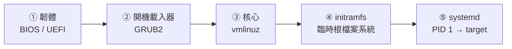

# 開機流程與 GRUB 救援

> [!abstract] 這篇你會學到
> - 把開機拆成**五個階段**，看到卡在哪個畫面就知道問題在哪一層
> - 在 GRUB 選單臨時改核心參數進入救援，而不用 Live USB
> - 管理多個核心：保留幾個、怎麼安全移除、`/boot` 滿了怎麼辦
> - 用 `chroot` 從 Live 環境修復壞掉的 GRUB 與 initramfs
> - 用 `systemd-analyze` 找出開機慢的元凶
> - 理解 UEFI 與 Secure Boot 對自建核心模組（ZFS、NVIDIA）的影響

## 前置知識

- [[17-systemd服務管理]]
- [[15-磁碟分割與掛載]]

---

## 觀念說明

### 五個階段



| 階段 | 做什麼 | 卡住時的畫面 | 常見原因 |
| --- | --- | --- | --- |
| ① 韌體 | 自檢、找開機裝置 | 廠牌 logo 後黑畫面、`No bootable device` | 開機順序、磁碟壞、UEFI 項目遺失 |
| ② GRUB | 顯示選單、載入核心與 initramfs | `grub rescue>`、`error: file not found` | GRUB 設定錯、`/boot` 分割區損壞、UUID 變了 |
| ③ 核心 | 初始化硬體、掛 initramfs | `Kernel panic`、黑畫面無輸出 | 核心檔案損壞、不相容硬體、參數錯 |
| ④ initramfs | 載驅動、找到並掛載真正的根 | `(initramfs)` 提示、`Gave up waiting for root device` | 根裝置 UUID 錯、LVM/RAID/加密未啟動、驅動缺失 |
| ⑤ systemd | 啟動服務到指定 target | `emergency mode`、卡在某個 `Starting ...` | fstab 錯、服務相依卡死、磁碟滿 |

> [!tip] 第一步永遠是「認出卡在哪個階段」
> 五種畫面對應五種完全不同的處置。
> 看到 `grub rescue>` 就不用去查 fstab；看到 `emergency mode` 就不用重裝 GRUB。

### BIOS 與 UEFI

| | BIOS（Legacy） | UEFI |
| --- | --- | --- |
| 分割表 | MBR | **GPT** |
| 開機載入器位置 | MBR 前 440 bytes + 分割區間隙 | **ESP**（EFI System Partition，FAT32，掛在 `/boot/efi`） |
| 開機項目 | 只有「開機順序」 | 韌體內有**開機項目表**（`efibootmgr`） |
| Secure Boot | 無 | 有，只載入已簽章的載入器與核心 |
| 現代預設 | 舊機器、部分 VM | **所有新機器與雲端** |

```bash
[ -d /sys/firmware/efi ] && echo "UEFI 開機" || echo "BIOS 開機"
sudo efibootmgr -v          # UEFI 開機項目
lsblk -f | grep -i efi      # ESP 分割區
```

```
BootCurrent: 0001
BootOrder: 0001,0000
Boot0000* Windows Boot Manager   HD(1,GPT,...)\EFI\Microsoft\Boot\bootmgfw.efi
Boot0001* ubuntu                 HD(1,GPT,...)\EFI\ubuntu\shimx64.efi
```

> [!warning] Secure Boot 與自建模組
> Secure Boot 開啟時，**未簽章的核心模組無法載入**——ZFS（DKMS 編譯）、
> NVIDIA 專有驅動、VirtualBox 都會遇到 `modprobe: Operation not permitted`。
>
> 兩條路：關閉 Secure Boot（簡單，但降低防護），或用 MOK（Machine Owner Key）
> 簽署模組（`mokutil --import`，重開機時在藍色畫面登錄金鑰）。
> Ubuntu 的 DKMS 安裝時通常會自動引導 MOK 流程。

---

## GRUB2

### 設定結構

```
/etc/default/grub          ← 你改這裡（逾時、預設項目、核心參數）
/etc/grub.d/               ← 產生選單的腳本（一般不動）
/boot/grub/grub.cfg        ← 產生出來的，不要手動改（RHEL: /boot/grub2/grub.cfg）
```

```bash
cat /etc/default/grub
```

```
GRUB_DEFAULT=0
GRUB_TIMEOUT_STYLE=hidden
GRUB_TIMEOUT=0
GRUB_DISTRIBUTOR=`lsb_release -i -s 2> /dev/null || echo Debian`
GRUB_CMDLINE_LINUX_DEFAULT="quiet splash"
GRUB_CMDLINE_LINUX=""
```

| 設定 | 說明 |
| --- | --- |
| `GRUB_DEFAULT` | 預設項目（`0` 第一個、`saved` 上次選的） |
| `GRUB_TIMEOUT` | 選單等待秒數；**伺服器建議 5**，`0` 會讓你來不及進選單 |
| `GRUB_TIMEOUT_STYLE` | `hidden` 不顯示選單、`menu` 顯示 |
| `GRUB_CMDLINE_LINUX_DEFAULT` | 一般開機的核心參數 |
| `GRUB_CMDLINE_LINUX` | **所有**開機（含 recovery）都套用的參數 |

> [!tip] 伺服器建議：讓選單看得到、序列主控台可用
> ```
> GRUB_TIMEOUT=5
> GRUB_TIMEOUT_STYLE=menu
> GRUB_CMDLINE_LINUX_DEFAULT=""                 # 拿掉 quiet splash 看得到開機訊息
> GRUB_CMDLINE_LINUX="console=tty0 console=ttyS0,115200n8"   # 實體機接序列埠／IPMI SOL
> GRUB_TERMINAL="console serial"
> GRUB_SERIAL_COMMAND="serial --speed=115200 --unit=0 --word=8 --parity=no --stop=1"
> ```
> `quiet splash` 是桌面用的；伺服器出問題時你需要看到每一行訊息。
> 序列主控台讓 IPMI/iDRAC 的 SOL 或 PVE 的 xterm.js 能看到 GRUB 與核心訊息，
> 見 [[09-伺服器上架與初始設定]]。

**改完一定要重新產生**：

```bash
sudo update-grub                                  # Ubuntu/Debian
sudo grub2-mkconfig -o /boot/grub2/grub.cfg       # RHEL 系（BIOS）
sudo grub2-mkconfig -o /boot/efi/EFI/rocky/grub.cfg   # RHEL 系（UEFI，舊版）
```

> [!warning] 直接編輯 `grub.cfg` 會在下次核心更新時被覆蓋
> 它是產生檔。所有修改走 `/etc/default/grub` 或 `/etc/grub.d/`，再 `update-grub`。

### 進入選單與臨時修改

開機時按住 **`Shift`**（BIOS）或連按 **`Esc`**（UEFI）叫出選單。
`GRUB_TIMEOUT=0` 時很難按到——這就是伺服器要設 5 秒的理由。

在選單上按 **`e`** 編輯該項目，找到 `linux` 開頭那一行，在行尾加參數，
**`Ctrl+X` 或 `F10`** 開機。**這次的修改不會保存**，重開機就恢復。

```
linux /boot/vmlinuz-6.8.0-45-generic root=UUID=... ro quiet splash
                                                     ↑ 在這後面加
```

| 加什麼 | 效果 | 用途 |
| --- | --- | --- |
| `systemd.unit=rescue.target` | 單人模式（有 root shell、基本服務） | 修 fstab、改密碼、修服務 |
| `systemd.unit=emergency.target` | 更少：只掛根（唯讀）、無服務 | 根檔案系統本身有問題 |
| **`init=/bin/bash`** | 跳過 systemd 直接給 shell | **忘記 root 密碼**、systemd 壞了 |
| `rd.break` | 在 initramfs 階段停下（RHEL） | 同上（RHEL 慣用） |
| `nomodeset` | 不載入顯示驅動 | 開機黑畫面 |
| `3` 或 `systemd.unit=multi-user.target` | 不進圖形介面 | 桌面壞了 |
| `enforcing=0` | SELinux 寬容模式（RHEL） | SELinux 擋住開機 |
| `console=ttyS0,115200` | 序列主控台 | 看不到畫面時 |
| 移除 `quiet splash` | 顯示完整訊息 | 看卡在哪 |

> [!tip] 忘記 root 密碼的標準流程（Ubuntu）
> ```
> 1. GRUB 選單按 e，linux 行尾加：  init=/bin/bash
>    （若有 ro 改成 rw，或進去後 mount -o remount,rw /）
> 2. Ctrl+X 開機，得到 root shell
> 3. passwd root            # 或 passwd mike
> 4. 有 SELinux 的系統（RHEL）：touch /.autorelabel
> 5. exec /sbin/init        # 或 sync; reboot -f
> ```
> RHEL 用 `rd.break`：進 initramfs 後 `mount -o remount,rw /sysroot; chroot /sysroot; passwd; touch /.autorelabel; exit; exit`。
>
> **這也代表**：能碰到實體機或主控台的人就能取得 root。
> 機房實體安全與 GRUB 密碼（見下方）是為此存在的。

### 選擇舊核心

Ubuntu 的選單有 **Advanced options for Ubuntu**，裡面列出所有已安裝核心與各自的 recovery mode。
新核心開不了機時，選上一個版本先讓機器起來，再處理。

```bash
# 讓 GRUB 記住你手動選的項目
GRUB_DEFAULT=saved
GRUB_SAVEDEFAULT=true
# 或指定開機到特定核心（一次性）
sudo grub-reboot "Advanced options for Ubuntu>Ubuntu, with Linux 6.8.0-40-generic"
sudo reboot
```

> [!tip] `grub-reboot` 是升級核心前的保險
> 先用它把「下一次」設成已知正常的舊核心，再裝新核心測試：
> 新核心壞了，重開機自動回舊核心。

---

## 核心管理

```bash
uname -r                                          # 執行中的
dpkg -l 'linux-image-*' | awk '/^ii/ {print $2}'  # 已安裝的（RHEL: rpm -q kernel）
ls -lh /boot/vmlinuz-* /boot/initrd.img-*         # 檔案
df -h /boot                                       # 空間
```

```
linux-image-6.8.0-40-generic
linux-image-6.8.0-45-generic
linux-image-generic                               ← 中繼套件，跟著它升級
```

### 保留幾個、怎麼清

Ubuntu 的 `apt autoremove` 會**自動保留執行中與最新的核心**，其餘移除：

```bash
sudo apt autoremove --purge
```

RHEL 系由 `installonly_limit` 控制（預設 3）：

```bash
grep installonly_limit /etc/dnf/dnf.conf
sudo dnf remove --oldinstallonly --setopt installonly_limit=2 kernel
```

> [!danger] 絕對不要手動 `rm /boot/vmlinuz-*`
> 套件資料庫會與現實不一致，`update-grub` 可能仍列出已刪的核心，
> 下次升級也可能失敗。**永遠透過套件管理員移除核心。**
>
> 也不要移除**執行中**的核心：
> ```bash
> uname -r         # 這個不能刪
> ```

### `/boot` 滿了升級失敗

```
gzip: stdout: No space left on device
E: mkinitramfs failure cpio 141 gzip 1
update-initramfs: failed for /boot/initrd.img-6.8.0-45-generic
```

```bash
df -h /boot
sudo apt autoremove --purge            # 先試這個
# 還不夠：找出最舊的核心手動 purge（不是執行中的！）
dpkg -l 'linux-image-*' | awk '/^ii/ {print $2}' | grep -v "$(uname -r)" | head -1 | xargs sudo apt purge -y
sudo update-initramfs -u -k all
sudo update-grub
```

> [!tip] 根本解法：`/boot` 至少 1GB
> 每個核心加 initramfs 約 150～250MB（含 ZFS/NVIDIA 模組更大）。
> 舊安裝常只給 512MB，裝三個核心就滿。新機安裝時 `/boot` 給 1～2GB，
> 或不獨立分割（現代 UEFI + GPT 不需要獨立 `/boot`，只需要 ESP）。

### initramfs

initramfs 是壓縮的臨時根檔案系統，裡面有掛載真正根目錄所需的驅動與工具
（LVM、RAID、加密、網路儲存、檔案系統模組）。

```bash
lsinitramfs /boot/initrd.img-$(uname -r) | head          # 看內容
lsinitramfs /boot/initrd.img-$(uname -r) | grep -E 'zfs|lvm|raid'
sudo update-initramfs -u                                  # 重建目前核心的
sudo update-initramfs -u -k all                           # 全部
sudo update-initramfs -c -k 6.8.0-45-generic              # 建立（不存在時）
```

> [!warning] 改了這些東西要重建 initramfs
> - 加了 LVM / mdadm RAID / 加密 / ZFS 當根檔案系統
> - 改了 `/etc/crypttab`、`/etc/mdadm/mdadm.conf`
> - 裝了新的儲存控制器驅動
> - 改了 `/etc/initramfs-tools/` 下的設定
>
> 忘了重建的症狀：新核心開機卡在 `Gave up waiting for root device`，
> 舊核心正常（因為它的 initramfs 是當時建的）。

> [!info]- Rocky / AlmaLinux（RHEL 系）對照
>
> | 項目 | Debian / Ubuntu | RHEL 系 |
> | --- | --- | --- |
> | GRUB 設定產生 | `update-grub` | `grub2-mkconfig -o /boot/grub2/grub.cfg` |
> | GRUB 目錄 | `/boot/grub/` | `/boot/grub2/` |
> | 一次性開機到指定項目 | `grub-reboot` | `grub2-reboot` |
> | 預設核心 | GRUB 選單順序 | `grubby --set-default /boot/vmlinuz-...` |
> | 核心參數工具 | 編輯 `/etc/default/grub` | **`grubby --update-kernel=ALL --args="..."`** |
> | initramfs 工具 | `update-initramfs`（initramfs-tools） | **`dracut -f`** |
> | 救援參數 | `init=/bin/bash` | **`rd.break`** |
> | 核心數量 | `apt autoremove` 保留 2 | `installonly_limit=3` |
> | 開機 target 設定 | `systemctl set-default` | 相同 |
> | SELinux 重新標籤 | 不適用 | 改密碼後 `touch /.autorelabel` |
>
> ```bash
> # RHEL 常用
> sudo grubby --info=ALL
> sudo grubby --update-kernel=ALL --args="console=ttyS0,115200"
> sudo dracut -f --regenerate-all
> ```

---

## systemd 開機階段

### target

```bash
systemctl get-default                     # 預設進哪個 target
sudo systemctl set-default multi-user.target    # 伺服器：無圖形介面
systemctl list-units --type=target        # 目前啟用的
```

| target | 等同舊 runlevel | 用途 |
| --- | --- | --- |
| `rescue.target` | 1 | 單人模式，root shell |
| `multi-user.target` | 3 | **伺服器標準** |
| `graphical.target` | 5 | 桌面 |
| `emergency.target` | — | 最少化，根唯讀 |

```bash
sudo systemctl isolate rescue.target     # 執行中切換（會踢掉所有登入）
sudo systemctl rescue                     # 同上
```

### 開機慢：找元凶

```bash
systemd-analyze                           # 各階段總耗時
systemd-analyze blame | head -15          # 各服務耗時排序
systemd-analyze critical-chain            # 關鍵路徑
systemd-analyze plot > boot.svg           # 視覺化
```

```
Startup finished in 8.2s (firmware) + 3.1s (loader) + 4.5s (kernel) + 42.3s (userspace) = 58.1s
```

```bash
systemd-analyze blame | head -5
```

```
35.412s systemd-networkd-wait-online.service
 4.201s snapd.service
 2.844s cloud-init.service
```

> [!tip] 開機慢八成是「在等網路」
> `systemd-networkd-wait-online` 或 `NetworkManager-wait-online` 卡 30 秒以上，
> 通常是某個介面設了 DHCP 但沒接線、或 netplan 定義了不存在的介面。
> ```bash
> sudo systemctl disable systemd-networkd-wait-online.service    # 不需要等網路時
> # 或只等特定介面
> sudo systemctl edit systemd-networkd-wait-online.service
> # [Service]
> # ExecStart=
> # ExecStart=/lib/systemd/systemd-networkd-wait-online --interface=eth0
> ```

### 上次開機的日誌

```bash
sudo journalctl -b -1 -e                  # 需要 journal 持久化（見 19 篇）
sudo journalctl -b -1 -p err
sudo journalctl --list-boots
last -x reboot shutdown | head            # 重開機與關機紀錄
```

---

## 從 Live 環境修復（chroot）

GRUB 壞了、initramfs 壞了、連救援模式都進不去時，用 Live USB（或 VPS 的 rescue 模式）
掛載系統並 `chroot` 進去，就能像正常開機一樣執行修復指令。

```bash
# ── 1. 找到根分割區與 ESP ──
lsblk -f
# 假設根在 /dev/sda2、ESP 在 /dev/sda1（UEFI）

# ── 2. 掛載 ──
sudo mount /dev/sda2 /mnt
sudo mount /dev/sda1 /mnt/boot/efi          # UEFI 才需要
# 若有獨立 /boot：sudo mount /dev/sdaX /mnt/boot
# 若根是 LVM：sudo vgchange -ay 後掛 /dev/vg/root

# ── 3. 綁定虛擬檔案系統（chroot 內的工具需要）──
for d in dev dev/pts proc sys run; do sudo mount --bind "/$d" "/mnt/$d"; done
sudo mount --bind /sys/firmware/efi/efivars /mnt/sys/firmware/efi/efivars 2>/dev/null || true

# ── 4. 進入 ──
sudo chroot /mnt /bin/bash

# ── 5. 現在你「在」那個系統裡，執行修復 ──
grub-install /dev/sda                       # BIOS：重裝 GRUB 到 MBR
grub-install --target=x86_64-efi --efi-directory=/boot/efi --bootloader-id=ubuntu   # UEFI
update-grub
update-initramfs -u -k all
# 順便：passwd、修 fstab、apt --fix-broken install ...

# ── 6. 離開並卸載 ──
exit
for d in run sys proc dev/pts dev; do sudo umount "/mnt/$d"; done
sudo umount /mnt/boot/efi; sudo umount /mnt
sudo reboot
```

> [!tip] Ubuntu 有 `boot-repair` 圖形工具
> Live USB 上 `sudo add-apt-repository ppa:yannubuntu/boot-repair && sudo apt install boot-repair`，
> 一鍵做完上面大部分事情，並產生診斷報告。伺服器還是要會手動流程。

> [!warning] chroot 前確認架構與位元數一致
> 用 64 位元 Live 修 64 位元系統。`chroot` 說 `Exec format error` 就是架構不合。

### GRUB rescue 提示

```
grub rescue>
```

代表 GRUB 第一階段載入了，但找不到 `/boot/grub`（分割區改了、UUID 變了）。

```
grub rescue> ls                              # 列出分割區
(hd0) (hd0,gpt1) (hd0,gpt2)
grub rescue> ls (hd0,gpt2)/                  # 逐一找哪個有 /boot/grub
grub rescue> set root=(hd0,gpt2)
grub rescue> set prefix=(hd0,gpt2)/boot/grub
grub rescue> insmod normal
grub rescue> normal                          # 進入正常選單
```

開進系統後**立刻**重裝 GRUB（`grub-install` + `update-grub`），否則下次還是一樣。

---

## 完整實戰範例：核心升級的安全流程

```bash
#!/usr/bin/env bash
# safe-kernel-upgrade.sh — 升級核心並保留自動回退
set -euo pipefail

CURRENT=$(uname -r)
echo "目前核心：$CURRENT"

# 1. 空間檢查
avail=$(df --output=avail -m /boot | tail -1)
(( avail > 300 )) || { echo "/boot 只剩 ${avail}MB，先清理"; sudo apt autoremove --purge; }

# 2. 記下目前核心的 GRUB 項目名稱，設為「下一次開機」的保險
ENTRY=$(grep -oP "menuentry '\K[^']*$CURRENT[^']*" /boot/grub/grub.cfg | head -1)
SUB=$(grep -oP "submenu '\K[^']*" /boot/grub/grub.cfg | head -1)
echo "保險項目：$SUB>$ENTRY"

# 3. 升級
sudo apt-get update -qq
sudo apt-get install -y linux-image-generic linux-headers-generic

NEW=$(dpkg -l 'linux-image-[0-9]*' | awk '/^ii/ {print $2}' | sed 's/linux-image-//' | sort -V | tail -1)
echo "新核心：$NEW"
[ "$NEW" != "$CURRENT" ] || { echo "沒有新核心，結束"; exit 0; }

# 4. 確認 initramfs 與 GRUB 都有新核心
ls -l "/boot/initrd.img-$NEW" "/boot/vmlinuz-$NEW"
grep -q "$NEW" /boot/grub/grub.cfg || sudo update-grub

# 5. DKMS 模組（ZFS、NVIDIA）有沒有為新核心編好？
if command -v dkms >/dev/null; then
    dkms status | grep -E "$NEW.*installed" || echo "⚠ 有 DKMS 模組尚未為 $NEW 建置，檢查 dkms status"
fi

# 6. 排一個「10 分鐘後若沒人取消就回舊核心」——不需要，GRUB 預設會用新核心；
#    反過來：這次先用新核心試，失敗時人工在選單選舊的。
#    若機器在遠端沒主控台，改成先把預設固定在舊核心：
# sudo grub-set-default "$SUB>$ENTRY"

echo "重開機後執行 uname -r 確認；若開不起來，GRUB 選單選：$SUB>$ENTRY"
echo "確認新核心正常後再 apt autoremove --purge 清舊核心。"
```

> [!tip] 遠端無主控台的機器，核心升級的保守做法
> 1. `grub-set-default` 固定到**舊**核心
> 2. `grub-reboot` 指定**下一次**用新核心
> 3. 重開機——新核心壞了，再重開一次（`sudo reboot` 進不去時用 IPMI 硬重啟）就自動回舊核心
> 4. 新核心穩定跑一週後再把預設換過去

---

## 常見錯誤與排錯

| 現象 | 階段 | 原因 | 解法 |
| --- | --- | --- | --- |
| `No bootable device` | ① | 開機順序、磁碟故障、UEFI 項目遺失 | 韌體設定檢查；`efibootmgr -c` 重建項目 |
| `grub rescue>` | ② | 找不到 `/boot/grub` | rescue 提示手動 `set prefix` 進系統後 `grub-install` |
| `error: file '/boot/vmlinuz-...' not found` | ② | 核心檔被刪或 `/boot` 沒掛 | 選舊核心；chroot 重裝核心 |
| `Kernel panic - not syncing: VFS: Unable to mount root fs` | ③④ | initramfs 缺驅動或根 UUID 錯 | 選舊核心；`update-initramfs -u`；檢查 `root=` 參數 |
| `Gave up waiting for root device` + `(initramfs)` | ④ | LVM/RAID 未啟動、UUID 變 | initramfs 內 `vgchange -ay`；修 GRUB 的 `root=`；重建 initramfs |
| `emergency mode` | ⑤ | fstab 錯、根唯讀 | `journalctl -xb`；`findmnt --verify`；`mount -o remount,rw /` |
| 卡在 `A start job is running for ...` 90 秒 | ⑤ | 某服務或掛載等逾時 | 等它逾時；用 `nofail` / `x-systemd.device-timeout` |
| 開機黑畫面無訊息 | ③ | 顯示驅動或 `quiet splash` | 加 `nomodeset`；移除 `quiet splash` |
| 新核心開不了，舊的正常 | ③④ | DKMS 模組未建、initramfs 不完整 | 用舊核心開機後 `dkms autoinstall`、`update-initramfs -u -k all` |
| `/boot` 滿導致升級失敗 | — | 舊核心堆積 | `apt autoremove --purge`；`/boot` 給 1GB+ |
| `modprobe: Operation not permitted` | ③ | Secure Boot 擋未簽章模組 | MOK 簽署或關閉 Secure Boot |
| 改了 `grub.cfg` 又被還原 | ② | 直接編輯產生檔 | 改 `/etc/default/grub` 後 `update-grub` |
| `GRUB_TIMEOUT=0` 進不了選單 | ② | 沒時間按鍵 | 開機瞬間長按 Shift/Esc；之後改成 5 |
| 開機要一分鐘 | ⑤ | `wait-online` 等不存在的網路 | `systemd-analyze blame`；停用或限定介面 |
| 重開後 `journalctl -b -1` 沒東西 | ⑤ | journal 未持久化 | `mkdir /var/log/journal`（見 [[19-日誌系統]]） |

---

## 安全性注意事項

> [!danger] 能碰到 GRUB 選單就能拿 root
> `init=/bin/bash` 不需要任何密碼。防護分三層：
> 1. **實體安全**：機房門禁、機櫃上鎖（見 [[13-機房實體安全]]）
> 2. **韌體密碼 + 關閉 USB 開機**：防止用 Live USB 繞過
> 3. **GRUB 密碼**：編輯選單項目需要密碼
>
> ```bash
> # 產生雜湊
> grub-mkpasswd-pbkdf2
> # /etc/grub.d/40_custom 加入
> set superusers="admin"
> password_pbkdf2 admin grub.pbkdf2.sha512.10000.XXXX...
> # 讓一般開機不需密碼、只有編輯（e）與指令列（c）需要
> sudo sed -i 's/CLASS="--class gnu-linux --class gnu --class os"/CLASS="--class gnu-linux --class gnu --class os --unrestricted"/' /etc/grub.d/10_linux
> sudo update-grub
> ```
> 這是 TWGCB / CIS 的檢查項目。但**設了 GRUB 密碼就要妥善保管**——
> 忘了等於自己被鎖在救援模式外。

> [!warning] Secure Boot 是防護，不是阻礙
> 關閉 Secure Boot 讓 bootkit 類的攻擊變可行。伺服器若必須用未簽章模組，
> 優先走 MOK 簽署，把關閉 Secure Boot 當最後手段並記錄在文件裡。

> [!tip] 磁碟加密的機器，救援時需要金鑰
> LUKS 加密的根分割區在 initramfs 階段解鎖。Live 環境修復要先
> `cryptsetup open /dev/sda2 root` 再掛 `/dev/mapper/root`。
> 金鑰保管流程見 [[03-機密管理與金鑰保護]]。

---

## 速查表

### 判斷階段

| 畫面 | 階段 | 第一步 |
| --- | --- | --- |
| 廠牌 logo 後停住 / `No bootable device` | 韌體 | 開機順序、`efibootmgr` |
| `grub rescue>` | GRUB | `ls` 找分割區、`set prefix`、`normal` |
| `Kernel panic` | 核心 | 選舊核心 |
| `(initramfs)` | initramfs | `vgchange -ay`、檢查 `root=` |
| `emergency mode` | systemd | `journalctl -xb`、`findmnt --verify` |

### GRUB

| 指令 / 設定 | 說明 |
| --- | --- |
| 開機按 `Shift` / `Esc` | 叫出選單 |
| 選單按 `e` → `Ctrl+X` | 臨時改參數開機 |
| `init=/bin/bash` | 跳過 systemd 拿 root shell |
| `systemd.unit=rescue.target` | 單人模式 |
| `nomodeset` | 顯示驅動問題 |
| `/etc/default/grub` → `update-grub` | 永久修改 |
| `GRUB_TIMEOUT=5` | 伺服器建議 |
| `grub-reboot "項目"` | 下次開機用指定項目 |
| `grub-set-default "項目"` | 永久預設 |
| `grub-install` + `update-grub` | 重裝 |
| `grubby --update-kernel=ALL --args=` | RHEL 改核心參數 |

### 核心與 initramfs

| 指令 | 說明 |
| --- | --- |
| `uname -r` | 執行中核心（**不可刪**） |
| `dpkg -l 'linux-image-*'` / `rpm -q kernel` | 已安裝 |
| `apt autoremove --purge` | 清舊核心（Ubuntu） |
| `dnf remove --oldinstallonly` | 清舊核心（RHEL） |
| `update-initramfs -u -k all` / `dracut -f --regenerate-all` | 重建 initramfs |
| `lsinitramfs <檔>` | 看 initramfs 內容 |
| `dkms status` | 第三方模組建置狀態 |
| `mokutil --sb-state` | Secure Boot 狀態 |

### systemd 開機

| 指令 | 說明 |
| --- | --- |
| `systemctl get-default` / `set-default multi-user.target` | 預設 target |
| `systemd-analyze` / `blame` / `critical-chain` | 開機耗時 |
| `journalctl -b -1` | 上次開機日誌 |
| `last -x reboot shutdown` | 重開機紀錄 |

### chroot 修復

```bash
mount /dev/sdaX /mnt; mount /dev/sdaESP /mnt/boot/efi
for d in dev dev/pts proc sys run; do mount --bind /$d /mnt/$d; done
chroot /mnt
grub-install ...; update-grub; update-initramfs -u -k all
```

---

## 練習題

> [!question]- 練習 1：從 GRUB 進入救援並改密碼
> 在練習機上不用 Live USB，透過 GRUB 進入 root shell 並改掉 root 密碼。
>
> **解答**
>
> 1. 重開機，開機瞬間按住 `Shift`（或連按 `Esc`）進 GRUB 選單
> 2. 在第一個項目按 `e`，找到 `linux` 行，把 `ro quiet splash` 改成 `rw init=/bin/bash`
> 3. `Ctrl+X`，得到 `root@(none):/#` 提示
> 4. `passwd root`（或 `passwd mike`）
> 5. `sync; reboot -f`（沒有 systemd，`reboot` 可能無效）
>
> 若第 3 步得到唯讀根：`mount -o remount,rw /`。
> 這個練習的教訓寫在「安全性注意事項」：**實體存取 = root**。
> 練完把 `GRUB_TIMEOUT` 改成 5 並 `update-grub`，之後才好操作。

> [!question]- 練習 2：故意弄壞 initramfs 再修好
> 在有快照的練習機上，刪掉目前核心的 initramfs，重開機觀察，然後修復。
>
> **解答**
>
> ```bash
> sudo cp /boot/initrd.img-$(uname -r) /root/initrd.bak     # 保險
> sudo rm /boot/initrd.img-$(uname -r)
> sudo reboot
> ```
> GRUB 會報 `error: file '/boot/initrd.img-...' not found` 然後停在 `Press any key`。
>
> 修法一（有舊核心）：選單選 Advanced options → 舊核心開機 → `sudo update-initramfs -c -k <版本>`。
> 修法二（只有一個核心）：Live USB → 依「從 Live 環境修復」章節 chroot → `update-initramfs -c -k all`。
>
> **學到**：initramfs 是可重建的產生物；以及為什麼要保留至少兩個核心。

> [!question]- 練習 3：找出開機慢的原因
> 用 `systemd-analyze` 找出你機器上開機最慢的三個服務，判斷哪些可以停用。
>
> **解答**
>
> ```bash
> systemd-analyze
> systemd-analyze blame | head -3
> systemd-analyze critical-chain
> ```
> 典型判斷：
> - `*-wait-online` 幾十秒 → 有介面等不到 DHCP；限定介面或停用
> - `snapd` / `apt-daily` 幾秒 → 伺服器可延後或停用 timer
> - `cloud-init` → 雲端機器必要，實體機可停用
> - `plymouth` → 伺服器不需要開機畫面
>
> 停用前確認相依：`systemctl list-dependencies --reverse <服務>`。
> 目標不是「最快」，是「沒有在等不存在的東西」。

---

## 小測驗

Q1. 開機分哪五個階段？看到 `grub rescue>` 與 `emergency mode` 各代表卡在哪一層？
Q2. 怎麼判斷機器是 BIOS 還是 UEFI 開機？ESP 是什麼、掛在哪？
Q3. 為什麼伺服器不建議 `GRUB_TIMEOUT=0` 與 `quiet splash`？
Q4. 直接編輯 `/boot/grub/grub.cfg` 會怎樣？正確流程？
Q5. 在 GRUB 選單按 `e` 加的參數會保存嗎？`init=/bin/bash` 做什麼？
Q6. 忘記 root 密碼時 Ubuntu 與 RHEL 各用什麼參數？RHEL 改完密碼還要做什麼？
Q7. 為什麼不能 `rm /boot/vmlinuz-*` 清舊核心？正確指令（兩系）？
Q8. 新核心卡在 `Gave up waiting for root device` 而舊核心正常，最可能的原因？
Q9. Secure Boot 開啟時 ZFS/NVIDIA 模組 `Operation not permitted`，兩條解法？
Q10. `systemd-analyze blame` 顯示 `wait-online` 35 秒，代表什麼？怎麼處理？

> [!question]- 測驗答案
> **Q1.** 韌體→GRUB→核心→initramfs→systemd；`grub rescue>` 是第②層找不到 `/boot/grub`，`emergency mode` 是第⑤層（多半 fstab）（見「五個階段」）。
> **Q2.** `[ -d /sys/firmware/efi ]`；EFI System Partition，FAT32，掛在 `/boot/efi`，放開機載入器。
> **Q3.** 0 秒來不及進選單無法選舊核心或救援；`quiet splash` 隱藏開機訊息，出問題看不到卡在哪。
> **Q4.** 下次核心更新被覆蓋；改 `/etc/default/grub` 或 `/etc/grub.d/` 後 `update-grub`（RHEL `grub2-mkconfig`）。
> **Q5.** 不保存，只影響這一次；跳過 systemd 直接執行 bash 取得 root shell，不需密碼。
> **Q6.** Ubuntu `init=/bin/bash`（配 `rw`）；RHEL `rd.break` 後 `chroot /sysroot`；RHEL 要 `touch /.autorelabel` 讓 SELinux 重新標籤。
> **Q7.** 套件資料庫與現實不一致，GRUB 可能仍列出、之後升級失敗；`apt autoremove --purge` / `dnf remove --oldinstallonly`。
> **Q8.** 新核心的 initramfs 缺驅動或未為新核心建 DKMS 模組（LVM/RAID/ZFS）；用舊核心開機後 `dkms autoinstall` 與 `update-initramfs -u -k all`。
> **Q9.** 用 MOK 簽署模組（`mokutil --import`，重開機登錄），或關閉 Secure Boot（降低防護，最後手段）。
> **Q10.** 某介面等 DHCP 等不到或 netplan 定義了不存在的介面；限定 `--interface=eth0` 或停用該服務。

---

## 延伸閱讀

- [[17-systemd服務管理]] — target 與服務相依
- [[15-磁碟分割與掛載]] — fstab、UUID 與 emergency mode
- [[19-日誌系統]] — journal 持久化才看得到上次開機
- [[23-Linux常見疑難排解]] — 開不了機的整體排查流程
- [[26-核心模組與sysctl調校]] — 核心參數與模組管理
- [[09-伺服器上架與初始設定]] — 序列主控台與 IPMI
- [[13-機房實體安全]] — 實體存取即 root 的防護
- `man 8 grub-install` / `man 8 update-initramfs` / `man 7 bootup` / `man 1 systemd-analyze`
