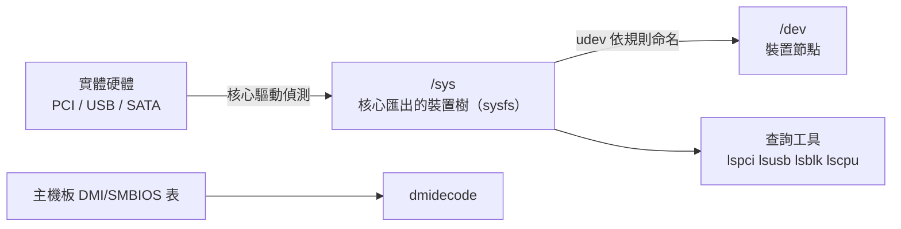

# 硬體資訊與裝置管理

> [!abstract] 這篇你會學到
> - 不開機殼就查出 CPU、記憶體插槽、主機板、網卡、磁碟的**型號與序號**
> - 用 `dmidecode` 讀出資產盤點需要的**服務標籤（Service Tag）與保固識別碼**
> - 看懂 `/dev`、`/sys`、udev 三者的關係，以及網卡為什麼叫 `enp3s0` 而不是 `eth0`
> - 寫 udev 規則固定裝置名稱、限制 USB 儲存裝置
> - 監看溫度、風扇、電源，與 [[10-機房巡檢與紀錄]] 銜接
> - 產出一份可交給盤點系統的硬體清單

## 前置知識

- [[04-檔案系統與目錄結構]]

---

## 觀念說明

### 三層：硬體 → 核心 → 使用者空間



| 來源 | 內容 | 工具 |
| --- | --- | --- |
| `/proc/cpuinfo`、`/proc/meminfo` | CPU、記憶體用量 | `lscpu`、`free` |
| `/sys/` | 所有核心偵測到的裝置 | `lspci`、`lsusb`、`lsblk`、`ip link` |
| **DMI / SMBIOS**（主機板韌體表） | **型號、序號、記憶體插槽、BIOS 版本** | **`dmidecode`** |
| SMART | 磁碟健康 | `smartctl`（見 [[15-磁碟分割與掛載]]） |
| 感測晶片 | 溫度、風扇、電壓 | `sensors` |
| IPMI/BMC | 帶外的硬體狀態 | `ipmitool`（見 [[09-伺服器上架與初始設定]]） |

> [!tip] 盤點要的是「序號」，`/proc` 沒有
> `/proc/cpuinfo` 告訴你 CPU 型號但不會有機器序號；
> 記憶體幾條、每條多大、插在哪個插槽、有沒有空槽——只有 **`dmidecode`** 知道。
> 這是為什麼盤點腳本一定要 root。

---

## 基礎操作

### 整體概覽

```bash
sudo apt install -y lshw inxi dmidecode pciutils usbutils lm-sensors smartmontools
hostnamectl                              # 主機名、OS、核心、虛擬化類型
sudo lshw -short                         # 硬體樹狀摘要
inxi -Fxz                                # 一頁式報告（-z 遮蔽序號，給外人看用）
```

```bash
hostnamectl | grep -E 'Chassis|Virtualization|Hardware'
```

```
         Chassis: server
  Virtualization: kvm            ← 這是 VM
 Hardware Vendor: QEMU
  Hardware Model: Standard PC (Q35 + ICH9, 2009)
```

> [!tip] 先確認是不是虛擬機
> ```bash
> systemd-detect-virt            # kvm / vmware / microsoft / none
> ```
> VM 上 `dmidecode`、`sensors`、`smartctl` 的結果大多是模擬或空的，
> 硬體問題要到宿主機（PVE）上查。見 [[10-PVE-監控與資源調校]]。

### CPU

```bash
lscpu
lscpu | grep -E 'Model name|^CPU\(s\)|Thread|Core|Socket|MHz|Virtualization|Flags' 
nproc                                    # 可用邏輯核心數
cat /proc/cpuinfo | grep -c processor
```

```
Model name:            Intel(R) Xeon(R) Silver 4314 CPU @ 2.40GHz
CPU(s):                32
Thread(s) per core:    2
Core(s) per socket:    16
Socket(s):             1
Virtualization:        VT-x
```

| 欄位 | 意義 |
| --- | --- |
| `Socket(s)` × `Core(s) per socket` | 實體核心數 |
| × `Thread(s) per core` | 邏輯核心數（`CPU(s)`） |
| `Virtualization: VT-x / AMD-V` | **能跑 KVM / PVE**；VM 裡看到代表已開巢狀虛擬化 |
| Flags 含 `aes` `avx2` `sse4_2` | 影響加密與壓縮效能 |

```bash
# 微碼與漏洞緩解狀態（安全稽核）
grep -E 'microcode' /proc/cpuinfo | head -1
grep . /sys/devices/system/cpu/vulnerabilities/*
```

```
/sys/devices/system/cpu/vulnerabilities/meltdown:Mitigation: PTI
/sys/devices/system/cpu/vulnerabilities/spectre_v2:Mitigation: Enhanced IBRS
```

> [!warning] `Vulnerable` 代表沒有緩解
> 通常是 BIOS 韌體或 `intel-microcode` / `amd64-microcode` 套件太舊。
> ```bash
> sudo apt install -y intel-microcode     # 或 amd64-microcode
> ```
> 重開機後再看。這是資安稽核會查的項目。

### 記憶體

```bash
free -h                                  # 用量
sudo dmidecode -t memory | grep -E 'Size|Locator|Speed|Type:|Part Number|Serial' | grep -v 'No Module'
sudo lshw -short -C memory
```

```
        Size: 32 GB
        Locator: DIMM_A1
        Type: DDR4
        Speed: 3200 MT/s
        Part Number: M393A4K40DB3-CWE
        Serial Number: 0A1B2C3D
        Size: No Module Installed        ← 空插槽
        Locator: DIMM_A2
```

```bash
# 幾個插槽、幾個有插、最大支援
sudo dmidecode -t memory | grep -cE '^\s+Size: [0-9]'         # 已插
sudo dmidecode -t memory | grep -c 'No Module Installed'       # 空的
sudo dmidecode -t 16 | grep -E 'Maximum Capacity|Number Of Devices'
```

> [!tip] 擴充記憶體前一定要看這三件事
> 1. 空插槽數（`No Module Installed`）
> 2. 現有記憶體的 `Type`、`Speed`、`Part Number`——混插不同規格會降速或不開機
> 3. `Maximum Capacity`——主機板上限
>
> ECC 支援：`sudo dmidecode -t memory | grep -i 'Error Correction'`；
> 伺服器應該是 `Multi-bit ECC`。ECC 錯誤紀錄看 `sudo edac-util -v` 或 `dmesg | grep -i edac`。

### 主機板、機器序號、BIOS

```bash
sudo dmidecode -t system                 # 廠牌、型號、序號、UUID
sudo dmidecode -t baseboard              # 主機板
sudo dmidecode -t bios                   # BIOS 版本與日期
sudo dmidecode -t chassis | grep -E 'Type|Asset|Serial'
sudo dmidecode -s system-serial-number   # -s 直接取單一欄位（腳本用）
sudo dmidecode -s system-product-name
sudo dmidecode -s bios-version
```

```
System Information
        Manufacturer: Dell Inc.
        Product Name: PowerEdge R650
        Serial Number: ABC1234          ← Dell 的 Service Tag，查保固就靠它
        UUID: 4c4c4544-0041-4210-8043-c2c04f313233
```

> [!tip] 查保固的三個廠牌識別碼
> | 廠牌 | 欄位 | 到哪查 |
> | --- | --- | --- |
> | Dell | `Serial Number` = **Service Tag** | dell.com/support 輸入 Tag |
> | HPE | `Serial Number` + `Product Number`（`dmidecode -t system` 的 SKU） | support.hpe.com |
> | Lenovo | `Serial Number` + `Product Name`（機型） | pcsupport.lenovo.com |
> | Supermicro | 主機板序號（`-t baseboard`） | 經銷商 |
>
> 這些欄位就是 [[11-資訊設備盤點]] 清冊的主鍵。

```bash
# BIOS 版本比對（韌體更新前後）
sudo dmidecode -s bios-version; sudo dmidecode -s bios-release-date
```

### PCI 裝置：網卡、RAID 卡、GPU

```bash
lspci                                    # 全部
lspci -nn | grep -iE 'ethernet|network'  # 網卡（含 vendor:device ID）
lspci -nn | grep -iE 'raid|sas|sata|nvme'
lspci -nn | grep -iE 'vga|3d|display'
lspci -v -s 03:00.0                      # 單一裝置詳細（含使用的驅動）
lspci -k                                 # 每個裝置用哪個核心模組
```

```
03:00.0 Ethernet controller [0200]: Intel Corporation I350 Gigabit Network Connection [8086:1521] (rev 01)
        Subsystem: Dell I350 Gigabit Network Connection [1028:1f60]
        Kernel driver in use: igb
        Kernel modules: igb
```

> [!tip] `[8086:1521]` 這組 ID 是查驅動的鑰匙
> 裝置沒被認出來（`lspci -k` 沒有 `Kernel driver in use`）時，
> 用 vendor:device ID 去搜尋該用哪個模組、核心哪個版本才支援。
> `lspci -nn` 一定要帶 `-nn` 才看得到 ID。

### 網卡細節

```bash
ip -br link                              # 介面與 MAC
sudo ethtool eth0                        # 速率、雙工、連線狀態
sudo ethtool -i eth0                     # 驅動與韌體版本
sudo ethtool -S eth0 | grep -iE 'error|drop|crc' | grep -v ': 0$'   # 錯誤統計
sudo ethtool -p eth0 10                  # 讓埠的 LED 閃 10 秒——找實體埠用
cat /sys/class/net/eth0/address          # MAC
cat /sys/class/net/eth0/speed
```

```
Settings for eth0:
        Speed: 1000Mb/s
        Duplex: Full
        Auto-negotiation: on
        Link detected: yes
```

> [!tip] `ethtool -p` 是機房裡最好用的指令之一
> 機櫃後面十幾條線，要拔哪一條？`sudo ethtool -p eth0 30` 讓那個埠的燈閃 30 秒。
> 見 [[08-結構化佈線與標籤規範]]。

> [!warning] 速率不對是線材或協商問題
> 接在 Gb 交換器上卻 `Speed: 100Mb/s`，先換線（Cat5 舊線、水晶頭接觸不良），
> 再看交換器埠有沒有被固定速率。`ethtool -S` 的 `crc_errors` 持續增加也是線材問題。

### USB 與其他

```bash
lsusb                                    # USB 裝置
lsusb -t                                 # 樹狀（看接在哪個 hub、速度）
lsusb -v -d 0781:5583 | grep -iE 'idVendor|idProduct|iSerial|bcdUSB'
sudo dmesg -w                            # 即時看插拔事件
```

### 磁碟

```bash
lsblk -o NAME,SIZE,TYPE,MODEL,SERIAL,ROTA,TRAN,MOUNTPOINTS
sudo smartctl -i /dev/sda                # 型號、序號、韌體
sudo smartctl -H /dev/sda                # 健康
sudo nvme list                           # NVMe（需 nvme-cli）
sudo nvme smart-log /dev/nvme0           # NVMe 健康與壽命
```

```
NAME  SIZE TYPE MODEL                 SERIAL          ROTA TRAN
sda   3.6T disk WDC WD40EFRX-68N32N0  WD-WCC7K1234567    1 sata    ← ROTA=1 機械
nvme0n1 931G disk Samsung SSD 980 PRO S6B2NL0T123456    0 nvme    ← 0 = SSD
```

> [!tip] `ROTA` 與 `TRAN` 決定調校方向
> `ROTA=1` 是機械碟（I/O 排程、`noatime` 影響大），`0` 是 SSD/NVMe（要開 TRIM：`fstrim.timer`）。
> `TRAN` 看接在 SATA、SAS 還是 NVMe，影響效能預期與可換的型號。

### 溫度、風扇、電源

```bash
sudo sensors-detect --auto               # 第一次：偵測感測晶片並載入模組
sensors                                  # 溫度、風扇、電壓
watch -n 2 sensors
cat /sys/class/thermal/thermal_zone*/temp    # 沒有 sensors 時的備案（毫度 C）
sudo smartctl -A /dev/sda | grep -i temp     # 磁碟溫度
sudo nvme smart-log /dev/nvme0 | grep -i temp
```

```
coretemp-isa-0000
Package id 0:  +52.0°C  (high = +85.0°C, crit = +95.0°C)
Core 0:        +49.0°C
nct6798-isa-0290
fan1:         1250 RPM
+12V:         +12.10 V
```

> [!warning] 什麼溫度該擔心
> | 元件 | 正常 | 警戒 |
> | --- | --- | --- |
> | CPU（負載下） | 40～70°C | 持續 >80°C |
> | 機械硬碟 | 25～45°C | >50°C（壽命明顯縮短） |
> | NVMe | 30～60°C | >70°C 會降速（throttle） |
>
> 整機溫度偏高先看機房空調與機櫃氣流（[[02-空調系統與溫溼度監控]]），
> 單一元件偏高看散熱膏、風扇、灰塵。把 `sensors` 輸出接進監控，見 [[03-系統監控與告警]]。

伺服器的電源與風扇狀態通常在 BMC：

```bash
sudo ipmitool sdr type Temperature
sudo ipmitool sdr type Fan
sudo ipmitool sdr type 'Power Supply'
sudo ipmitool sel list | tail            # 硬體事件日誌（記憶體錯誤、電源故障）
```

> [!tip] `ipmitool sel list` 是硬體故障的「黑盒子」
> 記憶體 ECC 錯誤、電源模組失效、風扇停轉、機殼被開——BMC 都記在 SEL。
> 機器不明原因重開機時，除了 [[19-日誌系統]] 的 journal，一定要看 SEL。

---

## 進階用法：udev 與裝置命名

### 為什麼網卡叫 `enp3s0`

傳統 `eth0`/`eth1` 依偵測順序命名，多網卡機器重開機後可能對調。
systemd 的**可預測命名**依實體位置命名：

| 名稱 | 意義 |
| --- | --- |
| `enp3s0` | **en**（乙太）**p3**（PCI bus 3）**s0**（slot 0） |
| `eno1` | 主機板內建（onboard）第 1 埠 |
| `ens192` | PCI 熱插拔插槽 192（VMware 常見） |
| `wlp2s0` | 無線 |
| `eth0` | 舊式或 VM/容器（無實體位置資訊時） |

```bash
udevadm info /sys/class/net/enp3s0 | grep -E 'ID_NET_NAME|ID_PATH'
```

> [!tip] 想要好記的名稱：用 udev 規則依 MAC 改名
> ```bash
> sudo tee /etc/udev/rules.d/70-net-names.rules > /dev/null <<'R'
> SUBSYSTEM=="net", ACTION=="add", ATTR{address}=="00:15:5d:01:00:02", NAME="lan0"
> SUBSYSTEM=="net", ACTION=="add", ATTR{address}=="00:15:5d:01:00:03", NAME="wan0"
> R
> sudo update-initramfs -u && sudo reboot
> ```
> 命名後 netplan / nmcli 設定也要跟著改介面名稱。
> **不要**改回 `eth0` 這類名稱——它會與核心的臨時命名衝突。

### udev 基本觀念

udev 監聽核心的裝置事件，依 `/etc/udev/rules.d/` 的規則**命名、設權限、建符號連結、執行腳本**。

```bash
udevadm info -a /dev/sdb | head -40      # 這個裝置的所有可用屬性（寫規則用）
udevadm info -q all -n /dev/sdb
udevadm monitor                          # 即時看事件（插拔測試）
sudo udevadm control --reload            # 改規則後重載
sudo udevadm trigger                     # 重新觸發（不用重開機）
udevadm test /sys/class/net/eth0 2>&1 | tail   # 模擬規則套用
```

**規則語法**：`比對條件==值, ..., 動作=值`

```bash
# 例：特定 USB 序列埠固定叫 /dev/ttyUPS，並讓 dialout 群組可用
sudo tee /etc/udev/rules.d/99-ups.rules > /dev/null <<'R'
SUBSYSTEM=="tty", ATTRS{idVendor}=="0665", ATTRS{idProduct}=="5161", SYMLINK+="ttyUPS", GROUP="dialout", MODE="0660"
R
sudo udevadm control --reload && sudo udevadm trigger
ls -l /dev/ttyUPS
```

> [!tip] 這是 UPS 監控的前置
> UPS 的 USB 埠每次插拔可能變成 `ttyUSB0`、`ttyUSB1`；固定成 `/dev/ttyUPS`
> 之後 NUT / apcupsd 設定就不會失效。見 [[06-UPS安裝與監控設定]]。

### 用 udev 限制 USB 儲存裝置（資安）

```bash
# 完全禁止 USB 儲存
sudo tee /etc/udev/rules.d/99-block-usb-storage.rules > /dev/null <<'R'
ACTION=="add", SUBSYSTEMS=="usb", DRIVERS=="usb-storage", ATTR{authorized}="0"
R
# 或用模組封鎖（更徹底）
echo 'install usb-storage /bin/false' | sudo tee /etc/modprobe.d/block-usb-storage.conf
sudo udevadm control --reload
```

> [!warning] 封鎖前確認不會擋到需要的東西
> USB 鍵盤滑鼠不受 `usb-storage` 影響，但 USB 網卡、USB UPS 線也不受影響——只擋儲存類。
> 這是 TWGCB / CIS 的可選項目，Windows 端對應 [[03-常用電腦與使用者原則]] 的 USB 管制。

---

## 完整實戰範例：硬體盤點腳本

產出 JSON 供盤點系統（Snipe-IT / GLPI）匯入，也可直接看。

```bash
#!/usr/bin/env bash
# hw-inventory.sh — 產出硬體盤點資料
set -euo pipefail
(( EUID == 0 )) || { echo "需要 root（dmidecode）" >&2; exit 1; }

j() { printf '%s' "$1" | sed 's/\\/\\\\/g; s/"/\\"/g' | tr -d '\n'; }   # JSON 跳脫
dmi() { dmidecode -s "$1" 2>/dev/null | grep -v '^#' | head -1 | sed 's/^ *//;s/ *$//'; }

VIRT=$(systemd-detect-virt || true)

# 記憶體插槽
MEM_JSON=$(dmidecode -t memory 2>/dev/null | awk '
  /^Memory Device/ {inblk=1; size=""; loc=""; type=""; speed=""; pn=""; sn=""}
  inblk && /^\s+Size:/        {sub(/^\s+Size: /,""); size=$0}
  inblk && /^\s+Locator:/     {sub(/^\s+Locator: /,""); loc=$0}
  inblk && /^\s+Type:/        {sub(/^\s+Type: /,""); type=$0}
  inblk && /^\s+Speed:/       {sub(/^\s+Speed: /,""); speed=$0}
  inblk && /^\s+Part Number:/ {sub(/^\s+Part Number: /,""); pn=$0}
  inblk && /^\s+Serial Number:/ {sub(/^\s+Serial Number: /,""); sn=$0
      printf "%s{\"slot\":\"%s\",\"size\":\"%s\",\"type\":\"%s\",\"speed\":\"%s\",\"part\":\"%s\",\"serial\":\"%s\"}", (n++?",":""), loc, size, type, speed, pn, sn; inblk=0}
')

# 磁碟
DISK_JSON=$(lsblk -dnJ -o NAME,SIZE,MODEL,SERIAL,ROTA,TRAN 2>/dev/null | python3 -c '
import json,sys; d=json.load(sys.stdin)["blockdevices"]
print(json.dumps([x for x in d if x.get("model")], ensure_ascii=False))')

# 網卡
NIC_JSON=$(for i in /sys/class/net/*; do n=$(basename "$i"); [ "$n" = lo ] && continue
  mac=$(cat "$i/address" 2>/dev/null); spd=$(cat "$i/speed" 2>/dev/null || echo -1)
  drv=$(basename "$(readlink "$i/device/driver" 2>/dev/null)" 2>/dev/null || echo "")
  printf '{"name":"%s","mac":"%s","speed":%s,"driver":"%s"},' "$n" "$mac" "${spd:--1}" "$drv"
done | sed 's/,$//')

cat <<JSON
{
  "hostname": "$(j "$(hostname -f 2>/dev/null || hostname)")",
  "collected_at": "$(date -Is)",
  "virtualization": "$(j "${VIRT:-none}")",
  "system": {
    "manufacturer": "$(j "$(dmi system-manufacturer)")",
    "product": "$(j "$(dmi system-product-name)")",
    "serial": "$(j "$(dmi system-serial-number)")",
    "uuid": "$(j "$(dmi system-uuid)")",
    "sku": "$(j "$(dmidecode -t system 2>/dev/null | awk -F': ' '/SKU Number/ {print $2}')")"
  },
  "baseboard": {
    "product": "$(j "$(dmi baseboard-product-name)")",
    "serial": "$(j "$(dmi baseboard-serial-number)")"
  },
  "bios": { "version": "$(j "$(dmi bios-version)")", "date": "$(j "$(dmi bios-release-date)")" },
  "os": "$(j "$(. /etc/os-release; echo "$PRETTY_NAME")")",
  "kernel": "$(uname -r)",
  "cpu": {
    "model": "$(j "$(lscpu | awk -F': +' '/Model name/ {print $2}')")",
    "sockets": $(lscpu | awk -F': +' '/^Socket/ {print $2}'),
    "cores": $(lscpu | awk -F': +' '/^Core\(s\) per socket/ {print $2}'),
    "threads": $(nproc)
  },
  "memory_total_gb": $(awk '/MemTotal/ {printf "%.0f", $2/1024/1024}' /proc/meminfo),
  "memory_slots": [${MEM_JSON}],
  "disks": ${DISK_JSON},
  "nics": [${NIC_JSON}]
}
JSON
```

```bash
sudo ./hw-inventory.sh | python3 -m json.tool | head -30
sudo ./hw-inventory.sh > "/var/lib/inventory/$(hostname)-$(date +%F).json"
```

> [!tip] 把它排進每季盤點
> 每季跑一次並與上次 diff，**序號變了代表零件被換過**（或機器被調包），
> 記憶體插槽數變了代表有人動過機器。見 [[11-資訊設備盤點]] 與 [[05-每季維護作業]]。

> [!info]- Rocky / AlmaLinux（RHEL 系）對照
> 工具相同，套件名稱：
> ```bash
> sudo dnf install -y lshw inxi dmidecode pciutils usbutils lm_sensors smartmontools nvme-cli ipmitool
> ```
> 注意 `lm_sensors`（底線）與 Debian 的 `lm-sensors`（連字號）。
> `sensors-detect` 在 RHEL 會把模組寫進 `/etc/sysconfig/lm_sensors`。
> `inxi` 需 EPEL。

---

## 常見錯誤與排錯

| 現象 | 原因 | 解法 |
| --- | --- | --- |
| `dmidecode` 說 `/dev/mem: Permission denied` | 沒 root | `sudo` |
| `dmidecode` 序號全是 `Not Specified` / `To Be Filled By O.E.M.` | 白牌主機板或 VM | 用主機板序號或自貼資產標籤；VM 到宿主機查 |
| `sensors` 說 `No sensors found` | 沒跑 `sensors-detect` 或 VM | `sudo sensors-detect --auto`；VM 看宿主機 |
| 網卡 `lspci` 看得到但 `ip link` 沒有 | 驅動未載入 | `lspci -k` 看 `Kernel modules`，`modprobe`；查 vendor:device ID |
| 重開機後網卡名稱互換 | 用了舊式 `eth0` 命名或規則衝突 | 依 MAC 寫 udev 規則固定名稱 |
| `ethtool` 顯示 100Mb/s | 線材或交換器埠設定 | 換線；檢查交換器 `speed auto` |
| `ethtool -S` 的 `crc_errors` 增加 | 線材、接頭、電磁干擾 | 換線、換埠 |
| USB 裝置每次插拔名稱不同 | `ttyUSB0/1` 依順序 | udev `SYMLINK+=` 固定 |
| udev 規則沒生效 | 沒 reload/trigger、屬性寫錯、`ATTR` vs `ATTRS` | `udevadm test` 模擬；`udevadm info -a` 確認屬性層級 |
| `Vulnerable` 出現在 cpu/vulnerabilities | 微碼或 BIOS 舊 | 裝 microcode 套件、更新 BIOS |
| 記憶體加了不認 | 規格不合、插錯槽 | 比對 `dmidecode -t memory` 的 Type/Speed；查主機板手冊插槽順序 |
| NVMe 變慢 | 過熱降速 | `nvme smart-log` 看溫度；加散熱片、改氣流 |
| 機器無預警重開 | 電源、記憶體、過熱 | `ipmitool sel list`、`journalctl -b -1`、`sensors` |

---

## 安全性注意事項

> [!warning] 硬體資訊也是敏感資料
> 序號、UUID、MAC、BIOS 版本能被用來針對性攻擊（已知韌體漏洞）、偽造資產、或做保固詐欺。
> 盤點資料權限 `640`，對外分享用 `inxi -z` 遮蔽序號。

> [!warning] `dmidecode` 需要 root 是有理由的
> 它讀 `/dev/mem`。不要為了方便給一般使用者 `NOPASSWD: /usr/sbin/dmidecode`——
> 改用定時腳本把結果寫到可讀的檔案。

> [!tip] 韌體更新是安全維護的一部分
> BIOS、BMC、網卡、RAID 卡、磁碟韌體都有安全修補。
> 每季維護時比對 `dmidecode -s bios-version`、`ethtool -i`、`smartctl -i` 的韌體版本與廠商公告。
> 更新前一定要有主控台存取與電源保障（[[06-UPS安裝與監控設定]]）——韌體更新中斷電是災難。

> [!tip] 意外的硬體 = 入侵跡象
> `lsusb` 出現不認識的裝置（鍵盤記錄器、無線網卡）、`lspci` 多了一張卡、
> `ipmitool sel list` 有 `Chassis Intrusion`——都該當資安事件處理。
> 定期比對硬體清單基準就是為了抓這種事。

---

## 速查表

| 要查什麼 | 指令 |
| --- | --- |
| 是不是 VM | `systemd-detect-virt` / `hostnamectl` |
| 一頁總覽 | `sudo lshw -short` / `inxi -Fxz` |
| CPU | `lscpu` / `nproc` |
| CPU 漏洞緩解 | `grep . /sys/devices/system/cpu/vulnerabilities/*` |
| 記憶體用量 | `free -h` |
| **記憶體插槽／規格／序號** | **`sudo dmidecode -t memory`** |
| **機器序號／型號** | **`sudo dmidecode -s system-serial-number`** |
| 主機板 | `sudo dmidecode -t baseboard` |
| BIOS 版本 | `sudo dmidecode -s bios-version` |
| PCI 裝置與驅動 | `lspci -nnk` |
| 網卡速率／連線 | `sudo ethtool eth0` |
| 網卡驅動與韌體 | `sudo ethtool -i eth0` |
| 網卡錯誤 | `sudo ethtool -S eth0 \| grep -v ': 0$'` |
| **讓埠燈閃** | **`sudo ethtool -p eth0 30`** |
| USB | `lsusb` / `lsusb -t` |
| 磁碟型號序號 | `lsblk -o NAME,SIZE,MODEL,SERIAL,ROTA,TRAN` |
| 磁碟健康 | `sudo smartctl -H /dev/sda` / `sudo nvme smart-log /dev/nvme0` |
| 溫度風扇 | `sensors`（先 `sensors-detect --auto`） |
| BMC 感測與事件 | `sudo ipmitool sdr` / `sudo ipmitool sel list` |
| udev 屬性 | `udevadm info -a /dev/X` |
| udev 即時事件 | `udevadm monitor` |
| udev 重載 | `sudo udevadm control --reload && sudo udevadm trigger` |

---

## 練習題

> [!question]- 練習 1：產出你這台機器的盤點資料
> 執行盤點腳本，找出：機器序號、記憶體有幾條與幾個空槽、每顆磁碟的序號、每張網卡的 MAC。
> 若是 VM，說明哪些欄位不可信。
>
> **解答**
>
> ```bash
> sudo ./hw-inventory.sh | python3 -m json.tool
> ```
> VM 上 `system.serial` 常是 `Not Specified` 或宿主機產生的 UUID，`memory_slots` 可能是單一虛擬插槽，
> `disks` 的 serial 是虛擬磁碟的識別（如 `drive-scsi0`）。這些欄位在 VM 上要以宿主機（PVE）的資料為準，
> 見 [[04-PVE-虛擬機管理]]。實體機上這四項就是盤點清冊的核心欄位。

> [!question]- 練習 2：用 udev 固定一個 USB 裝置的名稱
> 插一個 USB 隨身碟，寫規則讓它永遠出現為 `/dev/mystick`，驗證後移除規則。
>
> **解答**
>
> ```bash
> udevadm monitor &                       # 插入時看到 sdX
> lsblk; udevadm info -a /dev/sdb | grep -E 'ATTRS\{serial\}|ATTRS\{idVendor\}|ATTRS\{idProduct\}' | head -3
> sudo tee /etc/udev/rules.d/99-stick.rules > /dev/null <<'R'
> SUBSYSTEM=="block", ATTRS{serial}=="你的序號", SYMLINK+="mystick"
> R
> sudo udevadm control --reload && sudo udevadm trigger
> ls -l /dev/mystick
> ```
> 拔掉再插，`/dev/mystick` 仍指向它。注意 `ATTRS`（父層屬性）與 `ATTR`（本層）的差別——
> USB 序號在父層所以用 `ATTRS`。清理：刪規則檔並 reload。

> [!question]- 練習 3：找出接在交換器哪個埠
> 不看標籤，用指令讓機器某張網卡的燈閃，並在交換器上確認。
>
> **解答**
>
> ```bash
> sudo ethtool -p eth0 60
> ```
> 到機櫃後方看哪個埠的燈在規律閃爍。交換器端可用 `show interfaces status` 看 link 狀態
> 或 LLDP：`sudo apt install lldpd && lldpcli show neighbors` 直接顯示對端交換器與埠號——
> 這是 [[18-網路設備盤點與文件化]] 建立埠位表最快的方法。

---

## 小測驗

Q1. `/proc/cpuinfo` 與 `dmidecode` 各能告訴你什麼、不能告訴你什麼？
Q2. 為什麼盤點腳本一定要 root？
Q3. 擴充記憶體前要用 `dmidecode` 確認哪三件事？
Q4. Dell 機器查保固要用哪個欄位？指令？
Q5. `lspci -nn` 的 `-nn` 為什麼重要？裝置未被驅動認出時怎麼辦？
Q6. 網卡接 Gb 交換器卻 `100Mb/s`，先懷疑什麼？
Q7. `ethtool -p` 做什麼？機房裡什麼情況用？
Q8. `enp3s0` 這個名字怎麼解讀？為什麼不叫 `eth0`？
Q9. udev 規則中 `ATTR` 與 `ATTRS` 的差別？改完規則要跑什麼？
Q10. 機器無預警重開機，除了 journal 還該看哪裡？

> [!question]- 測驗答案
> **Q1.** `/proc/cpuinfo` 有 CPU 型號與旗標但沒序號；`dmidecode` 讀主機板 DMI 表，有機器／主機板序號、記憶體插槽規格與序號、BIOS 版本（見「三層」）。
> **Q2.** `dmidecode` 讀 `/dev/mem`，需要 root。
> **Q3.** 空插槽數（`No Module Installed`）、現有記憶體的 Type/Speed/Part Number、主機板 `Maximum Capacity`。
> **Q4.** `Serial Number` 即 Service Tag；`sudo dmidecode -s system-serial-number`。
> **Q5.** 顯示 vendor:device ID（如 `[8086:1521]`），是查驅動與核心支援的鑰匙；用 ID 搜尋對應模組，`modprobe` 載入或升級核心。
> **Q6.** 線材（舊 Cat5、接頭）或交換器埠被固定速率；換線、檢查 `ethtool -S` 的 crc 錯誤。
> **Q7.** 讓指定網卡埠的 LED 閃爍指定秒數；在機櫃後找是哪條線／哪個埠。
> **Q8.** en=乙太、p3=PCI bus 3、s0=slot 0，依實體位置命名；`eth0` 依偵測順序，多網卡重開機可能互換。
> **Q9.** `ATTR` 是裝置本層屬性，`ATTRS` 可比對父層（USB 序號在父層）；`udevadm control --reload && udevadm trigger`。
> **Q10.** BMC 的事件日誌 `ipmitool sel list`（電源、記憶體 ECC、風扇、過熱、機殼入侵）。

---

## 延伸閱讀

- [[15-磁碟分割與掛載]] — SMART 詳細判讀
- [[16-網路基礎指令]] — `ip`、`ethtool` 統計
- [[26-核心模組與sysctl調校]] — 驅動模組載入與封鎖
- [[09-伺服器上架與初始設定]] — IPMI/iDRAC/iLO 與 RAID 設定
- [[11-資訊設備盤點]] — 盤點制度與工具
- [[10-機房巡檢與紀錄]] — 溫度與硬體狀態的巡檢項目
- [[06-UPS安裝與監控設定]] — udev 固定 UPS 裝置名稱
- `man 8 dmidecode` / `man 8 ethtool` / `man 7 udev` / `man 8 udevadm`
