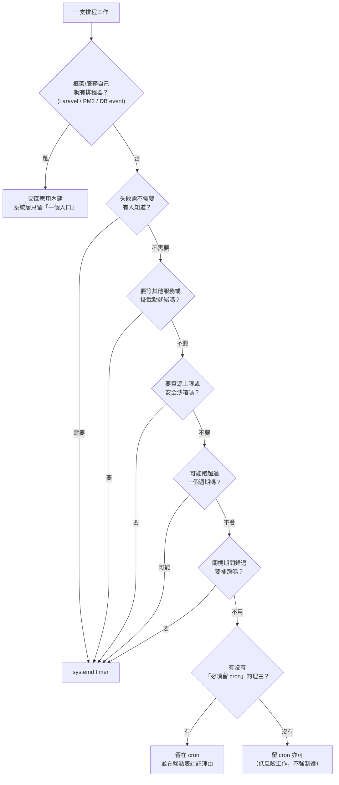

# systemd timer 與 cron 選型

> [!abstract] 這篇你會學到
> - 用一支盤點腳本把一台陌生主機的**八個排程來源**全部撈出來，輸出成可交接的報表
> - 用一套「能回答稽核」的決策樹，判斷每一支排程該留 cron、該遷 timer、還是該交回應用內建
> - 讀懂 `systemctl list-timers` 六欄與 `systemd-analyze calendar`，用它們證明「排程確實會在該跑的時候跑」
> - ★★★★ 抓出兩種**沉默死亡**的排程：只 `start` 沒 `enable` 的 timer（重開機就消失）、
>   沒開 lingering 的 `--user` timer（使用者登出就停），這兩種都要等好幾週才會被發現
> - 把一支 cron 遷成 timer 的標準八步，包含「新舊並存期不能兩邊都開」的順序與回滾

## 前置知識

- [[020-01-18-guide-Linux-排程工作]] — cron 五欄語法、`OnCalendar=` 語法、`Persistent` / `RandomizedDelaySec` /
  `AccuracySec` 的基本介紹、`at`。**本篇一律不重講語法**，只在選型與判讀的脈絡下引用。
- [[020-02-02-01-svc-systemd-unit撰寫實戰]] — unit 的相依、`Type=`、沙箱選項、template unit。
- [[020-01-17-cmd-Linux-systemd服務管理]] — `systemctl` 基本操作、`enable` 與 `start` 的差別。
- [[020-01-19-guide-Linux-日誌系統]] — `journalctl` 的過濾語法。

> [!tip] 本篇在本章的位置
> | 篇章 | 負責什麼 |
> | --- | --- |
> | [[020-02-02-01-svc-systemd-unit撰寫實戰]] | 一個 unit 怎麼寫才在正式環境活得下來 |
> | **本篇** | **全機排程怎麼盤、怎麼選型、怎麼遷移、怎麼看得到** |
> | [[020-02-02-03-cmd-systemd-cron排程實務與陷阱]] | 決定留在 cron 的那些，怎麼寫才不會踩坑（`PATH`、`%`、`flock`、`MAILTO`） |
> | [[020-02-02-04-svc-systemd-服務自動復原與看門狗]] | `OnFailure=` 告警單元的完整實作、`Restart=` 策略、watchdog |
> | [[020-02-02-05-svc-systemd-PM2與systemd整合]] | Node.js 端的程序管理與 systemd 的分工 |

---

## 觀念說明

### 先接受一個事實：排程不會只有一個地方

新人接手主機的標準動作是 `crontab -l`，看到空的就回報「這台沒有排程」。
三個月後報表沒出、備份沒跑、憑證過期，回頭查才發現排程躲在別的地方。

**一台跑了五年的機關主機，排程可能藏在這八個地方**：

```text
┌─────────────────────────────────────────────────────────────────┐
│                    一台主機的排程來源全景                        │
└─────────────────────────────────────────────────────────────────┘

 【cron 家族】────────────────────────────────────────────────────
  ① 使用者 crontab      /var/spool/cron/crontabs/<user>   ← crontab -l 只看得到「自己」這一個
  ② 系統 crontab        /etc/crontab                       ★★★ 多一欄「執行身分」
  ③ 片段目錄            /etc/cron.d/*                      ★★★★ 最常被漏掉，套件與人工都往這丟
  ④ run-parts 目錄      /etc/cron.{hourly,daily,weekly,monthly}/
     └ anacron          /etc/anacrontab + /var/spool/anacron/   ← 補跑機制，時間點會飄

 【一次性】────────────────────────────────────────────────────────
  ⑤ at 佇列             /var/spool/cron/atjobs（atq）      ★★ 前手留下的「臨時」工作可能還在

 【systemd 家族】────────────────────────────────────────────────
  ⑥ system timer        /etc/systemd/system/*.timer
                        /usr/lib/systemd/system/*.timer    ← 套件裝的
  ⑦ user timer          ~/.config/systemd/user/*.timer     ★★★★ 登出就停，且完全不在 root 視野內

 【應用自帶】────────────────────────────────────────────────────
  ⑧ 框架 / 服務內建     Laravel schedule:run（一行 cron 背後 N 個工作）
                        PM2 cron_restart
                        MySQL/MariaDB event scheduler
                        備份軟體代理、Docker 容器內的 crond、K8s CronJob
```

> [!danger] ★★★★ 只看 `crontab -l` 就以為盤點完了
> `crontab -l` 只列出「**你當下這個身分**」的使用者 crontab。
> 它看不到 `/etc/cron.d/`、看不到別的使用者的 crontab、看不到任何 systemd timer、
> 看不到 Laravel 那一行背後的三十個工作。
>
> 後果不是「少看到幾條」，而是：**日後出事時查不到來源**。
> 「每天凌晨三點資料庫連線數暴衝」查了兩週，最後發現是前手用自己帳號設的 `--user` timer。
> 盤點不完整，等於把未來的每一次事故都變成考古題。

### 心智模型：cron 是「觸發器」，timer 是「觸發器 + 執行環境 + 觀測面」

這是兩者最本質的差別，也是選型的根：

```text
              cron                          systemd timer
        ┌──────────────┐               ┌──────────────┐
時間到 →│  fork 一個    │              時間到 →│  觸發一個    │
        │  /bin/sh     │                      │  .service    │
        └──────┬───────┘                      └──────┬───────┘
               │                                     │
               ▼                                     ▼
        指令跑起來                            ┌──────────────────────┐
               │                              │ 進入獨立 cgroup       │
               ▼                              │ ├ 資源上限可設        │
        輸出 → stdout/stderr                  │ ├ 沙箱選項可設        │
               │                              │ ├ 相依/掛載點可等     │
               ▼                              │ ├ 輸出自動進 journal  │
        丟給 MAILTO（多數機關沒 MTA）          │ ├ 退出碼被記錄        │
               │                              │ └ 失敗觸發 OnFailure= │
               ▼                              └──────────────────────┘
           進黑洞
```

**cron 管到「指令被叫起來」為止，之後發生什麼它不在乎、也不知道。**
syslog 裡那行 `CMD (...)` 只證明「有觸發」，**不證明「有成功」**。
systemd 則把整個執行過程包成一個 unit 的生命週期，退出碼、輸出、耗時、被 OOM killer 殺掉，
全都在它的視野裡。

> [!note] 這個差別在維運上翻譯成什麼
> | 你想回答的問題 | cron | systemd timer |
> | --- | --- | --- |
> | 昨天那次跑了嗎？ | 翻 syslog 找 `CMD` | `systemctl list-timers`（LAST 欄） |
> | 跑成功了嗎？ | ★★★★ **答不出來** | `systemctl show -p Result -p ExecMainStatus` |
> | 那次印了什麼？ | 你有導向才有，沒導向就沒了 | `journalctl -u x.service`（自動有） |
> | 下次幾點？ | 自己算，或用 crontab.guru | `systemctl list-timers`（NEXT 欄） |
> | 失敗有人知道嗎？ | `MAILTO` + 可用的 MTA（多半是壞的） | `OnFailure=`（只要 systemd 活著就會觸發） |
> | 它吃掉全部記憶體怎麼辦？ | ★★★ 沒辦法 | `MemoryMax=` `CPUQuota=` |
>
> 「跑成功了嗎」這一格答不出來，就是機關主機備份壞了三個月沒人知道的全部原因。

### timer 的兩個家族：realtime 與 monotonic

盤點與選型時**必須先分清楚 timer 屬於哪一家**，因為它們的行為、可補跑性、
受時鐘變更的影響完全不同：

| | realtime timer | monotonic timer |
| --- | --- | --- |
| 觸發設定 | `OnCalendar=` | `OnBootSec=` / `OnStartupSec=` / `OnUnitActiveSec=` / `OnUnitInactiveSec=` / `OnActiveSec=` |
| 時間基準 | 牆上時鐘（系統時區） | 開機 / unit 狀態變化以來的**單調時間** |
| 改時區會怎樣 | ★★★ **重算下次觸發** | 不受影響 |
| NTP 大幅校時 | ★★★ 重算，可能提前或延後 | 不受影響 |
| `Persistent=true` | ✔ 有效 | ★★★ **完全沒有作用** |
| `list-timers` 的 NEXT 欄 | 顯示絕對時間 | 顯示絕對時間（由 monotonic 換算） |
| 典型用途 | 每天 03:00 備份、每月 1 號報表 | 開機 5 分鐘後自檢、上次跑完 1 小時再跑 |

> [!danger] ★★★ `Persistent=true` 寫在 monotonic timer 上完全沒作用
> `man 5 systemd.timer` 對 `Persistent=` 的原文是：
> *"Note that this setting only has an effect on timers configured with `OnCalendar=`."*
>
> 也就是說這樣寫**沒有任何補跑效果**，但它不會報錯、`systemd-analyze verify` 也不會抱怨：
>
> ```ini
> [Timer]
> OnBootSec=10min
> OnUnitActiveSec=24h
> Persistent=true        # ★★★ 沒作用，這裡不是 OnCalendar
> ```
>
> 你以為「機器關機三天，開機後會把漏掉的補跑」——不會。
> monotonic timer 開機後就是從 `OnBootSec=10min` 重新起算，漏掉的那三次永遠不存在。
>
> **要補跑就必須用 `OnCalendar=`。** 補跑的判斷依據是時間戳記檔：
> ```bash
> ls -l /var/lib/systemd/timers/
> ```
> ```text
> -rw-r--r-- 1 root root 0 Aug 27 03:04 stamp-backup.timer     # ★ mtime 就是上次觸發時間
> -rw-r--r-- 1 root root 0 Aug 28 06:12 stamp-logrotate.timer
> ```
> 使用者層的 timer 則記在 `~/.local/share/systemd/timers/`。

### 選型決策樹（這是要拿去回答稽核的那一份）

不要用「timer 比較新所以都用 timer」這種理由。稽核問「為什麼這支還在 cron」，
你要能指著一條準則回答。



六個問題只要**有任何一個答「要」，就選 timer**。全部答「不要」的，留 cron 是合理的，
不必為了統一而遷 —— 遷移本身也是風險。

> [!tip] 「刻意留在 cron」的六個合理理由（寫進盤點表的備註欄）
> | 理由 | 說明 |
> | --- | --- |
> | ★★★★ 容器內沒有 systemd | 容器的 PID 1 是應用程式，`systemctl` 根本不能用。容器內排程要嘛用 cron，要嘛交給外面的 K8s CronJob / host timer |
> | ★★★ 套件自帶，升級會被覆蓋 | `/etc/cron.daily/apt-compat`、`man-db`、`logrotate` 這些是套件檔案，你改了下次 `apt upgrade` 就還原 |
> | ★★ 跨平台腳本 | 同一份佈署腳本要跑在 Alpine（BusyBox crond）、老舊 CentOS 6、甚至 AIX，cron 是最大公約數 |
> | ★★ 極簡 / 嵌入式系統 | 只有 busybox crond，沒有 systemd |
> | ★★★ 第三方廠商維護 | 合約寫明系統由廠商維護，你改了出事責任在你。**先發文，不要先動手** |
> | ★ 生命週期極短的臨時工作 | 兩週後就要拿掉的東西，用 `at` 或 cron 都比開兩個 unit 檔快 |

> [!warning] ★★★ 決策樹裡最容易答錯的一題：「失敗需不需要有人知道？」
> 大部分人第一直覺都回答「需要」，然後全部遷到 timer，工程量爆炸。
> 正確的問法是：**「這支失敗一個月沒人知道，會怎樣？」**
>
> | 工作 | 失敗一個月會怎樣 | 判定 |
> | --- | --- | --- |
> | 每日資料庫備份 | ★★★★★ 需要還原那天才發現沒得還原 | 必須告警 → timer |
> | 憑證續期檢查 | ★★★★ 網站全站憑證過期，民眾看到警告頁 | 必須告警 → timer |
> | 每日對外資料拋轉 | ★★★★ 對方機關收不到，公文往返 | 必須告警 → timer |
> | 清 `/var/tmp` 超過 30 天的檔案 | ★ 硬碟多用一點 | 不用告警 → cron 可以 |
> | 每小時更新 motd | ★ 沒人看 | 不用告警 → cron 可以 |

### 混合治理：不是全部都要納管

盤點完之後，把排程分成兩堆，**只納管第二堆**：

| 分類 | 例子 | 處置 |
| --- | --- | --- |
| **系統維護**（不要動） | `apt-daily.timer`、`apt-daily-upgrade.timer`、`logrotate.timer`、`man-db.timer`、`fstrim.timer`、`systemd-tmpfiles-clean.timer`、`e2scrub_all.timer`、`dpkg-db-backup.timer`、`certbot.timer` | ★★ 認得它們、知道它們在做什麼就好。**不要為了「排程表乾淨」把它們停掉** —— 停 `fstrim.timer` 會讓 SSD 慢慢變慢，停 `logrotate.timer` 會塞爆磁碟 |
| **業務排程**（必須納管） | 資料拋轉、報表產生、資料庫備份、對外同步、憑證檢查、清檔、稽核彙整 | ★★★★ 檔案放 `/etc/systemd/system/` 並**納入版控**，寫進交接清單 |

> [!tip] 交接清單的固定欄位（機關交接與稽核都吃這一份）
> | 欄位 | 為什麼要 |
> | --- | --- |
> | 工作名稱 | 讓人叫得出來 |
> | 排程來源 | cron.d / timer / 應用內建，出事時知道去哪關 |
> | 頻率 | 對照實際 `NEXT` 是否一致 |
> | 執行身分 | ★★★ 稽核第一個問的就是「為什麼用 root」 |
> | 指令 / 腳本路徑 | 版控在哪 |
> | 失敗影響（星級） | 決定告警等級 |
> | 告警去向 | 「沒有」也要寫「沒有」，這才叫誠實 |
> | 業務負責人 | ★★★★ 排程停掉時要打給誰。沒有這一欄的清單等於沒有 |
> | 最後驗證日期 | 半年沒驗證過的排程等於沒有排程 |

---

## 基礎操作：把八個來源全部撈出來

以下每一段都是盤點腳本裡的一塊。先手動跑一次、看懂輸出，再看實戰範例那支整合腳本。

### ① 全部使用者的 crontab

```bash
sudo ls -l /var/spool/cron/crontabs/
```

預期輸出：

```text
total 12
-rw------- 1 deploy   crontab  412 Mar 14  2023 deploy      # ★★★ 三年沒動過，前手留的
-rw------- 1 root     crontab  289 Nov  2  2024 root
-rw------- 1 www-data crontab  117 Jun 08  2022 www-data
```

★★★ 直接看目錄比逐一 `crontab -u X -l` 快，而且**不會漏掉已經被刪除但 crontab 還在的帳號**。

逐一列出內容：

```bash
for f in /var/spool/cron/crontabs/*; do
  [ -f "$f" ] || continue
  echo "── $(basename "$f") ──"
  sudo grep -vE '^\s*(#|$)' "$f" || true
done
```

```text
── deploy ──
* * * * * cd /var/www/portal && php artisan schedule:run >> /dev/null 2>&1
── root ──
30 2 * * * /usr/local/bin/db-backup.sh > /dev/null 2>&1
── www-data ──
0 6 * * 1 /usr/bin/php /var/www/legacy/weekly.php
```

> [!danger] ★★★★ `deploy` 那一行看起來是一個排程，實際上背後是 N 個
> `php artisan schedule:run` 是 Laravel 的排程入口，真正的工作清單寫在程式碼裡。
> 盤點時**必須展開**：
> ```bash
> sudo -u deploy php /var/www/portal/artisan schedule:list
> ```
> ```text
>   0 3 * * *  php artisan backup:clean ....... Next Due: 10 hours from now
>   0 4 * * *  php artisan report:daily ....... Next Due: 11 hours from now
>   */5 * * * *  php artisan queue:monitor .... Next Due: 3 minutes from now
> ```
> 三十個工作全部躲在這一行後面。詳見 [[130-01-04-03-guide-Laravel-佇列排程與Supervisor]]。

### ② `/etc/crontab` 與 ③ `/etc/cron.d/`

```bash
sudo grep -vE '^\s*(#|$)' /etc/crontab /etc/cron.d/* 2>/dev/null
```

```text
/etc/crontab:SHELL=/bin/sh
/etc/crontab:PATH=/usr/local/sbin:/usr/local/bin:/usr/sbin:/usr/bin:/sbin:/bin
/etc/crontab:17 *  * * *  root  cd / && run-parts --report /etc/cron.hourly
/etc/crontab:25 6  * * *  root  test -x /usr/sbin/anacron || ( cd / && run-parts --report /etc/cron.daily )
/etc/cron.d/e2scrub_all:30 3 * * 0 root test -e /run/systemd/system || SERVICE_MODE=1 /usr/lib/x86_64-linux-gnu/e2fsprogs/e2scrub_all_cron
/etc/cron.d/sync-mof:*/10 * * * * root /opt/sync/run.sh                      # ★★★★ 沒有人知道這是什麼
/etc/cron.d/certbot:0 */12 * * * root test -x /usr/bin/certbot && perl -e 'sleep int(rand(43200))' && certbot -q renew
```

★★★★ `/etc/cron.d/` 是最容易被漏掉的一層 —— 它不屬於任何使用者，`crontab -l` 完全看不到，
而套件與人工都會往這裡丟檔案。盤點時**每一個檔案都要能說出「誰放的、做什麼」**。

順手檢查失效檔案：

```bash
ls -1 /etc/cron.d/ | grep -E '\.' || echo "（沒有含點的檔名，OK）"
```

```text
backup.cron          # ★★★ 檔名含 . → run-parts/cron 會忽略，這支從來沒跑過
```

檔名規則與其他 cron 端陷阱見 [[020-02-02-03-cmd-systemd-cron排程實務與陷阱]]。

### ④ run-parts 目錄與 anacron

```bash
sudo run-parts --test /etc/cron.daily
```

```text
/etc/cron.daily/apt-compat
/etc/cron.daily/dpkg
/etc/cron.daily/logrotate
/etc/cron.daily/man-db
/etc/cron.daily/mof-archive          # ★★★ 這個不是套件裝的
```

★★ `--test` 只列出「**會被執行**」的腳本 —— 檔名不合規或沒有執行位元的不會出現，
拿它跟 `ls` 的結果比對，差集就是「放在那裡但永遠不會跑」的死檔。

anacron 的實際執行時間：

```bash
sudo grep -vE '^\s*(#|$)' /etc/anacrontab; ls -l /var/spool/anacron/
```

```text
SHELL=/bin/sh
PATH=/usr/local/sbin:/usr/local/bin:/usr/sbin:/usr/bin:/sbin:/bin
RANDOM_DELAY=45
START_HOURS_RANGE=3-22
1  5  cron.daily  run-parts --report /etc/cron.daily

-rw------- 1 root root 9 Aug 28 07:35 cron.daily      # ★ 內容是上次執行日期
-rw------- 1 root root 9 Aug 24 07:31 cron.weekly
```

★★★ `RANDOM_DELAY=45` + `START_HOURS_RANGE=3-22` 表示 `cron.daily` 的實際執行時間會飄，
不是固定 06:25。**業務排程不要丟進 `cron.daily`**，你無法保證它幾點跑。

### ⑤ `at` 佇列

```bash
sudo atq
```

```text
7	Wed Sep  3 02:00:00 2026 a root       # ★★★ 前手排的「臨時」還原，一年前的
```

```bash
sudo at -c 7 | tail -5
```

```text
cp /etc/nginx/nginx.conf.bak /etc/nginx/nginx.conf
systemctl reload nginx
```

★★★ 一年前排的「保險」還沒拆。到期那天會把現在的設定檔蓋回一年前的版本。
盤點看到 `atq` 有東西，**一律要問清楚才決定 `atrm`**。

### ⑥ systemd system timer

```bash
systemctl list-timers --all --no-pager
```

```text
NEXT                        LEFT       LAST                        PASSED    UNIT                     ACTIVATES
Fri 2026-08-28 20:11:41 CST 6h left    Thu 2026-08-27 20:11:41 CST 17h ago   systemd-tmpfiles-clean.timer systemd-tmpfiles-clean.service
Sat 2026-08-29 00:00:00 CST 10h left   Fri 2026-08-28 00:00:12 CST 13h ago   logrotate.timer          logrotate.service
Sat 2026-08-29 03:00:00 CST 13h left   n/a                         n/a       mof-export.timer         mof-export.service
n/a                         n/a        Thu 2026-08-27 06:12:33 CST 1 day ago cert-check.timer         cert-check.service

4 timers listed.
```

**六欄的讀法**（★★★★ 這張表會回答八成的「排程沒跑」問題）：

| 欄 | 意義 | 異常訊號 |
| --- | --- | --- |
| `NEXT` | 下次觸發的絕對時間 | ★★★★ `n/a` = **不會再觸發了**。timer 已停止或運算式已無下一次 |
| `LEFT` | 距離下次還有多久 | 跟你預期的頻率對不上 → 運算式或時區錯 |
| `LAST` | 上次觸發時間 | ★★★★ `n/a` = **這台機器上從來沒跑過**。剛建的可以，跑三年的就是出事了 |
| `PASSED` | 距離上次多久 | ★★★ 遠大於排程週期（例如每日工作顯示 `2 months ago`）= 中間全部沒跑 |
| `UNIT` | timer 單元名 | |
| `ACTIVATES` | 被觸發的 service | ★★★ 跟 timer 不同名時要特別留意，是 `Unit=` 指定的 |

上面那份輸出裡有兩個地雷：
- `mof-export.timer`：`LAST=n/a` —— 建立以來一次都沒跑過。
- `cert-check.timer`：`NEXT=n/a` —— **已經不會再觸發**，上次跑是一天前，之後就死了。

> [!danger] ★★★★ `list-timers` 看不到「有檔案但沒 enable」的 timer
> `list-timers --all` 只列出**已載入**的 timer。
> 一支只 `systemctl start` 沒 `enable` 的 timer，在這次開機期間會出現在表上，
> **重開機之後就整支消失** —— 連 `--all` 都看不到，因為它根本沒被載入。
>
> 要抓這種，看的是「檔案存在但沒 enable」：
> ```bash
> systemctl list-unit-files --type=timer --no-legend --no-pager
> ```
> ```text
> apt-daily.timer               enabled  enabled
> logrotate.timer               enabled  enabled
> mof-export.timer              disabled disabled     # ★★★★ 檔案在，但重開機不會起來
> cert-check.timer              disabled disabled     # ★★★★ 同上
> ```
>
> 更精準的一行：找出「現在是 active、但沒有 enabled」的 timer ——
> 這批全部會在下次重開機時消失：
> ```bash
> comm -13 \
>   <(systemctl list-unit-files --type=timer --state=enabled --no-legend --no-pager | awk '{print $1}' | sort) \
>   <(systemctl list-units --type=timer --state=active --no-legend --plain --no-pager | awk '{print $1}' | sort)
> ```
> ```text
> mof-export.timer
> ```
> **這一行應該印出空的。印出東西就是待處理清單。**

### ⑦ systemd user timer（最容易整批漏掉的一層）

使用者層的 timer 完全不在 `systemctl list-timers` 的視野內。要另外掃：

```bash
sudo find /home /root -maxdepth 5 -path '*/.config/systemd/user/*' \
     \( -name '*.timer' -o -name '*.service' \) -printf '%u\t%p\n' 2>/dev/null
```

```text
deploy	/home/deploy/.config/systemd/user/mof-sync.timer
deploy	/home/deploy/.config/systemd/user/mof-sync.service
deploy	/home/deploy/.config/systemd/user/timers.target.wants/mof-sync.timer
```

★★ `timers.target.wants/` 底下有沒有那條 symlink，就是「有沒有 `enable`」的檔案層證據。

活的檢查（需要該使用者的 user manager 正在跑）：

```bash
sudo systemctl --user -M deploy@ list-timers --all --no-pager
```

```text
NEXT                        LEFT     LAST                        PASSED     UNIT           ACTIVATES
Fri 2026-08-28 23:00:00 CST 9h left  Fri 2026-08-28 07:00:02 CST 6h ago     mof-sync.timer mof-sync.service
```

如果使用者的 user manager 沒在跑，會得到：

```text
Failed to connect to bus: Host is down
```

★★★★ **這個錯誤訊息本身就是最重要的發現** —— 代表這個使用者的所有 `--user` timer
現在都是停的。接下來去看 lingering。

### 檢查 lingering

```bash
loginctl show-user deploy --property=Linger
```

```text
Linger=no          # ★★★★ 使用者登出後，他的所有 --user timer 全部停止
```

```bash
ls -l /var/lib/systemd/linger/
```

```text
total 0
-rw-r--r-- 1 root root 0 Jan 12  2024 backupsvc     # 只有這個帳號有 linger
```

> [!danger] ★★★★ 機關最常見的一種「排程默默停掉數月」
> 情境完全一致，每一間都發生過：
>
> 1. 開發者用**自己的帳號**登入主機，`systemctl --user enable --now mof-sync.timer`
> 2. 他在職期間常常 SSH 進來，user manager 一直活著，排程跑得好好的
> 3. 他離職／調職，帳號不再登入
> 4. 最後一個 session 結束的那一刻，systemd 收掉他的 user manager，**timer 一起被殺**
> 5. 沒有任何錯誤、沒有任何日誌、`systemctl list-timers`（system 層）完全正常
> 6. 三到六個月後，業務端反映「資料好像很久沒更新了」
>
> 補救有兩條路，**優先選第二條**：
> ```bash
> # 路線 A：開 lingering（讓 user manager 開機就起來、登出也不收）
> sudo loginctl enable-linger deploy
> loginctl show-user deploy --property=Linger      # 確認變成 Linger=yes
>
> # 路線 B：★★★★ 改寫成 system 層 timer，用 User= 指定執行身分
> #   業務排程不該綁在「某個人的帳號有沒有登入」上
> ```
> 路線 B 才是機關環境的正解：**業務排程的存活不能依賴某個自然人的登入狀態**。

### ⑧ 應用自帶的排程

```bash
# PM2（Node.js）—— cron_restart 是排程，但完全不在 cron 與 timer 的視野裡
sudo -u deploy pm2 jlist 2>/dev/null | jq -r '.[] | [.name, (.pm2_env.cron_restart // "-")] | @tsv'
```

```text
portal-ssr	-
mof-worker	0 4 * * *          # ★★★ 每天 04:00 重啟，這也是排程
```

```bash
# MySQL / MariaDB 的事件排程器
sudo mysql -N -B -e "SELECT @@event_scheduler;"
sudo mysql -N -B -e "SELECT EVENT_SCHEMA, EVENT_NAME, STATUS, LAST_EXECUTED FROM information_schema.EVENTS;"
```

```text
ON
portal	purge_old_logs	ENABLED	2026-08-28 02:00:00      # ★★★ 資料庫裡也有排程
```

```bash
# 容器內的 crond
for c in $(docker ps --format '{{.Names}}' 2>/dev/null); do
  docker exec "$c" sh -c 'command -v crond >/dev/null && crontab -l 2>/dev/null' \
    && echo "  ↑ 容器 $c 內有 cron"
done
```

> [!info]- Rocky / AlmaLinux（RHEL 系）對照
>
> | 項目 | Debian / Ubuntu | RHEL 系 |
> | --- | --- | --- |
> | 使用者 crontab 目錄 | `/var/spool/cron/crontabs/` | ★★★ **`/var/spool/cron/`**（少一層） |
> | cron 套件 / 服務 | `cron` / `cron.service` | `cronie` / **`crond.service`** |
> | cron 日誌 | `journalctl -t CRON`（`/var/log/syslog` 需 rsyslog） | **`/var/log/cron`**（預設就有） |
> | anacron | 內建於 `cron` | **`cronie-anacron`**（可能沒裝） |
> | `at` 佇列 | `/var/spool/cron/atjobs` | `/var/spool/at` |
> | systemd timer | 完全相同 | 完全相同 |
> | systemd 版本 | 22.04 → 249；24.04 → 255 | RHEL 8 → 239；**RHEL 9 → 252** |
>
> 盤點腳本要相容兩系，crontab 目錄用探測而不是寫死：
> ```bash
> for d in /var/spool/cron/crontabs /var/spool/cron; do
>   [ -d "$d" ] && CRONDIR="$d" && break
> done
> ```
>
> ★★★ **SELinux 額外一關**：把腳本放進 `/usr/local/bin/` 後，
> 若 context 不對，systemd 觸發時會被拒絕執行而且錯誤訊息很不直覺：
> ```bash
> sudo restorecon -Rv /usr/local/bin/
> sudo ausearch -m avc -ts recent | tail -20      # 有 AVC denied 就是 SELinux 擋的
> ```
> `journalctl -u x.service` 只會顯示 `Permission denied`，看不出是 SELinux。
> **RHEL 系遷移 timer 時，這是第一個要排除的可能。**

---

## 進階應用

### timer 與 service 的綁定規則

這四條規則決定「timer 到底會觸發什麼」，寫錯的話 timer 一切正常但工作永遠不跑：

| 規則 | 說明 |
| --- | --- |
| ★ 同名預設 | `foo.timer` 預設觸發 `foo.service`，不用寫 `Unit=` |
| ★★★ 不同名必須寫 `Unit=` | `mof-export.timer` 要觸發 `mof-transfer.service`，就得寫 `Unit=mof-transfer.service` |
| ★★★ 被觸發的服務寫 `Type=oneshot` | 跑完就結束，systemd 才知道「這一次執行完成了」；預設 `RemainAfterExit=no` 保持不變 |
| ★★★★ 被觸發的 service **不要有 `[Install]` 區段** | 有 `[Install]` 就可能被誤 `enable`，變成「開機跑一次 + timer 再跑一次」 |

驗證綁定：

```bash
systemctl show mof-export.timer -p Unit -p Persistent -p AccuracyUSec -p RandomizedDelayUSec
```

```text
Unit=mof-transfer.service
Persistent=yes
AccuracyUSec=1min
RandomizedDelayUSec=5min
```

★★★ `Unit=` 拼錯（例如寫成 `mof-transfor.service`）時，systemd 在 `daemon-reload` 不會報錯，
要等到觸發那一刻才在 journal 留下 `Unit mof-transfor.service not found.`。
**寫完一定要用 `systemctl show -p Unit` 確認一次。**

> [!danger] ★★★★ 只 `start` 不 `enable`，重開機後排程消失
> ```bash
> sudo systemctl start mof-export.timer      # ✗ 只在這次開機期間有效
> sudo systemctl enable --now mof-export.timer  # ✓ 開機自動載入 + 立刻生效
> ```
> 這個坑跟 service 一模一樣，但 **timer 難察覺得多**：
> - service 沒 enable → 重開機後服務沒起來，通常當天就有人反映網站掛了
> - **timer 沒 enable → 要等到下一個週期才發現**。每月 1 號的報表工作，
>   平均要 **兩週到一個月**才有人問「這個月報表呢」
>
> `enable` 失敗的常見原因是 timer 少了 `[Install]`：
> ```text
> Failed to enable unit: Unit file /etc/systemd/system/mof-export.timer is masked.
> The unit files have no installation config (WantedBy=, RequiredBy=, Also=, Alias=
> settings in the [Install] section, and DefaultInstance= for template units).
> ```
> 補上：
> ```ini
> [Install]
> WantedBy=timers.target
> ```
>
> 上線前固定驗這一行：
> ```bash
> systemctl is-enabled mof-export.timer
> ```
> ```text
> enabled          # ★ 只有這個字串是對的。disabled / static / linked 都要處理
> ```

### 可觀測性四件套

這四支指令是本篇最實用的部分。**任何「排程沒跑」的問題，跑完這四支就能定位。**

**① `systemctl list-timers --all`：全景與下次時間**

```bash
systemctl list-timers --all --no-pager | grep -E 'UNIT|mof'
```

```text
NEXT                        LEFT      LAST                        PASSED  UNIT             ACTIVATES
Sat 2026-08-29 03:04:12 CST 12h left  Fri 2026-08-28 03:02:51 CST 11h ago mof-export.timer mof-transfer.service
```

**② `systemd-analyze calendar`：離線驗證運算式，不必等**

```bash
systemd-analyze calendar '*-*-* 03:00:00' --iterations=3
```

```text
  Original form: *-*-* 03:00:00
Normalized form: *-*-* 03:00:00
    Next elapse: Sat 2026-08-29 03:00:00 CST
       (in UTC): Fri 2026-08-28 19:00:00 UTC
       From now: 12h left
       Iter. #2: Sun 2026-08-30 03:00:00 CST
       Iter. #3: Mon 2026-08-31 03:00:00 CST
```

★★★ 搭配 `--base-time=` 可以驗「跨年、跨月底、閏年」這些邊界（`--base-time` 需 systemd 244+，
`--iterations` 需 242+，Ubuntu 22.04 的 249 兩者都有）：

```bash
systemd-analyze calendar --base-time='2026-01-28' --iterations=4 '*-*-29 04:00:00'
```

```text
    Next elapse: Thu 2026-01-29 04:00:00 CST
       Iter. #2: Sun 2026-03-29 04:00:00 CST        # ★★★★ 二月被整個跳過了！
       Iter. #3: Wed 2026-04-29 04:00:00 CST
       Iter. #4: Fri 2026-05-29 04:00:00 CST
```

**二月沒有 29 號，這支「每月 29 號」的月結報表整個二月不會跑。**
這種錯誤在正式環境要等到二月才爆，用 `--base-time` 十秒就驗出來。

**③ `journalctl -u <service>`：看單次執行的完整輸出**

```bash
sudo journalctl -u mof-transfer.service --since '2026-08-28 00:00' -o short-iso --no-pager
```

```text
2026-08-28T03:02:51+0800 rpt01 systemd[1]: Starting MOF daily data export...
2026-08-28T03:02:51+0800 rpt01 mof-transfer[48213]: [1/3] 匯出 2026-08-27 交易明細
2026-08-28T03:03:44+0800 rpt01 mof-transfer[48213]: [2/3] 產生檢核碼 sha256
2026-08-28T03:04:10+0800 rpt01 mof-transfer[48213]: [3/3] 上傳 sftp://mof.example.gov.tw
2026-08-28T03:04:12+0800 rpt01 systemd[1]: mof-transfer.service: Succeeded.
2026-08-28T03:04:12+0800 rpt01 systemd[1]: Finished MOF daily data export.
```

★★★★ **只看「這一次」的輸出**（不被前後幾十次干擾）—— 用 invocation ID：

```bash
INV=$(systemctl show -p InvocationID --value mof-transfer.service)
sudo journalctl _SYSTEMD_INVOCATION_ID="$INV" --no-pager
```

這是 cron 端**做不到**的事。cron 的 syslog 只有這一行：

```text
Aug 28 03:00:01 rpt01 CRON[48199]: (root) CMD (/usr/local/bin/mof-transfer.sh)
```

★★★★ **這行只證明「有觸發」，不證明「有成功」。** 腳本第一行就 `exit 1`，
syslog 長得一模一樣。若機器沒有 MTA，還會多一行把證據直接丟掉：

```text
Aug 28 03:00:01 rpt01 CRON[48198]: (CRON) info (No MTA installed, discarding output)
```

**④ `systemctl show`：精確查下次時間與上次結果**

```bash
systemctl show mof-export.timer -p NextElapseUSecRealtime -p LastTriggerUSec
systemctl show mof-transfer.service -p Result -p ExecMainStatus -p ExecMainStartTimestamp
```

```text
NextElapseUSecRealtime=Sat 2026-08-29 03:00:00 CST
LastTriggerUSec=Fri 2026-08-28 03:02:51 CST
Result=success
ExecMainStatus=0
ExecMainStartTimestamp=Fri 2026-08-28 03:02:51 CST
```

★★★ `Result=` 是「這支排程上次成功了嗎」的**單一權威答案**，
可能的值：`success` / `exit-code` / `timeout` / `signal` / `oom-kill` / `core-dump`。
把它接進監控就是最省力的排程健康檢查（見 [[100-01-03-guide-日誌-系統監控與告警]]）。

### 為什麼設 03:00 卻 03:00:42 才跑

兩個設定疊加造成的，**這不是故障**：

```text
  OnCalendar=*-*-* 03:00:00
        │
        ├── + RandomizedDelaySec=5min   → 隨機 0～300 秒       ┐
        │                                                      ├→ 實際觸發 03:00:42
        └── + AccuracySec=1min（預設）  → 在 1 分鐘窗口內合併喚醒 ┘
```

| 設定 | 預設 | 作用 | 什麼時候要改 |
| --- | --- | --- | --- |
| `AccuracySec=` | ★★★ **1min** | 允許 systemd 為了省電，把附近的喚醒合併，在窗口內任一點觸發 | 要求秒級準時就設 `AccuracySec=1s` |
| `RandomizedDelaySec=` | 0 | 每次觸發加一段隨機延遲 | 多台主機打同一個目標時設 |
| `FixedRandomDelay=` | false | ★★★ 讓隨機延遲**固定**（依 machine-id + unit 名推導），每次都同一個偏移 | 要「每台錯開但每台自己準時」時設 `true`（systemd 247+） |

> [!warning] ★★★ 兩種需求剛好相反，不要抄錯
> **需求 A：營業時段的資料拋轉，對方系統只收 09:00:00–09:00:05 的封包**
> ```ini
> [Timer]
> OnCalendar=Mon..Fri 09:00:00
> AccuracySec=1s              # ★★★★ 必須，否則預設 1min 會讓你在 09:00:37 才送出
> RandomizedDelaySec=0        # 不能隨機
> ```
>
> **需求 B：全機關 60 台主機每天向同一台更新來源抓套件**
> ```ini
> [Timer]
> OnCalendar=*-*-* 02:00:00
> RandomizedDelaySec=1800     # ★★★ 攤平在 02:00～02:30
> FixedRandomDelay=true       # 每台固定偏移，方便排錯時預測
> AccuracySec=1min            # 保持預設即可
> ```

> [!danger] ★★★ 沒有 `RandomizedDelaySec`，六十台主機同一分鐘打同一個目標
> 這在機關內網是真實會發生的事：全部機器都是同一份 image 佈署出去的，
> 排程全設 `02:00:00`，全部同時向內部 APT mirror／備份主機發動。
>
> 現象：
> - 備份主機每天 02:00 負載飆到 100，02:40 才恢復
> - 交換器上行埠瞬間打滿，連帶影響同網段的正式服務
> - ★★★★ 資安設備把它判定成 **DDoS 或內部橫向移動**，開單通報
>
> 這種「看起來像資安事件的效能問題」最花時間，因為兩邊團隊會先吵一輪。
> `RandomizedDelaySec=1800` 一行解決。

### 時間基準：時區與 NTP 校時

**realtime timer 依「系統時區」計算 `OnCalendar=`**。這帶來三個要注意的行為：

```bash
timedatectl
```

```text
               Local time: Fri 2026-08-28 13:42:07 CST
           Universal time: Fri 2026-08-28 05:42:07 UTC
                Time zone: Asia/Taipei (CST, +0800)      # ★★★ timer 依這個算
System clock synchronized: yes
              NTP service: active
```

| 事件 | realtime timer | monotonic timer |
| --- | --- | --- |
| `timedatectl set-timezone` | ★★★ systemd 立刻重算下次觸發，**不需重開機**。但當天可能跳過或重複一次 | 不受影響 |
| NTP **微調**（slew，chrony 預設） | 幾乎無感 | 不受影響 |
| NTP **大幅校時**（step，時鐘往前跳） | ★★★ 跳過的排程點：`Persistent=true` 會在下次載入時補跑；沒設就是永遠沒跑 | 不受影響 |
| NTP 大幅校時（時鐘往回跳） | ★★★★ 同一個排程點可能**跑第二次** —— 沒有冪等設計的資料拋轉會產生重複資料 | 不受影響 |

時間同步的正確設定見 [[020-01-28-cmd-Linux-時間同步NTP與chrony]]。

> [!danger] ★★★★ 雲端主機預設 UTC，`OnCalendar=*-*-* 03:00:00` 是台北時間中午 11 點
> 雲端 image 幾乎都是 `Etc/UTC`。你照著文件寫 `03:00:00` 想避開尖峰，
> 實際是**上午 11:00 開始跑重量級備份**，正好打在業務尖峰上。
>
> 上線前必驗：
> ```bash
> timedatectl show -p Timezone --value
> systemd-analyze calendar '*-*-* 03:00:00'
> ```
> ```text
> Etc/UTC
>     Next elapse: Sat 2026-08-29 03:00:00 UTC
>        (in UTC): Sat 2026-08-29 03:00:00 UTC     # ★★★★ 台北時間是 11:00
> ```
> `Next elapse` 與 `(in UTC)` 兩行**相同**，就代表這台機器是 UTC。

兩種解法：

```bash
# 解法一（推薦，最單純）：把整台機器設成台北時區
sudo timedatectl set-timezone Asia/Taipei
sudo systemctl restart systemd-journald    # 讓後續日誌時間戳一致
systemd-analyze calendar '*-*-* 03:00:00'  # 重新確認
```

```ini
# 解法二：在 unit 內指定時區後綴（★★★ 注意是「後綴」不是前綴）
[Timer]
OnCalendar=*-*-* 03:00:00 Asia/Taipei
```

> [!warning] ★★★ 時區後綴需要較新的 systemd，動手前先實測
> `man 7 systemd.time` 對 calendar event 的說明是：時區可以寫成字面字串 `UTC`、
> 本地時區，或 **IANA 時區資料庫格式**（例如 `Asia/Taipei`、`Pacific/Auckland`），
> **接在運算式最後面**。
>
> 版本分界（`UTC` 後綴在 v252 進來，IANA 時區名是之後才完整支援）：
>
> | 發行版 | systemd | 時區後綴 |
> | --- | --- | --- |
> | Ubuntu 22.04 LTS | 249 | ★★★★ **不支援，不要用** |
> | Ubuntu 24.04 LTS | 255 | 支援 |
> | RHEL 8 | 239 | 不支援 |
> | RHEL 9 | 252 | 需實測 |
>
> **一行指令當場問清楚，不要靠版本表猜**：
> ```bash
> systemd-analyze calendar '*-*-* 03:00:00 Asia/Taipei'
> ```
> 支援：
> ```text
> Normalized form: *-*-* 03:00:00 Asia/Taipei
>     Next elapse: Sat 2026-08-29 03:00:00 CST
> ```
> 不支援：
> ```text
> Failed to parse calendar specification '*-*-* 03:00:00 Asia/Taipei': Invalid argument
> ```
> **解析失敗就退回解法一（設機器時區）**，不要硬寫進 unit —— 寫進去之後
> `systemctl daemon-reload` 不會擋你，但 timer 會直接進入 failed 狀態不觸發。

### 失敗告警：選型層面要知道的兩件事

完整的告警單元實作在 [[020-02-02-04-svc-systemd-服務自動復原與看門狗]]，這裡只講**為什麼這件事會影響選型**：

| | cron 的 `MAILTO=` | timer 的 `OnFailure=` |
| --- | --- | --- |
| 依賴 | ★★★★ 需要機器上有可用的 MTA | 只需要 systemd 活著 |
| 機關現況 | 主機幾乎都沒裝 Postfix，郵件被丟棄 | — |
| 觸發條件 | 有**任何輸出**就寄（成功也寄） | ★★★ 只有**失敗**才觸發，語意精確 |
| 腳本被 OOM killer 殺掉 | ★★★★ 收不到任何通知 | 照樣觸發（`Result=oom-kill`） |
| 腳本執行超時 | 沒有超時概念 | `TimeoutStartSec=` 到期即算失敗並觸發 |

★★★★ **「這支排程失敗要有人知道」＝ 幾乎一定選 timer**，因為 cron 這一側的告警在
機關主機上實務等於不存在。cron 端的替代方案（`|| /usr/local/bin/alert.sh`）
只能抓到腳本自己 `exit != 0` 的情形，抓不到被殺、被 OOM、卡住這三種。

### 一支 cron 遷成 timer 的標準八步

```text
【1】抽腳本   把 crontab 那一行的指令搬進 /usr/local/bin/<name>.sh
             ★★★ 管線、重導向、&& 全部留在腳本裡
【2】寫 service   Type=oneshot，指定 User=、資源上限、OnFailure=
【3】寫 timer     OnCalendar= + Persistent= + RandomizedDelaySec= + [Install]
【4】對時         systemd-analyze calendar --iterations=5（含跨月邊界）
【5】手動驗一次   systemctl start <name>.service && journalctl -u ... 看輸出
【6】關舊的       ★★★★ 先註解掉舊 crontab 行，並確認 cron 已重讀
【7】開新的       systemctl enable --now <name>.timer
【8】保留兩週     舊 crontab 行以註解形式留著，兩週後確認無誤才刪
```

> [!danger] ★★★★ 【6】必須在【7】之前 —— 順序反了就會跑兩次
> 「先開新的觀察幾天，確定沒問題再關舊的」聽起來很穩健，實際上是最常見的遷移事故：
>
> | 工作性質 | 跑兩次的後果 |
> | --- | --- |
> | 資料拋轉 | ★★★★ 對方機關收到兩份，被退件；或資料庫產生重複主鍵 |
> | 增量備份 | ★★★ 備份鏈斷裂，還原時找不到正確的基準點 |
> | 用了 `flock` 的工作 | ★★★ 兩邊搶鎖，其中一次被跳過 —— **看起來正常，實際上少跑一次** |
> | 帳務結算 | ★★★★★ 金額算兩次 |
>
> 正確順序是**先停舊、再開新，中間空窗一個週期是可以接受的**（真的不能空窗，
> 就手動 `systemctl start <name>.service` 補一次）。

> [!danger] ★★★ 【1】不能把 cron 那一行原封不動貼進 `ExecStart=`
> systemd **不經過 shell** 執行 `ExecStart=`。管線、重導向、`&&`、萬用字元、
> 變數展開全部不生效，會被當成**參數**傳給第一個執行檔：
>
> ```ini
> # ✗ 錯：mysqldump 會收到 "|"、"gzip"、">"、路徑 這幾個字串當參數
> ExecStart=/usr/bin/mysqldump portal | gzip > /backup/portal.sql.gz
> ```
> 失敗訊息會很莫名其妙：
> ```text
> mysqldump: Couldn't find table: "|"
> ```
>
> 兩個正確做法：
> ```ini
> # ✓ 做法一（推薦）：包成腳本，unit 只叫腳本
> ExecStart=/usr/local/bin/db-backup.sh
>
> # ✓ 做法二：明確要求 shell
> ExecStart=/bin/bash -c '/usr/bin/mysqldump portal | gzip > /backup/portal.sql.gz'
> ```
>
> ★★★ 另外一個對稱的坑：**`%` 在 unit 檔裡是 specifier，要寫 `%%`**
> （跟 cron 裡 `%` 要寫 `\%` 是不同的規則，但一樣會安靜出錯）：
> ```ini
> ExecStart=/bin/bash -c 'tar czf /backup/$(date +%%F).tar.gz /data'
> ```

---

## 完整實戰範例

**情境**：接手一台跑了五年的機關報表主機 `rpt01`。前手已離職，沒有交接文件。
業務端只說「每天早上會有一份報表寄出去，最近好像不太準」。

目標：**盤點 → 分類 → 遷移三支關鍵排程 → 驗收 → 留下可交接的清單**。

### 第一步：盤點腳本 `/usr/local/bin/sched-inventory.sh`

```bash
#!/usr/bin/env bash
# /usr/local/bin/sched-inventory.sh
# 全機排程盤點：掃過八個來源，輸出 Markdown 報表 + CSV
# 用法：sudo sched-inventory.sh [輸出目錄]
set -euo pipefail

VERSION="1.3.0"
OUT_DIR="${1:-/var/log/sched-inventory}"
STAMP="$(date +%Y%m%d-%H%M%S)"
HOST="$(hostname -f 2>/dev/null || hostname)"
MD="$OUT_DIR/sched-$HOST-$STAMP.md"
CSV="$OUT_DIR/sched-$HOST-$STAMP.csv"

# ── 前置檢查 ────────────────────────────────────────────────
die()  { echo "[FATAL] $*" >&2; exit 1; }
warn() { echo "[WARN ] $*" >&2; }
have() { command -v "$1" >/dev/null 2>&1; }

[ "$(id -u)" -eq 0 ] || die "需要 root：使用者 crontab 與 atq 一般帳號讀不到"
mkdir -p "$OUT_DIR" || die "無法建立輸出目錄 $OUT_DIR"

# ★★★ 相容 Debian 與 RHEL 兩種 crontab 目錄，不寫死
CRONDIR=""
for d in /var/spool/cron/crontabs /var/spool/cron; do
  [ -d "$d" ] && { CRONDIR="$d"; break; }
done
[ -n "$CRONDIR" ] || warn "找不到使用者 crontab 目錄，該段跳過"

# ── 輸出小工具 ──────────────────────────────────────────────
csv_esc() { printf '"%s"' "${1//\"/\"\"}"; }

row() {   # row 來源 執行身分 頻率 指令 位置 最後執行 告警 備註
  { csv_esc "$1"; printf ,; csv_esc "$2"; printf ,; csv_esc "$3"; printf ,
    csv_esc "$4"; printf ,; csv_esc "$5"; printf ,; csv_esc "$6"; printf ,
    csv_esc "$7"; printf ,; csv_esc "$8"; printf '\n'; } >> "$CSV"
  printf '| %s | %s | %s | `%s` | %s | %s | %s | %s |\n' \
    "$1" "$2" "$3" "$4" "$5" "$6" "$7" "$8" >> "$MD"
}

section() { printf '\n### %s\n\n' "$1" >> "$MD"; echo "→ $1" >&2; }

# ── 報表表頭 ────────────────────────────────────────────────
{
  echo "# 排程盤點報表 — $HOST"
  echo
  echo "- 產生時間：$(date '+%F %T %Z')"
  echo "- 腳本版本：$VERSION"
  echo "- 系統時區：$(timedatectl show -p Timezone --value 2>/dev/null || cat /etc/timezone)"
  echo "- systemd：$(systemctl --version 2>/dev/null | head -1)"
  echo
  echo "| 來源 | 執行身分 | 頻率 | 指令 | 位置 | 最後執行 | 告警 | 備註 |"
  echo "| --- | --- | --- | --- | --- | --- | --- | --- |"
} > "$MD"
echo '來源,執行身分,頻率,指令,位置,最後執行,告警,備註' > "$CSV"

# ── ① 使用者 crontab ────────────────────────────────────────
section "① 使用者 crontab"
if [ -n "$CRONDIR" ]; then
  for f in "$CRONDIR"/*; do
    [ -f "$f" ] || continue
    u="$(basename "$f")"
    id "$u" >/dev/null 2>&1 || warn "crontab 存在但帳號 $u 已不存在（孤兒 crontab）"
    while IFS= read -r line; do
      case "$line" in ''|\#*|[A-Z_]*=*) continue ;; esac
      freq="$(echo "$line" | awk '{print $1,$2,$3,$4,$5}')"
      cmd="$(echo "$line"  | cut -d' ' -f6-)"
      note="cron"
      case "$cmd" in *"/dev/null"*) note="cron；★★★ 輸出被丟棄" ;; esac
      case "$cmd" in *schedule:run*) note="cron；★★★★ Laravel 入口，需展開 schedule:list" ;; esac
      row "使用者 crontab" "$u" "$freq" "$cmd" "$f" "-" "無" "$note"
    done < "$f"
  done
else
  echo '（略過：無 crontab 目錄）' >> "$MD"
fi

# ── ② /etc/crontab ③ /etc/cron.d ────────────────────────────
section "② /etc/crontab 與 ③ /etc/cron.d/"
for f in /etc/crontab /etc/cron.d/*; do
  [ -f "$f" ] || continue
  case "$(basename "$f")" in *.*) warn "★★★★ $f 檔名含點，cron 會忽略，這支從未執行" ;; esac
  while IFS= read -r line; do
    case "$line" in ''|\#*|[A-Z_]*=*) continue ;; esac
    freq="$(echo "$line" | awk '{print $1,$2,$3,$4,$5}')"
    who="$(echo  "$line" | awk '{print $6}')"
    cmd="$(echo  "$line" | cut -d' ' -f7-)"
    note="系統 cron"
    case "$(basename "$f")" in *.*) note="★★★★ 檔名含點，不會執行" ;; esac
    row "系統 cron" "$who" "$freq" "$cmd" "$f" "-" "無" "$note"
  done < "$f"
done

# ── ④ run-parts 目錄 ────────────────────────────────────────
section "④ cron.hourly / daily / weekly / monthly"
for period in hourly daily weekly monthly; do
  d="/etc/cron.$period"
  [ -d "$d" ] || continue
  runnable="$(run-parts --test "$d" 2>/dev/null || true)"
  for s in "$d"/*; do
    [ -f "$s" ] || continue
    if echo "$runnable" | grep -qxF "$s"; then
      note="run-parts"
    else
      note="★★★ 不會被執行（檔名含點或無執行位元）"
    fi
    row "cron.$period" "root" "$period" "$(basename "$s")" "$s" "-" "無" "$note"
  done
done
if [ -f /etc/anacrontab ]; then
  rd="$(awk -F= '/^RANDOM_DELAY/{print $2}' /etc/anacrontab | tr -d ' ')"
  [ -n "$rd" ] && echo "> ★★★ anacron RANDOM_DELAY=${rd} 分鐘，上述時間會浮動" >> "$MD"
fi

# ── ⑤ at 佇列 ───────────────────────────────────────────────
section "⑤ at 佇列"
if have atq; then
  atq 2>/dev/null | while read -r jid when_rest; do
    [ -n "$jid" ] || continue
    body="$(at -c "$jid" 2>/dev/null | tail -3 | tr '\n' ' ')"
    row "at" "$(echo "$when_rest" | awk '{print $NF}')" "一次性" "$body" "job #$jid" \
        "$(echo "$when_rest" | awk '{print $1,$2,$3,$4}')" "無" "★★★ 一次性，確認是否過期"
  done
else
  echo '（未安裝 at）' >> "$MD"
fi

# ── ⑥ systemd system timer ──────────────────────────────────
section "⑥ systemd system timer"
systemctl list-timers --all --no-pager --no-legend 2>/dev/null \
| while read -r nx1 nx2 nx3 nx4 lf1 lf2 la1 la2 la3 la4 ps1 ps2 unit act; do
    [ -n "${unit:-}" ] || continue
    en="$(systemctl is-enabled "$unit" 2>/dev/null || echo unknown)"
    persist="$(systemctl show "$unit" -p Persistent --value 2>/dev/null || echo '?')"
    svc="${act:-${unit%.timer}.service}"
    onfail="$(systemctl show "$svc" -p OnFailure --value 2>/dev/null)"
    note="enabled=$en persistent=$persist"
    [ "$en" = "enabled" ] || note="$note ★★★★ 重開機後會消失"
    [ "$la1" = "n/a" ] && note="$note ★★★★ 從未執行過"
    row "systemd timer" "$(systemctl show "$svc" -p User --value 2>/dev/null || echo root)" \
        "$nx1 $nx2 $nx3 $nx4" "$svc" "$unit" "$la1 $la2 $la3 $la4" \
        "${onfail:-無}" "$note"
  done

echo >> "$MD"
echo '> ★★★★ 下列 timer 目前是 active 但未 enable，重開機後會全部消失：' >> "$MD"
comm -13 \
  <(systemctl list-unit-files --type=timer --state=enabled --no-legend --no-pager 2>/dev/null | awk '{print $1}' | sort) \
  <(systemctl list-units --type=timer --state=active --no-legend --plain --no-pager 2>/dev/null | awk '{print $1}' | sort) \
| sed 's/^/> - /' >> "$MD" || true

# ── ⑦ systemd user timer + lingering ────────────────────────
section "⑦ systemd user timer"
find /home /root -maxdepth 5 -path '*/.config/systemd/user/*.timer' 2>/dev/null \
| while read -r t; do
    u="$(stat -c %U "$t")"
    linger="$(loginctl show-user "$u" --property=Linger --value 2>/dev/null || echo 'no')"
    enabled_link="$(dirname "$t")/timers.target.wants/$(basename "$t")"
    en="disabled"; [ -e "$enabled_link" ] && en="enabled"
    note="linger=$linger enabled=$en"
    [ "$linger" != "yes" ] && note="$note ★★★★ 使用者登出即停止"
    oncal="$(grep -m1 '^OnCalendar=' "$t" 2>/dev/null | cut -d= -f2- || echo '-')"
    row "user timer" "$u" "${oncal:--}" "$(basename "${t%.timer}").service" "$t" "-" "?" "$note"
  done

# ── ⑧ 應用自帶排程 ──────────────────────────────────────────
section "⑧ 應用自帶排程"
# Laravel
find /var/www /opt /srv -maxdepth 4 -name artisan -type f 2>/dev/null | while read -r a; do
  app="$(dirname "$a")"
  owner="$(stat -c %U "$a")"
  out="$(sudo -u "$owner" php "$a" schedule:list --no-ansi 2>/dev/null || true)"
  [ -n "$out" ] || { warn "無法列出 $app 的 schedule（php 或權限問題）"; continue; }
  echo "$out" | grep -E '^\s*[0-9*]' | while IFS= read -r l; do
    row "Laravel" "$owner" "$(echo "$l" | awk '{print $1,$2,$3,$4,$5}')" \
        "$(echo "$l" | cut -d' ' -f6- | cut -c1-80)" "$app" "-" "無" "★★★ 藏在 schedule:run 之後"
  done
done
# PM2
if have pm2 || [ -x /usr/lib/node_modules/pm2/bin/pm2 ]; then
  for u in $(ls /home 2>/dev/null) root; do
    j="$(sudo -u "$u" pm2 jlist 2>/dev/null || true)"
    echo "$j" | jq -e 'type=="array"' >/dev/null 2>&1 || continue
    echo "$j" | jq -r '.[] | select(.pm2_env.cron_restart != null)
                        | [.name, .pm2_env.cron_restart] | @tsv' 2>/dev/null \
    | while IFS=$'\t' read -r name cr; do
        row "PM2 cron_restart" "$u" "$cr" "restart $name" "pm2:$u" "-" "無" \
            "★★★ 見 05-PM2與systemd整合"
      done
  done
fi
# MySQL events
if have mysql && mysql -N -B -e 'SELECT 1' >/dev/null 2>&1; then
  mysql -N -B -e "SELECT CONCAT_WS('\t',EVENT_SCHEMA,EVENT_NAME,STATUS,IFNULL(LAST_EXECUTED,'never'))
                  FROM information_schema.EVENTS;" 2>/dev/null \
  | while IFS=$'\t' read -r sch ev st last; do
      [ -n "${ev:-}" ] || continue
      row "MySQL event" "mysql" "-" "$sch.$ev" "information_schema.EVENTS" "$last" "無" \
          "狀態 $st ★★★ 資料庫層排程"
    done
fi

# ── 收尾 ────────────────────────────────────────────────────
total="$(( $(wc -l < "$CSV") - 1 ))"
{
  echo
  echo "## 統計"
  echo
  echo "- 共盤出 **$total** 筆排程"
  echo "- 待處理：以上備註含 ★★★★ 的每一列都要有人負責"
} >> "$MD"

echo "[OK] Markdown: $MD" >&2
echo "[OK] CSV     : $CSV" >&2
```

安裝與執行：

```bash
sudo install -m 750 -o root -g root sched-inventory.sh /usr/local/bin/sched-inventory.sh
sudo bash -n /usr/local/bin/sched-inventory.sh && echo "語法 OK"
sudo /usr/local/bin/sched-inventory.sh
```

預期輸出（stderr 是進度，stdout 是檔案路徑）：

```text
語法 OK
→ ① 使用者 crontab
[WARN ] crontab 存在但帳號 oldadmin 已不存在（孤兒 crontab）
→ ② /etc/crontab 與 ③ /etc/cron.d/
[WARN ] ★★★★ /etc/cron.d/backup.cron 檔名含點，cron 會忽略，這支從未執行
→ ④ cron.hourly / daily / weekly / monthly
→ ⑤ at 佇列
→ ⑥ systemd system timer
→ ⑦ systemd user timer
→ ⑧ 應用自帶排程
[OK] Markdown: /var/log/sched-inventory/sched-rpt01-20260828-134502.md
[OK] CSV     : /var/log/sched-inventory/sched-rpt01-20260828-134502.csv
```

### 第二步：讀報表，依決策樹分類

```bash
column -s, -t < /var/log/sched-inventory/sched-rpt01-*.csv | grep '★★★★'
```

```text
使用者 crontab  root    30 2 * * *   /usr/local/bin/db-backup.sh    ★★★ 輸出被丟棄
使用者 crontab  deploy  * * * * *    php artisan schedule:run       ★★★★ Laravel 入口
系統 cron       root    0 5 * * *    /opt/mof/transfer.sh           ★★★ 輸出被丟棄
user timer      wangms  *-*-* 07:00  cert-check.service             ★★★★ 使用者登出即停止
```

套決策樹後的處置：

| 工作 | 現況 | 失敗會怎樣 | 判定 | 動作 |
| --- | --- | --- | --- | --- |
| `/opt/mof/transfer.sh` 每日資料拋轉 | `/etc/cron.d/`，輸出丟 `/dev/null` | ★★★★ 對方機關收不到 | **遷 timer** | 本次示範 |
| `db-backup.sh` 資料庫備份 | root crontab | ★★★★★ 要還原時才發現沒得還原 | **遷 timer** | 同法辦理 |
| `cert-check` 憑證續期檢查 | ★★★★ 個人帳號的 user timer，且 `Linger=no` | ★★★★ 憑證過期全站警告 | **遷 system timer** | 同法辦理 |
| Laravel `schedule:run` | deploy crontab | 框架自帶排程器 | **維持** | 應用內建，系統層只留這一個入口 |
| `logrotate` / `man-db` / `apt-daily` | 套件自帶 | 系統維護 | **不動** | 註記為系統維護 |
| `/etc/cron.d/backup.cron` | ★★★★ 檔名含點，從未執行 | — | **刪除或改名** | 先查清楚原始意圖 |

### 第三步：把 `/opt/mof/transfer.sh` 遷成 timer

**【1】抽腳本**（原本 cron 那一行的管線與重導向全部收進來）

```bash
# 原本：0 5 * * * root /opt/mof/transfer.sh > /dev/null 2>&1
sudo install -m 750 -o root -g root /opt/mof/transfer.sh /usr/local/bin/mof-transfer.sh
```

```bash
#!/usr/bin/env bash
# /usr/local/bin/mof-transfer.sh — 每日交易明細拋轉
set -euo pipefail

SRC_DB="portal"
OUT_DIR="/var/lib/mof/outbox"
DAY="$(date -d yesterday +%F)"
FILE="$OUT_DIR/tx-$DAY.csv"
REMOTE="mof@sftp.example.gov.tw:/inbound/"

log() { printf '%s %s\n' "$(date +%T)" "$*"; }
fail(){ log "[FAIL] $*"; exit 1; }

mkdir -p "$OUT_DIR"

log "[1/4] 匯出 $DAY 交易明細"
mysql -N -B -e "SELECT * FROM tx WHERE DATE(created_at)='$DAY'" "$SRC_DB" > "$FILE" \
  || fail "資料庫匯出失敗"
[ -s "$FILE" ] || fail "匯出檔為空，當日無資料或查詢有誤（不視為正常）"

log "[2/4] 產生檢核碼"
sha256sum "$FILE" > "$FILE.sha256" || fail "檢核碼產生失敗"

log "[3/4] 上傳 $REMOTE"
scp -q -o BatchMode=yes -o ConnectTimeout=20 "$FILE" "$FILE.sha256" "$REMOTE" \
  || fail "上傳失敗（檢查金鑰、防火牆、對方主機）"

log "[4/4] 清理 30 天前的暫存"
find "$OUT_DIR" -name 'tx-*.csv*' -mtime +30 -delete

log "完成：$(basename "$FILE") $(stat -c %s "$FILE") bytes"
```

**【2】service unit**

```bash
sudo tee /etc/systemd/system/mof-transfer.service > /dev/null <<'UNIT'
[Unit]
Description=MOF daily transaction export and transfer
Documentation=file:///usr/local/share/doc/mof-transfer.md
Wants=network-online.target
After=network-online.target mysql.service
# ★★★ 輸出目錄若在獨立掛載點，等它掛好再跑
RequiresMountsFor=/var/lib/mof

[Service]
Type=oneshot
User=root
ExecStart=/usr/local/bin/mof-transfer.sh

# ★★★★ 失敗告警（告警單元的實作見 04-服務自動復原與看門狗）
OnFailure=alert@%n.service

# 超過 30 分鐘視為卡住 → 失敗 → 觸發告警
TimeoutStartSec=30min

# 不要拖垮線上服務
Nice=10
IOSchedulingClass=best-effort
IOSchedulingPriority=7
MemoryMax=1G

# 沙箱（細節見 01-systemd-unit撰寫實戰）
ProtectSystem=strict
ProtectHome=true
PrivateTmp=true
NoNewPrivileges=true
ReadWritePaths=/var/lib/mof

SyslogIdentifier=mof-transfer

# ★★★★ 刻意「不放」[Install] 區段 —— 避免有人 enable 這個 service
#       造成開機跑一次 + timer 再跑一次
UNIT
```

**【3】timer unit**

```bash
sudo tee /etc/systemd/system/mof-export.timer > /dev/null <<'UNIT'
[Unit]
Description=Trigger MOF daily transfer at 05:00

[Timer]
OnCalendar=*-*-* 05:00:00
# ★★★ realtime timer 才吃 Persistent；機器凌晨關機隔天開機會補跑
Persistent=true
# ★★★ 全機關多台同時上傳會打爆對方 SFTP，攤平在 05:00～05:10
RandomizedDelaySec=600
FixedRandomDelay=true
AccuracySec=1min
# ★★★ timer 與 service 不同名，必須明寫
Unit=mof-transfer.service

[Install]
WantedBy=timers.target
UNIT
```

**【4】對時驗證（含跨月邊界）**

```bash
sudo systemctl daemon-reload
systemd-analyze verify /etc/systemd/system/mof-transfer.service /etc/systemd/system/mof-export.timer
systemd-analyze calendar '*-*-* 05:00:00' --iterations=3
```

```text
  Original form: *-*-* 05:00:00
Normalized form: *-*-* 05:00:00
    Next elapse: Sat 2026-08-29 05:00:00 CST
       (in UTC): Fri 2026-08-28 21:00:00 UTC
       From now: 15h left
       Iter. #2: Sun 2026-08-30 05:00:00 CST
       Iter. #3: Mon 2026-08-31 05:00:00 CST
```

`systemd-analyze verify` 沒有輸出就是通過。★★ 有輸出的話會像這樣：

```text
/etc/systemd/system/mof-export.timer: Unit mof-transfor.service not found.
```

**【5】手動驗一次（★★★★ 這一步不能跳）**

```bash
sudo systemctl start mof-transfer.service
systemctl show mof-transfer.service -p Result -p ExecMainStatus
sudo journalctl -u mof-transfer.service -n 20 -o short-iso --no-pager
```

```text
Result=success
ExecMainStatus=0

2026-08-28T13:52:01+0800 rpt01 systemd[1]: Starting MOF daily transaction export...
2026-08-28T13:52:01+0800 rpt01 mof-transfer[51203]: 13:52:01 [1/4] 匯出 2026-08-27 交易明細
2026-08-28T13:52:09+0800 rpt01 mof-transfer[51203]: 13:52:09 [2/4] 產生檢核碼
2026-08-28T13:52:14+0800 rpt01 mof-transfer[51203]: 13:52:14 [3/4] 上傳 mof@sftp...
2026-08-28T13:52:31+0800 rpt01 mof-transfer[51203]: 13:52:31 [4/4] 清理 30 天前的暫存
2026-08-28T13:52:31+0800 rpt01 mof-transfer[51203]: 13:52:31 完成：tx-2026-08-27.csv 184320 bytes
2026-08-28T13:52:31+0800 rpt01 systemd[1]: mof-transfer.service: Succeeded.
```

**【6】先關舊的**（★★★★ 順序不可反）

```bash
sudo cp /etc/cron.d/mof-transfer /root/crontab-backup-mof-transfer-$(date +%F).bak
sudo sed -i 's|^0 5 \* \* \* root /opt/mof/transfer.sh.*|# [遷移至 mof-export.timer 2026-08-28] &|' \
     /etc/cron.d/mof-transfer
sudo grep -n '' /etc/cron.d/mof-transfer
```

```text
1:# [遷移至 mof-export.timer 2026-08-28] 0 5 * * * root /opt/mof/transfer.sh > /dev/null 2>&1
```

★★ cron 會自動偵測 `/etc/cron.d/` 檔案的 mtime 變化並重讀，不需要重啟服務。
不放心可以確認一次：

```bash
systemctl status cron --no-pager | head -5
```

```text
● cron.service - Regular background program processing daemon
     Active: active (running) since Mon 2026-08-24 09:11:03 CST; 4 days ago
```

**【7】開新的**

```bash
sudo systemctl enable --now mof-export.timer
systemctl is-enabled mof-export.timer
systemctl list-timers mof-export.timer --no-pager
```

```text
enabled
NEXT                        LEFT      LAST  PASSED  UNIT             ACTIVATES
Sat 2026-08-29 05:03:47 CST 15h left  n/a   n/a     mof-export.timer mof-transfer.service
```

★★ `NEXT` 是 `05:03:47` 而不是 `05:00:00`，因為 `RandomizedDelaySec=600` +
`FixedRandomDelay=true`：這台機器固定偏移 227 秒。**這是正常的，不是設定錯誤。**

**【8】保留兩週再刪**

在交接清單上記一行「2026-09-11 之後刪除 `/etc/cron.d/mof-transfer` 的註解行」。

### 驗收檢查表

| # | 檢查項 | 指令 | 預期結果 |
| --- | --- | --- | --- |
| 1 | timer 已 enable | `systemctl is-enabled mof-export.timer` | `enabled`（★★★★ 不是 `disabled`／`static`） |
| 2 | 有下次觸發時間 | `systemctl list-timers mof-export.timer --no-pager` | `NEXT` 不是 `n/a` |
| 3 | 綁定的 service 正確 | `systemctl show mof-export.timer -p Unit` | `Unit=mof-transfer.service` |
| 4 | 運算式如預期 | `systemd-analyze calendar '*-*-* 05:00:00' --iterations=3` | 三次都是隔天 05:00 |
| 5 | 本次執行看得到輸出 | `journalctl -u mof-transfer.service -n 20` | 看得到 `[1/4]`～`[4/4]` 四行 |
| 6 | 上次結果成功 | `systemctl show mof-transfer.service -p Result` | `Result=success` |
| 7 | ★★★★ 重開機後仍在 | `sudo reboot` → `systemctl list-timers mof-export.timer` | 重開機後 `NEXT` 仍有時間 |
| 8 | ★★★★ 舊 cron 已停 | `sudo grep -R 'transfer.sh' /etc/cron* /var/spool/cron 2>/dev/null` | 只剩註解行（行首有 `#`） |
| 9 | 失敗會進 failed | 見下方故意失敗測試 | `Active: failed (Result: exit-code)` |
| 10 | 沙箱沒擋到寫入 | `journalctl -u mof-transfer.service \| grep -i 'read-only'` | 沒有 `Read-only file system` |

**第 9 項的故意失敗測試**（★★★ 上線前一定要做一次，否則你不知道告警是不是通的）：

```bash
sudo cp /usr/local/bin/mof-transfer.sh /root/mof-transfer.sh.ok
sudo sed -i '4i exit 1   # 臨時測試' /usr/local/bin/mof-transfer.sh
sudo systemctl start mof-transfer.service || true
systemctl status mof-transfer.service --no-pager | head -6
```

```text
● mof-transfer.service - MOF daily transaction export and transfer
     Loaded: loaded (/etc/systemd/system/mof-transfer.service; static)
     Active: failed (Result: exit-code) since Fri 2026-08-28 14:02:11 CST; 3s ago
    Process: 51890 ExecStart=/usr/local/bin/mof-transfer.sh (code=exited, status=1/FAILURE)
```

```bash
journalctl -u alert@mof-transfer.service -n 5 --no-pager    # 告警單元有沒有被觸發
sudo install -m 750 /root/mof-transfer.sh.ok /usr/local/bin/mof-transfer.sh   # 還原
sudo systemctl reset-failed mof-transfer.service
```

### 回滾

遷移出問題時，**三分鐘內回到原狀**：

```bash
# 1. 停掉並取消開機啟用新 timer
sudo systemctl disable --now mof-export.timer
sudo systemctl reset-failed mof-export.timer mof-transfer.service 2>/dev/null || true

# 2. 還原舊 cron
sudo install -m 644 -o root -g root \
     /root/crontab-backup-mof-transfer-2026-08-28.bak /etc/cron.d/mof-transfer

# 3. 確認新 timer 真的不見了（★★★★ 這一步最常被跳過，結果變成兩邊都在跑）
systemctl list-timers --all --no-pager | grep mof-export || echo "已無 mof-export.timer，OK"

# 4. 確認舊 cron 行已生效（沒有 # 開頭）
sudo grep -vE '^\s*(#|$)' /etc/cron.d/mof-transfer
```

```text
已無 mof-export.timer，OK
0 5 * * * root /opt/mof/transfer.sh > /dev/null 2>&1
```

★★★ unit 檔案本身**先留著不要刪**（只 `disable`），下次重試時省時間；
確定放棄再 `rm` 並 `daemon-reload`。

---

## 常見錯誤與排錯

| 現象 | 原因 | 解法 |
| --- | --- | --- |
| ★★★★ 接手主機盤點完說「沒有排程」，三個月後報表沒出 | 只跑了 `crontab -l`，`/etc/cron.d/`、user timer、Laravel `schedule:list` 全沒看 | 跑完整盤點腳本，八個來源逐一確認 |
| ★★★★ 重開機後某支排程再也沒跑，`list-timers` 也找不到 | timer 只 `start` 沒 `enable`，重開機不載入 | `systemctl enable --now X.timer`；上線前固定驗 `systemctl is-enabled` |
| ★★★★ 前手離職後，某支排程默默停了數月 | `systemctl --user` 的 timer，使用者登出即被收掉，且 `Linger=no` | 改寫成 system timer + `User=`；過渡期先 `loginctl enable-linger` |
| ★★★★ 遷移後資料出現重複，或對方機關收到兩份 | 新 timer 已 `enable`，舊 crontab 行沒註解，兩邊都在跑 | 遷移一律**先停舊、再開新**；回滾時務必確認 timer 真的消失 |
| ★★★★ `journalctl -u X.service` 一片空白，但 `list-timers` 顯示每天都有 `LAST` | 看錯 unit 名 —— timer 與 service 不同名，你查的是 timer | `systemctl show X.timer -p Unit` 取得真正的 service 名再查 |
| ★★★★ 雲端主機的備份跑在上午尖峰 | 機器時區是 `Etc/UTC`，`OnCalendar=03:00` 是台北 11:00 | `timedatectl set-timezone Asia/Taipei`；或用時區後綴（需 systemd 較新版本） |
| ★★★ 設了 `Persistent=true`，關機期間錯過的工作卻沒補跑 | timer 是 monotonic（`OnBootSec=`／`OnUnitActiveSec=`），`Persistent=` 只對 `OnCalendar=` 有效 | 改用 `OnCalendar=`；確認 `/var/lib/systemd/timers/stamp-*` 有產生 |
| ★★★ 全機關數十台主機同一分鐘打同一台更新來源，被判定為 DDoS | 沒設 `RandomizedDelaySec=` | 加 `RandomizedDelaySec=1800` + `FixedRandomDelay=true` |
| ★★★ 把 cron 那一行原封不動貼進 `ExecStart=`，服務一啟動就失敗 | systemd 不經過 shell，`\|` `>` `&&` 被當成參數 | 包成腳本；或 `ExecStart=/bin/bash -c '...'` |
| ★★★ unit 裡的 `date +%F` 產生奇怪檔名 | `%` 在 unit 檔是 specifier | 寫成 `%%F`；或整段收進腳本 |
| ★★★ `systemctl enable X.timer` 回報 `have no installation config` | timer 少了 `[Install]` 區段 | 補 `[Install]` + `WantedBy=timers.target`，再 `daemon-reload` |
| ★★★ 明明設 03:00，實際 03:00:42 才跑 | `AccuracySec` 預設 1min，加上 `RandomizedDelaySec` | 要秒級準時就 `AccuracySec=1s` 且不設隨機延遲 |
| ★★★ 每月 29 號的報表二月整個月沒跑 | 二月沒有 29 號 | 改 `*-*-28`；或用 `OnCalendar=monthly` 搭配腳本內判斷 |
| ★★★ 遷移到 timer 後腳本報 `Read-only file system` | `ProtectSystem=strict` 擋住寫入 | 用 `ReadWritePaths=` 開白名單（見 [[020-02-02-01-svc-systemd-unit撰寫實戰]]） |
| ★★★ RHEL 上 timer 觸發後 `Permission denied`，看不出原因 | SELinux context 不對 | `restorecon -Rv /usr/local/bin/`；`ausearch -m avc -ts recent` |
| ★★ `/etc/cron.d/backup.cron` 從來沒執行過 | 檔名含 `.` 被忽略 | 改名為 `backup`（詳見 [[020-02-02-03-cmd-systemd-cron排程實務與陷阱]]） |
| ★★ 業務排程丟在 `cron.daily`，執行時間每天都不一樣 | anacron 的 `RANDOM_DELAY` 與 `START_HOURS_RANGE` | 業務排程不要放 run-parts 目錄，改用 timer 或 `/etc/cron.d/` |
| ★★ 開機時工作被跑了兩次 | 被觸發的 service 有 `[Install]` 且被 `enable` 了 | `systemctl disable X.service`，只 enable timer；service 拿掉 `[Install]` |

### 排查步驟

**【1】先確定這支排程「現在存不存在」**

```bash
systemctl list-timers --all --no-pager | grep -i mof
systemctl list-unit-files --type=timer --no-pager | grep -i mof
```

```text
（第一條沒有輸出）
mof-export.timer     disabled  disabled
```

- 兩條**都有輸出** → timer 活著，跳【3】
- 第一條沒有、第二條有 → ★★★★ **檔案在但沒載入**，就是「只 start 沒 enable」或被 disable 了，跳【2】
- 兩條**都沒有** → 這支根本不是 timer，回頭查 cron 家族與 user timer，跳【9】

**【2】確認 enable 狀態**

```bash
systemctl is-enabled mof-export.timer
```

| 輸出 | 意義 | 動作 |
| --- | --- | --- |
| `enabled` | 正常 | 往下查 |
| `disabled` | ★★★★ 重開機不會起來 | `systemctl enable --now X.timer` |
| `static` | 沒有 `[Install]` 區段 | 補 `[Install]` 後 `daemon-reload` 再 enable |
| `masked` | 被人刻意封鎖 | ★★★ 先查清楚**誰為什麼 mask**，再 `unmask` |
| `not-found` | 檔案不存在 | 查 `/etc/systemd/system/` 與 `/usr/lib/systemd/system/` |

**【3】看 timer 本身的下次與上次**

```bash
systemctl show mof-export.timer \
  -p NextElapseUSecRealtime -p LastTriggerUSec -p Persistent -p Unit -p AccuracyUSec
```

```text
NextElapseUSecRealtime=Sat 2026-08-29 05:03:47 CST
LastTriggerUSec=
Persistent=yes
Unit=mof-transfer.service
AccuracyUSec=1min
```

- `LastTriggerUSec=` **空的** → ★★★★ 從未觸發過。timer 是新建的，或一直沒到時間
- `NextElapseUSecRealtime=` 空的 → 運算式已無下一次（例如寫了過去的固定日期），跳【4】
- 兩個都正常 → 問題在被觸發的 service，跳【6】

**【4】驗證時間運算式**

```bash
systemctl show mof-export.timer -p TimersCalendar
systemd-analyze calendar '*-*-* 05:00:00' --iterations=5
```

```text
TimersCalendar={ OnCalendar=*-*-* 05:00:00 ; next_elapse=Sat 2026-08-29 05:00:00 CST }
    Next elapse: Sat 2026-08-29 05:00:00 CST
       (in UTC): Fri 2026-08-28 21:00:00 UTC
```

- `Next elapse` 與 `(in UTC)` **同一個時間** → ★★★★ 機器是 UTC 時區，回頭看「時間基準」那節
- 迭代結果跳過某些月份 → 運算式踩到月底邊界（29/30/31 號）
- `Failed to parse` → 運算式語法錯（語法見 [[020-01-18-guide-Linux-排程工作]]）

**【5】確認 timer 綁到的 service 真的存在**

```bash
SVC=$(systemctl show mof-export.timer -p Unit --value)
echo "綁定：$SVC"
systemctl cat "$SVC" > /dev/null && echo "service 存在" || echo "★★★★ service 不存在"
```

```text
綁定：mof-transfer.service
service 存在
```

★★★ 顯示「不存在」就是 `Unit=` 拼錯，或 service 檔還沒 `daemon-reload`。

**【6】看被觸發的 service 上次執行結果**

```bash
systemctl show "$SVC" -p Result -p ExecMainStatus -p ExecMainStartTimestamp -p ExecMainExitTimestamp
```

```text
Result=exit-code
ExecMainStatus=2
ExecMainStartTimestamp=Fri 2026-08-28 05:03:47 CST
ExecMainExitTimestamp=Fri 2026-08-28 05:03:48 CST
```

| `Result=` | 意義 | 下一步 |
| --- | --- | --- |
| `success` | 上次成功 | 問題不在執行，去看業務端資料 |
| `exit-code` | 腳本自己回非 0 | 看 journal 找腳本的錯誤訊息，跳【7】 |
| `timeout` | ★★★ 超過 `TimeoutStartSec=` 被砍 | 工作變慢了，或卡在網路 I/O |
| `oom-kill` | ★★★★ 被 OOM killer 殺掉 | 調高 `MemoryMax=` 或改寫腳本降低記憶體用量 |
| `signal` / `core-dump` | 收到訊號或崩潰 | 看 `coredumpctl` |
| `protocol` / `resources` | 沙箱或資源設定擋住 | 查 `ProtectSystem=` / `ReadWritePaths=` |

★★ 執行只花 1 秒（`05:03:47` → `05:03:48`），正常要跑三十秒 —— **這通常表示第一步就失敗了**。

**【7】看「這一次」的完整輸出**

```bash
sudo journalctl -u "$SVC" --since '2026-08-28 05:00' --until '2026-08-28 06:00' \
     -o short-iso --no-pager
```

```text
2026-08-28T05:03:47+0800 rpt01 mof-transfer[52101]: 05:03:47 [1/4] 匯出 2026-08-27 交易明細
2026-08-28T05:03:48+0800 rpt01 mof-transfer[52101]: 05:03:48 [FAIL] 匯出檔為空，當日無資料或查詢有誤
2026-08-28T05:03:48+0800 rpt01 systemd[1]: mof-transfer.service: Main process exited, code=exited, status=1
```

只看最近一次：

```bash
INV=$(systemctl show -p InvocationID --value "$SVC")
sudo journalctl _SYSTEMD_INVOCATION_ID="$INV" --no-pager
```

**【8】手動觸發，把「排程問題」和「腳本問題」切開**

```bash
sudo systemctl start "$SVC"; systemctl show "$SVC" -p Result --value
```

```text
success
```

- 手動跑**成功**、排程時**失敗** → ★★★ 問題在「那個時間點的環境」：
  資料還沒產生、網路還沒通、掛載點還沒掛好 → 補 `After=` / `RequiresMountsFor=` /
  在腳本內加重試（見 [[020-02-02-01-svc-systemd-unit撰寫實戰]]）
- 手動跑也**失敗** → 問題在腳本本身，跟排程無關

**【9】不是 timer 的話，往 cron 家族與 user timer 找**

```bash
sudo grep -RIn 'transfer' /etc/crontab /etc/cron.d/ /etc/cron.*/ /var/spool/cron/ 2>/dev/null
sudo journalctl -t CRON --since '2026-08-28 04:50' --until '2026-08-28 05:10' --no-pager
loginctl list-users
```

```text
/etc/cron.d/mof-transfer:1:# [遷移至 mof-export.timer 2026-08-28] 0 5 * * * root /opt/mof/transfer.sh
Aug 28 05:00:01 rpt01 CRON[52088]: (root) CMD (/usr/local/bin/db-backup.sh)
Aug 28 05:00:01 rpt01 CRON[52087]: (CRON) info (No MTA installed, discarding output)
```

★★★★ `journalctl -t CRON` 只證明「有觸發」。上面那行 `No MTA installed, discarding output`
是關鍵訊號：**這台機器上所有 cron 工作的輸出與錯誤訊息全部被丟棄**，
`MAILTO=` 設了也沒用。這本身就是「該遷 timer」的充分理由。

---

## 安全性注意事項

> [!danger] ★★★★★ 排程是入侵者建立持續性存取的頭號手段，盤點不是文書作業
> 攻擊者拿到權限後，最省事的持久化就是塞一支排程。他們**不會塞在 `crontab -e`**
> （太明顯），會塞在你不會看的地方：
> - `/etc/cron.d/` 裡取一個像系統套件的檔名（`ntp-sync`、`apt-cache-clean`）
> - `/usr/lib/systemd/system/` 裡放一支 `.timer`（那是套件目錄，沒人會逐一比對）
> - 某個服務帳號的 `~/.config/systemd/user/` + `enable-linger`
> - `/etc/cron.daily/` 裡一支沒有執行位元的檔案（平常不跑，需要時 `chmod +x`）
>
> 這就是為什麼盤點報表要**存檔並與上次比對**：
> ```bash
> sudo /usr/local/bin/sched-inventory.sh
> diff <(cut -d, -f1,4,5 /var/log/sched-inventory/sched-*-2026072*.csv | sort) \
>      <(cut -d, -f1,4,5 /var/log/sched-inventory/sched-*-2026082*.csv | sort)
> ```
> **每一個新增項目都要能說出「誰加的、為什麼」。說不出來就當作入侵處理。**
> 見 [[090-02-08-guide-防護-系統強化與稽核]] 與 [[100-02-04-guide-維運-每月維護作業]]。

> [!danger] ★★★★ 排程腳本可被非 root 寫入 = 直接送出 root 權限
> 遷移時把腳本搬進 `/usr/local/bin/` 是好事，但權限要一併修對：
> ```bash
> sudo install -m 750 -o root -g root mof-transfer.sh /usr/local/bin/mof-transfer.sh
> ls -l /usr/local/bin/mof-transfer.sh
> ```
> ```text
> -rwxr-x--- 1 root root 1284 Aug 28 13:41 /usr/local/bin/mof-transfer.sh
> ```
> 稽核全機以 root 執行但他人可寫的排程腳本：
> ```bash
> sudo find /usr/local/bin /opt -type f -perm /o+w -o -type f -perm /g+w 2>/dev/null \
>   | xargs -r ls -l
> ```
> 任何 `-rw-rw-r--` 或 `-rwxrwxr-x` 的排程腳本都是待處理項目。
> ★★★ 目錄權限同樣要看 —— 目錄可寫就能整支換掉檔案。

> [!danger] ★★★★ 不要把密碼寫進 unit 檔的 `Environment=`
> ```ini
> Environment=DB_PASSWORD=P@ssw0rd        # ★★★★★ 全機可讀
> ```
> unit 檔預設 `644`，而且 **任何本機使用者都能 `systemctl show` 讀到**：
> ```bash
> systemctl show mof-transfer.service -p Environment      # 不需要 root
> ```
> ```text
> Environment=DB_PASSWORD=P@ssw0rd
> ```
> 正確做法：
> ```ini
> EnvironmentFile=/etc/mof/transfer.env
> ```
> ```bash
> sudo install -m 600 -o root -g root /dev/null /etc/mof/transfer.env
> ```
> ★★★ 更嚴格的環境用 `LoadCredential=` 或 `systemd-creds`（systemd 250+）。

> [!warning] ★★★ 遷 timer 時順手把 `User=` 降權，這是稽核第一個問的
> cron 那一行寫 `root` 往往只是因為當初懶得建帳號。
> ```ini
> [Service]
> User=mof
> Group=mof
> ```
> 建立無登入 shell 的服務帳號：
> ```bash
> sudo useradd --system --no-create-home --shell /usr/sbin/nologin mof
> sudo install -d -m 750 -o mof -g mof /var/lib/mof
> ```
> **最小權限是 TWGCB 與 CIS 都會查的項目。**「一直都是 root 跑的」不是理由。

> [!warning] ★★★ 盤點報表本身就是敏感資料
> 它列出全機的腳本路徑、資料庫名稱、遠端主機、服務帳號 —— 等於一份攻擊地圖。
> ```bash
> sudo install -d -m 750 -o root -g root /var/log/sched-inventory
> ```
> 不要丟進共用資料夾、不要用郵件附件外傳、交接時當面交付或走內部文管系統。
> 個資與稽核軌跡相關規範見 [[090-07-09-guide-資安實踐-資安稽核與符合性檢核]]。

> [!warning] ★★ `loginctl enable-linger` 是有安全含意的決定
> 開了 lingering 等於「這個使用者的程序可以在他沒有登入時常駐執行」。
> 對離職帳號、外包廠商帳號、共用帳號一律不要開。
> ```bash
> ls -1 /var/lib/linger 2>/dev/null || ls -1 /var/lib/systemd/linger
> ```
> 這份清單裡的每個帳號都要能說出理由。★★★ 帳號停用時記得一併：
> ```bash
> sudo loginctl disable-linger <user>
> ```

---

## 速查表

### 盤點指令（八個來源）

| ★ | 來源 | 指令 |
| --- | --- | --- |
| ★★ | ① 使用者 crontab | `sudo ls -l /var/spool/cron/crontabs/`（RHEL 少一層） |
| ★★ | ② 系統 crontab | `sudo grep -vE '^\s*(#\|$)' /etc/crontab` |
| ★★★★ | ③ 片段目錄 | `sudo grep -vE '^\s*(#\|$)' /etc/cron.d/*` |
| ★★ | ④ run-parts | `sudo run-parts --test /etc/cron.daily` |
| ★★ | ⑤ at | `sudo atq` → `sudo at -c <id>` |
| ★★★ | ⑥ system timer | `systemctl list-timers --all --no-pager` |
| ★★★★ | ⑥' 沒 enable 的 timer | `systemctl list-unit-files --type=timer --no-pager` |
| ★★★★ | ⑦ user timer | `sudo find /home /root -path '*/.config/systemd/user/*.timer'` |
| ★★★★ | ⑦' lingering | `loginctl show-user <u> --property=Linger` |
| ★★★ | ⑧ Laravel | `sudo -u <u> php artisan schedule:list` |
| ★★★ | ⑧ PM2 | `sudo -u <u> pm2 jlist \| jq '.[].pm2_env.cron_restart'` |
| ★★ | ⑧ MySQL | `SELECT * FROM information_schema.EVENTS;` |

### 可觀測性四件套

| ★ | 目的 | 指令 |
| --- | --- | --- |
| ★★★★ | 全景與下次時間 | `systemctl list-timers --all --no-pager` |
| ★★★ | 驗證運算式 | `systemd-analyze calendar '<expr>' --iterations=5` |
| ★★★ | 驗證邊界（跨月／跨年） | `systemd-analyze calendar --base-time='2026-01-28' --iterations=4 '<expr>'` |
| ★★★★ | 本次執行完整輸出 | `journalctl -u X.service --since '...' -o short-iso` |
| ★★★★ | 只看「這一次」 | `journalctl _SYSTEMD_INVOCATION_ID=$(systemctl show -p InvocationID --value X.service)` |
| ★★★ | 精確下次時間 | `systemctl show X.timer -p NextElapseUSecRealtime` |
| ★★★★ | 上次成功了嗎 | `systemctl show X.service -p Result -p ExecMainStatus` |
| ★★ | unit 檔語法檢查 | `systemd-analyze verify /etc/systemd/system/X.timer` |
| ★★ | cron 端只能這樣 | `journalctl -t CRON --since '...'`（只證明有觸發） |

### 選型判斷準則

| ★ | 問題 | 答「要」就選 |
| --- | --- | --- |
| ★★★★ | 失敗需要有人知道嗎 | timer（`OnFailure=`） |
| ★★★ | 要等服務／掛載點就緒嗎 | timer（`After=` / `RequiresMountsFor=`） |
| ★★★ | 需要資源上限或沙箱嗎 | timer（`MemoryMax=` / `ProtectSystem=`） |
| ★★★ | 可能跑超過一個週期嗎 | timer（內建不重觸發 / `OnUnitActiveSec=`） |
| ★★★ | 關機期間錯過要補跑嗎 | timer（`OnCalendar=` + `Persistent=true`） |
| ★★ | 框架自己有排程器嗎 | 應用內建（系統層只留一個入口） |
| ★★★★ | 在容器內／套件自帶／廠商維護嗎 | ★ **刻意留 cron**，在盤點表註記理由 |

### timer 設定項（本篇脈絡）

| ★ | 設定 | 重點 |
| --- | --- | --- |
| ★★★ | `Unit=` | timer 與 service 不同名時**必寫**，拼錯只在觸發時才報 |
| ★★★ | `Persistent=` | ★★★ **只對 `OnCalendar=` 有效**，寫在 monotonic timer 上無作用 |
| ★★★ | `RandomizedDelaySec=` | 攤平多台主機的驚群 |
| ★★★ | `FixedRandomDelay=` | 讓隨機延遲每次固定（systemd 247+） |
| ★★★ | `AccuracySec=` | 預設 `1min`；要秒級準時設 `1s` |
| ★★★★ | `[Install] WantedBy=timers.target` | 沒有這段 `enable` 會失敗 |
| ★★★ | `Type=oneshot`（在 service 側） | 跑完即結束，systemd 才判得出「這次完成了」 |
| ★★★★ | service **不要**有 `[Install]` | 避免被誤 enable 造成開機多跑一次 |

### 檔案路徑

| ★ | 路徑 | 內容 |
| --- | --- | --- |
| ★★★ | `/etc/systemd/system/` | 你自己的 unit，**這裡的要納入版控** |
| ★★ | `/usr/lib/systemd/system/` | 套件裝的 unit，不要直接改 |
| ★★★ | `/var/lib/systemd/timers/stamp-*.timer` | `Persistent=` 的上次觸發時間戳 |
| ★★★★ | `~/.config/systemd/user/*.timer` | user timer，root 視野外 |
| ★★★ | `~/.config/systemd/user/timers.target.wants/` | user timer 的 enable 證據 |
| ★★★★ | `/var/lib/systemd/linger/` | 開了 lingering 的帳號清單 |
| ★★ | `/var/spool/cron/crontabs/`（RHEL：`/var/spool/cron/`） | 使用者 crontab |
| ★★★ | `/etc/cron.d/` | 最常被漏掉的 cron 來源 |
| ★★ | `/var/spool/anacron/` | anacron 上次執行日期 |

### 遷移八步

| 步 | 動作 | 驗證 |
| --- | --- | --- |
| 1 | 抽腳本到 `/usr/local/bin` | `bash -n` 語法檢查 |
| 2 | 寫 `Type=oneshot` service | `systemd-analyze verify` |
| 3 | 寫 timer + `[Install]` | 同上 |
| 4 | 對時 | `systemd-analyze calendar --iterations=5` |
| 5 | 手動跑一次 | `systemctl show -p Result` → `success` |
| 6 | ★★★★ **先關舊 cron** | `grep` 確認已註解 |
| 7 | `enable --now` timer | `is-enabled` → `enabled`；`list-timers` 有 NEXT |
| 8 | 舊行保留兩週 | 排入行事曆，到期刪除 |

---

## 練習題

> [!question]- 練習 1：在自己的測試機上重現「timer 只 start 沒 enable」
> 建立一支每兩分鐘跑一次的 timer，只 `start` 不 `enable`，
> 用兩種方法證明「它現在活著，但重開機後會消失」，並修好它。
>
> **參考解答**
>
> ```bash
> sudo tee /etc/systemd/system/lab-tick.service > /dev/null <<'UNIT'
> [Unit]
> Description=Lab tick job
>
> [Service]
> Type=oneshot
> ExecStart=/bin/bash -c 'echo "tick $(date +%%T)"'
> SyslogIdentifier=lab-tick
> UNIT
>
> sudo tee /etc/systemd/system/lab-tick.timer > /dev/null <<'UNIT'
> [Unit]
> Description=Run lab-tick every 2 minutes
>
> [Timer]
> OnBootSec=1min
> OnUnitActiveSec=2min
> Unit=lab-tick.service
>
> [Install]
> WantedBy=timers.target
> UNIT
>
> sudo systemctl daemon-reload
> sudo systemctl start lab-tick.timer        # ★ 故意只 start
> ```
>
> **證明方法一：`is-enabled`**
> ```bash
> systemctl is-enabled lab-tick.timer
> ```
> ```text
> disabled
> ```
>
> **證明方法二：active 但沒 enabled 的差集**
> ```bash
> comm -13 \
>   <(systemctl list-unit-files --type=timer --state=enabled --no-legend --no-pager | awk '{print $1}' | sort) \
>   <(systemctl list-units --type=timer --state=active --no-legend --plain --no-pager | awk '{print $1}' | sort)
> ```
> ```text
> lab-tick.timer
> ```
>
> 現在它確實在跑：
> ```bash
> sleep 130; journalctl -t lab-tick -n 3 --no-pager
> ```
> ```text
> Aug 28 14:21:02 lab01 lab-tick[9912]: tick 14:21:02
> Aug 28 14:23:02 lab01 lab-tick[9948]: tick 14:23:02
> ```
>
> 修好並確認差集變空：
> ```bash
> sudo systemctl enable --now lab-tick.timer
> systemctl is-enabled lab-tick.timer      # enabled
> ```
>
> 清理：
> ```bash
> sudo systemctl disable --now lab-tick.timer
> sudo rm -f /etc/systemd/system/lab-tick.{timer,service}
> sudo systemctl daemon-reload
> ```
>
> ★★★★ **把那條 `comm` 差集指令收進每月維護的檢查腳本**，它應該永遠印空的。

> [!question]- 練習 2：證明 `Persistent=true` 在 monotonic timer 上無效
> 用兩支 timer（一支 `OnCalendar=`、一支 `OnBootSec=`）都寫 `Persistent=true`，
> 從時間戳記檔證明只有前者真的在記錄。
>
> **參考解答**
>
> ```bash
> for kind in cal mono; do
>   sudo tee /etc/systemd/system/lab-$kind.service > /dev/null <<UNIT
> [Unit]
> Description=Lab $kind
> [Service]
> Type=oneshot
> ExecStart=/bin/echo "$kind ran"
> UNIT
> done
>
> sudo tee /etc/systemd/system/lab-cal.timer > /dev/null <<'UNIT'
> [Unit]
> Description=realtime timer
> [Timer]
> OnCalendar=*-*-* *:0/5
> Persistent=true
> [Install]
> WantedBy=timers.target
> UNIT
>
> sudo tee /etc/systemd/system/lab-mono.timer > /dev/null <<'UNIT'
> [Unit]
> Description=monotonic timer
> [Timer]
> OnBootSec=1min
> OnUnitActiveSec=5min
> Persistent=true
> [Install]
> WantedBy=timers.target
> UNIT
>
> sudo systemctl daemon-reload
> sudo systemctl enable --now lab-cal.timer lab-mono.timer
> ```
>
> 兩支的 `Persistent` 屬性看起來都是 `yes`：
> ```bash
> systemctl show lab-cal.timer lab-mono.timer -p Id -p Persistent
> ```
> ```text
> Id=lab-cal.timer
> Persistent=yes
> Id=lab-mono.timer
> Persistent=yes           # ★★★ 看起來有設，實際沒有效果
> ```
>
> **關鍵證據在時間戳記檔**：
> ```bash
> sleep 320; sudo ls -l /var/lib/systemd/timers/
> ```
> ```text
> -rw-r--r-- 1 root root 0 Aug 28 14:35 stamp-lab-cal.timer
> ```
> ★★★★ **只有 `lab-cal.timer` 產生 stamp 檔**。
> `lab-mono.timer` 沒有 stamp，systemd 根本沒在記它上次何時跑，
> 自然也不可能在開機後判斷「有沒有錯過」。
>
> 清理：
> ```bash
> sudo systemctl disable --now lab-cal.timer lab-mono.timer
> sudo rm -f /etc/systemd/system/lab-{cal,mono}.{timer,service}
> sudo rm -f /var/lib/systemd/timers/stamp-lab-*.timer
> sudo systemctl daemon-reload
> ```

> [!question]- 練習 3：對一台現有主機做一次完整盤點並產出交接清單
> 在測試機（或有授權的正式機）上跑盤點腳本，把結果整理成一份可交接的清單，
> 並針對每一支業務排程填完九個欄位。
>
> **參考解答**
>
> ```bash
> sudo install -d -m 750 -o root -g root /var/log/sched-inventory
> sudo /usr/local/bin/sched-inventory.sh
> sudo column -s, -t /var/log/sched-inventory/sched-*-$(date +%Y%m%d)*.csv | less -S
> ```
>
> 先把所有 ★★★★ 的列挑出來：
> ```bash
> sudo grep -c '' /var/log/sched-inventory/sched-*-$(date +%Y%m%d)*.csv
> sudo grep '★★★★' /var/log/sched-inventory/sched-*-$(date +%Y%m%d)*.csv
> ```
> ```text
> 23
> "systemd timer","root","Sat 2026-08-29 03:00","cert-check.service",...,"enabled=disabled ★★★★ 重開機後會消失"
> "user timer","wangms","*-*-* 07:00:00","cert-check.service",...,"linger=no ★★★★ 使用者登出即停止"
> ```
>
> 交接清單（每一支業務排程一列，九欄）：
>
> | 工作名稱 | 來源 | 頻率 | 執行身分 | 腳本路徑 | 失敗影響 | 告警去向 | 業務負責人 | 最後驗證 |
> | --- | --- | --- | --- | --- | --- | --- | --- | --- |
> | 每日交易拋轉 | `mof-export.timer` | 每日 05:00 | root（待降權） | `/usr/local/bin/mof-transfer.sh` | ★★★★ 對方機關收不到 | `alert@` → Teams | 財務課 陳○○ | 2026-08-28 |
> | 資料庫備份 | `/etc/cron.d/db-backup` | 每日 02:30 | root | `/usr/local/bin/db-backup.sh` | ★★★★★ 無法還原 | ★★★★ **無** | 資訊室 王○○ | 未驗證 |
> | 憑證續期檢查 | user timer（wangms） | 每日 07:00 | wangms | `~/bin/cert-check.sh` | ★★★★ 全站憑證過期 | 無 | 資訊室 王○○ | 未驗證 |
>
> **從這張表可以立刻讀出三個待辦**：
> 1. ★★★★★ 資料庫備份沒有告警 —— 最高優先，先遷 timer 加 `OnFailure=`
> 2. ★★★★ 憑證檢查掛在個人帳號的 user timer —— 遷成 system timer
> 3. ★★★ 每日拋轉還用 root —— 建服務帳號降權
>
> 「告警去向」欄填「無」不是失分，**填假的才是**。
> 清單的價值在於誠實反映現況，讓下一棒知道要補哪裡。
> 交接流程見 [[100-02-12-guide-維運-交接與新人上手]]，設備盤點見 [[040-02-11-guide-機房-資訊設備盤點]]。

---

## 小測驗

Q1. 一位同事跑完 `crontab -l` 後回報「這台主機沒有任何排程」。他至少漏掉哪幾個來源？各用一條指令補上。

Q2. 下面這個 timer 設定裡有一個「以為會生效、實際完全沒作用」的設定項，是哪一個？為什麼？
```ini
[Timer]
OnBootSec=10min
OnUnitActiveSec=24h
Persistent=true
```

Q3. `systemctl list-timers --all` 顯示某支 timer 的 `LAST` 是 `n/a`、`NEXT` 是 `n/a`，這兩個 `n/a` 各代表什麼？哪一個比較嚴重？

Q4. 是非題：只要 `systemctl start X.timer` 成功、`list-timers` 也看得到 NEXT，就代表這支排程已經上線完成。

Q5. 某支排程遷移到 timer 後，`journalctl -u mof-export.timer` 完全沒有工作的輸出。哪裡查錯了？

Q6. 這行 `ExecStart=` 會發生什麼事？
```ini
ExecStart=/usr/bin/mysqldump portal | gzip > /backup/portal.sql.gz
```

Q7. 遷移時同事說「先把新 timer 開起來觀察三天，確定沒問題再關舊的 cron」。這個做法錯在哪？對資料拋轉工作會造成什麼後果？

Q8. 前手離職半年後，業務端反映某份資料半年沒更新。`systemctl list-timers` 完全正常、`crontab -l` 也沒有異常。接下來查哪裡？用什麼指令確認？

Q9. 排程設 `OnCalendar=*-*-* 03:00:00`，但 `journalctl` 顯示每天都是 `03:00:4x` 才開始跑。這是故障嗎？如果這支工作要求秒級準時，該改什麼？

Q10. 一台雲端主機上 `systemd-analyze calendar '*-*-* 03:00:00'` 輸出如下。看得出什麼問題？怎麼修？
```text
    Next elapse: Sat 2026-08-29 03:00:00 UTC
       (in UTC): Sat 2026-08-29 03:00:00 UTC
```

> [!question]- 測驗答案
>
> **Q1.** ★★★★ `crontab -l` 只列出「執行者當下這個身分」的使用者 crontab，至少漏掉七個來源：
> - 其他使用者的 crontab：`sudo ls -l /var/spool/cron/crontabs/`（RHEL 是 `/var/spool/cron/`）
> - `/etc/crontab`：`sudo grep -vE '^\s*(#|$)' /etc/crontab`
> - ★★★★ `/etc/cron.d/`：`sudo grep -vE '^\s*(#|$)' /etc/cron.d/*` —— 最常被漏掉，套件與人工都往這丟
> - run-parts 目錄：`sudo run-parts --test /etc/cron.daily`
> - `at` 佇列：`sudo atq`
> - systemd system timer：`systemctl list-timers --all`，另外要用
>   `systemctl list-unit-files --type=timer` 抓「有檔案但沒 enable」的
> - ★★★★ user timer：`sudo find /home /root -path '*/.config/systemd/user/*.timer'`
> - ★★★ 應用內建：`php artisan schedule:list`、`pm2 jlist`、`information_schema.EVENTS`
>
> 盤點不完整的代價不是「少幾條」，是未來每一次事故都查不到來源。見「觀念說明」與「基礎操作」。
>
> **Q2.** ★★★ 是 `Persistent=true`。`man 5 systemd.timer` 明確寫著這個設定
> *"only has an effect on timers configured with `OnCalendar=`"*。
> 這支 timer 是 monotonic 家族（`OnBootSec=` / `OnUnitActiveSec=`），
> `Persistent=` 對它完全沒有作用，而且 **systemd 不會報錯、`systemd-analyze verify` 也不會抱怨**，
> `systemctl show -p Persistent` 甚至照樣回 `yes`。
> 驗證方法是看有沒有產生時間戳記檔：
> ```bash
> ls -l /var/lib/systemd/timers/stamp-<unit>.timer
> ```
> monotonic timer 不會有這個檔，代表 systemd 根本沒在記它上次何時跑，
> 也就不可能判斷「關機期間有沒有錯過」。要補跑就必須改用 `OnCalendar=`。
> 見「timer 的兩個家族」與練習 2。
>
> **Q3.** 兩個 `n/a` 的意義完全不同：
> - `LAST=n/a` → **這台機器上從來沒觸發過**。剛建立的 timer 正常；一支存在三年的 timer 出現這個，
>   代表它從頭到尾沒跑過（常見於運算式踩到不存在的日期，或 `Unit=` 指到不存在的 service）
> - `NEXT=n/a` → ★★★★ **不會再觸發了**。這個比較嚴重，因為它是「未來」的問題：
>   timer 已停止、或運算式已無下一次（例如寫了 `OnCalendar=2025-12-31 00:00:00` 這種過去的固定日期）
>
> `LAST=n/a` 是「過去沒跑」，還來得及補；`NEXT=n/a` 是「以後都不會跑」，
> 而且不會有任何錯誤訊息。定位方法：
> ```bash
> systemctl show X.timer -p NextElapseUSecRealtime -p LastTriggerUSec -p Unit
> ```
> 見「基礎操作 ⑥」的六欄讀法與排查步驟【3】。
>
> **Q4.** ★★★★ **錯**。`start` 只在「這次開機期間」有效，重開機後 systemd 根本不會載入這支 timer，
> 連 `list-timers --all` 都看不到（因為沒被載入，不是「顯示為 inactive」）。
> 必須 `enable`：
> ```bash
> sudo systemctl enable --now X.timer
> systemctl is-enabled X.timer      # 必須是 enabled
> ```
> 這個坑比 service 版本危險得多：service 沒 enable，重開機後網站掛掉當天就有人反映；
> **timer 沒 enable 要等到下一個週期才發現** —— 每月 1 號的報表平均要兩週到一個月才有人問。
> 中間的備份、報表、拋轉全部沒跑。
> 上線驗收的第一項固定是 `is-enabled`，第七項是「重開機後 `list-timers` 仍有 NEXT」。
> 見「timer 與 service 的綁定規則」與驗收檢查表。
>
> **Q5.** ★★★★ 查錯 unit 了。**工作的輸出在 service，不在 timer**。
> timer 的 journal 只有「觸發了」這種事件，實際 stdout/stderr 屬於被觸發的 service。
> 而且 timer 與 service 常常不同名（本篇範例就是 `mof-export.timer` → `mof-transfer.service`），
> 所以不能靠猜，要問出來：
> ```bash
> SVC=$(systemctl show mof-export.timer -p Unit --value)
> sudo journalctl -u "$SVC" -n 50 -o short-iso --no-pager
> ```
> 要只看「最近這一次」而不被前幾十次干擾：
> ```bash
> INV=$(systemctl show -p InvocationID --value "$SVC")
> sudo journalctl _SYSTEMD_INVOCATION_ID="$INV" --no-pager
> ```
> 這是 cron 端做不到的能力。見「可觀測性四件套」與排查步驟【5】【7】。
>
> **Q6.** ★★★ systemd **不經過 shell** 執行 `ExecStart=`，所以 `|`、`gzip`、`>`、
> `/backup/portal.sql.gz` 全部會被當成**參數**傳給 `mysqldump`。
> 實際錯誤訊息很不直覺：
> ```text
> mysqldump: Couldn't find table: "|"
> ```
> 而且服務會直接進 `failed`。兩個正確寫法：
> ```ini
> # 做法一（推薦）：包成腳本，unit 只叫腳本
> ExecStart=/usr/local/bin/db-backup.sh
> # 做法二：明確要求 shell
> ExecStart=/bin/bash -c '/usr/bin/mysqldump portal | gzip > /backup/portal.sql.gz'
> ```
> 對稱的坑：`%` 在 unit 檔是 specifier，要寫 `%%`（跟 cron 裡寫 `\%` 是不同規則，但一樣安靜出錯）。
> 這也是遷移八步把「抽腳本」放在第一步的原因。見「遷移八步」【1】。
>
> **Q7.** ★★★★ 錯在**新舊並存期間兩邊都在跑**，同一份工作一天執行兩次。
> 「觀察三天」聽起來穩健，實際是最常見的遷移事故。後果依工作性質：
> - 資料拋轉：對方機關收到兩份被退件；或資料庫產生重複主鍵而失敗
> - 增量備份：備份鏈斷裂，還原時找不到正確基準點
> - 有 `flock` 的工作：★★★ 兩邊搶鎖，其中一次被跳過 —— **看起來一切正常，實際上少跑一次**，最難察覺
> - 帳務結算：★★★★★ 金額算兩次
>
> 正確順序是**先停舊、再開新**（遷移八步的【6】必須在【7】之前）。
> 中間空窗一個週期是可以接受的；真的不能空窗就手動 `systemctl start X.service` 補一次。
> 見「遷移八步」與常見錯誤表第四列。
>
> **Q8.** ★★★★ 高度懷疑是**個人帳號的 `--user` timer 加上沒開 lingering**。
> 前手在職時常 SSH 進來，user manager 一直活著，排程正常；
> 離職後帳號不再登入，最後一個 session 結束時 systemd 收掉 user manager，timer 一起被殺 ——
> 沒有錯誤、沒有日誌，system 層的 `list-timers` 完全正常。
> ```bash
> sudo find /home /root -maxdepth 5 -path '*/.config/systemd/user/*.timer' -printf '%u\t%p\n'
> loginctl show-user <前手帳號> --property=Linger      # 多半是 Linger=no
> sudo systemctl --user -M <前手帳號>@ list-timers --all
> #   回 "Failed to connect to bus: Host is down" 就確認了
> ```
> 補救**優先選路線 B**：改寫成 system timer 並用 `User=` 指定執行身分。
> 業務排程的存活不該依賴某個自然人的登入狀態。
> 過渡期可先 `sudo loginctl enable-linger <user>` 止血。見「⑦ systemd user timer」與「檢查 lingering」。
>
> **Q9.** ★★★ **不是故障**，是兩個設定疊加的正常結果：
> - `AccuracySec=` 預設 `1min` —— systemd 為了省電會把附近的喚醒合併，在 1 分鐘窗口內任一點觸發
> - `RandomizedDelaySec=` 若有設，再加上一段隨機延遲
>
> 確認實際值：
> ```bash
> systemctl show X.timer -p AccuracyUSec -p RandomizedDelayUSec
> ```
> 要求秒級準時（例如營業時段對外拋轉，對方只收 09:00:00–09:00:05）就改成：
> ```ini
> AccuracySec=1s
> RandomizedDelaySec=0
> ```
> 反過來，多台主機打同一個目標時要刻意加 `RandomizedDelaySec=1800`
> 搭配 `FixedRandomDelay=true`（systemd 247+）讓每台固定錯開。
> ★★★ 這兩種需求剛好相反，抄設定前先確認自己屬於哪一種。見「為什麼設 03:00 卻 03:00:42 才跑」。
>
> **Q10.** ★★★★ `Next elapse` 與 `(in UTC)` 顯示**同一個時間**，代表這台機器的時區就是 UTC。
> 於是 `OnCalendar=*-*-* 03:00:00` 實際執行時間是**台北時間上午 11:00** ——
> 你以為避開了尖峰，實際正好打在業務尖峰上跑重量級備份。
> 雲端 image 幾乎都預設 `Etc/UTC`，這是接手雲端主機必查的一項。
> ```bash
> timedatectl show -p Timezone --value       # Etc/UTC
> sudo timedatectl set-timezone Asia/Taipei
> sudo systemctl restart systemd-journald    # 讓後續日誌時間戳一致
> systemd-analyze calendar '*-*-* 03:00:00'  # 重新確認 Next elapse 是 CST
> ```
> 另一條路是在 unit 內用時區**後綴**（`OnCalendar=*-*-* 03:00:00 Asia/Taipei`），
> 但這需要較新的 systemd（Ubuntu 22.04 的 249 ★★★★ 不支援），
> 動手前先 `systemd-analyze calendar '*-*-* 03:00:00 Asia/Taipei'` 實測，
> 出現 `Failed to parse` 就退回設機器時區的做法。見「時間基準：時區與 NTP 校時」。

---

## 延伸閱讀

- [[020-01-18-guide-Linux-排程工作]] — 本篇刻意不重講的部分：cron 五欄語法、`OnCalendar=` 語法表、
  `Persistent` / `RandomizedDelaySec` / `AccuracySec` 的基本介紹、`at` 指令
- [[020-02-02-01-svc-systemd-unit撰寫實戰]] — 遷移後的 service 怎麼寫：相依、`Type=`、沙箱選項、
  `ReadWritePaths=`、template unit
- [[020-02-02-03-cmd-systemd-cron排程實務與陷阱]] — 決定留在 cron 的那些工作，`PATH`、`%` 跳脫、`flock`、
  `MAILTO`、DST 的完整處理
- [[020-02-02-04-svc-systemd-服務自動復原與看門狗]] — `OnFailure=` 告警單元的完整實作與 `Restart=` 策略，
  本篇只講到「選型時要知道 `OnFailure=` 一定會觸發」
- [[020-02-02-05-svc-systemd-PM2與systemd整合]] — PM2 的 `cron_restart` 與 systemd timer 的分工，
  以及 `pm2 startup` 產生的 unit 與自訂 unit 打架的處理
- [[020-01-19-guide-Linux-日誌系統]] 與 [[100-01-02-guide-日誌-日誌集中與輪替]] — `journalctl` 的過濾語法與保留期限設定，
  排程遷到 timer 之後日誌全部集中在 journal
- [[100-01-03-guide-日誌-系統監控與告警]] — 把 `systemctl show -p Result` 接進監控，做排程健康檢查
- [[020-01-28-cmd-Linux-時間同步NTP與chrony]] — 大幅校時對 realtime timer 的影響
- [[130-01-04-03-guide-Laravel-佇列排程與Supervisor]] — `schedule:run` 背後那一整批工作的管理方式
- [[100-02-04-guide-維運-每月維護作業]] 與 [[090-02-08-guide-防護-系統強化與稽核]] — 排程盤點納入定期稽核
- [[020-02-02-00-idx-systemd-系統服務與排程]] — 本章其他篇章
- `man 5 systemd.timer` / `man 7 systemd.time` / `man 1 systemd-analyze` / `man 1 loginctl`
- systemd.timer 官方文件：<https://www.freedesktop.org/software/systemd/man/latest/systemd.timer.html>
- systemd.time（calendar event 與時區後綴）：<https://www.freedesktop.org/software/systemd/man/latest/systemd.time.html>
- Arch Wiki systemd/Timers：<https://wiki.archlinux.org/title/Systemd/Timers>
