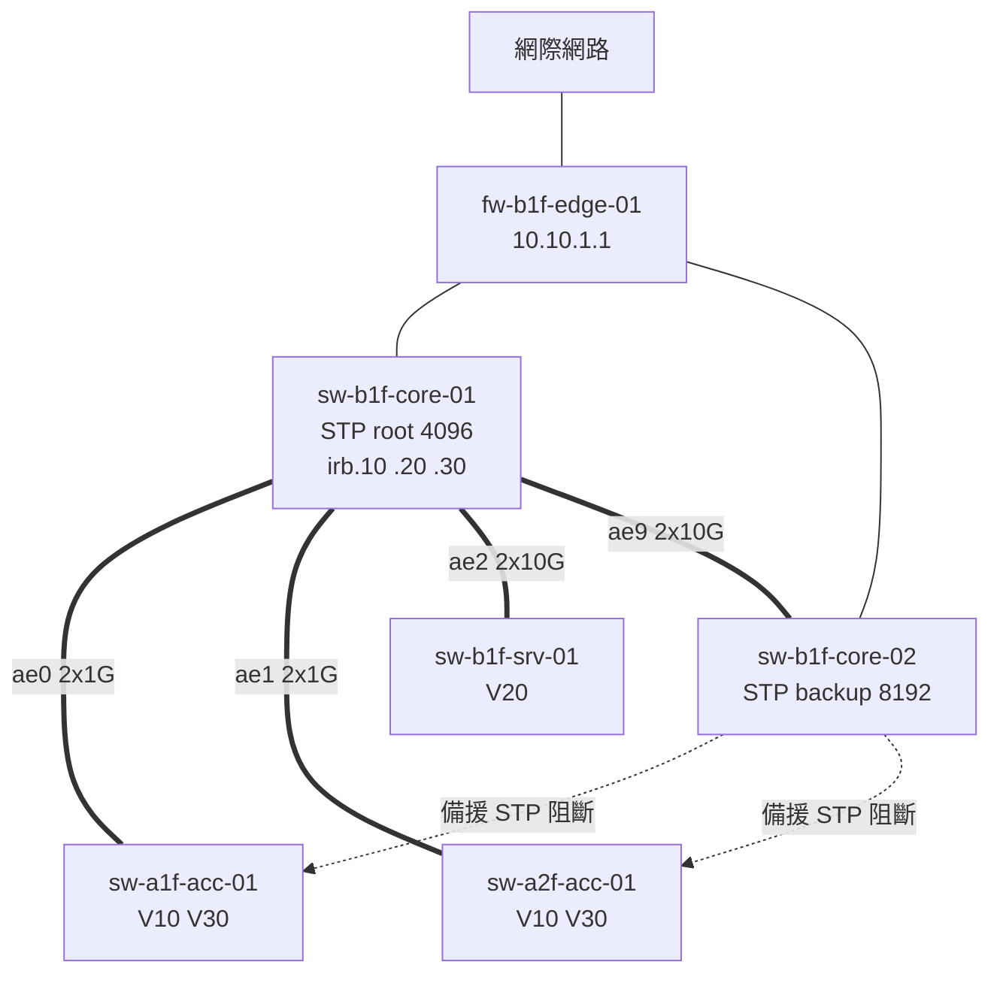

# 網路設備盤點與文件化

> [!abstract] 這篇你會學到
> - ★★★★★ **用 git 管交換器設定**：自動抓取、遮蔽機敏欄位、每日 diff、
>   查「這一行是誰什麼時候改的」—— 一套可以直接抄走的完整方案
> - ★★★★★ 為什麼**實體拓樸圖與邏輯拓樸圖必須分開畫**，各自該畫什麼、
>   以及「一張圖畫完所有東西」為什麼一定會過期作廢
> - ★★★★ **埠位表**：排錯速度的關鍵。什麼欄位不能少、怎麼從設備自動產生
> - ★★★★ **設備命名規範**：名字裡該有什麼、不該有什麼，
>   為什麼 `switch1` 這種名字會在三年後害死你
> - ★★★★ VLAN 與 IP 對照表怎麼設計，才不會兩年後沒人敢動任何一個網段
> - ★★★ 線路標示：兩端一致、標籤內容、與 `_表單範本/040-02-04-線路標示紀錄.docx` 的對應
> - ★★★★ 「文件一定會過期」這個事實怎麼處理 —— **能自動產生的就不要人工維護**

> [!warning] 未實機驗證
> 本篇的 JunOS 與 Cisco IOS 指令依官方文件整理，撰稿環境**沒有實體交換器可驗證**。
> 文中的自動化腳本邏輯在一般 Linux 環境可執行，但**與交換器互動的部分
> （SSH 免密碼、輸出格式解析）必須在你自己的環境調整後才能使用**。
> 請先在單一台測試設備上跑通，再擴大到全機房。

## 前置知識

- [[040-01-15-cmd-網路設備-Juniper與Cisco指令對照]] —— `show configuration | display set`、`show running-config`
- [[060-01-01-02-guide-Git-基本工作流程]] —— add／commit／log／diff
- [[060-01-01-04-guide-Git-遠端協作]] —— 推到私有 repo
- [[040-01-02-guide-網路設備-IP位址規劃與子網切分]] —— 網段規劃的基礎
- [[040-02-08-guide-機房-結構化佈線與標籤規範]] —— 佈線與標籤的實體規範
- [[040-02-11-guide-機房-資訊設備盤點]] —— 全機房設備盤點的上位流程

## 觀念說明

### 文件化不是為了應付稽核 ★★★★★

大部分機關的網路文件長這樣：三年前某個離職同仁畫的一張 Visio 圖，
上面有一半的設備已經不存在，另一半的 IP 早就換過。
沒有人相信它，所以沒有人維護它，所以它更不準 —— 這是一個閉環。

**文件真正的價值只有兩個場景**：

| 場景 | 沒有文件會怎樣 | 星級 |
| --- | --- | --- |
| **出事的時候** | 半夜三點，網路斷了，你不知道那條線通到哪裡、那台設備底下掛了什麼 | ★★★★★ |
| **人換掉的時候** | 唯一知道網路怎麼接的人離職／請假／被挖角，整個機關的網路變成黑盒子 | ★★★★★ |

> [!danger] ★★★★★ 「只有一個人知道」是最嚴重的維運風險
> 比設備老舊嚴重，比沒有備援嚴重。設備壞了可以買，備援可以補，
> 但**知識在一個人腦袋裡，那個人一走就歸零**。
>
> 判斷你的機關有沒有這個問題，只要問一句：
> **「如果網管今天離職，明天有人能在半小時內找出三樓 305 室那個網路孔接到哪一台交換器的哪一個埠嗎？」**
> 答不出來，就是有問題。

### 三個決定成敗的原則 ★★★★★

#### 原則一：能自動產生的，絕對不要人工維護 ★★★★★

人工維護的文件**一定會過期**，這不是紀律問題，是人性問題。
你不可能要求一個在半夜緊急處理故障的人，改完設定後還記得去更新 Excel。

| 資訊 | 該怎麼維護 | 星級 |
| --- | --- | --- |
| 設備設定內容 | ★★★★★ **完全自動**（每日 git 抓取） | ★★★★★ |
| 埠的描述與 VLAN | ★★★★★ **自動**（從設備抓 `show interfaces descriptions`） | ★★★★★ |
| 設備清單、韌體版本、序號 | ★★★★ 自動（從 `show version`／`show chassis hardware` 抓） | ★★★★ |
| 鄰居關係（誰接誰） | ★★★★ 自動（從 LLDP／CDP 抓） | ★★★★ |
| 邏輯拓樸圖 | ★★★ 半自動（結構穩定，變動少，人工維護可接受） | ★★★ |
| 實體佈線（牆孔 ↔ 配線架） | ★★ 只能人工（設備看不到牆內） | ★★★★ |
| 設備用途、負責人、採購資訊 | ★★ 只能人工 | ★★★ |

★★★★★ **把人工維護的量壓到最低，剩下的才有機會維護得起來。**

#### 原則二：一份資料只有一個權威來源 ★★★★★

同一個資訊出現在三個地方（Excel、Wiki、Visio 圖），
就一定會有兩個是錯的，而且你不知道哪一個是對的。

```text
❌ 錯誤做法：
   Excel 埠位表  ← 人工填
   Visio 拓樸圖  ← 人工畫，也標了 VLAN
   Wiki 頁面     ← 人工寫，也記了 IP
   → 三份互相矛盾，沒人知道哪份對

✅ 正確做法：
   設備本身（description、VLAN 設定）   ← 唯一權威來源  ★★★★★
        ↓ 自動抓取
   git repo（設定檔 + 產生的報表）
        ↓ 產生
   埠位表 / 設備清單 / 鄰居關係表      ← 唯讀，不手改
   
   拓樸圖與佈線紀錄                    ← 設備看不到的部分，人工維護
```

#### 原則三：描述欄位是免費的文件 ★★★★★

交換器的 `description` 欄位是**最被低估的維運工具**。
它零成本、跟設定綁在一起、改設定時順手就更新了、而且自動備份會一起抓走。

```text
[edit]
admin@sw-a1f-01# set interfaces ge-0/0/5 description "A1F-305-1 | PC-ACCT-05 | 會計室王小明"
admin@sw-a1f-01# set interfaces ae0 description "UPLINK-CORE01-ae0 | 2x1G LACP"
admin@sw-a1f-01# set interfaces ge-0/0/20 description "UNUSED | disabled 2026-06-01 by netadm"
```

★★★★★ **有 description 與沒有 description，排錯速度差十倍。**
`show interfaces descriptions` 一條指令就是一份即時的埠位表。

### 實體拓樸與邏輯拓樸：為什麼一定要分開 ★★★★★

這是網路文件化最常見的錯誤：**想用一張圖畫完所有東西**。
結果是一張誰都看不懂、而且一改就要重畫的圖。

| | 實體拓樸圖 | 邏輯拓樸圖 |
| --- | --- | --- |
| **回答的問題** | 「這條線從哪裡到哪裡？」 | 「流量怎麼走？」 |
| **畫什麼** | 機櫃、設備、實體埠、線材、樓層、機房位置 | VLAN、網段、閘道、路由、STP 樹、防火牆區域 |
| **看它的時候** | ★★★★★ 現場施工、拉線、換設備、找線 | ★★★★★ 規劃、排錯、資安稽核 |
| **多久變一次** | 常變（每次接新設備） | 少變（VLAN 規劃穩定） |
| **誰在維護** | 網管 + 佈線廠商 | 網管 |
| **可不可以自動產生** | ★★★ 部分可以（LLDP 鄰居） | ★★ 大多要人工 |

```text
┌─ 實體拓樸圖（回答「線在哪裡」）───────────────────────────┐
│                                                            │
│  B1 機房 RACK-01                                           │
│  ┌──────────────────────────┐                              │
│  │ U42  sw-core-01 (EX4300)  │                             │
│  │       xe-0/0/0 ──────────────────┐                      │
│  │       xe-0/0/1 ──────────────┐   │  多模 LC-LC 20m      │
│  │ U40  sw-core-02 (EX4300)  │  │   │                      │
│  └──────────────────────────┘  │   │                      │
│                                 │   │                      │
│  1F 弱電間 RACK-1F-01           │   │                      │
│  ┌──────────────────────────┐  │   │                      │
│  │ U20  sw-a1f-01 (EX2300)   │◀─┘   │                      │
│  │       ge-0/0/24 ─────────────────┘                      │
│  │       ge-0/0/25 ──────────────────                       │
│  │ U18  配線架 PP-1F-A (24port)                             │
│  │       Port 1-24 → 1F 各辦公室網路孔                       │
│  └──────────────────────────┘                              │
└────────────────────────────────────────────────────────────┘

┌─ 邏輯拓樸圖（回答「流量怎麼走」）─────────────────────────┐
│                                                            │
│              [ 網際網路 ]                                   │
│                    │                                        │
│              [ 防火牆 ] 10.10.1.1                           │
│                    │                                        │
│         ┌──── core-01 ────┐  ← STP 根橋 priority 4096       │
│         │  irb.10 10.10.10.1/24 (V10-OFFICE)                │
│         │  irb.20 10.10.20.1/24 (V20-SERVER)                │
│         │  irb.30 10.10.30.1/24 (V30-VOICE)                 │
│         └────────┬────────┘                                 │
│            ae0   │   ae1                                    │
│         ┌────────┴───┐  ┌─────────┐                         │
│         │  a1f-01    │  │ a2f-01  │                         │
│         │  V10, V30  │  │ V10,V30 │                         │
│         └────────────┘  └─────────┘                         │
└────────────────────────────────────────────────────────────┘
```

★★★★★ **注意兩張圖畫的是同一個網路，但完全沒有重疊的資訊。**
實體圖裡沒有 IP、沒有 VLAN；邏輯圖裡沒有機櫃、沒有埠號。
這就是「分開畫」的意思。

### 命名規範：名字是最便宜的文件 ★★★★★

```text
❌ 這些名字三年後會害死你：
   switch1、switch2、sw-new、sw-test、Cisco3750、我的交換器

✅ 好的名字自己就是文件：
   sw-b1f-core-01     ← 一看就知道：交換器、B1、核心層、第 1 台
   sw-a3f-acc-02      ← 交換器、3 樓、接取層、第 2 台
   fw-b1f-edge-01     ← 防火牆、B1、對外邊界、第 1 台
```

**推薦格式**：

```text
<設備類型>-<位置>-<角色>-<序號>
    │         │       │       │
    │         │       │       └─ 01, 02, ...（兩位數，留擴充空間）
    │         │       └───────── core / dist / acc / edge / mgmt / oob
    │         └───────────────── b1f / a1f / a2f / dc1 / branch-tp
    └─────────────────────────── sw / rtr / fw / ap / lb / srv
```

| 段 | 常用值 | 說明 | 星級 |
| --- | --- | --- | --- |
| 設備類型 | `sw`（交換器）`rtr`（路由器）`fw`（防火牆）`ap`（無線）`lb`（負載平衡） | 一眼分類 | ★★★★ |
| 位置 | `b1f`／`a1f`／`a2f`／`dc1`／`tp`（分部代號） | ★★★★★ 出事時直接知道去哪裡 | ★★★★★ |
| 角色 | `core`／`dist`（匯聚）／`acc`（接取）／`edge`／`oob`（帶外管理） | 知道它在架構的哪一層 | ★★★★ |
| 序號 | `01`、`02` | ★★★ 用兩位數，`sw-...-1` 與 `sw-...-10` 排序會亂 | ★★★ |

> [!danger] ★★★★★ 名字裡絕對不要放的東西
> | 不要放 | 為什麼 |
> | --- | --- |
> | **廠牌型號**（`cisco3750`、`ex2300`） | 汰換設備後名字就錯了，而且所有文件、監控、腳本都要改 |
> | **IP 位址**（`sw-10-10-1-2`） | 換網段就錯了 |
> | **人名**（`sw-wang`） | 人會離職、會調動 |
> | **`new`／`old`／`temp`／`test`** | ★★★★★ 三年後 `sw-new` 是機房裡最舊的那台。這是真的會發生的事 |
> | **中文或空格** | 很多工具、腳本、監控系統處理不了 |
> | **大寫混用** | 有些系統大小寫敏感有些不敏感，統一小寫最省事 |

★★★★ **改名的代價很高**（wikilink、監控、腳本、SSH config、憑證、稽核紀錄都會斷），
所以**第一次就要取對**。已經取錯的名字，趁汰換設備時一併改掉。

## 安裝或基礎操作

### 一、盤點：先知道你有什麼 ★★★★★

文件化的第一步不是畫圖，是**確認清單是完整的**。

#### 從設備自動抓基本資料

```text
admin@sw-a1f-01> show version
Hostname: sw-a1f-01
Model: ex2300-48p
Junos: 21.4R3-S4.9
JUNOS EX  Software Suite [21.4R3-S4.9]
...

admin@sw-a1f-01> show chassis hardware
Hardware inventory:
Item             Version  Part number  Serial number     Description
Chassis                                JW0123456789      EX2300-48P
Routing Engine 0                                         RE-EX2300-48P
FPC 0                                                    FPC
  PIC 0                                                  48x10/100/1000 Base-T
  Xcvr 48       REV 01   740-021308   AB1234567890      SFP+-10G-SR
  Xcvr 49       REV 01   740-021308   AB1234567891      SFP+-10G-SR
Power Supply 0   REV 03   740-045050   1EDN1234567       JPSU-715W-AC-AFO
Fan Tray 0                                               Fan Tray
```

★★★★★ **`show chassis hardware` 給你三個盤點必備欄位**：
機型、序號（保固查詢與資產編號用）、光模組清單（常被漏掉的資產）。

> [!info]- Cisco IOS 對照
> ```cisco
> sw-a1f-01# show version | include Model|System serial|Software
> sw-a1f-01# show inventory
> NAME: "1", DESCR: "WS-C2960X-48FPD-L"
> PID: WS-C2960X-48FPD-L , VID: V05  , SN: FOC1234X5YZ
>
> NAME: "GigabitEthernet1/0/49", DESCR: "SFP-10GBase-SR"
> PID: SFP-10G-SR        , VID: V03  , SN: AVD1234A5BC
> ```
> ★★★★ `show inventory` 會列出每一個光模組的序號，這在保固申訴時是必要資訊。

#### 抓所有埠的描述（即時埠位表）★★★★★

```text
admin@sw-a1f-01> show interfaces descriptions
Interface       Admin  Link  Description
ge-0/0/0        up     up    A1F-101-1 | PC-ACCT-01 | 會計室
ge-0/0/1        up     up    A1F-101-2 | PC-ACCT-02 | 會計室
ge-0/0/2        up     down  A1F-101-3 | 空位
ge-0/0/5        up     up    A1F-305-1 | PRN-ACCT-01 | 會計室印表機
ge-0/0/20       down   down  UNUSED | disabled 2026-06-01 by netadm
ge-0/0/24       up     up    UPLINK-CORE01-ae0-member
ge-0/0/25       up     up    UPLINK-CORE01-ae0-member
ae0             up     up    UPLINK-CORE01 | 2x1G LACP
```

★★★★★ **這一條指令的輸出，就是你的埠位表。**
只要 description 有維護，你永遠不需要另外開 Excel。

> [!tip] ★★★★★ description 的格式要統一
> 建議格式：`<牆孔編號> | <設備代號> | <使用單位或用途>`
>
> 用 `|` 分隔的好處：**可以用腳本切成欄位**，直接產生 CSV／表格。
> 統一格式之後，這件事就從「文件」變成「資料」。

#### 抓鄰居關係（自動產生拓樸的基礎）★★★★

```text
admin@sw-a1f-01> show lldp neighbors
Local Interface    Parent Interface    Chassis Id          Port info          System Name
ge-0/0/24          ae0                 00:11:22:33:44:55   ge-0/0/0           sw-core-01
ge-0/0/25          ae0                 00:11:22:33:44:55   ge-0/0/1           sw-core-01
ge-0/0/10          -                   00:aa:bb:11:22:33   1                  ap-a1f-01
```

★★★★★ **LLDP 是自動產生拓樸圖的基礎。** 全機房每台跑一次，
你就有完整的「誰接誰的哪個埠」關係表，而且**永遠是最新的**。

前提是 LLDP 有開：

```text
[edit]
admin@sw-a1f-01# set protocols lldp interface all
admin@sw-a1f-01# set protocols lldp-med interface all
```

> [!info]- Cisco IOS 對照
> ```cisco
> sw-a1f-01(config)# lldp run                    ! 標準 LLDP，跨廠牌可用 ★★★★★
> sw-a1f-01(config)# cdp run                     ! Cisco 私有，只在 Cisco 之間
>
> sw-a1f-01# show lldp neighbors
> Device ID           Local Intf     Hold-time  Capability      Port ID
> sw-core-01          Gi1/0/24       120        B               ge-0/0/0
> ap-a1f-01           Gi1/0/10       120        B,W             1
>
> sw-a1f-01# show cdp neighbors detail
> ```
> ★★★★★ **混廠環境一定要開 LLDP**（標準協定），CDP 只在 Cisco 之間有用。
> 兩個都開也沒關係，資訊互補。
>
> ★★★★ 安全考量：對外或不受信任的網段應該關掉 LLDP／CDP，
> 因為它會洩漏設備型號與軟體版本給潛在攻擊者。
> ```cisco
> sw-a1f-01(config-if)# no lldp transmit
> sw-a1f-01(config-if)# no cdp enable
> ```

### 二、埠位表：排錯速度的關鍵 ★★★★★

使用者說「305 室的網路孔不能用」。沒有埠位表，你要花 20 分鐘一台台找；
有埠位表，10 秒鐘。

#### 必要欄位 ★★★★★

| 欄位 | 範例 | 為什麼需要 | 星級 |
| --- | --- | --- | --- |
| **牆孔編號** | `A1F-305-1` | ★★★★★ 使用者唯一看得到的東西 | ★★★★★ |
| **配線架 + 埠** | `PP-1F-A / 17` | 找線的中繼點 | ★★★★ |
| **交換器名稱** | `sw-a1f-01` | 你要登入哪一台 | ★★★★★ |
| **交換器埠** | `ge-0/0/17` | 精確定位 | ★★★★★ |
| **VLAN** | `V10-OFFICE (10)` | 判斷設定對不對 | ★★★★ |
| **接什麼設備** | `PC-ACCT-05` | 知道影響誰 | ★★★★ |
| **使用單位／聯絡人** | `會計室 / 王小明 分機 1234` | ★★★★ 出事時打給誰 | ★★★★ |
| **狀態** | 使用中／保留／停用 | 避免誤動 | ★★★ |
| **最後更新** | `2026-09-02` | 判斷可不可信 | ★★★ |

#### 牆孔編號規則 ★★★★

```text
<樓層>-<房號>-<孔位序號>
   │       │        │
  A1F     305       1     → A1F-305-1
```

★★★★★ **這個編號必須實際貼在牆孔面板上**，而且**交換器的 description
第一段就是它**。這樣「使用者念的號碼」與「交換器上看到的字串」完全一致，
中間不需要任何查表。

#### 用腳本從設備產生埠位表 ★★★★★

前提：description 格式統一為 `<牆孔> | <設備> | <單位>`。

```bash
#!/usr/bin/env bash
# gen-portmap.sh —— 從交換器產生 CSV 埠位表
# 用法：./gen-portmap.sh > portmap-$(date +%Y%m%d).csv
set -euo pipefail

SW_LIST="${SW_LIST:-/etc/netops/switches.txt}"
SSH_USER="${SSH_USER:-netadm}"

echo "交換器,埠,Admin,Link,牆孔編號,設備代號,使用單位"

while read -r sw; do
    [[ -z "$sw" || "$sw" == \#* ]] && continue

    ssh -o ConnectTimeout=10 -o BatchMode=yes "${SSH_USER}@${sw}" \
        'show interfaces descriptions' 2>/dev/null |
    tail -n +2 |
    while read -r iface admin link desc; do
        [[ -z "$iface" ]] && continue
        # description 以 " | " 分三段，缺的補空白
        jack=$(  echo "$desc" | awk -F' *\\| *' '{print $1}')
        device=$(echo "$desc" | awk -F' *\\| *' '{print $2}')
        unit=$(  echo "$desc" | awk -F' *\\| *' '{print $3}')
        printf '%s,%s,%s,%s,"%s","%s","%s"\n' \
            "$sw" "$iface" "$admin" "$link" "$jack" "$device" "$unit"
    done
done < "$SW_LIST"
```

執行結果：

```bash
$ ./gen-portmap.sh > /var/lib/netops/portmap-20260902.csv
$ head -5 /var/lib/netops/portmap-20260902.csv
交換器,埠,Admin,Link,牆孔編號,設備代號,使用單位
sw-a1f-01,ge-0/0/0,up,up,"A1F-101-1","PC-ACCT-01","會計室"
sw-a1f-01,ge-0/0/1,up,up,"A1F-101-2","PC-ACCT-02","會計室"
sw-a1f-01,ge-0/0/2,up,down,"A1F-101-3","空位",""
sw-a1f-01,ge-0/0/5,up,up,"A1F-305-1","PRN-ACCT-01","會計室印表機"
```

★★★★★ **這份 CSV 每天自動重跑，永遠是最新的。**
你要維護的只有交換器上的 description —— 而那本來就是改設定時順手做的事。

★★★ 腳本的安全預設（`set -euo pipefail`）與寫法說明見
[[070-05-01-guide-Shell-Bash腳本結構與安全預設]]。

#### 埠位表與紙本表單的關係 ★★★

vault 的 `_表單範本/040-02-02-設備盤點表.docx` 是**年度盤點用的紙本表單**，
用途與上面的 CSV 不同：

| | 自動產生的 CSV | `040-02-02-設備盤點表.docx` |
| --- | --- | --- |
| 來源 | 設備本身 | 人工現場核對 |
| 頻率 | 每天 | 每年（或半年） |
| 內容 | 埠、VLAN、description | 資產編號、序號、保固、位置、負責人 |
| 用途 | 日常排錯 | ★★★★ 財產盤點、稽核佐證、保固管理 |
| 誰簽名 | 無 | ★★★★ 盤點人 + 主管 |

★★★★ **兩者要互相對照**：年度盤點時把 CSV 印出來，
到現場逐台核對序號與位置，發現不符就是資產有異動沒登記。

### 三、VLAN 與 IP 對照表 ★★★★

這份表的價值在於**避免有人在不知情的狀況下用掉一個網段**。

| VLAN ID | VLAN 名稱 | 網段 | 閘道 | 用途 | DHCP | 負責單位 |
| --- | --- | --- | --- | --- | --- | --- |
| 10 | `V10-OFFICE` | 10.10.10.0/24 | 10.10.10.1 | 一般辦公 PC | ✅ .100-.200 | 資訊室 |
| 20 | `V20-SERVER` | 10.10.20.0/24 | 10.10.20.1 | 內部伺服器 | ❌ 固定 IP | 資訊室 |
| 30 | `V30-VOICE` | 10.10.30.0/24 | 10.10.30.1 | IP 電話 | ✅ .50-.250 | 總務室 |
| 40 | `V40-GUEST` | 10.10.40.0/24 | 10.10.40.1 | 訪客無線 | ✅ .10-.250 | 資訊室 |
| 50 | `V50-CCTV` | 10.10.50.0/24 | 10.10.50.1 | 監視系統 | ❌ 固定 IP | 政風室 |
| 99 | `V99-MGMT` | 10.10.99.0/24 | 10.10.99.1 | ★★★★★ 設備管理（帶外） | ❌ 固定 IP | 資訊室 |
| 999 | `V999-NATIVE` | — | — | ★★★★ Trunk native（無主機） | — | — |
| — | — | 10.10.60.0/24 | — | **保留（未來擴充）** | — | — |
| — | — | 10.10.70.0/24 | — | **保留（未來擴充）** | — | — |

★★★★★ **「保留」那幾列比已使用的列更重要。**
沒有明確標「保留」的網段，下一個人就會拿去用，然後你未來的規劃就沒空間了。

> [!tip] ★★★★ 三個規劃慣例，長期省下大量麻煩
> 1. **VLAN ID 與第三個 octet 對齊**：VLAN 10 → 10.10.**10**.0/24，
>    VLAN 20 → 10.10.**20**.0/24。看到 IP 就知道 VLAN，看到 VLAN 就知道網段。★★★★★
> 2. **閘道固定用 `.1`**，設備管理 IP 固定用 `.2`、`.3`（多台核心）。
>    ★★★★ 全機關一致，排錯時不用查。
> 3. **VLAN ID 留間隔**：10、20、30 而不是 1、2、3。
>    日後要在 10 與 20 之間插一個，還有 11～19 可以用。★★★★

> [!danger] ★★★★★ 不要用 VLAN 1
> VLAN 1 是所有交換器的預設 VLAN，所有埠出廠就在裡面。
> 用它當業務 VLAN 的後果：
> - **任何一個沒設定的埠，插上線就自動進入你的業務網段** ★★★★★
> - trunk 的 native VLAN 預設也是 1，設定不一致時流量會亂竄
> - 這是 TWGCB 與各種資安基準都會扣分的項目
>
> **正確做法**：
> ```text
> set vlans V999-NATIVE vlan-id 999
> set interfaces ae0 native-vlan-id 999          ← native 用一個沒有主機的 VLAN
> ```
> 未使用的埠一律 `disable`，或丟到一個什麼都連不到的隔離 VLAN。

### 四、線路標示 ★★★★

#### 標示原則 ★★★★★

| 原則 | 說明 | 星級 |
| --- | --- | --- |
| **兩端都要貼** | 只貼一端等於沒貼 —— 你在另一端還是要拔線測試 | ★★★★★ |
| **標籤內容 = 對端資訊** | 貼在 A 端的標籤寫「到 B 在哪裡」 | ★★★★★ |
| **貼在離接頭 5～10 cm 處** | 太近會妨礙插拔，太遠會被線材整理蓋住 | ★★★ |
| **用標籤印表機，不要手寫** | 手寫會褪色、會看不懂、會歪 | ★★★★ |
| **用旗式標籤或纏繞式** | 一般貼紙會脫落 | ★★★ |
| **顏色編碼** | 不同用途不同色（管理／業務／上行／跨機櫃） | ★★★ |

#### 標籤內容格式 ★★★★

```text
機櫃內跳線（交換器 → 配線架）：
   A 端（交換器上）：  PP-1F-A/17
   B 端（配線架上）：  SW-A1F-01/ge-0/0/17

跨機櫃／跨樓層（交換器 → 交換器）：
   A 端（a1f-01 上）： sw-core-01 ge-0/0/0 [B1-RACK01]
   B 端（core-01 上）：sw-a1f-01 ge-0/0/24 [1F-RACK01]

水平佈線（配線架 → 牆孔）：
   配線架端：  A1F-305-1
   牆孔面板：  PP-1F-A/17
```

★★★★★ **重點：標籤上寫的是「這條線的另一端在哪裡」，
不是「這一端是什麼」。** 因為你看得到這一端，看不到的是另一端。

#### 顏色編碼建議 ★★★

| 顏色 | 用途 | 星級 |
| --- | --- | --- |
| 藍色 | 一般使用者接取 | ★★ |
| 黃色 | 伺服器 | ★★ |
| 紅色 | ★★★★★ **設備管理／帶外管理**（最不能亂動的） | ★★★★ |
| 綠色 | 上行／跨機櫃 | ★★★ |
| 灰／黑 | 電話／其他 | ★★ |

★★★ 顏色編碼不是必要的，但**如果要做就要全機關一致，並寫進規範文件**。
半套的顏色編碼比沒有更糟（你會誤以為紅色是管理線，結果它只是當時剛好沒有藍線）。

#### 與表單的對應 ★★★★

vault 的 `_表單範本/040-02-04-線路標示紀錄.docx` 用來記錄**佈線施工的成果**：
哪一天、誰施工、拉了哪幾條、兩端標籤內容、測試結果。

★★★★★ **佈線驗收一定要在這份表單上留下測試結果**，至少包含：
- 8 芯導通測試（1000BASE-T 需要 4 對全通，見 [[040-01-17-guide-網路設備-交換器故障排除]]）
- 接上交換器後協商速率為 1000M full-duplex
- 清零計數 10 分鐘後 CRC = 0

沒有這三項驗收，你會在半年後遇到「只跑 100M 而且一直 CRC」的故障，
而且找不到人負責。

## 進階應用

### 用 git 管交換器設定：完整方案 ★★★★★

**這是本篇最有價值的一節。** 做完之後你會擁有：

| 能力 | 說明 |
| --- | --- |
| **每日自動備份** | 不依賴任何人記得 |
| **完整變更歷史** | `git log -p` 看每一次改了什麼 |
| **精確歸責** | `git blame` 查「這一行是誰什麼時候加的」 ★★★★★ |
| **設定漂移偵測** | 有人在設備上手改沒走流程，隔天 diff 就會抓到 ★★★★★ |
| **災難還原** | 設備炸掉，從 repo 撈出昨天的設定灌回去 ★★★★★ |
| **稽核佐證** | 「請提供近一年的網路設備變更紀錄」→ `git log` ★★★★ |

#### 架構 ★★★★

```text
  備份主機（Linux，10.10.99.30）
  ┌──────────────────────────────────────────────┐
  │  systemd timer（每天 03:00）                  │
  │       ↓                                       │
  │  /opt/netops/backup-configs.sh               │
  │       ↓ SSH（金鑰認證，唯讀帳號）★★★★★        │
  │  各交換器：show configuration | display set   │
  │       ↓                                       │
  │  遮蔽機敏欄位（密碼雜湊、community、secret）★★★★★│
  │       ↓                                       │
  │  /srv/netops/switch-configs/  (git repo)     │
  │       ↓ git commit + push                     │
  │  私有 Git 伺服器 / GitLab（內網）★★★★★         │
  └──────────────────────────────────────────────┘
```

#### 步驟 1：在交換器上開一個唯讀備份帳號 ★★★★★

**不要用 super-user 帳號做自動備份。**
備份只需要 `show`，給它 read-only 權限就好 —— 這樣萬一備份主機被入侵，
攻擊者也改不了設定。

```text
[edit]
admin@sw-a1f-01# set system login user backup class read-only
admin@sw-a1f-01# set system login user backup authentication ssh-rsa "ssh-rsa AAAAB3NzaC1yc2E... netops-backup@10.10.99.30"
admin@sw-a1f-01# commit
```

> [!info]- Cisco IOS 對照：唯讀備份帳號
> ```cisco
> sw-a1f-01(config)# username backup privilege 1 secret <強密碼>
> ! 用 AAA 精確限制只能跑 show running-config
> sw-a1f-01(config)# aaa new-model
> sw-a1f-01(config)# aaa authorization exec default local
> sw-a1f-01(config)# aaa authorization commands 1 default local
> sw-a1f-01(config)# privilege exec level 1 show running-config
> ```
> ★★★★ IOS 的 `show running-config` 預設需要 privilege 15，
> 用 `privilege exec level 1 show running-config` 把它降到 level 1，
> 這樣 backup 帳號不用給 15 級權限。
> **降權限指令要小心測試**，設錯會讓一般帳號拿到過多權限。

#### 步驟 2：備份主機的 SSH 設定 ★★★★

```bash
$ sudo useradd -r -m -d /var/lib/netops -s /bin/bash netops
$ sudo -u netops ssh-keygen -t ed25519 -N '' -f /var/lib/netops/.ssh/id_ed25519 \
    -C 'netops-backup@10.10.99.30'
$ sudo -u netops cat /var/lib/netops/.ssh/id_ed25519.pub
ssh-ed25519 AAAAC3NzaC1lZDI1NTE5AAAAI... netops-backup@10.10.99.30
```

★★★★ 把公鑰貼到每一台設備上。**私鑰只留在備份主機，權限 600。**

```bash
$ sudo -u netops tee /var/lib/netops/.ssh/config >/dev/null <<'EOF'
Host *
    User backup
    IdentityFile /var/lib/netops/.ssh/id_ed25519
    StrictHostKeyChecking yes
    UserKnownHostsFile /var/lib/netops/.ssh/known_hosts
    ConnectTimeout 15
    BatchMode yes
EOF
$ sudo chmod 600 /var/lib/netops/.ssh/config
```

★★★★★ **`StrictHostKeyChecking yes` 不要改成 `no`。**
第一次連線時人工確認並寫進 `known_hosts`，之後如果設備 host key 變了
（可能是設備被換掉、或有人在中間攔截），腳本會失敗而不是默默連上去。

#### 步驟 3：設備清單 ★★★

```bash
$ sudo mkdir -p /etc/netops
$ sudo tee /etc/netops/switches.txt >/dev/null <<'EOF'
# 格式：主機名稱  平台(junos|ios)
# 更新此清單後請一併更新 邏輯拓樸圖 與 設備盤點表
sw-core-01   junos
sw-core-02   junos
sw-a1f-01    junos
sw-a2f-01    junos
sw-b1f-01    ios
sw-srv-01    junos
EOF
```

#### 步驟 4：備份腳本 ★★★★★

```bash
#!/usr/bin/env bash
# /opt/netops/backup-configs.sh
# 每日抓取所有網路設備設定，遮蔽機敏欄位後 commit 進 git
set -euo pipefail

REPO="/srv/netops/switch-configs"
LIST="/etc/netops/switches.txt"
LOG="/var/log/netops/backup-$(date +%Y%m%d).log"
FAILED=()

mkdir -p "$(dirname "$LOG")" "$REPO"
exec > >(tee -a "$LOG") 2>&1

echo "===== 備份開始 $(date '+%F %T') ====="

cd "$REPO"
[[ -d .git ]] || git init -q

# ── 遮蔽機敏欄位 ────────────────────────────────────────────
# ★★★★★ 密碼雜湊、SNMP community、RADIUS secret 不進 repo
mask_secrets() {
    sed -E \
        -e 's/("\$[0-9][A-Za-z0-9$./]*")/"<MASKED-HASH>"/g' \
        -e 's/(encrypted-password|plain-text-password) +[^ ]+/\1 <MASKED>/g' \
        -e 's/(community) +[^ ]+/\1 <MASKED>/g' \
        -e 's/(secret) +[0-9] +[^ ]+/\1 <MASKED>/g' \
        -e 's/(pre-shared-key +ascii-text) +[^ ]+/\1 <MASKED>/g'
}

fetch_junos() {   # $1 = hostname
    ssh "$1" 'show configuration | display set | no-more'
}

fetch_ios() {     # $1 = hostname
    ssh "$1" 'terminal length 0 ; show running-config'
}

while read -r host platform; do
    [[ -z "${host:-}" || "$host" == \#* ]] && continue
    printf '  %-14s ' "$host"

    case "$platform" in
        junos) raw=$(fetch_junos "$host" 2>/dev/null) || raw="" ;;
        ios)   raw=$(fetch_ios   "$host" 2>/dev/null) || raw="" ;;
        *)     echo "未知平台 '$platform'，跳過"; continue ;;
    esac

    # ★★★★★ 抓到空的或太短，一定是失敗 —— 不要用空檔覆蓋掉好的備份
    if [[ ${#raw} -lt 500 ]]; then
        echo "失敗（輸出過短或無回應）"
        FAILED+=("$host")
        continue
    fi

    printf '%s\n' "$raw" | mask_secrets > "${host}.conf"
    lines=$(wc -l < "${host}.conf")
    echo "OK（${lines} 行）"
done < "$LIST"

# ── commit ─────────────────────────────────────────────────
git add -A
if git diff --cached --quiet; then
    echo "無變更，不建立 commit"
else
    changed=$(git diff --cached --name-only | tr '\n' ' ')
    git -c user.name='netops-backup' -c user.email='netops@example.gov.tw' \
        commit -q -m "auto: 每日設定備份 $(date '+%F') [${changed}]"
    echo "已 commit：${changed}"
    git push -q origin main 2>/dev/null || echo "  !! push 失敗，稍後重試"
fi

if (( ${#FAILED[@]} > 0 )); then
    echo "!! 以下設備備份失敗：${FAILED[*]}"
    exit 1
fi
echo "===== 備份完成 $(date '+%F %T') ====="
```

> [!danger] ★★★★★ 腳本裡最重要的一行是 `if [[ ${#raw} -lt 500 ]]`
> **絕對不能讓「連不上設備」變成「用空檔覆蓋掉好的備份」。**
> 沒有這道檢查的話，某天設備維護中連不上，腳本會寫入一個空檔並 commit，
> 你的備份就變成一份空白 —— 而且看起來一切正常。
>
> 這是自動備份最容易出的致命錯誤。**同樣的邏輯也適用於資料庫備份、
> 檔案備份**：任何備份腳本都必須驗證「抓到的東西合不合理」。

#### 步驟 5：git 設定與初始化 ★★★★

```bash
$ sudo mkdir -p /srv/netops/switch-configs
$ sudo chown -R netops:netops /srv/netops
$ sudo -u netops git -C /srv/netops/switch-configs init
$ sudo -u netops tee /srv/netops/switch-configs/.gitignore >/dev/null <<'EOF'
*.tmp
*.bak
*.log
EOF
$ sudo -u netops tee /srv/netops/switch-configs/README.md >/dev/null <<'EOF'
# 網路設備設定備份

每日 03:00 由 /opt/netops/backup-configs.sh 自動抓取。

- 檔名 = 設備 hostname
- 密碼雜湊、SNMP community、RADIUS secret 已遮蔽為 <MASKED>
- **這個 repo 仍屬機敏資料**：含完整網段規劃、ACL、設備型號
  → 僅限資訊室存取，不可上傳公開平台

## 常用查詢
    git log --oneline -20                     # 最近 20 次備份
    git log -p -- sw-a1f-01.conf              # 某台的完整變更史
    git diff HEAD~1 HEAD                      # 昨天到今天改了什麼
    git blame sw-a1f-01.conf | grep ge-0/0/17 # 這一行是誰何時加的
EOF
$ sudo -u netops git -C /srv/netops/switch-configs add -A
$ sudo -u netops git -C /srv/netops/switch-configs commit -m "chore: 初始化網路設定備份 repo"
```

> [!danger] ★★★★★ 這個 repo 必須是私有的
> 就算遮蔽了密碼，設定檔仍然包含：
> **完整網段規劃、ACL 規則、設備型號與韌體版本（可查已知漏洞）、
> 管理 IP、syslog／RADIUS 伺服器位址、VLAN 用途**。
>
> 對攻擊者來說，這等於是整張攻擊地圖。
> **只能放內網私有 Git 伺服器，絕不可推到 GitHub 等公開平台**，
> 即使是「私有 repo」也要評估過。存取權限限資訊室。

#### 步驟 6：排程 ★★★★

```ini
# /etc/systemd/system/netops-backup.service
[Unit]
Description=網路設備設定每日備份
After=network-online.target
Wants=network-online.target

[Service]
Type=oneshot
User=netops
Group=netops
ExecStart=/opt/netops/backup-configs.sh
```

```ini
# /etc/systemd/system/netops-backup.timer
[Unit]
Description=每日 03:00 備份網路設備設定

[Timer]
OnCalendar=*-*-* 03:00:00
RandomizedDelaySec=300
Persistent=true

[Install]
WantedBy=timers.target
```

```bash
$ sudo systemctl daemon-reload
$ sudo systemctl enable --now netops-backup.timer
$ systemctl list-timers netops-backup.timer
NEXT                        LEFT     LAST PASSED UNIT                  ACTIVATES
Wed 2026-09-03 03:00:00 CST 11h left n/a  n/a    netops-backup.timer   netops-backup.service
```

★★★★ 先手動跑一次確認：

```bash
$ sudo systemctl start netops-backup.service
$ sudo journalctl -u netops-backup.service -n 30 --no-pager
Sep 02 16:45:01 backup01 backup-configs.sh[8123]: ===== 備份開始 2026-09-02 16:45:01 =====
Sep 02 16:45:03 backup01 backup-configs.sh[8123]:   sw-core-01     OK（438 行）
Sep 02 16:45:05 backup01 backup-configs.sh[8123]:   sw-core-02     OK（441 行）
Sep 02 16:45:07 backup01 backup-configs.sh[8123]:   sw-a1f-01      OK（312 行）
Sep 02 16:45:09 backup01 backup-configs.sh[8123]:   sw-a2f-01      OK（308 行）
Sep 02 16:45:12 backup01 backup-configs.sh[8123]:   sw-b1f-01      OK（521 行）
Sep 02 16:45:14 backup01 backup-configs.sh[8123]:   sw-srv-01      OK（289 行）
Sep 02 16:45:14 backup01 backup-configs.sh[8123]: 已 commit：sw-a1f-01.conf
Sep 02 16:45:15 backup01 backup-configs.sh[8123]: ===== 備份完成 2026-09-02 16:45:15 =====
```

#### 步驟 7：日常使用 ★★★★★

**看昨天到今天改了什麼**（每天早上花 30 秒做這件事，價值極高）：

```bash
$ cd /srv/netops/switch-configs
$ git diff HEAD~1 HEAD
diff --git a/sw-a1f-01.conf b/sw-a1f-01.conf
index 3a4b5c6..7d8e9f0 100644
--- a/sw-a1f-01.conf
+++ b/sw-a1f-01.conf
@@ -142,7 +142,7 @@ set interfaces ge-0/0/16 unit 0 family ethernet-switching vlan members V10-OFFICE
 set interfaces ge-0/0/17 description "A1F-305-1 | PC-ACCT-05 | 會計室"
 set interfaces ge-0/0/17 unit 0 family ethernet-switching interface-mode access
-set interfaces ge-0/0/17 unit 0 family ethernet-switching vlan members V10-OFFICE
+set interfaces ge-0/0/17 unit 0 family ethernet-switching vlan members V20-SERVER
 set interfaces ge-0/0/18 description "A1F-305-2 | 空位"
```

★★★★★ **這就是「設定漂移偵測」**：有人把一個辦公室的埠改到伺服器 VLAN，
而且沒有走變更流程。**你在事故發生前就會知道。**

**查某一行是誰什麼時候加的**：

```bash
$ git blame sw-a1f-01.conf | grep 'ge-0/0/17.*vlan members'
7d8e9f01 (netops-backup 2026-09-02 03:00:14 +0800 143) set interfaces ge-0/0/17 unit 0 family ethernet-switching vlan members V20-SERVER
```

★★★ 因為 commit 者永遠是 `netops-backup`，git 只能告訴你「哪一天」。
**「是誰」要對照設備上的 commit 履歷**：

```text
admin@sw-a1f-01> show system commit | head -3
0   2026-09-01 15:42:08 CST by wangxm via cli
    "調整會計室測試埠"                          ← 就是他 ★★★★★
1   2026-08-28 09:11:33 CST by netadm via cli
```

★★★★★ **git 給你「什麼時候變的、變成什麼」，設備的 commit 履歷給你「是誰」。
兩者搭配才完整。**

**災難還原**：

```bash
$ git show HEAD~5:sw-a1f-01.conf > /tmp/sw-a1f-01-restore.set
$ scp /tmp/sw-a1f-01-restore.set netadm@sw-a1f-01:/var/tmp/
```

```text
admin@sw-a1f-01> configure
[edit]
admin@sw-a1f-01# load override /var/tmp/sw-a1f-01-restore.set
load complete
admin@sw-a1f-01# show | compare                      ← ★★★★★ 一定要先看
admin@sw-a1f-01# commit confirmed 5
```

> [!danger] ★★★★★ 還原前必須處理被遮蔽的欄位
> repo 裡的密碼是 `<MASKED>`，**直接 `load override` 會把所有帳號密碼變成
> 字面上的 `<MASKED>`，你就登不進去了**。
>
> 還原流程必須是：
> 1. `load override` 載入草稿
> 2. **`show | compare` 檢查有沒有 `<MASKED>` 字樣** ★★★★★
> 3. 手動把密碼／community／secret 補回正確值（從密碼保管系統取得）
> 4. 再 `commit confirmed`
>
> 這也是為什麼**密碼必須另外存在密碼保管系統**，不能只依賴設定備份。

#### 步驟 8：設定基準比對（進階）★★★★

除了「跟昨天比」，還可以「跟標準基準比」——
確認每一台交換器都有必要的安全設定。

```bash
#!/usr/bin/env bash
# check-baseline.sh —— 檢查每台設備是否符合最低安全基準
set -euo pipefail

REPO="/srv/netops/switch-configs"
FAIL=0

# 每台 JunOS 設備都必須有這些設定
declare -a MUST_HAVE=(
    'set system services ssh'
    'set system syslog host'
    'set system ntp server'
    'set protocols lldp interface all'
    'set protocols rstp bpdu-block-on-edge'
)
# 這些設定不應該存在
declare -a MUST_NOT=(
    'set system services telnet'
    'set system services web-management http '
)

for f in "$REPO"/*.conf; do
    host=$(basename "$f" .conf)
    for pat in "${MUST_HAVE[@]}"; do
        grep -qF "$pat" "$f" || { echo "[缺少] $host : $pat"; FAIL=1; }
    done
    for pat in "${MUST_NOT[@]}"; do
        grep -qF "$pat" "$f" && { echo "[違規] $host : $pat"; FAIL=1; }
    done
done

(( FAIL == 0 )) && echo "所有設備符合基準"
exit "$FAIL"
```

```bash
$ ./check-baseline.sh
[缺少] sw-b1f-01 : set protocols rstp bpdu-block-on-edge
[違規] sw-b1f-01 : set system services telnet
```

★★★★★ **這一支腳本每天跑一次，就是一份自動化的資安稽核報告。**
稽核來的時候你不用臨時抱佛腳。

### 拓樸圖：用什麼工具、畫到什麼程度 ★★★★

#### 工具選擇 ★★★

| 工具 | 優點 | 缺點 | 建議 |
| --- | --- | --- | --- |
| **draw.io / diagrams.net** | 免費、跨平台、可存 `.drawio.svg`（可版控） | 需要人工畫 | ★★★★★ **首選** |
| **Mermaid** | 純文字、可版控、可 diff、Obsidian 原生支援 | 佈局控制弱，複雜圖會很醜 | ★★★★ 邏輯圖／簡單圖很好用 |
| Visio | 功能強、公家單位常用 | 授權貴、二進位檔難版控 | ★★ 已有授權才用 |
| 監控系統自動拓樸 | 自動、永遠最新 | ★★★ 佈局通常很亂，只能參考 | ★★★ 輔助 |
| 手繪拍照 | 快 | 會遺失、看不懂 | ★ 只當臨時筆記 |

★★★★★ **不管用什麼工具，圖檔一定要進版控**：
`.drawio.svg`（draw.io 的可編輯 SVG）與 Mermaid 都是文字格式，可以 diff。
純 `.vsdx` 或 `.png` 進了 git 也只是「一堆二進位大檔」，看不出改了什麼。

#### Mermaid 畫邏輯拓樸 ★★★★

Obsidian 原生支援，寫在筆記裡就會渲染：



★★★ 用實線表示 forwarding、虛線表示 STP 阻斷的備援路徑 —— 
**一眼就知道正常狀況下流量走哪裡**。

#### 圖上該有什麼、不該有什麼 ★★★★★

| 一定要有 | 為什麼 |
| --- | --- |
| **圖的類型**（實體／邏輯） | 避免混淆 ★★★★ |
| **最後更新日期與更新者** | ★★★★★ 沒有日期的圖沒有人敢相信 |
| **設備名稱**（用命名規範的名字） | 對得上其他文件 ★★★★★ |
| **連線的介面名稱** | 排錯時直接知道要看哪個埠 ★★★★ |
| **圖例**（線型、顏色、圖示的意義） | ★★★★ |

| 不要放 | 為什麼 |
| --- | --- |
| **每一個使用者埠** | 圖會爆炸，而且埠位表已經有了 ★★★★ |
| **密碼、community、金鑰** | ★★★★★ 圖會被印出來、被 email、被放進簡報 |
| **太細的實作細節**（如每條 ACL） | 圖會過期得更快 |
| **已經拆掉的設備** | 直接刪，不要留著「以防萬一」 ★★★ |

> [!warning] ★★★★★ 拓樸圖上的日期是最重要的一個欄位
> 一張沒有日期的圖，看的人永遠要問「這還準嗎？」，
> 而問了也沒人能回答，所以最後大家都不看了。
>
> **每張圖的角落固定放三行**：
> ```text
> 更新日期：2026-09-02
> 更新者：  netadm
> 對應變更：CHG-2026-0921
> ```

## 完整實戰範例

**情境**：你剛接手一個「完全沒有文件」的機關網路。
六台交換器、大約 200 個使用者埠、沒有拓樸圖、沒有埠位表、
前任網管已離職、只留下一份三年前的 Excel。

**目標**：兩週內建立一套「能自動維持準確」的文件體系。

### 第 1 天：清點設備 ★★★★★

**先確認你有幾台設備。** 不能只信 Excel。

```bash
# 掃管理網段，找出所有開 SSH 的設備
$ nmap -p 22 --open -oG - 10.10.99.0/24 | awk '/Ports:/ {print $2}'
10.10.99.1
10.10.99.2
10.10.99.3
10.10.99.11
10.10.99.12
10.10.99.13
10.10.99.21          ← Excel 上沒有這一台 ★★★★★
```

★★★★★ **掃出來的數量與 Excel 對不上是常態。**
多出來的那台要親自去現場確認是什麼（可能是前任裝的、可能是某部門私接的）。

★★★★ 掃描前要先確認你有授權。內部設備盤點的掃描屬於正常維運作業，
但仍應告知主管並留紀錄。`nmap` 用法見 [[060-01-04-04-guide-nmap-埠掃描與盤點]]。

逐台登入抓基本資料：

```bash
$ for ip in 10.10.99.{1,2,3,11,12,13,21}; do
    echo "===== $ip ====="
    ssh netadm@$ip 'show version | match "Hostname|Model|Junos"' 2>/dev/null \
      || ssh netadm@$ip 'show version | include Model|System serial' 2>/dev/null \
      || echo "  連不上或非 JunOS/IOS"
  done
```

```text
===== 10.10.99.1 =====
Hostname: switch1                          ← 命名不符規範 ★★★★
Model: ex4300-48t
Junos: 21.4R3-S4.9
===== 10.10.99.21 =====
Hostname: sw-test
Model: ex2300-24t
Junos: 18.2R3-S2.9                         ← 韌體極舊 ★★★★★
```

**產出：設備清單初稿**（填進 `_表單範本/040-02-02-設備盤點表.docx`）

| # | 目前名稱 | 建議新名稱 | 管理 IP | 型號 | 序號 | 韌體 | 位置 | 狀態 |
| --- | --- | --- | --- | --- | --- | --- | --- | --- |
| 1 | `switch1` | `sw-b1f-core-01` | 10.10.99.1 | EX4300-48T | JW0123456789 | 21.4R3-S4.9 | B1 RACK-01 U42 | 使用中 |
| 2 | `switch2` | `sw-b1f-core-02` | 10.10.99.2 | EX4300-48T | JW0123456790 | 21.4R3-S4.9 | B1 RACK-01 U40 | 使用中 |
| 7 | `sw-test` | ★ 待確認 | 10.10.99.21 | EX2300-24T | JW0123456795 | **18.2R3-S2.9** | ★ 位置不明 | ★★★★★ 待調查 |

### 第 2～3 天：建立設定備份（先做這個）★★★★★

★★★★★ **順序很重要：先建備份，再做其他任何事。**
理由：你接下來會動很多設定（改名、補 description），
**萬一改壞了要有東西可以回去**。

依「進階應用」的八個步驟建好 git 備份，先跑一次確認六台都抓得到。

```bash
$ sudo systemctl start netops-backup.service
$ cd /srv/netops/switch-configs && git log --oneline
a1b2c3d chore: 初始化網路設定備份 repo
e4f5g6h auto: 每日設定備份 2026-09-02 [switch1.conf switch2.conf ...]
```

★★★★ 這時候你已經有了**最重要的一份文件**：完整的現況設定。
就算什麼圖都沒畫，至少設備炸了可以還原。

### 第 4～5 天：從 LLDP 建立拓樸關係 ★★★★★

```bash
#!/usr/bin/env bash
# gen-neighbors.sh —— 從 LLDP 產生鄰居關係表
set -euo pipefail
echo "本端設備,本端埠,對端設備,對端埠"
while read -r host platform; do
    [[ -z "${host:-}" || "$host" == \#* ]] && continue
    case "$platform" in
      junos)
        ssh "$host" 'show lldp neighbors' 2>/dev/null | tail -n +2 |
          awk 'NF>=5 {print "'"$host"'," $1 "," $NF "," $(NF-1)}'
        ;;
      ios)
        ssh "$host" 'terminal length 0 ; show lldp neighbors' 2>/dev/null |
          awk '/^[A-Za-z]/ && NF>=5 && $1!="Device" {print "'"$host"'," $2 "," $1 "," $NF}'
        ;;
    esac
done < /etc/netops/switches.txt
```

```bash
$ ./gen-neighbors.sh | tee /var/lib/netops/neighbors.csv
本端設備,本端埠,對端設備,對端埠
switch1,xe-0/0/0,switch3,ge-0/0/24
switch1,xe-0/0/1,switch3,ge-0/0/25
switch1,xe-0/0/2,switch4,ge-0/0/24
switch1,xe-0/0/8,switch2,xe-0/0/8
switch3,ge-0/0/10,ap-a1f-01,1
switch5,ge-0/0/23,switch5,ge-0/0/22        ← ★★★★★ 自己接自己！
```

> [!danger] ★★★★★ 盤點時最常發現的東西：預期外的連線
> 最後那一行 `switch5 ge-0/0/23 ↔ switch5 ge-0/0/22` 表示
> **同一台交換器的兩個埠互接** —— 這是一個潛在環路。
> 它現在沒炸掉只是因為 STP 把其中一個埠阻斷了。
>
> **這種「盤點才發現的東西」正是文件化最大的價值**：
> 它讓你在事故發生前找到問題。同類常見發現：
> - 忘記拔掉的測試線
> - 兩台交換器之間有三條線但只設定了兩條（第三條是隱形風險）
> - 接到一台沒人知道的交換器
> - AP 接在錯誤的 VLAN

**畫出邏輯拓樸圖**（用上面的 Mermaid 或 draw.io），並標上更新日期。

### 第 6～8 天：補 description ★★★★★

**這是最花時間、也最有價值的一步。**

現況：

```text
admin@switch3> show interfaces descriptions
Interface       Admin  Link  Description
ge-0/0/24       up     up    to core
                             ^^^^^^^  ← 只有這樣，其他 47 個埠完全沒有 description ★★★★★
```

**做法**：帶著筆電到現場，一個埠一個埠對照。
用 MAC 表 + LLDP + 實際拔線測試（離峰時段）確認每個埠接什麼。

```text
admin@switch3> show ethernet-switching table interface ge-0/0/5
   VLAN name    MAC address         Type      Age  Interfaces
   V10-OFFICE   00:1b:21:aa:bb:cc   D          -   ge-0/0/5.0
```

查 MAC 前三段（OUI）可以知道廠牌，幫助判斷是 PC、印表機還是 AP。

**批次寫入**（用 `load set terminal`）：

```bash
# 在本機準備好指令檔
$ cat > /tmp/desc.set <<'EOF'
set interfaces ge-0/0/0 description "A1F-101-1 | PC-ACCT-01 | 會計室"
set interfaces ge-0/0/1 description "A1F-101-2 | PC-ACCT-02 | 會計室"
set interfaces ge-0/0/2 description "A1F-101-3 | 空位"
set interfaces ge-0/0/5 description "A1F-305-1 | PRN-ACCT-01 | 會計室印表機"
set interfaces ge-0/0/10 description "A1F-走廊 | AP-A1F-01 | 無線AP"
set interfaces ge-0/0/24 description "UPLINK-CORE01-ae0-member"
set interfaces ge-0/0/25 description "UPLINK-CORE01-ae0-member"
EOF
```

```text
[edit]
admin@switch3# load set terminal
[Type ^D at a new line to end input]
（貼上全部內容，按 Ctrl+D）
load complete

[edit]
admin@switch3# show | compare | head -10
[edit interfaces ge-0/0/0]
+   description "A1F-101-1 | PC-ACCT-01 | 會計室";
...
admin@switch3# commit comment "docs: 補上 1F 接取層埠位描述"
commit complete
```

★★★★★ **`description` 只是註解，不影響轉送**，所以這是**零風險的變更**。
但仍然要 commit comment 留紀錄。

### 第 9 天：產生埠位表 ★★★★

```bash
$ /opt/netops/gen-portmap.sh > /var/lib/netops/portmap-20260910.csv
$ wc -l /var/lib/netops/portmap-20260910.csv
203 /var/lib/netops/portmap-20260910.csv
```

★★★★★ 檢查有沒有漏掉的埠：

```bash
$ awk -F, 'NR>1 && $5=="" && $4=="up" {print $1, $2}' /var/lib/netops/portmap-20260910.csv
switch5 ge-0/0/18
switch5 ge-0/0/19
```

**Link 是 up 但沒有 description = 有東西接在上面但你不知道是什麼。**
這兩個埠必須回頭查清楚。

### 第 10 天：整理 VLAN 與 IP 對照表 ★★★★

```text
admin@switch1> show vlans
Routing instance        VLAN name             Tag          Interfaces
default-switch          V10-OFFICE            10
                                                           ae0.0*
                                                           ae1.0*
default-switch          V20-SERVER            20
                                                           ae2.0*
default-switch          vlan-100              100
                                                           ge-0/0/40.0
                                              ^^^^^^^^^^ ← 這是什麼？ ★★★★★

admin@switch1> show interfaces terse | match irb
irb.10                  up    up   inet     10.10.10.1/24
irb.20                  up    up   inet     10.10.20.1/24
irb.100                 up    up   inet     192.168.5.1/24
                                            ^^^^^^^^^^^^^ ← 不在規劃內的網段 ★★★★★
```

★★★★★ 這種「不知道是什麼」的 VLAN 一定要查清楚再決定去留。
**不要直接刪**——它可能是某個沒人記得但還在用的系統。

處理流程：
1. 查該 VLAN 有沒有流量（`show interfaces ge-0/0/40 extensive | match rate`）
2. 查 MAC 表有沒有活動設備
3. 查 ARP 表有哪些 IP
4. 都沒有 → 先 `disable` 埠觀察一個月 → 沒人抱怨再刪
5. 有 → 找出用途，補進對照表

### 第 11～12 天：命名規範改名 ★★★★

> [!danger] ★★★★★ 改交換器 hostname 會影響很多東西
> 改名前的檢查清單：
>
> | 項目 | 要一併改嗎 |
> | --- | --- |
> | SSH `known_hosts`／`~/.ssh/config` | ★★★★ 要 |
> | 監控系統的設備名稱 | ★★★★★ 要，否則歷史資料會斷 |
> | syslog 伺服器的過濾規則 | ★★★★ 要 |
> | 備份腳本的 `switches.txt` | ★★★★★ 要 |
> | git repo 裡的檔名 | ★★★★ 要（用 `git mv` 保留歷史）|
> | RADIUS／TACACS 的設備清單 | ★★★ 要 |
> | 憑證的 CN／SAN | ★★★ 若有用 HTTPS 管理介面 |
> | 所有文件與拓樸圖 | ★★★★ 要 |
>
> **建議在維護窗口一次改完，而不是分批。** 分批的結果是新舊名字混用半年。

```text
[edit]
admin@switch1# set system host-name sw-b1f-core-01
admin@switch1# commit
commit complete
[edit]
admin@sw-b1f-core-01#                      ← 提示字元立刻變了
```

git repo 同步改名（保留歷史）：

```bash
$ cd /srv/netops/switch-configs
$ git mv switch1.conf sw-b1f-core-01.conf
$ git commit -m "chore: 依命名規範更名 switch1 -> sw-b1f-core-01"
$ git log --follow --oneline sw-b1f-core-01.conf | tail -3
e4f5g6h auto: 每日設定備份 2026-09-02 [...]
a1b2c3d chore: 初始化網路設定備份 repo
```

★★★★ `git log --follow` 可以跨越改名追溯歷史，這是 `git mv` 的價值。

### 第 13～14 天：建立維持機制 ★★★★★

★★★★★ **這一步決定你的努力會不會在半年後歸零。**

| 機制 | 頻率 | 做什麼 | 星級 |
| --- | --- | --- | --- |
| **設定自動備份** | 每天 03:00 | systemd timer 已設 | ★★★★★ |
| **每日 diff 檢視** | 每天早上 5 分鐘 | `git diff HEAD~1 HEAD`，有非預期變更就追 | ★★★★★ |
| **基準檢查** | 每天 | `check-baseline.sh`，失敗就寄信 | ★★★★ |
| **埠位表重產** | 每天 | `gen-portmap.sh` | ★★★★ |
| **鄰居關係重產** | 每週 | `gen-neighbors.sh`，與拓樸圖對照 | ★★★★ |
| **拓樸圖檢視** | ★★★ 每季 + 每次架構變更 | 對照鄰居關係表，更新日期 | ★★★★ |
| **實體盤點** | 每年 | 現場核對序號與位置，填 `_表單範本/040-02-02-設備盤點表.docx` | ★★★★ |
| **文件化納入變更流程** | 每次變更 | ★★★★★ 變更單有「文件更新」欄位，沒填不能結案 | ★★★★★ |

> [!tip] ★★★★★ 最有效的一招：把文件更新寫進變更單的結案條件
> 在 `_表單範本/100-02-06-變更管理申請單.docx` 的結案欄位加上三個必填項：
>
> - [ ] 交換器 description 已更新
> - [ ] 埠位表／拓樸圖已更新（或確認不需更新）
> - [ ] 線路標示已貼並記錄於 `_表單範本/040-02-04-線路標示紀錄.docx`
>
> **沒有這三項打勾，變更單不能結案。**
> 這比任何「請大家記得更新文件」的宣導都有效一百倍。

### 兩週成果驗收 ★★★★

| # | 項目 | 標準 | 結果 |
| --- | --- | --- | --- |
| 1 | 設備清單完整 | 掃描結果與清單一致，無「不明設備」 | ✓ 7 台（含 1 台新發現） |
| 2 | 設定每日自動備份 | timer 已啟用，連續 7 天成功 | ✓ |
| 3 | 備份有遮蔽機敏欄位 | `grep -c MASKED` > 0，且無明文密碼 | ✓ |
| 4 | 所有 Link up 的埠都有 description | 空 description 且 Link up 的數量 = 0 | ✓ 203/203 |
| 5 | 埠位表可自動產生 | 執行腳本 < 60 秒產出 CSV | ✓ |
| 6 | 鄰居關係表無異常連線 | 無自迴圈、無不明設備 | ✓（已修 switch5 自接） |
| 7 | 邏輯拓樸圖已更新且有日期 | 圖上有更新日期與更新者 | ✓ |
| 8 | 實體拓樸圖已更新 | 含機櫃、U 位、線材 | ✓ |
| 9 | VLAN/IP 對照表無「不明用途」 | 每個 VLAN 都有記載用途與負責單位 | ✓（vlan-100 已釐清並下架） |
| 10 | 命名符合規範 | 全部設備 | ✓ |
| 11 | 基準檢查全綠 | `check-baseline.sh` 回傳 0 | ✓（已補 sw-b1f-01 的 telnet 關閉） |
| 12 | 變更單已加入文件更新欄位 | 表單已修訂 | ✓ |

## 常見錯誤與排錯

| 現象 | 原因 | 解法 | 星級 |
| --- | --- | --- | --- |
| 備份腳本跑成功，但檔案是空的 | 設備連不上時 `ssh` 回傳空字串，直接覆蓋了好的備份 | ★★★★★ 加長度檢查 `[[ ${#raw} -lt 500 ]]` 就跳過 | ★★★★★ |
| 備份 repo 裡有明文密碼 | 遮蔽的 sed 規則沒涵蓋該欄位 | 檢查 `grep -iE 'password\|secret\|community' *.conf`；補規則後**重寫歷史或重建 repo** | ★★★★★ |
| 從 repo 還原設定後登不進去 | 密碼是 `<MASKED>` 字面值 | 還原後先 `show \| compare` 檢查，手動補回密碼再 commit | ★★★★★ |
| `git diff` 每天都有一堆變化，看不出重點 | 抓了會變動的內容（時間戳、計數器） | JunOS 用 `show configuration \| display set`（不含動態資料）；IOS 過濾掉 `ntp clock-period` 等行 | ★★★★ |
| IOS 備份每天 diff 都有 `ntp clock-period` 變動 | 那一行會自動更新 | 在腳本裡 `grep -v 'ntp clock-period'` 過濾掉 | ★★★ |
| `show configuration` 輸出被 `---(more)---` 切斷 | 沒關分頁 | JunOS 加 `\| no-more`；IOS 先 `terminal length 0` | ★★★★ |
| SSH 免密碼失敗，腳本每天都失敗 | 公鑰沒佈到該設備，或帳號權限不足 | 手動 `ssh -v` 測試看錯誤；確認 `class read-only` 能跑 `show configuration` | ★★★★ |
| 改了 hostname 之後監控歷史資料斷掉 | 監控系統用 hostname 當索引 | 改名前先在監控系統改，或用 IP 當主鍵 | ★★★★ |
| 埠位表有很多埠 description 是空的 | 沒人維護 | 找出「Link up 但無 description」的埠優先補；把 description 納入變更流程 | ★★★★★ |
| 拓樸圖跟現況對不上，但沒人知道哪裡不對 | 圖沒有日期，也沒有與 LLDP 對照 | 每張圖加更新日期；每週用 `gen-neighbors.sh` 對照 | ★★★★★ |
| LLDP 抓不到某台設備的鄰居 | 對端沒開 LLDP，或該埠關閉了 LLDP | 確認 `set protocols lldp interface all`；Cisco 要 `lldp run`（`cdp run` 不夠） | ★★★★ |
| 鄰居關係表出現「自己接自己」 | ★★★★★ 同一台的兩個埠互接，潛在環路 | 立即確認並拔掉／關閉其中一個埠 | ★★★★★ |
| Excel 埠位表與交換器實際設定不符 | 兩個權威來源 | 廢掉 Excel，改成從設備自動產生 | ★★★★★ |
| 盤點掃出一台清單上沒有的設備 | 前任裝的、或某部門私接 | 到現場確認；不明設備先隔離不要直接拔（可能有人在用） | ★★★★★ |
| 某個 VLAN 沒人知道用途，想刪又不敢 | 缺文件 | 查流量／MAC／ARP → 先 disable 觀察一個月 → 再刪 | ★★★★ |
| 改名後 SSH 一直跳 host key 警告 | `known_hosts` 裡是舊名稱的紀錄 | `ssh-keygen -R <舊名>` 移除，重新確認新的 | ★★★ |
| git push 失敗，備份只留在本機 | 認證過期或網路不通 | 腳本要偵測 push 失敗並告警；本機備份仍有效但要盡快同步 | ★★★★ |
| 標籤半年後脫落／褪色看不清 | 用了一般貼紙或手寫 | 用標籤印表機 + 纏繞式或旗式耐候標籤 | ★★★ |
| 只貼了一端的標籤 | 施工圖省事 | ★★★★★ 驗收時要求兩端都貼，列入 `040-02-04-線路標示紀錄.docx` | ★★★★ |

## 安全性注意事項

> [!danger] ★★★★★ 設定備份 repo 是高價值攻擊目標
> 它包含：完整網段規劃、ACL 規則、設備型號與韌體版本（可對照已知 CVE）、
> 管理 IP、syslog／RADIUS／NTP 伺服器位址、VLAN 用途與信任關係。
>
> **對攻擊者而言，這是一張完整的內網攻擊地圖。**
> 拿到它，橫向移動的難度會下降一個數量級。

### repo 的存取控制 ★★★★★

| 措施 | 說明 | 星級 |
| --- | --- | --- |
| **私有 Git 伺服器，只在內網** | 絕不放公開平台 | ★★★★★ |
| **存取權限限資訊室** | 用群組控管，離職立即移除 | ★★★★★ |
| **遮蔽機敏欄位** | 密碼雜湊、community、shared secret | ★★★★★ |
| **repo 所在主機納入強化基準** | 見 [[090-02-01-guide-防護-伺服器初始安全設定]] | ★★★★ |
| **備份主機本身也要備份** | 否則備份主機掛掉你就沒有備份了 | ★★★★ |
| **稽核 repo 的存取紀錄** | 誰 clone 過、誰 pull 過 | ★★★ |

### 備份帳號的最小權限 ★★★★★

```text
# ✅ 正確：唯讀 class
set system login user backup class read-only

# ❌ 錯誤：給了 super-user
set system login user backup class super-user
```

★★★★★ 備份帳號的金鑰放在一台自動化主機上、無人看管、可能被入侵。
給它 `super-user` 等於把整個網路的控制權放在那台主機上。
**只給 `read-only`，攻擊者最多只能讀到設定（雖然也很糟，但改不了東西）。**

★★★★ 更進一步：**限制備份帳號只能從備份主機的 IP 連入**：

```text
set firewall family inet filter PROTECT-RE term ALLOW-BACKUP from source-address 10.10.99.30/32
set firewall family inet filter PROTECT-RE term ALLOW-BACKUP from protocol tcp
set firewall family inet filter PROTECT-RE term ALLOW-BACKUP from destination-port ssh
set firewall family inet filter PROTECT-RE term ALLOW-BACKUP then accept
```

★★★ 完整的管理面保護 filter 設定見 [[040-01-07-guide-Juniper-管理IP與遠端存取]]。

### 密碼不能只存在設定備份裡 ★★★★★

因為你遮蔽了它，所以**設定備份裡沒有可用的密碼**。
必須另外有一套密碼保管機制：

| 做法 | 評價 |
| --- | --- |
| 密碼管理系統（Vaultwarden、Passbolt、KeePass 共用庫） | ★★★★★ 建議 |
| 加密的離線檔案（GPG／age），金鑰分開保管 | ★★★★ 可接受 |
| 紙本封緘保管於保險櫃（緊急用） | ★★★★ 作為最後手段 |
| Excel 檔案放在共用資料夾 | ★ 不可接受 |
| 寫在便利貼貼在機櫃上 | ★ 不可接受 |

★★★★★ **緊急還原情境要能取得密碼**：半夜三點、核心交換器掛掉、
你要從備份還原 —— 這時候你必須拿得到密碼。
**這個流程要事先演練過**，不能等到出事才發現保管密碼的人在休假。

### 拓樸圖與文件的分級 ★★★★

| 文件 | 機敏等級 | 可以給誰 |
| --- | --- | --- |
| 邏輯拓樸圖（含 IP、VLAN） | ★★★★ 高 | 資訊室內部 |
| 實體拓樸圖（含機櫃位置） | ★★★★ 高 | 資訊室 + 授權廠商（施工時） |
| 埠位表 | ★★★ 中 | 資訊室 + 服務台 |
| 設定備份 | ★★★★★ 極高 | ★★★★★ 僅網管 |
| 簡化版架構圖（無 IP、無設備名） | ★ 低 | 可放簡報、對外說明 |

★★★★★ **給廠商的圖要另外做簡化版**，不要直接把完整圖交出去。
廠商換人、廠商的電腦中毒、廠商把圖存在雲端硬碟 —— 這些都不在你的控制範圍內。

### 盤點掃描的分寸 ★★★

- ★★★★ 掃描內部管理網段屬於正常維運，但**要先告知主管並留紀錄**，
  避免被資安監控誤判為攻擊行為（尤其是有 IDS/IPS 的環境）。
- ★★★★★ **不要掃描不屬於你管理範圍的網段**。
- ★★★ 掃描結果本身也是機敏資料，不要隨意轉寄。

## 速查表

### 盤點用指令

| 目的 | JunOS | Cisco IOS |
| --- | --- | --- |
| 型號與版本 | `show version` | `show version` |
| 硬體與序號 | `show chassis hardware` ★★★★★ | `show inventory` ★★★★★ |
| 光模組清單 | `show chassis hardware \| match Xcvr` | `show inventory \| include SFP` |
| 所有埠描述 | `show interfaces descriptions` ★★★★★ | `show interfaces description` ★★★★★ |
| 埠狀態一覽 | `show interfaces terse` | `show interfaces status` |
| 鄰居關係 | `show lldp neighbors` ★★★★★ | `show lldp neighbors` ／ `show cdp neighbors detail` |
| VLAN 清單 | `show vlans` | `show vlan brief` |
| 三層介面 | `show interfaces terse \| match irb` | `show ip interface brief \| include Vlan` |
| MAC 表 | `show ethernet-switching table` | `show mac address-table` |
| 完整設定（可版控） | `show configuration \| display set \| no-more` ★★★★★ | `show running-config`（先 `terminal length 0`）★★★★★ |
| 變更履歷 | `show system commit` ★★★★★ | `show archive` |

### 開啟 LLDP

| 平台 | 指令 |
| --- | --- |
| JunOS | `set protocols lldp interface all` |
| IOS | `lldp run`（全域）★★★★★ |
| IOS（單埠關閉） | `no lldp transmit` ／ `no lldp receive` |

### git 常用查詢 ★★★★★

| 目的 | 指令 |
| --- | --- |
| 最近 20 次備份 | `git log --oneline -20` |
| 昨天到今天的差異 | `git diff HEAD~1 HEAD` ★★★★★ |
| 某台設備的完整變更史 | `git log -p -- sw-a1f-01.conf` |
| 某一行是誰何時加的 | `git blame sw-a1f-01.conf` ★★★★★ |
| 跨改名追溯歷史 | `git log --follow -- sw-b1f-core-01.conf` |
| 撈出某天的設定 | `git show <commit>:sw-a1f-01.conf > /tmp/restore.set` ★★★★★ |
| 找出含某字串的歷史版本 | `git log -S 'V30-SRV' -- sw-a1f-01.conf` |
| 兩台設備設定比對 | `diff sw-a1f-01.conf sw-a2f-01.conf` ★★★★ |
| 統計每月變更次數 | `git log --format='%ad' --date=format:'%Y-%m' \| sort \| uniq -c` |

### 命名規範速記

| 格式 | `<類型>-<位置>-<角色>-<序號>` |
| --- | --- |
| 類型 | `sw` `rtr` `fw` `ap` `lb` |
| 位置 | `b1f` `a1f` `a2f` `dc1` |
| 角色 | `core` `dist` `acc` `edge` `oob` |
| 序號 | `01` `02`（兩位數）★★★ |
| 範例 | `sw-b1f-core-01`、`sw-a3f-acc-02`、`fw-b1f-edge-01` |
| ★★★★★ 禁用 | 廠牌型號、IP、人名、`new`／`old`／`temp`／`test`、中文、空格 |

### description 格式

| 埠類型 | 格式 | 範例 |
| --- | --- | --- |
| 使用者埠 | `<牆孔> \| <設備代號> \| <單位>` | `A1F-305-1 \| PC-ACCT-05 \| 會計室` |
| 上行埠 | `UPLINK-<對端>-<介面>` | `UPLINK-CORE01-ae0-member` |
| 聚合介面 | `UPLINK-<對端> \| <規格>` | `UPLINK-CORE01 \| 2x1G LACP` |
| 伺服器埠 | `<機櫃U位> \| <主機名> \| <網卡>` | `RACK01-U20 \| srv-web-01 \| NIC0` |
| 未使用 | `UNUSED \| disabled <日期> by <人>` | `UNUSED \| disabled 2026-06-01 by netadm` |

### 文件維護頻率

| 文件 | 頻率 | 產生方式 |
| --- | --- | --- |
| 設定備份 | 每天 03:00 | ★★★★★ 全自動 |
| 每日 diff 檢視 | 每天早上 | 人工 5 分鐘 |
| 基準檢查 | 每天 | 全自動 + 告警 |
| 埠位表 | 每天 | 全自動 |
| 鄰居關係表 | 每週 | 全自動 |
| 拓樸圖 | 每季 + 架構變更時 | 人工 |
| VLAN/IP 對照表 | 變更時 | 人工 |
| 實體設備盤點 | 每年 | 人工現場（`_表單範本/040-02-02-設備盤點表.docx`） |
| 線路標示紀錄 | 施工時 | 人工（`_表單範本/040-02-04-線路標示紀錄.docx`） |

## 練習題

> [!question]- 練習 1：找出這個備份腳本的三個致命問題 ★★★★★
> ```bash
> #!/bin/bash
> cd /srv/configs
> for sw in sw-a1f-01 sw-a2f-01 sw-core-01; do
>     ssh admin@$sw 'show configuration' > $sw.conf
> done
> git add -A
> git commit -m "backup"
> git push
> ```
>
> **參考答案**
>
> | # | 問題 | 後果 | 修法 | 星級 |
> | --- | --- | --- | --- | --- |
> | 1 | **沒有驗證抓到的內容** | 設備連不上時 `>` 會產生空檔並覆蓋好的備份，而且 git 照樣 commit —— 你的備份靜默失效 | 抓到變數裡先判斷長度，太短就跳過並告警 | ★★★★★ |
> | 2 | **沒有遮蔽機敏欄位** | 密碼雜湊、SNMP community、RADIUS secret 全部進 repo | 加 `mask_secrets()` sed 管線 | ★★★★★ |
> | 3 | **用 `admin` 帳號（super-user）** | 自動化主機被入侵 = 整個網路被接管 | 建 `class read-only` 的專用備份帳號 | ★★★★★ |
>
> 其他值得修的（非致命但重要）：
> - 沒有 `set -euo pipefail`，任何一步失敗都會被忽略
> - 設備清單寫死在腳本裡，加設備要改程式
> - 沒有 `| no-more`，輸出可能被分頁符號污染
> - commit 訊息永遠是 `backup`，看不出改了哪一台
> - `git push` 失敗沒有偵測，備份可能只留在本機

> [!question]- 練習 2：設計你們機關的命名規範 ★★★★
> 假設你的機關有：總部（8 層樓）、一個資料中心、三個分處。
> 設計一套設備命名規範，並舉出 6 個範例。
>
> **參考答案**
>
> 格式：`<類型>-<位置>-<角色>-<序號>`
>
> | 段 | 值 |
> | --- | --- |
> | 類型 | `sw`（交換器）`rtr`（路由器）`fw`（防火牆）`ap`（無線 AP）`lb`（負載平衡） |
> | 位置 | 總部樓層：`b1f` `a1f` ~ `a8f`；資料中心：`dc1`；分處：`br-tp`（台北）`br-tc`（台中）`br-ks`（高雄） |
> | 角色 | `core`（核心）`dist`（匯聚）`acc`（接取）`edge`（邊界）`oob`（帶外管理） |
> | 序號 | `01` 起跳，兩位數 |
>
> 範例：
> ```text
> sw-b1f-core-01     總部 B1 機房核心交換器第 1 台
> sw-b1f-core-02     總部 B1 機房核心交換器第 2 台（備援）
> sw-a5f-acc-01      總部 5 樓接取層交換器第 1 台
> sw-dc1-dist-01     資料中心匯聚層交換器第 1 台
> fw-b1f-edge-01     總部對外邊界防火牆
> sw-br-tc-acc-01    台中分處接取層交換器第 1 台
> sw-b1f-oob-01      總部帶外管理交換器
> ap-a5f-05          總部 5 樓第 5 台無線 AP
> ```
>
> ★★★★ 配套規則：
> 1. 全部小寫、只用英數與連字號
> 2. 序號兩位數，不重複使用已退役的號碼（避免與歷史紀錄混淆）
> 3. 改名視為變更，須走變更流程並更新八處（監控、syslog、備份清單、
>    known_hosts、RADIUS、git 檔名、文件、拓樸圖）
> 4. 新設備上架時就用正式名稱，不要先叫 `sw-new` 之後再改

> [!question]- 練習 3：從一段 description 反推排錯資訊 ★★★
> 你在交換器上看到：
> ```text
> admin@sw-a1f-acc-01> show interfaces descriptions | match 305
> ge-0/0/17       up     down  A1F-305-1 | PC-ACCT-05 | 會計室
> ge-0/0/18       up     up    A1F-305-2 | PRN-ACCT-01 | 會計室
> ```
> 使用者說「305 室的印表機不能印」。你能立刻推論出什麼？下一步做什麼？
>
> **參考答案**
>
> **立刻推論**：
> 1. 印表機 `PRN-ACCT-01` 接在 `ge-0/0/18`，**Link 是 up 的** → 實體層通了
> 2. `ge-0/0/17`（PC-ACCT-05）是 **Link down** → 那台 PC 沒開機或線沒插，
>    但**這跟印表機無關**
> 3. 使用者說「不能印」但埠是 up → ★★★★ **問題不在實體層**
>
> **下一步**：
> ```text
> 1. 確認印表機的 VLAN 對不對
>    show ethernet-switching interface ge-0/0/18
> 2. 確認交換器學到印表機的 MAC
>    show ethernet-switching table interface ge-0/0/18
> 3. 從交換器 ping 印表機
>    ping <印表機IP> source <VLAN閘道IP> count 3
> 4. 通的話 → 問題在印表機本身或印表機伺服器，不是網路
>    不通 → 回到 [[040-01-17-guide-網路設備-交換器故障排除]] 症狀 A
> ```
>
> ★★★★★ **這題的重點是：一行 description 讓你在 10 秒內完成
> 「定位埠 → 判斷實體層 → 縮小範圍」，而沒有它你要花 20 分鐘。**
> 這就是 description 的投報率。

> [!question]- 練習 4：設計每日 diff 的檢視流程 ★★★★
> 你有六台交換器的每日 git 備份。設計一個「每天早上五分鐘」的檢視流程，
> 說明看到什麼要採取什麼行動。
>
> **參考答案**
>
> ```bash
> #!/usr/bin/env bash
> # morning-check.sh —— 每天早上跑這一支
> set -euo pipefail
> cd /srv/netops/switch-configs
>
> echo "===== 昨日設定變更 ====="
> git diff HEAD~1 HEAD --stat
> echo
> git diff HEAD~1 HEAD
>
> echo "===== 基準檢查 ====="
> /opt/netops/check-baseline.sh || true
>
> echo "===== 備份失敗紀錄 ====="
> grep -h '!!' /var/log/netops/backup-$(date +%Y%m%d).log 2>/dev/null || echo "無"
> ```
>
> **判讀與行動**：
>
> | 看到 | 行動 | 星級 |
> | --- | --- | --- |
> | 沒有任何 diff | 正常，結束 | ★ |
> | 有 diff，**且對應到已核准的變更單** | 確認內容與變更單一致，在變更單記錄「已驗證」 | ★★★ |
> | 有 diff，**但沒有對應的變更單** | ★★★★★ **設定漂移**。查設備 `show system commit` 找出是誰，追問原因；必要時回退並補單 | ★★★★★ |
> | diff 涉及安全設定（telnet、密碼、ACL、STP guard） | ★★★★★ 立即追查，不等當天結束 | ★★★★★ |
> | 基準檢查有紅字 | 當天內修復 | ★★★★ |
> | 某台設備備份失敗 | 檢查設備是否正常、SSH 是否可達 | ★★★★ |
> | 連續兩天同一台失敗 | ★★★★ 視為事件處理，可能設備有問題 | ★★★★ |
>
> ★★★★★ 這五分鐘的價值：**你會在事故發生前發現未經核准的變更**，
> 而不是在事故發生後才知道有人動過設定。

> [!question]- 練習 5：規劃一次「不明設備」的處理流程 ★★★★★
> 盤點時掃到一台 IP 10.10.99.21、hostname `sw-test` 的交換器，
> 清單上沒有、沒人知道是誰裝的、韌體是四年前的版本。
> 寫出處理流程。
>
> **參考答案**
>
> | # | 動作 | 說明 | 星級 |
> | --- | --- | --- | --- |
> | 1 | **不要直接拔掉或關閉** | 可能有人正在用，直接斷會造成計畫外中斷 | ★★★★★ |
> | 2 | 查它接在哪裡 | 在其他交換器上 `show lldp neighbors \| match sw-test`；查 MAC 表 | ★★★★★ |
> | 3 | 查它底下掛了什麼 | 登入它跑 `show interfaces terse`、`show ethernet-switching table` | ★★★★★ |
> | 4 | 查流量 | `show interfaces extensive \| match rate`，判斷是否真的有人在用 | ★★★★ |
> | 5 | **立即備份它的設定** | 不管最後怎麼處理，先留一份 | ★★★★★ |
> | 6 | 查歷史 | `show system commit` 看誰在什麼時候設定的；問資深同仁 | ★★★★ |
> | 7 | 評估資安風險 | 四年前的韌體有多少已知 CVE？管理介面有沒有開 telnet／HTTP？ | ★★★★★ |
> | 8 | 發文詢問各單位 | 「B1 機房有一台未登記交換器，若為貴單位設備請於一週內回覆」 | ★★★★ |
> | 9 | 依結果分流 | ①有人認領且有正當用途 → 納管、升級韌體、改名、補進清單 ②沒人認領且無流量 → 先 `disable` 上行觀察一個月 → 下架 ③有流量但沒人認領 → ★★★★★ 視為資安事件，通報並調查 | ★★★★★ |
> | 10 | 補文件 | 不論留或拆，都要更新設備清單、拓樸圖，並填 `_表單範本/040-02-02-設備盤點表.docx` | ★★★★ |
>
> ★★★★★ 第 9 步的「有流量但沒人認領」是最需要警覺的情況 —— 
> 它可能是未經授權的接入設備，也可能是攻擊者的立足點。
> 這時要走資安事件流程（`_表單範本/090-01-01-資安事件通報單.docx`），
> **保留現場證據，不要急著清除**。

## 小測驗

Q1. （是非）為了讓文件永遠準確，應該規定「每次改設定後都要更新 Excel 埠位表」。

Q2. （選擇）下列哪一個交換器名稱最符合良好命名規範？
（A）`cisco-3750-1F` （B）`sw-a1f-acc-01` （C）`sw-new` （D）`sw-10-10-1-2`

Q3. （簡答）實體拓樸圖與邏輯拓樸圖各自回答什麼問題？為什麼不能畫成同一張？

Q4. （這行程式碼防止了什麼）
```bash
if [[ ${#raw} -lt 500 ]]; then
    echo "失敗（輸出過短或無回應）"
    FAILED+=("$host")
    continue
fi
```

Q5. （選擇）你把交換器設定備份放進 git，並遮蔽了所有密碼。
下列敘述何者**正確**？
（A）已遮蔽密碼，所以可以放公開 GitHub （B）遮蔽後就不算機敏資料
（C）仍屬機敏資料，因為含網段規劃、ACL、韌體版本 （D）只有防火牆設定才算機敏

Q6. （是非）自動備份用的帳號應該給 super-user 權限，才能確保抓得到完整設定。

Q7. （簡答）`git blame` 可以告訴你某一行設定「什麼時候出現的」，
但為什麼它告訴不了你「是誰改的」？要怎麼補上這個資訊？

Q8. （選擇）VLAN 與 IP 對照表裡最應該明確標示的是？
（A）每個 VLAN 的 MAC 數量 （B）保留未使用的網段
（C）每台設備的韌體版本 （D）交換器的序號

Q9. （簡答）從 git repo 撈出昨天的設定，用 `load override` 灌回 JunOS 交換器。
在 `commit` 之前一定要檢查什麼？為什麼？

Q10. （這代表什麼）鄰居關係表出現這一行：
```text
sw-a2f-acc-01,ge-0/0/23,sw-a2f-acc-01,ge-0/0/22
```

> [!question]- 測驗答案
> **Q1.** **否。** ★★★★★ 這正是文件失敗的典型做法。
> 人工維護的文件一定會過期 —— 半夜緊急處理故障的人不會記得更新 Excel。
> 正確做法是**把資訊放在設備本身的 `description`**（改設定時順手就更新），
> 再用腳本自動產生埠位表。**能自動產生的絕對不要人工維護。**
> → 見「觀念說明／原則一」
>
> **Q2.** **（B）`sw-a1f-acc-01`。**
> - （A）含廠牌型號 → 換設備就錯
> - （C）`new` → 三年後它是最舊的那台 ★★★★★
> - （D）含 IP → 換網段就錯
>
> （B）包含類型、位置、角色、序號，全部都是不會因設備汰換而改變的屬性。
> → 見「觀念說明／命名規範」
>
> **Q3.**
> - **實體拓樸圖**回答「**線在哪裡**」：機櫃、U 位、實體埠、線材、樓層。
>   現場施工、拉線、換設備時看它。
> - **邏輯拓樸圖**回答「**流量怎麼走**」：VLAN、網段、閘道、STP 樹、防火牆區域。
>   規劃與排錯時看它。
>
> 不能畫在一起的原因：★★★★★ 兩者的**變動頻率完全不同**
> （實體常變、邏輯少變），而且畫在一起會變成一張誰都看不懂的圖，
> 一改就要整張重畫，結果就是沒人維護。
> → 見「觀念說明／實體拓樸與邏輯拓樸」
>
> **Q4.** ★★★★★ **防止「設備連不上時，用空檔覆蓋掉好的備份」。**
> 沒有這道檢查的話，某天設備維護中連不上，`ssh` 回傳空字串，
> 腳本會寫入空檔並照常 commit —— 你的備份靜默失效，
> 而且**看起來一切正常**，直到你真的需要還原時才發現。
>
> 同樣的邏輯適用於所有備份腳本（資料庫、檔案）：
> **必須驗證抓到的東西合不合理。**
> → 見「進階應用／步驟 4」的 danger callout
>
> **Q5.** **（C）。** ★★★★★ 即使遮蔽了密碼，設定檔仍包含
> **完整網段規劃、ACL 規則、設備型號與韌體版本（可對照已知 CVE）、
> 管理 IP、syslog／RADIUS 伺服器位址**。
> 對攻擊者而言這是一張完整的內網攻擊地圖，必須放內網私有 Git 伺服器，
> 存取權限限資訊室。
> → 見「安全性注意事項／repo 的存取控制」
>
> **Q6.** **否。** ★★★★★ 備份只需要 `show` 指令，`read-only` 就夠了。
> 給 super-user 的風險：備份主機的金鑰無人看管，
> **一旦那台主機被入侵，攻擊者就取得整個網路的設定權限**。
> 正確做法：`set system login user backup class read-only`，
> 並用 firewall filter 限制只能從備份主機的 IP 連入。
> → 見「安全性注意事項／備份帳號的最小權限」
>
> **Q7.** 因為**所有 commit 都是備份腳本用同一個身分（`netops-backup`）建立的**，
> git 只知道「這一行在哪一次每日備份中出現」，不知道是誰在設備上動的手。
>
> 補法：★★★★★ **對照設備自己的 commit 履歷** ——
> JunOS `show system commit`／IOS `show archive`，
> 它會顯示「誰、什麼時候、透過什麼介面」做的變更。
>
> **git 給你「什麼時候變的、變成什麼」，設備履歷給你「是誰」，兩者搭配才完整。**
> → 見「進階應用／步驟 7」
>
> **Q8.** **（B）保留未使用的網段。** ★★★★★
> 已使用的網段大家都看得到；**沒有明確標「保留」的網段，
> 下一個人就會拿去用**，你未來的擴充規劃就沒空間了。
> 這是 VLAN/IP 對照表裡最容易被省略、卻最有長期價值的一部分。
> → 見「安裝或基礎操作／三、VLAN 與 IP 對照表」
>
> **Q9.** ★★★★★ **必須檢查有沒有 `<MASKED>` 字樣**（用 `show | compare`）。
>
> 因為備份時遮蔽了密碼欄位，直接 `commit` 會把所有帳號密碼、
> SNMP community、RADIUS shared secret **設定成字面上的 `<MASKED>`**——
> 結果就是你登不進這台設備，而且 RADIUS 認證也會全部失效。
>
> 正確流程：`load override` → `show | compare` 檢查 → 手動從密碼保管系統
> 補回正確密碼 → `commit confirmed`。
>
> 這也說明了**密碼必須另外存在密碼保管系統**，不能只依賴設定備份。
> → 見「進階應用／步驟 7」的 danger callout
>
> **Q10.** ★★★★★ **同一台交換器的 ge-0/0/22 與 ge-0/0/23 互相接在一起 —— 
> 這是一個實體環路。**
>
> 它現在沒有造成廣播風暴，只是因為 STP 把其中一個埠阻斷了。
> 但這是一顆定時炸彈：只要有人關掉 STP、換設備時忘了設、
> 或是接了一台不跑 STP 的啞交換器，立刻就是全網廣播風暴。
>
> 處理：確認那條線的用途（多半是忘記拔掉的測試線），
> 拔掉或關閉其中一個埠，並在盤點紀錄中登載。
>
> ★★★★★ **這種「盤點才發現的東西」正是文件化最大的價值**——
> 讓你在事故發生前找到問題。
> → 見「完整實戰範例／第 4～5 天」的 danger callout

## 延伸閱讀

- [[040-01-17-guide-網路設備-交換器故障排除]] —— 埠位表在排錯中的實際用途
- [[040-01-19-guide-網路設備-交換器汰換與遷移實務]] —— 汰換時文件怎麼交接與更新
- [[040-01-15-cmd-網路設備-Juniper與Cisco指令對照]] —— `display set`、`show system commit`
- [[040-01-09-svc-Juniper-設定備份與韌體升級]] —— 設備端的 archival 自動備份設定
- [[040-01-14-svc-Cisco-設定備份與韌體升級]] —— IOS 的 archive 功能
- [[040-01-07-guide-Juniper-管理IP與遠端存取]] —— 管理面 firewall filter 保護
- [[040-01-02-guide-網路設備-IP位址規劃與子網切分]] —— 網段規劃原則
- [[040-02-08-guide-機房-結構化佈線與標籤規範]] —— 實體標籤與佈線驗收
- [[040-02-11-guide-機房-資訊設備盤點]] —— 全機房盤點的上位流程
- [[040-02-12-guide-機房-設備生命週期管理]] —— 保固、汰換週期與資產管理
- [[060-01-01-02-guide-Git-基本工作流程]] —— add／commit／log／diff
- [[060-01-01-04-guide-Git-遠端協作]] —— 推到私有 repo
- [[060-01-04-04-guide-nmap-埠掃描與盤點]] —— 掃描盤點的正確做法
- [[070-05-01-guide-Shell-Bash腳本結構與安全預設]] —— 腳本的安全預設
- [[100-02-11-guide-維運-維運文件與知識庫]] —— 文件體系的整體設計
- [[100-02-13-guide-維運-資產與授權管理]] —— 資產編號與保固管理
- [[100-02-08-guide-維運-變更管理流程]] —— 把文件更新納入結案條件
