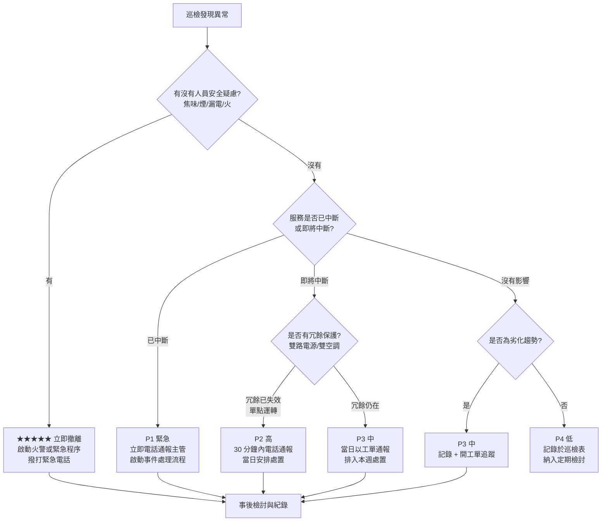

# 機房巡檢與紀錄

> [!abstract] 這篇你會學到
> - 巡檢要分幾級：**每班／每日／每週／每月／每季**各做什麼，為什麼不能全部塞進每日
> - ★★★★★ **每一個巡檢項目的異常判定門檻**：不是「看起來還好」，是**明確的數值**
> - ★★★★ 那些門檻**是怎麼來的**：哪些來自設備規格、哪些來自國際建議值、哪些要自己量
> - ★★★★ **巡檢動線設計**：怎麼走一圈不漏項、不走回頭路、不會邊走邊忘
> - ★★★★★ **紀錄怎麼寫才有稽核價值**：寫「正常」等於沒寫，要寫數值
> - 紀錄保存年限、載體、備份與調閱方式
> - ★★★★★ 發現異常之後的**分級與通報流程**：什麼情況現場處理、什麼情況立刻叫人
> - ★★★★ 把巡檢數值餵進監控系統做**趨勢分析**，從「發現故障」進化成「預測故障」
> - 巡檢表怎麼用：vault 內的 `_表單範本/040-02-01-機房巡檢表.docx`，以及表上每一欄的門檻由來

> [!warning] ★★★★★ 本篇的數值門檻是「起始建議值」，不是規格
> 本篇列出的溫度、濕度、負載率等門檻，來源分成三類，內文會逐項標明：
>
> 1. **設備規格**（例如 UPS 的允許輸入電壓範圍）→ ★★★★★ **一定要以你那台的規格書為準**
> 2. **國際常被引用的建議範圍**（例如資料中心進風溫度）→ 可作為起始值
> 3. **需要在你的機房實測後訂定的值**（例如各機櫃的正常溫差、PDU 的日常負載）
>
> ★★★★★ **不要把本篇的數字直接抄進你的巡檢表就上線。**
> 正確做法是：先用本篇的建議值起跑，累積 1～3 個月的實測資料後，
> 依你機房的實際基線（baseline）調整成適合你的門檻。

## 前置知識

- [[040-02-01-guide-機房-機房環境需求]] — ★★★★★ **本篇的溫溼度、潔淨度門檻來自這篇**，先看那篇的環境規格
- [[040-02-02-guide-機房-空調系統與溫溼度監控]] — 空調運作原理與感測器佈點，本篇只講「怎麼看、怎麼判定」
- [[040-02-04-guide-機房-電力系統與配電]] — 迴路、PDU、負載率的觀念
- [[040-02-05-guide-機房-UPS選型與容量計算]] — UPS 負載率與後備時間的關係
- [[040-02-07-guide-機房-UPS電池維護與更換]] — 電池巡檢項目的細節在那篇
- [[040-02-08-guide-機房-結構化佈線與標籤規範]] — 巡檢時看線的判定標準
- [[040-02-13-guide-機房-機房實體安全]] — 門禁、監視、進出登記的巡檢
- [[100-02-02-guide-維運-每日維護作業]] — 系統面的每日作業，本篇是**環境與實體面**
- [[100-02-01-guide-維運-維運制度與角色分工]] — 誰負責巡檢、誰覆核

---

## 觀念說明

### ★★★★★ 巡檢在做什麼：監控系統看不到的那一半

很多人會問：「都有監控系統了，為什麼還要人走進去看？」

因為**監控系統只看得到它被裝了感測器的東西**。以下這些，監控系統一律看不到：

| 監控看不到的 | 人走一趟就發現 |
| --- | --- |
| ★★★★★ **味道** | 電線燒焦味、電容爆掉的酸味、冷媒外洩的味道 |
| ★★★★★ **聲音** | 風扇軸承異音、UPS 蜂鳴、變壓器嗡嗡聲、水滴聲 |
| ★★★★★ **漏水痕跡** | 天花板水漬、空調托盤積水、地板濕痕（漏水感測器沒鋪到的地方） |
| ★★★★ **機殼上的橘燈／紅燈** | 硬體預警燈亮了但 SNMP trap 沒送出（設定漏了） |
| ★★★★ **線材被扯到、鬆脫、壓在門縫** | 還沒斷，但快斷了 |
| ★★★★ **雜物堆積** | 紙箱、包材堆在機櫃前擋住進風口，或堆在滅火設備前 |
| ★★★★ **溫度分布不均** | 感測器裝在 A 點，但 B 機櫃的熱點沒人量到 |
| ★★★ **門沒關好、假天花板板子沒蓋回去** | 上次維修留下的 |
| ★★★★ **感測器本身壞掉** | ★★★★★ 監控顯示「一切正常」的最危險原因，就是感測器已經死了 |

> [!danger] ★★★★★ 監控系統顯示綠燈，不等於機房沒事
> 感測器故障、告警規則被誰關掉、通知管道失效（信箱滿了、通訊軟體 webhook 過期）
> —— 這三種情況都會讓監控**安靜地失效**。
> ★★★★ 巡檢的一項核心價值就是**用人眼交叉驗證監控系統本身是不是活的**。

### ★★★★ 巡檢分級：為什麼不能全部塞進每日

| 分級 | 頻率 | 花費時間 | 誰做 | 性質 |
| --- | --- | --- | --- | --- |
| **每班巡檢** | 每 8 或 12 小時（有輪班才做） | 5～10 分鐘 | 值班人員 | ★★★★ 只看**會立刻出事**的：溫度、告警燈、異音、漏水 |
| **每日巡檢** | 每個上班日一次 | 15～30 分鐘 | 機房管理員 | ★★★★★ 環境、電力、告警、實體狀況的完整走查 |
| **每週巡檢** | 每週一次 | 30～60 分鐘 | 機房管理員 | ★★★★ 加上要開櫃門、看細節的項目 |
| **每月巡檢** | 每月一次 | 1～2 小時 | 機房管理員＋系統管理員 | ★★★★ 加上需要測試、量測、清潔的項目 |
| **每季／每年** | 每季／每年一次 | 半天～一天 | 含外部廠商 | ★★★★★ 保養、演練、負載測試、消防檢查 |

分級的原則：

1. ★★★★★ **越可能突然出事、越快造成災難的，頻率越高**
   （溫度、漏水、電力 → 每班或每日）
2. ★★★★ **變化緩慢但一旦惡化就麻煩的，中頻率**
   （UPS 電池、濾網、風扇異音 → 每週或每月）
3. ★★★ **需要停機或專業工具的，低頻率並排入年度計畫**
   （UPS 負載測試、發電機測試、消防設備檢查 → 每季／每年）

> [!tip] 實務建議 ★★★★
> **每日巡檢控制在 30 分鐘內**。超過 30 分鐘的巡檢表，
> 三個星期之後就會有人開始「憑印象打勾」—— 那比不巡檢還糟，
> 因為紀錄上寫著「正常」，實際上沒人看過。
> 項目太多就往每週、每月挪。

### ★★★★★ 判定門檻：「正常」不是判定，數值才是

這是巡檢紀錄最常見的致命問題。

```text
❌ 沒有價值的紀錄：
    機房溫度：正常 ✓
    UPS 狀態：正常 ✓
    PDU 負載：正常 ✓

✅ 有價值的紀錄：
    冷通道進風溫度（R01/R05/R09 中段）：22.1 / 23.4 / 24.8 °C   → 判定：正常（門檻 27）
    相對濕度（機房中央）：52 %RH                                → 判定：正常（門檻 40–60）
    UPS-A 負載率：46 %  後備時間：18 分                          → 判定：正常（門檻 <70%、>15 分）
    PDU-A-R03 電流：11.2 A（額定 16 A，70%）                    → 判定：注意（已達 70% 門檻）
```

★★★★★ 兩者的差別在於：

| 面向 | 寫「正常」 | 寫數值 |
| --- | --- | --- |
| 能不能做趨勢分析 | ★★★★★ **不能** | ★★★★★ 能，可以看出緩慢惡化 |
| 稽核時的證明力 | 幾乎沒有 | 完整 |
| 出事後回推 | 「上週也是正常啊」→ 查不到原因 | 「三週前開始每週升 0.8 °C」→ 找得到 |
| 誰在打勾 | 分不出來認真的跟隨便打的 | 亂填的數值很容易被交叉比對抓到 |

> [!danger] ★★★★★ 沒有事先訂好門檻，就沒有「異常」可言
> 每一個要填數值的欄位，都必須事先定義好：
> **正常範圍 / 注意（warning）門檻 / 異常（critical）門檻 / 超過門檻要做什麼**。
> 沒定義門檻的話，巡檢員量到 29 °C 也只會想「好像有點高，應該還好吧」，
> 然後打勾走人。

三段式門檻的設計：

```text
        正常              注意（warning）            異常（critical）
    ┌──────────────┬────────────────────────┬─────────────────────────┐
    │  照常記錄     │  記錄 + 加密度觀察      │  記錄 + 立即通報 + 處置  │
    │              │  + 通知主管（非緊急）    │  + 啟動應變程序          │
    └──────────────┴────────────────────────┴─────────────────────────┘
         例：進風 ≤25°C      例：25–27°C              例：>27°C
```

★★★★ **注意門檻的存在是為了給你反應時間。**
只有「正常／異常」兩段的話，等你發現異常時常常已經來不及了。

### ★★★★ 門檻從哪裡來：三個來源

| 來源 | 例子 | 可信度與用法 |
| --- | --- | --- |
| **① 設備規格書** | UPS 允許輸入電壓範圍、伺服器的操作溫度上限、PDU 額定電流 | ★★★★★ **最高優先**，這是硬規格，不能自己改 |
| **② 業界常被引用的建議範圍** | 資料中心進風溫度的建議區間、機房相對濕度建議區間 | ★★★★ 作為**起始值**，但要能說明來源 |
| **③ 你機房的實測基線** | 各機櫃的日常溫度、PDU 的平日負載、UPS 的日常後備時間 | ★★★★★ **最實用**，因為「異常」的定義就是「偏離常態」 |

> [!warning] ★★★★ 關於溫溼度建議值
> 資料中心進風溫溼度的建議範圍，業界最常引用的是 **ASHRAE TC 9.9** 的
> 熱環境指引（依設備等級 A1～A4 分級，建議範圍與允許範圍不同）。
> ★★★★★ 這份指引**會改版**，而且**你的設備廠商規格書可能更嚴格**。
>
> 正確做法：
> 1. 先查**你的伺服器／儲存設備規格書**上的操作溫溼度範圍
> 2. 取所有設備中**最嚴格**的那一組當作機房門檻
> 3. 再往內縮一點當作「注意」門檻，留反應時間
>
> 詳細的環境規格討論在 [[040-02-01-guide-機房-機房環境需求]]。
> 本篇後面用的數值是常見機房的起始建議值，**請依上述步驟自行驗證**。

### ★★★★ 實測基線怎麼建立

```text
第 1～4 週：每天同一時間、同樣的量測點，記錄數值（不做判定，只收資料）
     ▼
第 5 週：算出每個點的
         - 平均值
         - 一般波動範圍（例如平常在 21.5～23.5 °C 之間）
         - 最高值出現的時間（通常是下午，或某台機器跑批次的時候）
     ▼
訂門檻：注意門檻 = 一般波動上限 + 一點餘裕
        異常門檻 = 設備規格上限往內縮
     ▼
每季複檢：機房設備增減之後基線會變，要重新校準
```

> [!tip] 實務建議 ★★★★
> 建立基線的期間**至少要跨過一次「最熱的下午」與一次「最冷的清晨」**，
> 而且如果有季節性差異（夏天／冬天），至少要跨過一個換季。
> 只量一週的資料訂出來的門檻，換季就會一直誤報。

---

## 安裝或基礎操作

### ★★★★★ 每日巡檢項目與判定門檻（完整版）

以下每一個項目都有：**量什麼 / 怎麼量 / 正常 / 注意 / 異常 / 門檻來源**。

#### A. 環境類

| 項目 | 量測方式 | 正常 | 注意 | 異常 | 門檻來源 | 星號 |
| --- | --- | --- | --- | --- | --- | --- |
| **冷通道進風溫度**（至少三個機櫃、每櫃上中下） | 手持溫度計或現場面板讀值 | ≤ 25 °C | 25～27 °C | ★★★★★ > 27 °C | ② 業界建議 ＋ ① 設備規格取嚴者 | ★★★★★ |
| **熱通道回風溫度** | 同上 | 依基線 | 較基線高 3 °C | ★★★★ 較基線高 5 °C | ③ 實測基線 | ★★★★ |
| **冷熱通道溫差（ΔT）** | 熱通道 − 冷通道 | 依基線 | 突然變小（氣流短循環）或變大（氣流不足） | 大幅偏離基線 | ③ 實測基線 | ★★★★ |
| **相對濕度** | 機房中央 + 靠外牆處 | 40～60 %RH | 30～40 或 60～70 %RH | ★★★★ < 30 或 > 70 %RH | ② 業界建議 | ★★★★ |
| **有無結露／水氣** | 目視空調出風口、管路、窗框 | 無 | 有水氣 | ★★★★★ 有水滴 | 目視 | ★★★★★ |
| **空調機組運轉狀態** | 看面板：運轉燈、設定溫度、實際溫度、有無告警碼 | 全部運轉正常 | 有一台停機（輪替中）／有告警碼 | ★★★★★ 兩台以上停機或全部告警 | ① 空調規格 | ★★★★★ |
| **空調冷凝水排水** | 目視托盤、排水管、地漏 | 無積水 | 托盤有少量積水 | ★★★★★ 溢流／地板有水 | 目視 | ★★★★★ |
| **異音** | 站在機房中央閉眼聽 30 秒 | 只有正常風扇聲 | 有新的高頻聲、間歇異音 | ★★★★★ 明顯金屬摩擦、撞擊、水流聲 | 人耳 ＋ ③ 基線印象 | ★★★★★ |
| **異味** | 走一圈聞 | 無 | 微弱塑膠味／灰塵味 | ★★★★★ **焦味、燒塑膠味、酸味** | 人鼻 | ★★★★★ |
| **地板／天花板** | 目視水漬、粉塵、板子有無移位 | 乾淨 | 有粉塵、板子沒蓋好 | ★★★★★ 有水漬或滴水 | 目視 | ★★★★★ |

> [!danger] ★★★★★ 聞到焦味 = 立刻進入異常應變，不要繼續巡檢
> 焦味代表某處已經在過熱或已經燒起來。
> **不要自己找、不要開機櫃門看**（開門可能供氧助燃）。
> 立刻執行 [[040-02-14-guide-機房-機房異常應變]] 的火警程序。

#### B. 電力類

| 項目 | 量測方式 | 正常 | 注意 | 異常 | 門檻來源 | 星號 |
| --- | --- | --- | --- | --- | --- | --- |
| **市電輸入電壓** | UPS 面板或電表讀值 | 依當地標稱電壓 ±5% | ±5～10% | ★★★★★ 超出 UPS 規格允許範圍 | ① UPS 規格書 | ★★★★★ |
| **UPS 運轉模式** | 面板顯示 | 線上／正常模式 | ★★★★ **旁路（bypass）模式** | ★★★★★ 電池模式（表示市電已斷） | ① UPS 規格 | ★★★★★ |
| **UPS 負載率** | 面板讀值 | ≤ 60% | 60～70% | ★★★★★ > 70%（或超過你規劃的上限） | ① 規格 ＋ 容量規劃，見 [[040-02-05-guide-機房-UPS選型與容量計算]] | ★★★★★ |
| **UPS 預估後備時間** | 面板讀值 | ≥ 設計值 | 為設計值的 70～100% | ★★★★★ < 設計值的 70%（電池老化警訊） | ③ 實測基線 ＋ 容量規劃 | ★★★★★ |
| **UPS 電池狀態燈／告警** | 面板 | 無告警 | 有「建議更換電池」提示 | ★★★★★ 電池故障告警 | ① UPS 規格 | ★★★★★ |
| **PDU 各迴路電流** | PDU 面板或 SNMP | ≤ 額定的 60% | 60～70% | ★★★★★ > 80% | ① PDU 額定 ＋ 配電規劃 | ★★★★★ |
| **A/B 兩路負載平衡** | 比較 A、B 路電流 | 差異 < 20% | 差異 20～40% | ★★★★ 差異 > 40%，或某一路明顯偏高 | ③ 基線 | ★★★★ |
| **配電盤斷路器狀態** | 目視所有開關位置 | 全部在 ON | 有標示但不確定的 | ★★★★★ 有跳脫（trip）的 | 目視 | ★★★★★ |
| **接地與線材** | 目視接地線、電源線 | 完好 | 有磨損、拉緊 | ★★★★★ 破皮、露銅、過熱變色 | 目視 | ★★★★★ |
| **插座溫度** | 手背靠近感覺（★★★★ 不要直接摸金屬） | 常溫 | 微溫 | ★★★★★ 明顯發燙 | 觸感 ＋ 熱像儀（有的話） | ★★★★★ |

> [!danger] ★★★★★ 巡檢時絕對不做帶電作業
> 巡檢是**看**，不是**修**。
> - ★★★★★ **不要**去插拔任何電源線
> - ★★★★★ **不要**去復位（reset）跳脫的斷路器 —— 斷路器跳是有原因的，
>   沒查清楚就推回去可能造成火災
> - ★★★★★ **不要**打開配電盤蓋板
> - ★★★★★ **不要**用手直接摸插座、端子、匯流排
>
> 發現電力異常一律**記錄 + 通報**，由具備資格的電氣人員處理。
> 用電安全見 [[010-01-15-guide-計概-電力基礎與用電安全]]。

#### C. 設備類

| 項目 | 量測方式 | 正常 | 注意 | 異常 | 星號 |
| --- | --- | --- | --- | --- | --- |
| **機櫃內設備狀態燈** | 逐櫃目視前面板 | 全綠 | ★★★★ 有橘燈／閃爍 | ★★★★★ 有紅燈 | ★★★★★ |
| **磁碟托架燈** | 目視儲存設備前面板 | 全綠或正常閃爍 | ★★★★ 有橘燈（預警） | ★★★★★ 紅燈（故障）或重建中 | ★★★★★ |
| **風扇聲音** | 逐櫃聽 | 平順 | ★★★ 某台明顯比平常大聲 | ★★★★ 卡頓、摩擦、間歇停轉 | ★★★★ |
| **設備表面溫度** | 手背靠近出風口 | 溫熱 | 燙但可忍受 | ★★★★★ 無法靠近 | ★★★★ |
| **網路設備埠狀態燈** | 目視交換器面板 | 依連線狀況正常 | ★★★ 應該亮的沒亮 | ★★★★ 大量埠同時異常 | ★★★★ |
| **空機櫃槽位擋板** | 目視 | 空槽都有擋板 | ★★★ 少數缺 | ★★★★ 大量缺失（破壞氣流） | ★★★ |
| **機櫃門是否關妥／上鎖** | 目視 | 關妥上鎖 | 關著沒鎖 | ★★★★ 敞開 | ★★★★ |
| **線材狀況** | 目視 | 整齊、標籤清楚 | ★★★ 有鬆脫、標籤脫落 | ★★★★ 被門夾住、被壓、大幅彎折 | ★★★ |

#### D. 安全與環境衛生

| 項目 | 正常 | 異常 | 星號 |
| --- | --- | --- | --- |
| **機房門禁功能** | 刷卡正常、門會自動關閉上鎖 | ★★★★★ 門關不上、鎖失效、門被卡住 | ★★★★★ |
| **進出登記表** | 昨日紀錄完整、無空白 | ★★★★ 有進出但沒登記 | ★★★★ |
| **監視錄影** | 畫面正常、錄影中、時間正確 | ★★★★★ 黑畫面、未錄影、時間錯誤 | ★★★★★ |
| **消防設備** | 壓力表在綠區、無遮擋、標示清楚 | ★★★★★ 壓力不足、被雜物擋住、逾期未檢 | ★★★★★ |
| **緊急照明／逃生指示** | 亮著、通道淨空 | ★★★★★ 不亮、通道被擋 | ★★★★★ |
| **漏水偵測線／感測器** | 指示燈正常、線材在位 | ★★★★ 感測器離位、指示異常 | ★★★★ |
| **機房內雜物** | 無紙箱、包材、私人物品 | ★★★★ 有可燃物堆置 | ★★★★ |
| **緊急電源切斷（EPO）按鈕** | ★★★★★ 有防護蓋、無遮擋、無誤觸風險 | ★★★★★ 蓋子破損或被移除 | ★★★★★ |
| **監控系統本身** | 儀表板可開、數值在更新、告警未被停用 | ★★★★★ 數值停滯（感測器死掉）、告警被關 | ★★★★★ |

> [!danger] ★★★★★ 絕對不要靠近或測試 EPO 按鈕
> EPO（Emergency Power Off）按下去會**切斷整個機房的電**，包含 UPS 輸出。
> 巡檢只確認「防護蓋完好、周圍沒有會誤觸的東西」，**不要按、不要碰**。
> 誤觸 EPO 造成的全機房斷電，復原時間以小時計。

### ★★★★ 每週增加的項目

| 項目 | 判定 | 星號 |
| --- | --- | --- |
| 開機櫃後門檢查佈線與線材老化 | 有壓折、破皮、標籤脫落 → 記錄排修 | ★★★ |
| 空調濾網目視（不拆） | 明顯積灰 → 排定清洗 | ★★★ |
| 檢視監控系統一週的溫溼度趨勢圖 | 有無緩慢上升趨勢 | ★★★★ |
| 檢視 UPS 一週的事件日誌 | 有無短暫的市電異常紀錄 | ★★★★ |
| 檢視所有 BMC 的硬體事件日誌（SEL） | 有無記憶體 correctable error、電源事件 | ★★★★ |
| 備品庫存清點（風扇、電源、硬碟、跳線） | 低於安全存量 → 請購 | ★★★ |
| 檢查上週異常項目的處理進度 | ★★★★★ **未結案的要追** | ★★★★★ |

### ★★★★ 每月增加的項目

| 項目 | 判定 | 星號 |
| --- | --- | --- |
| **實測各機櫃三高度溫度**（上／中／下） | 建立熱點分布圖，與上月比對 | ★★★★ |
| **拍熱像圖**（有熱像儀的話）：配電盤、PDU、端子 | 有異常高溫點 → 排修 | ★★★★★ |
| **UPS 電池外觀檢查**：膨脹、漏液、端子腐蝕 | ★★★★★ 有任一項 → 立即安排更換，見 [[040-02-07-guide-機房-UPS電池維護與更換]] | ★★★★★ |
| **RAID 卡電池／FBWC 狀態** | 非 Optimal → 排修，見 [[040-02-09-guide-機房-伺服器上架與初始設定]] | ★★★★★ |
| **空調濾網清洗／更換** | 依污染程度 | ★★★ |
| **測試告警通知管道**：發一則測試告警，確認真的收得到 | ★★★★★ 收不到 → 立即修正 | ★★★★★ |
| **檢視門禁與監視紀錄** | 有無異常進出 | ★★★★ |
| **盤點與資產系統核對**（抽查） | 見 [[040-02-11-guide-機房-資訊設備盤點]] | ★★★ |
| **檢查備份是否可還原**（抽測） | 見 [[090-03-04-guide-應用安全-備份災難復原與入侵應變]] | ★★★★★ |

### ★★★★ 每季／每年的項目

| 頻率 | 項目 | 星號 |
| --- | --- | --- |
| 每季 | 空調保養（廠商）：清洗、冷媒壓力、皮帶、排水 | ★★★★ |
| 每季 | 發電機測試運轉（有的話）、燃油存量與品質 | ★★★★★ |
| 每季 | 異常應變演練（見 [[040-02-14-guide-機房-機房異常應變]]） | ★★★★★ |
| 每季 | 全機房完整盤點 | ★★★ |
| 每年 | UPS 原廠保養與電池內阻量測 | ★★★★★ |
| 每年 | 消防設備法定檢查（依主管機關規定辦理） | ★★★★★ |
| 每年 | 電氣設備檢測（絕緣、接地電阻，依規定辦理） | ★★★★★ |
| 每年 | 巡檢表本身檢討與門檻校準 | ★★★★ |

> [!warning] ★★★★★ 法定檢查的頻率與項目
> 消防設備、電氣設備的法定檢查頻率、執行資格與申報方式，
> **依主管機關規定與建築物用途辦理**。
> ★★★★★ 本篇不列具體條號與期限 —— 請洽你機關的總務／公共安全承辦人員，
> 或委由具備法定資格的檢查機構辦理。維運人員的責任是
> **確認這些檢查有被排程、有被執行、報告有歸檔**。

---

## 進階應用

### ★★★★ 巡檢動線設計

巡檢會漏項的三個原因：**沒有固定路線**、**邊走邊被打斷**、**表單順序跟走的順序不一樣**。

解法：**把巡檢表的順序，設計成跟你實際走的順序一模一樣。**

一個典型的單一機房動線：

```text
【起點：機房門外】
  ①  門外：門禁面板狀態、進出登記表、告示
       ▼
  ②  進門第一件事：站定，閉眼聽 30 秒，同時聞味道   ★★★★★
       （這一步要在你的耳朵鼻子還沒習慣機房環境時做）
       ▼
  ③  環境面板：溫溼度顯示器、漏水偵測主機、監控大屏
       ▼
  ④  電力區：配電盤 → UPS → PDU 主控（先看「上游」）★★★★
       ▼
  ⑤  空調區：各台空調面板、出風口、冷凝水托盤、排水
       ▼
  ⑥  冷通道走一趟（由 R01 → R12 單向）：
       逐櫃看前面板燈號、量進風溫度、看櫃門與擋板
       ▼
  ⑦  熱通道走回來（R12 → R01 反向）：
       逐櫃看後方佈線、PDU 電流讀值、線材狀況
       ▼
  ⑧  周邊：地板、天花板、牆角、窗邊（水漬與粉塵）
       ▼
  ⑨  安全設施：滅火設備、緊急照明、逃生通道、EPO 防護蓋
       ▼
  ⑩  出門前：回頭確認所有櫃門已關、燈已關（若規定）、門已上鎖
       ▼
【終點：填表、覆核、異常通報】
```

★★★★★ 動線設計的四個原則：

| 原則 | 說明 |
| --- | --- |
| **單向不回頭** | 走回頭路 = 一定會有一段跳過去 |
| **由上游到下游** | 電力先看配電盤再看 PDU，出問題時才知道範圍 |
| **感官項目排最前面** | ★★★★★ 聽與聞要在**剛進門**做，待久了鼻子與耳朵就麻痺了 |
| **表單順序 = 走路順序** | 表單順序亂 = 巡檢員要一直翻頁 = 一定會漏 |

> [!tip] 實務建議 ★★★★
> **在機櫃列頭貼巡檢點編號貼紙**（R01、R02…），並在冷熱通道各貼一次。
> 巡檢表用同樣的編號，就不會發生「我剛剛量的是第幾櫃來著」。
> 進階做法：貼 **QR code**，用手機掃描直接跳到該點的填表欄位，
> 系統同時記錄掃描時間與位置 —— ★★★★ 這樣就**無法坐在辦公室補填**。

### ★★★★★ 紀錄怎麼寫才有稽核價值

一份合格的巡檢紀錄，必須具備六個要素：

| 要素 | 說明 | 沒有會怎樣 | 星號 |
| --- | --- | --- | --- |
| **① 誰**（巡檢人姓名／工號） | 具名，不要寫「機房組」 | 出事時找不到人問細節 | ★★★★★ |
| **② 何時**（日期＋時間，到分鐘） | ★★★★ 巡檢開始與結束都要 | 無法與事件時間軸比對 | ★★★★★ |
| **③ 量到什麼**（實際數值） | 數值，不是「正常」 | 無法做趨勢分析 | ★★★★★ |
| **④ 判定**（正常／注意／異常） | 對照門檻的結果 | 看不出巡檢員有沒有真的判斷 | ★★★★ |
| **⑤ 異常的處置**（做了什麼、通報誰、幾點通報） | 有異常一定要有這欄 | 稽核最愛問的就是這個 | ★★★★★ |
| **⑥ 覆核**（主管或第二人簽名） | ★★★★ 至少每週覆核一次 | 沒有覆核的紀錄稽核不採信 | ★★★★ |

> [!danger] ★★★★★ 三種會讓紀錄完全失去價值的寫法
> 1. **事後補填**：整週的表在週五一次填完，數值全部一樣或很規律 →
>    ★★★★★ 稽核一眼就看出來，而且這代表**整週沒人進去過**
> 2. **只打勾不寫數值**：全部「正常✓」，沒有任何可追溯的資訊
> 3. **發現異常不記錄**：怕被追究責任而略過 →
>    ★★★★★ 這是最嚴重的，等到災難發生時「早有徵兆卻無紀錄」是重大缺失
>
> ★★★★ **要建立「回報異常不會被責備」的文化。**
> 巡檢員回報異常是幫機關擋災難，不是找自己麻煩。
> 如果回報異常會被罵，下次就沒人回報了。

#### 使用 vault 內的巡檢表範本

本 vault 的表單範本放在 `_表單範本/` 資料夾，機房巡檢表的路徑是：

```text
_表單範本/040-02-01-機房巡檢表.docx
```

★★★ 用檔案總管或 Word 直接開啟該路徑的檔案即可
（這是 `.docx` 二進位檔，Obsidian 內部不會顯示內容）。
相關的還有：

```text
_表單範本/040-02-02-設備盤點表.docx        → 見 [[040-02-11-guide-機房-資訊設備盤點]]
_表單範本/040-02-03-進出機房登記表.docx    → 見 [[040-02-13-guide-機房-機房實體安全]]
_表單範本/040-02-04-線路標示紀錄.docx      → 見 [[040-02-08-guide-機房-結構化佈線與標籤規範]]
_表單範本/100-02-01-每日維護檢查表.docx    → 見 [[100-02-02-guide-維運-每日維護作業]]
_表單範本/100-02-07-事件處理紀錄單.docx    → 異常通報後填這張
```

★★★★★ **巡檢表上每一個欄位的門檻，都必須在表上或附註中寫明來源與數值。**
表格欄位的門檻對應如下：

| 巡檢表欄位 | 該填什麼 | 門檻來源 | 誰負責維護這個門檻 |
| --- | --- | --- | --- |
| 冷通道進風溫度 | 三個櫃各上中下共 9 個數值（°C） | ① 設備規格取最嚴者 ＋ ② 業界建議 | 機房管理員，每年校準 |
| 相對濕度 | 兩點的 %RH | ② 業界建議 ＋ ① 設備規格 | 機房管理員 |
| UPS 負載率 | 各 UPS 的 % | ① UPS 規格 ＋ 容量規劃文件 | 電力負責人 |
| UPS 後備時間 | 各 UPS 的分鐘數 | ③ 實測基線（每季重測） | 電力負責人 |
| PDU 電流 | 各 PDU 各相的 A | ① PDU 額定電流 × 規劃上限比例 | 電力負責人 |
| 設備告警燈 | 有／無，有則寫櫃號與設備名 | 廠商燈號定義 | 系統管理員 |
| 空調狀態 | 各台的運轉狀態與設定／實際溫度 | ① 空調規格書 | 機房管理員 |
| 異音／異味 | 無／有（有則描述位置與特徵） | 人的感官 ＋ 累積經驗 | 巡檢人員 |
| 漏水 | 無／有（有則標示位置） | 目視 ＋ 漏水偵測系統 | 巡檢人員 |
| 門禁與監視 | 功能正常／異常 | 功能性判定 | 實體安全負責人 |

> [!warning] ★★★★ 門檻要放在巡檢表上，不要只放在腦子裡
> 巡檢表每一欄的**旁邊就要印出門檻值**（例如「進風溫度（正常 ≤25 / 注意 25-27 / 異常 >27 °C）」）。
> 這樣輪班的人、代班的人、新人，都能當場判定，不用去問人也不用憑印象。

### ★★★★ 紀錄的保存、載體與調閱

| 面向 | 做法 | 星號 |
| --- | --- | --- |
| **保存年限** | ★★★★★ **依機關的檔案保存年限規定與內部稽核要求辦理**。常見做法是巡檢紀錄至少保存到下一次稽核週期結束之後，但**實際年限請洽機關檔案管理單位確認** | ★★★★★ |
| **紙本 vs 電子** | ★★★★ 建議**電子為主、紙本為輔**。紙本容易遺失、字跡難辨、無法做趨勢分析 | ★★★★ |
| **電子紀錄的完整性** | ★★★★ 要能證明「沒有被事後竄改」：使用有稽核軌跡的系統，或定期匯出並存檔到唯讀儲存 | ★★★★ |
| **異地備份** | ★★★★★ 巡檢紀錄不能只存在機房裡的伺服器上 —— 機房出事時紀錄也一起沒了 | ★★★★★ |
| **調閱** | 要能在稽核當下快速調出指定期間的紀錄 | ★★★★ |
| **異常紀錄要獨立追蹤** | ★★★★★ 異常項目要進入工單系統追到結案，不能只留在巡檢表上 | ★★★★★ |
| **簽核軌跡** | 巡檢人簽 + 覆核人簽 + 日期 | ★★★★ |

> [!danger] ★★★★★ 巡檢紀錄存在機房內的伺服器上 = 沒有備份
> 火警、水災、停電導致儲存損毀時，**你要拿來證明「當時有正常巡檢」的紀錄
> 跟著一起沒了**。這在事後檢討與責任釐清時非常致命。
> ★★★★ 巡檢紀錄至少要有一份在機房以外的地方。

### ★★★★★ 異常分級與通報流程

發現異常之後最怕的是「不知道要不要叫人」。所以要事先分級。



分級定義表：

| 等級 | 判定準則 | 通報時機 | 通報對象 | 例子 | 星號 |
| --- | --- | --- | --- | --- | --- |
| **緊急（安全）** | ★★★★★ 有人員安全疑慮 | ★★★★★ **立即**，先撤離再通報 | 消防／緊急聯絡人／全體人員 | 焦味、冒煙、火、漏電、有人受傷 | ★★★★★ |
| **P1 緊急** | 服務已中斷，或即將在數分鐘內中斷 | ★★★★★ **立即電話**（不用通訊軟體） | 主管 ＋ 系統負責人 ＋ 值班 | 全機房斷電、空調全停、UPS 進入電池模式且無市電 | ★★★★★ |
| **P2 高** | ★★★★ **冗餘已失效，目前單點運轉** | 30 分鐘內電話 | 主管 ＋ 相關負責人 | 兩台空調壞一台、A 路電源失效、UPS 一組電池故障 | ★★★★★ |
| **P3 中** | 有異常但冗餘仍在，或呈現劣化趨勢 | 當日以工單／郵件 | 相關負責人 | 溫度到達注意門檻、磁碟橘燈預警、PDU 負載達 70% | ★★★★ |
| **P4 低** | 不影響運作的小問題 | 記錄，定期檢討 | 巡檢主管 | 標籤脫落、擋板缺少、雜物堆置 | ★★ |

> [!danger] ★★★★★ P2 最容易被低估
> 「還有一台空調在跑，先撐著吧」是機房災難最常見的起點。
> **冗餘失效之後，你已經沒有第二次機會了** —— 剩下那一台再壞，就是全停。
> ★★★★★ P2 的正確心態是：**你正在倒數計時**，要在剩下的那一台壞掉之前修好。

通報要講的五件事（★★★★ 電話裡三十秒內講完）：

```text
① 我是誰、從哪裡打
② 發生什麼（一句話）           例：「B 棟機房 2 號空調停機，1 號還在跑」
③ 現在的影響                   例：「冷通道溫度 26.5 度，還在上升」
④ 我已經做了什麼               例：「已確認 1 號正常運轉，已通知空調廠商」
⑤ 我需要什麼決定               例：「請問要不要先關掉測試環境降載」
```

★★★★ 通報之後填 `_表單範本/100-02-07-事件處理紀錄單.docx`，
並依 [[100-02-09-svc-維運-事件處理與升級流程]] 追到結案。

### ★★★★ 把巡檢結果餵進監控，做趨勢分析

巡檢的最高階用法：**從「發現故障」進化成「預測故障」**。

```text
每日巡檢的數值
      │
      ▼  （輸入方式：手機表單／Excel／API）
  ┌─────────────────────┐
  │  時序資料庫          │  ← 監控系統自動採集的數值也進這裡
  │  （Prometheus/       │
  │    InfluxDB/Zabbix） │
  └──────────┬──────────┘
             ▼
     ┌───────────────┐
     │  Grafana 儀表板 │
     └───────┬───────┘
             ▼
   ① 趨勢圖：這三個月機櫃溫度有沒有慢慢上升？
   ② 對照圖：巡檢的手動讀值 vs 感測器讀值 → ★★★★★ 差太多代表感測器故障
   ③ 預測：UPS 後備時間每月掉 5%，什麼時候會低於設計值？
   ④ 關聯：溫度上升的時間點，跟哪台新機上架的時間吻合？
```

四種最有價值的趨勢分析：

| 分析 | 看什麼 | 能提早發現什麼 | 星號 |
| --- | --- | --- | --- |
| **UPS 後備時間衰減曲線** | 每次巡檢的預估後備時間，畫成折線 | ★★★★★ 電池老化，可以在它撐不住之前就換掉 | ★★★★★ |
| **機櫃溫度長期趨勢** | 各櫃進風溫度的月平均 | ★★★★ 空調效能衰退、氣流被破壞、負載增加 | ★★★★ |
| **PDU 負載成長曲線** | 各迴路電流的月平均 | ★★★★ 什麼時候會撞到容量上限，好提前規劃擴充 | ★★★★ |
| **手動讀值 vs 感測器讀值的差異** | 兩者相減 | ★★★★★ **感測器故障或漂移**（監控系統最危險的盲點） | ★★★★★ |

> [!tip] 實務建議 ★★★★★ 至少做「手動 vs 感測器」這一項
> 這是巡檢能提供、而監控系統自己絕對做不到的價值。
> 每日巡檢用手持溫度計量的數值，跟同一位置感測器的讀值比對：
> - 差 1 °C 以內：正常（儀器誤差）
> - 差 2～3 °C：★★★★ 注意，安排校正
> - 差 3 °C 以上或**感測器讀值長時間完全不動**：★★★★★ 感測器故障，立即處理
>
> 監控接法見 [[100-01-03-guide-日誌-系統監控與告警]]
> 與 [[100-01-04-guide-日誌-健康檢查與可用性監控]]。

一個把巡檢數值推進 Prometheus Pushgateway 的簡單做法：

```bash
#!/usr/bin/env bash
# 巡檢數值上傳腳本（放在 /usr/local/bin/push-inspection.sh）
# 用法：push-inspection.sh <機櫃> <溫度> <濕度> <巡檢人>
set -euo pipefail

RACK="${1:?需要機櫃編號}"
TEMP="${2:?需要溫度}"
HUMID="${3:?需要濕度}"
OPERATOR="${4:?需要巡檢人}"
PUSHGW="http://10.99.1.20:9091"

cat <<EOF | curl -s --data-binary @- "${PUSHGW}/metrics/job/manual_inspection/rack/${RACK}"
# TYPE manual_inspection_temp_celsius gauge
manual_inspection_temp_celsius{operator="${OPERATOR}"} ${TEMP}
# TYPE manual_inspection_humidity_percent gauge
manual_inspection_humidity_percent{operator="${OPERATOR}"} ${HUMID}
# TYPE manual_inspection_timestamp_seconds gauge
manual_inspection_timestamp_seconds{operator="${OPERATOR}"} $(date +%s)
EOF

echo "已上傳：機櫃=${RACK} 溫度=${TEMP}°C 濕度=${HUMID}% 巡檢人=${OPERATOR}"
```

```bash
chmod +x /usr/local/bin/push-inspection.sh
/usr/local/bin/push-inspection.sh R03 22.4 51 wang
```

```text
已上傳：機櫃=R03 溫度=22.4°C 濕度=51% 巡檢人=wang
```

> [!warning] 未實機驗證 ★★★
> 上面的腳本使用 Prometheus Pushgateway 的標準 API 格式。
> ★★★ 你的 Pushgateway 位址、job／label 命名規則要依你自己的監控架構調整，
> 而且 Pushgateway 的資料**不會自動過期**（需要另外處理清理）。
> 實務上更常見的做法是用表單系統（例如 n8n 流程或內部網頁表單）收集後入庫。

---

## 完整實戰範例

以下是一次完整的每日巡檢，從準備到結案。
情境：**某機關 B 棟機房，12 座機櫃，兩台精密空調，兩組 UPS，冷熱通道配置。**
巡檢人：王小明。日期：2026-09-02，時間 09:00。

### 第 1 步：出發前準備（辦公室，3 分鐘）

```text
□ 帶齊工具：手持溫濕度計、手電筒、巡檢表（或平板）、原子筆
□ 先看監控儀表板：★★★★ 記下目前系統顯示的溫溼度，待會要跟手動量測比對
    → 系統顯示：冷通道平均 22.8 °C，濕度 50 %RH，UPS-A 45%，UPS-B 43%
□ 看昨天的巡檢紀錄：有沒有未結案的異常？
    → 昨天記錄「R07 後方跳線標籤脫落」，P4，未處理
□ 看昨晚有沒有告警
    → 03:12 有一則「UPS-A 市電短暫波動」，已自動恢復  ★★★★ 要現場查 UPS 日誌
```

### 第 2 步：門外與進門（3 分鐘）

```text
09:03  門禁面板：正常，刷卡開門正常，門自動關閉並上鎖 ✓
09:03  進出登記表：昨日 3 筆紀錄完整，有簽名 ✓
09:04  ★★★★★ 進門站定，閉眼聽 30 秒
       → 風扇聲平順，無異音。有一個新的間歇「嗡」聲，方位偏空調區 ⚠ 記下來
09:05  聞：無異味 ✓
```

### 第 3 步：環境面板（2 分鐘）

```text
09:05  溫溼度顯示器（機房中央）：22.6 °C / 50 %RH
09:06  漏水偵測主機：綠燈，無告警 ✓
09:06  監控大屏：畫面正常，數值有在更新（秒數在跳）✓
```

### 第 4 步：電力區（6 分鐘）

```text
09:07  配電盤：所有斷路器在 ON，無跳脫，盤面無異常發熱 ✓
       ★★★★★ 只看不碰

09:08  UPS-A 面板
       模式：線上（正常）        ✓
       輸入電壓：（記錄實際讀值） ✓ 在規格範圍內
       負載率：46 %              ✓ 正常（門檻 60/70）
       預估後備時間：18 分        ✓ 正常（設計值 20 分，>70% = >14 分）
       電池狀態：無告警           ✓
       事件日誌：★★★★ 03:12 有一筆 "Input voltage out of range"，
                 持續 4 秒後恢復 → 記錄，P3，開工單請電力承辦查大樓側

09:10  UPS-B 面板
       模式：線上                ✓
       負載率：43 %              ✓
       預估後備時間：19 分        ✓
       電池狀態：無告警           ✓

09:11  PDU 讀值（A/B 路各 12 座）
       A 路最高：PDU-A-R03  11.2 A（額定 16 A = 70%）⚠ 到達注意門檻
       B 路最高：PDU-B-R03   9.8 A（61%）
       ★★★★ A/B 差異 14%，在 20% 以內 ✓
       → R03 負載偏高，P3，開工單評估是否搬移一台設備
```

### 第 5 步：空調區（5 分鐘）

```text
09:12  空調 1 號：運轉中，設定 22 °C，回風 27.8 °C，無告警碼 ✓
09:13  空調 2 號：運轉中，設定 22 °C，回風 27.5 °C，無告警碼 ✓
09:14  出風口：出風正常，無結露 ✓
09:14  冷凝水托盤：乾燥，排水管無阻塞 ✓
09:15  ★★★★ 追查剛才聽到的「嗡」聲
       → 靠近 2 號空調，聲音來自室內機風扇區域，間歇出現
       → P3，記錄「2 號空調風扇間歇異音」，開工單請廠商到場檢查
       ★★★★ 判定 P3 而非 P2：兩台空調都還在正常運轉，冗餘仍在
```

### 第 6 步：冷通道走查（R01 → R12，8 分鐘）

逐櫃記錄進風溫度（上／中／下，單位 °C）與燈號：

```text
R01  21.8 / 22.1 / 22.4   燈號全綠 ✓
R02  21.9 / 22.3 / 22.6   燈號全綠 ✓
R03  23.1 / 24.2 / 25.1   ⚠ 中下段偏高（與 PDU 負載偏高吻合）
R04  22.0 / 22.4 / 22.7   燈號全綠 ✓
R05  22.2 / 22.6 / 23.0   燈號全綠 ✓
R06  22.1 / 22.5 / 22.9   ★★★★ R06-U18 儲存設備第 3 顆磁碟橘燈 ⚠
R07  22.3 / 22.7 / 23.1   燈號全綠（後方標籤問題昨天已記錄）
R08  22.0 / 22.4 / 22.8   燈號全綠 ✓
R09  22.4 / 22.8 / 23.2   ⚠ U24-U26 空槽缺擋板 3 片
R10  22.2 / 22.6 / 23.0   燈號全綠 ✓
R11  22.1 / 22.5 / 22.8   燈號全綠 ✓
R12  22.3 / 22.7 / 23.1   燈號全綠 ✓

★★★★★ 手動 vs 感測器比對：
       手動平均 22.5 °C（36 個讀值），系統顯示 22.8 °C
       差異 0.3 °C → 在 1 °C 以內 ✓ 感測器正常
```

三個異常：

| 項目 | 判定 | 分級 | 處置 |
| --- | --- | --- | --- |
| R03 下段 25.1 °C | ★★★★ 已進入「注意」區間（25～27） | P3 | 開工單，與 PDU 負載偏高一起評估 |
| R06 磁碟橘燈 | ★★★★★ 磁碟預警 | P3（RAID 仍有保護） | ★★★★ 立即通知系統管理員，當日確認 RAID 狀態並備料 |
| R09 缺擋板 3 片 | 破壞氣流 | P4 | 記錄，本週補上 |

### 第 7 步：熱通道走查（R12 → R01，5 分鐘）

```text
09:24  R12 → R01 逐櫃看後方
       - 佈線整齊，無壓折 ✓（R07 標籤脫落，昨日已記錄，本週補）
       - 各櫃 PDU 顯示與前面記錄一致 ✓
       - 無線材被門夾住 ✓
       - 熱通道溫度抽測 R03 / R06 / R09：31.2 / 30.6 / 30.9 °C
       - ★★★★ ΔT（熱−冷）：R03 = 31.2 − 24.2 = 7.0 °C
         與基線（6～8 °C）相符 ✓
```

### 第 8 步：周邊與安全設施（4 分鐘）

```text
09:29  地板：無水漬、無明顯粉塵 ✓
09:30  天花板：無水漬，板子皆蓋妥 ✓
09:30  牆角與窗邊：乾燥 ✓
09:31  滅火設備：壓力表在綠區，無遮擋，檢查標籤在效期內 ✓
09:31  緊急照明：測試燈亮 ✓  逃生指示：亮 ✓  通道：淨空 ✓
09:32  EPO 按鈕：防護蓋完好，周圍無雜物 ✓ ★★★★★（只看不碰）
09:32  機房內雜物：★★★★ 靠門處有兩個空紙箱 → P4，當場搬出去
```

### 第 9 步：出門前（2 分鐘）

```text
09:33  回頭確認：所有機櫃門已關妥並上鎖 ✓
09:34  出門，門自動上鎖 ✓
09:34  填寫進出登記表：09:03 進 / 09:34 出，事由：例行巡檢
```

巡檢總時長：**31 分鐘**。

### 第 10 步：填表、通報、追蹤（辦公室，10 分鐘）

填 `_表單範本/040-02-01-機房巡檢表.docx`，把所有數值填入（不是打勾）。

異常處置：

```text
【P3-1】UPS-A 03:12 市電電壓超出範圍 4 秒
        → 09:40 郵件通報電力承辦，附 UPS 事件日誌截圖
        → 開工單 #2026-0902-01，請查大樓側供電
        → ★★★★ 註記：這是本月第 2 次，若再發生升級為 P2

【P3-2】2 號空調風扇間歇異音
        → 09:45 電話通知空調廠商，約當日下午到場
        → 開工單 #2026-0902-02
        → ★★★★ 註記：兩台空調任一停機即為 P2，需密切追蹤

【P3-3】R06-U18 儲存設備磁碟橘燈
        → 09:42 電話通知系統管理員
        → 系統管理員確認：RAID 6 狀態 Degraded，hot spare 已自動接手重建中
        → ★★★★★ 註記：重建期間禁止任何韌體更新與設備搬移
        → 開工單 #2026-0902-03，備料申請

【P3-4】R03 溫度與 PDU 負載偏高
        → 開工單 #2026-0902-04，本週評估負載重新分配

【P4-1】R09 缺擋板 3 片 → 本週補
【P4-2】R07 標籤脫落（昨日）→ 本週補
【P4-3】紙箱已當場移除 → 結案
```

填 `_表單範本/100-02-07-事件處理紀錄單.docx`（P3 以上各一張）。

### 第 11 步：覆核與歸檔

```text
□ 巡檢表由巡檢人簽名：王小明 2026-09-02 09:45
□ 每週五由機房主管覆核簽名
□ 電子檔上傳到文件系統，並同步到機房以外的備份位置  ★★★★★
□ 數值同步進監控系統（手動輸入或用腳本推送）
□ 未結案工單列入明日巡檢的「昨日異常追蹤」欄
```

### 第 12 步：一週後回看趨勢（★★★★ 這才是巡檢的價值）

```text
把這一週 R03 的溫度畫成折線：
    週一 24.8 / 週二 24.9 / 週三 25.0 / 週四 25.1 / 週五 25.1

★★★★ 判讀：不是突然跳高，是穩定的緩慢上升 →
       比較可能是「負載增加」而不是「空調故障」
       → 與 PDU 負載趨勢對照：R03 電流也在同步緩升
       → 結論：R03 這一櫃的設備用電與發熱都在增加，
                需要重新分配負載或加強該區送風
       → ★★★★★ 這個結論如果只靠「正常✓」的紀錄，永遠得不出來
```

---

## 常見錯誤與排錯

| 現象 | 原因 | 解法 |
| --- | --- | --- |
| ★★★★★ 巡檢表整週的數值一模一樣 | 事後補填，沒有真的進去量 | 導入 QR code 掃描或 NFC 打卡，記錄實際到點時間與位置；主管抽查比對門禁紀錄 |
| ★★★★★ 全部只打「正常✓」，沒有數值 | 表單設計成勾選式 | ★★★★★ 改成**必填數值**的欄位，並在旁邊印出門檻 |
| ★★★★ 巡檢做完了，異常沒有人處理 | 異常只留在巡檢表上，沒進工單系統 | ★★★★★ 建立「P3 以上一律開工單」的硬規定，並在隔日巡檢表加「昨日異常追蹤」欄 |
| ★★★★ 巡檢時間越拖越長，最後沒人做 | 項目塞太多在每日 | 重新分級，每日控制在 30 分鐘內，其餘挪到每週／每月 |
| ★★★★★ 監控顯示一切正常，但機房其實很熱 | 感測器故障或漂移；感測器位置不對（裝在冷風口正前方） | ★★★★★ 每日做手動 vs 感測器比對；感測器要裝在**機櫃進風處**而非空調出風口 |
| ★★★★ 溫度讀值每次量都差很多 | 量測位置不固定、量測時機不同、儀器沒有等待穩定 | 固定量測點（貼標記）、固定時段、儀器停留 30 秒等讀值穩定 |
| ★★★★ 每次巡檢都報一堆「異常」，大家開始無視 | 門檻訂得太嚴，或沒有依實測基線校準 | ★★★★★ 用 1～3 個月實測資料重新校準門檻；門檻造成的誤報要當成問題來修 |
| ★★★★★ 冗餘失效（P2）被當成 P3 處理，後來全停 | 「還有一台在跑」的心態 | ★★★★★ 把「冗餘失效」明確寫成 P2 的判定準則，並要求 30 分鐘內電話通報 |
| ★★★★ 巡檢員發現異常但沒記錄 | 怕被追究、怕麻煩 | ★★★★★ 建立「回報異常不究責」文化；主管公開肯定發現問題的人 |
| ★★★★ 換人巡檢就漏一堆項目 | 只有原本那個人知道「哪些要特別看」 | 把隱性知識寫進巡檢表；新人前三次由老手陪同並簽名 |
| ★★★★ 巡檢紀錄要調閱時找不到 | 紙本散落、電子檔沒有統一命名 | 統一命名規則（`YYYY-MM-DD-機房巡檢-巡檢人.pdf`）、集中存放、建立索引 |
| ★★★★★ 機房出事後發現巡檢紀錄也在機房裡毀了 | 紀錄只存在機房內的伺服器 | ★★★★★ 異地備份，或至少存在辦公區的另一台機器＋雲端 |
| ★★★ 手持溫度計讀值與感測器差 5 °C 以上 | 儀器沒校正、電池快沒電、量測方式錯（貼太近熱源） | 儀器定期校正；同時用兩支儀器交叉驗證；確認量測姿勢一致 |
| ★★★★ UPS 後備時間每次讀值跳動很大 | 負載變動導致預估值變動 | ★★★★ 記錄時同時記下當下負載率；比較趨勢要看**相同負載下**的數值 |
| ★★★★ 巡檢時碰到設備導致服務中斷 | 巡檢時去插拔、按按鈕、開櫃門動到線 | ★★★★★ 硬規定：**巡檢只看不碰**；需要動手的一律開變更單，見 [[100-02-08-guide-維運-變更管理流程]] |
| ★★★★ 半夜告警沒人接，隔天巡檢才發現 | 告警通知管道失效（信箱滿、webhook 過期、值班電話沒人接） | ★★★★★ 每月做一次「測試告警」，確認真的收得到；建立告警未回應的升級機制 |
| ★★★ 每月拍熱像圖但沒人看 | 沒有比對基準 | 建立「上月同一角度的圖」對照，只看**變化**不看絕對值 |

---

## 安全性注意事項

> [!danger] ★★★★★ 巡檢時的四個絕對禁止
> 1. **不做帶電作業** —— 不插拔電源、不開配電盤、不摸端子
> 2. **不復位跳脫的斷路器** —— 跳脫一定有原因，沒查明就推回去可能造成火災
> 3. **不碰 EPO 按鈕** —— 按下去整個機房斷電
> 4. **聞到焦味立刻撤離** —— 不要找、不要開櫃門，直接走火警程序

| 面向 | 注意事項 | 星號 |
| --- | --- | --- |
| **單人巡檢的風險** | ★★★★ 機房內發生意外（觸電、跌倒、被關在裡面）沒人知道。建議：進出登記＋預計時間，超時未出要有人來找 | ★★★★ |
| **通訊** | ★★★★ 部分機房手機收訊差 —— 確認機房內有可用的通訊方式（有線電話、對講機） | ★★★★ |
| **氣體滅火機房** | ★★★★★ 進入前確認滅火系統的狀態；有些系統在人員進入時要切到手動模式，離開時要恢復自動 —— **依你機房的消防設計辦理** | ★★★★★ |
| **靜電** | ★★★ 接觸設備前先觸碰接地金屬放電；重要維護時戴防靜電手環 | ★★★ |
| **噪音** | ★★★ 高密度機房噪音可能影響聽力，長時間停留建議配戴防護 | ★★★ |
| **紀錄的機敏性** | ★★★★ 巡檢紀錄含機房配置、設備清單、弱點資訊 —— **屬於機敏文件**，不可外流 | ★★★★ |
| **拍照** | ★★★★ 機房拍照要依機關規定；照片可能洩漏設備型號、佈線、門禁配置 | ★★★★ |
| **代班交接** | ★★★★ 代班的人要拿到「本週未結案異常」清單，不然會漏追 | ★★★★ |
| **廠商陪同** | ★★★★★ 廠商入機房一律陪同，不可單獨留置；見 [[040-02-13-guide-機房-機房實體安全]] | ★★★★★ |
| **巡檢帳號** | ★★★★ 用來讀取 UPS／PDU／BMC 狀態的帳號應為**唯讀權限**，不要用管理員帳號巡檢 | ★★★★ |

---

## 速查表

| 項目 | 內容 |
| --- | --- |
| **巡檢分級** | 每班（5-10 分）／每日（15-30 分）／每週（30-60 分）／每月（1-2 時）／每季年（半天以上） |
| **每日巡檢時間上限** | ★★★★ 30 分鐘（超過就會有人開始亂填） |
| **進門第一件事** | ★★★★★ 站定，閉眼聽 30 秒 ＋ 聞味道 |
| **冷通道進風溫度** | 正常 ≤25 ／ 注意 25-27 ／ 異常 >27 °C（依設備規格取嚴者調整） |
| **相對濕度** | 正常 40-60 ／ 注意 30-40、60-70 ／ 異常 <30、>70 %RH |
| **UPS 負載率** | 正常 ≤60% ／ 注意 60-70% ／ 異常 >70% |
| **UPS 後備時間** | 正常 ≥設計值 ／ 注意 70-100% ／ 異常 <70% |
| **PDU 電流** | 正常 ≤額定 60% ／ 注意 60-70% ／ 異常 >80% |
| **A/B 路負載差異** | 正常 <20% ／ 注意 20-40% ／ 異常 >40% |
| **手動 vs 感測器溫差** | 正常 <1 °C ／ 注意 2-3 °C ／ ★★★★★ 異常 >3 °C 或讀值不動 |
| **異常分級** | 安全（立即撤離）／P1（服務已斷，立即電話）／P2（冗餘失效，30 分內電話）／P3（當日工單）／P4（記錄追蹤） |
| **★★★★★ P2 的定義** | **冗餘已失效，目前單點運轉** —— 最容易被低估的一級 |
| **通報講五件事** | 我是誰／發生什麼／現在影響／已做了什麼／需要什麼決定 |
| **紀錄六要素** | 誰／何時／量到什麼（數值）／判定／異常處置／覆核簽名 |
| **紀錄保存年限** | ★★★★★ 依機關檔案保存年限規定與內部稽核要求辦理 |
| **紀錄備份** | ★★★★★ 至少一份在機房以外 |
| **巡檢表路徑** | `_表單範本/040-02-01-機房巡檢表.docx` |
| **盤點表路徑** | `_表單範本/040-02-02-設備盤點表.docx` |
| **進出登記表路徑** | `_表單範本/040-02-03-進出機房登記表.docx` |
| **事件紀錄單路徑** | `_表單範本/100-02-07-事件處理紀錄單.docx` |
| **動線原則** | 單向不回頭／由上游到下游／感官項目排最前／表單順序＝走路順序 |
| **絕對禁止** | 帶電作業／復位斷路器／碰 EPO／聞到焦味還繼續巡檢 |
| **基線建立期** | 至少 1 個月，需跨過最熱下午與最冷清晨；每季複檢 |
| **趨勢分析四項** | UPS 後備時間衰減／機櫃溫度趨勢／PDU 負載成長／手動 vs 感測器差異 |

---

## 練習題

> [!question]- 練習 1：把「正常✓」的巡檢表改造成有價值的版本
> 目前的巡檢表有這五欄，全部都是勾選式：溫度、濕度、UPS、PDU、告警燈。
> 請改寫成有數值、有門檻的版本，並說明每一欄的門檻來源。
>
> **參考答案**
>
> | 欄位 | 改寫後 | 門檻來源 |
> | --- | --- | --- |
> | 溫度 | 「冷通道進風溫度（R01/R05/R09，上中下）＿＿ °C（正常 ≤25／注意 25-27／異常 >27）」 | 設備規格取最嚴者＋業界建議 |
> | 濕度 | 「相對濕度（中央／外牆）＿＿ %RH（正常 40-60／注意 30-40、60-70／異常 <30、>70）」 | 業界建議＋設備規格 |
> | UPS | 「UPS-A 模式＿＿ 負載＿＿% 後備＿＿分（負載正常 ≤60%／後備正常 ≥設計值）」 | UPS 規格＋容量規劃＋實測基線 |
> | PDU | 「PDU-A-R__ 電流＿＿A（額定＿＿A，正常 ≤60%）」 | PDU 額定電流 |
> | 告警燈 | 「有／無異常燈號；有則填：櫃號＿＿ 設備＿＿ 燈色＿＿」 | 廠商燈號定義 |
>
> ★★★★★ 關鍵：每一欄旁邊都印出門檻，讓代班的人也能當場判定。

> [!question]- 練習 2：判斷這三個情境該分成什麼等級
> ① 兩台空調中的 1 號停機，2 號正常運轉，冷通道溫度 23 °C 穩定
> ② 冷通道溫度 26 °C，兩台空調都正常運轉，溫度較昨日高 1.5 °C
> ③ 走進機房聞到淡淡的燒塑膠味，找不到來源
>
> **參考答案**
> - ① ★★★★★ **P2**。冗餘已失效，現在是單點運轉。雖然溫度還正常，
>   但 2 號再壞就全停。要 30 分鐘內電話通報並當日安排修復。
>   **不可以因為「溫度還好」就降級成 P3。**
> - ② **P3**。已進入注意區間但冗餘仍在。開工單當日查原因
>   （負載增加？氣流被擋？濾網髒？），並加密觀察。
> - ③ ★★★★★ **緊急（安全）**。焦味代表某處已在過熱或起燃。
>   立刻依火警程序處理：**不要找、不要開櫃門**，撤離並通報。

> [!question]- 練習 3：設計你機房的巡檢動線
> 畫出（或用文字列出）你目前負責的機房的巡檢動線，並說明：
> 起點在哪、經過哪些區域、順序為什麼這樣排、哪些項目一定要排在最前面。
>
> **參考答案（要點）**
> - 起點在門外（門禁與登記表），因為這是唯一能在進門前檢查的部分
> - ★★★★★ 進門立刻做「聽 30 秒＋聞味道」，因為感官會在幾分鐘內麻痺
> - 電力區排在設備區之前，因為電力是上游，先掌握全局
> - 冷通道單向走完再從熱通道走回來，不走回頭路
> - 安全設施排在最後，出門前再確認一次櫃門與上鎖
> - 表單欄位順序必須與動線完全一致

> [!question]- 練習 4：從趨勢資料推論原因
> 某機櫃的進風溫度過去六週分別是：22.1 / 22.3 / 23.8 / 23.9 / 24.0 / 24.1 °C。
> 同期該櫃 PDU 電流沒有變化，機房整體平均溫度也沒變。
> 請推論最可能的原因，以及你會怎麼驗證。
>
> **參考答案**
> ★★★★ 關鍵線索：**第 3 週有一次「階梯式跳升」（22.3 → 23.8），之後就穩定在新水位**。
> 這不是漸進劣化（那會是緩慢爬升），而是**某個一次性的改變**。
> 而 PDU 電流沒變 → 不是負載增加；機房均溫沒變 → 不是空調整體問題。
>
> 最可能：**該櫃或鄰櫃的氣流被改變了**。例如第 3 週有人做了維護，
> 拆了擋板沒裝回去、把盲板移走、假天花板板子沒蓋回去、
> 或在冷通道堆了東西擋住出風。
>
> 驗證：① 查第 3 週的變更紀錄與進出登記 ② 現場檢查該櫃前後的擋板與雜物
> ③ 檢查地板出風孔有沒有被移動 ④ 對照該櫃 ΔT 有沒有同時改變。

> [!question]- 練習 5：設計「手動 vs 感測器」的比對機制
> 請說明要怎麼在日常巡檢中建立這個比對，包含：量測方式、記錄方式、
> 判定門檻、發現差異時的處理。
>
> **參考答案**
> - **量測方式**：在感測器所在位置貼標記，每日用同一支校正過的手持儀器
>   在**同一點、同一高度**停留 30 秒後讀值
> - **記錄**：巡檢表上並列兩欄「手動讀值」「系統顯示值」與「差異」
> - **判定**：<1 °C 正常／2-3 °C 注意（排定校正）／
>   ★★★★★ >3 °C 或系統讀值長時間完全不動 → 感測器故障，立即處理
> - **處理**：先用第二支儀器複測排除儀器問題 → 確認是感測器 →
>   當日更換或校正，期間該點改用人工讀值並提高巡檢頻率
> - ★★★★★ 為什麼重要：這是**唯一能發現「監控系統本身壞掉」的機制**

---

## 小測驗

Q1. （是非）機房已經有完整的溫溼度與漏水監控系統，就可以不用做人工巡檢了。

Q2. （選擇）巡檢紀錄上寫「機房溫度：正常 ✓」，最主要的問題是什麼？
　　(A) 沒有簽名
　　(B) 沒有數值，無法做趨勢分析也無法在事後回推
　　(C) 沒有寫是幾點量的
　　(D) 沒有寫用哪支溫度計

Q3. （簡答）為什麼「聽異音」與「聞異味」這兩項要排在巡檢動線的最前面？

Q4. （選擇）兩台空調中有一台故障停機，另一台正常運轉，溫度仍在正常範圍。
　　這應該分成哪一級？
　　(A) P1 —— 立即電話通報
　　(B) P2 —— 冗餘已失效，30 分鐘內電話通報
　　(C) P3 —— 當日開工單即可
　　(D) P4 —— 記錄追蹤即可

Q5. （簡答）巡檢時發現配電盤有一個斷路器跳脫了，你應該怎麼做？為什麼不能直接推回去？

Q6. （是非）巡檢的溫度門檻可以直接抄本篇建議的「正常 ≤25 °C」，套用到任何機房。

Q7. （選擇）以下哪一項是「人工巡檢能做到、而監控系統做不到」的核心價值？
　　(A) 24 小時不間斷監看
　　(B) 自動發送告警通知
　　(C) 用手動讀值交叉驗證感測器本身是不是壞了
　　(D) 記錄每秒的溫度變化

Q8. （簡答）巡檢紀錄為什麼不能只存放在機房裡的伺服器上？

Q9. （這個情境會發生什麼）某機房的巡檢表整週的溫度數值完全一樣（都是 23.0 °C），
　　濕度也都是 50%。稽核時這會被判定為什麼？

Q10.（簡答）某機櫃進風溫度連續六週穩定緩升，但 PDU 電流與機房均溫都沒變。
　　這種「緩慢上升」與「某一週突然跳升後持平」在原因判斷上有什麼不同？

> [!question]- 測驗答案
> **Q1.** ★★★★★ **錯**。監控系統只看得到「被裝了感測器的東西」，
> 看不到味道、聲音、漏水痕跡、機殼燈號、雜物堆積、線材被壓，
> 更看不到**感測器自己壞掉**。見〈巡檢在做什麼〉。
>
> **Q2.** ★★★★★ **(B)**。寫「正常」等於沒寫 —— 無法做趨勢分析、
> 事後回推查不到原因、稽核沒有證明力，也分不出誰認真誰隨便打勾。
> 見〈判定門檻：「正常」不是判定，數值才是〉。
>
> **Q3.** ★★★★★ 因為**人的嗅覺與聽覺會在幾分鐘內對環境麻痺**。
> 待久了就聞不出味道、聽不出異音。所以要在剛進門、感官還敏銳時做。
> 見〈巡檢動線設計〉。
>
> **Q4.** ★★★★★ **(B) P2**。冗餘已失效＝目前單點運轉，剩下那一台再壞就全停。
> 「溫度還正常」不能作為降級的理由。**P2 是最容易被低估的一級。**
> 見〈異常分級與通報流程〉。
>
> **Q5.** ★★★★★ 應該**記錄並通報**，由具備資格的電氣人員處理。
> 不能直接推回去，因為**斷路器跳脫一定有原因**（過載、短路、漏電），
> 沒查明原因就強行復位，可能造成起火或設備損壞。見〈電力類〉的 danger 提示。
>
> **Q6.** ★★★★★ **錯**。門檻必須依 ① 你的設備規格書（取最嚴者）
> ② 業界建議 ③ **你機房的實測基線**三者訂定，且要跨過一個換季週期後校準。
> 直接抄數字上線會造成大量誤報或漏報。見本篇開頭的 warning。
>
> **Q7.** ★★★★★ **(C)**。(A)(B)(D) 都是監控系統的強項。
> 只有「用手動讀值驗證感測器」是人工巡檢的獨特價值 ——
> 這是**唯一能發現監控系統本身失效**的機制。見〈趨勢分析〉。
>
> **Q8.** ★★★★★ 因為機房出事（火警、水災、電力毀損）時，
> **你要用來證明「當時有正常巡檢」的紀錄會跟著一起沒了**。
> 至少要有一份在機房以外。見〈紀錄的保存、載體與調閱〉。
>
> **Q9.** ★★★★★ 會被判定為**事後補填、整週實際上沒有人進去巡檢**。
> 真實量測的數值一定會有小幅波動，完全一樣的數值是造假最明顯的特徵。
> 稽核上這屬於重大缺失。防範做法是導入 QR code／NFC 到點掃描。
> 見〈常見錯誤與排錯〉第一列。
>
> **Q10.** ★★★★ **緩慢持續上升**通常代表**漸進性的劣化或負載成長**
> （空調效能衰退、濾網漸髒、設備逐步增加）；
> **某一週突然跳升後持平**代表**一次性的改變**
> （有人做了維護沒復原、擋板被拆、假天花板沒蓋回、東西擋住出風口）。
> 後者要去查該週的變更紀錄與進出登記。見〈練習 4〉。

---

## 延伸閱讀

**同章相關**

- [[040-02-01-guide-機房-機房環境需求]] — ★★★★★ 溫溼度、潔淨度門檻的來源
- [[040-02-02-guide-機房-空調系統與溫溼度監控]] — 空調原理與感測器佈點
- [[040-02-04-guide-機房-電力系統與配電]] — 迴路、PDU、負載率
- [[040-02-05-guide-機房-UPS選型與容量計算]] — 負載率與後備時間的關係
- [[040-02-07-guide-機房-UPS電池維護與更換]] — 電池巡檢的細節
- [[040-02-06-svc-機房-UPS安裝與監控設定]] — 把 UPS 狀態接進監控
- [[040-02-08-guide-機房-結構化佈線與標籤規範]] — 巡檢時看線的標準
- [[040-02-09-guide-機房-伺服器上架與初始設定]] — 上架驗收與硬體告警設定
- [[040-02-11-guide-機房-資訊設備盤點]] — 定期盤點
- [[040-02-12-guide-機房-設備生命週期管理]] — 從巡檢趨勢預測汰換時機
- [[040-02-13-guide-機房-機房實體安全]] — 門禁、監視、進出登記
- [[040-02-14-guide-機房-機房異常應變]] — ★★★★★ 巡檢發現重大異常之後怎麼辦

**維運制度**

- [[100-02-01-guide-維運-維運制度與角色分工]] — 誰巡檢、誰覆核
- [[100-02-02-guide-維運-每日維護作業]] — 系統面的每日作業
- [[100-02-03-guide-維運-每週維護作業]]
- [[100-02-04-guide-維運-每月維護作業]]
- [[100-02-05-guide-維運-每季維護作業]]
- [[100-02-06-guide-維運-年度維護作業]]
- [[100-02-07-ref-維運-維護檢查表範本]] — 檢查表的通用寫法
- [[100-02-08-guide-維運-變更管理流程]] — 巡檢發現要動手時走這個
- [[100-02-09-svc-維運-事件處理與升級流程]] — 異常通報後的追蹤
- [[100-02-11-guide-維運-維運文件與知識庫]] — 紀錄的歸檔與知識沉澱

**監控與趨勢**

- [[100-01-03-guide-日誌-系統監控與告警]] — 把巡檢數值接進監控
- [[100-01-04-guide-日誌-健康檢查與可用性監控]] — 自動化健康檢查
- [[100-01-02-guide-日誌-日誌集中與輪替]] — 紀錄的集中保存

**安全與法遵**

- [[010-01-15-guide-計概-電力基礎與用電安全]] — 用電安全基本觀念
- [[090-07-09-guide-資安實踐-資安稽核與符合性檢核]] — 稽核會問什麼
- [[090-03-04-guide-應用安全-備份災難復原與入侵應變]] — 備份可還原性抽測

**表單**

- `_表單範本/040-02-01-機房巡檢表.docx` — ★★★★★ 本篇的主表
- `_表單範本/040-02-02-設備盤點表.docx`
- `_表單範本/040-02-03-進出機房登記表.docx`
- `_表單範本/040-02-04-線路標示紀錄.docx`
- `_表單範本/100-02-01-每日維護檢查表.docx`
- `_表單範本/100-02-07-事件處理紀錄單.docx`
