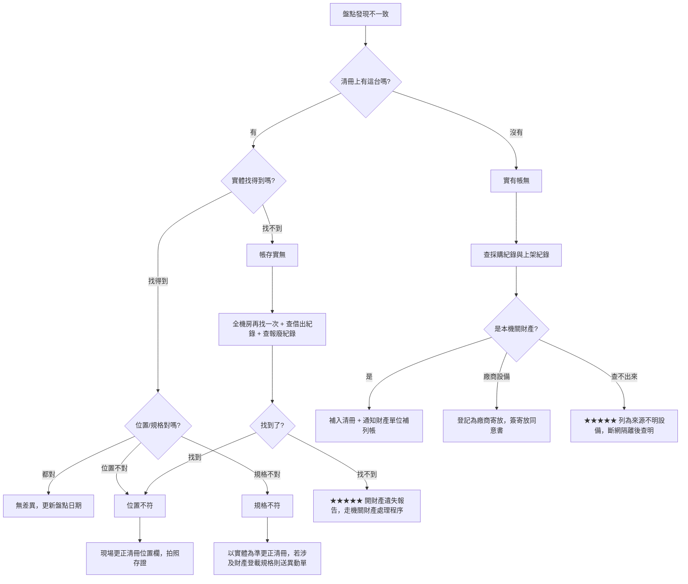

# 資訊設備盤點

> [!abstract] 這篇你會學到
> - 把「清點數量」升級成**帳、物、位、態四合一驗證** —— 盤點真正要證明的是什麼
> - 設計一套**撐得住十年**的資產編號規則，以及機關裡「財產編號 / 資產編號 / 序號」三個號碼的分工
> - ★★★★ 選對**標籤材質與貼法** —— 貼錯位置的標籤，三年後會連同散熱鰭片一起被撕掉
> - 條碼（Code 128）與 QR Code 的取捨、掃描槍 / 手機 App / 純表格三種工具的適用場合
> - ★★★★★ **四類盤點差異的處理流程**：帳存實無、實有帳無、位置不符、規格不符
> - 用 `dmidecode`、`lshw`、`ip link` 讓**機器自己回報**序號與網卡，減少手抄錯誤
> - ★★★★ 拿盤點清冊與 **CMDB、監控系統、交換器 MAC 表**做三方對帳，找出「沒人管的機器」
> - 與財產管理單位（會計 / 總務）的介面：什麼時候該通知他們、什麼欄位必須一致

> [!warning] 未實機驗證
> 本篇的 Linux 指令（`dmidecode`、`lshw`、`lsblk`、`ip`）依官方文件與常見發行版行為撰寫，
> 一般環境可直接使用。**交換器側（JunOS / Cisco IOS）的指令輸出格式因型號與版本而異**，
> 請以你手上設備的實際輸出為準。財產系統的欄位名稱各機關不同，**匯入前務必先要一份欄位對照表**。

## 前置知識

- [[040-02-03-guide-機房-機櫃規劃與設備上架]] — 盤點的「位置」欄位就是機櫃編號與 U 位，先讀這篇才知道怎麼寫
- [[040-02-08-guide-機房-結構化佈線與標籤規範]] — 線路標籤規範與設備標籤是同一套命名體系，不要各做各的
- [[040-02-10-guide-機房-機房巡檢與紀錄]] — 巡檢是「看狀態」，盤點是「對帳」，兩者週期與表單不同但資料互通
- [[020-01-27-cmd-Linux-硬體資訊與裝置管理]] — `dmidecode` / `lshw` / `lspci` 的完整用法在那裡，本篇只講「盤點要抓哪幾欄」
- [[100-02-13-guide-維運-資產與授權管理]] — 軟體授權盤點與硬體盤點的制度差異

---

## 觀念說明

### 盤點不是「數數量」★★★★★

很多機關的盤點就是「總務拿一張表，走一圈打勾」。這種盤點**只證明了東西還在**，
但沒有回答維運人員真正需要的四個問題：

```
① 帳  ── 清冊上有的，實體是不是真的存在？          （帳存實無）
② 物  ── 實體存在的，清冊上是不是有？              （實有帳無）
③ 位  ── 清冊寫的位置，跟實際上架的位置一樣嗎？    （位置不符）
④ 態  ── 這台機器現在是在服役、備援、待報廢、還是已經關機三年了？
```

★★★★★ **一次合格的盤點，必須同時驗證這四項。** 只做①的盤點，
最典型的後果是：機房裡有一台沒有人知道用途、沒有納入監控、沒有更新過的機器，
它會一直跑到某天成為入侵起點。這種機器業界俗稱 **shadow IT / 孤兒主機**，
而找出它們正是盤點對維運最大的價值。

### ★★★★ 一台設備身上有三個號碼，不要混用

機關環境裡最常見的混亂，就是把這三個號碼當成同一個：

| 號碼 | 誰給的 | 用途 | 會不會變 |
| --- | --- | --- | --- |
| ★★★★ **財產編號** | 財產管理單位（會計 / 總務） | 依機關財產管理規定列帳、折舊、報廢 | 一旦編定不會變，報廢才註銷 |
| ★★★★ **資產編號（IT 資產編號）** | 資訊單位自己編 | 機房定位、CMDB 主鍵、監控對應、工單引用 | 不變；就算換機房也跟著設備走 |
| ★★★ **序號（Serial Number）** | 原廠 | 報修、查保固、查召回 | 原廠出廠即固定，換主機板可能改變 |

> [!note] 為什麼資訊單位需要自己的一套編號 ★★★★
> 財產編號的編定邏輯是**會計的**：同一批採購的東西可能連號，但那批裡面
> 有伺服器、有交換器、有 KVM。從財產編號完全看不出「這是什麼、放哪裡」。
>
> 資訊單位需要的是一個**看到編號就知道類別與所屬**的號碼。
> 兩套號碼並存不是浪費，是分工；但**清冊裡必須兩個都有，而且一對一對得起來**。

> [!warning] 序號不能當主鍵 ★★★
> 三個常見的坑：
> 1. 白牌機 / 組裝機常常沒有序號，或 BIOS 裡寫著 `To Be Filled By O.E.M.`
> 2. 同一型號的模組（例如記憶體、硬碟）序號會重複出現在不同欄位，抄錯欄很常見
> 3. 主機板更換後，`dmidecode` 讀到的 System Serial 可能跟機殼貼紙不一樣
>
> 所以**主鍵永遠用你自己編的資產編號**，序號只是一個屬性欄位。

### 盤點的四種類型與週期

| 類型 | 範圍 | 建議週期 | 誰執行 | 主要目的 |
| --- | --- | --- | --- | --- |
| ★★★★ **年度全面盤點** | 全部資訊設備 | 每年 1 次 | 資訊單位 + 財產管理單位會同 | 對財產帳、抓孤兒設備 |
| ★★★ **半年期抽樣盤點** | 依比例抽 10～20% | 每半年 1 次 | 資訊單位 | 驗證清冊維護品質 |
| ★★★★★ **異動盤點** | 單一設備 | 每次上架 / 下架 / 搬遷 / 報廢當下 | 執行異動的人 | 讓清冊即時正確（最重要） |
| ★★★★ **交接盤點** | 交接人負責的全部設備 | 人員異動時 | 交接雙方 | 責任移轉的憑據 |
| ★★ **專案盤點** | 特定專案設備 | 專案結案時 | 專案負責人 | 驗收後資產入帳 |

> [!tip] 制度設計的核心觀念 ★★★★★
> **年度盤點的目標不是「把清冊改對」，而是「檢查異動盤點做得好不好」。**
>
> 如果每次上架、搬遷、報廢都有人即時更新清冊，年度盤點應該幾乎找不到差異。
> **年度盤點差異率高，代表的是「異動流程有缺口」，而不是「今年比較不認真」。**
> 這個因果關係搞反，就會年年花大力氣盤點，年年一樣多差異。

### 抽樣盤點 vs 全面盤點的取捨

| | 全面盤點 | 抽樣盤點 |
| --- | --- | --- |
| 覆蓋率 | 100% | 通常 10～20% |
| 人力 | 高（200 台約 2～3 人日） | 低 |
| 能發現孤兒設備 | ★★★★ 可以 | ★ 幾乎不行（孤兒不在清冊上，抽不到） |
| 能驗證清冊品質 | 可以 | ★★★★ 可以，而且性價比高 |
| 適合時機 | 年度、交接、機房搬遷 | 期中健檢 |

★★★★ **抽樣盤點抓不到「實有帳無」。** 因為抽樣是從清冊抽出來去找實體，
而孤兒設備根本不在清冊上。要抓孤兒，只能做**反向盤點**：
從實體（或從交換器 MAC 表、監控系統、DHCP 租約）反查清冊。這點在進階段落會展開。

### 盤點範圍：什麼算「資訊設備」

範圍沒定義清楚，年年吵年年不一樣。建議在盤點作業要點裡明列：

| 類別 | 納入盤點 | 備註 |
| --- | --- | --- |
| 伺服器（實體） | ★★★★★ 必納 | 含備援機、測試機、已關機但未報廢的 |
| 虛擬機 | ★★★★ 必納，但用 CMDB 管，不貼標籤 | 母機貼標籤，VM 在清冊裡標「掛在哪台母機」 |
| 儲存設備 NAS / SAN | ★★★★★ 必納 | 含擴充櫃 |
| 網路設備（交換器 / 路由器 / 防火牆 / AP） | ★★★★★ 必納 | 見 [[040-01-18-guide-網路設備-網路設備盤點與文件化]] |
| UPS 主機與外接電池櫃 | ★★★★ 必納 | 電池模組另有更換週期表 |
| KVM、機櫃 PDU、環境監控主機 | ★★★ 必納 | 常被忘記 |
| 機櫃本身 | ★★ 視機關規定 | 通常屬財產但不屬資訊設備 |
| 用戶端電腦 / 筆電 | ★★★★ 必納（另冊） | 與機房設備分冊管理，欄位不同 |
| 螢幕、印表機、掃描器 | ★★★ 必納（另冊） | |
| 網路線、光纖跳線、模組（SFP） | ★★ 建議耗材化管理 | 只管庫存量，不逐條編號；SFP 若價值高可個別編號 |
| 軟體授權 | ★★★★ 必納（另冊） | 見 [[100-02-13-guide-維運-資產與授權管理]] |

> [!danger] 三個最常被漏掉、而且漏掉會出事的 ★★★★★
> 1. **借出去沒還的設備**（測試機借給業務單位、備品借給分處）—— 帳在你身上，東西不在
> 2. **已下架但還放在倉庫的設備** —— 沒報廢就還是你的財產，而且**硬碟通常還沒清**
> 3. **廠商寄放在機房的設備** —— 不是你的財產，但插在你的機櫃、吃你的電、連你的網路

---

## 環境準備與安裝

### 標籤：材質、內容、貼法 ★★★★

標籤是整套盤點制度的實體介面。**標籤掉了，這台設備就退化成「無法識別的鐵箱」。**

#### 材質選擇

| 材質 | 特性 | 適用位置 | 不適用 |
| --- | --- | --- | --- |
| ★★★★ **亞光銀 PET（俗稱亞銀龍）** | 耐溫、耐磨、抗溶劑，撕開會留破壞痕 | 伺服器機殼、交換器外殼 | — |
| ★★★ **合成紙（PP / 聚酯）** | 便宜、不易撕破、耐一般濕度 | 室內用戶端設備、螢幕 | 高溫出風口 |
| ★★ **一般銅版紙貼紙** | 最便宜 | 臨時標示、倉庫暫存 | ★★★★ **不要用在機房**，半年會脆化脫落 |
| ★★★ **纏繞式標籤（旗形 / P 型）** | 兩端自黏、中間包線 | 網路線、電源線 | 設備本體 |
| ★★★★ **金屬蝕刻牌 / 鋁牌** | 十年不壞 | 高價值長役期設備、機櫃 | 成本高，改號困難 |

★★★★★ **機房內一律用 PET 或合成紙，不要用一般紙貼紙。**
機房雖然溫度控制得宜，但伺服器出風口局部可達 45℃ 以上，紙標籤的膠會在一到兩年內失效。

#### 標籤上要印什麼

一張設備標籤建議**只印四樣**，多了就印不下、也看不清：

```
┌──────────────────────────────┐
│  ████ █ ██ ███ █ ████        │  ← Code 128 條碼（內容＝資產編號）
│  SRV-A03-07                  │  ← 資產編號（人眼可讀，字要大）
│  資訊室  #2103                │  ← 保管單位 + 財產編號末四碼
└──────────────────────────────┘
```

| 欄位 | 必要性 | 說明 |
| --- | --- | --- |
| 條碼 / QR Code | ★★★★ | 內容只放資產編號，不要塞一堆資訊 |
| 資產編號（人眼可讀） | ★★★★★ | ★ 條碼刮花時的唯一救命稻草，字級至少 12pt |
| 保管單位 | ★★★ | 跨單位機房必備 |
| 財產編號 | ★★★ | 讓財產管理單位一眼對得起來 |

> [!warning] 不要把序號、IP、購入日期印在標籤上 ★★★★
> - **IP 會變**，改了標籤沒改，比沒有更糟
> - **序號很長**，印上去佔位置又沒人用眼睛核對
> - 這些資訊應該在清冊裡，掃條碼查得到，**標籤只負責「指向清冊的一把鑰匙」**

#### 貼法：貼哪裡 ★★★★★

這是最多人做錯、而且做錯就白貼的一步。

| 設備 | 建議貼法 | 絕對不要貼的位置 |
| --- | --- | --- |
| 機架式伺服器 | ★★★★ 前面板耳片（rack ear）平面處，或前面板右下角 | ★★★★★ **散熱孔／進風網面**（擋風且會被撕）、滑軌、可拆的前擋板 |
| 機架式交換器 | 前面板左側非埠區 | 埠位標示區、風扇出風口 |
| 塔式主機 | 側板正面上方 | ★★★ **側板**（開機殼會被拆下來換） |
| NAS / 儲存 | 前面板非硬碟抽取盒處 | ★★★★★ **硬碟抽取盒**（換硬碟就跟著走了） |
| UPS | 前面板下緣 | 顯示螢幕、通風口 |
| 機櫃 PDU | 側面靠近電源入口處 | 插座之間（會被電源線蓋住） |

> [!danger] ★★★★★ 三個「貼了等於沒貼」的位置
> 1. **可拆的元件上** —— 前擋板、硬碟抽取盒、滑軌、蓋板。元件一換，資產編號就跟著錯位。
> 2. **進出風網面上** —— 除了擋住氣流影響散熱，PET 標籤在網面上黏著面積小，最容易脫落。
> 3. **要開機櫃後門才看得到的位置** —— 盤點時沒人想為了看標籤去開後門，最後大家就用猜的。
>
> **正確的判準：站在機櫃前門、不動任何東西、手電筒照一下就要看得到。**

> [!tip] 貼之前先擦 ★★
> 機殼上有灰塵或指紋，PET 標籤黏著力會掉一半。用**異丙醇擦拭紙**擦過再貼，
> 貼完用指腹壓 10 秒。這一步只花 15 秒，但決定標籤是撐兩年還是撐八年。

### 條碼 vs QR Code

| | Code 128 條碼 | QR Code |
| --- | --- | --- |
| 掃描器 | ★★★★ 一維雷射掃描槍即可（便宜） | 需要影像式掃描器或手機 |
| 掃描距離／角度 | 需大致對正，30～50cm | ★★★ 角度寬容、可近距離 |
| 刮花容忍度 | ★★ 低，一道刮痕就掃不到 | ★★★★ 高，有容錯，破損 15～30% 仍可讀 |
| 印製寬度 | 較寬，短標籤印不下長編號 | ★★★ 方形，省橫向空間 |
| 可存資料量 | 短編號（建議 ≤ 20 字元） | 可存 URL、多欄位 |
| ★★★★ **建議** | 純數字 / 短英數編號、有掃描槍 | 用手機盤點、標籤空間窄、要連到清冊網頁 |

★★★ **實務折衷做法：條碼與 QR 兩個都印。** 標籤上半條碼、下半 QR，
掃描槍與手機都能用，成本只差幾毛錢。

### 盤點工具三選一

| 工具 | 建置成本 | 適合規模 | 優點 | 缺點 |
| --- | --- | --- | --- | --- |
| ★★ **純表格（列印 + 手打勾）** | 幾乎為零 | < 50 台 | 不需任何設備、停電也能做 | ★★★★ 事後要人工登打，是最大錯誤來源 |
| ★★★★ **USB / 藍牙掃描槍 + 筆電** | 一支 1～3 千元 | 50～500 台 | 掃到哪打到哪，零登打錯誤 | 要帶筆電，機櫃間走動不方便 |
| ★★★★ **手機 App（掃 QR）** | 幾乎為零（有些機關禁裝 App） | 任意 | 單手作業、可拍照存證 | ★★★ 機房訊號差時離線資料要能暫存 |

> [!note] 掃描槍的關鍵規格 ★★★
> 絕大多數 USB 掃描槍是 **HID 鍵盤模式**：掃到什麼就當成有人在鍵盤上打什麼，
> **不需要驅動程式**，插上去在 Excel 或文字檔就能用。
>
> 採購時只要確認兩件事：
> 1. ★★★ **有沒有內建記憶體（離線儲存）** —— 機房裡不見得方便一直接著筆電
> 2. 掃完後是否自動送出換行（Enter）—— 沒有的話一列列會黏在一起
>
> 藍牙款方便，但**機房金屬機櫃多，訊號會斷**，建議選有離線記憶體的款式。

> [!info]- 財產系統／CMDB 平台差異對照
> 不同機關手上的工具差很多，本篇的做法都以「能匯出 CSV」為最低共同基礎：
>
> | 環境 | 常見情況 | 本篇做法怎麼套 |
> | --- | --- | --- |
> | 只有 Excel | 中小型機關最常見 | 直接用本篇的 CSV 欄位規格，Excel 開 CSV 時**務必選「文字」匯入**，否則前導 0 會被吃掉 |
> | 機關有財產管理系統 | 通常只能匯出、不能匯入 | 以資訊單位的 CSV 為工作底稿，差異用**書面異動單**送財產單位 |
> | 有 CMDB（GLPI、Snipe-IT、iTop 等） | 資訊單位自建 | CMDB 當主資料源，定期匯出 CSV 與財產帳對帳 |
> | 有 ITSM / 工單系統 | 大型機關 | 資產與工單關聯，盤點差異直接開工單追蹤 |
>
> ★★★ 不論用哪一種，**都要有「能匯出成 CSV 並用純文字工具比對」的能力**。
> 只能在畫面上一頁頁翻的系統，不可能做完整對帳。

---

## 基礎設定

### 步驟一：設計資產編號規則 ★★★★★

編號規則一旦上路就很難改（標籤都貼出去了），所以要一次想清楚。

建議格式（三段式，總長 10～12 字元）：

```
<類別碼>-<位置碼>-<流水號>

SRV-A03-07
│    │   └── 流水號，同一位置內遞增，兩碼
│    └────── 位置碼：機櫃 A03（機櫃編號直接沿用上架規範）
└─────────── 類別碼：三碼英文
```

類別碼建議表：

| 類別碼 | 設備類別 | 類別碼 | 設備類別 |
| --- | --- | --- | --- |
| `SRV` | 實體伺服器 | `UPS` | 不斷電系統 |
| `SWT` | 交換器 | `PDU` | 機櫃電源插座 |
| `RTR` | 路由器 | `KVM` | KVM 切換器 |
| `FWL` | 防火牆 | `ENV` | 環境監控主機 |
| `STG` | 儲存設備 / NAS | `TAP` | 磁帶機 / 備份設備 |
| `APX` | 無線基地台 | `MSC` | 其他 |

> [!danger] 編號規則的三個致命錯誤 ★★★★★
> ① **把位置編進「不會變」的欄位裡卻又常搬家** —— 如果你的機房設備常搬櫃，
>    位置碼就不該進資產編號，改成純流水號 `SRV-00147`，位置另設欄位。
>    ★★★★ **判準：一年搬動超過 10% 的設備，就不要把位置編進編號。**
> ② **流水號只留兩碼** —— 到第 100 台就爆了。設備數量可能破百的類別留三碼。
> ③ **編號裡用容易誤讀的字元** —— `0` 與 `O`、`1` 與 `I` 與 `l`。
>    ★★★ 建議**編號中不使用字母 O 與 I**，手抄與 OCR 的錯誤會少一半。

### 步驟二：定義清冊欄位 ★★★★

這是整篇最重要的一張表。**欄位少了，盤點做完也回答不了問題；欄位多了，沒人維護得動。**

| # | 欄位 | 必填 | 範例 | 說明 |
| --- | --- | --- | --- | --- |
| 1 | ★★★★★ 資產編號 | ✔ | `SRV-A03-07` | 主鍵，全機關唯一 |
| 2 | ★★★★ 財產編號 | ✔ | `3140102-0021` | 與財產帳對應 |
| 3 | ★★★ 設備類別 | ✔ | `實體伺服器` | 用固定選項，不要自由填寫 |
| 4 | ★★★ 廠牌 | ✔ | `Dell` | |
| 5 | ★★★ 型號 | ✔ | `PowerEdge R650` | |
| 6 | ★★★ 序號 | ✔ | `J7K2M03` | 報修用 |
| 7 | ★★★★★ 位置 | ✔ | `機房A / 機櫃A03 / U07-U08` | 機房、機櫃、U 位起訖 |
| 8 | ★★★★ 用途說明 | ✔ | `檔案伺服器（人事系統）` | ★ 一句話，讓非本人也看得懂 |
| 9 | ★★★★★ 狀態 | ✔ | `服役中` | 服役中 / 備援 / 待上架 / 待報廢 / 已報廢 / 借出 |
| 10 | ★★★★ 保管人 | ✔ | `王小明` | 出事找誰 |
| 11 | ★★★ 使用單位 | ✔ | `人事處` | |
| 12 | ★★★ 管理 IP | | `10.20.3.17` | 有多個就填管理用那個 |
| 13 | ★★★ MAC（管理埠） | | `d4:5d:64:8a:1b:02` | ★★★ 反查實體位置用，非常有用 |
| 14 | ★★★★ 購入日期 | ✔ | `2023-04-18` | 算役齡、算折舊 |
| 15 | ★★★★★ 保固到期日 | ✔ | `2026-04-17` | 見 [[040-02-12-guide-機房-設備生命週期管理]] |
| 16 | ★★★ 供應商 | | `○○資訊` | |
| 17 | ★★★★ 預計汰換年度 | | `2028` | 編預算用 |
| 18 | ★★★ 是否納入監控 | ✔ | `是` | ★★★★ 對帳用的關鍵欄位 |
| 19 | ★★★ 是否納入備份 | ✔ | `是` | |
| 20 | ★★★ 最後盤點日期 | ✔ | `2026-09-02` | |
| 21 | ★★ 備註 | | | |

> [!tip] 第 9、18、19 欄是維運人員最該堅持的三欄 ★★★★★
> 財產單位只在乎 1、2、14。**只有資訊單位會在乎「這台有沒有被監控、有沒有被備份、現在是不是還活著」。**
> 這三欄就是盤點對維運的全部價值所在，**寧可其他欄位偷懶，這三欄一定要準**。

### 步驟三：讓機器自己回報，不要手抄 ★★★★

序號、型號、MAC 這三個欄位手抄的錯誤率高得驚人（機殼貼紙常常小到看不清）。
能連得上的機器，一律用指令抓。

**Linux（Ubuntu / Debian 主線）**：

```bash
sudo apt install -y dmidecode
```

抓機器身分三件事：

```bash
sudo dmidecode -s system-manufacturer
sudo dmidecode -s system-product-name
sudo dmidecode -s system-serial-number
```

預期輸出：

```text
Dell Inc.
PowerEdge R650
J7K2M03
```

★★★ 若看到 `To Be Filled By O.E.M.` 或 `System Serial Number`，代表這台機器
（通常是組裝機或某些虛擬機）**BIOS 裡沒寫序號**，此欄請以機殼貼紙為準並在備註註明。

抓網卡 MAC：

```bash
ip -brief link show
```

預期輸出：

```text
lo               UNKNOWN        00:00:00:00:00:00 <LOOPBACK,UP,LOWER_UP>
eno1             UP             d4:5d:64:8a:1b:02 <BROADCAST,MULTICAST,UP,LOWER_UP>
eno2             DOWN           d4:5d:64:8a:1b:03 <BROADCAST,MULTICAST,UP>
```

抓硬碟（盤點儲存容量與硬碟數量用）：

```bash
lsblk -d -o NAME,SIZE,MODEL,SERIAL
```

預期輸出：

```text
NAME   SIZE MODEL                    SERIAL
sda    1.8T PERC H755 Front          6f4ee0806c1a2b00
sdb    1.8T PERC H755 Front          6f4ee0806c1a2b01
```

一次抓齊的小腳本 `/usr/local/sbin/inventory-report`：

```bash
#!/usr/bin/env bash
# inventory-report — 輸出單機盤點欄位（CSV 一列）
set -euo pipefail

need_root() { [ "$(id -u)" -eq 0 ] || { echo "請用 root 執行" >&2; exit 1; }; }
need_root

HOST=$(hostname -s)
MFR=$(dmidecode -s system-manufacturer 2>/dev/null | head -1)
MODEL=$(dmidecode -s system-product-name 2>/dev/null | head -1)
SN=$(dmidecode -s system-serial-number 2>/dev/null | head -1)
CPU=$(nproc)
MEM=$(awk '/MemTotal/ {printf "%.0fGB", $2/1024/1024}' /proc/meminfo)
# 取第一張 UP 且非 lo 的網卡
IFACE=$(ip -o link show up | awk -F': ' '$2 != "lo" {print $2; exit}')
MAC=$(cat "/sys/class/net/${IFACE}/address" 2>/dev/null || echo "-")
IP=$(ip -4 -brief addr show "${IFACE}" | awk '{print $3}' | cut -d/ -f1)
OS=$(. /etc/os-release && echo "${PRETTY_NAME}")

printf '%s,%s,%s,%s,%s,%s,%s,%s,"%s"\n' \
  "${HOST}" "${MFR}" "${MODEL}" "${SN}" "${CPU}" "${MEM}" "${MAC}" "${IP}" "${OS}"
```

執行與預期輸出：

```bash
sudo chmod 750 /usr/local/sbin/inventory-report
sudo /usr/local/sbin/inventory-report
```

```text
srv-file01,Dell Inc.,PowerEdge R650,J7K2M03,32,128GB,d4:5d:64:8a:1b:02,10.20.3.17,"Ubuntu 24.04.1 LTS"
```

> [!info]- Rocky / AlmaLinux（RHEL 系）對照
> 只有安裝指令不同，其餘完全一致：
>
> ```bash
> sudo dnf install -y dmidecode
> ```
>
> `lsblk`、`ip`、`/etc/os-release` 在 RHEL 系行為相同。
> ★★ 若是最小化安裝，`lsblk` 屬 `util-linux`（預設已裝），`ip` 屬 `iproute`（預設已裝）。

> [!info]- Windows Server 對照（PowerShell）
> GUI 走「系統資訊（msinfo32）」即可，但盤點要批次抓就用 PowerShell：
>
> ```powershell
> Get-CimInstance Win32_ComputerSystem  | Select-Object Manufacturer, Model
> Get-CimInstance Win32_BIOS            | Select-Object SerialNumber
> Get-NetAdapter | Where-Object Status -eq 'Up' | Select-Object Name, MacAddress, LinkSpeed
> ```
>
> 預期輸出：
>
> ```text
> Manufacturer  Model
> ------------  -----
> Dell Inc.     PowerEdge R650
>
> SerialNumber
> ------------
> J7K2M03
> ```
>
> ★★★ `Win32_BIOS` 的 `SerialNumber` 對應的就是 Linux `dmidecode -s system-serial-number`，
> 兩邊抓到的是同一個 SMBIOS 欄位，可以直接對帳。

### 步驟四：印出盤點工作單

盤點當天手上要有的東西：

| 項目 | 說明 |
| --- | --- |
| ★★★★ 設備盤點表（每機櫃一張） | vault 內的 Word 範本在 `_表單範本/040-02-02-設備盤點表.docx`，依機櫃過濾後列印 |
| ★★★ 機櫃立面圖 | 印出每個機櫃的 U 位配置圖，發現位置不符時直接畫上去 |
| ★★★ 空白差異單 | 差異當場記，不要等回辦公室憑記憶補 |
| ★★ 手電筒 / 頭燈 | 機櫃後方永遠不夠亮 |
| ★★ 標籤機 + 備用標籤 | ★★★★ 現場補貼掉落的標籤，**不要留到下次** |
| ★★ 相機 / 手機 | 差異項目一律拍照存證 |

> [!warning] 表單範本不要用 wikilink 指過去 ★★
> `_表單範本/` 裡的檔案是 `.docx`，Obsidian 的 `[[ ]]` 連結只解析筆記檔名，
> 指向 `.docx` 會變成斷掉的連結，也會被 `檢查連結.py` 抓出來。
> **在內文用文字寫出路徑就好**，例如：「表單在 `_表單範本/040-02-02-設備盤點表.docx`」。

---

## 進階設定與調校

### 一、四類差異的處理流程 ★★★★★

這是盤點制度的心臟。**差異怎麼判、誰負責、要不要通知財產單位**，
如果沒有事先定義，每次都會變成扯皮。



四類差異的處理對照表：

| 差異類型 | 定義 | 常見真正原因 | 處理步驟 | 要不要通知財產單位 |
| --- | --- | --- | --- | --- |
| ★★★★★ **帳存實無** | 清冊有、找不到實體 | ① 借出未登記 ② 已報廢未註銷 ③ 搬到別的機房 ④ 真的遺失 | 二次搜尋 → 查借出／報廢紀錄 → 查監控是否還活著 → 仍找不到才報遺失 | ★★★★★ **要**，且需依機關規定辦理 |
| ★★★★★ **實有帳無** | 有實體、清冊沒有 | ① 專案採購未入帳 ② 廠商寄放 ③ 別單位放進來 ④ 來源不明 | 查採購／驗收紀錄 → 查上架紀錄 → 追出來源 | ★★★★ 若屬本機關財產，**要**（補列帳） |
| ★★★ **位置不符** | 帳物都在、位置不同 | 搬遷未更新清冊（最常見） | 現場改清冊，拍照，檢討為何異動時沒更新 | ✖ 不用（除非跨機關 / 跨場所） |
| ★★★ **規格不符** | 型號、容量、序號對不上 | ① 換過主機板 ② 擴充過記憶體／硬碟 ③ 當初登打錯 | 以實體為準更正 | ★★ 若財產帳登載規格，要送異動 |

> [!danger] ★★★★★ 「來源不明設備」的處理只有一個正確做法
> 在機房裡找到一台**沒有標籤、清冊沒有、沒人承認、也查不出採購來源**的設備：
>
> 1. **不要關機**（可能正在提供某個沒人記得的服務，關掉會出事）
> 2. ★★★★★ **先在交換器上把它的埠改到隔離 VLAN 或直接 shutdown**，切斷網路但保留供電
> 3. 拍照、記錄它插在哪一埠、MAC、IP、序號
> 4. 發文（或群組公告）詢問各單位認領，設定期限（建議 10 個工作日）
> 5. 期限內無人認領 → 依機關規定辦理（通常是簽報後拆除、資料銷毀）
>
> **絕對不要「先關機看誰來抱怨」** —— 這是機關資訊室最經典的自殺式除錯法，
> 而它抱怨的方式往往是「薪資系統上不去」。

### 二、三方對帳：清冊 × CMDB × 監控 ★★★★

盤點清冊只能證明「東西在機房」，**證明不了「它有被管理」**。真正的健康檢查是三方對帳：

```
        盤點清冊（實體為準）
              ▲
              │  ① 帳物對帳（人工，年度盤點）
              ▼
        CMDB / 資產系統
              ▲
              │  ② 納管對帳（腳本，每月）
              ▼
     監控系統主機清單（Zabbix / Nagios / Wazuh…）
```

② 這一步可以完全自動化。做法是把兩邊都匯成只有「資產編號」或「主機名」的排序清單，
再用 `comm` 比對：

```bash
# 從清冊 CSV 取出「狀態=服役中 且 應納入監控=是」的主機名
awk -F, 'NR>1 && $9=="服役中" && $18=="是" {print $1}' 資產清冊.csv | sort -u > /tmp/should_monitor.txt

# 從監控系統匯出的主機清單
sort -u 監控主機清單.txt > /tmp/is_monitored.txt

echo "=== 應該被監控但沒有（缺監控）==="
comm -23 /tmp/should_monitor.txt /tmp/is_monitored.txt

echo "=== 被監控但清冊上沒有（孤兒主機）==="
comm -13 /tmp/should_monitor.txt /tmp/is_monitored.txt
```

預期輸出：

```text
=== 應該被監控但沒有（缺監控）===
SRV-B01-03
SRV-B02-11

=== 被監控但清冊上沒有（孤兒主機）===
SRV-OLD-TEST
```

> [!note] `comm` 的三個欄位 ★★★
> `comm` 需要**兩邊都事先排序**（所以上面都加了 `sort -u`）。
> - `comm -23 A B` = 只在 A 有的
> - `comm -13 A B` = 只在 B 有的
> - `comm -12 A B` = 兩邊都有的
>
> ★★★ 忘記 `sort` 是最常見的錯誤，`comm` 會印出 `comm: file 1 is not in sorted order`
> 並給出完全錯誤的結果。

### 三、用交換器 MAC 表反查實體位置 ★★★★

當你有一台「在網路上活著、但不知道在哪個機櫃」的機器，這招最快。

主線（Juniper JunOS）：

```junos
show ethernet-switching table | match d4:5d:64:8a:1b:02
```

預期輸出：

```text
   default-switch      d4:5d:64:8a:1b:02   D          -   ge-0/0/14.0
```

`ge-0/0/14` 就是實體埠。接著查該埠的描述（如果佈線標籤有做好，描述會寫機櫃與 U 位）：

```junos
show interfaces descriptions | match ge-0/0/14
```

```text
ge-0/0/14       up    up   A03-U07-SRV-A03-07-eth0
```

> [!info]- Cisco IOS 對照
> ```cisco
> show mac address-table address d45d.648a.1b02
> ```
>
> 預期輸出：
>
> ```text
>           Mac Address Table
> -------------------------------------------
> Vlan    Mac Address       Type        Ports
> ----    -----------       --------    -----
>   20    d45d.648a.1b02    DYNAMIC     Gi1/0/14
> ```
>
> ★★★ **注意 MAC 格式差異**：Cisco 用 `xxxx.xxxx.xxxx`（點分四位），
> Juniper 與 Linux 用 `xx:xx:xx:xx:xx:xx`（冒號分兩位）。
> 從清冊複製 MAC 去 Cisco 查之前要先轉格式，這是最常見的「查不到」原因。
>
> 查埠描述：
>
> ```cisco
> show interfaces description | include Gi1/0/14
> ```

★★★★ 這也是抓「實有帳無」最有效的方法之一：把交換器所有 MAC 抓下來，
逐筆比對清冊，比對不到的就是候選孤兒設備。

### 四、與財產管理單位的介面 ★★★★

資訊單位與財產單位是**兩本帳**，而且注定不會完全一樣。重點是把介面講清楚：

| 事件 | 資訊單位要做 | 要不要送財產單位 | 時機 |
| --- | --- | --- | --- |
| 新設備驗收 | 編資產編號、貼標籤、入清冊 | ★★★★★ 要（財產增加） | 驗收後即刻 |
| 設備搬遷（機房內） | 更新清冊位置欄 | ✖ | 當下 |
| 設備搬遷（跨場所 / 跨單位） | 更新清冊 + 保管人 | ★★★★ 要（保管移轉） | 搬遷前 |
| 借出給其他單位 | 狀態改「借出」+ 借出單 | ★★★ 依機關規定 | 借出當下 |
| 設備下架待報廢 | 狀態改「待報廢」 | ★★ 先不用，等報廢時一起 | 下架當下 |
| ★★★★★ 設備報廢 | 資料銷毀 → 取得銷毀證明 → 狀態改「已報廢」 | ★★★★★ 要（財產減損） | 資料銷毀完成後 |
| 設備遺失 | 開遺失報告 | ★★★★★ 要 | 確認找不到後即刻 |

> [!warning] 兩本帳永遠不會 100% 一致，這是正常的 ★★★
> 常見的合理差異：
> - **達到報廢年限但還在用**：財產帳可能已折舊完畢（帳面 0 元），但機器還在服役
> - **低於財產列管門檻的設備**：例如單價未達列管標準的小交換器，財產帳沒有，但資訊清冊必須有
> - **虛擬機**：財產帳不會有 VM，但 CMDB 必須有
>
> ★★★★ **正確心態：資訊清冊是「管理用」，財產帳是「會計用」，
> 兩者對得起來的是「有形、列管、單一實體」的那一部分。**
> 不要為了追求兩本帳完全一致，去刪掉資訊清冊裡有價值的欄位。

### 五、盤點資料的維護節奏

★★★★ 讓清冊保持正確的關鍵，不是「盤點盤得勤」，而是**把清冊更新綁進日常流程**：

| 流程 | 綁進去的做法 |
| --- | --- |
| 新機建置 | ★★★★★ [[020-02-03-01-svc-標準化-新機建置標準流程]] 的驗收檢查表列一項「已取得資產編號並貼標籤」，沒有就不簽收 |
| 變更管理 | [[100-02-08-guide-維運-變更管理流程]] 的變更單增加「是否涉及資產異動」欄，勾了就必須附清冊更新 |
| 設備報修 | 工單一定要填資產編號，填不出來代表標籤掉了，順手補貼 |
| 月維護 | [[100-02-04-guide-維運-每月維護作業]] 排一項「跑三方對帳腳本」 |
| 離職交接 | [[100-02-12-guide-維運-交接與新人上手]] 附交接盤點表 |

---

## 完整實戰範例

### 情境

某機關資訊室，一間機房 4 個機櫃（A01～A04），共 38 台列管資訊設備。
清冊是一份 Excel，最後一次全面更新是 18 個月前。
要在**兩個工作天內**完成年度全面盤點，並產出可送財產單位的差異報告。

參與人員：資訊室 2 人（1 人掃描、1 人記錄）、財產管理單位 1 人（第二天上午會同）。

### 階段〇：D-14 前置作業

**① 匯出並整理基準清冊**

```bash
mkdir -p ~/盤點2026 && cd ~/盤點2026
# 從 Excel 另存為 CSV（UTF-8）後放進來，命名為 base.csv
head -3 base.csv
```

預期輸出：

```text
資產編號,財產編號,類別,廠牌,型號,序號,位置,用途,狀態,保管人
SRV-A01-01,3140102-0018,實體伺服器,Dell,PowerEdge R640,H3K9L21,機房A/A01/U03-U04,AD網域控制站,服役中,王小明
SRV-A01-02,3140102-0019,實體伺服器,Dell,PowerEdge R640,H3K9L22,機房A/A01/U05-U06,檔案伺服器,服役中,王小明
```

★★★ 檢查筆數與重複主鍵：

```bash
echo "總筆數：$(($(wc -l < base.csv) - 1))"
awk -F, 'NR>1 {print $1}' base.csv | sort | uniq -d
```

```text
總筆數：38
```

（第二行沒有輸出＝沒有重複資產編號，這是必要條件；有輸出就先修清冊再盤點。）

**② 依機櫃拆成工作單**

```bash
for rack in A01 A02 A03 A04; do
  { head -1 base.csv; grep ",機房A/${rack}/" base.csv; } > "工作單-${rack}.csv"
  echo "${rack}: $(($(wc -l < "工作單-${rack}.csv") - 1)) 台"
done
```

```text
A01: 11 台
A02: 9 台
A03: 10 台
A04: 8 台
```

**③ 先跑一次線上對帳（找出可以在辦公室就解掉的差異）**

```bash
# 清冊中有管理 IP 的，先 ping 一輪
awk -F, 'NR>1 && $11 != "" {print $1","$11}' base.csv | while IFS=, read -r id ip; do
  if ping -c1 -W1 "$ip" >/dev/null 2>&1; then
    echo "UP   $id $ip"
  else
    echo "DOWN $id $ip"
  fi
done | tee ping結果.txt | grep -c '^UP'
```

```text
31
```

★★★★ `DOWN` 的那幾台是**盤點當天要優先確認的重點**：可能是已下架沒更新、
可能是換了 IP、也可能真的掛了。

**④ 印表單與備料**

- 依機櫃列印 `_表單範本/040-02-02-設備盤點表.docx` 填入工作單資料後的版本，一櫃一張
- 印四張機櫃立面圖
- 準備標籤機、PET 標籤帶、異丙醇擦拭紙、頭燈、相機

### 階段一：D-Day 第一天上午 —— A01 / A02 實體盤點

作業方式（**兩人一組，一人掃一人記，不要一個人做**）：

```
對每一個 U 位，由上而下：
  1. 看到設備 → 掃條碼（或念資產編號）
  2. 記錄人在工作單上勾「實到」
  3. 核對 U 位起訖 → 不一致就在立面圖上畫紅線並註記實際位置
  4. 核對廠牌型號 → 不一致註記
  5. 標籤脫落／模糊 → 現場重印重貼，並在工作單註記「已補標」
  6. 工作單上沒有的設備 → 一律拍照 + 記 MAC/序號，列「實有帳無」候選
```

掃描槍輸出（接筆電，存成純文字）：

```bash
cat > /dev/null <<'SCAN'
SCAN
# 實務上直接開一個檔案，掃描槍當鍵盤輸入
: > 實掃-A01.txt
# （在這個檔案上逐一掃描，每掃一筆自動換行）
sort -u 實掃-A01.txt > 實掃-A01.sorted.txt
wc -l < 實掃-A01.sorted.txt
```

```text
11
```

當場比對：

```bash
awk -F, 'NR>1 {print $1}' 工作單-A01.csv | sort -u > 應有-A01.txt
echo "--- 帳存實無（清冊有、沒掃到）---"
comm -23 應有-A01.txt 實掃-A01.sorted.txt
echo "--- 實有帳無（掃到、清冊沒有）---"
comm -13 應有-A01.txt 實掃-A01.sorted.txt
```

```text
--- 帳存實無（清冊有、沒掃到）---
SWT-A01-09
--- 實有帳無（掃到、清冊沒有）---
```

★★★★ **當場就能知道 A01 少一台交換器**，不用等回辦公室。這正是帶筆電進機房的價值。

### 階段二：第一天下午 —— A03 / A04，並處理實有帳無

A03 掃描時發現一台**沒有標籤的 1U 機器**在 U12。處理：

```bash
# ① 記錄它的網路身分（從序號抄下來 + 從交換器查 MAC）
# 序號（機殼貼紙）：CNU4021L8X
# ② 查它插在哪一埠、MAC 多少
```

在核心交換器上（JunOS）：

```junos
show ethernet-switching table interface ge-0/0/22
```

```text
   default-switch      3c:a8:2a:11:9e:04   D          -   ge-0/0/22.0
```

反查 IP（從 ARP 表）：

```junos
show arp | match 3c:a8:2a:11:9e:04
```

```text
3c:a8:2a:11:9e:04 10.20.3.88   10.20.3.88   irb.20 [ge-0/0/22.0]   none
```

拿到 IP 後查它在跑什麼（**不要登入、不要關機**，只做非侵入式探測）：

```bash
nmap -Pn -sT --top-ports 20 10.20.3.88
```

預期輸出：

```text
Starting Nmap 7.94 ( https://nmap.org )
Nmap scan report for 10.20.3.88
Host is up (0.00031s latency).

PORT     STATE  SERVICE
22/tcp   open   ssh
80/tcp   open   http
443/tcp  open   https
3306/tcp open   mysql
```

> [!danger] ★★★★★ 這一步之後絕對不要做的事
> 看到 `3306/tcp open`（MySQL）不要就以為是測試機而關掉它。
> **正確做法是拍照、記錄、發文詢問認領，並在交換器上把它移到隔離 VLAN 觀察，
> 而不是斷電。** 一台跑著 MySQL 的無主機器，很可能是某個單位自己買來上線的正式系統。

登記為「實有帳無 #1」，填差異單，隔天會同財產單位時提報。

### 階段三：第二天上午 —— 差異彙整與會同確認

彙整四櫃結果：

```bash
cat 實掃-A0*.sorted.txt | sort -u > 實掃-全部.txt
awk -F, 'NR>1 {print $1}' base.csv | sort -u > 應有-全部.txt

echo "應有：$(wc -l < 應有-全部.txt)  實到：$(wc -l < 實掃-全部.txt)"
echo "=== 帳存實無 ==="; comm -23 應有-全部.txt 實掃-全部.txt
echo "=== 實有帳無 ==="; comm -13 應有-全部.txt 實掃-全部.txt
```

```text
應有：38  實到：36
=== 帳存實無 ===
SWT-A01-09
STG-A04-03
=== 實有帳無 ===
```

（無標籤那台不在 `實掃` 檔裡，因為它沒有資產編號可掃，另以差異單處理。）

追查兩筆帳存實無：

| 資產編號 | 追查方式 | 結果 | 歸類 |
| --- | --- | --- | --- |
| `SWT-A01-09` | 查工單系統 → 三個月前故障送修 | 在廠商維修中，有維修單 | ★★★ 非遺失，狀態改「維修中」，補建「送修登記」流程 |
| `STG-A04-03` | 查借出紀錄 → 無；查監控 → 半年前就沒資料；問前任保管人 → 兩年前搬到分處 | 在分處機房，未辦保管移轉 | ★★★★ 位置不符（跨場所），送保管移轉異動單 |

### 階段四：第二天下午 —— 更新清冊與報告

**① 更新清冊**

```bash
cp base.csv 資產清冊-2026盤點後.csv
# 逐筆依差異單修正（狀態、位置、保管人、最後盤點日期）
```

更新後檢查所有服役中設備的最後盤點日期：

```bash
awk -F, 'NR>1 && $9=="服役中" && $20!="2026-09-02" {print "未更新盤點日期: "$1}' 資產清冊-2026盤點後.csv
```

（沒有輸出＝全部更新完成。）

**② 跑三方對帳**

```bash
awk -F, 'NR>1 && $9=="服役中" && $18=="是" {print $1}' 資產清冊-2026盤點後.csv | sort -u > /tmp/should_monitor.txt
sort -u 監控主機清單.txt > /tmp/is_monitored.txt
echo "=== 缺監控 ==="; comm -23 /tmp/should_monitor.txt /tmp/is_monitored.txt
echo "=== 監控有、清冊無 ==="; comm -13 /tmp/should_monitor.txt /tmp/is_monitored.txt
```

```text
=== 缺監控 ===
SRV-A02-05
=== 監控有、清冊無 ===
```

★★★★ 找到一台服役中但沒納入監控的伺服器 —— **這是本次盤點對維運最有價值的一筆發現**，
開工單補納管。

**③ 產出盤點報告**（送主管與財產單位）

```text
2026 年度資訊設備盤點報告

一、盤點期間：2026-09-01 ～ 2026-09-02
二、盤點範圍：機房A（機櫃 A01～A04），列管資訊設備 38 台
三、盤點結果：
    實到相符          35 台
    帳存實無（維修中） 1 台  SWT-A01-09（廠商維修單 M-2026-0431）
    位置不符（跨場所） 1 台  STG-A04-03（在○○分處，另送保管移轉）
    實有帳無           1 台  無標籤設備（U位 A03-U12，序號 CNU4021L8X）
    遺失               0 台
四、附帶發現：
    ① 服役中未納入監控 1 台（SRV-A02-05），已開工單 T-2026-1187
    ② 標籤脫落補貼 4 台
    ③ 逾保固設備 6 台（詳附表，建議納入 2028 年度汰換）
五、待辦與期限：
    ① 保管移轉異動單 ── 資訊室 ── 2026-09-15 前
    ② 無標籤設備認領公告 ── 資訊室 ── 2026-09-05 發文，2026-09-19 截止
    ③ 補納管監控 ── 系統組 ── 2026-09-09 前
六、附件：差異單 3 份、現場照片 12 張、更新後清冊 1 份
```

### 驗收：怎麼確認這次盤點做得算合格

| 檢查項 | 通過條件 |
| --- | --- |
| ★★★★★ 每一筆差異都有結論 | 不能有「待查」留在報告裡沒有負責人與期限 |
| ★★★★ 清冊已更新並歸檔 | 有版本、有日期、放在大家找得到的位置 |
| ★★★★ 三方對帳已跑過 | 缺監控 / 缺備份的都已開工單 |
| ★★★★ 標籤脫落已當場補貼 | 沒有「回去再補」 |
| ★★★ 財產單位已收到異動單 | 有收文編號 |
| ★★★★ 檢討出至少一項流程缺口 | 例如「送修沒有登記流程」→ 本次就要補上 |

---

## 常見錯誤與排錯

| 現象 | 原因 | 解法 |
| --- | --- | --- |
| Excel 開 CSV 後，財產編號 `0031402` 變成 `31402` | ★★★★ Excel 預設把純數字欄位當數值，吃掉前導 0 | 用「資料 → 從文字/CSV」匯入並把該欄指定為「文字」；或在 CSV 產生時就把編號欄加引號 |
| CSV 開起來全是亂碼 | ★★★ 檔案是 UTF-8 無 BOM，Excel 以系統編碼解讀 | 存成「UTF-8 with BOM」，或用 `iconv -f UTF-8 -t BIG5 in.csv > out.csv`（會遺失少數字元） |
| `comm: file 1 is not in sorted order` | ★★★★ 忘了先 `sort` | 兩個輸入檔都要 `sort -u` 之後再餵給 `comm` |
| `comm` 比對結果整份都被列為差異 | ★★★ 兩邊有隱形差異：行尾 CRLF、前後空白、大小寫 | `sed -i 's/\r$//' file` 去 CR；`awk '{gsub(/^ +| +$/,""); print toupper($0)}'` 正規化 |
| `dmidecode` 顯示 `To Be Filled By O.E.M.` | ★★★ 白牌機／組裝機 BIOS 未寫入序號 | 以機殼貼紙為準手工填入，備註註明「BIOS 無序號」 |
| `dmidecode: command not found` | 套件未安裝 | `sudo apt install dmidecode` / `sudo dnf install dmidecode` |
| `sudo dmidecode` 回 `/dev/mem: Operation not permitted` | ★★★ 在容器或某些虛擬化平台內執行，無法存取 SMBIOS | 到宿主機執行；VM 的資產資料應由虛擬化平台清單提供，不要在 VM 裡抓 |
| 掃描槍掃出來全部黏成一行 | ★★★ 掃描槍未設定「掃描後送出 Enter」 | 查掃描槍手冊，掃一次「Add Enter Suffix」設定條碼即可 |
| 掃描槍掃出來是亂碼或缺字 | ★★★ 鍵盤配置設為非美式，或掃描槍語言設定錯 | 把掃描槍設為 US Keyboard；作業系統輸入法切成英數 |
| 條碼掃不到 | ★★★ 標籤刮花、反光、或掃描槍與標籤距離不對 | 換角度、關掉頭燈直射；仍不行就重印標籤（不要放棄改用手打，手打會錯） |
| 標籤半年就脫落 | ★★★★ 用了一般紙貼紙，或貼在出風口／未清潔的表面 | 改用 PET 材質；貼前用異丙醇擦拭；避開出風口 |
| 換過硬碟抽取盒後資產編號跟著跑掉 | ★★★★ 標籤貼在可拆元件上 | 標籤只貼機殼本體或 rack ear；抽取盒上另貼硬碟編號 |
| 交換器上查不到清冊裡的 MAC | ★★★ MAC 格式不同（Cisco 點分四位 vs 冒號分兩位），或該埠是 trunk 而 MAC 學在別處 | 先轉換 MAC 格式；trunk 埠要到接入層交換器查 |
| 清冊上 IP ping 不到，但機器實際在機房裡 | ★★★ IP 改過沒更新清冊，或防火牆擋 ICMP | 用 MAC 而非 IP 反查；ICMP 被擋時改用 `nmap -Pn -sT -p22` 測 |
| 年度盤點差異率年年 15% 以上 | ★★★★★ 症狀在盤點，病因在**異動流程沒有強制更新清冊** | 不要加強盤點力度，要把清冊更新綁進上架／變更／報修流程並列為驗收條件 |
| 財產帳與資訊清冊筆數永遠對不起來 | ★★★ 兩本帳的納管門檻與範圍本來就不同 | 定義並書面化「哪些設備兩本都有、哪些只有一本」，對帳只對交集部分 |
| 盤點完清冊沒人更新，三個月後又不準 | ★★★★ 清冊放在個人電腦、沒有唯一版本 | 放共用位置、單一檔案、有版本紀錄；任何人異動都改同一份 |

---

## 安全性注意事項

> [!danger] ★★★★★ 盤點清冊本身就是高價值的攻擊情報
> 一份完整的資產清冊包含：每台機器的 IP、用途、作業系統、保管人、實體位置。
> **這是攻擊者做內部橫向移動時最想拿到的一份文件。**
>
> 保護原則：
> 1. ★★★★★ **不要放在人人可讀的共用磁碟根目錄**，設定只有資訊室成員可讀寫
> 2. ★★★★ **不要用電子郵件夾帶完整清冊**給廠商；要給就給「該廠商負責範圍的節錄版」，且移除 IP 與保管人
> 3. ★★★★ 列印出來的工作單，盤點結束後**要回收銷毀**，不要留在機房桌上
> 4. ★★★ 清冊備份與正式檔案一樣要加密或存於受控位置

> [!warning] 標籤上不要印敏感資訊 ★★★★
> 曾發生過的實際問題：標籤上印了管理 IP，機房照片流出後等於公開了內網網段配置。
> **標籤只印資產編號即可**，一切細節查清冊。

> [!warning] 盤點期間的實體安全 ★★★★
> - 盤點常常需要開機櫃前後門、拉出設備。★★★★★ **拉出滑軌前務必確認線材長度**，
>   線不夠長會把電源線或光纖扯掉，見 [[040-02-09-guide-機房-伺服器上架與初始設定]]
> - 財產單位人員、廠商協助盤點時，一律依 [[040-02-13-guide-機房-機房實體安全]] 登記與陪同
> - 盤點時拍的照片**可能拍到機櫃全貌與線路配置**，屬敏感資料，存放位置比照清冊

> [!danger] ★★★★★ 盤到「待報廢」設備時，順手確認資料還在不在
> 待報廢設備最常見的資安破口就是：**下架了、放倉庫、硬碟沒清，然後被當廢鐵賣掉。**
> 盤點時只要看到狀態是「待報廢」的設備，就必須確認：
> - 硬碟是否已拆出並列管？
> - 若未拆，是否已排定資料銷毀？負責人是誰？
>
> 完整做法見 [[040-02-12-guide-機房-設備生命週期管理]]。

> [!tip] 借出設備的責任界線 ★★★
> 設備借出時，借用單位往往會裝上自己的資料。歸還時：
> 1. 先確認硬碟是否為原本那顆（換過就是規格不符）
> 2. ★★★★ **歸還後、再上線前必須重灌或清除**，不要直接把上一個單位的資料帶進機房

---

## 速查表

| 項目 | 指令 / 內容 | 說明 |
| --- | --- | --- |
| ★★★★ 抓廠牌 | `sudo dmidecode -s system-manufacturer` | |
| ★★★★ 抓型號 | `sudo dmidecode -s system-product-name` | |
| ★★★★★ 抓序號 | `sudo dmidecode -s system-serial-number` | 空值或 `To Be Filled By O.E.M.` 表示 BIOS 未寫入 |
| ★★★ 抓主機板序號 | `sudo dmidecode -s baseboard-serial-number` | 主機板更換後與系統序號可能不同 |
| ★★★★ 抓網卡與 MAC | `ip -brief link show` | 只看 UP 的加 `up` |
| ★★★ 抓 IP | `ip -4 -brief addr show` | |
| ★★★ 抓硬碟 | `lsblk -d -o NAME,SIZE,MODEL,SERIAL` | |
| ★★★ 抓記憶體總量 | `awk '/MemTotal/ {print $2/1024/1024" GB"}' /proc/meminfo` | |
| ★★★ 抓 CPU 核心數 | `nproc` | |
| ★★★ 抓 OS 版本 | `. /etc/os-release && echo $PRETTY_NAME` | |
| ★★★★ Windows 抓型號 | `Get-CimInstance Win32_ComputerSystem \| Select Manufacturer,Model` | |
| ★★★★ Windows 抓序號 | `Get-CimInstance Win32_BIOS \| Select SerialNumber` | 與 dmidecode 同一 SMBIOS 欄位 |
| ★★★★ 兩清單找差集 | `comm -23 A.txt B.txt` | ★★★ 兩檔都必須先 `sort -u` |
| ★★★ 找重複主鍵 | `awk -F, 'NR>1{print $1}' f.csv \| sort \| uniq -d` | 有輸出就是清冊有重複 |
| ★★★ 去除 CRLF | `sed -i 's/\r$//' file.csv` | Windows 匯出的 CSV 必做 |
| ★★★★ JunOS 查 MAC 在哪埠 | `show ethernet-switching table \| match <mac>` | |
| ★★★ JunOS 查埠描述 | `show interfaces descriptions` | |
| ★★★★ Cisco 查 MAC 在哪埠 | `show mac address-table address xxxx.xxxx.xxxx` | ★★★ 注意點分四位格式 |
| ★★★ 非侵入式探測未知主機 | `nmap -Pn -sT --top-ports 20 <ip>` | ★★★★★ 不要對未知主機直接關機或登入 |
| ★★★★ 表單位置（盤點表） | `_表單範本/040-02-02-設備盤點表.docx` | 不要用 wikilink 指 .docx |
| ★★★ 表單位置（巡檢表） | `_表單範本/040-02-01-機房巡檢表.docx` | |
| ★★★ 表單位置（線路標示） | `_表單範本/040-02-04-線路標示紀錄.docx` | |

### 盤點差異速判表 ★★★★★

| 掃到？ | 清冊有？ | 位置對？ | 判定 | 第一步動作 |
| --- | --- | --- | --- | --- |
| ✔ | ✔ | ✔ | 相符 | 更新最後盤點日期 |
| ✔ | ✔ | ✖ | 位置不符 | 現場改清冊、拍照 |
| ✖ | ✔ | — | 帳存實無 | 查借出／送修／報廢紀錄，再找一次 |
| ✔ | ✖ | — | 實有帳無 | 記 MAC 與序號、查採購紀錄、隔離觀察 |

### 標籤決策速查 ★★★★

| 情況 | 選擇 |
| --- | --- |
| 機房內設備 | PET（亞銀龍），貼前面板 rack ear |
| 有掃描槍、編號短 | Code 128 條碼 |
| 用手機盤點 | QR Code |
| 標籤空間夠 | 條碼 + QR 都印 |
| 十年以上役期 / 機櫃 | 金屬牌 |
| 網路線 | 纏繞式旗形標籤 |

---

## 練習題

> [!question]- 練習 1：設計一套資產編號規則
> 你的機關有 2 個機房、共 12 個機櫃、約 150 台設備，設備平均每年搬動約 5 台。
> 請設計一套編號規則並回答：位置要不要編進資產編號？流水號要幾碼？
>
> **參考答案**
>
> 年搬動率約 3.3%（5/150），低於 10%，**可以把位置編進編號**，好處是看到編號就知道在哪。
> 但兩個機房需要區分，建議四段式：
>
> ```
> <機房碼1碼>-<類別3碼>-<機櫃2碼>-<流水2碼>
> 例：A-SRV-03-07  ＝ A 機房、伺服器、A03 機櫃、第 7 台
> ```
>
> 流水號：單一機櫃內同類設備不會超過 42 台（42U 機櫃上限），**兩碼足夠**。
> 但若改用純流水號方案（`SRV-00147`），因總量 150 台且未來會成長，**要留三碼以上**。
>
> ★★★ 加分注意事項：編號中不要出現 `O` 與 `I`；機房碼用 `A`/`B` 而非 `1`/`2`，
> 避免與流水號混淆。

> [!question]- 練習 2：寫一支三方對帳腳本
> 你有三個檔案：`資產清冊.csv`（第 1 欄資產編號、第 9 欄狀態、第 18 欄是否納入監控）、
> `監控清單.txt`（一行一個資產編號）、`備份清單.txt`（一行一個資產編號）。
> 寫一支腳本輸出「服役中但缺監控」與「服役中但缺備份」兩份清單。
>
> **參考答案**
>
> ```bash
> #!/usr/bin/env bash
> set -euo pipefail
> CSV=${1:-資產清冊.csv}
>
> # 正規化：去 CR、去前後空白、排序去重
> norm() { sed 's/\r$//' "$1" | awk '{gsub(/^[ \t]+|[ \t]+$/,""); if ($0!="") print}' | sort -u; }
>
> awk -F, 'NR>1 && $9=="服役中" && $18=="是" {print $1}' "$CSV" | sort -u > /tmp/need_mon.txt
> awk -F, 'NR>1 && $9=="服役中" && $19=="是" {print $1}' "$CSV" | sort -u > /tmp/need_bak.txt
> norm 監控清單.txt > /tmp/has_mon.txt
> norm 備份清單.txt > /tmp/has_bak.txt
>
> echo "=== 服役中但缺監控 ==="
> comm -23 /tmp/need_mon.txt /tmp/has_mon.txt
> echo "=== 服役中但缺備份 ==="
> comm -23 /tmp/need_bak.txt /tmp/has_bak.txt
> echo "=== 監控有但清冊無（孤兒）==="
> comm -13 /tmp/need_mon.txt /tmp/has_mon.txt
> ```
>
> ★★★ 重點在 `norm()`：Windows 匯出的檔案幾乎一定有 CRLF，不處理會全部判為差異。

> [!question]- 練習 3：處理一筆「帳存實無」
> 盤點時清冊上的 `SRV-B02-04` 找不到實體。請寫出你的追查順序（至少 5 步），
> 以及什麼情況下才可以判定為「遺失」。
>
> **參考答案**
>
> 1. **在同一機房其他機櫃再找一次**（最常見的答案是搬到隔壁櫃沒更新）
> 2. **查借出／外借紀錄** —— 是不是借給其他單位或帶到分處
> 3. **查報修／送修紀錄** —— 是不是在廠商那裡
> 4. **查報廢紀錄** —— 是不是已報廢但清冊沒註銷
> 5. **查監控系統與交換器 MAC 表** —— 如果它還在網路上活著，就一定在某處插著電
> 6. **問前任保管人與同仁** —— 常常有人記得
> 7. **調閱機房監視錄影**（若能鎖定大致時間範圍）
>
> ★★★★★ **只有在上述全部無所獲時，才判定為遺失**，並依機關財產管理規定辦理
> （通常需簽報並會同財產管理單位）。
> ★★★★ 同時必須評估**資料外洩風險**：這台機器上有什麼資料？要不要通報資安事件？

> [!question]- 練習 4：現場判斷標籤該貼哪
> 以下四台設備，請說出標籤該貼哪、不該貼哪，並各給一句理由。
> ① 2U 機架式伺服器（前面板有可拆擋板）② 24 埠交換器
> ③ 4 槽 NAS ④ 機櫃 PDU（垂直安裝在機櫃側邊）
>
> **參考答案**
>
> | 設備 | 貼 | 不貼 | 理由 |
> | --- | --- | --- | --- |
> | 2U 伺服器 | 左側 rack ear 平面 | ★★★★★ 可拆前擋板 | 擋板拆下來換一台就錯位 |
> | 24 埠交換器 | 前面板左側非埠區 | 埠位標示區 | 蓋住埠號會影響日常維護 |
> | 4 槽 NAS | 機殼前面板下緣本體 | ★★★★★ 硬碟抽取盒 | 換硬碟時抽取盒會跟著走 |
> | 機櫃 PDU | 靠近電源入線端的側面 | 插座之間 | 插滿電源線後就完全看不到 |
>
> 共同原則：★★★★ **站在機櫃前門、不動任何東西、照個燈就要看得到。**

> [!question]- 練習 5：抓出孤兒主機
> 你懷疑機房裡有沒登記的設備。手上有：核心交換器的 MAC 表、資產清冊（含 MAC 欄）。
> 描述你的比對步驟，以及為什麼光靠「從清冊去找實體」的抽樣盤點抓不到孤兒。
>
> **參考答案**
>
> 步驟：
> 1. 從交換器匯出所有動態學到的 MAC 與對應埠
>    （JunOS `show ethernet-switching table`，Cisco `show mac address-table`）
> 2. 過濾掉 trunk 埠與上聯埠學到的 MAC（那些是別台交換器後面的設備，不在本櫃）
> 3. 正規化 MAC 格式（統一成小寫冒號分隔）
> 4. `comm -13 清冊MAC.txt 交換器MAC.txt` 找出「網路上有、清冊沒有」的 MAC
> 5. 用 OUI 前六碼查廠牌，排除已知的印表機、IP 電話等
> 6. 剩下的逐一從埠號反查實體位置，到現場確認
>
> ★★★★★ **抽樣盤點抓不到孤兒的原因**：抽樣是「從清冊抽出一批去找實體」，
> 而孤兒設備根本不在清冊上，永遠不會被抽到。
> 抓孤兒必須做**反向盤點**：從實體、從網路、從監控反查清冊。

> [!question]- 練習 6：設計一個防止清冊腐化的機制
> 你的機關年度盤點差異率連續三年都超過 15%。請提出三個**流程面**的改善措施
> （不是「加強盤點」）。
>
> **參考答案**
>
> ① ★★★★★ **把清冊更新設為上架驗收的必要條件**：
>    新機建置檢查表加一項「已編資產編號、已貼標籤、已入清冊」，未完成不簽收。
>    見 [[020-02-03-01-svc-標準化-新機建置標準流程]]。
>
> ② ★★★★ **變更單增加資產異動勾選欄**：
>    任何涉及設備搬遷、下架、更換的變更，變更單必須附清冊更新截圖才准結案。
>    見 [[100-02-08-guide-維運-變更管理流程]]。
>
> ③ ★★★★ **每月自動對帳並把差異寄給主管**：
>    把三方對帳腳本排進每月維護，結果自動產出。
>    ★★★ 關鍵在「寄給主管」—— 差異被看見，才會有人處理。
>
> 加分項：★★★ 建立**送修登記流程**（本篇實戰範例中 `SWT-A01-09` 就是因為缺這個流程
> 而被誤判為帳存實無）。

---

## 小測驗

Q1. 盤點要驗證「帳、物、位、態」四件事。請說明「態」指的是什麼，以及為什麼它對維運人員特別重要。

Q2. （是非）序號（Serial Number）是原廠給的、全球唯一，所以最適合當資產清冊的主鍵。

Q3. 你的機關設備每年約有 20% 會在機房內搬櫃。請問資產編號裡「應該」還是「不應該」包含位置碼？為什麼？

Q4. （選擇）以下哪一個位置貼資產標籤最不恰當？
　　(A) 機架式伺服器的 rack ear (B) NAS 的硬碟抽取盒
　　(C) 交換器前面板左側非埠區 (D) UPS 前面板下緣

Q5. 這兩行指令會發生什麼？
```bash
awk -F, 'NR>1 {print $1}' base.csv > a.txt
comm -23 a.txt b.txt
```

Q6. 抽樣盤點無法發現哪一類差異？為什麼？

Q7. 你在機房發現一台沒有標籤、清冊上沒有、也沒人承認的伺服器。請依序寫出前三個動作，並說明為什麼不能直接關機。

Q8. （是非）資訊單位的資產清冊筆數應該要和財產管理單位的財產帳筆數完全一致，不一致就代表有人做錯。

Q9. 你從清冊複製了一個 MAC `d4:5d:64:8a:1b:02` 去 Cisco 交換器上查 `show mac address-table address d4:5d:64:8a:1b:02`，結果查不到。最可能的原因是什麼？

Q10. 某機關年度盤點差異率連續三年高於 15%，主管要求「明年盤點要更仔細」。請說明為什麼這個處方治不好病，正確的改善方向是什麼。

> [!question]- 測驗答案
> **Q1.** ★★★★ 「態」指設備的**目前狀態**：服役中／備援／待上架／待報廢／已報廢／借出／維修中。
> 對維運人員特別重要，因為只有狀態欄能回答「這台該不該被監控、該不該被備份、
> 硬碟資料清了沒」。財產單位只在乎它還在不在，維運要在乎它有沒有被管理。
> （見「盤點不是數數量」與「清冊欄位」段落）
>
> **Q2.** ★★★ **錯。** 三個理由：① 白牌／組裝機常無序號或寫著 `To Be Filled By O.E.M.`；
> ② 更換主機板後 SMBIOS 讀到的序號可能改變；③ 模組序號容易抄錯欄位。
> 主鍵應該用**自己編定的資產編號**，序號只是屬性欄位。（見「三個號碼」段落）
>
> **Q3.** ★★★★ **不應該。** 判準是「年搬動超過 10% 就不要把位置編進編號」，
> 20% 遠超過門檻。應改用純流水號（如 `SRV-00147`），位置另設欄位，
> 這樣搬櫃只要改欄位，不必重編號重貼標籤。（見「編號規則的三個致命錯誤」）
>
> **Q4.** ★★★★★ **(B)**。硬碟抽取盒是可拆元件，換硬碟時抽取盒會跟著離開這台機器，
> 資產編號就跟著錯位。原則是**只貼機殼本體、不貼任何可拆件**。（見「貼法」段落）
>
> **Q5.** ★★★ 第一行從 `base.csv` 取出第 1 欄（跳過標題列）存成 `a.txt`；
> 第二行印出「只在 a.txt 有、b.txt 沒有」的行。
> ★★★★ **但很可能會失敗或給出錯誤結果**，因為 `a.txt` 沒有經過 `sort`，
> `comm` 要求兩個輸入都已排序，會噴 `comm: file 1 is not in sorted order`。
> 正確寫法是 `awk ... | sort -u > a.txt`。（見「三方對帳」與排錯表）
>
> **Q6.** ★★★★★ 抓不到**實有帳無（孤兒設備）**。因為抽樣的方向是「從清冊抽一批去找實體」，
> 而孤兒不在清冊上，永遠不會被抽中。要抓孤兒必須做**反向盤點**：
> 從交換器 MAC 表、DHCP 租約、監控清單反查清冊。（見「抽樣 vs 全面」與練習 5）
>
> **Q7.** ★★★★★ ① **不要關機**；② 在交換器上把該埠移到隔離 VLAN 或 shutdown，
> 切斷網路但**保留供電**；③ 拍照並記錄埠號、MAC、IP、序號，發文詢問認領。
> 不能直接關機的原因：它很可能是某單位自行採購、已上線且沒人記得的正式系統，
> 關掉會直接造成服務中斷。（見「來源不明設備」danger 段落）
>
> **Q8.** ★★★ **錯。** 兩本帳的納管範圍與門檻本來就不同：財產帳不會有虛擬機、
> 也不會有未達列管門檻的小設備；資訊清冊則不會有機櫃等非資訊財產。
> 正確做法是書面定義「哪些兩本都有」，**只對交集部分對帳**。（見「與財產管理單位的介面」）
>
> **Q9.** ★★★★ **MAC 格式不對。** Cisco IOS 用點分四位 `d45d.648a.1b02`，
> Juniper 與 Linux 用冒號分兩位 `d4:5d:64:8a:1b:02`。要先轉格式再查。
> 次要可能：該設備接在接入層交換器上，核心交換器只從 trunk 埠學到它，
> 要到接入層那台才查得到實體埠。（見「用交換器 MAC 表反查實體位置」與排錯表）
>
> **Q10.** ★★★★★ 治不好病，因為**差異率高的病因在異動流程，不在盤點品質**。
> 如果每次上架、搬遷、報廢都即時更新清冊，年度盤點本來就應該幾乎零差異；
> 差異率高代表「異動時沒有人更新清冊」。
> 正確方向是把清冊更新**綁進日常流程並設為驗收條件**：
> 新機驗收檢查表加一項、變更單加資產異動欄、每月自動對帳並把差異寄給主管。
> （見「制度設計的核心觀念」與練習 6）

---

## 延伸閱讀

- [[040-02-12-guide-機房-設備生命週期管理]] — 盤點抓出的逾保固設備，下一步就是汰換與報廢流程
- [[040-02-13-guide-機房-機房實體安全]] — 盤點時廠商與財產單位人員進出機房的管制
- [[040-02-10-guide-機房-機房巡檢與紀錄]] — 巡檢與盤點的分工，兩張表單的欄位差異
- [[040-02-08-guide-機房-結構化佈線與標籤規範]] — 線路標籤與設備標籤的統一命名體系
- [[040-01-18-guide-網路設備-網路設備盤點與文件化]] — 網路設備盤點的特殊欄位（埠位、VLAN、韌體版本）
- [[100-02-13-guide-維運-資產與授權管理]] — 軟體授權與訂閱的盤點制度
- [[020-01-27-cmd-Linux-硬體資訊與裝置管理]] — `dmidecode` / `lshw` / `lspci` 完整用法
- [[020-02-03-01-svc-標準化-新機建置標準流程]] — 把「取得資產編號」設為驗收條件
- [[100-02-08-guide-維運-變更管理流程]] — 變更單如何綁定資產異動
