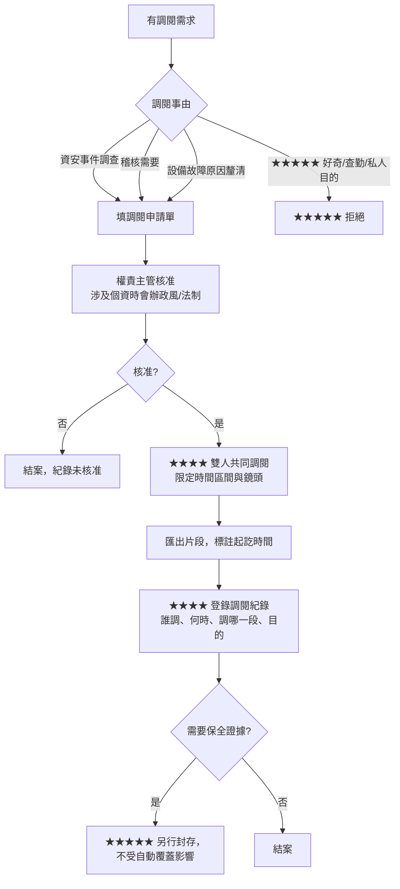
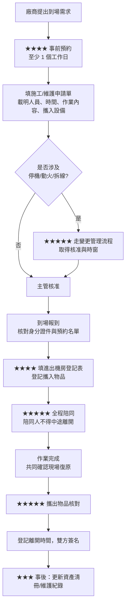

# 機房實體安全

> [!abstract] 這篇你會學到
> - 為什麼**實體安全是資安的第零層** —— 摸得到機器的人，繞得過你所有的軟體防護
> - 用**四層同心圓**規劃管制：園區 → 建物 → 機房 → 機櫃，每層的管制手段不同
> - ★★★★ 門禁**分級授權**與定期複核：誰該有卡、多久複核一次、離職當天要做什麼
> - 雙因素進出、防尾隨（anti-passback）與互鎖門（mantrap）的實際取捨
> - ★★★★ 監視錄影的**涵蓋範圍清單**、保存期限怎麼訂、★★★★★ **調閱要走什麼程序**
> - 訪客與廠商管制 SOP：從預約、報到、陪同到離場核對的完整動線
> - ★★★★★ **施工管理**：動火作業、拆線前確認、施工許可單三件事
> - **攜入攜出物品管制** —— 一顆被帶走的硬碟，比任何入侵都嚴重
> - 稽核（內稽、外稽、資安稽核）到機房會看什麼、要你拿出什麼
> - 與 `_表單範本/040-02-03-進出機房登記表.docx` 怎麼搭配

> [!warning] 未實機驗證
> 門禁系統、NVR、消防設備的品牌與型號差異極大，**本篇不提供特定廠牌的操作步驟**，
> 只提供制度設計與通用檢查方法。Linux 側的日誌與時間同步指令依官方文件撰寫。
> ★★★★★ **法規面**：台灣對於機房實體安全、監視錄影保存期限、個資保護的具體要求，
> 各機關依其主管機關規定不同，本篇一律寫「依機關內部規定與主管機關要求辦理」，
> **請以貴機關的規定與法務／政風單位的意見為準，不要引用本篇當作法規依據**。

## 前置知識

- [[040-02-01-guide-機房-機房環境需求]] — 機房選址、門窗、隔間的實體條件，實體安全建立在這些之上
- [[040-02-11-guide-機房-資訊設備盤點]] — 攜入攜出管制的比對基礎就是資產清冊
- [[040-02-03-guide-機房-機櫃規劃與設備上架]] — 機櫃上鎖與冷熱通道封閉都影響第四層管制
- [[090-07-01-guide-資安實踐-資安基本原則與實踐]] — 最小權限、職責分離等原則在實體安全同樣適用
- [[090-05-15-guide-資安設備-實體與OT-IoT安全設備]] — 門禁主機、NVR 本身也是需要被保護的資訊設備

---

## 觀念說明

### ★★★★★ 實體安全是資安的第零層

一句話說完為什麼這篇重要：

> **只要有人能單獨待在你的機器旁邊十分鐘，他就能繞過你所有的軟體防護。**

具體能做什麼：

| 攻擊 | 需要的時間 | 需要的技術 | 你的軟體防護擋得住嗎 |
| --- | --- | --- | --- |
| ★★★★★ 拔一顆硬碟走 | 30 秒 | 無 | ✖ 完全擋不住（除非全碟加密） |
| ★★★★★ 用 Live USB 開機掛載檔案系統 | 5 分鐘 | 低 | ✖ 擋不住（除非設 BIOS 密碼 + 全碟加密 + Secure Boot） |
| ★★★★ 在交換器上插一台設備做中間人 | 1 分鐘 | 中 | ✖ 除非有 802.1X／埠安全 |
| ★★★★ 接上 KVM 或 BMC 序列埠 | 2 分鐘 | 低 | ✖ 通常直接進到主控台 |
| ★★★★ 按下電源鍵／拔電源線 | 3 秒 | 無 | ✖ 服務直接中斷 |
| ★★★ 拍照帶走機櫃配置與線路 | 10 秒 | 無 | ✖ 內網拓樸外洩 |

> [!danger] ★★★★★ 這就是為什麼「誰進過機房」比「誰登入過伺服器」更需要被記錄
> 伺服器的登入你有 `auth.log`、有 SIEM、有告警。
> **但「誰在 03:14 站在 A03 機櫃前面」，如果門禁與錄影沒做，就永遠查不出來。**

### 四層同心圓

實體安全不是「機房門要不要上鎖」這一個問題，而是四層獨立的管制：

```
┌───────────────────────────────────────────────┐
│ ① 園區 / 大樓外圍                              │
│   警衛、大門管制、訪客換證                     │
│  ┌──────────────────────────────────────────┐ │
│  │ ② 樓層 / 資訊室                           │ │
│  │   門禁刷卡、辦公區與機房區隔離            │ │
│  │  ┌─────────────────────────────────────┐ │ │
│  │  │ ③ 機房本體  ★★★★★ 管制重點在這層     │ │ │
│  │  │   雙因素門禁、錄影、進出登記、陪同   │ │ │
│  │  │  ┌────────────────────────────────┐ │ │ │
│  │  │  │ ④ 機櫃                          │ │ │ │
│  │  │  │   前後門上鎖、鑰匙／密碼分級    │ │ │ │
│  │  │  └────────────────────────────────┘ │ │ │
│  │  └─────────────────────────────────────┘ │ │
│  └──────────────────────────────────────────┘ │
└───────────────────────────────────────────────┘
```

| 層 | 主要手段 | 常見缺口 |
| --- | --- | --- |
| ① 園區 | 警衛、訪客換證、車輛管制 | ★★★ 下班後與假日無人管制 |
| ② 樓層 | 門禁卡、隔間、玻璃隔屏 | ★★★★ 資訊室與機房沒有實體隔離，坐在辦公區就能走進機房 |
| ★★★★★ ③ 機房 | 雙因素門禁、錄影、登記、陪同、攜出管制 | ★★★★★ **門用磁扣但長期被門檔卡住**（最常見） |
| ④ 機櫃 | 機櫃鎖、鑰匙管理 | ★★★★ 全機房同一把鑰匙、或鑰匙插在鎖上 |

> [!warning] ★★★★ 第②層是最常被忽略的一層
> 很多機關的機房就是「資訊室裡面用玻璃隔出來的一塊」，門禁刷卡進資訊室後，
> 機房門是一扇可以隨手推開的玻璃門。這種配置下，**所有進過資訊室的人（包含清潔、
> 廠商、其他單位來洽公的人）在實體安全上都等同於有機房存取權。**
>
> ★★★★★ 最低要求：**機房必須是一個獨立的、有自己門禁的空間**，
> 而不是辦公區的一個角落。

### 三個貫穿全篇的原則

| 原則 | 意思 | 在實體安全的體現 |
| --- | --- | --- |
| ★★★★★ **最小權限** | 只給完成工作所需的最低存取 | 不是資訊室的人都要有機房卡；有卡的人也不一定要有機櫃鑰匙 |
| ★★★★ **職責分離／雙人** | 高風險動作不由一人獨力完成 | 訪客陪同、施工監工、攜出核可與執行分開 |
| ★★★★★ **可稽核** | 事後查得出「誰、何時、做了什麼」 | 門禁紀錄 + 登記表 + 錄影，三者能互相對得起來 |

> [!note] 三者缺一的後果 ★★★★
> - 只有門禁紀錄，沒有登記表 → 知道誰刷了卡，**不知道他進去做什麼**
> - 只有登記表，沒有門禁紀錄 → 只有自己填的，**沒填就查不到**
> - 有前兩者但沒有錄影 → 知道誰在裡面，**不知道他碰了哪一台**
>
> ★★★★★ **三者要能互相對帳**，這是稽核最愛查的一點（見「稽核會查什麼」）。

---

## 環境準備與安裝

### 一、機房區域分級

先把空間分級，權限才有得談。建議三級：

| 級別 | 範圍 | 誰可以進 | 管制方式 |
| --- | --- | --- | --- |
| ★★★ **C 級（周邊）** | 資訊室辦公區、UPS 電池室外側走道 | 資訊單位全體 | 門禁卡 |
| ★★★★ **B 級（機房）** | 主機房、網路機房 | ★ 經核准的維運人員（清單化） | 雙因素門禁 + 登記 + 錄影 |
| ★★★★★ **A 級（核心）** | 核心機櫃、憑證 HSM／金鑰保管櫃、備份磁帶櫃 | ★ 極少數人（建議 ≤ 3 人）+ 雙人同行 | 機櫃／保險櫃獨立鑰匙 + 雙人 + 錄影 |

> [!tip] A 級要不要獨立成一個空間？ ★★★
> 大型機房會做「籠中籠」（cage）把 A 級隔出來。中小型機關通常做不到，
> 折衷做法是：**A 級以「特定機櫃」為單位**，該機櫃前後門上獨立的鎖，
> 鑰匙由與日常維運不同的人保管（例如主管或資安承辦）。

### 二、門禁授權清單與複核

★★★★★ **門禁權限最大的問題不是「怎麼給」，而是「給了忘了收」。**

授權清單必備欄位：

| 欄位 | 說明 |
| --- | --- |
| 姓名 / 員工編號 | |
| 單位 / 職稱 | |
| ★★★★ 授權級別 | C / B / A |
| ★★★★ 授權事由 | 一句話，例如「主機維運，需進機房執行上下架與故障處理」 |
| 核准人 / 核准日期 | ★★★ 核准層級：B 級由資訊單位主管，A 級建議再上一層 |
| ★★★★★ 有效期限 | ★ **一律設期限**（建議 1 年），到期不自動延長 |
| 卡號 | 實體卡片編號 |
| 上次複核日期 | |
| 狀態 | 生效 / 停用 / 已註銷 |

**權限異動的四個觸發時機**：

| 觸發 | 動作 | 時限 |
| --- | --- | --- |
| ★★★★★ **離職** | 立即註銷所有門禁權限、收回卡片與鑰匙 | ★★★★★ **離職生效當日**，不是「最近有空的時候」 |
| ★★★★ **調職／職務變更** | 重新評估是否仍需要，不需要就註銷 | 3 個工作日內 |
| ★★★★ **卡片遺失** | 立即掛失停用該卡號，補發新卡 | ★★★★★ **通報當下** |
| ★★★ **長期請假／留職停薪** | 暫時停用 | 假期開始前 |

**定期複核**（建議每半年一次，至少每年一次）：

```
複核步驟：
  ① 匯出目前所有生效中的門禁授權清單
  ② 與人事系統的在職名單比對 → 找出已離職但權限未註銷的
  ③ 逐一詢問各級主管：這個人現在還需要這個權限嗎？
  ④ 不需要的註銷，需要的續期並更新有效期限
  ⑤ ★★★★ 產出複核紀錄（誰複核、何時、註銷了幾筆），簽核歸檔
```

比對腳本（門禁清單 CSV 對人事在職名單）：

```bash
#!/usr/bin/env bash
# access-review — 門禁授權與在職名單比對
set -euo pipefail
ACL=${1:?用法: access-review <門禁清單.csv> <在職名單.csv>}
HR=${2:?請提供在職名單}

norm() { sed 's/\r$//' "$1" | awk -F, 'NR>1 && $1!="" {gsub(/^ +| +$/,"",$1); print $1}' | sort -u; }

norm "$ACL" > /tmp/acl.txt
norm "$HR"  > /tmp/hr.txt

echo "=== ★★★★★ 有門禁權限但已不在職（必須立即註銷）==="
comm -23 /tmp/acl.txt /tmp/hr.txt

echo
echo "=== 授權筆數統計 ==="
echo "  門禁清單： $(wc -l < /tmp/acl.txt) 人"
echo "  在職名單： $(wc -l < /tmp/hr.txt) 人"
```

預期輸出：

```text
=== ★★★★★ 有門禁權限但已不在職（必須立即註銷）===
E10233
E10871

=== 授權筆數統計 ===
  門禁清單： 14 人
  在職名單： 12 人
```

★★★★★ 找到兩筆「離職未註銷」—— 這是實體安全稽核最常見的缺失，
也是最容易被開缺失單的一項。

### 三、雙因素進出

「雙因素」= 你**有的**（卡片）+ 你**知道的**（PIN）+ 你**是的**（生物特徵），取兩種。

| 組合 | 安全性 | 成本 | 實務問題 |
| --- | --- | --- | --- |
| ★★★ 卡 + PIN | 中 | 低 | ★★★ PIN 容易被共用、被貼在門旁邊 |
| ★★★★ 卡 + 指紋 | 高 | 中 | ★★★ 手濕、戴手套時讀不到；需注意生物特徵資料屬個資 |
| ★★★★ 卡 + 臉部 | 高 | 中高 | ★★★ 光線影響；生物特徵屬個資 |
| ★★ 只有卡 | 低 | 最低 | ★★★★ 卡片可借用、可複製（低頻卡尤其容易複製） |
| ★★ 只有鑰匙 | 低 | 最低 | ★★★★★ **無紀錄**，鑰匙可複製，不知道誰進去過 |

> [!warning] ★★★★ 生物特徵屬於個人資料，蒐集前要先處理法遵
> 指紋、臉部特徵屬敏感個資，導入前應：
> - 告知當事人蒐集目的、保存期限、使用範圍，並取得必要的同意
> - 確認儲存方式（是否只存特徵值不存原始影像）
> - **依機關內部規定與主管機關要求辦理**，必要時徵詢政風／法制單位意見
>
> ★★★ 實務上，中小型機關用「卡 + PIN」通常就足夠，且法遵負擔最小。

**防尾隨（tailgating）**：

| 手段 | 說明 | 適用 |
| --- | --- | --- |
| ★★★★ **Anti-passback（防回傳）** | 同一張卡沒有刷出就不能再刷進 | 需要進出都有讀卡機 |
| ★★★★★ **互鎖門 / Mantrap** | 兩道門，前門關上後門才開，一次一人 | 高安全需求；成本高、佔空間 |
| ★★★ **紅外線人數計數** | 偵測進出人數與刷卡數不符時告警 | 中等成本 |
| ★★★★ **管理面：一人一刷** | 寫進管理規定，兩人同行也要各刷各的 | ★ 零成本，但要靠人自律 + 錄影事後查核 |

> [!danger] ★★★★★ 出入都要刷卡，不是只有進去要刷
> 只在進門處裝讀卡機是最常見的省錢做法，但它造成三個嚴重後果：
> 1. **無法知道人什麼時候離開** —— 火警疏散時無法確認機房內還有沒有人
> 2. **anti-passback 完全無法實作** —— 一張卡可以無限次「進入」
> 3. **稽核時無法回答「這個人在機房待了多久」**
>
> ★★★★ **進出雙向讀卡是機房門禁的基本配置**，不是加分項。

### 四、監視錄影

#### 涵蓋範圍清單 ★★★★

以下位置**每一個都要有鏡頭涵蓋**，缺一個就會有查不到的死角：

| # | 位置 | 目的 | 重要度 |
| --- | --- | --- | --- |
| 1 | 機房出入口（門外） | 誰來、跟誰一起來 | ★★★★★ |
| 2 | 機房出入口（門內） | 進來後往哪走、帶了什麼進來 | ★★★★★ |
| 3 | 主要走道（冷通道） | 停在哪一個機櫃前 | ★★★★ |
| 4 | 主要走道（熱通道 / 機櫃後方） | ★ 拔線、接線都在後面發生 | ★★★★★ |
| 5 | 核心機櫃（A 級）正面 | 誰動了核心設備 | ★★★★★ |
| 6 | UPS 與配電盤區域 | 誰動了電源 | ★★★★ |
| 7 | 空調室外機 / 冷卻設備 | 故障與人為破壞 | ★★★ |
| 8 | 備品／耗材儲藏區 | 攜出管制的死角 | ★★★★ |
| 9 | ★★★★ 消防設備與緊急出口 | 意外事件重建 | ★★★ |

> [!warning] ★★★★★ 最常被漏掉的是第 4 項：機櫃後方
> 拔硬碟、接 KVM、拆線、插入未授權設備 —— **這些動作全部發生在機櫃後方**。
> 只裝冷通道（正面）的鏡頭，等於把所有真正危險的動作放在鏡頭外。

#### 影像規格建議

| 項目 | 建議 | 說明 |
| --- | --- | --- |
| ★★★★ 解析度 | 至少 1080p（200 萬畫素） | ★ 要能辨識人臉與看清是哪一台設備 |
| ★★★ 幀率 | 15～25 fps | 太低會漏掉快速動作 |
| ★★★★ 光源 | 機房常關燈 → 需紅外線夜視或維持最低照明 | ★★★★ **不要假設機房永遠有燈** |
| ★★★★ 涵蓋角度 | 走道用廣角，機櫃區用中焦段 | 廣角在遠端會看不清細節 |
| ★★★★★ **時間同步** | ★ 所有鏡頭與 NVR 必須 NTP 同步 | 見下方 danger |
| ★★★ 儲存 | 依保存期限與碼率估算，並保留 20% 餘裕 | |

> [!danger] ★★★★★ 錄影時間沒有同步，證據力等於零
> 如果 NVR 的時間與門禁系統、伺服器日誌差了 8 分鐘，
> 你就**無法證明「錄影裡這個人」就是「門禁紀錄裡刷卡的那個人」**。
>
> 必做三件事：
> 1. NVR、門禁主機、所有伺服器**指向同一個 NTP 來源**
> 2. ★★★★ 每季檢查一次時間偏差（把它排進 [[100-02-05-guide-維運-每季維護作業]]）
> 3. 時區設定一致（不要一台 UTC 一台 UTC+8）
>
> 檢查方式見 [[020-01-28-cmd-Linux-時間同步NTP與chrony]]。

儲存容量估算：

```
單支鏡頭日儲存量(GB) = 碼率(Mbps) × 86400 秒 ÷ 8 ÷ 1024
總容量(TB) = 單支日儲存量 × 鏡頭數 × 保存天數 ÷ 1024 × 1.2（餘裕）

例：1080p H.265 約 2 Mbps，9 支鏡頭，保存 90 天
    單支日量 = 2 × 86400 ÷ 8 ÷ 1024 ≈ 21.1 GB
    總量 = 21.1 × 9 × 90 ÷ 1024 × 1.2 ≈ 20.0 TB
```

#### ★★★★ 保存期限怎麼訂

> [!warning] 不要照抄別人的數字 ★★★★★
> 保存期限**必須依機關內部規定與主管機關要求辦理**，
> 而且要同時考慮兩個相反方向的壓力：
>
> | 方向 | 論點 |
> | --- | --- |
> | 傾向**長** | 資安事件常常在數週後才被發現；稽核可能回溯查詢 |
> | 傾向**短** | ★★★★ 影像含人臉屬個資，**保存越久個資風險越高**；儲存成本 |
>
> ★★★ 實務上的做法是：**訂一個明確的天數，寫進管理規定，然後嚴格執行**
> （到期自動覆蓋，不要「反正硬碟還有空間就留著」）。
> 具體天數請洽機關法制／政風單位與資安承辦確認。

★★★★ 不論訂幾天，這三件事一定要做：
1. **寫進書面規定**，不是「NVR 預設是多少就多少」
2. **到期自動覆蓋**，並定期確認覆蓋機制真的有在運作
3. ★★★★★ **有特殊事件時，要能在覆蓋前把該段影像另行封存**（見調閱程序）

#### ★★★★★ 調閱程序

這是最容易出事的一環：**沒有程序，就會變成「誰想看就看」，而錄影裡有全單位同仁的行蹤。**



調閱紀錄必備欄位：

| 欄位 | 說明 |
| --- | --- |
| ★★★★★ 申請人 / 單位 | |
| ★★★★★ 調閱事由 | ★ 要具體，不能寫「查看」 |
| ★★★★ 影像時間區間 | 精確到分鐘 |
| ★★★★ 鏡頭編號 | 只調需要的，不要整批調 |
| ★★★★★ 核准人 / 核准日期 | |
| ★★★★ 實際調閱人 / 陪同人 | ★ 雙人 |
| ★★★ 是否匯出、匯出檔案編號 | |
| ★★★ 匯出檔案的保管與銷毀 | ★★★★ 匯出的影像檔本身也是個資，用完要銷毀 |

> [!danger] ★★★★★ 監視錄影絕對不可以拿來做的事
> - **查勤**（看誰幾點到、幾點走）
> - **針對特定同仁的持續監看**
> - **未經程序提供給第三方**（包含上級、其他單位、廠商）
>
> 這些不只是管理問題，可能構成個資的不當利用。
> ★★★★ 保護自己的做法：**每一次調閱都留紀錄**，
> 這樣「有沒有被濫用」是查得出來的，你也才有辯護的依據。

---

## 基礎設定

### 一、進出登記表怎麼用 ★★★★

vault 的表單範本在 **`_表單範本/040-02-03-進出機房登記表.docx`**。
（★★ 這是 Word 檔，內文用文字寫出路徑即可，不要用 `[[ ]]` 連結指過去。）

必填欄位與為什麼要填：

| 欄位 | 為什麼 |
| --- | --- |
| ★★★★★ 日期、進入時間、離開時間 | 與門禁紀錄、錄影對帳的基準 |
| ★★★★★ 姓名、單位 | |
| ★★★★ 身分別 | 本單位人員 / 他單位 / 廠商 / 稽核 |
| ★★★★★ **事由** | ★ 一句話寫清楚做什麼，「維護」不算，要寫「更換 A03-U12 伺服器電源模組」 |
| ★★★★★ **陪同人** | 非本單位人員一律要有陪同人簽名 |
| ★★★★★ **攜入物品** | 見「攜入攜出管制」 |
| ★★★★★ **攜出物品** | ★ 最重要的一欄 |
| ★★★ 異動設備 | 動了哪些設備，方便日後追查 |
| ★★★ 簽名 | 進入時與離開時各簽一次 |

> [!warning] 登記表的三個常見死法 ★★★★
> 1. **放在機房裡面** → 要先進去才能填，等於沒有管制。★★★★ **放門外**。
> 2. **只有進入沒有離開時間** → 無法回答「他在裡面待了多久」。
>    ★★★ 做法：離開時間欄設為必填，陪同人離場時一起簽。
> 3. **事由寫「維護」「檢查」** → 事後完全查不出他做了什麼。
>    ★★★★ 要求寫到「動作 + 對象」的程度。

### 二、進出登記與門禁紀錄對帳 ★★★★

★★★★★ **兩份紀錄要能對得起來，這是稽核的必考題。**

每月做一次對帳：

```bash
#!/usr/bin/env bash
# entry-reconcile — 門禁刷卡紀錄 vs 進出登記表 對帳
# 兩份輸入皆為 CSV：日期,員工編號,進入時間
set -euo pipefail
DOOR=${1:?用法: entry-reconcile <門禁紀錄.csv> <登記表.csv>}
BOOK=${2:?請提供登記表}

key() { sed 's/\r$//' "$1" | awk -F, 'NR>1 && $1!="" {printf "%s|%s\n", $1, $2}' | sort -u; }

key "$DOOR" > /tmp/door.txt
key "$BOOK" > /tmp/book.txt

echo "=== ★★★★★ 有刷卡但沒登記（進了機房沒填表）==="
comm -23 /tmp/door.txt /tmp/book.txt

echo
echo "=== ★★★★ 有登記但沒刷卡（借卡？尾隨？門被撐開？）==="
comm -13 /tmp/door.txt /tmp/book.txt

echo
echo "=== 相符筆數：$(comm -12 /tmp/door.txt /tmp/book.txt | wc -l) ==="
```

預期輸出：

```text
=== ★★★★★ 有刷卡但沒登記（進了機房沒填表）===
2026-08-14|E10455

=== ★★★★ 有登記但沒刷卡（借卡？尾隨？門被撐開？）===
2026-08-22|V-陳工程師

=== 相符筆數：37 ===
```

★★★★★ 兩類差異的意義完全不同：

| 差異 | 意義 | 處理 |
| --- | --- | --- |
| **有刷卡沒登記** | 同仁圖方便沒填表 | ★★★ 個別提醒；連續發生要納入考核 |
| ★★★★★ **有登記沒刷卡** | ★ **這才是嚴重的**：代表有人不是靠自己的卡進去的（借卡、尾隨、門被撐開、或有人幫他開門） | ★★★★★ 逐案調查，調錄影確認 |

### 三、機櫃鑰匙管理

| 做法 | 安全性 | 說明 |
| --- | --- | --- |
| ★ 全機房一把通用鑰匙 | 最低 | ★★★★ 常見但等於沒鎖；只要一把流出，全部機櫃失守 |
| ★★★ 分區鑰匙 | 中 | A 區一把、B 區一把 |
| ★★★★ 核心機櫃獨立鑰匙 | 高 | A 級機櫃單獨一把，由不同人保管 |
| ★★★★ 鑰匙櫃 + 借還登記 | 高 | 鑰匙放有紀錄的鑰匙櫃，借出要登記 |
| ★★★★ 電子櫃鎖 | 高 | 有紀錄、可遠端授權，但成本高且要注意斷電時的開門方式 |

> [!danger] ★★★★★ 兩個絕對不行
> 1. **鑰匙長期插在機櫃鎖上** —— 這在機關機房極常見（「反正常常要開」），
>    等於機櫃完全沒有第四層防護。
> 2. **機櫃門長期不關** —— 理由通常是「散熱比較好」。
>    ★★★★ 但機櫃門開著會**破壞冷熱通道分離**，散熱反而更差
>    （見 [[040-02-02-guide-機房-空調系統與溫溼度監控]]），
>    等於安全與散熱兩頭皆輸。

> [!info]- 冷熱通道封閉環境的門禁補充
> 做了冷通道封閉的機房，通道兩端會有推門或簾幕。這些門通常**不是門禁管制點**，
> 但要注意兩件事：
> - ★★★★ **消防連動**：氣體滅火啟動時，封閉通道的門應能自動開啟或易於推開
> - ★★★ **人員受困**：封閉通道內作業時，外側不應被鎖住
>
> 見 [[040-02-01-guide-機房-機房環境需求]] 與 [[040-02-14-guide-機房-機房異常應變]]。

---

## 進階設定與調校

### 一、訪客與廠商管制 SOP ★★★★

「訪客」包含：廠商工程師、他單位人員、稽核人員、參訪來賓、清潔人員。
**每一種都要有陪同，沒有例外。**

完整動線：



各階段的重點：

| 階段 | 要做什麼 | 常見缺失 |
| --- | --- | --- |
| ★★★★ **預約** | 至少提前 1 個工作日，載明人員姓名與作業內容 | ★★★ 廠商臨時到場就直接放行 |
| ★★★★ **報到** | 核對證件與預約名單，**人數與姓名都要對** | 只看公司不看人，來的不是原本報備的人 |
| ★★★★★ **陪同** | 全程，陪同人不得離開現場 | ★★★★★ **「你先做，我去開個會」** —— 這是最嚴重也最常見的違規 |
| ★★★★ **作業監督** | 確認實際作業範圍不超出申請內容 | 順便「幫你看一下別台」 |
| ★★★★★ **攜出核對** | 逐項核對，特別是硬碟與設備 | 直接放行 |
| ★★★ **復原確認** | 線材歸位、機櫃門關上、廢料帶走 | 留下線頭、螺絲、包裝 |

> [!danger] ★★★★★ 陪同人不能中途離開，這一條沒有例外
> 三個常見的「合理」藉口，全部都不成立：
> - 「廠商很熟了，做過很多次」 → **信任不是控制**
> - 「我要去開會，很快回來」 → 找人接替陪同，或請廠商暫停作業一起離開
> - 「他只是換個電池，不會碰到別的」 → 陪同的目的不只是防惡意，
>   還包括**在他不小心拔錯線時你在場**
>
> ★★★★ 如果人力真的不足以陪同，正確做法是**改期**，不是放行。

### 二、★★★★★ 施工管理

施工比一般維護危險得多，因為它會**改變機房的實體狀態**。

#### 施工許可單（Permit to Work）

任何涉及以下項目的作業，都應該有書面許可：

| 作業類型 | 風險 | 額外要求 |
| --- | --- | --- |
| ★★★★★ **動火作業**（燒焊、切割、研磨、使用明火或會產生火花的工具） | 火災、觸發消防系統誤動作 | 見下方專節 |
| ★★★★★ **電力作業**（配電盤、PDU、UPS 接線） | 觸電、全機房斷電 | 由合格電氣人員執行；雙人作業；斷電前確認負載 |
| ★★★★ **拆線／改線** | 拔錯線造成服務中斷 | 見下方「拆線前確認」 |
| ★★★★ **鑽孔／開洞**（穿樓板、穿牆、走線槽） | ★ 可能鑽到既有管線或結構 | 事前確認圖面；防塵措施 |
| ★★★★ **空調／管路作業** | ★★★★★ **漏水** | 見 [[040-02-14-guide-機房-機房異常應變]] |
| ★★★★ **消防系統維護** | 誤放氣體、系統失效 | ★★★★★ 作業期間須有替代的偵測與通報方式 |
| ★★★ **搬運重物／設備進出** | 撞到機櫃、地板承重 | 確認搬運路徑與地板承重 |

施工許可單必備欄位：

```text
機房施工許可單

一、施工單位/廠商：            聯絡人/電話：
二、施工人員名冊（姓名、身分證末四碼、證照）：
三、施工日期與時段：           預計工時：
四、施工位置：（機房/區域/機櫃編號）
五、★★★★★ 作業類型：□一般 □動火 □電力 □拆線改線 □鑽孔 □空調管路 □消防
六、作業內容描述（具體到動作與對象）：
七、★★★★★ 影響評估：
    會不會停電？□否 □是（範圍：______，時段：______）
    會不會斷網？□否 □是（範圍：______）
    會不會停止服務？□否 □是（服務：______）
    → 任一為「是」，須另走變更管理流程並取得核准
八、★★★★★ 防護措施：（防塵、防火毯、滅火器、接水盤、遮蔽既有設備）
九、★★★★ 消防系統處置：□不影響 □需暫時隔離（隔離人：____ 恢復人：____ 恢復時間：____）
十、陪同/監工人員：           核准人：            核准日期：
十一、完工確認：現場復原 □ 廢料清除 □ 消防恢復 □ 設備正常 □
      監工簽名：            廠商簽名：            完工時間：
```

#### ★★★★★ 動火作業

> [!danger] ★★★★★ 機房內原則上禁止動火作業
> 如果非做不可（例如結構補強、管路焊接），以下每一項都是**必要條件**，缺一不可：
>
> | # | 措施 | 說明 |
> | --- | --- | --- |
> | 1 | ★★★★★ **書面動火許可** | 由權責主管核准，載明時段與範圍 |
> | 2 | ★★★★★ **消防系統處置** | 極早期偵煙（VESDA）與氣體滅火在作業期間**必須隔離**，否則會誤放。★ 隔離期間**必須有人力持續監視**，並記錄隔離人與恢復人 |
> | 3 | ★★★★★ **監火人** | ★ 專責一人只負責看火，不參與施工，手持滅火器全程在旁 |
> | 4 | ★★★★ **防護** | 防火毯遮蔽鄰近設備與線槽；移除周邊可燃物 |
> | 5 | ★★★★ **滅火器就位** | 至少兩支合適類型，且在有效期內 |
> | 6 | ★★★★★ **作業後留守** | ★ 完工後**至少留守 30～60 分鐘**觀察有無悶燒（陰燃可以延遲數十分鐘才起火） |
> | 7 | ★★★★★ **恢復消防系統並確認** | ★ 這是最常被忘記的一步 —— 隔離了忘記恢復，等於機房裸奔 |
>
> ★★★★★ **第 7 項有實際案例**：施工後忘記恢復氣體滅火系統，
> 三個月後真的失火時系統沒有動作。
> 做法：**把「消防系統恢復」設為施工許可單的必填完工欄位**，
> 監工不簽名就不算完工。

#### ★★★★★ 拆線前確認

拔錯線是機房最常見的人為服務中斷原因。**三步確認法**：

```
步驟一：查
  ① 查線路標示紀錄（_表單範本/040-02-04-線路標示紀錄.docx）
  ② 查交換器埠描述：show interfaces descriptions
  ③ 查資產清冊上這台設備的用途
  → 三處一致才繼續；有任一處不一致，停下來查清楚

步驟二：驗
  ④ ★★★★★ 在交換器上看該埠的即時流量與 link 狀態
  ⑤ 若可能，請對端設備的管理者確認「這條線現在是不是活的」
  → 有流量的線，一律當成「正在提供服務」

步驟三：標
  ⑥ ★★★★ 拔線前先在線的兩端各貼一張臨時標籤（寫上原本插在哪）
  ⑦ 拍照存證（拔之前的樣子）
  ⑧ 拔線後把該埠 shutdown 並改埠描述
```

驗證埠是否還活著（主線 Juniper JunOS）：

```junos
show interfaces ge-0/0/14 extensive | match "Physical link|Input rate|Output rate"
```

預期輸出：

```text
  Physical link is Up
    Input  rate     : 4832216 bps (612 pps)
    Output rate     : 1204880 bps (388 pps)
```

★★★★★ **有流量 = 有人在用 = 不要拔。**

```junos
show interfaces descriptions | match ge-0/0/14
```

```text
ge-0/0/14       up    up   A03-U07-SRV-A03-07-eth0
```

> [!info]- Cisco IOS 對照
> ```cisco
> show interfaces GigabitEthernet1/0/14 | include line protocol|input rate|output rate
> ```
>
> ```text
> GigabitEthernet1/0/14 is up, line protocol is up (connected)
>   5 minute input rate 4832000 bits/sec, 612 packets/sec
>   5 minute output rate 1204000 bits/sec, 388 packets/sec
> ```
>
> 查埠描述：
>
> ```cisco
> show interfaces description | include Gi1/0/14
> ```
>
> ★★★ 另一個好用的確認方式是查該埠學到的 MAC，再反查那是哪一台設備：
> ```cisco
> show mac address-table interface GigabitEthernet1/0/14
> ```

> [!danger] ★★★★★ 「這條線應該沒在用」是機關最貴的一句話
> 因為當機發生時，你已經拔了。
> ★★★★ **正確做法：先在交換器上把該埠 `disable`／`shutdown`，觀察一週。**
> 沒有人抱怨，再實體拔線。這一週的等待成本，遠低於一次服務中斷。

### 三、★★★★★ 攜入攜出物品管制

這是實體安全裡**唯一能防止資料實體外洩**的環節。

#### 攜入管制

| 物品 | 管制 | 理由 |
| --- | --- | --- |
| ★★★★ 筆電、工具電腦 | 登記（廠牌、序號） | 離開時要核對是同一台 |
| ★★★★★ USB 隨身碟 / 外接硬碟 | ★ 原則禁止；必要時登記並在陪同下使用 | 惡意程式帶入 + 資料帶出 |
| ★★★★ 更換用的新設備／零件 | 登記（型號、序號、數量） | 與攜出的舊件對數 |
| ★★★ 工具箱 | 登記 | ★★★ 工具箱是最好的夾帶容器 |
| ★★★★ 相機／攝影設備 | ★ 原則禁止；需拍照時由機關人員拍 | 機櫃配置與線路屬敏感資訊 |
| ★★ 飲料、食物 | ★★★★ **禁止**（潑灑會毀掉設備，也會招來蟲鼠） | |

#### ★★★★★ 攜出管制

**這一欄是整張登記表最重要的一欄。**

| 物品 | 管制 | 檢查方式 |
| --- | --- | --- |
| ★★★★★ **硬碟／SSD／磁帶** | ★ **最高管制**：逐顆核對序號 + 主管核准 | 序號 = 清冊登記 = 攜出單，三者一致 |
| ★★★★★ 拆下的整台設備 | 資產編號核對 + 出門條 | 對照資產清冊 |
| ★★★★ 更換下來的故障零件 | 登記型號與數量 | ★★★★ **故障硬碟也是硬碟**，一樣走最高管制 |
| ★★★★ 廠商自己帶來的設備 | 核對攜入登記 | 進去幾台，出來幾台 |
| ★★★ 廢料、包裝 | 目視檢查 | ★★★ 紙箱是夾帶硬碟最常用的方式 |

> [!danger] ★★★★★ 硬碟攜出的四道關卡
> 一顆硬碟要離開機房，必須通過：
> 1. **書面核准** —— 誰核准的（層級應高於一般維護核准）
> 2. **序號核對** —— 攜出單上的序號 = 實體序號 = 資產清冊登記
> 3. ★★★★★ **資料狀態確認** —— 已銷毀？未銷毀？未銷毀就帶出去要有更高層級核准，
>    且必須全程監管（見 [[040-02-12-guide-機房-設備生命週期管理]]）
> 4. **陪同人與攜出人雙簽**
>
> ★★★★★ **RAID 換下來的故障碟最常在這裡漏掉** ——
> 「反正它壞了」是最危險的想法，壞碟上的資料通常大部分完好。

#### 廠商換件的正確流程

```
① 廠商帶新零件到場 → 攜入登記（型號、序號、數量）
② 陪同進入機房，執行更換
③ ★★★★★ 舊件（尤其硬碟）當場核對序號，與清冊比對
④ 決定舊件去向：
   □ 原廠回收 → ★★★★★ 若是硬碟，先確認是否可留碟（Keep Your Hard Drive）
   □ 機關自行留存銷毀 → 硬碟留下，只讓廠商帶走機殼／支架
⑤ 攜出登記，雙方簽名
⑥ 更新資產清冊（硬碟序號變了）
```

> [!tip] ★★★★★ 採購時就要爭取「故障硬碟留置」條款
> 多數伺服器原廠有「Keep Your Hard Drive / Keep Your Component」的服務選項
> （通常需加價或包在較高等級的保固方案裡）。
>
> **爭取到這個條款的意義是：故障硬碟永遠不會離開機關。**
> 對於存過個資的系統，這一條的價值遠超過它的價格。
> 在規格書的保固條款中寫進去（見 [[040-02-12-guide-機房-設備生命週期管理]] 的規格撰寫段落）。

### 四、稽核會查什麼 ★★★★

不論是內部稽核、上級稽核或資安稽核，機房實體安全的查核點高度一致。
**先自己查一遍，比被查出來好。**

| # | 查核點 | 要拿得出什麼 | 常見缺失 |
| --- | --- | --- | --- |
| 1 | ★★★★★ 是否有書面的機房管理規定 | 規定文件（含核准日期、版本） | 沒有，或有但三年沒更新 |
| 2 | ★★★★★ 門禁授權清單 | 現行清單 + 核准紀錄 | ★★★★★ 有離職者權限未註銷 |
| 3 | ★★★★ 授權定期複核 | 複核紀錄（誰、何時、結果） | 從來沒複核過 |
| 4 | ★★★★★ 進出登記完整性 | 登記表（近 6～12 個月） | 缺離開時間、事由寫「維護」 |
| 5 | ★★★★★ 門禁紀錄與登記表對帳 | 對帳紀錄與差異處理 | 沒對過帳 |
| 6 | ★★★★ 監視錄影涵蓋與可用性 | 現場調閱示範、涵蓋圖 | ★★★★ 機櫃後方無涵蓋、鏡頭故障沒人發現 |
| 7 | ★★★★★ 錄影保存期限符合規定 | 調出規定天數前的影像 | 實際保存天數少於規定 |
| 8 | ★★★★★ 影像調閱紀錄 | 調閱申請與核准紀錄 | 沒有紀錄，或有調閱無核准 |
| 9 | ★★★★ 時間同步 | NVR / 門禁 / 伺服器的時間截圖 | ★★★★ 三者時間不一致 |
| 10 | ★★★★ 訪客／廠商陪同落實 | 登記表上的陪同人簽名 | 陪同欄空白 |
| 11 | ★★★★★ 施工許可與消防恢復 | 施工許可單（含完工確認） | ★★★★★ 消防隔離後無恢復紀錄 |
| 12 | ★★★★★ 攜出管制 | 攜出登記，特別是硬碟 | ★★★★★ 故障硬碟被廠商帶走且無紀錄 |
| 13 | ★★★★ 機櫃上鎖 | 現場目視 | 鑰匙插在鎖上、櫃門開著 |
| 14 | ★★★ 消防與環境設備檢查紀錄 | 定期檢查表 | 見 [[040-02-10-guide-機房-機房巡檢與紀錄]] |
| 15 | ★★★★ 緊急應變程序與演練 | 演練紀錄 | 見 [[040-02-14-guide-機房-機房異常應變]] |
| 16 | ★★★ 機房內無違規物品 | 現場目視 | 紙箱堆積、飲料、私人物品 |

> [!tip] ★★★★ 自我稽核清單就用上面這 16 項
> 每半年自己跑一次，把「拿得出什麼」欄的東西真的印出來擺在桌上。
> **拿不出來的那幾項，就是你被稽核時會被開的缺失。**

---

## 完整實戰範例

### 情境

廠商要來更換 UPS 電池模組（8 顆），並順便更換一台伺服器的故障硬碟（1 顆 4TB SATA）。

- 作業日期：2026-09-10（週四）09:00～12:00
- 廠商：○○電力，2 名工程師
- 涉及：電力作業（UPS 旁路切換）+ 硬碟更換（含個資系統）
- ★★★★★ 兩個高風險點：**UPS 切旁路期間失去電力保護** 與 **故障硬碟的去向**

### 階段一：D-3 事前預約與核准

**① 廠商提出申請，填施工許可單**

```text
機房施工許可單  單號：PTW-2026-0042

一、施工單位：○○電力            聯絡人：陳工程師 0912-xxx-xxx
二、施工人員：陳○○（證照：乙級電匠）、林○○
三、日期時段：2026-09-10 09:00-12:00   預計工時：3 小時
四、施工位置：機房A / UPS 室 + 機櫃 A03
五、作業類型：■電力  ■一般（硬碟更換）  □動火 □拆線改線 □鑽孔 □空調 □消防
六、作業內容：
    (1) UPS-01 切換至維修旁路，更換電池模組 8 顆，回切正常模式
    (2) 更換 SRV-A03-07 之故障硬碟 1 顆（插槽 #2）
七、影響評估：
    停電？■是 —— UPS 切旁路期間，機房負載直接吃市電，失去斷電保護（約 90 分鐘）
    斷網？□否
    停止服務？□否（硬碟熱插拔，RAID 1 降級運轉）
    → 已另走變更管理流程，變更單號 CHG-2026-0311
八、防護措施：作業區周邊淨空；備妥絕緣手套與工具；★★★★ 作業期間不安排任何其他變更
九、消防系統處置：■不影響
十、監工：王小明（資訊室）      核准：李主任      核准日期：2026-09-05
```

**② ★★★★★ 電力作業的額外前置：確認風險視窗**

```bash
# 查 UPS 目前負載與電池狀態（見 040-02-06 UPS 監控設定）
upsc ups01@localhost 2>/dev/null | grep -E 'ups.load|battery.charge|ups.status'
```

預期輸出：

```text
battery.charge: 100
ups.load: 42
ups.status: OL
```

★★★★ 負載 42%、電池滿電、市電正常（`OL` = On Line）→ 適合作業。

> [!danger] ★★★★★ 切旁路前必須確認的三件事
> 1. **市電穩定**：查近 7 天有無市電異常紀錄；當天氣象有無雷雨特報
> 2. ★★★★★ **旁路期間不排任何其他變更** —— 這 90 分鐘是機房最脆弱的時間
> 3. **告知相關人員**：這段時間如果跳電，**沒有 UPS 保護，全機房直接斷電**
>
> 見 [[040-02-14-guide-機房-機房異常應變]] 的停電處置。

**③ 硬碟更換的額外前置：確認舊碟去向**

```bash
# 確認故障碟的序號與 RAID 狀態
cat /proc/mdstat
```

```text
Personalities : [raid1] 
md0 : active raid1 sda[0] sdb[1](F)
      3906885440 blocks super 1.2 [2/1] [U_]
```

★★★ `sdb[1](F)` = 第二顆碟已被標記為 Failed。

```bash
sudo smartctl -i /dev/sdb | grep -iE 'serial|model'
```

```text
Device Model:     ST4000NM0035
Serial Number:    ZC1A9K4T
```

★★★★★ 記下序號 `ZC1A9K4T`。查採購契約：本案有「故障硬碟留置」條款
→ **舊碟不交還廠商，由機關自行銷毀**。

### 階段二：D-Day 09:00 報到與登記

```
09:00  廠商到場（大門警衛換證）
09:05  資訊室報到
       ★★★★ 核對：
         - 身分證件 vs 施工許可單人員名冊 → 陳○○ ✔  林○○ ✔
         - 人數 2 人 ✔（若來了第 3 人，未報備者不得進入）
09:08  填進出機房登記表
```

登記表填寫內容：

| 欄位 | 內容 |
| --- | --- |
| 日期 | 2026-09-10 |
| 進入時間 | 09:10 |
| 姓名 / 單位 | 陳○○、林○○ / ○○電力 |
| 身分別 | 廠商 |
| ★★★★★ 事由 | UPS-01 更換電池模組 8 顆；SRV-A03-07 更換插槽#2 硬碟 1 顆（PTW-2026-0042） |
| ★★★★★ 陪同人 | 王小明（資訊室）★ 全程 |
| ★★★★★ 攜入物品 | 電池模組 ×8（序號 BT2601~BT2608）、工具箱 ×1、電表 ×1、筆電 ×1（S/N NB8842）、4TB SATA 硬碟 ×1（S/N ZC7X2M9P） |
| ★★★★★ 攜出物品 | （離場時填） |
| 異動設備 | UPS-01、SRV-A03-07 |

★★★★ **攜入的每一顆電池與硬碟都登記序號** —— 這樣攜出時對得起來。

### 階段三：09:15～11:00 作業與監督

**UPS 電池更換**

```
09:15  陪同人與廠商共同確認 UPS 現況（拍照）
09:20  ★★★★★ 通知資訊室全體：「UPS 進入旁路，約 90 分鐘無斷電保護」
09:25  切換維修旁路
       → 陪同人現場確認負載仍正常供電（機櫃設備無中斷）
09:30  更換電池模組 ×8
       → ★★★★ 陪同人核對：拆下 8 顆、裝上 8 顆，數量相符
10:40  回切正常模式
10:45  ★★★★ 確認：ups.status = OL、battery.charge 開始上升
```

```bash
upsc ups01@localhost | grep -E 'ups.status|battery.charge|battery.runtime'
```

```text
ups.status: OL CHRG
battery.charge: 34
battery.runtime: 892
```

★★★ `CHRG` = 充電中，數值正在上升 → 正常。
★★★★ **要等充到一定程度才算完成**，不要看到回切就簽收。

**硬碟更換**

```bash
# 更換前：確認要拔的是哪一顆（★★★★★ 用序號，不要只看插槽燈號）
sudo smartctl -i /dev/sdb | grep -i serial
```

```text
Serial Number:    ZC1A9K4T
```

```bash
# 從 RAID 移除（若尚未自動移除）
sudo mdadm --manage /dev/md0 --remove /dev/sdb
```

```text
mdadm: hot removed /dev/sdb from /dev/md0
```

```
10:50  廠商拔出插槽 #2 硬碟
       ★★★★★ 陪同人立即核對舊碟標籤序號：ZC1A9K4T ✔ 相符
       → 舊碟由陪同人「當場收下」，放進上鎖的暫存箱，不交給廠商
10:55  裝入新碟（S/N ZC7X2M9P）
```

```bash
# 確認新碟被系統認到，序號正確
lsblk -d -o NAME,SIZE,MODEL,SERIAL
```

```text
NAME   SIZE MODEL          SERIAL
sda    3.6T ST4000NM0035   ZC1A9K3P
sdb    3.6T ST4000NM0035   ZC7X2M9P
```

```bash
# 加回 RAID 並確認開始重建
sudo mdadm --manage /dev/md0 --add /dev/sdb
cat /proc/mdstat
```

```text
mdadm: added /dev/sdb
md0 : active raid1 sdb[2] sda[0]
      3906885440 blocks super 1.2 [2/1] [U_]
      [>....................]  recovery =  0.3% (12845184/3906885440) finish=387.2min speed=167612K/sec
```

★★★★ 重建已開始（預計 6.5 小時）→ 廠商作業完成，但**重建完成前不算結案**。

### 階段四：11:10 離場與攜出核對

```
11:10  作業完成，共同確認現場：
       □ 線材歸位          ✔
       □ 機櫃門關上並上鎖   ✔
       □ 廢料（包裝、束帶）已清除  ✔
       □ 消防系統未受影響（本次未隔離）  ✔
       □ 工具無遺留在機房內 ✔
```

★★★★★ **攜出核對**（逐項對照攜入登記）：

| 攜入 | 攜出 | 核對 |
| --- | --- | --- |
| 電池模組 ×8（新） | ★ 舊電池模組 ×8 | ✔ 數量相符，廠商帶走回收 |
| 工具箱 ×1 | 工具箱 ×1 | ✔ 目視檢查內容 |
| 電表 ×1 | 電表 ×1 | ✔ |
| 筆電 ×1（NB8842） | 筆電 ×1（NB8842） | ✔ 序號相符 |
| 硬碟 ×1（ZC7X2M9P，新） | ★★★★★ **無** | ✔ 已裝機 |
| — | ★★★★★ 舊硬碟（ZC1A9K4T） | ★★★★★ **不准攜出** —— 依契約留置條款由機關保管 |

登記表攜出欄填寫：

```text
攜出物品：舊電池模組 ×8（廠商回收）、工具箱 ×1、電表 ×1、筆電 ×1（NB8842）
          ★ 舊硬碟 ZC1A9K4T 未攜出，由機關留置（依契約留置條款）
離開時間：11:20
陪同人簽名：王小明        廠商簽名：陳○○
```

> [!danger] ★★★★★ 如果契約沒有留置條款怎麼辦
> 廠商依保固要求收回故障品是合理的。此時的處置順序：
> 1. **先問能不能加價買回**（多數原廠有此選項）
> 2. ★★★★ 若必須交還，**在交還前於現場做資料銷毀**
>    （能執行 Secure Erase 就做；不能就至少覆寫；仍不行就與原廠協商實體破壞）
> 3. **交還時逐顆核對序號並雙簽**，取得原廠的資料處理承諾文件
> 4. ★★★★★ **把「故障硬碟留置」寫進下一次採購的規格書**

### 階段五：事後處理

**① 舊硬碟入銷毀待處理清單**

```text
待銷毀媒體登記
  來源：SRV-A03-07 插槽#2
  種類：HDD  廠牌型號：Seagate ST4000NM0035
  序號：ZC1A9K4T   容量：4TB
  資料敏感度：內部（含個資）
  ★★★★★ 銷毀方式：故障碟無法執行 Secure Erase → 實體破壞
  保管位置：資訊室待銷毀保險箱  保管人：王小明
  ★★★★ 預定銷毀日期：2026-09-30（不得超過 30 日）
```

**② 更新資產清冊**

```bash
# 硬碟序號欄位更新：ZC1A9K4T → ZC7X2M9P
grep '^SRV-A03-07,' 資產清冊.csv
```

```text
SRV-A03-07,3140102-0031,實體伺服器,Dell,PowerEdge R650,J7K2M03,...,HDD:ZC1A9K3P|ZC7X2M9P
```

**③ 確認 RAID 重建完成（隔天早上）**

```bash
cat /proc/mdstat
```

```text
md0 : active raid1 sdb[2] sda[0]
      3906885440 blocks super 1.2 [2/2] [UU]
```

★★★★ `[UU]` = 兩顆都正常 → 變更單可結案。

**④ 完工確認欄簽名，施工許可單歸檔**

```text
十一、完工確認：
      現場復原 ■  廢料清除 ■  消防恢復 ■(未隔離，不適用)  設備正常 ■
      ★★★★ 備註：RAID 重建於 2026-09-11 06:12 完成，陣列狀態 [UU]
      監工簽名：王小明   廠商簽名：陳○○   完工時間：2026-09-10 11:20
```

**⑤ 月底對帳時，這筆會出現在**

- 門禁紀錄：陪同人 09:10 進、11:20 出（廠商無卡，由陪同人帶入）
- 登記表：對應同一時段
- 錄影：09:10～11:20 有影像
- ★★★★ 三者一致 → 對帳通過

### 驗收：怎麼確認這次管制做得算合格

| 檢查項 | 通過條件 |
| --- | --- |
| ★★★★★ 事前有書面核准 | 施工許可單 + 變更單都在核准後才作業 |
| ★★★★ 到場人員與名冊相符 | 姓名與人數都對 |
| ★★★★★ 全程陪同 | 陪同人未中途離開，有簽名 |
| ★★★★★ 攜入攜出逐項核對 | 每一項都對得起來，特別是硬碟 |
| ★★★★★ 故障硬碟未離開機關 | 已入待銷毀清單並上鎖保管，有預定銷毀日期 |
| ★★★★ 現場復原確認 | 機櫃上鎖、廢料清除、工具無遺留 |
| ★★★★ 作業結果已驗證 | UPS 回到 OL、RAID 重建完成 |
| ★★★ 文件歸檔 | 施工許可單、登記表、變更單、清冊更新 |

---

## 常見錯誤與排錯

| 現象 | 原因 | 解法 |
| --- | --- | --- |
| 機房門長期被門檔／滅火器卡住不關 | ★★★★★ 進出頻繁圖方便，或門弓器太緊 | 調整門弓器；裝**門長時間未關告警**（多數門禁系統內建）；把「門未關告警」納入監控 |
| 門禁刷卡有紀錄，但登記表上沒有 | 同仁圖方便不填表 | ★★★ 每月對帳並回饋；連續發生納入考核；登記表放門外方便填寫 |
| ★★★★★ 登記表上有人，門禁沒有刷卡紀錄 | 借卡、尾隨、有人代開門 | ★★★★★ 逐案調閱錄影調查；實施 anti-passback；宣導「一人一刷」 |
| 離職三個月後才發現門禁還有效 | ★★★★★ 離職流程沒有納入門禁註銷 | 把「機房門禁註銷」列入離職交接清單必要項（見 [[100-02-12-guide-維運-交接與新人上手]]） |
| 錄影調出來是黑的 | ★★★★ 機房關燈且鏡頭無紅外線夜視 | 換有夜視功能的鏡頭；或維持機房最低照明 |
| 錄影檔案存在但畫面糊到看不出人臉 | 解析度不足或鏡頭焦段不對 | 出入口用 1080p 以上；走道用廣角、機櫃區用中焦段 |
| 錄影時間與門禁時間差了幾分鐘 | ★★★★★ NVR 未做 NTP 同步 | 三個系統指向同一 NTP 來源；每季檢查偏差 |
| NVR 硬碟滿了不再錄影 | ★★★ 未設定循環覆蓋，或硬碟故障 | 確認覆蓋設定；★★★★ 把 NVR 納入監控（磁碟空間、錄影狀態） |
| 保存期限規定 90 天，實際只有 40 天 | ★★★★ 增加鏡頭數或提高解析度後未重算容量 | 依公式重算並擴充儲存；或調整規格 |
| 廠商作業時陪同人去開會 | ★★★★★ 人力不足 + 沒有硬性規定 | ★★★★★ **改期，不要放行**；找人接替陪同 |
| 廠商把故障硬碟帶走了才想起來 | ★★★★★ 攜出核對沒做，或不知道有留置條款 | 攜出欄設為必填；採購時爭取留置條款；已發生的立即發文向廠商索回並列資安事件評估 |
| 施工後消防系統忘記恢復 | ★★★★★ 隔離與恢復不是同一人，沒有交接 | 施工許可單設「消防恢復」必填完工欄，監工不簽不算完工 |
| 動火作業觸發氣體滅火誤放 | ★★★★★ 未事先隔離偵測系統 | 動火前依程序隔離並派專人監視；作業後留守 30～60 分鐘 |
| 拔錯線導致服務中斷 | ★★★★★ 只憑「應該沒在用」判斷 | 三步確認法：查標示 + 看流量 + 先 shutdown 觀察一週再拔 |
| 機櫃鑰匙插在鎖上 | ★★★★ 開關頻繁圖方便 | 鑰匙集中鑰匙櫃 + 借還登記；巡檢表加一項「機櫃已上鎖、鑰匙已收回」 |
| 稽核要求調閱三個月前影像，調不出來 | 實際保存期限短於規定 | 重算容量並擴充；同時修正規定使其與實際能力一致（★★ 規定寫不到的天數比較危險） |
| 影像被隨意調閱查同仁行蹤 | ★★★★★ 沒有調閱程序與紀錄 | 建立調閱申請與核准程序；每次調閱留紀錄；限制 NVR 帳號權限 |
| 訪客登記表上「事由」全部寫「維護」 | 表單沒有要求具體 | ★★★ 在表單上直接印範例：「更換 A03-U12 伺服器電源模組」 |

---

## 安全性注意事項

> [!danger] ★★★★★ 門禁系統與 NVR 本身就是要被保護的資訊設備
> 它們常常是機房裡**最沒人管的兩台電腦**：
>
> | 風險 | 說明 | 處置 |
> | --- | --- | --- |
> | ★★★★★ 預設密碼未改 | 門禁主機、NVR、IP 攝影機出廠密碼廣為人知 | 全數改密碼，納入密碼管理 |
> | ★★★★★ 直接連在辦公網段或對外 | 攝影機被當成跳板或被 botnet 收編 | ★★★★ **獨立 VLAN**，不對外開放，需要遠端看就走 VPN |
> | ★★★★ 韌體從不更新 | IP 攝影機是漏洞重災區 | 納入弱點與修補管理（見 [[090-07-03-guide-資安實踐-弱點與修補管理流程]]） |
> | ★★★★ 未納入監控 | 壞了沒人知道，出事才發現沒錄到 | 納入監控：磁碟空間、錄影狀態、鏡頭離線告警 |
> | ★★★★ 未納入資產清冊 | 報廢時被忽略，NVR 硬碟裡的影像跟著出門 | 納入清冊（見 [[040-02-11-guide-機房-資訊設備盤點]]） |
>
> ★★★★★ **最諷刺的失敗模式：為了保護機房而裝的攝影機，成為入侵機房網路的入口。**

> [!danger] ★★★★★ 停電時門會開還是會關？這個問題必須有答案
> 電子門鎖分兩種，**行為完全相反**：
>
> | 類型 | 斷電時 | 適用 |
> | --- | --- | --- |
> | ★★★★ **Fail-Safe（斷電解鎖）** | ★ 門會**開** | 人員安全優先；消防法規常要求疏散門採此設計 |
> | ★★★★ **Fail-Secure（斷電上鎖）** | 門會**鎖** | 資產安全優先 |
>
> ★★★★★ 機房門的選擇要同時滿足**消防疏散**與**資產保護**，
> 常見做法是「Fail-Secure 電鎖 + 內側緊急開門按鈕（機械式，不依賴電力）」。
>
> **你必須知道自己機房的門是哪一種**，因為：
> - Fail-Safe：停電時機房門大開，需要有人立即到場管制
> - Fail-Secure：停電時人可能被關在裡面或進不去，**緊急開門按鈕與鑰匙備援必須有效**
>
> 這個問題請洽消防與門禁廠商確認，並寫進 [[040-02-14-guide-機房-機房異常應變]] 的停電流程。

> [!warning] ★★★★ 緊急開門的備援
> 不論用哪種門鎖，都要有**不依賴電力與不依賴門禁系統**的開門方式：
> - 機械鑰匙（★★★★ 由二至三個特定人保管，**不可以只有一個人有**）
> - 內側機械式緊急推桿或按鈕
> - ★★★ 鑰匙的存放位置要寫進應變程序，並且演練時真的拿出來用過
>
> ★★★★★ **最糟的情況：機房斷電、門打不開、唯一有鑰匙的人請假。**

> [!warning] ★★★★ 影像本身是個資，比你想像的敏感
> 監視影像裡有：同仁的臉、進出時間、行為，可能還有電腦畫面。
> 保護原則：
> 1. ★★★★ NVR 存取帳號權限最小化，**不要全資訊室共用一組帳號**
> 2. ★★★★★ 每次調閱都要有核准與紀錄
> 3. ★★★★ 匯出的影像檔用完要銷毀，不要留在個人電腦或共用磁碟
> 4. ★★★ 保存期限到期就真的覆蓋掉，不要「留著以防萬一」

> [!tip] ★★★★ 內部威脅比外部入侵更需要實體管制
> 統計上，機房實體安全事件裡**內部人員（含前員工、廠商）占多數**。
> 這不是不信任同仁，而是：
> - 內部人員**本來就有合法的進入權限**，所以外部防護對他們無效
> - 唯一能發揮作用的是：★★★★★ **最小權限 + 可稽核的紀錄 + 攜出管制**
>
> 這也是為什麼「陪同」「雙人」「攜出核對」這三件看起來很麻煩的事不能省。

---

## 速查表

### 制度層

| 項目 | 內容 |
| --- | --- |
| ★★★★ 四層同心圓 | 園區 → 樓層/資訊室 → 機房 → 機櫃 |
| ★★★★ 區域分級 | C（周邊）/ B（機房）/ A（核心機櫃） |
| ★★★★★ 三原則 | 最小權限、職責分離（雙人）、可稽核 |
| ★★★★★ 三份紀錄要對得起來 | 門禁紀錄 + 進出登記表 + 監視錄影 |
| ★★★★★ 離職註銷時限 | 離職生效**當日** |
| ★★★★ 授權複核週期 | 建議每半年，至少每年一次 |
| ★★★★ 雙因素 | 卡 + PIN（最實用）／卡 + 生物特徵（注意個資） |
| ★★★★ 讀卡機配置 | ★ 進出**雙向**都要讀卡 |
| ★★★★★ 陪同原則 | 非本單位人員全程陪同，陪同人不得中途離開 |
| ★★★★★ 攜出最高管制 | 硬碟／SSD／磁帶：核准 + 序號核對 + 資料狀態確認 + 雙簽 |

### 監視錄影

| 項目 | 建議 |
| --- | --- |
| ★★★★★ 必涵蓋位置 | 門外、門內、冷通道、★ **熱通道（機櫃後方）**、核心機櫃、UPS/配電、儲藏區 |
| ★★★★ 解析度 | ≥ 1080p |
| ★★★ 幀率 | 15～25 fps |
| ★★★★ 夜視 | 必要（機房常關燈） |
| ★★★★★ 時間同步 | NVR / 門禁 / 伺服器同一 NTP 來源 |
| ★★★★ 保存期限 | 依機關內部規定與主管機關要求辦理，並寫進書面規定 |
| ★★★★★ 調閱 | 申請 → 核准 → 雙人調閱 → 登錄紀錄；★ 禁止用於查勤 |
| ★★★ 容量估算 | 日量(GB) = 碼率(Mbps)×86400÷8÷1024；總量 ×鏡頭數×天數×1.2 |

### 施工

| 項目 | 內容 |
| --- | --- |
| ★★★★★ 需許可的作業 | 動火、電力、拆線改線、鑽孔、空調管路、消防維護、重物搬運 |
| ★★★★★ 動火七要件 | 書面許可、消防隔離+監視、專責監火人、防火毯、滅火器、留守 30～60 分、★ **恢復消防並確認** |
| ★★★★★ 拆線三步 | ① 查（標示/埠描述/清冊三處一致）② 驗（看流量）③ 標（貼標+拍照） |
| ★★★★ 拆線黃金法則 | 先在交換器 `disable` 觀察一週，沒人抱怨再實體拔 |
| ★★★★ 完工必填 | 現場復原、廢料清除、★ **消防恢復**、設備正常 |

### 指令與檢查

| 目的 | 指令 |
| --- | --- |
| ★★★★ 查埠是否還有流量（JunOS） | `show interfaces ge-0/0/14 extensive \| match "Input rate\|Output rate"` |
| ★★★ 查埠描述（JunOS） | `show interfaces descriptions` |
| ★★★★ 查埠流量（Cisco） | `show interfaces Gi1/0/14 \| include rate` |
| ★★★ 查埠學到的 MAC（Cisco） | `show mac address-table interface Gi1/0/14` |
| ★★★★ 門禁 vs 在職名單比對 | `comm -23 acl.txt hr.txt`（兩檔先 `sort -u`） |
| ★★★★ 門禁 vs 登記表對帳 | `comm -23 door.txt book.txt` / `comm -13 ...` |
| ★★★★ 檢查系統時間同步 | `timedatectl status` / `chronyc tracking` |
| ★★★ 查 UPS 狀態 | `upsc ups01@localhost \| grep -E 'ups.status\|battery.charge'` |
| ★★★ 查 RAID 狀態 | `cat /proc/mdstat` |
| ★★★★★ 換碟前確認序號 | `sudo smartctl -i /dev/sdb \| grep -i serial` |

### 表單位置（★★ 用文字路徑，不要用 wikilink）

| 表單 | 路徑 |
| --- | --- |
| ★★★★★ 進出機房登記表 | `_表單範本/040-02-03-進出機房登記表.docx` |
| ★★★★ 機房巡檢表 | `_表單範本/040-02-01-機房巡檢表.docx` |
| ★★★★ 設備盤點表 | `_表單範本/040-02-02-設備盤點表.docx` |
| ★★★★ 線路標示紀錄 | `_表單範本/040-02-04-線路標示紀錄.docx` |
| ★★★ 權限申請與覆核表 | `_表單範本/090-01-03-權限申請與覆核表.docx` |
| ★★★ 變更管理申請單 | `_表單範本/100-02-06-變更管理申請單.docx` |

---

## 練習題

> [!question]- 練習 1：畫出你的機房涵蓋圖並找出死角
> 拿一張你機房的平面圖，標出目前所有鏡頭的位置與涵蓋角度。
> 對照本篇的「必涵蓋位置」9 項，列出缺哪幾項。
>
> **參考答案（示範）**
>
> 典型的中小型機關機房，比對結果常常是：
>
> | 位置 | 有無涵蓋 | 缺口影響 |
> | --- | --- | --- |
> | 門外 | ✔ | |
> | 門內 | ✔ | |
> | 冷通道 | ✔ | |
> | ★★★★★ 熱通道（機櫃後方） | ✖ | **拔線、接 KVM、插入未授權設備全部發生在這裡** |
> | 核心機櫃正面 | ✔（但被走道鏡頭涵蓋，角度太遠） | 看不清是哪一台 |
> | UPS/配電區 | ✖ | 誰動了電源查不到 |
> | 儲藏區 | ✖ | 攜出管制死角 |
>
> ★★★★ 補強優先序：**熱通道 > UPS/配電 > 儲藏區 > 核心機櫃近景**。
> 熱通道排第一，因為所有實質的破壞動作都在那裡發生。

> [!question]- 練習 2：跑一次門禁授權複核
> 匯出你機關的門禁授權清單與人事在職名單，用本篇的 `access-review` 腳本比對。
> 針對每一筆「有權限但已離職」，寫出你的處理動作與時限。
>
> **參考答案**
>
> 處理動作（每一筆都要做）：
> 1. ★★★★★ **立即停用該卡號**（不是等簽核，先停再補程序）
> 2. 追查卡片實體去向：已繳回？遺失？在誰手上？
> 3. ★★★★ **調閱該人離職後的門禁紀錄** —— 離職後有沒有再進來過？
>    有的話，這是資安事件，要通報。
> 4. 檢討離職流程：為什麼沒有註銷？把「機房門禁註銷」加進離職交接清單
> 5. 產出複核紀錄並簽核歸檔
>
> 時限：★★★★★ **步驟 1 當天完成**，其餘 3 個工作日內。
>
> ★★★ 加分：同時檢查這些離職者的**系統帳號、VPN、機櫃鑰匙**是否也未回收
> —— 通常是一起漏掉的。

> [!question]- 練習 3：設計一次拆線作業
> 你要拆除機櫃 A02 裡三條「看起來沒在用」的網路線。
> 請寫出完整的作業步驟，包含每一步的驗證方式。
>
> **參考答案**
>
> **第一階段：查（不動手）**
> 1. 查線路標示紀錄，找出三條線的兩端與用途
> 2. 在交換器上查對應埠的描述：`show interfaces descriptions`
> 3. 查資產清冊上對端設備的用途與狀態
> 4. ★★★★ 三處資訊不一致 → 停下來，先查清楚
>
> **第二階段：驗**
> 5. 看每個埠的即時流量：`show interfaces ge-0/0/xx extensive | match rate`
>    → ★★★★★ **有流量的一律不拔**
> 6. 查該埠學到的 MAC，反查是哪一台設備
> 7. 對端設備若有管理者，發信確認
>
> **第三階段：軟性停用觀察**
> 8. ★★★★★ 在交換器上把三個埠 `disable` / `shutdown`，並改描述為
>    `PENDING-REMOVAL-2026-09-10`
> 9. **觀察一週**，記錄有無人反映異常
>
> **第四階段：實體拆除**
> 10. 一週無異常 → 拆線前**兩端各貼臨時標籤**寫上原插放位置
> 11. 拍照存證（拔之前）
> 12. 逐條拆除，一次一條，拆完立刻確認其他服務正常
> 13. 更新線路標示紀錄與埠描述
>
> ★★★★★ 關鍵在第 8～9 步：**軟性停用一週**的成本幾乎為零，
> 卻能避免一次服務中斷。

> [!question]- 練習 4：處理一個「有登記沒刷卡」的差異
> 月底對帳發現：2026-08-22 登記表上有「陳工程師（○○廠商）」進入紀錄，
> 但門禁系統當天沒有對應的刷卡紀錄。請寫出你的調查步驟。
>
> **參考答案**
>
> 1. ★★★★ **先查陪同人的刷卡紀錄** —— 廠商通常沒有自己的卡，由陪同人刷卡帶入。
>    如果陪同人當天有刷卡，且時間吻合 → **這其實不是差異**，
>    只是對帳腳本用「訪客姓名」去比對門禁的「員工編號」比不到。
>    ★★★ 修正做法：登記表增加「使用哪張卡進入」欄位。
> 2. 若陪同人也沒有刷卡紀錄 → ★★★★★ 這才是真正的問題，繼續往下查
> 3. **調閱該時段錄影**，確認人是怎麼進來的：
>    - 有人幫他開門？→ 查是誰，為什麼
>    - 門被撐開？→ 檢查門禁告警為什麼沒觸發
>    - 尾隨？→ 檢討 anti-passback
> 4. **查門禁系統當天的告警紀錄**（門長時間未關、強行開啟）
> 5. 依調查結果處理：
>    - 流程問題 → 修正流程與表單
>    - ★★★★★ 違規行為 → 依機關規定辦理，並評估是否構成資安事件
> 6. 產出調查紀錄歸檔
>
> ★★★★ 重點：**「有登記沒刷卡」比「有刷卡沒登記」嚴重得多**，
> 因為它代表有人不是靠自己的權限進去的。

> [!question]- 練習 5：設計一張動火作業檢查表
> 機房要做一次結構補強焊接。請列出動火前、動火中、動火後的檢查項目。
>
> **參考答案**
>
> **動火前**
> - □ 書面動火許可已核准（含時段、範圍、人員）
> - □ ★★★★★ 極早期偵煙與氣體滅火系統已隔離，**隔離人簽名 + 時間**
> - □ ★★★★ 隔離期間的替代監視方式已就位（專人 + 手持偵測器）
> - □ 專責監火人已指定（不參與施工）
> - □ 防火毯已鋪設，遮蔽鄰近設備與線槽
> - □ 周邊可燃物已移除（紙箱、包裝、線頭）
> - □ 至少兩支合適類型滅火器就位且在效期內
> - □ 通風已確認（焊接煙霧）
> - □ ★★★★ 已通知相關人員與大樓管理／消防單位
>
> **動火中**
> - □ 監火人全程在場，未離開
> - □ 作業範圍未超出許可
> - □ 現場溫度與煙霧持續觀察
>
> **動火後**
> - □ ★★★★★ **留守 30～60 分鐘觀察悶燒**（陰燃可延遲起火）
> - □ 作業區降溫確認
> - □ 廢料與火星殘留清除
> - □ ★★★★★ **消防系統已恢復，恢復人簽名 + 時間**
> - □ ★★★★ 恢復後功能測試（偵測器回報正常）
> - □ 完工確認欄簽名，許可單歸檔
>
> ★★★★★ **最容易出事的兩項是「留守觀察」與「消防恢復」**，
> 因為它們都發生在「大家覺得已經做完了」之後。

> [!question]- 練習 6：規劃廠商帶硬碟離場的處置
> 廠商要依保固收回一顆故障的 SAS 硬碟，該硬碟來自存有個資的資料庫伺服器，
> 且採購契約**沒有**留置條款。請寫出你的處置方案。
>
> **參考答案**
>
> **優先順序（由好到差）**
> 1. ★★★★★ **加價買回**：多數原廠有 Keep Your Hard Drive 選項，先問能不能事後加購
> 2. ★★★★ **現場資料銷毀後再交還**：
>    - 故障碟若還能被系統認到 → 嘗試 `hdparm --security-erase-enhanced`
>    - 不能認到 → 嘗試覆寫可存取的部分
>    - 都不行 → 與原廠協商**由機關實體破壞後只交還殘骸**（部分原廠接受）
> 3. ★★★ **必須完整交還時的最低要求**：
>    - 逐顆核對序號，攜出登記，雙方簽名
>    - 取得原廠的**資料處理與銷毀承諾文件**
>    - ★★★★ 在資安事件紀錄中登記此筆「未經銷毀之媒體離開機關」，
>      並評估風險（碟上有什麼資料、加密與否）
>
> **不論走哪一條，事後都要做的三件事**
> - ★★★★★ **把「故障硬碟留置」寫進下一次採購的規格書保固條款**
> - ★★★★★ **推動資料碟全碟加密**（LUKS/SED）——
>   加密過的碟就算流出去也是密文（見 [[040-02-12-guide-機房-設備生命週期管理]]）
> - 檢討本次為什麼契約沒有留置條款

---

## 小測驗

Q1. 為什麼說「實體安全是資安的第零層」？請舉兩個「摸得到機器就能繞過軟體防護」的具體例子。

Q2. （是非）機房只在入口處裝讀卡機就足夠，出來不用刷卡。

Q3. 監視錄影的必涵蓋位置中，最常被漏掉、而且漏掉最嚴重的是哪一個？為什麼？

Q4. （選擇）以下哪一項**不是**合法的監視影像調閱事由？
　　(A) 資安事件調查 (B) 稽核需要 (C) 查看某位同仁最近幾點下班 (D) 釐清設備故障原因

Q5. 月底對帳出現兩類差異：「有刷卡沒登記」與「有登記沒刷卡」。哪一類比較嚴重？為什麼？

Q6. 你要拆三條「看起來沒在用」的網路線。請說明「三步確認法」的內容，以及那個成本幾乎為零卻能避免服務中斷的關鍵動作是什麼。

Q7. 動火作業有七項必要條件，其中兩項發生在「大家覺得已經做完了」之後，最容易被忘記。是哪兩項？各自不做會有什麼後果？

Q8. Fail-Safe 與 Fail-Secure 門鎖在斷電時的行為分別是什麼？為什麼你必須知道自己機房是哪一種？

Q9. 廠商換完 RAID 故障硬碟後要把舊碟帶走。請說明這件事的風險，以及採購階段可以做什麼來根本解決。

Q10. 這段指令的輸出代表什麼？依此你會不會拔掉這條線？
```junos
show interfaces ge-0/0/14 extensive | match "Input rate|Output rate"
```
```text
    Input  rate     : 4832216 bps (612 pps)
    Output rate     : 1204880 bps (388 pps)
```

> [!question]- 測驗答案
> **Q1.** ★★★★★ 因為軟體防護（防火牆、權限、加密傳輸）全部建立在
> 「攻擊者只能透過網路接觸系統」這個假設上，實體接觸直接推翻這個假設。
> 例子（任兩個）：
> - **拔一顆硬碟走**（30 秒，零技術，除非全碟加密否則完全擋不住）
> - **用 Live USB 開機掛載檔案系統**（5 分鐘，繞過所有 OS 層權限）
> - **接上 KVM 或 BMC 序列埠**（直接進到主控台）
> - **按電源鍵／拔電源線**（3 秒造成服務中斷）
> （見「實體安全是資安的第零層」）
>
> **Q2.** ★★★★★ **錯。** 只裝入口讀卡機造成三個後果：
> ① 火警疏散時無法確認機房內還有沒有人；
> ② anti-passback 無法實作，一張卡可無限次「進入」；
> ③ 稽核時無法回答「這個人在機房待了多久」。
> **進出雙向讀卡是基本配置，不是加分項。**（見「防尾隨」段落）
>
> **Q3.** ★★★★★ **熱通道（機櫃後方）**。因為所有真正危險的實體動作
> —— 拔硬碟、拔網路線、接 KVM、插入未授權設備 —— **全部發生在機櫃後方**。
> 只裝冷通道（正面）鏡頭，等於把最危險的區域放在鏡頭外。
> （見「涵蓋範圍清單」與練習 1）
>
> **Q4.** ★★★★★ **(C)**。查勤（看誰幾點到、幾點走）不是合法的調閱事由，
> 可能構成個資的不當利用。其餘三項都是正當事由，但仍須走
> 「申請 → 核准 → 雙人調閱 → 登錄紀錄」的完整程序。
> （見「調閱程序」與其後的 danger callout）
>
> **Q5.** ★★★★★ **「有登記沒刷卡」嚴重得多。**
> - 「有刷卡沒登記」通常只是同仁圖方便沒填表，是**紀律問題**
> - ★ 「有登記沒刷卡」代表**有人不是靠自己的卡進去的** ——
>   借卡、尾隨、有人代開門、或門被撐開，這是**控制失效**
> 處理上前者個別提醒即可，後者必須逐案調閱錄影調查。
> （見「進出登記與門禁紀錄對帳」與練習 4）
>
> **Q6.** ★★★★★ 三步確認法：
> - **查**：線路標示紀錄、交換器埠描述、資產清冊，**三處一致才繼續**
> - **驗**：看該埠的即時流量與 link 狀態；★ **有流量一律不拔**
> - **標**：拔前兩端各貼臨時標籤、拍照存證
>
> 關鍵動作是：★★★★★ **先在交換器上把該埠 `disable`／`shutdown`，觀察一週**。
> 沒有人抱怨再實體拔線。這一週的等待成本幾乎為零，遠低於一次服務中斷。
> （見「拆線前確認」與練習 3）
>
> **Q7.** ★★★★★ 是**「作業後留守 30～60 分鐘觀察悶燒」**與**「恢復消防系統並確認」**。
> - 不留守：陰燃（悶燒）可以延遲數十分鐘才起火，人走了就沒人發現
> - ★★★★★ 不恢復消防：機房從此裸奔，真正失火時滅火系統不會動作
>   （這有實際案例：施工後三個月才在真正火災時發現系統沒恢復）
> 對策：把「消防系統恢復」設為施工許可單的**必填完工欄位**，監工不簽名就不算完工。
> （見「動火作業」）
>
> **Q8.** ★★★★
> - **Fail-Safe（斷電解鎖）**：斷電時門會**開**，人員安全優先
> - **Fail-Secure（斷電上鎖）**：斷電時門會**鎖**，資產安全優先
>
> 必須知道是哪一種，因為停電時的應變動作完全相反：
> Fail-Safe 需要立刻派人到場管制大開的機房門；
> Fail-Secure 則要確保緊急開門按鈕與機械鑰匙備援有效，否則人會被關在裡面或進不去。
> ★★★★ 這一點要寫進停電應變流程。（見「停電時門會開還是會關」）
>
> **Q9.** ★★★★★ 風險：硬碟上的資料離開機關控制範圍。
> **故障碟往往只是部分磁區壞，其餘資料完好可讀**，而且故障碟通常無法執行
> Secure Erase，等於「未經銷毀的媒體流出」。
>
> 採購階段的根本解法有兩個：
> ① ★★★★★ 在規格書保固條款寫進**「故障硬碟留置」（Keep Your Hard Drive）**
> ② ★★★★★ 推動**資料碟全碟加密**（LUKS／SED），這樣就算碟流出去也是密文
> （見「攜入攜出物品管制」與練習 6）
>
> **Q10.** ★★★★★ 輸出顯示該埠**有實際流量**（進 4.8 Mbps / 612 pps，
> 出 1.2 Mbps / 388 pps），代表**這條線正在提供服務**。
>
> **不會拔。** 「有流量 = 有人在用 = 不要拔」。
> 正確後續：查埠描述與 MAC 反查是哪一台設備、找出用途、
> 如果確認確實該拆，也要先 `disable` 觀察一週再實體拔線。
> （見「拆線前確認」）

---

## 延伸閱讀

- [[040-02-14-guide-機房-機房異常應變]] — 停電時門鎖行為、火警疏散、施工引發的異常
- [[040-02-12-guide-機房-設備生命週期管理]] — 攜出硬碟後的資料銷毀與銷毀證明
- [[040-02-11-guide-機房-資訊設備盤點]] — 攜入攜出核對的基礎資料
- [[040-02-01-guide-機房-機房環境需求]] — 機房隔間、門窗、消防的實體條件
- [[040-02-10-guide-機房-機房巡檢與紀錄]] — 把「機櫃已上鎖」「門禁正常」納入巡檢
- [[040-02-08-guide-機房-結構化佈線與標籤規範]] — 線路標示是拆線前確認的第一道依據
- [[090-07-01-guide-資安實踐-資安基本原則與實踐]] — 最小權限與職責分離
- [[090-07-09-guide-資安實踐-資安稽核與符合性檢核]] — 稽核的整體架構
- [[090-05-15-guide-資安設備-實體與OT-IoT安全設備]] — 門禁主機、NVR、IP 攝影機的資安防護
- [[100-02-08-guide-維運-變更管理流程]] — 涉及停機的施工必須走變更流程
- [[100-02-12-guide-維運-交接與新人上手]] — 離職時的門禁與鑰匙回收
- [[020-01-28-cmd-Linux-時間同步NTP與chrony]] — NVR 與伺服器時間同步
