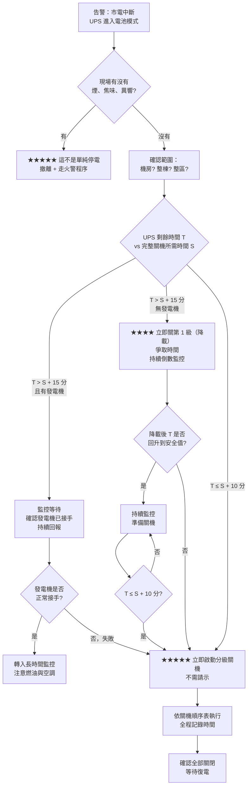
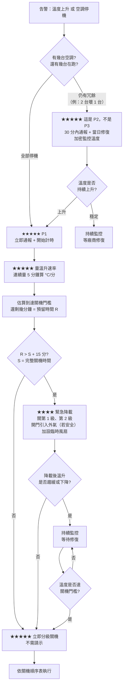
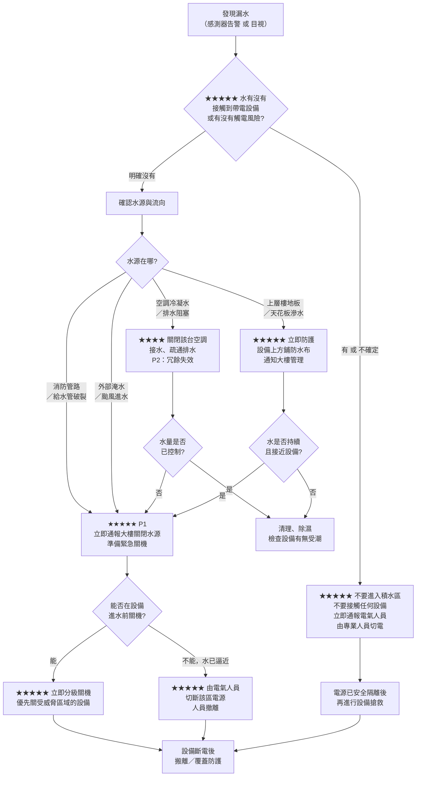
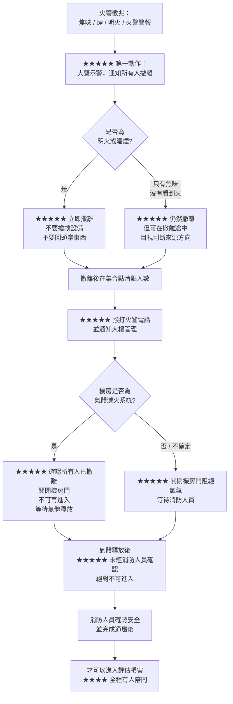

# 機房異常應變

> [!abstract] 這篇你會學到
> - ★★★★★ 四類機房異常的**分鐘級行動時序**：停電、空調故障、漏水、火警
> - ★★★★★ 每一類的**決策樹**，半夜接到告警可以直接照著跑
> - ★★★★★ 最難的那個判斷：**什麼時候該果斷關機**，以及誰有權下這個決定
> - ★★★★ 通報對象與時機：什麼情況先撤離、什麼情況先關機、什麼情況先打電話
> - ★★★★★ 火警時**絕對不可以做的事**（做了會死人）
> - ★★★★ 事前準備：應變卡、關機順序表、緊急聯絡表、應變包，這些沒準備好，現場一定亂
> - ★★★★ 復原程序：復電後的開機順序，以及**為什麼不能全部同時開**
> - ★★★★ 事後檢討（post-mortem）怎麼做才有用

> [!danger] ★★★★★ 這篇的第一原則：人命優先於設備，設備優先於資料，資料優先於服務
> ```text
>     人命  >  設備  >  資料  >  服務  >  面子
> ```
> 任何情況下，如果有人員安全疑慮，**立刻撤離，其他都不重要**。
> 沒有任何一台伺服器值得任何一個人冒生命危險。
> ★★★★★ **這句話要寫在應變卡的第一行。**

> [!warning] ★★★★★ 本篇的時間數字是「行動框架」，不是你機房的規格
> 本篇的分鐘級時序是**行動順序與相對時間的範本**，
> 實際數值必須由你自己的機房決定：
>
> - UPS 能撐幾分鐘 → ★★★★★ **依你的 UPS 容量與當下負載，且要實測**
> - 空調停掉後溫度多久到臨界 → ★★★★★ **依你機房的功率密度與體積，要實測**
> - 完整關機需要幾分鐘 → ★★★★★ **依你的系統數量與相依關係，要演練計時**
>
> ★★★★★ **不要抄本篇的數字。** 正確做法是照本篇的框架，
> 在你的機房做一次演練並計時，把真實數字填進你自己的應變卡。

## 前置知識

- [[040-02-04-guide-機房-電力系統與配電]] — ★★★★★ 你必須先知道你的機房**電從哪裡來、有幾路、開關在哪裡**
- [[040-02-05-guide-機房-UPS選型與容量計算]] — UPS 能撐多久是本篇最關鍵的輸入值
- [[040-02-06-svc-機房-UPS安裝與監控設定]] — ★★★★★ **自動關機必須事先設定好**，臨時做來不及
- [[040-02-07-guide-機房-UPS電池維護與更換]] — 電池老化直接縮短你的反應時間
- [[040-02-02-guide-機房-空調系統與溫溼度監控]] — 空調架構與溫度監測點
- [[040-02-01-guide-機房-機房環境需求]] — 設備的溫度上限來自這裡
- [[040-02-10-guide-機房-機房巡檢與紀錄]] — 異常分級（P1/P2/P3/P4）與通報流程的定義
- [[040-02-13-guide-機房-機房實體安全]] — 門禁、消防設計、緊急出口
- [[100-02-09-svc-維運-事件處理與升級流程]] — 事件的正式處理與升級機制
- [[090-07-04-guide-資安實踐-資安事件應變流程]] — 資安事件的應變（本篇談的是實體環境異常）

---

## 觀念說明

### ★★★★★ 為什麼需要「照著跑就好」的應變程序

半夜三點接到告警的時候，你的狀態是：

- 剛被吵醒，判斷力大概剩下平常的六成
- 資訊不完整，只知道「有告警」，不知道實際狀況
- 時間壓力大，每一分鐘都在燒
- 一個人，沒有人可以討論
- ★★★★★ **而且你要做的可能是不可逆的決定**（例如關掉整個機房）

在這種狀態下，**臨場判斷一定會出錯**。所以應變程序的目的不是「教你判斷」，
而是**把判斷在平時就做完，現場只要執行**。

> [!danger] ★★★★★ 應變程序的三個特徵，缺一不可
> 1. **明確的時間軸**：第 0～5 分鐘做什麼、5～15 分鐘做什麼 —— 不是一堆並列的注意事項
> 2. **明確的判斷準則**：「溫度超過 X 度就關機」，不是「視情況判斷」
> 3. **明確的權責**：誰有權下關機命令、聯絡不到他怎麼辦 ——
>    ★★★★★ **一定要有「聯絡不到主管時，現場人員可以自行決定」的授權條款**，
>    否則現場會卡在「不敢決定」而錯過時機。

### ★★★★ 四類異常的共同結構

不管哪一類異常，處置的骨架都是一樣的：

```text
┌─────────────────────────────────────────────────────────────┐
│ ① 確認   —— 這是真的嗎？範圍多大？（★★★ 不要被誤報耍）        │
│ ② 保命   —— 有人員安全疑慮嗎？有 → 撤離，程序結束             │
│ ③ 通報   —— 誰要知道？現在就要知道還是等一下？                 │
│ ④ 止血   —— 阻止情況繼續惡化（降載、隔離、切換）               │
│ ⑤ 決斷   —— ★★★★★ 要不要關機？什麼時候關？關哪些？           │
│ ⑥ 執行   —— 依關機順序表執行，並全程記錄時間                  │
│ ⑦ 復原   —— 依開機順序表恢復，逐項驗證                        │
│ ⑧ 檢討   —— 24～72 小時內做完 post-mortem                    │
└─────────────────────────────────────────────────────────────┘
```

★★★★★ **每一類異常的差別，只在於「時間壓力有多大」與「保命的優先度」**：

| 異常類型 | 時間壓力 | 人員安全風險 | 第一動作 |
| --- | --- | --- | --- |
| **停電** | ★★★★★ 極高（UPS 倒數） | 低（除非同時有其他狀況） | 確認 UPS 剩餘時間 |
| **空調故障** | ★★★★ 高（溫度上升） | 低～中（極高溫時） | 量溫度並算上升速率 |
| **漏水** | ★★★★★ 極高（水會流） | ★★★★★ **高（觸電）** | 判斷水與電的相對位置 |
| **火警** | ★★★★★ 極高 | ★★★★★ **極高** | ★★★★★ **撤離** |

### ★★★★★ 「果斷關機」為什麼這麼難，以及怎麼讓它變簡單

關機的代價是明確的（服務中斷、被罵、要寫報告）；
不關機的代價是不確定的（**可能**燒掉、**可能**沒事）。
人在壓力下會傾向選擇「不確定的壞結果」而不是「確定的壞結果」，
所以**大家都會拖到最後一刻**，然後就來不及了。

> [!danger] ★★★★★ 不當關機（硬斷電）的代價，比計畫性關機大得多
> | | 計畫性關機 | 硬斷電 |
> | --- | --- | --- |
> | 資料 | 完整寫回磁碟 | ★★★★★ 記憶體與快取中的資料**直接消失** |
> | 檔案系統 | 乾淨卸載 | 可能損毀，要 fsck，可能要還原備份 |
> | 資料庫 | 正常關閉 | 需要 crash recovery，時間不可預測，**可能起不來** |
> | RAID | 陣列一致 | ★★★★★ 若在寫入中且快取無電池保護 → **陣列不一致** |
> | 復原時間 | 可預測（幾十分鐘） | ★★★★★ 不可預測（幾小時到幾天） |
> | 硬體 | 正常 | 高溫下硬斷電可能造成永久損壞 |
>
> ★★★★★ **所以「主動關機」永遠優於「被動掉電」。**
> 應變程序的整個設計目的，就是**確保你在被動掉電之前，有時間做完主動關機**。

解法：**把關機的決策條件在平時就寫成硬規定，現場不做判斷，只做比對。**

```text
❌ 錯的寫法：「視溫度上升情況判斷是否關機」
✅ 對的寫法：「冷通道進風溫度達 32 °C，或預估 15 分鐘內將達 35 °C
              → 立即啟動分級關機程序，不需請示」
```

### ★★★★ 分級關機：不是全關，是按順序關

★★★★★ 你需要一張**關機順序表**，事先做好、印出來貼在牆上。

```text
【第 0 級】不關（必須撐到最後）
    - 網域控制站 / DNS / DHCP        ← 這些關了，其他東西都連不上
    - 核心交換器 / 防火牆
    - 監控主機                        ← 關了就看不到狀況
    - 儲存設備（最後關，且要先確認所有主機都已停止 I/O）

【第 1 級】立刻可關（降載用，關了不影響對外服務）
    - 測試環境、開發環境
    - 非即時的批次處理主機
    - 內部工具（Wiki、CI runner）
    ★★★★ 這一級是「降載」用的，關掉可以爭取時間

【第 2 級】次要業務（可承受中斷）
    - 內部管理系統
    - 報表系統
    - 非關鍵的應用伺服器

【第 3 級】主要業務（對外服務）
    - 對外網站、API
    - 主要應用伺服器
    ★★★★ 關這一級之前必須通報

【第 4 級】核心資料層
    - 資料庫（★★★★★ 依相依順序：先關應用，再關資料庫）
    - 儲存設備（★★★★★ 最後）
```

> [!danger] ★★★★★ 關機順序錯了會壞資料
> **一定要「先關應用、再關資料庫、最後關儲存」。**
> 反過來（先關資料庫，應用還在寫）會產生大量錯誤與不一致的資料。
> 更糟的是**先關儲存**，所有掛載它的主機會瞬間 I/O 錯誤，
> ★★★★★ 檔案系統可能直接損毀。

★★★★ 關機順序表要記錄的欄位：

| 級別 | 主機名 | IP | 用途 | 相依於 | 關機方式 | 預估耗時 | 負責人 |
| --- | --- | --- | --- | --- | --- | --- | --- |
| 1 | dev-web01 | 10.10.30.11 | 開發環境 | — | `shutdown -h now` | 1 分 | 系統組 |
| 3 | app-web01 | 10.10.20.11 | 對外網站 | db-mysql01 | 先停服務再關機 | 3 分 | 系統組 |
| 4 | db-mysql01 | 10.10.20.21 | 主資料庫 | storage01 | ★★★★★ 正常關閉 | 5～15 分 | DBA |
| 4 | storage01 | 10.10.20.31 | 儲存 | — | ★★★★★ 最後，確認無 I/O | 5 分 | 儲存負責人 |

★★★★★ **「預估耗時」這一欄一定要是演練實測出來的**，不是估的。
把所有級別加起來，就是你的「完整關機所需時間」——
這個數字決定了你在 UPS 倒數時要在第幾分鐘按下開始。

### ★★★★ 誰有權下決定

| 情況 | 決策者 | 備援 |
| --- | --- | --- |
| 有人員安全疑慮（火、煙、漏電） | ★★★★★ **現場任何人，立即撤離，不需請示** | — |
| 緊急關機（時間壓力 < 15 分鐘） | ★★★★★ **現場資深人員，可先執行後通報** | — |
| 計畫性關機（時間充裕） | 機房主管／資訊主管 | 聯絡不到 → 現場資深人員 |
| 通知外部使用者 | 資訊主管／公關窗口 | 依機關規定 |
| 通報主管機關（若適用） | ★★★★ **依機關內部規定與主管機關要求辦理** | — |

> [!danger] ★★★★★ 「聯絡不到主管所以不敢關機」是最常見的災難放大器
> 應變程序**必須明文寫出**：
> 「當時間壓力小於 N 分鐘且聯絡主管未果時，現場資深人員有權逕行執行分級關機，
> 事後補報。」
> 沒有這一條，現場人員會一直打電話而不是關機，然後 UPS 就沒電了。
> ★★★★ 這一條要由**主管親自簽核**，讓現場人員有底氣執行。

### ★★★★ 事前準備：沒有這些，現場一定亂

| 準備物 | 內容 | 放哪裡 | 星號 |
| --- | --- | --- | --- |
| **應變卡** | 四類異常的一頁式流程，A4 護貝 | ★★★★★ 機房門口、值班室、每人一份帶著 | ★★★★★ |
| **關機順序表** | 上面那張表 | 同上，且要有電子版在手機裡 | ★★★★★ |
| **開機順序表** | 復電後的開機順序 | 同上 | ★★★★★ |
| **緊急聯絡表** | 主管、廠商（UPS／空調／電力／消防）、大樓管理、消防隊 | ★★★★★ **紙本**（網路掛了就查不到電子檔） | ★★★★★ |
| **機房配置圖** | 機櫃位置、電力路徑、開關位置、EPO 位置、逃生路線 | 機房門口 | ★★★★ |
| **應變包** | 手電筒（含備用電池）、對講機、防水布／塑膠布、拖把與水桶、絕緣手套、防塵口罩、備用鑰匙 | 機房外的固定位置（★★★★ 不要放機房裡） | ★★★★ |
| **離線的密碼取用方式** | 網路掛了也要能拿到管理密碼 | 依密碼保管政策 | ★★★★★ |
| **UPS 實測後備時間** | ★★★★★ 每季實測並更新 | 應變卡上 | ★★★★★ |
| **溫升速率實測值** | 空調全停時的實測 °C/分鐘 | 應變卡上 | ★★★★★ |

> [!danger] ★★★★★ 應變包不要放在機房裡
> 火警、漏水、停電的時候，你可能**進不去機房**，或**不應該進去**。
> 手電筒放在停電後一片漆黑的機房裡，等於沒有。

---

## 安裝或基礎操作

## 一、停電應變

### ★★★★★ 停電決策樹



★★★★★ 核心公式：

```text
    決策點 =  S（完整關機所需時間）+ 10 分鐘安全餘裕

    當 UPS 剩餘時間 T ≤ 決策點  →  ★★★★★ 立即開始關機，不再等待

    例：你演練實測完整關機需要 25 分鐘
        → 決策點 = 25 + 10 = 35 分鐘
        → UPS 剩餘 35 分鐘時就要按下開始，不能等到剩 25 分
```

> [!danger] ★★★★★ 為什麼要留 10 分鐘餘裕
> 1. UPS 面板的「預估剩餘時間」是**根據當下負載估算的**，負載變動就會變
> 2. 電池老化後實際撐的時間**比面板顯示的短**
> 3. 關機過程一定會有「這台關不掉」「那台的服務停不下來」的意外
> 4. ★★★★★ **最後一台關掉之前掉電 = 前面關的都白做了**

### ★★★★★ 停電行動時序

#### 第 0～2 分鐘：確認

```text
□ 確認告警是真的（★★★ 不要因為誤報就啟動全套程序）
   - 看 UPS 面板：是否真的在電池模式
   - 看監控：多台設備同時告警 = 真的；只有一台 = 可能是那台的問題

□ ★★★★★ 確認現場沒有煙、焦味、異響
   → 有的話這不是單純停電，立刻撤離走火警程序

□ 確認範圍
   - 只有機房停 → 可能是機房迴路的斷路器跳脫
   - 整層／整棟停 → 大樓側問題
   - 整區停 → 台電側，時間可能很長
   ★★★★ 判斷方式：看走廊燈、問其他樓層、看鄰棟

□ 記錄起始時間（★★★★★ 這個時間戳之後每一步都要記）
```

#### 第 2～5 分鐘：讀數與通報

```text
□ 讀 UPS 面板：
   - 剩餘時間 T = ______ 分
   - 目前負載 = ______ %
   - 電池電壓／健康度是否有告警

□ ★★★★★ 立刻算：T 是否 ≤ 決策點（S + 10）？
   → 是 → 跳到「第 5～15 分鐘」的關機流程，不要等
   → 否 → 繼續下面

□ 通報（★★★★ 三十秒內講完五件事）
   ① 打電話（不要用通訊軟體）給主管
   ② 通知系統管理員待命
   ③ 通知大樓管理員／總務，確認停電原因與預計復電時間
   ④ 若有發電機，確認發電機狀態

□ 若有發電機：確認是否已自動啟動並接手
   ★★★★★ 沒有在預期時間內接手 → 視同無發電機，走關機流程
```

#### 第 5～15 分鐘：降載或關機

```text
【情況 A】T 充裕（> S + 15 分）且發電機已接手
   □ 轉入長時間監控模式
   □ ★★★★ 檢查空調有沒有跟著發電機供電
      → 很多機房的發電機只供 UPS，不供空調！
      → 空調沒電 = 溫度會開始上升 = 同時要跑「空調故障」程序
   □ 每 10 分鐘回報一次
   □ 確認發電機燃油存量與預估可運轉時間

【情況 B】T 充裕但無發電機
   □ ★★★★ 立即關閉第 1 級（測試／開發／批次）降載
      → 降載可以延長 UPS 時間（負載降 30%，時間通常延長不只 30%）
   □ 重新讀 T，看有沒有回升
   □ 通知使用者可能會有服務中斷
   □ 準備關機順序表，人員待命
   □ 每 5 分鐘重新評估 T

【情況 C】★★★★★ T ≤ S + 10 分
   □ 立即宣告「啟動分級關機」，不需請示
   □ 依關機順序表，第 1 級 → 第 2 級 → 第 3 級 → 第 4 級
   □ ★★★★★ 每關完一級，記錄時間並重讀 T
   □ 若 T 掉得比預期快 → 跳過驗證步驟，直接執行下一級
```

#### 第 15～30 分鐘：執行關機

```bash
# 第 1 級：測試／開發環境（可以並行關）
for h in dev-web01 dev-db01 test-app01; do
    ssh "ops@${h}" 'sudo shutdown -h now' &
done
wait
echo "第 1 級關機指令已發送：$(date '+%F %T')"
```

```text
第 1 級關機指令已發送：2026-09-02 03:18:42
```

```bash
# 第 3 級：先停服務，再關機（★★★★ 不要直接 shutdown）
ssh ops@app-web01 'sudo systemctl stop nginx php8.3-fpm && sleep 5 && sudo shutdown -h now'
```

```bash
# 第 4 級：資料庫要正常關閉，★★★★★ 這一步要等它跑完
ssh ops@db-mysql01 'sudo systemctl stop mysql'
# 確認真的停了
ssh ops@db-mysql01 'systemctl is-active mysql'
```

```text
inactive
```

```bash
# 確認資料庫已停止再關機
ssh ops@db-mysql01 'sudo shutdown -h now'
```

> [!danger] ★★★★★ 資料庫關閉可能需要很久
> 大型資料庫在關閉時要把緩衝池的髒頁刷回磁碟，**可能要好幾分鐘到十幾分鐘**。
> ★★★★★ **不要因為「怎麼還沒關掉」就去 `kill -9` 或按電源鈕** ——
> 那等於硬斷電，前面的努力全白費。
> 這就是為什麼「預估耗時」欄位一定要演練實測。

```bash
# 全部關完後，確認沒有主機還活著
for h in app-web01 app-web02 db-mysql01 storage01; do
    if ping -c1 -W1 "$h" >/dev/null 2>&1; then
        echo "★★★★★ 警告：$h 仍在回應"
    else
        echo "$h 已關閉"
    fi
done
```

```text
app-web01 已關閉
app-web02 已關閉
db-mysql01 已關閉
storage01 已關閉
```

> [!tip] 實務建議 ★★★★★ 最好的做法是「事先設定好，讓它自動關」
> 手動關機在時間壓力下一定會出錯。正確做法是**事先用 NUT 的 `upsmon`／`upssched`
> 設定好多主機依序自動關機**，UPS 剩餘電量低於門檻就自動執行。
> 完整設定見 [[040-02-06-svc-機房-UPS安裝與監控設定]]。
> ★★★★★ 而且**要拔電演練驗證它真的會動**，不要相信「應該會」。

#### 第 30 分鐘後：等待與監控

```text
□ 所有設備已關閉，只留 UPS 與必要的監控（若監控本身也在 UPS 上）
□ ★★★★ 若 UPS 也快沒電，讓 UPS 自己關閉輸出（不要人工按 EPO）
□ 每 15 分鐘與大樓／台電確認復電進度
□ 若溫度仍在上升（空調也停了）→ 併行執行空調故障程序
□ 全程記錄時間軸，之後檢討要用
```

### ★★★★★ 復電後的開機順序

> [!danger] ★★★★★ 復電後不可以全部同時開機
> 所有主機同時開機會產生巨大的**啟動突波電流（inrush current）**，
> 可能把剛恢復的斷路器或 UPS 再打跳一次，變成第二次斷電。
> 而且系統相依關係會亂（應用先起來但資料庫還沒好 → 一堆錯誤）。

```text
【第 0～10 分鐘】確認電力真的穩定
   □ ★★★★★ 觀察 10 分鐘，確認市電沒有再次中斷（復電後常有反覆）
   □ 確認 UPS 已回到線上模式並開始充電
   □ 確認配電盤所有斷路器都在 ON（有跳脫的 → ★★★★★ 不要自己推，找電氣人員）
   □ 確認電壓在正常範圍

【第 10～20 分鐘】先開環境
   □ ★★★★★ 先開空調，讓機房降到正常溫度再開設備
   □ 確認溫度回到正常範圍才繼續

【第 20 分鐘起】依相依順序開機，每一級之間間隔 2～3 分鐘
   ① 網路：核心交換器 → 防火牆 → 存取層交換器
      □ 驗證：從跳板機 ping 得到各網段
   ② 基礎服務：DNS → DHCP → NTP → 網域控制站
      □ 驗證：nslookup 正常、時間同步正常
   ③ 儲存設備
      □ ★★★★★ 驗證：陣列狀態、有沒有進入重建、有沒有磁碟掉出來
   ④ 資料庫
      □ ★★★★★ 驗證：服務起來、資料一致性檢查、慢查詢日誌有無異常
   ⑤ 應用伺服器
      □ 驗證：服務起來、連得到資料庫
   ⑥ 對外服務
      □ 驗證：從外部實際存取
   ⑦ 測試／開發環境（最後）

【全部起來之後】
   □ ★★★★★ 檢查所有硬體的告警：BMC 的 SEL、RAID 狀態、磁碟 SMART
      → 硬斷電最容易在這時候暴露出磁碟問題
   □ 檢查所有服務的日誌，找 crash recovery 的痕跡
   □ 檢查備份任務有沒有被跳過
   □ 通知使用者服務已恢復
   □ 開始寫事件報告
```

```bash
# 復電後的硬體健康快速檢查
for h in db-mysql01 app-web01 storage01; do
    echo "===== $h ====="
    ssh "ops@${h}" 'uptime; sudo ipmitool sel list | tail -5' 2>/dev/null
done
```

```bash
# 檢查檔案系統有沒有在開機時被 fsck 修過
sudo journalctl -b -u systemd-fsck@* --no-pager | tail -20
```

```bash
# 檢查軟體 RAID 有沒有在重建
cat /proc/mdstat
```

```text
Personalities : [raid1] [raid6] [raid5] [raid4]
md0 : active raid1 sda2[0] sdb2[1]
      488254464 blocks super 1.2 [2/2] [UU]

unused devices: <none>
```

★★★★ `[UU]` 兩個 U 代表兩顆都正常。出現 `[U_]` 或 `[_U]` 就是有一顆掉了。

> [!warning] ★★★★ `AC Power Recovery` 設定會影響這整段流程
> 如果所有主機的 BIOS 都設成「復電自動開機」，你**根本來不及控制順序** ——
> 全部會在復電瞬間一起開。
> ★★★★★ 建議：核心設備（DNS、AD、儲存、網路）設成自動開機，
> 其餘設成「維持關機」由人工分批開。設定方式見
> [[040-02-09-guide-機房-伺服器上架與初始設定]]。

---

## 進階應用

## 二、空調故障應變

### ★★★★★ 空調決策樹



### ★★★★★ 溫升速率怎麼算（不要用書上的公式，要實測）

> [!danger] ★★★★★ 不要相信任何「每分鐘上升 X 度」的通用數字
> 溫升速率取決於：機房體積、設備總功率、設備分布、隔熱、有沒有外氣進來、
> 現在是幾點（外面幾度）。**每個機房都不一樣，甚至同一個機房不同季節也不一樣。**
> 唯一可靠的做法是**現場實測斜率**。

現場實測方法（★★★★ 五分鐘就能算出來）：

```text
在同一個測點（建議取最熱的那一櫃的上段進風處），每分鐘記錄一次：

    第 0 分：26.2 °C
    第 1 分：26.9 °C   （+0.7）
    第 2 分：27.7 °C   （+0.8）
    第 3 分：28.4 °C   （+0.7）
    第 4 分：29.2 °C   （+0.8）
    第 5 分：29.9 °C   （+0.7）

    平均溫升速率 = (29.9 − 26.2) ÷ 5 = 0.74 °C / 分鐘

    ★★★★★ 預留時間 R = (關機門檻 − 目前溫度) ÷ 溫升速率
                       = (32 − 29.9) ÷ 0.74
                       ≈ 2.8 分鐘

    ★★★★★ R 只剩 2.8 分鐘 → 早就該關機了，立刻執行
```

> [!warning] ★★★★ 溫升不是線性的
> 剛開始上升較快，接近平衡溫度時會趨緩。所以：
> - ★★★★ **前 5 分鐘算出來的斜率會比實際的長期斜率陡** → 這是**偏保守**的，可以接受
> - ★★★★★ **但不要因此就往樂觀方向調整** —— 保守估計會讓你早一點關機，這是好事

### ★★★★★ 關機門檻怎麼訂

```text
① 查你機房內「操作溫度上限最低」的那台設備的規格書
   （通常是儲存設備、網路設備或老舊伺服器，不一定是伺服器）
       ▼
② 那個上限就是「絕對不能超過」的溫度  ——  設為 T_max
       ▼
③ 關機門檻 = T_max − （S × 溫升速率） − 安全餘裕
   S = 完整關機所需時間

   例：T_max = 35 °C（進風），S = 25 分，溫升速率 = 0.5 °C/分
       關機門檻 = 35 − (25 × 0.5) − 3
                = 35 − 12.5 − 3
                = 19.5 °C ？？？

   ★★★★★ 這個結果不合理（19.5 °C 是正常溫度），代表：
   你的「完整關機時間」相對於「溫升速率」太長了。
   → 解法：① 縮短關機時間（自動化、並行關機）
           ② 建立降載機制爭取時間
           ③ 增加空調冗餘
```

★★★★ 實務上的三段門檻（**依上面的公式用你自己的數字重算**）：

| 溫度 | 動作 | 星號 |
| --- | --- | --- |
| 到達注意門檻（例：28 °C） | 開始每分鐘記錄，算斜率，通報，準備降載 | ★★★★ |
| 到達降載門檻（例：30 °C） | ★★★★ 關閉第 1、2 級設備，啟動臨時散熱措施 | ★★★★ |
| 到達關機門檻（例：32 °C） | ★★★★★ **立即分級關機，不需請示** | ★★★★★ |
| 到達設備上限（例：35 °C） | ★★★★★ 已經來不及了，設備可能自我保護關機或損壞 | ★★★★★ |

> [!danger] ★★★★★ 有些設備會自己關機保護，這比你關更糟
> CPU 過熱時會自動降頻（throttling），再高會**強制關機**。
> 這是**沒有預警的硬關機**，資料處理狀態跟硬斷電一樣糟，
> 而且**不同機器的保護溫度不同**，會變成「有些關了有些沒關」的混亂狀態。
> ★★★★★ **一定要趕在設備自我保護之前完成有秩序的關機。**

### ★★★★ 空調故障行動時序

#### 第 0～5 分鐘

```text
□ 確認幾台空調停機、幾台還在跑
□ 看空調面板的告警碼並拍照（★★★ 廠商會問）
□ ★★★★★ 開始每分鐘記錄溫度（至少 5 個點：最熱的櫃 + 機房中央）
□ 判斷冗餘狀態：
   - 還有空調在跑 → P2（冗餘失效，倒數計時中）
   - 全部停 → ★★★★★ P1，立即通報
□ 通報：主管（電話）+ 空調廠商（電話）+ 系統管理員待命
□ ★★★ 試試看能不能重啟空調（面板 reset）——
   ★★★★★ 但只試一次，不要反覆重啟（可能造成壓縮機損壞）
```

#### 第 5～15 分鐘

```text
□ ★★★★★ 算出溫升速率與預留時間 R
□ R > S + 15 分 → 執行緊急降載：
   ① 關閉第 1 級（測試、開發、批次）
   ② 關閉第 2 級（次要業務）
   ③ ★★★★ 若外氣溫度低於機房溫度且環境安全 → 開機房門引入外氣
      （★★★★★ 但氣體滅火機房不可以隨意開門，且要考慮濕度與粉塵）
   ④ 架設臨時工業風扇，把熱往門外排
   ⑤ 打開機櫃前後門（★★★ 只在冷通道封閉失效的情況下有幫助，
      密閉冷通道設計反而不能開）
□ 降載後重新量斜率，看有沒有趨緩
□ R ≤ S + 15 分 → ★★★★★ 直接跳到關機
```

#### 第 15 分鐘後

```text
□ 每 5 分鐘重算 R
□ R 持續縮短 → 提前關機，不要拖
□ 空調修好 → 確認溫度開始下降才解除警戒
□ ★★★★ 溫度回到正常後，仍要檢查所有設備有無過熱造成的異常
   （BMC SEL、磁碟 SMART、風扇轉速）
□ 全程記錄時間與溫度，之後檢討要用
```

```bash
# 一個簡單的溫度監測腳本，故障時跑著就好
#!/usr/bin/env bash
# /usr/local/bin/temp-watch.sh —— 每分鐘記錄一次感測器溫度
set -euo pipefail
LOG="/var/log/temp-emergency-$(date +%Y%m%d-%H%M).log"
echo "時間,溫度來源,數值" | tee "$LOG"
while true; do
    ts=$(date '+%F %T')
    # 從主機 BMC 讀進風溫度（欄位名稱依機型而異）
    t=$(ipmitool sdr type Temperature 2>/dev/null | head -1 || echo "N/A")
    echo "${ts},bmc,${t}" | tee -a "$LOG"
    sleep 60
done
```

> [!warning] 未實機驗證 ★★★ `ipmitool sdr type Temperature` 的輸出欄位依機型而異
> 不同廠商的感測器名稱（`Inlet Temp`、`Ambient Temp`、`01-Inlet Ambient`）完全不同。
> ★★★★ **平時就要確認你的機型會吐出什麼**，不要等到緊急時才在解析輸出格式。

---

## 三、漏水應變

### ★★★★★ 漏水決策樹



### ★★★★★ 漏水的第一原則：水和電在一起就是致命的

> [!danger] ★★★★★ 絕對不要踏進不確定是否帶電的積水
> 機房的地板下、機櫃底部都有電源線。積水一旦接觸到破損的線路或設備，
> **整片積水就是導電體**。踏進去就是觸電，可能致命。
>
> ★★★★★ **判斷原則：不確定就當作有電。**
> - 不要踏進去
> - 不要用手去撈東西
> - 不要用拖把去拖（拖把桿可能導電，人還是站在水裡）
> - ★★★★★ **由具備資格的電氣人員先切斷該區電源，確認無電後才進入**

### ★★★★★ 斷電優先序

當水正在逼近設備時，斷電的順序：

```text
【優先序 1】★★★★★ 人員安全 —— 所有人退出積水區與潮濕區
                （這一步不需要任何人授權）

【優先序 2】★★★★★ 切斷「水已經接觸到 / 即將接觸到」的區域的電源
                → 由電氣人員操作配電盤該區迴路
                → ★★★★★ 不要用 EPO（那會切掉整個機房，包含還安全的區域）

【優先序 3】★★★★ 搶救還沒被波及的設備
                → 有時間的話：正常關機
                → 沒時間的話：由電氣人員切該區電源
                → ★★★★ 用防水布覆蓋（從上往下蓋，讓水流到旁邊）

【優先序 4】★★★ 把可移動的設備搬到安全區域
                → 只搬「已確認斷電且未受潮」的設備
                → ★★★★★ 兩人以上搬運，不要在濕滑地面單人抬重物
```

> [!danger] ★★★★★ 漏水時不要按 EPO
> EPO 會切掉整個機房的電源，**包含還沒被水波及的區域**，
> 把一個「局部問題」變成「全機房問題」，而且是硬斷電。
> 只有在**火警**或**大範圍立即危險**時才考慮 EPO，而且通常由消防人員判斷。

### ★★★★ 漏水行動時序

#### 第 0～3 分鐘

```text
□ ★★★★★ 確認人員安全：所有人離開積水區
□ 目視判斷：水從哪來、往哪流、水量多大、有沒有接觸設備
□ ★★★★★ 判斷觸電風險 → 不確定就當作有電
□ 通報：主管（電話）+ 大樓管理員（水源可能在他們那邊）+ 電氣人員
□ 拍照存證（★★★ 站在安全距離拍，之後保險理賠與檢討要用）
```

#### 第 3～10 分鐘

```text
□ 止水：
   - 空調冷凝水 → 關閉該台空調，接水桶，疏通排水
   - 上層滲水 → 通知大樓找出上層水源並關閉
   - 管路破裂 → ★★★★★ 大樓關閉總水閥
   - 外部淹水 → 設置擋水設施（沙包、擋水板）

□ 導流與防護：
   - 用防水布／塑膠布覆蓋設備（★★★★ 從上往下蓋，形成斜面把水導開）
   - 用擋水條、吸水棉把水引導到地漏
   - ★★★★ 移除地板上的紙箱等會吸水的東西

□ 評估：水會不會流到機櫃底部？多久會到？
   → 會 → 準備該區設備的緊急關機
```

#### 第 10 分鐘後

```text
□ 若判斷設備會進水 → ★★★★★ 立即關機（優先關受威脅區域）
□ 電氣人員切斷受影響區域的電源
□ 持續監控水位與範圍
□ 水控制住之後：
   - 清理積水（★★★★★ 確認已斷電才進行）
   - 除濕（★★★★ 機房濕度過高會造成後續的凝結與腐蝕）
   - 檢查所有可能受潮的設備
```

### ★★★★★ 設備受潮後的處理

> [!danger] ★★★★★ 受潮的設備絕對不可以直接通電測試
> 「開起來看看有沒有壞」是最常見也最致命的錯誤。
> 內部殘留水氣的設備通電 = **短路 = 原本可能救得回來的設備直接報廢**，
> 而且可能起火。

正確的處理順序：

```text
① 保持斷電，拆開機殼（★★★★ 由具備資格的人員或送原廠）
② 目視評估：水漬範圍、有無腐蝕、有無異物
③ ★★★★★ 完全乾燥：自然陰乾或用低溫送風，
   時間以「天」計，不是「小時」。★★★★★ 不要用吹風機熱風、不要曬太陽
④ 乾燥後由具備資格的人員檢測絕緣，確認無異常
⑤ 才可以嘗試通電
⑥ ★★★★ 即使開得起來，也要視為「可靠度已受損」，
   排入近期汰換，見 [[040-02-12-guide-機房-設備生命週期管理]]
```

★★★★ 磁碟上的資料如果重要：**不要自己嘗試通電讀取**，
直接送專業資料救援，先通電失敗會讓救援難度大增。

---

## 四、火警應變

> [!danger] ★★★★★ 這一節的唯一原則：人命優先，設備全部可以不要
> 所有的伺服器、資料、服務加起來，都不值得任何一個人受傷。
> **看到火或濃煙，第一動作是離開，不是搶救。**

### ★★★★★ 火警決策樹



### ★★★★★ 火警行動時序

#### 第 0 分鐘：立即（不做任何評估）

```text
★★★★★ 看到明火或濃煙的瞬間：

□ 大聲示警：「機房失火，全部離開！」
□ 按下手動報警機（如果在撤離路線上）
□ ★★★★★ 離開機房，關上門（阻絕氧氣，也阻絕煙擴散）
□ ★★★★★ 不要搶救任何設備、不要拿背包、不要回去關電腦
□ 沿逃生路線離開，不搭電梯
□ 到指定集合點
```

#### 第 0～3 分鐘：通報與清點

```text
□ ★★★★★ 清點人數 —— 確認所有人都出來了
   → 有人沒出來 → 立即告知消防人員位置，★★★★★ 不要自己回去找
□ 撥打火警電話（119），說明：
   ① 地址與樓層
   ② 機房失火，有大量電氣設備
   ③ ★★★★★ 是否為氣體滅火機房
   ④ 是否有人受困
   ⑤ 是否已斷電
□ 通知大樓管理員、機關主管
□ 引導消防人員到現場（★★★★ 派人在大門等）
```

#### 第 3 分鐘後：由消防人員主導

```text
□ ★★★★★ 從這一刻起，現場由消防人員指揮，資訊人員配合提供資訊
□ 提供給消防人員的資訊：
   - 機房配置圖與電力路徑圖
   - EPO 位置（★★★★★ 由消防人員決定是否按下）
   - 氣體滅火系統的類型與狀態
   - 機房內是否有電池（UPS 電池起火需要特別處理）
   - 是否有危險物品
□ ★★★★ 不要進入、不要開門、不要「只是看一下」
□ 通知使用者服務中斷（服務一定會中斷，不用猶豫）
```

### ★★★★★ 火警時絕對不可以做的事

> [!danger] ★★★★★ 以下每一項都可能致命
>
> **① 不要為了搶救設備而留在機房內或返回**
> 電氣火災產生的煙含有大量有毒氣體（燃燒的塑膠、PVC 絕緣材），
> ★★★★★ **吸入幾口就可能失去行動能力**。濃煙中能見度接近零。
> 沒有任何資料值得用命換 —— 資料應該在備份裡，不在著火的機器裡。
>
> **② 氣體滅火啟動前後，不要進入機房**
> 氣體滅火系統（惰性氣體或化學藥劑）的作用原理是降低氧氣濃度或抑制燃燒反應。
> ★★★★★ **人在裡面會有窒息或健康危害的風險**，而且釋放時的巨大聲響與氣流
> 本身就可能造成傷害。
> ★★★★★ 氣體釋放後**必須經過充分通風並由消防人員確認安全，才可以進入**。
>
> **③ 不要打開機房門「看一下」**
> 開門會提供氧氣讓火勢變大，也會讓氣體滅火劑逸散而失效，
> 還會讓煙擴散到其他區域。★★★★★ **門關上就不要再開。**
>
> **④ 不要用水滅電氣火災**
> 水導電。用水柱噴帶電設備 = 觸電。
> ★★★★ 機房應配置適用於電氣火災的滅火器（依消防設計配置），
> **而且只有在火勢極小、你受過訓練、且有安全退路時才考慮使用**。
> 有任何猶豫就撤離。
>
> **⑤ 不要自己回去找沒出來的人**
> 告訴消防人員位置。他們有裝備、有訓練、有搜救程序。
> ★★★★★ 你進去只會多一個要救的人。
>
> **⑥ 不要在火警時去按 EPO —— 除非撤離路線上順手且安全**
> EPO 確實可以切斷電源減少火勢延燒，但★★★★★ **不要為了按它而多留在機房內**。
> 而且 EPO 通常無法切斷 UPS 電池本身的化學能。
> 消防人員到場後會由他們判斷。
>
> **⑦ 不要用電梯**
> 火警時電梯可能停在著火樓層或斷電受困。

### ★★★★ 火警後的復原

```text
【階段 1：消防人員確認安全】
   □ ★★★★★ 未經確認絕對不進入
   □ 確認通風完成（氣體滅火機房尤其重要）
   □ 確認電源已安全隔離

【階段 2：損害評估】★★★★ 全程有人陪同，戴防護裝備
   □ 拍照存證（保險理賠、事故調查）
   □ 評估：燒毀範圍、煙燻範圍、滅火劑殘留範圍
   □ ★★★★★ 煙燻的破壞力可能比火本身大 ——
      燃燒產生的酸性物質會腐蝕電路板，可能在數天到數週後才發作
   □ 所有被煙燻過的設備都要視為「可靠度受損」

【階段 3：清理】
   □ 委由專業的災後清理廠商（煙燻殘留物有腐蝕性且可能有毒）
   □ ★★★★★ 不要自己用抹布擦 —— 會把腐蝕物推進更深的地方

【階段 4：復原】
   □ ★★★★★ 假設「機房已經沒了」，走災難復原程序（DR）
      → [[090-03-04-guide-應用安全-備份災難復原與入侵應變]]
   □ 從備份在異地／新硬體上重建服務
   □ 不要急著把煙燻過的設備重新上線

【階段 5：調查與檢討】
   □ 配合消防與相關單位的事故調查
   □ ★★★★ 依機關內部規定與主管機關要求，辦理通報與報告
   □ 完整的 post-mortem
```

---

## 完整實戰範例

以下是一次**真實情境結構**的完整演練紀錄：
**某機關 B 棟機房，凌晨 02:47 市電中斷，無發電機。**

環境參數（★★★★★ 這些是**這個機房**演練實測出來的，不是通用值）：

| 參數 | 值 | 來源 |
| --- | --- | --- |
| UPS-A / UPS-B 滿載後備時間 | 各約 20 分鐘（設計值） | 容量規劃 |
| 目前負載率 | 45% | 巡檢實測 |
| 目前預估後備時間 | 約 35 分鐘 | UPS 面板 |
| 完整關機所需時間 S | **22 分鐘** | ★★★★★ 上季演練實測 |
| 決策點（S + 10） | **32 分鐘** | 計算 |
| 空調是否在 UPS 上 | ★★★★ **否**（空調直接吃市電） | 電力架構 |
| 停電後溫升速率 | 約 0.6 °C/分 | ★★★★★ 上季演練實測 |
| 關機門檻溫度 | 32 °C | 依設備規格反推 |

### 時間軸

```text
═══ 02:47 ═══════════════════════════════════════════════════
   監控系統發出告警：「UPS-A 進入電池模式」「UPS-B 進入電池模式」
   值班人員手機收到通知

═══ 02:49（第 0～2 分：確認）═════════════════════════════════
   □ 遠端連上 UPS 管理介面確認：兩組 UPS 都在電池模式  ✓ 真的停電
   □ 遠端查監控：機房攝影機畫面正常，無煙  ✓
   □ 手機查電力公司停電通報：該區域計畫外停電，預計 04:30 復電
     ★★★★★ 「預計 04:30」= 103 分鐘 >> UPS 的 35 分鐘 → 一定要關機
   □ 記錄起始時間 02:47

═══ 02:51（第 2～5 分：讀數與通報）═══════════════════════════
   □ UPS-A：電池模式，負載 45%，預估剩餘 34 分  → 03:25 耗盡
   □ UPS-B：電池模式，負載 43%，預估剩餘 35 分  → 03:26 耗盡
   □ ★★★★★ 計算：剩餘 34 分  vs  決策點 32 分
     → 只剩 2 分鐘的緩衝，實質上「現在就該開始」
   □ 02:52 電話通報主管（響三聲接起）
     「我是值班的王小明。02:47 B 棟機房市電中斷，UPS 在放電，
      剩 34 分鐘。台電說 04:30 才復電，撐不到。
      我現在開始執行分級關機。有問題請立刻回撥。」
     主管回覆：「照程序做。」
   □ 02:53 通知系統管理員與 DBA 上線待命（群組 + 電話）

   ★★★★ 注意：這裡沒有「要不要關機」的討論。
   決策條件在平時就訂好了，現場只是比對數字。

═══ 02:54（第 5～15 分：執行關機第 1、2 級）═══════════════════
   02:54  ★★★★ 同時開始監控溫度（空調沒電了）
          冷通道 R03：22.4 °C

   02:55  執行第 1 級（測試／開發／批次）—— 並行關機
          $ for h in dev-web01 dev-db01 test-app01 ci-runner01; do
                ssh "ops@${h}" 'sudo shutdown -h now' &
            done; wait
          → 02:57 全部確認關閉（2 分鐘）
          → ★★★★ 重讀 UPS：負載降到 38%，預估剩餘回升到 38 分  ✓ 降載有效

   02:58  執行第 2 級（內部系統、報表）
          → 03:01 全部確認關閉（3 分鐘）
          → UPS 負載 33%，預估剩餘 41 分

   03:01  溫度檢查：R03 = 26.6 °C（7 分鐘上升 4.2 °C ≈ 0.6 °C/分）✓ 與實測值相符
          ★★★★★ 預估到 32 °C 還有 (32−26.6)÷0.6 ≈ 9 分鐘
          → 溫度會比 UPS 先到門檻！★★★★★ 溫度變成主要限制條件
          → 不能因為 UPS 時間回升就放慢，要加速

═══ 03:02（第 15～25 分：執行第 3、4 級）═════════════════════
   03:02  通知使用者（自動發送預先擬好的通知範本）
          「B 棟機房因停電進行緊急維護，對外服務將於 03:05 起中斷，
           預計復電後 1 小時內恢復。」
          ★★★★ 通知範本要事先寫好，半夜不要現場想文案

   03:03  執行第 3 級（對外服務）—— 先停服務再關機
          $ ssh ops@app-web01 'sudo systemctl stop nginx php8.3-fpm'
          $ ssh ops@app-web02 'sudo systemctl stop nginx php8.3-fpm'
          $ sleep 10
          $ ssh ops@app-web01 'sudo shutdown -h now'
          $ ssh ops@app-web02 'sudo shutdown -h now'
          → 03:06 確認關閉

   03:06  執行第 4 級 —— 資料庫（DBA 操作）
          $ ssh ops@db-mysql01 'sudo systemctl stop mysql'
          ★★★★★ 等待中……緩衝池刷寫，這裡花了 4 分 20 秒
          ★★★★★ 過程中沒有人去按電源鈕（演練時有練過這件事）
          03:10 $ ssh ops@db-mysql01 'systemctl is-active mysql'
                → inactive  ✓
          03:11 $ ssh ops@db-mysql01 'sudo shutdown -h now'
          → 03:12 確認關閉

   03:12  溫度檢查：R03 = 29.2 °C
          ★★★★ 大部分設備已關，發熱大幅減少，溫升明顯趨緩

   03:13  儲存設備 —— ★★★★★ 最後關
          □ 先確認沒有主機還在對它做 I/O
          □ 從管理介面確認陣列狀態一致、無重建中
          □ 執行正常關機程序
          → 03:16 確認關閉

═══ 03:17（第 30 分：確認全部關閉）═══════════════════════════
   □ 逐一 ping 確認所有主機無回應  ✓
   □ 只剩：核心交換器、防火牆、監控主機、UPS 管理卡仍在運轉
     （這些負載很小，可以撐很久，且需要它們來監控狀況）
   □ UPS 讀值：負載 8%，預估剩餘 3 小時以上  ✓
   □ 溫度：R03 = 29.6 °C，已趨於平穩（大部分熱源已關閉）
   □ 03:18 回報主管：「全部關機完成，耗時 25 分鐘（比演練多 3 分鐘，
     因為資料庫關閉比預期久）。UPS 剩餘 3 小時以上，等待復電。」

   ★★★★★ 關鍵：完整關機在 UPS 耗盡（原估 03:25）之前 9 分鐘完成。
   如果 02:52 沒有果斷開始，而是先花 15 分鐘打電話討論，就來不及了。

═══ 03:18～04:35：等待 ═══════════════════════════════════════
   □ 每 15 分鐘記錄一次 UPS 狀態與溫度
   □ 03:45 與大樓管理員確認復電進度
   □ 04:20 台電更新：預計 04:40

═══ 04:38：復電 ═════════════════════════════════════════════
   04:38  市電恢復，UPS 回到線上模式並開始充電
   □ ★★★★★ 觀察 10 分鐘，確認沒有二次中斷
   04:48  電壓穩定 ✓，斷路器全部在 ON ✓

═══ 04:48：復原開機 ═════════════════════════════════════════
   04:48  ★★★★★ 先開空調
          □ 兩台空調啟動 ✓
          □ 等待溫度下降
   04:58  R03 = 24.1 °C，持續下降 ✓ → 開始開設備

   05:00  ① 網路層：核心交換器（本來就沒關）→ 存取層交換器
          □ 驗證：各網段 ping 通  ✓
   05:03  ② 儲存設備
          □ ★★★★★ 驗證：陣列 Optimal，無磁碟掉出，無重建  ✓
   05:08  ③ 基礎服務：DNS / DHCP / NTP / AD
          □ 驗證：nslookup 正常、時間同步正常  ✓
   05:12  ④ 資料庫
          □ 啟動：`sudo systemctl start mysql`
          □ ★★★★★ 檢查啟動日誌有無 crash recovery 訊息
            → 無（因為是正常關閉的）✓
          □ 執行資料一致性檢查  ✓
   05:20  ⑤ 應用伺服器
          □ 驗證：服務起來、連得到資料庫  ✓
   05:25  ⑥ 對外服務
          □ ★★★★ 從外部網路實際存取測試  ✓
   05:30  ⑦ 測試／開發環境

═══ 05:35：全面健康檢查 ═════════════════════════════════════
   □ 所有主機的 BMC SEL：只有預期中的電源事件，無硬體故障  ✓
   □ 所有 RAID 狀態：Optimal，無重建  ✓
   □ 所有磁碟 SMART：無新增的重新配置磁區  ✓
   □ 檔案系統：無 fsck 修復紀錄  ✓
   □ 備份任務：03:00 的每日備份被跳過 → ★★★★ 手動補跑
   □ 05:40 通知使用者服務已恢復

═══ 事後 ═════════════════════════════════════════════════════
   當日  □ 填寫事件處理紀錄單
   兩日內 □ 完成 post-mortem
```

### ★★★★★ 這次演練學到的三件事（寫進檢討）

```text
① 資料庫關閉比演練時多花 2 分鐘（資料量成長了）
   → ★★★★★ 行動：把「完整關機時間 S」從 22 分改為 25 分，
     決策點從 32 分改為 35 分。應變卡當日更新。

② 溫度比 UPS 更早成為限制條件（因為空調不在 UPS 上）
   → ★★★★★ 行動：修改應變卡，停電時**同時**啟動溫度監測，
     並把「溫度預留時間 R」與「UPS 剩餘時間 T」**取小者**作為決策依據。
   → 中期行動：評估把至少一台空調納入 UPS 保護，或增設發電機。

③ 通知使用者的文案是現場臨時寫的，花了 3 分鐘
   → ★★★★ 行動：事先擬好三種通知範本（緊急關機／服務中斷／服務恢復），
     存在手機可以離線取得的地方。
```

---

## 常見錯誤與排錯

| 現象 | 原因 | 解法 |
| --- | --- | --- |
| ★★★★★ UPS 沒電了，關機才做到一半 | 太晚開始關機；沒有算「完整關機所需時間」 | ★★★★★ 演練實測 S，訂出決策點 S+10，時間一到就開始，不討論 |
| ★★★★★ 現場人員一直打電話，沒人開始關機 | 沒有授權條款，不敢自己決定 | ★★★★★ 應變程序明文授權「聯絡不到主管時現場資深人員可逕行執行」，由主管簽核 |
| ★★★★★ 資料庫關不掉，有人去按了電源鈕 | 不知道大型資料庫關閉需要時間 | ★★★★★ 演練時實測資料庫關閉時間並寫進順序表；訓練「等待也是執行的一部分」 |
| ★★★★★ 復電後全部主機同時開機，斷路器又跳了 | `AC Power Recovery` 全設成自動開機 | ★★★★ 核心設備設自動，其餘設「維持關機」，人工分批開 |
| ★★★★★ 復電後開機順序錯，應用先起來一直報錯 | 沒有開機順序表 | 事先寫好：網路 → 儲存 → 基礎服務 → 資料庫 → 應用 → 對外 |
| ★★★★ 停電時才發現空調不在 UPS 上，溫度失控 | 沒有盤點過電力架構 | ★★★★★ 平時就要畫清楚「哪些負載在 UPS 上、哪些在發電機上、哪些只有市電」 |
| ★★★★ 發電機沒有自動啟動 | 蓄電池沒電、燃油不足、切換開關在手動位置 | ★★★★★ 每季測試運轉；巡檢納入燃油存量與切換開關位置 |
| ★★★★ 「還有一台空調在跑，先撐著」結果全停 | 把 P2（冗餘失效）當成 P3 | ★★★★★ 冗餘失效 = P2 = 倒數計時中，30 分內通報並當日修復 |
| ★★★★★ 用書上的溫升速率估算，實際快很多，來不及 | 通用數字不適用於你的機房 | ★★★★★ 現場連續量 5 分鐘算真實斜率；演練時測一次記在應變卡上 |
| ★★★★★ 空調重啟按了好幾次，壓縮機壞了 | 反覆重啟造成壓縮機損壞 | ★★★★ 只嘗試重啟一次；不成功就等廠商 |
| ★★★★★ 有人踏進積水去搬設備，觸電 | 不知道積水可能帶電 | ★★★★★ 硬規定：不確定是否帶電就當作有電；由電氣人員先切電 |
| ★★★★★ 漏水時按了 EPO，全機房硬斷電 | 把局部問題擴大成全域問題 | ★★★★★ 漏水只切受影響區域的迴路，EPO 留給火警與大範圍立即危險 |
| ★★★★★ 受潮的設備直接通電測試，短路報廢 | 想「開起來看看」 | ★★★★★ 必須完全乾燥（以天計）+ 專業檢測後才通電 |
| ★★★★★ 火警時有人回去搶救設備 | 心疼設備／怕被追究 | ★★★★★ 訓練與演練時反覆強調「人命 > 設備」；主管公開表態「跑出來就是對的」 |
| ★★★★★ 氣體滅火釋放後有人進去看 | 不知道氣體環境的危險 | ★★★★★ 硬規定：未經消防人員確認且完成通風，絕對不進入 |
| ★★★★ 火警後急著把煙燻過的設備上線 | 想快點恢復服務 | ★★★★★ 煙燻殘留物有腐蝕性，可能數週後才發作；走 DR 用備份重建 |
| ★★★★ 應變卡放在機房裡，停電後找不到 | 沒想到停電會一片漆黑 | ★★★★ 應變卡與應變包放機房**外**，且每人手機有一份離線副本 |
| ★★★★ 緊急聯絡表只有電子檔，網路掛了查不到 | 過度依賴線上系統 | ★★★★★ 紙本一份，手機離線副本一份 |
| ★★★★ 事件處理完了，但沒人寫紀錄，下次一樣亂 | 沒有強制的檢討機制 | ★★★★★ P1／P2 事件一律在 72 小時內完成 post-mortem，並更新應變卡 |
| ★★★★ 演練都是「假裝」，真的出事還是慌 | 演練沒有計時、沒有真的執行 | ★★★★ 至少每年做一次「真的關機」的演練（排在維護時段），實測所有時間 |
| ★★★ 半夜告警沒人接 | 通知管道失效、值班機制不明 | ★★★★ 每月測試告警管道；建立未回應的自動升級（N 分鐘未回應轉打下一位） |

---

## 安全性注意事項

> [!danger] ★★★★★ 人命 > 設備 > 資料 > 服務
> 這是本篇唯一不容妥協的原則。任何情況下有人員安全疑慮，立即撤離。

> [!danger] ★★★★★ 火警時的六個絕對禁止
> ① 不為搶救設備留在或返回機房　② 氣體滅火前後不進入
> ③ 不開機房門「看一下」　④ 不用水滅電氣火災
> ⑤ 不自己回去找沒出來的人　⑥ 不搭電梯

> [!danger] ★★★★★ 電的三個絕對禁止
> ① 不踏進不確定是否帶電的積水
> ② 不自行復位跳脫的斷路器
> ③ 不做任何帶電作業 —— 由具備資格的電氣人員處理

| 面向 | 注意事項 | 星號 |
| --- | --- | --- |
| **應變期間的授權** | ★★★★★ 緊急關機的授權要明文、要主管簽核、要現場人員知道 | ★★★★★ |
| **記錄的完整性** | ★★★★ 全程記錄時間軸，事後檢討與責任釐清都要用 | ★★★★ |
| **通報的時機** | ★★★★ 「先執行後通報」在時間壓力大時是正確的，但**一定要補通報** | ★★★★ |
| **對外說明** | ★★★★ 服務中斷的對外通知由指定窗口統一發布，避免訊息混亂 | ★★★★ |
| **法規通報** | ★★★★★ 涉及重大事故、人員傷亡、或特定類型事件的通報義務，**依機關內部規定與主管機關要求辦理** | ★★★★★ |
| **緊急期間的資安** | ★★★★ 緊急時常常會走捷徑（共用帳號、關掉防火牆規則），**事後一定要復原並稽核** | ★★★★★ |
| **應變期間的存取控制** | ★★★★ 廠商、消防人員進入機房仍需登記；混亂期間是實體入侵的機會 | ★★★★ |
| **備份的可用性** | ★★★★★ 應變的最後一道防線是備份。**備份不在機房裡、而且驗證過可還原**，見 [[090-03-04-guide-應用安全-備份災難復原與入侵應變]] | ★★★★★ |
| **演練的安全** | ★★★★ 拔電演練、關機演練本身有風險，要排在維護時段並有回復方案 | ★★★★ |
| **心理層面** | ★★★★ 事後檢討對事不對人。追究個人責任的檢討會讓下次沒人敢通報 | ★★★★★ |

### ★★★★ 事後檢討（post-mortem）怎麼做

```text
【時機】★★★★ P1／P2 事件在 24～72 小時內完成（記憶還新鮮）

【參與者】現場處置人員 + 主管 + 相關系統負責人

【★★★★★ 前提：對事不對人（blameless）】
   目標是「下次怎麼做更好」，不是「這次誰的錯」

【內容】
   ① 時間軸：幾點幾分發生什麼、誰做了什麼決定（依紀錄，不憑記憶）
   ② 影響範圍：哪些服務中斷、中斷多久、影響多少使用者、有無資料損失
   ③ 根本原因：不只是「停電」，而是「為什麼停電會導致這個結果」
   ④ ★★★★★ 做對的事：哪些準備發揮了作用（要保留並強化）
   ⑤ 做錯／可以更好的事：哪一步慢了、哪個資訊當時沒有
   ⑥ ★★★★★ 具體行動項目：每一項要有負責人與完成期限
      → 沒有負責人與期限的行動項目 = 沒有行動項目

【★★★★★ 最重要的產出：更新應變卡】
   演練或真實事件中量到的時間、溫升速率、關機耗時，
   全部要回寫到應變卡上。應變卡是活的文件，不是寫完就歸檔。
```

★★★★ 檢討結果填 `_表單範本/100-02-07-事件處理紀錄單.docx`，
並依 [[100-02-09-svc-維運-事件處理與升級流程]] 追蹤行動項目到結案。

---

## 速查表

| 項目 | 內容 |
| --- | --- |
| **★★★★★ 第一原則** | 人命 > 設備 > 資料 > 服務 |
| **通用八步驟** | 確認 → 保命 → 通報 → 止血 → 決斷 → 執行 → 復原 → 檢討 |
| **★★★★★ 停電決策點** | UPS 剩餘時間 T ≤ 完整關機時間 S + 10 分 → 立即開始關機 |
| **S 怎麼來** | ★★★★★ 演練實測，不是估的；每年重測（資料量會變） |
| **降載順序** | 第 1 級（測試／開發／批次）→ 第 2 級（次要業務） |
| **關機順序** | ★★★★★ 應用 → 資料庫 → 儲存（絕不可顛倒） |
| **開機順序** | 空調 → 網路 → 儲存 → 基礎服務（DNS/AD）→ 資料庫 → 應用 → 對外 |
| **復電先做什麼** | ★★★★★ 觀察 10 分鐘確認不會二次中斷，再開空調 |
| **★★★★★ 溫升速率** | 現場連續量 5 分鐘算斜率，不要用通用數字 |
| **預留時間 R** | R = (關機門檻 − 目前溫度) ÷ 溫升速率 |
| **空調三段門檻** | 注意（開始計時）→ 降載 → ★★★★★ 關機（不需請示） |
| **空調重啟** | ★★★★ 只嘗試一次，不成功就等廠商 |
| **★★★★★ 漏水第一動作** | 判斷觸電風險；不確定就當作有電，人員退出 |
| **漏水斷電順序** | 人員撤離 → 切受影響區迴路 → 搶救未波及設備 → 搬移 |
| **★★★★★ 漏水不要按** | EPO（會把局部問題擴大成全機房硬斷電） |
| **受潮設備** | ★★★★★ 絕不直接通電；乾燥以「天」計 + 專業檢測後才通電 |
| **★★★★★ 火警第一動作** | 示警 → 撤離 → 關門 → 清點 → 報案 |
| **火警六不** | 不搶救／氣體前後不進入／不開門看／不用水/不回去找人／不搭電梯 |
| **火警後復原** | 走災難復原（DR）程序，用備份在新硬體重建 |
| **★★★★★ 緊急關機授權** | 明文寫「聯絡不到主管時現場資深人員可逕行執行」，主管簽核 |
| **通報講五件事** | 我是誰／發生什麼／現在影響／已做了什麼／需要什麼決定 |
| **通報用什麼** | ★★★★ 電話（不要用通訊軟體，半夜不會有人看） |
| **應變包放哪** | ★★★★ 機房**外**（停電時機房是黑的、火警時進不去） |
| **緊急聯絡表** | ★★★★★ 紙本一份 + 手機離線副本 |
| **檢討時限** | P1／P2 事件 24～72 小時內完成 post-mortem |
| **檢討原則** | ★★★★★ 對事不對人；每個行動項目要有負責人與期限 |
| **★★★★★ 檢討最重要產出** | 更新應變卡上的實測數字 |
| **演練頻率** | ★★★★ 每季桌上演練，每年一次真實關機演練並計時 |
| **法規通報** | ★★★★★ 依機關內部規定與主管機關要求辦理 |
| **事件紀錄單** | `_表單範本/100-02-07-事件處理紀錄單.docx` |

---

## 練習題

> [!question]- 練習 1：算出你機房的停電決策點
> 依照本篇的方法，實際算出你負責的機房的停電決策點。需要蒐集：
> ① 目前負載下的 UPS 預估後備時間 ② 完整關機所需時間 S ③ 決策點。
> 如果你沒有 S 的實測值，請寫出你要怎麼取得它。
>
> **參考答案（方法）**
> - ① 看 UPS 面板的「預估剩餘時間」，★★★★ 但要注意這是**當下負載**的估值，
>   而且電池老化後會比顯示的短 → 建議每季做一次實際放電測試驗證
> - ② S 只能靠演練實測：排一個維護時段，依關機順序表真的關一次，
>   每一級都計時，加總得到 S。★★★★★ 特別要量資料庫關閉的時間
> - ③ 決策點 = S + 10 分鐘安全餘裕
> - ★★★★★ 如果算出來「UPS 時間 < 決策點」→ 代表你的 UPS 撐不到關完機，
>   必須：縮短關機時間（自動化）、擴充 UPS 容量、或增設發電機

> [!question]- 練習 2：設計你的關機順序表
> 列出你機房所有主機，分成第 0～4 級，並標出相依關係與預估關機耗時。
> 特別注意：哪些主機關了之後，其他主機就管不到了？
>
> **參考答案（要點）**
> - ★★★★★ **第 0 級（不關）** 的判準：關了會讓你失去對其他設備的控制或觀測能力
>   → DNS、AD、核心交換器、防火牆、監控主機、跳板機
> - ★★★★★ 相依關係要往下追：應用依賴資料庫，資料庫依賴儲存，全部依賴網路
> - ★★★★ 常被忽略的：備份伺服器（關太早會漏掉最後的備份）、
>   憑證服務（關了某些服務會起不來）、集中認證（LDAP）
> - 預估耗時必須演練實測，特別是資料庫與儲存設備

> [!question]- 練習 3：現場實測溫升速率
> 設計一次「空調停機」的演練，量出你機房的真實溫升速率。
> 寫出演練計畫，包含安全措施與中止條件。
>
> **參考答案（要點）**
> - **時機**：排在維護時段，避開最熱的時段做第一次（保守）
> - **方法**：關閉所有空調，在最熱的機櫃上段進風處每分鐘記錄一次溫度
> - **記錄**：至少 10 分鐘，同時記錄多個測點
> - ★★★★★ **中止條件**：溫度達到你的「降載門檻」立刻恢復空調，
>   絕對不要為了「量得更準」而讓溫度接近設備上限
> - **安全措施**：全程有人在現場、監控告警維持開啟、
>   隨時可以恢復空調、事前通知所有相關人員
> - ★★★★ **產出**：溫升速率（°C/分）→ 寫進應變卡；
>   同時可以驗證「降載能延緩多少」

> [!question]- 練習 4：寫出漏水情境的處置
> 情境：凌晨，漏水感測器告警。你遠端看攝影機，發現機房後方靠牆處地面有反光，
> 疑似積水，位置在 R11、R12 機櫃後方。你人在家裡，開車到機房要 30 分鐘。
> 寫出你的處置順序。
>
> **參考答案**
> 1. ★★★★★ **不要叫任何人立刻進去查看** —— 先確認觸電風險
> 2. 遠端做的事：① 用攝影機盡量判斷水量與流向 ② 查該區的環境監控歷史
>    ③ 查 R11/R12 上的設備清單與重要性
> 3. ★★★★ 立即電話通報：主管 + 大樓管理員（★★★★★ 水源可能在上層，
>    請他們立刻查上層有沒有水管問題並關閉）
> 4. ★★★★★ 如果有人已經在現場：指示他**不要踏進積水區**，
>    在門口目視即可，並通報電氣人員
> 5. 遠端評估是否要預防性關機 R11/R12 的設備
>    → 判準：水是否在擴大、是否接近機櫃底部
>    → 是 → ★★★★★ 遠端執行該區設備的正常關機（趁還來得及）
> 6. 自己出發前往現場，途中持續遠端監看
> 7. 到場後：確認電氣人員已到或已切電，才進入處置

> [!question]- 練習 5：設計一份應變卡
> 做出一張 A4 的機房應變卡，正面放停電與空調，背面放漏水與火警。
> 每一類要有：判斷準則、行動時序、通報對象、關鍵數字。
>
> **參考答案（結構）**
> ```text
> 【正面】
> 最上方一行：★★★★★ 人命 > 設備 > 資料 > 服務。有安全疑慮立即撤離。
> ─────────────────────────────────────────
> 【停電】UPS 剩餘 T ＿＿分  完整關機 S ＿＿分  決策點 ＿＿分
>   0-2 分：確認（真的嗎？有煙嗎？範圍多大？）
>   2-5 分：讀 T → 比對決策點 → 電話通報主管
>   5-15 分：T 充裕 → 降載；T ≤ 決策點 → 立即關機
>   關機順序：1→2→3→4 級（詳見背面順序表）
> ─────────────────────────────────────────
> 【空調】溫升速率 ＿＿°C/分（實測）  關機門檻 ＿＿°C
>   0-5 分：確認冗餘狀態、開始每分鐘量溫、通報
>   5-15 分：算 R → R 充裕則降載；R ≤ S+15 則立即關機
>   R = (門檻 − 現溫) ÷ 溫升速率
>
> 【背面】
> 【漏水】★★★★★ 不確定是否帶電就當作有電，不要踏進去
>   撤離 → 通報電氣人員 → 止水 → 切受影響區迴路 → 防護搶救
>   ★★★★★ 不要按 EPO
> ─────────────────────────────────────────
> 【火警】★★★★★ 示警 → 撤離 → 關門 → 清點 → 報案
>   六不：不搶救／氣體前後不進入／不開門看／不用水／不回去找人／不搭電梯
> ─────────────────────────────────────────
> 【緊急聯絡】主管＿＿ 系統＿＿ DBA＿＿ 電氣＿＿ 空調＿＿ 大樓＿＿ 消防 119
> 【授權】聯絡不到主管且時間壓力 < ＿＿分時，現場資深人員可逕行關機，事後補報。
>         主管簽名：＿＿＿＿＿  日期：＿＿＿＿
> ```

> [!question]- 練習 6：規劃一次完整的應變演練
> 設計一次跨部門的機房停電演練，包含演練目標、參與者、流程、中止條件、
> 以及要量出哪些數字。
>
> **參考答案（要點）**
> - **目標**：驗證關機順序表可行、實測 S、驗證通報鏈、驗證 UPS 自動關機設定
> - **參與者**：機房管理員、系統管理員、DBA、網路管理員、主管（決策者角色）
> - **前置**：通知所有使用者、備份確認完成、準備回復方案、
>   ★★★★★ 確認所有設備近期無異常（RAID 不在重建）
> - **流程**：模擬告警 → 通報 → 決策 → 分級關機（真的關）→ 計時 →
>   復原開機 → 驗證
> - ★★★★★ **中止條件**：任何設備出現非預期異常、任何人員安全疑慮、
>   超過預定時段
> - **要量的數字**：每一級關機耗時、資料庫關閉耗時、S 總計、
>   通報從告警到主管接電話的時間、復原開機到服務可用的時間
> - ★★★★★ **產出**：更新應變卡的所有數字 + post-mortem 行動項目

---

## 小測驗

Q1. （簡答）停電時，決定「什麼時候開始關機」的公式是什麼？為什麼要加安全餘裕？

Q2. （選擇）以下關機順序哪一個是正確的？
　　(A) 儲存 → 資料庫 → 應用
　　(B) 資料庫 → 應用 → 儲存
　　(C) 應用 → 資料庫 → 儲存
　　(D) 全部同時關，最快

Q3. （是非）UPS 面板顯示還有 30 分鐘，而完整關機只要 22 分鐘，所以可以再等 5 分鐘看看會不會復電。

Q4. （簡答）為什麼「主動關機」永遠優於「被動掉電」？請講出三個具體差異。

Q5. （選擇）兩台空調中有一台故障，另一台正常，溫度目前還在正常範圍。
　　正確的認知是什麼？
　　(A) 還有一台在跑，先觀察就好
　　(B) 冗餘已失效，你正在倒數計時，要在剩下那台壞掉之前修好
　　(C) 立即關機
　　(D) 等明天上班再處理

Q6. （這個做法會發生什麼）機房漏水，你為了快速斷電，按下了 EPO 按鈕。

Q7. （簡答）為什麼受潮的設備不可以「開起來看看有沒有壞」？

Q8. （是非）氣體滅火系統釋放之後，只要火已經熄了，就可以進去搶救設備。

Q9. （簡答）為什麼應變包與應變卡要放在機房「外面」？

Q10.（選擇）事後檢討（post-mortem）最重要的產出是什麼？
　　(A) 一份完整的事件報告
　　(B) 釐清是誰的疏失
　　(C) 用實測到的數字更新應變卡，以及有負責人與期限的行動項目
　　(D) 對外的說明稿

> [!question]- 測驗答案
> **Q1.** ★★★★★ 公式：**決策點 = S（完整關機所需時間）+ 10 分鐘安全餘裕**；
> 當 UPS 剩餘時間 T ≤ 決策點就立即開始關機。
> 加餘裕的理由：① UPS 的預估時間會隨負載變動 ② 電池老化後實際比顯示的短
> ③ 關機過程一定會有意外 ④ ★★★★★ 最後一台關掉前掉電，前面全白做。
> 見〈停電決策樹〉。
>
> **Q2.** ★★★★★ **(C) 應用 → 資料庫 → 儲存**。反過來會造成大量寫入錯誤，
> 先關儲存更會讓所有主機瞬間 I/O 錯誤、檔案系統可能損毀。見〈分級關機〉。
>
> **Q3.** ★★★★★ **錯**。30 − 22 = 8 分鐘，小於 10 分鐘安全餘裕，
> 已經到決策點了，**應該立刻開始關機**。而且「等看看會不會復電」正是
> 最常見的災難放大器 —— 復電時間不由你控制，UPS 倒數卻不會停。
> 見〈停電決策樹〉的核心公式。
>
> **Q4.** ★★★★★ 任三個：① 記憶體與快取的資料能完整寫回，硬斷電會直接消失
> ② 檔案系統乾淨卸載，硬斷電可能損毀需要 fsck 甚至還原備份
> ③ 資料庫正常關閉，硬斷電要 crash recovery、時間不可預測、可能起不來
> ④ RAID 保持一致，硬斷電若在寫入中可能造成陣列不一致
> ⑤ 復原時間可預測（幾十分鐘）vs 不可預測（幾小時到幾天）。
> 見〈果斷關機為什麼這麼難〉。
>
> **Q5.** ★★★★★ **(B)**。這是 P2 —— 冗餘已失效，目前是單點運轉。
> 「還有一台在跑先撐著」是機房災難最常見的起點。
> 正確心態是**你正在倒數計時**，要在剩下那一台壞掉之前修好。見〈空調決策樹〉。
>
> **Q6.** ★★★★★ 會把**整個機房**（包含還沒被水波及的區域）全部硬斷電，
> 把局部問題擴大成全機房問題，而且是最糟的斷電方式（無秩序硬斷）。
> 正確做法是**只切受影響區域的迴路**，由電氣人員操作。
> EPO 留給火警與大範圍立即危險。見〈漏水的斷電優先序〉。
>
> **Q7.** ★★★★★ 因為內部殘留水氣的設備通電會**短路**，
> 讓原本乾燥後可能救得回來的設備**直接報廢**，而且可能起火。
> 正確順序是：保持斷電 → 拆開評估 → 完全乾燥（以天計）→
> 專業檢測絕緣 → 才通電。見〈設備受潮後的處理〉。
>
> **Q8.** ★★★★★ **錯**。氣體滅火系統的原理是降低氧氣濃度或抑制燃燒反應，
> **人在裡面有窒息或健康危害風險**。必須經過充分通風並由**消防人員確認安全**
> 之後才可以進入。而且開門本身也會讓滅火劑逸散、可能讓火復燃。
> 見〈火警時絕對不可以做的事〉。
>
> **Q9.** ★★★★★ 因為停電時機房是一片漆黑（手電筒放裡面等於沒有），
> 火警或漏水時你可能**進不去或不應該進去**。
> 緊急聯絡表還要有紙本 + 手機離線副本，因為網路掛了就查不到電子檔。
> 見〈事前準備〉。
>
> **Q10.** ★★★★★ **(C)**。報告只是形式，追究責任會讓下次沒人敢通報。
> 真正有價值的產出是：**把演練或事件中量到的真實數字回寫到應變卡**
> （S、溫升速率、關機耗時），以及**每一項都有負責人與期限的行動項目** ——
> 沒有負責人與期限的行動項目等於沒有行動項目。見〈事後檢討怎麼做〉。

---

## 延伸閱讀

**同章相關**

- [[040-02-01-guide-機房-機房環境需求]] — 設備溫度上限的來源
- [[040-02-02-guide-機房-空調系統與溫溼度監控]] — 空調架構與冗餘設計
- [[040-02-04-guide-機房-電力系統與配電]] — ★★★★★ 電從哪來、有幾路、開關在哪
- [[040-02-05-guide-機房-UPS選型與容量計算]] — UPS 能撐多久
- [[040-02-06-svc-機房-UPS安裝與監控設定]] — ★★★★★ 多主機依序自動關機的設定
- [[040-02-07-guide-機房-UPS電池維護與更換]] — 電池老化直接縮短反應時間
- [[040-02-03-guide-機房-機櫃規劃與設備上架]] — 機櫃配置與氣流
- [[040-02-08-guide-機房-結構化佈線與標籤規範]] — 緊急時要快速找到線
- [[040-02-09-guide-機房-伺服器上架與初始設定]] — `AC Power Recovery` 與帶外管理
- [[040-02-10-guide-機房-機房巡檢與紀錄]] — ★★★★★ 異常分級與通報流程的定義
- [[040-02-11-guide-機房-資訊設備盤點]] — 關機順序表的設備清單來源
- [[040-02-12-guide-機房-設備生命週期管理]] — 受損設備的汰換評估
- [[040-02-13-guide-機房-機房實體安全]] — 門禁、消防設計、逃生路線

**維運制度**

- [[100-02-09-svc-維運-事件處理與升級流程]] — 事件的正式處理與升級
- [[100-02-01-guide-維運-維運制度與角色分工]] — 誰有權下決定
- [[100-02-08-guide-維運-變更管理流程]] — 演練要走變更流程
- [[100-02-10-guide-維運-故障排除方法論]] — 系統性的問題定位
- [[100-02-11-guide-維運-維運文件與知識庫]] — 應變卡與順序表的維護
- [[100-02-12-guide-維運-交接與新人上手]] — 新人一定要學會應變程序

**監控與復原**

- [[100-01-03-guide-日誌-系統監控與告警]] — 告警要真的送得到人
- [[100-01-04-guide-日誌-健康檢查與可用性監控]] — 復原後的驗證
- [[090-03-04-guide-應用安全-備份災難復原與入侵應變]] — ★★★★★ 最後一道防線
- [[090-07-04-guide-資安實踐-資安事件應變流程]] — 資安事件的應變（本篇是實體環境）

**背景知識**

- [[010-01-15-guide-計概-電力基礎與用電安全]] — 用電安全
- [[020-01-17-cmd-Linux-systemd服務管理]] — 服務的正常停止
- [[020-01-25-guide-Linux-開機流程與GRUB救援]] — 硬斷電後開不起來時的救援

**表單**

- `_表單範本/100-02-07-事件處理紀錄單.docx` — ★★★★★ 事件紀錄與檢討
- `_表單範本/040-02-01-機房巡檢表.docx` — 復原後的完整巡檢
- `_表單範本/040-02-03-進出機房登記表.docx` — 應變期間仍需登記
