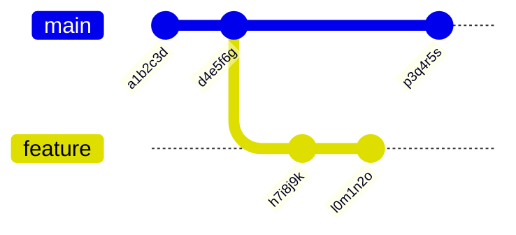
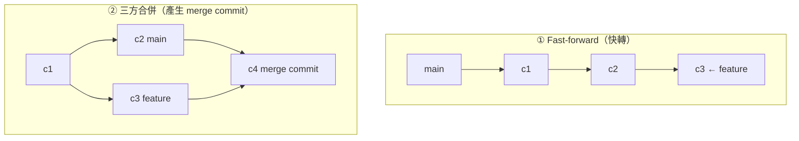
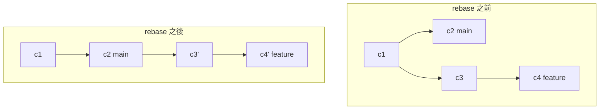

# Git 分支與合併

> [!abstract] 這篇你會學到
> - 理解**分支的本質**（它其實只是一個 41 bytes 的檔案）
> - 自由建立、切換、刪除分支
> - **選對 `merge` 或 `rebase`**，並知道各自的代價
> - **冷靜地解掉合併衝突**（附完整的實作流程）
> - 認識 **fast-forward** 與 `--no-ff` 的差別
> - 知道 **rebase 的黃金法則**

## 前置知識

- [[02-Git-基本工作流程]] — add / commit / diff

---

## 觀念說明

### 分支的本質：一個指標

> [!tip] 分支不是「複製一份程式碼」
> **很多人以為建立分支會複製整個專案** —— 不會。
>
> **分支只是一個「指向某個提交的可移動指標」**：
> ```bash
> $ cat .git/refs/heads/main
> a1b2c3d4e5f6789012345678901234567890abcd
>
> $ ls -l .git/refs/heads/main
> -rw-r--r-- 1 user user 41 Aug 28 14:30 .git/refs/heads/main
>                        ↑ 【41 bytes】（40 字元的 SHA-1 + 換行）
> ```
>
> **這就是為什麼 Git 的分支「幾乎零成本」** ——
> 建立分支只是寫一個 41 bytes 的檔案。



### HEAD 是什麼

```bash
$ cat .git/HEAD
ref: refs/heads/main        ← HEAD 指向「main 這個分支」

# 切換到某個提交（detached HEAD）之後：
$ git checkout a1b2c3d
$ cat .git/HEAD
a1b2c3d4e5f6...             ← HEAD 直接指向一個提交
```

> [!warning] Detached HEAD：不在任何分支上
> ```bash
> $ git checkout a1b2c3d
> Note: switching to 'a1b2c3d'.
> You are in 'detached HEAD' state.
> ```
>
> **這時做的提交不屬於任何分支**，
> 切換走之後就**很難找回來**（只能靠 `git reflog`）。
>
> **正確用法**：
> ```bash
> # 只是想看看舊版本 → 看完切回來
> $ git checkout a1b2c3d
> $ ...查看...
> $ git switch -                 # 切回原本的分支
>
> # 想從舊版本開始做事 → 【建立分支】
> $ git switch -c hotfix a1b2c3d
> ```

---

## 分支的基本操作

```bash
# ===== 查看分支 =====
$ git branch                       # 本地分支
$ git branch -a                    # 含遠端分支
$ git branch -v                    # 附帶最新提交
$ git branch -vv                   # 附帶上游分支資訊
$ git branch --merged              # ★ 已合併進當前分支的（可安全刪除）
$ git branch --no-merged           # 尚未合併的（刪除要小心）

# ===== 建立與切換（新語法 switch，Git 2.23+）=====
$ git switch -c feature/api        # 建立並切換 ★ 最常用
$ git switch main                  # 切換
$ git switch -                     # 切回上一個分支
$ git switch -c hotfix a1b2c3d     # 從特定提交建立分支
$ git switch --detach a1b2c3d      # 明確地進入 detached HEAD

# ===== 舊語法（仍然通用）=====
$ git checkout -b feature/api
$ git checkout main

# ===== 改名 =====
$ git branch -m 新名稱              # 改目前分支
$ git branch -m 舊名稱 新名稱

# ===== 刪除 =====
$ git branch -d feature/api        # 安全刪除（未合併會拒絕）
$ git branch -D feature/api        # ★ 強制刪除（不管有沒有合併）
$ git push origin --delete feature/api    # 刪除遠端分支
```

> [!tip] 分支命名慣例
> ```
> main / master        主線（正式環境）
> develop              開發主線（若採用 Git Flow）
>
> feature/xxx          新功能
> fix/xxx              修正
> hotfix/xxx           【正式環境的緊急修正】
> release/x.y.z        發布準備
> chore/xxx            雜項
> docs/xxx             文件
>
> 【加上單號更好】：
> feature/1234-新增API反向代理
> fix/1567-修正登入逾時
> ```
>
> **避免**：
> - 中文分支名（某些工具或系統會有問題）
> - 空格（改用 `-` 或 `_`）
> - 太長（超過 50 字元）
> - `test`、`tmp`、`new`（三個月後不知道是什麼）

---

## Merge：合併

### 兩種合併方式



#### Fast-forward：主線沒有前進

```bash
# main 從分出去之後【完全沒有新提交】
$ git switch main
$ git merge feature/api
Updating d4e5f6g..a1b2c3d
Fast-forward
 nginx/api.conf | 12 ++++++++++++
 1 file changed, 12 insertions(+)
```

**發生了什麼**：Git 只是把 `main` 這個指標**往前移到 feature 的位置**，
**沒有產生新的提交**。

#### 三方合併：兩邊都有新提交

```bash
$ git merge feature/api
Merge made by the 'ort' strategy.
 nginx/api.conf | 12 ++++++++++++
 1 file changed, 12 insertions(+)

$ git log --graph --oneline -5
*   f6g7h8i (HEAD -> main) Merge branch 'feature/api'
|\
| * a1b2c3d feat(nginx): 新增 API 反向代理
* | e5f6g7h fix(php): 調高 memory_limit
|/
* d4e5f6g chore: 初始化
```

### `--no-ff`：強制產生 merge commit

```bash
$ git merge --no-ff feature/api -m "Merge: 新增 API 反向代理功能"
```

> [!tip] 什麼時候該用 `--no-ff`
> | 情況 | 建議 |
> | --- | --- |
> | **合併功能分支到 main** | **用 `--no-ff`** |
> | 同步 main 的更新到自己的分支 | 用 fast-forward 或 rebase |
> | 個人的小修改 | fast-forward 即可 |
>
> **`--no-ff` 的好處**：
> ```
> ① 【歷史上清楚看得出「這是一個功能」】
> ② 【可以整包 revert】（revert 那個 merge commit 就好）
> ③ 保留分支存在過的事實
> ```
>
> **代價**：歷史圖會有比較多的分岔線。

```bash
# 設成預設行為
$ git config --global merge.ff false      # 一律產生 merge commit
# 或只對特定分支
$ git config branch.main.mergeoptions "--no-ff"
```

### 合併的其他選項

```bash
$ git merge --squash feature/api    # ★ 把所有提交壓成一個（需再 commit）
$ git commit -m "feat: 新增 API 反向代理功能"

$ git merge --abort                 # ★ 放棄合併，回到合併前的狀態

# 只允許 fast-forward，否則失敗（保持線性歷史）
$ git merge --ff-only feature/api
```

> [!tip] `--squash` 適合「分支上有很多雜亂的提交」
> ```
> feature 分支上：
>   a1 "wip"
>   a2 "再試試"
>   a3 "還是不行"
>   a4 "終於好了"
>
> git merge --squash → 【合併成一個乾淨的提交】
>   "feat: 新增 API 反向代理功能"
> ```
> **缺點**：失去分支上的細部歷史，且 Git 不會記錄「已合併」，
> 之後刪除分支要用 `-D`。

---

## Rebase：變基



> [!note] rebase 做了什麼
> **它把你分支上的提交「重新播放」到目標分支的最新位置。**
>
> ```
> 原本：feature 從 c1 分出去
> rebase 後：feature 看起來像是從 c2 分出去的
>
> ★ 注意 c3 → c3'、c4 → c4'
>   【提交的 SHA 改變了】—— 它們是「新的提交」
> ```

```bash
# ===== 基本用法 =====
$ git switch feature/api
$ git rebase main                  # 把 feature 移到 main 的最新位置

# ===== 遇到衝突時 =====
# 解決衝突後：
$ git add <解決後的檔案>
$ git rebase --continue

# 跳過這個提交：
$ git rebase --skip

# ★ 放棄，回到 rebase 前：
$ git rebase --abort

# ===== 互動式 rebase（整理歷史）=====
$ git rebase -i HEAD~3             # 整理最近 3 個提交
$ git rebase -i main               # 整理與 main 分歧後的所有提交
```

### merge vs rebase

| | **merge** | **rebase** |
| --- | --- | --- |
| 歷史 | **保留真實的分岔** | **變成線性** |
| 提交 SHA | 不變 | **改變（產生新提交）** |
| 產生 merge commit | 是（除非 ff） | **否** |
| 解衝突 | **一次解完** | **可能每個提交都要解一次** |
| 可否用於公開分支 | ✅ | **❌ 絕對不行** |
| 歷史可讀性 | 分岔多時較亂 | **乾淨線性** |
| 保留「何時合併」 | ✅ | ❌ |

> [!danger] Rebase 的黃金法則
> **「絕對不要 rebase 已經推送到公開／共用分支的提交。」**
>
> **為什麼**：
> ```
> 你 rebase 了已 push 的提交
>   → 提交的 SHA 全部改變
>     → 你的本地與遠端「分岔」了
>       → push 被拒絕 → 只能 --force
>         → 【其他人的本地 repo 全部壞掉】
>           → 他們 pull 會產生大量重複提交與衝突
> ```
>
> **安全的情況**：
> - ✅ 還沒 push 的本地提交
> - ✅ 只有你一個人在用的分支（且你確定沒別人 clone）
> - ❌ **main、develop 或任何多人共用的分支**

> [!tip] 實務上的建議策略
> ```
> 【自己的功能分支要同步 main 的更新】
>   → 用 rebase（保持歷史乾淨）
>   $ git switch feature/api
>   $ git rebase main
>
> 【功能分支合併回 main】
>   → 用 merge --no-ff（保留「這是一個功能」的資訊）
>   $ git switch main
>   $ git merge --no-ff feature/api
>
> 【整理自己還沒 push 的雜亂提交】
>   → 用 rebase -i
>   $ git rebase -i HEAD~5
> ```
>
> **這是最多團隊採用的組合。**

### 互動式 rebase：整理歷史

```bash
$ git rebase -i HEAD~4
```

```
pick a1b2c3d feat: 新增 API 路由
pick d4e5f6g wip
pick g7h8i9j 修正 typo
pick j0k1l2m feat: 補上錯誤處理

# 指令：
# p, pick   = 使用此提交
# r, reword = 使用此提交，但【修改訊息】
# e, edit   = 使用此提交，但【停下來讓你修改內容】
# s, squash = 【合併進前一個提交】，並合併訊息
# f, fixup  = 【合併進前一個提交】，【捨棄此提交的訊息】★ 最常用
# d, drop   = 【刪除此提交】
# x, exec   = 執行 shell 指令
# b, break  = 在此暫停
```

**改成**：
```
pick a1b2c3d feat: 新增 API 路由
fixup d4e5f6g wip                    ← 合併進上一個，捨棄訊息
fixup g7h8i9j 修正 typo              ← 同上
reword j0k1l2m feat: 補上錯誤處理    ← 修改訊息
```

**結果**：4 個雜亂的提交變成 2 個乾淨的提交。

> [!tip] 更快的方式：`--fixup` + `--autosquash`
> ```bash
> # 發現 a1b2c3d 有個小錯，直接建立一個標記為「修正它」的提交
> $ git add <修正>
> $ git commit --fixup a1b2c3d
> [feature 9z8y7x6] fixup! feat: 新增 API 路由
>
> # 之後自動合併
> $ git rebase -i --autosquash HEAD~5
> # → 【Git 會自動把 fixup! 的提交排到正確位置並標記為 fixup】
> ```
> ```bash
> # 設成預設
> $ git config --global rebase.autosquash true
> ```

---

## 解決合併衝突

> [!danger] 衝突不可怕，可怕的是慌張
> **記住：`git merge --abort` 或 `git rebase --abort` 隨時可以回到原狀。**

### 衝突發生時

```bash
$ git merge feature/api
Auto-merging nginx/nginx.conf
CONFLICT (content): Merge conflict in nginx/nginx.conf
Automatic merge failed; fix conflicts and then commit the result.

$ git status
On branch main
You have unmerged paths.
  (fix conflicts and run "git commit")
  (use "git merge --abort" to abort the merge)

Unmerged paths:
  (use "git add <file>..." to mark resolution)
        both modified:   nginx/nginx.conf

$ git status -sb
## main
UU nginx/nginx.conf        ← UU = 兩邊都改了
```

### 衝突標記的解讀

```nginx
http {
    sendfile on;
<<<<<<< HEAD                     ← 【我的版本】（目前所在分支）
    worker_processes 4;
    keepalive_timeout 65;
||||||| 共同祖先                  ← ★ 需要 merge.conflictstyle=zdiff3
    worker_processes 2;
    keepalive_timeout 65;
=======                          ← 分隔線
    worker_processes auto;
    keepalive_timeout 30;
>>>>>>> feature/api              ← 【他的版本】（要合併進來的分支）
    gzip on;
}
```

> [!tip] 有「共同祖先」才判斷得出來
> ```
> 原本：worker_processes 2;  keepalive_timeout 65;
> 我：  改成 4               沒改
> 他：  改成 auto            改成 30
>
> → 【worker_processes 該用他的 auto】（他的改動更好）
> → 【keepalive_timeout 該用他的 30】（我根本沒改）
> ```
> **沒有共同祖先的話，你只會看到兩個版本，不知道各自改了什麼。**
>
> ```bash
> $ git config --global merge.conflictstyle zdiff3     # ★ 一定要設
> ```

### 解決的完整流程

```bash
# ===== 【1】看有哪些檔案衝突 =====
$ git diff --name-only --diff-filter=U
nginx/nginx.conf
php/php.ini

# ===== 【2】了解兩邊各改了什麼 =====
$ git log --merge --oneline -- nginx/nginx.conf   # ★ 只顯示造成衝突的提交
$ git diff                                         # 看衝突內容

# 分別看三個版本
$ git show :1:nginx/nginx.conf     # 共同祖先
$ git show :2:nginx/nginx.conf     # 我的（HEAD）
$ git show :3:nginx/nginx.conf     # 他的

# ===== 【3】編輯檔案，解決衝突 =====
$ vim nginx/nginx.conf
# 移除 <<<<<<< ||||||| ======= >>>>>>> 標記
# 留下正確的內容（可能是我的、他的，或兩者的組合）

# ===== 【4】★ 驗證結果是對的 =====
$ grep -n '<<<<<<<\|=======\|>>>>>>>' nginx/nginx.conf    # 確認沒有殘留標記
$ sudo nginx -t                                            # 驗證語法

# ===== 【5】標記為已解決 =====
$ git add nginx/nginx.conf

# ===== 【6】全部解完後 =====
$ git status                       # 確認沒有 unmerged
$ git commit                       # merge 的情況（訊息已預填）
# 或
$ git rebase --continue            # rebase 的情況
```

### 快捷方式

```bash
# ===== 直接採用某一邊（不用手動編輯）=====
$ git checkout --ours   nginx/nginx.conf     # 用「我的」
$ git checkout --theirs nginx/nginx.conf     # 用「他的」
$ git add nginx/nginx.conf

# ⚠ 注意：rebase 時 ours/theirs 的意義是【相反】的！
#   merge  時：ours = 目前分支，theirs = 要合併進來的
#   rebase 時：ours = 目標分支（被 rebase 到的），theirs = 你的提交

# ===== 用圖形化工具 =====
$ git mergetool
$ git config --global merge.tool vimdiff     # 或 meld / kdiff3 / vscode

# VSCode 作為合併工具（推薦）
$ git config --global merge.tool vscode
$ git config --global mergetool.vscode.cmd 'code --wait $MERGED'
```

> [!tip] 讓 Git 記住你怎麼解衝突：rerere
> **rerere = REuse REcorded REsolution**
>
> ```bash
> $ git config --global rerere.enabled true
> $ git config --global rerere.autoUpdate true
> ```
>
> **效果**：同樣的衝突第二次出現時，**Git 自動用你上次的解法**。
>
> **什麼時候有用**：
> - 長期存在的分支反覆 rebase
> - 同一個 merge 做了又 abort、再做一次
> - 把同一個修正 cherry-pick 到多個分支

---

## 完整實戰範例

### 完整的功能分支流程

```bash
# ========== 【1】從最新的 main 開始 ==========
$ git switch main
$ git pull
Already up to date.

# ========== 【2】建立功能分支 ==========
$ git switch -c feature/1234-api反向代理
Switched to a new branch 'feature/1234-api反向代理'

# ========== 【3】開發 ==========
$ vim nginx/sites-available/api.conf
$ sudo nginx -t
$ git add nginx/sites-available/api.conf
$ git commit -m "feat(nginx): 新增 api.example.gov.tw 的 server block"

$ vim nginx/sites-available/api.conf
$ git commit -am "feat(nginx): 補上 proxy_set_header 設定"

$ vim nginx/sites-available/api.conf
$ git commit -am "wip"                    # ← 之後要整理掉

# ========== 【4】整理提交歷史（★ push 前）==========
$ git log --oneline main..HEAD
c3d4e5f wip
b2c3d4e feat(nginx): 補上 proxy_set_header 設定
a1b2c3d feat(nginx): 新增 api.example.gov.tw 的 server block

$ git rebase -i main
# 把 "wip" 改成 fixup，合併進前一個提交

$ git log --oneline main..HEAD
b2c3d4e feat(nginx): 補上 proxy_set_header 設定
a1b2c3d feat(nginx): 新增 api.example.gov.tw 的 server block

# ========== 【5】同步 main 的最新變更 ==========
$ git fetch origin
$ git rebase origin/main
# 若有衝突 → 解決 → git add → git rebase --continue

# ========== 【6】推送 ==========
$ git push -u origin feature/1234-api反向代理

# ========== 【7】合併回 main ==========
$ git switch main
$ git pull
$ git merge --no-ff feature/1234-api反向代理 \
    -m "Merge: 新增 API 反向代理（#1234）

將 api.example.gov.tw 的請求反向代理至後端 127.0.0.1:8000，
並正確傳遞客戶端 IP 與 Host 標頭。

需求單號：#1234"

$ sudo nginx -t && sudo nginx -s reload
$ git push

# ========== 【8】清理分支 ==========
$ git branch -d feature/1234-api反向代理
$ git push origin --delete feature/1234-api反向代理
```

### 緊急修正（Hotfix）流程

```bash
# ========== 情境：正式環境出問題，但 main 上有還沒測完的東西 ==========

# 【1】從「正式環境目前的版本」建立分支（★ 不是從 main 的最新）
$ git fetch --tags
$ git switch -c hotfix/1567-登入逾時 v2.3.1

# 【2】做最小幅度的修正
$ vim nginx/nginx.conf
$ sudo nginx -t
$ git commit -am "fix(nginx): 調高 proxy_read_timeout 解決登入逾時

正式環境的登入請求因後端處理超過 60 秒而被 Nginx 中斷。
將 proxy_read_timeout 由 60s 調整為 180s。

單號：#1567
影響：僅 /login 路由
回退：git revert 此提交"

# 【3】立刻部署
$ git push -u origin hotfix/1567-登入逾時
（部署到正式環境並驗證）

# 【4】打標籤
$ git tag -a v2.3.2 -m "hotfix: 修正登入逾時（#1567）"
$ git push origin v2.3.2

# 【5】★ 合併回 main（不要忘記！）
$ git switch main
$ git merge --no-ff hotfix/1567-登入逾時
$ git push

# 【6】清理
$ git branch -d hotfix/1567-登入逾時
$ git push origin --delete hotfix/1567-登入逾時
```

> [!danger] Hotfix 最常見的錯誤：忘記合併回 main
> ```
> hotfix 分支修好了 → 部署到正式環境 → 【忘了合併回 main】
>   → 下次從 main 部署 → 【那個 bug 又回來了】
> ```
> **把「合併回 main」寫進 hotfix 的檢查清單。**

### 分支清理

```bash
# ===== 找出已合併、可以安全刪除的分支 =====
$ git branch --merged main | grep -v '^\*\|main\|develop'
  feature/1234-api反向代理
  fix/1200-舊的修正

# ===== 批次刪除 =====
$ git branch --merged main | grep -v '^\*\|main\|develop' | xargs -r git branch -d

# ===== 清理遠端已刪除的分支參照 =====
$ git fetch --prune
$ git remote prune origin

# ===== 找出很久沒動的分支 =====
$ git for-each-ref --sort=committerdate refs/heads/ \
    --format='%(committerdate:short) %(refname:short) %(authorname)'
2026-05-12 feature/舊功能 王小明        ← 三個月沒動了
2026-08-27 feature/新功能 李大同

# ===== 找出遠端很久沒動的分支 =====
$ git for-each-ref --sort=committerdate refs/remotes/ \
    --format='%(committerdate:short) %(refname:short)' | head -20
```

---

## 常見錯誤與排錯

| 現象／錯誤 | 原因 | 解法 |
| --- | --- | --- |
| **rebase 後 push 被拒絕** | rebase 改寫了歷史 | 若是**個人分支**用 `--force-with-lease`；**共用分支不要 rebase** |
| **rebase 後其他人的 repo 壞了** | rebase 了共用分支 | 違反黃金法則；只能請大家重新 clone |
| `git branch -d` 說無法刪除 | 分支尚未合併 | 確認後用 `-D` 強制刪除 |
| **切換分支時說有未提交的變更** | 工作區不乾淨 | `git stash` 暫存，或先 commit |
| 解衝突後仍有 `<<<<<<<` | 沒清乾淨標記 | `grep -n '<<<<<<<\|>>>>>>>'` 檢查 |
| **解衝突時不知道原本是什麼** | 沒設 `zdiff3` | `git config --global merge.conflictstyle zdiff3` |
| **rebase 時 `--ours`/`--theirs` 用反了** | rebase 時意義相反 | merge：ours=目前分支；**rebase：ours=目標分支** |
| 合併後功能不見了 | 解衝突時選錯邊 | `git merge --abort` 重來；或用 `git log --merge` 確認 |
| **在 detached HEAD 做了提交** | `git checkout <sha>` | `git switch -c 新分支` 保住它；或用 `git reflog` 找回 |
| 每次 rebase 都解同樣的衝突 | 沒啟用 rerere | `git config --global rerere.enabled true` |
| **hotfix 修好了但問題又出現** | 忘記合併回 main | 把「合併回 main」納入 hotfix 檢查清單 |
| 分支列表太多找不到東西 | 沒清理 | `git branch --merged` 批次刪除；`git fetch --prune` |
| `--squash` 合併後分支刪不掉 | Git 不認為它已合併 | 用 `git branch -D` |
| 想放棄合併／rebase | 中途卡住 | **`git merge --abort` / `git rebase --abort`** |

---

## 安全性注意事項

> [!danger] 解衝突時最容易出的安全問題
> ```
> ① 【誤刪安全性設定】
>    衝突時選了「他的版本」，結果把你新增的
>    security headers、存取限制整段刪掉了
>
> ② 【把測試用的設定合併進正式環境】
>    分支上為了測試改成 allow all，
>    解衝突時不小心保留了
>
> ③ 【合併後沒有重新驗證】
>    以為合併成功就沒事了
> ```
>
> **必做**：
> ```bash
> # 解完衝突後，一定要：
> $ git diff HEAD                    # 看合併後的完整變更
> $ sudo nginx -t                    # 驗證設定語法
> $ grep -n 'allow all\|deny all' nginx/*.conf   # 檢查存取控制
> $ gitleaks protect --staged        # 檢查有無機密
> ```

> [!warning] `--force` 與 `--force-with-lease`
> ```bash
> ❌ git push --force
>    → 【無條件覆蓋遠端】，會刪掉別人剛推上去的提交
>
> ✅ git push --force-with-lease
>    → 【只有在遠端與你上次 fetch 時一致才推】
>    → 如果別人推了新東西，會拒絕並提示
> ```
>
> **更保險的做法**：
> ```bash
> $ git push --force-with-lease=feature/api:a1b2c3d
> # 明確指定「我預期遠端目前是 a1b2c3d」
> ```
>
> **在 GitHub/GitLab 上，把 main 設為受保護分支**，
> **禁止強制推送** —— 這是最有效的防護。

> [!tip] 保護重要分支
> **GitHub / GitLab 的分支保護規則建議**：
> ```
> □ 【禁止強制推送（force push）】
> □ 【禁止刪除分支】
> □ 【要求 Pull Request 才能合併】
> □ 要求至少 1 位審查者核准
> □ 【要求 CI 通過】
> □ 【要求分支為最新】（合併前必須先同步 main）
> □ 對管理員也套用（Include administrators）
> ```
>
> 這些設定能防止「一個 `--force` 毀掉全部歷史」。

---

## 速查表

### 分支的本質

```
分支 = 一個【41 bytes 的檔案】，內容是它指向的提交 SHA
.git/refs/heads/main
→ 所以建立分支幾乎零成本

HEAD = 指向「目前在哪個分支」（.git/HEAD）
detached HEAD = HEAD 直接指向提交，【不在任何分支上】
```

### 分支操作

| 目的 | 新語法 | 舊語法 |
| --- | --- | --- |
| 建立並切換 | `git switch -c <名>` | `git checkout -b <名>` |
| 切換 | `git switch <名>` | `git checkout <名>` |
| 切回上一個 | `git switch -` | `git checkout -` |
| 從提交建分支 | `git switch -c <名> <sha>` | — |

```bash
git branch -vv              # 含上游資訊
git branch --merged         # ★ 可安全刪除的
git branch -d / -D          # 安全 / 強制刪除
git push origin --delete <名>
```

### merge vs rebase

| | merge | rebase |
| --- | --- | --- |
| 歷史 | 保留分岔 | **線性** |
| SHA | 不變 | **改變** |
| 解衝突 | **一次解完** | 可能每個提交都要解 |
| 公開分支 | ✅ | **❌ 絕對不行** |

### 建議策略

```
功能分支同步 main 的更新 → 【rebase】
功能分支合併回 main      → 【merge --no-ff】
整理未 push 的雜亂提交   → 【rebase -i】
```

### Rebase 黃金法則

```
★★ 絕對不要 rebase 已推送到公開/共用分支的提交 ★★
安全：未 push 的、只有你在用的分支
危險：main、develop、多人共用的分支
```

### 互動式 rebase 指令

```
pick   使用       reword 改訊息      edit   停下來改內容
squash 合併(留訊息) fixup  合併(丟訊息)★  drop  刪除
exec   執行指令    break  暫停

快捷：git commit --fixup <sha> → git rebase -i --autosquash
```

### 解衝突流程

```bash
git diff --name-only --diff-filter=U    # 1. 哪些檔案衝突
git log --merge --oneline -- <file>     # 2. 造成衝突的提交
vim <file>                              # 3. 編輯解決
grep -n '<<<<<<<\|>>>>>>>' <file>       # 4. ★ 確認無殘留
<驗證語法>                               #    ★ 驗證正確性
git add <file>                          # 5. 標記已解決
git commit / git rebase --continue      # 6. 完成

隨時可放棄：git merge --abort / git rebase --abort
```

### 衝突標記（需 zdiff3）

```
<<<<<<< HEAD          我的
||||||| 共同祖先       ★ 有這個才判斷得出兩邊改了什麼
=======
>>>>>>> feature       他的
```

### 快捷解法

```bash
git checkout --ours   <file>    # merge：目前分支
git checkout --theirs <file>    # merge：要合併進來的
★ rebase 時 ours/theirs 【意義相反】

git config --global rerere.enabled true    # 記住解法，下次自動套用
```

### 強制推送

```bash
❌ git push --force                 # 無條件覆蓋，會刪掉別人的提交
✅ git push --force-with-lease      # 遠端有變動時會拒絕
★ 最有效：在平台上設定【分支保護，禁止 force push】
```

### 分支清理

```bash
git branch --merged main | grep -v '^\*\|main' | xargs -r git branch -d
git fetch --prune
git for-each-ref --sort=committerdate refs/heads/ --format='%(committerdate:short) %(refname:short)'
```

---

## 練習題

> [!question]- 練習 1：驗證分支是「指標」
> 1. 建立一個 repo，做 3 個提交
> 2. `cat .git/refs/heads/main` —— **內容是什麼？幾 bytes？**
> 3. 建立分支 `feature`，再看 `.git/refs/heads/feature`
> 4. **兩個檔案的內容一樣嗎？為什麼？**
> 5. `cat .git/HEAD` —— 切換分支前後有什麼變化？
> 6. `git checkout <某個提交的 SHA>` 之後，`.git/HEAD` 變成什麼？

> [!question]- 練習 2：製造並解決衝突
> 1. **先設定** `git config --global merge.conflictstyle zdiff3`
> 2. 建立 `config.txt` 寫入三行，提交
> 3. 建立分支 `feature`，改第二行，提交
> 4. 切回 `main`，也改第二行（改成不同內容），提交
> 5. `git merge feature` → **觀察衝突標記，指出哪一段是共同祖先**
> 6. `git show :1:config.txt`、`:2:`、`:3:` 分別是什麼？
> 7. 解決衝突並完成合併
> 8. **`git merge --abort` 再做一次**，改用 `--theirs` 快捷解法

> [!question]- 練習 3：merge 與 rebase 的差異
> 用同一組提交做兩次實驗：
> 1. 建立 main 有 2 個提交、feature 有 2 個提交、main 後來又有 1 個提交
> 2. **實驗 A**：`git merge feature` → `git log --graph --oneline`
> 3. `git reset --hard <合併前的 SHA>` 回到原狀
> 4. **實驗 B**：`git rebase main`（在 feature 上）→ `git log --graph --oneline`
> 5. **比較兩張圖有什麼不同？**
> 6. **rebase 後，feature 上兩個提交的 SHA 有變嗎？**
> 7. 思考：如果 feature 已經 push 過了，做實驗 B 會發生什麼？

---

## 小測驗

Q1. **分支的本質是什麼？為什麼說「建立分支幾乎零成本」**？

Q2. **什麼是 detached HEAD？在那個狀態下做提交有什麼風險？正確的用法是什麼**？

Q3. Fast-forward 與三方合併的差別是什麼？**什麼時候該用 `--no-ff`，它有哪三個好處**？

Q4. **merge 與 rebase 有哪五個差異**？

Q5. **Rebase 的黃金法則是什麼？違反它會發生什麼事**？

Q6. 實務上建議的 merge/rebase 組合策略是什麼？

Q7. **`merge.conflictstyle = zdiff3` 為什麼重要**？沒有它會怎樣？

Q8. **解衝突時，`git checkout --ours` 在 merge 與 rebase 中的意義有什麼不同**？

Q9. **`git push --force` 與 `--force-with-lease` 的差別是什麼？最有效的防護是什麼**？

Q10. **Hotfix 流程最常見的錯誤是什麼？後果是什麼**？

> [!question]- 測驗答案
> **Q1.** **分支的本質是「一個指向某個提交的可移動指標」** ——
> 實體上就是 `.git/refs/heads/<分支名>` 這個**只有 41 bytes 的檔案**
> （40 字元的 SHA-1 加一個換行）。
> 它**不會複製任何程式碼**，所以建立分支只是寫一個 41 bytes 的檔案，
> 因此「幾乎零成本」——
> 這也是為什麼 Git 鼓勵大量使用分支。
>
> **Q2.** **detached HEAD 是「HEAD 直接指向一個提交，而不是指向某個分支」**
> 的狀態（例如 `git checkout <sha>` 之後）。
> **風險是：在那個狀態下做的提交不屬於任何分支**，
> 一旦切換走就**很難找回來**（只能靠 `git reflog`），
> 而且會被垃圾回收機制在一段時間後清掉。
> **正確用法**：只是想看看舊版本 → 看完用 `git switch -` 切回來；
> **想從舊版本開始做事 → 用 `git switch -c <新分支> <sha>` 建立分支**。
>
> **Q3.** **Fast-forward** 發生在「主線從分出去之後完全沒有新提交」時，
> Git 只是把指標**往前移**，**不產生新的提交**；
> **三方合併**發生在兩邊都有新提交時，會**產生一個 merge commit**。
> **`--no-ff` 該用在「合併功能分支到 main」時**，三個好處：
> ①**歷史上清楚看得出「這是一個功能」**；
> ②**可以整包 revert**（revert 那個 merge commit 就好）；
> ③保留分支存在過的事實。
> 代價是歷史圖會有比較多的分岔線。
>
> **Q4.** ①**歷史**：merge 保留真實分岔，rebase 變成**線性**；
> ②**提交 SHA**：merge 不變，rebase **改變**（產生新提交）；
> ③**merge commit**：merge 會產生（除非 ff），rebase 不會；
> ④**解衝突**：merge **一次解完**，rebase **可能每個提交都要解一次**；
> ⑤**能否用於公開分支**：merge 可以，rebase **絕對不行**。
> （另：merge 保留「何時合併」的資訊，rebase 不保留。）
>
> **Q5.** **「絕對不要 rebase 已經推送到公開／共用分支的提交。」**
> 違反的後果：rebase 會讓**提交的 SHA 全部改變**，
> 你的本地與遠端「分岔」，push 被拒絕，只能 `--force`；
> 而強制推送後，**其他人的本地 repo 全部壞掉** ——
> 他們 pull 會產生大量重複提交與衝突，
> 嚴重時只能請所有人重新 clone。
>
> **Q6.** ①**自己的功能分支要同步 main 的更新 → 用 rebase**
> （保持歷史乾淨）；
> ②**功能分支合併回 main → 用 `merge --no-ff`**
> （保留「這是一個功能」的資訊，且可整包 revert）；
> ③**整理自己還沒 push 的雜亂提交 → 用 `rebase -i`**。
> 這是最多團隊採用的組合。
>
> **Q7.** 因為預設的衝突顯示**只給你「我的（HEAD）」與「他的（分支）」
> 兩個版本，你看不出兩邊各自改了什麼**。
> `zdiff3` 會**多顯示「共同祖先」的內容**，
> 讓你能判斷「原本是 2，我改成 4，他改成 auto」——
> 於是知道該保留誰的、或該怎麼組合。
> 沒有它的話，你只能靠猜，很容易**誤刪對方（或自己）的重要改動**。
>
> **Q8.** **意義是相反的**：
> **merge 時**：`--ours` = **目前所在的分支**，
> `--theirs` = 要合併進來的分支；
> **rebase 時**：`--ours` = **目標分支（被 rebase 到的那個，例如 main）**，
> `--theirs` = **你自己的提交**。
> 這是因為 rebase 實際上是「把你的提交重播到目標分支上」，
> 所以「目前的基底」是目標分支。
> **用反了會選錯邊，把該保留的內容刪掉。**
>
> **Q9.** **`git push --force`** 會**無條件覆蓋遠端**，
> 即使別人剛推了新提交也會被刪掉；
> **`git push --force-with-lease`** **只有在「遠端與你上次 fetch 時一致」
> 才會推送**，如果別人推了新東西就會拒絕並提示。
> **最有效的防護是：在 GitHub/GitLab 上把 main 設為受保護分支，
> 直接禁止強制推送**（並勾選對管理員也套用），
> 這樣就不必依賴每個人都記得用對指令。
>
> **Q10.** 最常見的錯誤是 **忘記把 hotfix 合併回 main**。
> 後果是：hotfix 分支修好了、也部署到正式環境了，
> 但因為修正只存在 hotfix 分支上，
> **下次從 main 部署時，那個 bug 又回來了** ——
> 而且通常是在最不方便的時候才被發現。
> 對策：**把「合併回 main」明確寫進 hotfix 的檢查清單**，
> 並在合併後打標籤、刪除 hotfix 分支。

---

## 延伸閱讀

- [[02-Git-基本工作流程]] — add / commit / diff 的基礎
- [[04-Git-遠端協作]] — push、pull 與 Pull Request 流程
- [[05-Git-回復與重寫歷史]] — reset、revert、reflog
- [[07-Git-進階技巧]] — stash、cherry-pick、bisect
- [[09-Git-團隊規範與實戰情境]] — 分支策略的選擇
- [[06-Git-標籤與版本發布]] — hotfix 的版本標記
